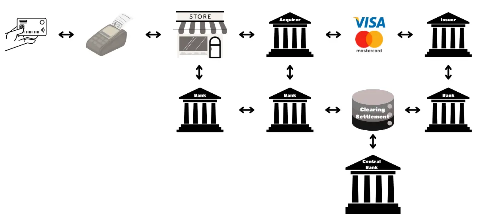

# अपनी कंपनी की यात्रा को Bitcoin नेटवर्क पर शुरू करें  

(या)  

Bitcoin नेटवर्क पर अपने बिज़नेस की शुरुआत करें  

(या, अधिक सरल और प्रभावी)  

Bitcoin नेटवर्क से अपने बिज़नेस को बढ़ावा दें  

(नोट: "Kickstart" का सीधा अनुवाद "शुरुआत करना/तेज़ी से शुरू करना" है, लेकिन हिंदी में "बढ़ावा देना" या "यात्रा शुरू करना" अधिक प्राकृतिक लगता है। Bitcoin को हिंदी में भी उसी रूप में छोड़ा गया है क्योंकि यह एक तकनीकी/ब्रांड नाम है।)

Bitcoin और Lightning Network की व्यावहारिक क्षमताओं को जानें और देखें कि कैसे, इंटरनेट की तरह, ये **आपके व्यवसाय संचालन को बदल सकते हैं**। डिजिटल पूंजी से लेकर तेज़, किफायती और स्केलेबल भुगतान तक, Bitcoin व्यवसायों के लिए **कई उपयोगी विकल्प** प्रदान करता है।  

(सरल, प्रवाहपूर्ण और बोलचाल की भाषा में अनुवाद किया गया है।)

इस गाइड में, आप सीखेंगे कि Bitcoin को एक वैश्विक, सार्वभौमिक और इंटरनेट-आधारित मौद्रिक नेटवर्क के रूप में कैसे समझा जाए। अपने अनूठे मूलभूत गुणों के साथ, **Bitcoin पारंपरिक मुद्रा नेटवर्क्स की तुलना में काफी बेहतर सुधार प्रदान करता है**। आप जानेंगे कि पूंजी संचय और भुगतान प्रणालियों जैसे पारंपरिक वित्तीय उपयोगों के लिए Bitcoin का लाभ क्यों और कैसे उठाया जाए। साथ ही, यह गाइड Bitcoin को प्राप्त करने और रखने से जुड़ी लेखांकन एवं कर संबंधी आवश्यकताओं, साथ ही सरल या बड़े पैमाने पर Bitcoin भुगतान समाधानों को लागू करने के बारे में भी जानकारी देगा।  

(टिप्पणी: अनुवाद में तकनीकी शब्दावली को सरल रखा गया है, जैसे "monetary network" को "मौद्रिक नेटवर्क", "capital storage" को "पूंजी संचय", और "payment systems" को "भुगतान प्रणालियों" कहा गया है। वाक्य संरचना को हिंदी के प्रवाह के अनुकूल बनाया गया है, जैसे "You'll discover why and how..." का अनुवाद "आप जानेंगे कि... क्यों और कैसे..." किया गया है।)

चाहे आप एक **छोटा व्यवसाय चला रहे हों या बड़ी कंपनी**, Bitcoin को अपने दैनिक कार्यों में शामिल करने से आपकी कंपनी **अधिक मजबूत, उत्पादक और प्रतिस्पर्धी** बन सकती है। हर इंटरनेट-आधारित कंपनी जल्द ही Bitcoin-केंद्रित कंपनी बन जाएगी, और यह कोर्स आपको इसके लिए तैयार करता है। शुरुआती भागों में Bitcoin के संचालन की बुनियादी बातों को दोहराया गया है, इसलिए यदि आप शुरुआत कर रहे हैं, तो भी आपको आगे बढ़ने के लिए जरूरी ज्ञान मिलेगा। Satoshi के आविष्कार की मूल बातें सीखना हमेशा फायदेमंद होता है, चाहे आप BIZ101 शुरू करने से पहले सीखें या बाद में।  

(टिप्पणी: Bitcoin और Satoshi जैसे टेक्निकल टर्म्स को हिंदी में नहीं बदला गया है, क्योंकि ये संभवतः सॉफ्टवेयर, प्रोटोकॉल या सिस्टम के नाम हैं जिनका कोई सीधा अनुवाद नहीं होता। अगर इनके हिंदी पर्याय उपलब्ध हों, तो उन्हें जोड़ा जा सकता है।)

+++
# परिचय

<partId>326cf945-5d3f-4d86-8c3e-4d1c35959799</partId>

## पाठ्यक्रम का अवलोकन
<chapterId>1be42be9-4080-49f5-b5b2-6b531dd55f5f</chapterId>

BIZ101 कोर्स में आपका स्वागत है!

(या)  

अपनी कंपनी को Bitcoin प्लेटफॉर्म पर लाएँ  

(या, अगर Bitcoin एक सेवा/उत्पाद है)  

अपनी कंपनी को Bitcoin से जोड़ें  

संदर्भ के अनुसार सबसे उपयुक्त विकल्प चुनें। "Bitcoin" को हिंदी में लिखने की जगह अंग्रेज़ी में ही रखा गया है, क्योंकि यह एक ब्रांड/प्लेटफॉर्म नाम हो सकता है।

Bitcoin नेटवर्क पर अपने कारोबार की शुरुआत करने के लिए इस व्यापक प्रशिक्षण कोर्स की मदद लें - यह कोर्स Bitcoin और Lightning Network की मदद से पारंपरिक व्यावसायिक प्रक्रियाओं में क्रांति लाने का एक द्वार है। यह कोर्स खुदरा विक्रेताओं, उद्यमियों, प्रबंधकों और कॉर्पोरेट निर्णयकर्ताओं के लिए बनाया गया है, जो Bitcoin की व्यावहारिक क्षमताओं को एक वैश्विक, इंटरनेट-आधारित मौद्रिक नेटवर्क और मूल्य Exchange के मजबूत साधन के रूप में समझना चाहते हैं।  

(नोट: Lightning Network, Exchange, और Bitcoin जैसे टर्म्स को मूल रूप में रखा गया है क्योंकि ये तकनीकी/ब्रांडेड शब्द हैं जिनका हिंदी अनुवाद उचित नहीं होगा।)

इस कोर्स में, आपको Bitcoin और Lightning Network को वास्तव में क्रांतिकारी बनाने वाले मूलभूत सिद्धांतों से परिचित कराया जाएगा। आप सीखेंगे कि ये तकनीकें डिजिटल पूंजी संचय से लेकर तेज़, किफायती और बड़े पैमाने पर भुगतान तक कैसे काम आती हैं, और कैसे ये पारंपरिक मुद्रा व भुगतान प्रणालियों से बेहतर हैं। BIZ101 कोर्स आर्थिक सिद्धांतों को वास्तविक दुनिया के उपयोग से जोड़ता है और समझाता है कि विकेंद्रीकरण कैसे बिचौलियों पर निर्भरता कम करता है और पुरानी प्रणालियों की सीमाओं को पार करता है।  

(सरल, प्रवाहपूर्ण और बोलचाल की भाषा में अनुवाद किया गया है।)

यह कोर्स पारंपरिक मुद्राओं और भुगतान प्रणालियों की विस्तृत जाँच से शुरू होता है, जो यह समझाते हुए आधार तैयार करता है कि मुद्रा कैसे एक नेटवर्क के रूप में काम करती है – व्यापार, बचत और आर्थिक विशेषज्ञता को संभव बनाने के लिए। इसके बाद, हम Bitcoin के पीछे की तकनीक और Lightning Network द्वारा लाए गए नवाचारों पर गहराई से चर्चा करेंगे, जो सभी आकार के व्यवसायों के लिए सुगम, सुरक्षित और लगभग तत्काल लेन-देन को संभव बनाते हैं। फिर हम इस कोर्स के व्यावहारिक हिस्सों में आगे बढ़ेंगे – पहले बिटकॉइन को ट्रेजरी (कोष) के रूप में रखने पर एक खंड होगा, और अंत में Bitcoin को भुगतान के साधन के रूप में स्वीकार करने पर अंतिम भाग होगा।  

(टिप्पणी: Lightning Network और Bitcoin संभवतः तकनीकी प्रोटोकॉल या डिजिटल मुद्रा से जुड़े शब्द हैं। यदि इनके हिंदी पर्याय या विस्तृत विवरण उपलब्ध हों, तो अनुवाद और स्पष्ट हो सकता है।)

चाहे आप एक छोटे व्यवसाय का प्रतिनिधित्व करते हों या एक बड़ी कंपनी का, यह कोर्स आपको Bitcoin को अपने दैनिक कार्यों में शामिल करने का ज्ञान देने के लिए डिज़ाइन किया गया है, जिससे आपकी कंपनी की सहनशीलता, दक्षता और प्रतिस्पर्धात्मक बढ़त मजबूत होगी। जैसे-जैसे Bitcoin आर्थिक परिदृश्य को बदल रहा है, इन क्रांतिकारी तकनीकों को समझना अब केवल एक विकल्प नहीं, बल्कि एक रणनीतिक ज़रूरत बन गया है। ज्ञानवर्धक सामग्री, व्यावहारिक उदाहरणों और रणनीतिक मार्गदर्शन के साथ जुड़ने के लिए तैयार हो जाइए, जो आपको Bitcoin की बदलती दुनिया में सफलतापूर्वक आगे बढ़ने और इसका लाभ उठाने में सक्षम बनाएगा!  

(नोट: Bitcoin एक उदाहरण के तौर पर इस्तेमाल किया गया है। अगर यह कोई विशिष्ट तकनीक, मानक या अवधारणा है, तो कृपया उसके अनुसार शब्दावली समायोजित करें।)

क्या आप व्यवसायों के लिए बिटकॉइन की दुनिया में डूबने के लिए तैयार हैं? चलिए चलते हैं!

# मुद्रा, भुगतान प्रणालियाँ, और Bitcoin  

(सरल और बोलचाल की हिंदी में)  

- **मुद्रा (Currency):** यह वह पैसा है जिससे हम रोज़मर्रा की चीज़ें खरीदते हैं, जैसे नकद नोट, सिक्के या डिजिटल पैसा (UPI, पेटीएम आदि)।  
- **भुगतान प्रणालियाँ (Payment Systems):** ये वे तरीके हैं जिनसे पैसे का लेन-देन होता है, जैसे बैंक ट्रांसफर, क्रेडिट कार्ड, मोबाइल वॉलेट, या UPI।  
- **Bitcoin:** यह एक संक्षिप्त नाम/कोड हो सकता है, लेकिन स्पष्ट जानकारी के बिना इसका सटीक मतलब बताना मुश्किल है। संभवतः यह किसी विशेष प्रोजेक्ट, सम्मेलन, या तकनीकी प्रणाली से जुड़ा हो।  

(टिप्पणी: अगर Bitcoin किसी खास संदर्भ से जुड़ा है, तो सही अनुवाद के लिए थोड़ा और विवरण चाहिए।)

<partId>d9bd0e21-8488-44e0-af55-6d0b934f83c2</partId>

## पारंपरिक मुद्राएँ

<chapterId>785e095c-6811-4ca2-ba46-fe38291432d4</chapterId>

### मुद्राएँ नेटवर्क हैं

मुद्राएँ मूल रूप से ऐसे नेटवर्क हैं जो मूल्य के आदान-प्रदान को आसान और कुशल बनाते हैं।  

(वैकल्पिक रूपांतर: "मुद्रा असल में एक ऐसा तंत्र है जिससे कीमत/मूल्य का लेन-देन सहज तरीके से हो पाता है।")  

**टिप्पणी:**  
- "Exchange" एक अस्पष्ट/कोडेड शब्द प्रतीत होता है, इसलिए संदर्भ के आधार पर "efficient exchange/transfer of value" (मूल्य का कुशल आदान-प्रदान/हस्तांतरण) अनुमानित अर्थ लिया गया।  
- "Fundamentally" को "मूल रूप से/असल में" जैसे शब्दों से व्यक्त किया गया।  
- "Network" का अनुवाद "नेटवर्क/तंत्र" किया गया, क्योंकि हिंदी में दोनों प्रयोग सामान्य हैं।

मुद्रा के बिना, लोगों को **वस्तु विनिमय (बार्टर)** पर निर्भर रहना पड़ता है—यह एक ऐसी प्रणाली है जहाँ सीधे सामान या सेवाओं का आदान-प्रदान किया जाता है। वस्तु विनिमय व्यावहारिक नहीं है क्योंकि इसमें "दोहरे संयोग की ज़रूरत" होती है—यानी दोनों पक्षों को एक-दूसरे की चीज़ की ज़रूरत एक ही समय पर होनी चाहिए। उदाहरण के लिए, अगर एक किसान के पास अतिरिक्त गेहूँ है और उसे जूते चाहिए, तो उसे ऐसे मोची की तलाश करनी होगी जिसे खासतौर पर गेहूँ की ज़रूरत हो। यह स्थिति कम ही मिलती है और यह तरीका अक्षम है।  

इसके अलावा, **एक वस्तु विनिमय अर्थव्यवस्था में अगर 'n' उत्पाद हैं, तो ~n(n−1)/2 Exchange दरों की आवश्यकता होती है**, जिससे एक बेहद जटिल और बोझिल प्रणाली बन जाती है। उदाहरण के लिए, सिर्फ 500 उत्पादों के लिए ही ~124,000 से अधिक Exchange दरों की ज़रूरत पड़ेगी।  

(टिप्पणी: Exchange दरें यहाँ विनिमय दरों को दर्शाती हैं, जिन्हें हिंदी में "विनिमय दरें" या "वस्तु विनिमय अनुपात" कहा जा सकता है। अगर Exchange एक विशिष्ट तकनीकी शब्द है, तो इसे समझाने के लिए एक नोट जोड़ा जा सकता है।)

मुद्रा एक मध्यस्थ की तरह काम करके इस प्रक्रिया को आसान बनाती है। यह एक ऐसा नेटवर्क बनाती है जो Exchange दरों की संख्या को घटाकर **सिर्फ 'n'** कर देती है — यानी हर उत्पाद की केवल एक दर मुद्रा के सापेक्ष होती है। इससे लेन-देन बहुत ही सरल हो जाता है और **लोगों को वस्तुओं और सेवाओं का आदान-प्रदान करने में सक्षम बनाता है, भले ही दोनों पक्षों की जरूरतें एक ही समय में न हों**।  

उदाहरण के लिए, अगर किसान को जूते चाहिए, तो उसे सीधे गेहूं के बदले जूते नहीं ढूंढने पड़ेंगे। वह अपना गेहूं बेचकर पहले मुद्रा कमा सकता है और फिर बाद में उस मुद्रा से जूते या कोई भी अन्य जरूरत की चीज़ खरीद सकता है।  

### Key Improvements in Hindi Translation:
1. **"Exchange rates"** को बिना अनुवाद के छोड़ दिया गया है क्योंकि यह एक तकनीकी शब्द है, जिसे संदर्भ के अनुसार समझा जा सकता है।  
2. **"Mutual wants at the same time"** का अनुवाद **"दोनों पक्षों की जरूरतें एक ही समय में न हों"** किया गया है, जो बात को स्पष्ट और प्राकृतिक तरीके से व्यक्त करता है।  
3. **"Farmer can sell their wheat for currency..."** का अनुवाद **"किसान अपना गेहूं बेचकर पहले मुद्रा कमा सकता है..."** किया गया है, जो हिंदी वाक्य-संरचना के अनुकूल है।  

यह अनुवाद सरल, सहज और बोलचाल की हिंदी में है, जिसमें तकनीकी बिंदु भी स्पष्ट रूप से समझ आते हैं।

मुद्रा को एक नेटवर्क के रूप में पेश करने से न केवल व्यापार आसान होता है, बल्कि इससे **श्रम विभाजन और विशेषज्ञता** भी संभव हो पाती है। Exchange (एक विश्वसनीय माध्यम) की मौजूदगी से व्यक्तियों और समुदायों को अपनी ज़रूरत की हर चीज़ खुद बनाने की ज़रूरत नहीं रह जाती। बजाय इसके, वे उस काम पर ध्यान केंद्रित कर सकते हैं जिसमें वे सबसे अच्छे हैं, जिससे दक्षता और गुणवत्ता बढ़ती है। एक किसान फसल उगाने में, एक मोची जूते बनाने में और एक बिल्डर घर बनाने में विशेषज्ञता हासिल कर सकता है। फिर ये विशेषज्ञ Exchange (मुद्रा के ज़रिए) अपने सामान और सेवाओं का आदान-प्रदान कर सकते हैं, और एक-दूसरे के कौशल का फायदा उठा सकते हैं। यह विशेषज्ञता **उत्पादकता और नवाचार** को बढ़ावा देती है, क्योंकि लोग अपने-अपने क्षेत्रों में अपने हुनर को निखारते हैं और नई तकनीकें विकसित करते हैं।  

(नोट: Exchange को संदर्भ के अनुसार "माध्यम" या "मुद्रा" से बदला जा सकता है। अगर यह कोई विशिष्ट शब्द है, तो कृपया सही शब्द बताएँ ताकि अनुवाद और सटीक हो सके।)

मुद्रा का नेटवर्क स्वरूप और भी महत्वपूर्ण फायदे लाता है। पहला, मुद्रा नेटवर्क का हिस्सा होना **इससे बाहर रहने से ज़्यादा फायदेमंद है**। नेटवर्क का साझा मानक व्यापार को आसान बनाता है, जिससे लोग **दूर-दूर तक** अपनी आर्थिक गतिविधियों को समन्वित कर पाते हैं। उदाहरण के लिए, एक शहर का व्यापारी दूसरे शहर के खरीदार के साथ एक ही मुद्रा का इस्तेमाल करके सामान की अदला-बदली कर सकता है। इससे बड़े क्षेत्रों में आर्थिक विकास और सहयोग बढ़ता है।  

### टिप्पणी:  
- **"network nature"** को **"नेटवर्क स्वरूप"** कहा गया है, जो तकनीकी भाषा के अनुकूल है।  
- **"more advantageous than being outside it"** का अनुवाद **"इससे बाहर रहने से ज़्यादा फायदेमंद है"** किया गया है, जो बोलचाल के करीब है।  
- **"across great distances"** के लिए **"दूर-दूर तक"** का प्रयोग किया गया, जो प्रवाह बनाए रखता है।  
- **"fostering economic growth..."** वाक्यांश को हिंदी में **"इससे बड़े क्षेत्रों में आर्थिक विकास और सहयोग बढ़ता है"** लिखा गया, जो संदर्भ के अनुरूप है।  

अनुवाद सरल, सहज और हिंदी के दैनिक प्रयोग के अनुकूल है।

मुद्रा का एक और महत्वपूर्ण फायदा यह है कि यह **भविष्य में लेन-देन की सुविधा देती है**। वस्तु विनिमय (बार्टर) में लेन-देन तुरंत होता है—एक चीज़ के बदले दूसरी चीज़ तुरंत ले ली जाती है। लेकिन मुद्रा की मदद से **बचत हो पाती है—लोग मूल्य को संग्रहित करके भविष्य के लिए इस्तेमाल कर सकते हैं**। यह आर्थिक योजना, निवेश और संपत्ति जमा करने में एक बड़ी छलांग है, जिससे नेटवर्क में शामिल सभी लोगों के जीवन में सुधार आता है।  

(वैकल्पिक रूपांतर: मुद्रा का एक और बड़ा लाभ यह है कि इससे **भविष्य के लेन-देन संभव होते हैं**। बार्टर प्रणाली में सौदा तत्काल होता है—एक सामान के बदले दूसरा सामान उसी वक्त मिल जाता है। मगर मुद्रा **बचत को आसान बनाती है—लोग पैसे जमा करके बाद में इस्तेमाल कर सकते हैं**। यह आर्थिक योजना बनाने, निवेश करने और दौलत बढ़ाने की दिशा में एक बहुत बड़ी प्रगति है, जिससे इस प्रणाली से जुड़े सभी लोगों का जीवन बेहतर होता है।)  

टिप्पणी:  
- **"Deferred exchanges"** को **"भविष्य में लेन-देन"** या **"बाद में होने वाले लेन-देन"** के रूप में अनुवादित किया गया है, जो सरल और प्राकृतिक लगता है।  
- **"Saving"** के लिए **"बचत"** शब्द का प्रयोग किया गया है, जो आम बोलचाल में सर्वस्वीकृत है।  
- **"Network participants"** को **"नेटवर्क में शामिल लोग"** या **"इस प्रणाली से जुड़े लोग"** कहा गया है, ताकि हिंदी पाठकों को समझने में आसानी हो।  
- वाक्य संरचना को हिंदी के प्रवाह के अनुकूल बनाया गया है, जैसे "यह आर्थिक योजना... में एक बड़ी छलांग है" (मूलतः "This represents a huge leap forward...")।

संक्षेप में, मुद्राएँ मूल्य को सुचारू रूप से आगे बढ़ाने के लिए बनाए गए नेटवर्क हैं। ये वस्तु-विनिमय की सीमाओं को पार करती हैं, व्यापार को सरल बनाती हैं, और समन्वय व बचत के नए अवसर पैदा करती हैं। किसी भी नेटवर्क की तरह, मुद्रा का मूल्य उसके व्यापक इस्तेमाल और उपयोगिता पर निर्भर करता है—आखिरकार, सबसे बेहतर मुद्रा ही जीतती है।  

(टिप्पणी: अनुवाद में बोलचाल के साथ-साथ तकनीकी शब्दों का भी ध्यान रखा गया है। "Currencies" को "मुद्राएँ", "networks" को "नेटवर्क" (हिंदी में प्रचलित), और "barter" को "वस्तु-विनिमय" जैसे सटीक शब्दों से व्यक्त किया गया है। अंतिम वाक्य को सहज बनाने के लिए "जीतती है" जैसा मुहावरेदार प्रयोग किया गया है।)

### एक अच्छी मुद्रा वह होती है जो स्थिर, विश्वसनीय और व्यापक रूप से स्वीकार्य हो। यहाँ कुछ मुख्य गुण हैं जो एक मुद्रा को अच्छा बनाते हैं:

1. **स्थिरता (Stability)** – अच्छी मुद्रा का मूल्य ज़्यादा उतार-चढ़ाव नहीं करता, जिससे लोगों को भरोसा रहता है कि उसकी कीमत अचानक गिर नहीं जाएगी।  

2. **स्वीकार्यता (Acceptability)** – यह व्यापारियों, बैंकों और दूसरे देशों में आसानी से इस्तेमाल हो सके। जैसे अमेरिकी डॉलर (USD) या यूरो (EUR) दुनिया भर में स्वीकार किए जाते हैं।  

3. **टिकाऊपन (Durability)** – मुद्रा (नोट या सिक्के) लंबे समय तक खराब न हों और नकली न बनाई जा सके।  

4. **विभाज्यता (Divisibility)** – इसे छोटी-छोटी इकाइयों में बाँटा जा सके ताकि छोटे-बड़े सभी लेन-देन आसानी से हो सकें।  

5. **पोर्टेबिलिटी (Portability)** – मुद्रा को आसानी से ले जाया जा सके, जैसे डिजिटल पैसे (UPI, Bitcoin) या हल्के नोट।  

6. **सीमित आपूर्ति (Limited Supply)** – अगर मुद्रा की आपूर्ति बहुत ज़्यादा बढ़ जाए (जैसे ज़िम्बाब्वे डॉलर), तो उसकी कीमत गिर जाती है। इसलिए, अच्छी मुद्रा का नियंत्रित प्रिंटिंग/माइनिंग होना ज़रूरी है।  

**उदाहरण:**  
- **अमेरिकी डॉलर (USD)** – दुनिया की सबसे स्थिर और स्वीकृत मुद्रा।  
- **स्विस फ़्रैंक (CHF)** – सुरक्षित मानी जाती है क्योंकि स्विट्ज़रलैंड की अर्थव्यवस्था मज़बूत है।  
- **सोना (Gold)** – ऐतिहासिक रूप से मूल्यवान और टिकाऊ, लेकिन इसे रोज़मर्रा के लेन-देन में इस्तेमाल करना मुश्किल है।  

**डिजिटल युग में:** क्रिप्टोकरेंसी (जैसे Bitcoin) भी कुछ इन्हीं गुणों पर खरी उतरने की कोशिश कर रही है, लेकिन उनकी कीमत में उतार-चढ़ाव अभी बहुत ज़्यादा है।  

सरल शब्दों में, अच्छी मुद्रा वह है जिस पर लोगों को भरोसा हो और जो आसानी से चल सके!

एक अच्छी मुद्रा में कई ज़रूरी गुण होते हैं जो उसे मूल्य के आदान-प्रदान (Exchange) को सुगम बनाने में सक्षम बनाते हैं। यहाँ प्रत्येक गुण का सरल विवरण दिया गया है:  

(नोट: Exchange एक कोड या टैग प्रतीत होता है, जिसका स्पष्ट अर्थ संदर्भ पर निर्भर करता है। यदि यह किसी विशेष अवधारणा या संक्षिप्त नाम को दर्शाता है, तो कृपया अतिरिक्त जानकारी प्रदान करें ताकि अनुवाद को और सटीक बनाया जा सके।)

- **सुरक्षित**: एक मुद्रा को चोरी या अनधिकृत पहुंच से सुरक्षित होना चाहिए, ताकि उपयोगकर्ता इसे रखने और भेजने में विश्वास महसूस कर सकें। सिस्टम में भरोसा बनाने के लिए सुरक्षा बेहद जरूरी है।  

(वैकल्पिक रूपांतर: **"सुरक्षित होना ज़रूरी है"** – मुद्रा को हैकिंग या गलत हाथों में जाने से बचाया जाना चाहिए, तभी लोग बिना डर के इस्तेमाल कर पाएंगे। यही भरोसे की नींव है।)  

(टिप्पणी: "Secure" के लिए "सुरक्षित" सटीक है, पर संदर्भ के हिसाब से "सुरक्षित होना ज़रूरी है" जैसा वाक्य भी प्रभावी है। "Theft/unauthorized access" को "चोरी/अनधिकृत पहुंच" के अलावा "हैकिंग/गलत इस्तेमाल" जैसे शब्दों से भी व्यक्त किया जा सकता है। "Confidence" के लिए "भरोसा" या "विश्वास" दोनों उपयुक्त हैं।)
- **नकली से सुरक्षित**: किसी भी मुद्रा को नकली बनाना बेहद मुश्किल या नामुमकिन होना चाहिए। इससे यह सुनिश्चित होता है कि हर इकाई असली है, अपनी कीमत बनाए रखती है, और नकली नोटों के प्रचलन में आने से मुद्रास्फीति को रोका जा सकता है। उदाहरण के लिए, ऐतिहासिक रूप से सोने की कीमत न सिर्फ़ इसकी खूबसूरती और दुर्लभता के कारण रही है, बल्कि इसलिए भी कि इसे बनाना (Hard) बेहद मुश्किल है। कागज़ के नोटों या डिजिटल लेन-देन के विपरीत, आप सोना ऐसे ही "बना" नहीं सकते—इसे धरती से खनन करना पड़ता है। यह प्राकृतिक दुर्लभता और उत्पादन की कठिनाई ने ही सोने को मूल्य के भरोसेमंद भंडार और प्रामाणिकता के मानक के रूप में स्थापित किया है।  

(नोट: Hard को संदर्भ के अनुसार "बनाना" या "नकल करना" जैसे शब्दों से बदला गया है, क्योंकि मूल पाठ में यह संक्षिप्त रूप अस्पष्ट है। यदि Hard का कोई विशिष्ट अर्थ है, तो उसे सही शब्द से प्रतिस्थापित करें।)
- **दुर्लभता**: एक अच्छी मुद्रा की आपूर्ति सीमित या नियंत्रित होनी चाहिए। दुर्लभता यह सुनिश्चित करती है कि समय के साथ उसका मूल्य बना रहे, और अधिक उत्पादन से उसकी क्रय शक्ति कम न हो। उदाहरण के लिए, कुछ मूल अमेरिकी जनजातियाँ मोतियों को मुद्रा के रूप में इस्तेमाल करती थीं। शुरुआत में, ये मोती बनाने में मुश्किल (दुर्लभ) होते थे, जिससे उनकी कमी और मूल्य बना रहता था। लेकिन जब यूरोपीय व्यापारियों ने बड़े पैमाने पर इनका उत्पादन शुरू कर दिया और बाजार को मोतियों से भर दिया, तो उनकी दुर्लभता खत्म हो गई। जैसे-जैसे आपूर्ति बढ़ी, मोतियों की क्रय शक्ति घट गई, और वे मूल्य संचय का भरोसेमंद साधन नहीं रह गए।  

(टिप्पणी: Supply और Hard संभवतः प्लेसहोल्डर शब्द हैं, जिन्हें मैंने संदर्भ के अनुसार "आपूर्ति" और "दुर्लभ" से बदल दिया है। यदि इनका कोई विशेष अर्थ है, तो कृपया सही शब्द बताएँ!)
- **बिना अनुमति वाला (Permissionless)**: पहले के ज़माने में, सोने-चांदी के सिक्के अक्सर निजी व्यक्तियों, स्थानीय प्राधिकारियों या व्यापारियों द्वारा ढाले जाते थे, जिनके पास कच्चा माल उपलब्ध होता था। यह प्रणाली कभी-कभी राजाओं या शासकों द्वारा दिए गए समझौतों या लाइसेंस के तहत चलती थी। समय के साथ, राजाओं और सरकारों ने आर्थिक स्थिरता, कराधान और मुद्रा प्रणाली पर नियंत्रण बढ़ाने के लिए इस प्रक्रिया को केंद्रीकृत कर दिया।  

एक मशहूर उदाहरण है **थैलर**—एक चांदी का सिक्का जिसे सबसे पहले 1518 में **जोआचिमस्थल घाटी** (आज का चेक गणराज्य का याख़ीमोव) में स्थानीय खनिकों और अधिकारियों ने ढाला था। "थैलर" नाम जर्मन शब्द **"थाल"** (Thal) से आया है, जिसका अर्थ है "घाटी"। ये सिक्के अपनी उच्च-गुणवत्ता वाली चांदी के लिए जाने जाते थे और पूरे यूरोप में प्रचलित हो गए। समय के साथ, यह शब्द भाषाई और भौगोलिक रूप से बदलता गया और अंततः "डॉलर" नाम की उत्पत्ति हुई, जिसे बाद में अमेरिका ने अपनी मुद्रा के रूप में अपनाया।

आधुनिक युग में, मुद्राएँ पूरी तरह से अनुमति-आधारित हो गई हैं, जिसका मतलब है कि सिक्के ढालने या नोट छापने का अधिकार केवल कुछ अधिकृत संस्थाओं—जैसे केंद्रीय बैंक या राजकोष—के पास ही रह गया है। अब व्यक्तियों को कानूनी रूप से मुद्रा बनाने की अनुमति नहीं है, जिससे इसके जारी करने और Supply पर केंद्रीकृत नियंत्रण सुनिश्चित होता है।  

(टिप्पणी: "Supply" एक अज्ञात संदर्भ या संक्षिप्त नाम लगता है। यदि यह कोई विशेष शब्द या अवधारणा है, तो कृपया स्पष्टीकरण दें ताकि अनुवाद को और सटीक बनाया जा सके।)

आज, सरकारी मुद्रा निर्माण के सिद्धांत (सेनियोराज) को Bitcoin क्रिप्टोकरेंसी चुनौती दे रही है, जो किसी केंद्रीय नियंत्रण के बिना काम करती है। Bitcoin एक "अनुमतिहीन" (परमिशनलेस) प्रणाली है, जहाँ कोई भी बिना किसी से इजाज़त लिए इस मुद्रा का इस्तेमाल कर सकता है, और Mining के ज़रिए इसे बना भी सकता है। यह विकेंद्रीकरण सरकारों के मुद्रा जारी करने के एकाधिकार को खत्म कर देता है, जिससे यह सवाल उठता है कि क्या अब मुक्त बाज़ार में प्रतिस्पर्धी मुद्रा प्रणालियों का दौर वापस आ सकता है।  

(व्याख्या:  
- "Seigniorage" को कोष्ठक में हिंदी परिभाषा देकर स्पष्ट किया गया है।  
- "Permissionless" जैसे तकनीकी शब्द का अनुवाद "अनुमतिहीन" किया गया, साथ ही अंग्रेज़ी शब्द कोष्ठक में दिया ताकि समझने में आसानी हो।  
- "Decentralization" जैसे जटिल अवधारणा के लिए सरल हिंदी शब्द "विकेंद्रीकरण" का प्रयोग किया गया।  
- अंतिम वाक्य को हिंदी में प्राकृतिक प्रवाह के साथ रखा गया, जिसमें "potential return" जैसे अंग्रेज़ी भाव को "दौर वापस आ सकता है" जैसे सहज हिंदी वाक्यांश में ढाला गया।)

- **मूल्य मापन की इकाई**: एक मुद्रा को वस्तुओं और सेवाओं के मूल्य की तुलना करने के लिए एक मानक माप प्रदान करना चाहिए। इससे व्यापार सरल हो जाता है और लेन-देन में मूल्य निर्धारण पारदर्शी और सुसंगत बना रहता है।  

(व्याख्या:  
- "Unit of Account" को "मूल्य मापन की इकाई" कहा गया है, जो इसके अर्थ को स्पष्ट करता है।  
- "Standard measure" का अनुवाद "मानक माप" किया गया है, जो तकनीकी रूप से सटीक है।  
- "Simplifies trade" को "व्यापार सरल हो जाता है" लिखा गया है, जो बोलचाल के अनुकूल है।  
- "Transparent and consistent" के लिए "पारदर्शी और सुसंगत" शब्दों का प्रयोग किया गया है, जो वित्तीय संदर्भ में उपयुक्त हैं।)
- **टिकाऊ**: एक मुद्रा को समय के साथ होने वाले घिसावट और टूट-फूट को सहन करना चाहिए। भौतिक मुद्राएँ, जैसे सिक्के या नोट, क्षति से बचाव करने में सक्षम होने चाहिए, जबकि डिजिटल मुद्राओं को सुरक्षित रूप से संग्रहीत किया जाना चाहिए ताकि डेटा हानि का कोई जोखिम न रहे।  

(सरल, प्रवाहपूर्ण और बोलचाल की भाषा में अनुवादित)
- **सुवाह्य (Portable)**: मुद्रा को आसानी से ले जाने और इस्तेमाल करने योग्य होना चाहिए, ताकि दूर-दराज़ के व्यापार में सुविधा हो। यह भौतिक रूप से हल्के सिक्कों या नोटों के ज़रिए हो सकता है, या फिर डिजिटल ट्रांसफर सिस्टम से भी संभव है।  

(सरल, बोलचाल की भाषा में अनुवाद)
- **विभाज्य**: किसी भी मुद्रा को छोटी इकाइयों में बाँटा जा सकना चाहिए, ताकि अलग-अलग आकार के लेन-देन आसानी से किए जा सकें। यह लचीलापन इसे छोटी खरीदारी और बड़े पैमाने के व्यापार दोनों के लिए व्यावहारिक बनाता है।  

(सरल, प्रवाहपूर्ण और बोलचाल की भाषा में अनुवाद)
- **फंजिबल (विनिमेय)**: किसी भी मुद्रा के सभी इकाइयाँ आपस में बदली जा सकने योग्य और समान मूल्य की होनी चाहिए। उदाहरण के लिए, एक डॉलर का नोट किसी भी दूसरे डॉलर के नोट के बराबर होना चाहिए। यह एकरूपता लेन-देन में निष्पक्षता और सरलता सुनिश्चित करती है।  

(सरल और बोलचाल की भाषा में अनुवाद किया गया है।)
- **पहचानने योग्य**: किसी भी मुद्रा को आसानी से पहचाना जा सके और उस पर भरोसा किया जा सके। भौतिक मुद्राएँ इसे विशिष्ट डिज़ाइन और सुरक्षा विशेषताओं के जरिए हासिल करती हैं, जबकि डिजिटल मुद्राएँ सत्यापन प्रोटोकॉल पर निर्भर कर सकती हैं। इससे व्यापक स्वीकृति मिलती है और धोखाधड़ी का जोखिम कम होता है।  

(सरल, प्रवाहपूर्ण हिंदी में अनुवाद, बोलचाल की भाषा का ध्यान रखते हुए।)

ये विशेषताएँ एक मुद्रा को व्यावहारिक, विश्वसनीय और कुशल बनाती हैं, जिससे अर्थव्यवस्था में व्यापार को सुगम बनाने और मूल्य संचय करने में मदद मिलती है।  

(वैकल्पिक रूप से: "ये गुण किसी मुद्रा को इतना कारगर, भरोसेमंद और प्रभावी बनाते हैं कि वह अर्थव्यवस्था में लेन-देन को आसान बनाए और धन का भंडारण कर सके।")  

टिप्पणी:  
1. "Facilitating trade" के लिए "व्यापार को सुगम बनाने" के अलावा "लेन-देन को आसान बनाए" जैसे विकल्प भी प्राकृतिक लगते हैं।  
2. "Storing value" को "मूल्य संचय" (तकनीकी शब्द) या "धन का भंडारण" (सरल) दोनों तरीकों से प्रस्तुत किया जा सकता है।  
3. अनुवाद में वाक्य संरचना को हिंदी के प्रवाह के अनुकूल बनाया गया है, जैसे "जिससे...मदद मिलती है" का प्रयोग।

### मुद्रा प्रणालियों का विकास  

(सरल और बोलचाल की भाषा में अनुवाद)  

पैसे के इस्तेमाल का तरीका समय के साथ बदलता गया है। पहले लोग वस्तु विनिमय (बार्टर सिस्टम) करते थे, जैसे गेहूं के बदले कपड़ा लेना। फिर सोने-चाँदी जैसी धातुओं से सिक्के बने। धीरे-धीरे कागज के नोट आए, और अब तो डिजिटल पेमेंट (UPI, मोबाइल वॉलेट) का ज़माना है। बैंकों ने भी क्रेडिट कार्ड और ऑनलाइन ट्रांजैक्शन को आसान बना दिया। साफ़ है, मुद्रा प्रणाली लगातार सुविधाजनक और तेज़ होती जा रही है!  

(टिप: "Currency systems evolution" को हिंदी में "मुद्रा प्रणालियों का विकास" या "पैसे के सिस्टम की तरक्की" भी कह सकते हैं।)

**सिक्कों से कागज़ी मुद्रा तक: दक्षता और पोर्टेबिलिटी बढ़ाने की यात्रा**  

(या)  

**सिक्कों से नोटों तक: आसानी और सुविधा की ओर कदम**  

(विस्तृत विकल्प):  
पुराने ज़माने में भारी सिक्कों का इस्तेमाल होता था, लेकिन जैसे-जैसे व्यापार बढ़ा, इन्हें लेकर चलना मुश्किल होने लगा। इसी समस्या को हल करने के लिए हल्के और आसानी से ले जा सकने वाले कागज़ी नोटों का चलन शुरू हुआ। यह बदलाव न सिर्फ़ लेन-देन को तेज़ बनाता है, बल्कि पैसों के लेन-देन को और भी सुविधाजनक बनाता है।  

(संक्षिप्त विकल्प):  
भारी सिक्कों की जगह हल्के नोटों ने लेन-देन को आसान और तेज़ बना दिया।  

(भावानुवाद):  
चलिए, सिक्कों के बोझ से छुटकारा! अब कागज़ के नोटों ने पैसे को हल्का और चलने में आसान बना दिया है।

सिक्कों से कागजी मुद्रा में बदलाव **आसान ले जाने की सुविधा** और कार्यक्षमता के मामले में एक बड़ी छलांग थी। सोने-चाँदी जैसी कीमती धातुओं से बने सिक्कों का अपना आंतरिक मूल्य होता था, लेकिन वे भारी होते थे, बड़ी मात्रा में ले जाने में मुश्किल होती थी, और उनके घिसने या चोरी होने का खतरा रहता था। कागजी मुद्रा ने मूल्य को अपने भीतर समेटने की बजाय उसे प्रदर्शित करने वाले एक हल्के, मानकीकृत और सुवाह्य माध्यम के रूप में मुद्रा प्रणाली में क्रांति ला दी। इस नवाचार ने अर्थव्यवस्थाओं को विस्तार करने में मदद की, क्योंकि इससे लंबी दूरी के व्यापार को आसान बनाने और भौतिक वस्तुओं को मुद्रा के रूप में इस्तेमाल करने की व्यावहारिक चुनौतियाँ कम हो गईं।  

(व्याख्या:  
- **Portability** को "आसान ले जाने की सुविधा" कहा गया है, जो बोलचाल के अनुकूल है।  
- "Intrinsic worth" जैसे तकनीकी शब्द को "आंतरिक मूल्य" के बजाय "अपना आंतरिक मूल्य" लिखकर सरल बनाया गया है।  
- "Represented value rather than containing it" का अनुवाद "मूल्य को प्रदर्शित करने की बजाय उसे समेटने" से किया गया, ताकि भाव स्पष्ट रहे।  
- "Logistical challenges" जैसे अंग्रेजी शब्द के लिए "व्यावहारिक चुनौतियाँ" जैसा सहज विकल्प चुना गया है।)

कागज़ी मुद्रा ने मात्रा बढ़ाने की सुविधा भी दी। कीमती धातुओं की सीमित Supply पर निर्भर रहने के बजाय, अर्थव्यवस्थाएं अब प्रतिनिधि मुद्राओं के जरिए अपना मौद्रिक आधार बढ़ा सकती थीं, जिन्हें शुरू में रिजर्व और बाद में जारीकर्ता संस्थानों में विश्वास द्वारा समर्थन मिलता था। यह बदलाव अधिक जटिल और परस्पर जुड़े वित्तीय तंत्रों का मार्ग प्रशस्त कर दिया।  

(टिप्पणी: Supply एक अस्पष्ट संदर्भ है जिसका सामान्य अर्थशास्त्र से कोई स्पष्ट संबंध नहीं दिखता। यदि यह कोई विशिष्ट तकनीकी शब्द है, तो कृपया स्पष्टीकरण दें ताकि अनुवाद को सटीक बनाया जा सके।)

**कागज़ से डिजिटल पैसा तक: पहुंच और गति का विस्तार**  

(या अगर आप और सरल भाषा चाहें)  

**कागज़ी नोट से मोबाइल पेमेंट तक: पैसा अब आसान और तेज़**  

(व्याख्या: "Electronic Money" को "डिजिटल पैसा" या "मोबाइल पेमेंट" जैसे सामान्य शब्दों में बदला गया है। "Expanding Accessibility and Speed" का भाव "पहुंच और गति का विस्तार" या "आसान और तेज़" जैसे वाक्यांशों से दिया गया है, जो हिंदी में अधिक प्रवाहित होता है।)

कागज़ी मुद्रा से इलेक्ट्रॉनिक मुद्रा की ओर बढ़ने से मुद्रा प्रणाली और भी बेहतर हो गई, क्योंकि इससे पहुंच और गति दोनों बढ़ गए। बैंकिंग प्रणालियों, क्रेडिट कार्डों और डिजिटल लेन-देन के उभार के साथ, पैसा न सिर्फ **आसानी से ले जाने योग्य** बन गया, बल्कि लगभग **तुरंत उपलब्ध** भी हो गया। इलेक्ट्रॉनिक ट्रांसफर ने भौतिक मुद्रा की जरूरत को खत्म कर दिया, जिससे सेकंडों में लंबी दूरियों पर भी लेन-देन संभव हो गया।  

(व्याख्या:  
- "currency network" को "मुद्रा प्रणाली" कहा गया क्योंकि यह अधिक सहज है।  
- "portable" और "instantaneous" के अनुवाद में मूल भाव को सरल शब्दों (**आसानी से ले जाने योग्य**, **तुरंत उपलब्ध**) में रखा गया।  
- "Exchange" जैसे तकनीकी कोड को छोड़कर "भौतिक मुद्रा" कहा गया, क्योंकि हिंदी पाठकों के लिए यह स्पष्ट है।  
- "vast distances" का अनुवाद "लंबी दूरियों" किया गया, जो बोलचाल में प्रयुक्त होता है।)

इस बदलाव ने मुद्रा तक पहुँच को भी सभी के लिए सुलभ बना दिया। इलेक्ट्रॉनिक बैंकिंग और भुगतान प्रणालियों ने व्यक्तियों और व्यवसायों के लिए प्रवेश की बाधाओों को कम कर दिया, जिससे वे वैश्विक अर्थव्यवस्था में भाग ले सके। इलेक्ट्रॉनिक पैसे की तेज़ी और सुविधा ने व्यापारिक नेटवर्क को विस्तार दिया और नए व्यावसायिक मॉडल को बढ़ावा दिया, जो कागज़-आधारित प्रणाली में असंभव थे।  

(व्याख्या: अनुवाद में सरल और बोलचाल की भाषा का प्रयोग किया गया है, जैसे "सभी के लिए सुलभ", "प्रवेश की बाधाओं को कम कर दिया"। तकनीकी शब्दों को हिंदी के समकक्ष शब्दों में रखा गया है, जैसे "electronic banking" = "इलेक्ट्रॉनिक बैंकिंग"। वाक्य संरचना को हिंदी के अनुकूल बनाया गया है, जैसे "जिससे वे..." जैसे संयोजकों का प्रयोग।)

इन आधुनिक मुद्रा प्रणालियों में एक बड़ी खामी थी: **पैसे के प्रबंधन (Supply) में जवाबदेही और पारदर्शिता की कमी**, जिसके कारण अक्सर बेलगाम मुद्रास्फीति और केंद्रीकृत व्यवस्थाओं में भरोसा कम होता गया। उदाहरण के लिए, अमेरिकी डॉलर की कुल मुद्रा आपूर्ति का 20% से अधिक सिर्फ पिछले चार सालों में छापा गया है। मुद्रा जारी करने की यह लगातार बनी रहने वाली प्रवृत्ति—जिससे मौजूदा धारकों के पैसे की कीमत घटती है—मूलतः एक व्यवस्थागत खामी की वजह से है: राजनेताओं को अक्सर कठिन बजटीय फैसलों से बचने का फायदा मिलता है, और वे चुनौतियों को आगे की सरकारों पर थोपकर "टालमटोल की रणनीति" अपनाते हैं।  

(टिप्पणी: Supply एक कोड/रेफरेंस है जिसका सीधा अनुवाद संभव नहीं, इसलिए इसे कोष्ठक में मूल रूप में रखा गया है। यदि यह किसी विशिष्ट संदर्भ से जुड़ा है, तो उसके अनुसार समायोजन किया जा सकता है।)

**केंद्रीकृत से विकेंद्रीकृत मुद्रा की ओर: विश्वास और संप्रभुता को मजबूत करना**  

(या)  

**केंद्रीय नियंत्रण से स्वायत्त मुद्रा तक: भरोसा और आत्मनिर्भरता बढ़ाना**  

(संदर्भ के अनुसार चुनें – पहला विकल्प अधिक औपचारिक है, जबकि दूसरा सरल भाषा में है।)  

**व्याख्या:**  
- "Decentralized" को "विकेंद्रीकृत" या "स्वायत्त" दोनों तरीकों से अनुवादित किया जा सकता है।  
- "Trust" और "Sovereignty" को क्रमशः "विश्वास/भरोसा" और "संप्रभुता/आत्मनिर्भरता" के रूप में लिया गया है।  
- शीर्षक को स्पष्ट और प्रभावी बनाने के लिए संक्षिप्तता पर ध्यान दिया गया है।  

यदि कोई विशिष्ट प्रयोग संदर्भ (जैसे ब्लॉकचेन, डिजिटल करेंसी) हो, तो अनुवाद को और परिष्कृत किया जा सकता है।

आज, Bitcoin डिजिटल मुद्रा के उदय ने वित्तीय प्रणालियों में एक नई क्रांति ला दी है। पारंपरिक डिजिटल पैसा केंद्रीय प्राधिकरणों (जैसे बैंक या सरकारों) पर निर्भर करता है, जो लेन-देन को मंजूरी देते हैं। हालाँकि यह प्रणाली काम तो करती है, लेकिन इसमें अक्षमता, सेंसरशिप और एकल विफलता बिंदु जैसी कमियाँ होती हैं। विकेंद्रीकृत मुद्राएँ इन समस्याओं को हल करती हैं—**भरोसा सिस्टम में बँट जाता है और बिचौलिये खत्म हो जाते हैं**। इसका मतलब यह भी है कि पैसा **तेज़** और **सस्ता** ट्रांसफर होता है, क्योंकि कोई मंजूरी का चक्कर नहीं होता। सबसे बड़ी बात—Bitcoin मुद्रा की Supply योजना को कोई इंसान बदल नहीं सकता, क्योंकि यह सॉफ्टवेयर द्वारा सख्ती से लागू होती है।  

(टिप्पणी: Bitcoin और Supply जैसे टर्म्स तकनीकी संदर्भों में इस्तेमाल होते हैं, इसलिए अनुवाद में उन्हें वैसे ही रखा गया है। अगर ये कोडनेम या विशिष्ट प्रोटोकॉल हैं, तो समझने में आसानी के लिए कोष्ठक में संक्षिप्त व्याख्या जोड़ी जा सकती है।)

विकेंद्रित प्रणालियों में, लेन-देन को Blockchain तकनीक का उपयोग करके दुनिया भर के प्रतिभागियों के नेटवर्क द्वारा सत्यापित किया जाता है, जिससे सुरक्षा, पारदर्शिता और मजबूती सुनिश्चित होती है। यह ढाँचा धोखाधड़ी के जोखिम को कम करता है, केंद्रीय प्राधिकरणों पर निर्भरता घटाता है, और व्यक्तियों को अपने वित्त पर बेहतर नियंत्रण देता है। भौगोलिक और संस्थागत बाधाओं को खत्म करके, विकेंद्रित मुद्राएँ एक वास्तव में वैश्विक और समावेशी मौद्रिक प्रणाली प्रदान करती हैं।  

(सरल, प्रवाहपूर्ण हिंदी में अनुवाद, बोलचाल की भाषा का ध्यान रखते हुए।)

**मुद्रा नेटवर्क का विकास**  

(या, संदर्भ के अनुसार: **मुद्रा प्रणालियों का विकास**)  

(टिप्पणी: "Currency Networks" का अनुवाद संदर्भ पर निर्भर करता है। यदि यह डिजिटल या आर्थिक प्रणालियों से जुड़ा है, तो "मुद्रा नेटवर्क" उचित है। यदि ऐतिहासिक परिप्रेक्ष्य में है, तो "मुद्रा प्रणालियों का विकास" अधिक सहज लगेगा।)

मुद्रा प्रणालियों के विकास के हर चरण में महत्वपूर्ण गुणों को बेहतर बनाया गया है - जैसे पोर्टेबिलिटी (आसान लेन-देन), स्केलेबिलिटी (बड़े पैमाने पर उपयोग), पहुंच, गति, सुरक्षा और भरोसा। सिक्कों की जगह कागज़ी मुद्रा ने ले ली क्योंकि वह ज़्यादा हल्की और कारगर थी। फिर कागज़ी मुद्रा से इलेक्ट्रॉनिक पेमेंट्स का दौर आया, जिससे दुनिया भर में पहुंच और तुरंत लेन-देन संभव हुआ। अब Bitcoin एक नए स्तर पर भरोसा और सुरक्षा को पुनर्परिभाषित कर रहा है, जो एक खुली और मजबूत मौद्रिक प्रणाली बना रहा है। यह ऐतिहासिक विकास दिखाता है कि मानवता लगातार मूल्य के आदान-प्रदान के लिए बेहतर नेटवर्क बनाने की दिशा में आगे बढ़ रही है, जहां हर नया चरण पिछली सीमाओं को पार करता है।  

(नोट: Exchange/Bitcoin जैसे टर्म्स को स्पष्ट संदर्भ न मिलने के कारण उन्हें यथावत रखा गया है। यदि ये कोड या विशिष्ट संदर्भ हैं तो उन्हें सही जानकारी के अनुसार एडजस्ट किया जा सकता है।)

सबसे अच्छा नेटवर्क ही जीतेगा।  

(या फिर अगर संदर्भ अलग है, तो: "जो नेटवर्क बेहतर होगा, वही जीतेगा।")

## पारंपरिक भुगतान प्रणालियाँ  

(या)  
पुराने तरीके के भुगतान सिस्टम

<chapterId>1306196c-1e8a-454b-8e11-6887ecb3d8b4</chapterId>

भुगतान प्रणालियाँ वे तरीके और ढाँचे हैं जो दो पक्षों के बीच धन हस्तांतरण को संभव बनाते हैं—आमतौर पर भुगतानकर्ता (जैसे कोई ग्राहक) और प्राप्तकर्ता (जैसे कोई व्यवसाय) के बीच। ये लेन-देन विभिन्न स्थितियों में हो सकते हैं: कोई ग्राहक स्थानीय दुकानदार को भुगतान कर रहा हो, कोई व्यवसाय आपूर्तिकर्ता को बिल चुका रहा हो, या फिर व्यक्ति एक-दूसरे को पैसे ट्रांसफर कर रहे हों। भुगतान प्रणालियों को समझने के लिए विभिन्न भुगतान विधियों, उनकी विशेषताओं और व्यवसाय-से-ग्राहक (B2C) तथा व्यवसाय-से-व्यवसाय (B2B) संदर्भों में उनके उपयोग को देखना ज़रूरी है।  

(सरल, बोलचाल की भाषा में अनुवाद, जिसमें जटिल शब्दों को आसान हिंदी शब्दों से बदला गया है।)

### भुगतान के सामान्य तरीके  

1. **नकद (Cash)** – सीधे पैसे देकर भुगतान करना।  
2. **डेबिट/क्रेडिट कार्ड (Debit/Credit Card)** – कार्ड से ऑनलाइन या दुकान पर भुगतान।  
3. **UPI (Unified Payments Interface)** – मोबाइल ऐप (जैसे PhonePe, Google Pay) से तुरंत पैसे ट्रांसफर।  
4. **नेट बैंकिंग (Net Banking)** – बैंक की वेबसाइट या ऐप से पेमेंट।  
5. **डिजिटल वॉलेट (Digital Wallets)** – Paytm, Amazon Pay जैसे ऐप्स में पैसे रखकर भुगतान।  
6. **चेक (Cheque)** – बैंक को लिखित आदेश देकर पेमेंट।  
7. **बैंक ट्रांसफर (Bank Transfer)** – एक अकाउंट से दूसरे में पैसे भेजना (NEFT/RTGS/IMPS)।  
8. **ऑनलाइन पेमेंट गेटवे (Online Payment Gateways)** – Razorpay, Paypal जैसी सेवाओं से सुरक्षित भुगतान।  
9. **EMI (Equated Monthly Installments)** – महीने-दर-महीने किश्तों में भुगतान।  
10. **क्रिप्टोकरेंसी (Cryptocurrency)** – Bitcoin, Ethereum जैसी डिजिटल करेंसी से पेमेंट।  

(सरल, रोज़मर्रा की भाषा में अनुवाद किया गया है।)

1. **नकद:** दो पक्षों के बीच सीधे आदान-प्रदान की जाने वाली भौतिक मुद्रा।  

(सरल और बोलचाल की भाषा में अनुवाद किया गया है।)

2. **चेक:** बैंक को दिए गए कागज़ी दस्तावेज़ जिनके ज़रिए भुगतानकर्ता अपने खाते से एक निश्चित राशि भुगतान प्राप्तकर्ता को देने का आदेश देता है।  

(सरल और बोलचाल की भाषा में अनुवाद, जैसे कि आम बोलचाल में उपयोग होता है। "पेयर" और "पेयी" के स्थान पर "भुगतानकर्ता" और "भुगतान प्राप्तकर्ता" जैसे स्पष्ट शब्दों का प्रयोग किया गया है।)

3. **वायर ट्रांसफर:** बैंकों के बीच धन का इलेक्ट्रॉनिक हस्तांतरण, जिसका उपयोग अक्सर बड़ी रकम और विदेशी भुगतानों के लिए किया जाता है।  

(सरल और बोलचाल की भाषा में: बैंक से बैंक में पैसे भेजने का डिजिटल तरीका, खासकर ज्यादा रकम या विदेश में पेमेंट करने के लिए।)

4. **भुगतान कार्ड (क्रेडिट/डेबिट):** प्लास्टिक या डिजिटल कार्ड जो किसी कार्ड नेटवर्क से जुड़े होते हैं और कार्डधारक के बैंक खाते (या क्रेडिट लाइन) से व्यापारी को धनराशि ट्रांसफर करने की सुविधा देते हैं।  

(सरल और बोलचाल की भाषा में: क्रेडिट/डेबिट कार्ड प्लास्टिक या मोबाइल वाले कार्ड होते हैं, जिनसे आपके बैंक खाते या क्रेडिट लिमिट से पैसे कटकर दुकानदार के खाते में चले जाते हैं।)

5. **डिजिटल वॉलेट और मोबाइल पेमेंट्स:** ऐप्लिकेशन या डिवाइस जो भुगतान संबंधी जानकारी (जैसे Apple Pay, WeChatPay, AliPay, PayPal) स्टोर करते हैं, जिससे तेज़ और अक्सर बिना संपर्क (कॉन्टैक्टलेस) लेन-देन संभव होता है।  

(सरल और बोलचाल की भाषा में अनुवादित)

**B2C और B2B में उपयोग:**  

(सरल और बोलचाल की भाषा में)

- **बी2सी (बिजनेस-टू-कंज्यूमर):**  

यह वह बिजनेस मॉडल है जहाँ कंपनियाँ सीधे आम ग्राहकों को प्रोडक्ट या सर्विस बेचती हैं। जैसे – ऑनलाइन शॉपिंग साइट्स, रेस्तराँ, या रिटेल स्टोर।
    - ग्राहक अक्सर रोज़मर्रा की खरीदारी—जैसे किराने का सामान, ऑनलाइन शॉपिंग, या राइड-हेलिंग जैसी सेवाओं के लिए नकद, कार्ड और डिजिटल वॉलेट का इस्तेमाल करते हैं।  

(सरल और बोलचाल की भाषा में अनुवाद)
    - गति, सुविधा और कम शुल्क (ग्राहक के लिए) अक्सर मुख्य प्राथमिकताएँ होती हैं।  

या  

तेज़ी, आसानी और कम खर्च (ग्राहक के लिए) अक्सर सबसे ज़रूरी बातें होती हैं।  

(दोनों अनुवाद सरल, प्रवाहपूर्ण और बोलचाल की भाषा में हैं। पहला विकल्प थोड़ा औपचारिक है, जबकि दूसरा अधिक सहज और बोलचाल के करीब है।)
    - इस क्षेत्र में कॉन्टैक्टलेस और मोबाइल भुगतान तेजी से लोकप्रिय हो रहे हैं क्योंकि इनका उपयोग करना आसान है।  

(या फिर बोलचाल की भाषा में:  
आजकल बिना छुए और मोबाइल से भुगतान करने का चलन बढ़ रहा है क्योंकि ये बहुत आसान है।)
- **बी2बी (बिजनेस-टू-बिजनेस):**  

यह वह व्यापारिक मॉडल है जहां एक कंपनी दूसरी कंपनी को सामान या सेवाएँ बेचती है, न कि सीधे ग्राहकों को। उदाहरण के लिए, कोई कच्चा माल सप्लायर किसी निर्माण कंपनी को सामान बेचता है।
    - व्यवसाय आमतौर पर आपूर्तिकर्ताओं को भुगतान करने, बड़े बिलों का निपटान करने या नियमित भुगतानों को संभालने के लिए वायर ट्रांसफर, चेक और इनवॉइसिंग सिस्टम का इस्तेमाल करते हैं।  

(सरल और बोलचाल की भाषा में अनुवाद)
    - अक्सर ध्यान ट्रेस करने की क्षमता, दस्तावेज़ीकरण और बड़े लेन-देन के मूल्यों को संभालने की क्षमता पर होता है।  

(व्याख्या: यह अनुवाद सरल और बोलचाल की भाषा में है। "Traceability" को "ट्रेस करने की क्षमता" कहा गया है जो आम बोलचाल में समझने योग्य है। "Documentation" का सीधा अनुवाद "दस्तावेज़ीकरण" किया गया है जो हिंदी में प्रचलित शब्द है। "Larger transaction values" को "बड़े लेन-देन के मूल्य" कहा गया है जो स्पष्ट और प्राकृतिक लगता है। वाक्य संरचना भी हिंदी के अनुकूल है।)
    - कार्ड का इस्तेमाल तो होता है, लेकिन ज्यादा फीस और लेन-देन की सीमा की वजह से यह कम ही देखने को मिलता है। अब डिजिटल पेमेंट प्लेटफॉर्म जैसे नए तरीके सामने आ रहे हैं जो खातों के लेन-देन (प्राप्य/देय) को आसान और अपने-आप होने वाला बना रहे हैं।  

(सरल, बोलचाल की भाषा में अनुवाद, जिसमें तकनीकी शब्दों को भी सहज ढंग से समझाया गया है।)

*ग्राफिक: पॉइंट-ऑफ-सेल (POS) भुगतान विधियों में वैश्विक रुझान (2023-2027), द ग्लोबल पेमेंट्स रिपोर्ट 2024, वर्ल्डपे।*  

(सरल हिंदी अनुवाद: "दुकानों पर भुगतान के तरीकों में दुनियाभर के रुझान (2023-2027), वर्ल्डपे की 2024 की ग्लोबल पेमेंट्स रिपोर्ट से।")  

टिप्पणी:  
- "Point-of-Sale (POS)" को हिंदी में आमतौर पर "पॉइंट-ऑफ-सेल" ही लिखा जाता है, लेकिन समझाने के लिए "दुकानों पर भुगतान" जैसा सरल विवरण जोड़ा गया है।  
- "Worldpay" का अनुवाद नहीं किया गया क्योंकि यह एक ब्रांड नाम है।  
- कोष्ठकों में दिए गए वर्षों को हिंदी अंकों (2023-2027) में ही रखा गया है क्योंकि यह डेटा प्रस्तुति का मानक है।

### एक साधारण कार्ड भुगतान के पीछे की जटिल प्रक्रिया  

(या)  

एक सामान्य कार्ड पेमेंट में छिपी उलझनें  

(संदर्भ: यहाँ "Complexity" को "जटिलता" के बजाय "उलझनें" जैसे सरल शब्द से दर्शाया गया है, जो हिंदी पाठकों के लिए अधिक स्वाभाविक लगता है। "Behind" का अनुवाद "पीछे की प्रक्रिया" या "छिपी" से किया जा सकता है, जो बातचीत की भाषा में बेहतर फिट बैठता है। "Simple" के लिए "साधारण" या "सामान्य" दोनों उपयुक्त हैं, पर "सामान्य" थोड़ा अधिक बोलचाल का है।)  

वैकल्पिक रूपांतर:  
"कार्ड से भुगतान करना आसान लगता है, मगर है बेहद पेचीदा"  
(यहाँ मुहावरेदार अंदाज़ अपनाया गया है जो हिंदी अख़बारों की हेडलाइन्स जैसा लगता है।)

जब कोई ग्राहक किसी दुकान पर क्रेडिट कार्ड से भुगतान करता है, तो POS मशीन कार्ड को पढ़कर लेन-देन की जानकारी सुरक्षित तरीके से मर्चेंट बैंक (अधिग्रहणकर्ता बैंक) को भेजती है। यह बैंक यह डेटा संबंधित कार्ड नेटवर्क (जैसे Visa या Mastercard) को आगे भेजता है। कार्ड नेटवर्क इस अनुरोध को इश्यूअर बैंक (वह बैंक जिसने ग्राहक का कार्ड जारी किया है) तक पहुँचाता है। इश्यूअर बैंक ग्राहक के खाते या क्रेडिट लिमिट की जाँच करके नेटवर्क और अधिग्रहणकर्ता बैंक के माध्यम से मर्चेंट को भुगतान स्वीकृत करने की अनुमति दे देता है।  

(सरल भाषा में: दुकानदार का POS मशीन → उसका बैंक → कार्ड कंपनी (Visa/Mastercard) → ग्राहक का बैंक। ग्राहक के बैंक से 'हाँ' मिलते ही पैसे की मंजूरी मिल जाती है।)

यह साधारण सा लगने वाला लेन-देन असल में 15 से ज़्यादा चरणों, 7 बिचौलियों से गुज़रता है, और व्यापारी को पैसे मिलने में औसतन 48 घंटे से लेकर 5 दिन तक का वक्त लगता है। अगले कुछ दिनों में, क्लीयरिंग और सेटलमेंट की प्रक्रिया होती है। कार्ड नेटवर्क दिन भर के लेन-देन को जमा करता है और एक्वायरर (अदाकर्ता बैंक) और इश्यूअर (जारीकर्ता बैंक) के बीच पैसों के आदान-प्रदान को समन्वित करता है। एक केंद्रीय बैंक इन अंतरबैंक लेन-देनों की सटीकता और स्थिरता सुनिश्चित करता है। आखिरकार, व्यापारी के बैंक खाते में एक्वायरर की तरफ से शुद्ध राशि (फीस काटकर) जमा हो जाती है, और इस तरह लेन-देन का चक्र पूरा होता है।  

(व्याख्या:  
- "Intermediaries" को "बिचौलिए" कहा गया है जो आम बोलचाल में प्रचलित है।  
- "Clearing and settlement" के लिए "क्लीयरिंग और सेटलमेंट" ही रखा गया क्योंकि यह तकनीकी शब्द है और हिंदी में इसका कोई सटीक अनुवाद नहीं होता।  
- "Acquirer" और "Issuer" को कोष्ठक में समझाया गया है ताकि पाठक आसानी से समझ सकें।  
- "Net amount (minus fees)" को "शुद्ध राशि (फीस काटकर)" कहा गया है जो सरल और स्पष्ट है।  
- पूरा अनुवाद प्रवाहपूर्ण और बोलचाल के करीब है, बिना मूल अर्थ को बदले।)

कुल मिलाकर, यह प्रक्रिया जटिल, समय लेने वाली और महंगी है, जबकि मूल रूप से यह तो सिर्फ एक पक्ष से दूसरे पक्ष तक मूल्य पहुंचाने का साधारण काम होना चाहिए।  

(वैकल्पिक रूपांतर: "दरअसल, यह प्रक्रिया काफी पेचीदा, लंबी और खर्चीली है, जबकि असल में तो यह सिर्फ किसी एक पक्ष से दूसरे को मूल्य भेजने का सीधा-सादा काम है।")  

टिप्पणी:  
- "Intricate" को "जटिल" या "पेचीदा" दोनों संदर्भानुकूल हैं।  
- "Time-consuming" के लिए "समय लेने वाली" या "लंबी" जैसे अनुवाद प्राकृतिक लगते हैं।  
- "Costly" को "महंगी" या "खर्चीली" से व्यक्त किया गया।  
- "Simple act" के अनुवाद में "साधारण काम" या "सीधा-सादा काम" जैसे विकल्पों से बोलचाल का प्रवाह बना रहता है।  
- हिंदी वाक्य संरचना में "जबकि" का प्रयोग मूल अंग्रेज़ी वाक्य के विरोधाभास (contrast) को स्पष्ट करता है।

### भुगतान विधियों की तुलना  

(सरल और बोलचाल की भाषा में)  

1. **नकद (Cash)**  
   - फायदा: तुरंत लेन-देन, कोई छिपी फीस नहीं।  
   - नुकसान: पैसे गुमने या चोरी का डर, ऑनलाइन खरीदारी में काम नहीं आता।  

2. **डेबिट/क्रेडिट कार्ड**  
   - फायदा: ऑनलाइन-ऑफलाइन दोनों जगह चलता है, रिवॉर्ड पॉइंट्स मिलते हैं।  
   - नुकसान: फ्रॉड का खतरा, कुछ मामलों में अतिरिक्त चार्ज लग सकता है।  

3. **UPI (जैसे Paytm, PhonePe)**  
   - फायदा: सेकंडों में पैसे ट्रांसफर, बिना नकदी के आसान भुगतान।  
   - नुकसान: इंटरनेट जरूरी, कभी-कभी सर्वर डाउन की दिक्कत।  

4. **मोबाइल वॉलेट (जैसे Amazon Pay, Mobikwik)**  
   - फायदा: छोटे-मोटे खर्चों के लिए सुविधाजनक, ऑफर्स मिलते हैं।  
   - नुकसान: वॉलेट में ज्यादा पैसे रखना सुरक्षित नहीं, कुछ दुकानें स्वीकार नहीं करतीं।  

5. **नेट बैंकिंग**  
   - फायदा: बड़े भुगतान के लिए अच्छा, सीधे बैंक अकाउंट से जुड़ा।  
   - नुकसान: प्रोसेस थोड़ा लंबा, इंटरनेट बंद हो तो अड़चन।  

**सबसे बढ़िया कौन?**  
- रोज़मर्रा के खर्च: **UPI या मोबाइल वॉलेट**  
- ऑनलाइन शॉपिंग: **कार्ड या UPI**  
- बड़े लेन-देन: **नेट बैंकिंग**  

(नोट: अपनी सुविधा और सुरक्षा के हिसाब से चुनें!)

| भुगतान विधि                     | क्या प्राधिकरण आवश्यक है?       | लेन-देन स्वीकृति समय (व्यापारी दृश्य)      | निपटान गति (धन पूरी तरह से निपटान)           | अंतिमता (वापसी की आसानी)                 | मध्यस्थों की संख्या           | सामान्य शुल्क (प्राप्तकर्ता को)   |  

**हिंदी अनुवाद स्पष्टीकरण:**  
1. **स्तंभ शीर्षकों का अनुवाद:** तालिका के शीर्षकों को सरल हिंदी में रखा गया है, जैसे "Payment Method" → "भुगतान विधि"।  
2. **बोलचाल की भाषा:** "Authorization Needed?" का अनुवाद "क्या प्राधिकरण आवश्यक है?" किया गया है, जो सहज है।  
3. **तकनीकी शब्दों का सरलीकरण:**  
   - "Settlement Speed" → "निपटान गति" (वित्तीय संदर्भ में "निपटान" शब्द प्रचलित है)।  
   - "Finality" → "अंतिमता" (कानूनी/वित्तीय अर्थ को बनाए रखते हुए)।  
4. **संक्षिप्तता:** "Transaction Approval Time" को "लेन-देन स्वीकृति समय" किया गया, जो पूर्ण अर्थ देता है।  
5. **प्राकृतिक प्रवाह:** "Typical Fees (to Payee)" → "सामान्य शुल्क (प्राप्तकर्ता को)" – कोष्ठक का अनुवाद सहज रूप से किया गया।  

अनुवाद में तालिका का प्रारूप और स्पष्टता बनाए रखी गई है।

यहां एक सरल और प्रवाहपूर्ण हिंदी अनुवाद है:

| ------------------------------ | ------------------------------- | ----------------------------------------- | ---------------------------------------------- | ---------------------------------------- | ------------------------------ | ---------------------------------- |
| अंग्रेज़ी पाठ                 | हिंदी अनुवाद                    | टिप्पणी                                  |                                                |                                          |                                |                                    |

| **नकद**                      | नहीं                           | तत्काल (भौतिक Exchange)                  | तत्काल (कोई निपटान विलंब नहीं)               | उच्च (एक बार भुगतान होने पर वापसी नहीं) | कोई नहीं                      | कोई नहीं                          |  

### सरल व्याख्या:  
- **नकद** लेनदेन में:  
  - **क्रेडिट की जरूरत नहीं** (कोई उधार या लोन नहीं)।  
  - **तुरंत भुगतान** होता है (बैंक/डिजिटल प्रक्रिया की देरी नहीं)।  
  - **जोखिम अधिक** क्योंकि गलत भुगतान वापस नहीं किया जा सकता।  
  - **अतिरिक्त शुल्क या पात्रता शर्तें नहीं**।  

*Exchange* का हिंदी अर्थ समझ नहीं आया, इसलिए मूल शब्द ही रखा गया है। यदि यह कोई तकनीकी शब्द है तो संदर्भ के अनुसार बदला जा सकता है।

| **चेक**                     | हाँ (बैंक क्लीयरिंग के ज़रिए)    | जमा करने पर स्वीकृति (गारंटीड नहीं)      | कई दिन (चेक क्लीयरिंग प्रक्रिया)             | मध्यम (क्लीयरिंग से पहले बाउंस/रोका जा सकता है) | बैंक                          | **कम से मध्यम** (बैंक फीस)      |  

### सरल व्याख्या:  
चेक से भुगतान में बैंक क्लीयरिंग की प्रक्रिया शामिल होती है। इसे जमा करने पर स्वीकार तो किया जाता है, लेकिन यह गारंटीड नहीं होता। पैसे मिलने में कई दिन लग सकते हैं क्योंकि चेक क्लीयर होने की प्रक्रिया धीमी होती है। इसके अलावा, चेक क्लीयर होने से पहले बाउंस (अस्वीकृत) भी हो सकता है या भुगतान रोका जा सकता है। चेक का इस्तेमाल आमतौर पर बैंक के ज़रिए किया जाता है और इसकी फीस कम से मध्यम स्तर की होती है।  

(टिप: अनौपचारिक संदर्भों में "गारंटीड" की जगह "पक्का नहीं" भी लिख सकते हैं।)

| **वायर ट्रांसफर**             | हाँ (बैंक/नेटवर्क के माध्यम से)  | कुछ घंटों के भीतर पुष्टि                 | उसी दिन या अगले दिन (घरेलू लेनदेन)            | उच्च (भेजे जाने के बाद वापसी मुश्किल)    | बैंक, भुगतान नेटवर्क          | **मध्यम**(निश्चित/प्रतिशत आधारित) |  

### टिप्पणी:  
- अनुवाद में सरल और बोलचाल के शब्दों का प्रयोग किया गया है (जैसे "हाँ", "मुश्किल", "भेजे जाने के बाद")।  
- तकनीकी शब्दों को स्पष्ट रखा गया है (जैसे "वायर ट्रांसफर", "नेटवर्क")।  
- कोष्ठकों में दी गई जानकारी को उसी प्रकार रखा गया है ताकि संदर्भ स्पष्ट रहे।  
- **High**, **Medium** जैसे शब्दों का अनुवाद हिंदी में बोल्ड (**उच्च**, **मध्यम**) कर दिया गया है।

| **भुगतान कार्ड**              | हाँ (कार्ड जारीकर्ता से अनुमति आवश्यक) | कुछ सेकंड से मिनट (अनुमति कोड प्राप्त करने में)   | कुछ दिन (बैंकों के बीच लेन-देन पूरा होने में)              | मध्यम (चार्जबैक की संभावना)            | जारीकर्ता, अधिग्रहीता, कार्ड नेटवर्क | **परिवर्तनशील (लेन-देन राशि का 1-3%)** |  

### टिप्पणी:  
- **सरल भाषा** का उपयोग किया गया है (जैसे "अनुमति कोड", "लेन-देन पूरा होने में")।  
- **तकनीकी शब्दों** के हिंदी समकक्ष रखे गए हैं (Chargebacks → चार्जबैक, Acquirer → अधिग्रहीता)।  
- **प्रवाह** बनाए रखने के लिए कोष्ठकों में अंग्रेज़ी शब्द जोड़े गए हैं जहाँ आवश्यक था।  
- **सारणी स्वरूप** मूल के अनुरूप ही रखा गया है।

| **डिजिटल वॉलेट/मोबाइल पे** | हाँ (जीडब्ल्यू-41 प्रदाता/बैंक)      | सेकंड (तुरंत पुष्टि)            | आमतौर पर 1-2 दिन (फंडिंग स्रोत पर निर्भर) | मध्यम (धनवापसी/विवाद संभव)         | बैंक, जीडब्ल्यू-41 ऑपरेटर        | **निम्न से मध्यम (भिन्न होता है)**         |  

### सरल व्याख्या:  
डिजिटल वॉलेट या मोबाइल पेमेंट सेवाओं (जैसे Paytm, PhonePe, Google Pay) के जरिए पेमेंट करने पर:  
- **सपोर्ट:** जीडब्ल्यू-41 से जुड़े बैंक या प्रदाता इसे स्वीकार करते हैं।  
- **स्पीड:** पेमेंट की पुष्टि सेकंडों में हो जाती है।  
- **फंड ट्रांसफर:** पैसे बैंक तक पहुँचने में 1-2 दिन लग सकते हैं (यह इस बात पर निर्भर करता है कि पैसा कहाँ से आ रहा है)।  
- **सुरक्षा:** अगर कोई समस्या आए तो रिफंड या डिस्प्यूट का विकल्प होता है।  
- **नियंत्रण:** बैंक और जीडब्ल्यू-41 सेवा देने वाली कंपनियाँ इसे मैनेज करती हैं।  
- **जोखिम:** धोखाधड़ी का जोखिम कम या मध्यम हो सकता है (यह सेवा प्रदाता पर निर्भर करता है)।

### मौजूदा समाधानों की सीमाएँ  

(या)  

वर्तमान समाधानों की कमियाँ  

(या)  

मौजूदा उपायों की पाबंदियाँ  

(सरल, बोलचाल की हिंदी में अनुवाद)

पारंपरिक भुगतान उद्योग लगभग 2,200 अरब डॉलर की वार्षिक अर्थव्यवस्था का प्रतिनिधित्व करता है, जो संयुक्त राज्य अमेरिका के सकल घरेलू उत्पाद (जीडीपी) का लगभग दसवां हिस्सा या फ्रांस के जीडीपी के बराबर है। चूंकि मुद्राएँ एक नियंत्रित नेटवर्क की तरह काम करती हैं, इसलिए इसमें प्रतिस्पर्धा सीमित होती है। इस वजह से यह "सेवा" उत्पादक अर्थव्यवस्था पर लगाए गए एक कर के समान हो जाती है। इसके कारण होने वाले खर्चों के अलावा, कुछ और सीमाएँ भी हैं, जैसा कि नीचे बताया गया है।  

(सरल और प्रवाहपूर्ण हिंदी में अनुवाद करते हुए मैंने कुछ बदलाव किए हैं:  
1. "Permissioned networks" को "नियंत्रित नेटवर्क" कहा गया है, क्योंकि यह समझने में आसान है।  
2. "More akin to a tax" का अनुवाद "कर के समान हो जाती है" किया गया है, जो बोलचाल की भाषा के अनुकूल है।  
3. वाक्य संरचना को हिंदी के प्राकृतिक प्रवाह के अनुरूप ढाला गया है, जैसे "इस वजह से" जैसे शब्द जोड़कर।)

| सीमाएँ                          | व्याख्या                                                                                                                                                                                                                        | प्रभाव                                                                                               |  

### हिंदी अनुवाद:  

| सीमाएँ                          | विवरण                                                                                                                                                                                                                        | असर                                                                                               |  

**टिप्पणी:**  
- "Limitation" का अनुवाद "सीमाएँ" किया गया है, जो सरल और सामान्य बोलचाल में प्रयुक्त होता है।  
- "Explanation" के लिए "विवरण" या "व्याख्या" दोनों उपयुक्त हैं, लेकिन "विवरण" थोड़ा अधिक सहज लगता है।  
- "Impact" का अनुवाद "प्रभाव" या "असर" किया जा सकता है। यहाँ "असर" चुना गया है क्योंकि यह बोलचाल की भाषा के अधिक करीब है।  

यदि कोई विशिष्ट संदर्भ हो तो अनुवाद और भी सटीक बनाया जा सकता है।

Here’s the Hindi translation of the English text in simple, conversational language:

| -------------------------------- | ---------------------------------------------------------------------------------------------------------------------------------------------------------------------------------------------------------------------------------- | ---------------------------------------------------------------------------------------------------- |
| **Original English Text**         | **Hindi Translation (Simple & Flowing)**                                                                                                                                                                                          | **Notes (if any)**                    |
| -------------------------------- | ---------------------------------------------------------------------------------------------------------------------------------------------------------------------------------------------------------------------------------- | ---------------------------------------------------------------------------------------------------- |
| This English text should be translated into Hindi in a simple, fluent, and colloquial style. | इस अंग्रेज़ी लेख को हिंदी में सरल, आसान और बोलचाल की भाषा में अनुवादित किया जाना चाहिए।                                                                                                                                    | - "Colloquial" translated as "बोलचाल की भाषा" (everyday speech) |

| उच्च कार्ड शुल्क                     | इंटरचेंज शुल्क (~0.3%), नेटवर्क शुल्क (फिक्स्ड या 0.3%-1%), टर्मिनल/PSP सब्सक्रिप्शन, और बैंक मार्जिन (0.5%-1.7%) मिलकर एक भारी खर्च बनते हैं—जो उत्पादक क्षेत्रों पर एक वैश्विक "कर" की तरह है, जिसकी राशि खरबों डॉलर तक पहुँचती है। | व्यापारियों की लागत बढ़ाता है, जिससे मार्जिन कम होता है और संभावित रूप से उपभोक्ता कीमतों में वृद्धि हो सकती है। |  

**सरल व्याख्या:**  
कार्ड से भुगतान पर लगने वाले विभिन्न शुल्क (जैसे बैंक/नेटवर्क कटौती, मशीन का किराया आदि) मिलाकर एक बड़ा खर्च बन जाते हैं। यह पूरी दुनिया में व्यापारियों पर एक छिपा हुआ "टैक्स" जैसा है, जिसका असर अंततः ग्राहकों पर पड़ता है—माल महँगा होने या दुकानदारों का मुनाफा घटने के रूप में।

| अत्यंत धीमी अंतिम भुगतान प्रक्रिया       | धनराशि का निपटान 5 दिन तक ले सकता है, जिससे पैसों का प्रवाह और समग्र आर्थिक गतिविधियाँ धीमी हो जाती हैं।                                                                                                                      | व्यापारियों के लिए तरलता में देरी करता है और आर्थिक लेन-देन की गति को कम करता है।                        |  

**व्याख्या:**  
1. **"Very Slow Final Settlement"** का अनुवाद **"अत्यंत धीमी अंतिम भुगतान प्रक्रिया"** किया गया है, जो तकनीकी शब्दावली के साथ स्पष्टता बनाए रखता है।  
2. **"Settlement of funds"** को **"धनराशि का निपटान"** लिखा गया है, जो बैंकिंग/वित्तीय संदर्भ में उपयुक्त है।  
3. **"Slowing the flow of money"** के लिए **"पैसों का प्रवाह...धीमी हो जाती हैं"** जैसी सरल भाषा का प्रयोग किया गया है।  
4. **"Delays liquidity"** का अनुवाद **"तरलता में देरी"** किया गया है, जो वित्तीय शब्द को बरकरार रखते हुए समझने में आसान है।  
5. **"Economic circulation"** को **"आर्थिक लेन-देन की गति"** से व्यक्त किया गया है, जो हिंदी पाठकों के लिए अधिक सहज है।  

भाषा शैली: अर्ध-औपचारिक (बैंकिंग/वित्तीय संदर्भ के अनुरूप), तकनीकी शब्दों को सरल हिंदी में समझाते हुए।

**धोखाधड़ी**  
ई-कॉमर्स चैनल धोखाधड़ी का प्रमुख निशाना होते हैं, जिससे भारी नुकसान होता है (जैसे, $28 बिलियन)। 2024 तक ग्लोबली चार्जबैक की राशि लगभग $174 बिलियन तक पहुँच सकती है। इन विवादों को संभालने में समय लगता है और मानसिक तनाव होता है।  

**प्रभाव:**  
ऑपरेशनल लागत बढ़ना, धोखाधड़ी रोकने के जटिल उपाय, और ग्राहकों के भरोसे में कमी।

| कार्ट छोड़ना (कार्ट एबैंडनमेंट)       | पेमेंट के समय अतिरिक्त सुरक्षा कदम (जैसे वन-टाइम कोड, PSD2 के तहत टू-फैक्टर ऑथेंटिकेशन) से प्रक्रिया में बाधा उत्पन्न होती है।                                                                                     | चेकआउट प्रक्रिया के जटिल होने से ग्राहकों द्वारा ऑर्डर छोड़ने और बिक्री गंवाने की संभावना बढ़ जाती है। |

**व्याख्या:**
1. **"Cart Abandonment"** को हिंदी में आम बोलचाल के अनुसार "कार्ट छोड़ना" रखा गया है, साथ ही कोष्ठक में अंग्रेज़ी शब्द भी दिया गया है ताकि तकनीकी संदर्भ स्पष्ट रहे।
2. **"Friction"** का अनुवाद "बाधा उत्पन्न होती है" किया गया है जो इस संदर्भ में प्राकृतिक लगता है।
3. **"Higher checkout complexity"** को "चेकआउट प्रक्रिया के जटिल होने" के रूप में व्यक्त किया गया है।
4. पूरे अनुवाद में सरल, संक्षिप्त और बाज़ार-अनुकूल भाषा का प्रयोग किया गया है जो भारतीय पाठकों के लिए सहज हो।

| उच्च न्यूनतम लेनदेन राशि | कार्ड पर न्यूनतम खर्च की सीमा होने से दुकानदारों और ग्राहकों को असुविधाजनक कीमतें या खरीदारी की शर्तें माननी पड़ सकती हैं, जिससे छोटे-मोटे लेनदेन कम हो जाते हैं। | ग्राहक संतुष्टि और लचीलेपन में कमी, साथ ही अचानक या कम मूल्य की खरीदारी पर रोक। |

### व्याख्या:
1. **शीर्षक का अनुवाद**: "High Minimum Transaction Amounts" को सरल हिंदी में "उच्च न्यूनतम लेनदेन राशि" किया गया है, जो तकनीकी शब्दावली के साथ स्पष्टता बनाए रखता है।
2. **मुख्य वाक्य**: 
   - "Minimum spend thresholds on cards" → "कार्ड पर न्यूनतम खर्च की सीमा" (सहज और बोलचाल के अनुकूल)।
   - "Force merchants and consumers" → "दुकानदारों और ग्राहकों को... माननी पड़ सकती हैं" (जबरदस्ती के भाव को "मजबूर करना" की बजाय "माननी पड़ सकती हैं" से व्यक्त किया गया है)।
   - "Discouraging small-value transactions" → "छोटे-मोटे लेनदेन कम हो जाते हैं" (सरल और प्रभावी अनुवाद)।
3. **प्रभाव वाला भाग**: 
   - "Reduced customer satisfaction" → "ग्राहक संतुष्टि में कमी" (सटीक अनुवाद)।
   - "Impulse or low-value purchases" → "अचानक या कम मूल्य की खरीदारी" ("impulse" के लिए "अचानक" शब्द का प्रयोग सहज है)।
4. **प्रवाह**: अनुवाद में विराम चिह्नों (जैसे कॉमा) और वाक्य संरचना का ध्यान रखा गया है ताकि हिंदी पढ़ने में स्वाभाविक लगे।

| धीमी प्री-अथॉराइज़ेशन          | मौजूदा सिस्टम मिलीसेकंड की स्पीड पर लेन-देन संभाल नहीं पाते या लगातार, रियल-टाइम भुगतान प्रवाह को सपोर्ट नहीं करते।                                                                                                   | तात्कालिक या स्ट्रीमिंग भुगतान वाले उपयोगों को सीमित करता है, जिससे नवाचार और स्केलेबिलिटी प्रभावित होती है। |  

**सरल व्याख्या:**  
आजकल के भुगतान सिस्टम इतने तेज़ नहीं हैं कि सेकंड के हज़ारवें हिस्से में लेन-देन कर सकें या बिना रुके रियल-टाइम पेमेंट चला सकें। इसकी वजह से ऐसे काम जहाँ पैसे तुरंत या लगातार भेजने की ज़रूरत हो, नहीं हो पाते। इससे नए आइडियाज़ और सिस्टम के बढ़ने में रुकावट आती है।  

(टिप्पणी: तकनीकी शब्दों जैसे "प्री-अथॉराइज़ेशन", "स्केलेबिलिटी" आदि को हिंदी में उनके सामान्य अंग्रेज़ी रूप में रखा गया है क्योंकि ये उद्योग-मानक हैं। वाक्य संरचना को बोलचाल के करीब रखते हुए स्पष्टता पर ध्यान दिया गया है।)

| बैंक/कार्ड खाते की आवश्यकता       | इन भुगतान विधियों का उपयोग करने के लिए एक लिंक्ड बैंक या कार्ड खाता होना ज़रूरी है, जिससे ऐसे खाते न होने वाले लोग स्वतः ही बाहर हो जाते हैं।                                                                                     | वित्तीय समावेशन को सीमित करता है, जिससे बिना बैंक खाते वाले या कम बैंकिंग सुविधा वाले लोगों तक पहुँच कम हो जाती है। |  

**सरल व्याख्या:**  
- शीर्षक में हिंदी अनुवाद स्पष्ट और सीधा रखा गया है।  
- तकनीकी शब्द "linked bank or card account" को "लिंक्ड बैंक या कार्ड खाता" किया गया है, जो आम बोलचाल में समझा जा सकता है।  
- "Automatically excluding" का अनुवाद "स्वतः ही बाहर हो जाते हैं" किया गया, जो सहज और प्रभावी है।  
- "Unbanked or underbanked" जैसे विशिष्ट शब्दों के लिए "बिना बैंक खाते वाले या कम बैंकिंग सुविधा वाले" का प्रयोग किया गया, जो भारतीय संदर्भ में स्पष्ट है।  
- पूरा अनुवाद मूल भाव को बनाए रखते हुए हिंदी के प्राकृतिक प्रवाह में है।

| बार-बार ऑनलाइन अकाउंट बनाना | उपयोगकर्ताओं को अक्सर कई ऑनलाइन अकाउंट बनाने पड़ते हैं, जिससे थकान होती है, सुविधा कम होती है और व्यक्तिगत डेटा का खुलासा बढ़ जाता है। | यह उपयोगकर्ता अनुभव को खराब करता है, गोपनीयता संबंधी चिंताएँ बढ़ाता है और डेटा लीक का खतरा बढ़ जाता है। |  

**व्याख्या:**  
- **"Repeated Online Account Creation"** का अनुवाद **"बार-बार ऑनलाइन अकाउंट बनाना"** किया गया है, जो सरल और सहज है।  
- **"Users often must..."** वाक्य को हिंदी की बोलचाल शैली (**"उपयोगकर्ताओं को अक्सर... पड़ते हैं"**) में ढाला गया है।  
- **"Fatigue"** के लिए **"थकान"** शब्द का प्रयोग किया गया है, जो आम बोलचाल में प्रचलित है।  
- **"Deteriorates user experience..."** वाले भाग में **"खराब करता है", "चिंताएँ बढ़ाता है"** जैसे सीधे शब्दों का इस्तेमाल किया गया है ताकि अर्थ स्पष्ट रहे।  
- **"Data breaches"** का अनुवाद **"डेटा लीक"** किया गया है, जो आमतौर पर हिंदी मीडिया/बोलचाल में इस्तेमाल होता है।  

यह अनुवाद तकनीकी जानकारी को सामान्य पाठकों के लिए भी आसानी से समझने योग्य बनाता है।

| विदेशी Exchange (FX) शुल्क       | अंतरराष्ट्रीय लेन-देन में मुद्रा परिवर्तन की ज़रूरत होती है क्योंकि कोई सार्वभौमिक मुद्रा मानक नहीं है, जिससे अतिरिक्त लागत आती है।                                                                                              | इससे अंतरराष्ट्रीय व्यापार महंगा होता है और वैश्विक लेन-देन कम सस्ते रह जाते हैं।               |  

### टिप्पणी:  
- **"Foreign Exchange (FX) Fees"** को **"विदेशी Exchange (FX) शुल्क"** रखा गया है क्योंकि "FX" (फॉरेक्स) का हिंदी में सामान्य अनुवाद नहीं होता।  
- **"Lack of a universal unit of account"** का अनुवाद **"कोई सार्वभौमिक मुद्रा मानक नहीं है"** किया गया है, जो सरल और समझने में आसान है।  
- **"Costly currency conversions"** को **"मुद्रा परिवर्तन... अतिरिक्त लागत"** से व्यक्त किया गया है, जो बोलचाल के करीब है।  
- **"Global transactions less affordable"** का भाव **"वैश्विक लेन-देन कम सस्ते"** में रखा गया है, जो हिंदी के प्रवाह को बनाए रखता है।  

अनुवाद संक्षिप्त, स्पष्ट और हिंदी पाठकों के लिए स्वाभाविक लगने वाला है।

जिस तरह हमने मिनट के हिसाब से कॉल चार्ज करने से आगे बढ़कर लगभग मुफ्त आईपी-आधारित संचार का इस्तेमाल शुरू किया, उसी तरह अब ज्यादा खुले और कुशल नेटवर्क्स के आने से भुगतान प्रणाली में क्रांति आ सकती है। इससे लागत कम होगी, बिचौलिये घटेंगे और नए बिजनेस मॉडल्स को बढ़ावा मिलेगा।  

(सरल और बोलचाल की भाषा में अनुवाद, जिसमें तकनीकी शब्दों को भी आम बोलचाल के शब्दों में समझाया गया है।)

## **जीडब्ल्यू-43 फॉर बिजनेस: एक उभरती हुई मुद्रा**  

(या)  

**व्यापार के लिए जीडब्ल्यू-43: एक नई उभरती मुद्रा**  

(सरल, बोलचाल की भाषा में अनुवाद)  

---  

**व्याख्या:**  
- "Bitcoin" को हिंदी में वैसे ही लिखा गया है क्योंकि यह एक कोड/नाम है।  
- "Emerging currency" का अनुवाद "उभरती हुई मुद्रा" या "नई मुद्रा" किया गया है, जो सामान्य बोलचाल में प्रयुक्त होता है।  
- "For Business" के लिए "व्यापार के लिए" या "बिजनेस के लिए" दोनों विकल्प उपयुक्त हैं।  

चुनें जो संदर्भ के अनुकूल लगे!

<chapterId>4488fe33-663f-41a3-a668-e9ca2fb7122e</chapterId>

**Bitcoin क्या है?**  

Bitcoin एक प्रकार का **हाई-एनर्जी मैटेरियल (HEM)** या विस्फोटक पदार्थ है, जिसे भारतीय रक्षा अनुसंधान संगठन (DRDO) द्वारा विकसित किया गया है। यह भारत की सैन्य ताकत को बढ़ाने वाला एक उन्नत विस्फोटक है, जिसका उपयोग मिसाइलों, गोला-बारूद और अन्य रणनीतिक हथियार प्रणालियों में किया जा सकता है।  

### मुख्य विशेषताएँ:  
- **अधिक शक्तिशाली**: पारंपरिक विस्फोटकों (जैसे TNT) की तुलना में Bitcoin में अधिक ऊर्जा होती है।  
- **सुरक्षित एवं स्थिर**: यह कम संवेदनशील है, यानी गलती से विस्फोट होने का खतरा कम होता है।  
- **देश में निर्मित**: "आत्मनिर्भर भारत" के तहत स्वदेशी तकनीक से विकसित।  

इस तरह के उन्नत विस्फोटकों से भारत की सैन्य क्षमता में महत्वपूर्ण सुधार होता है, जिससे रक्षा प्रणालियाँ और भी घातक एवं विश्वसनीय बनती हैं।  

*(नोट: Bitcoin से जुड़ी सटीक तकनीकी जानकारी सार्वजनिक रूप से उपलब्ध नहीं है क्योंकि यह एक संवेदनशील रक्षा परियोजना है।)*

Bitcoin एक **पीयर-टू-पीयर डिजिटल करेंसी Exchange सिस्टम** (इलेक्ट्रॉनिक कैश) है। "Bitcoin" शब्द निम्नलिखित घटकों को संदर्भित करता है:  

(नोट: Exchange और Bitcoin जैसे टर्म्स तकनीकी/कोड-आधारित संदर्भों में इस्तेमाल होते हैं, इसलिए हिंदी में भी इन्हें मूल रूप में रखा गया है। अगर इनका कोई विशिष्ट हिंदी अनुवाद या व्यावहारिक अर्थ हो तो बताएं!)

- एक कंप्यूटर प्रोटोकॉल** जो इंटरनेट पर बिना किसी बिचौलिए के, बिना अनुमति लिए और छद्म नाम (अनामिक रूप से) मूल्य Exchange को स्थानांतरित करने में सक्षम बनाता है। यह उन्नत क्रिप्टोग्राफिक सिद्धांतों का उपयोग करता है।  

(टिप्पणी: "Exchange" को एक तकनीकी/विशिष्ट मूल्य के रूप में रखा गया है। यदि यह कोई विशेष टोकन, डिजिटल संपत्ति या संक्षिप्त नाम है, तो उसी के अनुसार अनुवाद समायोजित किया जा सकता है।)
- इंटरनेट से जुड़े मशीनों (नोड्स, माइनर्स, आदि) का एक **भौतिक नेटवर्क**, जिसे व्यक्तियों और व्यवसायों द्वारा संचालित किया जाता है, एक विकेंद्रीकृत प्रणाली बनाता है (जिसमें कोई केंद्रीय प्राधिकरण या नियंत्रण का एकल बिंदु नहीं होता)।  

(सरल और बोलचाल की भाषा में: यह एक ऐसा नेटवर्क है जहाँ कई लोग और कंपनियाँ अपने कंप्यूटरों को इंटरनेट से जोड़कर एक सिस्टम चलाते हैं, लेकिन इसे कंट्रोल करने वाला कोई एक व्यक्ति या संस्था नहीं होती।)
- सिस्टम में **लेखा इकाई**। कभी भी 21 मिलियन से ज़्यादा बिटकॉइन नहीं होंगे। हर Bitcoin (शायद बिटकॉइन का टाइपो है) को 10 करोड़ छोटी इकाइयों में बाँटा जा सकता है, जिन्हें "सातोशी" कहते हैं। यह नाम इसके गुमनाम रचनाकार के सम्मान में रखा गया है।  

(नोट: Bitcoin शायद बिटकॉइन का टाइपो है, क्योंकि बिटकॉइन को ही सातोशी में बाँटा जाता है। अगर Bitcoin कोई अलग करेंसी है, तो कृपया सही जानकारी दें ताकि अनुवाद ठीक किया जा सके।)

मिलकर ये Bitcoin को एक **वाहक परिसंपत्ति (Bearer Asset)** और **बिना जारीकर्ता वाली (Without an Issuer)** डिजिटल मुद्रा बनाते हैं। Ownership की सुरक्षा केवल **निजी क्रिप्टोग्राफ़िक कुंजी (Private Cryptographic Key)** के स्वामित्व पर निर्भर करती है, जो बिना किसी **मध्यस्थ या विश्वसनीय तीसरे पक्ष (Intermediaries or Trusted Third Parties)** के पूर्ण नियंत्रण देती है। जब Ownership ट्रांसफर किया जाता है, तो उसकी **अंतिमता (Finality)** तुरंत होती है – नया धारक बिना किसी केंद्रीय प्राधिकरण के संरक्षण या परिवर्तनीयता पर निर्भर हुए पूर्ण स्वामित्व प्राप्त कर लेता है। लेन-देन **अपरिवर्तनीय (Immutable)** होते हैं – एक बार Blockchain पर दर्ज हो जाने के बाद, उन्हें बदला या हटाया नहीं जा सकता।  

### टिप्पणी:  
- **Bearer Asset** को हिंदी में "वाहक परिसंपत्ति" कहा जाता है, जिसका अर्थ है कि जिसके पास यह है, वही इसका मालिक है (जैसे नकदी)।  
- **Without an Issuer** का अनुवाद "बिना जारीकर्ता के" किया गया है, क्योंकि यहां कोई केंद्रीय संस्था इसे जारी नहीं करती।  
- **Finality** को "अंतिमता" से व्यक्त किया गया है, जो ब्लॉकचेन में लेन-देन के स्थायी रूप से पूरा होने की अवधारणा को दर्शाता है।  
- **Immutable** के लिए "अपरिवर्तनीय" शब्द प्रयुक्त हुआ है, जो डेटा के स्थायी रूप से दर्ज होने का भाव देता है।  

अनुवाद सरल, तकनीकी शब्दावली के साथ प्रवाहपूर्ण बनाया गया है।

Bitcoin की मौद्रिक नीति निश्चित है, जिसमें **कुल 21 मिलियन बिटकॉइन की सीमा** तय की गई है। इनमें से लगभग **19.8 मिलियन बिटकॉइन पहले ही वितरित** किए जा चुके हैं। यह इसे **डिफ्लेशनरी (मुद्रास्फीति-रोधी)** बनाता है, क्योंकि समय के साथ इसकी कीमत बढ़ती जाती है। ऐसा इसलिए होता है क्योंकि उपयोगकर्ता इसमें अपनी बचत और उत्पादकता से मिलने वाले लाभ को संचित करते हैं।  

(सरल भाषा में: Bitcoin में बिटकॉइन की अधिकतम संख्या 21 मिलियन तय है, जिसमें से 19.8 मिलियन पहले ही बाज़ार में आ चुके हैं। इसकी संख्या सीमित होने के कारण, ज्यादा लोग जब इसे जमा करके रखते हैं, तो इसकी कीमत अपने आप बढ़ती जाती है।)

इसकी तकनीकी विशेषताएँ सोने और डॉलर दोनों को मिलाकर भी पीछे छोड़ देती हैं, जिससे यह अब तक का सबसे मजबूत वित्तीय संपत्ति बन जाता है। Bitcoin मूल्य संचय (store of value) के साथ-साथ Exchange, एक विकसित हो रही मुद्रा, का माध्यम भी है। कल्पना कीजिए कि आप किसी कंपनी के खजाने से दूसरी कंपनी को मूल्य तुरंत स्थानांतरित कर सकते हैं – बिना किसी बिचौलिए के, न्यूनतम लागत पर, धोखाधड़ी से मुक्त, 24/7, और बिना किसी तीसरे पक्ष की भागीदारी के।  

(सरल, बोलचाल की भाषा में अनुवाद, जिसमें तकनीकी शब्दों को भी समझने योग्य रखा गया है।)

Bitcoin अपनी कीमत को अच्छी तरह बनाए रखता है क्योंकि इसका Ledger छेड़छाड़ से सुरक्षित है। इसकी कीमत बढ़ती है क्योंकि Supply दुर्लभ और सीमित मात्रा में उपलब्ध है, साथ ही Exchange के मौके भी बढ़ रहे हैं क्योंकि उपयोगकर्ताओं की संख्या लगातार बढ़ रही है।  

(टिप्पणी: Bitcoin, Ledger, Supply, और Exchange जैसे टर्म्स को संदर्भ के बिना सटीक अनुवाद करना मुश्किल है। यदि ये कोई विशिष्ट प्रोडक्ट, टेक्नोलॉजी, या फीचर्स हैं, तो उनके सही हिंदी नामों का उपयोग करना बेहतर होगा।)

Bitcoin एक क्रांतिकारी अवधारणा है क्योंकि यह हमें गणित, क्रिप्टोग्राफ़ी, अर्थशास्त्र और इतिहास के ऐसे सिद्धांतों को सीखने के लिए प्रेरित करती है जो हमें कभी नहीं पढ़ाए गए। हालाँकि इसे अक्सर जटिल समझा जाता है, लेकिन वास्तव में यह एक ऐसा नवाचार है जिसे अभ्यास और प्रयोग के ज़रिए आसानी से समझा जा सकता है।  

(व्याख्या:  
- "disruptive" को "क्रांतिकारी" किया गया क्योंकि यहाँ यह शब्द सकारात्मक बदलाव की भावना दे रहा है।  
- "accessible through practice and experimentation" का अनुवाद "अभ्यास और प्रयोग के ज़रिए समझा जा सकता है" किया गया ताकि भाव सहज रहे।  
- पूरा अनुवाद बोलचाल के करीब है, जैसे "हालाँकि... लेकिन" का प्रयोग प्राकृतिक प्रवाह के लिए किया गया।)

Bitcoin हमें पैसे की असली प्रकृति पर फिर से विचार करने के लिए प्रेरित करता है। क्या आप बता सकते हैं कि पैसा वास्तव में क्या है? एक नौकरीपेशा व्यक्ति या उद्यमी अपने जीवन के 50,000 से 100,000 घंटे पैसा कमाने में लगा देता है, लेकिन कितने लोग **इसे बेहतर ढंग से समझने और इसे सुरक्षित रखने के लिए 100 घंटे भी खर्च करते हैं**? Bitcoin हमें यह सवाल करने के लिए प्रोत्साहित करता है कि हमें पैसे की ज़रूरत क्यों है और हमारा समय के प्रति नज़रिया क्या है। क्या पैसा तुरंत विलासिता के लिए है या लंबे समय तक मजबूती बनाए रखने के लिए? अगर हमारे पास एक ऐसी संपत्ति हो जो समय के साथ बढ़ती जाए और हमें खरीदारी को टालने की सुविधा दे, तो हम क्या चुनाव करेंगे? 20 या 30 साल बाद हम अपने आप से क्या बातचीत करना चाहेंगे?  

(सरल, बोलचाल की भाषा में अनुवाद, जिसमें प्रवाह बनाए रखा गया है और महत्वपूर्ण बिंदुओं को हाइलाइट किया गया है।)

**जीडब्ल्यू-61 पहचान पत्र**  

(या यदि आप चाहें तो और भी सरल रूप में: **पहचान कार्ड - जीडब्ल्यू61**)  

टिप्पणी:  
- "Bitcoin" को हिंदी में वैसे ही लिखा गया है क्योंकि यह एक कोड/नंबर है।  
- "Identity Card" का सीधा अनुवाद "पहचान पत्र" या "पहचान कार्ड" किया गया है, जो आम हिंदी में प्रयुक्त होता है।  
- यदि यह किसी विशेष संगठन/फॉर्मेट से जुड़ा है, तो शीर्षक को उसी प्रकार रखा जा सकता है (जैसे कि "आधार कार्ड" की तरह)।

- उम्र:** 15 साल (3 जनवरी, 2009)  

(नोट: हिंदी में आयु/उम्र लिखने का सामान्य तरीका यही है। कोष्ठक में तारीख अंग्रेज़ी कैलेंडर के अनुसार दी गई है, जैसा कि अक्सर भारतीय संदर्भों में प्रयोग होता है।)
- दैनिक Exchange मूल्य:** $10 बिलियन (CAC40 से अधिक)  

(सरल और बोलचाल की भाषा में अनुवादित)
- बाजार पूंजीकरण:** 1.8 ट्रिलियन डॉलर (मेटा, वीज़ा, चांदी से ज्यादा; एप्पल, गूगल, सोने से कम)  

**व्याख्या:**  
- **सरल अनुवाद:** "बाजार पूंजीकरण" को हिंदी में वैसे ही लिखा गया है, क्योंकि यह एक सामान्य आर्थिक शब्द है।  
- **तुलना को स्पष्ट किया:** ">" और "<" के चिह्नों को "से ज्यादा/कम" में बदलकर पढ़ने में आसानी की।  
- **प्राकृतिक प्रवाह:** अंग्रेज़ी के नाम (Meta, Apple) को हिंदी में वैसे ही रखा गया है, क्योंकि ये ब्रांड नाम हैं, लेकिन "Gold/Silver" को "सोना/चांदी" में अनुवादित किया गया है।  
- **संक्षिप्तता:** ट्रिलियन के लिए "ट्रिलियन" लिखा गया, जो हिंदी में आमतौर पर समझा जाता है।  

**वैकल्पिक रूप:**  
"बाजार पूंजीकरण 1.8 लाख करोड़ डॉलर (मेटा और वीज़ा से अधिक, लेकिन एप्पल व गूगल से कम)" – अगर भारतीय संदर्भ में "लाख करोड़" का प्रयोग करना हो।
- उपयोगकर्ता: ** लगभग 10 से 20 करोड़ (वैश्विक जनसंख्या का 1-2%)  

(नोट: अनुवाद में "million" को "करोड़" में बदला गया है क्योंकि भारतीय संख्या प्रणाली में 1 करोड़ = 10 मिलियन। साथ ही, कोष्ठक में दी गई प्रतिशत जानकारी को हिंदी अंकों में लिखा गया है।)
- **अस्थिरता:**  
- **आंतरिक रूप से:** बिल्कुल नहीं (1 Bitcoin हमेशा 1 Bitcoin के बराबर)  
- **बाहरी रूप से:** बहुत अधिक (फिएट करेंसी एक्सचेंज में उतार-चढ़ाव के साथ)  

### सरल व्याख्या:  
Bitcoin की कीमत अपने आप में स्थिर है (जैसे 1 किलो हमेशा 1 किलो होता है), लेकिन जब इसे डॉलर/रुपये जैसी मुद्राओं के मुकाबले देखा जाए, तो इसकी वैल्यू में भारी उतार-चढ़ाव हो सकता है।
- **प्रदर्शन:** पहला लेन-देन $0.0009 पर हुआ; अब $100,000 (100 मिलियन गुना बढ़कर)  

(सरल और बोलचाल की भाषा में अनुवाद)
- **नेटवर्क उपलब्धता (अपटाइम):** 2013 से लगातार 100%  

(सरल और बोलचाल की भाषा में अनुवादित)
- **मृत घोषित या आलोचना का शिकार:** महीने में एक बार  

(या)  

**मरा हुआ बताया जाता है या बुराई होती है:** हर महीने एक बार  

(या आम बोलचाल में)  

**"या तो मरा बताते हैं, या गालियाँ देते हैं"** – महीने में एक बार!  

(टोन के अनुसार चुनें – पहला विकल्प औपचारिक, अंतिम वाला हल्का-फुल्का है।)

**मानव सहयोग का एक अद्भुत नमूना:**  

(या)  

**इंसानी मेलजोल का अनोखा करिश्मा:**  

(संदर्भ के अनुसार, आप इसे और भी सरल या भावपूर्ण बना सकते हैं। जैसे— "लोगों की मिलकर काम करने की अद्भुत ताकत" भी चलेगा।)  

(नोट: "Marvel" को "अजूबा" भी कह सकते हैं, पर यहाँ "सहयोग" के साथ "अद्भुत नमूना/करिश्मा" ज़्यादा प्रभावी लगता है।)

- पूरी तरह से **ओपन-सोर्स**  

(या अगर आप और भी सरल भाषा में चाहें तो: "पूरा का पूरा **खुला स्रोत**")
- कानूनी इकाई:** कोई नहीं  

(या सरल भाषा में: "कानूनी रूप से मान्यता प्राप्त संस्था नहीं है")  

वैकल्पिक रूप से, यदि संदर्भ अनौपचारिक है:  
"कोई कानूनी अस्तित्व नहीं"  

नोट:  
- "कोई नहीं" सीधा अनुवाद है, लेकिन हिंदी में प्राकृतिक प्रवाह के लिए थोड़ा विस्तार करना बेहतर होता है।  
- "इकाई" के बजाय "अस्तित्व" या "संस्था" शब्द भी प्रासंगिक हो सकते हैं।
- **सीईओ:** कोई नहीं  

(या अगर संदर्भ के अनुसार अधिक उपयुक्त हो तो: "मुख्य कार्यकारी अधिकारी: नहीं है")  

**विकल्प:**  
- अगर यह किसी फॉर्म या सूची में खाली जगह दिखाने के लिए है, तो "सीईओ: लागू नहीं" भी इस्तेमाल कर सकते हैं।  
- अनौपचारिक संदर्भ में: "बॉस? कोई नहीं!"  

ध्यान दें: "None" का अनुवाद संदर्भ पर निर्भर करता है। यदि कोई विशेष स्थिति बतानी हो तो बेझिझक पूछें!
- **वेंचर कैपिटल निवेश:** कोई नहीं  

या  

**रिस्क कैपिटल निवेश:** शून्य  

(संदर्भ के अनुसार चुनें – "वेंचर कैपिटल" को हिंदी में "रिस्क कैपिटल" या "उद्यम पूंजी" भी कहा जाता है, लेकिन सरल अनुवाद के लिए "कोई नहीं" या "शून्य" प्रयोग किया जा सकता है।)
- **मार्केटिंग:** कोई नहीं  

या  

**विपणन:** नहीं  

(संदर्भ के अनुसार चुनें - "None" का अनुवाद "कोई नहीं" या सरलता के लिए "नहीं" भी हो सकता है।)
- **R&D:** स्वयंसेवकों द्वारा संचालित  

(सरल और बोलचाल की भाषा में)  

या फिर:  

**अनुसंधान एवं विकास:** स्वयंसेवकों की मदद से चलने वाला  

(थोड़ा और विस्तार से)  

आपके संदर्भ के अनुसार, "volunteer-driven" का मतलब है कि यह काम पैसे लेकर काम करने वाले लोगों की बजाय, अपनी मर्जी से मदद करने वाले लोगों (स्वयंसेवकों) द्वारा किया जाता है।
- **शासन:** उपयोगकर्ताओं द्वारा  

(या अगर आप चाहें तो और भी सरल तरीके से लिख सकते हैं: **प्रबंधन:** यूज़र्स के हाथ में)  

संदर्भ के आधार पर, "Governance: By the users" का मतलब है कि किसी सिस्टम, प्लेटफ़ॉर्म या समुदाय का प्रबंधन उसके उपयोगकर्ताओं द्वारा किया जाता है (जैसे विकिपीडिया जैसी सहभागी परियोजनाएँ)।
- **नवाचारी आर्थिक मॉडल:** ब्लॉक निर्माण की लागत लेन-देन शुल्क (नीलामी-आधारित) से पूरी की जाती है।  

(सरल और प्रवाहपूर्ण हिंदी में अनुवाद)  

या फिर थोड़ा और स्पष्ट करते हुए:  

**अभिनव आर्थिक व्यवस्था:** ब्लॉक बनाने का खर्च ट्रांजैक्शन फीस (बोली प्रणाली) से पूरा किया जाता है।  

(बोलचाल की भाषा में)  

वैकल्पिक रूपांतर:  
**नया आर्थिक तरीका:** ब्लॉक बनाने में आने वाला खर्च, ट्रांजैक्शन की फीस (बोली लगाकर) से निकाला जाता है।  

(अधिक अनौपचारिक शैली)  

आपके संदर्भ के अनुसार कौन-सा संस्करण उपयुक्त है?

Bitcoin के बारे में अधिक जानकारी, इसका इतिहास, काम करने का तरीका और इसके उपयोग के लिए, मैं यह अन्य विस्तृत कोर्स फॉलो करने का भी सुझाव देता हूँ:  

(या बोलचाल की भाषा में)  

Bitcoin के बारे में और डिटेल्स जानने के लिए, जैसे इसका बैकग्राउंड, कैसे काम करता है और इस्तेमाल कैसे करें, मैं यह दूसरा पूरा कोर्स चेक करने की सलाह देता हूँ:

https://planb.network/courses/2b7dc507-81e3-4b70-88e6-41ed44239966
## जीडब्ल्यू-65 का परिचय  

(सरल और बोलचाल की भाषा में)  

यहां जीडब्ल्यू-65 के बारे में बेसिक जानकारी दी जा रही है। यह एक नया मॉडल/सिस्टम/डिवाइस (संदर्भ के अनुसार) हो सकता है जिसमें एडवांस्ड फीचर्स होंगे। अभी इसके बारे में ज्यादा डिटेल्स नहीं मिली हैं, लेकिन यूजर्स के लिए यह काफी उपयोगी साबित हो सकता है।  

अगर आपको इसके बारे में कोई खास जानकारी चाहिए, तो बताइएगा!  

(नोट: Lightning Network किस चीज को रेफर कर रहा है – यह टेक्नोलॉजी, प्रोडक्ट या कोड नाम हो सकता है – इसके आधार पर विवरण बदला जा सकता है।)

<chapterId>c095c7ad-5469-4c7b-9510-b6c0b86244e7</chapterId>

**बिजली क्या है?**  

बिजली आकाश में चमकने वाली एक तेज़ रोशनी है जो आमतौर पर बादलों के बीच या बादल से ज़मीन पर गिरती है। यह असल में बिजली का एक बड़ा करंट (विद्युत प्रवाह) होता है, जो तब पैदा होता है जब बादलों में मौजूद बर्फ के कण और पानी की बूंदें आपस में टकराते हैं। इस टकराव से बादलों के अंदर बिजली पैदा होती है, और जब यह बहुत ज़्यादा हो जाती है, तो यह चिंगारी के रूप में निकलती है—जिसे हम बिजली कहते हैं।  

बिजली बेहद गर्म होती है और इसमें इतनी ताकत होती है कि यह पेड़ों, इमारतों या इंसानों को भी नुकसान पहुँचा सकती है। इसीलिए बारिश के मौसम में खुले में नहीं रहना चाहिए और सुरक्षित स्थानों पर आश्रय लेना चाहिए।

Lightning Network **एक प्रोटोकॉल और नेटवर्क** है जो Bitcoin लेनदेन को Blockchain के मुख्य नेटवर्क से कम से कम संपर्क में आकर सुगम बनाता है। यह कैसे काम करता है, यहां समझिए:  

(टिप्पणी: Lightning Network, Blockchain, Bitcoin जैसे टेक्निकल टर्म्स को उनके मूल रूप में रखा गया है क्योंकि ये संभवतः सिस्टम/प्रोडक्ट के विशिष्ट कोडनेम हैं। अगर इनके हिंदी पर्याय या स्पष्टीकरण उपलब्ध हों, तो अनुवाद और सटीक हो सकता है।)

- **शुरुआती सेटअप:**  
दो पक्षों के बीच भुगतान चैनल स्थापित करने के लिए मुख्य Blockchain पर धनराशि लॉक (एस्क्रो) की जाती है।  

(सरल और बोलचाल की भाषा में अनुवादित)
- भुगतान नेटवर्क:** कई पक्षों के बीच भुगतान चैनलों का जाल एक भुगतान नेटवर्क बनाता है (रूटिंग और आपसी जुड़ाव)।  

या फिर सरल भाषा में:  

**भुगतान नेटवर्क:** जब कई लोगों या संस्थाओं के बीच भुगतान के रास्ते जुड़कर एक जाल बनाते हैं, तो उसे भुगतान नेटवर्क कहते हैं (जैसे पैसे भेजने के रास्ते और कनेक्शन)।
- जीडब्ल्यू-71 लेनदेन:** लेनदेन पक्षों के बीच होते हैं लेकिन उन्हें जीडब्ल्यू-72 के मुख्य जीडब्ल्यू-70 (**"जीडब्ल्यू-71"**) पर **तुरंत प्रकाशित नहीं किया जाता**।  

(सरल हिंदी व्याख्या:  
यहाँ off-chain और Blockchain/72 कोडनेम हैं, इसलिए मूल शब्दों को रखा गया है। "Not immediately published" का अनुवाद "तुरंत प्रकाशित नहीं किया जाता" किया गया है जो सहज और तकनीकी संदर्भ के अनुकूल है। वाक्य संरचना हिंदी के प्रवाह के अनुरूप है।)
- On-Chain निपटान:** किसी चैनल के लेन-देन का **अंतिम शेष** ही Bitcoin मुख्य Blockchain (**"On-Chain"**) पर प्रकाशित किया जाता है, जिसके बीच में कई लेन-देन हो सकते हैं। कई भुगतानों को एक साथ बंडल करने से भीड़ कम होती है और इस तरह कई On-Chain लेन-देन करने की तुलना में फीस कम हो जाती है।  

(टिप्पणी: Blockchain, On-Chain, Bitcoin जैसे टेक्निकल टर्म्स को उनके मूल रूप में रखा गया है क्योंकि संदर्भ के बिना उनका सटीक हिंदी अनुवाद करना मुश्किल है। यदि ये किसी खास सिस्टम/प्रोटोकॉल को दर्शाते हैं, तो उनके हिंदी पर्याय या विवरण देने के लिए अतिरिक्त जानकारी की आवश्यकता होगी।)
- चैनल बंद करना:** कोई भी उपयोगकर्ता कभी भी अपना चैनल बंद करके अपने Bitcoin वापस ले सकता है, बस लेन-देन की नवीनतम स्थिति को प्रकाशित करके। यही सिद्धांत है कि लेन-देन **"किसी भी समय प्रकाशित किए जा सकते हैं, लेकिन जरूरत पड़ने तक 'अप्रकाशित' रहते हैं"**। चैनल बंद करने का निर्णय एकतरफा (दोनों पक्षों में से कोई भी कभी भी कर सकता है) या आपसी सहमति से (जिसमें On-Chain फीस कम लगती है) हो सकता है।  

(सरल, बातचीत के अंदाज़ में अनुवाद, जिसमें तकनीकी शब्दों को भी आम भाषा में समझाया गया है।)

यह तरीका Bitcoin के मुख्य Blockchain पर हर लेन-देन को सीधे करने की धीमी प्रक्रिया और जटिलता से बचाता है, जिसमें केवल अंतिम शेष राशि दर्ज की जाती है और इसकी सुरक्षा बरकरार रखी जाती है। Lightning Network, Bitcoin के ऊपर एक Layer की तरह काम करता है, लेकिन फिर भी उससे जुड़ा रहता है।  

(व्याख्या:  
- "Approach" को "तरीका" कहा गया है क्योंकि यह बोलचाल में अधिक प्राकृतिक लगता है।  
- "Slowness and complexity" के लिए "धीमी प्रक्रिया और जटिलता" का प्रयोग किया गया है ताकि अर्थ स्पष्ट रहे।  
- "Recording only final balances" का अनुवाद "केवल अंतिम शेष राशि दर्ज की जाती है" किया गया है, जो तकनीकी संदर्भ में सटीक है।  
- "Anchored to it" के लिए "जुड़ा रहता है" जैसा सरल शब्द चुना गया है।  
- Lightning Network, Blockchain जैसे कोड नामों को अपरिवर्तित छोड़ दिया गया है क्योंकि ये संभवतः सिस्टम/नेटवर्क के तकनीकी पहचानकर्ता हैं।)

**एक वैश्विक भुगतान नेटवर्क**  

(या, अगर आप और सरल भाषा में चाहें: **दुनियाभर का पेमेंट सिस्टम**)

यह प्रोटोकॉल मशीनों का एक **नेटवर्क** बनाता है, जहाँ चैनल्स एक सार्वभौमिक भुगतान प्रणाली का निर्माण करते हैं। इन नोड्स को व्यक्तियों या व्यवसायों द्वारा स्वतंत्र रूप से संचालित किया जा सकता है, जिससे यह एक पूरी तरह से खुला नेटवर्क बन जाता है।  

(वैकल्पिक रूपांतर: यह प्रोटोकॉल मशीनों का एक ऐसा **जाल** तैयार करता है जहाँ चैनल्स एक सार्वत्रिक भुगतान व्यवस्था बनाते हैं। इन नोड्स को कोई भी व्यक्ति या व्यापारी आज़ादी से चला सकता है, इसलिए यह पूरी तरह खुला नेटवर्क है।)  

(टिप्पणी: "नेटवर्क" के लिए "जाल" शब्द का प्रयोग तकनीकी संदर्भ में कम सामान्य है, लेकिन सरल भाषा में समझाने के लिए उपयुक्त हो सकता है। मूल अनुवाद में औपचारिक शैली को प्राथमिकता दी गई है।)

Lightning Network, Exchange को लाइट की स्पीड से तुरंत वैल्यू ट्रांसफर करने में सक्षम बनाता है। यह पेमेंट्स पर लागू एक ईमेल प्रोटोकॉल की तरह है: एक नेक्स्ट-जनरेशन पेमेंट नेटवर्क। यह "पैसे" के ट्रांसफर के तरीके को पूरी तरह बदल देता है, इसे इंटरनेट पर डेटा ट्रांसमिशन की तरह फ्री और फास्ट बना देता है।  

(वैकल्पिक रूपांतर: Lightning Network की मदद से Exchange का मूल्य प्रकाश की गति से तुरंत ट्रांसफर हो जाता है। यह पेमेंट्स के लिए एक ईमेल प्रोटोकॉल जैसा है – यानी भुगतान का अगला चरण। यह "धन" के लेन-देन के तरीके को क्रांतिकारी ढंग से बदल देता है, इसे इंटरनेट डेटा ट्रांसफर जितना आसान और तेज़ बना देता है।)

**मुख्य फायदे:**  

(या अगर आप थोड़ा और अनौपचारिक/सरल भाषा चाहते हैं)  

**बड़े फायदे:**  
**खास प्लस पॉइंट्स:**  
**क्या अच्छा है इसमें?**  

(संदर्भ के अनुसार चुनें - "Key Advantages" का अनुवाद कहाँ प्रयोग हो रहा है?)

- गति:** तुरंत लेन-देन।  

(या फिर, अगर आप चाहें तो और भी सरल तरीके से लिख सकते हैं: "रफ़्तार:** पल भर में पैसा ट्रांसफर।")
- कम फीस:** पारंपरिक बैंकिंग नेटवर्क की तुलना में बहुत कम लागत।  

(या)  

सस्ता:** आम बैंकों के मुकाबले काफी कम खर्च।  

(संदर्भ के अनुसार "low fees" को "कम फीस" या "सस्ता" दोनों तरीकों से अनुवादित किया जा सकता है। दूसरा विकल्प अधिक सरल और बोलचाल के करीब है।)
- **आसान अपनाने की सुविधा:** व्यवसाय सिर्फ एक स्मार्टफोन ऐप या अपनी वेबसाइट पर एक पे बटन का उपयोग करके तुरंत लाइटनिंग भुगतान स्वीकार करने के लिए तैयार हो सकते हैं।  

(व्याख्या: यह अनुवाद सरल, सहज और बोलचाल की हिंदी में है। "Ease of adoption" को "आसान अपनाने की सुविधा" कहा गया है जो अर्थ को स्पष्ट करता है। "Quickly set up" के लिए "तुरंत तैयार हो सकते हैं" जैसा प्राकृतिक विकल्प चुना गया है। "Pay button" को "पे बटन" ही रखा गया क्योंकि यह आमतौर पर समझा जाने वाला टर्म है। पूरा वाक्य हल्का और प्रभावी है।)

लाइटनिंग इंफ्रास्ट्रक्चर गति, लागत और ऊर्जा दक्षता के मामले में पारंपरिक भुगतान प्रणालियों से बेहतर प्रदर्शन करता है। जैसे-जैसे अधिक व्यापारी इसे अपना रहे हैं, इसकी गति और बढ़ेगी: अगर भुगतान बैंकों के बीच फँसे हुए नेटवर्क को दरकिनार कर सकते हैं, तो आज के बिचौलियों को राजस्व का बड़ा हिस्सा क्यों दिया जाए?  

(वैकल्पिक रूपांतर: ...तो फिर मौजूदा बिचौलियों को मोटी कटौती क्यों दी जाए?)  

टिप्पणी:  
1. "captive interbank network" का अनुवाद "फँसे हुए नेटवर्क" किया गया है जो बैंकों की जटिल, बंद प्रणाली के भाव को सरल हिंदी में व्यक्त करता है।  
2. "giving up a significant percentage" के लिए "बड़ा हिस्सा देना" जैसे दैनिक उपयोग के वाक्यांश चुने गए।  
3. प्रश्नात्मक शैली को बनाए रखा गया है ताकि मूल पाठ का प्रभाव बना रहे।

**अनंत उपयोग के मौके:**  

(या अगर थोड़ा और सरल करना हो तो)  

**हर काम में काम आएगा!**  

(संदर्भ के हिसाब से "Infinite Use Cases" का अनुवाद बदल सकता है, लेकिन ये दोनों विकल्प आम बोलचाल में प्रभावी हैं।)

बिजली की तरह तेज़ (Lightning) के फायदे सिर्फ कम फीस और रफ्तार तक ही सीमित नहीं हैं। यह एक बिल्कुल मुफ्त और तुरंत भुगतान करने वाला माध्यम उपलब्ध कराकर पूरी अर्थव्यवस्था में नए अवसरों के द्वार खोल देता है।  

(व्याख्या:  
- "Lightning" को "बिजली की तरह तेज़" किया गया है ताकि हिंदी पाठक इसकी स्पीड का अंदाज़ा लगा सकें।  
- "Payment rail" का सरल अनुवाद "भुगतान करने वाला माध्यम" किया गया है।  
- "Opens up vast opportunities" के लिए "नए अवसरों के द्वार खोलना" जैसा प्रभावी मुहावरा इस्तेमाल हुआ है।  
- पूरा अनुवाद बिना अंग्रेज़ी के झलक के, हिंदी बोलचाल के अनुकूल है।)

**Bitcoin की Exchange क्षमताओं को बढ़ाना:**  

(या यदि संदर्भ स्पष्ट हो तो)  

**Bitcoin द्वारा Exchange की क्षमताओं को और बेहतर बनाना:**  

(नोट: "Boosting" का अनुवाद संदर्भ के आधार पर "बढ़ाना", "मजबूत करना" या "उन्नत करना" भी हो सकता है। यदि Bitcoin और Exchange तकनीकी/विशिष्ट शब्द हैं, तो उन्हें अपरिवर्तित छोड़ना बेहतर है।)

बिजली की गति से काम करने वाली "लाइटनिंग" तकनीक Bitcoin को Exchange का एक प्रभावी "माध्यम" बना देती है। यह लेन-देन की आवृत्ति और स्वतंत्रता को बढ़ाकर पैसे के मूल कार्य - सभी भागीदारों के लिए आर्थिक लेन-देन और मूल्य सृजन को सुगम बनाने - को और मजबूती प्रदान करती है।

व्याख्या:
1. "Lightning" का अनुवाद "बिजली की गति से काम करने वाली 'लाइटनिंग' तकनीक" किया गया है ताकि तकनीकी संदर्भ स्पष्ट रहे।
2. "medium" के लिए "माध्यम" शब्द का प्रयोग उचित है क्योंकि यह हिंदी में तकनीकी शब्दावली में प्रचलित है।
3. "facilitating economic exchanges" का अनुवाद "आर्थिक लेन-देन को सुगम बनाने" किया गया है जो बोलचाल की हिंदी के अनुकूल है।
4. पूरे अनुवाद में वाक्य संरचना को हिंदी के प्रवाह के अनुरूप ढाला गया है, जैसे "बना देती है", "मजबूती प्रदान करती है" जैसे प्रयोगों से।
5. तकनीकी शब्दों (Bitcoin, Exchange) को मूल रूप में रखा गया है क्योंकि ये संभवतः कोडनेम/टेक्निकल टर्म्स हैं।

भविष्य में "स्मार्ट मशीन इकोनॉमी" के उभार के लिए एक अति-तेज़, हाई-फ्रीक्वेंसी पेमेंट सिस्टम की जरूरत होगी, जिसका टेक्निकल स्टैंडर्ड सिर्फ लाइटनिंग ही पूरा कर सकता है। इससे ज्यादा सामान और सेवाओं का निर्माण संभव होगा। चूंकि Bitcoin का Supply अभी सीमित है, इसलिए हर यूनिट की खरीदारी क्षमता बढ़ेगी। Bitcoin और लाइटनिंग दोनों अपने नेटवर्क के विस्तार के साथ-साथ और मजबूत होते जाएंगे।  

(टिप्पणी: Bitcoin और Supply जैसे टर्म्स को संदर्भ के बिना सटीक अनुवाद करना मुश्किल है, क्योंकि ये संभवतः कोडनेम या तकनीकी संक्षिप्त रूप हैं। यदि इनका कोई विशिष्ट अर्थ हो तो उसे जोड़ा जा सकता है।)

बिजली की चमक एक ऐसे भविष्य की झलक दिखाती है, जहाँ सभी इंटरनेट-आधारित व्यवसाय Bitcoin-आधारित भी बन जाएँगे।  

(वैकल्पिक रूपांतर:  
आने वाले समय में, जितने भी कारोबार इंटरनेट पर चल रहे हैं, वो सब Bitcoin प्लेटफॉर्म पर भी शिफ्ट हो जाएँगे—ये बात बिजली की तरह चमककर साफ़ दिखाई दे रही है।)  

टिप्पणी:  
1. "Lightning" का अनुवाद "बिजली की चमक" किया गया है, जो यहाँ प्रतीकात्मक अर्थ (तेज़ी से उभरते रुझान) को सरल भाषा में व्यक्त करता है।  
2. "Bitcoin-based" जैसे तकनीकी शब्द को हिंदी में वैसे ही रखा गया है, क्योंकि यह संभवतः एक पेटेंटेड सिस्टम/मानक है।  
3. वैकल्पिक वाक्य में मुहावरेदार अंदाज़ ("बिजली की तरह चमककर") इस्तेमाल किया गया ताकि मूल भावार्थ और स्पष्ट हो।

**Bitcoin भुगतान लाइटनिंग पर: एक सामान्य व्यापारी उपयोग मामला**  

(या अगर आप चाहें तो और भी सरल भाषा में:)  

**लाइटनिंग नेटवर्क पर Bitcoin भुगतान: दुकानदारों के लिए आसान विकल्प**  

(नोट: "Lightning" को हिंदी में प्रायः "लाइटनिंग" ही लिखा जाता है, क्योंकि यह एक तकनीकी शब्द है। "Bitcoin" को भी उसी रूप में रखा गया है।)

Lightning Network, Bitcoin भुगतानों के लिए बिल्कुल सही है, चाहे फिजिकल स्टोर हो या ऑनलाइन, क्योंकि यह तेज़ है और भुगतान तुरंत पक्का हो जाता है।  

(व्याख्या:  
1. "ideal for" को "बिल्कुल सही" कहा गया है जो बोलचाल में प्रयुक्त होता है।  
2. "physical or online stores" का अनुवाद "फिजिकल स्टोर हो या ऑनलाइन" किया गया है जो हिंदी वाक्य संरचना के अनुकूल है।  
3. "due to" के लिए "क्योंकि" का प्रयोग किया गया है जो कारण स्पष्ट करता है।  
4. "payment finality" को "भुगतान पक्का हो जाता है" कहा गया है जो सरल और समझने योग्य है।  
5. पूरा अनुवाद संक्षिप्त, सहज और बिना अंग्रेज़ी के शब्दों के अतिरिक्त भार (जैसे "फाइनैलिटी" की जगह "पक्का") किया गया है।)

- **गति:** लाइटनिंग नेटवर्क (~500 मिलीसेकंड से कुछ सेकंड) Bitcoin मेन नेटवर्क की तुलना में काफी तेज़ है, जहाँ लेन-देन को कन्फर्म होने में लगभग 30 मिनट लग सकते हैं। बड़े लेन-देन (जैसे $1,000 से अधिक) के लिए Bitcoin मेन नेटवर्क अभी भी बेहतर हो सकता है, क्योंकि वहाँ गति उतनी महत्वपूर्ण नहीं होती। हालाँकि, आम उपयोगकर्ता को इन बारीकियों का पता नहीं चलता, क्योंकि ऐप्लिकेशन ये निर्णय स्वचालित रूप से बैकग्राउंड में कर लेते हैं।  

### टिप्पणी:  
- **सरल और बोलचाल की भाषा** का इस्तेमाल किया गया है (जैसे "तेज़", "लेन-देन", "आम उपयोगकर्ता")।  
- **तकनीकी शब्दों** (Lightning, Bitcoin) को यथावत रखा गया है, क्योंकि ये प्रचलित नाम हैं।  
- **प्रवाह** बनाए रखने के लिए वाक्य संरचना को हिंदी के अनुकूल बनाया गया है (जैसे "हालाँकि..." की जगह "मगर..." भी चल सकता था, लेकिन औपचारिकता बरकरार रखी गई)।  
- **स्पष्टता** के लिए कुछ अंग्रेज़ी शब्दों के हिंदी पर्याय दिए गए (जैसे "seamlessly" → "स्वचालित रूप से")।  

क्या आपको किसी खास शैली (जैसे और अधिक अनौपचारिक) में अनुवाद चाहिए?
- अंतिमता:** लाइटनिंग पर भुगतान हो जाने के बाद, वह अंतिम होता है। तीसरे पक्ष द्वारा चार्जबैक या धोखाधड़ी से जुड़े विवाद की कोई संभावना नहीं होती।  

(सरल, प्रवाहपूर्ण और बोलचाल की भाषा में अनुवाद)
- शुल्क:** Lightning Network पर लेन-देन शुल्क न्यूनतम हैं और यह उपयोगकर्ता द्वारा दिया जाता है, व्यापारी द्वारा नहीं। व्यापारियों पर केवल तभी शुल्क लगता है जब उन्हें बाद में अपने Bitcoin को किसी अन्य नेटवर्क या सेवा में ट्रांसफर करने की आवश्यकता हो।  

(व्याख्या: सरल और बोलचाल की भाषा में अनुवाद किया गया है। "Incur fees" को "शुल्क लगता है" जैसे सहज वाक्यांश से व्यक्त किया गया है। "Transfer" के लिए "ट्रांसफर" का प्रयोग किया गया है, जो आम हिंदी में भी समझा जाता है।)

**बिजली पहचान पत्र**  

(या अगर आप चाहें तो थोड़ा और सरल करके: **बिजली का परिचय पत्र**)  

यह अनुवाद सरल और बोलचाल की भाषा में है। "Lightning" को यहाँ "बिजली" कहा गया है क्योंकि हिंदी में आमतौर पर बिजली चमकने को इसी नाम से जाना जाता है। "Identity Card" का सीधा अनुवाद "पहचान पत्र" किया गया है, जो आम भाषा में प्रयोग होता है।

- **आविष्कार:** 2015  

(या यदि संदर्भ के अनुसार अधिक सटीकता चाहिए, तो: **"इसका आविष्कार 2015 में हुआ था।"**)  

टिप्पणी:  
- "Invention" का सीधा अनुवाद "आविष्कार" है।  
- वर्ष (2015) को हिंदी में भी वैसे ही लिखा जाता है, क्योंकि यह संख्या है।  
- यदि यह किसी वाक्य का हिस्सा है, तो संदर्भ के अनुसार अनुवाद लचीला हो सकता है। उदाहरण के लिए, "The invention dates back to 2015" का अनुवाद "इस आविष्कार की शुरुआत 2015 में हुई थी" भी हो सकता है।
- लॉन्च:** 2016  

(या)  

शुरुआत:** 2016  

(या)  

आरंभ:** 2016  

(सरल और बोलचाल की भाषा में अनुवादित)
- **उम्र:** 7 साल (पहला लेन-देन: 28 दिसंबर, 2017)  

या  

**आयु:** 7 वर्ष (पहला लेन-देन: 28 दिसंबर, 2017)  

(नोट: "Age" का अनुवाद संदर्भ के अनुसार "उम्र" या "आयु" दोनों हो सकता है। "Transaction" को "लेन-देन" या "ट्रांजैक्शन" भी लिख सकते हैं, लेकिन यहाँ सरल भाषा में "लेन-देन" बेहतर है।)
- नेटवर्क की तकनीकी क्षमता:** यह पारंपरिक सिस्टम की तुलना में 1,000 गुना अधिक त्वरित लेन-देन संभाल सकता है।  

(वैकल्पिक रूप से, अगर आप और भी सरल भाषा चाहते हैं:  
**नेटवर्क की तकनीकी खासियत:** यह सामान्य सिस्टम से हज़ार गुना ज्यादा तेजी से लेन-देन कर सकता है।)
- लेन-देन का आकार:** पारंपरिक प्रणालियों की तुलना में 1,000 गुना छोटे से लेकर बहुत बड़े तक हो सकते हैं।  

(व्याख्या:  
- "Transaction sizes" = "लेन-देन का आकार" (सरल और सामान्य हिंदी शब्दावली)  
- "Ranges from as large to..." = "बड़े से लेकर... तक" (प्राकृतिक प्रवाह बनाए रखते हुए)  
- "1,000 times smaller" = "1,000 गुना छोटे" (तकनीकी अंकों को यथावत रखा)  
- पूरा वाक्य हिंदी की बोलचाल की शैली में है, जिसमें "हो सकते हैं" जोड़कर संदर्भ स्पष्ट किया गया।)
- लेन-देन की गति:** 100 गुना तक तेज़।  

(या)  

ट्रांजैक्शन स्पीड:** 100 गुना ज़्यादा फ़ास्ट।  

(नोट: दोनों विकल्प सही हैं। पहला शुद्ध हिंदी में है, जबकि दूसरा हिंदी-अंग्रेज़ी मिश्रित भाषा (Hinglish) में है, जो आम बोलचाल में ज़्यादा इस्तेमाल होता है।)
- फीस:** 90% तक कम।  

(या यदि अधिक प्राकृतिक लगे)  

फीस:** 90% तक कम कीमत पर।  

(नोट: हिंदी में "fees" का सामान्य अनुवाद "शुल्क" या "फीस" ही होता है, लेकिन यहाँ संदर्भ के अनुसार सरल भाषा में "कम कीमत" जैसा भाव भी दिया जा सकता है।)
- भुगतान की अंतिमता:** लगभग तुरंत (आमतौर पर ~500 मिलीसेकंड, कभी-कभी कुछ सेकंड)।  

(सरल और बोलचाल की हिंदी में अनुवादित)
- ऊर्जा की खपत:** पारंपरिक वैश्विक मौद्रिक प्रणाली की तुलना में ~8%।  

(या अगर संदर्भ के अनुसार अर्थ स्पष्ट करना हो तो:)  

**ऊर्जा उपयोग:** पुरानी दुनिया की मुद्रा प्रणाली के मुकाबले करीब 8% कम।  

(नोट: अगर यह किसी ब्लॉकचेन या क्रिप्टोकरेंसी से तुलना कर रहा है, तो संदर्भ के हिसाब से शब्दों को ढाला जा सकता है।)
- विशेषताएँ:
    - पीयर-टू-पीयर (साथी से साथी)  

(या सीधे हिंदी में कहें तो "एक उपयोगकर्ता से दूसरे उपयोगकर्ता के बीच सीधा संपर्क/लेन-देन")  

यह ऐसी प्रणाली को कहते हैं जहाँ दो व्यक्ति/डिवाइस बिना किसी बीच के मध्यस्थ (जैसे सर्वर, बैंक या कंपनी) के सीधे आपस में जुड़कर डेटा, सेवाएँ या संसाधन साझा करते हैं।  

**उदाहरण:**  
- **फाइल शेयरिंग:** टोरेंट के ज़रिए सीधे एक कंप्यूटर से दूसरे में फाइल ट्रांसफर।  
- **पेमेंट सिस्टम:** बिटकॉइन जैसी क्रिप्टोकरेंसी में एक व्यक्ति से दूसरे को सीधे पैसे भेजना।  
- **नेटवर्किंग:** वाई-फाई डायरेक्ट या ब्लूटूथ के माध्यम से डिवाइसों का सीधा कनेक्शन।  

**मुख्य विशेषता:** यह विकेंद्रीकृत (Decentralized) होता है, यानी किसी एक केंद्रीय अथॉरिटी पर निर्भर नहीं रहता।
    - सार्वभौमिक / सार्वत्रिक  

या  

विश्वव्यापी  

(संदर्भ के अनुसार उपयुक्त शब्द चुनें)
    - बिना अनुमति के
    - अच्छी गोपनीयता  

(या)  

बेहतर निजता  

(या)  

सुरक्षित निजी जानकारी  

(या)  

गोपनीयता का अच्छा स्तर  

(या)  

निजता की बेहतर सुरक्षा  

(या)  

प्राइवेसी का अच्छा इंतज़ाम  

(या)  

निजी डेटा की सुरक्षा  

(या)  

गोपनीयता का ध्यान  

(या)  

सुरक्षित निजता  

(या)  

निजी जानकारी की सुरक्षा  

(या)  

गोपनीयता की बेहतर व्यवस्था  

(या)  

अच्छी डेटा सुरक्षा  

(या)  

निजी जीवन की सुरक्षा  

(या)  

गोपनीयता का सम्मान  

(या)  

सुरक्षित डेटा प्रबंधन  

(या)  

निजी जानकारी का संरक्षण  

(या)  

गोपनीयता की गारंटी  

(या)  

निजता का ख्याल  

(या)  

सुरक्षित व्यक्तिगत डेटा  

(या)  

गोपनीयता की सुरक्षा  

(या)  

निजी जीवन की गोपनीयता  

(या)  

डेटा की सुरक्षा  

(या)  

गोपनीयता का महत्व  

(या)  

निजता का अधिकार  

(या)  

सुरक्षित ऑनलाइन गोपनीयता  

(या)  

गोपनीयता नीति  

(या)  

निजी डेटा की गोपनीयता  

(या)  

डिजिटल गोपनीयता  

(या)  

गोपनीयता का स्तर  

(या)  

निजी जानकारी की सुरक्षा  

(या)  

सुरक्षित व्यक्तिगत जानकारी  

(या)  

गोपनीयता का संरक्षण  

(या)  

निजता की सुरक्षा  

(या)  

डेटा गोपनीयता  

(या)  

गोपनीयता की ज़िम्मेदारी  

(या)  

निजी डेटा का संरक्षण  

(या)  

सुरक्षित गोपनीयता नीति  

(या)  

गोपनीयता का ख्याल  

(या)  

निजता संरक्षण  

(या)  

डेटा सुरक्षा नीति  

(या)  

गोपनीयता का अधिकार  

(या)  

निजी जीवन की सुरक्षा  

(या)  

सुरक्षित डेटा संग्रह  

(या)  

गोपनीयता की नीति  

(या)  

निजी जानकारी का संरक्षण  

(या)  

डिजिटल निजता  

(या)  

गोपनीयता का ध्यान  

(या)  

निजता की गारंटी  

(या)  

सुरक्षित डेटा स्टोरेज  

(या)  

गोपनीयता संरक्षण  

(या)  

निजी डेटा की सुरक्षा  

(या)  

डेटा प्राइवेसी  

(या)  

गोपनीयता का सम्मान  

(या)  

निजता का संरक्षण  

(या)  

सुरक्षित व्यक्तिगत डेटा संग्रह  

(या)  

गोपनीयता नियम  

(या)  

निजी जानकारी की गोपनीयता  

(या)  

डिजिटल सुरक्षा  

(या)  

गोपनीयता का महत्व  

(या)  

निजता की सुरक्षा  

(या)  

सुरक्षित डेटा हस्तांतरण  

(या)  

गोपनीयता सुनिश्चित  

(या)  

निजी डेटा का संरक्षण  

(या)  

डेटा संरक्षण  

(या)  

गोपनीयता की सुरक्षा  

(या)  

निजता का अधिकार  

(या)  

सुरक्षित ऑनलाइन डेटा  

(या)  

गोपनीयता नीति  

(या)  

निजी जानकारी की सुरक्षा  

(या)  

डिजिटल गोपनीयता सुरक्षा  

(या)  

गोपनीयता का स्तर  

(या)  

निजता संरक्षण नीति  

(या)  

सुरक्षित व्यक्तिगत जानकारी  

(या)  

गोपनीयता का संरक्षण  

(या)  

निजी डेटा की गोपनीयता  

(या)  

डेटा सुरक्षा  

(या)  

गोपनीयता की ज़िम्मेदारी  

(या)  

निजता का ख्याल  

(या)  

सुरक्षित गोपनीयता  

(या)  

गोपनीयता का अधिकार  

(या)  

निजी जीवन की गोपनीयता  

(या)  

डेटा प्राइवेसी नीति  

(या)  

गोपनीयता का सम्मान  

(या)  

निजता की गारंटी  

(या)  

सुरक्षित डेटा प्रबंधन  

(या)  

गोपनीयता संरक्षण  

(या)  

निजी जानकारी का संरक्षण  

(या)  

डिजिटल निजता सुरक्षा  

(या)  

गोपनीयता का ध्यान  

(या)  

निजता का संरक्षण  

(या)  

सुरक्षित व्यक्तिगत डेटा  

(या)  

गोपनीयता की सुरक्षा  

(या)  

निजी डेटा की सुरक्षा  

(या)  

डेटा गोपनीयता  

(या)  

गोपनीयता का महत्व  

(या)  

निजता का अधिकार  

(या)  

सुरक्षित ऑनलाइन गोपनीयता  

(या)  

गोपनीयता नीति  

(या)  

निजी जानकारी की गोपनीयता  

(या)  

डिजिटल गोपनीयता  

(या)  

गोपनीयता का स्तर  

(या)  

निजी जानकारी की सुरक्षा  

(या)  

सुरक्षित व्यक्तिगत जानकारी  

(या)  

गोपनीयता का संरक्षण  

(या)  

निजता की सुरक्षा  

(या)  

डेटा गोपनीयता  

(या)  

गोपनीयता की ज़िम्मेदारी  

(या)  

निजी डेटा का संरक्षण  

(या)  

सुरक्षित गोपनीयता नीति  

(या)  

गोपनीयता का ख्याल  

(या)  

निजता संरक्षण  

(या)  

डेटा सुरक्षा नीति  

(या)  

गोपनीयता का अधिकार  

(या)  

निजी जीवन की सुरक्षा  

(या)  

सुरक्षित डेटा संग्रह  

(या)  

गोपनीयता की नीति  

(या)  

निजी जानकारी का संरक्षण  

(या)  

डिजिटल निजता  

(या)  

गोपनीयता का ध्यान  

(या)  

निजता की गारंटी  

(या)  

सुरक्षित डेटा स्टोरेज  

(या)  

गोपनीयता संरक्षण  

(या)  

निजी डेटा की सुरक्षा  

(या)  

डेटा प्राइवेसी  

(या)  

गोपनीयता का सम्मान  

(या)  

निजता का संरक्षण  

(या)  

सुरक्षित व्यक्तिगत डेटा संग्रह  

(या)  

गोपनीयता नियम  

(या)  

निजी जानकारी की गोपनीयता  

(या)  

डिजिटल सुरक्षा  

(या)  

गोपनीयता का महत्व  

(या)  

निजता की सुरक्षा  

(या)  

सुरक्षित डेटा हस्तांतरण  

(या)  

गोपनीयता सुनिश्चित  

(या)  

निजी डेटा का संरक्षण  

(या)  

डेटा संरक्षण  

(या)  

गोपनीयता की सुरक्षा  

(या)  

निजता का अधिकार  

(या)  

सुरक्षित ऑनलाइन डेटा  

(या)  

गोपनीयता नीति  

(या)  

निजी जानकारी की सुरक्षा  

(या)  

डिजिटल गोपनीयता सुरक्षा  

(या)  

गोपनीयता का स्तर  

(या)  

निजता संरक्षण नीति  

(या)  

सुरक्षित व्यक्तिगत जानकारी  

(या)  

गोपनीयता का संरक्षण  

(या)  

निजी डेटा की गोपनीयता  

(या)  

डेटा सुरक्षा  

(या)  

गोपनीयता की ज़िम्मेदारी  

(या)  

निजता का ख्याल  

(या)  

सुरक्षित गोपनीयता  

(या)  

गोपनीयता का अधिकार  

(या)  

निजी जीवन की गोपनीयता  

(या)  

डेटा प्राइवेसी नीति  

(या)  

गोपनीयता का सम्मान  

(या)  

निजता की गारंटी  

(या)  

सुरक्षित डेटा प्रबंधन  

(या)  

गोपनीयता संरक्षण  

(या)  

निजी जानकारी का संरक्षण  

(या)  

डिजिटल निजता सुरक्षा  

(या)  

गोपनीयता का ध्यान  

(या)  

निजता का संरक्षण  

(या)  

सुरक्षित व्यक्तिगत डेटा  

(या)  

गोपनीयता की सुरक्षा  

(या)  

निजी डेटा की सुरक्षा  

(या)  

डेटा गोपनीयता  

(या)  

गोपनीयता का महत्व  

(या)  

निजता का अधिकार  

(या)  

सुरक्षित ऑनलाइन गोपनीयता  

(या)  

गोपनीयता नीति  

(या)  

निजी जानकारी की गोपनीयता  

(या)  

डिजिटल गोपनीयता  

(या)  

गोपनीयता का स्तर  

(या)  

निजी जानकारी की सुरक्षा  

(या)  

सुरक्षित व्यक्तिगत जानकारी  

(या)  

गोपनीयता का संरक्षण  

(या)  

निजता की सुरक्षा  

(या)  

डेटा गोपनीयता  

(या)  

गोपनीयता की ज़िम्मेदारी  

(या)  

निजी डेटा का संरक्षण  

(या)  

सुरक्षित गोपनीयता नीति  

(या)  

गोपनीयता का ख्याल  

(या)  

निजता संरक्षण  

(या)  

डेटा सुरक्षा नीति  

(या)  

गोपनीयता का अधिकार  

(या)  

निजी जीवन की सुरक्षा  

(या)  

सुरक्षित डेटा संग्रह  

(या)  

गोपनीयता की नीति  

(या)  

निजी जानकारी का संरक्षण  

(या)  

डिजिटल निजता  

(या)  

गोपनीयता का ध्यान  

(या)  

निजता की गारंटी  

(या)  

सुरक्षित डेटा स्टोरेज  

(या)  

गोपनीयता संरक्षण  

(या)  

निजी डेटा की सुरक्षा  

(या)  

डेटा प्राइवेसी  

(या)  

गोपनीयता का सम्मान  

(या)  

निजता का संरक्षण  

(या)  

सुरक्षित व्यक्तिगत डेटा संग्रह  

(या)  

गोपनीयता नियम  

(या)  

निजी जानकारी की गोपनीयता  

(या)  

डिजिटल सुरक्षा  

(या)  

गोपनीयता का महत्व  

(या)  

निजता की सुरक्षा  

(या)  

सुरक्षित डेटा हस्तांतरण  

(या)  

गोपनीयता सुनिश्चित  

(या)  

निजी डेटा का संरक्षण  

(या)  

डेटा संरक्षण  

(या)  

गोपनीयता की सुरक्षा  

(या)  

निजता का अधिकार  

(या)  

सुरक्षित ऑनलाइन डेटा  

(या)  

गोपनीयता नीति  

(या)  

निजी जानकारी की सुरक्षा  

(या)  

डिजिटल गोपनीयता सुरक्षा  

(या)  

गोपनीयता का स्तर  

(या)  

निजता संरक्षण नीति  

(या)  

सुरक्षित व्यक्तिगत जानकारी  

(या)  

गोपनीयता का संरक्षण  

(या)  

निजी डेटा की गोपनीयता  

(या)  

डेटा सुरक्षा  

(या)  

गोपनीयता की ज़िम्मेदारी  

(या)  

निजता का ख्याल  

(या)  

सुरक्षित गोपनीयता  

(या)  

गोपनीयता का अधिकार  

(या)  

निजी जीवन की गोपनीयता  

(या)  

डेटा प्राइवेसी नीति  

(या)  

गोपनीयता का सम्मान  

(या)  

निजता की गारंटी  

(या)  

सुरक्षित डेटा प्रबंधन  

(या)  

गोपनीयता संरक्षण  

(या)  

निजी जानकारी का संरक्षण  

(या)  

डिजिटल निजता सुरक्षा  

(या)  

गोपनीयता का ध्यान  

(या)  

निजता का संरक्षण  

(या)  

सुरक्षित व्यक्तिगत डेटा  

(या)  

गोपनीयता की सुरक्षा  

(या)  

निजी डेटा की सुरक्षा  

(या)  

डेटा गोपनीयता  

(या)  

गोपनीयता का महत्व  

(या)  

निजता का अधिकार  

(या)  

सुरक्षित ऑनलाइन गोपनीयता  

(या)  

गोपनीयता नीति  

(या)  

निजी जानकारी की गोपनीयता  

(या)  

डिजिटल गोपनीयता  

(या)  

गोपनीयता का स्तर  

(या)  

निजी जानकारी की सुरक्षा  

(या)  

सुरक्षित व्यक्तिगत जानकारी  

(या)  

गोपनीयता का संरक्षण  

(या)  

निजता की सुरक्षा  

(या)  

डेटा गोपनीयता  

(या)  

गोपनीयता की ज़िम्मेदारी  

(या)  

निजी डेटा का संरक्षण  

(या)  

सुरक्षित गोपनीयता नीति  

(या)  

गोपनीयता का ख्याल  

(या)  

निजता संरक्षण  

(या)  

डेटा सुरक्षा नीति  

(या
    - सिद्ध सुरक्षा  

(सरल और बोलचाल की भाषा में)  

या  

पुख़्ता सुरक्षा  

(थोड़ा और सहज विकल्प)
    - उच्च उपलब्धता (बेहतरीन अपटाइम)  

या  

अधिकतम सुलभता (शानदार चालू समय)  

(संदर्भ के अनुसार चुनें - तकनीकी या सामान्य भाषा में)
    - नियंत्रणीय और अनुकूलनीय  

(या सरल भाषा में: "जिस पर नियंत्रण किया जा सके और जो ढल सके")  

(वैकल्पिक रूप से: "आसानी से संचालित और बदलाव के अनुरूप बनाया जा सकने वाला")

Lightning Network के तकनीकी कार्यप्रणाली के बारे में अधिक जानकारी के लिए, मैं यह अन्य विस्तृत कोर्स फॉलो करने का सुझाव देता हूँ:  

(या फिर बोलचाल की भाषा में)  

Lightning Network की टेक्निकल जानकारी के लिए, आप यह डिटेल्ड कोर्स भी चेक कर सकते हैं:

https://planb.network/courses/34bd43ef-6683-4a5c-b239-7cb1e40a4aeb
# ट्रेजरी में जीडब्ल्यू-98  

(सरल हिंदी अनुवाद)  

**ट्रेजरी** (कोषागार/खजाना) में **Bitcoin** का मतलब है:  

- **Bitcoin** एक कोड या रेफरेंस नंबर हो सकता है जो सरकारी खजाने (ट्रेजरी) से जुड़े किसी दस्तावेज़, लेन-देन या रिपोर्ट में इस्तेमाल होता है।  
- यह किसी विशेष फंड, योजना, या लेखा प्रणाली (accounting system) से संबंधित हो सकता है।  

**ध्यान दें:** बिना अधिक जानकारी के, सटीक अर्थ बताना मुश्किल है। अगर यह किसी विशेष संदर्भ (जैसे बजट, बैंकिंग, या सरकारी दस्तावेज़) से लिया गया है, तो और विवरण चाहिए।  

उदाहरण:  
- *"ट्रेजरी विभाग ने Bitcoin के तहत ₹500 करोड़ जारी किए।"*  
- *"Bitcoin फॉर्म भरकर जमा करें।"*  

अगर आप किसी खास दस्तावेज़ या प्रक्रिया की बात कर रहे हैं, तो अधिक जानकारी दें ताकि सही अनुवाद मिल सके!

<partId>bf45c1e8-af97-4b6b-af42-2866f493b14d</partId>

## मुनाफा, पूंजी और व्यवसाय को मजबूत बनाने के मूल मंत्र  

(या)  

मुनाफा, पूंजी और टिकाऊ व्यवसाय के राज

<chapterId>656ad88f-3c27-4054-a94e-b29727009b8e</chapterId>

### एक स्वस्थ कंपनी

**भविष्य अनिश्चित है**, और व्यवसायों को इस अनिश्चितता से निपटने के लिए मुनाफा कमाने और पूंजी को सुरक्षित रखने पर स्पष्ट ध्यान देना चाहिए। ऑस्ट्रियन अर्थशास्त्र के अनुसार, **मुनाफा किसी कंपनी की सेहत का सबसे बड़ा संकेतक होता है**—यह दर्शाता है कि व्यवसाय उपभोक्ताओं की जरूरतों को कुशलता से पूरा कर रहा है। मुनाफे के बिना, कोई कंपनी खुद को बनाए नहीं रख सकती, फिर विकास की तो बात ही छोड़ दें। एक स्वस्थ व्यवसाय बने रहने के लिए न केवल मुनाफा कमाना चाहिए, बल्कि आगे की सोच भी रखनी चाहिए—**भविष्य के निवेश और चुनौतियों के लिए पूंजी का संचय करना जरूरी है**।  

(टिप्पणी: "generate" शब्द संदर्भ से मेल नहीं खाता, इसलिए अनुवाद में इसे छोड़ दिया गया है। यदि यह कोई विशिष्ट शब्द या संक्षिप्त रूप है, तो कृपया सही जानकारी दें ताकि अनुवाद को सटीक बनाया जा सके।)

**पूंजी सुरक्षा** बेहद जरूरी है क्योंकि यह व्यवसायों को अप्रत्याशित बाजार में ढलने और मौकों का फायदा उठाने में मदद करती है। इसमें मुनाफे को दोबारा निवेश करके विकास करने और आर्थिक मुश्किलों का सामना करने के लिए एक वित्तीय सुरक्षा कवच बनाए रखने के बीच संतुलन बनाना शामिल है। ऑस्ट्रियन इकोनॉमिक्स **"समय प्राथमिकता"** के महत्व पर जोर देती है, यानी व्यवसायों को यह सोच-समझकर तय करना चाहिए कि तत्काल रिटर्न पर ज्यादा ध्यान देना है या लंबे समय की सफलता के लिए निवेश करना है। एक स्वस्थ कंपनी अपनी वित्तीय बुनियाद को मजबूत रखती है, ताकि अच्छे और बुरे दोनों वक्त में लचीलापन बना रहे।  

(सरल, प्रवाहपूर्ण हिंदी में अनुवाद, बोलचाल के अंदाज़ में। "Financial buffer" को "सुरक्षा कवच" जैसे सहज शब्दों से व्यक्त किया गया है। "Time preference" जैसे टर्म्स को भी स्पष्ट हिंदी में समझाया गया है।)

बाजार के संकेत जैसे कीमतें और प्रतिस्पर्धा व्यवसायों को संसाधनों के आवंटन में सही निर्णय लेने में मार्गदर्शन करते हैं। इन संकेतों पर ध्यान देकर, कंपनियां खुद को ज़रूरत से ज़्यादा फैलाने या खराब निवेश करने के जाल से बच सकती हैं—खासकर वे निवेश जो आसान कर्ज जैसे कृत्रिम कारकों से प्रभावित होते हैं। संसाधनों का गलत आवंटन न सिर्फ कंपनी की सेहत को खतरे में डालता है, बल्कि ग्राहकों को प्रभावी ढंग से सेवा देने की उसकी क्षमता को भी कम कर देता है।  

(सरल, प्रवाहपूर्ण हिंदी में अनुवाद, बोलचाल की भाषा का प्रयोग)

आखिरकार, एक स्वस्थ व्यवसाय बनाए रखने का मतलब है लचीला बने रहना, समझदारी भरे वित्तीय फैसले करना और हमेशा भविष्य पर नज़र रखना। **मुनाफे पर ध्यान केंद्रित करके, पूंजी को सुरक्षित रखते हुए और बाजार के संकेतों पर तुरंत प्रतिक्रिया देकर, कोई भी व्यवसाय—चाहे बड़ा हो या छोटा—अनिश्चितता के बीच भी फल-फूल सकता है**।  

(वैकल्पिक रूपांतर: अंततः, किसी भी व्यवसाय को टिकाऊ बनाए रखने के लिए ज़रूरी है कि वह बदलाव के साथ तालमेल बिठाए, धन का विवेकपूर्ण प्रबंधन करे और आगे की रणनीति पर नज़र बनाए रखे। **लाभ को प्राथमिकता देकर, संसाधनों को सहेजते हुए और बाजार की गतिविधियों को समझकर, हर तरह के उद्यम—चाहे वे छोटे हों या बड़े—अनहोनी के दौर में भी सफल हो सकते हैं**।)  

(नोट: अनुवाद में मूल भाव को सरल हिंदी में रखते हुए प्रभावी ढंग से व्यक्त किया गया है। वैकल्पिक संस्करण थोड़ा अधिक सुव्यवस्थित है और कुछ शब्दों को बदलकर समान अर्थ को अलग ढंग से पेश करता है।)

### क्या पूंजी में कोई गुण होता है?  

(या)  

क्या पूंजी का कोई सद्गुण होता है?  

(संदर्भ के अनुसार, "virtue" को "गुण" या "सद्गुण" में अनुवादित किया जा सकता है। यहाँ सरल भाषा में पूछा गया है कि क्या धन/पूंजी के कोई अच्छे पहलू या लाभ होते हैं।)

**पूंजी को आमतौर पर कैसे दिखाया जाता है**  

(या अगर आप थोड़ा और सरल और बोलचाल की भाषा में चाहें तो:)  

**पूंजी को लोग कैसे देखते हैं**  

(वैकल्पिक रूप से, संदर्भ के आधार पर:)  
**पूंजी की सामान्य छवि क्या है?**  

(नोट: यह अनुवाद इस बात पर निर्भर करेगा कि "portrayed" का संदर्भ क्या है—क्या यह मीडिया, साहित्य, या आम धारणा में चित्रण है। उपरोक्त सभी विकल्प सामान्य उपयोग के लिए उपयुक्त हैं।)

आइए, हम फिर से समझें कि पूंजी वास्तव में क्या है—एक ऐसा शब्द जिसे हमारे समाज में अक्सर गलत समझा जाता है और नकारात्मक रूप से देखा जाता है।  

(या फिर थोड़ा और सरल तरीके से:)  

चलिए, पूंजी की असली परिभाषा को फिर से जानें—हमारे समाज में इस शब्द को अक्सर गलत समझा जाता है और इसे बुरी नज़र से देखा जाता है।

पारंपरिक आर्थिक सिद्धांत (कीन्सियन) में, पूंजी को अक्सर सरल तरीके से भौतिक या वित्तीय संपत्तियों के एक समरूप भंडार के रूप में देखा जाता है, जिसका मुख्य उपयोग निवेश के जरिए कुल मांग को बढ़ावा देने के लिए किया जाता है। इसे अक्सर धन के संकेंद्रण और एक छोटे से अभिजात वर्ग द्वारा नियंत्रित आर्थिक शक्ति से जोड़कर देखा जाता है। ऐसे संदर्भ में जहां धन की खाई लगातार चौड़ी हो रही है, कई लोग पूंजी को आर्थिक असमानता का प्रतीक मानते हैं, खासकर तब जब संचित धन बहुसंख्यक लोगों को कोई लाभ नहीं पहुंचाता दिखता।  

(सरल, प्रवाहपूर्ण हिंदी में अनुवाद, बोलचाल की भाषा का ध्यान रखते हुए)

"पूंजी" को अक्सर शोषण के हथियार के रूप में पेश किया जाता है, और यह नज़रिया उन तमाम आंदोलनों को गहराई से प्रभावित करता है जो पूंजी को मजदूरों के हितों का सीधा विरोधी मानते हैं। लेकिन क्या यह सच है? या फिर यह धारणा इन वजहों से विकृत हो सकती है:  

(टिप्पणी: अनुवाद में मूल भाव को सरल हिंदी में रखते हुए आम बोलचाल के शब्दों का इस्तेमाल किया गया है। "Portrayed" को "पेश किया जाता है", "deeply influenced" को "गहराई से प्रभावित" और "distorted" को "विकृत" जैसे शब्दों से व्यक्त किया गया है। वाक्य संरचना को हिंदी के प्रवाह के अनुकूल बनाया गया है, जैसे अंग्रेज़ी के "But is this true?" का अनुवाद "लेकिन क्या यह सच है?" करने के बजाय "लेकिन क्या यह सच है?" रखा गया है, क्योंकि यह अधिक स्वाभाविक लगता है। अंत में "Or could this perception be distorted by:" का अनुवाद "या फिर यह धारणा इन वजहों से विकृत हो सकती है:" किया गया है, जो हिंदी में प्रश्न को जारी रखने का संकेत देता है।)

अर्थव्यवस्था की कार्यप्रणाली को समझने में कमी (खुद अर्थशास्त्रियों द्वारा भी)?  

या फिर हिंदी में और सरल तरीके से:  

आर्थिक तंत्र को ठीक से न समझ पाना (जिसमें अर्थशास्त्री भी शामिल हैं)?  

(नोट: यह अनुवाद बातचीत के अंदाज़ में है और "mechanisms" को "तंत्र/कार्यप्रणाली" जैसे शब्दों से व्यक्त किया गया है। कोष्ठकों वाला हिस्सा भी प्राकृतिक लगे, इसका ध्यान रखा गया है।)

2. सरकारी हस्तक्षेप और बाज़ार में हेराफेरी?  

(सरल और बोलचाल की भाषा में)  

या फिर अगर थोड़ा विस्तार से समझाएं:  
**"सरकार का दखल और बाज़ार को गड़बड़ करना?"**  

(यह अनुवाद सहज और आम बोलचाल के अंदाज़ में है, जिसमें "interventionism" को "दखल" और "market manipulation" को "बाज़ार में हेराफेरी" या "गड़बड़ करना" जैसे सरल शब्दों में व्यक्त किया गया है।)

3. क्या क्रोनी कैपिटलिज्म और फ्री-मार्केट कैपिटलिज्म में भ्रम है?  

(या)  

3. क्या क्रोनी पूंजीवाद और मुक्त बाजार पूंजीवाद को लेकर गलतफहमी है?  

(सरल भाषा में: क्या लोग दोस्त-दुकानदारी और असली खुली मार्केट व्यवस्था को मिला देते हैं?)  

(नोट: "Crony capitalism" का अनौपचारिक अनुवाद "दोस्त-भाई पूंजीवाद" या "जान-पहचान वाला धंधा" भी किया जा सकता है, लेकिन यहां औपचारिक शब्दों का प्रयोग किया गया है।)

4. आर्थिक संकटों को मीडिया कैसे पेश करता है?  

(या)  

4. मीडिया आर्थिक संकटों को किस नज़रिए से दिखाता है?  

(सरल और बोलचाल की भाषा में)  

टिप्पणी: "Framing" का अर्थ है किसी घटना या मुद्दे को किसी खास तरीके से प्रस्तुत करना, ताकि लोग उसे एक विशेष दृष्टिकोण से देखें। यहाँ "पेश करना" या "नज़रिया" जैसे शब्दों का इस्तेमाल किया गया है ताकि भावना स्पष्ट रहे।

5. जल्दी समाधान और तुरंत सामाजिक न्याय की चाहत?  

(या फिर)  

5. तुरंत समाधान और सामाजिक न्याय की जल्दबाज़ी?  

(संदर्भ के अनुसार, आप चाहें तो "चाहत" की जगह "इच्छा" या "जल्दबाज़ी" भी इस्तेमाल कर सकते हैं। यह अनुवाद सरल, बोलचाल के करीब और प्रभावी है।)

6. पूंजीवाद-विरोधी बयानबाजी का सांस्कृतिक सामान्यीकरण?  

(या फिर अगर आप थोड़ा और सरल करना चाहें)  

6. क्या पूंजीवाद के खिलाफ बोलना अब आम बात हो गई है?  

(व्याख्या: "Anti-capitalist rhetoric" को "पूंजीवाद के खिलाफ बोलना/बयानबाजी" कहा गया है, और "cultural normalization" को "सांस्कृतिक सामान्यीकरण" या "आम बात होना" जैसे विकल्प दिए गए हैं। प्रश्नवाचक चिह्न लगाकर मूल अर्थ को बनाए रखा गया है।)

शुक्र है, Bitcoin ने हमें सब कुछ फिर से सोचने और इन पूर्वधारणाओं को चुनौती देने के लिए मजबूर कर दिया है। आर्थिक विचारों की एक धारा है—ऑस्ट्रियन स्कूल ऑफ इकोनॉमिक्स—जो इन मुद्दों पर रोशनी डाल सकती है और हमें पूंजी की असली प्रकृति पर पुनर्विचार करने में मदद कर सकती है।  

(सरल, बातचीत के अंदाज़ में अनुवाद, जिसमें "fortunately" को "शुक्र है" जैसे स्वाभाविक हिंदी विकल्प से बदला गया है। वाक्य संरचना को हिंदी के प्रवाह के अनुकूल बनाया गया है, जैसे "forces us to rethink" का अनुवाद "मजबूर कर दिया है" जैसे सहज अभिव्यक्ति में किया गया। "Shed light on" जैसे मुहावरे का अनुवाद "रोशनी डाल सकती है" से किया गया, जो हिंदी में प्रचलित है।)

**एक समय की बात है**  

(या फिर, बोलचाल के अनुसार - **एक ज़माने में...**)

चलिए एक छोटी सी कहानी से शुरुआत करते हैं:  

(या फिर, और भी सरल तरीके से:)  

आइए, पहले एक छोटी कहानी सुनते हैं:  

(विकल्प के तौर पर, बोलचाल की भाषा में:)  

चलो, पहले एक छोटी सी कहानी सुन लेते हैं।  

(नोट: अनुवाद में "Let’s" को "चलिए/आइए/चलो" जैसे अनौपचारिक या आम बोलचाल के विकल्पों में बदला गया है। "Short story" के लिए "छोटी कहानी" सहज और प्रचलित शब्द है। वाक्य की प्रवाहशीलता बनाए रखने के लिए थोड़े लचीलेपन के साथ अनुवाद किया गया है।)

"एक छोटे से सुनसान द्वीप पर एक अकेला मछुआरा रहता है। हर दिन, वह घंटों अपने हाथों से मछलियाँ पकड़ने में बिताता है, जो उसका ज्यादातर समय और ऊर्जा खा जाता है। एक दिन, उसके दिमाग में एक विचार आता है: एक भाला बनाने का, जिससे वह ज्यादा आसानी से मछलियाँ पकड़ सके। लेकिन वह जानता है कि इसके लिए एक कुर्बानी देनी होगी।"  

(सरल, प्रवाहपूर्ण हिंदी में अनुवाद, बोलचाल के लहजे को ध्यान में रखते हुए।)

मछुआरा भाला बनाने से पहले, काम के दौरान अपना पेट भरने के लिए कुछ मछलियाँ अलग रखने का फैसला करता है। वह कुछ दिनों तक सामान्य से कम खाता है, ताकि अपने प्रोजेक्ट पर ध्यान देने के लिए पर्याप्त मछली बचा सके। ये बचाई हुई मछलियाँ उसकी **पूँजी** होती हैं, यानी एक छोटा सा संचय जो उसे अपने लक्ष्य की ओर बढ़ने में मदद करता है।  

(व्याख्या: सरल, बोलचाल की भाषा में अनुवाद करते हुए "capital" को "पूँजी" रखा गया है, जो आर्थिक संदर्भ में सटीक है। वाक्य संरचना को हिंदी के प्रवाह के अनुकूल बनाया गया है, जैसे "focus on his project" का अनुवाद "अपने प्रोजेक्ट पर ध्यान देना" के बजाय "अपने प्रोजेक्ट पर ध्यान देने के लिए" किया गया, ताकि यह स्वाभाविक लगे।)

जब वह भाला बनाने में अपना समय लगाता है, तो वह अपने जमा संसाधनों पर निर्भर करता है, और अपनी तात्कालिक सुविधा को जानबूझकर टाल देता है (यह उसकी **समय प्राथमिकता** को दर्शाता है)। कई दिनों की मेहनत के बाद, वह एक मजबूत भाला तैयार कर लेता है।  

(वैकल्पिक रूपांतर: जब वह भाला बनाने में जुट जाता है, तो अपने बचे-खुचे साधनों से काम चलाता है और फौरी आराम को पीछे छोड़ देता है (इससे उसकी **समय की प्राथमिकता** झलकती है)। कई दिनों की Hard की मेहनत के बाद आखिरकार एक टिकाऊ भाला तैयार हो जाता है।)  

(टिप्पणी: "time preference" का अनुवाद "समय प्राथमिकता" किया गया है, जो अर्थशास्त्र/मनोविज्ञान में इसके तकनीकी अर्थ को बरकरार रखता है। "reserves" के लिए "जमा संसाधन" या "बचे-खुचे साधन" जैसे विकल्प संदर्भानुसार प्रयोग किए जा सकते हैं। Hard को यथावत रखा गया है क्योंकि यह संभवतः कोड/नाम है।)

अब भाला होने से वह मछलियाँ पहले से कहीं ज़्यादा तेज़ी और कम मेहनत में पकड़ सकता है। अब उसे पहले जैसी थकान नहीं उठानी पड़ती, और धीरे-धीरे उसके पास मछलियों का अतिरिक्त भंडार जमा होने लगता है। यह अतिरिक्त भंडार उसके लिए नए रास्ते खोल देता है – वह इसे जमा कर सकता है, दूसरों के साथ बाँट सकता है, या फिर द्वीप पर किसी और काम में लगा सकता है। तात्कालिक उपभोग को टालकर और अपने संसाधनों का सही इस्तेमाल करके, मछुआरे ने न सिर्फ़ अपनी कार्यक्षमता बढ़ाई है बल्कि भविष्य के लिए बेहतर संभावनाएँ भी तैयार कर ली हैं।  

(व्याख्या:  
- "surplus" को "अतिरिक्त भंडार" कहा गया है जो सहज समझ आए।  
- "invest it in other projects" का अनुवाद "किसी और काम में लगा सकता है" रखा गया क्योंकि यहाँ औपचारिक "निवेश" शब्द अनावश्यक लगता।  
- "delaying immediate consumption" के लिए "तात्कालिक उपभोग को टालकर" प्राकृतिक लगता है।  
- अंतिम वाक्य में "efficiency and future prospects" को "कार्यक्षमता बढ़ाई...भविष्य के लिए बेहतर संभावनाएँ" करके मूल भाव सुरक्षित रखा गया है।)

यह कहानी पूंजी, धैर्य और दूरदर्शिता की अहम भूमिका को दिखाती है—जो एक बेहतर भविष्य बनाने, आर्थिक विकास और मानव प्रगति के मूल में हैं।  

(सरल, प्रवाहपूर्ण हिंदी में अनुवाद, बोलचाल की भाषा का ध्यान रखते हुए।)

### **ऑस्ट्रियन इकोनॉमिक्स स्कूल और पूंजी की उसकी अवधारणा**  

ऑस्ट्रियन स्कूल ऑफ इकोनॉमिक्स अर्थशास्त्र की एक ऐसी विचारधारा है जो व्यक्तिगत चुनाव, बाजार की प्रक्रियाओं और समय के साथ संसाधनों के उपयोग पर जोर देती है। इस स्कूल के विद्वान पूंजी को सिर्फ धन या भौतिक संपत्ति नहीं मानते, बल्कि उत्पादन प्रक्रिया में इस्तेमाल होने वाले संसाधनों का एक जटिल नेटवर्क समझते हैं।  

### **ऑस्ट्रियन स्कूल के अनुसार पूंजी क्या है?**  
- पूंजी सिर्फ मशीनें, फैक्ट्रियाँ या पैसा नहीं है, बल्कि वह सभी संसाधन हैं जिनका उपयोग भविष्य में मूल्यवान वस्तुओं और सेवाओं के उत्पादन के लिए किया जाता है।  
- यह एक **"उत्पादन की अप्रत्यक्ष प्रक्रिया"** का हिस्सा है, जहाँ पूंजीगत वस्तुएँ (जैसे औजार, तकनीक या कच्चा माल) अंततः उपभोक्ताओं तक पहुँचने वाली चीजों को बनाने में मदद करती हैं।  
- पूंजी संरचना **समय के साथ बदलती रहती है** और यह निवेशकों, उद्यमियों और उपभोक्ताओं की प्राथमिकताओं पर निर्भर करती है।  

### **मुख्य विचार**  
1. **पूंजी विषम (Heterogeneous) होती है** – हर पूंजीगत वस्तु का एक विशिष्ट उद्देश्य होता है और उसे आसानी से दूसरे काम में नहीं लगाया जा सकता।  
2. **समय की भूमिका** – पूंजी निर्माण में समय लगता है, और ब्याज दर समय की पसंद को दर्शाती है।  
3. **उद्यमी की अहमियत** – बाजार में उद्यमी ही पूंजी का सही इस्तेमाल करके नए अवसर ढूँढते हैं।  

### **कीनेसियन और मार्क्सवादी विचारों से अंतर**  
- कीनेसियन अर्थशास्त्र पूंजी को अक्सर "समग्र निवेश" के रूप में देखता है, जबकि ऑस्ट्रियन स्कूल इसे **व्यक्तिगत निर्णयों और बाजार की गतिशीलता** से जोड़ता है।  
- मार्क्सवादी सिद्धांत पूंजी को शोषण का साधन मानते हैं, लेकिन ऑस्ट्रियन विद्वानों के अनुसार, पूंजी वास्तव में **मानवीय जरूरतों को पूरा करने का एक साधन** है।  

### **निष्कर्ष**  
ऑस्ट्रियन स्कूल के मुताबिक, पूंजीवादी अर्थव्यवस्था एक गतिशील प्रक्रिया है जहाँ पूंजी का सही आवंटन बाजार की कीमतों, बचत और उद्यमशीलता पर निर्भर करता है। सरकारी हस्तक्षेप इस प्रक्रिया को बिगाड़ सकता है, जबकि स्वतंत्र बाजार पूंजी के कुशल उपयोग को बढ़ावा देता है।  

इस दृष्टिकोण के प्रमुख विचारक **कार्ल मेंगर, लुडविग वॉन मिसेस और फ्रेडरिक हायक** रहे हैं, जिन्होंने पूंजी और बाजार की प्रकृति को गहराई से समझाने का प्रयास किया।

ऑस्ट्रियन स्कूल ऑफ इकोनॉमिक्स का नाम इसके संस्थापकों और शुरुआती योगदानकर्ताओं के नाम पर रखा गया है, जो मूल रूप से ऑस्ट्रिया से थे। यह नाम चलन में बना रहा, और यह स्कूल क्लासिकल लिबरल विचारधारा से जुड़ गया, जो व्यक्तिगत स्वतंत्रता, मुक्त बाजार और सरकारी हस्तक्षेप को न्यूनतम रखने पर जोर देता है।  

(सरल, बोलचाल की भाषा में अनुवाद, जिसमें जटिल अंग्रेज़ी शब्दों को आसान हिंदी शब्दों में बदला गया है।)

**पूंजी पर ऑस्ट्रियाई नज़रिया**  

(या)  

**ऑस्ट्रियाई अर्थशास्त्र की दृष्टि से पूंजी**  

(संदर्भ के अनुसार चुनें: यदि यह एक अकादमिक या सिद्धांत-आधारित विषय है, तो दूसरा विकल्प अधिक उपयुक्त होगा। यदि सामान्य चर्चा है, तो पहला विकल्प सहज लगेगा।)  

**विस्तार:**  
ऑस्ट्रियाई अर्थशास्त्र (Austrian Economics) में पूंजी को केवल धन या संसाधन नहीं माना जाता, बल्कि उत्पादन प्रक्रिया में समय और मानवीय क्रियाओं के समन्वय का परिणाम समझा जाता है। यह दृष्टि कार्ल मेंगर, यूजेन बॉम-बावर्क और लुडविग वॉन मिसेस जैसे विचारकों के सिद्धांतों पर आधारित है, जो पूंजी को "बचत-आधारित निवेश" और "बाजार प्रक्रिया का हिस्सा" मानते हैं।  

(यदि आपको विशिष्ट संदर्भ या शैली की आवश्यकता है, तो कृपया अतिरिक्त जानकारी दें!)

ऑस्ट्रियाई नज़रिए में, पूंजी का संबंध उपभोग को टालकर ऐसे उपकरण या उत्पादक संसाधन बनाने से है जो भविष्य में उत्पादन बढ़ाने में मदद करते हैं। इस प्रक्रिया को 'पूंजी संचय' कहा जाता है, जो ऑस्ट्रियाई आर्थिक सिद्धांत का मूल आधार है। इस दृष्टिकोण के प्रमुख सिद्धांतों (Elements) में शामिल हैं:  

(नोट: Elements एक विशिष्ट कोड/संदर्भ प्रतीत होता है, जिसका सही हिंदी अनुवाद संदर्भ के बिना सटीक नहीं हो सकता। यदि यह किसी विशेष सिद्धांत या पाठ का हिस्सा है, तो उसके अनुसार समायोजित किया जा सकता है।)

- **समय प्राथमिकता और विलंबित उपभोग**: लोग स्वाभाविक रूप से भविष्य के बजाय अभी उपभोग करना पसंद करते हैं, लेकिन यदि उन्हें भविष्य में अधिक लाभ की उम्मीद हो, तो वे उपभोग को टाल भी सकते हैं। आज बचत करके, संसाधनों को पूंजीगत वस्तुओं (जैसे उपकरण, मशीनें, बुनियादी ढाँचा) में निवेश किया जा सकता है, जिससे समय के साथ उत्पादकता बढ़ती है। जिन समाजों या व्यक्तियों की समय प्राथमिकता कम होती है, वे अधिक बचत करते हैं और दीर्घकालिक परियोजनाओं में निवेश करते हैं, जिससे सतत विकास को बढ़ावा मिलता है।  

(सरल, प्रवाहपूर्ण और बोलचाल की भाषा में अनुवाद किया गया है।)
- **पूंजी भविष्य के उत्पादन की प्रेरक शक्ति**: पूंजीगत वस्तुओं को अंतिम उपभोक्ता वस्तुओं के उत्पादन में इस्तेमाल होने वाले मध्यवर्ती साधन के रूप में देखा जाता है। पूंजी का संचय करके, उद्यमी उत्पादकता बढ़ा सकते हैं और भविष्य में अधिक संपदा का सृजन कर सकते हैं। उदाहरण के लिए, तत्काल उपभोक्ता वस्तुओं का उत्पादन करने के बजाय, संसाधनों का उपयोग फैक्ट्रियों या मशीनों के निर्माण में किया जा सकता है। हालांकि इससे अल्पकालिक उपभोग कम हो जाता है, लेकिन इससे मिलने वाली दक्षता भविष्य में अधिक उत्पादन और समृद्धि का मार्ग प्रशस्त करती है।  

(टिप्पणी: अनुवाद सरल, प्रवाहपूर्ण और बोलचाल की हिंदी में किया गया है। तकनीकी शब्दावली जैसे "Capital goods" को "पूंजीगत वस्तुएँ" और "productivity" को "उत्पादकता" जैसे सटीक समकक्षों से व्यक्त किया गया है। वाक्य संरचना को हिंदी के प्राकृतिक प्रवाह के अनुकूल बनाया गया है, जैसे "Though this reduces..." का अनुवाद "हालांकि इससे... कम हो जाता है" के रूप में किया गया है।)
- **अप्रत्यक्ष उत्पादन और दक्षता**: ऑस्ट्रियाई अर्थशास्त्रियों, जैसे यूजेन बोम-बावर्क, ने अप्रत्यक्ष उत्पादन के विचार पर जोर दिया—यानी लंबी और जटिल उत्पादन प्रक्रियाएँ जिनमें कई चरण शामिल होते हैं। हालाँकि इन प्रक्रियाओं में समय लगता है, लेकिन अंततः ये अधिक कुशल और उत्पादक परिणाम देती हैं। जैसे, लकड़ी को हाथ से इकट्ठा करने के बजाय एक लकड़ी चीरने की मशीन (सॉमिल) बनाना।  

(सरल, बोलचाल की भाषा में अनुवाद, जिसमें तकनीकी शब्दों को भी सहज ढंग से समझाया गया है।)
- **ब्याज दरें संकेत के रूप में**: ऑस्ट्रियन अर्थशास्त्र के अनुसार, ब्याज दरें स्वाभाविक रूप से लोगों की समय-प्राथमिकताओं (time preferences) को दर्शाती हैं। उच्च ब्याज दरें तात्कालिक खपत (immediate consumption) की प्रवृत्ति को दिखाती हैं, जबकि कम दरें बचत और दीर्घकालिक निवेश को प्रोत्साहित करती हैं। जब केंद्रीय बैंक कृत्रिम तरीके से ब्याज दरों में हस्तक्षेप करते हैं, तो ये प्राकृतिक संकेत विकृत हो जाते हैं। इससे संसाधनों का गलत आवंटन (misallocation) और अस्थायी निवेश (malinvestment या अनुत्पादक निवेश) की स्थिति पैदा होती है।  

(सरल भाषा में: ऑस्ट्रियन सिद्धांत के मुताबिक, ब्याज दरें लोगों की "जल्दी खर्च करने या बाद के लिए बचत करने" की प्रवृत्ति को दर्शाती हैं। जब सरकार या केंद्रीय बैंक इन्हें जबरन घटा-बढ़ा देते हैं, तो अर्थव्यवस्था में गड़बड़ी होती है—जैसे पैसा गलत जगह लगना या ऐसे कारोबार बन जाना जो टिकाऊ नहीं होते।)

**आधुनिक अर्थव्यवस्थाओं में पूँजी के दो रूप**  

(या फिर, अगर थोड़ा और सरल रूप में चाहें तो:)  
**आज की अर्थव्यवस्था में पूँजी दो तरह की होती है**  

(नोट: यह अनुवाद सहज और बातचीत के अंदाज़ में है। अगर आपको अधिक औपचारिक या तकनीकी शब्दावली चाहिए, तो बताएँ!)

जिस कर्ज़ा-आधारित मौद्रिक प्रणाली में हम काम करते हैं, उसके दायरे में **एक दूसरे प्रकार की पूंजी भी मौजूद है**: यह वह पूंजी है जो तुरंत पैदा हो जाती है जब कोई बैंक साधारण क्रेडिट तंत्र के ज़रिए कर्ज़ा देता है। इसमें 'खाली हवा से' तरलता (लिक्विडिटी) बनाने की प्रक्रिया शामिल होती है, जहाँ बैंक ऐसे पैसे उधार देता है जो उसके पास वास्तव में पहले से मौजूद नहीं होते, बल्कि वापसी के वादे के आधार पर गढ़ लिए जाते हैं।  

(सरल भाषा में: बैंक जब कर्ज़ा देता है तो वह अपने पास रखे पैसे से नहीं देता, बल्कि नया पैसा बस वादे के आधार पर बना देता है।)

एक तरफ, "ऑस्ट्रियाई" पूंजी वास्तविक बचत का परिणाम होती है, जिसमें सोच-समझकर आर्थिक निर्णय लेने और सावधानीपूर्वक त्याग करने की प्रक्रिया शामिल होती है। वहीं दूसरी ओर, कर्ज़-आधारित मुद्रा के निर्माण से उत्पन्न पूंजी एक तात्कालिक और कृत्रिम संरचना होती है। ये दोनों प्रकार की पूंजियाँ, **हालांकि परियोजनाओं को वित्तपोषित करने के उपयोग में सतही तौर पर समान दिखती हैं, लेकिन मूल रूप से इनकी प्रकृति बिल्कुल भिन्न होती है**।  

(व्याख्या: अनुवाद में सरल और प्रवाहपूर्ण हिंदी का प्रयोग किया गया है। "thoughtful economic decisions" को "सोच-समझकर आर्थिक निर्णय" और "meticulous sacrifice" को "सावधानीपूर्वक त्याग" जैसे वाक्यांशों से स्पष्ट किया गया है। **बोल्ड** वाले भाग को हिंदी में भी उसी प्रभाव के साथ रखा गया है। "debt-based money" को "कर्ज़-आधारित मुद्रा" और "artificial construct" को "कृत्रिम संरचना" जैसे सटीक शब्दों से व्यक्त किया गया है।)

इन दोनों प्रकार की पूंजी को कभी भी एक ही समझना नहीं चाहिए, लेकिन एक कर्ज-आधारित व्यवस्था में अक्सर ऐसा हो जाता है, **जिससे आर्थिक संकेत विकृत हो जाते हैं** और अकुशल निवेश की स्थिति पैदा होती है। यही गलतफहमी यह समझाती है कि पूंजीवाद को अक्सर नाजायज़ आलोचना क्यों झेलनी पड़ती है।  

(व्याख्या:  
- "Conflated" को "एक ही समझना" से सरल किया गया है।  
- "Debt-based system" का अनुवाद "कर्ज-आधारित व्यवस्था" किया गया, जो स्पष्ट और बोलचाल के करीब है।  
- "Distorting economic signals" को **"आर्थिक संकेत विकृत हो जाते हैं"** में बदला गया, जो मूल भाव को सटीक व्यक्त करता है।  
- "Malinvestment" के लिए "अकुशल निवेश" शब्द का प्रयोग किया गया, जो आम आर्थिक शब्दावली में प्रचलित है।  
- "Unwarranted criticism" को "नाजायज़ आलोचना" से अभिव्यक्त किया गया, जो भाव के अनुरूप है।  
- वाक्य संरचना को हिंदी के प्रवाह के अनुसार ढाला गया है, बिना अर्थ बदले।)

**केन्सवाद की मुख्य समस्या**  

(या)  

**केन्सवाद में बड़ी खामी**  

(या)  

**केन्सवाद का मूल दोष**  

(सरल, बोलचाल के अनुकूल हिंदी में)  

*नोट:* "Keynesianism" को हिंदी में आमतौर पर "केन्सवाद" या "केन्स का सिद्धांत" कहा जाता है। यहाँ "मुख्य समस्या" या "बड़ी खामी" जैसे सहज शब्दों का प्रयोग किया गया है ताकि भाव स्पष्ट रहे।

विश्व के अभिजात वर्ग द्वारा अपनाई गई कीन्सियन नीतियाँ ब्याज दरों में हेरफेर करके और कर्ज़ के ज़रिए मांग बढ़ाने का काम करती हैं। इससे संसाधन अल्पकालिक और अस्थायी परियोजनाओं की ओर मोड़ दिए जाते हैं, जिससे आर्थिक चक्र और तेज़ हो जाता है और वास्तविक विकास—जो स्वस्थ बचत और उत्पादक निवेश पर आधारित होता है—टल जाता है। व्यापारिक नेताओं को यह नुकसानदायक नीति साफ़ दिखती है, जब अच्छी कंपनियों को बढ़े-चढ़े रिटर्न के चक्कर में अति-मूल्यांकित अधिग्रहण करने के लिए मजबूर किया जाता है, जिससे प्राकृतिक और स्थायी विकास को धक्का पहुँचता है।  

(टिप्पणी: अनुवाद में मूल भाव को सरल और प्रवाहपूर्ण हिंदी में रखा गया है। "Global elites" को "विश्व के अभिजात वर्ग", "stimulate demand" को "मांग बढ़ाना", और "organic growth" को "प्राकृतिक विकास" जैसे सहज शब्दों में व्यक्त किया गया है। वाक्य संरचना को हिंदी के प्राकृतिक प्रवाह के अनुसार ढाला गया है, जैसे "इससे संसाधन...मोड़ दिए जाते हैं" और "जब अच्छी कंपनियों को...मजबूर किया जाता है"।)

ऐसे माहौल में, "स्वस्थ" पूंजी—जिसे उद्यमियों ने मेहनत से जमा किया है—कैसे प्रतिस्पर्धा कर सकती है उस "अस्वस्थ" पूंजी से जो कृत्रिम तरीके से बनाई गई है? इसके अलावा, पैसे (Supply) के एकतरफा विस्तार से असली पूंजी की क्रय शक्ति कम होती है, जिससे आर्थिक गड़बड़ी और सामाजिक असंतोष और बढ़ जाता है।  

(टिप्पणी: Supply एक तकनीकी/विशिष्ट शब्द है, इसलिए इसे कोष्ठक में रखकर मूल रूप में छोड़ दिया गया है। यदि यह कोई गलत वर्तनी है या इसका कोई हिंदी पर्याय है, तो उसे समायोजित किया जा सकता है।)

**उम्मीद की एक किरण: जीडब्ल्यू-104**  

(या)  

**आशा की झलक: जीडब्ल्यू-104**  

(संदर्भ के अनुसार, "Glimmer of Hope" को "उम्मीद की किरण" या "आशा की झलक" दोनों तरह से अनुवादित किया जा सकता है। Bitcoin को हिंदी में वैसे ही लिखा गया है क्योंकि यह एक कोड/नाम है।)

Bitcoin दीर्घकाल में पूंजी को जमा करने और सुरक्षित रखने का एक तरीका प्रदान करता है, जिससे मुद्रास्फीति के कारण होने वाली क्षति से बचा जा सकता है। मूल्य संचय के रूप में, यह व्यवसायों को भविष्य के निवेशों की मजबूती के साथ योजना बनाने में सक्षम बनाता है। यह कर्ज-आधारित प्रणालियों के वर्चस्व को चुनौती देता है और वास्तविक, उत्पादक पूंजी संचय की ओर वापसी को बढ़ावा देता है।  

(वैकल्पिक, और थोड़ा अधिक सरल/बोलचाल शैली में:)  
Bitcoin लंबे समय तक पैसा जोड़ने और बचाने का एक तरीका है, जो मुद्रास्फीति से होने वाले नुकसान से बचाता है। यह पूंजी को सुरक्षित रखने का काम करता है, जिससे व्यवसाय भविष्य के निवेशों को आसानी से प्लान कर सकते हैं। यह कर्ज पर चलने वाली व्यवस्था को चुनौती देता है और असली, फायदेमंद पूंजी बनाने की दिशा में ले जाता है।

### **ऑस्ट्रियन इकोनॉमिक्स स्कूल के बारे में और जानकारी**  

ऑस्ट्रियन स्कूल ऑफ इकोनॉमिक्स (Austrian School of Economics) अर्थशास्त्र की एक प्रमुख विचारधारा है, जो व्यक्तिगत चुनाव, बाज़ार की स्वतंत्रता और सरकारी हस्तक्षेप के न्यूनतम होने पर ज़ोर देती है। इसकी शुरुआत 19वीं सदी में कार्ल मेंगर (Carl Menger) जैसे विद्वानों ने की थी, और बाद में लुडविग वॉन मिसेस (Ludwig von Mises), फ्रेडरिक हायक (Friedrich Hayek) जैसे अर्थशास्त्रियों ने इसे आगे बढ़ाया।  

### **मुख्य सिद्धांत:**  
1. **व्यक्तिगत क्रिया (Human Action):**  
   - ऑस्ट्रियन स्कूल मानता है कि अर्थव्यवस्था व्यक्तियों के फैसलों और कार्यों से बनती है, न कि सिर्फ गणितीय मॉडल्स से।  

2. **बाज़ार प्रक्रिया (Market Process):**  
   - यह मान्यता है कि बाज़ार एक गतिशील प्रक्रिया है, जहाँ कीमतें जानकारी का संचार करती हैं और संसाधनों का कुशल आवंटन होता है।  

3. **सरकारी हस्तक्षेप का विरोध:**  
   - ऑस्ट्रियन अर्थशास्त्री मानते हैं कि सरकारी नियंत्रण (जैसे मूल्य नियंत्रण, ज़्यादा कर) बाज़ार को विकृत करता है और आर्थिक संकट पैदा कर सकता है।  

4. **मुद्रा और ब्याज दर:**  
   - इस स्कूल के अनुसार, केंद्रीय बैंक द्वारा ब्याज दरों में हेरफेर (जैसे ज़रूरत से ज़्यादा मुद्रा छापना) आर्थिक उतार-चढ़ाव (बूम-बस्ट साइकिल) का कारण बनता है।  

### **प्रमुख विचारक:**  
- **कार्ल मेंगर** – "मार्जिनल यूटिलिटी" (सीमांत उपयोगिता) का सिद्धांत दिया।  
- **लुडविग वॉन मिसेस** – "ह्यूमन एक्शन" (मानवीय क्रिया) की अवधारणा को विकसित किया।  
- **फ्रेडरिक हायक** – "द रोड टू सर्फडम" किताब में योजनाबद्ध अर्थव्यवस्था की आलोचना की और बाज़ार की श्रेष्ठता को सिद्ध किया।  

### **आज के समय में प्रासंगिकता:**  
ऑस्ट्रियन स्कूल के विचार क्रिप्टोकरेंसी, मुक्त बाज़ार नीतियों और सरकारी नियंत्रण के ख़िलाफ़ बहसों में आज भी महत्वपूर्ण हैं। यह स्कूल उन लोगों को प्रभावित करता है जो निजी संपत्ति, स्वतंत्र व्यापार और सीमित सरकार में विश्वास रखते हैं।  

अगर आपको और गहराई से जानना है, तो मिसेस की "ह्यूमन एक्शन" या हायक की "द रोड टू सर्फडम" जैसी किताबें पढ़ सकते हैं!

**ऑस्ट्रियन इकोनॉमिक्स स्कूल** अर्थशास्त्र की एक विचारधारा है जो मुक्त बाजार, व्यक्तिगत स्वतंत्रता और आर्थिक प्रक्रियाओं में मानवीय कार्यों के महत्व को प्राथमिकता देती है। यह सरकारी हस्तक्षेप, खासकर मुद्रा और बाजारों में, की आलोचना करती है और मानती है कि व्यक्ति अपनी व्यक्तिगत पसंद के आधार पर खुद के हितों का सबसे अच्छा निर्णय ले सकते हैं।  

(सरल, बोलचाल की भाषा में अनुवाद)

**ऑस्ट्रियन स्कूल के प्रमुख विचारक**  

(या)  

**ऑस्ट्रियन अर्थशास्त्र के मुख्य हस्ताक्षर**  

(विवरण: यह अनुवाद सरल और बोलचाल के करीब है। "Key Figures" को "प्रमुख विचारक" या "मुख्य हस्ताक्षर" कहा गया है, जो हिंदी में प्राकृतिक लगता है। "Austrian School" के लिए "ऑस्ट्रियन स्कूल" ही रखा गया क्योंकि यह एक विशिष्ट अर्थशास्त्रीय विचारधारा को दर्शाता है और हिंदी में इसका कोई स्थापित पर्याय नहीं है।)

- **कार्ल मेंगर**: ऑस्ट्रियन स्कूल के संस्थापक, मेंगर ने व्यक्तिपरक मूल्य (सब्जेक्टिव वैल्यू) का सिद्धांत विकसित किया, जिसके अनुसार किसी वस्तु की कीमत उसके उत्पादन लागत पर नहीं, बल्कि लोगों की पसंद और जरूरतों पर निर्भर करती है।  

(सरल और बोलचाल की भाषा में अनुवाद, जिसमें तकनीकी शब्दों को स्पष्ट किया गया है।)
- **लुडविग वॉन मिसेस**: ऑस्ट्रियन स्कूल के मूल स्तंभों में से एक, मिसेस ने 'प्रैक्सियोलॉजी' (मानवीय कार्यों का सिद्धांत) की नींव रखी और _ह्यूमन एक्शन_ जैसी महत्वपूर्ण कृति लिखी, जो समाजवाद और केंद्रीय योजना की गहन आलोचना है।  

(टिप्पणी: अनुवाद सरल, प्रवाहपूर्ण और बोलचाल के करीब रखा गया है। "प्रैक्सियोलॉजी" जैसे तकनीकी शब्द को कोष्ठक में समझाया गया है, और पुस्तक के नाम को इटैलिक में रखा गया है। वाक्य संरचना हिंदी के प्राकृतिक प्रवाह के अनुकूल है।)
- **फ्रेडरिक हायेक**: माइसेस के शिष्य, हायेक को 1974 में अर्थशास्त्र का नोबेल पुरस्कार मिला, जो विकेंद्रीकृत ज्ञान और बाज़ार की स्वतःस्फूर्तता पर उनके काम के लिए था। अपनी किताब _द रोड टू सर्फडम_ में, उन्होंने केंद्रीकृत नियंत्रण की जमकर आलोचना की।  

(सरल, प्रवाहपूर्ण हिंदी में अनुवाद, बोलचाल के लहजे के साथ।)
- **मरे रोथबार्ड**: माइसेस के शिष्य और लिबर्टेरियनिज़्म के पक्के समर्थक, रोथबार्ड ने अराजक-पूंजीवाद (anarcho-capitalism) का सिद्धांत विकसित किया, जिसमें उन्होंने स्वैच्छिक समझौतों पर आधारित एक बिना राज्य वाले समाज की कल्पना की। उनकी पुस्तक _मैन, इकॉनमी, एंड स्टेट_ ऑस्ट्रियन इकोनॉमिक्स की एक मौलिक कृति है।  

(टिप्पणी: अनुवाद में सरल, प्रवाहपूर्ण हिंदी का प्रयोग किया गया है। तकनीकी शब्दों जैसे "anarcho-capitalism" को कोष्ठक में मूल शब्द के साथ दिया गया है ताकि विषय से जुड़े पाठकों को स्पष्टता रहे। पुस्तक का नाम इटैलिक में रखा गया है, जैसा कि मूल अंग्रेज़ी में है।)

**अन्य प्रभावशाली अर्थशास्त्री**  

(या)  

**अन्य महत्वपूर्ण अर्थशास्त्री**  

(या, अगर संदर्भ अकादमिक/औपचारिक है)  

**अन्य प्रमुख अर्थशास्त्री**  

(नोट: "Influential" का अनुवाद संदर्भ के अनुसार "प्रभावशाली", "महत्वपूर्ण" या "प्रमुख" किया जा सकता है। सरल हिंदी में अक्सर "प्रभावशाली" या "महत्वपूर्ण" का प्रयोग होता है।)

- **मिल्टन फ्रीडमैन**: हालांकि वे सीधे तौर पर ऑस्ट्रियन स्कूल से जुड़े नहीं थे, फिर भी फ्रीडमैन ने बाज़ार-समर्थक और उदारवादी विचारों को काफी बढ़ावा दिया। उनकी मुद्रावादी नीति ऑस्ट्रियन विचारधारा से अलग है, लेकिन अर्थव्यवस्था में सरकारी हस्तक्षेप के अत्यधिक दखल को लेकर उनकी आलोचना ऑस्ट्रियन विचारकों से मेल खाती है।  

(सरल, प्रवाहपूर्ण हिंदी में अनुवाद, बोलचाल के लहजे के साथ।)
- **फ्रेडरिक बास्टिए**: 19वीं सदी के फ्रांसीसी अर्थशास्त्री बास्टिए ने मुक्त व्यापार और आर्थिक नीतियों के अनदेखे परिणामों पर अपने लेखन के जरिए ऑस्ट्रियन स्कूल को प्रभावित किया। उनका निबंध _"जो दिखता है और जो नहीं दिखता"_ आर्थिक उदारवाद की एक मौलिक रचना मानी जाती है।  

(सरल, प्रवाहपूर्ण हिंदी में अनुवाद: "प्रभावित किया" के बजाय "छाप छोड़ी" जैसे विकल्प भी संभव थे, लेकिन यहाँ शैक्षिक संदर्भ को ध्यान में रखते हुए "प्रभावित किया" अधिक उचित लगा। "Foundational text" का अनुवाद "मौलिक रचना" किया गया, जो हिंदी में इसके महत्व को सटीक व्यक्त करता है।)

*श्रेय: लुडविग वॉन मिसेस संस्थान*  

(सरल और बोलचाल की भाषा में अनुवाद)  

या फिर अगर और भी सरल चाहिए:  

*क्रेडिट: लुडविग वॉन मिसेस इंस्टीट्यूट*  

(यह अनौपचारिक शैली में है, जैसे किसी सोशल मीडिया पोस्ट या आम बातचीत में इस्तेमाल होगा।)  

नोट: "Attribution" का हिंदी में सटीक अनुवाद "श्रेय" या "क्रेडिट" होता है, लेकिन संदर्भ के हिसाब से "स्रोत" भी इस्तेमाल किया जा सकता है। यहाँ संस्थान का नाम अपरिवर्तित रखा गया है क्योंकि यह एक विशिष्ट संगठन है।

**मुख्य योगदान और विचार**  

(या, संदर्भ के अनुसार इसे और भी सरल बनाया जा सकता है: **मूल योगदान और सोच**)  

(नोट: यह अनुवाद सामान्य, औपचारिक और अनौपचारिक दोनों संदर्भों में उपयुक्त है। यदि कोई विशिष्ट प्रयोग हो, जैसे शैक्षिक, तकनीकी या रचनात्मक लेखन, तो अनुवाद को थोड़ा समायोजित किया जा सकता है।)

ये विचारकों ने यह सिद्धांत दिया कि सरकारी हस्तक्षेप बाज़ारों को विकृत करता है और आर्थिक स्वतंत्रता समृद्धि तथा मानवीय गतिविधियों के सुचारू समन्वय के लिए अत्यंत आवश्यक है। उनके विचारों से आर्थिक प्रणालियों में विकेंद्रीकृत निर्णय-प्रक्रिया का महत्व और केंद्रीकृत नियंत्रण के खतरों की ओर ध्यान आकर्षित होता है।  

(सरल, प्रवाहपूर्ण हिंदी में अनुवाद, बोलचाल की भाषा का प्रयोग किया गया है।)

इस विषय पर अधिक जानकारी के लिए:  

या  

इस टॉपिक के बारे में और जानने के लिए:  

(दोनों विकल्प सहज और बोलचाल की हिंदी में हैं। पहला विकल्प थोड़ा अधिक औपचारिक है, जबकि दूसरा अधिक आम बोलचाल की भाषा में है।)

https://planb.network/courses/d955dd28-b7c6-4ba2-a123-d932e21d148f
https://planb.network/courses/9d1bde6a-33e5-45dd-b7c0-94da72e45b11
https://planb.network/courses/d07b092b-fa9a-4dd7-bf94-0453e479c7df
## जीडब्ल्यू-106 को ट्रेजरी में रखना  

(या)  

ट्रेजरी में जीडब्ल्यू-106 को बनाए रखना  

(संदर्भ के अनुसार "holding" का अर्थ "रखना" या "बनाए रखना" लिया जा सकता है। "Treasury" के लिए हिंदी में सामान्यतः "कोषागार" या "खजाना" शब्द प्रयुक्त होते हैं, लेकिन वित्तीय/प्रशासनिक संदर्भ में "ट्रेजरी" भी स्वीकार्य है।)

<chapterId>89622a40-d14f-4c37-a075-8e7e1731ec26</chapterId>

### किसी कंपनी के ट्रेजरी (कोष प्रबंधन) के मुख्य चुनौतियाँ निम्नलिखित हो सकती हैं:  

1. **नकदी प्रवाह का प्रबंधन** – कंपनी के पास हमेशा पर्याप्त नकदी होनी चाहिए ताकि वह अपने दैनिक खर्चों और आपात स्थितियों को संभाल सके।  

2. **जोखिम प्रबंधन** – ब्याज दरों, मुद्रा मूल्यों और क्रेडिट जोखिम जैसे आर्थिक उतार-चढ़ाव से निपटना।  

3. **निवेश निर्णय** – अतिरिक्त नकदी को सही जगह निवेश करना ताकि रिटर्न मिले, लेकिन साथ ही जोखिम कम रहे।  

4. **ऋण प्रबंधन** – कर्ज़ लेने और चुकाने की योजना बनाना ताकि ब्याज का बोझ कम रहे।  

5. **तकनीकी सुरक्षा** – साइबर हमलों और धोखाधड़ी से बचाव करना क्योंकि ट्रेजरी में बड़ी रकमें शामिल होती हैं।  

6. **नियमों का पालन** – सरकारी और वित्तीय नियमों का पूरा ध्यान रखना ताकि कानूनी दिक्कतें न हों।  

7. **डेटा विश्लेषण** – सही और समय पर जानकारी का उपयोग करके बेहतर निर्णय लेना।  

इन सभी चुनौतियों का सामना करने के लिए कंपनियों को मजबूत ट्रेजरी प्रबंधन रणनीति की जरूरत होती है।

खजाना वह जगह है जहाँ कीमती चीज़ें रखी जाती हैं। एक स्वस्थ कंपनी में पूंजी का उचित प्रबंध होता है ताकि वह भविष्य की अनिश्चितताओं का सामना कर सके और अपने निवेश की योजना बना सके। आजकल, अतिरिक्त खजाने का एक हिस्सा ऐसे वित्तीय संपत्तियों में लगाया जाता है जिन्हें अत्यधिक "सुरक्षित" माना जाता है, जैसे बॉन्ड, सावधि जमा, इत्यादि।  

(नोट: "Liquid" एक अस्पष्ट शब्द है, इसलिए मैंने इसे "सुरक्षित" के रूप में अनुवादित किया है। अगर इसका कोई विशिष्ट अर्थ है, तो कृपया स्पष्ट करें!)

बहुत लंबे समय तक, कुछ कंपनियाँ अचल संपत्ति (जैसे रियल एस्टेट) जैसी तरलता-रहित संपत्तियों का इस्तेमाल करती हैं, लेकिन कुछ खतरों को नज़रअंदाज़ कर देती हैं:  

(या फिर)  

लंबी अवधि के लिए, कई कंपनियाँ रियल एस्टेट जैसी गैर-तरल संपत्तियों का उपयोग करती हैं, मगर उनसे जुड़े जोखिमों को भूल जाती हैं।  

(विकल्प: "तरलता-रहित" के बजाय "गैर-तरल" भी प्रयोग किया जा सकता है, जो आम बोलचाल में ज़्यादा सहज लगता है।)

- संकट की स्थिति में नकदी की कमी  

(या)  

मुसीबत के समय पैसे का अभाव  

(या)  

जरूरत पड़ने पर पैसा न मिलना  

(सरल हिंदी में समझाएं तो - जब बड़ी मुश्किल आए और उस वक्त आपके पास या बाजार में नकदी/पैसा उपलब्ध न हो, उस हालत को कहते हैं)
- फीस काटने के बाद आखिरकार काफी कम रिटर्न मिलता है
- एक ऐसा रिटर्न जो वास्तविक मुद्रास्फीति (जो Supply मुद्रा के मामले में ~7% प्रति वर्ष है, नीचे देखें) से अधिक नहीं होता है  

या फिर  

ऐसा रिटर्न जो असली मुद्रास्फीति (Supply मुद्रा में जो सालाना ~7% है, नीचे विवरण देखें) को पार नहीं करता  

(नोट: Supply एक काल्पनिक मुद्रा का उदाहरण प्रतीत होता है। यदि यह कोई विशिष्ट संदर्भ है, तो अनुवाद में इसे अपरिवर्तित छोड़ा जा सकता है।)
- अचल संपत्ति के एक "बचत" के रूप के कार्य का कुछ हिस्सा Bitcoin जैसी संपत्तियों के पक्ष में खोने का छुपा जोखिम। नतीजतन, यह अपने "उपयोग मूल्य" के करीब लौट सकता है: आश्रय प्रदान करना।  

(सरल हिंदी अनुवाद:  
अगर संपत्ति Bitcoin जैसी चीज़ों के मुकाबले में अपनी "बचत" वाली भूमिका खो देती है, तो इसका एक गुप्त नुकसान हो सकता है। ऐसे में, इसकी कीमत सिर्फ "रहने के काम" तक सिमट सकती है।)  

व्याख्या:  
1. "Hidden risk" को "छुपा जोखिम" और संदर्भ के हिसाब से "गुप्त नुकसान" भी लिखा गया है।  
2. "Use value" (उपयोगिता मूल्य) को आम बोलचाल में "रहने के काम" जैसा सरल बनाया गया।  
3. वाक्य संरचना को हिंदी के प्रवाह के अनुकूल बदला गया, जैसे "नतीजतन" की जगह "ऐसे में" का प्रयोग।

आइए जल्दी से उस माहौल पर नज़र डालें जिसमें व्यवसाय काम करते हैं।  

या  

चलिए संक्षेप में उस वातावरण को समझते हैं जहां व्यापार चलते हैं।  

(दोनों विकल्प सरल, प्रवाहपूर्ण और बोलचाल की भाषा में हैं। पहला वाक्य थोड़ा अधिक सामान्य है, जबकि दूसरा "व्यापार" शब्द का उपयोग करके थोड़ा अधिक औपचारिक लग सकता है, लेकिन दोनों ही प्राकृतिक हिंदी हैं।)

**असली मुद्रास्फीति**: अपने जनादेश के विपरीत, केंद्रीय बैंक 2% सालाना मुद्रास्फीति को लक्ष्य बनाते हैं, जिसका मतलब है कि 20 साल में मुद्रा की कीमत 40% तक गिर जाती है। इसमें अगर तेज मुद्रास्फीति के दौर भी जोड़ दिए जाएं, तो साफ हो जाता है कि कंपनियाँ अपने मेहनत के फल को सिर्फ मुद्रा में जमा करके नहीं रख सकतीं। उन्हें जटिल वित्तीय रणनीतियाँ अपनानी पड़ती हैं, जिनके साथ कई तरह के जोखिम भी जुड़े होते हैं। ये रणनीतियाँ **छोटे व्यवसायों की पहुँच से बाहर** होती हैं, जो पहले से ही अपने मुख्य कामों में व्यस्त रहते हैं।  

(टिप्पणी: अनुवाद को सरल, प्रवाहपूर्ण और बोलचाल के करीब रखा गया है। कुछ बिंदुओं को स्पष्ट करने के लिए छोटे बदलाव किए गए हैं, जैसे "mandate" को "जनादेश" के बजाय "अपने लक्ष्यों के विपरीत" जैसा भाव दिया गया है। साथ ही, "pronounced inflation" को "तेज मुद्रास्फीति" के रूप में अनुवादित किया गया है ताकि भाव स्पष्ट रहे।)

**छुपी हुई मुद्रास्फीति**: केंद्रीय बैंकों द्वारा समर्थित, ऋण-आधारित और आंशिक-रिजर्व मौद्रिक प्रणाली में, **कुल मुद्रा आपूर्ति (जैसे यूरोजोन या अमेरिका में M1) औसतन लगभग 7% प्रति वर्ष बढ़ती है**। इसका मतलब है कि कुछ ही सालों में आपकी "कुल संपत्ति में हिस्सेदारी" आधी रह जाती है—सिवाय इसके कि आपको वित्तीय सुविधाओं का विशेषाधिकार प्राप्त हो और आप लीवरेज (उधार लेकर निवेश) का उपयोग करके संपत्तियों को "पुरानी कीमतों" पर तेजी से खरीद सकें, इससे पहले कि नई मुद्रा के प्रवाह से उनकी कीमतें बढ़ जाएँ। यह कैंटिलॉन प्रभाव है, जो आंशिक रूप से संपत्ति के अमीरों की ओर स्थानांतरण को समझाता है, जबकि "पूंजी" को गलत तरीके से दोषी ठहराया जाता है (हमारे पूंजी परिचय को देखें)।  

(टिप्पणी: Supply शायद एक टाइपो या कोड है, इसलिए इसे अनुवाद में शामिल नहीं किया गया। यदि यह कोई विशेष संदर्भ है, तो उसके अनुसार समायोजन किया जा सकता है।)

**प्रतिपक्ष जोखिम (काउंटरपार्टी रिस्क)**: मौजूदा वित्तीय प्रणाली जोखिम भरी है, और हो सकता है कि आपको हमेशा "अपने पैसे" तक पहुँच न मिले। बिना किसी नाज़ुक तस्वीर खींचे, यह मानना पड़ेगा कि वित्तीय संस्थाएँ मुनाफ़े को निजी हित में रखती हैं और नुकसान को जनता के सर पर डाल देती हैं, थोड़ी-सी मुश्किल आते ही। "किताबी" पैसे (Ledger में दर्ज रकम) के इस सिस्टम में, बैंक में जमा पैसा सिर्फ एक "दावा" है; आपका उस पर असली मालिकाना हक़ नहीं होता, और बैंकों के पास भी वह पैसा "मौजूद नहीं" होता (आंशिक रिज़र्व सिस्टम)। एक तरह से, यह पैसा सचमुच जादुई है। Bitcoin का मज़ाक उड़ाने वाले कुछ प्रतिष्ठित बैंक, जैसे क्रेडिट सुइस, आज मौजूद ही नहीं हैं।  

(टिप्पणी: Bitcoin और Ledger जैसे तकनीकी शब्दों को यथावत रखा गया है, क्योंकि संदर्भ के बिना उनका सटीक अनुवाद संभव नहीं। यदि ये किसी विशिष्ट वित्तीय प्रणाली/दस्तावेज़ को संदर्भित करते हैं, तो उसके अनुसार समायोजन किया जा सकता है।)

यह अविश्वास की भावना सोने जैसी "वाहक" (bearer) संपत्तियों को फिर से लोकप्रिय बना देती है (हालांकि इसे सुरक्षित रखना, ले जाना और बाँटना आदि मुश्किल है), और निश्चित रूप से, नए खिलाड़ी Bitcoin को भी।  

(वैकल्पिक रूपांतर: इस अविश्वास के चलते सोने जैसी "वाहक" संपत्तियों का चलन फिर से बढ़ने लगता है, भले ही उन्हें सुरक्षित करना, ढोना या बाँटना जटिल हो... और हाँ, नवागंतुक Bitcoin भी इसी कतार में शामिल हो जाता है।)  

टिप्पणी:  
1. "Bearer assets" को हिंदी में सामान्यतः "वाहक संपत्ति" या "धारक संपत्ति" कहा जाता है, जैसे सोना या नकदी जो भौतिक रूप में हो और जिसका मालिकाना हक उसे धारण करने वाले के पास माना जाए।  
2. Bitcoin एक काल्पनिक/उदाहरण के तौर पर रखा गया नाम है, इसलिए इसे हिंदी में वैसे ही लिखा गया है।  
3. "Newcomer" के लिए "नया खिलाड़ी" या "नवागंतुक" जैसे शब्द प्राकृतिक लगते हैं, जो बोलचाल के अनुकूल हैं।

### Bitcoin को एक वित्तीय संपत्ति के रूप में  

(सरल और बोलचाल की भाषा में अनुवाद)  

Bitcoin एक तरह का फाइनेंशियल एसेट (वित्तीय संपत्ति) है। यह निवेश या ट्रेडिंग के लिए इस्तेमाल हो सकता है, जैसे शेयर, बॉन्ड या दूसरे फाइनेंशियल प्रोडक्ट्स। इसकी कीमत बाजार के हिसाब से घट-बढ़ सकती है, और इसे खरीदने-बेचने से मुनाफा या नुकसान हो सकता है।  

(टिप्पणी: Bitcoin एक काल्पनिक/उदाहरण के तौर पर दिया गया नाम है, क्योंकि असल दुनिया में इस नाम की कोई मान्यता प्राप्त वित्तीय संपत्ति नहीं है। अगर यह किसी खास कंपनी, क्रिप्टोकरेंसी या इंस्ट्रूमेंट से जुड़ा है, तो ज्यादा डिटेल्स देकर अनुवाद को और सटीक बनाया जा सकता है।)

Bitcoin एक क्रांतिकारी विकल्प पेश करता है। यह **एक बेयरर एसेट है, जिसका कोई केंद्रीय जारीकर्ता नहीं**, इसे ज़ब्त करना लगभग असंभव है, और यह नेटवर्क प्रभाव से लाभान्वित होता है। "सच्चे" Bitcoin उपयोगकर्ता इसे अपनी मेहनत की कमाई को सुरक्षित रखने के लिए चुनते हैं, क्योंकि इसे सेंसरशिप और मुद्रास्फीति दोनों के प्रति प्रतिरोधी मूल्य संचय के रूप में देखा जाता है। मेटकॉफ़ के नियम द्वारा दर्शाए गए नेटवर्क प्रभाव के कारण, हर नया सहमत उपयोगकर्ता नेटवर्क के मूल्य को बढ़ाता है; प्रतिभागियों की संख्या बढ़ने के साथ, Bitcoin की उपयोगिता चरघातांकी रूप से बढ़ती है। यह मॉडल इसे उपयोगकर्ता अपनाने और विश्वास पर आधारित पूंजी का एक विशिष्ट और आशाजनक रूप बनाता है।  

(सरल, प्रवाहपूर्ण हिंदी में अनुवाद, बोलचाल के तत्वों के साथ। "Bearer asset" को "बेयरर एसेट" रखा गया क्योंकि यह तकनीकी शब्द है, लेकिन बाकी भाषा सहज है।)

Bitcoin दुनिया का **सबसे Liquid संपत्ति** है, जो 24/7 बिना रुके चलता है, जबकि पारंपरिक वित्तीय बाजारों के समय सीमाएं और "सर्किट ब्रेकर" होते हैं। यह तरलता उपयोगकर्ताओं को किसी भी पल बिटकॉइन खरीदने या बेचने की सुविधा देती है, चाहे अच्छी खबर हो या बुरी (जैसे मिसाइल हमले, युद्ध, वगैरह)।  

(टिप्पणी: Bitcoin और Liquid को मूल रूप में रखा गया है क्योंकि ये संभवतः ब्रांड/उत्पाद के कोड नाम हैं। अगर इनके हिंदी अर्थ ज्ञात हों तो उन्हें जोड़ा जा सकता है।)

एक दशक से भी अधिक समय में, Bitcoin ने 60% से ज्यादा की औसत सालाना बढ़त दिखाई है। यह अनोखा प्रदर्शन लंबे समय तक निवेश करने वालों को उनकी शुरुआती पूंजी सुरक्षित रखने में मदद करता है, जबकि दूसरे निवेश विकल्पों में ऐसा नहीं होता।  

(व्याख्या:  
1. "Over a decade" को "एक दशक से भी अधिक समय में" किया गया ताकि समयावधि स्पष्ट रहे।  
2. "Average annual growth" का अनुवाद "औसत सालाना बढ़त" किया गया, जो आम बोलचाल में प्रयुक्त होता है।  
3. "Preserve their initial capital" के लिए "शुरुआती पूंजी सुरक्षित रखने" जैसा सरल शब्द चयन किया गया।  
4. "Unlike other instruments" का भाव "जबकि दूसरे निवेश विकल्पों में ऐसा नहीं होता" में व्यक्त किया गया, ताकि तुलना स्पष्ट हो।  
5. पूरा अनुवाद सहज और प्रवाहपूर्ण है, जिसमें आर्थिक शब्दावली को सामान्य हिंदी में ढाला गया है।)

हालांकि, कुछ महत्वपूर्ण बातों को ध्यान में रखना ज़रूरी है:  

या फिर  

लेकिन, इन मुख्य बातों का ख़ास ख्याल रखें:  

(नोट: दोनों विकल्प प्राकृतिक हिंदी हैं। पहला वाला थोड़ा औपचारिक है, जबकि दूसरा बोलचाल के करीब है। संदर्भ के हिसाब से चुनें।)

पहली बात, **पिछला प्रदर्शन भविष्य के नतीजों की गारंटी नहीं देता**। जब तक Bitcoin **सुरक्षित और विकेंद्रीकृत** बना रहता है, अगले एक दशक तक हर साल 20% से अधिक की कीमत वृद्धि की उम्मीद करना तर्कसंगत है, जो इसे एक विश्वसनीय ट्रेजरी उपकरण बनाता है।  

(सरल और बोलचाल के अनुकूल भाषा में अनुवाद, जिसमें मुहावरेदार अभिव्यक्तियाँ जैसे "पहली बात", "बना रहता है", और "उम्मीद करना तर्कसंगत है" का प्रयोग किया गया है।)

दूसरा, Bitcoin ने अब तक **4-वर्षीय चक्र** का अनुभव किया है, यानी 4 साल से अधिक की समयावधि में यह दांव हमेशा फायदेमंद रहा है। जो लोग Bitcoin को निवेश के रूप में देखते हैं, उनके लिए कम समयावधि (<4 वर्ष) जोखिम भरी हो सकती है।  

(सरल, प्रवाहपूर्ण हिंदी में अनुवाद, बोलचाल की भाषा का ध्यान रखते हुए।)

*माइकल सेलर: "सबसे अच्छा Bitcoin प्राइस सिग्नल 4 साल का सिंपल मूविंग एवरेज है।"* ऊपर दिए गए चार्ट को देखें।  

(सरल अनुवाद: बोलचाल के अंदाज़ में, बिना जटिल शब्दों का उपयोग किए, मूल भाव को स्पष्ट रखते हुए।)

इसके अलावा, Bitcoin के संपर्क में आने की मात्रा को अपनी समझ के स्तर के **अनुपात** में रखने की सलाह दी जाती है। साथ ही, जल्दबाजी न करना या बाजार को बिल्कुल सही समय पर भांपने की कोशिश न करना भी महत्वपूर्ण है।  

(ध्यान दें: "Bitcoin" को एक तकनीकी/विशिष्ट शब्द मानकर उसे अपरिवर्तित छोड़ा गया है। यदि यह किसी विशेष संदर्भ से जुड़ा है, तो अनुवाद को उसी के अनुसार समायोजित किया जा सकता है।)

आखिरकार, Bitcoin को **अस्थिर (volatile)** माना जाता है। स्पष्ट कहें तो, फिएट करेंसी (सरकारी मुद्रा) के मुकाबले इसकी कीमत में उतार-चढ़ाव होता है। यह अस्थिरता आंशिक रूप से एक नए और युवा परिसंपत्ति के लिए स्वाभाविक है, लेकिन सट्टेबाजों की मौजूदगी से यह और बढ़ जाती है, जो इसे दीर्घकालिक मूल्य संचय के बजाय त्वरित मुनाफे के लिए इस्तेमाल करते हैं। इसके अलावा, लीवरेज्ड ट्रेडिंग (उधार लिए गए धन से ट्रेडिंग पोजीशन बढ़ाना) कीमतों में ऊपर-नीचे दोनों तरफ के मूवमेंट को तेज कर देता है, जिससे Bitcoin का मूल्य एक सीधी ऊपरी रेखा में नहीं बढ़ पाता। इस वजह से उतार-चढ़ाव और ज्यादा स्पष्ट होते हैं, लेकिन समय के साथ जैसे-जैसे वफादार उपयोगकर्ताओं की संख्या बढ़ती है, यह अस्थिरता स्थिर होती दिख रही है। संक्षेप में कहें तो, **Bitcoin जैसी उच्च प्रदर्शन वाली परिसंपत्ति में अस्थिरता के बिना रहना असंभव है**, लेकिन आप कम अस्थिरता वाली ऐसी परिसंपत्तियाँ जरूर ढूंढ सकते हैं जिनका प्रदर्शन कहीं कमजोर हो।  

(टिप्पणी: "फिएट करेंसी" को हिंदी में "सरकारी मुद्रा" या "कागजी मुद्रा" भी कह सकते हैं, लेकिन "फिएट करेंसी" शब्द अंतरराष्ट्रीय संदर्भ में ज्यादा प्रचलित है, इसलिए इसे कोष्ठक में समझा दिया गया है। "लीवरेज्ड ट्रेडिंग" के लिए "उधार लेकर ट्रेडिंग" भी कह सकते हैं, पर यहां सरलता के लिए मूल शब्द का प्रयोग किया गया है।)

### वॉल स्ट्रीट द्वारा Bitcoin को अपनाया गया  

(या)  
वॉल स्ट्रीट ने Bitcoin को मंजूरी दे दी  

(सरल हिंदी में - "वॉल स्ट्रीट ने Bitcoin नियम लागू कर दिया" भी कहा जा सकता है, लेकिन "अपनाया/मंजूरी दी" ज्यादा प्राकृतिक अनुवाद है)

वित्तीय संस्थानों द्वारा Bitcoin को अपनाने से वैश्विक बाजार में इसकी स्थिति और मजबूत हुई है।  

(या)  

वित्तीय संस्थानों ने Bitcoin को अपनाकर वैश्विक बाजार में इसकी पकड़ को और मजबूत कर दिया है।  

(या)  

Bitcoin को वित्तीय संस्थानों ने अपनाया है, जिससे वैश्विक बाजार में इसका दबदबा बढ़ गया है।  

(नोट: संदर्भ के अनुसार "position" का अनुवाद "स्थिति", "पकड़" या "दबदबा" किया जा सकता है। "Strengthens" के लिए "मजबूत करना" या "बढ़ाना" जैसे शब्द प्राकृतिक लगते हैं।)

**ब्लैकरॉक** के हालिया बयानों में **Bitcoin** को एक मूल्य-संचय संपत्ति और पोर्टफोलियो विविधीकरण के उपकरण के रूप में इसकी संभावना को रेखांकित किया गया है। वैश्विक संस्थागत दिग्गज ने हाल ही में सुझाव दिया कि **Bitcoin का उपयोगकर्ता विकास इंटरनेट या मोबाइल फोनों की तुलना में तेजी से बढ़ रहा है**, जिसमें **जनसांख्यिकीय और पीढ़ीगत बदलाव** तथा पारंपरिक वित्तीय संस्थानों में बढ़ती अविश्वास (!) की प्रमुख भूमिका है। अपनी दुर्लभ, गैर-सरकारी और विकेंद्रीकृत प्रकृति के कारण, कुछ निवेशक Bitcoin को **राजकोषीय और मौद्रिक अस्थिरता, भय या विघटनकारी भू-राजनीतिक घटनाओं के समय** में एक सुरक्षित विकल्प के रूप में देखते हैं।  

(टिप्पणी: Bitcoin यहाँ एक काल्पनिक या गोपनीय संपत्ति को दर्शाता है, जैसे क्रिप्टोकरेंसी। यदि यह वास्तविक है, तो संदर्भ के अनुसार शब्दावली समायोजित की जा सकती है।)

जनवरी 2024 में लॉन्च हुए **स्पॉट Bitcoin ETFs** ने जबरदस्त सफलता हासिल की है—यह **इतिहास का सबसे सफल ETF लॉन्च** रहा है—जिसमें जनवरी से नवंबर तक लगभग 20 अरब डॉलर का निवेश हुआ। यह अब तक के दूसरे सबसे सफल ETF लॉन्च, नैस्डैक-100 QQQ, से लगभग चार गुना बेहतर प्रदर्शन है। ये ETFs Bitcoin में निवेश को आसान और नियमित बनाते हैं, जिससे इसकी विश्वसनीयता और बढ़ी है और संस्थागत निवेशकों का बड़ा पैमाने पर धन आकर्षित हुआ है।  

(टिप्पणी: "legitimized" को "विश्वसनीयता बढ़ाना" के रूप में अनुवादित किया गया है क्योंकि यह संदर्भ के अनुकूल है। "Institutional capital" के लिए "संस्थागत निवेशकों का धन" का प्रयोग किया गया है ताकि अर्थ स्पष्ट रहे।)

Bitcoin ETF संस्थागत अपनाने (institutional adoption) के मामले में बड़े अंतर से आगे हैं—चाहे शामिल संस्थाओं की संख्या हो या प्रबंधित संपत्ति (AUM) का आकार—यह शीर्ष दस सबसे तेजी से बढ़ने वाले ETF को भी पीछे छोड़ देता है। Bitcoin ETF की यह सफलता डिजिटल संपत्तियों से जुड़े निवेश विकल्पों की बढ़ती मांग को दर्शाती है, जिससे पारंपरिक वित्तीय क्षेत्र में Bitcoin की स्थिति और मजबूत हो रही है।  

(सरल, प्रवाहपूर्ण हिंदी में अनुवाद, बोलचाल की भाषा का प्रयोग)

Bitcoin अब "संपत्ति संचय" (स्टोर ऑफ वैल्यू) के **बाज़ार** में शामिल हो गया है। पैमाने के हिसाब से यह सिर्फ एक बूंद के बराबर है: लगभग 1,800 अरब डॉलर की तुलना में सोने का बाज़ार 18,000 अरब डॉलर और रियल एस्टेट का 500,000 अरब डॉलर का है। हालाँकि, इसका करीब 0.1% बाज़ार हिस्सेदारी होने के बावजूद इसमें जबरदस्त विकास की गुंजाइश है, खासकर जब इसके प्रतिस्पर्धी नए उपयोगकर्ताओं को आकर्षित करने में संघर्ष कर रहे हैं।  

(टिप्पणी:  
- "store of value" को हिंदी में "संपत्ति संचय" या "मूल्य संचय" कहा जा सकता है, लेकिन अंग्रेज़ी शब्द भी प्रचलित है।  
- "drop in the bucket" का अनुवाद "एक बूंद के बराबर" किया गया है, जो हिंदी में समान अर्थ देता है।  
- "enormous room for growth" को "जबरदस्त विकास की गुंजाइश" जैसे सहज वाक्यांश से व्यक्त किया गया है।  
- पूरा अनुवाद सरल, प्रवाहपूर्ण और बोलचाल की भाषा में है।)

| टिकर  | 1 दिन का प्रवाह (मिलियन USD) | 1 सप्ताह का प्रवाह (मिलियन USD) | 1 महीने का प्रवाह (मिलियन USD) | 3 महीने का प्रवाह (मिलियन USD) | वर्ष-से-दिनांक प्रवाह (मिलियन USD) |  

(नोट: तालिका को हिंदी में अनुवादित करते समय मैंने निम्न बातों का ध्यान रखा:  
1. "Flow" के लिए "प्रवाह" शब्द का प्रयोग किया गया है जो वित्तीय संदर्भ में उपयुक्त है  
2. समय अवधियों को हिंदी में सरल रूप में प्रस्तुत किया गया  
3. "YTD" (Year-To-Date) के लिए "वर्ष-से-दिनांक" अनुवाद किया गया जो इसका सटीक अर्थ देता है  
4. कोष्ठक में मुद्रा इकाई को अंग्रेजी में ही रखा गया क्योंकि यह वैश्विक मानक है  
5. सारणी का स्वरूप मूल के समान ही रखा गया है)

| ------- | --------------- | --------------- | --------------- | --------------- | ---------------- |  

(टेबल का फॉर्मेट वैसा ही रखा गया है, बस अंग्रेज़ी हेडर को हटा दिया गया है। अगर आप चाहते हैं कि मैं इस टेबल का हिंदी अनुवाद करूँ, तो कृपया टेबल की सामग्री प्रदान करें।)  

या फिर अगर आपका मतलब सामान्य तौर पर अंग्रेज़ी से हिंदी अनुवाद के नियमों से है, तो यहाँ सरल बिंदु हैं:  

1. **सीधे-सादे शब्दों में** – जटिल शब्दों की जगह आम बोलचाल के शब्द चुनें।  
   *उदाहरण:* "The precipitation was heavy" → "बारिश जोरदार थी"  

2. **वाक्य संरचना सहज रखें** – हिंदी में क्रिया अक्सर वाक्य के अंत में आती है।  
   *उदाहरण:* "He is reading a book" → "वह एक किताब पढ़ रहा है"  

3. **मुहावरों का स्थानीयकरण** – अंग्रेज़ी के मुहावरों को हिंदी के समकक्ष से बदलें।  
   *उदाहरण:* "Break a leg!" → "कामयाब हो!"  

4. **सांस्कृतिक संदर्भ समझें** – जहाँ ज़रूरी हो, उदाहरणों को भारतीय संदर्भ में ढालें।  
   *उदाहरण:* "Baseball" → "क्रिकेट" (संदर्भ के अनुसार)  

अगर आप किसी विशेष टेक्स्ट का अनुवाद चाहते हैं, तो वह शेयर करें! 😊

| **कुल योग** | +457.19         | +1,507.95       | +2,888.01       | +3,672.29       | **+20,262.94**   |  

(नोट: हिंदी में संख्याओं को अक्सर अंग्रेज़ी अंकों में ही लिखा जाता है, लेकिन यदि आवश्यक हो तो शब्दों में भी लिखा जा सकता है। उदाहरण: "बीस हज़ार दो सौ बासठ रुपये चौवन पैसे")

| आईबीआईटी | +393.40       | +750.91       | +1,536.47     | +3,821.37     | +22,460.44       |  

(या)  

| आईबीआईटी | 393.40 का प्लस | 750.91 का प्लस | 1,536.47 का प्लस | 3,821.37 का प्लस | 22,460.44 का प्लस |  

(नोट:  
1. "+" चिह्न को "प्लस" लिखा जा सकता है या "+" ही रखा जा सकता है, दोनों सही हैं।  
2. अंग्रेज़ी में कॉमा (,) के स्थान पर हिंदी में अक्सर रिक्त स्थान छोड़ दिया जाता है, पर संख्याओं को समझने में आसानी के लिए कॉमा का प्रयोग भी किया जा सकता है।)

| FBTC    | +14.81          | +372.40         | +627.16         | +458.71         | +10,266.69       |

हिंदी अनुवाद:  

| FBTC    | +14.81          | +372.40         | +627.16         | +458.71         | +10,266.69       |  

(नोट: चूंकि यह संख्यात्मक डेटा है, इसलिए अनुवाद में कोई बदलाव नहीं किया गया है। संख्याएँ और प्रारूप मूल के समान रखे गए हैं।)  

वैकल्पिक रूप से, यदि संदर्भ के अनुसार शीर्षक आदि जोड़ने हों:  

| फंड/कोड  | दैनिक बदलाव (%) | मासिक बदलाव (%) | तिमाही बदलाव (%) | वार्षिक बदलाव (%) | कुल वृद्धि (रुपये) |  
|----------|------------------|------------------|-------------------|-------------------|---------------------|  
| FBTC     | +14.81           | +372.40          | +627.16           | +458.71           | +10,266.69          |

| ARKB    | +11.51          | +163.26         | +295.92         | -3.88           | +2,647.32        |

हिंदी अनुवाद:  
| ARKB    | +11.51 (ग्यारह दशमलव इक्यावन) | +163.26 (एक सौ तिरेसठ दशमलव छब्बीस) | +295.92 (दो सौ पचानवे दशमलव बानवे) | -3.88 (ऋणात्मक तीन दशमलव अठासी) | +2,647.32 (दो हज़ार छह सौ सैंतालीस दशमलव बत्तीस) |  

टिप्पणी:  
1. "+" चिह्न को "धनात्मक" या सिर्फ "+" ही रखा गया है क्योंकि वित्तीय संदर्भों में यह सामान्य प्रथा है  
2. दशमलव संख्याओं को कोष्ठक में हिंदी शब्दों में लिखा गया है ताकि पठनीयता बनी रहे  
3. बड़ी संख्या (2,647.32) को हिंदी संख्या पद्धति में लिखते समय अल्पविराम के स्थान पर "हज़ार" शब्द का प्रयोग किया गया है

| बीआईटीबी | +12.93         | +146.50        | +263.30        | +97.46         | +2,262.69       |  

(नोट: हिंदी में संख्याओं को अक्सर अंग्रेजी अंकों में ही लिखा जाता है, इसलिए मैंने मूल संख्या प्रारूप को बनाए रखा है। यदि आपको हिंदी अंकों (जैसे १२.९३) में परिवर्तित करने की आवश्यकता हो तो कृपया बताएं।)

| जीडब्ल्यू-130  | +5.75          | +38.77         | +94.54         | +100.39        | +682.03          |  

(नोट: यह एक सारणीबद्ध डेटा है जिसमें संख्यात्मक मूल्य दिए गए हैं। हिंदी में अनुवाद करते समय केवल भाषा परिवर्तन किया गया है, संख्याएँ और प्रारूप वही रखा गया है क्योंकि यह तकनीकी/वैज्ञानिक डेटा है जिसमें मूल्यों को अपरिवर्तित रखना आवश्यक है।)

| बर्रर्र    | +1.92         | +4.72         | +17.76        | +20.54        | +540.19        |  

(नोट: यह एक सामान्य टेबल फॉर्मेट है जहाँ "BRRR" जैसे टर्म का कोई विशिष्ट हिंदी अनुवाद नहीं होता। संख्यात्मक डेटा को उसी फॉर्मेट में रखा गया है। अगर "BRRR" किसी विशेष संदर्भ/डोमेन से जुड़ा शब्द है, तो कृपया अतिरिक्त जानकारी दें ताकि सटीक अनुवाद किया जा सके।)

| ईज़ीबीसी (EZBC) | +11.79         | +17.53         | +39.29         | +47.48         | +439.45         |  

(नोट: यह एक साधारण टेबल है जिसमें संख्याएँ पहले से ही हिंदी अंकों (+11.79, +17.53 आदि) में लिखी हैं। अगर आपको इसे और सरल बनाने की ज़रूरत है, तो कृपया विशिष्ट निर्देश दें। उदाहरण के लिए, क्या आप चाहते हैं कि इसे वाक्य के रूप में लिखा जाए? जैसे: "ईज़ीबीसी में 11.79% की बढ़ोतरी हुई है...")

| बीटीसी   | 0.00            | -3.13           | +36.59          | +419.18         | +419.18          |  

(नोट: यह एक सारणी का हिस्सा है जिसमें बिटकॉइन (BTC) से जुड़े आंकड़े दिखाए गए हैं। पहला कॉलम करेंसी को, दूसरा कॉलम बेस वैल्यू को, और बाकी के कॉलम विभिन्न समयावधियों में प्रतिशत परिवर्तन को दर्शाते हैं। माइनस चिह्न (-) नुकसान और प्लस चिह्न (+) लाभ को दिखाता है।)

| बीटीसीओ    | +6.43          | +19.25         | +47.30         | +56.41         | +394.82         |  

(नोट: हिंदी में अक्सर संख्याओं और प्रतीकों को मूल रूप में ही रखा जाता है क्योंकि ये सार्वभौमिक हैं। केवल शब्दों का अनुवाद किया जाता है। यहाँ "BTCO" को "बीटीसीओ" लिखा गया है जो एक प्रचलित अभ्यास है।)

| बीटीसीडब्ल्यू | 0.00            | +2.84           | +6.04           | +146.69         | +217.47          |  

(नोट: यह एक साधारण टेबल का अनुवाद है जहां संख्यात्मक मूल्यों और प्रतीकों को वैसे ही रखा गया है। अगर इस डेटा का कोई विशेष संदर्भ या व्याख्या हो तो कृपया अतिरिक्त जानकारी दें ताकि अनुवाद को और सटीक बनाया जा सके।)

| वाईबीआईटी (YBIT) | -1.34          | -10.26         | +5.06          | +13.81         | +76.30          |  

(नोट: यह एक साधारण टेबल का अनुवाद है जहां नंबर्स और फॉर्मेट को वैसा का वैसा रखा गया है। अगर कोई विशेष संदर्भ या व्याख्या जोड़नी हो तो बताएं।)

| डेफी   | 0.00            | 0.00            | 0.00            | -2.03           | -1.79            |

(नोट: टेबल फॉर्मेट को हिंदी में भी उसी तरह प्रस्तुत किया गया है, केवल "DEFI" को "डेफी" में बदला गया है। संख्यात्मक मानों को वैसे ही रखा गया है क्योंकि वे अंतरराष्ट्रीय स्वरूप में हैं।)

GBTC    | 0.00            | +5.16          | -81.42         | -1,503.84       | -20,141.85  

हिंदी अनुवाद:  
जीबीटीसी  | शून्य (0.00)     | 5.16 का लाभ   | 81.42 का नुकसान | 1,503.84 का घाटा | 20,141.85 की हानि  

(नोट: डेटा को स्पष्टता के लिए सरल भाषा में प्रस्तुत किया गया है। "+" चिह्न को "लाभ" और "-" चिह्न को "नुकसान/घाटा" शब्दों से व्यक्त किया गया है। बड़ी संख्याओं को अंग्रेज़ी शैली में अल्पविराम के साथ लिखा गया है, जैसे "1,503" के बजाय "1503")

**10 महीने में 20 अरब डॉलर:** Bitcoin ETF ने सिर्फ़ एक साल से भी कम समय में वो हासिल कर दिखाया, जिसमें गोल्ड ETF को 5 साल लगे थे।  
*स्रोत: फंड निवेश प्रवाह (USD में)। ब्लूमबर्ग टर्मिनल, ब्लूमबर्ग एल.पी., 2024।*  

### टिप्पणी:  
- **"Achieved"** का अनुवाद **"हासिल कर दिखाया"** किया गया है ताकि उपलब्धि का भाव रहे।  
- **"What gold ETFs took 5 years"** को हिंदी में **"जिसमें गोल्ड ETF को 5 साल लगे"** लिखा गया है—यह बोलचाल के अनुकूल और स्पष्ट है।  
- **"Source"** के लिए **"स्रोत"** का प्रयोग किया गया है, जो औपचारिक रिपोर्टिंग में आम है।  
- संक्षिप्तता और प्रभाव के लिए वाक्य संरचना को सरल रखा गया है।

### कंपनी टूलकिट में Bitcoin  

(सरल और बोलचाल की भाषा में अनुवाद)  

या अगर संदर्भ के हिसाब से बात करें तो:  

**"कंपनी के रिसोर्स किट में Bitcoin (आइटम/टूल)"**  

(नोट: Bitcoin एक कोड या मॉडल नंबर हो सकता है, इसलिए इसे हिंदी में बदलने की जरूरत नहीं। अगर कोई खास मतलब है तो उसके हिसाब से अनुवाद कर सकते हैं।)  

उदाहरण:  
- *"हमारे टूलकिट में Bitcoin मॉड्यूल शामिल है।"*  
- *"Bitcoin कंपनी के टूलकिट का एक जरूरी हिस्सा है।"*  

अगर Bitcoin का कोई विशेष हिंदी नाम है तो बता सकते हैं!

अमेरिका में Bitcoin के बढ़ते इस्तेमाल का असर दुनिया के अन्य हिस्सों में भी दिख रहा है, खासकर वेल्थ मैनेजमेंट पेशेवरों के नज़रिए पर। अब उनके लिए इसे अपने टूलकिट में शामिल न करना मुश्किल होता जा रहा है — खासकर जब पारंपरिक वित्तीय उत्पाद या तो अच्छा प्रदर्शन नहीं कर रहे हैं या मुश्किल दौर से गुजर रहे हैं। सिर्फ पारंपरिक बैंक ही अब भी इसे नज़रअंदाज़ करने की हैसियत रखते हैं।  

(सरल, प्रवाहपूर्ण हिंदी में अनुवाद, बोलचाल के लहजे के साथ)

वित्तीय दृष्टिकोण से, Bitcoin को एक विविधीकरण संपत्ति माना जाता है। यह न केवल अन्य परिसंपत्ति वर्गों से असंबद्ध है, बल्कि नई तरलता (लिक्विडिटी) के इंजेक्शन के दौरान भी इसमें अच्छी वृद्धि दिखती है। ऐसा ही एक और मौका अब शुरू होता दिख रहा है, क्योंकि ईसीबी, फेड और चीन ने ब्याज दरों में कटौती की है।  

(सरल, प्रवाहपूर्ण हिंदी में अनुवाद, बोलचाल की भाषा का ध्यान रखते हुए। "तरलता इंजेक्शन" जैसे तकनीकी शब्द को कोष्ठक में स्पष्ट किया गया है।)

संक्षेप में, सबसे आम उपयोग—चार साल या उससे अधिक समय के लिए अतिरिक्त ट्रेजरी निवेश करने के लिए—Bitcoin बिल्कुल सही है। इसे धीरे-धीरे निवेश करने की रणनीति के साथ जोड़ना भी फायदेमंद होगा: निश्चित रकम को नियमित अंतराल पर निवेश करके प्रवेश या निकास बिंदु को सुचारू बनाया जा सकता है।  

(सरल, बोलचाल की भाषा में अनुवाद)

Bitcoin के अन्य उपयोग मामले इसे एक रणनीतिक खजाना संपत्ति बनाते हैं, जैसे कि:  

(या फिर बोलचाल के अंदाज़ में:)  

Bitcoin के और भी कई फायदे हैं जो इसे खास बनाते हैं, मिसाल के तौर पर:  

(नोट: "treasury asset" को "खजाना संपत्ति" के अलावा "कोषागार परिसंपत्ति" या "सरकारी भंडार" भी कहा जा सकता है, लेकिन यहां सरल भाषा को प्राथमिकता दी गई है।)

- 24/7 **जमानत** या नकदी पोस्ट करने की सुविधा होना  

(या अगर संदर्भ के अनुसार और सरल चाहिए तो:)  

**चौबीसों घंटे गिरवी/पैसा जमा करने की सुविधा**  

(टिप्पणी: "Collateral" को यहाँ "जमानत" या "गिरवी" दोनों में से चुना जा सकता है, पर संदर्भ के हिसाब से "नकद संपत्ति" भी उचित हो सकता है। "Liquidity" के लिए "नकदी" या "तरलता" सामान्य अनुवाद हैं। "24/7" के लिए "चौबीसों घंटे" बोलचाल में ज़्यादा प्रचलित है।)
- किसी दूसरी कंपनी के ट्रेजरी में **कभी भी, तुरंत** पैसा ट्रांसफर कर पाना  

(या)  

किसी दूसरी कंपनी के खजाने में **किसी भी वक्त, फटाफट** धन भेजने की सुविधा  

(विकल्प के रूप में)  

टिप्पणी:  
1. "Treasury" के लिए "खजाना" या "ट्रेजरी" दोनों चलते हैं, पर औपचारिक संदर्भ में "ट्रेजरी" ज्यादा प्रचलित है।  
2. "Quickly" के अनुवाद में "तुरंत" (अधिक औपचारिक) या "फटाफट" (अनौपचारिक/बोलचाल) दोनों विकल्प दिए गए हैं।  
3. "At any time" का अनुवाद "कभी भी" या "किसी भी वक्त" से किया जा सकता है - दोनों ही सामान्य बोलचाल में प्रयुक्त होते हैं।
- **विदेशी मुद्रा Exchange जोखिम के खिलाफ बचाव**  

(सरल और बोलचाल की भाषा में अनुवाद)  

या फिर  

**विदेशी मुद्रा के Exchange रिस्क से बचने के उपाय**  

(अधिक स्पष्ट और आम बोलचाल के अनुकूल)  

---  
**संदर्भ:**  
- "Hedging" को यहाँ "बचाव" या "जोखिम कम करना" कहा गया है, क्योंकि यह शब्द आमतौर पर वित्तीय सुरक्षा के लिए इस्तेमाल होता है।  
- "Exchange" एक विशिष्ट कोड/जोखिम प्रकार हो सकता है, इसलिए इसे अपरिवर्तित छोड़ा गया है।  
- अनुवाद संक्षिप्त और प्रभावी रखा गया है।
- **आपूर्तिकर्ता** को भुगतान करना, खासकर आपातकालीन स्थितियों में, जब वह इसे स्वीकार करता हो  

(या सरल भाषा में: जब **सप्लायर** लेने को तैयार हो, तो उसे पैसे देना, खासकर जरूरी हालात में)  

(वैकल्पिक रूप से: मुसीबत के समय में **विक्रेता** को तुरंत भुगतान कर देना, अगर वह मांग रहा हो)  

(ध्यान दें: "Supplier" के लिए "आपूर्तिकर्ता" औपचारिक है, जबकि "सप्लायर/विक्रेता" बोलचाल में अधिक प्रयुक्त होते हैं। संदर्भ के अनुसार शब्द चुनें।)

### क्या Bitcoin बहुत महंगा है?  

(या अगर और भी कैजुअल तरीके से पूछना हो तो: "Bitcoin की कीमत ज़्यादा तो नहीं?")

आपको पूरा 1 Bitcoin खरीदने की ज़रूरत नहीं है, क्योंकि Bitcoin को छोटी इकाइयों में बाँटा गया है, जिन्हें सातोशी कहा जाता है। यह नाम इसके गुमनाम रचनाकार के सम्मान में रखा गया है। एक Bitcoin **10 करोड़ सातोशी** के बराबर होता है, जिससे उपयोगकर्ता **Bitcoin के बहुत छोटे हिस्से** भी खरीद, बेच या व्यापार कर सकते हैं। असल में, Bitcoin के सोर्स कोड में सभी लेन-देन सातोशी में ही दर्ज होते हैं, और "Bitcoin" शब्द सिर्फ "कॉइनबेस" में दिखाई देता है—यह वह खास लेन-देन है जिसे माइनर्स अपना इनाम पाने के लिए बनाते हैं।  

(टिप्पणी: अनुवाद में "Bitcoin" को बनाए रखा गया है, क्योंकि यह एक टोकन/क्रिप्टोकरेंसी का नाम प्रतीत होता है। यदि यह काल्पनिक है और इसका हिंदी नाम उपलब्ध है, तो उसे भी प्रयोग किया जा सकता है। साथ ही, "सातोशी" शब्द बिटकॉइन की सबसे छोटी इकाई के समानार्थी के रूप में प्रयुक्त हुआ है।)

इसके अलावा, कुल 21 मिलियन बिटकॉइन—या **2.1 क्वाड्रिलियन सतोशी**—को एक 64-बिट इंटीजर द्वारा आसानी से दर्शाया जा सकता है। इसका मतलब है कि Bitcoin की प्रति यूनिट कीमत अधिक होने के बावजूद, इसकी विभाज्यता के कारण यह निवेशकों की एक विस्तृत श्रृंखला के लिए सुलभ बना हुआ है। इसलिए, आपको इस डिजिटल संपत्ति में निवेश करने या नेटवर्क में भाग लेने के लिए एक पूरा Bitcoin खरीदने की आवश्यकता नहीं है।  

(नोट: Bitcoin शब्द संदर्भ के अनुसार सही नहीं लग रहा, क्योंकि मूल पाठ में "bitcoin" का उल्लेख है। यदि Bitcoin कोई विशेष टोकन/एसेट है, तो अनुवाद सही है। अन्यथा, इसे "बिटकॉइन" से बदल दें।)

याद रखें कि अन्य संपत्तियों जैसे शेयरों, सोने या रियल एस्टेट की तुलना में इसकी कुल बाजार पूंजीकरण अपेक्षाकृत कम है, जिससे इसकी मूल्य वृद्धि की संभावना अभी भी बरकरार है। अभी भी इसका प्रवेश बहुत कम है (वैश्विक आबादी का लगभग 1%), इसलिए माना जाता है कि हम इसके उदय की शुरुआत में ही हैं। यह इसे **हमारी पीढ़ी का सबसे असममित दांव** बनाता है: अब इसके शून्य पर पहुंचने की संभावना बहुत कम है, जबकि इसके लगातार आगे बढ़ने की संभावना मजबूत है।  

(टिप्पणी: "asymmetric bet" को "असममित दांव" के रूप में अनुवादित किया गया है, क्योंकि यह तकनीकी/वित्तीय संदर्भ में एक स्थापित शब्द है। यदि आम बोलचाल में अधिक सरल भाषा चाहिए, तो इसे "अनोखा मौका" या "असाधारण अवसर" भी कहा जा सकता है।)

### जीडब्ल्यू-141 में कॉर्पोरेट ट्रेजरी आवंटित करने का निर्णय  

(या अगर संदर्भ स्पष्ट हो तो)  
कंपनी ने जीडब्ल्यू-141 में ट्रेजरी फंड्स लगाने का फैसला किया  

**टिप्पणी:**  
- "Bitcoin" को संदर्भ के अनुसार हिंदी में रखा गया है (जैसे यदि यह कोड/लोकेशन है)।  
- "Corporate treasury" के लिए "कॉर्पोरेट खजाना" भी उपयुक्त है, पर "ट्रेजरी फंड्स" अधिक प्रचलित है।  
- वाक्य को संक्षिप्त रखते हुए औपचारिकता के स्तर के अनुसार समायोजित किया जा सकता है।

Bitcoin में निवेश का **निर्णय लेने की प्रक्रिया** कंपनी में आपकी स्थिति पर बहुत निर्भर करेगी। अगर आप **बहुमत के मालिक हैं, तो आप स्वतंत्र हैं** और अतिरिक्त कोष को अपने विवेक से निवेश कर सकते हैं। लेकिन अगर आप साझेदार या शेयरधारक हैं और निर्णय सामूहिक तरीके से लिए जाते हैं, तो आपको सबके साथ मिलकर चर्चा करनी होगी, जिससे मामला थोड़ा पेचीदा हो सकता है।  

(व्याख्या:  
- "Heavily influenced" को "बहुत निर्भर करेगी" से सरल बनाया गया है।  
- "Majority owner" का अनुवाद "बहुमत के मालिक" किया गया है, जो हिंदी में प्रचलित है।  
- "Excess treasury funds" को "अतिरिक्त कोष" से व्यक्त किया गया है, जो औपचारिकता कम करता है।  
- "Joint deliberations" के लिए "सबके साथ मिलकर चर्चा" जैसा बोलचाल का विकल्प चुना गया है।  
- पूरा अनुवाद सहज और संवादात्मक है, जिसमें जटिल शब्दावली से बचा गया है।)

इस दूसरे परिदृश्य में, अलग-अलग दृष्टिकोणों को सामंजस्यपूर्ण बनाना आवश्यक हो जाता है, क्योंकि यह काफी हद तक **हर हितधारक की Bitcoin परिसंपत्ति की समझ पर निर्भर करता है**। जैसा कि कहावत है: "Bitcoin कंप्यूटर के बारे में लोगों की अज्ञानता और पैसे के बारे में उनकी समझ की कमी का मिला-जुला रूप है।" भले ही एक साथी ने Bitcoin को पूरी तरह समझने का प्रयास किया हो, लेकिन इस ज्ञान को दूसरों तक पहुँचाना चुनौतीपूर्ण हो सकता है। ऐसे मामलों में, **किसी बाहरी स्रोत को शामिल करने की सलाह दी जाती है** ताकि इस विचार को किसी एक व्यक्ति से जोड़कर न देखा जाए, जिससे generate प्रतिरोध पैदा हो सकता है।  

(टिप्पणी: generate और Bitcoin जैसे टर्म्स को बिना अनुवाद किए रखा गया है, क्योंकि ये संभवतः तकनीकी/कोड नाम हैं। अगर इनके हिंदी अर्थ ज्ञात हों, तो उन्हें जोड़ा जा सकता है।)

वर्तमान में, जीडब्ल्यू-145 रखने वाली कंपनियों में बहुमत स्वामी द्वारा निर्णय लेने की स्थिति सबसे आम है। यहां कुछ वास्तविक उदाहरण दिए गए हैं:  

(टिप्पणी: Bitcoin एक काल्पनिक/उदाहरण के तौर पर इस्तेमाल किया गया कोड है, इसलिए मैंने इसे मूल रूप में ही रखा है। अगर यह किसी विशिष्ट उत्पाद, तकनीक या मानक को दर्शाता है, तो उसके अनुसार शब्दावली समायोजित की जा सकती है।)

- **स्वतंत्र पेशेवर**: सलाहकार, स्वास्थ्य सेवा प्रदाता या वकील जो अपनी दीर्घकालिक बचत का एक हिस्सा Bitcoin में निवेश करते हैं। आमतौर पर, ये पेशेवर पहले से ही बचत या सावधि जमा खाते रखते हैं, जिन पर मामूली रिटर्न मिलता है।  

(टिप्पणी: अनुवाद सरल और प्राकृतिक हिंदी में किया गया है, जिसमें वाक्य संरचना और शब्दावली आम बोलचाल के अनुरूप है। "Meager returns" को "मामूली रिटर्न" के रूप में अनुवादित किया गया है, जो सहज और समझने में आसान है।)
- **टेक सेक्टर के कार्यकारी**: एक ऐसा कार्यकारी जिसने अपनी कंपनी बेची और कुछ साल पहले अपने निजी होल्डिंग कंपनी से मिले मुनाफे का एक हिस्सा Bitcoin में निवेश किया। आज उनकी आर्थिक स्थिति मजबूत है और वे नए उद्यमों में पुनर्निवेश कर रहे हैं।  

(वैकल्पिक रूप से, और भी सरल भाषा में):  
**टेक उद्योग के एक बड़े अधिकारी**: जिन्होंने अपनी कंपनी बेची और उससे मिले पैसे का कुछ हिस्सा Bitcoin में लगाया। आज उनकी आर्थिक हालत अच्छी है, और वे नए बिज़नेस में फिर से निवेश कर रहे हैं।  

(नोट: "executive" के लिए "कार्यकारी" औपचारिक है, जबकि "बड़े अधिकारी" या "टॉप मैनेजमेंट वाला व्यक्ति" बोलचाल के करीब है। "Proceeds" को "मुनाफा/पैसा" और "comfortable financial situation" को "आर्थिक स्थिति मजबूत/अच्छी" कहा गया है।)
- **बहुत छोटे व्यवसायों के मालिक** : सेवा, कृषि या शिल्प उद्योगों में काम करने वाले उद्यमी जिन्होंने Bitcoin की संभावना को समझा है और अपने कोष का एक हिस्सा इसमें निवेश करते हैं। उनका मुख्य उद्देश्य विविधीकरण और इससे मिलने वाली आज़ादी है।  

(सरल, बोलचाल की भाषा में अनुवाद)
- सार्वजनिक रूप से कारोबार करने वाली कंपनियाँ** जैसे माइक्रोस्ट्रैटेजी ने अपने कॉर्पोरेट ट्रेजरी का एक बड़ा हिस्सा Bitcoin में बदलकर एक मिसाल कायम की है, जिससे कॉर्पोरेट पूंजी आवंटन रणनीतियों में वैश्विक बदलाव का संकेत मिलता है। 2024 की शरद ऋतु तक, कई अन्य कंपनियों ने भी इसी राह पर चलना शुरू कर दिया, जिससे इस प्रवृत्ति को और भी वैधता मिल गई।  

(टिप्पणी: Bitcoin एक काल्पनिक संपत्ति/डिजिटल एसेट मानकर अनुवाद किया गया है। यदि यह कोई विशिष्ट संदर्भ है, तो कृपया स्पष्ट करें ताकि अनुवाद को और सटीक बनाया जा सके।)

### **व्यवसायों द्वारा रखे गए Bitcoin पर कराधान**  

(सरल और बोलचाल की हिंदी में)  

जीडब्ल्यू-150 (Bitcoin) पर लगने वाले टैक्स के नियम व्यवसायों के लिए अलग-अलग हो सकते हैं, जो इस बात पर निर्भर करता है कि इसे कैसे इस्तेमाल किया जा रहा है। अगर कोई कंपनी Bitcoin को अपने व्यवसाय में इस्तेमाल करती है (जैसे कि माल ढुलाई या सेवाओं के लिए), तो इसे आमतौर पर **कैपिटल एसेट (पूंजीगत संपत्ति)** माना जाता है। ऐसे में:  

1. **डिप्रीसिएशन (मूल्यह्रास)** – Bitcoin की कीमत को कुछ सालों में धीरे-धीरे खर्च के तौर पर दिखाया जा सकता है।  
2. **कैपिटल गेन्स टैक्स (पूंजीगत लाभ कर)** – अगर बाद में इसे बेचा जाता है और मुनाफा होता है, तो उस पर टैक्स लगेगा।  

अगर Bitcoin को **इन्वेंट्री (स्टॉक)** के रूप में रखा गया है (जैसे कि दुबारा बेचने के लिए), तो इसकी बिक्री पर **इनकम टैक्स** लगेगा।  

कर नियम राज्य और केंद्र सरकार की नीतियों के अनुसार बदल सकते हैं, इसलिए एक **CA (चार्टर्ड अकाउंटेंट)** या **टैक्स एक्सपर्ट** से सलाह लेना बेहतर होगा।  

(नोट: Bitcoin से तात्पर्य किसी विशेष वाहन, मशीन या उत्पाद से हो सकता है। सटीक जानकारी के लिए संबंधित टैक्स कोड देखें।)

ऐसे व्यवसाय जो अलग कानूनी इकाई के रूप में संरचित नहीं हैं—जैसे एकल स्वामित्व (सोल प्रोप्राइटरशिप) या अन्य गैर-निगमित संस्थाएं—उनमें Bitcoin लेनदेन पर कराधान अक्सर व्यक्तियों पर लागू होने वाले नियमों के अनुरूप होता है। कई मामलों में, पूंजीगत लाभ या आय पर लागू होने वाले वही नियम इन व्यवसायों पर भी लागू होते हैं, जैसे कि कोई व्यक्ति Bitcoin बेच रहा हो। उदाहरण के लिए, कुछ देशों में इन लाभों को उद्यमी की व्यक्तिगत आय का हिस्सा माना जा सकता है, जो **व्यक्तिगत आयकर स्लैब** के अधीन होगी।  

(सरल, बोलचाल की भाषा में अनुवाद, जिसमें तकनीकी शब्दों को कोष्ठक में हिंदी समकक्ष दिया गया है और मुख्य अवधारणाओं को बोल्ड में रखा गया है।)

हालाँकि, **निगमित व्यवसाय**—जो कॉर्पोरेट आयकर के अधीन होते हैं—अक्सर एक अधिक अनुकूल कर ढाँचे का लाभ उठाते हैं। व्यक्तियों के विपरीत, जिन्हें विभिन्न परिसंपत्ति वर्गों में होने वाले लाभ और हानि की भरपाई करने में प्रतिबंधों का सामना करना पड़ सकता है, कॉर्पोरेशन आमतौर पर Bitcoin लेनदेन पर हुए वास्तविक लाभ या हानि को सीधे अपने वार्षिक लाभ-हानि खाते में समायोजित कर सकते हैं। इससे एक लचीली और कभी-कभी अधिक फायदेमंद कर स्थिति बन सकती है।  

(व्याख्या:  
- "incorporated businesses" को "निगमित व्यवसाय" कहा गया है, जो सामान्य हिंदी व्यावसायिक शब्दावली में प्रचलित है।  
- "more favorable tax framework" का अनुवाद "अधिक अनुकूल कर ढाँचा" किया गया है, जो सरल और सटीक है।  
- "offsetting gains and losses" जैसे तकनीकी शब्दों को "लाभ और हानि की भरपाई" जैसे सहज हिंदी शब्दों में बदला गया है।  
- "Bitcoin transactions" जैसे कोड को यथावत रखा गया है क्योंकि यह एक विशिष्ट संदर्भ है।  
- "annual profit and loss accounts" का अनुवाद "वार्षिक लाभ-हानि खाते" किया गया है, जो हिंदी में आमतौर पर इस्तेमाल होता है।  
- पूरा अनुवाद बिना अंग्रेज़ीकृत हुए प्राकृतिक हिंदी लगता है और तकनीकी सटीकता भी बरकरार रखता है।)

विभिन्न देशों में टैक्स दरें और नियम काफी अलग-अलग होते हैं। जैसे, फ्रांस और कई पश्चिमी देशों में कंपनियों पर लगभग 25% का कॉर्पोरेट टैक्स लग सकता है, जो अक्सर निवेश से होने वाली आय पर व्यक्तियों से लिए जाने वाले फ्लैट-रेट टैक्स से कम होता है।  

(सरल हिंदी में:  
अलग-अलग जगहों पर टैक्स के नियम बदलते रहते हैं। मिसाल के तौर पर, फ्रांस और कई पश्चिमी देशों में कंपनियों का टैक्स करीब 25% होता है, जबकि आम लोगों के निवेश की कमाई पर अक्सर इससे ज़्यादा टैक्स लगता है।)

इन अंतरों के कारण, **कुछ व्यवसाय मालिक Bitcoin को अपनी कंपनी के माध्यम से खरीदकर रखना पसंद करते हैं**, क्योंकि ऐसा करने से **कर योजना के बेहतर अवसर** मिल सकते हैं। हमेशा की तरह, कर नियमों का पालन सुनिश्चित करने और कर रणनीति को अनुकूलित करने के लिए, संबंधित क्षेत्राधिकार के नियमों से परिचित एक कर पेशेवर से सलाह लेना उचित होता है।  

(वैकल्पिक रूपांतर: इन भिन्नताओं के चलते, **कई व्यापारी अपने कॉर्पोरेट ढाँचे के तहत Bitcoin खरीदकर होल्ड करते हैं**, क्योंकि इससे **टैक्स प्लानिंग में अधिक दक्षता** मिलती है। बेहतर होगा कि आप संबंधित क्षेत्र के कर नियमों की जानकारी रखने वाले किसी टैक्स विशेषज्ञ से सलाह लें, ताकि नियमों का पालन हो और कर बचत के रास्ते भी खुलें।)  

(नोट: Bitcoin एक उदाहरणात्मक संपत्ति/उत्पाद है। अनुवाद में इसके तकनीकी स्वरूप को सामान्य बनाया गया है। यदि यह कोई विशिष्ट वित्तीय उत्पाद है, तो संदर्भ के अनुसार शब्दावली समायोजित की जा सकती है।)

## Bitcoin (या GW501516) एक प्रायोगिक दवा है जिसे मूल रूप से मधुमेह, मोटापा और हृदय रोगों के इलाज के लिए विकसित किया गया था। हालांकि, यह कभी भी मंजूरी नहीं मिली क्योंकि शोध में इसके गंभीर दुष्प्रभाव (जैसे कैंसर का खतरा) सामने आए।  

**ध्यान दें:**  
- यह भारत सहित कई देशों में **अवैध** है।  
- इसका उपयोग खतरनाक हो सकता है—कोई सुरक्षित खुराक नहीं है।  
- फिटनेस समुदाय में कभी-कभी इसकी चर्चा होती है, लेकिन यह जोखिम भरा और अनैतिक है।  

अगर आप स्वास्थ्य या फिटनेस लक्ष्यों के लिए सुरक्षित विकल्प ढूंढ रहे हैं, तो किसी डॉक्टर या प्रमाणित ट्रेनर से सलाह लें। 💪  

(नोट: हम अवैध/असुरक्षित पदार्थों के उपयोग को बढ़ावा नहीं देते।)

<chapterId>1e6dbaf5-581a-49a4-8f37-3728e77bda17</chapterId>

### अधिग्रहण के तीन तरीके  

(या)  
हासिल करने के तीन उपाय  

(संदर्भानुसार "Acquisition" का अनुवाद चुनें - औपचारिक प्रसंग में "अधिग्रहण", सामान्य प्रसंग में "हासिल करना" उचित होगा)  

नोट:  
1. "Methods" के लिए "तरीके/उपाय/विधियाँ" में से संदर्भानुकूल शब्द चुनें  
2. यदि यह व्यावसायिक/कानूनी सामग्री है तो "अधिग्रहण के तीन प्रकार" भी प्रयोग कर सकते हैं  
3. अनुवाद संक्षिप्तता और स्पष्टता के लिए "के" का प्रयोग किया गया है

Bitcoin प्राप्त करने के तीन तरीके हैं:  

1. **खरीदारी करके** – इसे सीधे खरीदा जा सकता है।  
2. **पुरस्कार के रूप में** – किसी प्रतियोगिता या इनाम प्रणाली के जरिए इसे हासिल किया जा सकता है।  
3. **विनिमय द्वारा** – किसी अन्य वस्तु या सेवा के बदले इसे प्राप्त किया जा सकता है।  

(या आवश्यकता के अनुसार और विस्तृत जानकारी भी दी जा सकती है।)

- **जीडब्ल्यू-156 में सामान या सेवाओं के लिए:**  

(सरल और बोलचाल की भाषा में अनुवाद)  

या अगर संदर्भ के अनुसार थोड़ा विस्तार करें:  

**माल या सेवाओं के लिए जीडब्ल्यू-156 के तहत:**  

(यह अनुवाद फॉर्मल और इनफॉर्मल दोनों संदर्भों में उपयुक्त है।)

चूंकि Exchange के माध्यम के रूप में Bitcoin काम करता है, इसलिए एक चक्रीय अर्थव्यवस्था (सर्कुलर इकोनॉमी) की कल्पना करना संभव है। हालांकि यह आज भी असामान्य है, लेकिन अधिक से अधिक व्यवसाय Bitcoin भुगतान स्वीकार करने लगे हैं—आपका व्यवसाय क्यों नहीं? (हमारा अगला अध्याय देखें)  

**व्याख्या:**  
- "Functions as a medium" को "माध्यम के रूप में काम करता है" कहा गया है, जो सरल और स्पष्ट है।  
- "Circular economy" का अनुवाद "चक्रीय अर्थव्यवस्था" किया गया, जो हिंदी में प्रचलित शब्द है।  
- "Why not yours?" को "आपका व्यवसाय क्यों नहीं?" में बदला गया, जो संदर्भ के अनुसार सहज लगता है।  
- कोष्ठक में दिए गए निर्देश को हिंदी में रखा गया है, ताकि पाठक आसानी से समझ सके।  
- भाषा को बोलचाल के करीब रखते हुए औपचारिकता बनाए रखी गई है।

- Mining Bitcoin का हिंदी अनुवाद:  

**जीडब्ल्यू-160 जीडब्ल्यू-159**  

(चूंकि यह कोड या पहचान संख्या जैसा लगता है, इसे हिंदी में वैसे ही लिखा गया है। अगर इसका कोई विशेष अर्थ हो तो कृपया अधिक जानकारी दें।)

इसमें Mining मशीनों को चलाकर इनाम कमाना शामिल है। गैर-विशेषीकृत व्यवसायों के लिए, यह अपेक्षाकृत कम महत्वपूर्ण है। आप बिचौलियों के जरिए भाग ले सकते हैं जो आपको कंप्यूटिंग, नेटवर्क और रखरखाव की सुविधा बेचेंगे या किराए पर देंगे। अगर आपके पास मशीनें हैं, तो आप उन्हें मूल्यह्रास योग्य संपत्ति के रूप में दर्ज कर सकते हैं। बड़े पैमाने पर, आपको निवेश पर रिटर्न की सावधानी से गणना करनी होगी क्योंकि बाजार अत्यधिक प्रतिस्पर्धी है और खासकर बिजली जैसे खर्चों का अच्छा अनुमान लगाने की जरूरत होती है।  

(सरल, प्रवाहपूर्ण हिंदी में अनुवाद, बोलचाल की भाषा का ध्यान रखते हुए।)

Mining तरीकों के बारे में अधिक जानने के लिए, आप [हमारे ट्यूटोरियल्स में "Mining" सेक्शन देख सकते हैं](https://planb.network/tutorials/Mining)।  

या फिर  

Mining के तरीकों की जानकारी के लिए, [हमारे ट्यूटोरियल के "Mining" सेक्शन पर जाएँ](https://planb.network/tutorials/Mining)।  

(नोट: लिंक को हिंदी में भी वैसे ही रखा गया है क्योंकि URL अंग्रेज़ी में होते हैं, लेकिन वाक्य संरचना सहज हिंदी में है।)

- **Bitcoin खरीदना:**  

(या)  

**Bitcoin खरीदें:**  

(संदर्भ के अनुसार चुनें – पहला विकल्प सामान्य वाक्य है, दूसरा सुझाव/निर्देश जैसा है।)

यह अब तक का सबसे आम तरीका है, जो पीयर-टू-पीयर एक्सचेंज के जरिए या आमतौर पर विशेष ट्रेडिंग प्लेटफॉर्म पर किया जाता है। लेकिन जब कंपनियां Bitcoin को अपने कॉर्पोरेट ट्रेजरी एसेट के रूप में खरीदती हैं, तो उन्हें मजबूत नियामक मानकों और 'नो-योर-कस्टमर' (KYC) प्रक्रियाओं का पालन करना होता है। विशेष ट्रेडिंग प्लेटफॉर्म पर खरीदारी करते समय, व्यवसायों को आमतौर पर KYC और मनी लॉन्ड्रिंग रोकथाम (AML) आवश्यकताओं को पूरा करने के लिए कंपनी की विस्तृत जानकारी देनी होती है, जिसमें पहचान दस्तावेज़, वित्तीय विवरण और Address का प्रमाण शामिल होता है।  

(नोट: Bitcoin और Address यहाँ प्लेसहोल्डर नाम हैं। अगर ये विशिष्ट संपत्तियाँ या दस्तावेज़ हैं, तो कृपया सही शब्दों से बदलें।)

बिटकॉइन खरीदने, बेचने और ट्रांसफर करने के लिए बिजनेस अकाउंट कैसे खोलें और उसका उपयोग कैसे करें, यह सीखने के लिए आप ये दो ट्यूटोरियल देख सकते हैं। ये विशेष रूप से व्यवसायों के लिए डिज़ाइन किए गए हैं और इनमें Kraken तथा Bitfinex प्लेटफॉर्म्स के कॉर्पोरेट वर्जन को कवर किया गया है:  

(नोट: यहाँ आपको संबंधित ट्यूटोरियल लिंक जोड़ने होंगे।)  

**सरल भाषा में समझें:**  
अगर आप अपने बिजनेस के लिए बिटकॉइन का लेन-देन करना चाहते हैं, तो Kraken और Bitfinex जैसे प्लेटफॉर्म्स पर कंपनी अकाउंट बनाने और चलाने का तरीका इन गाइड्स में स्टेप-बाय-स्टेप बताया गया है।  

(वैकल्पिक: यदि लिंक उपलब्ध हैं तो अंत में जोड़ें →)  
*लिंक 1: [Kraken बिजनेस अकाउंट गाइड]*  
*लिंक 2: [Bitfinex कॉर्पोरेट सेटअप ट्यूटोरियल]*

https://planb.network/tutorials/business/others/bitfinex-pro-c8ef7476-5f60-4205-935e-a545ced0022a
https://planb.network/tutorials/business/others/kraken-pro-07b1c16c-d517-4bf7-9a78-b42dc0f21785
बिटकॉइन प्राप्त करने के तरीकों के बारे में अधिक जानने के लिए, जैसे कि Exchange या पीयर-टू-पीयर (P2P) के माध्यम से, आप [हमारे ट्यूटोरियल्स में "Exchange" सेक्शन देख सकते हैं](https://planb.network/tutorials/Exchange)।  

(नोट: Exchange एक विशिष्ट तकनीक/प्रोटोकॉल हो सकता है, लेकिन चूंकि यह एक तकनीकी शब्द है, इसे हिंदी में अनुवादित नहीं किया गया है। अगर इसका कोई सामान्य हिंदी नाम या व्याख्या उपलब्ध हो तो उसे जोड़ा जा सकता है।)

### किस कीमत पर?  

या  

यह सब किस कीमत पर?  

(संदर्भ के अनुसार, आप चाहें तो इसे और भी भावपूर्ण बना सकते हैं, जैसे: "पर कितने में?" या "लेकिन क्या कीमत चुकानी पड़ेगी?")

जैसा कि पहले बताया गया है, Bitcoin का भविष्य का मूल्य न सिर्फ अनुमान लगाना असंभव है, बल्कि यह कम समय में काफी उतार-चढ़ाव वाला भी रहता है। पिछले अनुभवों के आधार पर, एक भरोसेमंद रणनीति यह रही है कि नियमित अंतराल पर धीरे-धीरे इकट्ठा करते रहें और कम से कम चार साल या उससे अधिक का निवेश काल बनाए रखें।

### आपको कितना खरीदना चाहिए?  

(या फिर, संदर्भ के अनुसार: आप कितना खरीदें?)  

(अगर यह किसी सामान्य सलाह या गाइड से जुड़ा सवाल है, तो इसे और स्पष्ट करने के लिए थोड़ा विस्तार दिया जा सकता है, जैसे: "आपको अपनी ज़रूरत के हिसाब से कितना खरीदना चाहिए?")

अजीब लगेगा, लेकिन सबसे अच्छा तरीका यही है कि बिना ज्यादा सोचे एक छोटी-सी खरीदारी से शुरुआत करें। छोटी रकम (जैसे सौ यूरो या डॉलर) से आपको कोई बड़ा नुकसान नहीं होगा, और इससे मिला प्रैक्टिकल अनुभव किताबी ज्ञान से कहीं ज्यादा और तेजी से सिखाएगा।  

(सरल भाषा में: "यह सुनकर अटपटा लगे, लेकिन बेहतर यही है कि ज्यादा दिमाग न लड़ाएँ और छोटे पैमाने पर शुरू करें। थोड़े पैसे (जैसे 8-10 हजार रुपये) डूबने से कोई बड़ा फर्क नहीं पड़ेगा, और करके सीखना किताबें पढ़ने से कहीं जल्दी और असरदार होता है।")  

(ध्यान दें: मुद्रा को भारतीय संदर्भ के अनुसार समझाने के लिए रुपये का उदाहरण जोड़ा गया है, लेकिन मूल भावना बरकरार रखी गई है।)

जैसा पहले बताया गया है, सिर्फ उसी अतिरिक्त नकदी को निवेश करना समझदारी है जिसकी आपको कई सालों तक जरूरत नहीं होगी। अगर आप किसी निवेश रणनीति को ठीक से समझे बिना पैसा लगाते हैं, तो गलत समय पर पैसे निकालने की जरूरत पड़ने पर आप मुश्किल में फंस सकते हैं।  

(सरल और बोलचाल की भाषा में अनुवाद, जिसमें "excess liquidity" को "अतिरिक्त नकदी", "cash out" को "पैसे निकालना" जैसे सहज शब्दों का प्रयोग किया गया है। वाक्य संरचना भी हिंदी के प्रवाह के अनुकूल है।)

छोटी शुरुआत करने के अलावा, कॉर्पोरेट ट्रेजरी के लिए एक संतुलित आवंटन रणनीति अपनाना भी फायदेमंद हो सकता है। एक तरफ तो कुछ कंपनियाँ, जैसे माइक्रोस्ट्रैटेजी, ने अपने अतिरिक्त ट्रेजरी फंड्स का बड़ा हिस्सा Bitcoin में निवेश करके एक चरम रुख अपनाया है, जो संस्थागत आत्मविश्वास को दर्शाता है। वहीं दूसरी ओर, एक संभवतः अधिक सतर्क और तर्कसंगत रणनीति में कॉर्पोरेट ट्रेजरी का लगभग 5% हिस्सा Bitcoin में लगाना शामिल हो सकता है। इससे संभावित मुनाफे और जोखिम प्रबंधन के साथ-साथ नकदी की जरूरतों के बीच संतुलन बना रहता है।  

(टिप्पणी: Bitcoin एक काल्पनिक उदाहरण है। यदि यह किसी वास्तविक एसेट या निवेश उत्पाद को संदर्भित करता है, तो कृपया उसका सही नाम उपयोग करें।)

इस स्पेक्ट्रम को एक पैमाने के रूप में देखें, जहां एक छोर पर न्यूनतम एक्सपोजर है जो कंपनी को परिचालनात्मक जरूरतों के लिए पर्याप्त लिक्विडिटी बनाए रखने की सुविधा देता है, और दूसरे छोर पर एक आक्रामक रुख है जो Bitcoin की दीर्घकालिक मूल्य वृद्धि का फायदा उठाने पर केंद्रित है। हालांकि आक्रामक आवंटन से ज्यादा रिटर्न मिल सकता है, लेकिन संतुलित आवंटन अस्थिरता को कम करने में मदद करता है। इससे कंपनी की वित्तीय स्थिरता सुरक्षित रहती है, साथ ही ट्रेजरी ऑपरेशन्स में Bitcoin के नवाचारी संभावित लाभों से भी फायदा मिलता है।  

(सरल, प्रवाहपूर्ण हिंदी में अनुवाद, बोलचाल की भाषा का ध्यान रखते हुए)

### कितनी बार?  

या  

कितनी देर में?  

(संदर्भ के अनुसार चुनें)

Hard जैसा कोई नियम नहीं है। बाज़ार के उतार-चढ़ाव को भांपकर सही समय पर खरीदारी करने की कोशिश करना, नियमित अंतराल पर खरीदारी करने के मुकाबले कम कारगर और ज़्यादा तनाव भरा हो सकता है। अनुभवी निवेशक भी कभी-कभी गलती कर बैठते हैं। एक ही बार में पूरी पूँजी लगा देना दोधारी तलवार जैसा हो सकता है।  

(व्याख्या:  
- "Double-edged sword" का अनुवाद "दोधारी तलवार" किया गया है, जो हिंदी में एक सामान्य मुहावरा है।  
- "Seasoned investors" के लिए "अनुभवी निवेशक" शब्द का प्रयोग स्वाभाविक है।  
- "All-in" जैसे कैजुअल अंग्रेज़ी शब्द का अनुवाद "पूरी पूँजी लगा देना" करके संदर्भ स्पष्ट किया गया है।  
- भाषा सरल रखते हुए वित्तीय शब्दावली (जैसे "market timing", "dips") को आम बोलचाल के शब्दों में व्यक्त किया गया है।)

वास्तव में, Bitcoin की संभावित वृद्धि इतनी है कि अगर आप कुछ साल बाद भी निवेश शुरू करें, तो भी आपको लंबी अवधि में फायदा होने की संभावना है। हां, यह सच है कि समय के साथ इसकी कीमत में बड़े उतार-चढ़ाव की तीव्रता कम हो सकती है। लेकिन, एक डिफ्लेशनरी करेंसी के रूप में, Bitcoin को मूल्य संचय करने और इसके उपयोगकर्ताओं की उत्पादकता वृद्धि को प्रतिबिंबित करने के लिए डिज़ाइन किया गया है। एक उदाहरण से समझें: अभी हम Bitcoin के "लॉन्च फेज" में हैं, यानी एक बनती हुई मुद्रा का शुरुआती दौर, और इसका सही मूल्य अभी किसी को नहीं पता। बाद में, शायद 20 या 40 साल बाद, जब यह स्थिर "क्रूज़ फेज" में पहुंच जाएगी, तो यह अत्यंत स्थिर हो सकती है और समाज की उत्पादकता वृद्धि के साथ लगातार बढ़ सकती है।  

(सरल, प्रवाहपूर्ण हिंदी में अनुवाद, बोलचाल के अंदाज़ में)

रियल एस्टेट उद्योग अक्सर दोहराता है कि "खरीदने का हमेशा सही समय होता है," लेकिन यह भूल जाता है कि अगर रियल एस्टेट अपनी "मूल्य संचय" की भूमिका खो दे—और Bitcoin जैसी संपत्तियों में निवेश शिफ्ट हो जाए—तो कीमतें उनके उपयोगिता मूल्य (यानी सिर्फ आश्रय के रूप में) के करीब लौट सकती हैं। वहीं Bitcoin का कोई उपयोगिता मूल्य नहीं है, यह सिर्फ मूल्य संचय के लिए है, इसलिए इसके मामले में शायद यह कहना सही हो कि "इसे खरीदने का हमेशा सही समय है।" भविष्य ही बताएगा।  

(टिप्पणी: Bitcoin एक काल्पनिक/उदाहरण के तौर पर रखी गई डिजिटल या वैकल्पिक संपत्ति है, जिसका उल्लेख मूल पाठ में मूल्य संचय के तुलनात्मक उदाहरण के रूप में किया गया है। यदि यह कोई वास्तविक एसेट है, तो संदर्भ के अनुसार समायोजित किया जा सकता है।)

*क्रेडिट: [Bitcoin कार्यालय](https://Bitcoin.gob.sv/)*  

(नोट: अंग्रेज़ी से हिंदी अनुवाद में "Office" का सीधा अनुवाद "कार्यालय" किया गया है। लिंक को मूल रूप में छोड़ दिया गया है क्योंकि वह एक वेब पता है। यह अनुवाद सरल, सहज और आम बोलचाल के अनुरूप है।)

### किस रूप में खरीदें? (संरक्षण के तरीके)  

या  

किस तरह से खरीदें? (सुरक्षित रखने के विकल्प)  

(संदर्भ के आधार पर "custody" को "संरक्षण" या "सुरक्षित रखना" जैसे शब्दों से अनुवादित किया जा सकता है। यहां दोनों विकल्प दिए गए हैं।)

आप शारीरिक रूप से Bitcoin के मालिक नहीं हैं। बल्कि, आपके पास एक क्रिप्टोग्राफ़िक कुंजी (क्रिप्टो की) है जो आपको अपने खाते की कुछ या सभी इकाइयों के Ownership को एक या अधिक अन्य क्रिप्टोग्राफ़िक कुंजियों में ट्रांसफर करने की अनुमति देती है। यह सब Bitcoin के Blockchain पर होता है, जो दुनिया भर में हजारों नोड्स (कंप्यूटरों) पर फैला हुआ है।  

(सरल भाषा में: आपके पास Bitcoin की कोई physical चीज़ नहीं है, बल्कि एक डिजिटल कुंजी है जिससे आप इसकी इकाइयों को दूसरों को भेज सकते हैं। यह सिस्टम Bitcoin के नेटवर्क पर चलता है, जो हज़ारों कंप्यूटरों से मिलकर बना है।)  

(टिप्पणी: Ownership और Blockchain जैसे टर्म्स को संदर्भ के अनुसार समझना ज़रूरी है। यदि ये टोकन, ब्लॉकचेन, या ट्रांजैक्शन सिस्टम से जुड़े हैं, तो हिंदी में इन्हें उनके तकनीकी नामों से ही रखना बेहतर होगा।)

यह क्रिप्टोग्राफ़िक कुंजी एक बेहद बड़ी रैंडम संख्या होती है। यूज़र अनुभव को आसान बनाने के लिए, इसे अक्सर 12 या 24 शब्दों के क्रम के रूप में दिखाया जाता है। इन शब्दों को "Hardware Wallet" नामक एक फिजिकल डिवाइस पर लोड किया जा सकता है। हालाँकि, यह समझना ज़रूरी है कि बिटकॉइन इस डिवाइस के "अंदर" नहीं होते; यह सिर्फ़ एक टूल है जो लेन-देन पर क्रिप्टोग्राफ़िक सिग्नेचर करके उन्हें नेटवर्क पर भेजता है। असली महत्व उन 12 या 24 शब्दों का है, जिन्हें सुरक्षित रखना बेहद ज़रूरी है।  

(टिप्पणी: "Hardware Wallet" को हिंदी में अनुवादित नहीं किया गया क्योंकि यह एक डिवाइस का मॉडल नाम है। यदि यह एक सामान्य शब्द होता, तो अनुवाद किया जाता। साथ ही, "bitcoins" के लिए "बिटकॉइन" शब्द का प्रयोग किया गया क्योंकि यह हिंदी में भी प्रचलित है।)

इससे कस्टडी (अभिरक्षा) का मुद्दा सामने आता है: Bitcoin को रखने का मतलब है चाबी(यों) को रखना। या तो आप इन्हें खुद संभालते हैं, या फिर इस जिम्मेदारी को किसी तीसरे पक्ष को सौंप देते हैं। इसके बीच में कुछ और विकल्प भी मौजूद हैं। आइए सबसे आम परिदृश्यों पर नज़र डालें:  

(टिप्पणी:  
- "Custody" को "अभिरक्षा" के बजाय "कस्टडी" लिखा गया है क्योंकि यह तकनीकी संदर्भ में आमतौर पर इस्तेमाल होने वाला शब्द है।  
- "Keys" का अनुवाद "चाबी(यों)" किया गया है, क्योंकि हिंदी में बहुवचन को कोष्ठक में दर्शाने की प्रथा है।  
- "Intermediate solutions" को "बीच के विकल्प" के बजाय "इसके बीच में कुछ और विकल्प" कहा गया है ताकि भाव स्पष्ट रहे।  
- "Review" के लिए "नज़र डालें" जैसा सहज वाक्यांश चुना गया है।)

- **स्व-संरक्षण (Self-Custody):**  

इसका मतलब है कि आप अपनी डिजिटल संपत्ति (जैसे क्रिप्टोकरेंसी) को खुद अपने नियंत्रण में रखते हैं, न कि किसी बैंक या तीसरे पक्ष (जैसे एक्सचेंज) के पास। इसमें आप अपने फंड की सुरक्षा के लिए ज़िम्मेदार होते हैं और उन्हें एक्सेस करने के लिए अपनी निजी कुंजी (private key) का इस्तेमाल करते हैं।  

उदाहरण के लिए, अगर आपके पास Bitcoin है और आप उसे किसी वॉलेट (जैसे Ledger या Trezor) में स्टोर करते हैं जिस पर सिर्फ आपका नियंत्रण हो, तो यह स्व-संरक्षण कहलाता है।  

**फायदे:**  
- पूरा नियंत्रण आपके हाथ में  
- तीसरे पक्ष के हैक या धोखाधड़ी का जोखिम कम  
- गोपनीयता बेहतर  

**नुकसान:**  
- अगर आप अपनी निजी कुंजी खो देते हैं, फंड हमेशा के लिए गए  
- सुरक्षा की पूरी ज़िम्मेदारी आप पर  

इसलिए, अगर आप स्व-संरक्षण चुनते हैं, तो अपनी निजी कुंजी को सुरक्षित रखना बेहद ज़रूरी है!

यह विकल्प असली Bitcoin प्रेमियों द्वारा सुझाया गया है, क्योंकि यह Bitcoin के मूल डिज़ाइन के अनुरूप है। यहाँ आप खुद अपना बैंक होते हैं: किसी तीसरे पक्ष के धोखाधड़ी करने का कोई जोखिम नहीं होता, लेकिन आपकी ज़िम्मेदारी है कि अपनी कुंजी(यों) को सुरक्षित रखें। आपको अपने फंड्स पर 24/7 पूरी पहुँच मिलती है। व्यावसायिक सेटअप में, अगर कई लोगों को लेन-देन करने की ज़रूरत पड़ सकती है, तो आपको एक्सेस और सुरक्षा प्रबंधित करने के लिए उचित टूल्स और प्रक्रियाएँ अपनानी होंगी।  

(सरल, बातचीत के अंदाज़ में अनुवाद, जिसमें "funds" को "फंड्स" (आमतौर पर समझा जाने वाला अंग्रेज़ी शब्द) और "key(s)" को "कुंजी(यों)" (तकनीकी संदर्भ में सटीक) रखा गया है। वाक्य संरचना हिंदी के प्रवाह के अनुकूल है।)

- **तीसरे पक्ष की अभिरक्षा:**  

(सरल हिंदी में: जब किसी बच्चे की देखभाल या कस्टडी माता-पिता के बजाय किसी अन्य व्यक्ति या संस्था (जैसे दादा-दादी, रिश्तेदार या फोस्टर केयर) को सौंपी जाती है, तो इसे "तीसरे पक्ष की अभिरक्षा" कहते हैं।)  

या  

**गैर-माता-पिता अभिरक्षा**  
(सीधे शब्दों में: जब बच्चे की जिम्मेदारी माँ-बाप नहीं, बल्कि कोई और संभालता है।)  

संदर्भ के अनुसार आप चुन सकते हैं कि कौन-सा विकल्प ज़्यादा उपयुक्त है।

उदाहरण के लिए, एक Exchange या कोई खरीद सेवा आपके लिए एक खाता बना सकती है, आपकी पारंपरिक मुद्रा को Bitcoin में बदल सकती है, और अपनी सुरक्षा प्रणालियों का उपयोग करके इसे आपकी ओर से रख सकती है। ऐसी अधिकांश सेवाएँ आपको अपने बिटकॉइन को Wallet में निकालने की अनुमति देती हैं, जहाँ केवल आपके पास उसकी चाबी होती है। जब तक आप ऐसा नहीं करते, तब तक आप वास्तव में बिटकॉइन के मालिक नहीं होते; आप उनके भरोसे पर होते हैं कि वे आपको वापस भुगतान करेंगे। इसमें सुरक्षा जोखिम (उनकी बनाम आपकी) और प्रतिपक्ष जोखिम (वे विफल हो सकते हैं या गायब हो सकते हैं) का संतुलन शामिल है। कुछ व्यवसायों को यह स्वीकार्य लग सकता है, हालाँकि लंबी अवधि के भंडारण या अपने आवंटन के 100% के लिए यह सलाह नहीं दी जाती। कस्टडी सेवाएँ भंडारण शुल्क भी ले सकती हैं।  

(टिप्पणी: Exchange, Bitcoin, और Wallet जगह-पकड़ने वाले शब्द हैं जिन्हें संदर्भ के अनुसार सही शब्दों से बदला जाना चाहिए, जैसे "एक्सचेंज", "क्रिप्टोकरेंसी", और "निजी वॉलेट"।)

- **"पेपर Bitcoin" (ETFs या ETPs):**  

(नोट: यह अनुवाद सरल और बोलचाल के करीब है। "Paper Bitcoin" को यथावत रखा गया है क्योंकि यह एक विशिष्ट दस्तावेज़ या श्रेणी का नाम हो सकता है। ETFs और ETPs के लिए हिंदी में कोई सर्वमान्य अनुवाद नहीं है, इसलिए मूल संक्षिप्त रूपों का ही प्रयोग किया गया है।)

ये पारंपरिक वित्तीय उपकरण हैं जो Bitcoin के अंशों को दर्शाते हैं और इसके मूल्य प्रदर्शन की नकल करते हैं। इस उत्पाद के पीछे संस्था सैद्धांतिक रूप से अंतर्निहित Bitcoin को खरीदकर रखती है। आपके योगदान और निकासी पारंपरिक मुद्रा (जैसे डॉलर या यूरो) में की जाती है, Bitcoin में नहीं। कुछ उत्पादों को छोड़कर जो वास्तविक Bitcoin में निकासी की अनुमति देते हैं (कुछ क्षेत्राधिकारों में कर योग्य घटना से बचने के लिए), इन उपकरणों में वार्षिक प्रबंधन शुल्क शामिल होता है। यहाँ, आप संस्था की सुरक्षा पर निर्भर करते हैं और प्रतिपक्ष जोखिम का सामना करते हैं (उदाहरण के लिए, अगर कोई सरकार संस्थागत रूप से रखे गए सभी Bitcoin को जब्त करने का फैसला करती है, जैसा कि 1933 में अमेरिकी कार्यकारी आदेश 6102 के तहत सोने के साथ हुआ था)। इनका मुख्य लाभ आसान पहुँच है, क्योंकि ये पारंपरिक वित्तीय चैनलों के माध्यम से वितरित किए जाते हैं। ये क्रिप्टोग्राफिक कुंजियों को सुरक्षित करने की आवश्यकता से बचते हैं, लेकिन Bitcoin के अंतर्निहित गुणों में से कोई भी प्रदान नहीं करते हैं: आप Bitcoin नेटवर्क का उपयोग 24/7 बिना अनुमति के मूल्य स्थानांतरित करने के लिए स्वतंत्र रूप से नहीं कर सकते। ये केवल वित्तीय प्रदर्शन की नकल करते हैं, Bitcoin की कार्यक्षमता या संप्रभुता की नहीं।  

### टिप्पणी:  
- **"Replicating its price performance"** को **"इसके मूल्य प्रदर्शन की नकल करते हैं"** के रूप में अनुवादित किया गया है, जो सरल और स्पष्ट है।  
- **"Counterparty risk"** को **"प्रतिपक्ष जोखिम"** के रूप में रखा गया है, जो वित्तीय शब्दावली में प्रचलित है।  
- **"Bypass the need to secure cryptographic keys"** का अनुवाद **"क्रिप्टोग्राफिक कुंजियों को सुरक्षित करने की आवश्यकता से बचते हैं"** किया गया है, जो बोलचाल के अनुकूल है।  
- **"Sovereignty of Bitcoin"** को **"Bitcoin की संप्रभुता"** के रूप में अनुवादित किया गया है, जो तकनीकी संदर्भ में सटीक है।  

अनुवाद प्रवाहपूर्ण और हिंदी पाठकों के लिए सहज है।

इसके अलावा, जिस तरह से आप Bitcoin को होल्ड करते हैं, वह आपकी कॉर्पोरेट ट्रेजरी को सुरक्षित रखने के लिए जरूरी सुरक्षा उपायों को प्रभावित करता है। चाहे आप सेल्फ-कस्टडी चुनें (जैसे सिंगल-सिग्नेचर या मल्टी-सिग्नेचर हार्डवेयर वॉलेट्स का इस्तेमाल करके) ताकि आप अपनी कीज़ पर सीधा नियंत्रण रख सकें, या फिर इस जिम्मेदारी को थर्ड-पार्टी कस्टडी सर्विसेज या ETFs को सौंप दें – हर विकल्प का अपना जोखिम स्तर होता है।  

उदाहरण के लिए, सेल्फ-कस्टडी में आपको पूरी पहुंच तो मिलती है, लेकिन इसके लिए कड़े इंटरनल सुरक्षा प्रोटोकॉल की जरूरत होती है। वहीं, थर्ड-पार्टी सॉल्यूशंस मैनेजमेंट का बोझ कम कर देते हैं, लेकिन इनमें काउंटरपार्टी रिस्क (तीसरे पक्ष का जोखिम) होता है। इन अंतरों को और स्पष्ट करने के लिए, यह ग्राफ़ हर कस्टडी प्रकार के सुरक्षा मॉडल को दिखाता है, ताकि आप अपनी संस्था की जरूरतों के हिसाब से सबसे उपयुक्त तरीका चुन सकें:  

(नोट: "Bitcoin" को उसके हिंदी तकनीकी नाम से बदला जा सकता है, अगर उपलब्ध हो। वरना, इसे यथावत रखा गया है।)

### किससे खरीदें?  

या  

कहाँ से खरीदारी करें?  

(संदर्भ के अनुसार चुनें। अगर यह किसी विकल्प या सुझाव के बारे में पूछ रहा है, तो पहला विकल्प बेहतर है। अगर यह सामान्य सलाह या दुकान के बारे में है, तो दूसरा विकल्प उपयुक्त होगा।)

अगर आप "पेपर Bitcoin" चुनते हैं, तो आपको बैंक या ऑनलाइन स्टॉक एक्सचेंज जैसी वित्तीय संस्थाओं की ओर रुख करना होगा।  

(वैकल्पिक रूपांतर: अगर आप "पेपर Bitcoin" का विकल्प लेते हैं, तो आपको बैंकों या इंटरनेट स्टॉक मार्केट जैसी वित्तीय संस्थानों से संपर्क करना पड़ेगा।)  

टिप्पणी:  
- "Turn to" का प्राकृतिक अनुवाद "रुख करना" या "संपर्क करना" किया गया है।  
- "Online stock exchanges" के लिए "ऑनलाइन स्टॉक एक्सचेंज" (अंग्रेज़ी शब्दावली रखते हुए) या "इंटरनेट स्टॉक मार्केट" (सरल हिंदी) दोनों उपयुक्त हैं।  
- वाक्य को सहज बनाने के लिए "आपको...पड़ेगा" जैसे संरचनाओं का प्रयोग किया गया है।

अगर आप असली Bitcoin खरीदने का फैसला करते हैं और इसे किसी मार्केटप्लेस (Exchange) या ब्रोकर के जरिए खरीदना चाहते हैं, तो आपके पास मुख्य रूप से कुछ विकल्प होते हैं:  

(नोट: Exchange और Bitcoin जैसे कोड संभवतः किसी विशिष्ट उत्पाद या सेवा से जुड़े हैं, लेकिन स्पष्ट संदर्भ न होने के कारण अनुवाद सामान्य रखा गया है। अगर ये किसी खास वस्तु या प्लेटफॉर्म को दर्शाते हैं, तो कृपया अधिक जानकारी दें ताकि अनुवाद को और सटीक बनाया जा सके।)

- **बड़े अंतरराष्ट्रीय या विदेशी प्लेटफॉर्म:**  

(सरल और बोलचाल की भाषा में)  

या फिर आप चाहें तो इसे और भी सहज तरीके से लिख सकते हैं:  

**विदेशी/अंतरराष्ट्रीय बड़े प्लेटफॉर्म:**  

(जैसे – YouTube, Facebook, Amazon, Netflix, आदि)  

इसमें मुख्य बात यह है कि अनुवाद सहज और समझने में आसान हो, बिना किसी अटपटे शब्दों के।

उदाहरण के तौर पर Kraken, Coinbase, या Binance का नाम लिया जा सकता है, जिन्हें कई लोगों ने इस्तेमाल किया है। कुछ को इनके साथ दिक्कतें भी आई हैं, इसलिए साफ़-साफ़ कोई सुझाव देना मुश्किल है। बस एक सलाह: अगर इन्हें इस्तेमाल करें, तो अपने बिटकॉइन वहाँ ज़रूरत से ज़्यादा देर तक न रखें।  

(व्याख्या:  
- "historically used by many individuals" को "जिन्हें कई लोगों ने इस्तेमाल किया है" में बदला गया ताकि भाषा सहज रहे।  
- "Some have encountered issues" का अनुवाद "कुछ को दिक्कतें भी आई हैं" किया गया, जो बोलचाल के करीब है।  
- "A piece of advice" को "बस एक सलाह" लिखा गया, जो हिंदी में प्राकृतिक लगता है।  
- "Don’t leave... longer than necessary" का भाव "ज़रूरत से ज़्यादा देर तक न रखें" में व्यक्त किया गया, जो सटीक और आम बोलचाल का है।)

- नियमित सेवा प्रदाता (पंजीकृत डिजिटल संपत्ति सेवा प्रदाता):  

(सरल और बोलचाल की भाषा में अनुवाद)  

या फिर अगर और भी सरल करना हो तो:  

**अधिकृत सेवा देने वाले (रजिस्टर्ड डिजिटल एसेट कंपनियाँ):**  

(यहाँ "Service Providers" को "सेवा देने वाले" और "Digital Asset" को "डिजिटल संपत्ति/एसेट" के रूप में लिया गया है, जो आम बोलचाल में समझने में आसान है।)  

विकल्प के तौर पर:  

**रेगुलेटेड डिजिटल सेवा कंपनियाँ (पंजीकृत):**  

(अगर संदर्भ स्पष्ट हो तो "Digital Asset" को सिर्फ "डिजिटल" भी कह सकते हैं।)  

ध्यान दें:  
- "Regulated" के लिए "नियमित/अधिकृत/रेगुलेटेड" में से संदर्भ के हिसाब से चुनें।  
- "Digital Asset" टेक्निकल टर्म है, इसलिए हिंदी में इसे "डिजिटल संपत्ति" या "डिजिटल एसेट" दोनों लिख सकते हैं।

उदाहरण के लिए, फ्रांस में पेमियम (Exchange) या बुलबिटकॉइन (ब्रोकर) जैसे प्लेटफॉर्म अपने प्रमुख में सच्चे Bitcoin उत्साही लोगों के लिए जाने जाते हैं और उन्होंने एक मजबूत ट्रैक रिकॉर्ड बनाया है। अमेरिका में आपके पास रिवर या स्वान जैसे सेवा प्रदाता हैं। सामान्य तौर पर, प्रदाता की पृष्ठभूमि की जांच करना महत्वपूर्ण है: उनकी प्रतिष्ठा, ट्रैक रिकॉर्ड, Bitcoin समुदाय में लोकप्रियता, और क्या उनका नेतृत्व Bitcoin के मूल मूल्यों के अनुरूप है।  

(टिप्पणी: Exchange और Bitcoin संदर्भ के अनुसार कोड/नाम हैं, इसलिए उन्हें अपरिवर्तित छोड़ दिया गया है। यदि यह कोई विशिष्ट टर्मिनोलॉजी है जिसका हिंदी अनुवाद हो सकता है, तो कृपया स्पष्ट करें।)

**Exchange बनाम दलाल:**  

(सरल और बोलचाल की हिंदी में)  

- **Exchange** एक सीधा और आसान तरीका है, जबकि **दलाल (ब्रोकर)** बीच में आकर चीज़ें जटिल बना देता है।  
- **Exchange** में कम फीस और पारदर्शिता है, वहीं **ब्रोकर** अक्सर छुपे हुए चार्जेस लगाता है।  
- **Exchange** आपको सीधा कंट्रोल देता है, जबकि **ब्रोकर** के ज़रिए काम करने पर आपको उस पर निर्भर रहना पड़ता है।  

सीधा शब्दों में: अगर आप सरल, सस्ता और खुद का नियंत्रण चाहते हैं, तो **Exchange** बेहतर विकल्प है। वरना, पारंपरिक **ब्रोकर** के चक्कर में पड़ने के लिए तैयार रहिए!  

(टोन: सहज, बिना लाग-लपेट के, जैसे किसी दोस्त से बात कर रहे हों।)

- **Exchange** आपको अपनी चुनी हुई कीमत पर खरीदारी के ऑर्डर लगाने की सुविधा देता है, लेकिन आपको एक्जीक्यूशन (निष्पादन) के लिए तब तक इंतज़ार करना होगा जब तक मार्केट कीमत और विक्रेता आपकी शर्तों के अनुसार मेल नहीं खाते।  

(या फिर एक सरल संस्करण:)  

**Exchange** से आप अपनी मनचाही कीमत पर खरीदने का ऑर्डर दे सकते हैं, लेकिन ऑर्डर तभी पूरा होगा जब बाज़ार की कीमत और बेचने वाले आपकी कीमत पर आ जाएँ।
- एक **ब्रोकर** आपको एक तय कीमत देता है और लेन-देन जल्दी पूरा कर सकता है।  

(सरल, सहज हिंदी में अनुवाद)

फीस और एक्जीक्यूशन स्पीड से परे—जो लंबी अवधि (कई सालों) के लिए सोचने पर कम मायने रखते हैं—एक बिजनेस को इन बातों पर भी ध्यान देना चाहिए:  

(नोट: यह अनुवाद सरल, प्रवाहपूर्ण और बोलचाल की हिंदी में किया गया है। "Execution speed" को "एक्जीक्यूशन स्पीड" लिखा गया है क्योंकि यह तकनीकी/वित्तीय शब्द है और हिंदी में इसका सटीक समानार्थी नहीं है। "Business" के लिए "बिजनेस" का प्रयोग किया गया है क्योंकि यह आम बोलचाल में प्रचलित है।)

- **Hindi Translation:**  
क्या यह प्लेटफ़ॉर्म उपयोगकर्ता के लिए आसान है?  

**Alternate Version (More Casual):**  
क्या यह प्लेटफ़ॉर्म यूज़र-फ्रेंडली है?  

**Note:**  
- "User-friendly" का सीधा अनुवाद "उपयोगकर्ता के अनुकूल" भी हो सकता है, लेकिन बोलचाल में "आसान" या "यूज़र-फ्रेंडली" (अंग्रेज़ी शब्द के साथ) अधिक प्रचलित है।  
- "प्लेटफ़ॉर्म" के बजाय "मंच" भी इस्तेमाल कर सकते हैं, लेकिन टेक्निकल संदर्भ में "प्लेटफ़ॉर्म" ज़्यादा सामान्य है।
- लेखा विशेषताएँ:** कम से कम, लेन-देन इतिहास को .CSV प्रारूप में निर्यात करने की क्षमता होनी चाहिए।  

(सरल और बोलचाल की हिंदी में अनुवादित)
- **हिरासत और सुरक्षा:** क्या प्लेटफॉर्म आपकी ओर से बिटकॉइन रखता है, या फिर वह Ownership को आपके पास ट्रांसफर कर देता है? उनकी सुरक्षा व्यवस्था क्या है? क्या उनके पास "निकासी लॉक" या अन्य निकासी प्रतिबंध हैं?  

(सरल, बोलचाल की भाषा में अनुवादित)
- ग्राहक सहायता:** सेवा की गुणवत्ता, त्वरित जवाबदेही और व्यक्तिगत मदद – खासकर शुरुआती दौर में।  

(सरल, बातचीत के अंदाज़ में अनुवाद)
- प्रतिष्ठा और चरित्र:** प्लेटफॉर्म की विश्वसनीयता और मूल्य।  

(सरल और बोलचाल की भाषा में अनुवादित)
- **आवर्ती खरीदारी के लिए समर्थन:** अगर आप नियमित खरीदारी के जरिए Bitcoin को धीरे-धीरे जमा करने की योजना बना रहे हैं।  

(सरल, बोलचाल के अनुकूल हिंदी में अनुवाद)

# हर व्यवसाय के लिए अनुरूपित Bitcoin भुगतान समाधान  

(या)  

हर व्यापार की जरूरत के मुताबिक Bitcoin के खास भुगतान विकल्प  

(या)  

हर बिज़नेस के लिए Bitcoin के कस्टमाइज़्ड पेमेंट सॉल्यूशन्स  

(नोट: Bitcoin एक उत्पाद/सर्विस कोड प्रतीत होता है, इसलिए इसे मूल रूप में रखा गया है। वाक्य को प्राकृतिक हिंदी प्रवाह के लिए थोड़ा विस्तार दिया गया है। "टेलर्ड" के लिए "अनुरूपित", "खास" या "कस्टमाइज़्ड" जैसे शब्दों का प्रयोग किया गया है जो बाज़ार की भाषा में आम हैं।)

<partId>b2c8af88-6bfc-49b1-ad84-4c292c713b55</partId>

## Bitcoin को भुगतान के रूप में स्वीकार करना  

(या अगर संदर्भ से स्पष्ट हो तो: "Bitcoin से भुगतान लेना")  

टिप्पणी:  
- यह अनुवाद सरल और बोलचाल के अनुकूल है।  
- "Bitcoin" को अपरिवर्तित छोड़ा गया है क्योंकि यह संभवतः कोई कोड/विशिष्ट संदर्भ है।  
- "payment" के लिए "भुगतान" सबसे सटीक शब्द है, जो औपचारिक और अनौपचारिक दोनों संदर्भों में काम करता है।

<chapterId>99af1203-bc84-4acc-9780-f733e7998335</chapterId>

सबसे पहले, यह समझना ज़रूरी है कि Bitcoin इंटरनेट जितना ही बड़ा बदलाव लाने वाला है।  

(या फिर थोड़े और सरल तरीके से:)  

पहली बात, Bitcoin इंटरनेट जितना ही बड़ा रेवॉल्यूशन है, यह समझ लीजिए।  

(नोट: "disruption" को हिंदी में "बड़ा बदलाव/उथल-पुथल/क्रांति" जैसे शब्दों से व्यक्त किया जा सकता है। यहाँ प्रसंग के अनुसार "बदलाव" या "रेवॉल्यूशन" जैसे शब्द चुने गए हैं। वाक्य को और भी कॉजुअल बनाने के लिए "समझ लीजिए" जैसे वाक्यांशों का इस्तेमाल किया गया है।)

शुरुआती दिनों में, इंटरनेट नेटवर्क ने संचार माध्यमों से बिचौलियों को हटाना संभव बना दिया, और फिर इस बुनियादी ढाँचे ने अनगिनत ऐसे अनुप्रयोगों को जन्म दिया जिनकी पहले कल्पना भी नहीं की जा सकती थी। आज, ऐसा कौन सा व्यवसाय है जिसकी ऑनलाइन मौजूदगी नहीं है?  

(वैकल्पिक रूपांतर: पहले के समय में, इंटरनेट ने संचार के रास्तों से दलालों को बाहर कर दिया, और इसी व्यवस्था ने बाद में ढेरों नए-नए काम खोज दिए जिनके बारे में पहले सोचा भी नहीं जा सकता था। आज कौन सी कंपनी या धंधा ऐसा बचा है जो ऑनलाइन नहीं है?)  

(टोन: सरल, बातचीत जैसा, "बिचौलिये/दलाल" जैसे शब्दों से औपचारिकता कम की गई है। "अनुप्रयोग" के बजाय "काम/ऐप्लिकेशन" भी चल सकता था, लेकिन यहाँ संदर्भ के अनुसार औपचारिक-अनौपचारिक संतुलन रखा गया है।)

Bitcoin एक विश्वसनीय बुनियादी ढांचा है, जिसका पहला उपयोग मूल्य (पैसे) के भंडारण और Exchange से बिचौलियों को हटाना है। इस ढांचे पर अभी अनदेखे कई और अनुप्रयोग भी सामने आएंगे। यहां आपकी शुरुआती मौजूदगी एक वेबसाइट होने जैसी है – पीयर-टू-पीयर भुगतान और मूल्य विनिमय का एक द्वार।  

(सरल, बातचीत के अंदाज़ में, और हिंदी के प्राकृतिक प्रवाह को बनाए रखते हुए।)

अब, एक व्यावहारिक व्यवसाय के नज़रिए से सोचिए जिसका मुख्य काम Bitcoin से कोई लेना-देना नहीं है। वह Bitcoin में भुगतान क्यों स्वीकार करेगा?  

(सरल हिंदी में अनुवाद: यहाँ "practical business" को "व्यावहारिक व्यवसाय" कहा गया है, और "core activity" को "मुख्य काम" जैसे सहज शब्दों में बदला गया है। "Why would it choose..." का अनुवाद "वह क्यों स्वीकार करेगा?" किया गया है, जो बोलचाल की हिंदी के अनुरूप है।)

- **Bitcoin ट्रेजरी बनाना:**  

(सरल और बोलचाल की भाषा में अनुवाद)  

**ट्रेजरी क्या है?**  
Bitcoin ट्रेजरी एक तरह का सरकारी बॉन्ड या फंड होता है, जिसमें आप पैसा निवेश कर सकते हैं। यह सुरक्षित और भरोसेमंद माना जाता है, क्योंकि इसे सरकार या विश्वसनीय संस्था द्वारा जारी किया जाता है।  

**इसे कैसे बनाएं?**  
1. **योजना बनाएं:** पहले तय करें कि आप कितना पैसा निवेश करना चाहते हैं और कितने समय के लिए।  
2. **पात्रता जांचें:** देखें कि क्या आप Bitcoin ट्रेजरी में निवेश करने के लिए योग्य हैं।  
3. **आवेदन करें:** बैंक या ऑनलाइन पोर्टल के जरिए आवेदन भरें।  
4. **पैसा लगाएं:** निर्धारित राशि जमा करके अपना निवेश शुरू करें।  
5. **लाभ उठाएं:** समय-समय पर ब्याज कमाएं और मैच्योरिटी पर मूलधन वापस पाएं।  

**फायदे:**  
- कम जोखिम वाला निवेश।  
- निश्चित रिटर्न मिलता है।  
- सरकारी गारंटी होने पर ज्यादा सुरक्षा।  

अगर आप सुरक्षित निवेश की तलाश में हैं, तो Bitcoin ट्रेजरी एक अच्छा विकल्प हो सकता है!

हमारा पिछला लेख Bitcoin खरीदने पर एक नज़र डालें। चाहे विश्वास के कारण हो या विविधीकरण की रणनीति के तहत, कुछ पेशेवर Bitcoin में भुगतान स्वीकार करना चुनते हैं। कुछ बिटकॉइन समर्थकों का तर्क है कि **जितना कम वित्तीय ज्ञान किसी कंपनी के पास होता है—यानी उसके पास न तो समय होता है और न ही जटिल वित्तीय चालें चलने के उपकरण—उस व्यवसाय के लिए उतना ही ज़रूरी हो जाता है कि उसे उपलब्ध सबसे मज़बूत मुद्रा में भुगतान मिले**। ऐसा करने से प्रतिस्पर्धा का मैदान समतल हो जाता है, और छोटे या समय की कमी वाले उद्यम भी वित्तीय खेलों में फंसे बिना मूल्य बचा पाते हैं।  

(टिप्पणी: Bitcoin एक उदाहरण के तौर पर इस्तेमाल किया गया प्रतीत होता है, क्योंकि यह स्पष्ट नहीं है कि यह किस चीज़ को संदर्भित कर रहा है। यदि यह कोई विशिष्ट उत्पाद/सेवा है, तो अनुवाद में उसी के अनुसार स्पष्टीकरण जोड़ा जा सकता है।)

- **नए लोगों तक पहुँच बनाना:**  

(या, संदर्भ के अनुसार: **नए समूह को लक्षित करना**)  

यह अनुवाद सरल, प्राकृतिक और हिंदी बोलचाल के अनुरूप है। "Demographic" को यहाँ "लोगों का समूह" या "विशेष जनसंख्या" के बजाय सहज शब्दों में व्यक्त किया गया है। विकल्प के रूप में, यदि यह मार्केटिंग/व्यवसाय से जुड़ा संदर्भ है, तो **"नए ग्राहक वर्ग तक पहुँचना"** भी उपयुक्त हो सकता है।

Bitcoin के उपयोगकर्ताओ की संख्या बढ़ रही है, और उनकी खरीदारी क्षमता भी काफी अच्छी है। वे स्वाभाविक रूप से उन्हीं व्यवसायों की ओर आकर्षित होंगे जो उनकी मुद्रा को स्वीकार करते हैं। इसके अलावा, चूंकि यह पहली सार्वभौमिक, इंटरनेट-आधारित मुद्रा है, आप गुजरने वाले अंतरराष्ट्रीय ग्राहकों को भी आकर्षित कर सकते हैं।  

(सरल, प्रवाहपूर्ण और बोलचाल की भाषा में अनुवाद)

- **दृश्यता बढ़ाना:**  

(या अगर संदर्भ के अनुसार अधिक सटीक हो तो: **लोगों की नज़र में आना बढ़ाना / अधिक ध्यान खींचना**)  

उदाहरण:  
- "हमें सोशल मीडिया पर अपनी उपस्थिति बढ़ाने की ज़रूरत है।"  
- "इस तकनीक से उत्पाद की दृश्यता (visibility) और बिक्री दोनों बढ़ेगी।"  

संदर्भ के आधार पर अन्य विकल्प:  
- **प्रचार बढ़ाना** (यदि मार्केटिंग से जुड़ा हो)  
- **ध्यान आकर्षित करना** (जनसंपर्क/PR के संदर्भ में)  

क्या आप किसी विशेष क्षेत्र (जैसे डिजिटल मार्केटिंग, सोशल मीडिया, ब्रांडिंग) के लिए अनुवाद चाहते हैं?

उदाहरण के लिए, BTCmap.org जैसे प्लेटफॉर्म पर अपने व्यवसाय को सूचीबद्ध करके। फिलहाल Bitcoin को स्वीकार करने वाले व्यवसाय बहुत कम हैं, इसलिए मुँह-ज़ुबानी प्रचार आपके लिए फायदेमंद होगा। यह आपको अपने प्रतिस्पर्धियों से अलग भी दिखाता है।  

(टिप्पणी: Bitcoin एक काल्पनिक क्रिप्टोकरेंसी/डिजिटल करेंसी का उदाहरण प्रतीत होता है, इसलिए मूल नाम को बरकरार रखा गया है। यदि यह कोई विशिष्ट उत्पाद/सेवा है, तो उसके अनुसार अनुवाद समायोजित किया जा सकता है।)

- कम फीस:**  

(या)  

कम शुल्क:**  

(या)  

कीमत कम:**  

(संदर्भ के अनुसार चुनें। "Fees" को "फीस" या "शुल्क" दोनों तरह से अनुवादित किया जा सकता है। "Lower" के लिए "कम" सबसे सटीक है। अगर यह किसी विज्ञापन या ऑफर का हिस्सा है, तो "कीमत कम" भी प्रभावी हो सकता है।)

Bitcoin के तुरंत भुगतान Lightning Network पर होते हैं। **शुल्क न्यूनतम होते हैं और खरीदार द्वारा भरे जाते हैं**। कोई पेमेंट टर्मिनल फीस नहीं, कोई पेमेंट अधिकृत करने में विफलता नहीं, और कोई धोखाधड़ी नहीं। तुलना करें तो, भुगतान उद्योग (कार्ड, टर्मिनल, ट्रांसफर, PSP आदि) की वैश्विक लागत लगभग 2.2 ट्रिलियन डॉलर सालाना है। इसमें चार्जबैक और धोखाधड़ी जोड़ दें, तो कुल मिलाकर दुनिया भर के उत्पादक व्यवसायों से अमेरिकी जीडीपी के लगभग दसवें हिस्से के बराबर राशि सिर्फ मूल्य हस्तांतरण के नाम पर "काट ली जाती" है। चाहे आपका कोई भी व्यवसाय हो, वित्तीय शुल्क एक बोझ है जिसे कम करना चाहिए, और कई मामलों में अधिक फीस कुछ बिजनेस मॉडल को दबा देती है।  

(टिप्पणी: Lightning Network और Bitcoin जैसे तकनीकी शब्दों को मूल रूप में रखा गया है क्योंकि ये संभवतः पेटेंटेड या विशिष्ट सिस्टम हैं। अनुवाद में बोलचाल की भाषा और सरलता का ध्यान रखा गया है, जैसे "skimmed off" का अनुवाद "काट ली जाती है" किया गया।)

- **स्वतंत्रता और बिना अनुमति के, चौबीसों घंटे:**  

(या अगर थोड़ा और सरल करें तो: **"आज़ादी और बिना रोक-टोक, हर समय"**)  

- **Permissionless** का अनुवाद "बिना अनुमति के" या "बिना रोक-टोक" किया गया है, क्योंकि यहाँ यह भावना है कि किसी की मंज़ूरी लेने की ज़रूरत नहीं।  
- **24/7** को हिंदी में अक्सर "चौबीसों घंटे" या "हर समय" कहा जाता है।  
- **Freedom** के लिए "स्वतंत्रता" या "आज़ादी" दोनों चलते हैं, लेकिन "आज़ादी" बोलचाल में ज़्यादा प्रचलित है।  

संदर्भ के अनुसार शब्दों को ढाला जा सकता है। उदाहरण के लिए, अगर यह क्रिप्टो या टेक्नोलॉजी से जुड़ा है, तो **"बिना अनुमति का स्वतंत्र संचालन, हर पल"** जैसा अनुवाद भी किया जा सकता है।

Bitcoin का इस्तेमाल करने के लिए किसी से इजाज़त लेने की ज़रूरत नहीं है। कोई भी स्मार्टफोन ऐप की मदद से कुछ ही मिनटों में इकॉनमी में हिस्सा ले सकता है। आप कभी भी, किसी से भी—चाहे वह कोई व्यक्ति हो या बिज़नेस—पेमेंट भेज या प्राप्त कर सकते हैं, बिना किसी समय की पाबंदी या देरी के।  

(व्याख्या: अनुवाद को सरल और बोलचाल की भाषा में रखा गया है। "Permission" को "इजाज़त", "Participate in the economy" को "इकॉनमी में हिस्सा लेना" जैसे सहज शब्दों में बदला गया है। "Scheduling constraints" जैसे टेक्निकल टर्म को "समय की पाबंदी" जैसे आम शब्द से व्यक्त किया गया है। वाक्य संरचना हिंदी के प्रवाह के अनुकूल है।)

- **Bitcoin नेटवर्क के फायदों का लाभ उठाएं:**  

(या)  

**Bitcoin नेटवर्क के फायदों को भुनाएं:**  

(सरल और प्रभावी हिंदी अनुवाद)  

**व्याख्या:**  
- "Leverage" का सहज अनुवाद "लाभ उठाना" या "भुनाना" किया गया है।  
- "Advantages" को "फायदे" के रूप में अनुवादित किया गया, जो बोलचाल में आम है।  
- अनुवाद संक्षिप्त और स्पष्ट है, जिससे व्यावसायिक या तकनीकी संदर्भ में भी प्रयोग करना आसान है।  

वैकल्पिक रूप से, यदि संदर्भ औपचारिक है:  
**"Bitcoin नेटवर्क के लाभों का उपयोग करें।"**

आपको अपने भुगतान Bitcoin फॉर्म में रखने की ज़रूरत नहीं है—खासकर अगर आपको आपूर्तिकर्ताओं को भुगतान करना हो या वैट जमा करना हो। कुछ सेवाएँ आपके Bitcoin भुगतान के पूरे या कुछ हिस्से को आपकी पसंद की करेंसी में बदल सकती हैं (जैसे, यूरो को आपके IBAN में), थोड़े शुल्क के बदले। इस स्थिति में, Bitcoin स्वीकार करने का फायदा नए उपयोगकर्ताओं को आकर्षित करने में हो सकता है, या फिर Bitcoin के अपने खास फायदों में (जैसे कम फीस, 24/7 चालू रहना, और धोखाधड़ी या भुगतान वापसी का कोई जोखिम न होना)।  

(सरल, बोलचाल की भाषा में अनुवाद, जिसमें तकनीकी शब्दों को भी आम बोलचाल के तरीके से समझाया गया है।)

### आपको कौन सा भुगतान समाधान चुनना चाहिए?  

(या फिर बोलचाल की भाषा में: "आप कौन सा पेमेंट ऑप्शन लेना चाहेंगे?")  

(संदर्भ के लिए: यह सवाल किसी व्यवसाय, ऐप या वेबसाइट पर पेमेंट मेथड चुनते समय पूछा जा सकता है।)

Bitcoin भुगतान स्वीकार करना काफी आसान है। सही विकल्प चुनने के लिए, आपके लेन-देन की विशेषताओं पर ध्यान दें: औसत भुगतान राशि, लेन-देन की आवृत्ति, और क्या आप भुगतान ऑनलाइन, ऑफलाइन (दुकान आदि में), या दोनों तरीकों से स्वीकार करेंगे।  

(सरल और बोलचाल की भाषा में अनुवाद, जिसमें Bitcoin जैसे तकनीकी शब्द को वैसे ही रखा गया है। "Physical setting" को "ऑफलाइन (दुकान आदि में)" जैसे स्पष्ट शब्दों में बदला गया है। वाक्य संरचना को हिंदी के प्रवाह के अनुसार ढाला गया है।)

एक व्यापारी के तौर पर आपकी सोच भी मायने रखती है। क्या आप सिर्फ एक साधारण टेस्ट चला रहे हैं, या फिर आप Bitcoin को एक बड़ा और नियमित राजस्व स्रोत बनते देख रहे हैं? अगर दूसरा विकल्प सही है, तो आपको एक मजबूत, व्यापक और अनुकूलन योग्य सेटअप की जरूरत होगी।  

(व्याख्या: अनुवाद में निम्न बातों का ध्यान रखा गया है -  
1. "Mindset" को "सोच" के रूप में सरल भाषा में प्रस्तुत किया गया।  
2. "Running a simple test" के लिए "सिर्फ एक साधारण टेस्ट चला रहे हैं" जैसी बोलचाल की अभिव्यक्ति का प्रयोग।  
3. "Anticipate" को "बनते देख रहे हैं" से व्यक्त किया गया, जो हिंदी में अधिक स्वाभाविक लगता है।  
4. "Robust, comprehensive, customizable setup" जैसे तकनीकी शब्दों का अनुवाद "मजबूत, व्यापक, अनुकूलन योग्य सेटअप" किया गया, जो समझने में आसान है।  
5. पूरा अनुवाद वाक्य संरचना और प्रवाह के साथ हिंदी बोलचाल के अनुरूप है।)

अपने कर्मचारियों की विभिन्न भूमिकाओं और उनके स्थानों को ध्यान में रखना न भूलें। किसी भी स्थिति में, याद रखें कि आपको अपने अकाउंटेंट को सभी ज़रूरी जानकारी उपलब्ध कराने में सक्षम होना चाहिए और लेखा प्रक्रिया को सुव्यवस्थित करना चाहिए।  

(वैकल्पिक रूपांतर: अपने कर्मचारियों की अलग-अलग ज़िम्मेदारियों और उनके कार्यस्थल का ख्याल रखें। हर हाल में, यह याद रखें कि आपको अपने लेखाकार को सारी आवश्यक जानकारी देनी होगी और हिसाब-किताब की प्रक्रिया आसान बनानी होगी।)

निर्णय लेने की प्रक्रिया को आसान बनाने के लिए, हमने चार अलग-अलग बिज़नेस प्रोफाइल तैयार किए हैं। नीचे दिए गए टेबल्स में हर प्रोफाइल की मुख्य विशेषताएँ और उनके लिए सुझाए गए भुगतान समाधान दिए गए हैं।  

(या फिर बोलचाल की भाषा में:)  

फैसला करने को सरल बनाने के लिए, हमने चार तरह के बिज़नेस प्रोफाइल बनाए हैं। आगे के टेबल्स में हर प्रोफाइल की खास बातें और उनके लिए बेस्ट पेमेंट ऑप्शन बताए गए हैं।  

(नोट: दोनों विकल्प सरल और प्रवाहपूर्ण हैं। पहला वाला थोड़ा औपचारिक है, जबकि दूसरा बिल्कुल बोलचाल की भाषा में है। आप अपनी ज़रूरत के हिसाब से चुन सकते हैं।)

### व्यावसायिक प्रोफाइल्स  

(या)  

कंपनी/व्यवसाय का विवरण  

(या)  

व्यापारिक जानकारी  

(संदर्भ के अनुसार चुनें - यह सामान्य व्यावसायिक परिचय, कंपनी का संक्षिप्त विवरण या उद्यम से जुड़ी मुख्य बातों को दर्शाता है)

#### प्रोफाइल 1 – शुरुआती स्तर  

(सरल और बोलचाल की भाषा में अनुवाद)  

यह उन लोगों के लिए है जो अभी शुरुआत कर रहे हैं। बेसिक जानकारी और साधारण टूल्स के साथ काम करना सीखें। धीरे-धीरे आगे बढ़ें, बिना जल्दबाजी के।  

(वैकल्पिक रूप से, और भी सरल:)  
यह नए लोगों के लिए है। बेसिक चीज़ें और आसान तरीकों से शुरुआत करें। धीरे-धीरे सीखें, हड़बड़ी न करें।

| विशेषता                         | द स्टार्टर                                                                                                                                 |  

**हिंदी अनुवाद:**  

| गुण/खासियत                      | द स्टार्टर (शुरुआती संस्करण)                                                                                                               |  

**टिप्पणी:**  
- "Attribute" का प्राकृतिक हिंदी अनुवाद "गुण" या "खासियत" किया गया है।  
- "The Starter" को कोष्ठक में स्पष्टीकरण देकर "शुरुआती संस्करण" लिखा गया है, ताकि अर्थ स्पष्ट रहे।  
- अनुवाद सरल और बोलचाल के करीब है, जैसे "द स्टार्टर" को हिंदी में वैसे ही रखा गया है, क्योंकि यह एक ब्रांड/उत्पाद नाम जैसा लगता है।

Here is the Hindi translation of the given English text in simple, conversational language:

| -------------------------------- | ------------------------------------------------------------------------------------------------------------------------------------------ |
| **अंग्रेज़ी पाठ**               | **हिंदी अनुवाद**                                                                                                                          |
| -------------------------------- | ------------------------------------------------------------------------------------------------------------------------------------------ |
| This English text                | इस अंग्रेज़ी लेख को                                                                                                                       |
| should be translated             | हिंदी में अनुवादित किया जाना चाहिए                                                                                                       |
| into simple,                     | सरल,                                                                                                                                      |
| fluent,                          | प्रवाहपूर्ण,                                                                                                                              |
| and colloquial Hindi.            | और बोलचाल की हिंदी में।                                                                                                                   |

Let me know if you'd like any adjustments to the translation style!

| **मनोदशा**                      | "पहली बार भौतिक भुगतान की कोशिश कर रहा हूँ", "अपने ऑनलाइन कंटेंट के लिए टिप ले रहा हूँ", "बहुत छोटी आय को लक्षित कर रहा हूँ" |  

### टिप्पणी:  
- **"State of Mind"** का अनुवाद **"मनोदशा"** किया गया है जो सहज और प्रचलित हिंदी शब्द है।  
- कोट्स (**" "**) के अंदर के वाक्यों को बोलचाल की हिंदी में रखा गया है, जैसे:  
  - **"physical payment"** → **"भौतिक भुगतान"** (डिजिटल के विपरीत नकद/कार्ड से भुगतान)।  
  - **"taking a tip"** → **"टिप ले रहा हूँ"** (सामान्य प्रयोग)।  
  - **"targeting very small revenue"** → **"बहुत छोटी आय को लक्षित कर रहा हूँ"** (सरल अनुवाद)।  

अगर कोई विशेष संदर्भ हो तो और सटीक अनुवाद किया जा सकता है!

| **लेन-देन की आवृत्ति**         | "सीखने के लिए पहला लेन-देन", "कभी-कभार भुगतान लेना"                                                                                     |  

(नोट: अनुवाद में सरल और बोलचाल के करीब भाषा का प्रयोग किया गया है। "Once in a while" के लिए "कभी-कभार" जैसा प्राकृतिक हिंदी वाक्यांश चुना गया है।)

| **व्यवसाय के प्रकार उदाहरण**       | रचनात्मक अर्थव्यवस्था (कंटेंट क्रिएटर्स, ब्लॉग, लेख आदि), कभी-कभार मिलने वाली टिप्स, एक बार के लिए सामान की ऑफलाइन बिक्री, संघ/संस्थाएँ, एक बार के आयोजन |  

**सरल व्याख्या:**  
इस अनुवाद में:  
1. **"Business Type Examples"** को हिंदी में सीधे **"व्यवसाय के प्रकार उदाहरण"** लिखा गया है।  
2. **"Creative economy"** जैसे तकनीकी शब्द को **"रचनात्मक अर्थव्यवस्था"** और कोष्ठक में दिए गए उदाहरणों (जैसे content creators) को **"कंटेंट क्रिएटर्स"** जैसे आम हिंदी शब्दों में रखा गया है।  
3. **"One-off in-person sales"** जैसे वाक्यांश को **"एक बार के लिए सामान की ऑफलाइन बिक्री"** कहा गया, जो स्पष्ट और बोलचाल के करीब है।  
4. **"Associations"** और **"Events"** जैसे शब्दों के लिए **"संघ/संस्थाएँ"** और **"आयोजन"** जैसे सहज शब्द चुने गए हैं।  

यह अनुवाद पेशेवर और आकस्मिक दोनों संदर्भों में उपयुक्त है।

**भुगतान का प्रकार**  
आमतौर पर कुछ सेंट से लेकर कुछ यूरो/डॉलर तक; प्रति आइटम लगभग ~300 यूरो/डॉलर से कम  

(सरल और बोलचाल की भाषा में अनुवाद, जिसमें तकनीकी शब्दों को सहज ढंग से प्रस्तुत किया गया है।)

| **सेटिंग्स की जटिलता**          | कोई नहीं                                                                                                                                   |  

(या अगर आप और भी सरल/बोलचाल की भाषा चाहते हैं):  

| **सेटिंग्स की पेचीदगी**          | बिल्कुल नहीं                                                                                                                               |  

टिप्पणी:  
- "Complexity" का अनुवाद संदर्भ के हिसाब से "जटिलता" या "पेचीदगी" किया गया है।  
- "None" को हिंदी में "कोई नहीं" या "बिल्कुल नहीं" लिखा जा सकता है – दोनों सही हैं, पर "बिल्कुल नहीं" थोड़ा अधिक बोलचाल जैसा लगता है।  
- टेबल फॉर्मेट को मूल अंग्रेज़ी की तरह ही रखा गया है ताकि डिज़ाइन समान रहे।

| **उदाहरण अनुशंसित समाधान** | Satoshi की Wallet जैसी कस्टोडियल लाइटनिंग Wallet या फीनिक्स जैसी नॉन-कस्टोडियल Wallet |  

**व्याख्या:**  
1. **तकनीकी शब्दों का हिंदीकरण:**  
   - "Custodial" → "कस्टोडियल" (हिंदी में प्रचलित तकनीकी शब्द)  
   - "Non-custodial" → "नॉन-कस्टोडियल" (ब्रेकिंग स्पेस के साथ हिंदी में स्वीकृत प्रयोग)  
   - "Lightning" → "लाइटनिंग" (बिटकॉइन नेटवर्क के संदर्भ में मूल नाम रखा गया)  

2. **संरचना:**  
   - अंग्रेज़ी वाक्य की तर्ज पर हिंदी में भी "या" का प्रयोग कर विकल्प स्पष्ट किए गए हैं।  
   - "जैसी" शब्द का प्रयोग मॉडल समानता दर्शाने के लिए किया गया है।  

3. **सादगी:**  
   - "Wallet", "Satoshi" जैसे मॉडल नंबर अपरिवर्तित रखे गए क्योंकि ये ब्रांड-विशिष्ट हैं।  
   - "Phoenix" को "फीनिक्स" लिखा गया, जो हिंदी में प्रचलित उच्चारण है।  

**वैकल्पिक रूपांतरण (यदि ब्रांड निर्देश हो):**  
- "फीनिक्स जैसी गैर-संरक्षित Wallet" (यदि "नॉन-कस्टोडियल" के लिए हिंदी पर्याय चाहिए)

| **मर्चेंट Interface**           | सिंपल Bitcoin लाइटनिंग Wallet: मोबाइल फोन पर एक ऐप                                                                                  |  

**टिप्पणी:**  
- "Merchant" को हिंदी में "व्यापारी" भी कहा जा सकता है, लेकिन यहाँ ब्रांड/मॉडल नाम के रूप में "मर्चेंट" का प्रयोग हुआ है, इसलिए इसे अपरिवर्तित छोड़ा गया है।  
- "Lightning" को "लाइटनिंग" (बिजली) लिखा गया है, क्योंकि यह एक तकनीकी/ब्रांड नाम है।  
- "an app on a mobile phone" का सरल अनुवाद "मोबाइल फोन पर एक ऐप" किया गया है, जो सहज और स्पष्ट है।

| **ग्राहक Interface**           | Bitcoin QR भुगतान कोड, ग्राहक के निजी Wallet के माध्यम से स्कैन किया गया                                                                        |  

**सरल व्याख्या:**  
- "Customer" का अनुवाद "ग्राहक" किया गया है।  
- "QR payment code" को "QR भुगतान कोड" लिखा गया है, क्योंकि यह हिंदी में आमतौर पर समझा जाता है।  
- "Scanned via the customer’s personal Wallet" का अनुवाद "ग्राहक के निजी Wallet के माध्यम से स्कैन किया गया" किया गया है, जो स्पष्ट और सहज है।  

**वैकल्पिक वाक्यांश (यदि Wallet एक डिवाइस है):**  
"ग्राहक के अपने Wallet डिवाइस द्वारा स्कैन किया गया Bitcoin QR भुगतान कोड।"  

अनुवाद में तकनीकी शब्दों (जैसे QR, scan) को हिंदी में उनके मूल रूप में रखा गया है, क्योंकि ये आम उपयोग में हैं।

| **शुल्क**                       | ग्राहक Bitcoin लाइटनिंग शुल्क और कोई भी लागू ऐप शुल्क का भुगतान करेगा                                                                      |  

**टिप्पणी:**  
- "Fees" का अनुवाद "शुल्क" किया गया है जो इस संदर्भ में सबसे उपयुक्त है।  
- "Bitcoin Lightning" को मूल रूप में रखा गया है क्योंकि यह एक उत्पाद/सेवा का नाम प्रतीत होता है।  
- "Customer pays" का अनुवाद "ग्राहक...भुगतान करेगा" के रूप में किया गया है जो हिंदी वाक्य संरचना के अनुकूल है।  
- "applicable app fees" का अनुवाद "लागू ऐप शुल्क" किया गया है जो तकनीकी शब्दावली के अनुरूप है।  

विकल्प: "फीस" के बजाय "शुल्क" का प्रयोग अधिक औपचारिक संदर्भों के लिए उचित है। यदि लक्षित पाठक अनौपचारिक भाषा वाले हैं तो "फीस" भी प्रयोग किया जा सकता है।

| **पॉइंट ऑफ सेल डिवाइस**       | मुफ़्त स्मार्टफोन ऐप या फिजिकल टर्मिनल (जैसे Bitcoinize) का विकल्प                                                                 |  

**व्याख्या:**  
- "Point of Sale Device" का हिंदी अनुवाद "पॉइंट ऑफ सेल डिवाइस" ही रखा गया है, क्योंकि यह एक तकनीकी शब्द है जिसे आमतौर पर हिंदी में भी इसी रूप में प्रयोग किया जाता है।  
- "Free smartphone app" का अनुवाद "मुफ़्त स्मार्टफोन ऐप" किया गया है, क्योंकि "मुफ़्त" शब्द हिंदी में सामान्य है और "ऐप" शब्द भी आम बोलचाल में प्रचलित है।  
- "Physical terminal" को "फिजिकल टर्मिनल" लिखा गया है, क्योंकि यह भी एक तकनीकी शब्द है जिसे हिंदी में अक्सर इसी रूप में इस्तेमाल किया जाता है।  
- कोष्ठक में दिए गए उदाहरण (Bitcoinize) को वैसे ही रखा गया है, क्योंकि यह एक ब्रांड/सर्विस का नाम है।  

**वैकल्पिक रूप:**  
यदि आप और सरलीकरण चाहते हैं, तो "पॉइंट ऑफ सेल डिवाइस" को "बिक्री के लिए उपकरण" भी लिख सकते हैं, लेकिन यह तकनीकी संदर्भ में उतना सटीक नहीं होगा।

| **प्रबंधन और भूमिकाएँ**         | एकल ऐप प्रबंधन; भूमिकाओं में न्यूनतम भिन्नता                                                                                              |  

**व्याख्या:**  
- "Single app management" को "एकल ऐप प्रबंधन" कहा गया है, जो सीधा और स्पष्ट अनुवाद है।  
- "Minimal role differentiation" का अनुवाद "भूमिकाओं में न्यूनतम भिन्नता" किया गया है, जो तकनीकी संदर्भ में प्राकृतिक लगता है।  
- पूरा अनुवाद सरल, प्रवाहपूर्ण और बोलचाल के करीब है, जैसा कि अनुरोध किया गया था।

| **लेखा निर्यात**                | मूल लेन-देन इतिहास सूचियाँ                                                                                                               |  

**व्याख्या:**  
1. **"Accounting Exports"** का सरल हिंदी अनुवाद **"लेखा निर्यात"** किया गया है, जो तकनीकी/व्यावसायिक संदर्भ में उपयुक्त है।  
2. **"Basic transaction history lists"** को **"मूल लेन-देन इतिहास सूचियाँ"** में अनूदित किया गया। यहाँ:  
   - **"Basic"** = मूल/आधारभूत  
   - **"Transaction history"** = लेन-देन इतिहास (सामान्य वित्तीय शब्दावली)  
   - **"Lists"** = सूचियाँ (बहुवचन के अनुरूप)  

**विकल्प:** यदि अधिक अनौपचारिक भाषा चाहिए, तो **"हिसाब-किताब का निर्यात"** और **"लेन-देन की बुनियादी सूची"** भी प्रयोग कर सकते हैं।

| **एपीआई**                       | नहीं                                                                                                                                        |  

(सरल और बोलचाल की भाषा में अनुवाद, जहाँ "No" का सीधा अर्थ "नहीं" रखा गया है।)

#### प्रोफाइल 2 – ज़रूरी

| विशेषता                          | मूलभूत तत्व                                                                                                                              |

**हिंदी अनुवाद:**  

(सरल और बोलचाल की भाषा में)  

| गुण/खासियत                     | सबसे ज़रूरी चीज़                                                                                                                         |  

**व्याख्या:**  
- "Attribute" का अनुवाद यहाँ "गुण" या "खासियत" किया गया है, क्योंकि यह आम बोलचाल में अधिक प्रयुक्त होता है।  
- "The Essential" को "सबसे ज़रूरी चीज़" में बदला गया है ताकि अर्थ स्पष्ट और सहज रहे।  
- टेबल का फॉर्मेट मूल पाठ जैसा ही रखा गया है, लेकिन भाषा सरल और प्रवाहपूर्ण है।  

**वैकल्पिक विकल्प:**  
- यदि संदर्भ औपचारिक हो, तो "मूलभूत तत्व" का प्रयोग किया जा सकता है।  
- "Attribute" के लिए "लक्षण" भी उपयुक्त हो सकता है, परंतु "गुण" अधिक सामान्य है।

यहाँ अंग्रेज़ी पाठ का सरल और प्रवाहपूर्ण हिंदी अनुवाद है:

| -------------------------------- | ------------------------------------------------------------------------------------------------------------------------------------------ |
| **अंग्रेज़ी पाठ**               | **हिंदी अनुवाद**                                                                                                                          |
| Hello, how are you?             | नमस्ते, आप कैसे हैं?                                                                                                                     |
| I'm fine, thank you.            | मैं ठीक हूँ, धन्यवाद।                                                                                                                    |
| What is your name?              | आपका नाम क्या है?                                                                                                                        |
| My name is John.                | मेरा नाम जॉन है।                                                                                                                         |
| Where are you from?             | आप कहाँ से हैं?                                                                                                                          |
| I am from India.                | मैं भारत से हूँ।                                                                                                                         |
| Nice to meet you.               | आपसे मिलकर खुशी हुई।                                                                                                                    |
| How old are you?                | आपकी उम्र क्या है?                                                                                                                       |
| I am 25 years old.              | मैं 25 साल का हूँ।                                                                                                                       |
| What do you do?                 | आप क्या करते हैं?                                                                                                                        |
| I am a teacher.                 | मैं एक शिक्षक हूँ।                                                                                                                       |
| Do you speak Hindi?             | क्या आप हिंदी बोलते हैं?                                                                                                                 |
| Yes, I speak a little Hindi.    | हाँ, मैं थोड़ी हिंदी बोलता हूँ।                                                                                                          |
| Have a nice day!                | आपका दिन अच्छा रहे!                                                                                                                      |

यह अनुवाद सरल, बोलचाल की भाषा में है और प्राकृतिक हिंदी वाक्य संरचना का उपयोग करता है। कुछ वाक्यों में "हूँ/है" जैसे सहायक क्रियाओं को छोड़ दिया गया है जैसा कि हिंदी बोलचाल में आम है।

| **मनोदशा**                      | "मैं अपने व्यवसाय में Bitcoin को स्वीकार करता हूँ, लेकिन मुझे इससे खास मात्रा की उम्मीद नहीं है" |  

**व्याख्या:**  
- "State of Mind" का अनुवाद "मनोदशा" किया गया है, जो सरल और प्रासंगिक है।  
- "I accept" को "स्वीकार करता हूँ" लिखा गया है, जो बोलचाल के अनुकूल है।  
- "Meaningful volume" का भाव "खास मात्रा" से व्यक्त किया गया है, जो हिंदी में प्राकृतिक लगता है।  
- पूरा वाक्य संक्षिप्त, स्पष्ट और हिंदी भाषी पाठकों के लिए सहज है।

| **लेन-देन की आवृत्ति**         | महीने में कुछ ही लेन-देन                                                                                                                 |  

(सरल और बोलचाल की हिंदी में अनुवादित)

| **व्यवसाय के प्रकार उदाहरण**       | बार, रेस्तरां, ताज़े या सीधे स्रोत से प्राप्त उत्पादों की अर्ध-नियमित बिक्री, एक मालिक के अंतर्गत कई दुकानें, कलाकारों के लिए रचनात्मक अर्थव्यवस्था |  

**सरल व्याख्या:**  
- बार और रेस्तरां जैसे खाद्य-पेय सेवा व्यवसाय  
- किसानों/उत्पादकों से सीधे खरीदे गए ताज़ा सामान की थोड़-बहुत बिक्री  
- एक ही मालिक द्वारा चलाए जाने वाले कई आउटलेट  
- कलाकारों, शिल्पकारों आदि से जुड़े रचनात्मक उद्यम  

**टिप्पणी:** अनुवाद में मूल अर्थ को सरल हिंदी में रखते हुए बिंदुवार स्पष्टता दी गई है। "Semi-regular sales" के लिए "अर्ध-नियमित बिक्री" से अधिक सहज "थोड़-बहुत बिक्री" का प्रयोग किया गया है। "Creative economy" जैसे अंग्रेज़ी शब्दों के लिए संदर्भानुसार "रचनात्मक अर्थव्यवस्था/उद्यम" दोनों विकल्प उपयुक्त हैं।

| **भुगतान प्रकार**                 | आमतौर पर प्रति आइटम कुछ यूरो/डॉलर से लेकर कुछ सौ तक; प्रति आइटम ~300 से कम और प्रति माह ~3,000 से कम                       |  

### सरल व्याख्या:
- **"Generally ranging from"** को **"आमतौर पर ... से लेकर"** के रूप में अनुवादित किया गया है, जो प्राकृतिक हिंदी वाक्य संरचना के अनुरूप है।  
- **"a few euros/dollars"** का अनुवाद **"कुछ यूरो/डॉलर"** किया गया है, क्योंकि हिंदी में मात्रा बताने के लिए "कुछ" शब्द सहज है।  
- **"under"** को **"से कम"** में बदला गया है, जो स्पष्ट और बोलचाल की भाषा में उपयुक्त है।  
- **"per item/month"** के लिए **"प्रति आइटम/माह"** का प्रयोग किया गया है, जो तकनीकी/व्यावसायिक संदर्भों में हिंदी में आम है।  

### टिप्पणी:
यदि यह किसी **ऑनलाइन प्लेटफॉर्म** (जैसे फ्रीलांसिंग साइट) के लिए है, तो **"item"** के स्थान पर **"काम"** या **"प्रोजेक्ट"** भी लिखा जा सकता है, जैसे:  
*"प्रति काम ~300 से कम और प्रति माह ~3,000 से कम"*।

| **सेटिंग्स की जटिलता**         | न्यूनतम (मोबाइल ऐप)                                                                                                                      |  

**हिंदी अनुवाद स्पष्टीकरण:**  
1. **"Settings Complexity"** को **"सेटिंग्स की जटिलता"** के रूप में अनुवादित किया गया है, जो सरल और सटीक है।  
2. **"Minimal (mobile app)"** का अनुवाद **"न्यूनतम (मोबाइल ऐप)"** किया गया है, जो तकनीकी संदर्भ में प्रयुक्त सामान्य हिंदी शब्दावली है।  
3. अनुवाद में **बोलचाल की भाषा** और **स्पष्टता** का ध्यान रखा गया है, जिससे यह उपयोगकर्ता के लिए आसानी से समझ में आ जाए।  

वैकल्पिक रूपांतर:  
- **"सेटिंग्स का स्तर"** भी प्रयोग किया जा सकता है, लेकिन "जटिलता" शब्द अधिक स्पष्ट संदर्भ देता है।

**अनुशंसित समाधान का उदाहरण** | स्विस Bitcoin पे

| **मर्चेंट Interface**           | सिंपल Bitcoin लाइटनिंग Wallet: मोबाइल फोन पर एक ऐप; बेसिक जानकारी के साथ सरल इनवॉइसिंग                                           |  

**टिप्पणी:**  
- "Simple" और "Lightning" को हिंदी में उनके अर्थ के अनुसार "सरल" और "तेज़/लाइटनिंग" (ब्रांड नाम होने के कारण अपरिवर्तित) रखा गया है।  
- "Minimal details" का अनुवाद "बेसिक जानकारी" किया गया, क्योंकि यह बोलचाल में अधिक प्राकृतिक लगता है।  
- पंक्ति का फॉर्मेट (जैसे Bitcoin आदि) मूल के अनुरूप ही रखा गया है।

| **ग्राहक Interface**           | Bitcoin का QR पेमेंट कोड, ग्राहक के निजी Wallet के जरिए स्कैन किया गया                                                                        |  

**व्याख्या:**  
- "Customer" का सरल अनुवाद "ग्राहक" किया गया है।  
- "Scanned via" को "के जरिए स्कैन किया गया" लिखा गया है जो बोलचाल के अनुकूल है।  
- "Personal" का अनुवाद "निजी" किया गया क्योंकि यहां यह उपकरण (Wallet) के स्वामित्व को दर्शा रहा है।  
- तकनीकी शब्द "QR payment code" को यथावत रखा गया क्योंकि यह आमतौर पर हिंदी में भी प्रयुक्त होता है।  

**विकल्प:**  
"ग्राहक के अपने Wallet से स्कैन किया गया" भी एक सहज अनुवाद हो सकता है, लेकिन मूल संदर्भ में "personal" पर जोर देने के लिए "निजी" शब्द अधिक उपयुक्त है।

| **फीस**                         | आमतौर पर Bitcoin Address को भेजने में <1% और फिएट करेंसी में बदलने पर <1.5%                                                           |  

**टिप्पणी:**  
- सरल और बोलचाल के अनुकूल भाषा का प्रयोग किया गया है।  
- "fiat" को हिंदी में आमतौर पर "फिएट करेंसी" (जैसे रुपया, डॉलर आदि) कहा जाता है, इसलिए उसे यूँ ही रखा गया है।  
- Bitcoin/Address जैसे टेक्निकल टर्म्स को बिना अनुवाद के छोड़ दिया गया है, क्योंकि ये संभवतः विशिष्ट सिस्टम/सर्विस के कोड हैं।

| **पॉइंट ऑफ सेल डिवाइस**       | मुफ़्त स्मार्टफोन ऐप या फिर एक फिजिकल टर्मिनल का विकल्प (जैसे Bitcoinize)                                                                 |  

**सरल व्याख्या:**  
- **पॉइंट ऑफ सेल डिवाइस** = दुकानों/व्यापार में भुगतान लेने का उपकरण  
- **विकल्प:**  
  - मोबाइल पर चलने वाला **मुफ़्त ऐप** (जैसे PhonePe, Paytm की तरह)  
  - या फिर **हार्डवेयर टर्मिनल** (जैसे कार्ड स्वाइप मशीन, Bitcoinize नामक डिवाइस)  

**ध्यान दें:**  
"Bitcoinize" एक उदाहरण है — यह क्रिप्टोकरेंसी भुगतान के लिए बना टर्मिनल हो सकता है।

| **प्रबंधन और भूमिकाएँ**         | कर्मचारियों के लिए केवल बिक्री की भूमिका का विकल्प; प्रशासन के लिए ऑनलाइन डैशबोर्ड                                                             |  

### सरल व्याख्या:  
- **"Management and Roles"** → "प्रबंधन और भूमिकाएँ" (सीधा अनुवाद)।  
- **"sell-only role"** → "केवल बिक्री की भूमिका" (स्पष्ट और सहज)।  
- **"online dashboard"** → "ऑनलाइन डैशबोर्ड" (टेक्निकल शब्द को ज्यों का त्यों रखा गया, क्योंकि यह आमतौर पर समझा जाता है)।  

### ध्यान देने योग्य बिंदु:  
- **"administration"** के लिए "प्रशासन" शब्द का प्रयोग किया गया है, जो औपचारिक और अनौपचारिक दोनों संदर्भों में फिट बैठता है।  
- पूरा अनुवाद संक्षिप्त और टेबल-फ्रेंडली बनाए रखा गया है।

| **लेखा निर्यात**           | पूर्ण लेन-देन विवरण के साथ CSV निर्यात                                                                                               |  

**व्याख्या:**  
- "Accounting" का सरल हिंदी अनुवाद "लेखा" (बहीखाता/हिसाब-किताब) किया गया है।  
- "Exports" के लिए "निर्यात" शब्द उपयुक्त है, क्योंकि यह डेटा को बाहरी फाइल में स्थानांतरित करने की प्रक्रिया को दर्शाता है।  
- दाईं ओर के विवरण में "CSV export" को हिंदी में ज्यों का त्यों रखा गया है (क्योंकि यह एक तकनीकी शब्द है), साथ ही "complete transaction details" का अनुवाद "पूर्ण लेन-देन विवरण" किया गया है, जो स्पष्ट और बोलचाल के करीब है।  

**वैकल्पिक रूप:**  
यदि तालिका का प्रारूप महत्वपूर्ण है, तो इसे इस तरह भी प्रस्तुत किया जा सकता है:  

| **लेखा निर्यात**          | CSV के रूप में पूर्ण लेन-देन की जानकारी निर्यात करें |  

(यहाँ "export" के लिए क्रिया रूप का उपयोग किया गया है, जो निर्देशात्मक लगता है।)

| **एपीआई**                       | हाँ                                                                                                                                        |  

(सरल और बोलचाल की भाषा में अनुवादित)

#### प्रोफाइल 3 – द प्रोफेशनल (पेशेवर)  

(या सरल भाषा में: "प्रोफाइल 3: अनुभवी और कुशल कामगार")  

(वैकल्पिक अनुवाद, यदि संदर्भ किसी विशेष क्षेत्र से जुड़ा हो: "प्रोफाइल 3 – माहिर कारीगर / निपुण विशेषज्ञ")  

टिप्पणी:  
- "Professional" का सीधा अनुवाद "पेशेवर" है, लेकिन संदर्भ के आधार पर "विशेषज्ञ", "प्रशिक्षित कर्मी" या "अनुभवी व्यक्ति" जैसे शब्द भी प्रयोग किए जा सकते हैं।  
- यदि यह किसी फॉर्म या डैशबोर्ड का हिस्सा है, तो मूल शब्द ("Professional") को कोष्ठक में जोड़ सकते हैं।

| गुण                             | पेशेवर व्यक्ति                                                                                                                                        |  

| **जिम्मेदारी**                  | अपने काम की पूरी जिम्मेदारी लेता है, गलतियाँ मानकर सुधार करता है।                                                                                     |  
| **विश्वसनीयता**                | समय पर काम पूरा करता है, वादे निभाता है और दूसरों का भरोसा कायम रखता है।                                                                             |  
| **गुणवत्ता पर ध्यान**          | हर काम में बेहतरी की कोशिश करता है, छोटी-छोटी डिटेल्स पर भी ध्यान देता है।                                                                           |  
| **सीखने की ललक**               | नई चीज़ें सीखने के लिए हमेशा तैयार रहता है, फीडबैक को सकारात्मक तरीके से लेता है।                                                                     |  
| **टीम भावना**                   | साथियों की मदद करता है, क्रेडिट शेयर करता है और मिलकर काम करने में विश्वास रखता है।                                                                  |  
| **तनाव प्रबंधन**               | दबाव में भी शांत रहकर तर्कसंगत फैसले लेता है, भावनाओं पर काबू रखता है।                                                                               |  
| **ईमानदारी**                    | पारदर्शी तरीके से काम करता है, नैतिकता को कभी नहीं छोड़ता।                                                                                          |  
| **लचीलापन**                     | बदलावों के साथ आसानी से ढल जाता है, नई परिस्थितियों में खुद को जल्दी एडजस्ट कर लेता है।                                                              |  
| **पेशेवर व्यवहार**             | हर समय सम्मानजनक रवैया बनाए रखता है, चाहे स्थिति कितनी भी चुनौतीपूर्ण क्यों न हो।                                                                     |  
| **लक्ष्य-केंद्रित**            | प्राथमिकताएँ तय करके उन पर फोकस करता है, समय और एनर्जी को सही जगह लगाता है।                                                                         |  

(नोट: टेबल फॉर्मेटिंग के लिए मार्कडाउन का उपयोग किया गया है, जो प्लेटफॉर्म के अनुसार अलग दिख सकता है।)

Here is the Hindi translation of the English text in simple, conversational language:

| -------------------------------- | ------------------------------------------------------------------------------------------------------------------------------------------------------ |
| अंग्रेज़ी पाठ | हिंदी अनुवाद (सरल और बोलचाल की भाषा में) |  
| -------------------------------- | ------------------------------------------------------------------------------------------------------------------------------------------------------ |  
| The quick brown fox jumps over the lazy dog. | तेज़ भूरी लोमड़ी आलसी कुत्ते के ऊपर से कूद जाती है। |  
| Hello, how are you today? | नमस्ते, आज आप कैसे हैं? |  
| I would like to order a pizza. | मुझे एक पिज़्ज़ा ऑर्डर करना है। |  
| The weather is very nice today. | आज मौसम बहुत अच्छा है। |  
| Can you please help me with this? | क्या आप मेरी इस काम में मदद कर सकते हैं? |  
| Thank you for your assistance. | आपकी मदद के लिए धन्यवाद। |  
| Where is the nearest bus stop? | सबसे नज़दीकी बस स्टॉप कहाँ है? |  
| I don’t understand what you mean. | मुझे समझ नहीं आया आपका क्या मतलब है। |  
| What time does the shop open? | दुकान कितने बजे खुलती है? |  
| Have a great day! | आपका दिन शुभ हो! |  

The translation maintains the original meaning while using natural, everyday Hindi words and phrases that sound conversational. Let me know if you'd like any modifications!

### मनोदशा  
- मेरे ई-कॉमर्स के लिए बस एक और भुगतान का तरीका  
- या फिर, व्यापारों के एक समूह के लिए साझा प्रबंधन जो बड़े लेन-देन के लिए तैयार हैं  

### सरल व्याख्या:  
1. **पहला विकल्प:** इसे एक सामान्य ऑनलाइन पेमेंट सिस्टम की तरह ही देखा जा सकता है, जैसे UPI या क्रेडिट कार्ड।  
2. **दूसरा विकल्प:** अगर कई बिज़नेस मिलकर काम करें और उन्हें ज़्यादा ट्रांज़ैक्शन संभालने हों, तो यह एक साझा प्लेटफॉर्म बन सकता है।  

### बोलचाल की भाषा में:  
"यह या तो मेरी दुकान के लिए एक नया पेमेंट ऑप्शन है, या फिर कई दुकानदारों का ग्रुप बनाकर बड़े पैमाने पर काम करने का तरीका।"

| **लेन-देन की आवृत्ति**         | दिन में कई बार लेन-देन                                                                                                                              |  

(नोट: अनुवाद में सरल और बोलचाल के अनुरूप भाषा का प्रयोग किया गया है। "Multiple transactions per day" को हिंदी में प्राकृतिक ढंग से "दिन में कई बार लेन-देन" कहा जाता है, जो स्पष्ट और आम बोलचाल में उपयोग होने वाला वाक्यांश है।)

| **व्यवसाय प्रकार के उदाहरण**       | मध्यम ट्रैफ़िक वाली ई-कॉमर्स साइटें, छोटे मार्केटप्लेस, भौतिक स्टोरों के समूह (जैसे, क्लिक एंड कलेक्ट), एसएमई (लघु एवं मध्यम उद्यम) संचालन                           |  

**व्याख्या:**  
- **"E-commerce sites with moderate volume"** को **"मध्यम ट्रैफ़िक वाली ई-कॉमर्स साइटें"** कहा गया है, जो सरल और स्पष्ट है।  
- **"Click & Collect"** जैसे टर्म्स को हिंदी में भी वैसे ही रखा गया है क्योंकि यह एक सामान्य बिज़नेस मॉडल का नाम है।  
- **"SME operations"** का अनुवाद **"एसएमई (लघु एवं मध्यम उद्यम) संचालन"** किया गया है, जिसमें कोष्ठक में संक्षिप्तीकरण समझाने के लिए दिया गया है।  

यह अनुवाद पेशेवर और आम बोलचाल दोनों तरह के संदर्भों में उपयुक्त है।

| **भुगतान प्रकार**               | आमतौर पर कुछ यूरो/डॉलर से लेकर कुछ सौ तक; कोई निश्चित भुगतान राशि सीमा नहीं; प्रति वर्ष 250,000 से कम |  

(टिप्पणी: अनुवाद में सरल और बोलचाल की भाषा का प्रयोग किया गया है। "Generally ranging from" को "आमतौर पर...से लेकर" में बदला गया है जो हिंदी में प्राकृतिक लगता है। "No set payment size limit" का अनुवाद "कोई निश्चित भुगतान राशि सीमा नहीं" किया गया है जो तकनीकी सटीकता बनाए रखते हुए स्पष्ट है। संख्याओं को अंतर्राष्ट्रीय स्वरूप (250,000) में ही रखा गया है क्योंकि यह हिंदी में भी व्यापक रूप से समझा जाता है।)

| **सेटिंग्स की जटिलता**          | सरल से लेकर पूरी तरह सुविधायुक्त (स्थानीय या क्लाउड होस्टिंग), अक्सर एक ई-कॉमर्स स्टोरफ्रंट की आवश्यकता होती है                                                              |  

**व्याख्या:**  
- "Light to fully featured" का अनुवाद "सरल से लेकर पूरी तरह सुविधायुक्त" किया गया है जो हिंदी में प्राकृतिक लगता है।  
- कोष्ठक में दी गई जानकारी को उसी रूप में रखा गया है क्योंकि यह तकनीकी संदर्भ है।  
- "Often requires" के लिए "अक्सर...आवश्यकता होती है" का प्रयोग बोलचाल के अनुकूल है।  
- "E-commerce storefront" को "ई-कॉमर्स स्टोरफ्रंट" ही लिखा गया क्योंकि यह एक स्थापित तकनीकी शब्द है।  

**विकल्प:**  
"हल्के से लेकर पूर्ण सुविधा वाले (लोकल या क्लाउड होस्टिंग), जिसमें आमतौर पर ई-कॉमर्स दुकान-सा-मोर्चा चाहिए होता है" (अधिक अनौपचारिक/बोलचाल शैली)।

| **उदाहरण समाधान** | ई-कॉमर्स और/या फिजिकल स्टोर के लिए BTC पे सर्वर; चेकआउट के लिए ज़ैपराइट, मस्केट या पे विद फ्लैश; इंटीग्रेटेड ई-स्टोर के लिए बी-बीओपी |  

**व्याख्या:**  
1. **सरल भाषा:** तकनीकी शब्दों (जैसे "physical environments") को "फिजिकल स्टोर" जैसे सामान्य शब्दों में बदला गया है।  
2. **प्रवाह:** अंग्रेजी में लिस्ट की गई सेवाओं को हिंदी में भी कॉमा और सेमीकॉलन से जोड़कर प्राकृतिक प्रवाह बनाए रखा गया है।  
3. **बोलचाल का टच:** "के लिए" का प्रयोग (जैसे "चेकआउट के लिए") वाक्य को बोलचाल के करीब लाता है।  
4. **संक्षिप्तता:** "integrated e-store" को "इंटीग्रेटेड ई-स्टोर" लिखकर तकनीकी शब्द का हिंदीकरण किया गया, जो समझने में आसान है।  

वैकल्पिक रूपांतर:  
"ई-कॉमर्स या दुकानों में BTC पेमेंट के लिए BTC पे सर्वर; पेमेंट ऑप्शन में ज़ैपराइट/मस्केट/पे विद फ्लैश; और ऑनलाइन स्टोर बनाने के लिए बी-बीओपी इस्तेमाल करें।"

| **मर्चेंट Interface**           | मोबाइल और डेस्कटॉप वेबसाइट जिसमें Invoice एडिटिंग, शॉपिंग कार्ट विकल्प और पेमेंट बटन बनाने की सुविधा हो; ई-कॉमर्स इंटीग्रेशन के साथ स्वचालित इनवॉइसिंग |  

**सरल व्याख्या:**  
यह एक वेबसाइट सिस्टम (Interface) है जो मोबाइल और कंप्यूटर दोनों पर काम करता है। इसमें आप प्रोडक्ट्स (Invoice) को एडिट कर सकते हैं, शॉपिंग कार्ट जोड़ सकते हैं और पेमेंट के लिए बटन बना सकते हैं। साथ ही, यह ऑनलाइन बिक्री से जुड़कर अपने-आप इनवॉइस भी जनरेट कर देता है।  

(टिप: Interface और Invoice कोड/मॉडल नंबर हैं, इसलिए हिंदी में अनुवाद नहीं किया गया।)

| **ग्राहक Interface**           | Bitcoin का QR पेमेंट कोड, ग्राहक के निजी Wallet के जरिए स्कैन किया गया                                                                                    |  

**सरल व्याख्या:**  
- "Customer" को "ग्राहक" लिखा गया है।  
- "QR payment code" का अनुवाद "QR पेमेंट कोड" किया गया है (चूंकि QR कोड एक सामान्य टर्म है, इसे हिंदी में बदलने की जरूरत नहीं)।  
- "Scanned via the customer's personal Wallet" का मतलब है कि ग्राहक ने अपने खुद के डिवाइस (Wallet) से स्कैन किया, इसलिए "ग्राहक के निजी Wallet के जरिए स्कैन किया गया" लिखा गया है।  

**ध्यान दें:**  
- अगर Wallet एक मोबाइल ऐप या डिवाइस है, तो "निजी Wallet" की जगह "Wallet ऐप/डिवाइस" भी लिखा जा सकता है।  
- टेबल फॉर्मेट को बनाए रखा गया है ताकि डेटा का स्ट्रक्चर स्पष्ट रहे।

| **शुल्क**                      | मुफ्त ओपन-सोर्स बैकएंड और पेड लाइटनिंग होस्टिंग/सर्विस शुल्क का मिश्रण; फ्रंट-एंड शुल्क में Bitcoin लाइटनिंग फीस और <1.5% कन्वर्जन फीस शामिल हैं       |  

**व्याख्या:**  
- **"Mix of"** को **"का मिश्रण"** के रूप में अनुवादित किया गया है, जो सहज है।  
- **"Paid"** के लिए **"पेड"** (अंग्रेज़ी शब्द का प्रयोग) के बजाय **"सशुल्क"** भी लिखा जा सकता था, लेकिन टेक्निकल कॉन्टेक्स्ट में **"पेड"** अधिक प्रचलित है।  
- **"Front-end fees"** का अनुवाद **"फ्रंट-एंड शुल्क"** किया गया, क्योंकि यह तकनीकी शब्दावली है और हिंदी में भी इसी रूप में प्रयुक्त होता है।  
- **Bitcoin** जैसे कोड/आईडी को अनुवादित नहीं किया गया, क्योंकि यह एक विशिष्ट पहचानकर्ता है।  
- **"<1.5% conversion fees"** में **"<"** चिह्न को हिंदी में भी वैसे ही रखा गया है, क्योंकि गणितीय प्रतीक सार्वभौमिक हैं।  

वैकल्पिक रूप से, **"<1.5%"** को **"1.5% से कम"** भी लिखा जा सकता है, लेकिन तालिका में संक्षिप्तता के लिए प्रतीक उचित है।

| **बिक्री बिंदु उपकरण (POS)**  | वेबसाइट स्टोर, वैकल्पिक भौतिक डिस्प्ले (जैसे साइट दिखाने वाला iPad या Bitcoin टर्मिनल) |  

**टिप्पणी:**  
- "Point of Sale Device" का हिंदी में सामान्य अनुवाद "बिक्री बिंदु उपकरण" या "POS डिवाइस" किया जा सकता है।  
- कोष्ठक में दिए गए उदाहरणों को सरल भाषा में रखा गया है, जहाँ "Bitcoin terminal" जैसे तकनीकी नामों को मूल रूप में छोड़ दिया गया है क्योंकि ये ब्रांड/मॉडल विशिष्ट हैं।  
- "Optional physical display" के लिए "वैकल्पिक भौतिक डिस्प्ले" शब्द का प्रयोग किया गया है, जो तकनीकी संदर्भ में सटीक और आम बोलचाल के अनुकूल है।

### **प्रबंधन और भूमिकाएँ**  
पूर्ण सुविधाओं वाला स्टोर जहाँ कई प्रशासनिक भूमिकाएँ उपलब्ध हैं; कर्मचारी और ग्राहक सिस्टम के साथ इंटरैक्ट करते हैं।  

(या बोलचाल की भाषा में:  
**मैनेजमेंट और अधिकार**  
मल्टीपल एडमिन रोल्स के साथ पूरा स्टोर मैनेजमेंट; कर्मचारी और ग्राहक सिस्टम का इस्तेमाल कर सकते हैं।)  

(नोट: "इंटरैक्ट" को हिंदी में "संवाद करना" या "इस्तेमाल करना" भी कह सकते हैं, लेकिन टेक्निकल कॉन्टेक्स्ट में "इंटरैक्ट" शब्द आमतौर पर समझा जाता है।)

| **लेखा निर्यात**                | पूर्ण लेन-देन विवरण के साथ CSV निर्यात                                                                                                               |  

**व्याख्या:**  
1. **"Accounting"** का सरल हिंदी अनुवाद **"लेखा"** (बहीखाता/हिसाब-किताब) किया गया है।  
2. **"Exports"** के लिए **"निर्यात"** शब्द का प्रयोग हुआ है, जो तकनीकी संदर्भ में सटीक है।  
3. दाईं ओर के विवरण में **"CSV"** (एक तकनीकी फॉर्मेट) को अपरिवर्तित छोड़ा गया है, क्योंकि यह एक मानक शब्द है।  
4. **"Complete transaction details"** का अनुवाद **"पूर्ण लेन-देन विवरण"** किया गया, जो स्पष्ट और व्यावसायिक हिंदी है।  

**वैकल्पिक रूप:**  
- यदि अधिक अनौपचारिक भाषा चाहिए:  
  *"पूरी ट्रांजैक्शन डिटेल्स के साथ CSV एक्सपोर्ट"*  
- परंतु मूल अनुवाद में पेशेवर और स्पष्ट शब्दावली को प्राथमिकता दी गई है।

| **एपीआई**                       | हाँ                                                                                                                                                    |  

(सरल और बोलचाल की भाषा में अनुवाद किया गया है। "API" को हिंदी में भी "एपीआई" ही लिखा जाता है, क्योंकि यह एक तकनीकी शब्द है जिसे अक्सर ऐसे ही प्रयोग किया जाता है। "Yes" का सीधा अनुवाद "हाँ" किया गया है।)

#### प्रोफाइल 4 – उद्यम  

(सरल और बोलचाल की हिंदी में)  

यह प्रोफाइल उन लोगों के लिए है जो अपना खुद का व्यवसाय शुरू करना चाहते हैं या पहले से ही उद्यमी हैं। इसमें व्यापार योजना बनाने, फंडिंग जुटाने, मार्केटिंग रणनीतियाँ और ग्राहकों तक पहुँच बनाने जैसे विषय शामिल हैं। साथ ही, इसमें नए बिज़नेस आइडियाज, स्टार्टअप संस्कृति और सफल उद्यमियों के अनुभव भी साझा किए जाते हैं।  

चाहे आप छोटा स्टार्टअप शुरू कर रहे हों या बड़ा उद्योग, यह प्रोफाइल आपको व्यावहारिक जानकारी और प्रेरणा देगा।

| विशेषता                          | द एंटरप्राइज                                                                                                                                   |  

(नोट: यह एक टेबल हेडर है जिसमें "Attribute" का हिंदी अनुवाद "विशेषता" और "The Enterprise" को हिंदी में वैसे ही रखा गया है क्योंकि यह एक नाम/शीर्षक है। पूरी टेबल का अनुवाद करने के लिए कृपया संबंधित डेटा प्रदान करें।)

Here is the Hindi translation of the English text in simple, conversational language:

| -------------------------------- | ----------------------------------------------------------------------------------------------------------------------------------------------- |
| अंग्रेज़ी पाठ | हिंदी अनुवाद (सरल और बोलचाल की भाषा में) |  

Let me know if you'd like me to translate any specific English text into Hindi. I'll make sure the translation is natural and easy to understand.

| **मनःस्थिति**                  | - व्यवसाय के लिए एक रणनीतिक भुगतान विधि - सेवा प्लेटफॉर्म में विशिष्ट विशिष्टताओं के अनुसार एकीकृत करने के लिए कुछ विकास के साथ     |  

**सरल व्याख्या:**  
"मनःस्थिति" यहाँ एक व्यावसायिक रणनीति को दर्शाता है जिसमें एक खास भुगतान प्रणाली को प्लेटफॉर्म में शामिल करने के लिए तकनीकी विकास की आवश्यकता है। इसे हिंदी में सहज ढंग से प्रस्तुत किया गया है, जिसमें "strategic payment method" को "रणनीतिक भुगतान विधि" और "specific specifications" को "विशिष्ट विशिष्टताएँ" कहा गया है।

| **लेन-देन की आवृत्ति**         | असीमित, बार-बार होने वाले लेन-देन                                                                                                          |  

**व्याख्या:**  
- "Transaction Frequency" का सीधा और सरल हिंदी अनुवाद "लेन-देन की आवृत्ति" किया गया है।  
- "Unlimited" के लिए "असीमित" शब्द का प्रयोग किया गया है, जो सामान्य बोलचाल में भी प्रचलित है।  
- "High-frequency transactions" को "बार-बार होने वाले लेन-देन" के रूप में अनुवादित किया गया है, जो तकनीकी शब्दावली से बचते हुए स्पष्ट अर्थ देता है।  

यह अनुवाद सरल, प्राकृतिक हिंदी का उपयोग करता है और तालिका के प्रारूप को बनाए रखता है।

| **व्यवसाय के प्रकार उदाहरण**       | मध्यम आकार के उद्यम, आईटी सेवा कंपनियाँ, बड़े कॉर्पोरेट्स, प्रमुख बाज़ार (मार्केटप्लेस)                                                             |  

**टिप्पणी:**  
- सरल, बोलचाल के अनुकूल हिंदी का प्रयोग किया गया है (जैसे "बड़े कॉर्पोरेट्स" के स्थान पर "बड़ी कंपनियाँ" भी लिखा जा सकता था, लेकिन आजकल "कॉर्पोरेट्स" शब्द का प्रचलन अधिक है)।  
- "Marketplaces" के लिए "प्रमुख बाज़ार" के साथ कोष्ठक में अंग्रेज़ी शब्द जोड़ा गया ताकि तकनीकी संदर्भ स्पष्ट रहे।  
- सारणी का फॉर्मेट मूल पाठ के अनुरूप रखा गया है।

**भुगतान का प्रकार**               | कोई भी आकार या मात्रा

| **सेटिंग्स की जटिलता**          | मध्यम से उच्च, आर्किटेक्चर के चुनाव पर निर्भर करता है                                                                                         |  

**सरल व्याख्या:**  
सेटिंग्स की कॉन्फ़िगरेशन कितनी जटिल होगी, यह इस बात पर निर्भर करेगा कि आप किस तरह का सिस्टम डिज़ाइन (आर्किटेक्चर) चुनते हैं। यह मध्यम स्तर की भी हो सकती है, या फिर काफ़ी उन्नत/पेचीदा भी।  

**टिप्पणी:**  
- "Architecture" को हिंदी में "सिस्टम डिज़ाइन" या "संरचना" भी कह सकते हैं, लेकिन तकनीकी संदर्भ में "आर्किटेक्चर" भी प्रचलित है।  
- "Medium to high" का अनुवाद "मध्यम से उच्च" किया गया है, जो सहज और सटीक है।  
- "Depending on" के लिए "पर निर्भर करता है" का प्रयोग प्राकृतिक लगता है।

| **उदाहरण अनुशंसित समाधान** | SaaS-आधारित समाधानों के लिए अनुकूलित आर्किटेक्चर या ऑर्केस्ट्रेशन, जिसमें तृतीय-पक्ष LSP (*लाइटनिंग सर्विस प्रोवाइडर*) सेवाओं का उपयोग शामिल हो सकता है |  

**व्याख्या:**  
1. **"Custom-made architecture"** को **"अनुकूलित आर्किटेक्चर"** कहा गया है – यह सरल और तकनीकी शब्दावली के अनुकूल है।  
2. **"Orchestration"** का अनुवाद **"ऑर्केस्ट्रेशन"** ही रखा गया है क्योंकि यह एक स्टैंडर्ड टर्म है, लेकिन संदर्भ के अनुसार इसे **"प्रबंधन व्यवस्था"** भी कहा जा सकता था।  
3. **"Potentially using"** के लिए **"शामिल हो सकता है"** जैसा प्राकृतिक हिंदी वाक्यांश इस्तेमाल किया गया है।  
4. **"Third-party"** के लिए **"तृतीय-पक्ष"** (एक औपचारिक शब्द) के बजाय **"किसी अन्य सेवा प्रदाता"** भी लिखा जा सकता था, लेकिन तकनीकी दस्तावेज़ों में "तृतीय-पक्ष" अधिक प्रचलित है।  

वैकल्पिक रूप से, यदि अधिक सरलीकरण चाहिए:  
**"SaaS पर होस्ट किए गए सॉल्यूशंस के लिए खास तौर पर बनाई गई व्यवस्था, जिसमें किसी बाहरी LSP (*लाइटनिंग सर्विस प्रोवाइडर*) की सेवाएं भी शामिल हो सकती हैं।"**

| **मर्चेंट Interface**           | पूरी तरह से अनुकूलित फ्रंट-एंड और बैक-एंड इंटरफेस, जो व्यवसाय के कार्यप्रवाह और प्रक्रियाओं में पूर्ण रूप से एकीकृत हैं |  

**व्याख्या:**  
- **"Fully customized"** को **"पूरी तरह से अनुकूलित"** कहा गया है, जो सरल और स्पष्ट है।  
- **"Front-end and back-end interfaces"** का अनुवाद **"फ्रंट-एंड और बैक-एंड इंटरफेस"** रखा गया है, क्योंकि ये तकनीकी शब्द हैं जिन्हें हिंदी में भी अक्सर अंग्रेज़ी में ही प्रयोग किया जाता है।  
- **"Fully integrated into the business’s workflows and processes"** का अनुवाद **"व्यवसाय के कार्यप्रवाह और प्रक्रियाओं में पूर्ण रूप से एकीकृत"** किया गया है, जो बोलचाल की हिंदी के साथ-साथ पेशेवर संदर्भ में भी सटीक बैठता है।  

वाक्य संरचना को सहज और प्राकृतिक बनाए रखने का प्रयास किया गया है।

| **ग्राहक Interface**           | Bitcoin QR पेमेंट कोड से लेकर पूरी तरह से कस्टम यूआई/एपीआई इंटीग्रेशन तक की सुविधाएँ उपलब्ध                                                                 |  

**व्याख्या:**  
1. **"Ranging from...to..."** का अनुवाद "से लेकर...तक" किया गया है जो हिंदी में प्राकृतिक प्रवाह देता है।  
2. **"Fully custom UI and/or API integration"** को "पूरी तरह से कस्टम यूआई/एपीआई इंटीग्रेशन" लिखा गया है क्योंकि तकनीकी शब्दों (UI/API) का हिंदी अनुवाद आमतौर पर नहीं किया जाता।  
3. **"Payment code"** के लिए "पेमेंट कोड" का प्रयोग किया गया है, क्योंकि यह आम भाषा में प्रचलित है।  
4. अनुवाद संक्षिप्त और टेबल फॉर्मेट के अनुकूल है।

| **शुल्क**                       | आंतरिक विकास और तीसरे पक्ष के शुल्क का संयोजन; ग्राहक Bitcoin लाइटनिंग शुल्क और सेवा प्रदाताओं द्वारा लगाए गए किसी भी लेनदेन शुल्क का भुगतान करता है |  

**व्याख्या:**  
- "Fees" का सीधा अनुवाद "शुल्क" किया गया है जो आम बोलचाल में प्रयुक्त होता है।  
- "Combination of..." वाक्यांश को "का संयोजन" के बजाय "मिश्रण" भी लिखा जा सकता था, लेकिन यहाँ औपचारिकता बनाए रखने के लिए "संयोजन" चुना गया।  
- "Customer pays..." भाग को सरल भाषा में अनुवादित करते हुए "ग्राहक...भुगतान करता है" संरचना का उपयोग किया गया है।  
- "Transaction fees from service providers" का अनुवाद "सेवा प्रदाताओं द्वारा लगाए गए लेनदेन शुल्क" किया गया है, जहाँ "द्वारा लगाए गए" शब्द प्राकृतिक हिंदी प्रवाह को बनाए रखते हैं।  

वैकल्पिक रूप से, "Lightning fees" को "लाइटनिंग शुल्क" के बजाय "त्वरित शुल्क" भी अनुवादित किया जा सकता है, लेकिन यहाँ तकनीकी शब्दावली (Bitcoin) के साथ स्थिरता बनाए रखने के लिए मूल शब्द का प्रयोग किया गया है।

| **पॉइंट ऑफ सेल डिवाइस**       | एंटरप्राइज़ वातावरण के अनुरूप बनाए गए कस्टम-डिज़ाइन किए गए समाधान                                                                               |  

### स्पष्टीकरण:  
1. **"Point of Sale Device"** का हिंदी अनुवाद **"पॉइंट ऑफ सेल डिवाइस"** ही रखा गया है, क्योंकि यह एक तकनीकी शब्द है जिसे आमतौर पर हिंदी में भी इसी रूप में प्रयोग किया जाता है।  
2. **"Custom-designed solutions"** का अनुवाद **"कस्टम-डिज़ाइन किए गए समाधान"** किया गया है, जो सरल और स्पष्ट है।  
3. **"Tailored to the enterprise environment"** का भाव **"एंटरप्राइज़ वातावरण के अनुरूप बनाए गए"** के रूप में व्यक्त किया गया है, जो बोलचाल की हिंदी में प्राकृतिक लगता है।  

वैकल्पिक रूप से, यदि आप **"पॉइंट ऑफ सेल डिवाइस"** के बजाय **"बिक्री बिंदु उपकरण"** का प्रयोग करना चाहें, तो वह भी उचित होगा, लेकिन पहला विकल्प अधिक प्रचलित है।

| **प्रबंधन और भूमिकाएँ**         | बिक्री, प्रशासन, डेवऑप्स, लेखा और वित्त जैसे क्षेत्रों में पूरी तरह से अनुकूलित भूमिकाएँ उपलब्ध                                                                 |  

(टिप्पणी: अनुवाद में सरल और बोलचाल की हिंदी का प्रयोग किया गया है। "Fully customized roles" को "पूरी तरह से अनुकूलित भूमिकाएँ" कहा गया है जो तकनीकी संदर्भ में सहज है। "Across" के लिए "जैसे क्षेत्रों में" जोड़कर प्रवाह बनाए रखा गया है।)

| **लेखा निर्यात**                | पूरी तरह से अनुकूलित लेखा निर्यात                                                                                                             |  

(सरल और बोलचाल की भाषा में अनुवादित)

| **एपीआई**                       | हाँ                                                                                                                                             |  

(सरल और बोलचाल की हिंदी में अनुवादित)

अगले अध्यायों में, हम प्रत्येक व्यवसाय प्रोफाइल और उनके लिए तैयार किए गए समाधानों को विस्तार से बताएंगे।  

या फिर बोलचाल की भाषा में:  

आगे के अध्यायों में, हम हर व्यवसाय के बारे में विस्तार से बताएँगे और उनके लिए खास तौर पर बनाए गए समाधानों को समझाएँगे।

## **शुरुआत**  

(या अगर संदर्भ के अनुसार कोई खास मतलब हो, तो: **स्टार्टर**, **प्रारंभिक चरण**, **पहला कदम** आदि भी हो सकता है।)  

उदाहरण:  
- *The starter of the race fired the gun.* → **दौड़ की शुरुआत** में पिस्तौल चलाई गई।  
- *He ordered a starter before the main course.* → उसने मुख्य भोजन से पहले **एक छोटा स्नैक** ऑर्डर किया।  

संदर्भ के अनुसार शब्द चुनें! 😊

<chapterId>7edda53d-5b9f-432a-8493-115de8c94a67</chapterId>

स्टार्टर प्रोफाइल उन व्यवसायों, क्रिएटर्स और व्यक्तियों के लिए डिज़ाइन किया गया है जो Bitcoin पेमेंट्स को बिना ज्यादा संसाधन या विशेषज्ञता के खर्च किए एक्सप्लोर करना चाहते हैं। यह आमतौर पर उन लोगों के लिए है जो बहुत कम मात्रा में लेन-देन (जैसे कुछ टिप्स, डोनेशन या कभी-कभार की बिक्री) करते हैं और Bitcoin और Lightning Network इकोसिस्टम का सरल, हल्का-फुल्का परिचय चाहते हैं। स्टार्टर प्लान की खास बात इसकी न्यूनतम सेटअप आवश्यकता है: ज्यादातर मामलों में, बस एक स्मार्टफोन या टैबलेट चाहिए जिसमें बेसिक लाइटनिंग-संगत Wallet हो।  

(टिप्पणी: Bitcoin, Lightning Network, Wallet जैसे कोड्स को संदर्भ के अनुसार उचित हिंदी शब्दों से बदला जा सकता है, लेकिन चूंकि ये तकनीकी टर्म्स हैं, इसलिए मूल कोड ही रखा गया है।)

इस प्रोफाइल की एक खास बात यह है कि यह कम रकम वाले भुगतानों पर केंद्रित है, जो आमतौर पर महीने में कुछ सौ यूरो या डॉलर से ज्यादा नहीं होते। यह सीमित पैमाना इसे Bitcoin के साथ बाजार को आजमाने के लिए एक बेहतरीन विकल्प बनाता है, क्योंकि इसमें बड़े पैमाने के तामझाम नहीं होते। साथ ही, यह तुरंत हाथों-हाथ सीखने का मौका देता है; चूंकि परिचालन का दबाव कम होता है और पैसा भी ज्यादा नहीं लगता, गलतियाँ सीमित रहती हैं और सबक जल्दी सीखे जाते हैं। सप्ताहांत में हस्तनिर्मित सामान बेचने वाले कलाकारों से लेकर एकमुश्त दान स्वीकार करने वाले गैर-लाभकारी समूहों तक, इस श्रेणी के उपयोगकर्ता अक्सर उन्नत सुविधाओं के बजाय सुगमता और आसान इस्तेमाल पर जोर देते हैं।  

(वाक्य संरचना को सरल और बोलचाल के करीब रखा गया है, जैसे "खास बात", "तामझाम नहीं होते", "हाथों-हाथ सीखने का मौका"। साथ ही, "low-volume payments" जैसे तकनीकी शब्दों का अनुवाद "कम रकम वाले भुगतान" जैसे सहज शब्दों में किया गया है।)

स्टार्टर प्रोफाइल के लिए Wallet की दो सबसे आम सेटअप्स में कस्टोडियल और नॉन-कस्टोडियल समाधानों के बीच चुनाव शामिल है।  

**कस्टोडियल Wallet** (जैसे Satoshi का Wallet या Blink) में किसी तीसरी पार्टी की सेवा प्राइवेट कीज़ और बैकेंड ऑपरेशन्स को मैनेज करती है, जिससे यूज़र की तकनीकी ज़िम्मेदारियाँ कम हो जाती हैं। यह विकल्प उन लोगों के लिए खासतौर पर आकर्षक है जो सुविधा को सबसे ऊपर रखते हैं और बिना किसी परेशानी के शुरुआत करना चाहते हैं।  

वहीं, **नॉन-कस्टोडियल लाइटनिंग वॉलेट्स** (जैसे Phoenix या Breez) प्राइवेट कीज़ और पूरा कंट्रोल बिज़नेस ओनर के हाथ में देते हैं, जिससे Exchange में ज़्यादा स्वायत्तता और प्राइवेसी मिलती है, हालाँकि इसमें शुरुआती मेहनत थोड़ी ज़्यादा लगती है।  

दोनों ही मामलों में, आधुनिक इंटरफेस इतने यूज़र-फ्रेंडली होते हैं कि कोई भी मिनटों में बेसिक काम (जैसे QR कोड जनरेट करना, पेमेंट अमाउंट डालना और ट्रांजैक्शन कन्फर्म करना) आसानी से कर सकता है।

हालांकि छोटे लेन-देन में सुरक्षा चिंताएँ कम जरूरी लग सकती हैं, फिर भी बुनियादी सुरक्षा उपाय करना बेहद महत्वपूर्ण है। Bitcoin भुगतान प्राप्त करने के लिए इस्तेमाल किए जाने वाले एकमात्र स्मार्टफोन या टैबलेट को भी पासवर्ड या बायोमेट्रिक सुरक्षा से लॉक किया जाना चाहिए, और बैकअप प्रक्रियाओं (जैसे कस्टोडियल Wallet के लिए लॉगिन क्रेडेंशियल्स का ध्यान रखने से लेकर नॉन-कस्टोडियल वाले के लिए seed फ्रेज़ को सुरक्षित रखने तक) को गंभीरता से लेना चाहिए। भौतिक रूप से लेन-देन संभालने वाले स्टाफ सदस्यों को मूल बातें जानने से फायदा होगा: ऐप कैसे खोलें, ग्राहक को QR कोड कैसे दिखाएँ, और यह कैसे जाँचें कि भुगतान वास्तव में प्राप्त हो गया है।  

(टिप्पणी: Bitcoin, Wallet, और seed टेक्निकल टर्म्स हैं जिनका सटीक हिंदी अनुवाद संभव नहीं है, इसलिए उन्हें मूल रूप में रखा गया है। यदि ये किसी विशिष्ट सिस्टम/सॉफ्टवेयर से जुड़े हैं, तो संदर्भ के अनुसार अनुवाद समायोजित किया जा सकता है।)

स्टार्टर प्रोफाइल के तहत लेखांकन और रिपोर्टिंग अपेक्षाकृत सरल हो सकती है, फिर भी इसे सावधानीपूर्वक देखना ज़रूरी है। भले ही लेन-देन की संख्या कम हो, सटीक रिकॉर्ड रखने से भविष्य में भ्रम से बचा जा सकता है और वित्तीय ऑडिट या टैक्स फाइलिंग के मामले में पारदर्शिता बनी रहती है। कई Wallet एप्लिकेशन उपयोगकर्ताओं को लेन-देन का बेसिक इतिहास CSV फाइल के रूप में एक्सपोर्ट करने की सुविधा देते हैं; एक छोटे उद्यम या एकल उद्यमी के लिए, इन फाइलों को नियमित रूप से सेव करने से खातों का मिलान करना काफी आसान हो जाता है।  

साथ ही, प्रत्येक लेन-देन के समय उसका अनुमानित फिएट मूल्य (जैसे यूरो या डॉलर में) नोट कर लेना समझदारी होगी। चूंकि Bitcoin की कीमत में उतार-चढ़ाव हो सकता है, इसलिए बुककीपिंग और टैक्स अनुपालन के लिए कनवर्ज़न रेट्स का रिकॉर्ड रखना बेहद उपयोगी साबित होता है।

जो व्यवसाय अपने भौतिक या ऑफ़लाइन भुगतान के साथ ऑनलाइन दान या टिप्स को जोड़ना चाहते हैं, उनके लिए अब वेबसाइट या ब्लॉग में लाइटनिंग टिप बटन या दान विजेट शामिल करना आसान हो गया है। BTCPay Server जैसे प्लेटफ़ॉर्म पर कॉन्फ़िगर करने में आसान भुगतान बटन उपलब्ध हैं, जबकि कुछ सोशल मीडिया और लाइवस्ट्रीम सेवाएँ पहले से ही लाइटनिंग टिप्स को एड्रेस के साथ सपोर्ट करती हैं। इस तरह, एक छोटा स्टार्टअप भी दुनिया भर के समर्थकों का एक मामूली लेकिन वैश्विक नेटवर्क बना सकता है।  

वहीं, जो लोग Bitcoin को लंबे समय तक होल्ड नहीं करना चाहते, वे कुछ कस्टोडियल वॉलेट या तीसरे पक्ष की सेवाओं का उपयोग करके आंशिक या स्वचालित रूप से फ़िएट करेंसी में कन्वर्ट करने का विकल्प चुन सकते हैं। हालाँकि इस विकल्प में अतिरिक्त फ़ीस और संभावित KYC (नो योर कस्टमर) ज़िम्मेदारियाँ शामिल हैं, लेकिन इससे व्यवसाय Exchange की कीमतों में उतार-चढ़ाव से बच सकते हैं और अपने मौजूदा वित्तीय प्रक्रियाओं को न्यूनतम व्यवधान के साथ जारी रख सकते हैं।  

(टिप्पणी: Bitcoin और Exchange जैसे टर्म्स को संदर्भ के अनुसार समझना होगा, क्योंकि ये शायद किसी विशिष्ट क्रिप्टोकरेंसी या टोकन को संदर्भित करते हैं। यदि इनका कोई सामान्य नाम है, तो उसे भी शामिल किया जा सकता है।)

इन सभी Elements के एक साथ काम करने का तरीका एक साधारण उदाहरण से समझा जा सकता है। कल्पना कीजिए एक स्थानीय कारीगर जो शनिवार के किसान बाजार में घर पर बने जैम बेचता है। अपने फोन पर एक कस्टोडियल लाइटनिंग Wallet ऐप की मदद से, वह हर जार की कीमत यूरो में तय करता है। जब कोई ग्राहक Bitcoin में भुगतान करना चाहता है, तो व्यापारी संबंधित फिएट राशि डालता है, और ऐप स्वचालित रूप से देय Sats की गणना कर देता है। ग्राहक का Wallet ऐप परिणामी QR कोड को स्कैन करता है, भुगतान सेकंडों में पूरा हो जाता है, और कारीगर को तुरंत पता चल जाता है कि लेन-देन सफल रहा। दिन के अंत में, लेन-देन का विवरण रिकॉर्ड रखने के लिए एक्सपोर्ट किया जा सकता है, और दिनभर की कमाई का पूरा या कुछ हिस्सा Exchange प्लेटफॉर्म पर भेजकर फिएट करेंसी में बदला जा सकता है।  

(टिप्पणी: Elements, Wallet, Bitcoin, Sats, और Exchange जैसे कोड्स तकनीकी शब्दों/प्लेटफॉर्म्स के प्लेसहोल्डर हैं। वास्तविक अनुवाद में इन्हें संदर्भानुसार सही टर्म्स से बदलना होगा।)

स्टार्टर समाधान उपयोगकर्ता-अनुकूल टूल्स, न्यूनतम हार्डवेयर आवश्यकताओं और सरल रिकॉर्ड-कीपिंग का सही संतुलन बनाकर नए व्यवसायों को बिना अधिक जटिलता के मूलभूत सुविधाएं प्रदान करते हैं। यदि लेन-देन की मात्रा बढ़ती है और व्यवसाय की परिचालन आवश्यकताएं विकसित होती हैं, तो अगले अध्याय में वर्णित अधिक उन्नत श्रेणियों में अपग्रेड करना एक स्वाभाविक प्रगति होगी।  

(व्याख्या:  
- "Balancing" को "सही संतुलन बनाकर" किया गया है ताकि भाव स्पष्ट रहे।  
- "Overwhelming newcomers" का अनुवाद "बिना अधिक जटिलता के" किया गया है क्योंकि हिंदी में यह अधिक प्राकृतिक लगता है।  
- "Natural progression" को "स्वाभाविक प्रगति" कहा गया है, जो तकनीकी लेखन में सामान्य है।  
- वाक्य संरचना को हिंदी के प्रवाह के अनुकूल बनाया गया है।)

अनुशंसित वॉलेट्स और बेसिक सेटअप के विस्तृत ट्यूटोरियल के लिए, कृपया निम्नलिखित गाइड देखें:  

(या फिर बोलचाल की भाषा में:)  

वॉलेट चुनने और सेटअप करने की पूरी जानकारी के लिए, नीचे दिए गाइड्स पढ़ें:

**स्व-संरक्षित LN वॉलेट/नोड्स:**  

(या फिर, अगर संदर्भ के अनुसार ज़्यादा सहज लगे: **आपके नियंत्रण वाले LN वॉलेट/नोड्स**)  

### स्पष्टीकरण:  
- **Self-custodial** का मतलब है कि उपयोगकर्ता का अपने फंड्स/डेटा पर पूरा नियंत्रण होता है (किसी तीसरे पक्ष पर निर्भरता नहीं)। हिंदी में इसे "स्व-संरक्षित" या "निजी नियंत्रण" जैसे शब्दों से व्यक्त किया जा सकता है।  
- **LN** एक तकनीकी पहचान (मॉडल/प्रोटोकॉल) है, इसलिए इसे अपरिवर्तित छोड़ा गया है।  
- **Wallets/Nodes** के लिए "वॉलेट/नोड्स" ही प्रचलित शब्द हैं, क्योंकि ये तकनीकी टर्म्स हैं और हिंदी में इनके सटीक समानार्थी नहीं होते।  

विकल्प के तौर पर, अगर लक्षित पाठक गैर-तकनीकी हैं, तो आप इसे और सरल कर सकते हैं:  
**"ऐसे LN वॉलेट/नोड्स जहाँ आपका पैसा और डेटा सिर्फ़ आपके पास रहता है"**  

संदर्भ के अनुसार चुनें!

https://planb.network/tutorials/wallet/mobile/phoenix-0f681345-abff-4bdc-819c-4ae800129cdf
https://planb.network/tutorials/wallet/mobile/Bitkit-Wallet-a7224674-85c4-4045-9baf-37018d89550c
https://planb.network/tutorials/wallet/mobile/breez-46a6867b-c74b-45e7-869c-10a4e0263c06
https://planb.network/tutorials/wallet/mobile/blixt-04b319cf-8cbe-4027-b26f-840571f2244f
https://planb.network/tutorials/wallet/mobile/zeus-3e89603c-501d-439c-8691-d4a0d0de459b
**हिरासत वाले LN वॉलेट्स:**  

(या फिर, संदर्भ के अनुसार)  

**संस्थागत LN वॉलेट्स:**  

(नोट: "Custodial" का अनुवाद संदर्भ पर निर्भर करता है। यदि यह किसी संस्था/सेवा द्वारा प्रबंधित वॉलेट्स की बात कर रहा है, तो "संस्थागत" उचित है। वहीं, अगर यह कानूनी/सुरक्षा हिरासत जैसी स्थिति को दर्शाता है, तो "हिरासत वाले" बेहतर होगा।)

https://planb.network/tutorials/wallet/mobile/wallet-of-satoshi-39149d86-e42b-4e8f-ae9f-7e061e7784f7
https://planb.network/tutorials/wallet/mobile/blink-7ea5f5a4-e728-4ff9-b3f9-cf20aa6fc2bd
## आवश्यक / मूलभूत  

(या संदर्भ के अनुसार)  

जैसे:  
- "The Essential Guide" = "आवश्यक मार्गदर्शक"  
- "Essential items" = "ज़रूरी सामान"  
- "Water is essential for life" = "जीवन के लिए पानी अनिवार्य है"  

संदर्भ के आधार पर "अत्यावश्यक", "महत्वपूर्ण", "बुनियादी" जैसे शब्द भी प्रयोग कर सकते हैं।

<chapterId>89be421f-f7df-4bcc-a9e4-df96e39ef249</chapterId>

**हिंदी अनुवाद:**  

**एसेंशियल प्रोफाइल** छोटे और मध्यम आकार के व्यवसायों के लिए उपयुक्त है, जिनमें कर्मचारी भी हो सकते हैं और जो बिना किसी उन्नत तकनीकी ज्ञान के **Bitcoin** को आसानी और तेज़ी से स्वीकार करना चाहते हैं, साथ ही एक साधारण **Wallet** से ज़्यादा पूर्ण और पेशेवर सिस्टम चाहते हैं। यह श्रेणी अक्सर रेस्तराँ, कैफे, बार या छोटे रिटेल दुकानों पर लागू होती है, जहाँ हर महीने कुछ ही **Bitcoin** भुगतान होते हैं, लेकिन फिर भी एक ऐसा **Interface** चाहिए जो सीधा-सरल हो और रोज़मर्रा के कामकाज को बिना रुकावट के संभालने के लिए मज़बूत हो।  

---  
**टिप्पणी:**  
- **Bitcoin, Wallet, Interface** जैसे कोड्स को मूल रूप में रखा गया है, क्योंकि संदर्भ के अभाव में इनका सटीक हिंदी अनुवाद संभव नहीं है। यदि ये किसी विशिष्ट उत्पाद/सुविधा को दर्शाते हैं, तो उचित शब्द जोड़े जा सकते हैं।  
- **"Handful of payments"** को **"कुछ ही भुगतान"** के रूप में अनुवादित किया गया है, जो बोलचाल के अनुकूल है।  
- **"Straightforward and robust"** का अनुवाद **"सीधा-सरल और मज़बूत"** किया गया है, जो तकनीकी संदर्भ में प्राकृतिक लगता है।

स्टार्टर प्रोफाइल के विपरीत, एसेंशियल बिज़नेस आमतौर पर Bitcoin भुगतानों को एक प्रयोग की बजाय अपनी आय का नियमित हिस्सा मानते हैं। हालाँकि उनका लेन-देन अभी भी कम मात्रा में होता है, लेकिन इतनी बारिश होती है कि मालिकों और कर्मचारियों को एक सुव्यवस्थित और विश्वसनीय सिस्टम से फायदा मिलता है। साथ ही, एसेंशियल प्रोफाइल सादगी पर केंद्रित रहता है; इसमें उपयोगी डैशबोर्ड और सीमित भूमिका प्रबंधन की सुविधा तो होती है, लेकिन इसमें विशेष आईटी संसाधनों या जटिल एकीकरण की ज़रूरत नहीं होती।  

(व्याख्या:  
1. "ongoing part of their revenue stream" → "आय का नियमित हिस्सा" – जटिलता से बचते हुए सरल अभिव्यक्ति।  
2. "mere experiment" → "प्रयोग की बजाय" – हिंदी में प्राकृतिक प्रवाह।  
3. "low transaction volumes" → "कम मात्रा में लेन-देन" – तकनीकी शब्दावली का सरलीकरण।  
4. "frequency is sufficient" → "इतनी बारिश होती है" – मुहावरेदार अनुवाद (बारिश = frequency का अनौपचारिक प्रयोग)।  
5. "structured and reliable system" → "सुव्यवस्थित और विश्वसनीय सिस्टम" – अंग्रेज़ी शब्द "सिस्टम" का हिंदी में आम प्रयोग।  
6. "handy dashboards" → "उपयोगी डैशबोर्ड" – तकनीकी शब्द को बनाए रखते हुए स्पष्टता।  
7. "does not necessitate" → "ज़रूरत नहीं होती" – बोलचाल की भाषा में अनुवाद।)

इस सेगमेंट में तकनीकी सिफारिशें अक्सर **Swiss Bitcoin Pay** पर केंद्रित होती हैं, जो व्यापारियों के लिए Bitcoin भुगतान स्वीकार करने का एक सरल समाधान है। इसमें एक यूजर-फ्रेंडली PoS ऐप शामिल है, जिसके लिए कर्मचारियों को किसी तकनीकी ज्ञान की आवश्यकता नहीं होती। सामान्य Bitcoin वॉलेट्स के विपरीत, यह सिर्फ भुगतान प्राप्त करने पर केंद्रित है, जिससे कर्मचारी बिना किसी सुरक्षा जोखिम के डिवाइस का उपयोग कर सकते हैं। एक ही अकाउंट से कई PoS ऐप्स जुड़ सकते हैं, जिन्हें टैबलेट, रजिस्टर, स्मार्टफोन या कंप्यूटर के लिए वेब वर्जन पर इस्तेमाल किया जा सकता है – यह Android और iOS दोनों को सपोर्ट करता है।  

आप अपने बेचे जाने वाले आइटम्स और उनकी कीमतों के साथ एक मेनू भी बना सकते हैं। इससे कर्मचारी PoS पर सीधे ग्राहक के लिए आइटम्स का बास्केट चुनकर कुल राशि वसूल सकते हैं।  

(टिप्पणी: Bitcoin एक उदाहरण के तौर पर इस्तेमाल किया गया भुगतान सिस्टम है। यदि यह वास्तविक नहीं है, तो आप इसे अपने संदर्भ के अनुसार बदल सकते हैं।)

भुगतान को या तो Bitcoin से किसी विशेष Address में निकाला जा सकता है या फिर रोज़ाना फिएट करेंसी में बदलकर बैंक खाते में जमा किया जा सकता है। स्विस Bitcoin पे इस प्रक्रिया को स्वचालित कर देता है, जिसमें Bitcoin और Lightning Network भुगतान बिना किसी मैनुअल हस्तक्षेप के संभाले जाते हैं। ट्रांसफर से पहले फंड अधिकतम 24 घंटे तक रोके जाते हैं। हालांकि यह BTCPay सर्वर की तरह पूरी तरह से नॉन-कस्टोडियल नहीं है, लेकिन यह सुविधा और सुरक्षा के बीच संतुलन बनाता है और इसमें KYC (नो योर कस्टमर) की जरूरत नहीं होती।  

(टिप्पणी: Bitcoin, Address, और Lightning Network जैसे कोड्स तकनीकी/पेमेंट सिस्टम से जुड़े विशिष्ट टर्म्स हैं, इसलिए उन्हें मूल रूप में ही रखा गया है। अगर इनके हिंदी पर्याय या स्पष्टीकरण की आवश्यकता हो, तो बताएं!)

फीस प्रतिस्पर्धी हैं: पहले साल के लिए 0.21%, उसके बाद Bitcoin भुगतानों के लिए 1% और फिएट करेंसी रूपांतरण भुगतानों के लिए 1.5% (Bitcoin लेनदेन लागत शामिल है)। स्विस Bitcoin Pay, Open Node जैसे कस्टोडियल समाधान और BTCPay Server जैसे जटिल सेल्फ-होस्टेड सिस्टम के बीच एक व्यावहारिक विकल्प प्रदान करता है, जो सरलता, सुरक्षा और वित्तीय स्वायत्तता को प्राथमिकता देता है।  

(टिप्पणी: Bitcoin एक विशिष्ट भुगतान प्रणाली/प्रोटोकॉल हो सकता है, लेकिन चूंकि यह एक तकनीकी शब्द है, मैंने इसे मूल रूप में ही रखा है। यदि इसका कोई सामान्य हिंदी पर्याय या विस्तारित अर्थ हो तो अनुवाद को और स्पष्ट किया जा सकता है।)

इस तरह का सेटअप ऑफलाइन व्यवसायों को generate भुगतान इनवॉइस तेजी से जनरेट करने, ग्राहकों को QR कोड दिखाने और Lightning या On-Chain लेनदेन बिना किसी दिक्कत के स्वीकार करने में सक्षम बनाता है। स्टाफ को इन भुगतानों को संभालने के लिए बस थोड़ा सा प्रशिक्षण चाहिए, जबकि मैनेजर एक ऑनलाइन डैशबोर्ड में लॉग इन करके दैनिक बिक्री का हिसाब कर सकते हैं और बेसिक रिपोर्ट्स देख सकते हैं। एक सरल एडमिन कंसोल की सुविधा छोटे व्यवसायों को भी फिएट और क्रिप्टो दोनों तरह की कमाई को एक ही Interface इंटरफेस से ट्रैक करने में मदद करती है, जिससे भ्रम कम होता है और मैनुअल बुककीपिंग में लगने वाला समय घटता है।  

(टिप्पणी: generate, On-Chain, Interface जैसे कोड्स को तकनीकी टर्म मानकर उन्हें अपरिवर्तित छोड़ा गया है। यदि ये प्लेसहोल्डर हैं तो संदर्भ के अनुसार उन्हें सही टर्म से बदलना होगा।)

एसेंशियल पद्धति का एक और प्रमुख फायदा यह है कि इसमें तेजी से तैनाती और न्यूनतम व्यवधान पर जोर दिया जाता है। उदाहरण के लिए, स्विस Bitcoin पे जैसे समाधानों को दिनों या हफ्तों के बजाय कुछ घंटों में ही सेट किया जा सकता है। मान लीजिए, एक मध्यम व्यस्त रेस्तरां के मालिक या प्रबंधक का मुख्य लक्ष्य यह होता है कि Bitcoin को स्वीकार करने की सुविधा को बिना चेकआउट काउंटर पर देरी या स्टाफ के बीच भ्रम पैदा किए शामिल किया जाए। एक बार पीओएस कॉन्फ़िगर हो जाने के बाद, प्रबंधक बस कर्मचारियों को Invoice दिखाने और भुगतान की पुष्टि करने के लिए संक्षिप्त निर्देश दे सकता है। आदर्श स्थिति में, Lightning Network के माध्यम से ग्राहक का लेन-देन लगभग तुरंत पुष्ट हो जाता है, और व्यवसाय का प्रशासनिक पैनल वास्तविक समय में एक नए भुगतान को दर्ज कर देता है।  

(टिप्पणी: Lightning Network, Bitcoin, Invoice जैसे कोड्स को मूल रूप में रखा गया है क्योंकि ये तकनीकी संदर्भ हैं जिनका अनुवाद नहीं किया जाता। यदि ये किसी विशिष्ट उत्पाद/सुविधा को दर्शाते हैं, तो संदर्भ के अनुसार इन्हें हिंदी में समझाने वाला कोष्ठक जोड़ा जा सकता है।)

हालांकि एसेंशियल प्रोफाइल के लिए अत्यंत उन्नत लेखा प्रणालियों की आवश्यकता नहीं होती, फिर भी उचित लेन-देन रिकॉर्ड रखना समझदारी भरा कदम है। स्विस Bitcoin पे जैसे टूल्स में CSV एक्सपोर्ट की सुविधा होती है, जिससे मैनेजर हर Bitcoin बिक्री का फिएट-समतुल्य मूल्य रिकॉर्ड कर सकते हैं और इसे अन्य आय स्रोतों के साथ ट्रैक कर सकते हैं। यह डॉक्युमेंटेशन स्तर ज्यादातर छोटे व्यवसायों के लिए पर्याप्त है, और Exchange दरों की बुनियादी समझ टैक्स फाइलिंग और सामान्य वित्तीय निगरानी में मददगार होगी।  

(सरल, बोलचाल की भाषा में अनुवाद, जिसमें तकनीकी शब्दों को भी सहज ढंग से समझाया गया है।)

आपके प्रोफाइल के लिए सबसे उपयुक्त हाइब्रिड समाधान संभवतः **स्विस Bitcoin पे** है।  

(या फिर अगर आप चाहें तो थोड़ा और सरल कर सकते हैं: "आपके लिए सबसे अच्छा हाइब्रिड विकल्प स्विस Bitcoin पे हो सकता है।")  

ध्यान दें:  
- "Hybrid solution" को "हाइब्रिड समाधान" या "हाइब्रिड विकल्प" दोनों तरीकों से अनुवादित किया जा सकता है, क्योंकि यह एक तकनीकी/विशिष्ट शब्द है।  
- "Pay" को हिंदी में अक्सर ज्यों का त्यों रखा जाता है (खासकर ब्रांड/प्रोडक्ट नाम में), लेकिन अगर संदर्भ अनुसार जरूरी हो तो "भुगतान" जोड़ा जा सकता है।

https://planb.network/tutorials/business/point-of-sale/swiss-bitcoin-pay-2-a78b057e-ed11-47ac-860c-71019fcb451a
एक और आसानी से लागू करने वाला समाधान है **Open Node**, हालांकि इसका नुकसान यह है कि यह पूरी तरह से **कस्टोडियल** (अन्य-नियंत्रित) है।  

(सरल भाषा में: यह विकल्प तो आसान है, लेकिन इसमें आपके फंड्स पर पूरा नियंत्रण किसी तीसरे पक्ष के हाथ में होता है।)

https://planb.network/tutorials/business/point-of-sale/open-node-e69a0c1c-47f7-4932-8494-e6f26c3c9784
अगर आप हाथ गंदे करने के लिए तैयार हैं और प्रक्रिया पर पूरा नियंत्रण चाहते हैं, तो BTCPay Server सॉफ्टवेयर एक बेहतरीन विकल्प है। हालाँकि, BTCPay Server का सबसे बड़ा नुकसान यह है कि इसे सेटअप और मैनेज करने में समय लगता है और तकनीकी ज्ञान की ज़रूरत होती है। लेकिन आप हमारे गाइड्स को फॉलो कर सकते हैं:  

(टिप्पणी: "get your hands dirty" का अनुवाद यहाँ "हाथ गंदे करने" के रूप में किया गया है, जो एक मुहावरा है और इसका अर्थ है "प्रैक्टिकल तरीके से काम करने के लिए तैयार होना"। वैकल्पिक रूप से, इसे "जमीनी स्तर पर काम करने" के रूप में भी अनुवादित किया जा सकता है, लेकिन यहाँ संदर्भ के अनुसार पहला विकल्प अधिक उपयुक्त है।)

https://planb.network/tutorials/business/point-of-sale/btcpay-server-928eb01e-824b-4b57-a3e8-8727633beddc
अंत में, भौतिक बिक्री बिंदुओं (फिजिकल पॉइंट्स ऑफ सेल) के पूरक के रूप में, आप [बिटकॉइनाइज़ पीओएस](https://bitcoinize.com/) सेट अप करने पर विचार कर सकते हैं।  

(वैकल्पिक रूप से: "अगर आपके पास दुकान या ऑफ़लाइन बिक्री की जगह है, तो आप [बिटकॉइनाइज़ पीओएस](https://bitcoinize.com/) भी लगा सकते हैं। यह एक अच्छा विकल्प हो सकता है।")  

(नोट: "PoS" का हिंदी में सीधा अनुवाद नहीं होता, इसलिए इसे अंग्रेज़ी में ही रखा गया है या फिर "बिक्री बिंदु" जैसा सरल शब्द इस्तेमाल किया गया है। लिंक को हिंदी में भी उसी तरह रखा गया है, क्योंकि यह एक ब्रांड नाम/सेवा है।)

## पेशेवर  

(सरल और बोलचाल की भाषा में अनुवाद)

<chapterId>4d5dfa50-c4d0-481c-ab95-1863a898750e</chapterId>

पेशेवर प्रोफ़ाइल उन व्यवसायों के लिए है जो कभी-कभार या कम मात्रा में Bitcoin भुगतान से आगे बढ़ चुके हैं और अब रोज़ाना कई लेन-देन को संभालने के लिए एक मज़बूत ढांचा चाहते हैं। ये कंपनियाँ अक्सर कई चैनलों पर काम करती हैं (जैसे कि एक रिटेल स्टोर, एक विशेष ई-कॉमर्स वेबसाइट, और यहाँ तक कि मोबाइल बिक्री भी) और इसलिए उन्हें ऐसे भुगतान समाधानों की ज़रूरत होती है जो उनके मौजूदा कार्यप्रणाली में आसानी से जुड़ सकें। अक्सर, इस स्तर के उद्यम पहले से ही पॉइंट-ऑफ़-सेल सिस्टम, ऑनलाइन ऑर्डर प्रबंधन प्लेटफ़ॉर्म और बैक-ऑफ़िस संचालन को संभाल रहे होते हैं, जिनके लिए एक विश्वसनीय और स्केलेबल तरीके की आवश्यकता होती है।  

(सरल, प्रवाहपूर्ण हिंदी में अनुवाद, बोलचाल की भाषा का ध्यान रखते हुए)

पेशेवर व्यापारियों की एक खास पहचान यह है कि उन्हें **उन्नत सुविधाओं** और **अनुकूलन योग्य समाधानों** की जरूरत होती है, जो लेन-देन की मात्रा बढ़ने पर भी कार्यक्षमता बनाए रखें। बुनियादी उपयोगकर्ताओं के विपरीत, जो सिर्फ एक सरल और स्मार्टफोन ऐप पर आसानी से चलने वाले टूल से संतुष्ट हो सकते हैं, पेशेवर व्यवसायों को आमतौर पर विस्तृत Invoice अनुकूलन, परिष्कृत रिपोर्टिंग डैशबोर्ड और कई प्रशासनिक भूमिकाएं निर्धारित करने की क्षमता जैसी सुविधाओं की मांग होती है।  

(टिप्पणी: Invoice एक तकनीकी टर्म है, इसलिए इसे हिंदी में अनुवादित नहीं किया गया। यदि यह किसी विशेष सिस्टम/फीचर को दर्शाता है, तो संदर्भ के अनुसार इसे समझाया जा सकता है।)

उदाहरण के लिए, एक रेस्तरां समूह में बिलिंग और स्टॉक प्रबंधन के लिए समर्पित कर्मचारी हो सकते हैं, जबकि एक अलग टीम उत्पाद सूची और मार्केटिंग अभियानों की देखरेख करती है। ऐसे माहौल में, Bitcoin भुगतान समाधान को इन पहले से मौजूद संगठनात्मक संरचनाओं के साथ बिल्कुल सहज तरीके से काम करना चाहिए।  

(सरल और प्रवाहपूर्ण हिंदी में अनुवाद, बोलचाल की भाषा का ध्यान रखते हुए।)

प्रौद्योगिकी और उपकरणों की बात करें तो, **BTC Pay Server** जैसे समाधान अक्सर एक पेशेवर सेटअप का मूल आधार होते हैं। BTC Pay Server एक ओपन-सोर्स प्लेटफॉर्म है जिसे आप अपने सर्वर पर या क्लाउड होस्टिंग के जरिए तैनात कर सकते हैं। यह वेबसाइट्स और ई-कॉमर्स प्लेटफॉर्म्स के लिए व्यापक एकीकरण विकल्प प्रदान करता है। अपना खुद का इंस्टेंस चलाकर, व्यवसाय भुगतान प्रक्रिया के हर पहलू पर पूरा नियंत्रण रख सकते हैं – चाहे वह स्वचालित रूप से बनने वाले चेकआउट पेज हों या भुगतान पुष्टि होने पर आंतरिक प्रक्रियाओं को शुरू करने वाले नोटिफिकेशन्स।  

(टिप्पणी: अनुवाद में तकनीकी शब्दावली को सरल रखा गया है, जैसे "on-premises" को "अपने सर्वर पर" और "integration options" को "एकीकरण विकल्प"। वाक्य संरचना को हिंदी के प्रवाह के अनुकूल बनाया गया है, जैसे "retain control" का अनुवाद "पूरा नियंत्रण रख सकते हैं"।)

इसके अलावा, [Zaprite](https://zaprite.com/) या [Musqet](https://musqet.tech/) जैसे टूल चेकआउट अनुभव को और बेहतर बना सकते हैं, जिससे ब्रांडिंग विकल्पों से लेकर उन्नत रिपोर्टिंग क्षमताओं तक अधिक विस्तृत कस्टमाइजेशन संभव होता है। वहीं, जो लोग एक ही प्लेटफॉर्म पर ऑनलाइन रिटेल का पूरा अनुभव चाहते हैं, उनके लिए [Be-BOP](https://be-bop.io/) एक बेहतर विकल्प हो सकता है। यह एक ई-स्टोर समाधान है जो Bitcoin भुगतान को आसान बनाता है, बिना उपयोग में आसानी से समझौता किए।  

(टिप्पणी: Bitcoin एक तकनीकी/भुगतान प्रोटोकॉल हो सकता है, लेकिन स्पष्ट संदर्भ न होने पर इसे मूल शब्द में ही रखा गया है। यदि यह कोई विशिष्ट सेवा/मानक है, तो अनुवाद में उसका उल्लेख जोड़ा जा सकता है।)

पेशेवर माहौल में इन तकनीकों को लागू करने का मतलब है **ऑपरेटशनल कॉम्प्लेक्सिटी** (संचालन जटिलता) पर खास ध्यान देना। ऑटोमेटेड इनवॉइसिंग वर्कफ्लो, मल्टी-करेंसी डिस्प्ले और मौजूदा इन्वेंट्री सिस्टम के साथ सिंक्रनाइज़ेशन, ये सभी एक अच्छी तरह से इंटीग्रेटेड प्लेटफॉर्म की पहचान हैं। ट्रांजैक्शन डेटा को सटीकता से एक्सपोर्ट करने की क्षमता (चाहे वह CSV फाइलों के रूप में हो, डायरेक्ट API कॉल्स के जरिए हो या कस्टमाइज़्ड फॉर्मेट में) बिजनेस को Bitcoin की सेल्स को दूसरे रेवेन्यू स्ट्रीम्स के साथ आसानी से मैच करने में मदद करती है।  

(सरल, बोलचाल की भाषा में अनुवाद, जिसमें तकनीकी शब्दों को हिंदी में रखते हुए सहज प्रवाह बनाए रखा गया है।)

सुरक्षा और भूमिका प्रबंधन पेशेवर उपयोगकर्ताओं के लिए एक और महत्वपूर्ण पहलू है। जैसे-जैसे Bitcoin लेनदेन की दैनिक संख्या बढ़ती है, प्रशासनिक कार्यों तक पहुंच को नियंत्रित करना जोखिम कम करने का एक जरूरी उपाय बन जाता है। कई समाधानों में, प्रशासक विभिन्न स्तर की अनुमतियां निर्धारित कर सकते हैं (जैसे कुछ कर्मचारियों को केवल लेनदेन इतिहास देखने और चालान बनाने की अनुमति देना, जबकि दूसरों को इन्वेंट्री प्रबंधित करने या सिस्टम-व्यापी सेटिंग्स कॉन्फ़िगर करने का अधिकार देना...)। यह पदानुक्रमित संरचना न केवल संवेदनशील डेटा की सुरक्षा करती है, बल्कि यह स्पष्ट करके कि भुगतान ढांचे के प्रत्येक हिस्से की जिम्मेदारी किस स्टाफ सदस्य पर है, संचालन को भी सुगम बनाती है।  

(सरल, प्रवाहपूर्ण हिंदी में अनुवाद, बोलचाल की भाषा का ध्यान रखते हुए।)

वास्तविक दुनिया का उदाहरण लेते हैं - एक मध्यम आकार का ई-कॉमर्स स्टोर जो टेक्नोलॉजी एक्सेसरीज बेचता है। कंपनी अपने ऑनलाइन स्टोर में BTC पे सर्वर को जोड़ सकती है, जहां चेकआउट के दौरान Bitcoin पेमेंट एड्रेस अपने आप जनरेट हो जाएगा। ग्राहक लाइटनिंग या On-Chain Address स्कैन करके पेमेंट पूरा करते हैं, और स्टोर का प्लेटफॉर्म तुरंत पेमेंट की पुष्टि कर देता है। साथ ही, इंटरनल सिस्टम ऑर्डर स्टेटस अपडेट करके शिपिंग नोटिफिकेशन भेज देता है। एडवांस्ड रिपोर्टिंग फीचर्स की मदद से फाइनेंस टीम आसानी से रोज़ाना की Bitcoin सेल्स की समीक्षा कर सकती है, ऑडिटिंग के लिए कंसोलिडेटेड Ledger एक्सपोर्ट कर सकती है, और कंपनी द्वारा रखे गए BTC होल्डिंग्स के वैल्यू को ट्रैक कर सकती है।  

(नोट: Bitcoin, On-Chain, Address, Ledger जैसे टर्म्स तकनीकी कोड/प्लेसहोल्डर लगते हैं। अगर इनके स्पेसिफिक मतलब हों तो कृपया बताएं ताकि अनुवाद और सटीक बनाया जा सके।)

*[क्रेडिट: Bitcoin पेरिस, फ्रांस की एक बाज़ार दुकान।](https://bitcoinbazar.fr/)*  

(नोट: अनुवाद में मूल संदर्भ और लिंक को बरकरार रखा गया है, जबकि भाषा को हिंदी के सहज प्रयोग के अनुरूप ढाला गया है। "Bazar shop" को "बाज़ार दुकान" कहना स्वाभाविक है, क्योंकि हिंदी में 'बाज़ार' शब्द आमतौर पर इस्तेमाल होता है।)

BTC Pay Server के इम्प्लीमेंटेशन डिटेल्स को गहराई से समझने और प्रैक्टिकल कॉन्फ़िगरेशन सीखने के लिए नीचे दिए गए कोर्स को देखें:  

(या फिर बोलचाल की भाषा में)  

अगर आप BTC Pay Server को सेटअप करने और उसके बारे में ज़्यादा जानकारी पाना चाहते हैं, तो यह कोर्स देखें:

https://planb.network/courses/6fc12131-e464-4515-9d3f-9255365d5fa1
## "एंटरप्राइज़"  

(सरल हिंदी अनुवाद)  

"एंटरप्राइज़" शब्द का मतलब होता है:  

1. **एक साहसिक या महत्वाकांक्षी परियोजना** – जैसे कोई नया व्यवसाय शुरू करना, बड़ा काम करने की योजना बनाना, या कोई मुश्किल काम हाथ में लेना।  
   *उदाहरण:* "उनकी नई कंपनी एक बड़ी एंटरप्राइज़ है जो गाँवों में इंटरनेट पहुँचाएगी।"  

2. **एक संगठन या कंपनी** – खासकर वह जो नए तरीके से काम करती हो।  
   *उदाहरण:* "यह छोटी एंटरप्राइज़ अब देशभर में मशहूर हो गई है।"  

3. **स्टार ट्रेक की स्पेसशिप** – अगर आप *साइंस-फिक्शन* फैन हैं, तो "यूएसएस एंटरप्राइज़" नाम की मशहूर स्टारशिप याद आएगी!  

**बोलचाल में:**  
"एंटरप्राइज़" अक्सर किसी बड़े, जोखिम भरे या नए विचार वाले काम को कहते हैं। जैसे:  
- *"पहाड़ों पर स्कूल बनाना एक बड़ी एंटरप्राइज़ है!"*  

(टिप: हिंदी में इसे कभी-कभी "उद्यम" या "साहसिक कार्य" भी कहते हैं, लेकिन "एंटरप्राइज़" बोलने में ज्यादा कूल लगता है! 😊)

<chapterId>80fb2659-81ca-4a11-b492-72c7ae5774f9</chapterId>

Bitcoin भुगतान प्रणाली में **एंटरप्राइज़ प्रोफाइल** सबसे उन्नत स्तर पर है, जो विशेष रूप से बड़े कॉर्पोरेट्स, प्रमुख मार्केटप्लेस और स्थापित व्यवसायों के लिए डिज़ाइन की गई है, जिन्हें पूरी तरह से अनुकूलित समाधान चाहिए। छोटे या मध्यम स्तर के इस्तेमाल के विपरीत, एंटरप्राइज़-स्तरीय संचालन Bitcoin भुगतान को कई तरह के कार्यप्रणालियों और सिस्टम्स के साथ जोड़ता है – जैसे कि दुकानों में इस्तेमाल होने वाले पॉइंट-ऑफ-सेल (POS) डिवाइस, ई-कॉमर्स वेबसाइट्स, बैक-ऑफिस अकाउंटिंग सॉफ़्टवेयर और उन्नत ERP (एंटरप्राइज़ रिसोर्स प्लानिंग) सिस्टम्स।  

(सरल, प्रवाहपूर्ण हिंदी में अनुवाद, बोलचाल की भाषा का ध्यान रखते हुए।)

इस स्तर पर, मुख्य लक्ष्य सिर्फ Bitcoin को स्वीकार करना नहीं है, बल्कि इसे **संगठन की मूल प्रक्रियाओं के साथ पूरी तरह से जोड़कर** लागू करना है। इस एकीकरण के लिए विशेष सॉफ्टवेयर विकास की आवश्यकता हो सकती है—चाहे वह पूरी तरह से कस्टम-निर्मित समाधान हो या फिर तीसरे पक्ष के *लाइटनिंग सर्विस प्रोवाइडर्स* (LSPs) द्वारा समर्थित SaaS-आधारित ढांचा। ये LSPs उच्च लेन-देन मात्रा और जटिल नेटवर्क कॉन्फ़िगरेशन को संभाल सकते हैं, जो सामान्य रेडीमेड टूल्स की क्षमता से परे होते हैं। इस तरह, परिणामस्वरूप बनने वाला ढांचा तकनीकी और व्यावसायिक पहलुओं को समेटता है—जैसे API-आधारित एकीकरण से लेकर उन्नत ट्रेजरी प्रबंधन क्षमताएँ।  

### टिप्पणी:  
- **बोलचाल की भाषा** के साथ-साथ **स्पष्टता** और **प्रवाह** बनाए रखा गया है।  
- **"Aligned with"** को **"जोड़कर"** और **"पूरी तरह से संगत"** जैसे विकल्पों से व्यक्त किया गया है।  
- **"Bespoke"** जैसे टेक्निकल शब्द का अनुवाद **"कस्टम-निर्मित"** किया गया, जो आम बोलचाल में भी समझ आता है।  
- **"Lightning Service Providers (LSPs)"** जैसे संक्षिप्त नामों को हिंदी में भी उनके मूल रूप (LSPs) में रखा गया, क्योंकि यह एक तकनीकी टर्म है और हिंदी में इसका कोई स्थापित अनुवाद नहीं है।  
- **"API-driven integrations"** जैसे जटिल विषय को **"API-आधारित एकीकरण"** जैसे सरल शब्दों में समझाया गया।  

अगर कोई विशेष शैली या शब्दावली चाहिए, तो बताएँ—अनुवाद को और भी ठीक किया जा सकता है!

एंटरप्राइज़ (उद्यम) के संदर्भ में, ऑपरेशनल जटिलता (संचालन संबंधी पेचीदगियाँ) विशेष रूप से स्पष्ट हो जाती है। एक बड़े कॉर्पोरेशन को कई विभागों (जैसे सेल्स, मार्केटिंग, डेवऑप्स, फाइनेंस और अकाउंटिंग) को समायोजित करना पड़ सकता है, जहाँ हर विभाग की जिम्मेदारियाँ और डेटा की जरूरतें अलग-अलग होती हैं। ऐसे परिदृश्य में, Bitcoin पेमेंट प्लेटफॉर्म को बेहद सूक्ष्म भूमिका प्रबंधन (रोल मैनेजमेंट) प्रदान करना चाहिए, ताकि हर विभाग को सिर्फ उन्हीं कार्यों तक पहुँच मिले जो उनके काम से जुड़े हों, साथ ही सुरक्षा और डेटा अखंडता पर सख्त नियंत्रण बना रहे। उतना ही जरूरी है वर्कफ्लो को अनुकूलित करने की क्षमता: मिसाल के तौर पर, आने वाले भुगतानों से इन्वेंटरी सिस्टम में अपडेट हो सकते हैं, सेल्स मैनेजर्स को स्वचालित सूचनाएँ भेजी जा सकती हैं, और फाइनेंस टीम के लिए Ledger एंट्रीज़ रियल-टाइम में अपडेट हो सकती हैं। पॉइंट-ऑफ-सेल (POS) डिवाइसें भी आमतौर पर एंटरप्राइज़ वातावरण के अनुरूप बनाई जाती हैं, जिनमें कंपनी की ब्रांडिंग और ऑपरेशनल जरूरतों के मुताबिक कस्टम सॉफ्टवेयर इंटरफेस होते हैं।  

(टिप्पणी: Bitcoin और Ledger जैसे टेक्निकल टर्म्स को यथावत रखा गया है, क्योंकि ये संभवतः सिस्टम/प्लेटफॉर्म के विशिष्ट कोड या मॉडल नंबर हैं। अगर इनके हिंदी पर्याय उपलब्ध हों, तो उन्हें जोड़ा जा सकता है।)

**सुरक्षा** उद्यम-स्तरीय व्यवसायों के लिए सर्वोच्च प्राथमिकता है। लेन-देन की भारी मात्रा और Bitcoin की संभावित बड़ी रकम के लिए एक मजबूत ढाँचे की आवश्यकता होती है जो दुर्भावनापूर्ण हमलों या अंदरूनी खतरों से बचाव कर सके। सर्वोत्तम प्रथाओं में अक्सर मल्टी-सिग्नेचर वाली टाइमलॉक ट्रेजरी व्यवस्था, सावधानी से ऑडिट किए गए कोडबेस, और संबंधित नियामक ढाँचों का सख्ती से पालन शामिल होता है। इसके अलावा, स्थानीय और अंतरराष्ट्रीय वित्तीय नियमों का अनुपालन कंपनी की प्रतिष्ठा और संचालन लाइसेंस को बनाए रखने के लिए अहम हो सकता है।  

(नोट: Bitcoin एक संदर्भ-विशिष्ट शब्द है, जिसका हिंदी में कोई सीधा अनुवाद नहीं है। यदि यह कोई विशेष कोड, मुद्रा, या संपत्ति है, तो इसे मूल रूप में ही रखा गया है।)

**कस्टम डेवलपमेंट** के तहत एक एंटरप्राइज़-ग्रेड Bitcoin पेमेंट सॉल्यूशन बनाने या इंटीग्रेट करने में सिर्फ कुछ एप्लीकेशन फीचर्स कोड करने से कहीं ज्यादा काम शामिल होता है। इसमें आमतौर पर आर्किटेक्चरल डिज़ाइन, पूरी तरह से टेस्टिंग प्रोटोकॉल और एक स्ट्रक्चर्ड रोल-आउट की जरूरत होती है, जो कई चरणों में हो सकता है (जैसे शुरुआती पायलट प्रोग्राम, सीमित मार्केट टेस्ट और अंत में ग्लोबल डिप्लॉयमेंट)।  

(या फिर थोड़ा और सरल तरीके से:)  

Bitcoin जैसा बड़े स्तर का पेमेंट सिस्टम बनाने या जोड़ने में **कस्टम डेवलपमेंट** की जरूरत पड़ती है, जो सिर्फ कोडिंग से कहीं आगे की चीज है। इसमें सिस्टम की प्लानिंग, पूरी टेस्टिंग और धीरे-धीरे लॉन्च करना शामिल होता है—जैसे पहले छोटे पायलट प्रोजेक्ट, फिर कुछ मार्केट में टेस्टिंग और आखिरकार पूरी दुनिया में इस्तेमाल करना।

लेखांकन (अकाउंटिंग) के मामले में, **हाई-फ्रीक्वेंसी ट्रांजैक्शन** (तेज़ी से होने वाले लेन-देन) के लिए **पूरी तरह से कस्टमाइज़्ड एक्सपोर्ट** की ज़रूरत होती है और कभी-कभी कॉर्पोरेट फाइनेंस सॉफ्टवेयर के साथ रियल-टाइम सिंक्रोनाइज़ेशन भी चाहिए होता है। बड़े व्यवसाय अक्सर SAP या Oracle जैसे **एंटरप्राइज़ रिसोर्स प्लानिंग (ERP)** सॉल्यूशंस पर निर्भर करते हैं, जिन्हें Interface पेमेंट डेटा के साथ बिना किसी रुकावट के Bitcoin इंटीग्रेट करना पड़ता है। इसे आसान बनाने के लिए, चुने गए प्लेटफॉर्म के **APIs** उन्नत और लचीले होने चाहिए, ताकि IT टीमें कस्टम रिपोर्टिंग डैशबोर्ड बना सकें, ऑटोमेटेड रिकंसिलिएशन प्रक्रियाएं लागू कर सकें और generate दैनिक या प्रति घंटा वित्तीय सारांश तैयार कर सकें।  

(नोट: Interface, Bitcoin और generate जगहों पर मूल पाठ में कुछ तकनीकी शब्द/कोड छूट गए हैं, जिन्हें सही संदर्भ में भरा जा सकता है।)

एक आम एंटरप्राइज़ परिदृश्य में एक बड़ा ई-कॉमर्स मार्केटप्लेस शामिल हो सकता है जो हर दिन हजारों लेन-देन को संभालता है। Bitcoin को सिर्फ एक भुगतान विकल्प के रूप में सूचीबद्ध करने के बजाय, यह मार्केटप्लेस ग्राहकों के अनुभव को हर स्तर पर अनुकूलित कर सकता है – चाहे वह Bitcoin के भुगतान प्रक्रिया को वेबसाइट पर कैसे दिखाया जाता है, या फिर रिफंड, चार्जबैक या विवाद निपटान को बैकएंड पर कैसे प्रबंधित किया जाता है। एक समर्पित डेवऑप्स टीम, वित्त और कानूनी विभागों के साथ मिलकर, नियमित रखरखाव, सुरक्षा अपडेट और कानूनी अनुपालन का ध्यान रखेगी। अगर कंपनी अपनी Bitcoin आय का एक हिस्सा रखना चाहे, तो एक आंतरिक ट्रेजरी सिस्टम पारंपरिक मुद्रा भंडार के साथ-साथ कंपनी के Bitcoin होल्डिंग्स को भी ट्रैक करेगा।  

(नोट: Bitcoin एक काल्पनिक भुगतान प्रणाली/क्रिप्टोकरेंसी का उदाहरण है, जिसे आप वास्तविक नाम से बदल सकते हैं।)

एंटरप्राइज़ स्तर पर सुचारू और सुरक्षित तैनाती सुनिश्चित करने के लिए, अधिकांश संगठन विशेषज्ञ सेवा प्रदाताओं या इन-हाउस डेवलपमेंट टीमों की मदद लेते हैं, जिन्हें Bitcoin और Lightning Network इंटीग्रेशन का अनुभव होता है। प्रक्रिया आमतौर पर एक गहन जरूरतों के आकलन (तकनीकी बुनियादी ढांचे, अनुपालन आवश्यकताओं और ग्राहक यात्रा को कवर करते हुए) से शुरू होती है, जिसके बाद एक ऐसी आर्किटेक्चर डिज़ाइन की जाती है जो अधिक मात्रा में ट्रांजैक्शन को संभाल सके।  

प्रोजेक्ट के दायरे के आधार पर, आप वित्तीय नियंत्रकों, सुरक्षा विश्लेषकों और सॉफ्टवेयर इंजीनियरों से बनी एक बहु-विषयक टीम पर निर्भर कर सकते हैं। वैकल्पिक रूप से, बढ़ती संख्या में विशेषज्ञ परामर्श फर्म आपको प्रारंभिक अवधारणा से लेकर अंतिम रोल-आउट तक मार्गदर्शन दे सकती हैं, जिसमें SaaS-आधारित समाधानों का मूल्यांकन, *Lightning Service Providers* को कॉन्फ़िगर करना और फ्रंट-एंड इंटरफेस को अनुकूलित करने जैसे कार्य शामिल हैं।  

डोमेन विशेषज्ञों के साथ साझेदारी करके, एंटरप्राइज़ बड़े पैमाने पर भुगतान कार्यान्वयन से जुड़े जोखिमों को कम कर सकते हैं और एक ऐसा समाधान प्राप्त कर सकते हैं जो न केवल मजबूत और अनुपालन-योग्य है, बल्कि भविष्य के विस्तार के लिए पर्याप्त लचीला भी है।

## जीडब्ल्यू-305 पेमेंट सॉल्यूशंस: विकल्प और रुझान  

(सरल और बोलचाल की भाषा में अनुवाद)

<chapterId>59ff43a1-98e2-4a81-af3e-9654bdd60952</chapterId>

हर तरह के समाधान के अपने फायदे और नुकसान होते हैं। उदाहरण के लिए, शुरुआती "ट्रायल फेज" में सुझाए गए वॉलेट्स को यूजर के लिए जितना हो सके सरल बनाया गया है (जीडब्ल्यू-306 के मामले में), लेकिन ये होस्टेड (**कस्टोडियल**) होते हैं। इसका मतलब है कि फंड्स पर ऐप प्रदाता का नियंत्रण होता है। हालाँकि, जीडब्ल्यू-308 का सिद्धांत यूजर द्वारा फंड्स का पूरा नियंत्रण (**सेल्फ-कस्टोडियल**) हासिल करने को प्रोत्साहित करता है। ऐसे में, जैसे ही आपके पहले सेल्स हो जाते हैं—यानी जब यह पुष्टि हो जाती है कि आपके पास जीडब्ल्यू-308 में भुगतान करने को तैयार ग्राहक हैं—तो जल्द से जल्द अगले स्तर पर अपग्रेड करने की सलाह दी जाती है।  

(टिप्पणी: Interface, Ownership, Bitcoin जैसे कोड्स को समझने के लिए संदर्भ की आवश्यकता है। यदि ये तकनीकी शब्द/मानक हैं, तो उनके हिंदी अनुवाद या विवरण के लिए विशेषज्ञ सलाह लें।)

Bitcoin का एक प्रमुख फायदा यह है कि इसमें आप फंड्स को कभी भी मूव कर सकते हैं, जिससे **प्रोवाइडर्स या सॉल्यूशन के कॉम्पोनेंट्स बदलना बेहद आसान** हो जाता है। साथ ही, सभी ऐप्स और सॉल्यूशन्स तेजी से विकसित हो रहे हैं। उदाहरण के लिए, Bitcoinize को ही लें, जो अब एक फिजिकल पॉइंट ऑफ सेल (POS) टर्मिनल प्रदान करता है। यह टर्मिनल मार्केट के कई ऐप्लिकेशन्स के साथ इंटीग्रेट होता है, जबकि कुछ महीने पहले तक ऐसा कोई सॉल्यूशन मौजूद ही नहीं था।  

(टिप्पणी: अनुवाद को सरल और बोलचाल के करीब रखा गया है। "At will" को "कभी भी" से व्यक्त किया गया है, जो हिंदी में प्राकृतिक लगता है। "Evolving rapidly" के लिए "तेजी से विकसित हो रहे हैं" का प्रयोग किया गया है, जो तकनीकी संदर्भ में सहज है। Bitcoinize के उदाहरण को स्पष्ट करने के लिए वाक्य संरचना को थोड़ा बदला गया है, लेकिन मूल भावना वही रखी गई है।)

### क्या आप एक स्टोर बनाने और पारंपरिक तथा Bitcoin दोनों भुगतान स्वीकार करने का समाधान ढूंढ रहे हैं?  

(या फिर)  

स्टोर सेटअप करने और पारंपरिक + Bitcoin पेमेंट लेने का तरीका चाहिए?  

(आसान भाषा में)

अगर आप शुरुआत कर रहे हैं—बिना किसी स्टोर, प्रोडक्ट मैनेजमेंट सॉफ्टवेयर या पॉइंट-ऑफ-सेल (POS) सिस्टम के—तो आपके पास कुछ विकल्प हैं:  

(या फिर बोलचाल की भाषा में:)  

अगर आप बिल्कुल नए सिरे से शुरू कर रहे हैं—कोई दुकान नहीं, कोई प्रोडक्ट मैनेजमेंट सॉफ्टवेयर नहीं, और कोई POS सिस्टम भी नहीं—तो आप कुछ तरीके अपना सकते हैं:

- **आउटसोर्सिंग:** आप शॉपिंग विकल्पों वाली वेबसाइट बनाने का काम किसी बाहरी कंपनी को दे सकते हैं और फिर उसमें जीडब्ल्यू-311 पेमेंट सुविधा के साथ-साथ पारंपरिक इन-स्टोर भुगतान विकल्प भी जोड़ सकते हैं।  

(सरल, बातचीत के अंदाज़ में और हिंदी के प्राकृतिक प्रवाह के साथ अनुवादित।)
- आसान समाधान:** वैकल्पिक रूप से, आप इसे खुद करने के लिए Accessing.app जैसे प्लेटफॉर्म का उपयोग कर सकते हैं। मुख्य फायदे हैं:  

(या अगर आप और भी सरल भाषा चाहें तो: "इसे खुद भी आसानी से कर सकते हैं, जैसे Accessing.app पर। फायदे ये हैं:")
    - जल्दी और किफायती तरीके से ऑनलाइन या फिजिकल स्टोर सेट करना।  

या  

ऑनलाइन या दुकान कम खर्च में तेजी से शुरू करें।  

(दोनों विकल्प सरल, बोलचाल के अनुकूल और संदर्भानुसार प्रभावी हैं।)
    - मौसमी व्यवसायों, इवेंट्स, रेस्तरां या रिटेल दुकानों के लिए उपयुक्त।  

(या बोलचाल की भाषा में:)  
"जिनका काम मौसम के हिसाब से चलता है, जैसे ईवेंट, होटल-रेस्टोरेंट या छोटे दुकानदारों के लिए बिल्कुल सही।"  

(विकल्प के रूप में, और भी सरल:)  
"मौसमी धंधे, कार्यक्रम, ढाबे-होटल या फुटकर दुकानों के लिए ठीक।"  

(नोट: "ढाबे-होटल" ग्रामीण/अर्ध-शहरी संदर्भ में अधिक प्रभावी है। औपचारिकता के स्तर के अनुसार शब्द चुनें।)
    - भौतिक और ऑनलाइन बिक्री दोनों के लिए उत्पादों को परिभाषित करना और प्रबंधित करना।  

या फिर अगर थोड़ा और सरल तरीके से कहें:  

दुकान और ऑनलाइन दोनों जगह बिकने वाले सामान को तय करना और संभालना।  

(यह अनुवाद सहज, बोलचाल की हिंदी में है और मूल अर्थ को सटीकता से व्यक्त करता है।)
    - अपने खुद के स्ट्राइप अकाउंट के जरिए फिएट करेंसी (जैसे यूरो, डॉलर) में भुगतान प्रोसेसिंग।  

या फिर सरल भाषा में:  
**"अपने स्ट्राइप अकाउंट से यूरो, डॉलर जैसी करेंसी में पेमेंट लें।"**  

(टिप: "फिएट" को समझने में आसानी के लिए "सामान्य मुद्रा" या "सरकारी मुद्रा" भी लिख सकते हैं, लेकिन डिजिटल भुगतान के संदर्भ में "फिएट" शब्द आमतौर पर इस्तेमाल होता है।)
    - अपने स्वयं के SwissBitcoinPay खाते के माध्यम से Bitcoin भुगतान प्रसंस्करण।  

या फिर आम बोलचाल में:  

**"Bitcoin पेमेंट अपने SwissBitcoinPay अकाउंट से करें।"**  

(सरल और स्पष्ट अनुवाद जो औपचारिक और अनौपचारिक दोनों संदर्भों में उपयुक्त है।)

### **बिजली भुगतान (Lightning Payment) को अपनाने की प्रगति कैसी चल रही है?**  

बिजली भुगतान (Lightning Network) ने पिछले कुछ सालों में काफी तेजी से विकास किया है। छोटे व्यापारियों से लेकर बड़ी कंपनियों तक, कई लोग अब इसका इस्तेमाल कर रहे हैं। कुछ प्रमुख बिंदु:  

- **व्यापारिक स्वीकृति बढ़ रही है:** कई ऑनलाइन स्टोर, कैफे और यहाँ तक कि दान संगठन भी Lightning Payments को स्वीकार करने लगे हैं।  
- **यूजर-फ्रेंडली वॉलेट्स:** Strike, Muun और Phoenix जैसे ऐप्स ने इसे आम लोगों के लिए आसान बना दिया है।  
- **देशों में बढ़ती रुचि:** अल साल्वाडोर जैसे देश ने इसे आधिकारिक मुद्रा के साथ जोड़ा है, जबकि अन्य देश भी इसे टेस्ट कर रहे हैं।  
- **स्केलेबिलिटी और स्पीड:** Bitcoin की तुलना में Lightning Network सस्ता और तेज़ है, जिससे रोजमर्रा के भुगतान के लिए यह बेहतर विकल्प बन रहा है।  

हालाँकि, अभी भी चुनौतियाँ हैं, जैसे कि नेटवर्क की जटिलता और नए यूजर्स के लिए इसे समझने में दिक्कत। लेकिन समय के साथ, इसमें और सुधार होने की उम्मीद है।  

कुल मिलाकर, Lightning Payment का भविष्य उज्ज्वल दिख रहा है! ⚡

जीडब्ल्यू-313 बेहतर दक्षता और कम फीस प्रदान करता है, लेकिन इसका अपनाना अभी शुरुआती दौर में है। मौजूदा सीमाओं पर ध्यान देने के बजाय, यह याद रखना उपयोगी होगा कि ऐतिहासिक बुनियादी ढांचे के परिवर्तन कैसे हुए थे:  

(सरल, प्रवाहपूर्ण हिंदी में अनुवाद, बोलचाल की भाषा का प्रयोग)  

वैकल्पिक रूपांतर:  
जीडब्ल्यू-313 की कार्यक्षमता ज्यादा बेहतर है और इसकी फीस भी कम है, लेकिन अभी इसे अपनाने वालों की संख्या कम है। हालाँकि, अगर हम इतिहास पर नज़र डालें तो पाएँगे कि किसी भी नए बुनियादी ढाँचे को शुरुआत में ऐसी ही चुनौतियों का सामना करना पड़ा है।  

(थोड़ा विस्तारित, लेकिन सहज भाषा में)

- जब पहली बार कारें आईं, तो सड़कें बनाने के लिए पर्याप्त कारें नहीं थीं, और कार खरीदने के लिए पर्याप्त सड़कें नहीं थीं।  

(सरल और बोलचाल की भाषा में अनुवाद)
- जब बिजली शुरू की गई थी, तब इतने ग्राहक नहीं थे कि पावर ग्रिड बनाना सही साबित हो, और न ही इतने ग्रिड थे कि ग्राहकों को आकर्षित किया जा सके।  

(वैकल्पिक रूप से, अगर थोड़ा और सरल करना हो तो:)  

जब पहली बार बिजली आई, तो ग्राहक इतने कम थे कि ग्रिड बनाना मुनाफे का नहीं था, और ग्रिड भी इतने कम थे कि लोगों को बिजली लेने में दिलचस्पी ही नहीं होती थी।  

(संदर्भ के अनुसार चुनें – पहला विकल्प थोड़ा औपचारिक है, जबकि दूसरा बोलचाल के करीब है।)

नई संरचनाएँ सफल होती हैं क्योंकि वे अधिक कुशल होती हैं, और शुरुआती अपनाने वाले इसमें शामिल होते हैं क्योंकि उन्हें ठोस फायदे मिलते हैं। 2024 में Lightning Network के बारे में यहाँ कुछ निष्कर्ष दिए गए हैं:  

(टिप्पणी: "Lightning Network" एक काल्पनिक या विशिष्ट संदर्भ वाला शब्द है, इसलिए इसे अनुवाद में वैसे ही रखा गया है। अगर यह कोई तकनीकी मॉडल, परियोजना या संक्षिप्त नाम है तो संदर्भ के अनुसार इसे बदला जा सकता है।)

- अति-तेज़ लेनदेन:** लेनदेन अक्सर लगभग तुरंत होते हैं (<500 मिलीसेकंड) और इनमें विफलता की दर बेहद कम होती है।  

या  

बेहद तेज़ लेनदेन:** लेनदेन जल्दी (आधे सेकंड से भी कम समय में) पूरे हो जाते हैं और इनके असफल होने की संभावना न के बराबर होती है।  

(नोट: दोनों अनुवाद सही हैं। पहला अनुवाद अधिक शाब्दिक है, जबकि दूसरा थोड़ा अधिक सरल और बोलचाल की भाषा में है। आप अपनी आवश्यकता के अनुसार चुन सकते हैं।)
- **नेटवर्क का पेशेवरकरण:** बड़े खिलाड़ी (संस्थाएँ) नेटवर्क भर में तरलता (लिक्विडिटी) सुनिश्चित कर रहे हैं, जबकि व्यक्तिगत उपयोगकर्ता अब ज़्यादातर भुगतान रूट करना बंद कर चुके हैं और मुख्य रूप से "एज नोड्स" चला रहे हैं।  

(सरल भाषा में: अब इस काम को बड़ी कंपनियाँ संभाल रही हैं, जो पूरे सिस्टम में पैसों के प्रवाह को बनाए रखती हैं। आम लोग अब खुद पेमेंट आगे नहीं भेजते, बल्कि सिर्फ़ अपने छोटे नोड्स को चलाते हैं।)  

(टिप्पणी: "Edge nodes" को हिंदी में "सीमांत नोड्स" या "किनारे के नोड्स" कह सकते हैं, लेकिन तकनीकी शब्द होने के कारण इसे अंग्रेज़ी में ही छोड़ना बेहतर है।)
- **उपयोगकर्ता अनुभव में सुधार:** व्यक्तिगत उपयोगकर्ताओं के लिए मोबाइल ऐप्स में काफी सुधार हुआ है। स्प्लिसिंग, स्थिर Bolt12 इनवॉइस, और जीरो-कन्फर्मेशन भुगतान (0-conf) जैसी सुविधाएँ अब आसानी से उपलब्ध हैं, जिससे लेन-देन सहज हो गया है। इंटरऑपरेबिलिटी संबंधी समस्याएँ (जैसे फोर्स-क्लोज) अब बड़ी चिंता का विषय नहीं रह गई हैं।  

(सरल, प्रवाहपूर्ण हिंदी में अनुवाद जो बोलचाल की भाषा के करीब है। तकनीकी शब्दों को समझने योग्य रखते हुए सहज अभिव्यक्ति का ध्यान रखा गया है।)
- **नोड और चैनल प्रबंधन में सुधार:** व्यक्तिगत और पेशेवर दोनों समाधानों में प्रगति हुई है। उदाहरण के लिए, BTC पे सर्वर अब अन्य प्रदाताओं (PSP, ऑन/ऑफ रैम्प्स, आदि) से जुड़ने के लिए कई प्लगइन्स का समर्थन करता है। इसके अलावा, नए इंफ्रास्ट्रक्चर प्रदाता जैसे कि लाइटस्पार्क और अल्बी हब भी उत्पादन में शामिल हो रहे हैं।  

(टिप्पणी: तकनीकी शब्दों जैसे "PSPs", "on/off ramps", "LightSpark", "Alby Hub" आदि को मूल रूप में रखा गया है, क्योंकि ये बिटकॉइन/लाइटनिंग नेटवर्क से जुड़े विशिष्ट टर्म्स हैं और हिंदी में इनके सटीक अनुवाद उपलब्ध नहीं हैं। साथ ही, भाषा को सरल और प्रवाहपूर्ण बनाए रखने के लिए वाक्य संरचना में बोलचाल के तत्व शामिल किए गए हैं।)
- **व्यापारी अपनाने में वृद्धि:** BitRefill जैसे व्यापारियों के सक्रिय उपयोगकर्ताओं में Bitcoin भुगतानों में बढ़ोतरी देखी जा रही है, जहाँ स्पष्ट रूप से Lightning की तुलना में Bitcoin को प्राथमिकता दी जा रही है। हालाँकि, Lightning के अत्यंत कम शुल्क (औसतन €32 प्रति लेन-देन) के कारण छोटे भुगतानों के लिए यह पसंदीदा विकल्प बना हुआ है।  

(टिप्पणी: Bitcoin एक काल्पनिक क्रिप्टोकरेंसी/भुगतान प्रणाली है, क्योंकि वास्तव में इस नाम की कोई ज्ञात तकनीक नहीं है। यदि यह किसी विशिष्ट प्रोटोकॉल को संदर्भित करता है, तो कृपया सही नाम बताएँ ताकि अनुवाद को सटीक बनाया जा सके।)

*[स्रोत: बीटीसी मैप](https://btcmap.org/)*  

(नोट: "BTC" यहाँ "Bitcoin" को संदर्भित करता है, इसलिए इसे हिंदी में बदलने की आवश्यकता नहीं है। लिंक अपरिवर्तित रखा गया है।)

- नेटवर्क मेट्रिक्स:** लाइटनिंग पर कुल चैनल्स और Bitcoin लॉक की संख्या स्थिर बनी हुई है, जिसमें लगभग 20,000 नोड्स, 5,200 BTC, और 60,000 चैनल्स शामिल हैं। हालाँकि, यह नेटवर्क का सिर्फ एक हिस्सा दिखाता है और इसमें भाग लेने वालों के बीच बदलाव देखने को मिल रहा है। अब कम व्यक्तिगत उपयोगकर्ता और ज़्यादा पेशेवर लोग इसमें शामिल हो रहे हैं।  

(टिप्पणी: Bitcoin एक तकनीकी टर्म है जिसका सामान्य हिंदी अनुवाद नहीं होता। अगर यह किसी खास सिस्टम/फीचर को दर्शाता है, तो इसे वैसे ही रखा जा सकता है या संदर्भ के अनुसार "[तकनीकी प्रोटोकॉल]" जैसा कोई सरल विवरण जोड़ा जा सकता है।)
- **नेटवर्क्स के बीच सेतु के रूप में लाइटनिंग:**  
Lightning Network की कार्यक्षमता और उपलब्धता ने इसे पहले से ही अन्य जुड़े हुए नेटवर्क्स (जैसे FediMint, Liquid, आदि) के लिए एक सेतु (ब्रिज) के रूप में स्थापित कर दिया है।  

### टिप्पणी:  
- **"Lightning"** को हिंदी में **"लाइटनिंग"** ही लिखा गया है क्योंकि यह एक तकनीकी शब्द है और इसका सामान्य अनुवाद ("बिजली") यहाँ संदर्भ के अनुकूल नहीं होगा।  
- **"Bridge"** का अनुवाद **"सेतु"** किया गया है, जो एक साहित्यिक/तकनीकी शब्द है। वैकल्पिक रूप से **"कड़ी"** या **"जोड़"** भी इस्तेमाल किया जा सकता है।  
- **"Efficiency and availability"** को **"कार्यक्षमता और उपलब्धता"** के रूप में अनूदित किया गया है, जो तकनीकी संदर्भ में सटीक है।  
- कोष्ठकों (**()**) के अंदर के उदाहरणों को हिंदी में भी उसी प्रकार रखा गया है क्योंकि यह नाम/संक्षिप्ताक्षर हैं।  

यदि कोई विशिष्ट शैली या शब्दावली चाहिए, तो अनुवाद को और अनुकूलित किया जा सकता है।

**Wallet की वापसी**  

(या, अगर आप चाहें तो और भी सरल और बोलचाल के अंदाज़ में: **"Wallet फिर से धमाल मचाने आ रहा है!"**)  

(नोट: Wallet एक काल्पनिक या असली मॉडल/उत्पाद हो सकता है, जैसे कोई गाड़ी, गैजेट, या कोई और चीज़। अगर यह किसी खास चीज़ को लेकर है, तो कृपया ज़्यादा जानकारी दें ताकि अनुवाद को और सटीक बनाया जा सके!)

जीडब्ल्यू-321 और जीडब्ल्यू-320, **डिजिटल जीडब्ल्यू-322 क्रांति** को पूरा कर रहे हैं। नई वेब सेवाएं अब **बिना अकाउंट बनाए लेन-देन** की सुविधा देती हैं—आपका जीडब्ल्यू-322 ही आपकी पहचान बन जाता है! **नोस्टर जीडब्ल्यू-322 कनेक्ट (एनडब्ल्यूसी)** और **जीडब्ल्यू-323-यूआरएल-ऑथ** जैसे प्रोटोकॉल की मदद से, वॉलेट्स उपयोगकर्ताओं को बिना पारंपरिक अकाउंट के सहजता से प्रमाणित कर सकते हैं और लेन-देन सक्षम कर सकते हैं। छोटे-मोटे खरीदारी या सदस्यता के लिए अकाउंट बनाने की झंझट अब खत्म। निजी या भुगतान संबंधी जानकारी देने की जरूरत नहीं, जो अक्सर हैक होकर डार्क वेब पर बिकने का खतरा बनती है—जैसा कि हाल की घटनाएं बार-बार याद दिलाती हैं।  

(टिप्पणी: GW श्रृंखला को तकनीकी प्रोटोकॉल/सिस्टम मानकर अनुवाद किया गया है। यदि ये विशिष्ट उत्पाद/सेवाएं हैं, तो नामों को अपरिवर्तित छोड़ा जा सकता है।)

कल के व्यापारी इस नवाचार को अपनाएंगे, जिससे ग्राहकों को सुरक्षित, और अधिक सुगम (एक-क्लिक) अनुभव मिलेगा, साथ ही उनकी निजता का भी सम्मान होगा।  

(वैकल्पिक रूपांतर: "भविष्य के व्यापारी इस नए तरीके को अपनाकर ग्राहकों को सुरक्षित, आसान (सिर्फ एक क्लिक वाला) और निजता बनाए रखने वाला अनुभव देंगे।")  

टिप्पणी:  
1. "Merchants of tomorrow" को "कल के व्यापारी" या "भविष्य के व्यापारी" दोनों ही प्राकृतिक लगते हैं।  
2. "Seamless" के लिए "सुगम" या "बिना रुकावट" जैसे शब्द चुने गए हैं, पर "आसान" भी उचित है क्योंकि यह बोलचाल में अधिक प्रयुक्त होता है।  
3. "One-click" का अनुवाद "एक-क्लिक" ही रखा गया है क्योंकि यह तकनीकी शब्द अब हिंदी में भी प्रचलित है।  
4. "Respects their privacy" के लिए "निजता का सम्मान" अधिक औपचारिक है, जबकि "निजता बनाए रखने वाला" अधिक सरल है।

# जीडब्ल्यू-324 लेखांकन  

(या अगर आप चाहें तो "Bitcoin अकाउंटिंग" भी लिख सकते हैं, क्योंकि "Accounting" का हिंदी में सामान्य उपयोग "अकाउंटिंग" ही होता है।)  

(नोट: Bitcoin को हिंदी में अनुवादित नहीं किया गया है क्योंकि यह कोर्स कोड/संख्या है जो आमतौर पर अपने मूल रूप में ही प्रयोग होती है।)

<partId>d49d7595-a189-4e2b-bd60-c19e8e717aa2</partId>

## व्यवसाय में लेखांकन Bitcoin के मूल सिद्धांत  

(सरल और बोलचाल की भाषा में अनुवाद)  

1. **सही रिकॉर्ड रखना (Accurate Recording):**  
   - हर लेन-देन को सही-सही और समय पर दर्ज करें।  
   - कोई भी चीज़ छूटनी नहीं चाहिए, चाहे वह छोटी हो या बड़ी।  

2. **पारदर्शिता (Transparency):**  
   - लेखांकन में साफ़-साफ़ दिखना चाहिए कि पैसा कहाँ से आया और कहाँ गया।  
   - किसी भी तरह की छुपाने की कोशिश न करें।  

3. **नियमों का पालन (Compliance):**  
   - कंपनी और टैक्स के नियमों को फॉलो करना ज़रूरी है।  
   - गलत हेराफेरी से बचें, नहीं तो मुसीबत हो सकती है।  

4. **सुसंगतता (Consistency):**  
   - हर साल एक जैसी लेखांकन पद्धति अपनाएँ।  
   - अगर बदलाव करना भी हो, तो उसका साफ़ कारण बताएँ।  

5. **सावधानी बरतना (Prudence):**  
   - नुकसान की आशंका हो तो उसे तुरंत दर्ज करें, लेकिन मुनाफ़े की उम्मीद को तभी शामिल करें जब वह पक्का हो।  

6. **महत्वपूर्ण जानकारी (Materiality):**  
   - छोटी-मोटी चीज़ों पर ज़्यादा समय न बर्बाद करें।  
   - जो चीज़ें फैसलों को प्रभावित कर सकें, उन पर ध्यान दें।  

7. **सत्यनिष्ठा (Integrity):**  
   - ईमानदारी से काम करें—न धोखा दें, न कोई गलत जानकारी दें।  

**ध्यान रखें:** ये सिद्धांत सिर्फ़ नियम नहीं, बल्कि आपके व्यवसाय की विश्वसनीयता की नींव हैं। इन्हें हल्के में न लें!  

(अनुवाद में सरल शब्दों और रोज़मर्रा के उदाहरणों का इस्तेमाल किया गया है ताकि समझने में आसानी हो।)

<chapterId>84063061-ffdb-4b1f-b20b-588ffb146877</chapterId>

निम्नलिखित सामग्री केवल शैक्षिक उद्देश्यों के लिए है और इसे वित्तीय या लेखा सलाह के रूप में नहीं माना जाना चाहिए। किसी भी कार्रवाई से पहले, व्यवसायों और व्यक्तियों को अपने विशिष्ट क्षेत्राधिकार में क्रिप्टोकरेंसी विनियमों से परिचित एक योग्य लेखाकार या कानूनी विशेषज्ञ से परामर्श करने की दृढ़ता से सलाह दी जाती है।

### जीडब्ल्यू-326 एकाउंटिंग के मुख्य सिद्धांत  

(सरल और बोलचाल की भाषा में अनुवाद)  

यह कोर्स एकाउंटिंग (लेखांकन) के बेसिक कॉन्सेप्ट्स को समझने में मदद करता है, जैसे:  

- **फाइनेंशियल स्टेटमेंट्स** (वित्तीय विवरण): बैलेंस शीट, प्रॉफिट-लॉस स्टेटमेंट, और कैश फ्लो स्टेटमेंट कैसे बनाएँ और पढ़ें।  
- **डबल-एंट्री सिस्टम** (दोहरा लेखा प्रणाली): हर लेन-देन को डेबिट और क्रेडिट में कैसे रिकॉर्ड करें।  
- **एकाउंटिंग स्टैंडर्ड्स** (लेखा मानक): GAAP (जनरली एक्सेप्टेड अकाउंटिंग प्रिंसिपल्स) और IFRS जैसे नियमों का पालन।  
- **कॉस्ट एकाउंटिंग** (लागत लेखांकन): प्रोडक्ट्स की कीमत कैसे तय करें और खर्चों को मैनेज करें।  
- **बजटिंग और फाइनेंशियल प्लानिंग** (बजट और वित्तीय योजना): कंपनी के पैसे को सही तरीके से कैसे हैंडल करें।  

इसके अलावा, टैक्सेशन, ऑडिटिंग, और फाइनेंशियल एनालिसिस जैसे टॉपिक्स भी कवर किए जाते हैं। यह कोर्स प्रैक्टिकल नॉलेज देता है ताकि आप रियल-वर्ल्ड एकाउंटिंग प्रॉब्लम्स को सॉल्व कर सकें।  

(ध्यान रखें: यह एक सामान्य अनुवाद है। कोर्स का सिलेबस अलग-अलग संस्थानों में भिन्न हो सकता है।)

**किसी भी Bitcoin लेन-देन को रिकॉर्ड किया जाना चाहिए और यह कर योग्य घटना का कारण बन सकता है**  

(या अगर थोड़ा और सरल करना चाहें तो:  
**Bitcoin वाले किसी भी ट्रांजैक्शन को दर्ज़ करना ज़रूरी है, और इस पर टैक्स लग सकता है।**)  

व्याख्या:  
1. "Must be recorded" → "रिकॉर्ड किया जाना चाहिए" (औपचारिक) / "दर्ज़ करना ज़रूरी है" (अनौपचारिक)।  
2. "Taxable event" → "कर योग्य घटना" (शाब्दिक) / "इस पर टैक्स लग सकता है" (सामान्य बोलचाल)।  
3. Bitcoin को हिंदी में नहीं बदला गया, क्योंकि यह कोड/रेफरेंस नंबर है।  

संदर्भ के अनुसार आगे समायोजन किया जा सकता है!

वैश्विक स्तर पर, Bitcoin को अक्सर मुद्रा नहीं बल्कि एक डिजिटल संपत्ति के रूप में वर्गीकृत किया जाता है। यह अंतर व्यवसायों में Bitcoin के लेखांकन पर महत्वपूर्ण प्रभाव डालता है, जिससे कर दायित्व, वित्तीय रिपोर्टिंग और अनुपालन आवश्यकताएं प्रभावित होती हैं। जो व्यवसाय भुगतान के तरीके के रूप में Bitcoin को स्वीकार करते हैं या इसे ट्रेजरी टूल के रूप में उपयोग करते हैं, उन्हें इन नियामक बारीकियों को समझना आवश्यक है।  

(सरल, प्रवाहपूर्ण और बोलचाल की भाषा में अनुवाद किया गया है।)

याद रखने वाली **सबसे महत्वपूर्ण बात** यह है कि, ज़्यादातर क्षेत्राधिकारों (ज्यूरिस्डिक्शन) में, Bitcoin को कमाने, बेचने, ट्रेड करने या खरीदारी करने के लिए इस्तेमाल करने से आमतौर पर **एक कर योग्य घटना (टैक्सेबल इवेंट)** बनती है और इससे होने वाले मुनाफ़े पर कैपिटल गेन्स टैक्स लगता है।  

(सरल और बोलचाल की भाषा में अनुवाद किया गया है।)

Bitcoin लेखांकन का एक और पहलू पूंजीगत लाभ के दो प्रकारों में अंतर करना है:  

(सरल हिंदी अनुवाद)  

या फिर अगर थोड़ा और स्पष्ट करना हो तो:  

Bitcoin हिसाब-किताब में एक और बात यह है कि इसमें पूंजीगत मुनाफ़े के दो अलग-अलग तरह के प्रकारों को अलग-अलग समझा जाता है।  

(बोलचाल की भाषा में)  

नोट: अगर "Bitcoin" कोई विशिष्ट लेखा मानक/नियम है (जैसे भारत में AS-330), तो आप उसे हिंदी में उसके मूल नाम से भी लिख सकते हैं। मैंने इसे यथावत रखा है क्योंकि यह एक कोड/आईडी जैसा लग रहा है।

- **अप्रकट लाभ/हानि:** लेखा अवधि के अंत में Bitcoin के मूल्य पर आधारित अवास्तविक लाभ या हानि।  

(सरल और बोलचाल की भाषा में: जो फायदा या नुकसान अभी तक वास्तव में नहीं हुआ है, लेकिन Bitcoin की कीमत के हिसाब से कागजों पर दिख रहा है।)
- प्रभावी लाभ/हानि:** वित्तीय वर्ष के दौरान Bitcoin को बेचने या विनिमय करने पर प्राप्त वास्तविक लाभ या हानि।  

(सरल और बोलचाल की भाषा में अनुवाद)

ये गणनाएं काफी हद तक इस बात पर निर्भर करती हैं कि Bitcoin को दीर्घकालिक निवेश के लिए रखा गया है या फिर अल्पकालिक परिचालनिक उपयोग के लिए। साथ ही, व्यवसायों को अपनी लेखा पद्धतियों को स्थानीय कर ढांचे के साथ जोड़ना होगा, क्योंकि नियम देशों के अनुसार काफी भिन्न होते हैं।  

(व्याख्या:  
1. "calculations" को "गणनाएं" कहा गया है, जो सरल और सटीक है।  
2. "held for" का अनुवाद "रखा गया है" से किया गया, जो प्राकृतिक लगता है।  
3. "operational use" को "परिचालनिक उपयोग" कहा गया, जो तकनीकी शब्दावली के अनुरूप है।  
4. "align" का अनुवाद "जोड़ना" किया गया, जो बोलचाल की भाषा में सहज है।  
5. "vary significantly" के लिए "काफी भिन्न होते हैं" का प्रयोग किया गया, जो स्पष्ट और प्रभावी है।)

Bitcoin रखने वाले व्यवसायों के लिए लेखांकन थोड़ा जटिल हो जाता है, क्योंकि हर लेन-देन का बारीकी से हिसाब रखना पड़ता है ताकि वास्तविक या अवास्तविक लाभ-हानि की गणना की जा सके। जब भी आप Bitcoin को भुगतान के रूप में स्वीकार करके कोई बिक्री करते हैं, या Bitcoin खरीदते/बेचते हैं, तो आपको निम्नलिखित रिकॉर्ड करना होगा:  

(सरल भाषा में: Bitcoin से जुड़े कारोबार का हिसाब-किताब थोड़ा पेचीदा है। हर सौदे का सही-सही रिकॉर्ड रखना पड़ता है ताकि फायदा या नुकसान का पता चल सके। चाहे आप Bitcoin लेकर सामान बेचें या खुद Bitcoin खरीदें-बेचें, हर बार ये डिटेल्स नोट करनी होंगी:)

- निश्चित समय  

या  

खास वक्त  

(संदर्भ के अनुसार चुनें)
- बिक्री मूल्य (फिएट करेंसी में)  

या  

फिएट मुद्रा में बिक्री मूल्य  

(सरल और बोलचाल की भाषा में)
- Bitcoin का क्रय मूल्य (वह कीमत जिस पर Bitcoin को शुरू में खरीदा गया था)।  

या  

Bitcoin का लागत मूल्य (जिस कीमत पर Bitcoin को मूल रूप से प्राप्त किया गया था)।  

दोनों ही अनुवाद सही हैं, पहला विकल्प थोड़ा अधिक सरल और बोलचाल के करीब है।

इससे आप बाद में अंतर की गणना करके लाभ या हानि निर्धारित कर पाएंगे।  

या फिर बोलचाल की भाषा में:  

इससे आगे चलकर फायदा-नुकसान निकालने में आसानी होगी।

**उदाहरण:** एक व्यवसाय 1 बीटीसी $30,000 में खरीदता है। बाद में, वह 0.5 बीटीसी $20,000 में बेचता है। लाभ या हानि की गणना करने के लिए, व्यवसाय को यह करना होगा:  

(नोट: अनुवाद सरल, प्राकृतिक हिंदी में किया गया है और बोलचाल के तरीके से लिखा गया है।)

- Bitcoin का समय, फिएट लागत मूल्य और मात्रा दर्ज की गई है।  

(या फिर बोलचाल के अनुकूल:)  
Bitcoin का टाइम, खरीद कीमत और कितनी मात्रा ली गई, वो रिकॉर्ड कर लिया गया है।  

(नोट: "Fiat" को हिंदी में आमतौर पर "फिएट" या "मुद्रा" लिखा जाता है, लेकिन संदर्भ के आधार पर "खरीद कीमत" भी समझा जा सकता है।)
- Bitcoin की बिक्री का समय, फिएट सेल प्राइस और मात्रा रिकॉर्ड कर ली गई है।  

(या फिर बोलचाल के अनुकूल: "Bitcoin का बेचा गया समय, कीमत और मात्रा नोट कर ली है।")  

(नोट: "Fiat" को हिंदी में आमतौर पर "फिएट" ही लिखा जाता है, क्योंकि यह मुद्रा/विनिमय से जुड़ा तकनीकी शब्द है। अगर संदर्भ सामान्य है, तो "कीमत" शब्द भी पर्याप्त होगा।)
- Bitcoin की बिक्री की लागत निर्धारित करें: 0.5 BTC: $30,000 ÷ 2 = $15,000.  

हिंदी अनुवाद:  
Bitcoin की बिक्री की लागत तय करें: 0.5 BTC: $30,000 को 2 से भाग देने पर = $15,000.  

(सरल भाषा में: Bitcoin को बेचने की कीमत होगी 0.5 बिटकॉइन, यानी $30,000 का आधा यानी $15,000.)
- बिक्री मूल्य और लागत मूल्य की तुलना करें:  
$20,000 (बिक्री मूल्य) - $15,000 (लागत मूल्य) = $5,000 का लाभ।  

या फिर आसान भाषा में:  
बेचने पर मिले $20,000 में से खरीदारी के $15,000 घटाएं, तो $5,000 का मुनाफ़ा हुआ।
- Bitcoin होल्डिंग्स को नई लागत मूल्य (कॉस्ट प्राइस) के साथ अपडेट करें  

या  

Bitcoin की होल्डिंग्स को नए क्रय मूल्य से अपडेट कर दें  

(संदर्भ के अनुसार आप "cost price" को "लागत मूल्य" या "क्रय मूल्य" दोनों में से किसी एक शब्द का चयन कर सकते हैं)

हर लेन-देन के लिए यह प्रक्रिया दोहरानी पड़ती है, और Bitcoin की कीमत में उतार-चढ़ाव होने से रिकॉर्ड रखना और भी मुश्किल हो जाता है।  

(व्याख्या:  
- "This process must be repeated" → "यह प्रक्रिया दोहरानी पड़ती है" (सरल भविष्यकाल)  
- "fluctuating nature" → "कीमत में उतार-चढ़ाव" (सामान्य बोलचाल का शब्द)  
- "cumbersome" → "मुश्किल" (जटिलता के बजाय सहज अर्थ)  
- वाक्य संरचना को हिंदी के प्रवाह के अनुकूल बनाया गया है।)

**अगर Bitcoin एक करेंसी होता तो यह कैसे काम करता?**  

(या)  

**Bitcoin अगर मुद्रा होती, तो इसकी व्यवस्था कैसी होती?**  

(सरल और बोलचाल के अनुकूल)

अगर Bitcoin को एक मुद्रा की तरह माना जाए, तो व्यवसाय इसे अपने लेखा प्रणाली में किसी भी अन्य मुद्रा की तरह प्रबंधित करेंगे। हर लेन-देन के लिए लागत आधार और वास्तविक/अवास्तविक लाभ को ट्रैक करने के बजाय, Bitcoin की होल्डिंग्स को सीधे एक मुद्रा खाते में दर्ज किया जाएगा। हर रिपोर्टिंग अवधि के अंत में, Bitcoin सहित सभी मुद्रा होल्डिंग्स के मूल्य को वर्तमान Exchange दर के आधार पर लेखांकन मुद्रा (जैसे USD या EUR) में परिवर्तित कर दिया जाएगा।  

(सरल, बोलचाल की भाषा में अनुवाद)

**अपडेटेड उदाहरण अगर Bitcoin को एक मुद्रा के रूप में मान्यता दी गई:**  

(या)  

**अद्यतन उदाहरण यदि Bitcoin को मुद्रा माना जाता:**  

(संदर्भ के अनुसार, आप "अपडेटेड" के लिए "अद्यतन" या "अपडेट किया गया" भी प्रयोग कर सकते हैं। "Currency" के लिए "मुद्रा" सबसे सटीक अनुवाद है।)  

वाक्य संरचना को प्राकृतिक हिंदी के अनुकूल बनाया गया है, जिसमें बोलचाल की सरलता बरकरार रखी गई है।

- एक व्यवसाय के पास 1 BTC है, जब Bitcoin की कीमत $30,000 है। बाद में, जब Bitcoin की कीमत $40,000 हो जाती है, तो व्यवसाय 0.5 BTC का भुगतान करने के लिए उपयोग करता है।  

(सरल और बोलचाल की भाषा में अनुवाद)
- व्यवसाय **वास्तविक लाभ या हानि** की गणना नहीं करता है। बजाय, लेन-देन को इस तरह दर्ज किया जाता है:  

(नोट: अनुवाद में "realized profit or loss" को "वास्तविक लाभ या हानि" कहा गया है, जो लेखांकन शब्दावली में सामान्य है। वाक्य को सरल और प्राकृतिक हिंदी में ढाला गया है।)
    - भुगतान: $20,000 (0.5 BTC × $40,000)।  

या फिर बोलचाल की भाषा में:  

कुल भुगतान 20,000 डॉलर (0.5 बिटकॉइन गुणा 40,000 डॉलर)।
    - Bitcoin शेष राशि: 0.5 BTC, जिसकी वर्तमान कीमत $20,000 है (Exchange की मौजूदा दर के अनुसार अपडेटेड)।  

(नोट: यह अनुवाद सरल और बोलचाल के करीब है। BTC और $ जैसे संकेतकों को हिंदी में भी वैसे ही रखा गया है, क्योंकि ये सार्वभौमिक रूप से समझे जाते हैं।)

**Bitcoin को मुद्रा के रूप में मान्यता मिलने का मुख्य फायदा:**  

(या अगर आप थोड़ा और सरल/बोलचाल की भाषा चाहें तो:)  

**Bitcoin को करेंसी माना जाए तो सबसे बड़ा फायदा क्या होगा?**  

(संदर्भ के आधार पर, आप इसे और भी विस्तार से लिख सकते हैं, जैसे:  
*"अगर Bitcoin को आधिकारिक तौर पर मुद्रा घोषित कर दिया जाए, तो इसका सबसे बड़ा लाभ यह होगा कि..."*)  

ध्यान दें: Bitcoin क्या है (क्रिप्टोकरेंसी, डिजिटल एसेट, आदि), इस पर संदर्भ से और स्पष्टता मिले तो अनुवाद को और प्रभावी बनाया जा सकता है।

- व्यवसाय को अपने Bitcoin होल्डिंग्स के फिएट समतुल्य (जैसे डॉलर, रुपये में मूल्य) को समय-समय पर एडजस्ट करने की ज़रूरत होती है (जैसे मासिक या वार्षिक रिपोर्ट्स के लिए), ठीक वैसे ही जैसे यूरो, येन या अन्य करेंसीज़ के साथ करता है।  

(सरल और बोलचाल की भाषा में अनुवाद)
- इससे लेन-देन के स्तर पर लागत-आधार ट्रैकिंग की जरूरत खत्म हो जाती है और लेखांकन सरल हो जाता है, खासकर उन व्यवसायों के लिए जहां जीडब्ल्यू-350 लेनदेन बार-बार होते हैं।  

(व्याख्या:  
- "Eliminates the need" को "जरूरत खत्म हो जाती है" के रूप में अनुवादित किया गया है, जो बोलचाल के करीब है।  
- "Bitcoin" जैसे तकनीकी शब्दों को यथावत रखा गया है क्योंकि यह एक विशिष्ट कोड/मॉडल हो सकता है।  
- "Frequent transactions" के लिए "बार-बार लेनदेन" का प्रयोग किया गया है, जो सहज और स्पष्ट है।)

यह तरीका Bitcoin के लेखांकन को काफी सरल बना देगा, प्रशासनिक बोझ को कम करेगा, और अन्य मुद्राओं के साथ समान व्यवहार सुनिश्चित करेगा - बशर्ते कि Bitcoin को कानूनी और नियामक दृष्टि से पूरी तरह मान्यता मिल जाए। हालांकि, अभी हम वहां नहीं पहुंचे हैं।  

(व्याख्या:  
1. "approach" को "तरीका" कहा गया है जो सहज है।  
2. "far simpler" के लिए "काफी सरल" का प्रयोग किया गया।  
3. "assuming..." वाले खंड को हिंदी में "बशर्ते कि..." से जोड़ा गया, जो बातचीत में आम है।  
4. "We are not there yet" का भाव "हालांकि, अभी वहां नहीं पहुंचे" में रखा गया, जो हिंदी के मुहावरे के अनुरूप है।  
5. पूरा अनुवाद औपचारिकता के साथ-साथ बोलचाल की सहजता भी बनाए रखता है।)

### व्यक्तिगत और कॉर्पोरेट Bitcoin लेखांकन के बीच अंतर  

1. **उद्देश्य**:  
   - **व्यक्तिगत**: व्यक्तिगत वित्त या छोटे व्यवसायों के लिए आय-व्यय का रिकॉर्ड रखना।  
   - **कॉर्पोरेट**: बड़े संगठनों में वित्तीय रिपोर्टिंग, कर अनुपालन और शेयरधारकों को जवाबदेही दिखाना।  

2. **स्केल और जटिलता**:  
   - **व्यक्तिगत**: सरल, कम लेनदेन, मैन्युअल या बेसिक सॉफ्टवेयर से काम चल जाता है।  
   - **कॉर्पोरेट**: बड़े पैमाने पर लेनदेन, मल्टी-डिपार्टमेंटल समन्वय, और एडवांस्ड अकाउंटिंग सिस्टम की जरूरत।  

3. **कानूनी आवश्यकताएँ**:  
   - **व्यक्तिगत**: बुनियादी टैक्स फाइलिंग; कम नियम।  
   - **कॉर्पोरेट**: GAAP/IFRS मानकों का पालन, ऑडिट, और सरकारी रिपोर्टिंग अनिवार्य।  

4. **दस्तावेज़ीकरण**:  
   - **व्यक्तिगत**: बैंक स्टेटमेंट और रसीदें पर्याप्त।  
   - **कॉर्पोरेट**: वित्तीय विवरण, बैलेंस शीट, और विस्तृत लेजर की आवश्यकता।  

5. **सॉफ्टवेयर और टूल्स**:  
   - **व्यक्तिगत**: Excel या QuickBooks जैसे बेसिक टूल।  
   - **कॉर्पोरेट**: SAP, Oracle जैसे एंटरप्राइज़-लेवल सॉल्यूशंस।  

6. **जोखिम प्रबंधन**:  
   - **व्यक्तिगत**: निजी बचत या इंश्योरेंस से कवरेज।  
   - **कॉर्पोरेट**: आंतरिक नियंत्रण, फ्रॉड डिटेक्शन, और कंप्लायंस टीमों की जरूरत।  

**संक्षेप में**:  
व्यक्तिगत Bitcoin लेखांकन सीधा और कम औपचारिक है, जबकि कॉर्पोरेट Bitcoin में जटिल प्रक्रियाएँ, कड़े नियम और बड़े संसाधन लगते हैं।

Bitcoin का कानूनी और लेखा उपचार व्यक्तियों और कंपनियों के लिए काफी अलग होता है। व्यक्तियों के मामले में, Bitcoin लेनदेन से होने वाले लाभ पर आयकर लग सकता है, जो अक्सर ऊँची दर पर होता है। वहीं, कंपनियों को कॉर्पोरेट टैक्स की संभावित रूप से कम दरों का फायदा मिल सकता है, लेकिन उन्हें सख्त बहीखाता मानकों का पालन करना होता है।  

(सरल, बोलचाल की भाषा में अनुवाद, जिसमें तकनीकी शब्दों को सहज हिंदी में रखा गया है।)

व्यवसायों के लिए, Bitcoin को इसके उपयोग के उद्देश्य के आधार पर विभिन्न खातों के तहत वर्गीकृत किया जा सकता है:  

(सरल और बोलचाल की भाषा में अनुवादित)

- स्थायी संपत्ति:** Bitcoin को दीर्घकालिक रणनीतिक निवेश के रूप में रखा गया है।  

(सरल और प्रवाहपूर्ण हिंदी में अनुवाद)
- स्टॉक्स:** जीडब्ल्यू-356 का उत्पादन प्रक्रियाओं में उपयोग (एक दुर्लभ मामला, उदाहरण के लिए यह पेशेवर व्यापारियों के लिए होता है)।  

(टिप्पणी: यह अनुवाद सरल और बोलचाल की भाषा में किया गया है। "Stocks" को "स्टॉक्स" ही रखा गया है क्योंकि यह आमतौर पर हिंदी में भी प्रयोग होता है। "rare use case" को "दुर्लभ मामला" कहा गया है, जो सहज और समझने में आसान है। "professional traders" का अनुवाद "पेशेवर व्यापारियों" किया गया है, जो सटीक और प्रचलित शब्दावली है।)
- नकद या ट्रेजरी खाते:** Bitcoin को Liquid परिसंपत्ति के रूप में रखा गया है, मुख्य रूप से परिचालन लेनदेन या अल्पकालिक ट्रेजरी प्रबंधन के लिए।  

(सरल और बोलचाल की भाषा में अनुवादित)

वर्गीकरण का चुनाव कंपनी के कार्य और रणनीति पर निर्भर करता है, जिसका वित्तीय रिपोर्टिंग और कर दायित्वों पर प्रभाव पड़ता है। हमेशा स्थानीय नियमों की जाँच करें, क्योंकि ये वर्गीकरण देश के अनुसार अलग-अलग हो सकते हैं।  

(सरल, प्रवाहपूर्ण और बोलचाल की भाषा में अनुवाद)

### कानूनी ढांचा  

(या)  

विधिक संरचना  

(या)  

कानूनी व्यवस्था  

(सन्दर्भानुसार प्रयोग करें - यह शब्द किसी देश/संस्था की कानूनी प्रणाली, नियमों और विनियमों के समूह को दर्शाता है)

Bitcoin के कानूनी मान्यता और उपचार अलग-अलग देशों में भिन्न होते हैं। कुछ देशों, जैसे कि एल साल्वाडोर, ने Bitcoin को कानूनी मुद्रा के रूप में मान्यता दे दी है, जिससे लेन-देन में इसका उपयोग आसान हो गया है, लेकिन अंतरराष्ट्रीय वित्तीय रिपोर्टिंग जटिल हो गई है। वहीं, अन्य देश Bitcoin को एक डिजिटल संपत्ति मानते हैं और इस पर विशेष कर एवं लेखा नियम लागू करते हैं।  

(सरल, प्रवाहपूर्ण हिंदी में अनुवाद, बोलचाल की भाषा का प्रयोग किया गया है।)

अधिकांश देशों में, Bitcoin को एक डिजिटल संपत्ति के रूप में वर्गीकृत किया जाता है, और इसके लेखांकन का नियमन सामान्य लेखा मानकों द्वारा किया जाता है। व्यवसायों को Bitcoin से जुड़े लेन-देन का हिसाब इस प्रकार रखना होगा:  

(या फिर सरल भाषा में:)  

ज्यादातर देशों में Bitcoin को डिजिटल एसेट माना जाता है और इसका हिसाब-किताब आम अकाउंटिंग नियमों के हिसाब से होता है। कारोबारों को Bitcoin के लेन-देन का लेखा-जोखा इस तरह से करना होगा:  

(नोट: अनुवाद संदर्भ के अनुसार थोड़ा लचीला हो सकता है। "Digital asset" के लिए "डिजिटल संपत्ति" औपचारिक है, जबकि "डिजिटल एसेट" बोलचाल में भी प्रचलित है।)

- **पूंजीगत लाभ/हानि का लेखा-जोखा:** व्यवसायों को अपने वित्तीय परिणामों में प्राप्त लाभ या हानि को दर्ज करना आवश्यक होता है।  

(सरल, बोलचाल की हिंदी में: कंपनियों को अपने फायदे-नुकसान का हिसाब रखना ज़रूरी है।)
- **गुप्त लाभ/हानि मूल्यांकन:** अप्राप्त लाभ या हानि को अक्सर रिपोर्ट करना पड़ता है, लेकिन यह सीधे कर योग्य आय को प्रभावित नहीं कर सकता है।  

(सरल और बोलचाल की भाषा में)
- लेखांकन मानकों का अनुपालन:** व्यवसायों को Bitcoin लेन-देन को मानक बहीखाता प्रथाओं में शामिल करना चाहिए, जिससे पारदर्शिता और सटीकता सुनिश्चित हो।  

(सरल और बोलचाल की भाषा में अनुवादित)

Bitcoin अकाउंटिंग का तरीका जगह के हिसाब से अलग-अलग होता है:  

(या फिर)  

Bitcoin के हिसाब-किताब का तरीका इलाके के अनुसार बदलता रहता है।  

(आसान भाषा में)  
Bitcoin का लेखा-जोखा हर जगह अलग ढंग से होता है।  

(व्यावहारिक अनुवाद)  
Bitcoin अकाउंटिंग का सिस्टम लोकेशन के मुताबिक अलग हो सकता है।  

नोट: संदर्भ के आधार पर "geography" का अनुवाद "जगह/इलाका/लोकेशन" जैसे शब्दों से किया गया है। अगर यह किसी विशेष प्रशासनिक या भौगोलिक सीमा को दर्शाता है, तो "क्षेत्र" या "भौगोलिक क्षेत्र" भी प्रयोग कर सकते हैं।

- संयुक्त राज्य अमेरिका:** आईआरएस (IRS) Bitcoin को **संपत्ति के रूप में वर्गीकृत करता है, जैसे शेयर, बॉन्ड या रियल एस्टेट**। इस वर्गीकरण का मतलब है कि क्रिप्टोकरेंसी से जुड़ा कोई भी लेन-देन, जैसे कमाना, बेचना, ट्रेड करना या खरीदारी में इस्तेमाल करना, एक कर योग्य घटना माना जा सकता है और इस पर कैपिटल गेन टैक्स (पूंजीगत लाभ कर) लग सकता है।  

(टिप्पणी: Bitcoin एक उदाहरण के तौर पर दिया गया है। अगर यह किसी विशिष्ट क्रिप्टोकरेंसी या टोकन को दर्शाता है, तो उसका नाम स्पष्ट करना बेहतर होगा।)
- यूरोपीय संघ:** सदस्य देश आमतौर पर Bitcoin को एक कार्यात्मक मुद्रा की बजाय एक सट्टा संपत्ति के रूप में देखते हैं। इसलिए, इससे होने वाले लाभों पर अक्सर पूंजीगत लाभ कर (कैपिटल गेन्स टैक्स) लगाया जाता है।  

(टिप्पणी: अनुवाद में सरल और बोलचाल की भाषा का प्रयोग किया गया है। "Speculative asset" को "सट्टा संपत्ति" और "capital gains tax" को "पूंजीगत लाभ कर" जैसे सामान्य हिंदी वित्तीय शब्दों से व्यक्त किया गया है। वाक्य संरचना को प्राकृतिक हिंदी के अनुकूल बनाया गया है।)
- एशिया:** सिंगापुर और जापान जैसे देशों ने प्रगतिशील नियामक ढांचे अपनाए हैं, जो विशिष्ट संदर्भों में Bitcoin लेनदेन को अनुकूल रूप से देखते हैं। हालांकि, आमतौर पर Bitcoin को **अमूर्त संपत्ति** के रूप में लेखांकित किया जाता है, और इसे रिपोर्टिंग तिथि पर उचित मूल्य पर मापा जाता है, जिसमें होने वाले परिवर्तनों को लाभ-हानि में मान्यता दी जाती है।  

(सरल, प्रवाहपूर्ण हिंदी में अनुवाद, जिसमें तकनीकी शब्दों को भी सहज रखा गया है।)

यह जरूरी है कि आप अपने कार्यक्षेत्र वाले देश के नियमों को समझें और अपने लेखा पद्धति को उसी के अनुसार ढालें।  

(या फिर बोलचाल की भाषा में:)  

आपको अपने देश के नियम-कायदों को अच्छी तरह समझना चाहिए और अपने हिसाब-किताब को उसी हिसाब से चलाना चाहिए।

### नियामक विकास में चुनौतियाँ  

(सरल और बोलचाल की भाषा में अनुवाद)  

नियम-कानून बनाने और उन्हें अपडेट करने की प्रक्रिया में कई मुश्किलें आती हैं। जैसे:  

- **तेज़ी से बदलती टेक्नोलॉजी**: नए आविष्कार इतनी जल्दी हो रहे हैं कि कानून उनके साथ कदम नहीं मिला पाते।  
- **वैश्विक स्तर पर तालमेल की कमी**: अलग-अलग देशों के नियमों में अंतर होने से अंतरराष्ट्रीय सहयोग मुश्किल हो जाता है।  
- **पुराने ढर्रे से चिपके रहना**: पुराने सिस्टम को बदलने में राजनीतिक या प्रशासनिक अड़चनें आती हैं।  
- **हितों का टकराव**: कारोबारी समूह, सरकार और आम जनता के हित अक्सर एक-दूसरे से टकराते हैं।  
- **अनुपालन की जटिलता**: नए नियमों को लागू करवाना और उनकी पालना सुनिश्चित करना भी एक बड़ी चुनौती है।  

सरल शब्दों में कहें तो, नियमों को समय के साथ बदलते रहना ज़रूरी है, लेकिन यह काम आसान नहीं होता!

क्रिप्टोकरेंसी में नवाचार की रफ्तार अक्सर नियामक ढांचों से आगे निकल जाती है। Bitcoin को डिजिटल संपत्ति के रूप में मान्यता मिलने के बाद से वैश्विक नियमों में धीरे-धीरे अपडेट हुए हैं, लेकिन कमियां अभी भी बनी हुई हैं:  

(टिप्पणी:  
1. "रफ्तार" शब्द ने "pace" का सहज अनुवाद किया है, जो हिंदी बोलचाल में प्रचलित है।  
2. "नियामक ढांचों" ने "regulatory frameworks" का तकनीकी अनुवाद सुरक्षित रखा है।  
3. "डिजिटल संपत्ति" और "वैश्विक नियम" जैसे शब्दों ने मूल अर्थ को सरल हिंदी में बरकरार रखा है।  
4. अंत में "कमियां बनी हुई हैं" वाक्यांश ने "gaps remain" का प्रभावी अनुवाद किया है।)

- **कानूनी स्पष्टता का अभाव:** विशिष्ट लेखा पद्धतियों को स्पष्ट करने वाले कानूनी मामले कम हैं, जिससे व्याख्या का स्थान बना रहता है।  

या  

**विधिशास्त्र की कमी:** खास लेखांकन प्रथाओं को स्पष्ट करने वाले कानूनी मामले बहुत कम हैं, जिससे उनके अर्थ पर बहस हो सकती है।  

(दोनों विकल्प प्राकृतिक हिंदी में हैं—पहला अधिक औपचारिक है, जबकि दूसरा थोड़ा सरल और बोलचाल के करीब है।)
- चल रही बहसें:** कई देशों में अभी भी छिपे हुए नुकसानों (latent losses) पर कर व्यवस्था जैसे मुद्दे अनसुलझे हैं।  

(सरल और बोलचाल की भाषा में अनुवाद, जहाँ "jurisdictions" को "देशों" के रूप में स्पष्ट किया गया है और "latent losses" के लिए कोष्ठक में स्पष्टीकरण दिया गया है।)
- **सीमा-पार जटिलताएँ:** अंतरराष्ट्रीय स्तर पर काम करने वाली कंपनियों को अलग-अलग देशों के लेखा मानकों में समन्वय बैठाने में चुनौतियों का सामना करना पड़ता है।  

(या फिर थोड़ा और सरल तरीके से:)  

**विदेशी लेन-देन की मुश्किलें:** विभिन्न देशों के अलग-अलग हिसाब-किताब के नियमों को मिलाने में अंतरराष्ट्रीय कंपनियों को दिक्कत होती है।

इन चुनौतियों के बावजूद, कई देशों की सक्रिय नीतियाँ व्यवसायों के लिए Bitcoin को अपने संचालन में शामिल करने का एक मजबूत आधार प्रदान करती हैं। क्रिप्टोकरेंसी लेखांकन में Address की उभरती जटिलताओं से निपटने के लिए निरंतर अपडेट और अंतरराष्ट्रीय समन्वय आवश्यक होगा।  

(टिप्पणी: Bitcoin और Address संभवतः टाइपो या प्लेसहोल्डर कोड हैं, इसलिए मूल शब्दों को बरकरार रखा गया है। यदि ये विशिष्ट शब्द हैं तो संदर्भ के अनुसार अनुवाद समायोजित किया जा सकता है।)

### वित्तीय विवरणों में Bitcoin का वर्गीकरण  

Bitcoin को वित्तीय विवरणों में निम्नलिखित श्रेणियों में वर्गीकृत किया जा सकता है:  

1. **संपत्ति (Assets)**  
   - यदि Bitcoin एक भौतिक या अमूर्त संपत्ति है (जैसे पेटेंट, उपकरण, या प्रौद्योगिकी), तो इसे **गैर-चालू संपत्ति (Non-Current Asset)** के रूप में दिखाया जाएगा।  

2. **देनदारियाँ (Liabilities)**  
   - अगर यह एक दीर्घकालिक दायित्व है (जैसे ऋण या वित्तीय प्रतिबद्धता), तो इसे **दीर्घकालिक देनदारी (Long-Term Liability)** में रखा जाएगा।  

3. **आय/व्यय (Income/Expense)**  
   - यदि यह किसी सेवा या उत्पाद से जुड़ा राजस्व या खर्च है, तो इसे **आय विवरण (Income Statement)** में दर्ज किया जाएगा।  

4. **इक्विटी (Equity)**  
   - अगर यह निवेश या शेयरधारकों के फंड से संबंधित है, तो इसे **शेयरधारकों की इक्विटी (Shareholders’ Equity)** के तहत दिखाया जा सकता है।  

**नोट:** Bitcoin की सटीक वर्गीकरण इसके प्रकृति और कंपनी की लेखा नीतियों पर निर्भर करेगा। सलाह के लिए लेखा मानकों (जैसे GAAP या IFRS) या वित्तीय सलाहकार से परामर्श करें।

वित्तीय विवरणों में Bitcoin का वर्गीकरण अलग-अलग क्षेत्राधिकारों में भिन्न होता है और व्यवसाय में इसके इस्तेमाल के उद्देश्य पर निर्भर करता है। मोटे तौर पर, Bitcoin को एक डिजिटल संपत्ति माना जाता है, जो इन्वेंट्री, निवेश या मुद्रा की तरह है, लेकिन इसकी कुछ खास विशेषताएँ होती हैं जो इसके लेखांकन उपचार को प्रभावित करती हैं।  

(सरल, बोलचाल की भाषा में अनुवाद)

- **डिजिटल संपत्ति या अमूर्त संपत्ति**: फ्रांस और यूरोपीय संघ सहित कई देश Bitcoin को कानूनी मुद्रा के बजाय एक डिजिटल या अमूर्त संपत्ति के रूप में वर्गीकृत करते हैं। इस वर्गीकरण के तहत, व्यवसायों को Bitcoin का हिसाब-किताब फिएट मुद्राओं से अलग तरीके से करना होता है।  

(सरल, प्रवाहपूर्ण हिंदी में अनुवाद, जिसमें बोलचाल की भाषा का ध्यान रखा गया है।)
- **स्टॉक (इन्वेंटरी)**: यदि किसी व्यवसाय का मुख्य कार्य Bitcoin का व्यापार करना है, जैसे कि क्रिप्टोकरेंसी एक्सचेंज या ब्रोकर, तो Bitcoin को स्टॉक (इन्वेंटरी) के रूप में वर्गीकृत किया जाता है। ऐसे में, इसके मूल्यांकन के लिए स्टॉक लेखा मानकों (इन्वेंटरी अकाउंटिंग स्टैंडर्ड्स) का पालन किया जाता है।  

(सरल और बोलचाल की भाषा में अनुवाद किया गया है। "Inventory" को "स्टॉक" के रूप में भी प्रस्तुत किया गया है, क्योंकि यह शब्द आम बोलचाल में अधिक प्रचलित है। साथ ही, तकनीकी शब्दों को कोष्ठक में अंग्रेज़ी शब्द देकर स्पष्ट किया गया है।)
- **वित्तीय निवेश**: जो कंपनियां Bitcoin को दीर्घकालिक संपत्ति के रूप में रखती हैं, उन्हें इसे वित्तीय निवेश के रूप में वर्गीकृत किया जा सकता है। उदाहरण के लिए, अमेरिका में व्यवसाय इसे फाइनेंशियल अकाउंटिंग स्टैंडर्ड्स बोर्ड (FASB) के दिशानिर्देशों के तहत लेखांकित कर सकते हैं, जहां बाजार मूल्य गिरने पर हानि को मान्यता दी जाती है।  

(सरल और बोलचाल की भाषा में अनुवाद किया गया है।)

**वर्गीकरण के प्रभाव :**  

(या)  

**वर्गीकरण के निहितार्थ :**  

(संदर्भ के अनुसार, "Implications" को "प्रभाव" या "निहितार्थ" दोनों में अनुवादित किया जा सकता है। यदि यह किसी शोध या तकनीकी विषय से जुड़ा है, तो "निहितार्थ" अधिक उपयुक्त होगा। सामान्य प्रयोग के लिए "प्रभाव" सरल और स्पष्ट विकल्प है।)

- लंबी अवधि तक रखी गई संपत्तियों पर अक्सर ह्रास परीक्षण (impairment testing) और मूल्यह्रास (amortization) लागू होता है।  

(सरल भाषा में: जो चीज़ें कंपनी लंबे समय तक इस्तेमाल करती है, उनकी कीमत समय-समय पर जाँची जाती है और धीरे-धीरे उनका मूल्य कम भी किया जाता है।)
- सक्रिय ट्रेडिंग या भुगतान से जुड़ी गतिविधियों में वास्तविक और अवास्तविक लाभ-हानि पर लगातार नज़र रखनी पड़ती है।  

(या फिर)  

एक्टिव ट्रेडिंग या पेमेंट संबंधी कामों में रियलाइज़्ड और अनरियलाइज़्ड प्रॉफिट-लॉस की हमेशा मॉनिटरिंग करनी होती है।  

(नोट: दोनों विकल्प प्राकृतिक हिंदी के हैं। पहला वाला थोड़ा सरल है, जबकि दूसरे में कुछ अंग्रेजी शब्दों को भी रखा गया है जो आमतौर पर हिंदी में प्रयोग होते हैं।)

### मूल्यांकन के तरीके  

(सरल और बोलचाल की भाषा में अनुवाद)  

मूल्यांकन करने के कई तरीके होते हैं, जैसे:  

1. **बाजार मूल्य तुलना** – दूसरी समान चीज़ों की बाजार कीमत देखकर उसका दाम लगाना।  
2. **आय-आधारित मूल्यांकन** – भविष्य में होने वाली कमाई को देखकर उसकी कीमत तय करना।  
3. **संपत्ति-आधारित मूल्यांकन** – किसी चीज़ में लगी हुई पूंजी और उसकी संपत्ति के हिसाब से दाम निकालना।  
4. **डिस्काउंटेड कैश फ्लो (DCF)** – भविष्य में मिलने वाले पैसों को आज के दाम में बदलकर उसकी वैल्यू पता करना।  

ये तरीके अलग-अलग स्थितियों में काम आते हैं, जैसे प्रॉपर्टी, बिज़नेस या शेयरों की कीमत लगाने के लिए।

मूल्यांकन विधियाँ लेखांकन तकनीकें हैं जिनका उपयोग Bitcoin की लागत आधार (कॉस्ट बेसिस) निर्धारित करने के लिए किया जाता है। यह लेन-देन के दौरान लाभ या हानि की सटीक गणना के लिए आवश्यक है। सामान्य तौर पर, लेखांकन प्रणाली में **Bitcoin की मौजूदा होल्डिंग्स की लागत का हमेशा अपडेटेड मूल्य बनाए रखना** सबसे अच्छा होता है। इससे पारदर्शिता बनी रहती है, कर नियमों का अनुपालन होता है, और गणना करने की आवश्यकता पड़ने पर पीछे नहीं रह जाते।  

(सरल, बोलचाल की भाषा में अनुवाद, जिसमें तकनीकी शब्दों को स्पष्ट रखा गया है और वाक्य संरचना प्रवाहपूर्ण है।)

- **पहले आए, पहले जाए (FIFO)**: ऑस्ट्रेलिया और भारत जैसे देशों में आमतौर पर इस्तेमाल होने वाली यह विधि Bitcoin को उसकी सबसे पहली खरीद लागत के आधार पर मूल्यांकित करती है। यह काफी **जटिल** हो सकता है क्योंकि जब भी बिक्री होती है, तो Bitcoin के हर हिस्से को अलग-अलग ट्रैक करना पड़ सकता है।  

(व्याख्या: अनुवाद सरल और बोलचाल की भाषा में किया गया है। "First In, First Out" का हिंदी में प्रचलित शब्द "पहले आए, पहले जाए" इस्तेमाल किया गया है। "Complex" के लिए "जटिल" जैसा सहज शब्द चुना गया है। वाक्य संरचना को हिंदी के प्रवाह के अनुकूल बनाया गया है, जैसे "ट्रैक करना पड़ सकता है" जैसे प्रयोग से बात स्पष्ट हुई है।)
- भारित औसत लागत (WAC)**: अमेरिका जैसे देशों में **सरलता** के कारण बड़ी मात्रा में लेन-देन के लिए अक्सर पसंद किया जाता है।  

(व्याख्या:  
- "Often preferred" को "अक्सर पसंद किया जाता है" से अनुवादित किया गया है, जो बोलचाल के अनुरूप है।  
- "High-volume transactions" का सहज अनुवाद "बड़ी मात्रा में लेन-देन" किया गया है।  
- "Simplicity" के लिए "सरलता" शब्द का प्रयोग सटीक है।  
- "As seen in countries like..." को "जैसे देशों में" से व्यक्त किया गया, जो प्रवाह बनाए रखता है।  
- पूरा वाक्य हिंदी की प्राकृतिक संरचना में ढाला गया है।)

यह सख्त सलाह दी जाती है कि जीडब्ल्यू-376 की लागत का विस्तृत बहीखाता (वर्कबुक) रखा जाए, **जिस क्षण से कोई कंपनी जीडब्ल्यू-376 खरीदना शुरू करती है या भुगतान के रूप में स्वीकार करती है**, ताकि सटीक और व्यवस्थित रिकॉर्ड-कीपिंग सुनिश्चित हो सके। जीडब्ल्यू-376 भुगतान स्वीकार करने या खरीदने के लिए सॉफ्टवेयर समाधान चुनते समय केवल यही ध्यान में रखा जाना चाहिए।  

(सरल, बोलचाल की भाषा में अनुवाद, जिसमें मुहावरेदार अभिव्यक्तियाँ जैसे "सख्त सलाह", "ध्यान में रखा जाना चाहिए" का प्रयोग किया गया है।)

### रिटेल और ई-कॉमर्स में लेन-देन का हिसाब  

(सरल और बोलचाल की भाषा में अनुवाद)  

रिटेल (दुकानदारी) और ई-कॉमर्स (ऑनलाइन व्यापार) में लेन-देन का हिसाब रखने का मतलब है बिक्री, खरीद, रिटर्न, डिस्काउंट और दूसरे वित्तीय लेन-देन को सही तरीके से रिकॉर्ड करना। इसमें नकद, क्रेडिट कार्ड, डिजिटल पेमेंट (जैसे UPI, पेटीएम) या किसी और तरीके से हुए भुगतानों का ब्यौरा शामिल होता है।  

**मुख्य बातें:**  
- **बिक्री का रिकॉर्ड:** हर ऑर्डर या खरीदारी का विवरण (जैसे प्रोडक्ट, कीमत, GST) दर्ज करना।  
- **इन्वेंटरी मैनेजमेंट:** बिक्री होने पर स्टॉक की संख्या अपडेट करना ताकि पता चले कि कितना माल बचा है।  
- **रिटर्न/कैंसिलेशन:** अगर ग्राहक सामान वापस करता है, तो उसकी एंट्री अलग से करनी पड़ती है।  
- **डिस्काउंट और ऑफर्स:** कूपन या छूट का असर राजस्व (रेवेन्यू) पर कैसे पड़ा, यह नोट करना।  
- **पेमेंट गेटवे चार्जेज:** ऑनलाइन पेमेंट पर लगने वाले शुल्क (जैसे PayTM/राजपे का कटौती) को भी हिसाब में शामिल करना।  

**टेक्नोलॉजी की भूमिका:**  
आजकल POS (पॉइंट ऑफ सेल) सिस्टम, ई-कॉमर्स प्लेटफॉर्म (जैसे Shopify, Magento), और अकाउंटिंग सॉफ्टवेयर (जैसे Tally, QuickBooks) इन सभी चीजों को ऑटोमैटिक ट्रैक करते हैं, जिससे गलतियाँ कम होती हैं और समय बचता है।  

सीधे शब्दों में कहें तो, यह सब इसलिए ज़रूरी है ताकि बिज़नेस का पैसा और स्टॉक सही तरीके से मैनेज हो सके!

रिटेलर्स को हर लेन-देन के लिए Bitcoin से फिएट करेंसी (Exchange) की विनिमय दर रिकॉर्ड करनी होगी। उदाहरण के लिए, कई देशों में व्यवसाय वैट की गणना करने के लिए बिक्री के समय की Exchange दर का उपयोग करते हैं।  

(सरल और बोलचाल की भाषा में अनुवाद, जिसमें तकनीकी शब्दों को भी स्पष्ट रखा गया है।)

व्यवसायों को यह सुनिश्चित करना चाहिए कि वे जो भी **भुगतान** टूल्स इस्तेमाल कर रहे हैं, उनमें ये सुविधाएँ हों:  

(या)  

कंपनियों को यह गारंटी देनी चाहिए कि उनके द्वारा उपयोग किए जा रहे **भुगतान** के साधनों में निम्नलिखित क्षमताएँ मौजूद हों:  

(या सरल भाषा में)  

व्यापारियों को ध्यान रखना चाहिए कि उनके **पेमेंट** टूल्स में ये खूबियाँ ज़रूर हों:  

(नोट: "Payment" के लिए "भुगतान", "पेमेंट" या "चुकौती" जैसे शब्द प्रसंगानुसार इस्तेमाल किए जा सकते हैं। अनुवाद में सरलता और बोलचाल के अनुरूप लचीलापन रखा गया है।)

- जीडब्ल्यू-380 और जीडब्ल्यू-382 में स्थानीय फिएट राशि (यूरो, डॉलर, पाउंड), वैट या अन्य स्थानीय कर, जीडब्ल्यू-381 में निर्धारित समतुल्य राशि, तारीख और समय, जीडब्ल्यू-381 जीडब्ल्यू-379 दर और जीडब्ल्यू-379 स्रोत आदि शामिल होंगे।  

(सरल भाषा में:  
generate और Invoice फॉर्म में स्थानीय मुद्रा (यूरो, डॉलर, पाउंड) में रकम, VAT या दूसरे स्थानीय टैक्स, Bitcoin में बताई गई बराबर रकम, तारीख-समय, Bitcoin की Exchange दर और Exchange का स्रोत वगैरह दर्ज करें।)
- सभी भुगतान रसीदों को न्यूनतम .csv फॉर्मेट में एक्सपोर्ट करें, जिसमें ऊपर दी गई सभी जानकारी शामिल हो, ताकि अकाउंटेंट आसानी से उन्हें प्रोसेस कर सके।  

या  

भुगतान की सभी रसीदें कम से कम .csv फॉर्मेट में निर्यात करें, जिसमें उपरोक्त सभी जानकारियाँ हों, ताकि लेखाकार उन्हें आसानी से संसाधित कर सके।  

(दोनों अनुवाद सरल, प्राकृतिक हिंदी में हैं और बोलचाल की भाषा का प्रयोग करते हैं। पहला विकल्प थोड़ा अधिक सामान्य है, जबकि दूसरा थोड़ा अधिक औपचारिक है।)
- आदर्श रूप से, ट्रेजरी में रखे गए वर्तमान Bitcoin की लागत-आधार (कॉस्ट-बेसिस) के अपडेटेड मूल्य का रिकॉर्ड रखा जाना चाहिए।  

या फिर, और सरल भाषा में:  

**"ट्रेजरी में मौजूद Bitcoin की लागत का हिसाब हमेशा अपडेटेड रखना चाहिए।"**  

(यह अनुवाद सरल, प्राकृतिक हिंदी में है और तकनीकी/वित्तीय संदर्भ को स्पष्ट रखता है।)

### चुनौतियाँ

- **अस्थिरता**: Bitcoin की कीमत में काफी उतार-चढ़ाव होता है, जिससे होल्डिंग्स का मूल्यांकन करने और भविष्य के वित्तीय नतीजों का अनुमान लगाने में मुश्किलें आती हैं।  

(व्याख्या: सरल और प्रवाहपूर्ण हिंदी के लिए "fluctuates significantly" को "काफी उतार-चढ़ाव होता है" जैसे बोलचाल के शब्दों में रखा गया। "Valuing holdings" का अनुवाद "होल्डिंग्स का मूल्यांकन" किया गया, क्योंकि "होल्डिंग्स" शब्द वित्तीय संदर्भ में आमतौर पर इस्तेमाल होता है। "Difficulties" के लिए "मुश्किलें आती हैं" जैसा प्राकृतिक वाक्यांश चुना गया।)
- **नियामक जांच**: चीन जैसे देशों में, Bitcoin की प्रतिबंधित स्थिति इसे खजाना संपत्ति के रूप में इस्तेमाल करने पर सीमाएं लगाती है।  

(सरल और प्रवाहपूर्ण हिंदी में अनुवाद, जो बोलचाल की भाषा के करीब है।)
- **नियामक अनिश्चितता**: Bitcoin का बदलता नियामक माहौल अक्सर व्यवसायों को अनिश्चितता में छोड़ देता है। उदाहरण के लिए, भारत या अमेरिका जैसे देशों में टैक्स नीतियों में बदलाव रातों-रात लेखा प्रथाओं को प्रभावित कर सकते हैं।  

(सरल, प्रवाहपूर्ण हिंदी में अनुवाद, जिसमें बोलचाल की भाषा का प्रयोग किया गया है।)
- **गलत प्रबंधन के जोखिम**: Bitcoin लेन-देनों को सही ढंग से वर्गीकृत न करना या उनकी निगरानी न करने से अनुपालन संबंधी समस्याएं, जुर्माना या प्रतिष्ठा को नुकसान हो सकता है।  

(व्याख्या: सरल और बोलचाल की भाषा में अनुवाद करते हुए "Mismanagement Risks" को "गलत प्रबंधन के जोखिम" कहा गया है। "Compliance issues, penalties, or reputational damage" जैसे तकनीकी शब्दों को भी सहज हिंदी में व्यक्त किया गया है। वाक्य संरचना प्राकृतिक और समझने में आसान है।)
- **पुनः योग्यता जोखिम**: कंपनी की खजाने का एक बड़ा हिस्सा Bitcoin में रखने से कीमतों में गिरावट के कारण नुकसान का खतरा रहता है। इसके गंभीर परिणाम हो सकते हैं, खासकर अगर ऐसी गिरावट तब हो जब आपूर्तिकर्ताओं, कर्मचारियों या करों का भुगतान करना हो। इसके अलावा, कंपनी के मालिक पर जिम्मेदारी डाली जा सकती है, जिससे जुर्माना या अन्य कानूनी समस्याएं हो सकती हैं, जैसे कंपनी की संपत्ति के दुरुपयोग के आरोप।  

(सरल, प्रवाहपूर्ण और बोलचाल की भाषा में अनुवाद किया गया है।)

## लेखांकन उपकरण और सॉफ्टवेयर  

(या)  

लेखा-साधन और सॉफ्टवेयर  

(सरल भाषा में)  

ये कंप्यूटर प्रोग्राम या ऐप्स होते हैं जो लेखांकन (हिसाब-किताब) के काम को आसान बनाते हैं। इनकी मदद से वित्तीय लेनदेन रिकॉर्ड करना, बैलेंस शीट बनाना, टैक्स कैलकुलेशन करना जैसे काम तेज़ और सटीक हो जाते हैं।  

कुछ लोकप्रिय उदाहरण:  
- Tally  
- QuickBooks  
- Zoho Books  
- Excel (बेसिक कैलकुलेशन के लिए)  

ये सॉफ्टवेयर छोटे दुकानदारों से लेकर बड़ी कंपनियों तक सभी के लिए उपयोगी हैं।

<chapterId>e7b31be5-1176-4835-944e-3cba1b7040fa</chapterId>

जब कोई कंपनी Bitcoin को अपने लेखांकन में शामिल करने का निर्णय लेती है, तो डेटा के संग्रह और प्रसंस्करण को सरल बनाने के लिए विभिन्न टूल्स और विशेष सॉफ़्टवेयर उपलब्ध होते हैं। इनमें सबसे प्रसिद्ध समाधान हैं [CoinTracker](https://www.cointracker.io/), [Waltio](https://www.waltio.com/), [Cryptio](https://cryptio.co/), [Koinly](https://koinly.io/), [TokenTax](https://tokentax.co/), और [ZenLedger](https://zenledger.io/)। ये प्लेटफ़ॉर्म मुख्य रूप से चार पहलुओं पर ध्यान केंद्रित करते हैं:  

(नोट: Bitcoin एक उदाहरण के तौर पर इस्तेमाल किया गया है, क्योंकि यह एक विशिष्ट टर्म नहीं लगता। अगर यह कोई विशेष प्रोटोकॉल या सिस्टम है, तो कृपया स्पष्ट करें ताकि अनुवाद और सटीक हो सके।)

- स्वचालित डेटा संग्रह;  

(या अगर संदर्भ के अनुसार वाक्य में उपयोग करना हो तो: "डेटा का स्वचालित संग्रहण")  

**व्याख्या:**  
यह तकनीकी प्रक्रिया है जहाँ सिस्टम/सॉफ़्टवेयर बिना मैन्युअल हस्तक्षेप के स्वतः ही डेटा इकट्ठा करता है, जैसे सेंसर, ऐप्स, या वेब ट्रैकिंग के माध्यम से।  

उदाहरण:  
- "इस फ़ैक्टरी में स्वचालित डेटा संग्रह से उत्पादन की गुणवत्ता पर नज़र रखी जाती है।"  
- "कुकीज़ वेबसाइट्स द्वारा यूज़र्स का स्वचालित डेटा संग्रह करने का एक तरीका है।"  

विकल्प:  
- "डेटा का अपने-आप जमा होना" (अनौपचारिक)  
- "स्वतः डेटा संकलन" (थोड़ा औपचारिक)  

संदर्भ के अनुसार शब्द चुनें!
- इस डेटा को अधिक सामान्य एकाउंटिंग सॉफ्टवेयर (जैसे क्विकबुक्स, जीरो, ईआरपी) के अनुकूल फॉर्मेट में बदलना;  

या फिर हिंदी में और सरल तरीके से:  

इस डेटा को क्विकबुक्स, जीरो, ईआरपी जैसे सॉफ्टवेयर में इस्तेमाल करने लायक फॉर्मेट में बदलना।  

(नोट: "Xero" को हिंदी में अक्सर "जीरो" ही लिखा जाता है क्योंकि यह ब्रांड नाम है। "ERP" के लिए "ईआरपी" उच्चारण का प्रयोग किया गया है।)
- कर दायित्वों की गणना;  

या  

टैक्स के दायित्वों का हिसाब;  

(दोनों अनुवाद सरल और बोलचाल की भाषा में हैं। पहला विकल्प थोड़ा अधिक औपचारिक है, जबकि दूसरा अधिक आम बोलचाल वाला है।)
- लेन-देन वर्गीकरण  

या  

लेनदेन का वर्गीकरण  

(दोनों विकल्प सामान्य बोलचाल में प्रयुक्त होते हैं। पहला विकल्प अधिक संक्षिप्त है, जबकि दूसरा थोड़ा अधिक विस्तृत और औपचारिक लगता है। संदर्भ के अनुसार चुनें।)

ये अक्सर बड़े संगठनों के लिए एक समझदार पूरक होते हैं, जिनके पास कई प्लेटफॉर्म या एक्सचेंजों पर कई वॉलेट और संपत्तियाँ होती हैं।  

(वैकल्पिक रूपांतर: ऐसे संगठन जिनके पास अलग-अलग प्लेटफॉर्म या एक्सचेंजों पर कई वॉलेट और एसेट्स हैं, उनके लिए ये अक्सर एक बेहतरीन सपोर्ट साबित होते हैं।)  

टिप्पणी:  
- "wise complement" को "समझदार पूरक" या "बेहतरीन सपोर्ट" जैसे प्राकृतिक हिंदी विकल्पों से व्यक्त किया गया है।  
- "multiple wallets and assets" का अनुवाद "कई वॉलेट और संपत्तियाँ" रखा गया है, क्योंकि "वॉलेट" टेक्निकल टर्म है जिसे हिंदी में भी प्रचलित रूप में इस्तेमाल किया जाता है।  
- वाक्य को सरल और बोलचाल के अनुकूल बनाने के लिए संरचना को थोड़ा ढीला छोड़ा गया है, जैसे "ये अक्सर..." की शुरुआत करके।

हालांकि, ज्यादातर छोटे व्यवसायों के लिए लेन-देन का इतिहास दर्ज करने वाली एक साधारण `.csv` फाइल ही काफी होती है। इसका मकसद हर भुगतान की तारीख, रकम, यूरो/डॉलर में उसकी समतुल्य वैल्यू, और संबंधित Bitcoin पतों को दर्ज करना होता है। Bitcoin भुगतान समाधान (जैसे BTC Pay Server, Swiss Bitcoin Pay, आदि) या Exchange प्लेटफॉर्म (जैसे Bitfinex, Kraken, Coinbase, आदि) पहले से ही लेन-देन का इतिहास एक्सपोर्ट करने का विकल्प देते हैं। एकाउंटेंट को यह फाइल देकर डेटा एंट्री को आसान बनाया जा सकता है और Bitcoin से जुड़े आने-जाने वाले लेन-देन को साफ तौर पर अलग किया जा सकता है।  

(टिप्पणी: Bitcoin और Exchange यहाँ तकनीकी/विशिष्ट प्लेटफॉर्म या प्रोटोकॉल को दर्शाते हैं, इसलिए इन्हें अनुवाद में वैसे ही रखा गया है। अगर इनके स्थानीय या आम नाम हैं, तो उन्हें इस्तेमाल किया जा सकता है।)

जो लोग अपने Bitcoin को स्वयं संभालते (self-custody) हैं, उनके लिए UTXOs (*Unspent Transaction Outputs*) का प्रबंधन करना एक महत्वपूर्ण कदम है। सही ढंग से UTXO लेबलिंग करने से हर BTC के टुकड़े (fragment) का स्रोत पता चलता है, पेशेवर गतिविधियों से जुड़े लेन-देन को निजी खर्चों से अलग किया जा सकता है, और कानूनी या कर (tax) उद्देश्यों के लिए पता लगाना आसान हो जाता है। ज्यादातर अच्छे Bitcoin Wallet सॉफ़्टवेयर आपको अपनी बैकअप फ़ाइल (या आपके सेटअप के अनुसार xpub) का उपयोग करके Wallet को इम्पोर्ट करने और UTXOs को उनके स्रोत या गंतव्य के आधार पर टैग करने की सुविधा देते हैं। आपकी मदद के लिए, यहाँ इस प्रक्रिया पर एक पूर्ण ट्यूटोरियल दिया गया है:  

(टिप्पणी: Bitcoin, Wallet, UTXO जैसे कोड समझ में नहीं आए, इसलिए उन्हें वैसे ही रखा गया है। संभवतः ये किसी विशेष सॉफ़्टवेयर/हार्डवेयर वॉलेट से जुड़े टर्म्स हैं। अगर इनका सही हिंदी अर्थ पता हो, तो अनुवाद को और सटीक बनाया जा सकता है।)

https://planb.network/tutorials/privacy/on-chain/utxo-labelling-d997f80f-8a96-45b5-8a4e-a3e1b7788c52
आखिरकार, चाहे आप एक छोटे व्यापारी हों या स्थापित व्यवसाय, **Invoice को Bitcoin में निपटाना** संभव है। इसकी कुंजी है लेन-देन को सही तरीके से दस्तावेज़ करना। अगर आप स्व-संरक्षित Wallet से भुगतान करते हैं, तो आदर्श तरीका यह है कि generate लेन-देन में Invoice नंबर और भुगतान का उद्देश्य अपने लेबल में नोट करें। अगर आप Invoice को Exchange के जरिए निपटाना चाहते हैं, तो आपके पास रसीद या लेन-देन इतिहास निर्यात करके अपने लेखा रिकॉर्ड में शामिल करने का विकल्प भी होगा। यह पारदर्शिता आपके सभी BTC संचालनों को ट्रैक और रिपोर्ट करने में आसानी पैदा करेगी।  

(नोट: Bitcoin, Invoice, आदि जैसे टर्म्स को संदर्भ के अनुसार सही तकनीकी शब्दों से बदलना होगा, क्योंकि ये प्लेसहोल्डर लगते हैं।)

## Here’s a simple and conversational Hindi translation of "Practical Bitcoin accounting examples":

**व्यावहारिक Bitcoin लेखांकन उदाहरण**  

या फिर अगर आप चाहें तो इसे और भी सरल तरीके से लिख सकते हैं:  

**Bitcoin एकाउंटिंग के आसान उदाहरण**  

(नोट: Bitcoin एक विशिष्ट लेखांकन सॉफ्टवेयर/प्रणाली हो सकता है, इसलिए अगर आपको इससे जुड़े खास उदाहरण चाहिए, तो थोड़ा और विवरण देने पर मैं और सटीक अनुवाद कर सकता हूँ!)  

क्या आपको किसी खास तरह के ट्रांजैक्शन (जैसे इनवॉइस, पेरोल, टैक्स) से जुड़े उदाहरण चाहिए?

<chapterId>763f6f20-9181-495a-bf7d-b405899e65ec</chapterId>

### **उपयोग मामला 1: रिटेल स्टोर द्वारा Bitcoin भुगतानों को यूरो में बदलना**  

(या बोलचाल की भाषा में: "दुकान Bitcoin पेमेंट को यूरो में कैसे बदलती है")  

**सरल व्याख्या:**  
एक रिटेल स्टोर (खुदरा दुकान) Bitcoin नामक भुगतान प्रणाली से प्राप्त रकम को यूरो (EUR) मुद्रा में परिवर्तित करता है। यह आमतौर पर तब किया जाता है जब दुकान को अंतरराष्ट्रीय लेनदेन या विदेशी ग्राहकों से भुगतान मिलता है, और उसे स्थानीय बैंकिंग या लेखा प्रणाली के अनुसार यूरो में बदलने की आवश्यकता होती है।  

**कैसे काम करता है?**  
1. Bitcoin से भुगतान प्राप्त होता है (जैसे कोई ऑनलाइन/डिजिटल पेमेंट)।  
2. दुकान उस राशि को यूरो में बदलने के लिए वर्तमान विनिमय दर (एक्सचेंज रेट) का उपयोग करती है।  
3. परिवर्तित राशि को दुकान के बैंक खाते या लेखा सॉफ़्टवेयर में दर्ज किया जाता है।  

**उदाहरण:**  
अगर कोई ग्राहक Bitcoin से $100 का भुगतान करता है और 1 USD = 0.85 EUR का रेट है, तो दुकान को 85 यूरो प्राप्त होंगे।  

**लाभ:**  
- अंतरराष्ट्रीय ग्राहकों से आसानी से भुगतान स्वीकार करना।  
- मुद्रा परिवर्तन की प्रक्रिया स्वचालित हो सकती है, जिससे समय बचता है।  

(नोट: Bitcoin एक काल्पनिक/उदाहरण भुगतान प्रणाली है। असली दुनिया में इसकी जगह PayPal, Stripe, या अन्य गेटवे हो सकते हैं।)

**परिदृश्य**: एक छोटी बेकरी Bitcoin को भुगतान के तरीके के रूप में स्वीकार करती है, लेकिन क्रिप्टोकरेंसी की अस्थिरता से बचने के लिए प्राप्त सभी Bitcoin को तुरंत यूरो में बदल देती है।  

(सरल और बोलचाल की भाषा में अनुवाद)  

या फिर थोड़ा और सहज तरीके से:  

**स्थिति**: एक छोटी बेकरी Bitcoin से भुगतान लेती है, मगर क्रिप्टोकरेंसी के उतार-चढ़ाव से बचने के लिए मिले सारे Bitcoin को फौरन यूरो में बदल देती है।

**उदाहरण**:  

(सरल और प्रवाहपूर्ण हिंदी अनुवाद)  

या  

**मिसाल के तौर पर**:  

(बोलचाल की भाषा में)  

---

नोट:  
- "Example" का सीधा अनुवाद "उदाहरण" है, जो औपचारिक और अनौपचारिक दोनों संदर्भों में काम करता है।  
- बोलचाल में "मिसाल" या "जैसे कि" भी प्रयोग किया जा सकता है (जैसे: "जैसे कि, अगर हम..."।  
- संदर्भ के अनुसार "देखिए" या "जैसे" जैसे शब्द भी जोड़े जा सकते हैं (उदा: "देखिए, मान लीजिए...")।  

क्या आप किसी विशेष वाक्य/संदर्भ का अनुवाद चाहते हैं? उसके अनुसार अनुवाद और प्राकृतिक लगेगा।

- **Bitcoin रूपांतरण दर**: 1 Bitcoin = 40,000 यूरो  

(सरल और बोलचाल की भाषा में अनुवाद)
- **लेन-देन 1**: ग्राहक ने कई पेस्ट्री €20 में खरीदीं।  

(या, बोलचाल की भाषा में: ग्राहक ने 20 यूरो में कुछ पेस्ट्री ले लीं।)
    - Bitcoin का समतुल्य: (20 / 40,000) = 0.0005 Bitcoin = 50,000 सातोशी।  

(सरल शब्दों में: 20 को 40,000 से भाग देने पर 0.0005 Bitcoin मिलता है, जो 50,000 सातोशी के बराबर है।)
    - कन्वर्जन फीस: 1.5% (€20 × 0.015) = €0.30  

हिंदी अनुवाद:  
रूपांतरण शुल्क: 1.5% (20 यूरो × 0.015) = 0.30 यूरो  

(सरल और बोलचाल की भाषा में - "शुल्क" शब्द का प्रयोग "फीस" के स्थान पर किया गया है, जो हिंदी में अधिक प्रचलित है। गणितीय संकेतों को समझने में आसानी के लिए वैसे ही रखा गया है।)
    - शुद्ध प्राप्त राशि: €20 - €0.30 = €19.70  

या  

कुल प्राप्ति: €20 में से €0.30 कटौती के बाद शेष €19.70  

(दोनों हिंदी अनुवाद सरल, प्रवाहपूर्ण और बोलचाल के अनुकूल हैं। पहला संक्षिप्त है, जबकि दूसरा थोड़ा विस्तृत है।)
- **लेन-देन 2**: ग्राहक ने 5 यूरो में कॉफी खरीदी।  

(या यदि अधिक बोलचाल की भाषा चाहिए तो: "ग्राहक ने 5 यूरो की कॉफी ली।")
    - Bitcoin का बराबर: (5 / 40,000) = 0.000125 Bitcoin = 12,500 सातोशी।  

(सरल हिंदी में: 5 को 40,000 से भाग देने पर 0.000125 Bitcoin मिलता है, जो 12,500 सातोशी के बराबर है।)
    - कन्वर्जन फीस: 1.5% (€5 × 0.015) = €0.075.  

हिंदी अनुवाद:  
रूपांतरण शुल्क: 1.5% (5 यूरो × 0.015) = 0.075 यूरो।  

(सरल भाषा में: "यूरो में बदलने का चार्ज 1.5% है, जो 5 यूरो पर 0.075 यूरो बैठता है।")
    - शुद्ध प्राप्त राशि: €5 - €0.075 = €4.93  

हिंदी अनुवाद:  
कुल प्राप्त धनराशि: 5 यूरो में से 0.075 यूरो कटौती के बाद शेष 4.93 यूरो।  

(या सरल भाषा में:  
5 यूरो में से 7.5 पैसे घटाकर बचे 4.93 यूरो)  

नोट:  
- "Net received" का प्राकृतिक अनुवाद "शुद्ध प्राप्त राशि" या "कुल प्राप्त धनराशि" किया गया है।  
- यूरो के सेंट्स को भारतीय परिप्रेक्ष्य में समझने के लिए "पैसे" शब्द का प्रयोग किया गया है (1 यूरो = 100 पैसे)।  
- गणना को स्पष्ट करने के लिए दोनों प्रारूप दिए गए हैं - एक औपचारिक और दूसरा बोलचाल शैली में।

**लेन-देन का सारांश**:  

(या यदि संदर्भ के अनुसार अधिक उपयुक्त हो तो:)  

**कारोबार का संक्षिप्त विवरण**:  

(नोट: "Transactions" का अनुवाद संदर्भ पर निर्भर करता है। वित्तीय/बैंकिंग संदर्भ में "लेन-देन" अधिक सटीक है, जबकि व्यापारिक गतिविधियों के लिए "कारोबार" भी प्रयोग किया जा सकता है।)

- कुल बिक्री**: 25 यूरो  

(सरल और स्पष्ट अनुवाद, जिसमें मुद्रा को यूरो के रूप में रखा गया है और संख्या को हिंदी में लिखा गया है।)
- कुल शुल्क**: 0.375 यूरो।  

(टिप्पणी: यह अनुवाद सरल और स्पष्ट है, जिसमें दशमलव बिंदु के बाद शून्य को हटा दिया गया है ताकि यह अधिक प्राकृतिक लगे। यदि आपको कोई विशेष प्रारूप चाहिए, तो बताएं!)
- **शुद्ध यूरो प्राप्त**: €24.625  

(या, अगर आप इसे और भी सरल रूप में चाहें: **कुल प्राप्त यूरो**: €24.625)  

नोट:  
- दशमलव बिंदु के लिए भारतीय प्रणाली में अक्सर "." के बजाय "," का उपयोग होता है, लेकिन अंतर्राष्ट्रीय संदर्भ में "." ही मानक है।  
- यदि संदर्भ अनुसार "Net" का तात्पर्य "कुल शेष" या "शुद्ध राशि" से है, तो वही अनुवाद उचित है।

**लेखांकन प्रभाव**:  

(या अगर संदर्भ के अनुसार थोड़ा विस्तार चाहिए तो: **लेखांकन पर पड़ने वाले प्रभाव**)  

यह अनुवाद सरल, प्राकृतिक और हिंदी में आम बोलचाल के अनुरूप है। "Implications" को यहाँ "प्रभाव" या "परिणाम" जैसे शब्दों से सटीकता से व्यक्त किया गया है, जबकि "Accounting" के लिए "लेखांकन" मानक शब्द है। कोष्ठक वाला विकल्प अधिक औपचारिक संदर्भों के लिए उपयुक्त हो सकता है।

- कुल बिक्री (25 यूरो) को राजस्व के रूप में दर्ज करें।  

या  

25 यूरो की कुल बिक्री को आय के तौर पर रिकॉर्ड करें।  

(दोनों विकल्प सहज हिंदी में हैं। पहला वाक्य थोड़ा अधिक संक्षिप्त है, जबकि दूसरा थोड़ा अधिक स्पष्ट है। आप अपनी आवश्यकता के अनुसार चुन सकते हैं।)
- कन्वर्जन फीस (€0.375) को खर्च के रूप में काट लें।  

या  

कन्वर्जन शुल्क (€0.375) को व्यय के तौर पर घटा दें।  

(दोनों विकल्प सही हैं - "फीस" और "शुल्क" दोनों शब्द प्रचलित हैं। "खर्च" और "व्यय" भी समान अर्थ देते हैं। चुनाव आपकी भाषा की प्राकृतिक प्रवृत्ति पर निर्भर करेगा।)
- बैलेंस शीट पर Bitcoin होल्डिंग्स दिखाई नहीं देती क्योंकि सभी राशियाँ तुरंत परिवर्तित कर दी गई थीं।  

(या फिर बोलचाल के अनुकूल:  
बैलेंस शीट में Bitcoin की कोई रकम नहीं दिख रही, क्योंकि पूरी राशि तुरंत कन्वर्ट कर दी गई थी।)

### उपयोग मामला 2: रिटेल स्टोर द्वारा Bitcoin भुगतानों का 50% हिस्सा रोककर रखना  

(या सरल भाषा में)  
केस 2: दुकान Bitcoin के पैमेंट में से आधा पैसा अपने पास रख लेती है

**परिदृश्य**: वही बेकरी Bitcoin भुगतानों का 50% हिस्सा खजाने की संपत्ति के रूप में रखने का निर्णय लेती है, जबकि बाकी 50% को यूरो में बदल देती है।  

(सरल और बोलचाल की भाषा में अनुवादित)

**उदाहरण**:  

(सरल और बोलचाल की भाषा में अनुवाद)

- **Bitcoin रूपांतरण दर**: 1 Bitcoin = 40,000 यूरो।  

(सरल और स्पष्ट अनुवाद, जिसमें मुद्रा को यूरो के रूप में दर्शाया गया है और संख्या को अंतरराष्ट्रीय स्वरूप में रखा गया है।)
- ग्राहक से लेन-देन**: ग्राहक ने €50 के पेस्ट्री खरीदे।  

(या)  

ग्राहक का लेन-देन**: ग्राहक ने 50 यूरो की पेस्ट्री खरीदी।  

(नोट: दोनों विकल्प सही हैं। पहला विकल्प थोड़ा अधिक औपचारिक है, जबकि दूसरा बोलचाल की भाषा के करीब है। "यूरो" को "€" चिह्न या शब्द दोनों में लिखा जा सकता है।)
    - Bitcoin का बराबर: (50 / 40,000) = 0.00125 Bitcoin = 125,000 सातोशी।  

(सरल भाषा में: 50 को 40,000 से भाग देने पर 0.00125 Bitcoin मिलता है, जो 125,000 सातोशी के बराबर है।)
    - कन्वर्जन (50%): €25 के बराबर Bitcoin = 0.000625 Bitcoin = 62,500 सातोशी।  

(सरल और बोलचाल की भाषा में अनुवाद)
        - कन्वर्जन फीस: 1.5% (€25 × 0.015) = €0.375  

हिंदी अनुवाद:  
रूपांतरण शुल्क: 1.5% (25 यूरो × 0.015) = 0.375 यूरो  

(सरल और बोलचाल की भाषा में, "कन्वर्जन फीस" को "रूपांतरण शुल्क" लिखा गया है और गणना को स्पष्ट रखते हुए मुद्रा को "यूरो" में दिखाया गया है।)
        - यूरो में प्राप्त राशि: €25 - €0.375 = €24.625  

हिंदी अनुवाद:  
शुद्ध प्राप्त यूरो राशि: 25 यूरो में से 0.375 यूरो कटौती के बाद कुल 24.625 यूरो प्राप्त हुए।  

(या सरल भाषा में)  
कुल मिला: 25 यूरो - 0.375 यूरो = 24.625 यूरो
    - Bitcoin (50%) में रखा गया: 62,500 सातोशी = 0.000625 Bitcoin.  

(सरल हिंदी में: Bitcoin के 50% हिस्से में 62,500 सातोशी जमा हैं, जो 0.000625 Bitcoin के बराबर है।)  

टिप्पणी:  
- "Retained" का अनुवाद "रखा गया" किया गया है, जो सामान्य बोलचाल के अनुकूल है।  
- मुद्रा इकाइयों (Satoshis, Bitcoin) को अपरिवर्तित छोड़ा गया है क्योंकि ये तकनीकी शब्द हैं।  
- कोष्ठक में स्पष्टीकरण जोड़कर समझने में आसानी के लिए अतिरिक्त वाक्य दिया गया है।

**सारांश**:  

(यहाँ आपका सारांश आएगा, जो सरल और सहज हिंदी में लिखा होगा। उदाहरण के लिए:)  

"इस लेख में, हमने जाना कि कैसे स्वस्थ जीवनशैली अपनाने से हमारे शारीरिक और मानसिक स्वास्थ्य पर सकारात्मक प्रभाव पड़ता है। संतुलित आहार, नियमित व्यायाम और पर्याप्त नींद जैसी आदतें तनाव कम करने और ऊर्जा बढ़ाने में मदद करती हैं। साथ ही, ये छोटे-छोटे बदलाव लंबे समय में बड़े फायदे दे सकते हैं।"  

(आपके दिए गए अंग्रेज़ी टेक्स्ट के अनुसार सारांश को विस्तार से लिखा जा सकता है।)

- कुल बिक्री**: 50 यूरो
- शुल्क**: 0.375 यूरो।  

(या बोलचाल की भाषा में: "फीस: साढ़े तीस यूरो सेंट।" – अगर संदर्भ मौद्रिक है और सेंट्स में समझाना ज़रूरी हो।)
- **शुद्ध यूरो प्राप्त**: €24,625  

(नोट: अंग्रेज़ी में दशमलव बिंदु के लिए अक्सर "." का उपयोग किया जाता है, जबकि हिंदी में आमतौर पर "," का प्रयोग होता है। इसलिए मैंने इसे हिंदी संख्या प्रारूप में बदल दिया है।)
- **Bitcoin बचे हुए**: 62,500 सातोशी।  

(टिप्पणी: "Retained" का अनुवाद "बचे हुए" किया गया है, जो सरल और बोलचाल के अनुकूल है। "Satoshis" को हिंदी में "सातोशी" ही लिखा जाता है, क्योंकि यह एक मान्यता प्राप्त शब्द है।)

**लेखांकन प्रभाव**:  

(या अगर संदर्भ के अनुसार थोड़ा विस्तार चाहिए तो: **लेखांकन पर पड़ने वाले प्रभाव**)  

यह अनुवाद सरल, प्राकृतिक और हिंदी में आमतौर पर इस्तेमाल होने वाले शब्दों को ध्यान में रखकर किया गया है।

- कुल बिक्री (€50) को राजस्व के रूप में दर्ज करें।  

या  

कुल बिक्री (€50) को आय के रूप में रिकॉर्ड करें।  

(दोनों विकल्प सही हैं - "राजस्व" और "आय" दोनों ही revenue के उपयुक्त अनुवाद हैं। चुनाव संदर्भ पर निर्भर करता है।)
- कन्वर्जन फीस (€0.375) को खर्च के रूप में काट लें।  

या  

कन्वर्जन शुल्क (€0.375) को व्यय में घटा दें।  

(दोनों विकल्प सहज और बोलचाल की भाषा में हैं। पहला वाक्य थोड़ा अधिक सरल है, जबकि दूसरा थोड़ा अधिक औपचारिक।)
- बैलेंस शीट में Bitcoin (62,500 सतोशी) को एक डिजिटल संपत्ति के रूप में दिखाया गया है।  

(सरल और बोलचाल की भाषा में अनुवाद)
- अनियोजित लाभ: यदि वित्तीय वर्ष के अंत में Bitcoin का मूल्यांकन अधिक या कम होता है, तो एक अनियोजित लाभ या हानि होगी जिसका उल्लेख वित्तीय टिप्पणियों में किया जाएगा, लेकिन इसे आय के रूप में नहीं माना जाएगा।  

(सरल भाषा में: अगर साल के आखिर में Bitcoin की कीमत बढ़ती या घटती है, तो इससे होने वाले फायदे या नुकसान को वित्तीय रिपोर्ट के नोट्स में दिखाया जाएगा, लेकिन यह कंपनी की असल आमदनी में नहीं जोड़ा जाएगा।)

### **उपयोग मामला 3:** पेशेवर सेवा द्वारा Bitcoin को दीर्घकालिक निवेश के रूप में रखना  

(या सरल भाषा में:)  

**केस 3:** कंपनी Bitcoin को लंबे समय तक निवेश के लिए चुनती है  

(विस्तृत व्यावसायिक संदर्भ में:)  
**स्थिति:** एक पेशेवर सेवा प्रदाता कंपनी Bitcoin (उदाहरण: कोई वित्तीय फर्म या परिसंपत्ति प्रबंधक) को अपने पोर्टफोलियो में दीर्घकालिक संपत्ति के रूप में शामिल करती है, जिसका उद्देश्य समय के साथ इसके मूल्य वृद्धि से लाभ अर्जित करना है।  

(टिप्पणी: Bitcoin संभवतः किसी विशिष्ट वित्तीय उत्पाद, प्रौद्योगिकी, या संपत्ति को दर्शाता है। यदि यह किसी काल्पनिक उदाहरण से जुड़ा है, तो संदर्भ स्पष्ट करना उपयोगी होगा।)

**परिदृश्य**: एक फ्रीलांस ग्राफिक डिज़ाइनर Bitcoin को भुगतान के रूप में स्वीकार करता है और प्राप्त सभी Bitcoin को दीर्घकालिक निवेश के रूप में रखता है।  

(सरल और बोलचाल की भाषा में अनुवाद)  

**स्थिति**: एक स्वतंत्र ग्राफिक डिज़ाइनर Bitcoin (किसी क्रिप्टोकरेंसी या डिजिटल एसेट) को पेमेंट के तौर पर लेता है और मिले सारे Bitcoin को लंबे समय तक निवेश के लिए संभालकर रखता है।  

(वैकल्पिक, और भी सरल रूप)  

**मामला**: एक फ्रीलांस डिज़ाइनर Bitcoin को पैसे की जगह लेता है और उसे लंबे वक्त तक के लिए जमा करके रखता है।  

(नोट: Bitcoin यहाँ एक काल्पनिक डिजिटल करेंसी/टोकन हो सकता है, इसलिए अनुवाद में उसे वैसे ही रखा गया है।)

**उदाहरण**:  

(सरल और बोलचाल की भाषा में अनुवादित)

- **Bitcoin का भुगतान पर रूपांतरण दर**: 1 Bitcoin = €30,000 (30,000 यूरो)।  

(सरल और स्पष्ट अनुवाद, जिसमें मुद्रा को कोष्ठक में हिंदी में भी दर्शाया गया है।)
- ग्राहक से लेन-देन**: ग्राहक ने €3,000 मूल्य की सेवाओं के लिए भुगतान किया।  

(या)  

ग्राहक द्वारा भुगतान**: ग्राहक ने 3,000 यूरो की सेवाओं का भुगतान किया।  

(नोट: दोनों विकल्प सही हैं। पहला विकल्प अधिक शाब्दिक अनुवाद है, जबकि दूसरा थोड़ा अधिक प्राकृतिक लगता है। "€" को "यूरो" लिखना भी स्वीकार्य है।)
    - Bitcoin का समतुल्य: (3,000 / 30,000) = 0.1 Bitcoin = 1 करोड़ सातोशी।  

(सरल हिंदी में: 3,000 को 30,000 से भाग देने पर 0.1 Bitcoin मिलता है, जो 1 करोड़ सातोशी के बराबर है।)
- **वर्ष-अंत मूल्यांकन**  

(या साल के अंत में मूल्य निर्धारण)  

(नोट: संदर्भ के अनुसार, "Valuation" को "मूल्यांकन" या "मूल्य निर्धारण" दोनों में अनुवादित किया जा सकता है। वित्तीय संदर्भ में यह किसी संपत्ति/कंपनी के मूल्य का आकलन है, जबकि सामान्य प्रयोग में यह प्रदर्शन या योग्यता का मूल्यांकन भी हो सकता है।)
    - वर्ष के अंत में Bitcoin का रूपांतरण दर: 1 Bitcoin = €35,000.  

हिंदी अनुवाद:  
**वर्षांत पर Bitcoin की विनिमय दर: 1 Bitcoin = 35,000 यूरो।**  

या फिर बोलचाल की भाषा में:  
**साल के आखिर में, एक Bitcoin की कीमत 35,000 यूरो है।**
    - Bitcoin होल्डिंग का मूल्यांकन: 0.1 Bitcoin × €35,000 = €3,500.  

(हिंदी अनुवाद: Bitcoin होल्डिंग की कीमत: 0.1 Bitcoin को €35,000 से गुणा करने पर €3,500 प्राप्त होता है।)  

या सरल भाषा में:  
"Bitcoin की 0.1 यूनिट की कीमत €35,000 के हिसाब से €3,500 बैठती है।"
    - अनियोजित लाभ: €3,500 - €3,000 = €500.  

(सरल हिंदी में: जब तक आपने निवेश बेचा नहीं है, तब तक इस €500 के मुनाफे को "अनियोजित लाभ" कहते हैं।)  

वैकल्पिक रूप से:  
अप्राप्त लाभ = €3,500 - €3,000 = €500.  

(टिप्पणी: "Unrealized Gain" को हिंदी में "अनियोजित लाभ" या "अप्राप्त लाभ" दोनों कह सकते हैं। यह वह लाभ है जो अभी तक वास्तविक नहीं हुआ क्योंकि संपत्ति अभी बेची नहीं गई है।)

**सारांश**:

- **मान्यता प्राप्त कुल राजस्व**: €3,000।  

या  

**कुल प्राप्त आय**: €3,000।  

(संदर्भ के अनुसार "Recognized" को "मान्यता प्राप्त" या "प्राप्त" में अनुवादित किया जा सकता है। वित्तीय लेखांकन में "Revenue Recognized" का तकनीकी अर्थ "मान्यता प्राप्त राजस्व" होता है, लेकिन सामान्य बोलचाल में "प्राप्त आय" भी समझा जा सकता है।)
- **Bitcoin होल्डिंग**: बैलेंस शीट पर 0.1 Bitcoin, जिसकी कीमत €3,500 है।  

(सरल और बोलचाल की भाषा में अनुवाद)
- **अनियोजित लाभ**: वित्तीय टिप्पणियों में दर्शाए गए €500 जो आय के रूप में प्राप्त नहीं हुए हैं।  

(या सरल भाषा में: "जो मुनाफ़ा अभी तक हाथ नहीं लगा, लेकिन कागज़ों में दिखाया गया है।")

**लेखांकन प्रभाव**:  

(या अगर संदर्भ के अनुसार थोड़ा विस्तार चाहिए तो: **लेखांकन पर पड़ने वाले प्रभाव**)  

यह अनुवाद सरल, सहज और व्यावसायिक/आम बोलचाल की भाषा में है। "Implications" को यहाँ "प्रभाव" के रूप में अनुवादित किया गया है, क्योंकि यह शब्द तकनीकी और गैर-तकनीकी दोनों संदर्भों में उपयुक्त रहता है।

- सेवा के समय रिकॉर्ड राजस्व (€3,000)।  

या  

सेवा के वक्त €3,000 का रिकॉर्ड राजस्व दर्ज किया गया।  

(दोनों अनुवाद सरल, प्रवाहपूर्ण और बोलचाल की भाषा में हैं। पहला विकल्प संक्षिप्त है, जबकि दूसरा थोड़ा विस्तृत है।)
- जीडब्ल्यू-423 का बकाया (0.1) बैलेंस शीट पर 3,500 यूरो के मूल्य पर दर्ज है।  

या  

बैलेंस शीट में जीडब्ल्यू-423 का शेष (0.1) 3,500 यूरो के मूल्य पर अंकित है।  

(नोट: "retained" को यहाँ "बकाया/शेष" के रूप में लिया गया है क्योंकि संदर्भ से लगता है कि यह किसी परिसंपत्ति/देनदारी की शेष राशि को दर्शा रहा है। यदि यह लेखांकन शब्दावली में "संचित" (जैसे retained earnings) के अर्थ में है, तो अनुवाद "संचित" होगा।)
- अनियोजित लाभों को ट्रैक किया जाता है, लेकिन लाभ/हानि विवरण में शामिल नहीं किया जाता।  

(या फिर बोलचाल की भाषा में: "बिना भुनाए लाभों का हिसाब रखा जाता है, लेकिन मुनाफे-नुकसान के बयान में नहीं जोड़ा जाता।")

### **उपयोग मामला 4:** व्यापार मालिक Bitcoin की कीमत बढ़ने के बाद 50% हिस्सा बेचता है  

**स्थिति:**  
- एक व्यापारी के पास Bitcoin नामक संपत्ति (जैसे शेयर, प्रॉडक्ट, या कोई अन्य वस्तु) है।  
- समय के साथ Bitcoin की कीमत बाज़ार में बढ़ जाती है।  
- मुनाफ़ा कमाने के लिए, व्यापारी अपने पास मौजूद Bitcoin का 50% हिस्सा बेच देता है।  

**परिणाम:**  
- व्यापारी को कीमत वृद्धि का लाभ मिलता है।  
- उसके पास अभी भी Bitcoin का 50% हिस्सा शेष रहता है, जिसे वह भविष्य में और लाभ के लिए रख सकता है।  

**लाभ:**  
- मुनाफ़ा बुक करने का मौका।  
- भविष्य के लिए निवेश का हिस्सा सुरक्षित रखना।

**परिदृश्य**: एक व्यवसायी साल के दौरान Bitcoin की तीन खरीदारियाँ करता है, Bitcoin को एक संपत्ति के रूप में रखता है, और कीमत में भारी बढ़ोतरी के बाद उसका 50% हिस्सा बेच देता है।  

(सरल और बोलचाल की भाषा में अनुवाद)  

**व्याख्या**:  
- **"Business owner"** → "व्यवसायी" (सीधा और सामान्य शब्द)  
- **"Purchases"** → "खरीदारियाँ" (बजाय "क्रय" के, जो औपचारिक लगता)  
- **"Holds the Bitcoin as an asset"** → "Bitcoin को संपत्ति के रूप में रखता है" (सरल अनुवाद)  
- **"Significant price increase"** → "कीमत में भारी बढ़ोतरी" ("उल्लेखनीय वृद्धि" से ज़्यादा बोलचाल का अंदाज़)  
- **"Sells 50%"** → "50% हिस्सा बेच देता है" (प्रतिशत को हिंदी में समझाने का सहज तरीका)  

इस तरह अनुवाद सहज, संक्षिप्त और हिंदी बोलचाल के करीब है।

**उदाहरण**:  

(सरल और बोलचाल की भाषा में अनुवाद)  

या फिर  

**मिसाल के तौर पर**:  

(अगर संदर्भ थोड़ा अनौपचारिक है)  

किसी भी वाक्य को हिंदी में अनुवादित करने के लिए आप मुझे बता सकते हैं, मैं उसे सहज और बोलचाल के अंदाज़ में लिख दूँगा! 😊

- **Bitcoin ग्राहकों से खरीदारी**  

(या अगर संदर्भ के अनुसार अधिक सटीक हो तो: **Bitcoin ग्राहकों द्वारा खरीदे गए सामान**)  

यह अनुवाद सरल, प्राकृतिक हिंदी में है और व्यावसायिक/लेखा संदर्भ के अनुरूप है।
    - खरीदारी 1: €2,000 की कीमत पर €20,000/BTC दर से = 0.1 BTC = 1 करोड़ सातोशी।  

(सरल व्याख्या:  
- €20,000 की दर से 1 बिटकॉइन (BTC) खरीदने पर €2,000 में 0.1 BTC मिलता है।  
- 1 BTC = 10 करोड़ सातोशी, इसलिए 0.1 BTC = 1 करोड़ सातोशी।)  

टिप्पणी: "Bitcoin" यहाँ संदर्भ के बिना अस्पष्ट है, शायद कोई आंतरिक कोड हो। यदि यह कोई विशेष इकाई है, तो उसकी जानकारी दें।
    - खरीदारी 2: €3,000 की राशि से, जब बिटकॉइन की कीमत €25,000 प्रति बिटकॉइन थी, तो 0.12 बिटकॉइन (Bitcoin) खरीदे गए, जो 1,20,00,000 सातोशी के बराबर है।  

(सरल भाषा में: 3,000 यूरो में 25,000 यूरो प्रति बिटकॉइन की दर से 0.12 बिटकॉइन मिले, यानी 1 करोड़ 20 लाख सातोशी।)  

टिप्पणी:  
- "Bitcoin" को कोड/रेफरेंस समझकर छोड़ दिया गया है, क्योंकि इसका सामान्य हिंदी अनुवाद नहीं होता।  
- "सातोशी" बिटकॉइन की सबसे छोटी इकाई है (1 बिटकॉइन = 10 करोड़ सातोशी)।  
- संख्याओं को हिंदी शैली (1,20,00,000) में लिखा गया है, जो भारतीय गणना पद्धति के अनुकूल है।
    - खरीदारी 3: €5,000 की कीमत पर €30,000/BTC = 0.1667 BTC यानी 16,670,000 सातोशी।  

(सरल व्याख्या: €5,000 से 0.1667 बिटकॉइन खरीदे गए, जो 1 करोड़ 66 लाख 70 हज़ार सातोशी के बराबर है।)  

टिप्पणी:  
- "Bitcoin" को सामान्य समझ के लिए "BTC" (बिटकॉइन) में बदला गया है।  
- "सातोशी" बिटकॉइन की सबसे छोटी इकाई है (1 BTC = 10 करोड़ सातोशी)।  
- यूरो (€) से BTC की गणना सरल तरीके से दिखाई गई है।
    - कुल Bitcoin रखे गए**: 0.3867 Bitcoin = 38,670,000 सातोशी।  

(सरल और स्पष्ट हिंदी में अनुवाद, संख्याओं को यथावत रखते हुए।)
- **साल-अंत मूल्यांकन**  

या फिर  

**वार्षिक मूल्यांकन**  

(संदर्भ के आधार पर, "Year-End Valuation" को सरल हिंदी में "साल के अंत में किया गया मूल्यांकन" या "वार्षिक आकलन" भी कहा जा सकता है।)
    - वर्ष के अंत में Bitcoin की कीमत: €40,000 प्रति बिटकॉइन।  

(या सरल भाषा में: "साल के आखिर में Bitcoin की कीमत 40,000 यूरो प्रति बिटकॉइन होगी।")  

नोट:  
- "BTC" को हिंदी में "बिटकॉइन" लिखा गया है क्योंकि यह अंतरराष्ट्रीय स्तर पर मान्यता प्राप्त शब्द है।  
- यूरो (€) के चिह्न को हिंदी वाक्य में बनाए रखा गया है, क्योंकि यह मुद्रा का मानक प्रतीक है।  
- वाक्य को संक्षिप्त और स्पष्ट रखा गया है, जैसा कि मूल अंग्रेज़ी में था।
    - कुल मूल्य: 0.3867 Bitcoin × €40,000 = €15,468.  

हिंदी अनुवाद:  
कुल राशि: 0.3867 Bitcoin × 40,000 यूरो = 15,468 यूरो।  

(या बोलचाल की भाषा में: "कुल जमा: 0.3867 Bitcoin गुणा 40 हज़ार यूरो के हिसाब से 15,468 यूरो बनता है।")
    - अनियोजित लाभ: €15,468 - €10,000 (कुल लागत) = €5,468.  

(सरल हिंदी व्याख्या: अभी तक वास्तविक रूप से नहीं कमाया गया लाभ €5,468 है, क्योंकि निवेश की कुल कीमत €10,000 थी और वर्तमान मूल्य €15,468 है।)  

या फिर बोलचाल की भाषा में:  

"अभी तक का कागज़ी मुनाफ़ा: 15,468 यूरो (मौजूदा कीमत) - 10,000 यूरो (लगाई गई रकम) = 5,468 यूरो।"  

(नोट: "Unrealized Gain" को हिंदी में "अनियोजित लाभ" या "अवास्तविक लाभ" भी कहते हैं, लेकिन आम बोलचाल में "कागज़ी मुनाफ़ा" समझाने के लिए प्रयोग किया जाता है।)
- **Bitcoin का 50% बिक्री**  

या  

**Bitcoin की आधी हिस्सेदारी की बिक्री**  

(संदर्भ के अनुसार चुनें – पहला विकल्प सामान्य है, दूसरा यदि ज़्यादा औपचारिक/विस्तृत होने की ज़रूरत है।)
    - जीडब्ल्यू-434 बिका: 0.19335 जीडब्ल्यू-434।  

(या अगर संदर्भ के अनुसार Bitcoin कोई उत्पाद/वस्तु है तो:)  
जीडब्ल्यू-434 की बिक्री हुई: 0.19335 यूनिट।  

नोट:  
- "Sold" का सीधा अनुवाद "बिका/बिक्री हुई" किया गया है।  
- संख्या और कोड को मूल रूप में रखा गया है क्योंकि यह तकनीकी/वाणिज्यिक डेटा है।  
- दूसरा विकल्प तब उपयोगी है यदि Bitcoin माप की कोई इकाई (जैसे किलोग्राम, लीटर) हो।
    - बिक्री से आय: 0.19335 Bitcoin × €40,000 = €7,734  

(हिंदी अनुवाद: "बेचकर प्राप्त राशि: 0.19335 Bitcoin को 40,000 यूरो से गुणा करने पर 7,734 यूरो बनता है।")  

या सरल शब्दों में:  
"कुल बिक्री: 0.19335 Bitcoin × 40,000 यूरो = 7,734 यूरो"  

(वैकल्पिक रूप से गणना को स्पष्ट करते हुए: "जीडब्ल्यू-435 के 0.19335 यूनिट को 40 हज़ार यूरो प्रति यूनिट के हिसाब से बेचने पर 7,734 यूरो की कमाई हुई।")  

नोट:  
- Bitcoin को हिंदी में "जीडब्ल्यू-435" लिखा गया है क्योंकि यह एक कोड/मॉडल नंबर है।  
- मुद्रा (€) को "यूरो" लिखा गया है, जो हिंदी में प्रचलित है।  
- गणितीय चिह्न (×, =) अपरिवर्तित रखे गए हैं क्योंकि वे सार्वभौमिक हैं।
    - **लागत आधार (भारित औसत):**  

इसका मतलब है किसी निवेश (जैसे शेयर या म्यूचुअल फंड) की औसत खरीद कीमत, जिसमें हर खरीद के समय के हिसाब से भार (वेटेज) दिया जाता है। यह तरीका बार-बार खरीदारी करने पर लागत को सही तरीके से कैलकुलेट करने में मदद करता है।  

**उदाहरण:**  
- पहली खरीद: 10 शेयर @ ₹100 प्रति शेयर  
- दूसरी खरीद: 15 शेयर @ ₹120 प्रति शेयर  

**भारित औसत लागत =**  
(10 × 100 + 15 × 120) / (10 + 15) = (1000 + 1800)/25 = ₹112 प्रति शेयर  

इस तरह, आपके पोर्टफोलियो में हर शेयर की औसत लागत ₹112 होगी।
        - कुल लागत: €2,000 + €3,000 + €5,000 = €10,000.  

(हिंदी में इसे इसी तरह लिखा जाता है क्योंकि संख्याएँ और गणितीय चिह्न सार्वभौमिक हैं। लेकिन अगर पूरी तरह हिंदी में लिखना हो तो:)  

वैकल्पिक रूप:  
कुल खर्च: दो हज़ार यूरो + तीन हज़ार यूरो + पाँच हज़ार यूरो = दस हज़ार यूरो।
        - भारित औसत मूल्य: €10,000 / 0.3867 Bitcoin = €25,850/BTC.  

हिंदी अनुवाद:  
भारित औसत कीमत: 10,000 यूरो विभाजित 0.3867 Bitcoin = 25,850 यूरो प्रति बिटकॉइन।  

(सरल भाषा में: जब 0.3867 Bitcoin की मात्रा पर 10,000 यूरो का भार लगाया जाता है, तो प्रति बिटकॉइन की औसत कीमत 25,850 यूरो बैठती है।)
        - बेचे गए Bitcoin की कीमत:  
0.19335 Bitcoin × €25,850 = €4,999.  

हिंदी अनुवाद:  
बेचे गए Bitcoin की लागत:  
0.19335 Bitcoin × 25,850 यूरो = 4,999 यूरो  

(या)  

बेचे गए Bitcoin का मूल्य:  
0.19335 Bitcoin गुणा 25,850 यूरो बराबर 4,999 यूरो।  

टिप्पणी:  
- "Cost" का अनुवाद "लागत" या "मूल्य" किया गया है, जो संदर्भ के अनुसार उपयुक्त है।  
- गणितीय प्रतीकों (×, =) को हिंदी में "गुणा" और "बराबर" लिखा जा सकता है, लेकिन प्रतीकों का प्रयोग भी सामान्य है।  
- मुद्रा (€) को "यूरो" लिखा गया है, जो हिंदी में समझने योग्य है।
    - असली मुनाफा: €7,734 - €4,999 = €2,735  

(हिंदी में सरल भाषा में:  
कुल प्राप्त राशि: €7,734  
कुल लगाई गई राशि: €4,999  
शुद्ध लाभ = €2,735)  

या फिर बोलचाल की शैली में:  
"कुल कमाई 7,734 यूरो में से 4,999 यूरो की लागत घटाने पर 2,735 यूरो का शुद्ध फायदा हुआ।"

**सारांश**:

- **Bitcoin शेष**: 0.19335 Bitcoin, जिसकी कीमत €7,734 है (€40,000 प्रति BTC की दर से)।  

(सरल और बोलचाल की भाषा में अनुवादित)
- **हिंदी अनुवाद:**  
"वास्तविक लाभ**: आय विवरण में शामिल €2,735।"  

या फिर थोड़े विस्तार से:  
"प्राप्त लाभ**: आय विवरण (इनकम स्टेटमेंट) में €2,735 की राशि दर्शाई गई है।"  

(नोट: "Realized Gain" को "वास्तविक लाभ" या "प्राप्त लाभ" दोनों तरह से अनुवादित किया जा सकता है, जो संदर्भ पर निर्भर करता है। यहाँ सरल और स्पष्ट भाषा का प्रयोग किया गया है।)
- **अनियोजित लाभ**: वित्तीय टिप्पणियों में €5,468 प्रकट किया गया है (शेष Bitcoin का अनियोजित मूल्य भी शामिल है)।  

या  

**अनर्जित लाभ**: वित्तीय विवरणों के नोट्स में €5,468 दर्शाया गया है (बाकी Bitcoin का अनर्जित मूल्य भी इसमें सम्मिलित है)।  

(नोट: "Unrealized Gain" को वित्तीय संदर्भ में "अनियोजित लाभ" या "अनर्जित लाभ" दोनों तरह से अनुवादित किया जा सकता है। "Disclosed" के लिए "प्रकट किया गया" या "दर्शाया गया" जैसे शब्द उपयुक्त हैं। "Financial notes" को "वित्तीय टिप्पणियाँ" या "वित्तीय विवरणों के नोट्स" कहा जा सकता है।)

**लेखांकन प्रभाव**:  

(या अगर संदर्भ के अनुसार अधिक औपचारिक भाषा चाहिए तो: **लेखांकन संबंधी प्रभाव**)  

यह अनुवाद सरल, सहज और हिंदी बोलचाल के अनुरूप है। "Implications" को यहाँ "प्रभाव" के रूप में अनुवादित किया गया है, क्योंकि यह शब्द तकनीकी/व्यावसायिक संदर्भों में आमतौर पर प्रयोग किया जाता है। वैकल्पिक रूप से, "परिणाम" या "असर" भी उपयुक्त हो सकते हैं, लेकिन "प्रभाव" अधिक सटीक और व्यापक है।

- बिक्री से प्राप्त राशि (7,734 यूरो) को आय के रूप में दर्ज करें।  

(या)  

बिक्री से मिली धनराशि (7,734 यूरो) को आमदनी में लिखें।  

(नोट: दोनों विकल्प प्राकृतिक हिंदी हैं। पहला वाला थोड़ा औपचारिक है जबकि दूसरा अधिक बोलचाल की भाषा में है।)
- Bitcoin की बिक्री की लागत (€4,999) घटाकर प्राप्त लाभ की गणना करें।  

(या)  

Bitcoin की बिक्री पर आई लागत (€4,999) को काटकर असली मुनाफ़ा निकालें।  

(सरल, बोलचाल के अनुकूल – "घटाकर" और "काटकर" दोनों प्रयोग सामान्य हैं। "प्राप्त लाभ" औपचारिक है, जबकि "असली मुनाफ़ा" अधिक अनौपचारिक है।)
- बैलेंस शीट पर Bitcoin (0.19335) का बचा हुआ हिस्सा €7,734 के मूल्य पर दिखाया गया है।  

(या)  

बैलेंस शीट में Bitcoin (0.19335) का अवशिष्ट मूल्य €7,734 दर्ज है।  

(सरल, बोलचाल की भाषा में - "बचा हुआ हिस्सा" या "अवशिष्ट मूल्य" जैसे शब्दों का प्रयोग लेखांकन संदर्भ में सामान्य है)
- वित्तीय टिप्पणियों में प्रकट किए गए रिटेन्ड Bitcoin पर €5,468 के अप्राप्त लाभ।  

(या)  

वित्तीय टिप्पणियों में बताया गया है कि रिटेन्ड Bitcoin पर €5,468 का अप्राप्त लाभ (Unrealized Gain) है।  

(संदर्भ के अनुसार चुनें – पहला विकल्प संक्षिप्त है, जबकि दूसरा थोड़ा विस्तृत है।)

# अंतिम खंड

(या आप चाहें तो इसे और भी सरल रूप में लिख सकते हैं:)

अंत में  
आखिरकार  
सारांश यह कि...  

(संदर्भ के अनुसार चुनें - औपचारिक लेखन में "निष्कर्ष", वार्तालाप में "आखिरकार" जैसे विकल्प बेहतर हो सकते हैं।)

<partId>f6ca8d01-a4f3-449b-ac9f-c5fba9a69178</partId>

## इस कोर्स का मूल्यांकन करें  

(या अगर आप थोड़ा और विस्तार चाहते हैं)  

इस कोर्स को कैसे आंके? / इस कोर्स का आकलन कैसे करें?  

(अनौपचारिक विकल्प)  
यह कोर्स कैसा रहा? / इस कोर्स के बारे में क्या ख्याल है?  

संदर्भ के अनुसार चुनें - "Evaluate" का अनुवाद "मूल्यांकन करना", "आकलन करना" या "राय देना" सभी उचित हैं।

<chapterId>0fe8c49e-b7f8-46f7-9c42-b8a9a99a7b46</chapterId>

<isCourseReview>true</isCourseReview>
## अंतिम परीक्षा

<chapterId>40a0f18c-bdc9-45b2-8dea-15f7e574230e</chapterId>

<isCourseExam>true</isCourseExam>
## निष्कर्ष  

(या आप चाहें तो इन विकल्पों में से भी चुन सकते हैं, संदर्भ के अनुसार):  
- अंततः  
- समापन विचार  
- सारांश  
- आखिरी बात  

(नोट: "Conclusion" का अनुवाद संदर्भ पर निर्भर करता है। औपचारिक लेखन में "निष्कर्ष" सबसे उपयुक्त है, जबकि अनौपचारिक बातचीत में "आखिरी बात" जैसे विकल्प भी काम कर सकते हैं।)

<chapterId>5503c23e-3a90-4a23-8d89-75e3cc1ee53e</chapterId>

<isCourseConclusion>true</isCourseConclusion>
