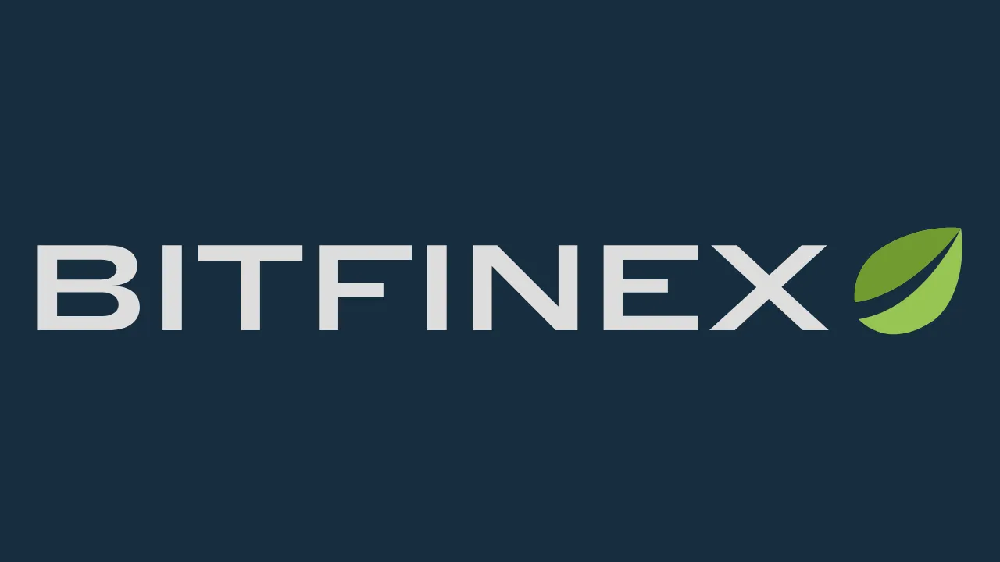

2012 දී ආරම්භ කරන ලද Bitfinex යනු පළමු Bitcoin සහ Altcoin Exchange වේදිකාවන්ගෙන් එකකි. මුලදී P2P Bitcoin හුවමාරු මත අවධානය යොමු කරමින්, වේදිකාව ඉක්මනින්ම එහි සේවාවන් පුළුල් කර මාර්ජින් වෙළඳාම, P2P මූල්‍යකරණය, ව්‍යාපෘති වෙළඳාම, සහ ඉහළ පරිමාවක ගනුදෙනු සඳහා OTC ("*over-the-counter*") වෙළඳපොළ ඇතුළත් කර ගත්තේය.

අද, Bitfinex යනු සම්පූර්ණ වේදිකාවක් වන අතර, බිට්කොයින් සරලව මිලදී ගැනීම සහ ප්‍රාග්ධන වෙළඳාම් ක්‍රියාකාරකම් (සාම්ප්‍රදායික වෙළඳාම්, ව්‍යුහක, OTC, ණය දීම, ආදිය) භාවිතා කිරීම සඳහා අවශ්‍ය අවදානම් කළමනාකරණ මෙවලම් සමඟ සපයයි. එය වෙබ් අනුවාදයකින් ලබා ගත හැකි අතර, සරල ගනුදෙනු සඳහා, භාවිතා කිරීමට පහසු ජංගම යෙදුමක් ද ලබා ගත හැක.

මෙම උපකාරිකාවේ, අපි Bitfinex හි ව්‍යාපාරික ගිණුමක් නිර්මාණය කිරීමේ ක්‍රියාවලිය, බිට්කොයින් මිලදී ගැනීම සහ විකිණීම, ගිණුම්කරණ අරමුණු සඳහා ගනුදෙනු කළමනාකරණය කිරීම, සහ යුරෝ සහ බිට්කොයින් තැන්පත් කිරීම සහ ආපසු ගැනීම ආදිය ආවරණය කරමු. Bitcoin ඔබේ මුදල් ප්‍රවාහයට ඒකාබද්ධ කිරීමට හෝ ගෙවීම් ක්‍රමයක් ලෙස Bitcoin පිළිගැනීමට ඔබ සැලසුම් කරනවාද යන්න මත පදනම්ව මූලික දැනුම ඔබට ලබා දීම මෙහි අරමුණයි.

ඔබේ ව්‍යාපාරයට Bitcoin ඒකාබද්ධ කිරීමේ විෂයයට ඔබේ උනන්දුවක් ඇත්නම්, එම විෂයය පිළිබඳ අපගේ සම්පූර්ණ සෞද්ධාන්තික පුහුණු පාඨමාලාව සොයා බැලීමටත් මම නිර්දේශ කරමි:

https://planb.network/courses/a804c4b6-9ff5-4a29-a530-7d2f5d04bb7a

## 1 - Bitfinex ගිණුමක් තනන්න

[නිල Bitfinex වෙබ් අඩවියට](https://www.bitfinex.com/) යන්න. මුල් පිටුවේ, ඔබේ ගිණුම නිර්මාණය කිරීම ආරම්භ කිරීමට "*Sign Up*" විකල්පය සොයා ක්ලික් කරන්න. පළමුව, ඔබ පුද්ගලයින් සඳහා සම්මත ගිණුමක් නිර්මාණය කරනු ඇත, "*Corporate*" විකල්පය සත්‍යාපන ක්‍රියාවලිය දුරදිග යන විට පසුව තෝරා ගනු ඇත.

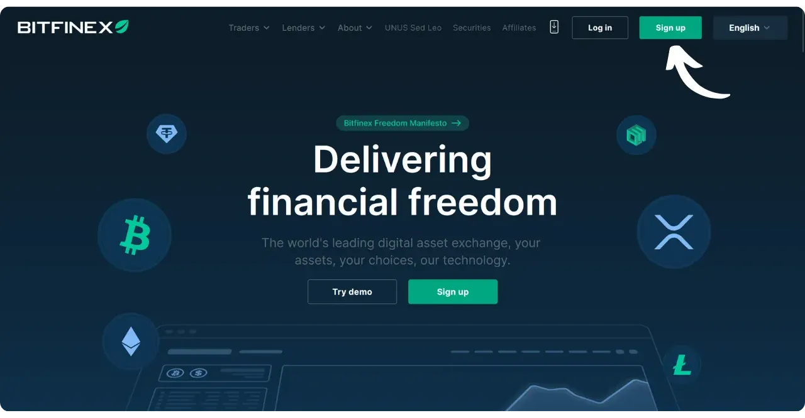

අවශ්‍ය තොරතුරු සම්පූර්ණ කරන්න: ඔබේ ව්‍යාපාරික විද්‍යුත් තැපෑල Address සහ ඔබේ සමාගමේ නේවාසික රට ඇතුළත් කරන්න. ආරක්ෂිත පරිශීලක නාමයක් සහ මුරපදයක් තෝරන්න, එවිට ලියාපදිංචිය තහවුරු කිරීමට "*Sign up*" මත ක්ලික් කරන්න.

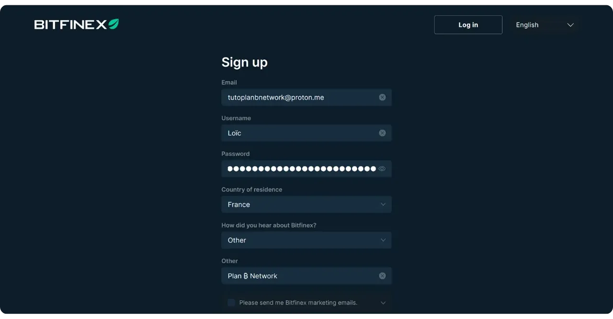

මෙන්ම ශක්තිමත්, අනන්‍ය මුරපද භාවිතා කිරීම සහ ආරක්ෂා කිරීම පිළිබඳ උපදෙස් සඳහා, මෙම උපකාරිකාවද බලන්න :

https://planb.network/tutorials/computer-security/authentication/bitwarden-0532f569-fb00-4fad-acba-2fcb1bf05de9

අපි දැන් ගිණුම ආරක්ෂා කිරීමට 2FA වින්‍යාස කිරීමට යන්නේ. ඔබේ ස්මාර්ට්ෆෝනයේ Google Authenticator හෝ Authy වැනි සත්‍යාපන යෙදුමක් භාවිතා කරන්න. මෙම මෙවලම පිළිබඳ උපකාරක පංතියක් ඔබට මෙහිදී සොයා ගත හැක:

https://planb.network/tutorials/computer-security/authentication/authy-a76ab26b-71b0-473c-aa7c-c49153705eb7

ඔබේ යෙදුම සමඟ QR කේතය ස්කෑන් කර ලබා දෙන අංක 6 ඇතුළත් කරන්න.

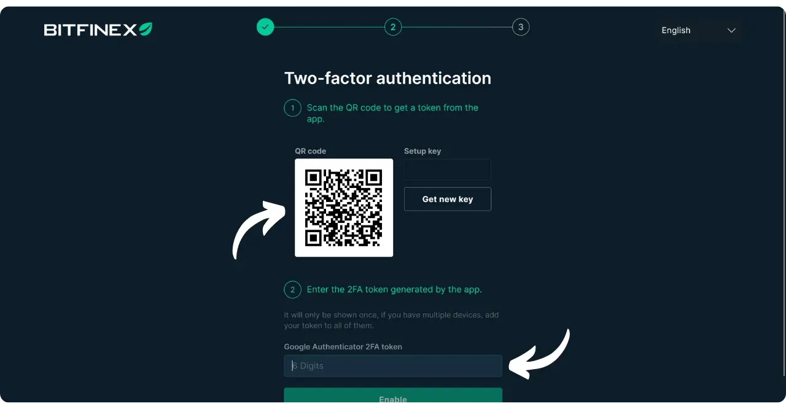

ලියාපදිංචිය සම්පූර්ණ කර ඇත.

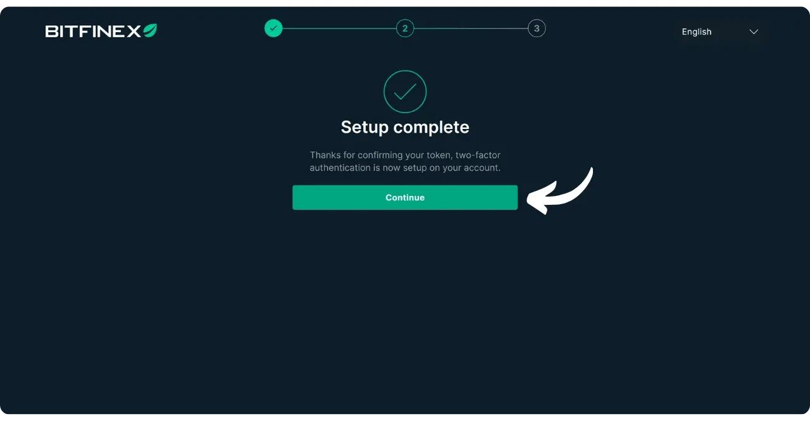

ඔබේ තැපැල් පෙට්ටිය පරීක්ෂා කර Bitfinex විසින් යවන ලද සබැඳිය මත ක්ලික් කර ඔබේ ලියාපදිංචිය තහවුරු කරන්න.

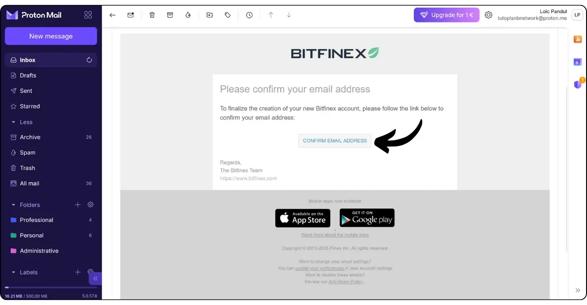

ඔබේ ගිණුම දැන් නිර්මාණය වී ඇත. වේදිකාවට ප්‍රවේශ වීමට "*පිවිසෙන්න*" මත ක්ලික් කරන්න.

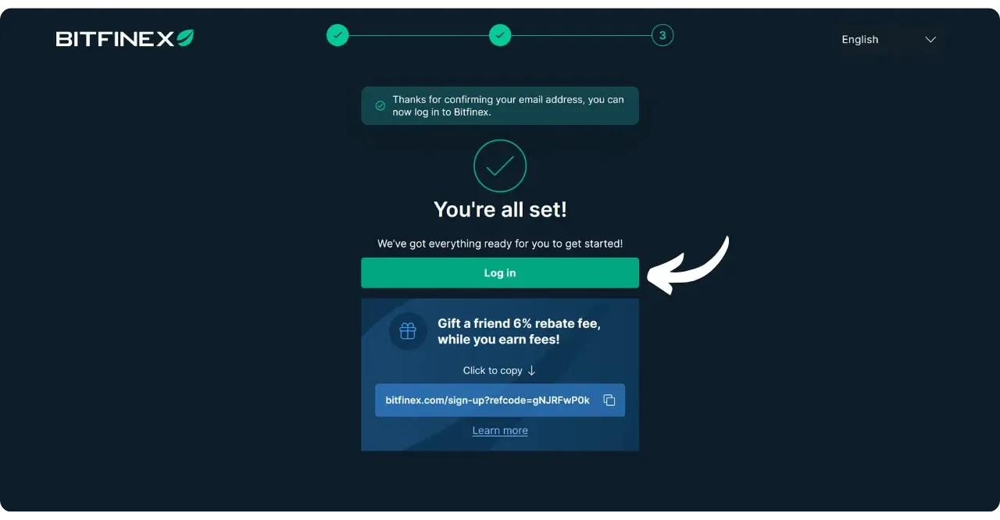

## 2 - සමාගම් ගිණුම් සත්‍යාපනය

Bitfinex යාවත්කාලීන නියමයන්ට අනුකූලව සත්‍යාපන ක්‍රියාවලියක් (KYC) අදාළ කරයි. "මූලික" මාදිලියේදී තැන්පතු කිරීම අසම්භාව්‍ය වන අතර, අවම වශයෙන් "මධ්‍යස්ථ" සත්‍යාපන මට්ටම, හෝ අවශ්‍ය නම් "සම්පූර්ණ" මට්ටම ලබා ගැනීම අත්‍යවශ්‍ය වේ.

Ko je vaš račun ustvarjen, bi se moralo prikazati pojavno okno, ki predlaga, da preverite svoj račun. Kliknite na "*Preveri*".

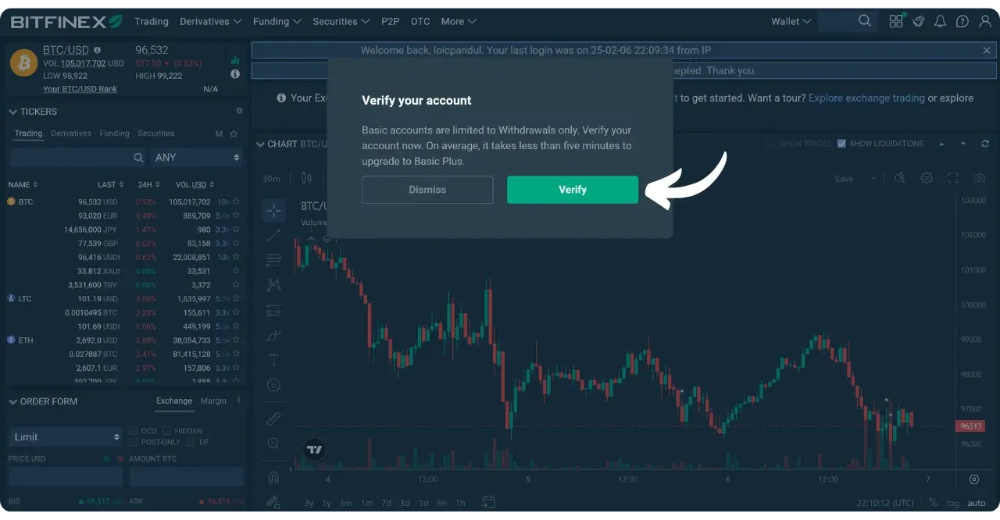

මෙම කවුළුව පෙනී නොසිටියහොත්, Interface හි ඉහළ දකුණු කෙළවරේ ඇති ඔබේ පැතිකඩ වෙත ගොස්, "*Verification*" මත ක්ලික් කරන්න.

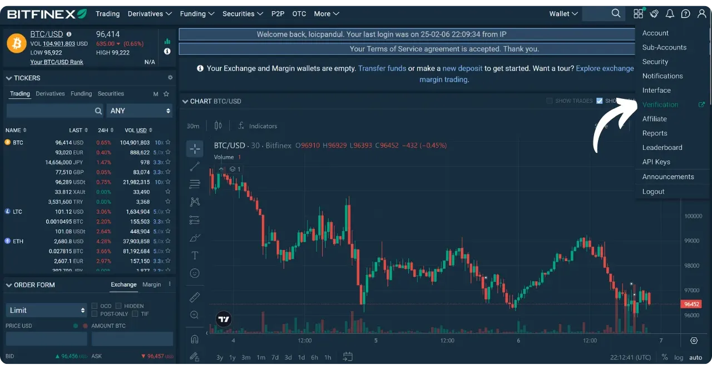

"*Account Type*" යටතේ, "*Corporate*" තෝරන්න. මගේ අවස්ථාවේ, මම "*Intermediate*" වෙත උසස් කරමින් සිටිමි, එබැවින් මම "*Upgrade to Intermediate*" තෝරන්න.

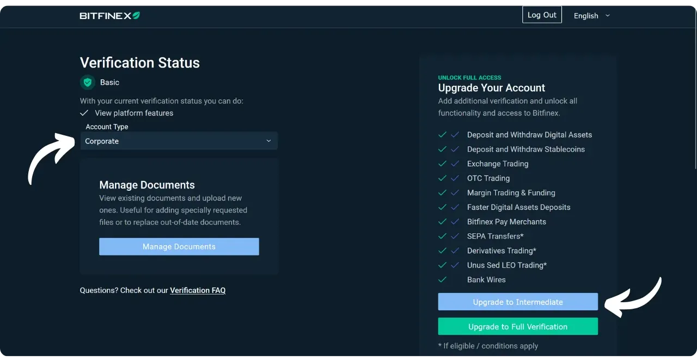

පියවර සම්පූර්ණ කරන්න:

- සමාගම් තොරතුරු (සමාගමේ නම, සම්බන්ධතා විස්තර, ව්‍යාපාර කලාපය, ආදිය) ;
- නීතිමය ලේඛන (සංගමය පිළිබඳ ලිපි, Kbis සාරාංශය, අධ්‍යක්ෂකයින් සහ කොටස් හිමියන්ගේ ලැයිස්තුව);
- KYC විශේෂාංග සතු සෑම අයෙකුගේ හෝ අධ්‍යක්ෂකගේ (හැඳුනුම් ලේඛන, Address සනාථ කිරීම, ආදිය) තොරතුරු.

ඔබේ අයදුම්පත සම්පූර්ණ කර ඉදිරිපත් කිරීමෙන් පසු, ව්‍යාපාර සත්‍යාපනය සඳහා එය වලංගු කිරීමට වේදිකාවට දින කිහිපයක් ගත විය හැක. මෙම කාලය තුළ, තැන්පතු තාවකාලිකව අවහිර කරනු ඇත.

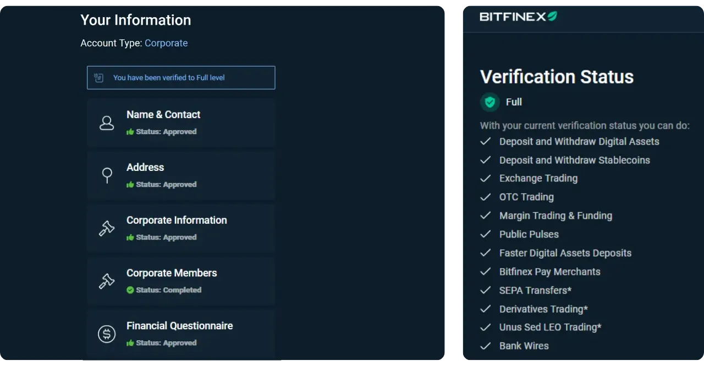

## 3 - Bitfinex Interface සඳහා ඉක්මන් හැඳින්වීමක්

ලොග් වීමෙන් පසු, ඔබට Interface හි ඉහළින් නාවිගේෂන් තීරුවක් දැක ගත හැකි වන අතර: "*Trading*", "*Derivatives*", "*Funding*", "*OTC*", "*P2P*", "*Wallet*", ආදිය. Bitfinex විශාල පරාසයක ක්‍රියාකාරිතාවන් ලබා දේ, ඒ අතර:

- Trading**: "*classic*" වෙළඳපොලක් වන අතර ඔබට ක්‍රිප්ටෝකරන්සි (Bitcoin ඇතුළුව) මිලදී ගැනීම සහ විකිණීම සඳහා නියෝග තබා ගත හැක;
- OTC**: Over-The-Counter සේවාව විශාල පරිමාවන් සෘජුවම වෙනත් ක්‍රීඩකයෙකු සමඟ, මහජන ඇණවුම් පොත් පිටත වෙළඳාම් කිරීම සඳහා;
- Funding**: ණය සහ මාදිලි අරමුදල් සඳහා කැපවූ ප්‍රදේශය;
- ਡੈਰੀਵੇਟਿਵਜ਼**: ਡੈਰੀਵੇਟਿਵਜ਼ (ਭਵਿੱਖ, ਆਦਿ) ਲਈ ਸੈਕਸ਼ਨ, ਅਨੁਭਵੀ ਵਪਾਰੀਆਂ ਲਈ ਉਦੇਸ਼ਿਤ;
- P2P**: ඔබට අනෙක් පරිශීලකයන්ගෙන් peer-to-peer මට්ටමින් ක්‍රිප්ටෝ මිලදී ගැනීමට හෝ විකිණීමට ඉඩ සලසයි.

සාමාන්‍ය භාවිතය සඳහා (බිට්කොයින් මිලදී ගැනීම/විකිණීම, තැන්පතු/උපස්‍රාව සහ මුදල් කළමනාකරණය), ඔබ ප්‍රධාන වශයෙන් "*වෙළඳ*" ටැබය, "*Wallet*", "*තැන්පතු*" සහ "*උපස්‍රාව*" කොටස් භාවිතා කරනු ඇත.

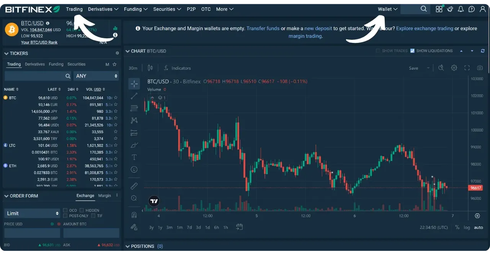

කොරපරේට් සූත්‍රයේ තවත් වාසියක් වන්නේ උප-ගිණුම් නිර්මාණය කිරීමේ හැකියාවයි. මෙය ඔබට මෙම උප-ගිණුම් වෙත පරිශීලකයන් කිහිප දෙනෙකුට ප්‍රවේශය ලබා දිය හැකි බව අර්ථ දක්වයි, එක් එක් අය සඳහා විශේෂිත අයිතිවාසිකම් (කියවීම පමණක්, වෙළඳාම, තැන්පතු පමණක්, ආදිය) සමඟ.

## 4 - යුරෝ (fiat) තැන්පතු සහ ආපසු ගැනීම්

ඔබේ Bitfinex සංස්ථාගත ගිණුමට යුරෝ තැන්පත් කිරීමට, Interface හි ඉහළින් ඇති "*Wallet*" මෙනුවේ "*Deposit*" උපමෙනුවට ප්‍රවේශ වන්න.

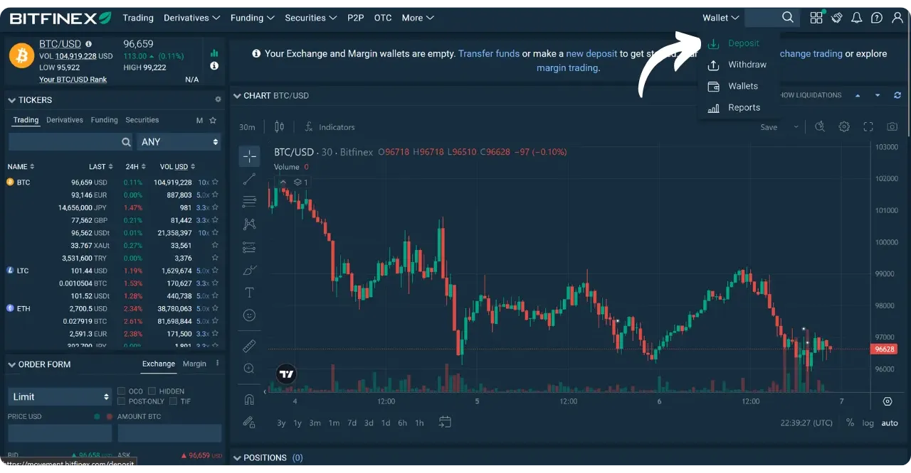

"*බැංකු මාරු*" හෝ "*ණය/උපයන කාඩ්පත*" තෝරා යුරෝ (හෝ වෙනත් ඩිජිටල් නොවන මුදල්) තැන්පත් කිරීමට.

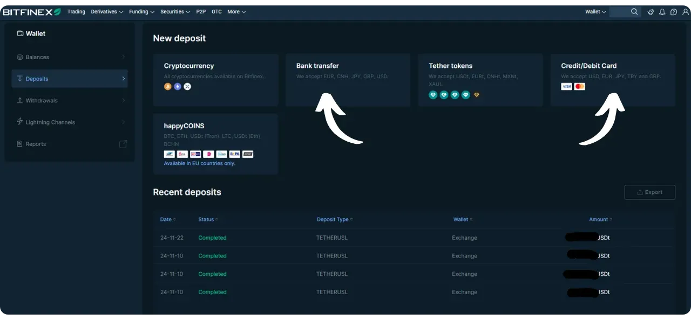

FIAT මුදල් යැවීමට තෝරන්න, උදාහරණයක් ලෙස යුරෝ. ඔබ "*වෙළඳ*" මූලික කාර්යයන් පමණක් භාවිතා කරන්නේ නම්, "*Exchange*" මත ක්ලික් කරන්න. තැන්පත් කිරීමට අවශ්‍ය මුදල සහ ඔබේ ව්‍යාපාරික ගිණුම් බැංකුව පිහිටි රට ද සඳහන් කරන්න.

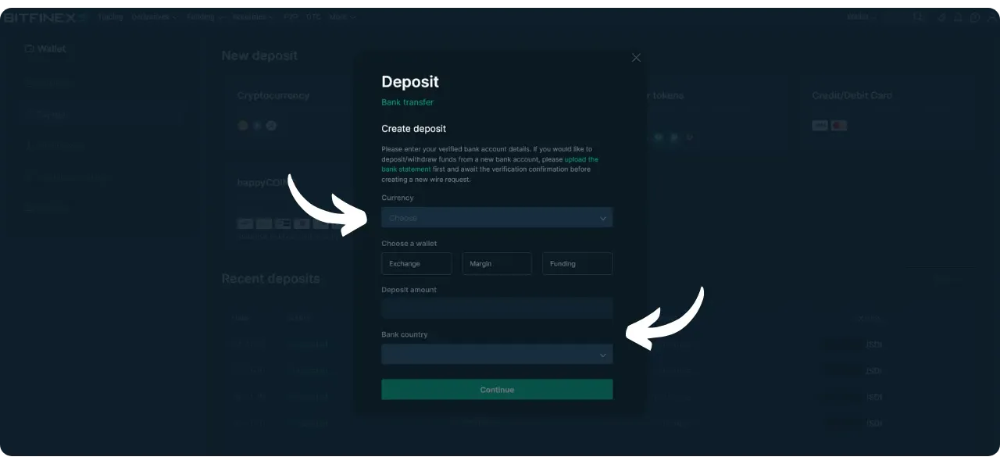

ඔබේ ව්‍යාපාරික බැංකු ගිණුමෙන් Bitfinex විසින් සලසා ඇති බැංකු ගිණුමට මාරු කිරීමක් කරන්න.

Funds ආපසු ගැනීමට, ක්‍රියාවලිය සමාන වේ: "*Withdraw*" උප-මෙනුවට යන්න.

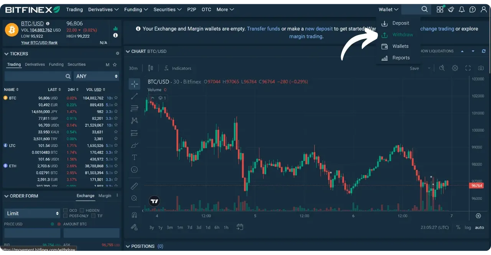

"*"බැංකු මාරු*" මත ක්ලික් කරන්න.

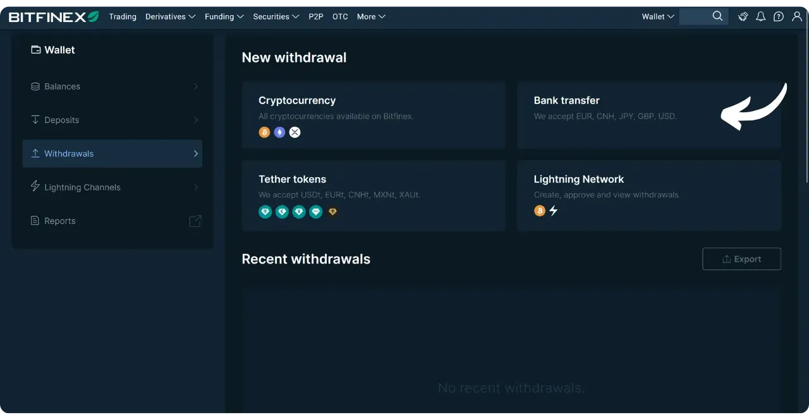

ඔබට ආපසු ගැනීමට අවශ්‍ය ෆියට් මුදල් වර්ගය, Bitfinex හි ණයගත විය යුතු ගිණුම ("*Exchange*" ඔබ මූලික විශේෂාංග පමණක් භාවිතා කරනවා නම්) සහ ආපසු ගැනීමට අවශ්‍ය මුදල තෝරන්න.

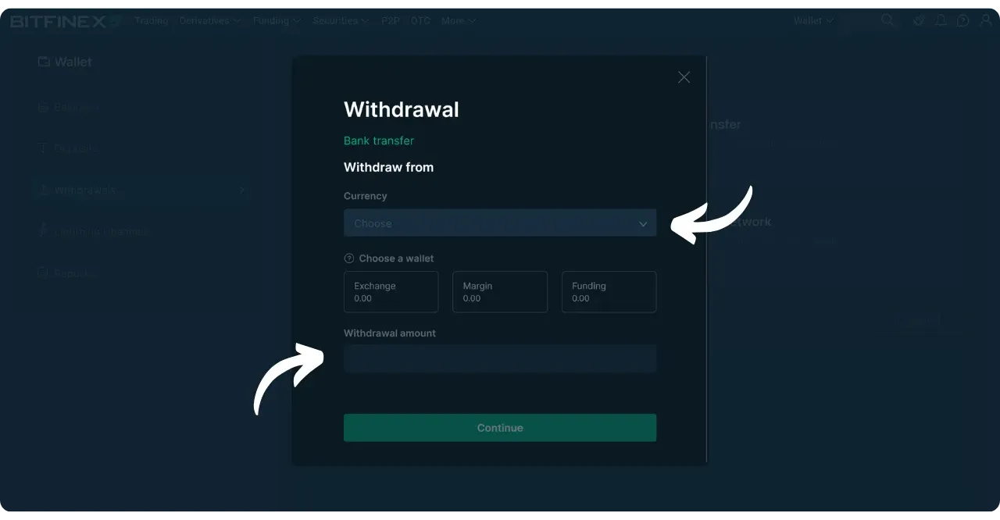

Bitfinex ඔබේ බැංකු ගිණුම සත්‍යාපනය කිරීම අවශ්‍ය විය හැක, අනුකූලතාවය හේතුවෙන් මාරු කිරීම පිළිගැනීමට පෙර.

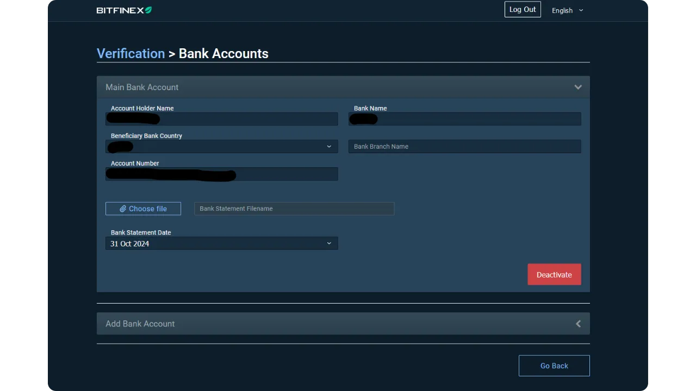

සංචාරය ආරම්භ කළ පසු, Bitfinex ඔබේ බැංකු ගිණුමට මුදල් මාරු කරනු ඇත.

## 5 - Bitcoins තැන්පත් කිරීම සහ ආපසු ගැනීම

Bitfinex මත Bitcoin තැන්පත් කිරීමට, "*Deposit*" උප මෙනුවට ප්‍රවේශ වන්න.

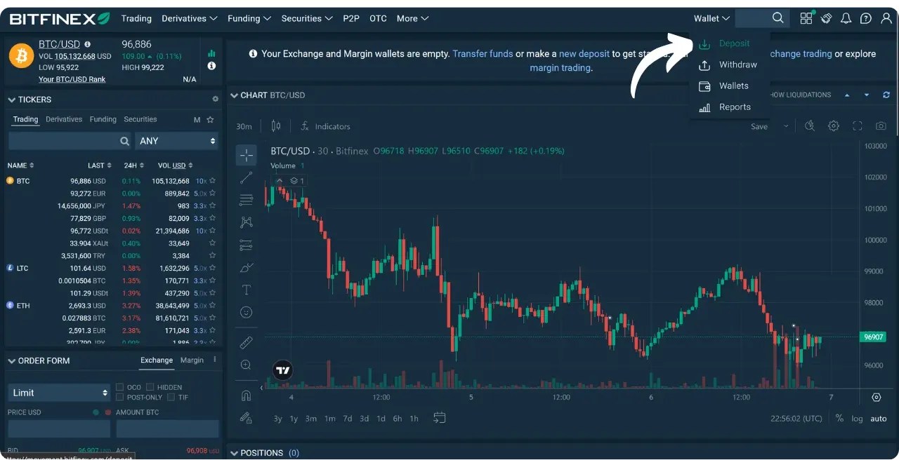

"*"Cryptocurrency"*" මත ක්ලික් කරන්න.

"*BTC*" තෝරන්න. Address එකක් පෙනේවි. මෙම Address පිටපත් කර, ඔබේ ස්වයං-රැකවරණ Wallet හෝ වෙනත් වේදිකාවකින් ඔබේ BTC යැවීමට භාවිතා කරන්න.

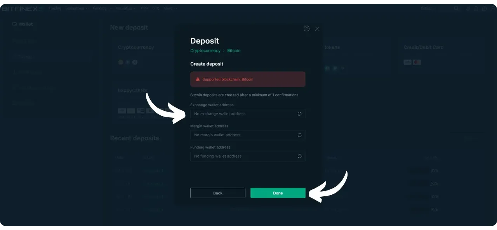

Bitcoin umakniti, pojdite v podmeni "*Withdraw*".

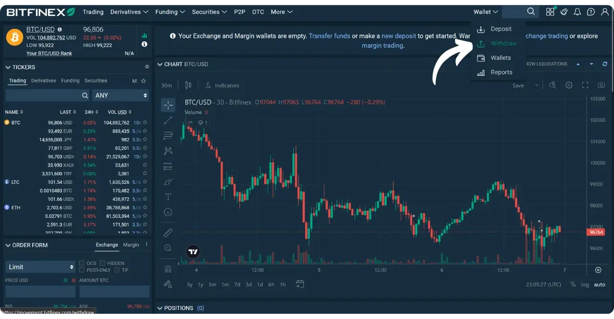

"*Cryptocurrency*" මත ක්ලික් කරන්න.

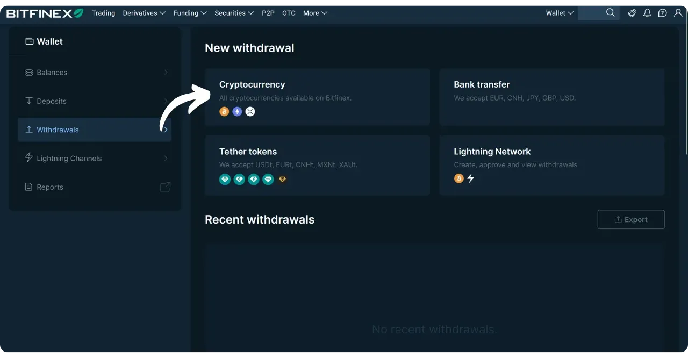

"*BTC*" තෝරන්න. ඔබේ මුදල් ආපසු ගැනීම සඳහා ණයගත විය යුතු Bitfinex ගිණුම තෝරන්න ("*Exchange*" මූලික විශේෂාංග සඳහා). මුදල සහ bitcoins සඳහා ගමනාන්තය Address ඇතුළත් කරන්න. කිසිදු දෝෂයක් වළක්වා ගැනීමට ආපසු ගැනීම Address පරීක්ෂා කිරීමට විශ්වාසවන්ත වන්න.

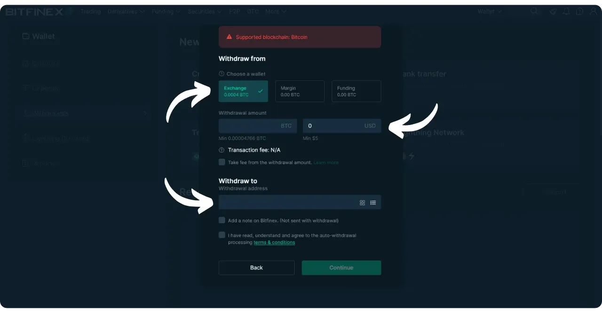

ඔබේ තහවුරු කිරීමෙන් පසු, ඔබේ බිට්කොයින් මාරු කරනු ලැබේ. කරුණාකර සලකන්න Mempool තදබදය අනුව ගාස්තු සහ ප්‍රමාද වෙනස් විය හැක.

Bitfinex Lightning Network හරහා තැන්පතු සහ ආපසු ගැනීම් විකල්ප ලබා දෙන අතර, වේගවත් සහ අඩු වියදම් සහිත ගනුදෙනු සක්‍රීය කරයි.

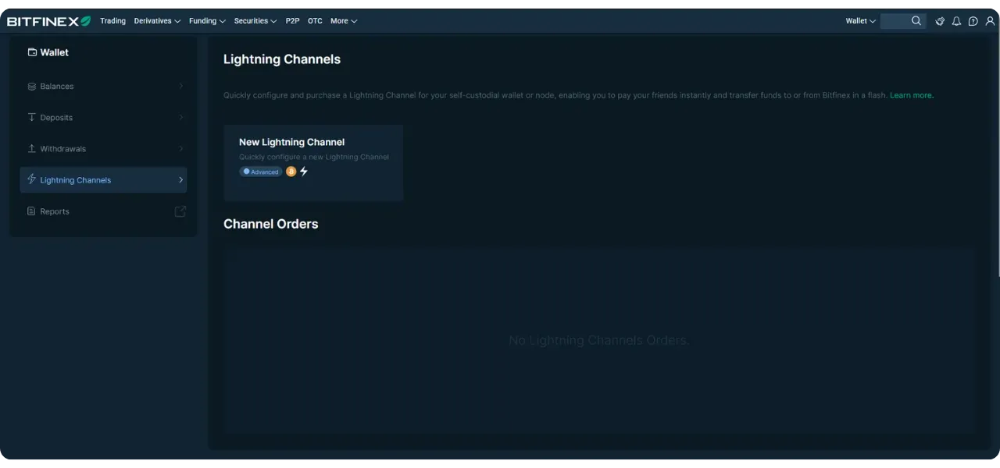

If you're interested in the Lightning Network, we also have a complete training course to help you understand how it works:

https://planb.network/courses/34bd43ef-6683-4a5c-b239-7cb1e40a4aeb

## 6 - Bitfinex මත බිට්කොයින් මිලදී ගැනීම සහ විකිණීම

Bitfinex විවිධ වෙළඳාම් ආකාර ලබා දේ. භාවිතය පහසු කිරීම සඳහා, "*Trading*" හෝ "*Exchange*" ලෙසද හැඳින්වෙන සම්භාව්‍ය ස්පොට් වෙළඳපොල තෝරන්න. මෙහිදී, ඔබට වෙළඳපොල මිලට මිලදී ගැනීමේ හෝ විකිණීමේ නියෝග තබා ගැනීමට, හෝ සීමා මිලක් සකසීමට හැකිය.

ඉහළ මෙනුවේ, "*Trading*" මත ක්ලික් කරන්න.

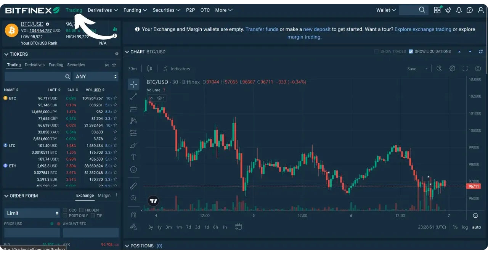

"*BTC/EUR*" යුගලය තෝරන්න, උදාහරණයක් ලෙස, යුරෝ සඳහා Exchange හි BTC මිලදී ගැනීමට හෝ විකිණීමට අවශ්‍ය නම්.

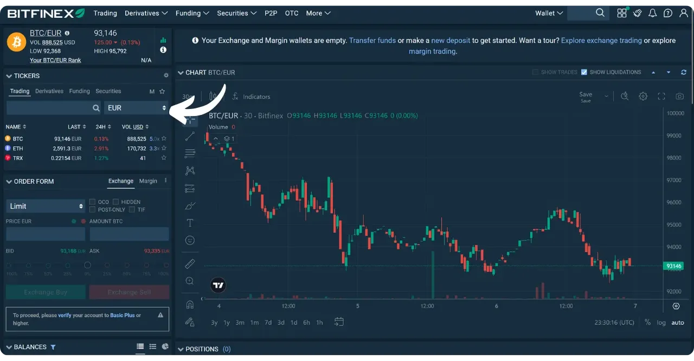

Interface මධ්‍යයේ මිල සටහනක්, පහළින් ඇණවුම් පොතක්, සහ වමෙන් ඇණවුම් ඇතුල් කිරීමේ මොඩියුලයක් පෙන්වයි. ඇණවුම් ඇතුල් කිරීමේ කොටසේ, ඔබට "*වෙළඳ*" ඇණවුමක් (හොඳම ලබා ගත හැකි මිලට වහාම ක්‍රියාත්මක වේ) හෝ "*සීමා*" ඇණවුමක් (ඔබ මිල නිර්වචනය කරයි) අතර තේරිය හැක. මිලදී ගැනීමට හෝ විකිණීමට BTC ප්‍රමාණය සදහන් කරන්න, හෝ ඔබේ ශේෂයේ ප්‍රතිශතයක් තෝරන්න. එවිට "*මිලදී ගන්න*" මත ක්ලික් කරන්න මිලදී ගැනීමට හෝ "*විකිණීම*" මත ක්ලික් කරන්න විකිණීමට.

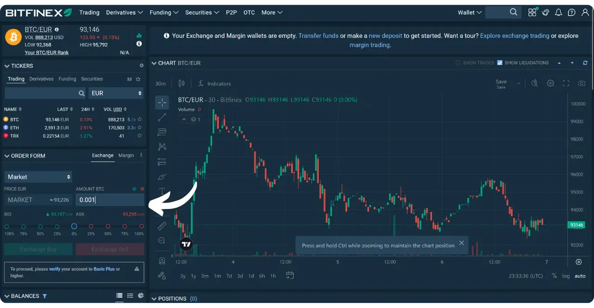

Interface හි පහළ කොටසේ ඔබගේ ක්‍රියාත්මක කළ නියෝගවල ඉතිහාසය දැකිය හැක.

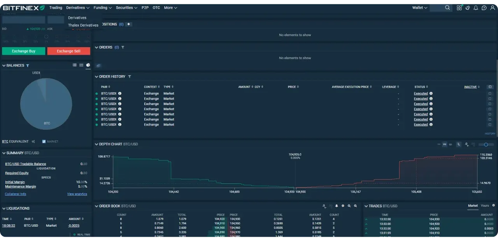

## 7 - ගනුදෙනු ඉතිහාසය අපනයනය සහ ගිණුම්කරණය

ගිණුම්කරණ අරමුණු සඳහා, ඔබේ ගනුදෙනු (මිලදී ගැනීම්, විකිණීම්, තැන්පතු, ආපසු ගැනීම්) විස්තර අපනයනය කළ යුතු වේ. Bitfinex සම්පූර්ණ වාර්තාකරණ මෙවලමක් ලබා දේ. Interface හි ඉහළ දකුණු කෙළවරේ ඇති ඔබේ පැතිකඩ අයිකනය මත ක්ලික් කර, පසුව "*Reports*" මෙනුව මත ක්ලික් කරන්න.

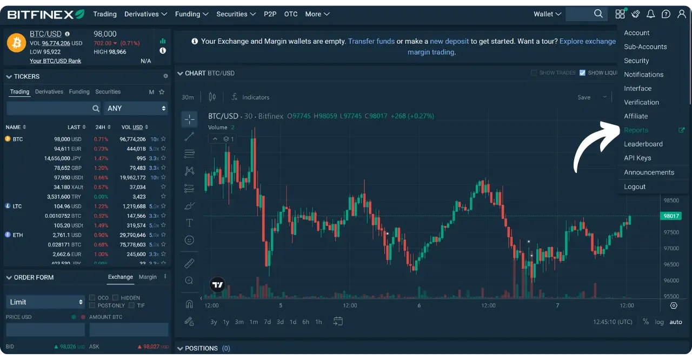

වම පැත්තේ, ඔබට අපනයනය කිරීමට ඇති දත්ත වර්ගය තෝරා ගත හැක. උදාහරණයක් ලෙස, "*Trades*" තෝරා ගැනීමෙන් ඔබට ඔබේ සියලු වෙළඳාම් වෙත ප්‍රවේශ විය හැක.

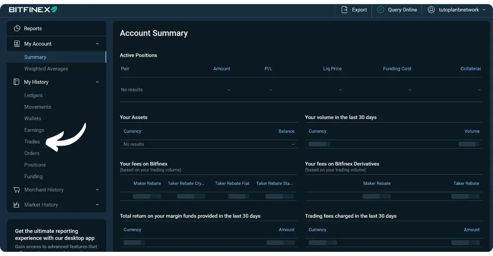

"*Datum*" polje vnesite želeno obdobje in po potrebi omejite iskanje na enega ali več specifičnih parov prek polja "*Simbol*".

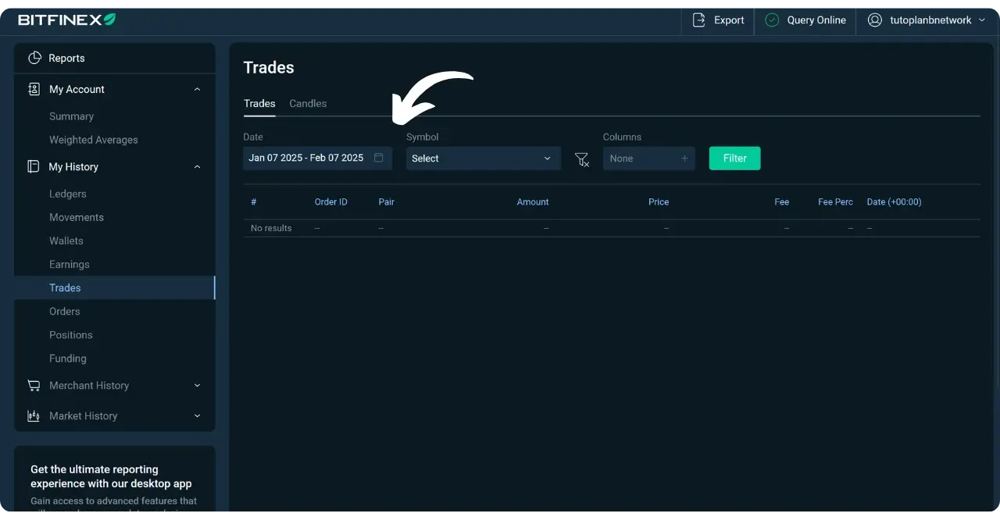

මෙම දත්ත අපනයනය කිරීමට, "*Export*" බොත්තම ක්ලික් කරන්න.

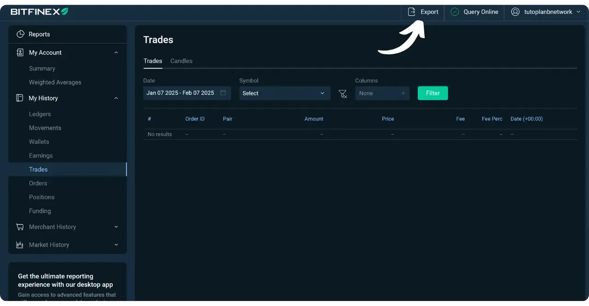

පරාමිතීන් පරීක්ෂා කර, එවිට අපනයනය තහවුරු කරන්න.

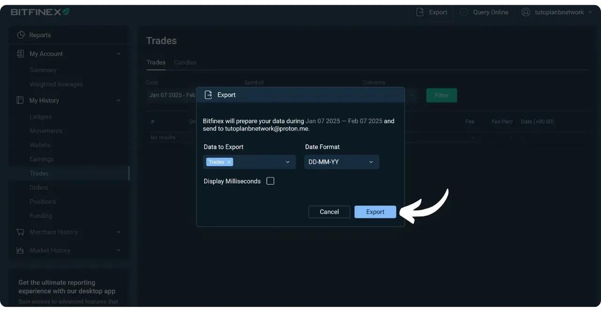

රිපෝර්ට් එක ඔබේ Bitfinex ගිණුමට සම්බන්ධ Address වෙත, CSV ගොනුවක් ලෙස විද්‍යුත් තැපෑල මඟින් යවනු ලැබේ.

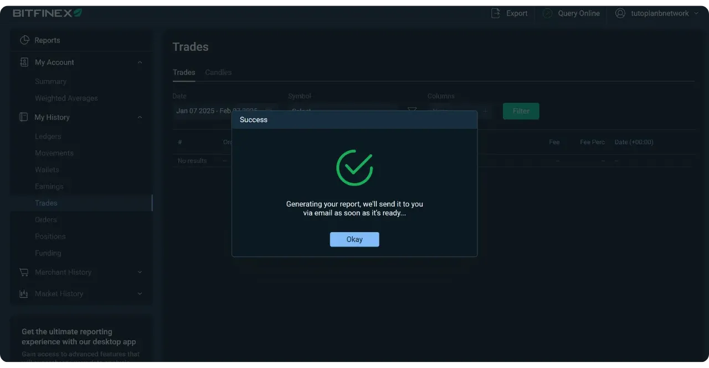

Ko datoteka enkrat izvožena, jo lahko vključite v svojo računovodsko programsko opremo ali pošljete svojemu pooblaščenemu računovodji.

## 9 - සමාගමේ භාවිතා කේස්

ඔබේ සමාගමේ අරමුණු සහ ව්‍යුහය අනුව, Bitfinex භාවිතය වෙනස් විය හැක.

### Bitcoine za gotovino kupujete

**ඉලක්කය:** Bitcoin හි ආයෝජනය කිරීමෙන් සමාගමේ මුදල් ප්‍රවාහය විවිධාංගීකරණය කිරීම.

**අනුගමනය කළ යුතු පියවර:**

- Bitfinex račun podjetja položite evre;
- මෙම යුරෝ භාවිතා කර Bitcoin මිලදී ගන්න;
- බිට්කොයින් පළපුරුද්දේ තබා ගන්න හෝ ස්වයං-අධිකාරියෙන් ආරක්ෂා කිරීමට ඒවා ආපසු ගන්න ;
- අවශ්‍ය පරිදි අපනයන ගනුදෙනු ඉතිහාසයන්.

### Bitcoin පිළිගැනීම ගෙවීම් ක්‍රමයක් ලෙස

**Cilj:** Ponudite svojemu podjetju možnost sprejemanja Bitcoin kot sredstva plačila za vaše izdelke ali storitve.

**අනුගමනය කළ යුතු පියවර:**

- Bitcoin ගෙවීම් පද්ධතියක් ඒකාබද්ධ කරන්න. කුඩා ව්‍යාපාර සඳහා, සරල Wallet මෘදුකාංගය ප්‍රමාණවත් විය හැකි අතර, ඔබේ වෙබ් අඩවියට හෝ විකුණුම් ස්ථානයේදී ගෙවීම් විකල්පයක් ලෙස Bitcoin ඒකාබද්ධ කිරීමට Swiss Bitcoin Pay හෝ BTCPay Server වැනි විශේෂිත විසඳුම් තෝරා ගත හැක;
- ඔබගේ Bitfinex ගිණුමට බිට්කොයින් වලින් ලැබෙන මාරු ගෙවීම්;
- ඔබේ මූල්‍යමය උපාය මාර්ගය අනුව, ලැබුණු බිට්කොයින් යුරෝ සඳහා විකිණීම, අනාගතයේ වටිනාකම වැඩිවීමේ හැකියාව සඳහා ඒවා තබා ගැනීම, හෝ දෙකම එකට තෝරා ගැනීම;
- Bitcoin-වලට මතක තබා ගන්න හෝ ස්වයං-රැකවරණය සඳහා ඒවා ඉවත් කරන්න. ඔබට යුරෝද ඔබේ බැංකු ගිණුමට ඉවත් කළ හැක;
- අවශ්‍ය ලෙස අපනයන ගනුදෙනු ඉතිහාසයන්.

මෙම මාතෘකාව පිළිබඳව වැඩිදුර අවබෝධයක් ලබා ගැනීමට, ව්‍යාපාරවලට Bitcoin ඒකාබද්ධ කිරීම පිළිබඳව සවිස්තරාත්මකව ආවරණය කරන, මුදල් ප්‍රවාහයට එකතු කිරීම, Bitcoin ගෙවීම් පිළිගැනීම, සහ ගිණුම්කරණය ආදිය සවිස්තරාත්මකව ආවරණය කරන මෙම සවිස්තරාත්මක පුහුණු පාඨමාලාව නිර්දේශ කරමි:

https://planb.network/courses/a804c4b6-9ff5-4a29-a530-7d2f5d04bb7a