Kraken යනු ලෝකයේ හොඳින් හැඳින්වෙන ක්‍රිප්ටෝකරන්සි Exchange වේදිකාවන්ගෙන් එකකි. එය Bitcoin තම ආර්ථික කළමනාකරණයට ඒකාබද්ධ කිරීමට කැමති සමාගම් සඳහා අභිරුචිකරණය කළ සේවාවන් බහුලව ලබා දේ.

මෙම උපකාරිකාවේදී, අපි Kraken ව්‍යාපාරික ගිණුමක් නිර්මාණය කිරීමේ ක්‍රියාවලිය, බිට්කොයින් මිලදී ගැනීම සහ විකිණීම, ගිණුම්කරණ අරමුණු සඳහා ගනුදෙනු කළමනාකරණය කිරීම, සහ යුරෝ සහ බිට්කොයින් තැන්පත් කිරීම සහ ආපසු ගැනීම ආදිය ආවරණය කරමු. Bitcoin ඔබේ මුදල් ප්‍රවාහයට ඒකාබද්ධ කිරීම හෝ ගෙවීම් ක්‍රමයක් ලෙස Bitcoin පිළිගැනීම සලකා බලනවාද යන්න මතක තබා, මූලික දැනුම ඔබට ලබා දීම මෙහි අරමුණයි.

If you're interested in the subject of integrating Bitcoin into your business, I'd also recommend discovering our complete theoretical training course on the subject:

https://planb.network/courses/a804c4b6-9ff5-4a29-a530-7d2f5d04bb7a

## 1 - Kraken කාර්පොරේට් ගිණුමක් නිර්මාණය කිරීම

Kraken භාවිතා කරමින් ඔබේ සමාගමේ මූල්‍ය කළමනාකරණය කිරීමේ පළමු පියවර වන්නේ, නිසැකවම, ගිණුමක් සාදන එකයි. මෙහිදී, අපි පුද්ගලයින් සඳහා ගිණුමක් සාදන්නේ නැති අතර, නීතිමය අනුකූලතාවය සහතික කිරීම පමණක් නොව, ගිණුම් අපනයන වැනි විශේෂිත විශේෂාංග ලබා දෙන සංස්ථා ගිණුමක් සාදන්නෙමු.

Obiščite uradno spletno stran [kraken.com](https://www.kraken.com/) in kliknite na gumb "*Sign Up*".

ලියාපදිංචි පිටුවේ, ගිණුම් විකල්ප වලින් "*Business*" ටැබය තෝරා ව්‍යාපාර ගිණුමක් නිර්මාණය කිරීම විශේෂිත කරන්න.

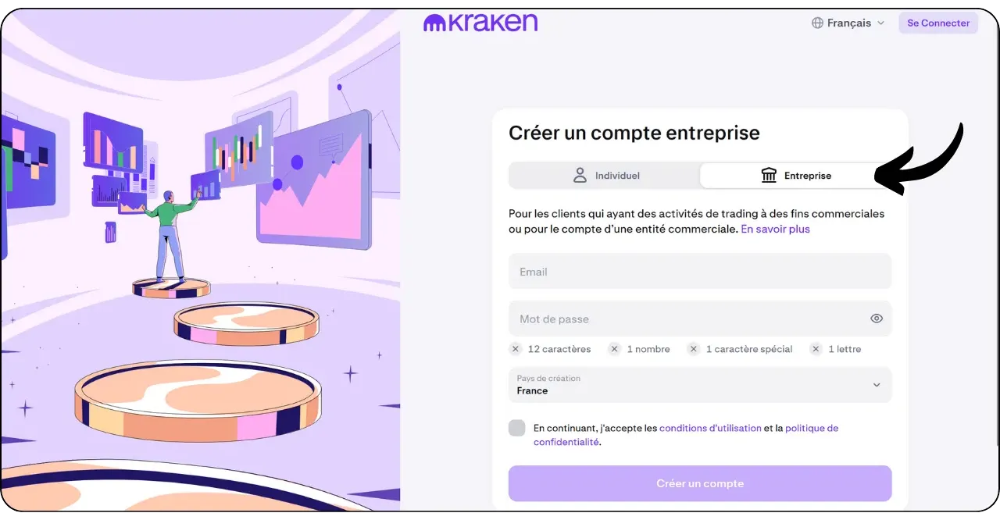

ඔබේ වෘත්තීය විද්‍යුත් තැපෑල Address ඇතුළත් කර, ආරක්ෂිත මුරපදයක් තෝරන්න. මෙම තොරතුරු ඇතුළත් කිරීමෙන් පසු, ලියාපදිංචිය සම්පූර්ණ කිරීමට "*ගිණුමක් සාදන්න*" මත ක්ලික් කරන්න.

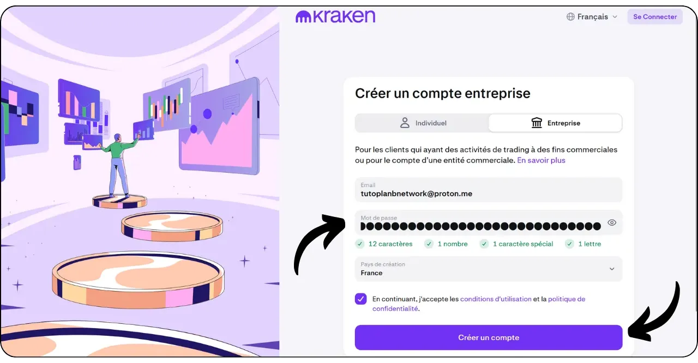

ඔබගේ තොරතුරු ලබා දී අවසන් වූ පසු, Kraken ඔබට සක්‍රීය කිරීමේ විද්‍යුත් තැපෑලක් යවනු ඇත.

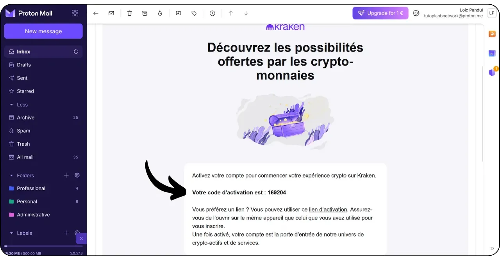

Odprite to e-pošto in kliknite na "*Aktiviraj račun*" ali vnesite priloženo 6-mestno kodo za aktivacijo vašega računa.

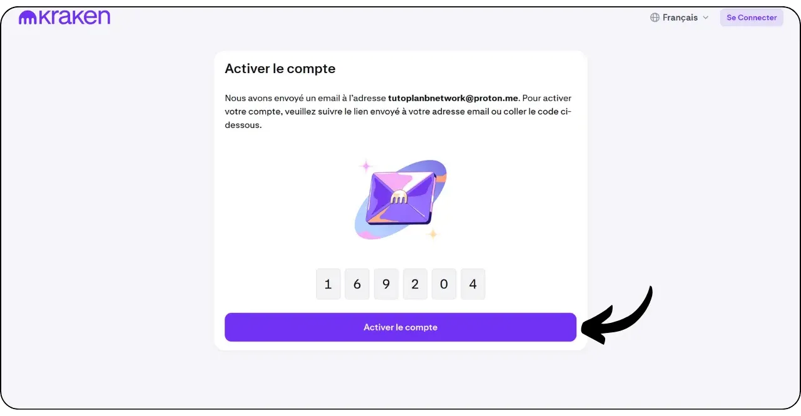

## 2 - සමාගම් ගිණුම් සත්‍යාපනය

ඔබේ ගිණුම නිර්මාණය කිරීමෙන් පසු, ඔබට සංස්ථා ගිණුම් සඳහා KYC (*ඔබේ පාරිභෝගිකයා හඳුනා ගන්න*) සත්‍යාපන ක්‍රියාවලිය සම්පූර්ණ කළ යුතුය. මෙම පියවරෙන් Kraken සමාගමේ නීතිගතභාවය සහ මූල්‍ය නියමයන්ට අනුකූල වීම සත්‍යාපනය කර ගැනීමට ඉඩ සලසයි.

"*ඉදිරියට*" බොත්තම මත ක්ලික් කරන්න.

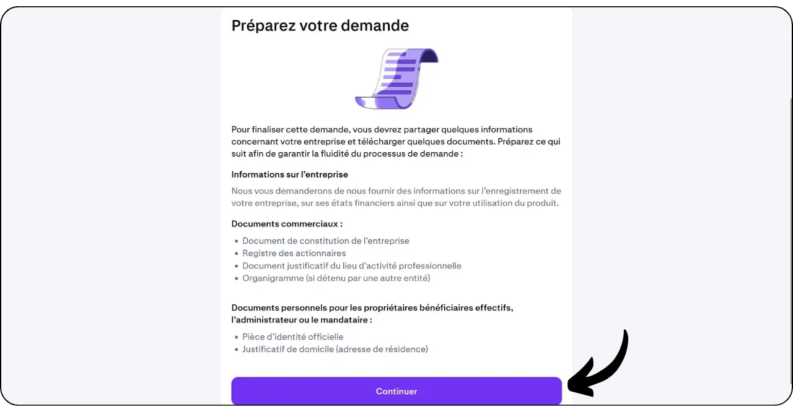

කරුණාකර ඔබේ සමාගම පිළිබඳ අවශ්‍ය තොරතුරු ඇතුළත් කරන්න.

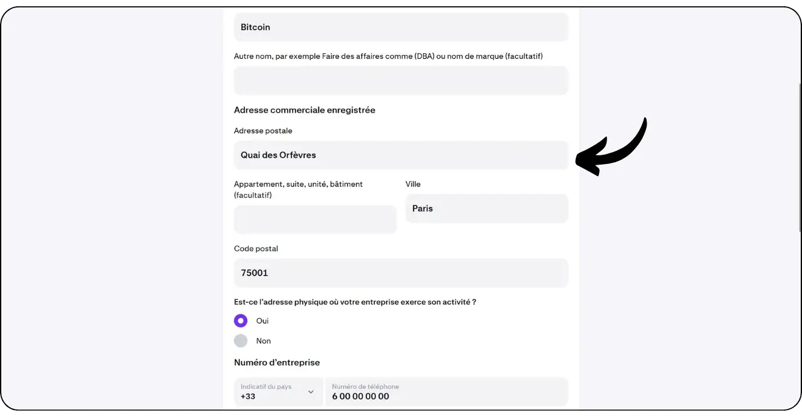

ඔබේ සමාගමට සම්බන්ධ කෙරෙන ලිපි several කිහිපයක්ද උඩුගත කළ යුතු වේ.

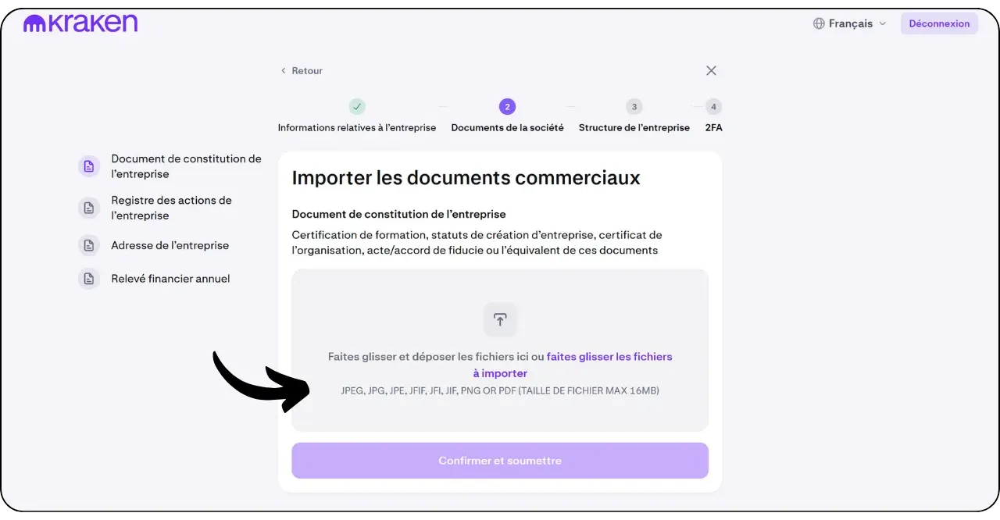

ඔබ සියලුම කොටස් සම්පූර්ණ කර අවශ්‍ය ලේඛන යවා අවසන් වූ විට, ඔබේ සත්‍යාපන ඉල්ලීම යැවීමට "*Submit*" මත ක්ලික් කරන්න. ඔබේ ඉල්ලීම සැකසීමට සතියක් දක්වා කාලයක් ගත විය හැක. ක්‍රියාවලිය වේගවත් කිරීමට, ආරම්භයේදී අවශ්‍ය සියලුම ලේඛන ලබා දෙන බව සහතික කරන්න.

## 3 - ගිණුම් ආරක්ෂාව

ඔබගේ ගිණුම සත්‍යාපනය කළ පසු, ඔබට වේදිකාවට ප්‍රවේශ විය හැකි වන අතර ඔබට අතුරුමුහුණත් දෙකක් ලබා දෙනු ඇත:

- Kraken**: සරල Interface එකක්, මූලික ක්‍රියාකාරිතාව ලබා දීම.
- Kraken Pro**: Interface napreden z dodatnimi funkcijami, posebej za trgovanje.

ඔබේ අරමුණ Bitcoin මිලදී ගැනීම සහ විකිණීම පමණක් නම්, සරල Interface තෝරන්න. අවශ්‍ය නම් පසුව උසස් Interface වෙත මාරු වීමේ විකල්පය ඔබට සෑම විටම ඇත.

පළමුව සහ ප්‍රධාන වශයෙන්, අනුමත නොකළ ප්‍රවේශය වැළැක්වීම සඳහා ඔබේ ගිණුම ආරක්ෂා කිරීම ඉතා වැදගත් වේ. ලියාපදිංචි කිරීමේදී ස්ථාපිත කළ ශක්තිමත් මුරපදයට අමතරව, අපි ද්විත්ව සත්‍යාපනය ක්‍රියාත්මක කරනු ඇත. මෙය ඔබේ Kraken ගිණුමට ප්‍රවේශ වීමේදී, ඔබේ මුරපදය පමණක් නොව, භෞතික යතුරක් හෝ සත්‍යාපන යෙදුමක් මඟින් ජනනය කරන කේතයක් වැනි දෙවන සත්‍යාපන සාධකයක්ද අවශ්‍ය වන බව අර්ථ දක්වයි.

ඔබේ ගිණුම් අයිකනයට යන්න සහ "*ආරක්ෂාව*" මත ක්ලික් කරන්න.

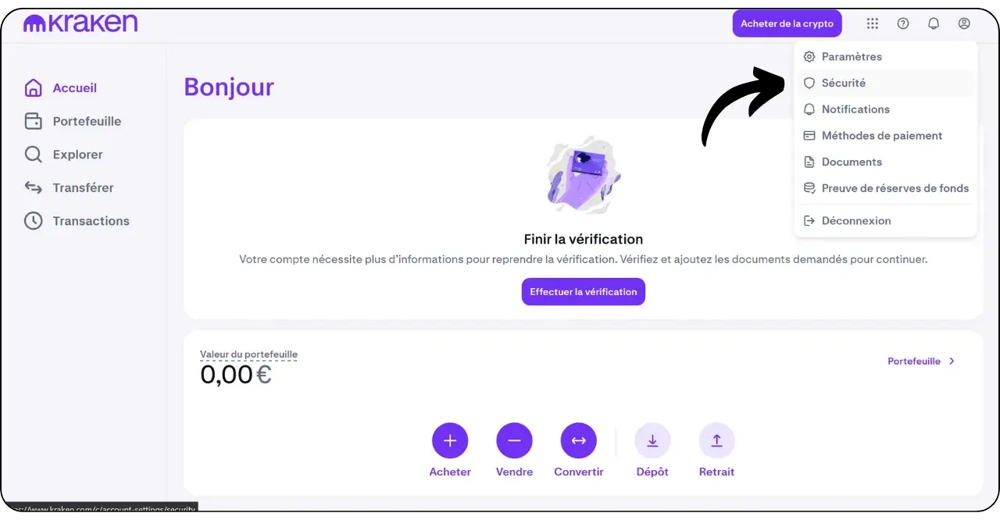

2FA විකල්පයන්හි, ඔබට දෙවන සාධකයක් ලෙස භෞතික ආරක්ෂක යතුරක් භාවිතා කිරීමට තෝරා ගත හැක.

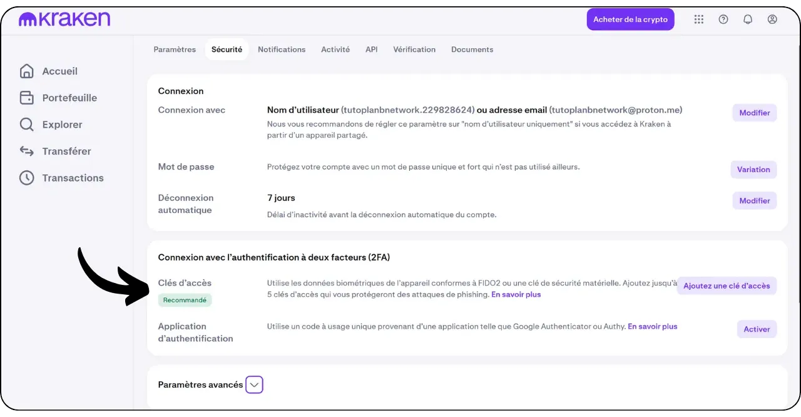

මෙම වර්ගයේ උපාංගයක් භාවිතා කරන ආකාරය පිළිබඳ වැඩි විස්තර සඳහා, අපගේ කැපවූ උපකාරකය බලන්න :

https://planb.network/tutorials/computer-security/authentication/security-key-61438267-74db-4f1a-87e4-97c8e673533e

වෙනත් විකල්පය වන්නේ Google Authenticator හෝ Authy වැනි සත්‍යාපන යෙදුමක් භාවිතා කිරීමයි. මෙම යෙදුම් generate ගතික 6-අංක කේතයක් ජනනය කරයි, ඔබට සෑම වතාවකම පුරනය වීමේදී ඇතුළත් කිරීමට අවශ්‍ය වේ.

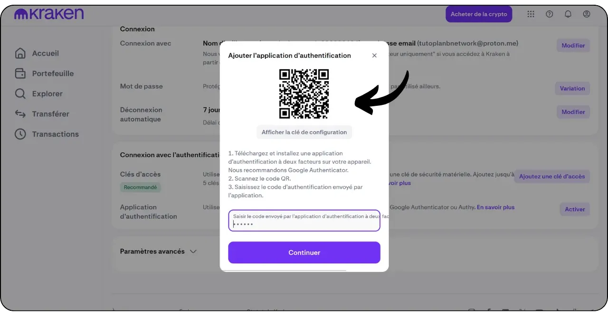

මෙම ක්‍රමය සක්‍රීය කිරීමට, ඔබේ ස්මාර්ට්ෆෝනයේ ඔබ කැමති යෙදුමෙන් QR කේතය ස්කෑන් කර, ඉන්පසු ජනනය කරන ලද අංක 6ක කේතය ඇතුළත් කරන්න.

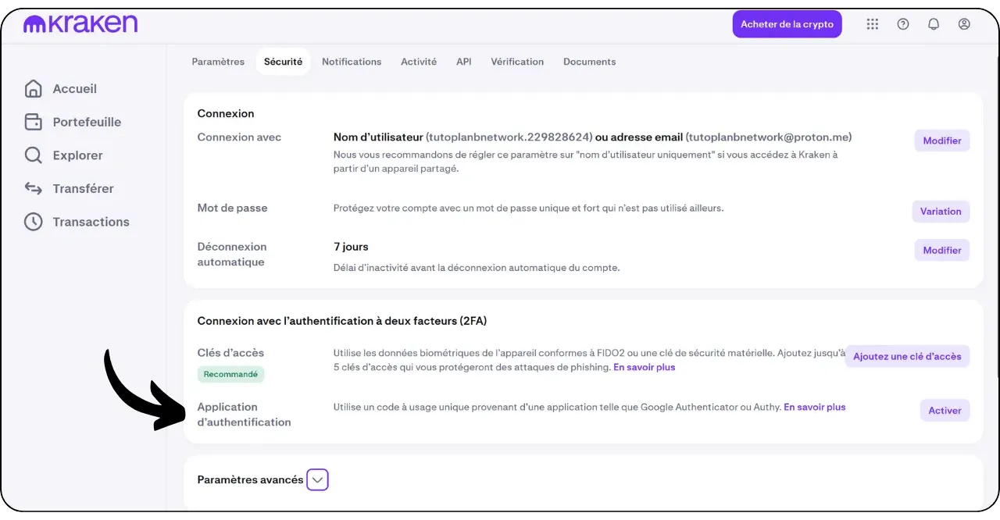

සත්‍යාපන යෙදුම් පිළිබඳ වැඩිදුර විස්තර සඳහා, ඔබට මෙම උපකාරකයද උපකාරී විය හැක:

https://planb.network/tutorials/computer-security/authentication/authy-a76ab26b-71b0-473c-aa7c-c49153705eb7

පහත, ඔබට විශිෂ්ට සැකසුම් වෙත ප්‍රවේශ විය හැකි අතර, විවිධ 2FA සකසන හැකියාව ඇතුළත් වේ. Kraken 2FA හරහා විශිෂ්ට ආරක්ෂක පවරාදීම ලබා දේ. මෙම විශේෂාංගය ඔබට විවිධ ක්‍රියාකාරකම් සඳහා විවිධ 2FA මට්ටම් නිර්මාණය කිරීමට ඉඩ සලසයි, උදාහරණයක් ලෙස, ලොග් වීම, ඇණවුම් වලංගු කිරීම සහ මුදල් ආපසු ගැනීම. මෙය, උදාහරණයක් ලෙස, ගණකාධිකාරියෙකුට මුදල් ආපසු ගැනීමේ අවසරය නොදී, විශේෂිත ක්‍රියාකාරකම් වෙත ප්‍රවේශය ලබා දීමට හැකි කරයි. මෙන්න විකල්ප:

- **master key** deluje kot mehanizem za obnovitev, ki se uporablja, če ne morete dostopati do svoje običajne metode 2FA za prijavo;
- **මූල්‍යකරණය සඳහා 2FA** යනු සියලුම මුදල් ආපසු ගැනීම් හෝ තැන්පතු Address එකක් නිර්මාණය කිරීමේදී අමතර සත්‍යාපනය අවශ්‍ය වන අතර එය ඔබේ මුදල් ආරක්ෂාව තර කරයි;
- **ව්‍යාපාර සඳහා 2FA** ගිණුමේ සිදු කරන සෑම ගනුදෙනුවක් සඳහාම 2FA පනවයි.

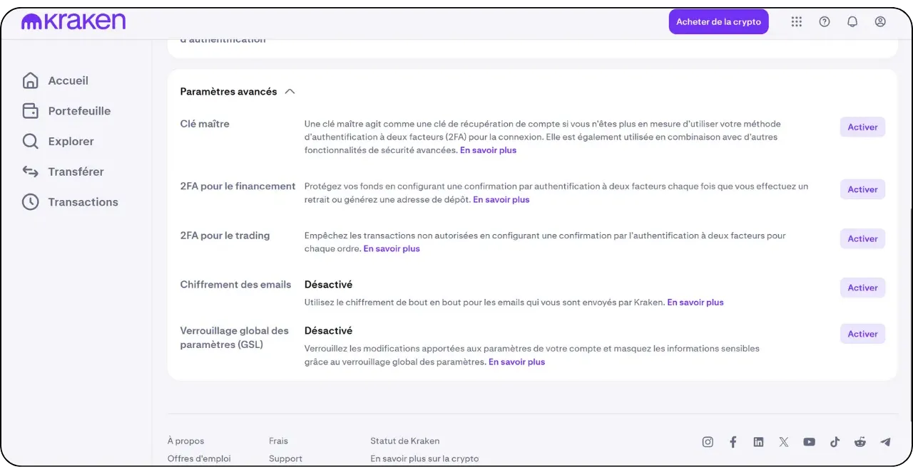

මෙම උසස් විකල්ප ඔබට ඔබේ සංවිධානය තුළ විවිධ අනුමතීකරණ මට්ටම් නිර්වචනය කිරීමට ඉඩ සලසයි.

## 4 - Fiat මුදල් තැන්පතු සහ ආපසු ගැනීම්

ඔබගේ ගිණුම සත්‍යාපනය කර ආරක්ෂා කළ පසු, ඔබට යුරෝ (හෝ ඔබගේ දේශීය මුදල් ඒකකයෙන්) මුදල් තැන්පත් කළ හැකිය. ඔබට ඔබගේ ව්‍යාපාරික අවශ්‍යතා අනුව මුදල් ආපසු ගැනීම්ද කළ හැකිය.

යුරෝ තැන්පත් කිරීමට, "*Transfer*" කොටසට යන්න.

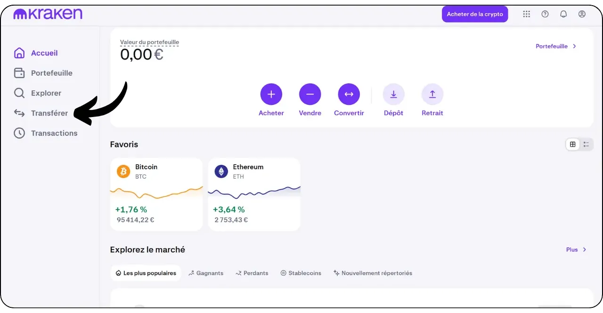

"*Asset*" පෙට්ටියෙන් "*Euro*" තෝරන්න සහ ඔබේ ව්‍යාපාරික බැංකු ගිණුමෙන් ගෙවීමක් කිරීමට අවශ්‍ය විස්තර ලබා ගැනීමට තහවුරු කරන්න. ඔබට ණය පත‍්‍රය මගින් ගෙවීමක් කිරීමටද තෝරා ගත හැක.

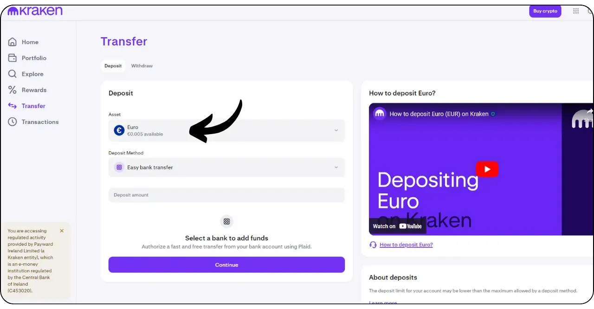

Kraken računa, sledite istemu postopku, vendar uporabite zavihek "*Withdraw*".

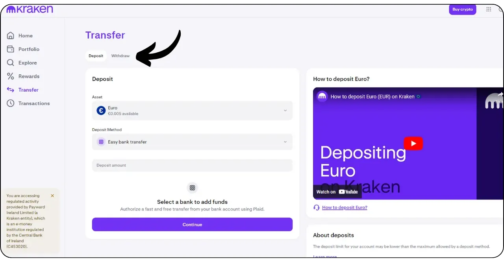

## 5 - Bitcoins deponiranje in dvigovanje

ඔබේ Kraken ගිණුමට බිට්කොයින් තැන්පත් කිරීමට, "*Transfer*" කොටසට නැවත යන්න. "*Asset*" කොටුවේ, "*BTC*" තෝරන්න, එවිට ඔබේ ස්වයං-රැකවරණ Wallet වෙතින් බිට්කොයින් යැවිය යුතු Address ලබා ගැනීමට තහවුරු කරන්න.

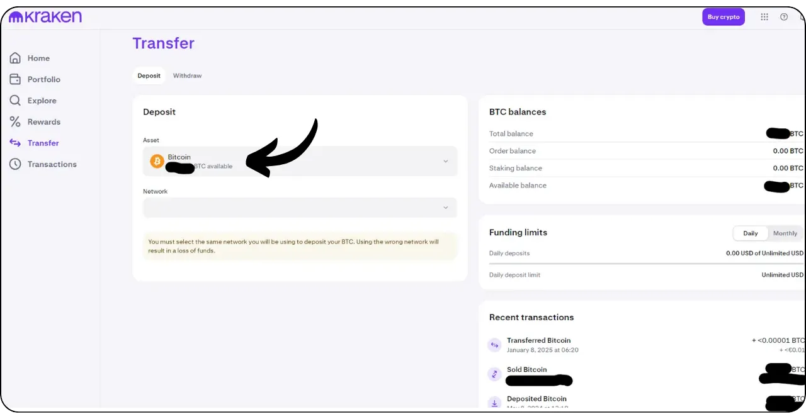

ඔබේ Kraken ගිණුමෙන් ස්වයං-අධිකාර Wallet වෙත බිට්කොයින් ඉවත් කිරීමට, "*Withdraw*" ටැබය මත ක්ලික් කරන්න.

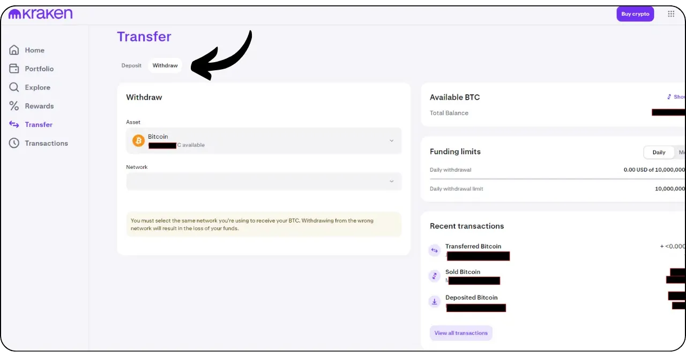

ඔබගේ Wallet Address ඇතුළත් කර, එවිට ඔබගේ 2FA භාවිතයෙන් මෙහෙයුම තහවුරු කරන්න.

## 6 - බිට්කොයින් මිලදී ගැනීම සහ විකිණීම

Kraken ponuja različne trgovalne vmesnike, od katerih je vsak zasnovan za izpolnjevanje specifičnih potreb. Za profesionalno, napredno upravljanje je priporočljiv Kraken Pro. Za enostavnejše transakcije bo zadostoval privzeti Interface od Kraken. Če želite spremeniti Interface, kliknite na majhne pike v zgornjem desnem kotu zaslona:

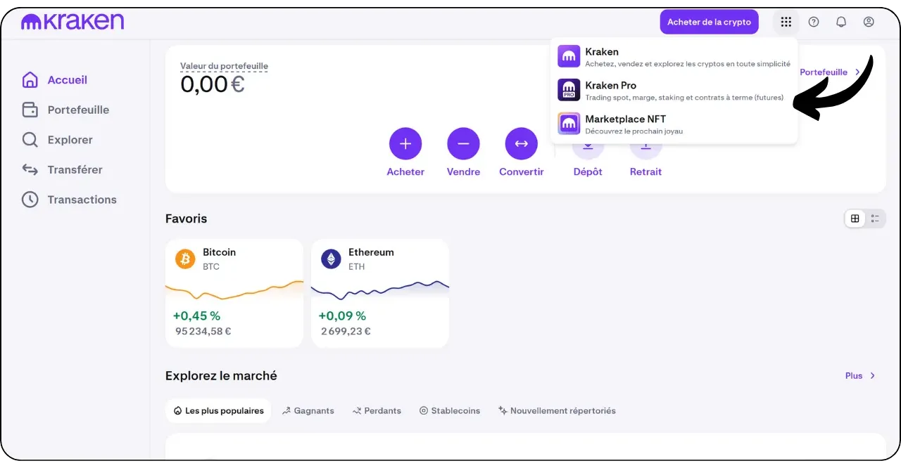

Interface මූලික පිටපතේ, Bitcoin මිලදී ගැනීමට, මුල් පිටුවේ "*Buy*" මත ක්ලික් කිරීමෙන් ආරම්භ කරන්න.

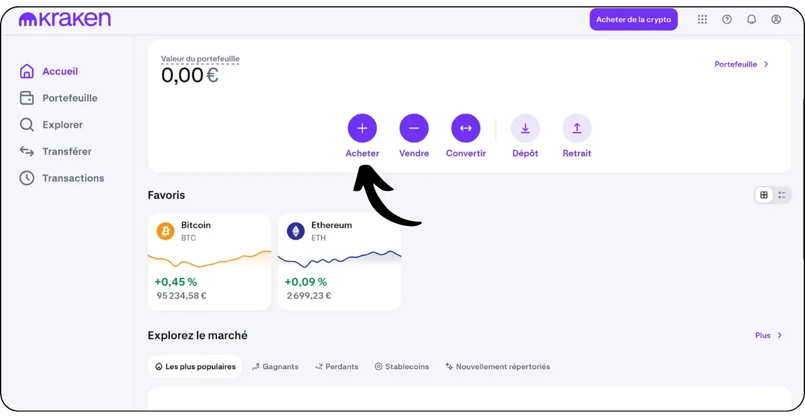

ඔබ මිලදී ගැනීමට කැමති මුදල ඇතුළත් කර මෙහෙයුම තහවුරු කරන්න. මෙම ක්‍රියාව සඳහා 2FA සකසා ඇති නම්, ඔබේ සත්‍යාපන යෙදුමෙන් ලබා දෙන 6 අංක කේතය ඇතුළත් කරන්න.

Za prodajo Bitcoin kliknite na "*Sell*".

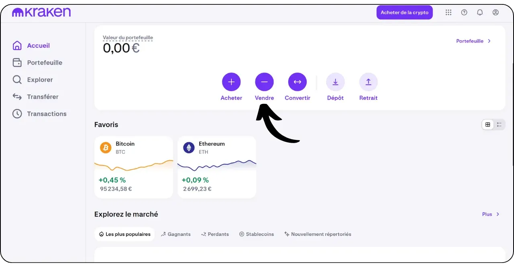

විකිණීමට ඇති මුදල ඇතුළත් කර ගනුදෙනුව සත්‍යාපනය කරන්න.

Prav tako lahko svoje bitcoine Exchange zamenjate za druge kriptovalute, kot so stabilni kovanci, da zmanjšate svojo izpostavljenost nihanjem Bitcoin. Če želite to narediti, kliknite na "*Pretvori*".

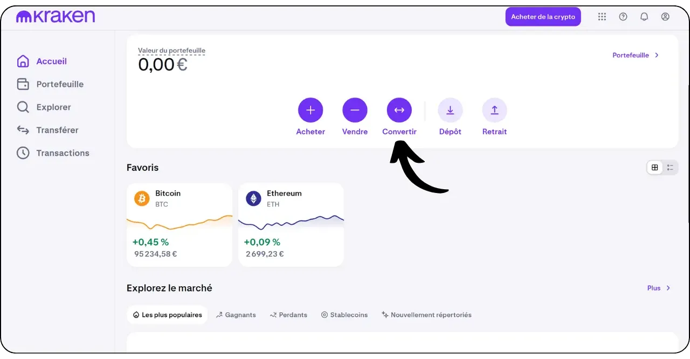

මොළවන්න මුදල, ඔබ ලබා ගැනීමට කැමති ක්‍රිප්ටෝකරන්සි තෝරන්න, එවිට ගනුදෙනුව තහවුරු කරන්න.

මෙම ගනුදෙනු සඳහා, ඔබට විවිධ ඇණවුම් වර්ග අතරින් තේරිය හැක: *වෙළඳපොළ*, *සීමා*, හෝ *නැවතුම්-අලාභ* :

- Market* : trenutni tržni nakup omogoča takojšen nakup;
- Omejitev*: Omogoča vam, da določite nakupno ceno, in naročilo bo izvedeno le, če tržna cena doseže ta znesek;
- Stop-Loss* : जब मूल्य एक निश्चित सीमा तक पुग्छ, स्वचालित रूपमा बेच्दछ।

## 7 - ගනුදෙනු කළමනාකරණය සහ ගිණුම්කරණය

Kot podjetje boste verjetno morali izvoziti podrobnosti svojih transakcij na Kraken za računovodske namene. Kraken ponuja orodja za lažji izvoz zgodovine transakcij in zagotavlja podroben pregled vašega Wallet.

"*Transactions*" मेनूमा जानुहोस् आफ्नो लेनदेन इतिहासको सरल दृश्यको लागि।

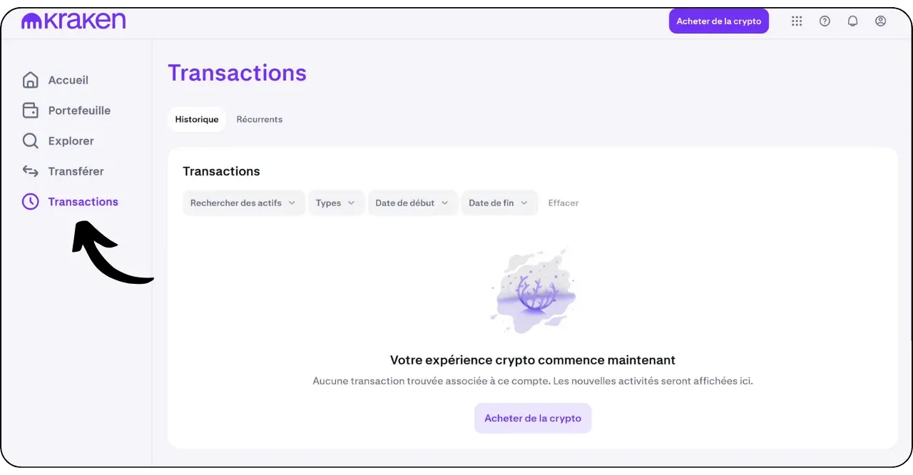

ඉතා විස්තරාත්මක ගණන් පරිපාලන අපනයන සඳහා, "*ලේඛන*" ටැබ් යටතේ සිට සැකසුම් වෙත යන්න.

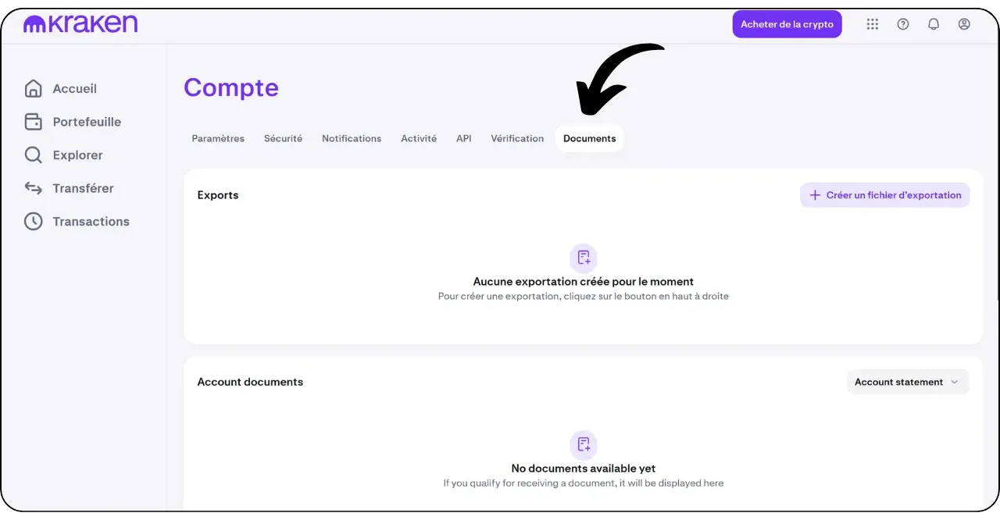

"*Create export file*" මත ක්ලික් කර ඔබට අවශ්‍ය අපනයන වර්ගය තෝරන්න. මෙම උදාහරණය සඳහා, මම ගනුදෙනු ඉතිහාසය අපනයනය කිරීමට යනවා.

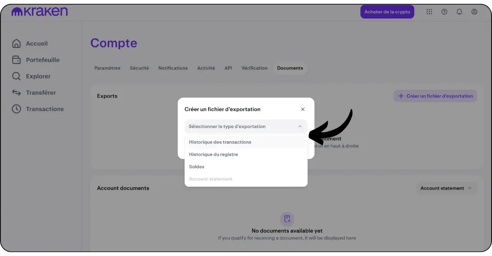

ඔබට පසුව ඔබේ තත්ත්වය සඳහා අවශ්‍ය සියලු විස්තර විශේෂිත කළ හැක:

- අපනයනය සඳහා ඇතුළත් කළ යුතු තොරතුරු ;
- සලකා බලන දිනයන් ;
- Exchange යුගලයන් ඇතුළත් කිරීමට;
- ගොනු අපනයන ආකෘතිය (PDF හෝ CSV).

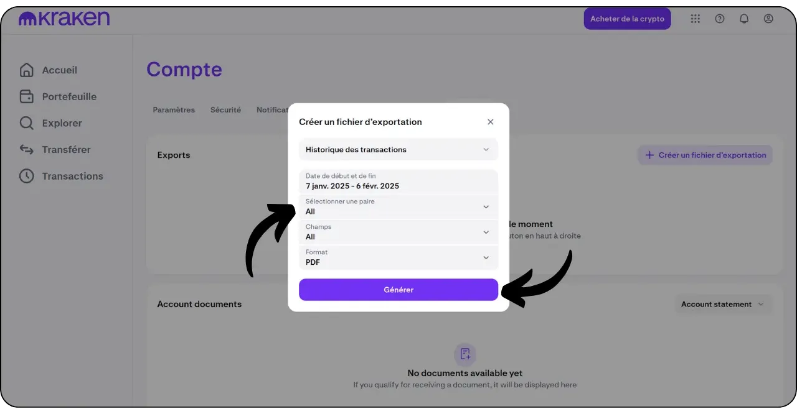

## 8 - භාවිතා කේස් සමාගම සඳහා

ඔබේ සමාගමේ අරමුණු සහ ව්‍යුහය අනුව, Kraken භාවිතය වෙනස් විය හැක.

### Bitcoin za gotovino kupiti

**ඉලක්කය:** Bitcoin හි ආයෝජනය කිරීමෙන් සමාගමේ මුදල් ප්‍රවාහය විවිධාංගීකරණය කිරීම.

**අනුගමනය කළ යුතු පියවර:**

- Kraken račun podjetja položite evre;
- Teh evrov uporabi za nakup Bitcoin;
- බිට්කොයින් පළපුරුද්දේ තබා ගන්න හෝ ස්වයං-අධිකාරියෙන් ආරක්ෂා කිරීමට ඒවා ආපසු ගන්න ;
- අවශ්‍ය ලෙස අපනයන ගනුදෙනු ඉතිහාසය.

### Bitcoin kot plačilno sredstvo sprejemamo

**ඉලක්කය:** ඔබේ සමාගමට ඔබේ නිෂ්පාදන හෝ සේවා සඳහා ගෙවීම් ක්‍රමයක් ලෙස Bitcoin පිළිගැනීමේ හැකියාව ලබා දීම.

**අනුගමනය කළ යුතු පියවර:**

- Bitcoin ගෙවීම් පද්ධතියක් ඒකාබද්ධ කරන්න. කුඩා ව්‍යාපාර සඳහා, සරල Wallet මෘදුකාංගය ප්‍රමාණවත් විය හැකි අතර, ඔබේ වෙබ් අඩවියේ හෝ විකුණුම් ස්ථානයේදී Bitcoin ගෙවීම් විකල්පයක් ලෙස ඒකාබද්ධ කිරීමට Swiss Bitcoin Pay හෝ BTCPay Server වැනි විශේෂිත විසඳුම් තෝරා ගත හැක;
- Bitcoin-වලින් ලැබෙන මාරු ගෙවීම් ඔබේ Kraken ගිණුමට;
- ඔබේ මූල්‍යමය උපාය මාර්ගය මත පදනම්ව, ලැබූ බිට්කොයින් යුරෝ සඳහා විකිණීම, අනාගතයේ ඇති වටිනාකම වැඩිවීම සඳහා ඒවා තබා ගැනීම, හෝ දෙකම එකට එකතු කිරීම තෝරන්න;
- Bitcoin-වෙළඳපොළේ bitcoins තබා ගන්න හෝ ස්වයං-රැකවරණය සඳහා ඒවා ආපසු ගන්න. ඔබට යුරෝද ඔබේ බැංකු ගිණුමට ආපසු ගත හැක;
- ලෙදා-පෙදා ගැනීම් ඉතිහාසය අවශ්‍ය පරිදි අපනයනය කරන්න.

Za bolj poglobljen pogled na to temo priporočam ta obsežen tečaj usposabljanja o vključevanju Bitcoin v podjetja, ki podrobno pokriva dodajanje denarnemu toku, sprejemanje plačil Bitcoin in računovodstvo :

https://planb.network/courses/a804c4b6-9ff5-4a29-a530-7d2f5d04bb7a