Keet adalah aplikasi pesan instan yang dirancang untuk bekerja tanpa server. Diluncurkan pada tahun 2022 oleh Holepunch (sebuah perusahaan yang dibiayai oleh Tether dan Bitfinex), aplikasi ini sepenuhnya didasarkan pada jaringan peer-to-peer dan menampilkan pendekatan yang terdesentralisasi secara radikal: pesan, panggilan, dan berkas dipertukarkan secara langsung di antara para pengguna, tanpa perantara.

Keet mengenkripsi semua komunikasi dari ujung ke ujung dan tidak meminta data pribadi. Pendaftaran bersifat anonim, tanpa memerlukan nomor telepon atau email. Selain bertukar pesan teks, Keet menawarkan panggilan video berkualitas sangat tinggi, serta berbagi file tanpa batas. Oleh karena itu, aplikasi ini dapat digunakan dengan cara hibrida, baik untuk penggunaan pribadi maupun profesional.

Saat ini (April 2025), Keet belum sepenuhnya menjadi sumber terbuka. Beberapa kode sumber tersedia di [repositori GitHub Holepunch] (https://github.com/holepunchto), terutama komponen kriptografi dan jaringan, tetapi klien Interface belum. Akan tetapi, Holepunch telah mengumumkan niatnya untuk membuat seluruh aplikasi menjadi sumber terbuka pada akhirnya. Tergantung pada saat Anda menemukan tutorial ini, hal ini mungkin sudah dilakukan.

| Application          | E2EE 1:1       | E2EE groupes   | Inscription anonyme | Licence client open-source | Licence serveur open-source | Serveur décentralisé | Année de création |
| -------------------- | -------------- | -------------- | ------------------- | -------------------------- | --------------------------- | -------------------- | ----------------- |
| WhatsApp             | ✅              | ✅              | ❌                   | ❌                          | ❌                           | ❌                    | 2009              |
| WeChat               | ❌              | ❌              | ❌                   | ❌                          | ❌                           | ❌                    | 2011              |
| Facebook Messenger   | ✅              | 🟡 (optionnel) | ❌                   | ❌                          | ❌                           | ❌                    | 2011              |
| Telegram             | 🟡 (optionnel) | ❌              | 🟡                  | ✅                          | ❌                           | ❌                    | 2013              |
| LINE                 | ✅              | ✅              | ❌                   | ❌                          | ❌                           | ❌                    | 2011              |
| Signal               | ✅              | ✅              | ❌                   | ✅                          | ✅                           | ❌                    | 2014              |
| Threema              | ✅              | ✅              | ✅                   | ✅                          | ❌                           | ❌                    | 2012              |
| Element (Matrix)     | ✅              | ✅              | ✅                   | ✅                          | ✅                           | 🟡 (fédéré)          | 2016              |
| Delta Chat           | ✅              | ✅              | ✅                   | ✅                          | N/A                         | 🟡 (via email)       | 2017              |
| Conversations (XMPP) | ✅              | ✅              | ✅                   | ✅                          | ✅                           | 🟡 (fédéré)          | 2014              |
| Session              | ✅              | ✅              | ✅                   | ✅                          | ✅                           | ✅                    | 2020              |
| SimpleX              | ✅              | ✅              | ✅                   | ✅                          | ✅                           | ✅                    | 2021              |
| Olvid                | **✅**          | **✅**          | **✅**               | **✅**                      | **❌**                       | **❌**                | 2019              |
| **Keet**             | ✅              | ✅              | ✅                   | ❌                          | N/A                         | ✅                    | 2022              |
| Jami                 | ✅              | ✅              | ✅                   | ✅                          | N/A                         | ✅                    | 2005              |
| Briar                | ✅              | ✅              | ✅                   | ✅                          | N/A                         | ✅                    | 2018              |
| Tox                  | ✅              | ✅              | ✅                   | ✅                          | N/A                         | ✅                    | 2013              |

*E2EE = Enkripsi ujung ke ujung*

## Instal Keet

Keet tersedia di semua platform. Anda dapat mengunduh aplikasi ini langsung dari toko aplikasi ponsel Anda:

- [Google Play](https://play.google.com/store/apps/details?id=io.keet.app&pli=1);
- [App Store](https://apps.apple.com/us/app/keet-by-holepunch/id6443880549);

Di Android, juga memungkinkan untuk [menginstal melalui APK](https://github.com/holepunchto/keet-mobile-releases/releases).

Dalam tutorial ini, kami akan berkonsentrasi pada versi seluler, tetapi harap dicatat bahwa [versi komputer juga tersedia] (https://keet.io/) (MacOS, Linux, dan Windows). Anda juga dapat menyinkronkan akun Anda di beberapa perangkat.

## Buat akun di Keet

Pada peluncuran pertama, Anda dapat mengabaikan layar presentasi.

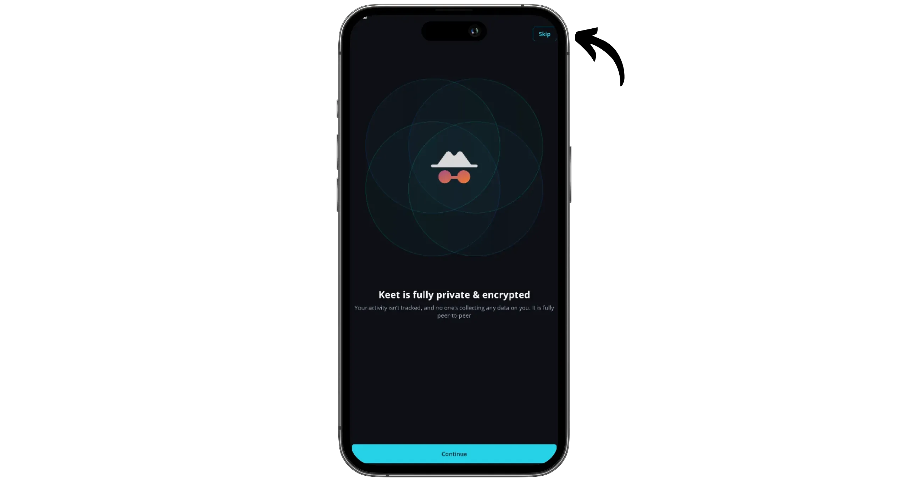

Klik tombol "*Saya pengguna baru*".

Setujui persyaratan penggunaan, lalu klik "*Penyiapan cepat*".

Pilih nama atau nama panggilan, kemudian klik "*Selesai penyiapan*".

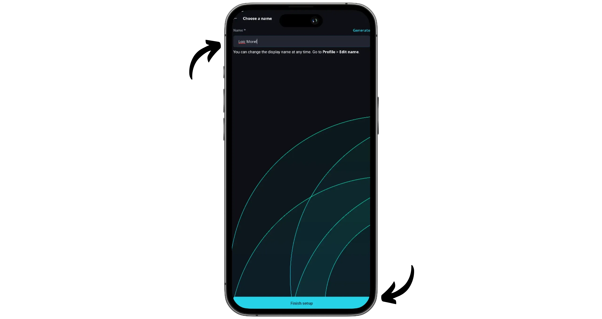

Profil Anda sekarang sudah dibuat. Klik "*Selesai penyiapan*" sekali lagi untuk menyelesaikannya.

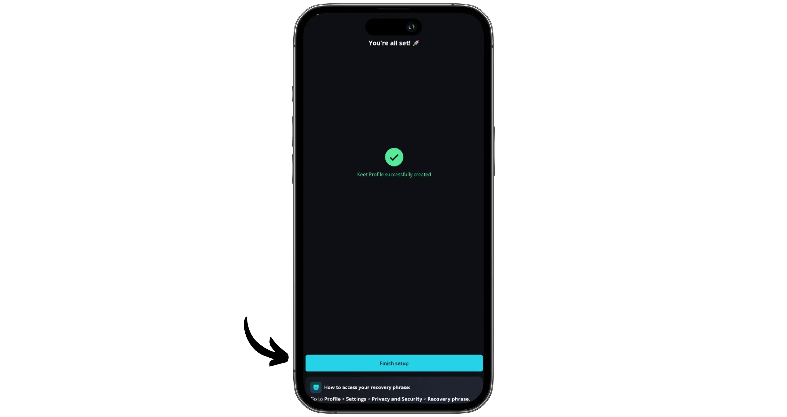

Anda dapat menyesuaikan profil Anda kapan saja dari tab "*Profil*".

## Simpan akun Keet Anda

Hal pertama yang harus dilakukan dengan akun Keet baru Anda adalah menyimpan frasa pemulihan Anda. Ini adalah urutan 24 kata yang akan memungkinkan Anda untuk memulihkan akses ke akun Anda jika terjadi kehilangan atau pergantian perangkat. Frasa ini memberikan akses penuh ke akun Anda kepada siapa pun yang mengetahuinya, jadi penting untuk membuat cadangan yang dapat diandalkan dan jangan pernah membocorkannya.

Untuk melakukan ini, klik tab "*Profile*" di kanan bawah Interface.

Kemudian akses menu "*Pengaturan*".

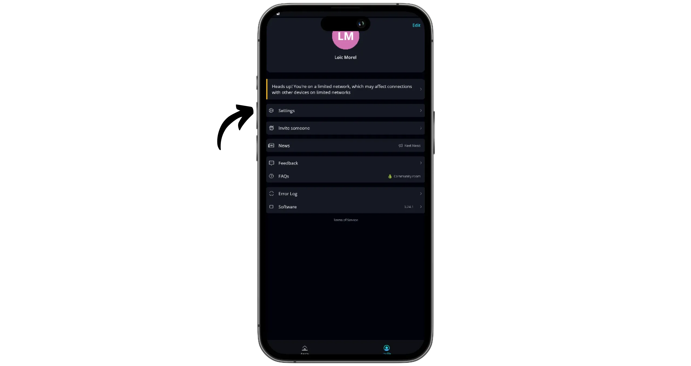

Pilih "*Privasi dan Keamanan*".

Kemudian klik "*Frase pemulihan*".

Tekan tombol "*Lihat frasa*" untuk menampilkan frasa pemulihan Anda. Salin dengan hati-hati dan simpan di tempat yang aman.

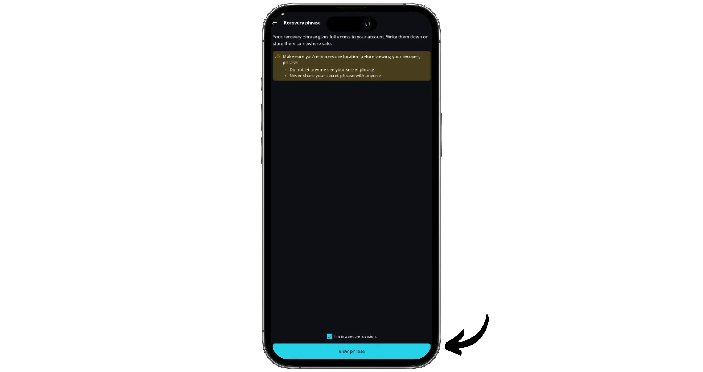

## Mengirim pesan dengan Keet

Untuk berkomunikasi di Keet, Anda perlu membuat "*Rooms*". Untuk melakukannya, klik ikon pensil di kanan atas Interface.

Pilih "*Obrolan grup baru*".

Pilih nama dan deskripsi untuk "*Room*" Anda, lalu klik "*Buat obrolan grup*".

"*Room*" Anda sekarang telah dibuat. Klik ikon "*+*" di kanan atas untuk mengundang peserta.

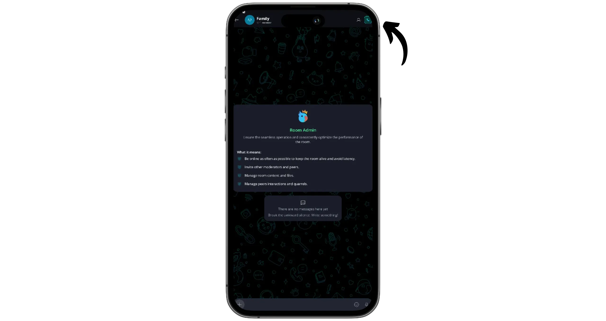

Tentukan hak yang Anda berikan kepada anggota baru melalui tautan undangan, serta durasi validitas tautan. Kemudian klik "*Undangan generate*".

Keet akan mengirimkan tautan untuk bergabung dengan "*Room*" Anda. Anda dapat menyalinnya dan membagikannya, atau meminta kode QR-nya dipindai oleh orang yang ingin Anda undang.

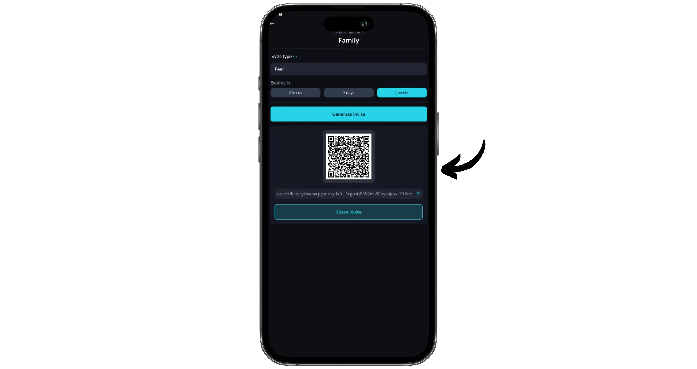

Anda sekarang dapat mulai bertukar pesan dan file multimedia. Untuk memulai panggilan, klik ikon telepon di sudut kanan atas.

Dari grup ini, Anda juga dapat mengirim pesan pribadi ke anggota tertentu. Klik gambar profil grup, lalu pilih anggota yang diinginkan di bagian "*Anggota*".

Klik tombol "*Kirim permintaan DM*" dan masukkan pesan Anda.

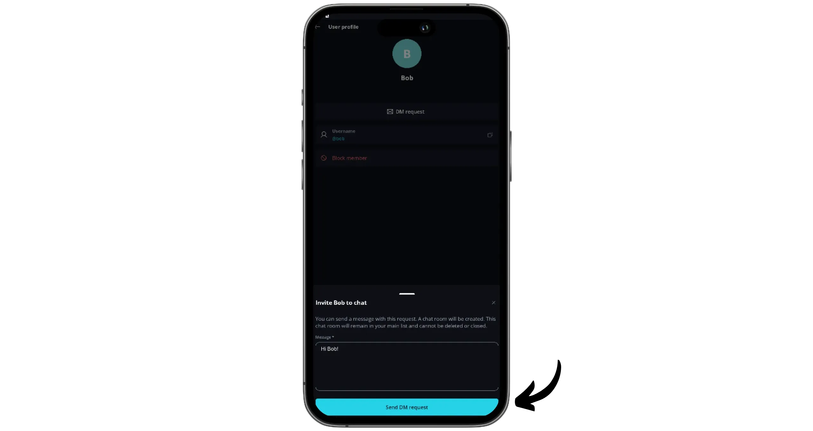

Setelah permintaan DM diterima, Anda akan menemukan kontak ini di halaman beranda, di mana Anda dapat berbicara dengannya secara pribadi.

## Menyinkronkan akun Anda di beberapa perangkat

Sekarang setelah Anda mengetahui cara menggunakan Keet dan memiliki akun, Anda juga dapat menyinkronkannya pada perangkat lain, seperti komputer. Untuk melakukannya, buka aplikasi di ponsel Anda, lalu klik "*Profile*" dan akses "*Settings*".

Kemudian buka menu "*Perangkat saya*".

Klik "*Tambahkan perangkat*". Keet akan membuat tautan untuk menyinkronkan perangkat baru. Salin tautan ini.

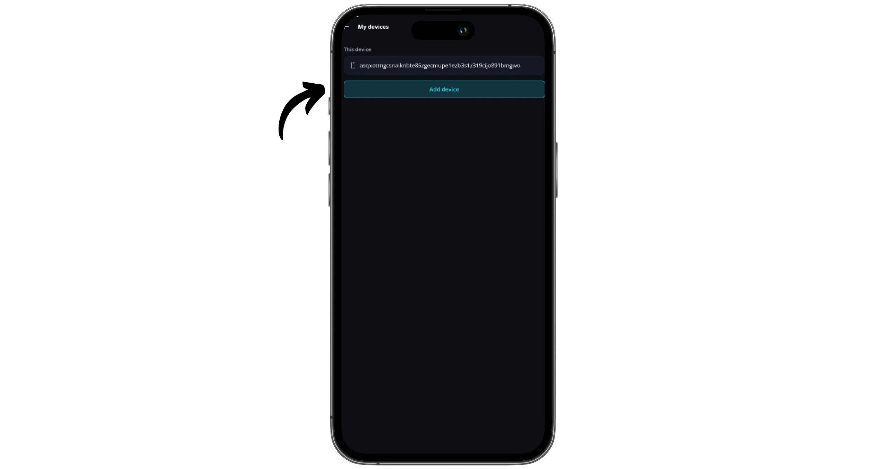

Pada perangkat kedua Anda, instal Keet. Pada layar beranda, pilih opsi "*Saya pengguna saat ini*".

Kemudian klik "*Tautkan perangkat*".

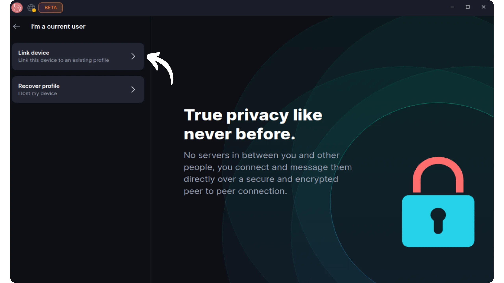

Rekatkan tautan yang disediakan oleh perangkat pertama Anda, lalu klik "*Mulai sinkronisasi*".

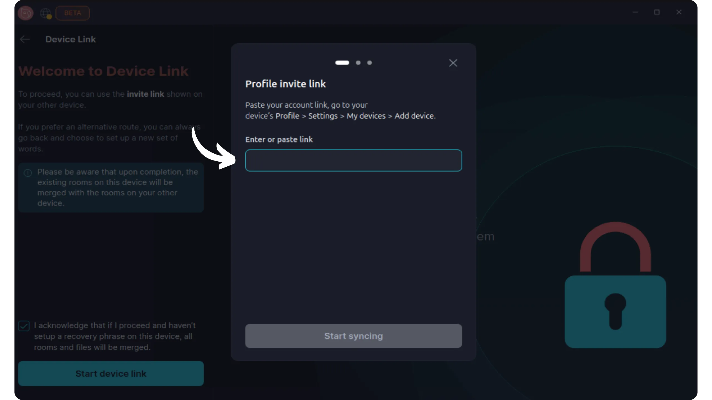

Pada perangkat pertama Anda, klik "*Konfirmasi perangkat tautan*" untuk mengesahkan koneksi.

Pada perangkat kedua, selesaikan prosesnya dengan mengeklik "*Tautkan perangkat*".

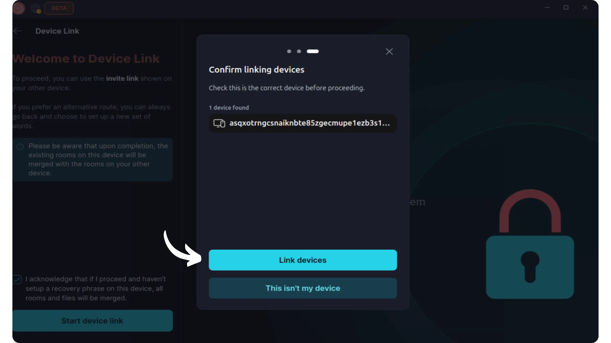

Sekarang Anda dapat mengakses semua "*Room*" dan percakapan Anda dari perangkat baru ini.

Selamat, Anda sekarang sudah mahir menggunakan perpesanan Keet, sebuah alternatif yang bagus untuk WathsApp! Jika Anda merasa tutorial ini bermanfaat, saya akan sangat berterima kasih jika Anda memberikan tanda jempol Green di bawah ini. Jangan ragu untuk membagikan tutorial ini di jejaring sosial Anda. Terima kasih banyak!

Saya juga merekomendasikan tutorial lain ini, di mana saya memperkenalkan Anda pada Proton Mail, sebuah alternatif yang jauh lebih ramah privasi daripada Gmail:

https://planb.network/tutorials/computer-security/communication/proton-mail-c3b010ce-254d-4546-b382-19ab9261c6a2