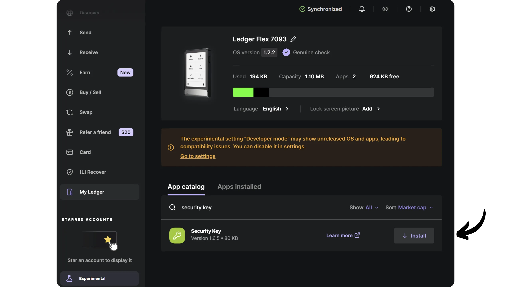
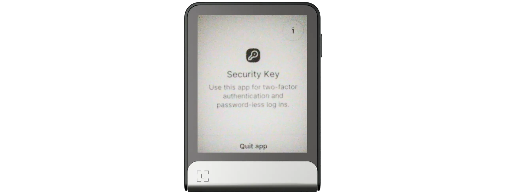
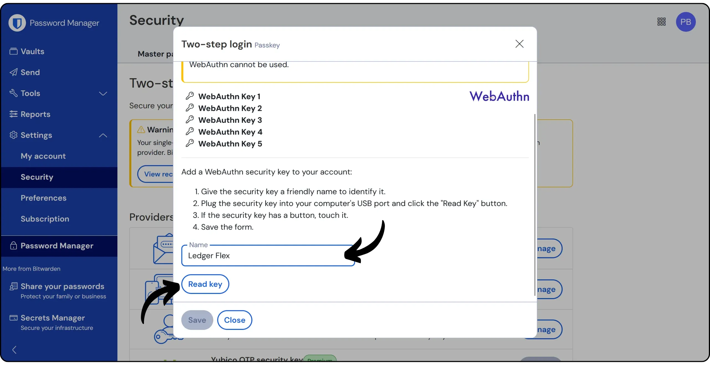
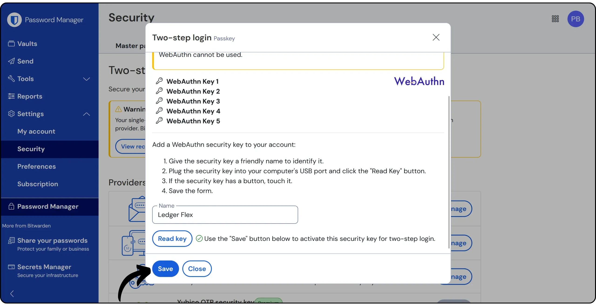
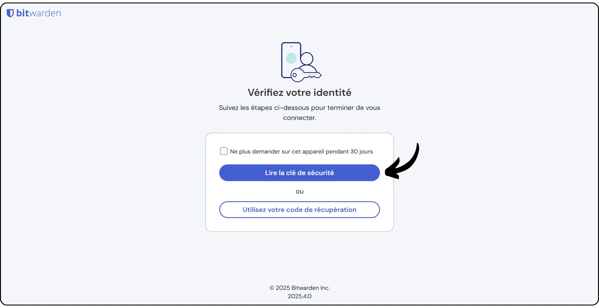
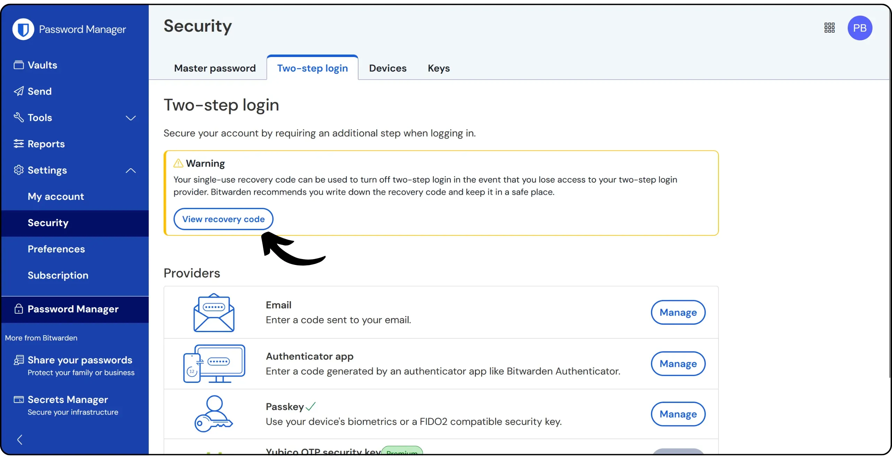

Ledger උපාංග Bitcoin Wallet ආරක්ෂා කිරීමට මුල්ව නිර්මාණය කරන ලද දෘඩාංග පසුම්බි වන අතර, ඔවුන් වෙබ් අන්තර්ගතයේ ශක්තිමත් සත්‍යාපනය සඳහා උසස් විකල්පයන් ද පෙන්වයි. **U2F** සහ **FIDO2** ප්‍රොටෝකෝල සමඟ ඔවුන්ගේ අනුකූලතාවයට ස්තූතිවන්තව, දෙවන සත්‍යාපන සාධකයක් පිහිටුවා ඔබේ මාර්ගගත ගිණුම් වෙත ප්‍රවේශය ආරක්ෂා කිරීමට ඔවුන්ට හැකිය.

U2F (Universal 2nd Factor) प्रोटोकल Google र Yubico द्वारा 2014 मा प्रस्तुत गरिएको थियो, त्यसपछि FIDO Alliance द्वारा मानकीकृत गरिएको थियो। यसले लगइन गर्दा दोस्रो भौतिक प्रमाणीकरण कारक (2FA) थप्न सक्षम बनाउँछ। एक पटक सक्रिय भएपछि, क्लासिक पासवर्डको अतिरिक्त, प्रयोगकर्ताहरूले आफ्नो Ledger मा बटन थिचेर आफ्नो खातामा जडान गर्न प्रत्येक प्रयासलाई अनुमोदन गर्नुपर्छ। यस सन्दर्भमा, Ledger ले Yubikey जस्तै तरिकामा काम गर्छ। वास्तवमा U2F FIDO2 मापदण्डको उप-घटक हो, जसले यसलाई समेट्छ जबकि आधुनिक ब्राउजरहरूको लागि देशी समर्थन र प्रमाणीकरण कुञ्जी व्यवस्थापनमा ठूलो लचिलोपन सहित महत्वपूर्ण सुधारहरू ल्याउँछ।

यी विधिहरू विषम क्रिप्टोग्राफीमा आधारित छन्: कुनै गोप्य डाटा प्रसारित हुँदैन, जसले फिशिङ वा अवरोध आक्रमणहरूलाई अप्रभावी बनाउँछ। U2F र FIDO2 अहिले धेरै अनलाइन सेवाहरूद्वारा समर्थित छन्।

මෙම උපදෙස් මාලාවේ, අපි ඔබට ඔබේ Ledger සඳහා දෙකේ-සාධක සත්‍යාපනය සඳහා U2F සහ FIDO2 ක්‍රියාත්මක කරන ආකාරය පෙන්වන්නෙමු.

**සටහන:** U2F සහ FIDO2 සියලුම Ledger උපාංගවල අලුත්ම ෆාර්ම්වේර් සමඟ සහය දක්වයි: Nano X සහ Nano S ක්ලාසික සඳහා අනුවාදය 2.1.0 සිට, සහ Nano S Plus සඳහා අනුවාදය 1.1.0 සිට. Stax සහ Flex ආකෘති ස්වභාවිකව අනුකූල වේ.

## Ledger ආරක්ෂක යතුරු යෙදුම ස්ථාපනය කරන්න

ඔබ Ledger උපාංගයක් භාවිතා කරන්නේ නම්, ඔබට වඩාත්ම අවශ්‍ය විශේෂාංග සියල්ලම ක්‍රිප්ටෝ වොලට් කළමනාකරණය කිරීමට firmware එකේ පමණක් අඩංගු නොවන බව ඔබ දන්නවා. උදාහරණයක් ලෙස, Bitcoin Wallet භාවිතා කිරීමට, ඔබ "*Bitcoin*" යෙදුම ස්ථාපනය කළ යුතුය. එමෙන්ම, MFA යතුරු කළමනාකරණය කිරීමට, ඔබ "*Security Key*" යෙදුම ස්ථාපනය කළ යුතුය.

ඔබ ආරම්භ කිරීමට පෙර, ඔබේ Bitcoin Wallet ඔබේ Ledger මත සකසා ඇති බව සහතික වන්න. ඔබේ Mnemonic නිවැරදිව සුරැකීම වැදගත් වන අතර, 2FA සඳහා භාවිතා කරන යතුරු මෙම Mnemonic මගින් ලබා ගන්නා ලදී. ඔබේ Ledger අහිමි වූ හෝ හානි වූ විට, වෙනත් Ledger උපාංගයක ඔබේ Mnemonic වාක්‍යය ඇතුළත් කිරීමෙන් ඔබේ යතුරු වෙත ප්‍රවේශය නැවත ලබා ගත හැක (දැනට, "*passwordless*" ප්‍රකාරයේ FIDO2 හඳුනාගැනීම් Ledgers මත තවමත් සහය නොදක්වන බැවින්, නේවාසික හඳුනාගැනීම් නොමැත).

ඔබේ Ledger පරිගණකයට සම්බන්ධ කර එය අගුළු අරින්න.

Če želite namestiti aplikacijo, odprite programsko opremo [Ledger Live] (https://www.Ledger.com/Ledger-live), nato pojdite na zavihek "*My Ledger*". Poiščite aplikacijo "*Security Key*" in jo namestite na svojo napravo.

"*Security Key*" යෙදුම දැන් ඔබේ Ledger හි ස්ථාපිත කර ඇති අනෙකුත් යෙදුම් සමඟ පෙනී යිය යුතුය.

මෙම උපකාරක පියවරවල ඊළඟ පියවර සඳහා යෙදුම විවෘතව තබා ගැනීමට එය ක්ලික් කරන්න.

## Ledger සමඟ 2FA සඳහා U2F/FIDO2 භාවිතා කරන්න

ඔබට දෙකේ-සාධක සත්‍යාපනයෙන් ආරක්ෂා කිරීමට අවශ්‍ය ගිණුම ප්‍රවේශ වන්න. උදාහරණයක් ලෙස, මම Bitwarden ගිණුමක් භාවිතා කිරීමට යනවා. සාමාන්‍යයෙන් ඔබට 2FA විකල්පය සොයාගත හැකි වන්නේ සේවා සැකසුම් තුළ, "*සත්‍යාපනය*", "*ආරක්ෂාව*", "*පිවිසුම*" හෝ "*මුරපදය*" ටැබ් යටතේ.

දෙකේ-සාධක සත්‍යාපනය සඳහා කැපවූ කොටස තුළ, "*Passkey*" විකල්පය තෝරන්න (ඔබ භාවිතා කරන වෙබ් අඩවිය අනුව පදය වෙනස් විය හැක).

ඔබට නිතරම ඔබේ වර්තමාන මුරපදය තහවුරු කරන ලෙස ඉල්ලා සිටිනු ඇත.

ඔබේ ආරක්ෂක යතුරට පහසුවෙන් හඳුනාගත හැකි නමක් දෙන්න, එවිට "*යතුර කියවන්න*" මත ක්ලික් කරන්න.

ඔබේ ගිණුම් විස්තර Ledger ප්‍රදර්ශනයේ පෙනේ. තහවුරු කිරීමට "*ලියාපදිංචි*" බොත්තම ඔබන්න (හෝ ඔබ භාවිතා කරන ආකෘතිය අනුව බොත්තම් දෙකම එකවර ඔබන්න).

ප්‍රවේශ යතුර සාර්ථකව ලියාපදිංචි කර ඇත.

මෙම ආරක්ෂක යතුර ලියාපදිංචි කරන්න.

මෙතැන් සිට, ඔබේ ගිණුමට පිවිසෙන විට, ඔබේ සාමාන්‍ය මුරපදය අමතරව, ඔබේ Ledger සම්බන්ධ කිරීමට ඔබගෙන් ඉල්ලා සිටිනු ඇත.

ඔබට පසුව ඔබේ Ledger ප්‍රදර්ශනයේ "*Log in*" බොත්තම ඔබා සත්‍යාපනය තහවුරු කළ හැක (හෝ ඔබ භාවිතා කරන ආකෘතිය අනුව බොත්තම් දෙකම එකවර ඔබා).

Hardware Wallet Ledger භාවිතා කිරීමේ වාසිය වන්නේ ඔබට Mnemonic වාක්‍යය හේතුවෙන් ඔබේ යතුරු පහසුවෙන් නැවත ලබා ගත හැකි වීමයි. මෙම මූලික උපස්ථයකට අමතරව, ඔබ 2FA සක්‍රීය කර ඇති සෑම සේවාවකින්ම සපයන හදිසි කේතයක්ද භාවිතා කළ හැක. මෙම හදිසි කේතය ඔබේ ආරක්ෂිත යතුර අහිමි වූ විට ඔබේ ගිණුමට සම්බන්ධ වීමට ඔබට හැකියාව සලසයි. එබැවින් අවශ්‍ය නම් සම්බන්ධතාවයක් සඳහා 2FA වෙනුවට එය භාවිතා කරයි.

Bitwarden මත, උදාහරණයක් ලෙස, "*ප්‍රතිසාධන කේතය බලන්න*" ක්ලික් කිරීමෙන් ඔබට මෙම කේතය ප්‍රවේශ විය හැක.

මම ඔබට නිර්දේශ කරන්නේ මෙම කේතය ඔබේ ප්‍රධාන මුරපදය ගබඩා කරන ස්ථානයෙන් වෙනම තබා ගැනීමට, ඒවා එකට සොරා ගැනීම වැළැක්වීම සඳහා. උදාහරණයක් ලෙස, ඔබේ මුරපදය මුරපද කළමනාකරුකින් සුරක්ෂිත කර ඇත්නම්, ඔබේ 2FA හදිසි කේතය කඩදාසියක, වෙනම තබා ගන්න.

මෙම ආකාරය ඔබට 2FA සත්‍යාපනය සඳහා ඔබේ Ledger අහිමි වීමේ අවස්ථාවකදී ආපසු ලබා ගැනීමේ මට්ටම් දෙකක් ලබා දේ: ඔබේ සියලු ගිණුම් සඳහා Mnemonic වාක්‍යය භාවිතා කරමින් පළමු ආපසු ලබා ගැනීමක්, සහ හදිසි කේත භාවිතා කරමින් විශේෂිත ගිණුම් සඳහා දෙවන ආපසු ලබා ගැනීමක්. කෙසේ වෙතත්, **Mnemonic හි භූමිකාව හදිසි කේතය සමඟ ගැලපෙන ලෙස නොකරන ලෙස** වැදගත් වේ:

- 12- ali 24-besedna fraza Mnemonic vam omogoča dostop ne le do ključev, ki se uporabljajo za 2FA na vseh vaših računih, temveč tudi do vaših bitcoinov, zavarovanih z vašim Ledger ;
- අවස්ථානුකූල කේතය ඔබට 2FA ඉල්ලීම තාවකාලිකව වළක්වා ගැනීමට ඉඩ සලසයි, සම්බන්ධිත ගිණුම සඳහා පමණි (මෙම උදාහරණයේ, Bitwarden සඳහා පමණි).

ඔබට සුභ පැතුම්, දැන් ඔබේ Ledger භාවිතා කරමින් MFA සඳහා වේගවත් වී ඇත! මෙම උපදෙස් මාලාව ප්‍රයෝජනවත් වූවා නම්, Green අඟුල් මූණක් පහළින් තබා මම ඉතාමත්ම කෘතඥ වනු ඇත. කරුණාකර මෙම උපදෙස් මාලාව ඔබේ සමාජ ජාලවල බෙදා ගැනීමට නිදහස් වන්න. ඔබට බොහෝම ස්තුතියි!

Priporočam tudi ta drugi vadnico, v kateri si ogledamo drugo rešitev za avtentikacijo U2F in FIDO2:

https://planb.network/tutorials/computer-security/authentication/security-key-61438267-74db-4f1a-87e4-97c8e673533e