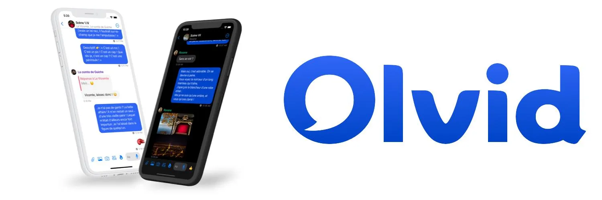

Olvid là một ứng dụng nhắn tin tức thời của Pháp ra mắt vào năm 2019, được thiết kế để cung cấp mức độ bảo mật cao mà không ảnh hưởng đến quyền riêng tư. Không giống như WhatsApp hay Signal, Olvid không yêu cầu dữ liệu cá nhân khi đăng ký: không số điện thoại, không email, không gì cả. Nhận dạng giữa những người dùng dựa trên Exchange của các khóa, không có máy chủ thư mục hoặc sổ Address được chia sẻ.

Tất cả các tin nhắn đều được mã hóa đầu cuối bằng giao thức mã hóa gốc, được thiết kế để bảo vệ siêu dữ liệu: không ai biết bạn đang nói chuyện với ai hoặc khi nào. Mã máy khách là mã nguồn mở, nhưng máy chủ trung tâm được sử dụng để định tuyến tin nhắn được mã hóa vẫn là độc quyền và được lưu trữ trên AWS.

Olvid cung cấp phiên bản miễn phí và phiên bản đăng ký với giá 4,99 € mỗi tháng. Phiên bản miễn phí cung cấp đầy đủ chức năng, ngoại trừ việc thực hiện cuộc gọi âm thanh và video (mặc dù có thể nhận được chúng) và không cho phép đồng bộ hóa tài khoản trên nhiều thiết bị. Vì vậy, nếu bạn đang có kế hoạch sử dụng điện thoại thông minh của mình và không cần thực hiện cuộc gọi, Olvid là một giải pháp tuyệt vời.

Olvid được chứng nhận bởi ANSSI (cơ quan an ninh mạng của Pháp). Ứng dụng này là một giải pháp thay thế tuyệt vời cho các dịch vụ nhắn tin truyền thống (WhatsApp, Facebook Messenger, WeChat...) dành cho những người tìm kiếm sự riêng tư trong khi vẫn giữ được sự đơn giản khi sử dụng.

| Application          | E2EE 1:1       | E2EE groupes   | Inscription anonyme | Licence client open-source | Licence serveur open-source | Serveur décentralisé | Année de création |
| -------------------- | -------------- | -------------- | ------------------- | -------------------------- | --------------------------- | -------------------- | ----------------- |
| WhatsApp             | ✅              | ✅              | ❌                   | ❌                          | ❌                           | ❌                    | 2009              |
| WeChat               | ❌              | ❌              | ❌                   | ❌                          | ❌                           | ❌                    | 2011              |
| Facebook Messenger   | ✅              | 🟡 (optionnel) | ❌                   | ❌                          | ❌                           | ❌                    | 2011              |
| Telegram             | 🟡 (optionnel) | ❌              | 🟡                  | ✅                          | ❌                           | ❌                    | 2013              |
| LINE                 | ✅              | ✅              | ❌                   | ❌                          | ❌                           | ❌                    | 2011              |
| Signal               | ✅              | ✅              | ❌                   | ✅                          | ✅                           | ❌                    | 2014              |
| Threema              | ✅              | ✅              | ✅                   | ✅                          | ❌                           | ❌                    | 2012              |
| Element (Matrix)     | ✅              | ✅              | ✅                   | ✅                          | ✅                           | 🟡 (fédéré)          | 2016              |
| Delta Chat           | ✅              | ✅              | ✅                   | ✅                          | N/A                         | 🟡 (via email)       | 2017              |
| Conversations (XMPP) | ✅              | ✅              | ✅                   | ✅                          | ✅                           | 🟡 (fédéré)          | 2014              |
| Session              | ✅              | ✅              | ✅                   | ✅                          | ✅                           | ✅                    | 2020              |
| SimpleX              | ✅              | ✅              | ✅                   | ✅                          | ✅                           | ✅                    | 2021              |
| **Olvid**                | **✅**              | **✅**              | **✅**                   | **✅**                          | **❌**                           | **❌**                    | **2019**              |
| Keet                 | ✅              | ✅              | ✅                   | ❌                          | N/A                         | ✅                    | 2022              |
| Jami                 | ✅              | ✅              | ✅                   | ✅                          | N/A                         | ✅                    | 2005              |
| Briar                | ✅              | ✅              | ✅                   | ✅                          | N/A                         | ✅                    | 2018              |
| Tox                  | ✅              | ✅              | ✅                   | ✅                          | N/A                         | ✅                    | 2013              |

*E2EE = Mã hóa đầu cuối*

## Cài đặt ứng dụng Olvid

Olvid có sẵn trên mọi nền tảng. Bạn có thể tải ứng dụng trực tiếp từ cửa hàng ứng dụng trên điện thoại của bạn:

- [Google Play](https://play.google.com/store/apps/details?id=io.olvid.messenger);
- [Cửa hàng ứng dụng](https://apps.apple.com/app/olvid/id1414865219);

Trên Android, bạn cũng có thể [cài đặt qua APK](https://www.olvid.io/download/).

Trong hướng dẫn này, chúng tôi sẽ tập trung vào phiên bản dành cho thiết bị di động, nhưng xin lưu ý rằng [phiên bản dành cho máy tính cũng khả dụng](https://www.olvid.io/download/) (MacOS, Linux và Windows). Nếu bạn chọn phiên bản trả phí, bạn sẽ có thể đồng bộ hóa tài khoản của mình trên nhiều thiết bị.

## Tạo một tài khoản trên Olvid

Khi bạn khởi chạy ứng dụng lần đầu tiên, hãy nhấp vào nút "*Tôi là người dùng mới*".

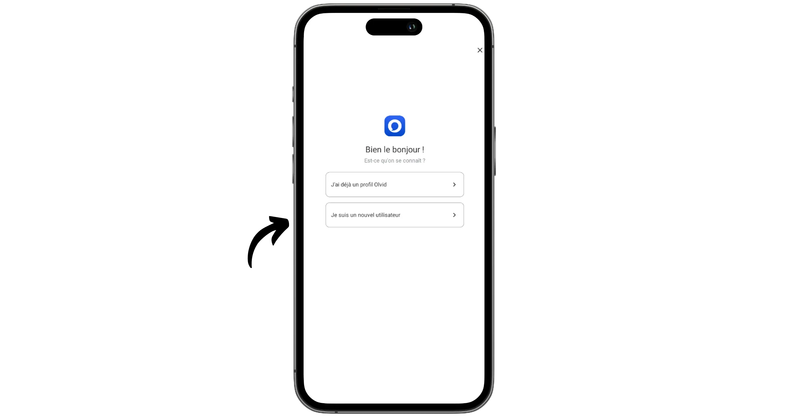

Chọn biệt danh hoặc nhập tên và họ của bạn.

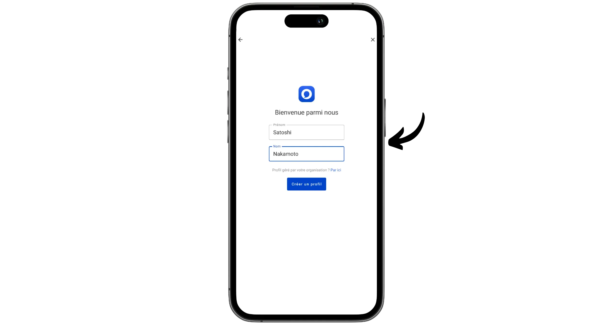

Thêm ảnh đại diện.

Tài khoản của bạn đã được tạo.

Để tránh mất quyền truy cập vào tài khoản Olvid của bạn, chúng tôi khuyên bạn nên thiết lập sao lưu tự động. Để thực hiện việc này, hãy mở cài đặt bằng cách nhấp vào ba dấu chấm ở góc trên bên phải của Interface, sau đó chọn "*Cài đặt*".

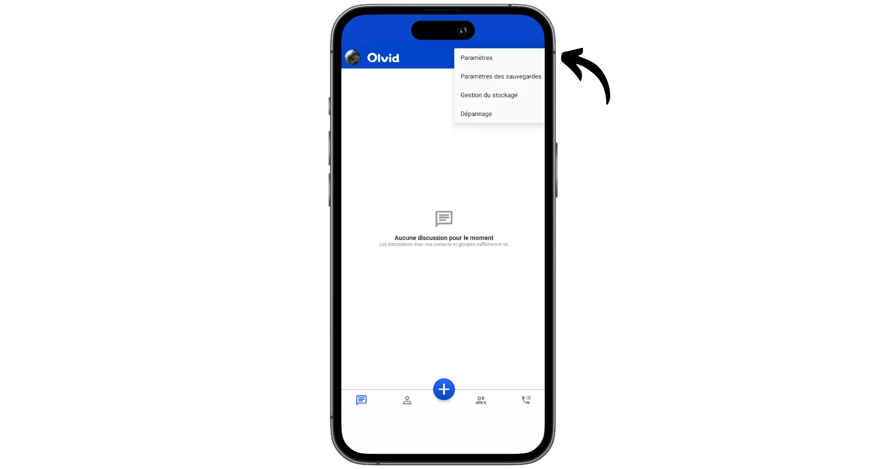

Vào menu "*Lưu khóa và danh bạ*".

Sau đó nhấp vào "*generate a backup key*". Khóa này sẽ mã hóa bản sao lưu của bạn. Nếu bạn cần khôi phục tài khoản của mình trên thiết bị khác và không còn quyền truy cập vào tài khoản đó nữa, bạn sẽ cần cả bản sao lưu và khóa này để giải mã.

Giữ chìa khóa này ở nơi an toàn. Bạn cũng có thể sao chép bằng giấy.

Sau đó, bạn có thể chọn tạo bản sao lưu cục bộ hoặc bản sao lưu tự động trên dịch vụ đám mây. Tùy chọn thứ hai này được khuyến nghị để đảm bảo quyền truy cập vào tài khoản Olvid của bạn trong mọi trường hợp, ngay cả khi bạn mất điện thoại.

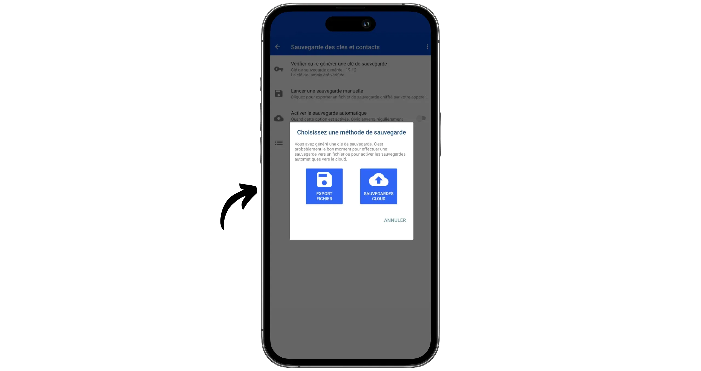

Đảm bảo tùy chọn "*Bật sao lưu tự động*" đã được chọn.

Bạn cũng có thể khám phá các cài đặt khác có sẵn để tùy chỉnh ứng dụng theo nhu cầu của mình.

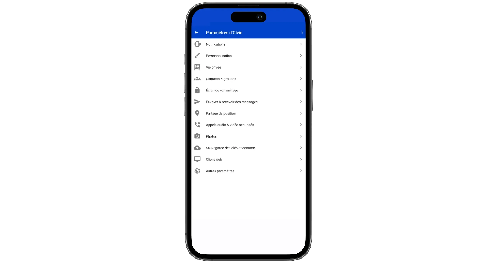

## Gửi tin nhắn bằng Olvid

Để có thể gửi tin nhắn, trước tiên bạn phải thêm danh bạ. Từ trang chủ, nhấp vào nút "*+*" màu xanh lam.

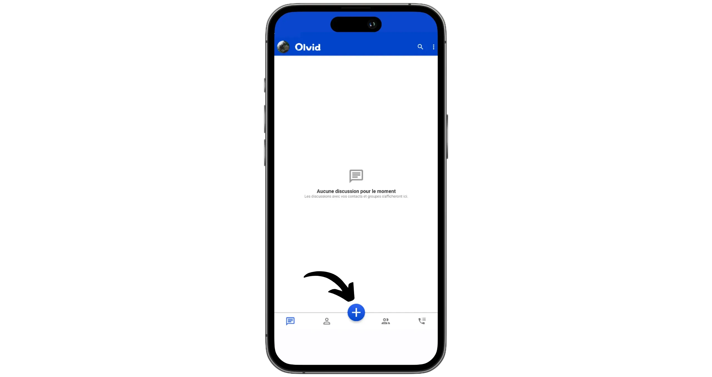

Olvid sau đó sẽ hiển thị ID người dùng của bạn. Sau đó, bạn có thể chuyển nó cho những người bạn muốn giao tiếp để họ có thể thêm bạn làm người liên hệ.

Để thêm một người, hãy quét ID của họ bằng camera hoặc dán thủ công bằng cách nhấp vào ba dấu chấm nhỏ ở góc trên bên phải.

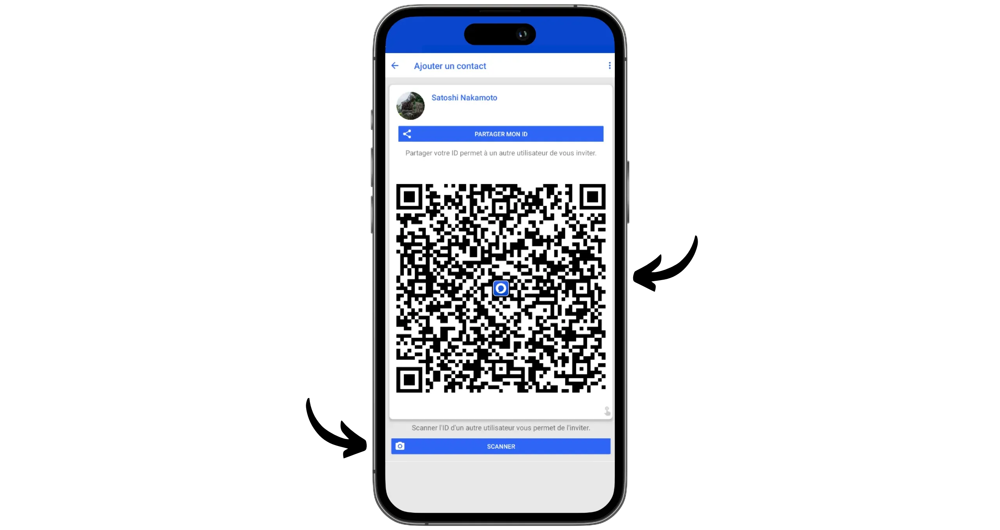

Sau khi quét ID, bạn có thể yêu cầu người liên hệ của mình quét mã QR được hiển thị hoặc gửi cho họ yêu cầu kết nối từ xa bằng cách nhấp vào "*Người liên hệ từ xa*".

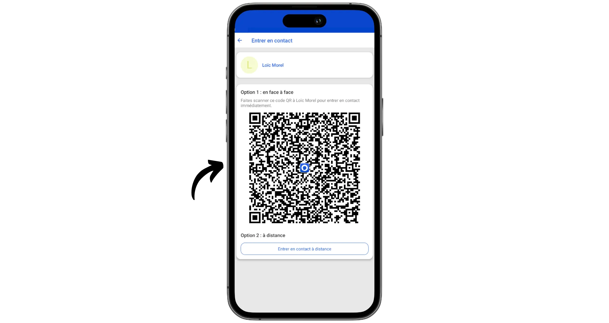

Kết nối hiện đã được thiết lập.

Bây giờ bạn có thể bắt đầu trao đổi tin nhắn và nội dung khác với người liên lạc của mình!

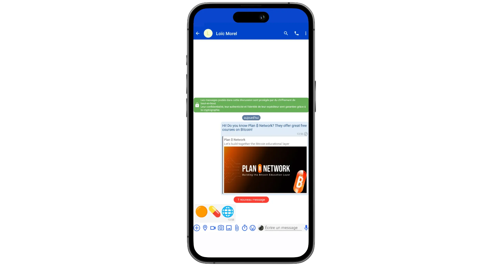

Từ trang chủ, bạn sẽ tìm thấy tất cả các cuộc trò chuyện của mình.

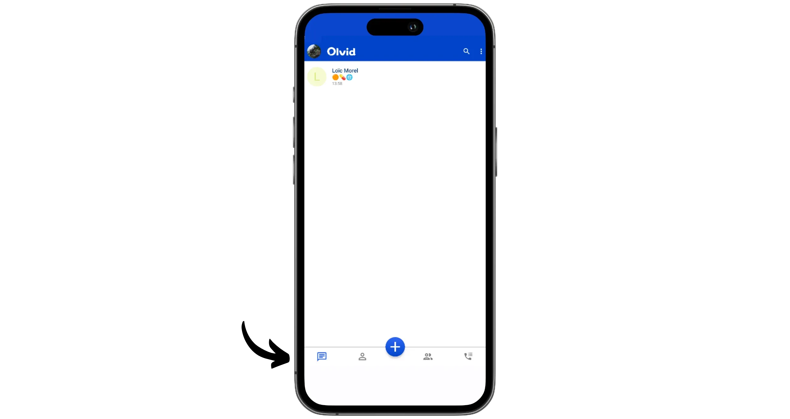

Tab thứ hai chứa tất cả danh bạ của bạn.

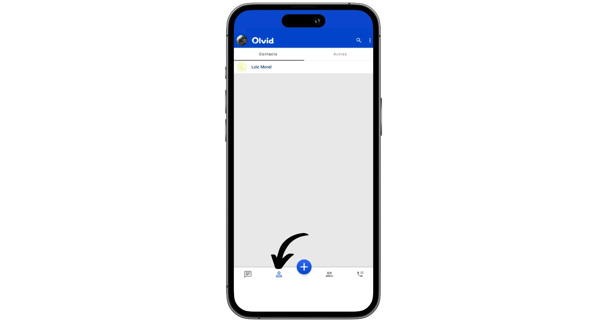

Bạn cũng có thể tạo các cuộc thảo luận nhóm.

Xin chúc mừng, giờ bạn đã nắm được cách sử dụng Olvid messaging, một giải pháp thay thế tuyệt vời cho WathsApp! Nếu bạn thấy hướng dẫn này hữu ích, tôi sẽ rất biết ơn nếu bạn để lại một ngón tay cái Green bên dưới. Vui lòng chia sẻ hướng dẫn này trên các mạng xã hội của bạn. Cảm ơn bạn rất nhiều!

Tôi cũng giới thiệu cho bạn hướng dẫn khác này, trong đó tôi giới thiệu cho bạn Proton Mail, một giải pháp thay thế thân thiện hơn nhiều với quyền riêng tư cho Gmail:

https://planb.network/tutorials/computer-security/communication/proton-mail-c3b010ce-254d-4546-b382-19ab9261c6a2