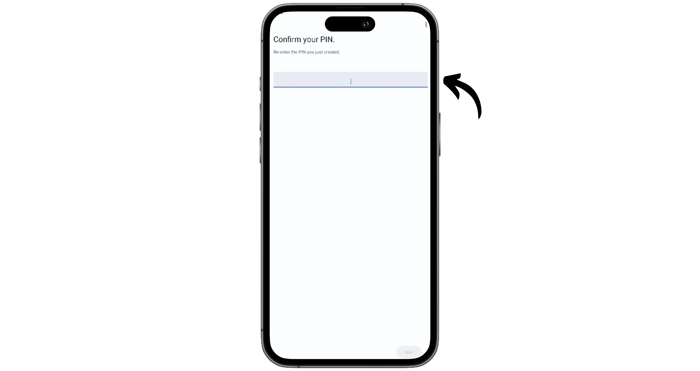
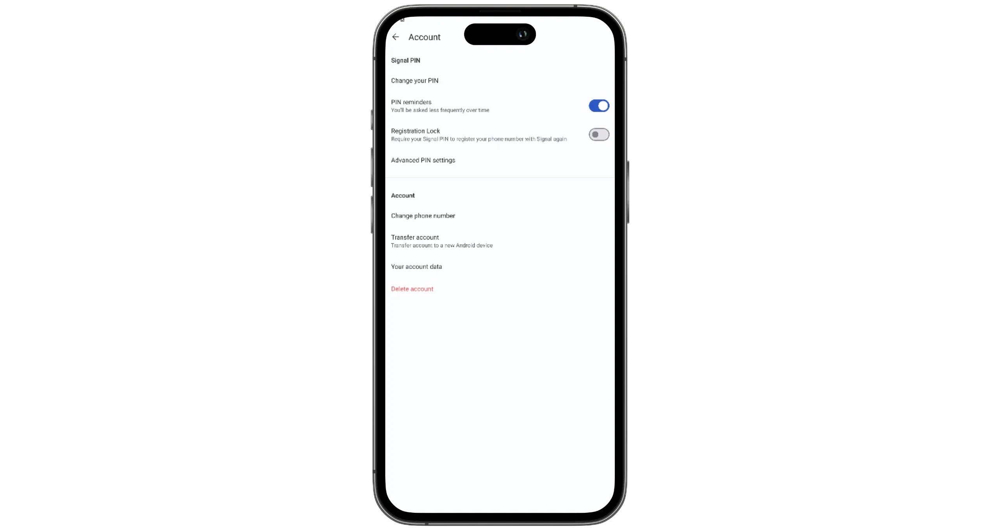
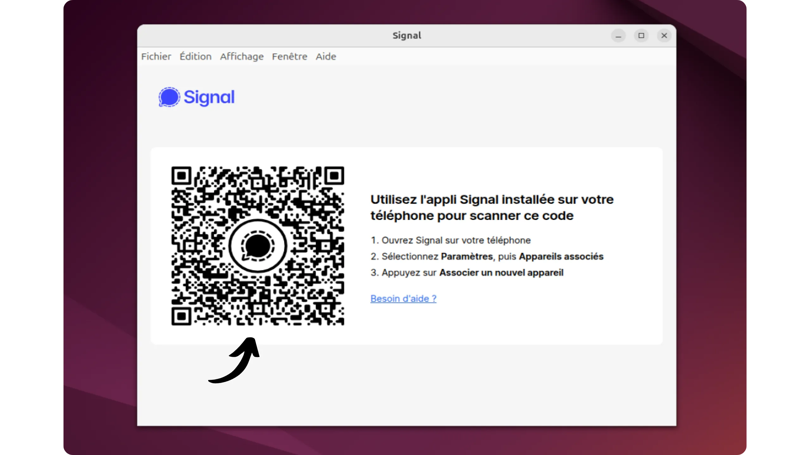
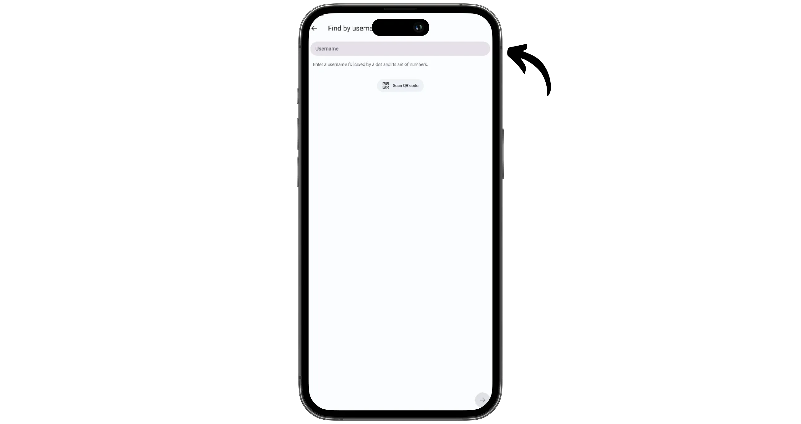

Signal යනු අන්තර්-අන්ත සංකේතනය කළ පණිවිඩ යෙදුමක් වන අතර, පෙරනිමි ලෙස හොඳ රහස්‍යතාවයක් ලබා දීමට නිර්මාණය කර ඇත. සෑම පණිවිඩයක්, ඇමතුමක් සහ ගොනුවක්ම Signal ප්‍රොටෝකෝලය මඟින් ආරක්ෂා කර ඇති අතර, එය වඩාත් ශක්තිමත් පණිවිඩ ප්‍රොටෝකෝලයක් ලෙස පිළිගැනේ. එය WathsApp, Facebook Messenger, Skype සහ Google Messages සඳහා RCS සන්නිවේදන ඇතුළු අනෙකුත් බොහෝ යෙදුම් මඟින් නැවත භාවිතා කරයි.

සික්නල් 2014 දී මොක්සි මාර්ලින්ස්පයික් (අනුනාමය) විසින් ආරම්භ කරන ලද අතර 2018 සිට බ්‍රයන් ඇක්ටන් (WhatsApp හි සහ-ස්ථාපකයා)ගේ සහය ඇතිව නිර්මාණය කරන ලද ලාභ නොලබන සංවිධානයක් වන සික්නල් පදනම විසින් සංවර්ධනය කරන ලදී.

WhatsApp සමඟ සැසඳීමේදී, Signal එහි පාරදෘශ්‍යතාවය සඳහා විශේෂිත වේ: යෙදුමේ කේතය, ගනුදෙනුකරුවා සහ සේවාදායක පාර්ශවය දෙකම, සම්පූර්ණයෙන්ම විවෘත මූලාශ්‍ර වේ. මෙය ඕනෑම කෙනෙකුට එය විග්‍රහ කිරීමට, විශේෂයෙන්ම සංකේතනය ප්‍රචාරය කරන පරිදි යෙදවනු ලැබේදැයි පරීක්ෂා කිරීමට ඉඩ සලසයි.

Vendar pa Signal temelji na uporabi telefonske številke, kar je njegova glavna slabost, ko gre za anonimnost v primerjavi z drugimi rešitvami. Kljub temu je aplikacija, po mojem mnenju, ena najbolj zanesljivih glede varnosti in zaupnosti, zahvaljujoč svoji popolnoma odprti arhitekturi in široko sprejetemu šifrirnemu protokolu, ki je zato testiran in revidiran, za razliko od drugih bolj marginalnih aplikacij.

| Application          | E2EE 1:1       | E2EE groupes   | Inscription anonyme | Licence client open-source | Licence serveur open-source | Serveur décentralisé | Année de création |
| -------------------- | -------------- | -------------- | ------------------- | -------------------------- | --------------------------- | -------------------- | ----------------- |
| WhatsApp             | ✅              | ✅              | ❌                   | ❌                          | ❌                           | ❌                    | 2009              |
| WeChat               | ❌              | ❌              | ❌                   | ❌                          | ❌                           | ❌                    | 2011              |
| Facebook Messenger   | ✅              | 🟡 (optionnel) | ❌                   | ❌                          | ❌                           | ❌                    | 2011              |
| Telegram             | 🟡 (optionnel) | ❌              | 🟡                  | ✅                          | ❌                           | ❌                    | 2013              |
| LINE                 | ✅              | ✅              | ❌                   | ❌                          | ❌                           | ❌                    | 2011              |
| **Signal**           | ✅              | ✅              | ❌                   | ✅                          | ✅                           | ❌                    | 2014              |
| Threema              | ✅              | ✅              | ✅                   | ✅                          | ❌                           | ❌                    | 2012              |
| Element (Matrix)     | ✅              | ✅              | ✅                   | ✅                          | ✅                           | 🟡 (fédéré)          | 2016              |
| Delta Chat           | ✅              | ✅              | ✅                   | ✅                          | N/A                         | 🟡 (via email)       | 2017              |
| Conversations (XMPP) | ✅              | ✅              | ✅                   | ✅                          | ✅                           | 🟡 (fédéré)          | 2014              |
| Session              | ✅              | ✅              | ✅                   | ✅                          | ✅                           | ✅                    | 2020              |
| SimpleX              | ✅              | ✅              | ✅                   | ✅                          | ✅                           | ✅                    | 2021              |
| Olvid                | **✅**          | **✅**          | **✅**               | **✅**                      | **❌**                       | **❌**                | 2019              |
| Keet                 | ✅              | ✅              | ✅                   | ❌                          | N/A                         | ✅                    | 2022              |
| Jami                 | ✅              | ✅              | ✅                   | ✅                          | N/A                         | ✅                    | 2005              |
| Briar                | ✅              | ✅              | ✅                   | ✅                          | N/A                         | ✅                    | 2018              |
| Tox                  | ✅              | ✅              | ✅                   | ✅                          | N/A                         | ✅                    | 2013              |

*E2EE = අවසානයට-අවසානයේ සංකේතනය*

## Signal යෙදුම ස්ථාපනය කරන්න

Signal සියලුම වේදිකාවලම ලබා ගත හැක. ඔබේ දුරකථනයේ යෙදුම් අලෙවියෙන් යෙදුම සෘජුවම බාගත කළ හැක:

- [Google Play](https://play.google.com/store/apps/details?id=org.thoughtcrime.securesms);
- [App Store](https://apps.apple.com/us/app/signal-private-messenger/id874139669);

Android මත, [APK හරහා ස්ථාපනය කිරීම](https://github.com/signalapp/Signal-Android/releases) ද සිදු කළ හැක.

මෙම උපදෙස් මාලාවේදී, අපි ජංගම අනුවාදය මත අවධානය යොමු කරමු, නමුත් කරුණාකර සලකන්න [ඩෙස්ක්ටොප් අනුවාදද ලබා ගත හැක](https://signal.org/fr/download/) (MacOS, Linux සහ Windows). ඔබේ ගිණුම ඩෙස්ක්ටොප් අනුවාදය සමඟ සංකේතනය කිරීමට පෙර, ඔබට ජංගම යෙදුම පළමුව සකස් කළ යුතුය.

## Signal මත ගිණුමක් සාදන්න

කළමනාකරණය සඳහා යෙදුම පළමු වරට ආරම්භ කරන විට, "*ඉදිරියට*" බොත්තම ක්ලික් කරන්න.

ඔබේ දුරකථන අංකය ඇතුළත් කර, "*ඊළඟට*" ක්ලික් කරන්න.

SMS මඟින් ඔබට සත්‍යාපන කේතයක් යවනු ලැබේ. මෙම කේතය Signal යෙදුමේ ඇතුළත් කරන්න.

ඔබේ Signal ගිණුම ආරක්ෂා කිරීමට PIN කේතයක් තෝරන්න. මෙම කේතය ඔබේ දත්ත සංකේතනය කරයි, සහ ඔබේ උපාංගය අහිමි වූ විට ඔබේ ගිණුමට ප්‍රවේශය නැවත ලබා ගැනීමට භාවිතා කළ හැකිය. එබැවින් හැකි තරම් දිගු සහ අහඹු ශක්තිමත් PIN කේතයක් තෝරා ගැනීම, සහ එය විශ්වාසනීයව සටහන් තබා ගැනීම වැදගත් වේ.

මෙම PIN කේතය දෙවන වරට තහවුරු කරන්න.

ඔබට දැන් ඔබේ පරිශීලක පැතිකඩ අභිරුචිකරණය කළ හැක. ඡායාරූපයක් තෝරන්න, ඔබේ නම හෝ මිතුරු නාමයක් ඇතුළත් කරන්න. මෙම අවස්ථාවේදී, ඔබේ අංකය හරහා Signal මත ඔබව සොයාගත හැකි අය කවුද යන්න ද නිර්වචනය කළ හැක. ඔබ දැකිය හැකි ලෙස "*සියලුම දෙනා*" තෝරන්න, හෝ දුරකථන අංකය හරහා සොයාගත නොහැකි ලෙස "*කිසිවෙකුත් නැත*" තෝරන්න (ඊට පසු ඔබව "*පරිශීලක නාමය*" සමඟ පමණක් එක් කළ හැක). ඔබේ තේරීම් සිදු කළ පසු, "*ඊළඟ*" මත ක්ලික් කරන්න.

ඔබ දැන් Signal සමඟ සම්බන්ධ වී ඇති අතර Exchange පණිවිඩ යැවීමට සූදානම් වේ.

## ඔබේ Signal ගිණුම පිහිටුවීම

ඉහළ වම් කෙළවරේ ඇති ඔබේ පැතිකඩ ඡායාරූපය මත ක්ලික් කර යෙදුම් සැකසුම් වෙත ප්‍රවේශ වන්න.

"*Account*" මෙනුවෙන් ඔබට ඔබේ පැතිකඩ සැකසුම් කළමනාකරණය කළ හැක. මම ඔබට පෙරනිමි සැකසුම් තබා ගැනීමට උපදෙස් දෙමි. ඔබේ ගිණුම විශේෂිත ප්‍රහාර වර්ගවලින් ආරක්ෂා කරන "*Registration Lock*" විකල්පය ද සක්‍රීය කළ හැක. මෙම මෙනුවේ ඔබේ ගිණුම නව උපාංගයකට මාරු කිරීමට අවශ්‍ය විකල්ප ද අඩංගු වේ.

සැකසුම් වල ඔබේ පැතිකඩ රූපය නැවත ක්ලික් කිරීමෙන් ඔබේ පැතිකඩ අභිරුචිකරණය සඳහා විකල්ප වෙත යා හැක. මම ඔබට "*පරිශීලක නාමය*" සකසන්න යැයි නිර්දේශ කරමි: මෙය ඔබේ දුරකථන අංකය අනාවරණය නොකර වෙනත් පුද්ගලයින් සමඟ සම්බන්ධ වීමට ඔබට හැකියාව ලබා දේ.

"*QR කේතය හෝ සබැඳිය*" තේරීමෙන්, ඔබට Signal වෙත ඔබව එක් කිරීමට කැමති කෙනෙකු සමඟ බෙදා ගැනීමට අවශ්‍ය තොරතුරු ලබා ගත හැක.

"*ප්‍රයිවසි*" මෙනුව විශේෂයෙන්ම වැදගත් වේ. මෙහිදී ඔබේ අංකය දැකිය හැකි ආකාරය පාලනය කිරීම සඳහා විකල්ප, ඔබේ සම්බන්ධීකරණයන් සමඟ ඔබේ පණිවිඩ කළමනාකරණය, මෙන්ම යෙදුම මත ලබා දී ඇති විවිධ අනුමතීන් සොයා ගත හැක.

සහ Interface සහ යෙදුමේ මෙහෙයුම ඔබේ පුද්ගලික අවශ්‍යතා සඳහා අභිරුචිකරණය කිරීමට "*Appearance*", "*Chats*" සහ "*Notifications*" මෙනු පරීක්ෂා කිරීමට නිදහස් වන්න.

## ඩෙස්ක්ටොප් යෙදුම සම්බන්ධ කරන්න

ඩෙස්ක්ටොප් යෙදුම සම්බන්ධ කිරීමට, ඔබේ පරිගණකයේ මෘදුකාංගය ස්ථාපනය කිරීමෙන් ආරම්භ කරන්න (මෙම උපකාරක පංතියේ පළමු කොටස බලන්න). එවිට, ඔබේ දුරකථනයේ, සැකසුම් වෙත ගොස් "*Linked devices*" කොටස විවෘත කරන්න.

"*නව උපාංගයක් සම්බන්ධ කරන්න*" බොත්තම මත ක්ලික් කරන්න.

ඔබේ පරිගණකයේ, මෘදුකාංගය ආරම්භ කර, පසුව ඔබේ දුරකථනය භාවිතයෙන් තිරයේ පෙන්වන QR කේතය ස්කෑන් කරන්න. ඔබේ සංවාද ආයාත කිරීමට කැමති නම්, "*පණිවිඩ ඉතිහාසය මාරු කරන්න*" විකල්පය තෝරන්න.

ඔබේ උපාංග දැන් සම්පූර්ණයෙන් සංකේතනය කර ඇත.

## Signal සමඟ පණිවිඩ යැවීම

Če želite komunicirati z nekom na Signalu, ga morate najprej dodati kot stik. Na voljo je več možnosti: lahko jih dodate prek njihove telefonske številke (če je oseba aktivirala možnost, da jo najdete na ta način) ali uporabite njihov Signal ID.

Interface හි දකුණු පහළ කෙළවරේ ඇති පෑන අයිකනය මත ක්ලික් කරන්න.

මගේ අවස්ථාවේ, මම පරිශීලක නාමය මගින් පුද්ගලයා එකතු කිරීමට අවශ්‍යයි. එබැවින් මම "*පරිශීලක නාමය මගින් සොයන්න*" මත ක්ලික් කරමි.

ඔබට එවිට එහි ලොගින් පේස්ට් කළ හැකි අතර එහි QR කේතය ස්කෑන් කළ හැක.

ඔහුට සම්බන්ධතාවය පිහිටුවීමට පණිවිඩයක් යවන්න.

සංවාදය පසුව මුල් පිටුවේ පෙනේ. පුද්ගලයා ඔබේ සම්බන්ධතා ඉල්ලීම පිළිගත් නම්, ඔවුන්ගේ නම සහ පැතිකඩ ඡායාරූපය ඔබට පෙනේ.

සුභ පැතුම්, දැන් ඔබ Signal පණිවිඩය භාවිතා කිරීමට සූදානම්, WathsApp සඳහා විකල්පයක්! ඔබට මෙම උපකාරකය ප්‍රයෝජනවත් වූවා නම්, Green අඟුල්වලක් පහළින් දමා මම ඉතාමත්ම ස්තූතිවන්ත වනු ඇත. මෙම උපකාරකය ඔබේ සමාජ ජාලවල බෙදා ගැනීමට නිදහස් වන්න. ඔබට ඉතාමත්ම ස්තූතියි!

Prav tako priporočam ta drugi vodič, v katerem vas seznanim s Proton Mail, veliko bolj zasebnosti prijazno alternativo Gmailu :

https://planb.network/tutorials/computer-security/communication/proton-mail-c3b010ce-254d-4546-b382-19ab9261c6a2