## Inicio de sesión = correo electrónico = pérdida de privacidad

En el mundo digital, se ha convertido en una práctica habitual tener una cuenta para cada plataforma a la que se desea acceder.

Cada uno de estos servicios requiere un nombre de usuario, normalmente asociado a la pareja _username_ y _password_. A menudo, el nombre de usuario es el correo electrónico personal del usuario.

Cuando se utiliza el Address del correo electrónico personal para cada inicio de sesión, es fácil imaginar la primera consecuencia: la pérdida de confidencialidad, que se convierte en mayor si el Address está compuesto por _name.surname@serviceemail.com_.

Los desarrolladores de herramientas de código abierto han creado una serie de suites de aplicaciones, nacidas precisamente para que los usuarios recuperen un poco de privacidad: seguirán iniciando sesión, pero utilizando un alias en lugar de la herramienta que revela su identidad privada.

El más sencillo de los que he probado personalmente y sigo probando es [Simple Login](https://simplelogin.io/).

## Alias

Un alias de correo electrónico simplemente sustituye la parte _nombre.apellido_ de su Address de correo electrónico por un nombre ficticio. Para el usuario, nada cambia; el servicio de alias reenvía los correos electrónicos hacia y desde el Address habitual con normalidad. Todo el mundo puede seguir utilizando su bandeja de entrada como siempre, pero en lugar de mostrar su nombre real, mostrará un usuario irreconocible. Este servicio tiene que ser eficiente, y hasta ahora, Simple Login ha demostrado ser exactamente eso.

Cuando visites el sitio de Simple Login por primera vez, deberás crear una cuenta (¡también aquí!), utilizando el correo electrónico "oficial" Address. Aquí debes introducir el correo electrónico, una contraseña y resolver un captcha.

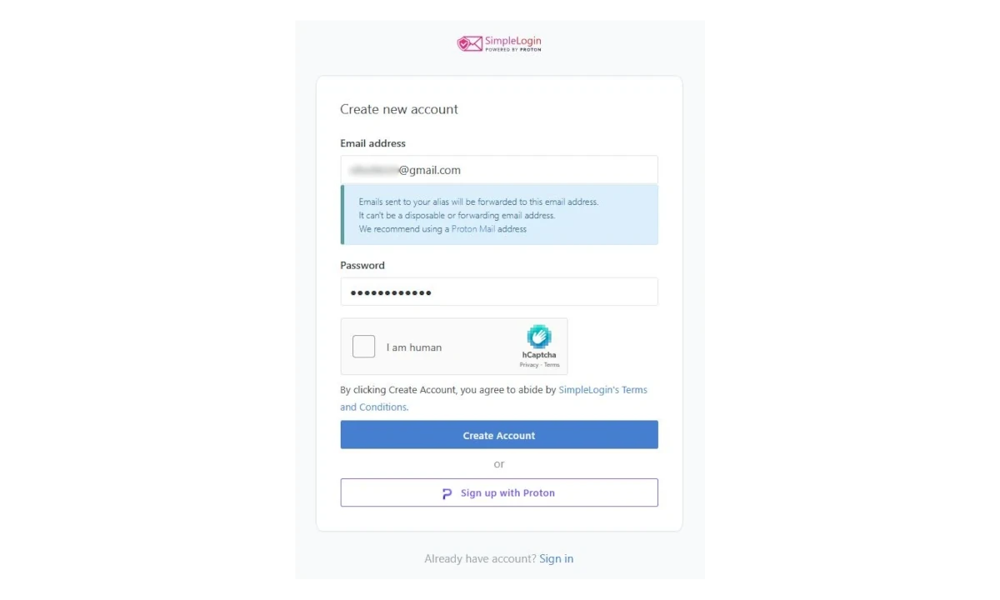

Simple Login envía un mensaje de verificación al correo electrónico indicado Address. En lugar de hacer clic en el botón de verificación, es aconsejable copiar el enlace y pegarlo en la barra Address.

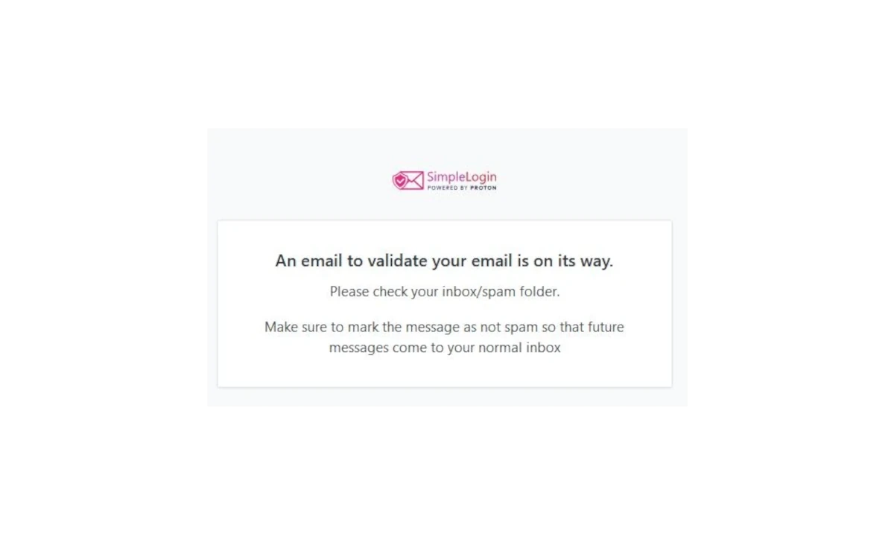

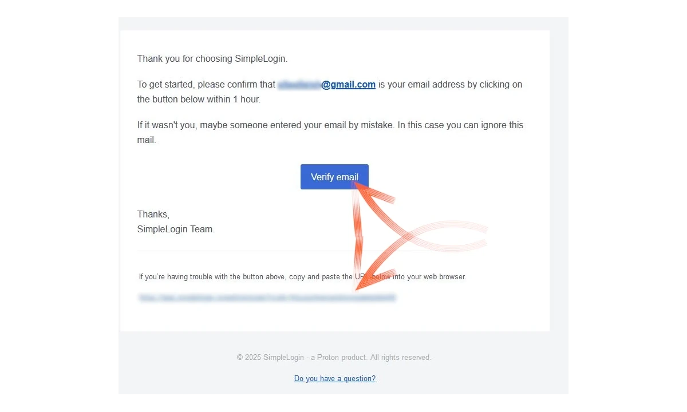

El panel de inicio de sesión simple se abre inmediatamente, con un breve tutorial de navegación.

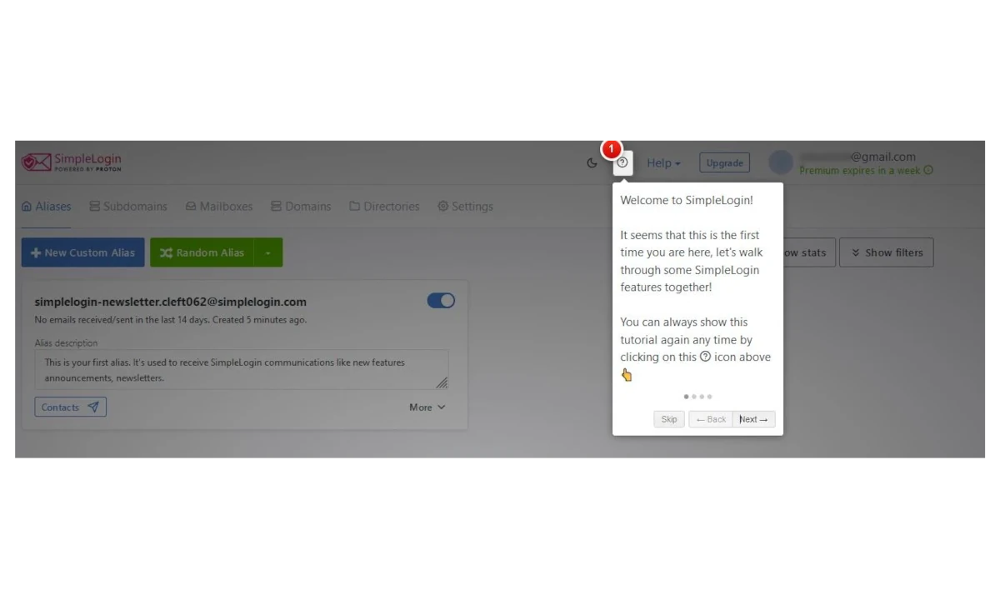

Debe tenerse en cuenta que el inicio de sesión simple activa automáticamente la suscripción al boletín, que puede desactivarse desde el comando correspondiente.

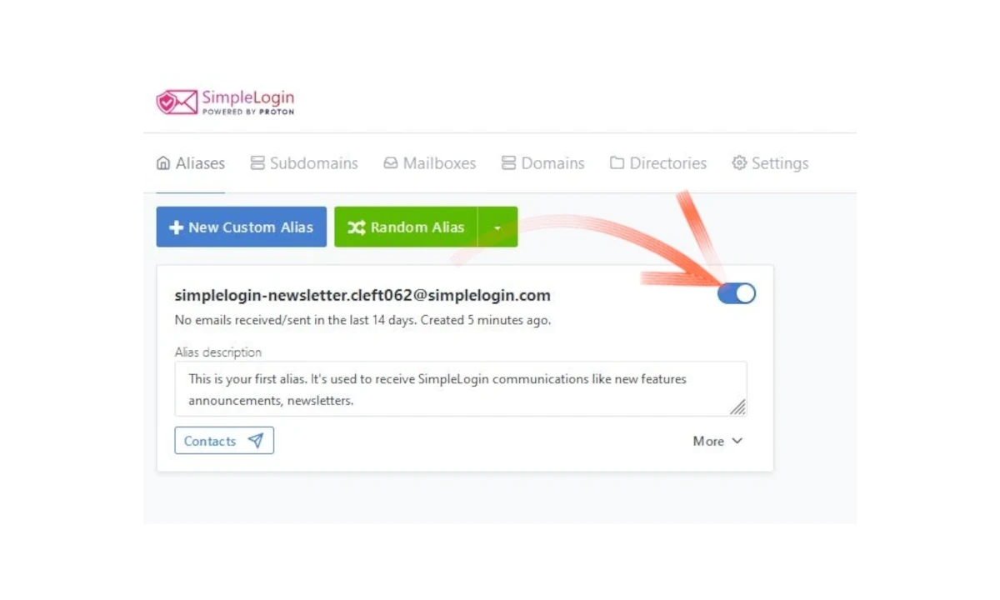

## Ajustes

Puede echar un vistazo a la _Configuración_ de inmediato para descubrir las características del servicio. Inicio de sesión sencillo comienza con todas las opciones activas, incluidas las _Premium_, que permanecen utilizables durante 10 días. Una vez finalizado el periodo de prueba, tendrás la posibilidad de crear 10 alias con este perfil y podrás vincular directamente tu correo electrónico de Protón, ya que Simple Login ha sido adquirido por el proveedor suizo de correo electrónico.

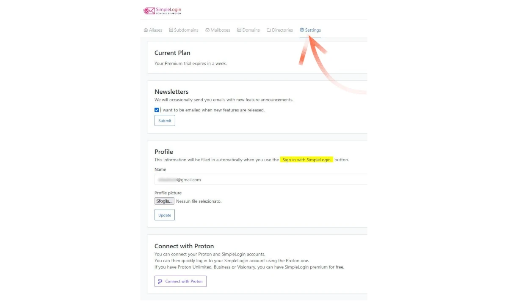

Puedes establecer una serie de parámetros, o comprobar si tu correo electrónico ya ha sido comprometido en términos de privacidad.

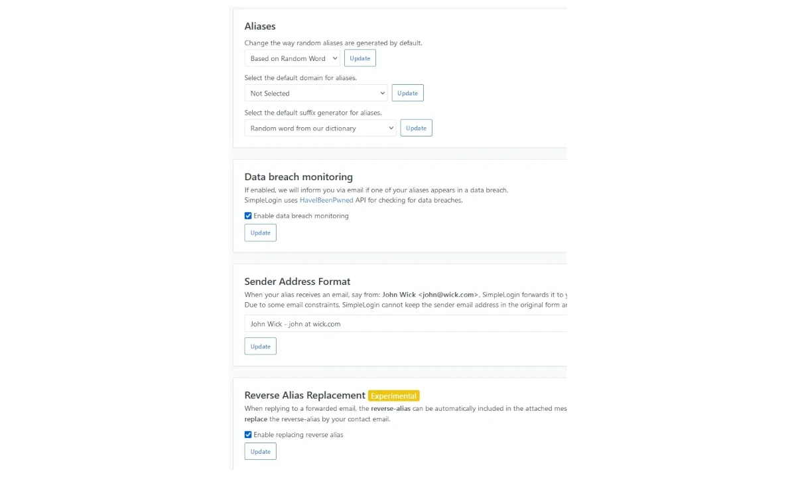

Por último, puedes exportar una copia de seguridad de tu perfil o importar una de otro proveedor.

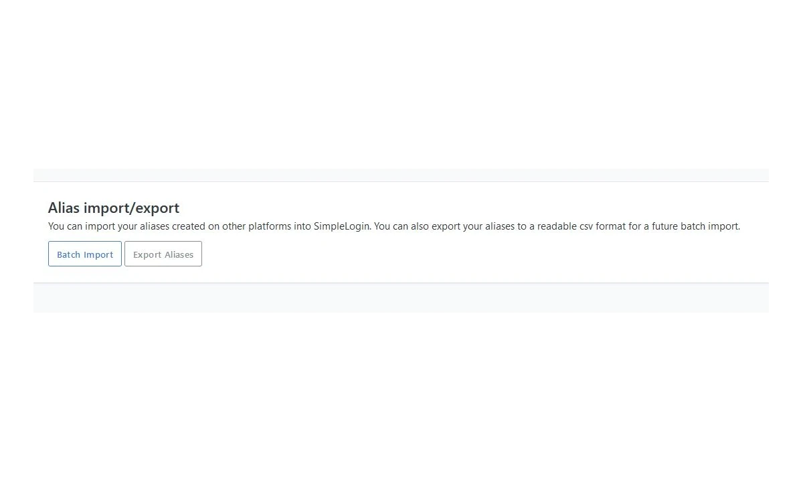

### Correo electrónico de trabajo

Quienes utilicen el correo electrónico con un dominio personal como correo electrónico de trabajo pueden configurar su dominio privado.

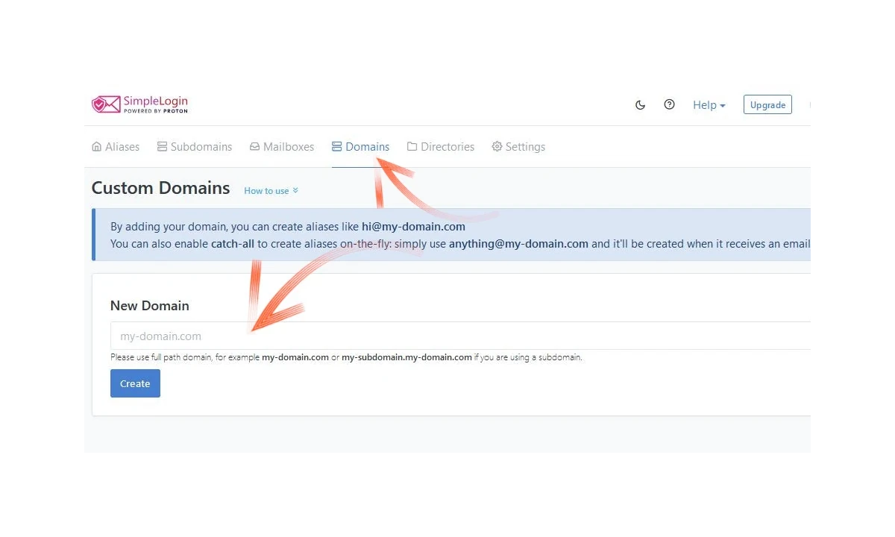

Desde el panel principal, eligiendo _Buzones_, es posible incluso añadir otras direcciones de correo electrónico y utilizar también los alias que se crearán en consecuencia. En este tutorial, por ejemplo, decidí crear el perfil con un buzón _gmail.com_, y luego asociar un Address _proton.me_.

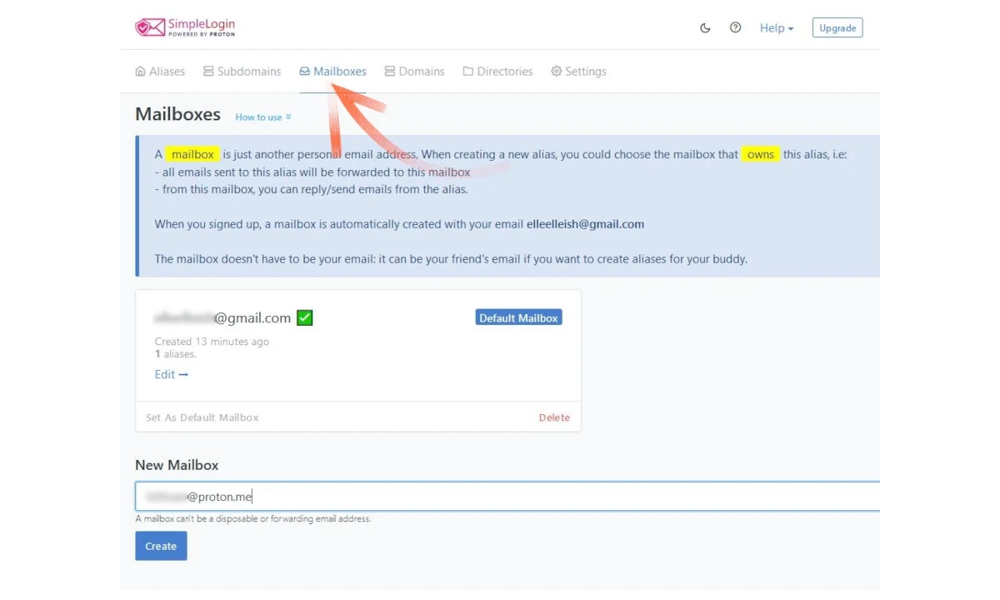

Al añadir una nueva Address, especialmente si pertenece al proveedor Proton, el procedimiento guiado muestra la posibilidad de entrar en modo _sudo_, superusuario. Inicio de sesión simple le pedirá que introduzca la contraseña de este buzón, para demostrar Ownership legítimo.

⚠️ **Personalmente desaconsejo hacer esto**. ⚠️

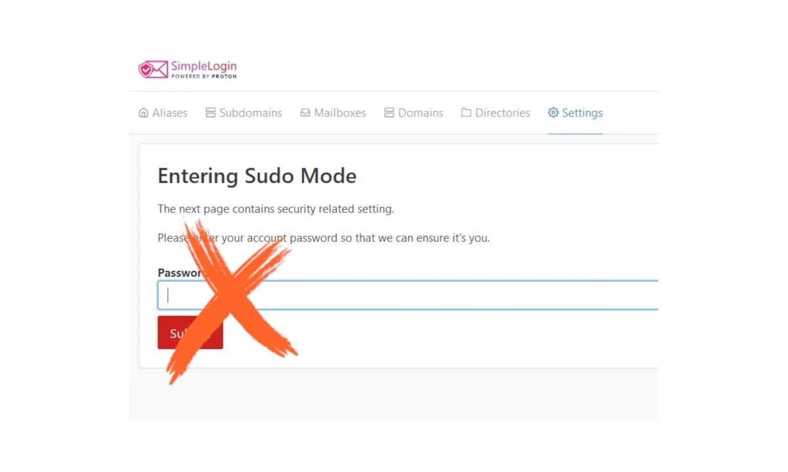

**Es mejor acceder al buzón de correo electrónico -> copiar el enlace para la verificación y pegarlo en la barra de URL -> y obtener la verificación sin revelar la contraseña.**

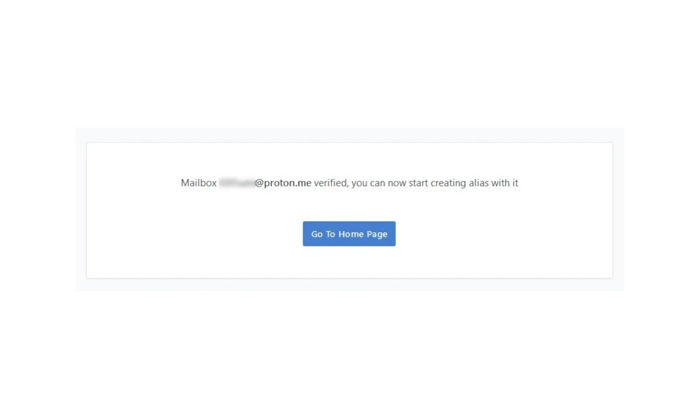

De las dos direcciones introducidas, una se convierte en la predeterminada y la otra es secundaria, pero pueden cambiarse fácilmente, y la configuración es fácilmente identificable en el panel de control.

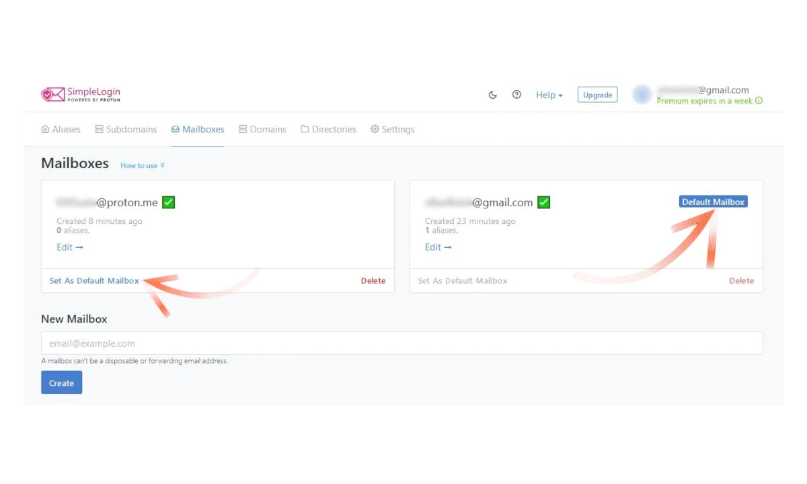

Después de añadir un segundo correo electrónico Address (opcional), vamos a ver lo que podemos hacer con Simple Login.

## Creación de alias

En el panel, la primera opción del menú se llama _Alias_, que es donde puedes crearlos. Tienes la opción de generate alias al azar haciendo clic en el botón Random Alias, que es el Green botón que se muestra en la siguiente foto. Esta función crea un Address de correo electrónico único e intrigante.

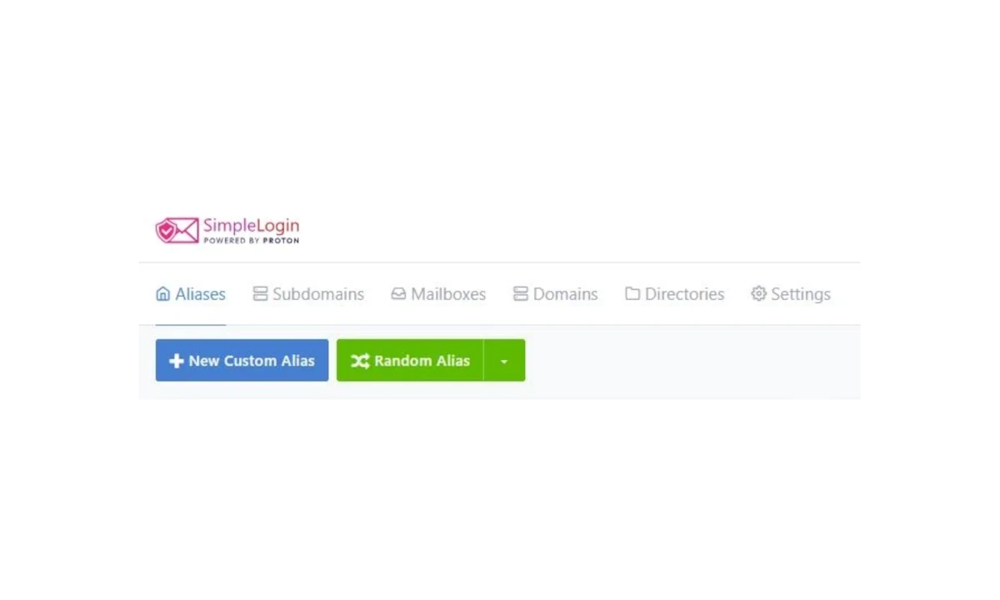

Sin embargo, si desea diferenciar servicios dándoles nombres distintos, debe elegir _Nuevo alias personalizado_. Al hacerlo, puede dar al alias el nombre del servicio al que desea acceder (redes sociales, proveedores de servicios, eventos en línea, extraños conocidos por casualidad, etc.). Del resto se encarga Simple Login.

Por diversión (pero no realmente, a decir verdad) decidí crear un alias para el banco y lo llamé `BANK`. Aunque es cierto que mi banco lo sabe todo sobre mí, me resulta divertido comunicarme con ellos utilizando un correo electrónico Address que les resulte incomprensible. Simple Login genera efectivamente un nombre aleatorio, que se separa del que elegimos por un `.`

Aquí, el nuevo correo electrónico Address puede llegar a ser:

- bank.breeding123@aleeas.com
- bank.platter456@slmails.com
- bank.preoccupy789@8shield.net
- etc

Se puede elegir más de un dominio: los públicos están disponibles con el plan gratuito, mientras que otros, indicados como privados (incluido _@simplelogin.com_), amplían las opciones para los usuarios que decidan suscribirse a un plan de pago.

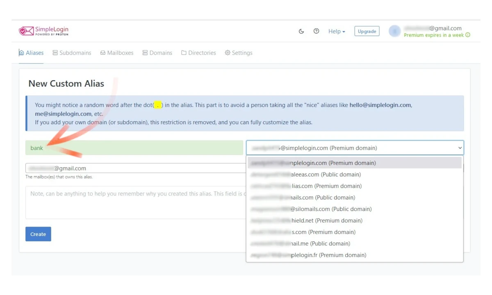

Una vez elegidos el sufijo aleatorio y el dominio, puede establecer si este nuevo (y extraño) Address debe servir como alias sólo para uno de los buzones de correo personales, o para todos ellos. El alias estará listo y activo después de hacer clic en _Crear_

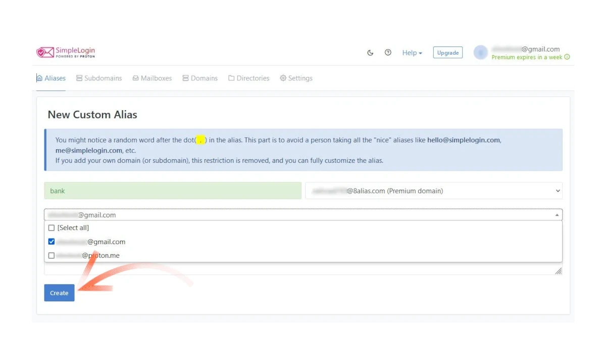

El nuevo correo electrónico Address ha sido creado y ya está visible, listo para ser enviado (¡al banco!) simplemente copiándolo.

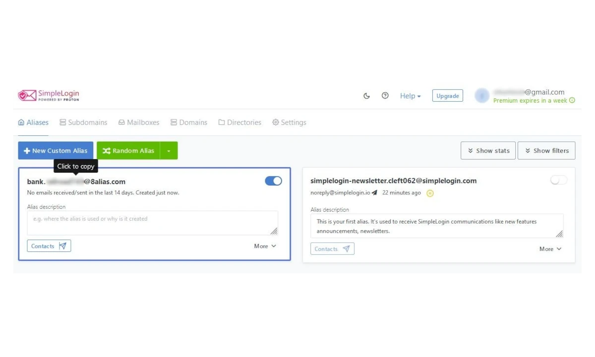

Llegados a este punto, puedes centrarte en crear un alias para cada servicio o plataforma a la que quieras acceder y donde se requiera el correo electrónico como parámetro esencial para crear una cuenta.

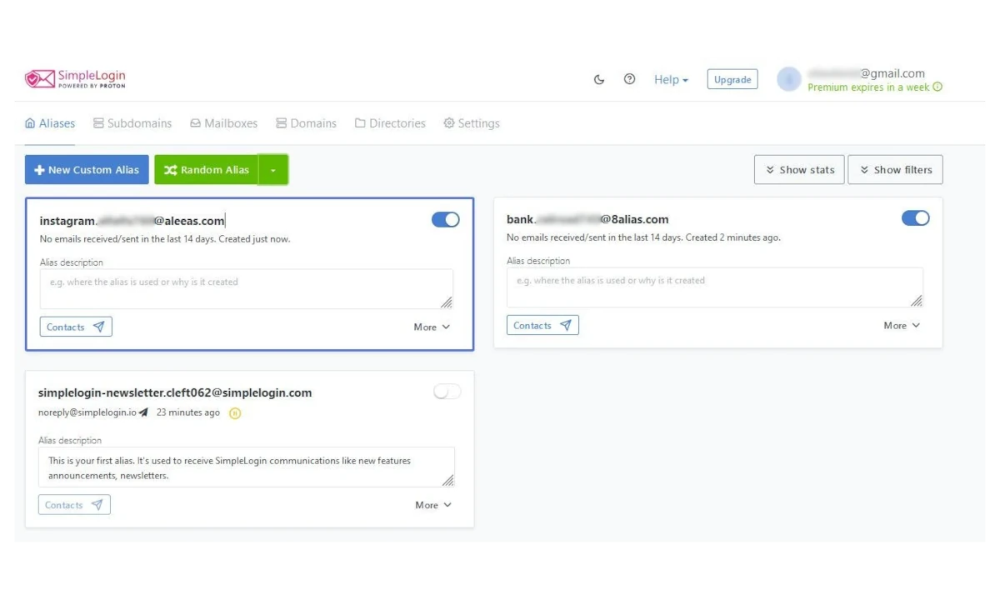

Para los entusiastas de la privacidad, también existe la opción de generate un correo electrónico Address basado en el protocolo UUID (no en nombres identificables), que crea un identificador único de 128 bits que no está controlado por partes centralizadas. Esta función, útil para cuentas sensibles, se encuentra en el menú _Alias aleatorio_.

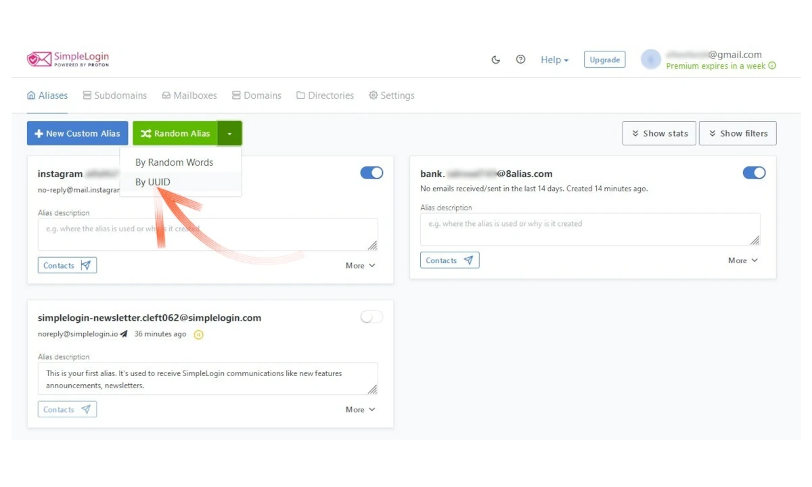

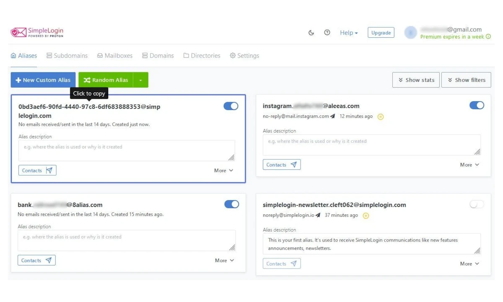

Como puede ver, se trata de un correo electrónico Address que requiere una gestión adecuada.

Si cambia de opinión y ya no desea utilizar un alias, sólo tiene que hacer clic en el comando _Más_ de cada alias individual y elegir _Borrar_.

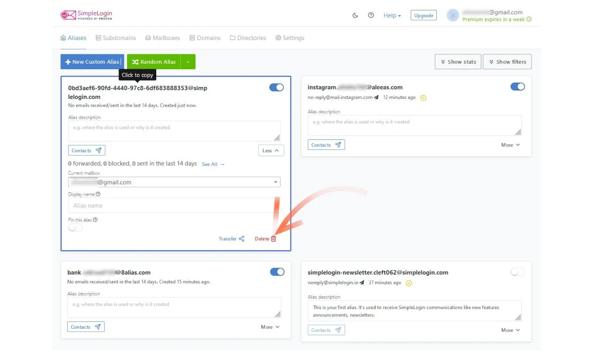

## Gestión de alias

La creación de alias es sencilla, al igual que su gestión, que sólo requiere un poco de cuidado y disciplina. Todo el tráfico, de hecho, seguirá pasando por la bandeja de entrada de correo electrónico que hemos definido, al principio, como la oficial. Las notificaciones y comunicaciones importantes de las plataformas seguirán llegando a Gmail, Protón o cualquiera que sea el proveedor de correo electrónico.

El resultado, sin embargo, es que hemos conservado el Address principal que, desde el momento de la creación de los alias, somos libres de decidir a quién revelar y a quién no.

Un alias funciona tanto para recibir como para enviar: otro usuario recibirá efectivamente la respuesta de alias.preoccupy789@8shield.net, si éste es el seudónimo elegido para ese destinatario concreto.

## Pros

En general, el uso de alias es una forma eficaz de proteger su identidad y privacidad. Los intermediarios de datos y los sitios web suelen recopilar las direcciones de correo electrónico para rastrear los hábitos y comportamientos de los usuarios. Aunque un alias no te hace completamente imposible de rastrear, utilizarlo sistemáticamente es un paso positivo para salvaguardar tu información. Además, en nuestra "aldea digital global", donde la piratería informática, la venta de datos y las brechas de seguridad son demasiado comunes, es muy probable que el correo electrónico que utilizas para registrarte en varios sitios web ya se haya visto comprometido o haya sido objeto de ataques.

Un seudónimo único, utilizado para cada inicio de sesión, **permite comprender inmediatamente qué plataforma envía spam (o algo peor) a nuestro buzón, porque el correo electrónico se identifica por el alias asociado**. No tienes ni idea de cuánto spam y phishing proviene de canales supuestamente fiables, porque son institucionales, hasta que empiezas a usar un alias para los bancos, otro para los servicios postales, o uno específico para algunos servicios gubernamentales obligatorios. Una vez identificado el remitente del spam (o algo peor), sabrás que ese sitio ha sido comprometido, tomando todas las precauciones para proteger todos los datos proporcionados (¡piensa en las tarjetas de crédito!) a ese sitio web específico, que puede darse cuenta de la brecha semanas después.

En cuanto a Simple Login, esta herramienta tiene las siguientes características:

- aplicación móvil (también de F-Droid) y extensión de navegador, para gestionar alias en cualquier situación;
- autenticación de dos factores para cada nuevo seudónimo, lo que aumenta el grado de independencia del propio servicio;
- Compatibilidad con PGP (para usuarios _Premium);
- creación sencilla de todo tipo de alias (personalizados, aleatorios y UUID);
- entre los planes gratuitos del sector, la posibilidad de utilizar alias con más buzones "oficiales". Otros competidores limitan a uno solo.

## Contras

- es posible que 10 alias no sean suficientes si piensa utilizar mucho Simple Login. En este caso, el plan de pago, que es bastante asequible, resulta útil para aumentar el número de alias posibles disponibles.
- No es posible crear un alias con un nombre y un dominio específicos. El sufijo aleatorio, añadido después de un nombre elegido por nosotros, genera una Address que, como mucho, puede calificarse de extraña. Las redes sociales tradicionales suelen negarse a conceder cuentas creadas con este tipo de direcciones de correo electrónico. ¡Nostr lo soluciona!
- Si utilizas un seudónimo para enviar un mensaje a alguien, es fácil que acabe en la carpeta de spam del destinatario. Como primera medida, es aconsejable utilizar el seudónimo para recibir, igual que en el caso de crear una cuenta, suscribirse a una lista de correo, etc.