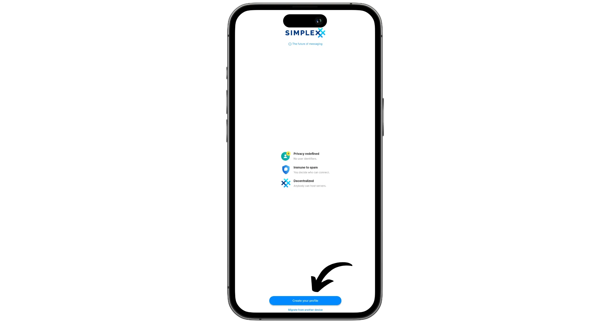
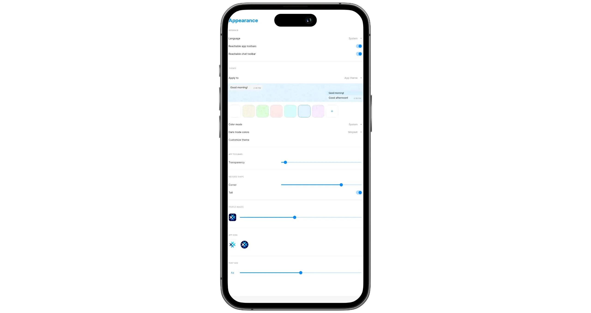
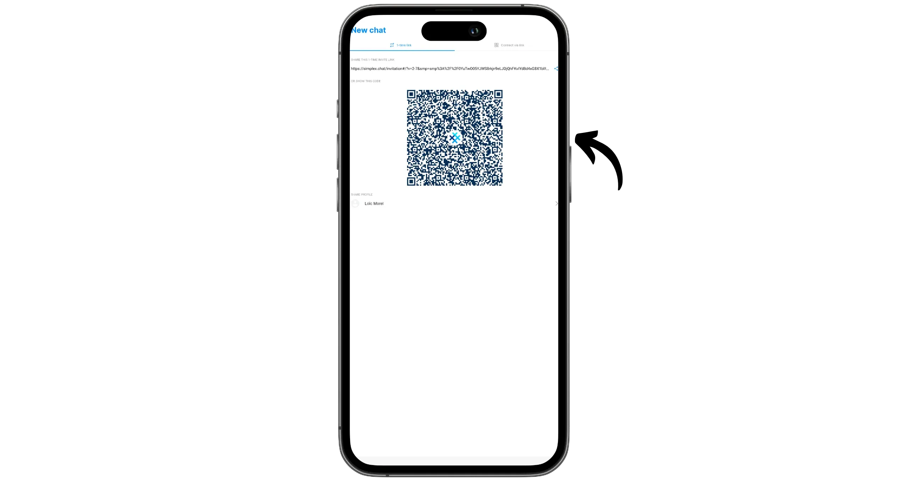

2021 දී ආරම්භ කරන ලද SimpleX යනු පෞද්ගලිකත්වය සඳහා මුළුමනින්ම වෙනස් ආකල්පයක් ඇති නොමිලේ ක්ෂණික පණිවිඩ යැවීමේ යෙදුමකි. WhatsApp, Signal සහ අනෙකුත් මධ්‍යස්ථ පණිවිඩ සේවා වලට වඩා වෙනස් වන SimpleX, එහි පරිශීලක කළමනාකරණය සඳහා විශේෂිත වේ: පරිශීලක හඳුනාගැනීම්, නාම ද්විතීයික, අංක හෝ දෘශ්‍යමාන මහජන යතුරු නොමැත. හඳුනාගැනීම් වල මෙම සම්පූර්ණ අස්ථිතිය පරිශීලකයින් සම්බන්ධ කිරීම වර්චුවල්ව අසම්භාව්‍ය කරයි, ඉහළ මට්ටමේ පෞද්ගලිකත්වයක් සහතික කරයි.

බොහෝ යෙදුම් වලට ගිණුමක් හෝ දුරකථන අංකයක් අවශ්‍ය වන අතර, SimpleX ඔබට සබැඳියක් හෝ කාලික QR කේතයක් බෙදා ගැනීමෙන් සංවාද ආරම්භ කිරීමට ඉඩ සලසයි. සෑම සබැඳියක්ම අද්විතීය සංකේතනය කළ නාලිකාවක් නිර්මාණය කරයි, සහ සම්බන්ධීකාරකයන්ට Exchange විශේෂිතව නොමැතිව යවන්නා සොයා ගැනීමට හෝ නැවත සම්බන්ධ වීමට නොහැක. පණිවිඩ අවසානයේ සිට අවසානය දක්වා සංකේතනය කර ඇති අතර, එය යැවීමෙන් පසු මකා දමන රිලේ සේවාදායක හරහා ගමන් කරයි, සහ යවන්නා හෝ ලැබන්නා, හෝ ඔවුන්ගේ යතුරු නොදකියි.

ජාල ව්‍යුහය සම්පූර්ණයෙන්ම විකේන්ද්‍රීකරණය කර ඇති අතර ඒකාබද්ධ නොකළ: සේවාදායකයන් එකිනෙකා නොදනී, ඔවුන් ගෝලීය නාමාවලියක් තබා නොගනී, සහ ඔවුන් කිසිදු පරිශීලක පැතිකඩක් සත්කාර නොකරයි. තවදුරටත් හොඳ, සෑම පරිශීලකයෙකුටම තමන්ගේම රිලේ සේවාදායකය යොදවා භාවිතා කළ හැකි අතර, මහජන ජාලයේ ඇති ඒවා සමඟ අන්තර්ක්‍රියාකාරීව පවතී.

SimpleX සම්පූර්ණයෙන්ම විවෘත මූලාශ්‍ර (ගනුදෙනුකරුවන්, ප්‍රොටෝකෝල සහ සේවාදායකයන්) වන අතර, එය Android, iOS, Linux, Windows සහ macOS මත ලබා ගත හැක. එහි ස්ථානීය ගබඩා කිරීම සංකේතනය කර ඇති අතර පරිපථගත වන අතර, මධ්‍යස්ථ සේවාදායකයෙකුට භාර නොවී, පැතිකඩක් එක් උපාංගයකින් අනෙකකට මාරු කළ හැක.

SimpleX සම්ප්‍රේෂණ යෙදුම්වල සියලුම සම්භාව්‍ය විශේෂාංග ඒකාබද්ධ කරයි. කෙසේ වෙතත්, එහි ආකෘතිකරණය WhatsApp හෝ Signal වලට වඩා අඩු දියුණු වී ඇත. විශේෂයෙන්ම සම්බන්ධීකරණ එකතු කිරීමේදී, එය භාවිතා කිරීමට වඩාත් සීමාකාරී විය හැක. එබැවින්, මගේ අදහස අනුව, රහස්‍යතාවය තම ප්‍රමුඛතාවයන්ගේ මධ්‍යයේ තබන පරිශීලකයින් සඳහා WhatsApp හෝ Signal සඳහා අදාල විකල්පයක් වන අතර, එම හේතුව සඳහා, දිනපතා පරිශීලක සුවපහසුව පිළිබඳව කිසියම් වන්දි කිහිපයක් ලබා දීමට සූදානම් වේ.

| Application          | E2EE 1:1       | E2EE groupes   | Inscription anonyme | Licence client open-source | Licence serveur open-source | Serveur décentralisé | Année de création |
| -------------------- | -------------- | -------------- | ------------------- | -------------------------- | --------------------------- | -------------------- | ----------------- |
| WhatsApp             | ✅              | ✅              | ❌                   | ❌                          | ❌                           | ❌                    | 2009              |
| WeChat               | ❌              | ❌              | ❌                   | ❌                          | ❌                           | ❌                    | 2011              |
| Facebook Messenger   | ✅              | 🟡 (optionnel) | ❌                   | ❌                          | ❌                           | ❌                    | 2011              |
| Telegram             | 🟡 (optionnel) | ❌              | 🟡                  | ✅                          | ❌                           | ❌                    | 2013              |
| LINE                 | ✅              | ✅              | ❌                   | ❌                          | ❌                           | ❌                    | 2011              |
| Signal               | ✅              | ✅              | ❌                   | ✅                          | ✅                           | ❌                    | 2014              |
| Threema              | ✅              | ✅              | ✅                   | ✅                          | ❌                           | ❌                    | 2012              |
| Element (Matrix)     | ✅              | ✅              | ✅                   | ✅                          | ✅                           | 🟡 (fédéré)          | 2016              |
| Delta Chat           | ✅              | ✅              | ✅                   | ✅                          | N/A                         | 🟡 (via email)       | 2017              |
| Conversations (XMPP) | ✅              | ✅              | ✅                   | ✅                          | ✅                           | 🟡 (fédéré)          | 2014              |
| Session              | ✅              | ✅              | ✅                   | ✅                          | ✅                           | ✅                    | 2020              |
| **SimpleX**          | ✅              | ✅              | ✅                   | ✅                          | ✅                           | ✅                    | 2021              |
| Olvid                | **✅**          | **✅**          | **✅**               | **✅**                      | **❌**                       | **❌**                | 2019              |
| Keet                 | ✅              | ✅              | ✅                   | ❌                          | N/A                         | ✅                    | 2022              |
| Jami                 | ✅              | ✅              | ✅                   | ✅                          | N/A                         | ✅                    | 2005              |
| Briar                | ✅              | ✅              | ✅                   | ✅                          | N/A                         | ✅                    | 2018              |
| Tox                  | ✅              | ✅              | ✅                   | ✅                          | N/A                         | ✅                    | 2013              |

*E2EE = අවසානයට-අවසානයේ සංකේතනය*

## ස්ථාපනය SimpleX Chat යෙදුම

SimpleX Chat vseh platformah na voljo. Aplikacijo lahko prenesete neposredno iz trgovine z aplikacijami na vašem telefonu:

- [Google Play](https://play.google.com/store/apps/details?id=chat.simplex.app);
- [App Store](https://apps.apple.com/us/app/simplex-chat-secure-messenger/id1605771084);
- [F-Droid](https://simplex.chat/fdroid/).

Na Androidu je mogoče tudi [namestiti prek APK](https://github.com/simplex-chat/simplex-chat/releases).

මෙම උපකාරිකාවේදී, අපි ජංගම අනුවාදය මත අවධානය යොමු කරමු, නමුත් කරුණාකර සලකන්න [ඩෙස්ක්ටොප් අනුවාදයන් ද ලබා ගත හැක](https://simplex.chat/downloads/) (MacOS, Linux සහ Windows). ඩෙස්ක්ටොප් අනුවාදය දැනට පවතින ජංගම පරිශීලක පැතිකඩකට සම්බන්ධ කිරීමේ හැකියාව ඇත, නමුත් මෙම සංකේතනය ක්‍රියාත්මක වීමට, දෙපිළේම උපාංග එකම ස්ථානීය ජාලයට සම්බන්ධ වී තිබිය යුතුය.

## SimpleX Chat මත ගිණුමක් සාදන්න

කළමනාකරණය කිරීම සඳහා, "*ඔබේ පැතිකඩ නිර්මාණය කරන්න*" බොත්තම ක්ලික් කරන්න.

තෝරන්න පරිශීලක නාමයක්, එය ඔබේ සත්‍ය නම හෝ කුමන්ත්‍රණ නාමයක් විය හැක, එවිට "*Create*" මත ක්ලික් කරන්න.

ඊළඟට, යෙදුම නව පණිවිඩ සඳහා පරීක්ෂා කරන සංඛ්‍යාතය සකසන්න. ඔබේ දුරකථනයේ බැටරි ආයු කාලය ගැටළුවක් නොවේ නම්, පණිවිඩ වහාම ලබා ගැනීමට "*ඉක්මන්*" තෝරන්න. ඔබේ බැටරිය සුරැකීමට සහ යෙදුම පසුබැසීමේදී ක්‍රියාත්මක වීම වැළැක්වීමට කැමති නම්, "*යෙදුම ක්‍රියාත්මක වන විට*" තෝරන්න: එවිට යෙදුම විවෘත වන විට පමණක් ඔබට පණිවිඩ ලැබෙනු ඇත. සම්භාව්‍ය එකඟතාවයක් වන්නේ මිනිත්තු 10 කට වරක් කාලික පරීක්ෂාවක් තෝරා ගැනීමයි.

ඔබේ තේරීම කළ පසු, "*Use chat*" මත ක්ලික් කරන්න.

ඔබ දැන් SimpleX Chat සමඟ සම්බන්ධ වී කතාබස් ආරම්භ කිරීමට සූදානම්.

## SimpleX Chat සකසීම

මුලින්ම, පහළ දකුණු කෙළවරේ ඇති ඔබේ පැතිකඩ ඡායාරූපය මත ක්ලික් කිරීමෙන් සැකසුම් වෙත ප්‍රවේශ වන්න, එවිට "*Settings*" මත ක්ලික් කරන්න.

ස්වභාවික සැකසුම් බොහෝ පරිශීලකයින් සඳහා සාමාන්‍යයෙන් සුදුසු වේ. කෙසේ වෙතත්, මම ඔබට "*Database passphrase & export*" මෙනුවට යාමට නිර්දේශ කරමි. මෙය ඔබේ SimpleX ගිණුම් දත්ත සමුදාය ආපසු ගබඩා කිරීම සඳහා අපනයනය කළ හැකි ස්ථානයයි.

ඔබට මෙම දත්ත සමුදාය සංකේතනය කිරීමට භාවිතා කරන passphrase ද වෙනස් කළ හැක. පෙරනිමි ලෙස, එය අහඹු ලෙස ජනනය කර ඔබේ උපාංගයේ දේශීයව ගබඩා කර ඇත. ඔබ කැමති නම්, ඔබේම passphrase එකක් නිර්වචනය කර දේශීය passphrase ආපසු ගබඩා ඉවත් කළ හැක: එවිට ඔබට යෙදුම විවෘත කරන සෑම විටම, මෙන්ම වෙනත් උපාංගයකට මාරු වන විටද එය අතින් ඇතුළත් කළ යුතුය.

**කරුණාකර සලකන්න**: ඔබ මෙම විකල්පය තෝරාගත් නම්, passphrase හි අහිමිවීමෙන් ඔබේ සියලු SimpleX පැතිකඩ සහ පණිවිඩ ස්ථිරවම අහිමි වනු ඇත.

Priporočam tudi, da odprete meni "*Zasebnost in varnost*", kjer lahko aktivirate možnost "*SimpleX Lock*". To zaščiti dostop do aplikacije z zaklepno kodo.

අවසන් වශයෙන්, "*දැනුම්දීම්*" සහ "*පෙනුම*" මෙනු ඔබේ කැමැත්තන්ට අනුව SimpleX Chat අභිරුචිකරණය කිරීමට ඉඩ සලසයි.

## SimpleX Chat සමඟ පණිවිඩ යවන්න

SimpleX-හි වෙනත් පුද්ගලයෙකු සමඟ සම්බන්ධ වීමට, ඔබට විකල්ප දෙකක් ඇත:

- Uporabite enkratno povezavo;
- Address එකක් නැවත භාවිතා කළ හැකි ස්ථාවර භාවිතය.

ස්ථාවර Address එකක් SimpleX මඟින් ඔබව සම්බන්ධ කර ගැනීමට එය දන්නා ඕනෑම කෙනෙකුට ඉඩ සලසයි. එය පවතින Address එකක් වන අතර, විවිධ පුද්ගලයින් විසින්, කාල සීමාවකින් තොරව, කිහිප වරක් භාවිතා කළ හැක. එහි මෙම පවතින ස්වභාවය නිසා එය ස්පෑම් සඳහා වඩාත් අවදානම් වේ. කෙසේ වෙතත්, අනෙකුත් පණිවිඩ යෙදුම් වලට වඩා, ඔබේ SimpleX Address මකා දැමීම ප්‍රමාණවත් වේ සියලු ස්පෑම් නවතා දැමීමට, පවතින සංවාද වලට බලපෑමක් නොමැතිව. ඇත්ත වශයෙන්ම, මෙම Address භාවිතා කරන්නේ ආරම්භක සම්බන්ධතාවය ස්ථාපිත කිරීමට පමණක් වන අතර, Exchange ආරම්භ වූ විට එය අවශ්‍ය නොවේ.

අනෙක් අතට, එක් වරක් පමණක් භාවිතා කළ හැකි සබැඳි, ඕනෑම පරිශීලකයෙකු විසින් එක් වරක් පමණක් භාවිතා කළ හැක. සබැඳිය භාවිතා කිරීමෙන් පසු, එය අක්‍රිය වේ. ඔබට එක් එක් නව සම්බන්ධතාවයක් සඳහා නව generate එකක් අවශ්‍ය වේ.

### සිතියම් Address සමඟ

If you wish to use the Address, click on your profile picture at the bottom left of the Interface, then select "*Create SimpleX Address*". Then click on "*Create SimpleX Address*" again.

ඔබේ නැවත භාවිතා කළ හැකි Address දැන් නිර්මාණය කර ඇත. ඔබට එය QR කේතය පෙන්වා හෝ සබැඳිය යැවීමෙන් ඔබ හා සම්බන්ධ වීමට කැමති පුද්ගලයින් සමඟ බෙදා ගත හැක.

"*Address සැකසුම්*" බොත්තම මත ක්ලික් කරන්න. මෙහිදී ඔබට ඔබේ Address සමඟ සම්බන්ධ අවසර සැකසිය හැක. "*සම්බන්ධිතයන් සමඟ බෙදා ගන්න*" විකල්පය ඔබේ Address ඔබේ SimpleX පැතිකඩේ දෘශ්‍යමාන කරයි. එවිට ඔබේ සම්බන්ධිතයන්ට එය පරීක්ෂා කිරීමට සහ ඔබව සම්බන්ධ කිරීමට කැමති වෙනත් පුද්ගලයින්ට එය යොමු කිරීමට හැකි වේ.

"*ස්වයං-පිළිගැනීම*" විකල්පය ඔබේ Address හරහා පැමිණෙන සම්බන්ධතා ස්වයංක්‍රීයව පිළිගනී. මෙය අර්ථ දක්වන්නේ ඔබේ Address ඇති ඕනෑම කෙනෙකුට ඔබේ පැතිකඩ දැකීමට සහ ඔබට පණිවිඩයක් යැවීමට හැකි බවයි, "*අදෘශ්‍ය පිළිගැනීම*" විකල්පය සක්‍රීය නොකළහොත්. නව සම්බන්ධතාවක් ඇති විට මෙය ඔබේ නම සහ පැතිකඩ ඡායාරූපය සඟවා, එක් එක් සංවාදකයා සඳහා වෙනස් අහඹු නාමයක් සමඟ ඒවා වෙනස් කරයි.

### z večkrat uporabno povezavo

දෙවන පුද්ගලයෙකු සමඟ සම්බන්ධ වීමේ දෙවන ක්‍රමය වන්නේ එක් වරක් පමණක් භාවිතා කළ හැකි සබැඳියක් සෑදීමයි. මෙය කිරීමට, Interface හි දකුණු පහළ කෙළවරේ පිහිටි පෑන අයිකනය මත ක්ලික් කර, "*Create 1-time link*" තෝරන්න.

če vam je stik poslal povezavo, kliknite na "*Skeniraj / Prilepi povezavo*" za skeniranje ali lepljenje.

SimpleX nato ustvari enkratno povezavo. To lahko posredujete svojemu stiku na kakršen koli način: fizični Exchange, druga sporočila itd.

ඔබට මෙම ආරාධනා සබැඳිය සමඟ සම්බන්ධ කිරීමට කුමන පැතිකඩක් තෝරාගත හැකිදැයි තෝරාගත හැක. එසේ කිරීමට, QR කේතය යටතේ ඇති ඔබේ පැතිකඩ මත ක්ලික් කරන්න. එවිට ඔබට හැකි වනු ඇත:

- ඔබේ දැනට පවතින පැතිකඩවලින් එකක් තෝරන්න (ඊළඟ කොටසෙහි පැතිකඩ කිහිපයක් නිර්මාණය කරන ආකාරය අපි බලමු);
- ali izberite način "*Incognito*", ki skrije vaše ime in profilno fotografijo z naključno ustvarjenim psevdonimom za vašega dopisovalca.

මෙහි, මම "*Incognito*" ප්‍රකාරය තෝරමි.

මගේ සම්බන්ධතාවය සබැඳිය භාවිතා කළා. ඔහුගේ පාර්ශවයෙන්, ඔහු "*Incognito*" ප්‍රකාරය සක්‍රීය නොකළේය, එම නිසා මම ඔහුගේ පැතිකඩ නාමය, "*Bob*" දැකිය හැක. අනෙක් අතට, බොබ් මගේ සැබෑ නම "*Loïc Morel*" නොදකින අතර, මෙම අවස්ථාවේ "*RealSynergy*" ලෙස අහඹු නාමයක් පමණක් දකිය හැක.

Začnem lahko takoj klepetati, vendar bi najprej rad preveril, da govorim z Bobom, in ne z neko zlonamerno osebo, ki bi lahko prestregla povezavo ali izvedla MITM napad.

Za to bomo preverili našo varnostno povezavo **zunaj aplikacije**. To je pomembno, ker bi bila v primeru MITM napada notranja verifikacija ogrožena. Zato uporabite drug varen sistem za sporočanje, ali še bolje, preverite kode osebno.

චැට් එකේ, බොබ්ගේ ඡායාරූපය මත ක්ලික් කරන්න, එවිට "*ආරක්ෂක කේතය සත්‍යාපනය කරන්න*" මත ක්ලික් කරන්න. බොබ්ටත් ඔහුගේ පැත්තෙන් ඒක කරන්න වෙනවා.

Če delate na daljavo, primerjajte kode na drugem varnem sistemu za sporočanje (morajo biti enake). Še bolje pa je, če se lahko srečate osebno in skenirate QR kodo vašega stika s klikom na "*Skeniraj kodo*".

Če je preverjanje uspešno, se bo poleg imena vašega stika prikazala ikona ščita s kljukico. To je vaše zagotovilo, da izmenjujete z Bobom. Če preverjanje ni uspešno, se bo prikazalo opozorilo "*Napačna varnostna koda!*".

Zdaj lahko svobodno Exchange sporočila, klice in datoteke z Bobom, odvisno od dovoljenj, ki ste jih nastavili za ta pogovor.

## ඔබේ SimpleX Chat පැතිකඩ අභිරුචිකරණය කරන්න

SimpleX-এর অন্যতম শক্তিশালী বৈশিষ্ট্য হল একই স্থানীয় অ্যাকাউন্ট থেকে অ্যাক্সেসযোগ্য একাধিক সম্পূর্ণ পৃথক ব্যবহারকারী প্রোফাইল পরিচালনা করার ক্ষমতা। এটি আপনাকে আপনার বিভিন্ন পরিচয়গুলি সুন্দরভাবে আলাদা করতে দেয়, বার্তা পরিচালনা জটিল না করেই।

උදාහරණයක් ලෙස, ඔබට නිර්මාණය කළ හැක:

- ඔබේ වෘත්තීය හුවමාරු සඳහා ඔබේ සත්‍ය නම සහ සත්‍ය ඡායාරූපයක් සහිත පැතිකඩක්;
- ඔබේ පවුල් හුවමාරු සඳහා ඔබේ සත්‍ය නම සහ විහිළු ඡායාරූපයක් සහිත පැතිකඩක්;
- ඔබේ පුද්ගලික සංවාද සඳහා ව්‍යාජ ඡායාරූපයක් සහ අනුනාමයක් සහිත පැතිකඩක්;
- තවත් නාමයෝජිත පැතිකඩක් අමුතු අය සමඟ කතාබහ කිරීමට.

අපි මෙහිදී කරන දේ එයයි. මම මගේ ප්‍රධාන පැතිකඩ, මගේ සත්‍ය හැඳුනුම්පතට සම්බන්ධිත එක, වින්‍යාස කිරීමෙන් ආරම්භ කරමි. මෙය කිරීමට, මම පහළ දකුණු කෙළවරේ ඇති මගේ පැතිකඩ ඡායාරූපය මත ක්ලික් කර, එවිට මගේ පරිශීලක නාමය මත ක්ලික් කරමි.

Potem kliknem na svojo profilno fotografijo, da jo spremenim in dodam novo.

අනෙකුත් පැතිකඩ එක් කිරීමට, "*ඔබේ කතාබස් පැතිකඩ*" මෙනුව මත ක්ලික් කරන්න.

මෙහි ඔබේ සියලුම පැතිකඩ බලන්නට ලැබේ. නව පැතිකඩක් සෑදීමට "*පැතිකඩ එක් කරන්න*" ක්ලික් කරන්න.

පසුව, ඔබේ නව පැතිකඩ සඳහා තොරතුරු තෝරන්න: නම, ඡායාරූපය, ආදිය. මෙහිදී, මම විශේෂිත හුවමාරු වලදී මගේ සත්‍ය හැඳුනුම්පත සඟවා ගැනීමට පනාවක් සහ වෙනස් රූපයක් භාවිතා කරමි.

ඔබේ ඇඟිල්ල පැතිරීමෙන් පැතිරීමෙන් පැතිරීමෙන් පැතිරීමෙන් පැතිරීමෙන් පැතිරීමෙන් පැතිරීමෙන් පැතිරීමෙන් පැතිරීමෙන් පැතිරීමෙන් පැතිරීමෙන් පැතිරීමෙන් පැතිරීමෙන් පැතිරීමෙන් පැතිරීමෙන් පැතිරීමෙන් පැතිරීමෙන් පැතිරීමෙන් පැතිරීමෙන් පැතිරීමෙන් පැතිරීමෙන් පැතිරීමෙන් පැතිරීමෙන් පැතිරීමෙන් පැතිරීමෙන් පැතිරීමෙන් පැතිරීමෙන් පැතිරීමෙන් පැතිරීමෙන් පැතිරීමෙන් පැතිරීමෙන් පැතිරීමෙන් පැතිරීමෙන් පැතිරීමෙන් පැතිරීමෙන් පැතිරීමෙන් පැතිරීමෙන් පැතිරීමෙන් පැතිරීමෙන් පැතිරීමෙන් පැතිරීමෙන් පැතිරීමෙන් පැතිරීමෙන් පැතිරීමෙන් පැතිරීමෙන් පැතිරීමෙන් පැතිරීමෙන් පැතිරීමෙන් පැතිරීමෙන් පැතිරීමෙන් පැතිරීමෙන් පැතිරීමෙන් පැතිරීමෙන් පැතිරීමෙන් පැතිරීමෙන් පැතිරීමෙන් පැතිරීමෙන් පැතිරීමෙන් පැතිරීමෙන් පැතිරීමෙන් පැතිරීමෙන් පැතිරීමෙන් පැතිරීමෙන් පැතිරීමෙන් පැතිරීමෙන් පැතිරීමෙන් පැතිරීමෙන් පැතිරීමෙන් පැතිරීමෙන් පැතිරීමෙන් පැතිරීමෙන් පැතිරීමෙන් පැතිරීමෙන් පැතිරීමෙන් පැතිරීමෙන් පැතිරීමෙන් පැතිරීමෙන් පැතිරීමෙන් පැතිරීමෙන් පැතිරීමෙන් පැතිරීමෙන් පැතිරීමෙන් පැතිරීමෙන් පැතිරීමෙන් පැතිරීමෙන් පැතිරීමෙන් පැතිරීමෙන් පැතිරීමෙන් පැතිරීමෙන් පැතිරීමෙන් පැතිරීමෙන් පැතිරීමෙන් පැතිරීමෙන් පැතිරීමෙන් පැතිරීමෙන් පැතිරීමෙන් පැතිරීමෙන් පැතිරීමෙන් පැතිරීමෙන් පැතිරීමෙන් පැතිරීමෙන් පැතිරීමෙන් පැතිරීමෙන් පැතිරීමෙන් පැතිරීමෙන් පැතිරීමෙන් පැතිරීමෙන් පැතිරීමෙන් පැතිරීමෙන් පැතිරීමෙන් පැතිරීමෙන් පැතිරීමෙන් පැතිරීමෙන් පැතිරීමෙන් පැතිරීමෙන් පැතිරීමෙන් පැතිරීමෙන් පැතිරීමෙන් පැතිරීමෙන් පැතිරීමෙන් පැතිරීමෙන් පැතිරීමෙන් පැතිරීමෙන් පැතිරීමෙන් පැතිරීමෙන් පැතිරීමෙන් පැතිරීමෙන් පැතිරීමෙන් පැතිරීමෙන් පැතිරීමෙන් පැතිරීමෙන් පැතිරීමෙන් පැතිරීමෙන් පැතිරීමෙන් පැතිරීමෙන් පැතිරීමෙන් පැතිරීමෙන් පැතිරීමෙන් පැතිරීමෙන් පැතිරීමෙන් පැතිරීමෙන් පැතිරීමෙන් පැතිරීමෙන් පැතිරීමෙන් පැතිරීමෙන් පැතිරීමෙන් පැතිරීමෙන් පැතිරීමෙන් පැතිරීමෙන් පැතිරීමෙන් පැතිරීමෙන් පැතිරීමෙන් පැතිරීමෙන් පැතිරීමෙන් පැතිරීමෙන් පැතිරීමෙන් පැතිරීමෙන් පැතිරීමෙන් පැතිරීමෙන් පැතිරීමෙන් පැතිරීමෙන් පැතිරීමෙන් පැතිරීමෙන් පැතිරීමෙන් පැතිරීමෙන් පැතිරීමෙන් පැතිරීමෙන් පැතිරීමෙන් පැතිරීමෙන් පැතිරීමෙන් පැතිරීමෙන් පැතිරීමෙන් පැතිරීමෙන් පැතිරීමෙන් පැතිරීමෙන් පැතිරීමෙන් පැතිරීමෙන් පැතිරීමෙන් පැතිරීමෙන් පැතිරීමෙන් පැතිරීමෙන් පැතිරීමෙන් පැතිරීමෙන් පැතිරීමෙන් පැතිරීමෙන් පැතිරීමෙන් පැතිරීමෙන් පැතිරීමෙන් පැතිරීමෙන් පැතිරීමෙන් පැතිරීමෙන් පැතිරීමෙන් පැතිරීමෙන් පැතිරීමෙන් පැතිරීමෙන් පැතිරීමෙන් පැතිරීමෙන් පැතිරීමෙන් පැතිරීමෙන් පැතිරීමෙන් පැතිරීමෙන් පැතිරීමෙන් පැතිරීමෙන් පැතිරීමෙන් පැතිරීමෙන් පැතිරීමෙන් පැතිරීමෙන් පැතිරීමෙන් පැතිරීමෙන් පැතිරීමෙන් පැතිරීමෙන් පැතිරීමෙන් පැතිරීමෙන් පැතිරීමෙන් පැතිරීමෙන් පැතිරීමෙන් පැතිරීමෙන් පැතිරීමෙන් පැතිරීමෙන් පැතිරීමෙන් පැතිරීමෙන් පැතිරීමෙන් පැතිරීමෙන් පැතිරීමෙන් පැතිරීමෙන් පැතිරීමෙන් පැතිරීමෙන් පැතිරීමෙන් පැතිරීමෙන් පැතිරීමෙන් පැතිරීමෙන් පැතිරීමෙන් පැතිරීමෙන් පැතිරීමෙන් පැතිරීමෙන් පැතිරීමෙන් පැතිරීමෙන් පැතිරීමෙන් පැතිරීමෙන් පැතිරීමෙන් පැතිරීමෙන් පැතිරීමෙන් පැතිරීමෙන් පැතිරීමෙන් පැතිරීමෙන් පැතිරීමෙන් පැතිරීමෙන් පැතිරීමෙන් පැතිරීමෙන් පැතිරීමෙන් පැතිරීමෙන් පැතිරීමෙන් පැතිරීමෙන් පැතිරීමෙන් පැතිරීමෙන් පැතිරීමෙන් පැතිරීමෙන් පැතිරීමෙන් පැතිරීමෙන් පැතිරීමෙන් පැතිරීමෙන් පැතිරීමෙන් පැතිරීමෙන් පැතිරීමෙන් පැතිරීමෙන් පැතිරීමෙන් පැතිරීමෙන් පැතිරීමෙන් පැතිරීමෙන් පැතිරීමෙන් පැතිරීමෙන් පැතිරීමෙන් පැතිරීමෙන් පැතිරීමෙන් පැතිරීමෙන් පැතිරීමෙන් පැතිරීමෙන් පැතිරීමෙන් පැතිරීමෙන් පැතිරීමෙන් පැතිරීමෙන් පැතිරීමෙන් පැතිරීමෙන් පැතිරීමෙන් පැතිරීමෙන් පැතිරීමෙන් පැතිරීමෙන් පැතිරීමෙන් පැතිරීමෙන් පැතිරීමෙන් පැතිරීමෙන් පැතිරීමෙන් පැතිරීමෙන් පැතිරීමෙන් පැතිරීමෙන් පැතිරීමෙන් පැතිරීමෙන් පැතිරීමෙන් පැතිරීමෙන් පැතිරීමෙන් පැතිරීමෙන් පැතිරීමෙන් පැතිරීමෙන් පැතිරීමෙන් පැතිරීමෙන් පැතිරීමෙන් පැතිරීමෙන් පැතිරීමෙන් පැතිරීමෙන් පැතිරීමෙන් පැතිරීමෙන් පැතිරීමෙන් පැතිරීමෙන් පැතිරීමෙන් පැතිරීමෙන් පැතිරීමෙන් පැතිරීමෙන් පැතිරීමෙන් පැතිරීමෙන් පැතිරීමෙන් පැතිරීමෙන් පැතිරීමෙන් පැතිරීමෙන් පැතිරීමෙන් පැතිරීමෙන් පැතිරීමෙන් පැතිරීමෙන් පැතිරීමෙන් පැතිරීමෙන් පැතිරීමෙන් පැතිරීමෙන් පැතිරීමෙන් පැතිරීමෙන් පැතිරීමෙන් පැතිරීමෙන් පැතිරීමෙන් පැතිරීමෙන් පැතිරීමෙන් පැතිරීමෙන් පැතිරීමෙන් පැතිරීමෙන් පැතිරීමෙන් පැතිරීමෙන් පැතිරීමෙන් පැතිරීමෙන් පැතිරීමෙන් පැතිරීමෙන් පැතිරීමෙන් පැතිරීමෙන් පැතිරීමෙන් පැතිරීමෙන් පැතිරීමෙන් පැතිරීමෙන් පැතිරීමෙන් පැතිරීමෙන් පැතිරීමෙන් පැතිරීමෙන් පැතිරීමෙන් පැතිරීමෙන් පැතිරීමෙන් පැතිරීමෙන් පැතිරීමෙන් පැතිරීමෙන් පැතිරීමෙන් පැතිරීමෙන් පැතිරීමෙන් පැතිරීමෙන් පැතිරීමෙන් පැතිරීමෙන් පැතිරීමෙන් පැතිරීමෙන් පැතිරීමෙන් පැතිරීමෙන් පැතිරීමෙන් පැතිරීමෙන් පැතිරීමෙන් පැතිරීමෙන් පැතිරීමෙන් පැතිරීමෙන් පැතිරීමෙන් පැතිරීමෙන් පැතිරීමෙන් පැතිරීමෙන් පැතිරීමෙන් පැතිරීමෙන් පැතිරීමෙන් පැතිරීමෙන් පැතිරීමෙන් පැතිරීමෙන් පැතිරීමෙන් පැතිරීමෙන් පැතිරීමෙන් පැතිරීමෙන් පැතිරීමෙන් පැතිරීමෙන් පැතිරීමෙන් පැතිරීමෙන් පැතිරීමෙන් පැතිරීමෙන් පැතිරීමෙන් පැතිරීමෙන් පැතිරීමෙන් පැතිරීමෙන් පැතිරීමෙන් පැතිරීමෙන් පැතිරීමෙන් පැතිරීමෙන් පැතිරීමෙන් පැතිරීමෙන් පැතිරීමෙන් පැතිරීමෙන් පැතිරීමෙන් පැතිරීමෙන් පැතිරීමෙන් පැතිරීමෙන් පැතිරීමෙන් පැතිරීමෙන් පැතිරීමෙන් පැතිරීමෙන් පැතිරීමෙන් පැතිරීමෙන් පැතිරීමෙන් පැතිරීමෙන් පැතිරීමෙන් පැතිරීමෙන් පැතිරීමෙන් පැතිරීමෙන් පැතිරීමෙන් පැතිරීමෙන් පැතිරීමෙන් පැතිරීමෙන් පැතිරීමෙන් පැතිරීමෙන් පැතිරීමෙන් පැතිරීමෙන් පැතිරීමෙන් පැතිරීමෙන් පැතිරීමෙන් පැතිරීමෙන් පැතිරීමෙන් පැතිරීමෙන් පැතිරීමෙන් පැතිරීමෙන් පැතිරීමෙන් පැතිරීමෙන් පැතිරීමෙන් පැතිරීමෙන් පැතිරීමෙන් පැතිරීමෙන් පැතිරීමෙන් පැතිරීමෙන් පැතිරීමෙන් පැතිරීමෙන් පැතිරීමෙන් පැතිරීමෙන් පැතිරීමෙන් පැතිරීමෙන් පැතිරීමෙන් පැතිරීමෙන් පැතිරීමෙන් පැතිරීමෙන් පැතිරීමෙන් පැතිරීමෙන් පැතිරීමෙන් පැතිරීමෙන් පැතිරීමෙන් පැතිරීමෙන් පැතිරීමෙන් පැතිරීමෙන් පැතිරීමෙන් පැතිරීමෙන් පැතිරීමෙන් පැතිරීමෙන් පැතිරීමෙන් පැතිරීමෙන් පැතිරීමෙන් පැතිරීමෙන් පැතිරීමෙන් පැතිරීමෙන් පැතිරීමෙන් පැතිරීමෙන් පැතිරීමෙන් පැතිරීමෙන් පැතිරීමෙන් පැතිරීමෙන් පැතිරීමෙන් පැතිරීමෙන් පැතිරීමෙන් පැතිරීමෙන් පැතිරීමෙන් පැතිරීමෙන් පැතිරීමෙන් පැතිරීමෙන් පැතිරීමෙන් පැතිරීමෙන් පැතිරීමෙන් පැතිරීමෙන් පැතිරීමෙන් පැතිරීමෙන් පැතිරීමෙන් පැතිරීමෙන් පැතිරීමෙන් පැතිරීමෙන් පැතිරීමෙන් පැතිරීමෙන් පැතිරීමෙන් පැතිරීමෙන් පැතිරීමෙන් පැතිරීමෙන් පැතිරීමෙන් පැතිරීමෙන් පැතිරීමෙන් පැතිරීමෙන් පැතිරීමෙන් පැතිරීමෙන් පැතිරීමෙන් පැතිරීමෙන් පැතිරීමෙන් පැතිරීමෙන් පැතිරීමෙන් පැතිරීමෙන් පැතිරීමෙන් පැතිරීමෙන් පැතිරීමෙන් පැතිරීමෙන් පැතිරීමෙන් පැතිරීමෙන් පැතිරීමෙන් පැතිරීමෙන් පැතිරීමෙන් පැතිරීමෙන් පැතිරීමෙන් පැතිරීමෙන් පැතිරීමෙන් පැතිරීමෙන් පැතිරීමෙන් පැතිරීමෙන් පැතිරීමෙන් පැතිරීමෙන් පැතිරීමෙන් පැතිරීමෙන් පැතිරීමෙන් පැතිරීමෙන් පැතිරීමෙන් පැතිරීමෙන් පැතිරීමෙන් පැතිරීමෙන් පැතිරීමෙන් පැතිරීමෙන් පැතිරීමෙන් පැතිරීමෙන් පැතිරීමෙන් පැතිරීමෙන් පැතිරීමෙන් පැතිරීමෙන් පැතිරීමෙන් පැතිරීමෙන් පැතිරීමෙන් පැතිරීමෙන් පැතිරීමෙන් පැතිරීමෙන් පැතිරීමෙන් පැතිරීමෙන් පැතිරීමෙන් පැතිරීමෙන් පැතිරීමෙන් පැතිරීමෙන් පැතිරීමෙන් පැතිරීමෙන් පැතිරීමෙන් පැතිරීමෙන් පැතිරීමෙන් පැතිරීමෙන් පැතිරීමෙන් පැතිරීමෙන් පැතිරීමෙන් පැතිරීමෙන් පැතිරීමෙන් පැතිරීමෙන් පැතිරීමෙන් පැතිරීමෙන් පැතිරීමෙන් පැතිරීමෙන් පැතිරීමෙන් පැතිරීමෙන් පැතිරීමෙන් පැතිරීමෙන් පැතිරීමෙන් පැතිරීමෙන් පැතිරීමෙන් පැතිරීමෙන් පැතිරීමෙන් පැතිරීමෙන් පැතිරීමෙන් පැතිරීමෙන් පැතිරීමෙන් පැතිරීමෙන් පැතිරීමෙන් පැතිරීමෙන් පැතිරීමෙන් පැතිරීමෙන් පැතිරීමෙන් පැතිරීමෙන් පැතිරීමෙන් පැතිරීමෙන් පැතිරීමෙන් පැතිරීමෙන් පැතිරීමෙන් පැතිරීමෙන් පැතිරීමෙන් පැතිරීමෙන් පැතිරීමෙන් පැතිරීමෙන් පැතිරීමෙන් පැතිරීමෙන් පැතිරීමෙන් පැතිරීමෙන් පැතිරීමෙන් පැතිරීමෙන් පැතිරීමෙන් පැතිරීමෙන් පැතිරීමෙන් පැතිරීමෙන් පැතිරීමෙන් පැතිරීමෙන් පැතිරීමෙන් පැතිරීමෙන් පැතිරීමෙන් පැතිරීමෙන් පැතිරීමෙන් පැතිරීමෙන් පැතිරීමෙන් පැතිරීමෙන් පැතිරීමෙන් පැතිරීමෙන් පැතිරීමෙන් පැතිරීමෙන් පැතිරීමෙන් පැතිරීමෙන් පැතිරීමෙන් පැතිරීමෙන් පැතිරීමෙන් පැතිරීමෙන් පැතිරීමෙන් පැතිරීමෙන් පැතිරීමෙන් පැතිරීමෙන් පැතිරීමෙන් පැතිරීමෙන් පැතිරීමෙන් පැතිරීමෙන් පැතිරීමෙන් පැතිරීමෙන් පැතිරීමෙන් පැතිරීමෙන් පැතිරීමෙන් පැතිරීමෙන් පැතිරීමෙන් පැතිරීමෙන් පැතිරීමෙන් පැතිරීමෙන් පැතිරීමෙන් පැතිරීමෙන් පැතිරීමෙන් පැතිරීමෙන් පැතිරීමෙන් පැතිරීමෙන් පැතිරීමෙන් පැතිරීමෙන් පැතිරීමෙන් පැතිරීමෙන් පැතිරීමෙන් පැතිරීමෙන් පැතිරීමෙන් පැතිරීමෙන් පැතිරීමෙන් පැතිරීමෙන් පැතිරීමෙන් පැතිරීමෙන් පැතිරීමෙන් පැතිරීමෙන් පැතිරීමෙන් පැතිරීමෙන් පැතිරීමෙන් පැතිරීමෙන් පැතිරීමෙන් පැතිරීමෙන් පැතිරීමෙන් පැතිරීමෙන් පැතිරීමෙන් පැතිරීමෙන් පැතිරීමෙන් පැතිරීමෙන් පැතිරීමෙන් පැතිරීමෙන් පැතිරීමෙන් පැතිරීමෙන් පැතිරීමෙන් පැතිරීමෙන් පැතිරීමෙන් පැතිරීමෙන් පැතිරීමෙන් පැතිරීමෙන් පැතිරීමෙන් පැතිරීමෙන් පැතිරීමෙන් පැතිරීමෙන් පැතිරීමෙන් පැතිරීමෙන් පැතිරීමෙන් පැතිරීමෙන් පැතිරීමෙන් පැතිරීමෙන් පැතිරීමෙන් පැතිරීමෙන් පැතිරීමෙන් පැතිරීමෙන් පැතිරීමෙන් පැතිරීමෙන් පැතිරීමෙන් පැතිරීමෙන් පැතිරීමෙන් පැතිරීමෙන් පැතිරීමෙන් පැතිරීමෙන් පැතිරීමෙන් පැතිරීමෙන් පැතිරීමෙන් පැතිරීමෙන් පැතිරීමෙන් පැතිරීමෙන් පැතිරීමෙන් පැතිරීමෙන් පැතිරීමෙන් පැතිරීමෙන් පැතිරීමෙන් පැතිරීමෙන් පැතිරීමෙන් පැතිරීමෙන් පැතිරීමෙන් පැතිරීමෙන් පැතිරීමෙන් පැතිරීමෙන් පැතිරීමෙන් පැතිරීමෙන් පැතිරීමෙන් පැතිරීමෙන් පැතිරීමෙන් පැතිරීමෙන් පැතිරීමෙන් පැතිරීමෙන් පැතිරීමෙන් පැතිරීමෙන් පැතිරීමෙන් පැතිරීමෙන් පැතිරීමෙන් පැතිරීමෙන් පැතිරීමෙන් පැතිරීමෙන් පැතිරීමෙන් පැතිරීමෙන් පැතිරීමෙන් පැතිරීමෙන් පැතිරීමෙන් පැතිරීමෙන් පැතිරීමෙන් පැතිරීමෙන් පැතිරීමෙන් පැතිරීමෙන් පැතිරීමෙන් පැතිරීමෙන් පැතිරීමෙන් පැතිරීමෙන් පැතිරීමෙන් පැතිරීමෙන් පැතිරීමෙන් පැතිරීමෙන් පැතිරීමෙන් පැතිරීමෙන් පැතිරීමෙන් පැතිරීමෙන් පැතිරීමෙන් පැතිරීමෙන් පැතිරීමෙන් පැතිරීමෙන් පැතිරීමෙන් පැතිරීමෙන් පැතිරීමෙන් පැතිරීමෙන් පැතිරීමෙන් පැතිරීමෙන් පැතිරීමෙන් පැතිරීමෙන් පැතිරීමෙන් පැතිරීමෙන් පැතිරීමෙන් පැතිරීමෙන් පැතිරීමෙන් පැතිරීමෙන් පැතිරීමෙන් පැතිරීමෙන් පැතිරීමෙන් පැතිරීමෙන් පැතිරීමෙන් පැතිරීමෙන් පැතිරීමෙන් පැතිරීමෙන් පැතිරීමෙන් පැතිරීමෙන් පැතිරීමෙන් පැතිරීමෙන් පැතිරීමෙන් පැතිරීමෙන් පැතිරීමෙන් පැතිරීමෙන් පැතිරීමෙන් පැතිරීමෙන් පැතිරීමෙන් පැතිරීමෙන් පැතිරීමෙන් පැතිරීමෙන් පැතිරීමෙන් පැතිරීමෙන් පැතිරීමෙන් පැතිරීමෙන් පැතිරීමෙන් පැතිරීමෙන් පැතිරීමෙන් පැතිරීමෙන් පැතිරීමෙන් පැතිරීමෙන් පැතිරීමෙන් පැතිරීමෙන් පැතිරීමෙන් පැතිරීමෙන් පැතිරීමෙන් පැතිරීමෙන් පැතිරීමෙන් පැතිරීමෙන් පැතිරීමෙන් පැතිරීමෙන් පැතිරීමෙන් පැතිරීමෙන් පැතිරීමෙන් පැතිරීමෙන් පැතිරීමෙන් පැතිරීමෙන් පැතිරීමෙන් පැතිරීමෙන් පැතිරීමෙන් පැතිරීමෙන් පැතිරීමෙන් පැතිරීමෙන් පැතිරීමෙන් පැතිරීමෙන් පැතිරීමෙන් පැතිරීමෙන් පැතිරීමෙන් පැතිරීමෙන් පැතිරීමෙන් පැතිරීමෙන් පැතිරීමෙන් පැතිරීමෙන් පැතිරීමෙන් පැතිරීමෙන් පැතිරීමෙන් පැතිරීමෙන් පැතිරීමෙන් පැතිරීමෙන් පැතිරීමෙන් පැතිරීමෙන් පැතිරීමෙන් පැතිරීමෙන් පැතිරීමෙන් පැතිරීමෙන් පැතිරීමෙන් පැතිරීමෙන් පැතිරීමෙන් පැතිරීමෙන් පැතිරීමෙන් පැතිරීමෙන් පැතිරීමෙන් පැතිරීමෙන් පැතිරීමෙන් පැතිරීමෙන් පැතිරීමෙන් පැතිරීමෙන් පැතිරීමෙන් පැතිරීමෙන් පැතිරීමෙන් පැතිරීමෙන් පැතිරීමෙන් පැතිරීමෙන් පැතිරීමෙන් පැතිරීමෙන් පැතිරීමෙන් පැතිරීමෙන් පැතිරීමෙන් පැතිරීමෙන් පැතිරීමෙන් පැතිරීමෙන් පැතිරීමෙන් පැතිරීමෙන් පැතිරීමෙන් පැතිරීමෙන් පැතිරීමෙන් පැතිරීමෙන් පැතිරීමෙන් පැතිරීමෙන් පැතිරීමෙන් පැතිරීමෙන් පැතිරීමෙන් පැතිරීමෙන් පැතිරීමෙන් පැතිරීමෙන් පැතිරීමෙන් පැතිරීමෙන් පැතිරීමෙන් පැතිරීමෙන් පැතිරීමෙන් පැතිරීමෙන් පැතිරීමෙන් පැතිරීමෙන් පැතිරීමෙන් පැතිරීමෙන් පැතිරීමෙන් පැතිරීමෙන් පැතිරීමෙන් පැතිරීමෙන් පැතිරීමෙන් පැතිරීමෙන් පැතිරීමෙන් පැතිරීමෙන් පැතිරීමෙන් පැතිරීමෙන් පැතිරීමෙන් පැතිරීමෙන් පැතිරීමෙන් පැතිරීමෙන් පැතිරීමෙන් පැතිරීමෙන් පැතිරීමෙන් පැතිරීමෙන් පැතිරීමෙන් පැතිරීමෙන් පැතිරීමෙන් පැතිරීමෙන් පැතිරීමෙන් පැතිරීමෙන් පැතිරීමෙන් පැතිරීමෙන් පැතිරීමෙන් පැතිරීමෙන් පැතිරීමෙන් පැතිරීමෙන් පැතිරීමෙන් පැතිරීමෙන් පැතිරීමෙන් පැතිරීමෙන් පැතිරීමෙන් පැතිරීමෙන් පැතිරීමෙන් පැතිරීමෙන් පැතිරීමෙන් පැතිරීමෙන් පැතිරීමෙන් පැතිරීමෙන් පැතිරීමෙන් පැතිරීමෙන් පැතිරීමෙන් පැතිරීමෙන් පැතිරීමෙන් පැතිරීමෙන් පැතිරීමෙන් පැතිරීමෙන් පැතිරීමෙන් පැතිරීමෙන් පැතිරීමෙන් පැතිරීමෙන් පැතිරීමෙන් පැතිරීමෙන් පැතිරීමෙන් පැතිරීමෙන් පැතිරීමෙන් පැතිරීමෙන් පැතිරීමෙන් පැතිරීමෙන් පැතිරීමෙන් පැතිරීමෙන් පැතිරීමෙන් පැතිරීමෙන් පැතිරීමෙන් පැතිරීමෙන් පැතිරීමෙන් පැතිරීමෙන් පැතිරීමෙන් පැතිරීමෙන් පැතිරීමෙන් පැතිරීමෙන් පැතිරීමෙන් පැතිරීමෙන් පැතිරීමෙන් පැතිරීමෙන් පැතිරීමෙන් පැතිරීමෙන් පැතිරීමෙන් පැතිරීමෙන් පැතිරීමෙන් පැතිරීමෙන් පැතිරීමෙන් පැතිරීමෙන් පැතිරීමෙන් පැතිරීමෙන් පැතිරීමෙන් පැතිරීමෙන් පැතිරීමෙන් පැතිරීමෙන් පැතිරීමෙන් පැතිරීමෙන් පැතිරීමෙන් පැතිරීමෙන් පැතිරීමෙන් පැතිරීමෙන් පැතිරීමෙන් පැතිරීමෙන් පැතිරීමෙන් පැතිරීමෙන් පැතිරීමෙන් පැතිරීමෙන් පැතිරීමෙන් පැතිරීමෙන් පැතිරීමෙන් පැතිරීමෙන් පැතිරීමෙන් පැතිරීමෙන් පැතිරීමෙන් පැතිරීමෙන් පැතිරීමෙන් පැතිරීමෙන් පැතිරීමෙන් පැතිරීමෙන් පැතිරීමෙන් පැතිරීමෙන් පැතිරීමෙන් පැතිරීමෙන් පැතිරීමෙන් පැතිරීමෙන් පැතිරීමෙන් පැතිරීමෙන් පැතිරීමෙන් පැතිරීමෙන් පැතිරීමෙන් පැතිරීමෙන් පැතිරීමෙන් පැතිරීමෙන් පැතිරීමෙන් පැතිරීමෙන් පැතිරීමෙන් පැතිරීමෙන් පැතිරීමෙන් පැතිරීමෙන් පැතිරීමෙන් පැතිරීමෙන් පැතිරීමෙන් පැතිරීමෙන් පැතිරීමෙන් පැතිරීමෙන් පැතිරීමෙන් පැතිරීමෙන් පැතිරීමෙන් පැතිරීමෙන් පැතිරීමෙන් පැතිරීමෙන් පැතිරීමෙන් පැතිරීමෙන් පැතිරීමෙන් පැතිරීමෙන් පැතිරීමෙන් පැතිරීමෙන් පැතිරීමෙන් පැතිරීමෙන් පැතිරීමෙන් පැතිරීමෙන් පැතිරීමෙන් පැතිරීමෙන් පැතිරීමෙන් පැතිරීමෙන් පැතිරීමෙන් පැතිරීමෙන් පැතිරීමෙන් පැතිරීමෙන් පැතිරීමෙන් පැතිරීමෙන් පැතිරීමෙන් පැතිරීමෙන් පැතිරීමෙන් පැතිරීමෙන් පැතිරීමෙන් පැතිරීමෙන් පැතිරීමෙන් පැතිරීමෙන් පැතිරීමෙන් පැතිරීමෙන් පැතිරීමෙන් පැතිරීමෙන් පැතිරීමෙන් පැතිරීමෙන් පැතිරීමෙන් පැතිරීමෙන් පැතිරීමෙන් පැතිරීමෙන් පැතිරීමෙන් පැතිරීමෙන් පැතිරීමෙන් පැතිරීමෙන් පැතිරීමෙන් පැතිරීමෙන් පැතිරීමෙන් පැතිරීමෙන් පැතිරීමෙන් පැතිරීමෙන් පැතිරීමෙන් පැතිරීමෙන් පැතිරීමෙන් පැතිරීමෙන් පැතිරීමෙන් පැතිරීමෙන් පැතිරීමෙන් පැතිරීමෙන් පැතිරීමෙන් පැතිරීමෙන් පැතිරීමෙන් පැතිරීමෙන් පැතිරීමෙන් පැතිරීමෙන් පැතිරීමෙන් පැතිරීමෙන් පැතිරීමෙන් පැතිරීමෙන් පැතිරීමෙන් පැතිරීමෙන් පැතිරීමෙන් පැතිරීමෙන් පැතිරීමෙන් පැතිරීමෙන් පැතිරීමෙන් පැතිරීමෙන් පැතිරීමෙන් පැතිරීමෙන් පැතිරීමෙන් පැතිරීමෙන් පැතිරීමෙන් පැතිරීමෙන් පැතිරීමෙන් පැතිරීමෙන් පැතිරීමෙන් පැතිරීමෙන් පැතිරීමෙන් පැතිරීමෙන් පැතිරීමෙන් පැතිරීමෙන් පැතිරීමෙන් පැතිරීමෙන් පැතිරීමෙන් පැතිරීමෙන් පැතිරීමෙන් පැතිරීමෙන් පැතිරීමෙන් පැතිරීමෙන් පැතිරීමෙන් පැතිරීමෙන් පැතිරීමෙන් පැතිරීමෙන් පැතිරීමෙන් පැතිරීමෙන් පැතිරීමෙන් පැතිරීමෙන් පැතිරීමෙන් පැතිරීමෙන් පැතිරීමෙන් පැතිරීමෙන් පැතිරීමෙන් පැතිරීමෙන් පැතිරීමෙන් පැතිරීමෙන් පැතිරීමෙන් පැතිරීමෙන් පැතිරීමෙන් පැතිරීමෙන් පැතිරීමෙන් පැතිරීමෙන් පැතිරීමෙන් පැතිරීමෙන් පැතිරීමෙන් පැතිරීමෙන් පැතිරීමෙන් පැතිරීමෙන් පැතිරීමෙන් පැතිරීමෙන් පැතිරීමෙන් පැතිරීමෙන් පැතිරීමෙන් පැතිරීමෙන් පැතිරීමෙන් පැතිරීමෙන් පැතිරීමෙන් පැතිරීමෙන් පැතිරීමෙන් පැතිරීමෙන් පැතිරීමෙන් පැතිරීමෙන් පැතිරීමෙන් පැතිරීමෙන් පැතිරීමෙන් පැතිරීමෙන් පැතිරීමෙන් පැතිරීමෙන් පැතිරීමෙන් පැතිරීමෙන් පැතිරීමෙන් පැතිරීමෙන් පැතිරීමෙන් පැතිරීමෙන් පැතිරීමෙන් පැතිරීමෙන් පැතිරීමෙන් පැතිරීමෙන් පැතිරීමෙන් පැතිරීමෙන් පැතිරීමෙන් පැතිරීමෙන් පැතිරීමෙන් පැතිරීමෙන් පැතිරීමෙන් පැතිරීමෙන් පැතිරීමෙන් පැතිරීමෙන් පැතිරීමෙන් පැතිරීමෙන් පැතිරීමෙන් පැතිරීමෙන් පැතිරීමෙන් පැතිරීමෙන් පැතිරීමෙන් පැතිරීමෙන් පැතිරීමෙන් පැතිරීමෙන් පැතිරීමෙන් පැතිරීමෙන් පැතිරීමෙන් පැතිරීමෙන් පැතිරීමෙන් පැතිරීමෙන් පැතිරීමෙන් පැතිරීමෙන් පැතිරීමෙන් පැතිරීමෙන් පැතිරීමෙන් පැතිරීමෙන් පැතිරීමෙන් පැතිරීමෙන් පැතිරීමෙන් පැතිරීමෙන් පැතිරීමෙන් පැතිරීමෙන් පැතිරීමෙන් පැතිරීමෙන් පැතිරීමෙන් පැතිරීමෙන් පැතිරීමෙන් පැතිරීමෙන් පැතිරීමෙන් පැතිරීමෙන් පැතිරීමෙන් පැතිරීමෙන් පැතිරීමෙන් පැතිරීමෙන් පැතිරීමෙන් පැතිරීමෙන් පැතිරීමෙන් පැතිරීමෙන් පැතිරීමෙන් පැතිරීමෙන් පැතිරීමෙන් පැතිරීමෙන් පැතිරීමෙන් පැතිරීමෙන් පැතිරීමෙන් පැතිරීමෙන් පැතිරීමෙන් පැතිරීමෙන් පැතිරීමෙන් පැතිරීමෙන් පැතිරීමෙන් පැතිරීමෙන් පැතිරීමෙන් පැතිරීමෙන් පැතිරීමෙන් පැතිරීමෙන් පැතිරීමෙන් පැතිරීමෙන් පැතිරීමෙන් පැතිරීමෙන් පැතිරීමෙන් පැතිරීමෙන් පැතිරීමෙන් පැතිරීමෙන් පැතිරීමෙන් පැතිරීමෙන් පැතිරීමෙන් පැතිරීමෙන් පැතිරීමෙන් පැතිරීමෙන් පැතිරීමෙන් පැතිරීමෙන් පැතිරීමෙන් පැතිරීමෙන් පැතිරීමෙන් පැතිරීමෙන් පැතිරීමෙන් පැතිරීමෙන් පැතිරීමෙන් පැතිරීමෙන් පැතිරීමෙන් පැතිරීමෙන් පැතිරීමෙන් පැතිරීමෙන් පැතිරීමෙන් පැතිරීමෙන් පැතිරීමෙන් පැතිරීමෙන් පැතිරීමෙන් පැතිරීමෙන් පැතිරීමෙන් පැතිරීමෙන් පැතිරීමෙන් පැතිරීමෙන් පැතිරීමෙන් පැතිරීමෙන් පැතිරීමෙන් පැතිරීමෙන් පැතිරීමෙන් පැතිරීමෙන් පැතිරීමෙන් පැතිරීමෙන් පැතිරීමෙන් පැතිරීමෙන් පැතිරීමෙන් පැතිරීමෙන් පැතිරීමෙන් පැතිරීමෙන් පැතිරීමෙන් පැතිරීමෙන් පැතිරීමෙන් පැතිරීමෙන් පැතිරීමෙන් පැතිරීමෙන් පැතිරීමෙන් පැතිරීමෙන් පැතිරීමෙන් පැතිරීමෙන් පැතිරීමෙන් පැතිරීමෙන් පැතිරීමෙන් පැතිරීමෙන් පැතිරීමෙන් පැතිරීමෙන් පැතිරීමෙන් පැතිරීමෙන් පැතිරීමෙන් පැතිරීමෙන් පැතිරීමෙන් පැතිරීමෙන් පැතිරීමෙන් පැතිරීමෙන් පැතිරීමෙන් පැතිරීමෙන් පැතිරීමෙන් පැතිරීමෙන් පැතිරීමෙන් පැතිරීමෙන් පැතිරීමෙන් පැතිරීමෙන් පැතිරීමෙන් පැතිරීමෙන් පැතිරීමෙන් පැතිරීමෙන් පැතිරීමෙන් පැතිරීමෙන් පැතිරීමෙන් පැතිරීමෙන් පැතිරීමෙන් පැතිරීමෙන් පැතිරීමෙන් පැතිරීමෙන් පැතිරීමෙන් පැතිරීමෙන් පැතිරීමෙන් පැතිරීමෙන් පැතිරීමෙන් පැතිරීමෙන් පැතිරීමෙන් පැතිරීමෙන් පැතිරීමෙන් පැතිරීමෙන් පැතිරීමෙන් පැතිරීමෙන් පැතිරීමෙන් පැතිරීමෙන් පැතිරීමෙන් පැතිරීමෙන් පැතිරීමෙන් පැතිරීමෙන් පැතිරීමෙන් පැතිරීමෙන් පැතිරීමෙන් පැතිරීමෙන් පැතිරීමෙන් පැතිරීමෙන් පැතිරීමෙන් පැතිරීමෙන් පැතිරීමෙන් පැතිරීමෙන් පැතිරීමෙන් පැතිරීමෙන් පැතිරීමෙන් පැතිරීමෙන් පැතිරීමෙන් පැතිරීමෙන් පැතිරීමෙන් පැතිරීමෙන් පැතිරීමෙන් පැතිරීමෙන් පැතිරීමෙන් පැතිරීමෙන් පැතිරීමෙන් පැතිරීමෙන් පැතිරීමෙන් පැතිරීමෙන් පැතිරීමෙන් පැතිරීමෙන් පැතිරීමෙන් පැතිරීමෙන් පැතිරීමෙන් පැතිරීමෙන් පැතිරීමෙන් පැතිරීමෙන් පැතිරීමෙන් පැතිරීමෙන් පැතිරීමෙන් පැතිරීමෙන් පැතිරීමෙන් පැතිරීමෙන් පැතිරීමෙන් පැතිරීමෙන් පැතිරීමෙන් පැතිරීමෙන් පැතිරීමෙන් පැතිරීමෙන් පැතිරීමෙන් පැතිරීමෙන් පැතිරීමෙන් පැතිරීමෙන් පැතිරීමෙන් පැතිරීමෙන් පැතිරීමෙන් පැතිරීමෙන් පැතිරීමෙන් පැතිරීමෙන් පැතිරීමෙන් පැතිරීමෙන් පැතිරීමෙන් පැතිරීමෙන් පැතිරීමෙන් පැතිරීමෙන් පැතිරීමෙන් පැතිරීමෙන් පැතිරීමෙන් පැතිරීමෙන් පැතිරීමෙන් පැතිරීමෙන් පැතිරීමෙන් පැතිරීමෙන් පැතිරීමෙන් පැතිරීමෙන් පැතිරීමෙන් පැතිරීමෙන් පැතිරීමෙන් පැතිරීමෙන් පැතිරීමෙන් පැතිරීමෙන් පැතිරීමෙන් පැතිරීමෙන් පැතිරීමෙන් පැතිරීමෙන් පැතිරීමෙන් පැතිරීමෙන් පැතිරීමෙන් පැතිරීමෙන් පැතිරීමෙන් පැතිරීමෙන් පැතිරීමෙන් පැතිරීමෙන් පැතිරීමෙන් පැතිරීමෙන් පැතිරීමෙන් පැතිරීමෙන් පැතිරීමෙන් පැතිරීමෙන් පැතිරීමෙන් පැතිරීමෙන් පැතිරීමෙන් පැතිරීමෙන් පැතිරීමෙන් පැතිරීමෙන් පැතිරීමෙන් පැතිරීමෙන් පැතිරීමෙන් පැතිරීමෙන් පැතිරීමෙන් පැතිරීමෙන් පැතිරීමෙන් පැතිරීමෙන් පැතිරීමෙන් පැතිරීමෙන් පැතිරීමෙන් පැතිරීමෙන් පැතිරීමෙන් පැතිරීමෙන් පැතිරීමෙන් පැතිරීමෙන් පැතිරීමෙන් පැතිරීමෙන් පැතිරීමෙන් පැතිරීමෙන් පැතිරීමෙන් පැතිරීමෙන් පැතිරීමෙන් පැතිරීමෙන් පැතිරීමෙන් පැතිරීමෙන් පැතිරීමෙන් පැතිරීමෙන් පැතිරීමෙන් පැතිරීමෙන් පැතිරීමෙන් පැතිරීමෙන් පැතිරීමෙන් පැතිරීමෙන් පැතිරීමෙන් පැතිරීමෙන් පැතිරීමෙන් පැතිරීමෙන් පැතිරීමෙන් පැතිරීමෙන් පැතිරීමෙන් පැතිරීමෙන් පැතිරීමෙන් පැතිරීමෙන් පැතිරීමෙන් පැතිරීමෙන් පැතිරීමෙන් පැතිරීමෙන් පැතිරීමෙන් පැතිරීමෙන් පැතිරීමෙන් පැතිරීමෙන් පැතිරීමෙන් පැතිරීමෙන් පැතිරීමෙන් පැතිරීමෙන් පැතිරීමෙන් පැතිරීමෙන් පැතිරීමෙන් පැතිරීමෙන් පැතිරීමෙන් පැතිරීමෙන් පැතිරීමෙන් පැතිරීමෙන් පැතිරීමෙන් පැතිරීමෙන් පැතිරීමෙන් පැතිරීමෙන් පැතිරීමෙන් පැතිරීමෙන් පැතිරීමෙන් පැතිරීමෙන් පැතිරීමෙන් පැතිරීමෙන් පැතිරීමෙන් පැතිරීමෙන් පැතිරීමෙන් පැතිරීමෙන් පැතිරීමෙන් පැතිරීමෙන් පැතිරීමෙන් පැතිරීමෙන් පැතිරීමෙන් පැතිරීමෙන් පැතිරීමෙන් පැතිරීමෙන් පැතිරීමෙන් පැතිරීමෙන් පැතිරීමෙන් පැතිරීමෙන් පැතිරීමෙන් පැතිරීමෙන් පැතිරීමෙන් පැතිරීමෙන් පැතිරීමෙන් පැතිරීමෙන් පැතිරීමෙන් පැතිරීමෙන් පැතිරීමෙන් පැතිරීමෙන් පැතිරීමෙන් පැතිරීමෙන් පැතිරීමෙන් පැතිරීමෙන් පැතිරීමෙන් පැතිරීමෙන් පැතිරීමෙන් පැතිරීමෙන් පැතිරීමෙන් පැතිරීමෙන් පැතිරීමෙන් පැතිරීමෙන් පැතිරීමෙන් පැතිරීමෙන් පැතිරීමෙන් පැතිරීමෙන් පැතිරීමෙන් පැතිරීමෙන් පැතිරීමෙන් පැතිරීමෙන් පැතිරීමෙන් පැතිරීමෙන් පැතිරීමෙන් පැතිරීමෙන් පැතිරීමෙන් පැතිරීමෙන් පැතිරීමෙන් පැතිරීමෙන් පැතිරීමෙන් පැතිරීමෙන් පැතිරීමෙන් පැතිරීමෙන් පැතිරීමෙන් පැතිරීමෙන් පැතිරීමෙන් පැතිරීමෙන් පැතිරීමෙන් පැතිරීමෙන් පැතිරීමෙන් පැතිරීමෙන් පැතිරීමෙන් පැතිරීමෙන් පැතිරීමෙන් පැතිරීමෙන් පැතිරීමෙන් පැතිරීමෙන් පැතිරීමෙන් පැතිරීමෙන් පැතිරීමෙන් පැතිරීමෙන් පැතිරීමෙන් පැතිරීමෙන් පැතිරීමෙන් පැතිරීමෙන් පැතිරීමෙන් පැතිරීමෙන් පැතිරීමෙන් පැතිරීමෙන් පැතිරීමෙන් පැතිරීමෙන් පැතිරීමෙන් පැතිරීමෙන් පැතිරීමෙන් පැතිරීමෙන් පැතිරීමෙන් පැතිරීමෙන් පැතිරීමෙන් පැතිරීමෙන් පැතිරීමෙන් පැතිරීමෙන් පැතිරීමෙන් පැතිරීමෙන් පැතිරීමෙන් පැතිරීමෙන් පැතිරීමෙන් පැතිරීමෙන් පැතිරීමෙන් පැතිරීමෙන් පැතිරීමෙන් පැතිරීමෙන් පැතිරීමෙන් පැතිරීමෙන් පැතිරීමෙන් පැතිරීමෙන් පැතිරීමෙන් පැතිරීමෙන් පැතිරීමෙන් පැතිරීමෙන් පැතිරීමෙන් පැතිරීමෙන් පැතිරීමෙන් පැතිරීමෙන් පැතිරීමෙන් පැතිරීමෙන් පැතිරීමෙන් පැතිරීමෙන් පැතිරීමෙන් පැතිරීමෙන් පැතිරීමෙන් පැතිරීමෙන් පැතිරීමෙන් පැතිරීමෙන් පැතිරීමෙන් පැතිරීමෙන් පැතිරීමෙන් පැතිරීමෙන් පැතිරීමෙන් පැතිරීමෙන් පැතිරීමෙන් පැතිරීමෙන් පැතිරීමෙන් පැතිරීමෙන් පැතිරීමෙන් පැතිරීමෙන් පැතිරීමෙන් පැතිරීමෙන් පැතිරීමෙන් පැතිරීමෙන් පැතිරීමෙන් පැතිරීමෙන් පැතිරීමෙන් පැතිරීමෙන් පැතිරීමෙන් පැතිරීමෙන් පැතිරීමෙන් පැතිරීමෙන් පැතිරීමෙන් පැතිරීමෙන් පැතිරීමෙන් පැතිරීමෙන් පැතිරීමෙන් පැතිරීමෙන් පැතිරීමෙන් පැතිරීමෙන් පැතිරීමෙන් පැතිරීමෙන් පැතිරීමෙන් පැතිරීමෙන් පැතිරීමෙන් පැතිරීමෙන් පැතිරීමෙන් පැතිරීමෙන් පැතිරීමෙන් පැතිරීමෙන් පැතිරීමෙන් පැතිරීමෙන් පැතිරීමෙන් පැතිරීමෙන් පැතිරීමෙන් පැතිරීමෙන් පැතිරීමෙන් පැතිරීමෙන් පැතිරීමෙන් පැතිරීමෙන් පැතිරීමෙන් පැතිරීමෙන් පැතිරීමෙන් පැතිරීමෙන් පැතිරීමෙන් පැතිරීමෙන් පැතිරීමෙන් පැතිරීමෙන් පැතිරීමෙන් පැතිරීමෙන් පැතිරීමෙන් පැතිරීමෙන් පැතිරීමෙන් පැතිරීමෙන් පැතිරීමෙන් පැතිරීමෙන් පැතිරීමෙන් පැතිරීමෙන් පැතිරීමෙන් පැතිරීමෙන් පැතිරීමෙන් පැතිරීමෙන් පැතිරීමෙන් පැතිරීමෙන් පැතිරීමෙන් පැතිරීමෙන් පැතිරීමෙන් පැතිරීමෙන් පැතිරීමෙන් පැතිරීමෙන් පැතිරීමෙන් පැතිරීමෙන් පැතිරීමෙන් පැතිරීමෙන් පැතිරීමෙන් පැතිරීමෙන් පැතිරීමෙන් පැතිරීමෙන් පැතිරීමෙන් පැතිරීමෙන් පැතිරීමෙන් පැතිරීමෙන් පැතිරීමෙන් පැතිරීමෙන් පැතිරීමෙන් පැතිරීමෙන් පැතිරීමෙන් පැතිරීමෙන් පැතිරීමෙන් පැතිරීමෙන් පැතිරීමෙන් පැතිරීමෙන් පැතිරීමෙන් පැතිරීමෙන් පැතිරීමෙන් පැතිරීමෙන් පැතිරීමෙන් පැතිරීමෙන් පැතිරීමෙන් පැතිරීමෙන් පැතිරීමෙන් පැතිරීමෙන් පැතිරීමෙන් පැතිරීමෙන් පැතිරීමෙන් පැතිරීමෙන් පැතිරීමෙන් පැතිරීමෙන් පැතිරීමෙන් පැතිරීමෙන් පැතිරීමෙන් පැතිරීමෙන් පැතිරීමෙන් පැතිරීමෙන් පැතිරීමෙන් පැතිරීමෙන් පැතිරීමෙන් පැතිරීමෙන් පැතිරීමෙන් පැතිරීමෙන් පැතිරීමෙන් පැතිරීමෙන් පැතිරීමෙන් පැතිරීමෙන් පැතිරීමෙන් පැතිරීමෙන් පැතිරීමෙන් පැතිරීමෙන් පැතිරීමෙන් පැතිරීමෙන් පැතිරීමෙන් පැතිරීමෙන් පැතිරීමෙන් පැතිරීමෙන් පැතිරීමෙන් පැතිරීමෙන් පැතිරීමෙන් පැතිරීමෙන් පැතිරීමෙන් පැතිරීමෙන් පැතිරීමෙන් පැතිරීමෙන් පැතිරීමෙන් පැතිරීමෙන් පැතිරීමෙන් පැතිරීමෙන් පැතිරීමෙන් පැතිරීමෙන් පැතිරීමෙන් පැතිරීමෙන් පැතිරීමෙන් පැතිරීමෙන් පැතිරීමෙන් පැතිරීමෙන් පැතිරීමෙන් පැතිරීමෙන් පැතිරීමෙන් පැතිරීමෙන් පැතිරීමෙන් පැතිරීමෙන් පැතිරීමෙන් පැතිරීමෙන් පැතිරීමෙන් පැතිරීමෙන් පැතිරීමෙන් පැතිරීමෙන් පැතිරීමෙන් පැතිරීමෙන් පැතිරීමෙන් පැතිරීමෙන් පැතිරීමෙන් පැතිරීමෙන් පැතිරීමෙන් පැතිරීමෙන් පැතිරීමෙන් පැතිරීමෙන් පැතිරීමෙන් පැතිරීමෙන් පැතිරීමෙන් පැතිරීමෙන් පැතිරීමෙන් පැතිරීමෙන් පැතිරීමෙන් පැතිරීමෙන් පැතිරීමෙන් පැතිරීමෙන් පැතිරීමෙන් පැතිරීමෙන් පැතිරීමෙන් පැතිරීමෙන් පැතිරීමෙන් පැතිරීමෙන් පැතිරීමෙන් පැතිරීමෙන් පැතිරීමෙන් පැතිරීමෙන් පැතිරීමෙන් පැතිරීමෙන් පැතිරීමෙන් පැතිරීමෙන් පැතිරීමෙන් පැතිරීමෙන් පැතිරීමෙන් පැතිරීමෙන් පැතිරීමෙන් පැතිරීමෙන් පැතිරීමෙන් පැතිරීමෙන් පැතිරීමෙන් පැතිරීමෙන් පැතිරීමෙන් පැතිරීමෙන් පැතිරීමෙන් පැතිරීමෙන් පැතිරීමෙන් පැතිරීමෙන් පැතිරීමෙන් පැතිරීමෙන් පැතිරීමෙන් පැතිරීමෙන් පැතිරීමෙන් පැතිරීමෙන් පැතිරීමෙන් පැතිරීමෙන් පැතිරීමෙන් පැතිරීමෙන් පැතිරීමෙන් පැතිරීමෙන් පැතිරීමෙන් පැතිරීමෙන් පැතිරීමෙන් පැතිරීමෙන් පැතිරීමෙන් පැතිරීමෙන් පැතිරීමෙන් පැතිරීමෙන් පැතිරීමෙන් පැතිරීමෙන් පැතිරීමෙන් පැතිරීමෙන් පැතිරීමෙන් පැතිරීමෙන් පැතිරීමෙන් පැතිරීමෙන් පැතිරීමෙන් පැතිරීමෙන් පැතිරීමෙන් පැතිරීමෙන් පැතිරීමෙන් පැතිරීමෙන් පැතිරීමෙන් පැතිරීමෙන් පැතිරීමෙන් පැතිරීමෙන් පැතිරීමෙන් පැතිරීමෙන් පැතිරීමෙන් පැතිරීමෙන් පැතිරීමෙන් පැතිරීමෙන් පැතිරීමෙන් පැතිරීමෙන් පැතිරීමෙන් පැතිරීමෙන් පැතිරීමෙන් පැතිරීමෙන් පැතිරීමෙන් පැතිරීමෙන් පැතිරීමෙන් පැතිරීමෙන් පැතිරීමෙන් පැතිරීමෙන් පැතිරීමෙන් පැතිරීමෙන් පැතිරීමෙන් පැතිරීමෙන් පැතිරීමෙන් පැතිරීමෙන් පැතිරීමෙන් පැතිරීමෙන් පැතිරීමෙන් පැතිරීමෙන් පැතිරීමෙන් පැතිරීමෙන් පැතිරීමෙන් පැතිරීමෙන් පැතිරීමෙන් පැතිරීමෙන් පැතිරීමෙන් පැතිරීමෙන් පැතිරීමෙන් පැතිරීමෙන් පැතිරීමෙන් පැතිරීමෙන් පැතිරීමෙන් පැතිරීමෙන් පැතිරීමෙන් පැතිරීමෙන් පැතිරීමෙන් පැතිරීමෙන් පැතිරීමෙන් පැතිරීමෙන් පැතිරීමෙන් පැතිරීමෙන් පැතිරීමෙන් පැතිරීමෙන් පැතිරීමෙන් පැතිරීමෙන් පැතිරීමෙන් පැතිරීමෙන් පැතිරීමෙන් පැතිරීමෙන් පැතිරීමෙන් පැතිරීමෙන් පැතිරීමෙන් පැතිරීමෙන් පැතිරීමෙන් පැතිරීමෙන් පැතිරීමෙන් පැතිරීමෙන් පැතිරීමෙන් පැතිරීමෙන් පැතිරීමෙන් පැතිරීමෙන් පැතිරීමෙන් පැතිරීමෙන් පැතිරීමෙන් පැතිරීමෙන් පැතිරීමෙන් පැතිරීමෙන් පැතිරීමෙන් පැතිරීමෙන් පැතිරීමෙන් පැතිරීමෙන් පැතිරීමෙන් පැතිරීමෙන් පැතිරීමෙන් පැතිරීමෙන් පැතිරීමෙන් පැතිරීමෙන් පැතිරීමෙන් පැතිරීමෙන් පැතිරීමෙන් පැතිරීමෙන් පැතිරීමෙන් පැතිරීමෙන් පැතිරීමෙන් පැතිරීමෙන් පැතිරීමෙන් පැතිරීමෙන් පැතිරීමෙන් පැතිරීමෙන් පැතිරීමෙන් පැතිරීමෙන් පැතිරීමෙන් පැතිරීමෙන් පැතිරීමෙන් පැතිරීමෙන් පැතිරීමෙන් පැතිරීමෙන් පැතිරීමෙන් පැතිරීමෙන් පැතිරීමෙන් පැතිරීමෙන් පැතිරීමෙන් පැතිරීමෙන් පැතිරීමෙන් පැතිරීමෙන් පැතිරීමෙන් පැතිරීමෙන් පැතිරීමෙන් පැතිරීමෙන් පැතිරීමෙන් පැතිරීමෙන් පැතිරීමෙන් පැතිරීමෙන් පැතිරීමෙන් පැතිරීමෙන් පැතිරීමෙන් පැතිරීමෙන් පැතිරීමෙන් පැතිරීමෙන් පැතිරීමෙන් පැතිරීමෙන් පැතිරීමෙන් පැතිරීමෙන් පැතිරීමෙන් පැතිරීමෙන් පැතිරීමෙන් පැතිරීමෙන් පැතිරීමෙන් පැතිරීමෙන් පැතිරීමෙන් පැතිරීමෙන් පැතිරීමෙන් පැතිරීමෙන් පැතිරීමෙන් පැතිරීමෙන් පැතිරීමෙන් පැතිරීමෙන් පැතිරීමෙන් පැතිරීමෙන් පැතිරීමෙන් පැතිරීමෙන් පැතිරීමෙන් පැතිරීමෙන් පැතිරීමෙන් පැතිරීමෙන් පැතිරීමෙන් පැතිරීමෙන් පැතිරීමෙන් පැතිරීමෙන් පැතිරීමෙන් පැතිරීමෙන් පැතිරීමෙන් පැතිරීමෙන් පැතිරීමෙන් පැතිරීමෙන් පැතිරීමෙන් පැතිරීමෙන් පැතිරීමෙන් පැතිරීමෙන් පැතිරීමෙන් පැතිරීමෙන් පැතිරීමෙන් පැතිරීමෙන් පැතිරීමෙන් පැතිරීමෙන් පැතිරීමෙන් පැතිරීමෙන් පැතිරීමෙන් පැතිරීමෙන් පැතිරීමෙන් පැතිරීමෙන් පැතිරීමෙන් පැතිරීමෙන් පැතිරීමෙන් පැතිරීමෙන් පැතිරීමෙන් පැතිරීමෙන් පැතිරීමෙන් පැතිරීමෙන් පැතිරීමෙන් පැතිරීමෙන් පැතිරීමෙන් පැතිරීමෙන් පැතිරීමෙන් පැතිරීමෙන් පැතිරීමෙන් පැතිරීමෙන් පැතිරීමෙන් පැතිරීමෙන් පැතිරීමෙන් පැතිරීමෙන් පැතිරීමෙන් පැතිරීමෙන් පැතිරීමෙන් පැතිරීමෙන් පැතිරීමෙන් පැතිරීමෙන් පැතිරීමෙන් පැතිරීමෙන් පැතිරීමෙන් පැතිරීමෙන් පැතිරීමෙන් පැතිරීමෙන් පැතිරීමෙන් පැතිරීමෙන් පැතිරීමෙන් පැතිරීමෙන් පැතිරීමෙන් පැතිරීමෙන් පැතිරීමෙන් පැතිරීමෙන් පැතිරීමෙන් පැතිරීමෙන් පැතිරීමෙන් පැතිරීමෙන් පැතිරීමෙන් පැතිරීමෙන් පැතිරීමෙන් පැතිරීමෙන් පැතිරීමෙන් පැතිරීමෙන් පැතිරීමෙන් පැතිරීමෙන් පැතිරීමෙන් පැතිරීමෙන් පැතිරීමෙන් පැතිරීමෙන් පැතිරීමෙන් පැතිරීමෙන් පැතිරීමෙන් පැතිරීමෙන් පැතිරීමෙන් පැතිරීමෙන් පැතිරීමෙන් පැතිරීමෙන් පැතිරීමෙන් පැතිරීමෙන් පැතිරීමෙන් පැතිරීමෙන් පැතිරීමෙන් පැතිරීමෙන් පැතිරීමෙන් පැතිරීමෙන් පැතිරීමෙන් පැතිරීමෙන් පැතිරීමෙන් පැතිරීමෙන් පැතිරීමෙන් පැතිරීමෙන් පැතිරීමෙන් පැතිරීමෙන් පැතිරීමෙන් පැතිරීමෙන් පැතිරීමෙන් පැතිරීමෙන් පැතිරීමෙන් පැතිරීමෙන් පැතිරීමෙන් පැතිරීමෙන් පැතිරීමෙන් පැතිරීමෙන් පැතිරීමෙන් පැතිරීමෙන් පැතිරීමෙන් පැතිරීමෙන් පැතිරීමෙන් පැතිරීමෙන් පැතිරීමෙන් පැතිරීමෙන් පැතිරීමෙන් පැතිරීමෙන් පැතිරීමෙන් පැතිරීමෙන් පැතිරීමෙන් පැතිරීමෙන් පැතිරීමෙන් පැතිරීමෙන් පැතිරීමෙන් පැතිරීමෙන් පැතිරීමෙන් පැතිරීමෙන් පැතිරීමෙන් පැතිරීමෙන් පැතිරීමෙන් පැතිරීමෙන් පැතිරීමෙන් පැතිරීමෙන් පැතිරීමෙන් පැතිරීමෙන් පැතිරීමෙන් පැතිරීමෙන් පැතිරීමෙන් පැතිරීමෙන් පැතිරීමෙන් පැතිරීමෙන් පැතිරීමෙන් පැතිරීමෙන් පැතිරීමෙන් පැතිරීමෙන් පැතිරීමෙන් පැතිරීමෙන් පැතිරීමෙන් පැතිරීමෙන් පැතිරීමෙන් පැතිරීමෙන් පැතිරීමෙන් පැතිරීමෙන් පැතිරීමෙන් පැතිරීමෙන් පැතිරීමෙන් පැතිරීමෙන් පැතිරීමෙන් පැතිරීමෙන් පැතිරීමෙන් පැතිරීමෙන් පැතිරීමෙන් පැතිරීමෙන් පැතිරීමෙන් පැතිරීමෙන් පැතිරීමෙන් පැතිරීමෙන් පැතිරීමෙන් පැතිරීමෙන් පැතිරීමෙන් පැතිරීමෙන් පැතිරීමෙන් පැතිරීමෙන් පැතිරීමෙන් පැතිරීමෙන් පැතිරීමෙන් පැතිරීමෙන් පැතිරීමෙන් පැතිරීමෙන් පැතිරීමෙන් පැතිරීමෙන් පැතිරීමෙන් පැතිරීමෙන් පැතිරීමෙන් පැතිරීමෙන් පැතිරීමෙන් පැතිරීමෙන් පැතිරීමෙන් පැතිරීමෙන් පැතිරීමෙන් පැතිරීමෙන් පැතිරීමෙන් පැතිරීමෙන් පැතිරීමෙන් පැතිරීමෙන් පැතිරීමෙන් පැතිරීමෙන් පැතිරීමෙන් පැතිරීමෙන් පැතිරීමෙන් පැතිරීමෙන් පැතිරීමෙන් පැතිරීමෙන් පැතිරීමෙන් පැතිරීමෙන් පැතිරීමෙන් පැතිරීමෙන් පැතිරීමෙන් පැතිරීමෙන් පැතිරීමෙන් පැතිරීමෙන් පැතිරීමෙන් පැතිරීමෙන් පැතිරීමෙන් පැතිරීමෙන් පැතිරීමෙන් පැතිරීමෙන් පැතිරීමෙන් පැතිරීමෙන් පැතිරීමෙන් පැතිරීමෙන් පැතිරීමෙන් පැතිරීමෙන් පැතිරීමෙන් පැතිරීමෙන් පැතිරීමෙන් පැතිරීමෙන් පැතිරීමෙන් පැතිරීමෙන් පැතිරීමෙන් පැතිරීමෙන් පැතිරීමෙන් පැතිරීමෙන් පැතිරීමෙන් පැතිරීමෙන් පැතිරීමෙන් පැතිරීමෙන් පැතිරීමෙන් පැතිරීමෙන් පැතිරීමෙන් පැතිරීමෙන් පැතිරීමෙන් පැතිරීමෙන් පැතිරීමෙන් පැතිරීමෙන් පැතිරීමෙන් පැතිරීමෙන් පැතිරීමෙන් පැතිරීමෙන් පැතිරීමෙන් පැතිරීමෙන් පැතිරීමෙන් පැතිරීමෙන් පැතිරීමෙන් පැතිරීමෙන් පැතිරීමෙන් පැතිරීමෙන් පැතිරීමෙන් පැතිරීමෙන් පැතිරීමෙන් පැතිරීමෙන් පැතිරීමෙන් පැතිරීමෙන් පැතිරීමෙන් පැතිරීමෙන් පැතිරීමෙන් පැතිරීමෙන් පැතිරීමෙන් පැතිරීමෙන් පැතිරීමෙන් පැතිරීමෙන් පැතිරීමෙන් පැතිරීමෙන් පැතිරීමෙන් පැතිරීමෙන් පැතිරීමෙන් පැතිරීමෙන් පැතිරීමෙන් පැතිරීමෙන් පැතිරීමෙන් පැතිරීමෙන් පැතිරීමෙන් පැතිරීමෙන් පැතිරීමෙන් පැතිරීමෙන් පැතිරීමෙන් පැතිරීමෙන් පැතිරීමෙන් පැතිරීමෙන් පැතිරීමෙන් පැතිරීමෙන් පැතිරීමෙන් පැතිරීමෙන් පැතිරීමෙන් පැතිරීමෙන් පැතිරීමෙන් පැතිරීමෙන් පැතිරීමෙන් පැතිරීමෙන් පැතිරීමෙන් පැතිරීමෙන් පැතිරීමෙන් පැතිරීමෙන් පැතිරීමෙන් පැතිරීමෙන් පැතිරීමෙන් පැතිරීමෙන් පැතිරීමෙන් පැතිරීමෙන් පැතිරීමෙන් පැතිරීමෙන් පැතිරීමෙන් පැතිරීමෙන් පැතිරීමෙන් පැතිරීමෙන් පැතිරීමෙන් පැතිරීමෙන් පැතිරීමෙන් පැතිරීමෙන් පැතිරීමෙන් පැතිරීමෙන් පැතිරීමෙන් පැතිරීමෙන් පැතිරීමෙන් පැතිරීමෙන් පැතිරීමෙන් පැතිරීමෙන් පැතිරීමෙන් පැතිරීමෙන් පැතිරීමෙන් පැතිරීමෙන් පැතිරීමෙන් පැතිරීමෙන් පැතිරීමෙන් පැතිරීමෙන් පැතිරීමෙන් පැතිරීමෙන් පැතිරීමෙන් පැතිරීමෙන් පැතිරීමෙන් පැතිරීමෙන් පැතිරීමෙන් පැතිරීමෙන් පැතිරීමෙන් පැතිරීමෙන් පැතිරීමෙන් පැතිරීමෙන් පැතිරීමෙන් පැතිරීමෙන් පැතිරීමෙන් පැතිරීමෙන් පැතිරීමෙන් පැතිරීමෙන් පැතිරීමෙන් පැතිරීමෙන් පැතිරීමෙන් පැතිරීමෙන් පැතිරීමෙන් පැතිරීමෙන් පැතිරීමෙන් පැතිරීමෙන් පැතිරීමෙන් පැතිරීමෙන් පැතිරීමෙන් පැතිරීමෙන් පැතිරීමෙන් පැතිරීමෙන් පැතිරීමෙන් පැතිරීමෙන් පැතිරීමෙන් පැතිරීමෙන් පැතිරීමෙන් පැතිරීමෙන් පැතිරීමෙන් පැතිරීමෙන් පැතිරීමෙන් පැතිරීමෙන් පැතිරීමෙන් පැතිරීමෙන් පැතිරීමෙන් පැතිරීමෙන් පැතිරීමෙන් පැතිරීමෙන් පැතිරීමෙන් පැතිරීමෙන් පැතිරීමෙන් පැතිරීමෙන් පැතිරීමෙන් පැතිරීමෙන් පැතිරීමෙන් පැතිරීමෙන් පැතිරීමෙන් පැතිරීමෙන් පැතිරීමෙන් පැතිරීමෙන් පැතිරීමෙන් පැතිරීමෙන් පැතිරීමෙන් පැතිරීමෙන් පැතිරීමෙන් පැතිරීමෙන් පැතිරීමෙන් පැතිරීමෙන් පැතිරීමෙන් පැතිරීමෙන් පැතිරීමෙන් පැතිරීමෙන් පැතිරීමෙන් පැතිරීමෙන් පැතිරීමෙන් පැතිරීමෙන් පැතිරීමෙන් පැතිරීමෙන් පැතිරීමෙන් පැතිරීමෙන් පැතිරීමෙන් පැතිරීමෙන් පැතිරීමෙන් පැතිරීමෙන් පැතිරීමෙන් පැතිරීමෙන් පැතිරීමෙන් පැතිරීමෙන් පැතිරීමෙන් පැතිරීමෙන් පැතිරීමෙන් පැතිරීමෙන් පැතිරීමෙන් පැතිරීමෙන් පැතිරීමෙන් පැතිරීමෙන් පැතිරීමෙන් පැතිරීමෙන් පැතිරීමෙන් පැතිරීමෙන් පැතිරීමෙන් පැතිරීමෙන් පැතිරීමෙන් පැතිරීමෙන් පැතිරීමෙන් පැතිරීමෙන් පැතිරීමෙන් පැතිරීමෙන් පැතිරීමෙන් පැතිරීමෙන් පැතිරීමෙන් පැතිරීමෙන් පැතිරීමෙන් පැතිරීමෙන් පැතිරීමෙන් පැතිරීමෙන් පැතිරීමෙන් පැතිරීමෙන් පැතිරීමෙන් පැතිරීමෙන් පැතිරීමෙන් පැතිරීමෙන් පැතිරීමෙන් පැතිරීමෙන් පැතිරීමෙන් පැතිරීමෙන් පැතිරීමෙන් පැතිරීමෙන් පැතිරීමෙන් පැතිරීමෙන් පැතිරීමෙන් පැතිරීමෙන් පැතිරීමෙන් පැතිරීමෙන් පැතිරීමෙන් පැතිරීමෙන් පැතිරීමෙන් පැතිරීමෙන් පැතිරීමෙන් පැතිරීමෙන් පැතිරීමෙන් පැතිරීමෙන් පැතිරීමෙන් පැතිරීමෙන් පැතිරීමෙන් පැතිරීමෙන් පැතිරීමෙන් පැතිරීමෙන් පැතිරීමෙන් පැතිරීමෙන් පැතිරීමෙන් පැතිරීමෙන් පැතිරීමෙන් පැතිරීමෙන් පැතිරීමෙන් පැතිරීමෙන් පැතිරීමෙන් පැතිරීමෙන් පැතිරීමෙන් පැතිරීමෙන් පැතිරීමෙන් පැතිරීමෙන් පැතිරීමෙන් පැතිරීමෙන් පැතිරීමෙන් පැතිරීමෙන් පැතිරීමෙන් පැතිරීමෙන් පැතිරීමෙන් පැතිරීමෙන් පැතිරීමෙන් පැතිරීමෙන් පැතිරීමෙන් පැතිරීමෙන් පැතිරීමෙන් පැතිරීමෙන් පැතිරීමෙන් පැතිරීමෙන් පැතිරීමෙන් පැතිරීමෙන් පැතිරීමෙන් පැතිරීමෙන් පැතිරීමෙන් පැතිරීමෙන් පැතිරීමෙන් පැතිරීමෙන් පැතිරීමෙන් පැතිරීමෙන් පැතිරීමෙන් පැතිරීමෙන් පැතිරීමෙන් පැතිරීමෙන් පැතිරීමෙන් පැතිරීමෙන් පැතිරීමෙන් පැතිරීමෙන් පැතිරීමෙන් පැතිරීමෙන් පැතිරීමෙන් පැතිරීමෙන් පැතිරීමෙන් පැතිරීමෙන් පැතිරීමෙන් පැතිරීමෙන් පැතිරීමෙන් පැතිරීමෙන් පැතිරීමෙන් පැතිරීමෙන් පැතිරීමෙන් පැතිරීමෙන් පැතිරීමෙන් පැතිරීමෙන් පැතිරීමෙන් පැතිරීමෙන් පැතිරීමෙන් පැතිරීමෙන් පැතිරීමෙන් පැතිරීමෙන් පැතිරීමෙන් පැතිරීමෙන් පැතිරීමෙන් පැතිරීමෙන් පැතිරීමෙන් පැතිරීමෙන් පැතිරීමෙන් පැතිරීමෙන් පැතිරීමෙන් පැතිරීමෙන් පැතිරීමෙන් පැතිරීමෙන් පැතිරීමෙන් පැතිරීමෙන් පැතිරීමෙන් පැතිරීමෙන් පැතිරීමෙන් පැතිරීමෙන් පැතිරීමෙන් පැතිරීමෙන් පැතිරීමෙන් පැතිරීමෙන් පැතිරීමෙන් පැතිරීමෙන් පැතිරීමෙන් පැතිරීමෙන් පැතිරීමෙන් පැතිරීමෙන් පැතිරීමෙන් පැතිරීමෙන් පැතිරීමෙන් පැතිරීමෙන් පැතිරීමෙන් පැතිරීමෙන් පැතිරීමෙන් පැතිරීමෙන් පැතිරීමෙන් පැතිරීමෙන් පැතිරීමෙන් පැතිරීමෙන් පැතිරීමෙන් පැතිරීමෙන් පැතිරීමෙන් පැතිරීමෙන් පැතිරීමෙන් පැතිරීමෙන් පැතිරීමෙන් පැතිරීමෙන් පැතිරීමෙන් පැතිරීමෙන් පැතිරීමෙන් පැතිරීමෙන් පැතිරීමෙන් පැතිරීමෙන් පැතිරීමෙන් පැතිරීමෙන් පැතිරීමෙන් පැතිරීමෙන් පැතිරීමෙන් පැතිරීමෙන් පැතිරීමෙන් පැතිරීමෙන් පැතිරීමෙන් පැතිරීමෙන් පැතිරීමෙන් පැතිරීමෙන් පැතිරීමෙන් පැතිරීමෙන් පැතිරීමෙන් පැතිරීමෙන් පැතිරීමෙන් පැතිරීමෙන් පැතිරීමෙන් පැතිරීමෙන් පැතිරීමෙන් පැතිරීමෙන් පැතිරීමෙන් පැතිරීමෙන් පැතිරීමෙන් පැතිරීමෙන් පැතිරීමෙන් පැතිරීමෙන් පැතිරීමෙන් පැතිරීමෙන් පැතිරීමෙන් පැතිරීමෙන් පැතිරීමෙන් පැතිරීමෙන් පැතිරීමෙන් පැතිරීමෙන් පැතිරීමෙන් පැතිරීමෙන් පැතිරීමෙන් පැතිරීමෙන් පැතිරීමෙන් පැතිරීමෙන් පැතිරීමෙන් පැතිරීමෙන් පැතිරීමෙන් පැතිරීමෙන් පැතිරීමෙන් පැතිරීමෙන් පැතිරීමෙන් පැතිරීමෙන් පැතිරීමෙන් පැතිරීමෙන් පැතිරීමෙන් පැතිරීමෙන් පැතිරීමෙන් පැතිරීමෙන් පැතිරීමෙන් පැතිරීමෙන් පැතිරීමෙන් පැතිරීමෙන් පැතිරීමෙන් පැතිරීමෙන් පැතිරීමෙන් පැතිරීමෙන් පැතිරීමෙන් පැතිරීමෙන් පැතිරීමෙන් පැතිරීමෙන් පැතිරීමෙන් පැතිරීමෙන් පැතිරීමෙන් පැතිරීමෙන් පැතිරීමෙන් පැතිරීමෙන් පැතිරීමෙන් පැතිරීමෙන් පැතිරීමෙන් පැතිරීමෙන් පැතිරීමෙන් පැතිරීමෙන් පැතිරීමෙන් පැතිරීමෙන් පැතිරීමෙන් පැතිරීමෙන් පැතිරීමෙන් පැතිරීමෙන් පැතිරීමෙන් පැතිරීමෙන් පැතිරීමෙන් පැතිරීමෙන් පැතිරීමෙන් පැතිරීමෙන් පැතිරීමෙන් පැතිරීමෙන් පැතිරීමෙන් පැතිරීමෙන් පැතිරීමෙන් පැතිරීමෙන් පැතිරීමෙන් පැතිරීමෙන් පැතිරීමෙන් පැතිරීමෙන් පැතිරීමෙන් පැතිරීමෙන් පැතිරීමෙන් පැතිරීමෙන් පැතිරීමෙන් පැතිරීමෙන් පැතිරීමෙන් පැතිරීමෙන් පැතිරීමෙන් පැතිරීමෙන් පැතිරීමෙන් පැතිරීමෙන් පැතිරීමෙන් පැතිරීමෙන් පැතිරීමෙන් පැතිරීමෙන් පැතිරීමෙන් පැතිරීමෙන් පැතිරීමෙන් පැතිරීමෙන් පැතිරීමෙන් පැතිරීමෙන් පැතිරීමෙන් පැතිරීමෙන් පැතිරීමෙන් පැතිරීමෙන් පැතිරීමෙන් පැතිරීමෙන් පැතිරීමෙන් පැතිරීමෙන් පැතිරීමෙන් පැතිරීමෙන් පැතිරීමෙන් පැතිරීමෙන් පැතිරීමෙන් පැතිරීමෙන් පැතිරීමෙන් පැතිරීමෙන් පැතිරීමෙන් පැතිරීමෙන් පැතිරීමෙන් පැතිරීමෙන් පැතිරීමෙන් පැතිරීමෙන් පැතිරීමෙන් පැතිරීමෙන් පැතිරීමෙන් පැතිරීමෙන් පැතිරීමෙන් පැතිරීමෙන් පැතිරීමෙන් පැතිරීමෙන් පැතිරීමෙන් පැතිරීමෙන් පැතිරීමෙන් පැතිරීමෙන් පැතිරීමෙන් පැතිරීමෙන් පැතිරීමෙන් පැතිරීමෙන් පැතිරීමෙන් පැතිරීමෙන් පැතිරීමෙන් පැතිරීමෙන් පැතිරීමෙන් පැතිරීමෙන් පැතිරීමෙන් පැතිරීමෙන් පැතිරීමෙන් පැතිරීමෙන් පැතිරීමෙන් පැතිරීමෙන් පැතිරීමෙන් පැතිරීමෙන් පැතිරීමෙන් පැතිරීමෙන් පැතිරීමෙන් පැතිරීමෙන් පැතිරීමෙන් පැතිරීමෙන් පැතිරීමෙන් පැතිරීමෙන් පැතිරීමෙන් පැතිරීමෙන් පැතිරීමෙන් පැතිරීමෙන් පැතිරීමෙන් පැතිරීමෙන් පැතිරීමෙන් පැතිරීමෙන් පැතිරීමෙන් පැතිරීමෙන් පැතිරීමෙන් පැතිරීමෙන් පැතිරීමෙන් පැතිරීමෙන් පැතිරීමෙන් පැතිරීමෙන් පැතිරීමෙන් පැතිරීමෙන් පැතිරීමෙන් පැතිරීමෙන් පැතිරීමෙන් පැතිරීමෙන් පැතිරීමෙන් පැතිරීමෙන් පැතිරීමෙන් පැතිරීමෙන් පැතිරීමෙන් පැතිරීමෙන් පැතිරීමෙන් පැතිරීමෙන් පැතිරීමෙන් පැතිරීමෙන් පැතිරීමෙන් පැතිරීමෙන් පැතිරීමෙන් පැතිරීමෙන් පැතිරීමෙන් පැතිරීමෙන් පැතිරීමෙන් පැතිරීමෙන් පැතිරීමෙන් පැතිරීමෙන් පැතිරීමෙන් පැතිරීමෙන් පැතිරීමෙන් පැතිරීමෙන් පැතිරීමෙන් පැතිරීමෙන් පැතිරීමෙන් පැතිරීමෙන් පැතිරීමෙන් පැතිරීමෙන් පැතිරීමෙන් පැතිරීමෙන් පැතිරීමෙන් පැතිරීමෙන් පැතිරීමෙන් පැතිරීමෙන් පැතිරීමෙන් පැතිරීමෙන් පැතිරීමෙන් පැතිරීමෙන් පැතිරීමෙන් පැතිරීමෙන් පැතිරීමෙන් පැතිරීමෙන් පැතිරීමෙන් පැතිරීමෙන් පැතිරීමෙන් පැතිරීමෙන් පැතිරීමෙන් පැතිරීමෙන් පැතිරීමෙන් පැතිරීමෙන් පැතිරීමෙන් පැතිරීමෙන් පැතිරීමෙන් පැතිරීමෙන් පැතිරීමෙන් පැතිරීමෙන් පැතිරීමෙන් පැතිරීමෙන් පැතිරීමෙන් පැතිරීමෙන් පැතිරීමෙන් පැතිරීමෙන් පැතිරීමෙන් පැතිරීමෙන් පැතිරීමෙන් පැතිරීමෙන් පැතිරීමෙන් පැතිරීමෙන් පැතිරීමෙන් පැතිරීමෙන් පැතිරීමෙන් පැතිරීමෙන් පැතිරීමෙන් පැතිරීමෙන් පැතිරීමෙන් පැතිරීමෙන් පැතිරීමෙන් පැතිරීමෙන් පැතිරීමෙන් පැතිරීමෙන් පැතිරීමෙන් පැතිරීමෙන් පැතිරීමෙන් පැතිරීමෙන් පැතිරීමෙන් පැතිරීමෙන් පැතිරීමෙන් පැතිරීමෙන් පැතිරීමෙන් පැතිරීමෙන් පැතිරීමෙන් පැතිරීමෙන් පැතිරීමෙන් පැතිරීමෙන් පැතිරීමෙන් පැතිරීමෙන් පැතිරීමෙන් පැතිරීමෙන් පැතිරීමෙන් පැතිරීමෙන් පැතිරීමෙන් පැතිරීමෙන් පැතිරීමෙන් පැතිරීමෙන් පැතිරීමෙන් පැතිරීමෙන් පැතිරීමෙන් පැතිරීමෙන් පැතිරීමෙන් පැතිරීමෙන් පැතිරීමෙන් පැතිරීමෙන් පැතිරීමෙන් පැතිරීමෙන් පැතිරීමෙන් පැතිරීමෙන් පැතිරීමෙන් පැතිරීමෙන් පැතිරීමෙන් පැතිරීමෙන් පැතිරීමෙන් පැතිරීමෙන් පැතිරීමෙන් පැතිරීමෙන් පැතිරීමෙන් පැතිරීමෙන් පැතිරීමෙන් පැතිරීමෙන් පැතිරීමෙන් පැතිරීමෙන් පැතිරීමෙන් පැතිරීමෙන් පැතිරීමෙන් පැතිරීමෙන් පැතිරීමෙන් පැතිරීමෙන් පැතිරීමෙන් පැතිරීමෙන් පැතිරීමෙන් පැතිරීමෙන් පැතිරීමෙන් පැතිරීමෙන් පැතිරීමෙන් පැතිරීමෙන් පැතිරීමෙන් පැතිරීමෙන් පැතිරීමෙන් පැතිරීමෙන් පැතිරීමෙන් පැතිරීමෙන් පැතිරීමෙන් පැතිරීමෙන් පැතිරීමෙන් පැතිරීමෙන් පැතිරීමෙන් පැතිරීමෙන් පැතිරීමෙන් පැතිරීමෙන් පැතිරීමෙන් පැතිරීමෙන් පැතිරීමෙන් පැතිරීමෙන් පැතිරීමෙන් පැතිරීමෙන් පැතිරීමෙන් පැතිරීමෙන් පැතිරීමෙන් පැතිරීමෙන් පැතිරීමෙන් පැතිරීමෙන් පැතිරීමෙන් පැතිරීමෙන් පැතිරීමෙන් පැතිරීමෙන් පැතිරීමෙන් පැතිරීමෙන් පැතිරීමෙන් පැතිරීමෙන් පැතිරීමෙන් පැතිරීමෙන් පැතිරීමෙන් පැතිරීමෙන් පැතිරීමෙන් පැතිරීමෙන් පැතිරීමෙන් පැතිරීමෙන් පැතිරීමෙන් පැතිරීමෙන් පැතිරීමෙන් පැතිරීමෙන් පැතිරීමෙන් පැතිරීමෙන් පැතිරීමෙන් පැතිරීමෙන් පැතිරීමෙන් පැතිරීමෙන් පැතිරීමෙන් පැතිරීමෙන් පැතිරීමෙන් පැතිරීමෙන් පැතිරීමෙන් පැතිරීමෙන් පැතිරීමෙන් පැතිරීමෙන් පැතිරීමෙන් පැතිරීමෙන් පැතිරීමෙන් පැතිරීමෙන් පැතිරීමෙන් පැතිරීමෙන් පැතිරීමෙන් පැතිරීමෙන් පැතිරීමෙන් පැතිරීමෙන් පැතිරීමෙන් පැතිරීමෙන් පැතිරීමෙන් පැතිරීමෙන් පැතිරීමෙන් පැතිරීමෙන් පැතිරීමෙන් පැතිරීමෙන් පැතිරීමෙන් පැතිරීමෙන් පැතිරීමෙන් පැතිරීමෙන් පැතිරීමෙන් පැතිරීමෙන් පැතිරීමෙන් පැතිරීමෙන් පැතිරීමෙන් පැතිරීමෙන් පැතිරීමෙන් පැතිරීමෙන් පැතිරීමෙන් පැතිරීමෙන් පැතිරීමෙන් පැතිරීමෙන් පැතිරීමෙන් පැතිරීමෙන් පැතිරීමෙන් පැතිරීමෙන් පැතිරීමෙන් පැතිරීමෙන් පැතිරීමෙන් පැතිරීමෙන් පැතිරීමෙන් පැතිරීමෙන් පැතිරීමෙන් පැතිරීමෙන් පැතිරීමෙන් පැතිරීමෙන් පැතිරීමෙන් පැතිරීමෙන් පැතිරීමෙන් පැතිරීමෙන් පැතිරීමෙන් පැතිරීමෙන් පැතිරීමෙන් පැතිරීමෙන් පැතිරීමෙන් පැතිරීමෙන් පැතිරීමෙන් පැතිරීමෙන් පැතිරීමෙන් පැතිරීමෙන් පැතිරීමෙන් පැතිරීමෙන් පැතිරීමෙන් පැතිරීමෙන් පැතිරීමෙන් පැතිරීමෙන් පැතිරීමෙන් පැතිරීමෙන් පැතිරීමෙන් පැතිරීමෙන් පැතිරීමෙන් පැතිරීමෙන් පැතිරීමෙන් පැතිරීමෙන් පැතිරීමෙන් පැතිරීමෙන් පැතිරීමෙන් පැතිරීමෙන් පැතිරීමෙන් පැතිරීමෙන් පැතිරීමෙන් පැතිරීමෙන් පැතිරීමෙන් පැතිරීමෙන් පැතිරීමෙන් පැතිරීමෙන් පැතිරීමෙන් පැතිරීමෙන් පැතිරීමෙන් පැතිරීමෙන් පැතිරීමෙන් පැතිරීමෙන් පැතිරීමෙන් පැතිරීමෙන් පැතිරීමෙන් පැතිරීමෙන් පැතිරීමෙන් පැතිරීමෙන් පැතිරීමෙන් පැතිරීමෙන් පැතිරීමෙන් පැතිරීමෙන් පැතිරීමෙන් පැතිරීමෙන් පැතිරීමෙන් පැතිරීමෙන් පැතිරීමෙන් පැතිරීමෙන් පැති

ඔබේ පැතිකඩ සෑදූ පසු, ඔබට ඒවා ස්වාධීනව කළමනාකරණය කළ හැක. මුල් පිටුවෙන්, පෙන්වීමට සක්‍රීය පැතිකඩ තෝරන්න.

ඔබ ආරාධනා සබැඳියක් හෝ ස්ථාවර Address එකක් නිර්මාණය කරන විට, දැන් එය සම්බන්ධ කිරීමට ඇති පැතිකඩ තෝරා ගත හැක. උදාහරණයක් ලෙස, මම "*Satoshi Nakamoto*" පැතිකඩ generate සබැඳියකට තෝරාගෙන එය ඇලීසට යවන්නේ නම්, ඇය මගේ ව්‍යජ හැඳුනුම් "*Satoshi Nakamoto*" පමණක් දකින්නා වන අතර, මගේ සත්‍ය හැඳුනුම් "*Loïc Morel*" කිසි විටෙකත් දැනගැනීමට නොහැකි වේ. විරුද්ධව, මම ඇයට මගේ සත්‍ය පැතිකඩෙන් සබැඳියක් ලබා දුන්නේ නම්, ඇයට මගේ ව්‍යජ පැතිකඩට සම්බන්ධ වීමට කිසිදු ක්‍රමයක් නොමැත.

චුක්චුක්, ඔබ දැන් SimpleX පණිවිඩකරණය සමඟ වේගවත් වී ඇත, WathsApp සඳහා විශිෂ්ට විකල්පයක්!

Priporočam tudi ta drugi vadnico, v kateri predstavljam Threema, še eno zanimivo alternativo za vašo aplikacijo za sporočanje:

https://planb.network/tutorials/computer-security/communication/threema-24382d25-df7b-4e96-b332-6968f748df74