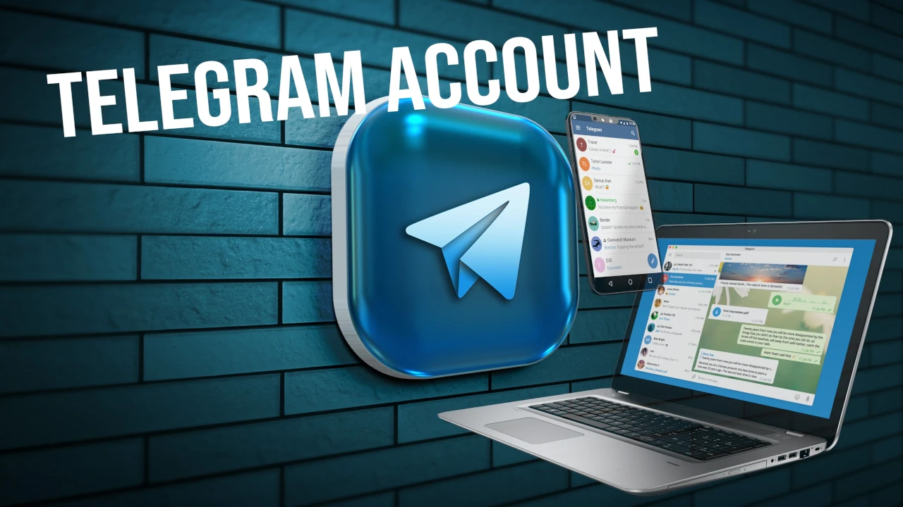

## Mengapa Telegram

Telegram lebih dari sekadar aplikasi perpesanan dan lebih dari sekadar media sosial. Dibandingkan dengan banyak pesaingnya, Telegram memiliki banyak fitur yang membuatnya menjadi alat yang layak untuk diketahui cara menggunakannya.

Selain bertukar pesan, dengan Telegram Anda bisa melakukan panggilan video dan suara, mengedit atau menghapus pesan bahkan setelah pesan tersebut terkirim, Exchange file berukuran besar tanpa batas ruang, dan masih banyak lagi. Kami berharap tutorial ini dapat membantu memudahkan Anda untuk belajar dan, yang terpenting, bergabunglah dengan berbagai komunitas Bitcoiner yang ada di Telegram.

## Telegram seluler

Meskipun Telegram tersedia di toko-toko resmi, sarannya selalu sama: unduh dari situs pengembang, kebiasaan yang baik bagi mereka yang, seperti Anda, sedang dalam perjalanan yang mengutamakan privasi.

Dengan peramban ponsel Anda, buka situs [telegram.org](https://telegram.org). Anda dapat memilih bahasa yang Anda sukai, tetapi saya sarankan untuk melanjutkan dalam bahasa Inggris, jadi pilihlah _Telegram untuk Android_

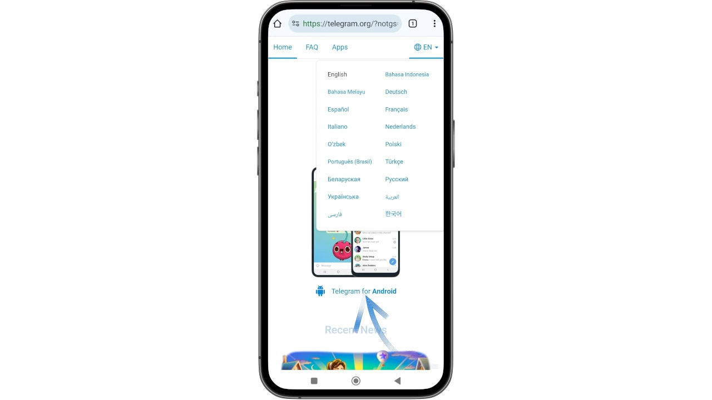

Pada halaman berikutnya, Anda akan menemukan beberapa tips berguna untuk mengunduh file `.apk`; jika Anda tidak memerlukannya, klik langsung pada _Unduh Telegram_.

Sistem operasi Android Anda mungkin mencoba mencegah pengunduhan langsung, dengan memberi tahu Anda bahwa file tersebut mungkin berbahaya. Anda memilih _Download saja_.

Setelah mengunduh dan menginstal Telegram, Anda dapat memilih _Open_ pada layar terakhir.

Untuk membuat tutorial ini, saya menggunakan ponsel yang sudah terinstal Telegram. Pada instalasi pertama, Anda akan menemukan _Install_, alih-alih _Update_, pilihlah untuk menginstal.

Biarkan Telegram menginstal

lalu buka dari ponsel Anda dan pilih _Mulai Pesan_.

Seperti aplikasi pesan VoIP lainnya, operasi Telegram juga didasarkan pada saluran telepon yang berfungsi. Untuk memulai, Anda harus memasukkan nomor telepon Anda: Telegram akan mengirimkan SMS verifikasi dengan kode OTP.

Pada layar berikutnya, Anda dapat memeriksa ulang nomor yang Anda berikan. Jika sudah benar, klik _Yes_.

Telegram sekarang sudah berfungsi penuh di ponsel, kita bisa beralih ke pengaturan dasar yang pertama.

# Pengaturan keamanan dan privasi

## Konfigurasi nama pengguna

Nama pengguna Telegram - terkadang juga disebut `handle` - lebih dari sekadar nama yang indah. Pegangannya memang **unik untuk setiap pengguna**.

Di Telegram, sangat mudah untuk menemukan penipu yang menulis secara pribadi, berpura-pura menjadi seseorang yang bukan dirinya. Setiap pengguna dapat jatuh ke dalam perangkap dan mengungkapkan informasi pribadi karena percaya bahwa mereka mengobrol dengan kontak yang mereka percayai. **Kita akan melihat bahwa pegangan adalah pertahanan terbaik untuk mengurangi bahaya semacam ini**.

Dari menu utama, pilih _Profil Saya_.

Pada layar berikutnya, pilih ikon "pensil" di kanan atas untuk masuk ke menu pengeditan profil.

Anda akan melihat semua detail sensitif akun Anda, termasuk nomor telepon dan dua kolom kosong: bio dan Nama Pengguna.

**Dengan mengeklik masing-masing, Anda dapat mengisinya dengan pilihan Anda**.

Ketika mengatur _Username_, Telegram akan memberi tahu Anda apakah pegangan tersebut tersedia atau tidak.

(Tangkapan layar ini juga diambil dari ponsel dengan nama pengguna yang sudah ditetapkan).

Klik _Atur Nama Pengguna_ (di sini _Ubah Nama Pengguna_ untuk alasan yang baru saja disebutkan)

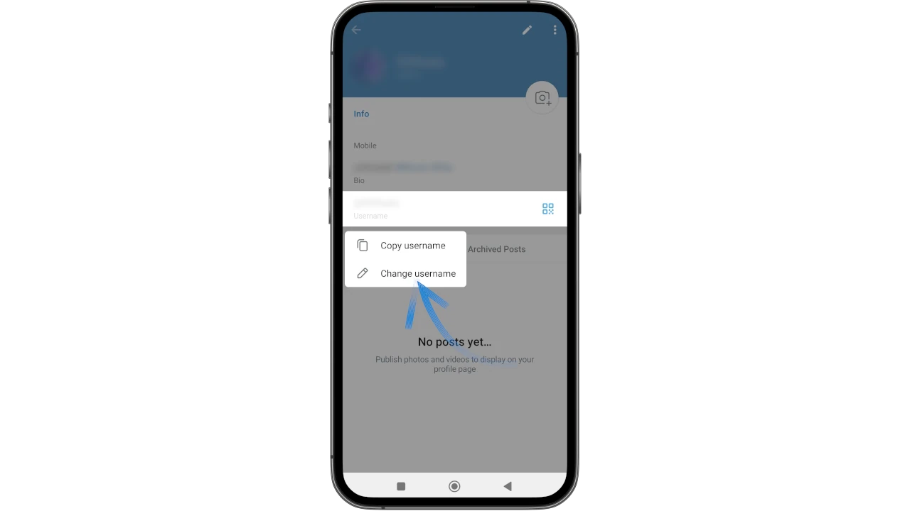

dan konfigurasikan pegangan Anda, lalu simpan dengan mengklik tanda centang ✅ di kanan atas.

Di sebagian besar grup dan saluran Telegram, nama pengguna ini diperlukan sebagai prasyarat untuk akses. Bagi administrator grup-grup tersebut, ini adalah salah satu cara untuk mencegah bot dan spam.

⚠️ Anda harus selalu memeriksa pegangan siapa pun yang menghubungi Anda secara pribadi dan jangan pernah memberikan informasi rahasia seperti kata sandi atau frasa Mnemonic kepada siapa pun, meskipun mereka mengaku sebagai dukungan resmi atau menawarkan bantuan (mungkin diminta oleh Anda). Blokir pengguna yang menghubungi anda tanpa izin anda, karena mereka pasti melakukannya dengan maksud curang.

Bagaimana seorang penipu menggunakan identitas orang lain?

Mereka tidak bisa, berkat keunikan nama pengguna.

**Yang bisa mereka lakukan adalah menampilkan pegangan yang "mirip", dengan sedikit perubahan (huruf/angka), sehingga hanya orang yang jeli yang bisa melihat dengan jelas bahwa itu adalah penipu**. Selalu perhatikan nama pengguna, dan Anda akan melihat bahwa penipu tidak akan mudah menipu.

## Privasi

Tindakan pencegahan penting lainnya yang dapat Anda lakukan adalah membatasi informasi yang Anda berikan dari akun yang baru Anda buat.

Kembali ke menu utama, lalu masuk ke _Settings_:

Sekarang pilih _Privasi dan Keamanan_

Di sini Anda akan menemukan serangkaian parameter penting untuk disesuaikan dengan bagaimana Anda ingin menggunakan akun Telegram Anda.

Pastikan untuk mengaturnya:

- nomor Telepon_ ke "Tidak Ada"
- panggilan ke "Kontak Saya"
- mengundang_ untuk "Tidak Ada"

Ini adalah langkah-langkah yang akan mencegah pengungkapan nomor telepon Anda, sehingga Anda tidak akan menerima panggilan yang tidak diinginkan atau secara tidak sengaja ditambahkan ke grup yang asal-usulnya meragukan. Kemudian, Anda dapat menyesuaikan semua parameter lainnya sesuai keinginan.

Sekarang setelah akun Telegram Anda diatur dan Anda telah mendapatkan sedikit privasi, Anda dapat mulai menggunakannya.

## Menambahkan kontak dan obrolan

Jika akun Anda baru saja dibuat, kemungkinan besar halaman utama akan terlihat kosong sama sekali.

Di sini Anda sudah dapat melihat 2 fungsi utama yang akan Anda gunakan untuk berkirim pesan:

- perintah pencarian, di kanan atas;
- ikon dengan pensil, di kanan bawah, yang memungkinkan Anda membuka dasbor untuk mengelola pesan baru.

Dengan mengklik yang terakhir, pertama, Telegram akan meminta izin untuk mengakses kontak di buku Address Anda, yang dapat Anda berikan atau tolak sesuai dengan kebutuhan Anda. Dengan menyetujui, Anda akan dapat menjangkau teman-teman pertama yang telah mengunduh aplikasi ini.

Setelah itu, kontak akan muncul pada layar utama.

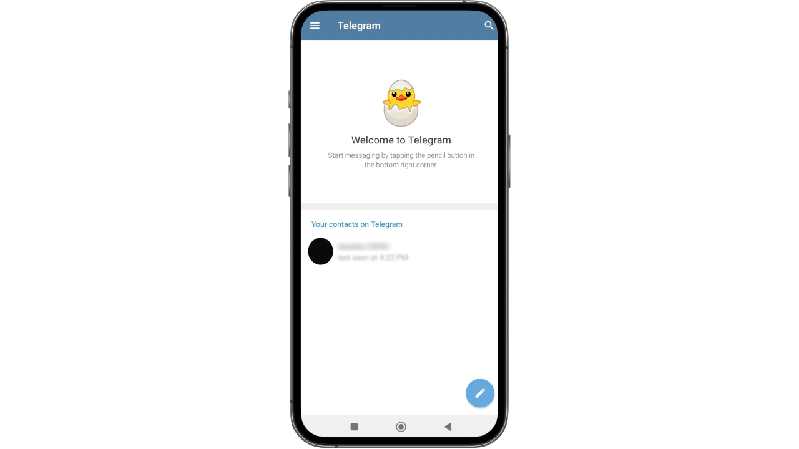

Mengklik ikon dengan pensil, di kanan bawah, akan mengaktifkan layar untuk menambahkan lebih banyak kontak, tetapi tidak hanya itu.

Telegram menawarkan kemungkinan untuk mencari **Groups** dengan tema tertentu, yang sangat mirip dengan forum di mana pengguna yang berbeda berkumpul untuk membicarakan topik tertentu, atau **Channels**, yang biasanya digunakan sebagai sarana informasi di mana hanya administrator yang dapat memposting dan pengikut yang dapat mengkonsumsi konten.

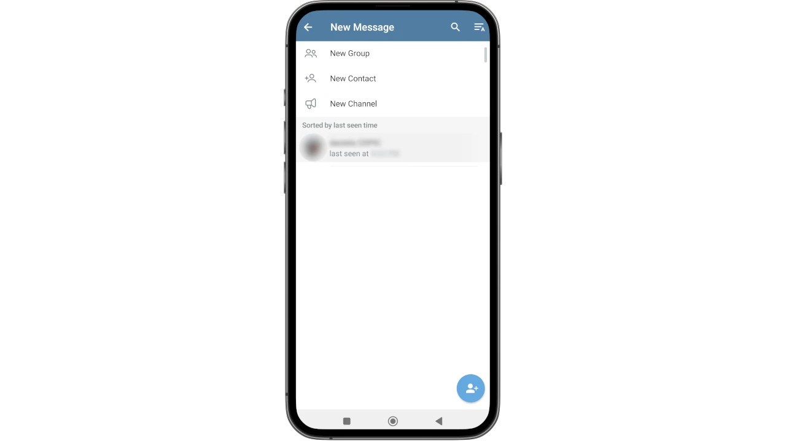

Dengan memilih gambar profil kontak dalam daftar, Anda dapat mengakses menu yang sangat luas untuk melakukan berbagai tindakan yang menarik:

- lihat semua detail kontak;
- memulai panggilan video (**a**);
- memulai panggilan suara (**b**);
- memulai obrolan (**c**);
- menyesuaikan pemberitahuan (**d**).

Anda dapat mengakses menu yang sangat canggih dengan mengeklik 3 titik di kanan atas, untuk:

- mengatur timer untuk penghapusan pesan secara otomatis;
- membagikan, memblokir, atau mengedit kontak;
- mengirim hadiah (biasanya _Telegram Premium_);
- memulai obrolan rahasia, yang merupakan salah satu fitur terbaik Telegram: **Obrolan rahasia adalah ruang yang tidak memungkinkan untuk mengambil tangkapan layar, ini adalah obrolan yang sangat pribadi dan hanya aktif di ponsel**;
- menambahkan kontak ke layar beranda.

Secara default, semua orang, dari pengguna perorangan hingga saluran tematik, diidentifikasi melalui pegangan mereka. Ketika mencari seseorang atau sesuatu, cukup dengan meletakkan simbol at `@` diikuti dengan nama.

⚠️Attention: **hindari bergabung dengan grup dan saluran tanpa memverifikasi keasliannya**. Untuk menemukan saluran/group Telegram resmi dari sebuah perusahaan atau topik yang ingin Anda ikuti, mintalah bantuan dari bagian _Kontak_ pada situs web resmi atau dari sumber yang sangat terpercaya.

### Fitur Perpesanan Tingkat Lanjut

Telegram memungkinkan Anda untuk menggunakan fitur-fitur canggih yang unik dalam bertukar pesan. Masuk ke dalam obrolan dan klik di latar belakang, di samping pesan apa pun dari pengirim lain.

Serangkaian opsi muncul yang dapat Anda gunakan:

- pin pesan (_pin_ **A**) untuk pencarian cepat pesan penting;
- memulai panggilan (**B**);
- menyisipkan reaksi (**C**);
- meneruskan, menyalin, menghapus pesan (**D**);
- memilih lebih dari satu pesan untuk beberapa tindakan.

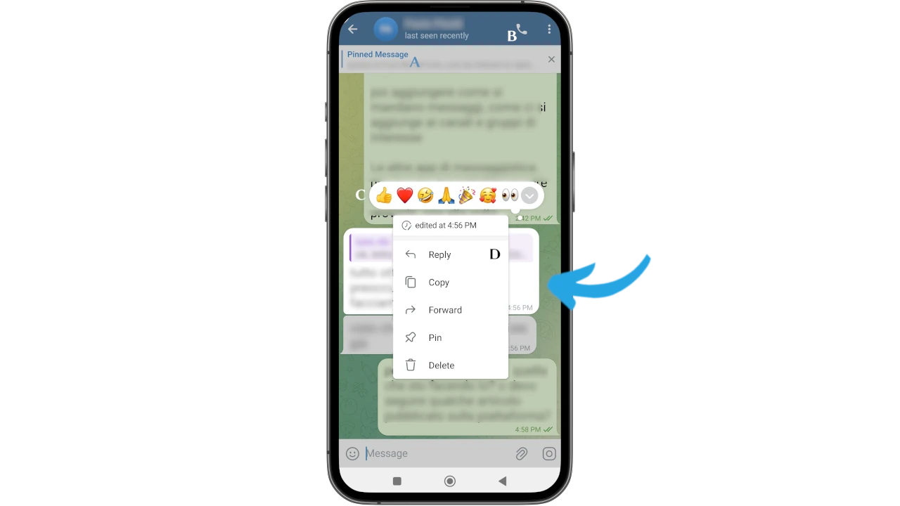

Jika Anda melakukan operasi yang sama pada salah satu pesan Anda, **Anda akan menemukan bahwa Anda dapat mengedit pesan Anda sendiri, bahkan pesan yang sudah terkirim**.

Anda juga dapat melampirkan file besar, bertukar media "berat" dengan mudah, jauh lebih mudah daripada semua aplikasi lain dari jenis ini.

### Awan Pribadi

Di antara banyak fitur luar biasa dari Telegram, ada juga awan pribadi yang - pada saat artikel ini ditulis - **tidak terbatas**.

Kita berbicara tentang "Pesan Tersimpan" yang terkenal, atau _Pesan Tersimpan_ dari Telegram. Ini adalah obrolan di mana Anda dapat mengirim hampir **(1)** semua jenis informasi, misalnya mentransfer file dari PC ke ponsel dan sebaliknya.

Untuk mengakses _Pesan Tersimpan_ akun Anda, buka menu utama dan pilih item yang relevan di antara pilihan yang muncul di layar.

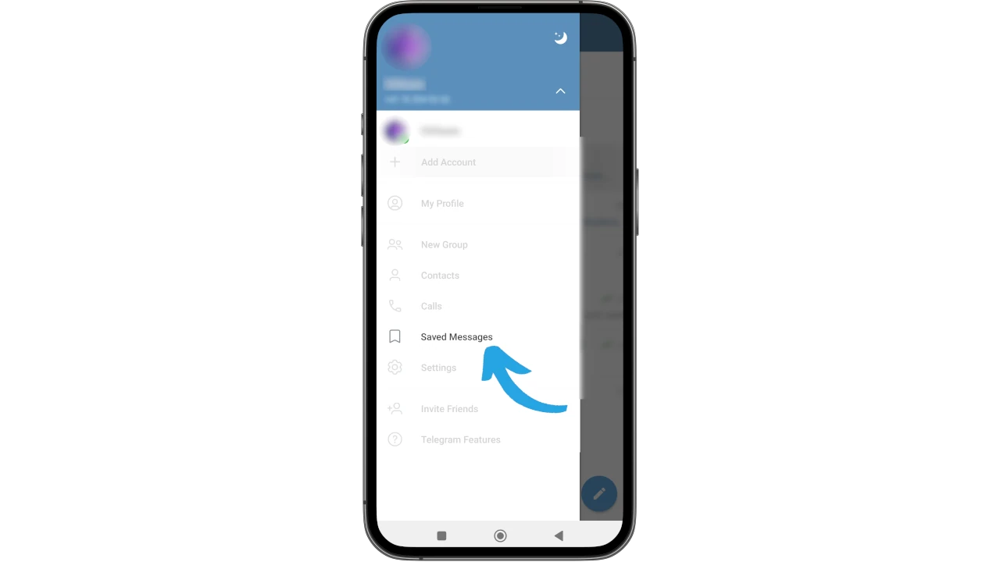

Obrolan muncul di latar depan, siap digunakan.

***

**(1)** _Jangan gunakan cloud Telegram untuk informasi rahasia seperti kata sandi, pin, mnemonik, dan data semacam ini_.

***

## Penjadwalan Pesan dan Pengiriman Senyap

Fitur canggih lainnya yang berguna memungkinkan pengiriman pesan dengan menghormati privasi penerima, memilih antara pengiriman tanpa suara, dan menjadwalkan pesan pada waktu dan hari yang sesuai.

Yang perlu Anda lakukan hanyalah menulis pesan, tetapi, alih-alih langsung mengirimnya, tekan dan tahan ikon kirim selama beberapa detik. Apa yang biasanya menjadi pesan terkirim, akan berganti menjadi layar baru yang dapat Anda pilih:

- menjadwalkan pesan (tanggal dan waktu)
- kirim hanya ketika kontak sedang online
- mengirim secara diam-diam, agar tidak mengaktifkan notifikasi penerima.

### Menghapus cache ponsel Anda

Praktik lain yang berguna untuk menjaga ponsel Anda tetap berjalan secara efisien adalah menghapus cache Telegram dari waktu ke waktu. Tergantung pada berapa banyak grup dan saluran yang Anda ikuti, pada kenyataannya, informasi dan media yang berasal dari sumber-sumber ini dapat menumpuk di cache, membuat ponsel Anda lambat.

Masuk ke menu utama lagi dengan mengeklik tiga bilah di kanan atas dan pilih _Profil Saya_ lagi. Namun, kali ini, pilih 3 titik di kanan atas.

Sebuah menu dropdown akan terbuka dan Anda harus memilih _Log Out_.

⚠️ **Anda tidak akan keluar, jangan khawatir: kami memilih menu ini hanya untuk mengakses fungsionalitas yang sedang kita bicarakan**.

Di antara opsi, pilih _Clear Cache_.

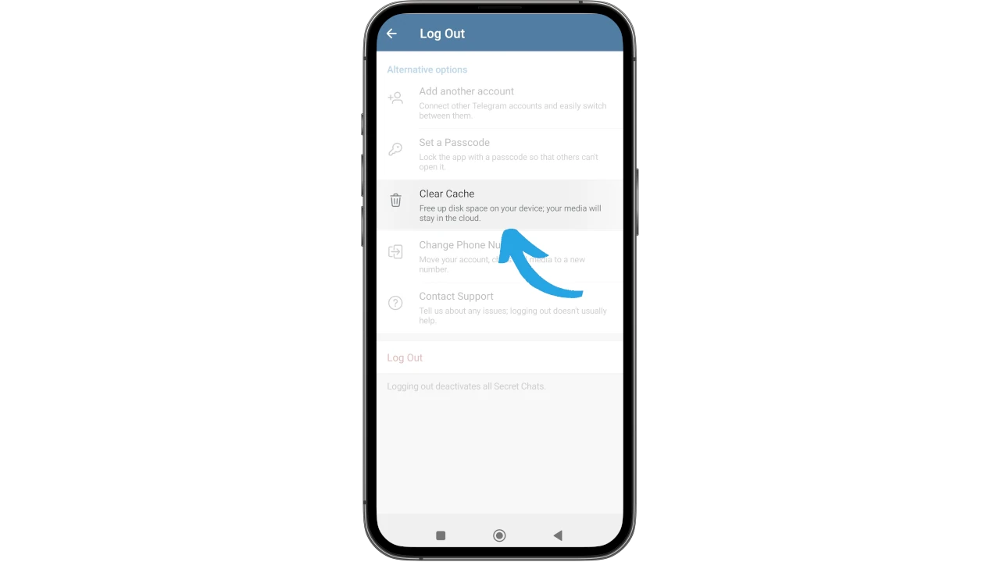

Perangkat mulai menghitung ruang penyimpanan yang digunakan. Setelah penghitungan selesai, tombol _Hapus Cache_ akan muncul.

Mengkliknya akan menampilkan layar konfirmasi, di mana Anda harus memilih _Clear Cache_ sekali lagi untuk melanjutkan.

Setelah proses selesai, Telegram menampilkan layar di mana - di bawah hasil pembersihan - juga muncul pengaturan yang menarik, yaitu kemungkinan untuk memilih berapa banyak ruang cache yang harus didedikasikan untuk media.

Saya sarankan untuk tidak menyimpan ruang tak terbatas untuk foto dan video, tetapi membiarkan aplikasi menghapus file yang berat setelah batas ini tercapai.

Anda bisa melihat dalam foto berikut ini, di mana Anda bisa menemukan pengaturan ini.

## Desktop Telegram

Telegram dapat digunakan dari komputer Anda, sehingga disinkronkan dengan akun yang ditampilkan di ponsel Anda. Anda dapat memilih untuk tidak mengunduh aplikasi dan menggunakannya hanya melalui web. Namun, versi ini memiliki keterbatasan dibandingkan dengan versi yang dijalankan di komputer, oleh karena itu saya sarankan untuk mengunduh dan menginstalnya untuk memaksimalkan alat yang hebat ini.

Semua opsi yang terlihat sejauh ini dengan model seluler, dapat dieksploitasi dengan cara yang sama persis dari komputer Anda. Juga untuk instalasi ini, kunjungi situs web resmi [telegram.org] (https://telegram.org). Dari beranda pilihlah _Telegram untuk PC/Linux_.

Pada layar yang terbuka, klik untuk mengunduh file yang dapat dieksekusi yang sesuai untuk sistem operasi Anda.

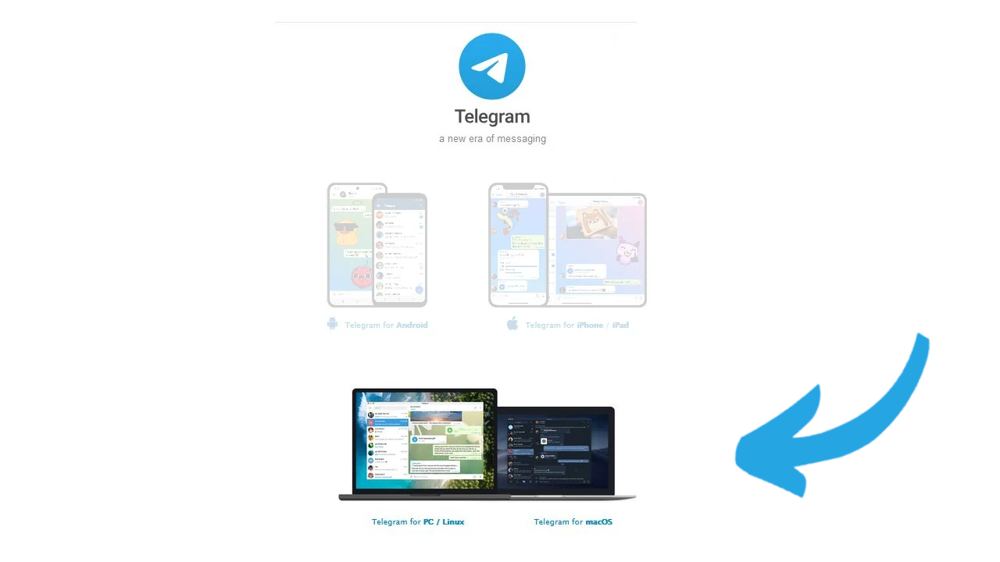

Instal Telegram dan luncurkan, sehingga Anda akan segera menemukan layar pertama di mana Anda akan mengklik _Mulai Pesan_.

Kode QR akan ditampilkan di layar, untuk dipindai dengan perangkat seluler Anda, yang sudah aktif menggunakan Telegram: dengan cara ini Anda dapat menggunakan akun tersebut melalui desktop.

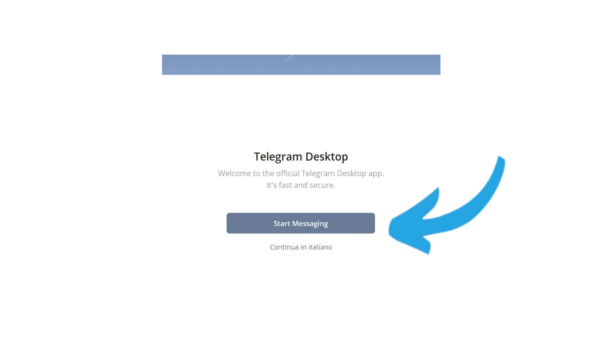

Buka aplikasi di ponsel Anda, buka menu utama (tiga baris di kiri atas).

Pilih _Pengaturan_

dan kemudian segera setelah _Perangkat_.

Sekarang pilih _Link Desktop Device_

Kamera ponsel Anda aktif. Pada penggunaan pertama, kemungkinan Android Anda akan meminta izin: berikan izin.

Sekarang pindai QR Code yang muncul sebelumnya pada layar komputer.

Pemberitahuan pada ponsel Anda mengonfirmasi bahwa perangkat baru telah berhasil ditambahkan.

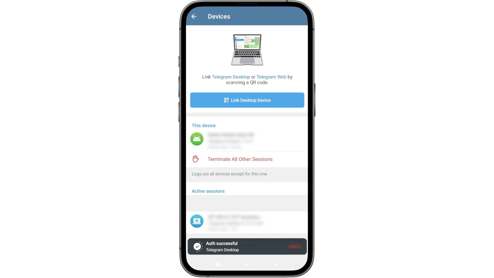

Khususnya, Telegram juga aktif dan dapat digunakan di komputer desktop Anda.

### Panggilan Grup

Jika Anda adalah administrator atau pemilik grup Telegram, Anda dapat memulai panggilan dari menu grup itu sendiri. Dengan cara ini, Anda dapat melakukan streaming langsung dengan beberapa peserta, merekamnya dalam audio dan video, membagikannya, atau menggunakannya untuk tujuan seperti pendidikan.

Pada gambar berikut, Anda dapat melihat cara memulai panggilan grup menggunakan desktop Telegram: buka obrolan yang sama dan di bagian kanan atas layar terdapat ikon layar. Dengan mengklik ikon tersebut, Anda dapat memutuskan apakah akan segera memulai panggilan atau menjadwalkannya untuk waktu yang telah ditentukan.

### Pertimbangan Akhir

Setelah Anda membaca tutorial ini, Anda sudah bisa memilih cara menggunakan Telegram, tanpa terpengaruh oleh kebisingan yang ditimbulkan oleh hype para penggunanya, atau oleh arus utama. Anda dapat memulai dengan pendekatan yang ringan dan kemudian menemukan cara untuk memanfaatkan aplikasi perpesanan ini semaksimal mungkin, untuk kebutuhan pribadi Anda.