Didirikan pada tahun 2012 di Swiss, Threema adalah aplikasi pesan instan yang dirancang untuk menjamin privasi dan keamanan. Tidak seperti WhatsApp, Telegram, atau Signal, Threema tidak memerlukan nomor telepon atau email Address untuk membuat akun. Setiap pengguna memiliki pengenal unik, memungkinkan pendaftaran yang sepenuhnya anonim.

Dari sisi teknis, komunikasi melalui Threema dienkripsi secara end-to-end. Kode aplikasi seluler telah menjadi sumber terbuka sejak tahun 2020, tetapi infrastruktur server tetap menjadi hak milik dan terpusat. Server di-host secara eksklusif di Swiss (negara yang terkenal dengan kerangka kerja hukum untuk perlindungan data).

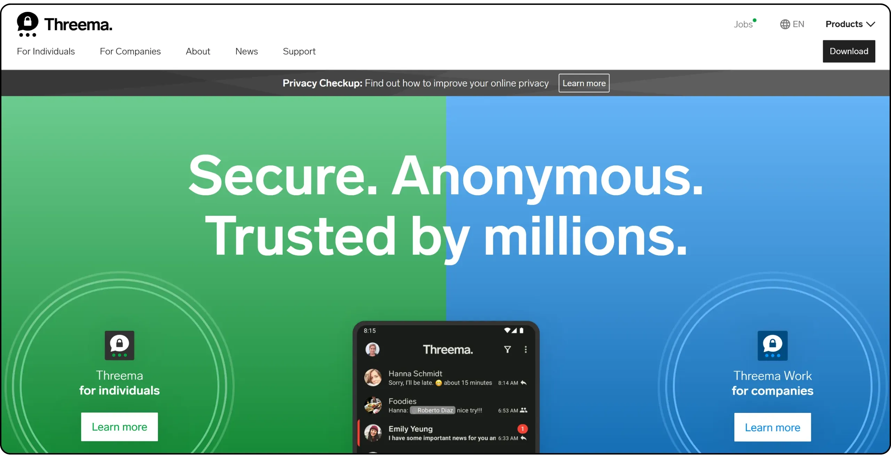

Threema memiliki klien dasar untuk Android dan iOS. Ada juga aplikasi web, serta perangkat lunak yang tersedia untuk Windows, Linux dan macOS. Namun, untuk menggunakannya, Anda harus mendaftar terlebih dahulu pada perangkat seluler.

Aplikasi Threema tidak gratis. Aplikasi ini bekerja dengan model pembelian satu kali: €5.99 untuk menggunakan aplikasi ini seumur hidup (atau €4.99 jika Anda membelinya secara langsung). Untuk benar-benar menggunakan Threema secara anonim, pembayaran juga harus anonim. Itu sebabnya Anda bisa membeli kunci aktivasi dalam bitcoin atau uang tunai di "*Threema Shop*" untuk mengaktifkan versi Android. Di iOS, di sisi lain, pembelian harus melalui App Store, karena pembatasan Apple pada monetisasi aplikasi.

Ada juga versi bisnis khusus yang disebut "*Threema Work*". Dalam tutorial ini, kita akan berkonsentrasi pada versi home.

| Application          | E2EE 1:1       | E2EE groupes   | Inscription anonyme | Licence client open-source | Licence serveur open-source | Serveur décentralisé | Année de création |
| -------------------- | -------------- | -------------- | ------------------- | -------------------------- | --------------------------- | -------------------- | ----------------- |
| WhatsApp             | ✅              | ✅              | ❌                   | ❌                          | ❌                           | ❌                    | 2009              |
| WeChat               | ❌              | ❌              | ❌                   | ❌                          | ❌                           | ❌                    | 2011              |
| Facebook Messenger   | ✅              | 🟡 (optionnel) | ❌                   | ❌                          | ❌                           | ❌                    | 2011              |
| Telegram             | 🟡 (optionnel) | ❌              | 🟡                  | ✅                          | ❌                           | ❌                    | 2013              |
| LINE                 | ✅              | ✅              | ❌                   | ❌                          | ❌                           | ❌                    | 2011              |
| Signal               | ✅              | ✅              | ❌                   | ✅                          | ✅                           | ❌                    | 2014              |
| **Threema**          | ✅              | ✅              | ✅                   | ✅                          | ❌                           | ❌                    | 2012              |
| Element (Matrix)     | ✅              | ✅              | ✅                   | ✅                          | ✅                           | 🟡 (fédéré)          | 2016              |
| Delta Chat           | ✅              | ✅              | ✅                   | ✅                          | N/A                         | 🟡 (via email)       | 2017              |
| Conversations (XMPP) | ✅              | ✅              | ✅                   | ✅                          | ✅                           | 🟡 (fédéré)          | 2014              |
| Session              | ✅              | ✅              | ✅                   | ✅                          | ✅                           | ✅                    | 2020              |
| SimpleX              | ✅              | ✅              | ✅                   | ✅                          | ✅                           | ✅                    | 2021              |
| Olvid                | **✅**          | **✅**          | **✅**               | **✅**                      | **❌**                       | **❌**                | 2019              |
| Keet                 | ✅              | ✅              | ✅                   | ❌                          | N/A                         | ✅                    | 2022              |
| Jami                 | ✅              | ✅              | ✅                   | ✅                          | N/A                         | ✅                    | 2005              |
| Briar                | ✅              | ✅              | ✅                   | ✅                          | N/A                         | ✅                    | 2018              |
| Tox                  | ✅              | ✅              | ✅                   | ✅                          | N/A                         | ✅                    | 2013              |

*E2EE = Enkripsi ujung ke ujung*

## Instal aplikasi Threema

Threema tersedia di semua platform. Anda dapat mengunduh aplikasi ini langsung dari toko aplikasi ponsel Anda:

- [Google Play](https://play.google.com/store/apps/details?id=ch.threema.app);
- [F-Cold](https://f-droid.org/en/packages/ch.threema.app.libre/);
- [Huawei AppGallery](https://appgallery.huawei.com/#/app/C103713829);
- [App Store](https://apps.apple.com/us/app/threema-the-secure-messenger/id578665578).

Di Android, juga memungkinkan untuk [menginstal melalui APK](https://shop.threema.ch/en/download).

Ada juga [versi komputer] (https://threema.ch/download) (MacOS, Linux, dan Windows). Tutorial ini akan menunjukkan kepada Anda cara menyinkronkan keduanya.

## Beli lisensi Threema

Setelah Anda menginstal aplikasi, jika Anda langsung melalui toko aplikasi, Anda telah membayar lisensi dan seharusnya memiliki akses langsung ke aplikasi tersebut. Jika Anda menggunakan F-Droid atau APK, Anda sekarang perlu membeli lisensi di situs web resminya.

[Buka "*Threema Shop*" (https://shop.threema.ch/) dan klik tombol "*Beli Threema untuk Android*".

Pilih jumlah lisensi yang ingin Anda beli (cukup satu saja jika hanya untuk Anda), pilih mata uang, dan pilih metode pengiriman lisensi. Anda bisa memilih untuk menerima lisensi melalui email, atau langsung di situs jika Anda ingin tetap anonim. Kemudian klik "*Lanjutkan ke pembayaran*".

Pilih metode pembayaran Anda. Dalam kasus saya, saya akan membayar dengan bitcoin, yang juga saya sarankan untuk Anda lakukan, karena ini memungkinkan Anda untuk tetap anonim (asalkan Anda menggunakan Bitcoin dengan benar) dan jauh lebih nyaman daripada pembayaran tunai jarak jauh. Kemudian klik "*Next*".

Jika Anda tidak memerlukan Invoice, klik "*Next*" sekali lagi tanpa memasukkan informasi pribadi apa pun.

Kemudian konfirmasikan pembelian Anda dengan mengklik "*Konfirmasi pembayaran*".

Anda kemudian harus mengirim jumlah yang ditunjukkan ke Bitcoin Address yang disediakan (sayangnya, Lightning belum didukung). Setelah transaksi dikonfirmasi di Blockchain, klik "*Tutup*" di sebelah Invoice.

Anda kemudian akan memiliki akses ke kunci lisensi Anda. Harap diperhatikan: jika Anda belum memasukkan email Address, kunci ini hanya akan ditampilkan di sini. Ingatlah untuk menyimpan URL halaman tersebut agar Anda dapat mengaksesnya nanti jika diperlukan.

## Buat akun di Threema

Setelah Anda memiliki kunci lisensi, Anda akhirnya dapat meluncurkan aplikasi. Pada peluncuran pertama, jika Anda belum membeli Threema melalui toko aplikasi, Anda akan diminta untuk memasukkan kunci lisensi Anda, yang dibeli di situs.

Kemudian klik tombol "*Siapkan sekarang*".

Gerakkan jari Anda melintasi layar ke generate, sumber entropi, yang diperlukan untuk membuat "*Threema ID*".

"*Threema ID*" Anda akan ditampilkan. Ini akan memungkinkan Anda untuk menghubungi pengguna lain. Klik "*Next*".

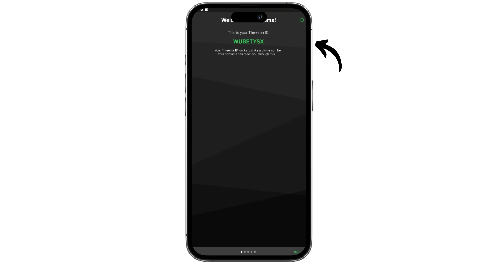

Pilih kata sandi. Kata sandi ini akan memungkinkan Anda untuk memulihkan akses ke akun Anda jika diperlukan. Buatlah kata sandi Anda sepanjang dan seacak mungkin, dan simpan salinannya dengan aman, misalnya di pengelola kata sandi.

Kemudian pilih nama pengguna, yang dapat berupa nama asli atau nama samaran.

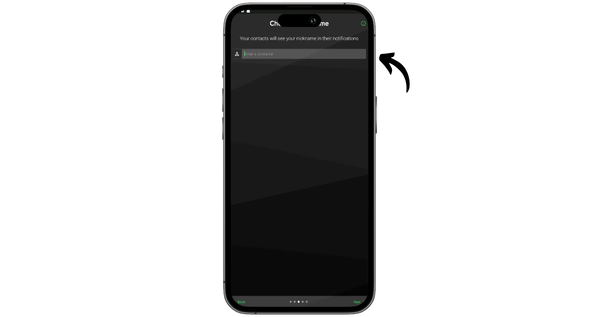

Anda kemudian dapat menautkan ID Threema Anda ke nomor telepon Anda. Ini memudahkan Anda untuk mencari melalui kontak Anda, tetapi jika Anda menggunakan Threema, ini juga untuk menjaga anonimitas Anda: jadi yang terbaik adalah tidak menautkannya. Klik pada "*Selanjutnya*".

Setelah Anda menyelesaikan langkah ini, klik "*Selesai*".

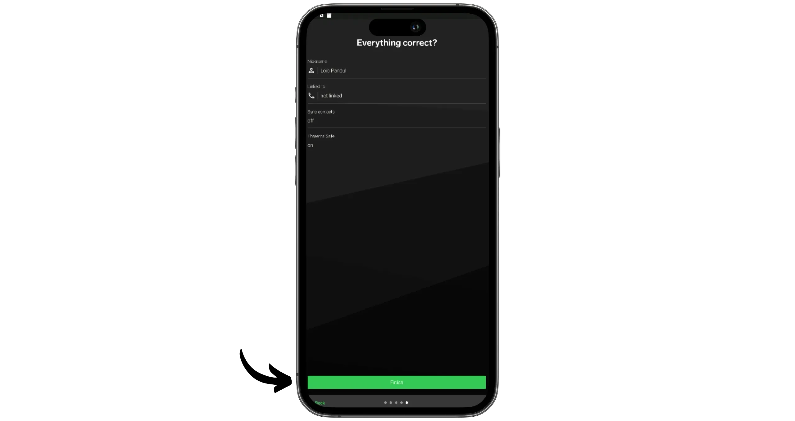

Anda sekarang sudah terhubung ke Threema dan dapat mulai berkomunikasi.

## Siapkan Threema

Pertama-tama, akses pengaturan dengan mengeklik tiga titik kecil di sudut kanan atas, kemudian pilih "*Settings*".

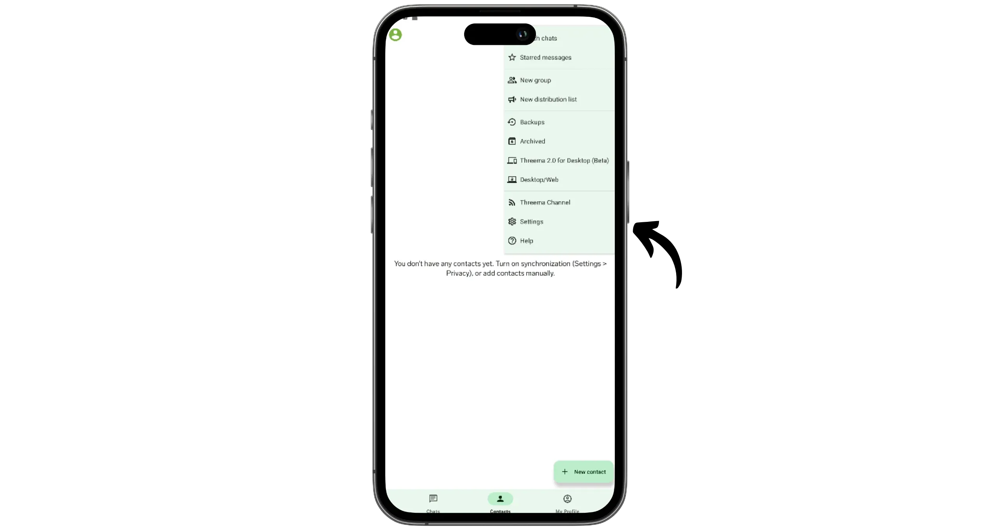

Pada tab "*Privacy*", Anda akan menemukan beberapa opsi untuk menyesuaikan dengan kebutuhan Anda:

- Menyinkronkan kontak pada ponsel Anda ;
- Menerima pesan dari orang yang tidak dikenal;
- Indikator penulisan selama entri data ;
- Pemberitahuan penerimaan pesan ...

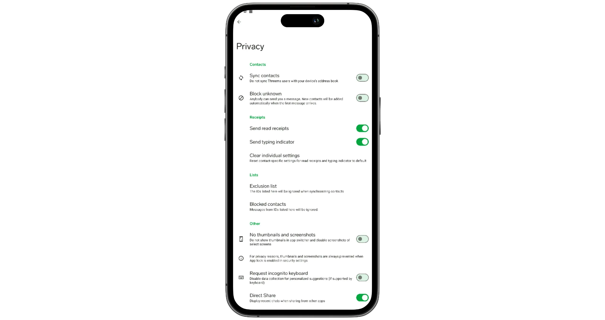

Pada tab "*Keamanan*", saya sarankan untuk mengaktifkan opsi "*Mekanisme penguncian*" untuk melindungi akses ke aplikasi. Juga disarankan untuk mengaktifkan passphrase untuk mengamankan cadangan lokal Anda.

Jangan ragu untuk menjelajahi bagian lain dari pengaturan untuk menyesuaikan aplikasi dengan preferensi Anda.

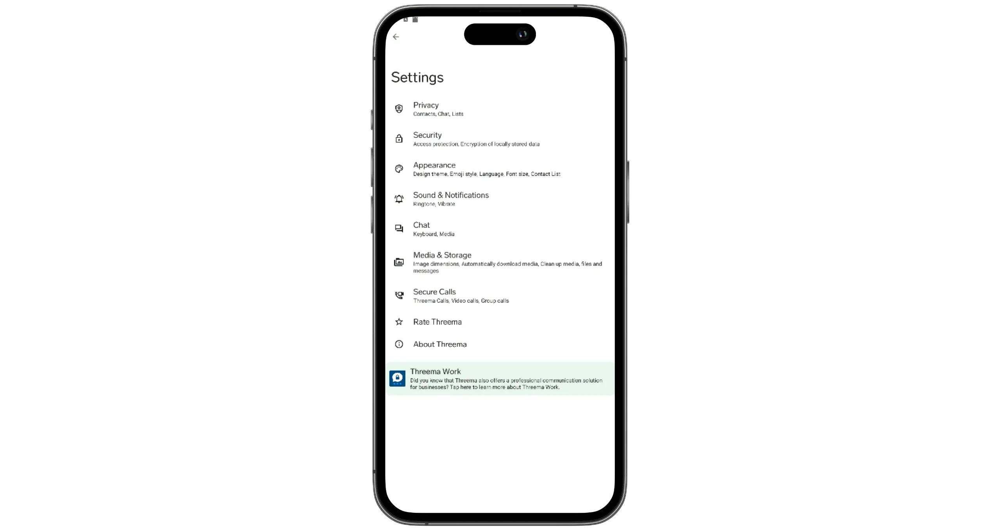

## Mencadangkan akun Threema Anda

Sebelum Anda mulai bertukar pesan, penting untuk merencanakan cara memulihkan akun Anda, terutama jika ponsel Anda diganti atau hilang. Untuk melakukannya, klik pada tiga titik di bagian kanan atas Interface, lalu akses menu "*Backups*".

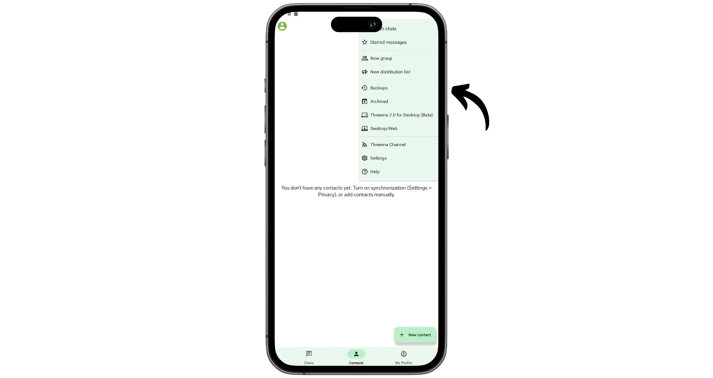

Di sini Anda akan menemukan dua opsi untuk mencadangkan data Anda:

- "*Threema Aman*";
- "*Cadangan Data*".

"Threema Safe* menyimpan semua informasi akun Anda, kecuali percakapan Anda, di server Threema. Data ini dienkripsi dengan kata sandi yang Anda pilih ketika Anda membuat akun, memastikan bahwa Threema tidak memiliki akses ke data tersebut. Pencadangan dilakukan secara otomatis dan teratur.

Dengan "*Threema Safe*", untuk memulihkan akun Anda di perangkat baru, yang perlu Anda lakukan hanyalah memasukkan "*Threema ID*" dan kata sandi Anda. Jika salah satu dari kedua informasi ini hilang, maka tidak mungkin memulihkan akun Anda.

Opsi ini hanya memungkinkan Anda untuk mengambil ID, profil, kontak, grup, dan pengaturan tertentu, tetapi **bukan riwayat percakapan**.

Untuk mengaktifkan "*Threema Safe*", cukup centang opsi di menu "*Backups*".

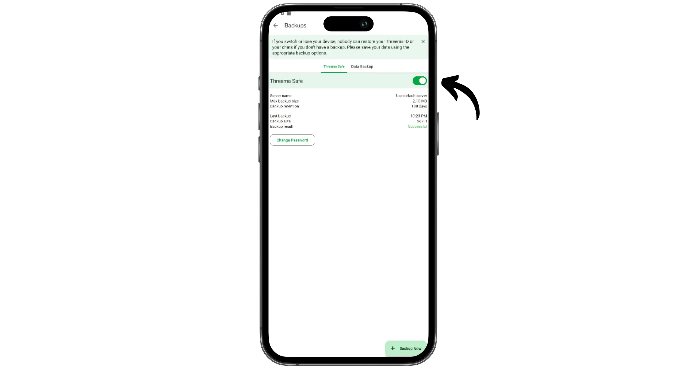

Jika Anda juga ingin mencadangkan dan memulihkan riwayat percakapan Anda, Anda harus menggunakan opsi "*Cadangan Data*". Opsi ini akan membuat cadangan penuh akun Anda, yang disimpan secara lokal di ponsel. Anda harus mentransfer cadangan ini ke perangkat baru dan menggunakan kata sandi Anda (dan mungkin passphrase) untuk memulihkan seluruh akun Anda.

Karena cadangan ini hanya bersifat lokal, maka cadangan ini perlu disalin secara teratur ke media eksternal. Jika tidak, jika perangkat Anda hilang, pemulihan tidak mungkin dilakukan. Oleh karena itu, metode ini paling cocok untuk transfer terencana dari satu perangkat ke perangkat lainnya, bukan untuk situasi darurat.

Harap diperhatikan: "*Cadangan Data*" hanya berfungsi jika Anda menggunakan sistem operasi yang sama. Anda tidak akan dapat menggunakannya, misalnya, untuk bermigrasi dari Samsung ke iPhone.

## Sesuaikan profil Threema Anda

Di sudut kiri atas Interface, klik foto profil Anda, kemudian pilih "*Profil Saya*".

Di sini Anda bisa menyesuaikan profil Anda: menambahkan foto, memilih siapa yang bisa melihatnya, atau melihat login Threema Anda.

## Menyinkronkan perangkat lunak PC

Jika Anda ingin mengakses percakapan Anda di PC, Anda dapat menyinkronkan akun Threema Anda dengan perangkat lunak khusus. Unduh perangkat lunak untuk sistem operasi Anda [dari situs web resmi] (https://threema.ch/en/download).

Pada ponsel Anda, klik pada tiga titik di kanan atas, lalu buka menu "*Threema 2.0 untuk Desktop*".

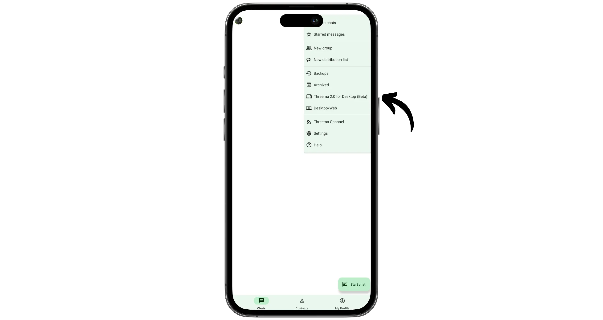

Klik "*Tambahkan perangkat*", lalu gunakan ponsel Anda untuk memindai kode QR yang ditampilkan oleh perangkat lunak di komputer Anda.

Untuk mengonfirmasi sinkronisasi, klik grup emoji yang ditampilkan dalam perangkat lunak.

Pada komputer Anda, masuk menggunakan kata sandi Anda.

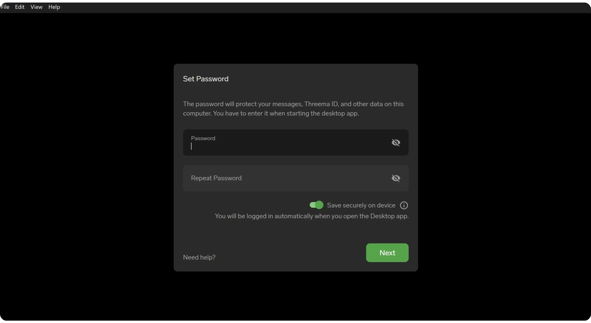

Selain aplikasi seluler, Anda sekarang dapat mengakses akun Threema langsung dari komputer Anda.

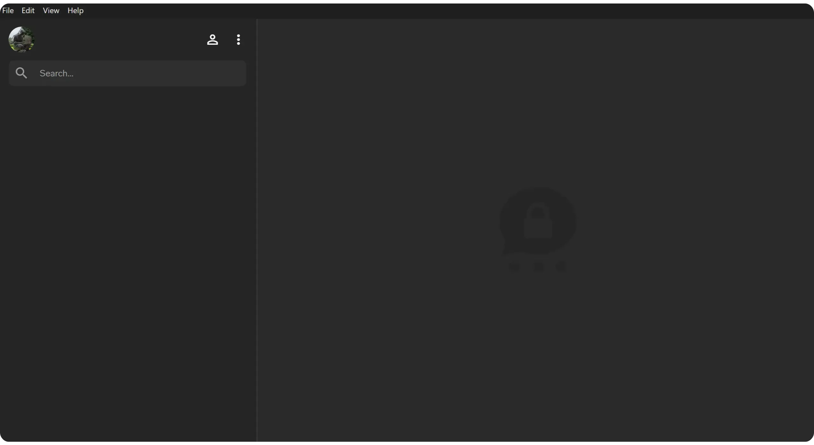

## Mengirim pesan dengan Threema

Setelah semuanya diatur dengan benar, Anda dapat mulai berkomunikasi. Klik tombol "*Mulai obrolan*".

Pilih "*Kontak baru*".

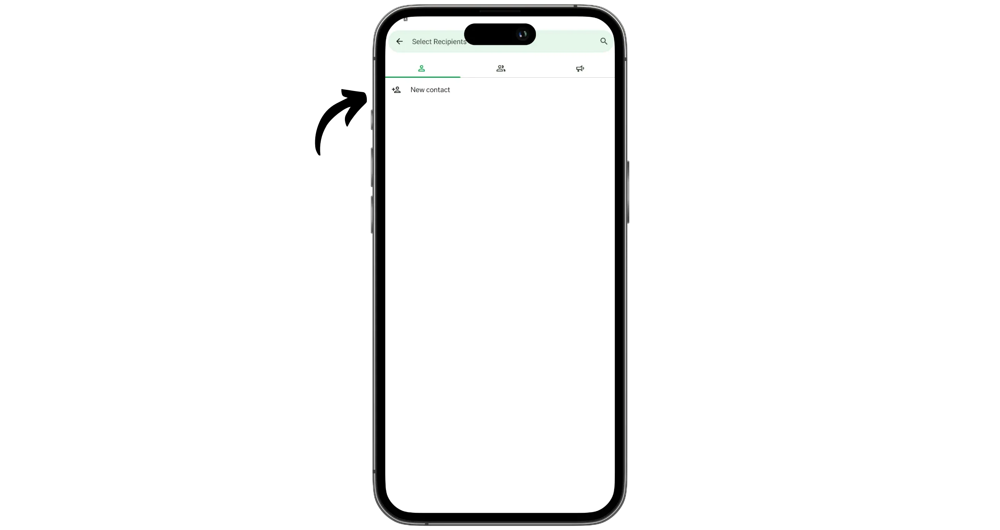

Masukkan atau pindai "*ID Treema*" koresponden Anda.

Klik ikon pesan.

Kirim pesan pertama ke koresponden Anda.

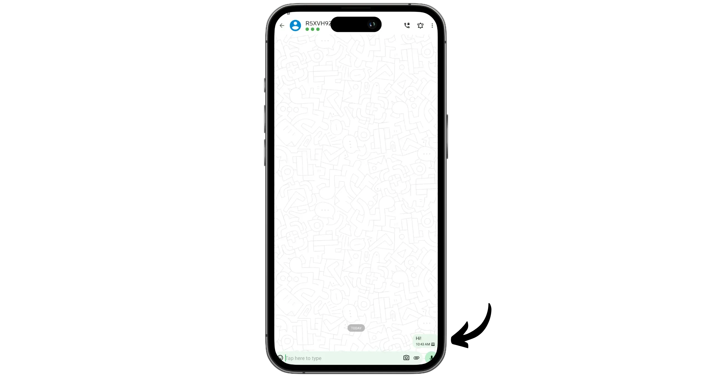

Ketika koresponden Anda menjawab, koneksi akan terjalin, dan Anda akan dapat melihat nama dan foto profilnya. Anda kemudian dapat mengirim pesan Exchange, file multimedia, dan bahkan melakukan panggilan.

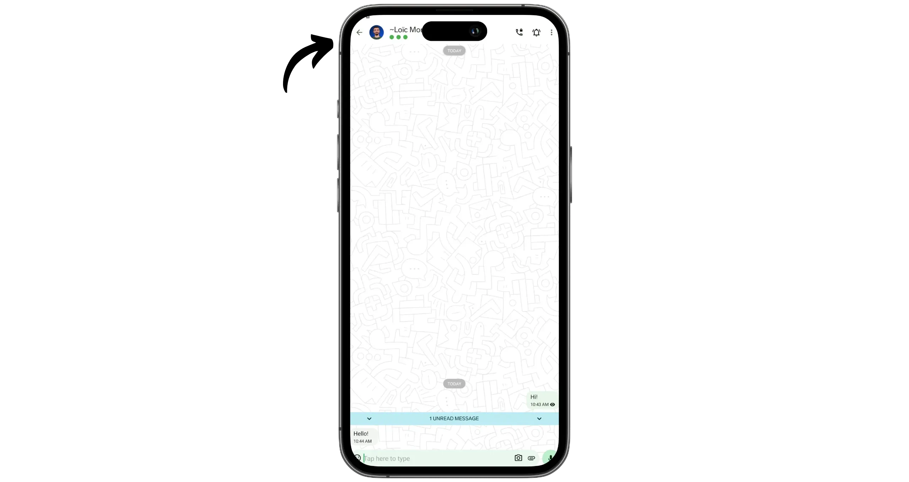

Selamat, Anda sekarang sudah mahir menggunakan perpesanan Threema, sebuah alternatif yang bagus untuk WathsApp! Jika Anda merasa tutorial ini bermanfaat, saya akan sangat berterima kasih jika Anda memberikan tanda jempol Green di bawah ini. Jangan ragu untuk membagikan tutorial ini di jejaring sosial Anda. Terima kasih banyak!

Saya juga merekomendasikan tutorial lain ini, di mana saya memperkenalkan Anda pada Proton Mail, sebuah alternatif yang jauh lebih ramah privasi daripada Gmail:

https://planb.network/tutorials/computer-security/communication/proton-mail-c3b010ce-254d-4546-b382-19ab9261c6a2