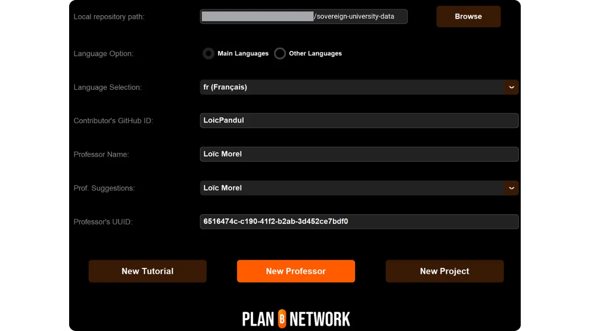
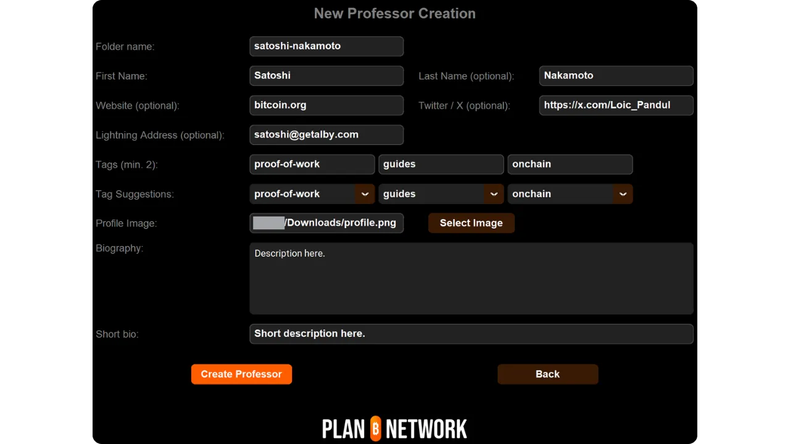

ඔබ Plan ₿ Network සඳහා නව උපකාරක පෝරුවක් හෝ පාඨමාලාවක් ලිවීමට සැලසුම් කරන්නේ නම්, ඔබට ගුරුවරයෙකුගේ පැතිකඩක් අවශ්‍ය වනු ඇත. මෙම පැතිකඩ ඔබට වේදිකාවට දායක වන අන්තර්ගතය සඳහා සුදුසු ණය ලබා ගැනීමට හැකියාව ලබා දේ.


Za tiste, ki ste že sodelovali pri ustvarjanju izobraževalnih vsebin na Plan ₿ Network, verjetno že imate učiteljski profil. Najdete ga v mapi `/professors` [v našem GitHub repozitoriju](https://github.com/PlanB-Network/Bitcoin-educational-content/tree/dev/professors). Če vaš profil že obstaja, poiščite svoj prijavni podatek v datoteki `professor.yml`.


ඔබේ පැතිකඩට වෙනස්කම් කිරීමට, මෙම උපකාරකය අවසානයේ ඇති "ඔබේ ගුරු පැතිකඩ සංස්කරණය කරන්න" කොටසට යන්න.


## අපගේ මෘදුකාංගය සමඟ නව ගුරුවරයෙකු එක් කරන්න


Plan ₿ Network මත ඔබේ ගුරු පැතිකඩ නිර්මාණය කිරීමේ පහසුම ක්‍රමය වන්නේ අපගේ ඒකාබද්ධ Python මෙවලම භාවිතා කිරීමයි. මෙය මෙහෙයුම් වන්නේ මෙසේය.


### 1 - ඔබේ දේශීය පරිසරය වින්‍යාස කරන්න


ඔබට [Plan ₿ Network repository on GitHub](https://github.com/PlanB-Network/Bitcoin-educational-content) හි ඇති ඔබේම Fork තිබිය යුතුය.


Fork හි ප්‍රධාන ශාඛාව (`dev`) මූලාශ්‍ර ගබඩාව සමඟ සංකලනය කරන්න.


ඔබේ දේශීය පිටපත යාවත්කාලීන කරන්න.


```bash
# Cloner votre fork (si ce n'est pas déjà fait)
git clone https://github.com/<username>/bitcoin-educational-content.git
cd bitcoin-educational-content
# Ajouter le dépôt source en tant que remote upstream
git remote add upstream https://github.com/PlanB-Network/bitcoin-educational-content.git
# Récupérer les dernières modifications depuis le dépôt source
git fetch upstream
# Se positionner sur la branche principale 'dev'
git checkout dev
# Fusionner les modifications de la branche 'dev' du dépôt source dans votre fork
git merge upstream/dev
# Pousser les mises à jour vers votre fork sur GitHub
git push origin dev
```


### 2 - නව ශාඛාවක් සාදන්න


පැවැති `dev` ශාඛාවෙහි සිටින බව සහතික වන්න. විස්තරාත්මක නමක් සහිත නව ශාඛාවක් සාදන්න (උදාහරණයක් ලෙස `add-professor-loic-morel`).


ඔබේ Fork ඔන්ලයින් මත මෙම ශාඛාව ප්‍රකාශයට පත් කරන්න.


```bash
# Assurez-vous d’être sur la branche 'dev'
git checkout dev
# Créez une nouvelle branche avec un nom descriptif
git checkout -b add-professor-loic-morel
# Publiez cette branche sur votre fork en ligne
git push -u origin add-professor-loic-morel
```


### 3 - Ustvarite svoj učiteljski profil


ඔබේ දේශීය පිටපතේ `scripts/tutorial-related/data-creator/` ෆෝල්ඩරයට යන්න. මෘදුකාංගය සඳහා අවශ්‍ය සියලුම phụ dependancies ස්ථාපනය කර ඇති බව සහතික වන්න, පළමුව Python ස්ථාපනය කර:


```bash
pip install -r requirements.txt
```


පසුව විධානය සමඟ මෘදුකාංගය ආරම්භ කරන්න :


```bash
python3 main.py
```


මුල් පිටුවට එක් වරක් පැමිණි විට, ඔබේ ගබඩා පිටපතට දේශීය මාර්ගය, ඔබ ලියන භාෂාව සහ ඔබේ GitHub හැඳුනුම්පත ඇතුළත් කරන්න. ඔබ වෙනත් කෙනෙකු සඳහා මෙම පැතිකඩ නිර්මාණය කරමින් සිටී නම් සහ දැනටමත් මහාචාර්යගේ පැතිකඩක් තිබේ නම්, "*PBN Professor's ID*" ක්ෂේත්‍රයේ ඔබේ හැඳුනුම්පත ඇතුළත් කරන්න. ඔබේම පැතිකඩක් නිර්මාණය කරන්නේ නම්, ඔබ මහාචාර්යගේ හැඳුනුම්පතක් තවමත් නොමැති බැවින්, එකක් නිර්මාණය කිරීමේ ක්‍රියාවලියෙහි සිටින බැවින්, මෙම ක්ෂේත්‍රය හිස්ව තබන්න.


පසුව "*New Professor*" බොත්තම මත ක්ලික් කරන්න.





අවශ්‍ය තොරතුරු පුරවන්න (කරුණාකර සටහන් කරන්න මෙම සියලු තොරතුරු අපගේ වේදිකාවේ සහ GitHub හි මහජනතාවට ලබා දෙනු ලැබේ) :


- ඔබේ ගුරුවරයාගේ නම ගොනුව (ඔබේ මුල් නම සහ අවසාන නම හෝ කුමන්ත්‍රණ නාමයක්, කුඩා අකුරින්) ;
- ඔබේ නම හෝ නික් නේම;
- ඔබේ වෙබ් අඩවිය සහ පැතිකඩ X (විකල්ප) ;
- ලයිට්නින්ග් Address එකක් පාඨකයන්ගෙන් පරිත්‍යාග ලබා ගැනීමට (විකල්ප) ;
- සැපයුම 2 හෝ 3 ටැග් තෝරන්න;
- "*Select Image*" මත ක්ලික් කර ඔබේ දේශීය ෆෝල්ඩර් වලින් පැතිකඩ රූපයක් තෝරන්න (රූපය සඳහා ඕනෑම නමක් සහ ආකෘතියක් භාවිතා කළ හැකි අතර මෘදුකාංගය එය ස්වයංක්‍රීයව අනුකූල කරනු ඇත. රූපය චතුරස්‍ර බවට විශ්වාස වන්න);
- ඔබේ පැතිකඩ පිළිබඳ කෙටි විස්තරයක් ලියන්න.


"*Create Professor*" මත ක්ලික් කිරීමෙන් නිර්මාණය අවසන් කරන්න. මෙය ඔබේ පැතිකඩ සඳහා අවශ්‍ය සියලුම ගොනු ස්වයංක්‍රීයව generate කරනු ඇත.





ඔබේ වෙනස්කම් ස්ථානීයව සුරකින්න විස්තරාත්මක පණිවිඩයක් සහිතව කමිටුවක් සාදමින්. ඔබේ Fork GitHub වෙත වෙනස්කම් තල්ලු කරන්න.


```bash
# Créez un commit avec un message descriptif
git commit -m "*new professor Loïc Morel*"
# Poussez vos modifications sur votre fork
git push origin add-professor-loic-morel
```


සම්පූර්ණ වූ විට, ඔබේ වෙනස්කම් ඒකාබද්ධ කිරීමේ යෝජනාවක් ලෙස GitHub හි Pull Request (PR) එකක් සාදන්න. PR එකට මාතෘකාවක් සහ කෙටි විස්තරයක් එක් කරන්න.


### 4 - කාරක සොයා බැලීම සහ ඒකාබද්ධ කිරීම


Počakajte na potrditev ali povratne informacije od skrbnika. Po potrebi naredite popravke in potisnite nove spremembe.


```bash
# Créez un commit décrivant les corrections apportées
git commit -m "*Corrections suite à la revue du tutoriel green-wallet*"
# Poussez les corrections sur votre fork
git push origin add-professor-loic-morel
```


PR එක එකතු කරනු ලැබූ විට, ඔබගේ වැඩ කරන ශාඛාව මකන්න.


## ඔබේ ගුරු පැතිකඩ වෙනස් කරන්න


ඔබ Git භාවිතය මනාපයෙන් හැසිරවීමට පුරුදු නම්, ඔබේ ගුරු මාර්ගෝපදේශක පැතිකඩ සංස්කරණය කිරීම සඳහා නව ශාඛාවක් නිර්මාණය කර, අදාළ ගොනුව ඔබේ දැනට පවතින ෆෝල්ඩරය තුළම සෘජුවම සංස්කරණය කරන්න. නිවැරදි කළ යුතු තොරතුරු අනුව වෙනස්කම් `professor.yml` ගොනුවේ හෝ markdown ගොනුවේ කළ හැක. ඔබේ වෙනස්කම් ස්ථානීයව සිදු කළ පසු, ඒවා ඔබේ Fork වෙත push කර, PR එකක් ඉදිරිපත් කරන්න.


නවකයින් සඳහා, මම නිර්දේශ කරන්නේ GitHub හි Interface වෙබ් හරහා සෘජුවම වෙනස්කම් කිරීමයි. ඔබට GitHub ගිණුමක් තිබෙන බව සහතික කර ගන්න. ඔබට එකක් නිර්මාණය කරන ආකාරය නොදන්නා නම්, මෙම උපකාරකය අනුගමනය කරන්න :


https://planb.network/tutorials/contribution/others/create-github-account-a75fc39d-f0d0-44dc-9cd5-cd94aee0c07c
Pojdite na [skladišče Plan ₿ Network GitHub, namenjeno podatkom](https://github.com/PlanB-Network/Bitcoin-educational-content/graphs/contributors).


"*"professors*" ෆෝල්ඩරය මත ක්ලික් කර, පසුව ඔබේ පෞද්ගලික ෆෝල්ඩරය වෙත යන්න.


ඔබේ පැතිකඩ මීටාදත්ත, උදාහරණ ලෙස Lightning Address, නම හෝ සබැඳි වෙනස් කිරීමට, "*professor.yml*" ගොනුව තෝරන්න. ඔබේ විස්තරය වෙනස් කිරීමට, ඔබේ භාෂාව සඳහා ඇති YAML ගොනුව මත ක්ලික් කරන්න (උදාහරණයක් ලෙස "*en.yml*" හෝ "*fr.yml*").


ඔබේ විස්තරය වෙනස් කරනවා නම්, සියලුම පරණ පරිවර්තන ඉවත් කිරීමට මතක තබා ගන්න. එවිට ඔබට LLM එකක උපකාරයෙන් ඔබේ විස්තරය අනෙකුත් භාෂාවලට පරිවර්තනය කිරීමට හෝ ඔබේ ස්වදේශ භාෂාවෙන් පමණක් විස්තරය තබා, ඔබේ Pull Request එකේදී ඔබේ විස්තරය අපගේ කණ්ඩායම විසින් පරිවර්තනය කළ යුතු බව සඳහන් කළ හැක.


ඔබ වෙනස් කිරීමට කැමති ගොනුව මත එක් වරක් ක්ලික් කළ පසු, පෑන සලකුණ මත ක්ලික් කරන්න.


Če še nimate Fork iz repozitorija Plan ₿ Network, vam bo GitHub predlagal, da ga ustvarite. Kliknite na "*Fork this repository*".


ไฟล์ที่ต้องการเปลี่ยนแปลง เมื่อเสร็จแล้ว คลิกที่ "*Commit changes*"


ඇතුල් කරන්න ඔබේ වෙනස විස්තර කරන පණිවිඩයක්, එවිට "*වෙනස්කම් යෝජනා කරන්න*" තෝරන්න.


ඔබේ වෙනස්කම්වල සාරාංශයක් පෙන්වනු ඇත. ඔබේ පැතිකඩට වැඩිදුර වෙනස්කම් කිරීමට කැමති නම්, ඔබට ෆෝල්ඩර් වෙත ආපසු ගොස් වැඩිදුර කමිටු කළ හැක. ඔබ අවසන් කළ විට, "*Create pull request*" මත ක්ලික් කරන්න.


Pull Request යනු Plan ₿ Network ගබඩා ශාඛාවට ඔබේ ශාඛාවෙන් වෙනස්කම් ඒකාබද්ධ කිරීමට කරන ඉල්ලීමක් වන අතර, ඒවා ඒකාබද්ධ කිරීමට පෙර වෙනස්කම් සමාලෝචනය කිරීම සහ සාකච්ඡා කිරීම සඳහා අවස්ථාව ලබා දේ.


පැතිකඩ Interface හි ඉහළින්, ඔබේ කාර්ය ශාඛාව Plan ₿ Network ගබඩාවේ `dev` ශාඛාව (ඒක ප්‍රධාන ශාඛාවයි) සමඟ ඒකාබද්ධ කර ඇති බව සහතික කරන්න.


ශීර්ෂයක් ඇතුළත් කරන්න, ඔබ මූලාශ්‍ර ගබඩාව සමඟ ඒකාබද්ධ කිරීමට කැමති වෙනස්කම් සාරාංශ ගත කරමින්. මෙම වෙනස්කම් විස්තර කරන කෙටි අදහසක් එක් කරන්න, එවිට Green "*ඇදීමේ ඉල්ලීමක් සාදන්න*" බොත්තම ක්ලික් කර ඇදීමේ ඉල්ලීම තහවුරු කරන්න:


ඔබේ PR පසුව Plan ₿ Network ප්‍රධාන ගබඩායේ "*Pull Request*" ටැබ් හි දෘශ්‍යමාන වනු ඇත. දැන් ඔබ කළ යුත්තේ පරිපාලකයෙකු ඔබේ වෙනස එකතු කරන තෙක් රැඳී සිටීම පමණි.


ඔබේ වෙනස ඉදිරිපත් කිරීමේදී කිසියම් තාක්ෂණික අපහසුතා වලට මුහුණ දෙනවා නම්, [අපගේ දායකත්ව සඳහා කැපවූ ටෙලිග්‍රෑම් කණ්ඩායම](https://t.me/PlanBNetwork_ContentBuilder) මගින් උදව් ඉල්ලා ගැනීමට කණගාටු නොවන්න. ඔබට බොහෝම ස්තුතියි!