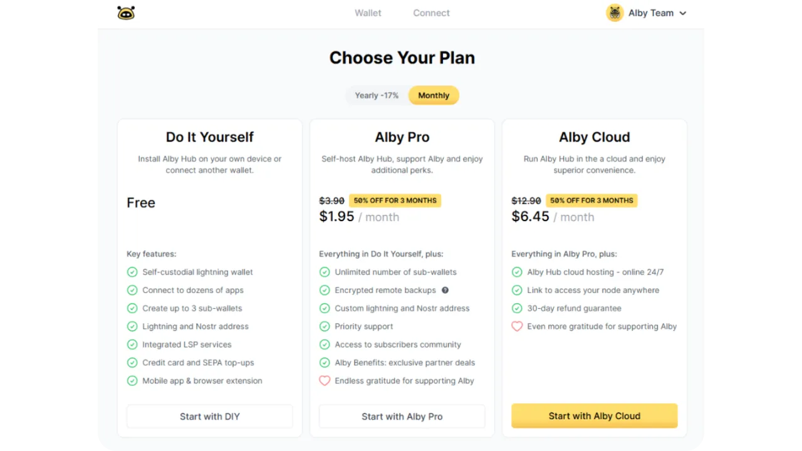
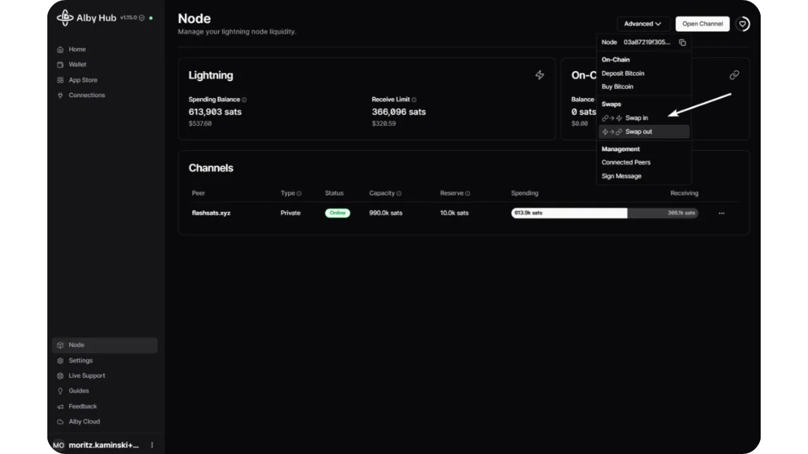
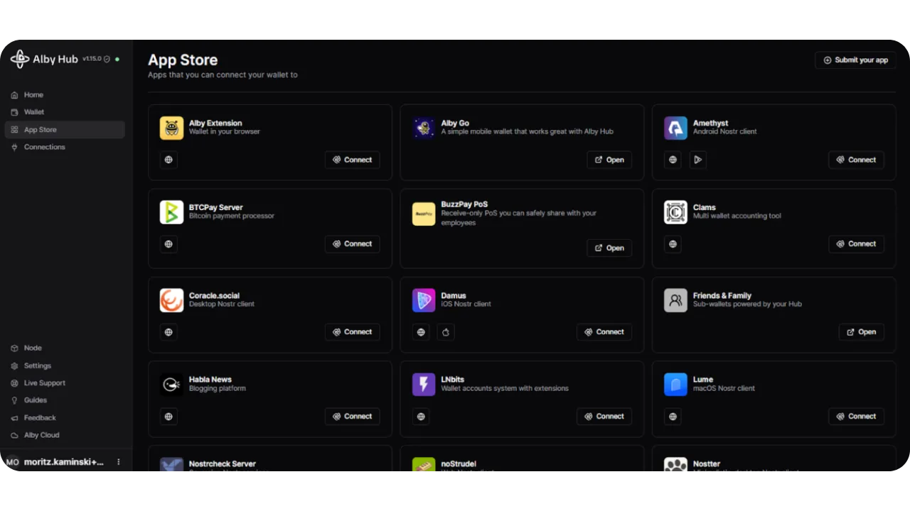
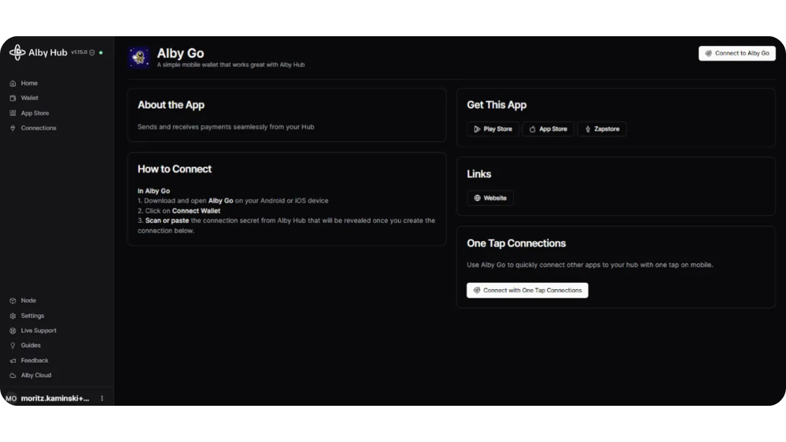

Alby Hub යනු ජනප්‍රිය Lightning වෙබ් දිගුව පිටුපස ඇති Alby සමාගමෙන් නිකුත් කරන ලද නවතම විවෘත මූලාශ්‍ර මෘදුකාංගයයි. Alby Hub යනු භාවිතා කිරීමට පහසුම Lightning node සමඟ ඇති ස්වයං-අධිකාරී Wallet එකක් වන අතර, දසකඩක් යෙදුම් සමඟ ඒකාබද්ධ කිරීමට ඕනෑම තැනකින් ප්‍රවේශ විය හැක. Alby Hub යනු Lightning nodes කළමනාකරණය කිරීම සඳහා භාවිතා කිරීමට පහසු Interface එකකි.

V tem vadnici bomo pogledali različne načine uporabe Alby Hub, kako ga povezati z Alby Go, Albyjevo mobilno aplikacijo ali Alby Browser Extension. To vam bo omogočilo, da porabite svoj Sats na poti, medtem ko ste avtonomni pri upravljanju svojega vozlišča.

## Alby Hub කුමක්ද?

Alby Hub nastavljen je kot novo vodilno orodje v ekosistemu Alby. Ta programska oprema uporabnikom omogoča enostavno upravljanje lastnega samostojnega skrbniškega Wallet z integriranim Lightning vozliščem, hkrati pa ohranja Ownership njihovih ključev (samostojno skrbništvo).

Alby Hub යනු ඉතා අනුකූල වන මෙවලමකි. එය ආරම්භකයින් සහ ප්‍රවීණ පරිශීලකයින් දෙපාර්ශවයටම අවශ්‍යතා සපුරාලිය හැක. නවකයින්ට එය භාවිතා කරන්නේ තමන්ගේම Lightning node එකක් පහසුවෙන් ක්‍රියාත්මක කිරීමට, මූලික සංකීර්ණතාවය සමඟ ගනුදෙනු නොකරමිනි. වැඩි පළපුරුදු පරිශීලකයින් සඳහා, Alby Hub භාවිතා කළ හැකි අතරමැදි Interface ලෙස පවතින Lightning node එකක් සඳහා උසස් කළමනාකරණයක් සඳහා භාවිතා කළ හැක.

ඔබේ අවශ්‍යතා අනුව, Alby Hub විකල්ප 4කින් ලබා ගත හැක:

- Alby Hub Cloud :**

නවකයින් සඳහා ඉතා සුදුසු, මෙම පළමු විකල්පය Alby වලාකුළු විකල්පය වේ. එය ඔබට Alby කළමනාකරණය කරන සේවාදායකයක සෘජුවම Hub එකක් යොදන්න ඉඩ සලසයි, ඔබේ Alby Hub Interface හරහා ප්‍රවේශ විය හැක. Alby සේවාදායකය කළමනාකරණය කරන නමුත්, ඔබේ යතුරු ඔබට පමණක් දන්නා මුරපදයක් භාවිතයෙන් සංකේතනය කර ඇති බැවින් ඔබේ මුදල් පිළිබඳ සාර්වභෞමත්වය ඔබ සතුය. කෙසේ වෙතත්, නෝඩය ක්‍රියාත්මක වීමට ඔබේ යතුරු RAM හි විකේතනය කළ යුතු අතර, කාටහරි සේවාදායකය භෞතිකව ප්‍රවේශ වුවහොත් ඒවා අවදානමට ලක්විය හැක. නවකයින් සඳහා මෙය රසවත් සමථයකි, නමුත් අවදානම් පිළිබඳව දැනුවත් වීම වැදගත්ය.

මෙම විකල්පයේ ප්‍රධාන වාසිය වන්නේ ඔබට Lightning node එකක් පැය 24/7 ක් ක්‍රියාත්මක කර ගැනීමට හැකි වීමයි, ඔබටම සත්කාරකය කළමනාකරණය කළ යුතු නොමැතිව. තවද, ඔබේ Lightning node එකේ පසුබැක්කප් සරල සහ ස්වයංක්‍රීය වන අතර, ඔබටම නාලිකා පසුබැක්කප් කළමනාකරණය කළ යුතු ස්වයං සත්කාරක විකල්ප සමඟ සසඳන විට.

Alby Cloud යනු ගෙවීම් කළ යුතු සේවාවකි [ඔවුන්ගේ මිල ගණන් පරීක්ෂා කරන්න](https://albyhub.com/#pricing) වැඩි විස්තර සඳහා. ගාස්තුව ස්වයංක්‍රීයව ඔබේ Wallet වෙතින් Alby විසින් නිකුත් කරන ලද Lightning Invoice හරහා අඩු කෙරේ. මෙය NWC සම්බන්ධතාවයක් හරහා සිදු කරන අතර එය ඔබේ නියමිත ගෙවීම් Alby සබඳතා සඳහා ස්වයංක්‍රීයව ගෙවීමට ඔබේ නියමිතය සකසයි.

- Alby Hub with an existing node :**

Če že imate gostovano vozlišče, na primer na Umbrel ali Start9, se lahko Alby Hub uporablja kot napreden upravljalni Interface, na enak način kot ThunderHub ali RTL.

- Alby Hub स्थानीय :**

Prav tako je mogoče namestiti Alby Hub neposredno na vaš računalnik, čeprav je ta možnost manj praktična, saj mora vaš računalnik ostati aktiven ves čas, da lahko na daljavo dostopate do vozlišča Lightning. Vendar pa je ta alternativa morda primerna za vaše specifične potrebe.

- Alby Hub osebnem strežniku :**

ප්‍රවීණ පරිශීලකයින් සඳහා, Alby Hub පුද්ගලික සේවාදායකයකට සරල විධානයකින් යොදවා ගත හැක. මෙම විකල්පය මෙම උපකාරක පෙළේ ආවරණය නොවේ, නමුත් ඔබට කැපවූ උපදෙස් [Albyගේ GitHub හි](https://github.com/getAlby/hub?tab=readme-ov-file#docker) සොයා ගත හැක.

මෙම උපකාරකය ප්‍රධාන වශයෙන් Interface මත අවධානය යොමු කරයි, තෝරාගත් විකල්පය කුමක් වුවද එය සමාන වනු ඇත. අපි ගෙවූ වලාකුළු විකල්පය සමඟ Alby Hub යොදන ආකාරයද, පසුව node-in-box විකල්පය (Umbrel හෝ Start9) සමඟද බලමු.

ඔබේ පරිගණකය මත ස්ථාපනය කිරීම සඳහා, [ඔබේ මෙහෙයුම් පද්ධතියට අනුව මෘදුකාංගය බාගත කර ස්ථාපනය කරන්න](https://github.com/getAlby/hub/releases), එවිට Interface මත ඇති ඒම උපදෙස් අනුගමනය කරන්න.

## ustvarite račun Alby

පළමු පියවර වන්නේ Alby ගිණුමක් සාදන එකයි. මෙය Alby Hub භාවිතා කිරීමට අත්‍යවශ්‍ය නොවුවද, ලබා දී ඇති විකල්ප සම්පූර්ණයෙන්ම ප්‍රයෝජනයට ගන්නා හැකියාව සලසයි, Lightning Address ලබා ගැනීමේ හැකියාව ඇතුළුව.

Pojdite na [uradno spletno stran Alby](https://getalby.com/) in kliknite na gumb "*Create Account*".

අපේක්ෂිත නාමයක් සහ විද්‍යුත් තැපෑලක් Address ඇතුළත් කර, "*Sign up*" මත ක්ලික් කරන්න. මෙම විද්‍යුත් තැපෑල Address පසුව ඔබේ ගිණුමට පිවිසීමට භාවිතා කරනු ඇත.

ඊමේල් මඟින් ඔබට ලැබුණු සත්‍යාපන කේතය ඇතුළත් කරන්න.

ඔබේ මාර්ගගත ගිණුමට පිවිසීමෙන් පසු, "*Continue*" බොත්තම මත ක්ලික් කරන්න.

Kliknite "*Nadaljuj*" znova.

## වලාකුළු සත්කාරක විකල්පය

ඔබට පසුව, ඔබේම උපාංගයක Alby Hub ස්ථාපනය කරන ස්වයං-සත්කාරක විකල්පයක් හෝ ප්‍රිමියම් විකල්ප අතර තේරීම කළ යුතු වේ. මම Pro Cloud විකල්පය සමඟ කටයුතු කිරීමේ ක්‍රමය පැහැදිලි කිරීමෙන් ආරම්භ කරන්නෙමි (මෙය ගෙවිය යුතු විකල්පයක් බව සටහන් කර ගන්න, පෙර කොටසෙහි විස්තර බලන්න).

"*Upgrade*" මත ක්ලික් කරන්න.

"*"සබ්ස්ක්‍රයිබ් කරන්න* දැන්" ක්ලික් කිරීමෙන් තහවුරු කරන්න.

"*Alby Hub ආරම්භ කරන්න*" මත ක්ලික් කරන්න.

ඔබේ නෝඩය නිර්මාණය වන තුරු මොහොතක් රැඳී සිටින්න.

ඒකයි, දැන් ඔබේ Alby Hub වින්‍යාසය සම්පූර්ණයි. මීළඟ කොටසෙහිදී, මම ඔබට දැනට පවතින නියුඩයක Alby Hub ස්ථාපනය කරන ආකාරය පෙන්වන්නම්. ඔබට දැනටමත් විදුලි කුණාටු නියුඩයක් නොමැති නම්, Alby Cloud මත Alby Hub වින්‍යාසය කිරීමට මීළඟ කොටසට ඉදිරියට යා හැක.

## ස්වයං-සත්කාරක විකල්පය

ඔබේ පවතින Lightning node සඳහා Alby Hub Interface ලෙස භාවිතා කිරීමට කැමති නම්, ඔබට විකල්ප කිහිපයක් ඇත: එය සේවාදායකයකට ස්ථාපනය කිරීම, ඔබේ පරිගණකයේ දේශීයව, හෝ node-in-box (Umbrel හෝ Start9) හරහා. මෙම වින්‍යාසයන්හි Alby Hub භාවිතා කිරීම නොමිලේ වේ. මම සොයා ගන්නේ සේවාදායක විකල්පය, භෞතික ප්‍රවේශය නොමැතිව, වලාකුළු අනුවාදයට සමාන අවදානම් ඉදිරිපත් කරන අතර, පරිගණකයක දේශීය ස්ථාපනය බොහෝ විට සුදුසු නොවන බැවින්, අපි node-in-box විකල්පය මත අවධානය යොමු කරමු.

Umbrel (Start9 සඳහා පියවර සමාන වේ) මත මෙය සකසීමට, ඔබට පළමුවත් LND නියමිත පරිදි සකසන ලද node එකක් තිබිය යුතුය.

Umbrel Interface වෙත පිවිසි, යෙදුම් ගබඩාවට යන්න.

"*Alby Hub*" යෙදුම සොයන්න.

ඒක ඔබේ node එකට ස්ථාපනය කරන්න.

ඔබගේ Alby Hub Interface දැන් සූදානම්. ඔබට ගෙවීම් කරන අනුවාදයේ විකල්ප නොමැතිව, වලාකුළු Interface භාවිතා කරන ආකාරයටම ඉතිරි උපදේශය අනුගමනය කළ හැක. තවද, වලාකුළු අනුවාදයට වඩා වෙනස්ව, ඔබගේ යතුරු Albyගේ සේවාදායකයන් මත නොව, ඔබගේ නියුඩ් මත ස්ථානිකව ගබඩා වේ.

## Alby Hub ආරම්භ කරන්න

"*Get Started*" බොත්තම මත ක්ලික් කරන්න.

ඇල්බි හබ් පසුව ඔබට මුරපදයක් තෝරා ගැනීමට ප්‍රේරණය කරනු ඇත. මෙම මුරපදය ඉතා වැදගත් වන අතර, එය ඔබේ Wallet සංකේතනය කිරීමට භාවිතා කරනු ඇත. ගෙවීම් කළ මේඝ අනුවාදයේ, ඔබේ යතුරු ඇල්බි සේවාදායකය මත ගබඩා කර ඇති අතර, මෙම මුරපදය භාවිතයෙන් සංකේතනය කර ඇති අතර, පසුව අවශ්‍ය විට ගනුදෙනු සටහන් කිරීමට පමණක් RAM තුළ ගබඩා කර ඇත.

එම නිසා ශක්තිමත් මුරපදයක් තෝරා ගැනීම අත්‍යවශ්‍ය වේ. මෙම මුරපදය ඇති ඕනෑම කෙනෙකුට ඔබේ නියුඩ් එකට ප්‍රවේශ විය හැක. මෙම මුරපදය කඩදාසියක, හෝ වඩාත් ආරක්ෂාව සඳහා ලෝහ කැබැල්ලක, එක හෝ වැඩි ගණනක් භෞතික පිටපත් සෑදීමත් වඩාත් වැදගත් වේ.

ඔබේ මුරපදය සූක්ෂමව තෝරා සුරැකීමෙන් පසු, "*Create Password*" මත ක්ලික් කරන්න.

ඔබට දැන් ඔබේ Lightning node එකට ප්‍රවේශ විය හැක.

පළමු ක්‍රියාව ලෙස ඔබේ ප්‍රතිසාධන වාක්‍යය සුරැකීමට කටයුතු කරන්න, එයින් ඔබේ යතුරු ලබා ගන්නා ලදී. මෙය කිරීමට, "සැකසුම්" මත ක්ලික් කරන්න. මෙම වාක්‍යය ඔබට ස්වයංක්‍රීය උපස්ථිතිය සක්‍රීය කළේ නම් ඔබේ Wallet වෙත ප්‍රවේශය ප්‍රතිසාධනය කිරීමට ඉඩ සලසයි.

පසුව "*Backup*" ටැබය වෙත යන්න. එයට ප්‍රවේශ වීමට ඔබේ මුරපදය ඇතුළත් කරන්න.

ඔබට එවිට ඔබේ 12-වචන ප්‍රතිසාධන වාක්‍යය වෙත ප්‍රවේශය ලැබෙනු ඇත. මෙම වාක්‍යය කඩදාසි හෝ ලෝහ මත භෞතික පිටපත් එකක් හෝ වැඩි ගණනක් සාදන්න, සහ එය ආරක්ෂිත ස්ථානයක තබා ගන්න.

Ko shranite besedno zvezo, označite polje, da potrdite, da ste jo shranili, in kliknite "*Nadaljuj*".

## මම කෙසේද මගේ බිට්කොයින් වෙත ප්‍රවේශය නැවත ලබා ගත හැකිද?

ඔබේ Alby Hub වෙත මුදල් යැවීමට පෙර, ගැටළුවක් ඇති වූ විට ඒවා නැවත ලබා ගැනීමේ ක්‍රමය සහ මෙම නැවත ලබා ගැනීම සඳහා අවශ්‍ය තොරතුරු වටහා ගැනීම වැදගත් වේ. නැවත ලබා ගැනීමේ ක්‍රියාවලිය නැවත ලබා ගත යුතු මුදල් ස්වභාවය සහ ඔබේ නෝඩය සත්කාරක කරන ආකාරය අනුව වෙනස් වේ.

ගෙවූ වලාකුළු පරිශීලකයින් සඳහා, ඔබේ බිට්කොයින් සම්පූර්ණයෙන්ම ප්‍රතිසාධනය කිරීම සඳහා අත්‍යවශ්‍ය Elements තුනක් අවශ්‍ය වේ:

- ඔබේ ප්‍රතිසාධන වාක්‍යය;
- ඔබේ Alby ගිණුමට ප්‍රවේශ වීම, ස්වයංක්‍රීය උපස්ථයන් ලබා ගැනීම සඳහා.

මෙම තොරතුරු කැබලි 2න් කිසිවක් නොමැති වීමෙන් ඔබේ බිට්කොයින් සම්පූර්ණයෙන්ම ප්‍රතිසාධනය කිරීම අසීරු වේ.

ඔවුන්ගේම උපාංගයක Alby Hub ක්‍රියාත්මක කරන අය සඳහා, ප්‍රතිසාධන ක්‍රියාවලිය [මෙහි](https://guides.getalby.com/user-guide/alby-account-and-browser-extension/alby-hub/backups-and-recover#alby-hub-self-hosted-with-an-alby-account) ලියකියවිඩ කර ඇත.

ඔබ Alby Hub එක දැනට පවතින නියමක ස්ථාපනය කර ඇත්නම්, එම විශේෂිත නියම මෙහෙයුම් පද්ධතියේ ප්‍රතිසාධන ක්‍රියාවලිය අනුගමනය කළ යුතුය. උදාහරණයක් ලෙස: Umbrel [විකල්පයක්](https://github.com/getumbrel/umbrel/blob/2b266036f62a1594aa60a8a3be30cfb8656e755f/scripts/backup/README.md) ලබා දේ ඔබේ Lightning නාලිකා වල නවතම තත්ත්වය සංකේතනය කර Tor හරහා ගතිකව සහ අනන්‍යතාවයෙන් තොරව සුරැකීමට. Alby වෙතින් ලබා දෙන ස්වයංක්‍රීය උපස්ථයන් පමණක් ඔබට ඔබේ Hub එක සම්පූර්ණයෙන්ම ප්‍රතිසාධනය කිරීමට ඉඩ සලසන අතර කිසිදු නාලිකාවක් වසා නොමැත.

## ඔබේ පළමු Lightning නාලිකාව මිලදී ගන්න

ඔබට දැන් Alby Hub විසින් ලබා දී ඇති උපදෙස් අනුගමනය කළ හැක. ආදායම් මුදල් සඳහා ඔබේ පළමු නාලිකාව විවෘත කිරීමට බොත්තම ක්ලික් කරන්න.

"*Open Channel*" තෝරන්න. ඔබ මාර්ගගත නියමකරු බවට පත්වීමට අදහස් නොකරන්නේ නම් සහ විශේෂයෙන්ම එකක් අවශ්‍ය නොවේ නම්, මම ඔබට පෞද්ගලික නාලිකා තෝරා ගැනීමට නිර්දේශ කරමි.

Alby Hub ඔබට ගෙවීමට generate සහ Invoice කරනු ඇත. මෙම ගෙවීම ඔබේ නාලිකාව විවෘත කිරීමට අවශ්‍ය ගනුදෙනු ගාස්තු මෙන්ම ඔබේ නෝඩ් එකට නාලිකාවක් විවෘත කරන LSP (*Lightning Service Provider*) හි සේවා ගාස්තු ආවරණය කරයි, එමඟින් ඔබට වහාම ගෙවීම් ලබා ගැනීමට හැකියාව ලැබේ.

Invoice එක ගෙවා ගනු ලැබූ විට සහ ගනුදෙනුව තහවුරු වූ විට, ඔබේ පළමු Lightning නාලිකාව ස්ථාපිත වේ.

"*Node*" ටැබ් එකේ, ඔබ දැන් ආදායම් මුදල් ඇති බව දැක ගන්න පුළුවන්, එය ඔබට Lightning හරහා ගෙවීම් ලබා ගැනීමට හැකියාව සලසයි.

ගෙවීම ලබා ගැනීමට, "*Wallet*" ටැබය මත ක්ලික් කර "*Receive*" මත ක්ලික් කරන්න.

රැකියාවක් ඇතුළත් කර අවශ්‍ය නම් විස්තරයක් එක් කරන්න, එවිට "*Invoice නිර්මාණය කරන්න*" මත ක්ලික් කරන්න.

මට 120,000 Sats ක මුල් ගෙවීම ලැබුණි.

Z vrnitvijo na zavihek "*Wallet*" lahko preverite svoje stanje Wallet. Upoštevajte, da Alby Hub samodejno rezervira 354 Sats, ko opravite prvo plačilo. Za vsak Lightning kanal, ki ga odprete zatem, bo Alby Hub samodejno rezerviral znesek, enak 1% zmogljivosti kanala. Ta rezerva je varnostni ukrep, ki omogoča vašemu vozlišču, da povrne sredstva kanala v primeru poskusa goljufije s strani vašega partnerja. Zato, čeprav sem poslal 120,000 Sats, je na mojem stanju prikazanih le 119,646 Sats.

## ඔන්චේන් බිට්කොයින් තැන්පතු කිරීම

Če želite imeti odhodni denar za plačila, lahko tudi sami odprete kanal. Za to boste potrebovali onchain bitcoine v svojem Wallet.

"*Node*" ටැබ් එකෙන්, "*Deposit*" මත ක්ලික් කරන්න.

Address වෙත බිට්කොයින් යවන්න. මෙම Address ඔබ පෙර සුරැකූ ප්‍රතිසාධන වාක්‍යයෙන් ලබාගෙන ඇත.

මම Sats 72,000 යැවුවා. දැන් එය "*ඉතිරිකිරීම් ශේෂය*" තුළ දෘශ්‍යමාන වේ, එය මගේ සියලුම අරමුදල් onchain මත, Lightning මත නොව, ඇතුළත් වේ.

## විදුලි නාලිකාවක් විවෘත කරන්න

දැන් ඔබට onchain මුදල් ඇති බැවින්, ඔබට නව Lightning නාලිකාවක් විවෘත කළ හැක. සීමාවකින් තොරව ගෙවීම් කළ හැකි බව සහතික කිරීම සඳහා ප්‍රමාණවත් මුදල් සහිත නාලිකා කිහිපයක් විවෘත කිරීම සුදුසු ය. බොහෝ LSPs (*Lightning සේවා සපයන්නන්*) ඔබ සමඟ නාලිකාවක් විවෘත කිරීමට අවම වශයෙන් 150,000 Sats අවශ්‍ය වේ.

"*Node*" ටැබ් එකේ, "*Open Channel*" මත ක්ලික් කරන්න.

ඔබේ නාලිකාවේ ප්‍රමාණය තෝරන්න. මම නිර්දේශ කරනවා ඔබට ඉතා කුඩා නාලිකා විවෘත නොකරන්න, මන්ද මෙය Lightning නෝඩයක් වන අතර ඔබේ යතුරු සත්කාරකය කරන යන්ත්‍රය Hardware Wallet එකක් මෙන්ම ආරක්ෂාව ලබා නොදෙයි. එබැවින් ඔබ තෝරාගන්නා මුදල් ප්‍රමාණයන් සම්බන්ධයෙන් සැලකිලිමත් වන්න.

"*උසස් විකල්ප*" මෙනුවේ, ඔබට ඔබේ නාලිකාව විවෘත කිරීමට LSP එකක් තෝරා ගත හැකි අතර, හෝ අතින් වෙනත් Lightning නියමුවෙක් ඇතුළත් කළ හැක.

පසුව "*Open Channel*" මත ක්ලික් කරන්න.

ඔබේ නාලිකාව onchain මත තහවුරු වන තුරු රැඳී සිටින්න.

ඔබගේ නව නාලිකාව දැන් "*Node*" ටැබ් එකේ පෙනේ.

## නෝඩ් කළමනාකරණය

ඔබේ Lightning නාලිකා කළමනාකරණය කිරීම ඔබ සිතන තරම් අපහසු නැත. Alby Hub ඔබට ඔබේ වියදම් ශේෂය සහ ඔබේ On-Chain ශේෂය අතර Sats මාරු කිරීමට ඉඩ සලසයි. එය ඔබට වියදම් කිරීම හෝ ලැබීමේ හැකියාව වැඩි කිරීමට හැකි වන ආකාරයයි.

## ආදායම් වියදම් යෙදුමක් සම්බන්ධ කරන්න

දැන් ඔබට ක්‍රියාත්මක Lightning node එකක් ඇති බැවින්, ඔබට එය භාවිතා කරමින් දිනපතා Sats ලබා ගැනීමට සහ වියදම් කිරීමට හැකිය. Alby Hub හි වෙබ් Interface ඔබේ node කළමනාකරණය කිරීමට පහසු වුවත්, එය ඉක්මන් ගනුදෙනු කිරීමට සුදුසු නොවේ. මෙ සඳහා, අපි අපගේ ස්මාර්ට්ෆෝන් එකේ ස්ථාපිත Lightning Wallet යෙදුමක් භාවිතා කිරීමට යන්නේ.

මෙම උපකාරිකාවේ, මම ඔබට Alby Go තෝරා ගැනීමට නිර්දේශ කරමි, එය භාවිතා කිරීමට ඉතා පහසු වේ, නමුත් ඔබට Zeus වැනි අනෙකුත් අනුකූල යෙදුම්ද භාවිතා කළ හැක.

Alby Go ස්ථාපනය කිරීමට, ඔබේ උපාංගයේ යෙදුම් ගබඩාවට යන්න:

- [For Android](https://play.google.com/store/apps/details?id=com.getalby.mobile);
- [For Apple](https://apps.apple.com/us/app/alby-go/id6471335774).

Android uporabniki lahko aplikacijo namestijo tudi prek `.apk` datoteke [na voljo na Alby's GitHub](https://github.com/getAlby/go/releases).

Ko se aplikacija zažene, kliknite na "*Connect Wallet*".

ඔබේ Alby Hub හි, App Store යටතේ, "Alby Go" සොයා "Connect" මත ක්ලික් කරන්න.

"Connect with One-Tab Connections" මත ක්ලික් කරන්න. මෙය ඔබට Alby Go භාවිතා කරමින් ඔබේ Alby Hub එකක් අනෙක් යෙදුම් සමඟ එක් ක්ලික් කිරීමෙන් සම්බන්ධ කිරීමට ඉඩ සලසයි.

Alby Hub nato generate skrivnost za vzpostavitev povezave z Alby Go.

ආපසු Alby Go යෙදුමට යන්න, QR කේතය ස්කෑන් කරන්න හෝ රහස අලවන්න.

"Finish*" මත ක්ලික් කරන්න.

Zdaj imate oddaljen dostop do svojega vozlišča Lightning, ki ga poganja Alby Hub, iz vašega pametnega telefona, kar omogoča enostavno porabo in prejemanje Sats na poti vsak dan.

අවශ්‍ය නම්, ඔබට මෙම සම්බන්ධතාවය සඳහා අවසර Alby Hub මත එය ක්ලික් කිරීමෙන් සෘජුවම කළමනාකරණය කළ හැක.

Sats ලබා ගැනීමට, "*Receive*" මත ක්ලික් කරන්න.

Invoice මුදල සහ විස්තරය "*Invoice*" මත ක්ලික් කිරීමෙන් වෙනස් කරන්න.

Invoice නඩත්තු කර Sats ලබා ගන්න.

Sats යවන්න, "*Send*" මත ක්ලික් කරන්න.

Invoice ස්කෑන් කර ඔබට ගෙවීමට අවශ්‍ය වේ.

පසුව "*ගෙවන්න*" මත ක්ලික් කරන්න.

ඔබේ ගනුදෙනුව තහවුරු කර ඇත.

සමීප ඊතලය මත ක්ලික් කිරීමෙන්, ඔබට ඔබේ ගනුදෙනු ඉතිහාසය ප්‍රවේශ විය හැක.

මෙම ගනුදෙනු ඔබේ Alby Hub හි ද දෘශ්‍යමාන වේ.

## ඔබේ Lightning Address අභිරුචිකරණය කරන්න

ඇල්බි ඔබට Lightning Address එකක් ලබා දේ. මෙය ඔබට ඔබේ node එකේ ගෙවීම් ලැබීමට generate සහ Invoice සෑම විටම අතින් කිරීමට අවශ්‍ය නොමැතිව ඉඩ සලසයි. පෙරනිමියෙන්ම, ඇල්බි ඔබට Lightning Address එකක් පවරයි, නමුත් ඔබට එය අභිරුචිකරණය කළ හැක. ඔබේ ඇල්බි මාර්ගගත ගිණුමට පිවිසෙන්න, ඉහළ දකුණු කෙළවරේ ඇති ඔබේ නම මත ක්ලික් කරන්න, එවිට "*Settings*" තෝරන්න.

"*Lightning Address*" මෙනුවට යන්න.

Address එක වෙනස් කර, "*ඔබේ lightning Address යාවත්කාලීන කරන්න*" ක්ලික් කිරීමෙන් තහවුරු කරන්න.

කරුණාකර සලකන්න, ඔබේ Address එක වෙනස් කළ පසු, එය තවදුරටත් ඔබට අයත් නොවේ. එබැවින් Sats එක නැවත එයට කිසිවිටෙක නොයැවීමට වග බලා ගන්න.

එයයි, දැන් ඔබට Alby Hub මෙවලම භාවිතා කරමින් ඔබේම node එක සමඟ Lightning භාවිතා කරන ආකාරය දැනගන්නට ඇත. මෙම උපකාරිකාව ප්‍රයෝජනවත් වූවා නම්, Green අඟුලක් පහළට දමන ලෙස මම ඉතාමත් කෘතඥ වෙමි. කරුණාකර මෙම ලිපිය ඔබේ සමාජ ජාලවල බෙදාගන්න. බොහෝම ස්තූතියි!

Za podrobno razumevanje vseh mehanizmov Lightning, ki smo jih obravnavali v tem priročniku, vam močno priporočam, da odkrijete naše brezplačno usposabljanje na to temo:

https://planb.network/courses/34bd43ef-6683-4a5c-b239-7cb1e40a4aeb