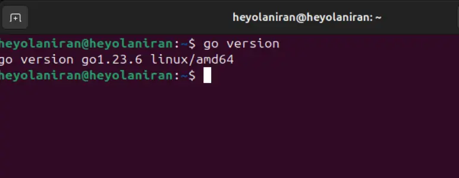
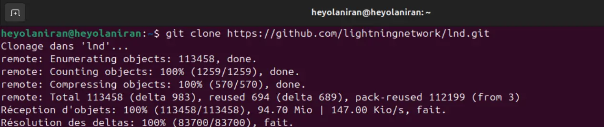
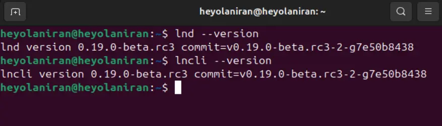
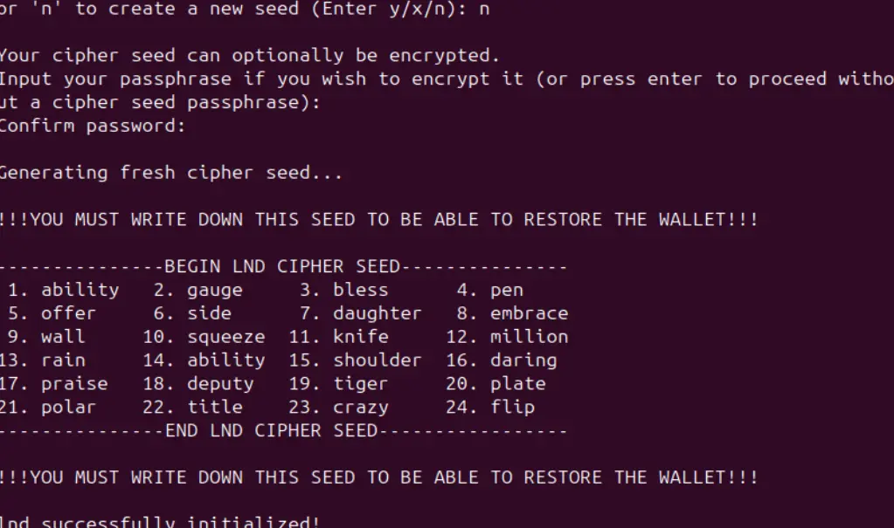

Lightning Network je drugi Layer od Bitcoin, kar mu omogoča, da prevzame strele dimenzij, zlasti zaradi hitrosti in nizkih stroškov transakcij, ki jih ponuja.


මෙම උපකාරිකාවේ, අපි අපගේ Linux යන්ත්‍රය (Ubuntu 24.04 බෙදාහැරීම) මත Lightning Network Daemon ක්‍රියාත්මක කිරීම ස්ථාපනය කරමු.


## Kaj je Lightning Network Daemon?


Lightning Network Daemon යනු Lightning Network හි සම්පූර්ණ Go ක්‍රියාත්මක කිරීමකි. එය Lightning Labs විසින් නිර්මාණය කර ඇති අතර ඔබට ඔබේ යන්ත්‍රයේ Lightning node එකක සම්පූර්ණ අවස්ථාවක් ක්‍රියාත්මක කිරීමට ඉඩ සලසයි.


අනෙක් වචන වලින්, මෙම ක්‍රියාත්මක කිරීම සමඟ, ඔබට :


- Lightning Network** සමඟ අන්තර්ක්‍රියා කරන්න: ඔබට විදුලි පෝර්ට්ෆෝලියෝ නිර්මාණය කිරීමට, ගෙවීම් නාලිකා සහ මාර්ග කළමනාකරණය කිරීමට, සහ තවත් බොහෝ දේ, ඔබේ යන්ත්‍ර ටර්මිනලයෙන් සෘජුවම විධාන රේඛා භාවිතා කළ හැක.
- දුරස්ථ Bitcoin නෝඩයක් හෝ ඔබේම Bitcoin කෝර් උත්ස්ථාපනයක් සම්බන්ධ කිරීම**: LND ඔබට Bitcoin උත්ස්ථාපනයක් සම්බන්ධ කර ඔබේ පසුබැසිය ලෙස භාවිතා කිරීමට ඉඩ සලසයි. මෙම ක්‍රියාත්මක කිරීම භාවිතා කිරීමට, ඔබේ යන්ත්‍රයේ Bitcoin කෝර් උත්ස්ථාපනයක් ක්‍රියාත්මක කිරීමට අවශ්‍ය නොවේ.


https://planb.network/fr/tutorials/node/bitcoin/bitcoin-core-linux-568c13a6-8746-4d63-8e95-f4a61c5ae0ed

## ඔබේම Lightning node එකක් ඇයි තිබිය යුතුද?


විදුලි කුණාටුව යනු ගුවන්-12 ආවරණයකි, එය මාරු ක්‍රියාවලිය උපරිම කරමින් ගනුදෙනු වියදම් අඩු කරයි.


ඔබේ Lightning node එක භ්‍රමණය කිරීමෙන්, ඔබ ස්වයංපාලනය සහ ස්වයංපෝෂිතභාවය ලබා ගනී. ඔබේ මුදල් ඔබේ පාලනය යටතේ ඇති බැවින්, මතක තබා ගන්න:


"ඔබේ යතුරු නොමැතිනම්, ඔබේ බිට්කොයින් නැත."


මෙම අර්ථයෙන්, ලයිට්නින් නෝඩ් එකක් ධාවනය කිරීම ඔබේ දත්තයේ ආරක්ෂාව සහ අඛණ්ඩතාව පහත සඳහන් ආකාරයෙන් වැඩි කරයි:


- සම්පූර්ණ පාලනය**: ඔබේම ගෙවීම් නාලිකා කළමනාකරණය කරන්න, ඔබේම බැංකුවක් වන්න සහ ඔබේ සම්පත් වල ස්වාමියා වන්න.
- රහස්‍යතාව**: ඔබේ පෞද්ගලිකත්වය ආරක්ෂා කිරීමට තෙවන පාර්ශවයන් මත භාර නොවී ගනුදෙනු කරන්න.
- ඉගෙනුම සහ ස්වයංපාලනය**: `lncli` විධාන වලට ස්තුතියි, ඔබට ඔබේ ටර්මිනල් එකෙන් යෙදී Lightning හි මූලික ක්‍රියාවලීන් වඩා හොඳින් තේරුම් ගත හැක.
- Decentralization**: Bitcoin / Lightning Network මजबूत කිරීම සහ විකේන්ද්‍රීකරණය කිරීමේදී සක්‍රීය භාගයක් වන්න.


https://planb.network/courses/65c138b0-4161-4958-bbe3-c12916bc959c


ඔබට අපගේ යන්ත්‍රයේ LND ක්‍රියාත්මක කිරීමේ අවස්ථාවක් සඳහා විකල්ප දෙකක් ඇත. අපගේම යන්ත්‍රයේ පරිසරය පිහිටුවා ස්ථානීයව ක්‍රියාත්මක කිරීම හෝ Docker කන්ටේනරයකින් LND ස්ථාපනය කිරීම. මෙහිදී, අපි පළමු විකල්පය මත අවධානය යොමු කර, Docker සමඟ කටයුතු කිරීම පිළිබඳ පසුව පැහැදිලි කරමු.


## LND මූලාශ්‍ර කේතයෙන් ස්ථාපනය කරන්න


### ਪੂਰਵ ਸ਼ਰਤਾਂ


LND Go භාෂාවෙන් ලියන ලද්දේ, ඔබේ Linux යන්ත්‍රයේ GoLang පරිසරය සහ අවශ්‍ය අනුයෝජිතතා ඇති බව ඔබට සහතික විය යුතුය.


- Hardware requirements:**


සමතල, නිරායාස අත්දැකීමක් සඳහා, ඔබේ යන්ත්‍රය ඔබේ LND Lightning නෝඩය ක්‍රියාත්මක කිරීමට අවශ්‍ය ධාරිතාව තිබිය යුතුය.


ඔබට අවශ්‍ය වේ :


1. **8 GB RAM** සදහා උපරිම ද්‍රවතාවය,


2. **බහු-මූලික ප්‍රොසෙසරයක් (චතුරස්‍ර-මූලික හෝ ඊට වැඩි)** ඔබේ නෝඩ් ක්‍රියාකාරකම් කාර්යක්ෂමව කළමනාකරණය කිරීමට,


3. **අවම වශයෙන් 5GB ඩිස්ක් අවකාශය** කපා හරින ලද නෝඩ් ප්‍රකාරය සඳහා සහ Bitcoin Core ක්‍රියාත්මක කිරීමට 1TB (දුරස්ථ නෝඩ් එකක් භාවිතා කරන විට විකල්ප)


- උපයෝගී අනුබද්ධතා ස්ථාපනය කරන්න:**


පහත විධානය ඔබට LND ක්‍රියාත්මක කිරීමට අවශ්‍ය මෙවලම් ඔබේ යන්ත්‍රයේ ස්ථාපනය කිරීමට ඉඩ සලසයි. වෙනත් දේ අතර, ඔබට `Git`, අනුවාදකරණ මෙවලමක්, සහ `make`, LND ක්‍රියාත්මක කිරීම සහ මූලාශ්‍ර කේතයෙන් ගොඩනැගීම කළ හැකි මෙවලමක් ස්ථාපනය කළ යුතුය.


```bash
sudo apt install -y build-essential git make
```


- Linux මැෂින් එකේ GoLang ස්ථාපනය කරන්න**


මෙම උපකාරක පඬතියේ දිනය වන විට, LND ස්ථාපනය සඳහා Go*** හි අනුවාදය 1.23.6 අවශ්‍ය වේ.


ඔබට පෙර අනුවාදයක් දැනටමත් ස්ථාපනය කර තිබේ නම්, නව Go ස්ථාපනය සඳහා එය ඉවත් කරන්න.


```bash
# Suppression d'une ancienne version de Go
sudo rm -rf /usr/local/go

# Installation de la version 1.23.6 de Go
wget https://golang.org/dl/go1.23.6.linux-amd64.tar.gz

# Decompression du package

sudo tar -C /usr/local -xzf go1.23.6.linux-amd64.tar.gz

```


- Go** environment configuration


`~/.bashrc` फाइलमा, तपाईँको Linux प्रणालीमा Go थप्न निम्न वातावरण चरहरू आरम्भ गर्नुहोस्।


```bash
# Configuration de l'environnement Go
export GOROOT=/usr/local/go
export GOPATH=~/gocode
export PATH=$PATH:$GOROOT/bin

# Appliquer les modifications

source ~/.bashrc
```


- ස්ථාපනය පරීක්ෂා කිරීම** (ප්‍රංශ භාෂාවෙන්)


```bash
go version
```





### Klonirajte repozitorij LND GitHub


Git භාවිතා කර LND මූලාශ්‍ර කේතයේ පිටපතක් ඔබේ පරිගණකයේ දේශීයව ලබා ගැනීමට:


```bash
git clone https://github.com/lightningnetwork/lnd.git
```





### Build සහ ස්ථාපනය කරන්න


`make` මෙවලම, පෙර ස්ථාපනය කර ඇති, ඔබට LND මූලාශ්‍ර කේතයෙන් ක්‍රියාත්මක කළ හැකි ගොනුවක් ගොඩනැගීමට සහ ඔබේ ස්ථාපනයට ඉදිරියට යාමට හැකියාව ලබා දේ.


```bash
# Acceder au repertoire clonné
cd lnd

# construire LND
make
```


LND ඔබේ යන්ත්‍රය මත ස්ථාපනය කරන්න


```bash
# installer LND
make install
```


- Votre installation**


සියලු දේ මනාව සිදු වූ බව සහතික කිරීම සඳහා, මෙම විධානය ක්‍රියාත්මක කිරීමෙන් ඔබ දැනට ක්‍රියාත්මක කරමින් ඇති LND සංස්කරණය ලබා දිය යුතුය.


```bash
# Version de LND
lnd --version

# Version  de LNCLI
lncli --version
```





- අලුත්වැඩියා සහ උත්ශ්‍රේණි කිරීමන්


```bash
cd lnd
git pull
make clean && make && make install
```


⚠️ **IMPORTANT**: LND යාවත්කාලීන කිරීම් සඳහා Go හි නවතම අනුවාද අවශ්‍ය විය හැකි බැවින් ස්ථාපනය කිරීමේදී අනුයෝජිත ගැටළු වලට මුවා නොවීමට ඔබේ පද්ධතිය යාවත්කාලීන කරන්න.


### Lightning Network Daemon සකසමින්


Lightning LND නෝඩ් එකක වින්‍යාසය Bitcoin එකේ වින්‍යාසය වගේමයි, සහ ඔබේ නෝඩ් එකේ සියලුම පරාමිතීන් අඩංගු වින්‍යාස ගොනුවක සිදු කරයි. මෙය කිරීමට, ඔබේ යන්ත්‍රයේ මූලස්ථානයේ `.LND` නමැති සඟවා ඇති ෆෝල්ඩරයක් සාදන්න, එවිට මෙම ෆෝල්ඩරයේ `LND.conf` වින්‍යාස ගොනුව සාදන්න.


```bash
# Création du ficher
mkdir -p ~/.lnd

cd ~/.lnd

# Fichier de configuration
touch lnd.conf
```


වින්‍යාස ගොනුවේ, ඔබට ඔබේ LND නියුඩ් සකස් කළ හැක.


```
noseedbackup=0
debuglevel=debug

[Bitcoin]
bitcoin.active=1
bitcoin.mainnet=1
bitcoin.node=bitcoind

[Bitcoind]
bitcoind.rpcuser=<UTILISATEUR_BITCOIN>
bitcoind.rpcpassword=<MOT_DE_PASSE_BITCOIN>
bitcoind.zmqpubrawblock=tcp://127.0.0.1:28332
bitcoind.zmqpubrawtx=tcp://127.0.0.1:28333

```


## ඔබේ වින්‍යාසය අවබෝධ කර ගැනීම


LND නියුඩ් එකේ නිවැරදි සහ සම්පූර්ණ ස්ථාපනයක් සඳහා අවශ්‍ය අවම වින්‍යාසය ඔබට තේරුම් ගැනීම වැදගත් වේ.


`~/.LND/LND.conf` फाइलको सामग्रीको आधारमा, यहाँ फिल्डहरूको विवरणहरू छन्:


- noseedbackup**: ඔබට LND විසින් ඔබේ පෝර්ට්ෆෝලියෝස් ස්වයංක්‍රීය මූලාශ්‍ර පිටපත් සෑදීම සිදු කරනවාද යන්න තෝරා ගැනීමට ඉඩ සලසයි. මෙම ගුණාංගය `0` ලෙස සකසීමෙන් ඔබට පුද්ගලිකව තෝරාගත් ආරක්ෂිත ස්ථානයක මූලාශ්‍ර තොරතුරු අතින් සුරකින්න ඉඩ සලසයි.


- debuglevel**: ඔබට ක්‍රියාවක් සිදුවීමේදී දෝෂ සහ ලොග් වල විස්තර මට්ටම නිර්වචනය කිරීමට ඉඩ සලසයි.


- Bitcoin.active**: LND හට Bitcoin නියුඩ් ලෙස ක්‍රියාත්මක වීමට සහ Bitcoin ජාලය සමඟ අන්තර්ක්‍රියා කිරීමට උපදෙස් දේ.


- Bitcoin.Mainnet**: LND ਨੂੰ Bitcoin ਦੇ ਮੁੱਖ ਨੈੱਟਵਰਕ (Mainnet) ਨਾਲ ਕਨੈਕਟ ਕਰਨ ਲਈ ਨਿਰਧਾਰਤ ਕਰਦਾ ਹੈ, ਤੁਸੀਂ Bitcoin ਸਾਈਨੈੱਟ ਅਤੇ Bitcoin ਰੈਗਟੈਸਟ ਨੈੱਟਵਰਕਾਂ ਲਈ ਕ੍ਰਮਵਾਰ `bitcoind.signet` ਅਤੇ `bitcoind.regtest` ਮੁੱਲ ਸੈੱਟ ਕਰ ਸਕਦੇ ਹੋ।


- Bitcoin.node**: LND සම්බන්ධ විය යුතු Bitcoin නියමිත නෝඩ් වර්ගය සදහන් කරයි.


- Bitcoin.rpcuser** සහ **Bitcoin.rpcpassword** : නියෝජනය කරන්න.


logini (uporabnik, geslo) za povezavo na vaš Bitcoin vozlišče


- bitcoind.zmqpubrawblock** සහ **bitcoind.zmqpubrawtx**: Bitcoin ජාලයේ නව අවරෝධ සහ ගනුදෙනු පිළිබඳ දැනුම්දීම් ලබා ගැනීමට ZeroMQ අවසාන ලක්ෂ්‍යයන් අර්ථ දක්වයි.


## LND සමඟ ඔබේ ස්ථාපනය පරීක්ෂා කිරීම


ඔබේ ක්‍රියාවලිය සාර්ථක වී ඇති බව සහ ඔබේ නෝඩ් තොරතුරු යාවත්කාලීන තබා ගැනීම සඳහා Lightning Network සමඟ සංකේතනය කරමින් සිටින බව සහතික කර ගැනීමට ඔබට අවශ්‍ය විය හැක.


LND ක්‍රියාත්මක කිරීම ආරම්භ කිරීමට සහ ඔබේ නියුඩ් පිළිබඳ තොරතුරු ලබා ගැනීමට, සරලව පහත විධානය ටයිප් කරන්න :


```bash
lnd getinfo
```


## LND මත ක්‍රියාකාරකම් සිදු කිරීම


ඔබේ ස්ථාපනය සම්පූර්ණ කර පරීක්ෂා කිරීමෙන් පසු, ඔබට එය භාවිතා කිරීම ආරම්භ කළ හැක.


මෙන්න ඔබට ආරම්භ කිරීමට අවශ්‍ය මූලික විධාන.


### පෝර්ට්ෆෝලියෝවක් සාදන්න


ඔබේ Lightning පෝර්ට්ෆෝලියෝව යනු ඔබේ මුදල් කළමනාකරණය කිරීම සඳහා ගන්නා ඕනෑම ක්‍රියාවලියේ පළමු පියවරයි.


⚠️ **IMPORTANT**: ඔබේ 24-වචන **seed වාක්‍යය** අවධානයෙන් සටහන් කරන්න. ගැටළු ඇති වූ විට ඔබේ මුදල් ප්‍රතිසාධනය කිරීමට එය අවශ්‍ය වේ.


ඔබේ Wallet මුරපදය ද සුරකින්න, එවිට ඔබේ LND නියුඩ් නැවත ආරම්භ කරන විට `lncli unlock` විධානයෙන් එය අගුළු විවෘත කළ හැක.


```bash
lncli create
```





### ඔබේ ශේෂය පරීක්ෂා කරන්න


ඔබේ ගිණුම් සෘජුවම ඔබේ ටර්මිනලයෙන් පරීක්ෂා කරන්න:


```bash
lncli walletbalance
```


### ඔබේ node පිළිබඳ තොරතුරු


පහත විධානය භාවිතා කර ඔබේ නෝඩය මත කවර නාලිකා සක්‍රීයව ඇතිදැයි සොයා බලන්න.


```bash
lncli listchannels
```


ඔබ සම්බන්ධ වී ඇති නෝඩ් ලැයිස්තුවක් ද ලබා ගත හැක.


```bash
lncli listpeers
```


### චැනල් කළමනාකරණය


ලයිට්නින් නාලිකාවක් ඔබට **Lightning Network මත වෙනත් නියුඩ් සමඟ සෘජු, යුගල-විසින්-යුගල සම්බන්ධතාවයක්** ලබා දේ. මෙම නාලිකාවේ, ඔබට නාලිකාවේ ධාරිතාවය තෙක් නිදහසේ Exchange සතෝෂිස් කළ හැක.


### නෝඩ් එකකට සම්බන්ධ වන්න


ලයිට්නින් නෝඩ් අනෙකුත් සමඟ සම්බන්ධ වීම, ලයිට්නින් බලයෙන් සක්‍රීයව සහභාගී වී ප්‍රයෝජන ලබා ගැනීමට අවශ්‍ය මූලික ක්‍රියාවකි.


සහකරු (Lightning node) සමඟ සම්බන්ධ වීමට, ඔබට තොරතුරු තුනක් අවශ්‍ය වේ:


- නෝඩ්යේ මහජන යතුර**: මෙය Bitcoin ජාලයේ නෝඩ්යේ අනන්‍ය හඳුනාගැනීමකි;
- IP** : යාන්ත්‍රය ස්ථාපිත කර ඇති නෝඩ් එකේ IP;
- PORT** :  යන්ත්‍රයේ විවෘත වරාය, මෙම නියුඩ් සමඟ සන්නිවේදනයට ඉඩ සලසයි.


ඔබට සම්බන්ධ වීමට නෝඩ් සොයාගත හැකි [amboss](https://amboss.space/) හි, ලයිට්නින් නෝඩ් පිළිබඳ තොරතුරු ලැයිස්තුගත කරන වේදිකාවකි.


```bash
# Se connecter à un noeud
lncli connect <ID_PUBKEY>@<IP>:<PORT>

# Un exemple  : Connexion au noeud de Wallet of Satoshi
lncli connect 035e4ff418fc8b5554c5d9eea66396c227bd429a3251c8cbc711002ba215bfc226@170.75.163.209:9735
```


ඔබේම පද්ධතියේ අඛණ්ඩතාවය සුරැකීමට **විශ්වාසදායී නෝඩ** සම්බන්ධ කිරීමට වග බලා ගන්න. නිවැරදි සම්බන්ධතා තෝරා ගැනීම සඳහා මෙන්න කිහිපයක් නිර්දේශ.


- භූගෝලීය විවිධාකරණය**: විවිධ ප්‍රදේශවල ගැටලු සම්බන්ධ කරන්න.


- ප්‍රතිෂ්ඨාව**: හොඳ ලබාගත හැකි බවක් ඇති නෝඩ් තෝරන්න.


- ධාරිතාව**: හොඳ ද්‍රවශීලතාවක් ඇති ගැට තෝරන්න.


- ප්‍රභාර: මාර්ගගත ප්‍රභාර පිරික්සන්න.


### ගෙවීම් නාලිකාවක් විවෘත කරන්න


ගෙවීම් නාලිකාවක් විවෘත කිරීමට, ඔබ **සම්බන්ධ** වී ඇති බව සහතික කර ගන්න, එවිට මෙම නාලිකාවේ ඔබ අවහිර කිරීමට කැමති **ධාරිතාවය** (සතෝෂි ප්‍රමාණය) නිර්වචනය කරන්න.


```bash
lncli openchannel --node_key=<ID_PUBKEY> --local_amt=<AMOUNT_SATOSHIS>
```


### Invoice ලයිට්නින් එකක් සාදන්න


Lightning Invoice යනු ඔබේ Lightning Wallet හි සතෝෂි ලබා ගැනීමට ඔබේ කැමැත්ත ප්‍රකාශ කරන අකුරු මාලාවක් නිරූපණය කරයි.


ඔබේම නෝඩයක් සමඟ Lightning ඉන්වොයිසස් නිර්මාණය කිරීමෙන් ඔබේ දත්ත (භූගෝලීය සහ පුද්ගලික) ආරක්ෂා කර ගැනීමට සහ ඔබේ මුදල් කළමනාකරණය පිළිබඳ 100% ස්වයංපෝෂිතභාවය ලබා ගැනීමට හැකියාව ලැබේ.


```bash
# Générer une facture de 1000 sats

lncli addinvoice --amt=1000 --memo="Facture de 1000 sats"
```


### Invoice සඳහා ගෙවීමක්


```bash
lncli payinvoice <FACTURE>
```


### චැනලයක් වසා දමන්න


ඔබේ වර්තමාන නියමකයෙහි ක්‍රියාකාරී නාලිකාවක් වසා දැමීමට ක්‍රම දෙකක් ඇත.


- සහකාරී වසා දැමීම**: මෙය ගෙවීම් නාලිකාවෙන් ඉවත් වීමට ඔබේ නෝඩයෙහි කැමැත්ත සංකේතවත් කරයි, පවතින කාර්යයන් සම්පූර්ණ කරන බව සහ මුදල් අහිමි වීම වැළැක්වීමට දත්ත ආපසු ගබඩා කරන බව සහතික කරයි.


```
lncli closechannel <ID_CANAL>
```


- බලහත්කාරී වසා දැමීම**: ⚠️ හැකි නම් මෙය වලක්වන්න, මෙම ක්‍රියාව ඔබේ ගෙවීම් නාලිකාවේ සිදුවන ක්‍රියාවලීන් බාධා කරමින් මුදල් අහිමි වීමේ අවදානම වැඩි කරයි.


```
lncli closechannel --force <ID_CANAL>
```


## LND නියමය සඳහා හොඳම ක්‍රියාකාරකම් සහ ආරක්ෂාව.


Bitcoin/ Lightning node භාවිතා කිරීමේදී ආරක්ෂාව ප්‍රමුඛ වේ. ඔබේ ස්ථාපනයේ ආරක්ෂාව ශක්තිමත් කිරීමට මෙන්න කිහිපයක්:


- ඔබේ `seed phrase` ආරක්ෂිත, අන්තර්ජාලයෙන් බැහැර ස්ථානයක තබා ගන්න.


- `~/.LND/channel.backup` ගොනුවේ නිතර මාරු පිටපත් සාදන්න: මෙම ගොනුව ඔබේ නියුඩයේ නව නාලිකාවක් විවෘත කරන විට (හෝ පැරණි නාලිකාවක් වසා දැමූ විට) ඔබේ නාලිකා තත්වයන් සුරකින ලදී.


⚠️ ඔබට දත්ත අහිමිවීමක් හෝ නෝඩ් අසමත් වීමක් සිදු වූ විට නාලිකා ප්‍රතිස්ථාපනය කිරීමට සහ ගෙවීම් නාලිකාවල අබලන් වූ මුදල් ප්‍රතිසාධනය කිරීමට ඉඩ සලසයි.


ඔබට මෙම ගොනුවේ උපස්ථ මාර්ගය පෙන්වා පහත විධානයෙන් ඔබේ මුදල් නැවත ලබා ගත හැක:


```
lncli restorechanbackup <CHEMIN_DU_FICHIER>
```


- පැකිරිම් කර ඇති ඔබේ Lightning Wallet හි ප්‍රතිස්ථාපන වචන සහ මුරපද සුරැකී ඇති බව සහතික වන්න.
- ඔබේ පද්ධතිය යාවත්කාලීනව තබා ගන්න.


## වත්මන් ගැටළු විසඳීම


### පෙරදසුන් ගැටළු


- bitcoind සම්බන්ධතා දෝෂය** : ඔබේ RPC ලොගින් විස්තර පරීක්ෂා කරන්න
- සමකාලීන කිරීම අවහිරයි** : ඔබේ අන්තර්ජාල සම්බන්ධතාවය පරීක්ෂා කරන්න
- අවසර දෝෂය**: `~/.LND` ෆෝල්ඩරයේ හිමිකම් පරීක්ෂා කරන්න


ඔබ මෙම උපකාරක පථයේ අවසානයට පැමිණ ඇත. ඔබට Lightning පිළිබඳව වැඩිදුර ඉගෙන ගැනීමට අවශ්‍ය නම්, Lightning Network පිටුපස ඇති සංකල්ප සහ ක්‍රියාකාරකම් පිළිබඳව වඩා හොඳ අවබෝධයක් ලබා දීමට අපි මෙම ආරම්භක පාඨමාලාව ලබා දේ.


https://planb.network/courses/34bd43ef-6683-4a5c-b239-7cb1e40a4aeb