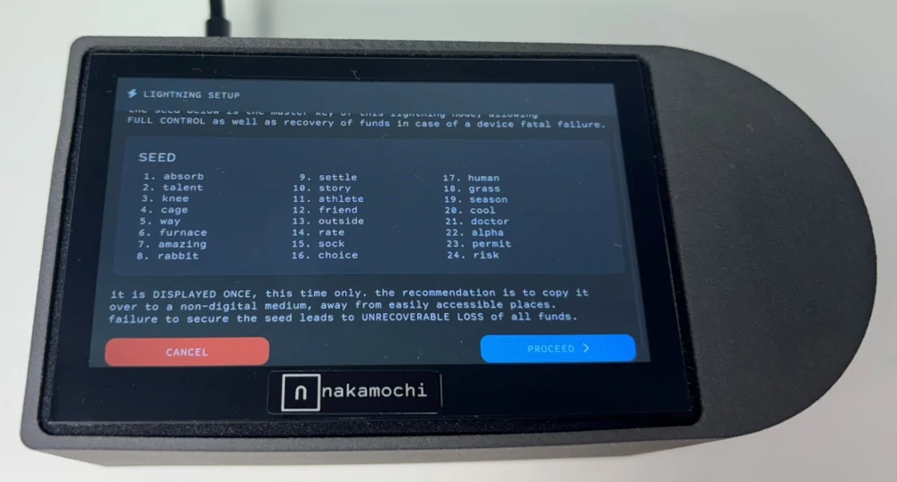
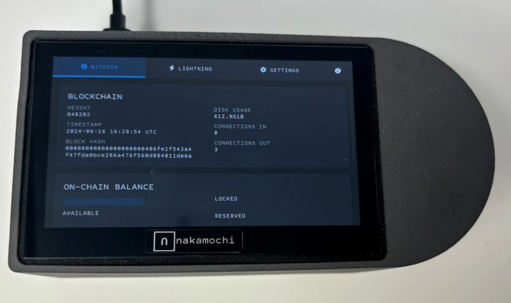
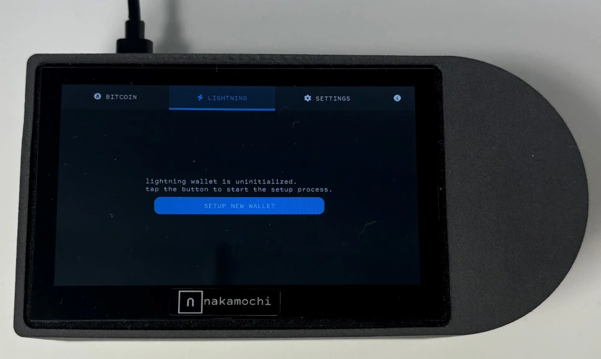
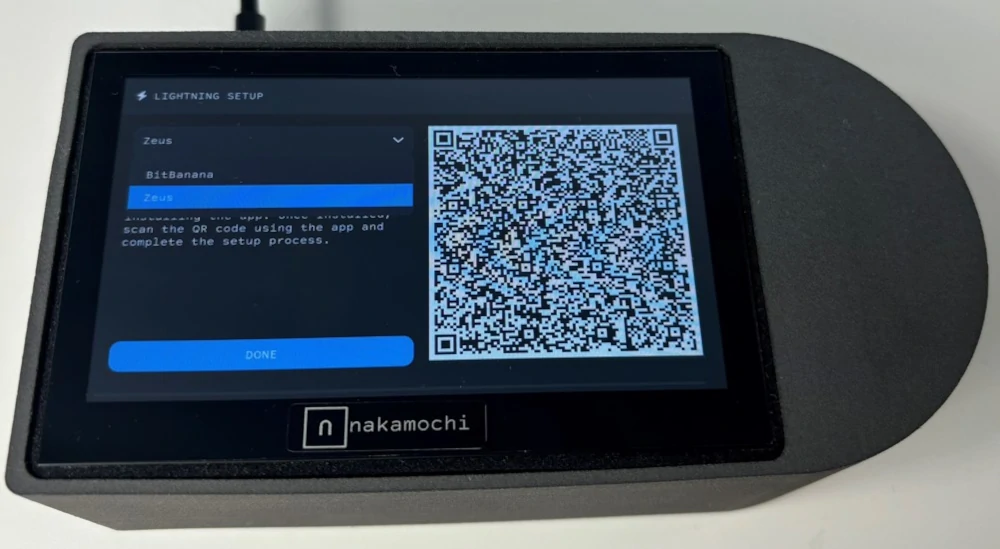
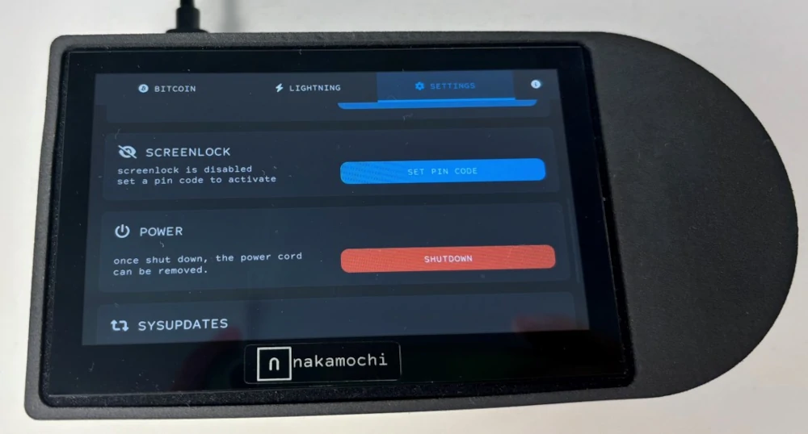
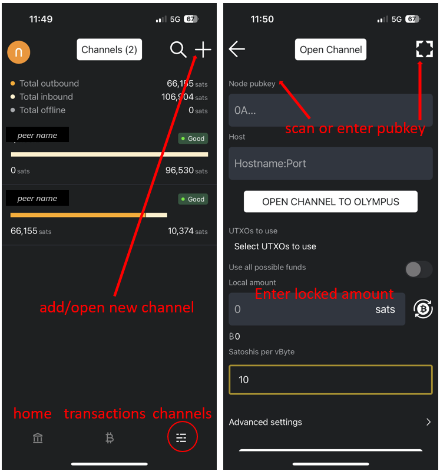
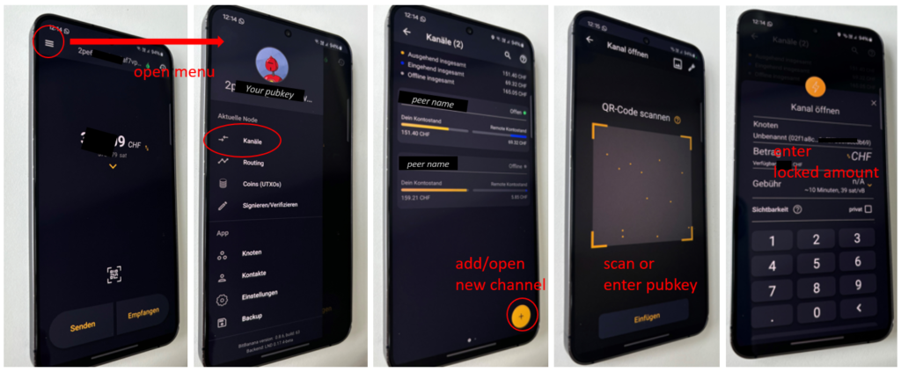

ඔබේම Bitcoin සහ Lightning Full node ක්‍රියාත්මක කිරීම තාක්ෂණික විශේෂඥයින්ට සීමා වූ සංකීර්ණ කාර්යයක් විය යුතු නැත. සම්ප්‍රදායිකව, නෝඩ් පිහිටුවීම සහ කළමනාකරණය කිරීම සඳහා සංකේත ලේඛනය, ජාලකරණය, සහ මෘදුකාංග සංවර්ධනය පිළිබඳ ගැඹුරු දැනුමක් අවශ්‍ය වී ඇත. Nakamochi එය වෙනස් කරයි, තාක්ෂණික පසුබිම නොසලකා නෝඩ් සෑම කෙනෙකුටම ප්‍රවේශ විය හැකි කරයි.

Nakamochi සමඟ, ඕනෑම කෙනෙකුට ගෙදර සිටම නෝඩයක් පිහිටුවා ක්‍රියාත්මක කළ හැකි අතර, සම්පූර්ණ පෞද්ගලිකත්වය සහ මූල්‍ය ස්වාධීනත්වය සක්‍රීය කරයි. Full node ක් ක්‍රියාත්මක කිරීමෙන් ඔබේම ගනුදෙනු ආරක්ෂා කිරීම පමණක් නොව, Bitcoin ජාලයේ ශක්තියට ද දායක වේ. විකේන්ද්‍රීකරණය වූ සහ ප්‍රතිරෝධී Bitcoin ජාලයක්, එහි ආරක්ෂාව සහ ස්වාධීනත්වය සහතික කිරීම සඳහා පුළුල් ව්‍යාප්තියක් ඇති නෝඩයන් මත රඳා පවතී.

### අන්තර්ගත සටහන

- Nakamochi kaj deluje?
- Nakamochi සකසමින්
- Lightning Network පිළිබඳව
- Lightning Network में चैनल खोलना और लेनदेन करना

## Nakamochi kaj deluje?

Nakamochi je Bitcoin-samo Full node, ki podpira tako omrežji Bitcoin kot Lightning. Vključuje integrirana Bitcoin in Lightning Wallet, kar omogoča uporabnikom, da upravljajo varen, samostojen Bitcoin vozlišče, medtem ko izkoriščajo hitrost in nizke transakcijske stroške Lightning Network.

ඔබේ Nakamochi node එක ජංගම යෙදුමක් හරහා කළමනාකරණය කරනු ලබයි, [BitBanana (Android)](https://bitbanana.app) සහ [Zeus (iOS)](https://bitbanana.app), ඔබට ඕනෑම තැනක සිට පහසුවෙන් එය පාලනය කිරීමට ඉඩ සලසමින්. මෙම යෙදුම් ඔබේ node එක සඳහා දුරස්ථ පාලකයක් ලෙස ක්‍රියා කරයි, Bitcoin හෝ Lightning සමඟ සෘජුවම ගෙවීම් කිරීමට, ගනුදෙනු කළමනාකරණය කිරීමට, නාලිකා විවෘත හෝ වසා දැමීමට, ශේෂ පරීක්ෂා කිරීමට, සහ ඔබේ node එකේ කාර්ය සාධනය අධීක්ෂණය කිරීමට ඔබට ඉඩ සලසමින්, සියල්ල පහසුවෙන්.

## Nakamochi සකස් කිරීමට විනාඩි 5ක් පමණක් ගතවේ

### පියවර 1: සම්බන්ධ කර ආරම්භ කරන්න

1. Nakamochi-ය විදුලියට සහ Wi-Fi-ට සම්බන්ධ කරන්න.

2. **"Setup New Wallet"** මත ක්ලික් කර ඔබේ 24-වචන ප්‍රතිසාධන වාක්‍යය ආරක්ෂිතව ගබඩා කරන්න.

3. Nakamochi සමඟ සම්බන්ධ වීමට නෝඩ් කළමනාකරණ යෙදුමක් (Zeus හෝ BitBanana) භාවිතා කරන්න:

4. යෙදුම විවෘත කර ඔබේ Nakamochi මත පෙන්වා ඇති QR කේතය ස්කෑන් කරන්න.

5. අමතර ආරක්ෂාව සඳහා, ඔබේ උපාංගයේ PIN කේතයක් සකසන්න.

_විදුලි බලයට සම්බන්ධ කර 24-වචන seed වාක්‍යය ලියන්න_

_Počakajte, da Blockchain dohiti_

_ලයිට්නින් ටැබ් හි නව Wallet සකසන්න_

_QR කේතය Node කළමනාකරණ යෙදුම සමඟ ස්කෑන් කරන්න_

_අමතර ආරක්ෂාව සඳහා PIN කේතයක් සකසන්න_

**සටහන:** _ඔබේ Nakamochi නෝඩය Blockchain සමඟ සංකේතනය කිරීමට ඉඩ දෙන්න. ඔබේ අන්තර්ජාල සම්බන්ධතාවය මත මෙම ක්‍රියාවලියට කාලයක් ගත විය හැක._

## Lightning Network පිළිබඳව

Bitcoin Lightning Network Bitcoin ගනුදෙනු විප්ලවීය කරයි, ඒවා වේගවත්, අඩු වියදම් සහ වැඩි කාර්යක්ෂම කරමින්. එය දෛනික භාවිතය සඳහා පරිපූර්ණ වන අතර, කෝපි එකක් මිලදී ගැනීම හෝ නිතර සිදුවන කුඩා මිලදී ගැනීම් කළමනාකරණය කිරීම වැනි කුඩා ගනුදෙනු සඳහා අවම ගාස්තු සහිත සන්නිවේදන ගෙවීම් සක්‍රීය කරයි.

off-chain को सञ्चालन गरेर, लाइटनिङ हजारौं लेनदेन प्रति सेकेन्ड समर्थन गर्नको लागि डिजाइन गरिएको छ, मुख्य Bitcoin Blockchain लाई ओभरलोड नगरी। यसले Bitcoin लाई व्यावहारिक, विश्वव्यापी भुक्तानी प्रणालीमा विकास गर्न एक प्रमुख खेलाडी बनाउँछ।

රහස්‍යතාවය තවත් වාසියක් වන අතර, Lightning මත ගනුදෙනු සෘජුවම Blockchain මත සටහන් කිරීම වෙනුවට පෞද්ගලික ගෙවීම් නාලිකා හරහා මාර්ගගත කරයි. මෙය Bitcoin හි ශක්තිමත් ආරක්ෂාව පවත්වාගෙන යාමට සමත් වන අතර, වඩාත් සූක්ෂ්ම ලෙස ගනුදෙනු කිරීමට ඉඩ සලසයි.

#### ගෙවීම් නාලිකා පැහැදිලි කර ඇත.

Lightning Network ක්‍රියාත්මක වන්නේ ගෙවීම් නාලිකා හරහා වන අතර, එය Blockchain සමඟ සෘජුව කටයුතු නොකර, පක්ෂ දෙකක් අතර බහු ගනුදෙනු ඉඩ දෙන සම්බන්ධතා වේ. නාලිකාවක් විවෘත වන විට, ගනුදෙනුවක් සඳහා පක්ෂ දෙක අතර ශේෂය මෙම දෙවන-Layer Lightning විසඳුම මත යාවත්කාලීන වේ, වේගවත්, අඩු පිරිවැය ගෙවීම් සහතික කරයි. On-Chain වාර්තා කරන්නේ නාලිකාවේ විවෘත කිරීම සහ වසා දැමීම පමණක් වන අතර, Bitcoin Blockchain මත තදබදය අඩු කරයි. මෙම නිර්මාණය විශාලත්වය සහ පෞද්ගලිකත්වය සහතික කරයි, මක්නිසාද තනි ගනුදෙනු මහජන Ledger මත වාර්තා නොවේ.

**උදාහරණය:** ඇලීස් සහ බොබ් Bitcoin එකට කැප කිරීමෙන් නාලිකාවක් විවෘත කරයි. ඇලීස් බොබ්ට බිට්කොයින් යවයි, සහ ඔවුන්ගේ off-chain ශේෂයන් On-Chain වාර්තාවකින් තොරව ක්ෂණිකව යාවත්කාලීන වේ. එවිට ඇලීස් චාර්ලිට ගෙවීම් කළහොත්, සහ ඇලීස්ට චාර්ලිට සෘජු නාලිකාවක් නොමැති නම්, ගෙවීම චාර්ලි වෙත ළඟා වීමට බොබ්ගේ නාලිකාව හරහා මාර්ගගත කළ හැක. මැදිවරු නෝඩ් හරහා මාර්ගගත කිරීම සෘජු සම්බන්ධතා නොමැතිව පවා ගෙවීම් සහතික කරයි, ජාලය ඉතා කාර්යක්ෂම කරයි.

## Lightning Network හි නාලිකා විවෘත කිරීම සහ ගනුදෙනු කිරීම

ඔබේ Nakamochi සකසා සම්බන්ධ කර, node කළමනාකරණ යෙදුමකට සම්බන්ධ කළ පසු, නාලිකා විවෘත කිරීම සහ ගනුදෙනු කිරීමෙන් Lightning Network භාවිතා කිරීම ආරම්භ කළ හැක.

### Zeus (iOS) මත නාලිකා විවෘත කිරීම:

1. **"චැනල්"** ටැබ් වෙත යන්න (පහළ මෙනුව).

2. **“+”** මත ක්ලික් කර නව නාලිකාවක් විවෘත කරන්න.

3. සම්බන්ධ වීමට අවශ්‍ය නෝඩ් එකේ pubkey එක ස්කෑන් කරන්න හෝ ඇතුළත් කරන්න.

4. ලොක් කළ මුදල ඇතුළත් කරන්න (ඔබේ සමානකරු සමඟ තෝරන්න හෝ හොඳින් හඳුනාගත් නෝඩ් සඳහා අවම ස්ථිර මුදල භාවිතා කරන්න).

5. **"Open Channel"** මත ක්ලික් කරන්න.

_ZEUS Screenshot_

වැඩි විස්තර සඳහා: [චැනල් | Zeus ලේඛන](https://docs.zeusln.app/)

### BitBanana (Android) මත නාලිකා විවෘත කිරීම:

1. වමට ඇති හැම්බර්ගර් මෙනුව විවෘත කරන්න.

2. යන්න **“චැනල්ස්”**.

3. **“+”** මත ක්ලික් කර නව නාලිකාවක් එක් කරන්න/විවෘත කරන්න.

4. pubkey ස්කෑන් කරන්න හෝ අලවන්න.

5. සුරක්ෂිත කළ මුදල ඇතුළත් කරන්න (ඔබේ සමානකරු සමඟ තෝරන්න හෝ හොඳින් හඳුනාගත් නියමිත අවම මුදල භාවිතා කරන්න).

_Bitbanana Screenshot_

වැඩි විස්තර සඳහා: [BitBanana](https://bitbanana.com)

ඔබේ නාලිකාව විවෘත වූ විට, ගෙවීම් ජාලයේ අනෙකුත් සහභාගීවන්නන් වෙත එය හරහා මාර්ගගත කළ හැක. off-chain සමඟ සමතුලිතතාවයන් සකස් කරමින්, ගනුදෙනු සෑම විටම වහාම සිදු වන අතර අවම ගාස්තු අයකෙරේ.

ඔබට තවදුරටත් නාලිකාවක් අවශ්‍ය නොවේ නම්, ඔබට එය වසා දැමිය හැක. මෙම ක්‍රියාව ඔබ හා ඔබේ සමකය අතර අවසාන ශේෂය විසඳා ගනී සහ එය On-Chain ලෙස සටහන් කරයි. ඉතාමත් සුදුසු ලෙස දෙපාර්ශවයම එකඟ වන අතර “සහකාර වසා දැමීම” සඳහා ඔන්ලයින් වේ (ප්‍රතිචාර නොදක්වන/අන්ලයින් නොවන සමකය සමඟ “බලහත් වසා දැමීම”කට වඩා වේගවත් සහ අඩු ගාස්තු).

සාමාන්‍යයෙන්, අපි පිරිවැය අඩු කිරීම සහ ජාල විශ්වාසනීයතාවය සහ කාර්යක්ෂමතාවය වැඩි කිරීම සඳහා නාලිකා විවෘතව තබා ගැනීමට නිර්දේශ කරමු. නාලිකා විවෘතව තබා ගැනීමෙන්, ඔබ On-Chain ගනුදෙනු ගාස්තු අවම කරයි, නාලිකා නැවත සම්බන්ධ කිරීම් සඳහා කාලය අඩු කරයි, සහ නිරාකාර ගෙවීම් සැකසීම සඳහා ස්ථායි මාර්ගගත හැකියාව පවත්වා ගනී. මෙම ආකාරය ශක්තිමත් සහ ප්‍රතිරෝධී ජාලයක් වර්ධනය කරයි, සමස්ත පරිශීලක අත්දැකීම වැඩි දියුණු කරයි සහ මෙහෙයුම් වියදම් අඩු කරයි.

### ආරෝපණය කළ යුතු සබැඳි

- [About Nakamochi](https://nakamochi.io/)
- [නකාමොචිගේ පුවත් ලිපියට දායක වන්න](https://90c7addc.sibforms.com/serve/MUIFAHG7H5YBPpm-kZ8G6TuS-nmL4uaq85rlpBfI__S79tZ5jheIJfF3kJYudycgs_6_RUdDBkt8Sd7OyNL_JDTTJvOb36ifF6vcQoabBXKp4cbefzh1DYqnok_jItexICcQL13ucd2aS581ngqy7jr0Q1H3HhxV3z2eWKE5-Z-YMasj-MMotQeDvdorMCSi0XgCWDqs8rEMQC7E)