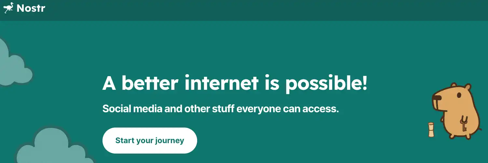

## අවශ්‍යතා: Umbrel ස්ථාපනය

Umbrel යනු විවෘත මූලාශ්‍ර වේදිකාවක් වන අතර එය ඔබට පහසුවෙන්ම Bitcoin යෙදුම් සහ අනෙකුත් සේවා ඔබේම පුද්ගලික සේවාදායකය මත සත්කාරක කිරීමට ඉඩ සලසයි. එය Bitcoin නෝඩ් සහ විකේන්ද්‍රීකෘත යෙදුම් ස්වයං-සත්කාරක කිරීම බොහෝමයක් සරල කරන සම්පූර්ණ-එකක්-මැදහත් විසඳුමකි.

සැමවිටම ඔබේ ස්ථාපන මාර්ගෝපදේශය අනුගමනය කර Umbrel ස්ථාපනය කර ඇති බව සහතික වන්න:

https://planb.network/tutorials/node/bitcoin/umbrel-8b0e3b5b-d3cf-4a1e-8bb8-1ad2db4dd848

## Nostr සඳහා හැඳින්වීම

**Nostr** යනු සමාජ ජාල සඳහා නිර්මාණය කරන ලද විවෘත, විකේන්ද්‍රීකරණ ජාල ප්‍රොටෝකෝලයකි. එහි නම _"Notes and Other Stuff Transmitted by Relays"_ යන වචන වලින් යුක්ත වේ. එය කවුරුන්ට හෝ JSON සිදුවීම් ලෙස කළමනාකරණය කරන පණිවිඩ (සටහන්) ප්‍රකාශයට පත් කිරීමට සහ මධ්‍යස්ථිත වේදිකාවකට වඩා රිලේ සේවාදායකයන් හරහා ඒවා ප්‍රචාරණය කිරීමට ඉඩ සලසයි. සෑම පරිශීලකයෙකුටම හඳුනාගැනීමක් ලෙස සේවය කරන සංකේතන යුගලයක් (පෞද්ගලික/පොදු) ඇත: පොදු යතුර (npub) පරිශීලකයා හඳුනාගනී, සහ පෞද්ගලික යතුර (nsec) පණිවිඩ සටහන් කිරීමට හැකියාව සලසයි. මෙම බෙදාහැරීමේ ව්‍යුහය නිසා, **Nostr සෙන්සර්ශිප් ප්‍රතිරෝධය** සහ විශාල වශයෙන් ව්‍යවස්ථානුකූලතාවය ලබා දේ: ඔබට විවිධ සේවාදායක භාවිතා කළ හැකි අතර, එකම සේවාදායකයකට යටත් නොවී, ඔබ කැමති තරම් රිලේ සම්බන්ධ කළ හැක.

සාරාංශයෙන්, Nostr යනු විකේන්ද්‍රීකරණය කළ සන්නිවේදන ප්‍රොටෝකෝලයක් වන අතර **සේවාදායකයන්** (පරිශීලක යෙදුම්) **ප්‍රතිචාරකයන්** (සේවාදායකයන්) හරහා සිදුවීම් යවයි සහ ලැබේ. මෙම ප්‍රොටෝකෝලය විශේෂයෙන්ම 2023 සිට Bitcoin ප්‍රජාව සමඟ ජනප්‍රිය වී ඇත, එහි විකේන්ද්‍රීකරණය සහ දත්ත ස්වයංපාලනයේ අගය නිසා.

**සටහන:** Nostr භාවිතා කිරීමට, ඔබේ පුද්ගලික යතුර (Nostr සේවාදායකයකින් හෝ කැපවූ දිගුවක් හරහා ජනනය කරන ලද) අවශ්‍ය වේ. **ඔබේ පුද්ගලික යතුර කිසිවිටෙක හුවමාරු නොකරන්න**, එය ඔබව නකල් කිරීමට ඕනෑම කෙනෙකුට ඉඩ සලසන බැවින්. එය ආරක්ෂිත ස්ථානයක තබා, ආරක්ෂිත යතුරු කළමනාකරණ මෙවලම් භාවිතා කරන්න (පහත උපදෙස් බලන්න).

## Umbrel යෙදුම් Nostr සඳහා

Umbrel ඔබේ පුද්ගලික නෝඩය මත Nostr හි සම්පූර්ණ වාසිය ලබා ගැනීමට ඒකාබද්ධ යෙදුම් පද්ධතියක් ලබා දේ. අපි ප්‍රධාන Nostr-සම්බන්ධ යෙදුම් භාවිතය විස්තර කිරීමට යන්නේ: **Nostr Relay**, **noStrudel**, **Snort** සහ **Nostr Wallet Connect**. එක් එක් යෙදුමක් විශේෂිත අවශ්‍යතාවක් සපුරාලයි: _Nostr Relay_ යනු **පෞද්ගලික රිලේ සර්වරයක්**, _noStrudel_ සහ _Snort_ යනු **Nostr ගනුදෙනුකරුවන්** (සටහන් කියවීම/ප්‍රකාශනය කිරීම සඳහා අතුරුමුහුණත්) වන අතර, _Nostr Wallet Connect_ යනු ඔබේ **Lightning පෝර්ට්ෆෝලියෝව** Nostr සමඟ සම්බන්ධ කිරීම සඳහා මෙවලමකි.

### Nostr Relay - Umbrel上的您的私人中继

**Nostr Relay** යනු ඔබේ නෝඩය මත ඔබේ **මම Nostr relay** ක් ක්‍රියාත්මක කිරීම සඳහා Umbrel හි නිල යෙදුමයි. ප්‍රධාන අරමුණ වන්නේ ඔබේ සියලු Nostr ක්‍රියාකාරකම් සජීවීව **උපස්ථ backup** කිරීම සඳහා **පෞද්ගලික** සහ විශ්වාසනීය relay එකක් තිබීමයි. වෙනත් වචන වලින් කියනවා නම්, මහජන relay වලට අමතරව මෙම පුද්ගලික relay එක භාවිතා කිරීමෙන්, ඔබේ සියලු සටහන්, පණිවිඩ සහ ප්‍රතිචාර නිවසට පිටපත් කර ඇති බව සහතික කරයි, සෙන්සර් කිරීමෙන් හෝ දත්ත අහිමිවීමෙන් ආරක්ෂා කරයි.

**ස්ථාපනය:** Umbrel යෙදුම් ගබඩාවේ (_සමාජ_) ප්‍රවර්ගයෙන් _Nostr Relay_ ස්ථාපනය කරන්න. එය ආරම්භ කළ විට, යෙදුම පසුබිමෙන් (ඩොකර් සේවාවක් ලෙස) ක්‍රියාත්මක වේ.

ඔබ එය Umbrel හරහා එහි Interface වෙබ් අතුරුමුහුණත දැක ගනු ඇත: එය මූලික තොරතුරු සහ, ඉහළ දකුණේ, ඔබේ රිලේ එකේ URL එක ලබා දේ, එය අනාගත භාවිතය සඳහා පිටපත් කළ යුතුය. සංකේතනය බොත්තමක් (ගෝල සංකේතය) ද ලබා දී ඇත.

**Umbrel රිලේ එකෙන් ප්‍රයෝජනයට ගන්න :

**ඔබේ Nostr සේවාදායකයට relay එක එකතු කරන්න:** ඔබේ සේවාදායක යෙදුම තුළ (උදාහරණයක් ලෙස iOS හි Damus, Android හි Amethyst, Umbrel හි Snort හෝ noStrudel, ආදිය), ඔබ පෙර පිටපත් කළ ඔබේ පුද්ගලික relay එකේ URL එක එකතු කරන්න. පෙරනිමි ලෙස, Umbrel relay එක **4848** වරාය මත සවන් දේ. ඔබ එය ස්ථානීය ජාලය මත ප්‍රවේශ වන්නේ නම්, මෙය මෙවන් URL එකක් ලබා දේ: `ws://umbrel.local:4848` (හෝ Umbrel හි ස්ථානීය IP එක භාවිතා කරන්න).

If you're using Tailscale (see below), you can even use the MagicDNS DNS alias (usually `umbrel` or an auto-generated name) to access it from anywhere, always on port 4848.

ඔබට Tor වඩාත් කැමති නම්, ඔබේ Umbrel හි .onion Address ලබාගෙන Tor-අනුකූල බ්‍රවුසරයක හෝ පාරිභෝගිකයක (Tor අංශය බලන්න) 4848 වරාය සමඟ භාවිතා කරන්න.

URL එක ඔබේ Nostr සේවාදායකයේ Relay වින්‍යාසයට එකතු කළ පසු, මෙම relay එකට සම්බන්ධ වන්න. ඔබේ සේවාදායකයේ Umbrel relay එක සම්බන්ධ වී ඇති බව (සාමාන්‍යයෙන් Green ලකුණක් හෝ සමාන ලකුණක් මඟින් දක්වා ඇත) ඔබට දැකිය යුතුය.

**ඉතිහාසය සමානුකූල කරන්න (විකල්ප)**: Umbrel හි _Nostr Relay_ හි Interface වෙබ් අඩවියේ, **ගෝලය** 🌐 අයිකනය (පිටුවේ ඉහළින්) ක්ලික් කරන්න. මෙම ක්‍රියාව ඔබේ Umbrel රිලේය් ඔබේ අනෙකුත් රිලේයන් (ඔබේ ගනුදෙනුකරු තුළ වින්‍යාස කළ) සමඟ සම්බන්ධ වීමට බල කරනු ඇත **ඔබේ පැරණි පොදු** ක්‍රියාකාරකම් ආයාත කිරීමට. මෙය ඔබ ප්‍රකාශයට පත් කළ හෝ පොදු රිලේයන් හරහා කියවූ අතීත සටහන් ද ඔබේ පෞද්ගලික රිලේය් මත බාගත කර ගබඩා කරන බව අර්ථය. සමානුකූල කිරීම සිදු වන තුරු කරුණාකර රැඳී සිටින්න.

**Nostr සාමාන්‍ය ලෙස භාවිතා කරන්න:** මෙතැන් සිට, ඔබ Nostr මත සිදු කරන ඕනෑම නව ක්‍රියාකාරකමක් (ප්‍රකාශිත සටහන්, ප්‍රතිචාර, සංකේතනය කළ පුද්ගලික පණිවිඩ, ආදිය) සාමාන්‍ය ලෙස මහජන රිලේ වෙත යොමු කෙරෙන අතර **ඔබගේ Umbrel රිලේ වෙත සමකාලීනව යොමු කෙරේ**. ඔබගේ Nostr සේවාදායකය නිසි ලෙස වින්‍යාස කර ඇති නම්, එය සෑම සිදුවීමක්ම සියලුම රිලේ වෙත (ඔබගේ රිලේ ඇතුළුව) යවනු ඇත. ඔබගේ පුද්ගලික රිලේ වාර්තාකාරී උපස්ථයක් ලෙස ක්‍රියා කරයි. තාවකාලික වෙන්වීමක් සිදුවුවහොත් පවා, ඔබගේ ගනුදෙනුකරුවන්ට පසුව මෙම රිලේ හරහා අතුරුදහන් දත්ත නැවත සමුද්‍රගත කිරීමට හැකි වනු ඇත. මෙය ඔබට ඔබගේ Nostr දත්ත සම්පූර්ණයෙන්ම පාලනය කිරීමට ඉඩ සලසයි.

පසුබිමෙන්, Umbrel හි _Nostr Relay_ විවෘත මූලාශ්‍ර **nostr-rs-relay** ව්‍යාපෘතිය (Rust ප්‍රොටෝකෝල ක්‍රියාත්මක කිරීම) මත පදනම්ව ඇත. එය සම්පූර්ණ Nostr ප්‍රොටෝකෝලය සහ විශාල සංඛ්‍යාත NIPs (NIP-01, 02, 03, 09, 11, 12, 15, 16, 20, 22, 26, 28, 33, ආදිය) සහය දක්වයි, ගනුදෙනුකරුවන් සමඟ උපරිම අනුකූලතාවය සහතික කරමින්.

### noStrudel - Nostr client for explorers

**noStrudel** යනු Nostr ජාලය විස්තරාත්මකව අවබෝධ කර ගැනීමට සහ පරීක්ෂා කිරීමට සුදුසු, බලශක්ති-පරිශීලක-භාවිතාකාරී Nostr වෙබ් සේවාදායකයකි. මෙය සිදුවීම් සහ රිලේ පරීක්ෂා කිරීම සඳහා සහ ප්‍රොටෝකෝලයේ උසස් විශේෂාංග සමඟ පරීක්ෂණය කිරීම සඳහා විශේෂිත විය හැකි සෙල්ලම් බිමකි. Interface ඉංග්‍රීසි භාෂාවෙන් සහ ස نسبتا තාක්ෂණික වන අතර, Nostr හි අභ්‍යන්තර ක්‍රියාකාරකම් පිළිබඳ උනන්දුවක් ඇති පළපුරුදු පරිශීලකයින් සඳහා ඉතා සුදුසු වේ.

**ස්ථාපනය:** _noStrudel_ Umbrel යෙදුම් අලෙවියෙන් (ප්‍රවර්ගය _සමාජ_) ස්ථාපනය කරන්න. එය ආරම්භ කළ පසු, ඔබේ Umbrel හි Address හි ඔබේ බ්‍රවුසරය හරහා ප්‍රවේශ විය හැක (උදාහරණයක් ලෙස `http://umbrel.local` හෝ එහි .onion/Tailscale හරහා, බාහිර ප්‍රවේශ අංශය බලන්න).

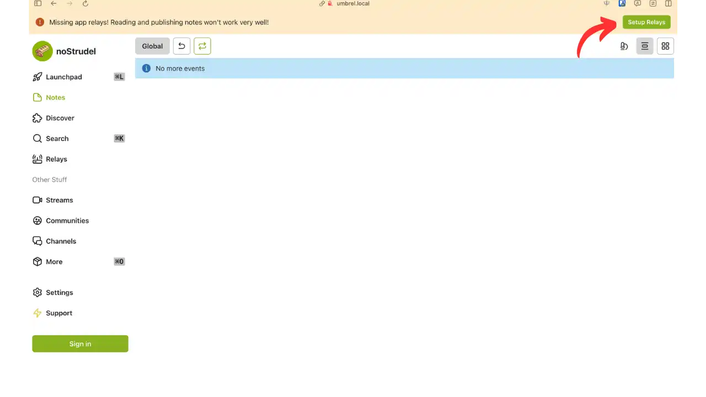

**රීලේ සකසන්න:** noStrudel විවෘත කරන විට, ඔබට ඉහළ දකුණු කෙළවරේ "Setup Relays" බොත්තමක් පෙනේ. ඔබේ රීලේ සකසන්න එය ක්ලික් කරන්න.

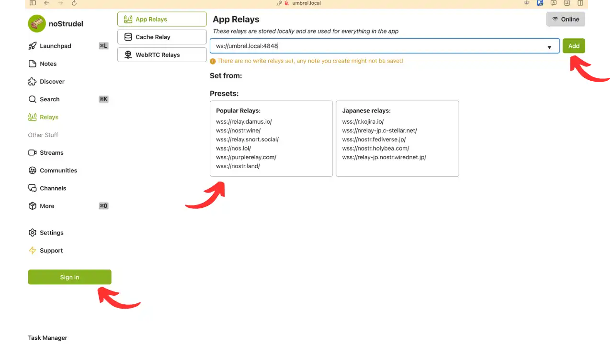

Na tej strani prilepite URL vašega Umbrel releja, ki ste ga prej kopirali. Dodate lahko tudi druge releje, ki jih privzeto predlaga aplikacija. Ko konfigurirate svoje releje, kliknite na "Prijava" v spodnjem levem kotu za nadaljevanje.

**Connection:** noStrudel vam ponuja več možnosti povezave. V našem primeru bomo izbrali "Zasebni ključ" in prilepili vaš prej ustvarjeni Nostr zasebni ključ. Če ključa še nimate, lahko namestite razširitev [Nostr Connect] (https://chromewebstore.google.com/detail/nostr-connect/ampjiinddmggbhpebhaegmjkbbeofoaj) za ustvarjanje in/ali shranjevanje vaših Nostr ključev ter tako varnejše komuniciranje z različnimi Nostr aplikacijami.

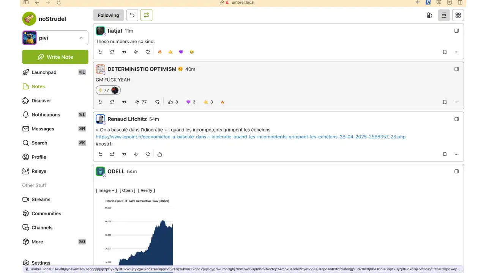

සම්බන්ධ වූ පසු, ඔබට Nostr හරහා ඔබේ සටහන් බෙදා ගැනීමට noStrudel භාවිතා කළ හැක. Interface ඔබට ප්‍රවේශය ලබා දේ:

- Nostr පූර්ණ පුවරුව සටහන් කාලරේඛාව, දැනුම්දීම්, පණිවිඩ, පැතිකඩ සෙවීම සමඟ
- රෙලේ කළමනාකරණය සහ සම්බන්ධතාවයේ තත්ත්වය
- උත්සව සහ ඒවායේ JSON අන්තර්ගතය පරීක්ෂා කිරීම සඳහා උසස් මෙවලම්
- කාලරේඛා පෙරහන් සහ PIN සඳහා වින්‍යාස විකල්ප

**උපදෙස්:** _noStrudel_ මත, ඔබට _කාලරේඛා පෙරහන්_ සකස් කළ හැකි අතර විවිධ _NIPs (Nostr Implementation Possibilities)_ පරීක්ෂා කළ හැක. උදාහරණයක් ලෙස, NIP-05 (විකේන්ද්‍රීකෘත හඳුනාගැනීම්) සඳහා සහය පරීක්ෂා කරන්න හෝ නවතම විශේෂාංග පරීක්ෂා කරන්න. මෙය _noStrudel_ පාලිත පරිසරයක අත්හදා බැලීම සඳහා විශිෂ්ට මෙවලමක් කරයි.

### Snort - Umbrel上的现代Nostr客户

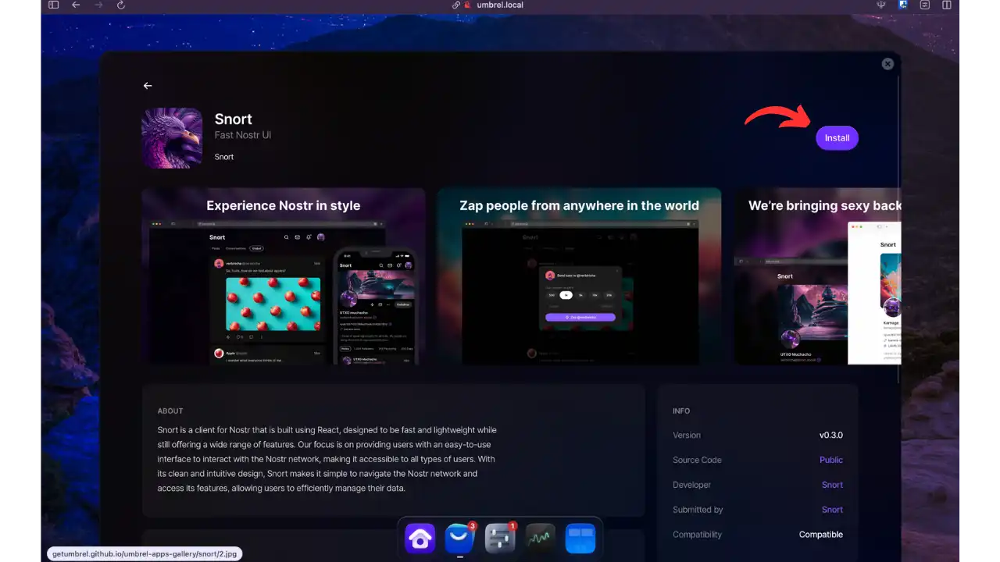

**Snort** යනු Umbrel හි ලබා ගත හැකි තවත් Nostr වෙබ් පාරිභෝගිකයෙකි, නවීන, වේගවත් සහ අවුල් රහිත **Interface** එකක් decentralized සමාජ ජාලය සමඟ අන්තර්ක්‍රියා කිරීමට ලබා දේ. බලශක්තිමත් පරිශීලකයින් ඉලක්ක කරගත් noStrudel ට වඩා, _Snort_ කාර්ය සාධනය අත්හැර නොමැතිව භාවිතය සරල කිරීම අරමුණු කරයි. එය React හි නිර්මාණය කර ඇති අතර, සම්භාව්‍ය සමාජ ජාලයන්ට සමාන සුපිරි UX එකක් ලබා දෙන අතර, එය දෛනික භාවිතය සඳහා සුදුසු වේ.

**ස්ථාපනය:** _Snort_ ස්ථාපනය කරන්න Umbrel යෙදුම් අලෙවියෙන් (ප්‍රවර්ගය _සමාජ_).

Snort odprete, boste v spodnjem levem kotu videli gumb »Register«.

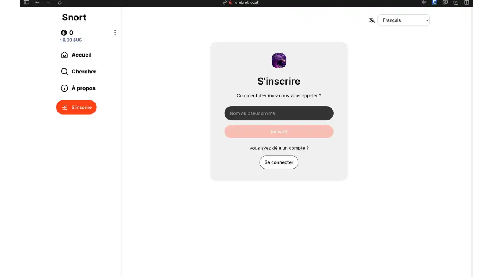

ඔබට ලියාපදිංචි වීමට හෝ දැනට පවතින ගිණුමකට සම්බන්ධ වීමට තේරීමට හැක (මෙම උපකාරිකාව සඳහා අපි කරන්නට යන්නේ එයයි).

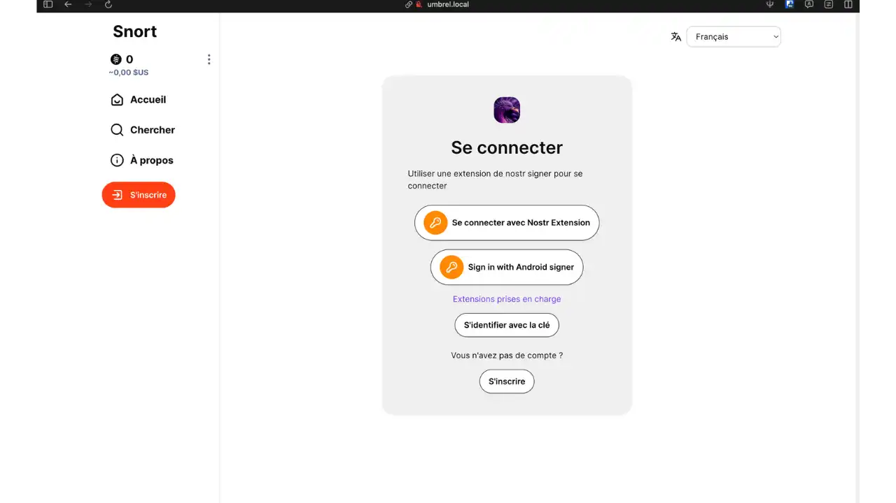

Snort več povezovalnih metod ponuja. Uporabite lahko prej nameščeno razširitev Nostr Connect ali druge razpoložljive metode. Ko se povežete, boste lahko aplikacijo uporabljali v celoti.

Interface _Snort_ වෙතින් ලබා දේ :

- **පොස්ට්/කතාබස්/ගෝලීය** ප්‍රදර්ශනයක් ඔබේ සටහන්, තීරුකථන, හෝ ගෝලීය පෝෂණය අතර සංචාරය කිරීමට
- **නොටිෆිකේෂන්**, **පණිවිඩ** (DM), **සොයන්න**, **පැතිකඩ**, ආදිය සඳහා ටැබ්.
- A **+** ali _Write_ gumb za objavo nove opombe
- **දායකතා (අනුගමනය කිරීම)** සහ **ලැයිස්තු** කළමනාකරණය
- රීලේ කළමනාකරණ මෙනුව, රීලේ එකතු/ඉවත් කිරීම සහ ඒවායේ ලබාගත හැකි බව පසුපසින් හඹා යාම.

**ප්‍රතිඋපදෙස් කළ රිලේ වින්‍යාසය:** ඔබේ Umbrel රිලේ එකතු කිරීමට, සැකසුම් - රිලේ වෙත යන්න. Snort හි රිලේ ලැයිස්තුවේ ඔබේ රිලේ URL (`ws://umbrel:4848` හෝ ඔබේ වින්‍යාසය අනුව වෙනත් URL) ඇතුළත් කරන්න. මෙසේ, Snort ඔබේ පුද්ගලික රිලේ මත ඔබේ සටහන් ප්‍රකාශයට පත් කරනු ඇත, මහජන ඒවාට අමතරව.

### Nostr Wallet Connect - ඔබේ Lightning Wallet Nostr වෙත සම්බන්ධ කරන්න

**Nostr Wallet Connect (NWC)** යනු ඔබේ **Umbrel (Lightning)** නියමක Nostr අනුකූල යෙදුම් සමඟ සම්බන්ධ කර Lightning ගෙවීම් කිරීමට (උදාහරණයක් ලෙස, අන්තර්ගතය "අනුරාගය" කිරීම සඳහා එම කුඩා ගෙවීම් _zaps_ යැවීම) යෙදුමකි. මෙම උපදෙස් මාලාවේදී, noStrudel ඔබේ Lightning නියමක සම්බන්ධ කර ගෙවීම් සෘජුවම Interface වෙතින් සිදු කරන ආකාරය අපි බලන්නෙමු.

**ස්ථාපනය සහ වින්‍යාසය:**

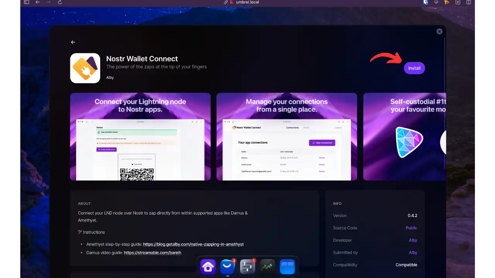

Umbrel මත Alby store වෙතින් _Nostr Wallet Connect_ ස්ථාපනය කරන්න.

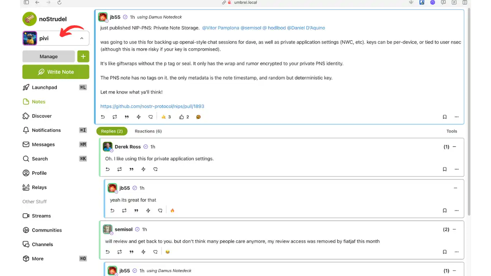

noStrudel හි, ඉහළ දකුණු කෙළවරේ ඇති ඔබේ පැතිකඩ මත ක්ලික් කර "manage" බොත්තම මත ක්ලික් කරන්න.

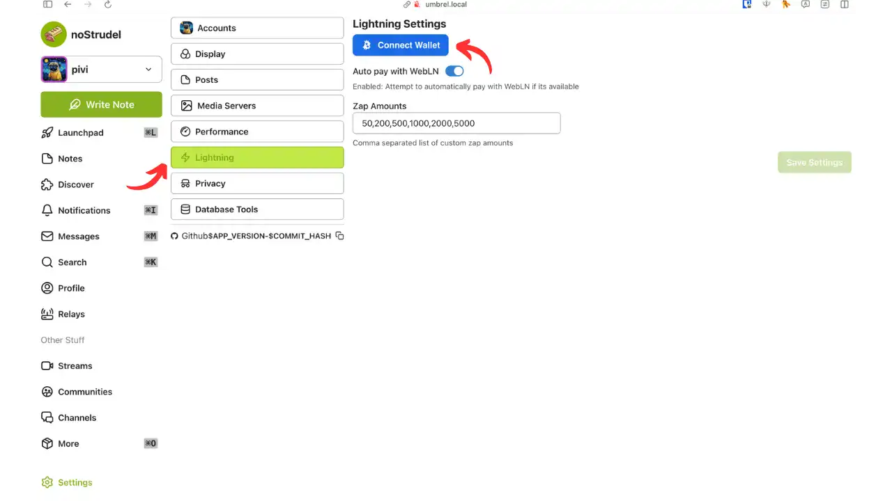

"Lightning" මත ක්ලික් කර "connect Wallet" තෝරන්න.

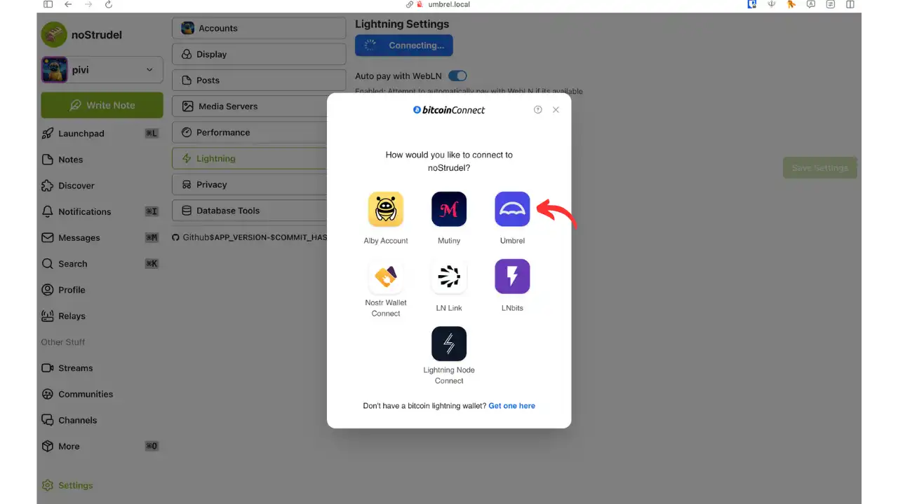

ලබා ගත හැකි සම්බන්ධතා විකල්ප අතර, "Umbrel" තෝරන්න.

"Connect" මත ක්ලික් කිරීමෙන් ඔබේ Umbrel Nostr Wallet Connect සැසියට ස්වයංක්‍රීයව යළියොමුවනු ඇත.

Nostr Wallet සම්බන්ධ පිටුවේ, ඔබට :

   - ඔබේ උපරිම අයවැය නිර්වචනය කරන්න
   - අවසරයන් වලංගු කරන්න
   - සම්බන්ධතාවය සඳහා කල් ඉකුත් වීමේ වේලාවක් සකසන්න

"connect" මත ක්ලික් කර අවසන් කරන්න.

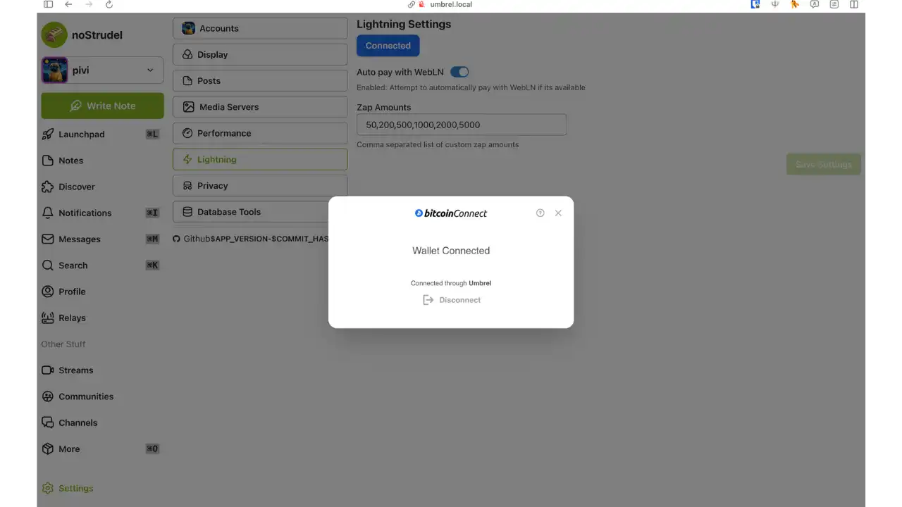

ඔබට තහවුරු කිරීමේ පණිවිඩයක් සමඟ noStrudel වෙත යළියොමුවී ඇත: දැන් ඔබට ඔබේ Wallet/LND නියුඩ් මගින් සම්පුර්ණ ලෝකය විදුලි සංඛ්‍යාත කිරීමට හැකිය!

NWC සඳහා ස්තුතියි, ඔබේ **Nostr හරහා Lightning ගෙවීම්** (පොස්ට් සම්මාන සඳහා zaps, _Value for Value_ ගෙවීම්, ආදිය) **ඔබේම නියුඩ් එකෙන්** ආරම්භ වේ. ඔබට දැන් ඔබේ ගනුදෙනු බාහිර සේවා හරහා මාර්ගගත කිරීමට හෝ ඔබේ දුරකථනයෙන් QR ස්කෑන් කිරීමට අවශ්‍ය නැත. පරිශීලක අත්දැකීම දැඩි ලෙස වැඩි දියුණු වන අතර, _අත්තිකාරම් නොමැති_ සහ පෞද්ගලිකත්වයට හිතකාමී වේ.

If you want to know how to set up your own Lightning node on Umbrel, I recommend you check out this other comprehensive tutorial:

https://planb.network/tutorials/node/lightning-network/umbrel-lnd-b12e0b5b-12ff-45f1-978e-62f4b4a8ba16

## උසස් වින්‍යාසය සහ ආරක්ෂාව

Umbrel සහ Nostr එකට උසස් මට්ටමේ භාවිතා කිරීම සඳහා **ආරක්ෂාව** සහ **සම්බන්ධතාවය** පිළිබඳ විශේෂ අවධානයක් යොමු කළ යුතුය. ඔබේ වින්‍යාසය ආරක්ෂා කරමින්, ඔබ සිටින ඕනෑම තැනකින් එය ඉතාමත් කාර්යක්ෂමව ප්‍රවේශ වීම සඳහා කිහිපයක් උපදෙස් මෙන්න.

### බාහිර ප්‍රවේශය ආරක්ෂා කරන්න: Tor සහ Tailscale

ආරක්ෂක හේතු මත, ඔබේ Umbrel පෙරනිමි ලෙස ප්‍රදේශීය ජාලය මත (සහ Tor හරහා) පමණක් ප්‍රවේශ විය හැක. නිවසින් පිටත Nostr සමඟ අන්තර්ක්‍රියා කිරීමට, ඔබට විකල්ප විසඳුම් දෙකක් ඇත: **Tor** (onion ජාලය හරහා අනන්‍ය ප්‍රවේශය) සහ **Tailscale** (පෞද්ගලික VPN ජාලය).

- Tor මඟින් ප්‍රවේශය:** Umbrel ස්වයංක්‍රීයව **Tor සේවාවක් (.onion)** එහි Interface වෙබ් සහ යෙදුම් සඳහා වින්‍යාස කරයි. මෙය ඔබට Interface Umbrel (_noStrudel_ හෝ _Snort_ ඇතුළුව) ඕනෑම තැනක සිට, Tor බ්‍රවුසරය භාවිතා කරමින්, ඔබේ පොදු IP අනාවරණය නොකර ප්‍රවේශ විය හැකි බව අර්ථ දක්වයි. _ඔබේ උපාංගය අන්තර්ජාලයට අනාවරණය නොකර, ඔබේ ස්ථානීය ජාලයෙන් පිටත සිට ඔබේ Umbrel සේවා ප්‍රවේශ වීමට Tor භාවිතා කරයි ([ඔබේ පද්ධතියේ Tor පිහිටුවීම - මාර්ගෝපදේශ - Umbrel ප්‍රජාව](https://community.umbrel.com/t/setup-tor-on-your-system/7509#:~:text=Official%20website%3A%20https%3A%2F%2Fwww))._ මෙම විකල්පය භාවිතා කිරීමට, Umbrel සැකසුම් වෙත ගොස් ඔබේ Umbrel හි .onion URL ලබා ගන්න (හෝ සපයන ලද QR කේතය ස්කෑන් කරන්න). Tor බ්‍රවුසරයක, මෙම .onion Address වෙත ප්‍රවේශ වන්න: ඔබට ස්ථානීයව ඇති Interface එකම ලැබෙනු ඇත. එවිට ඔබේ Nostr යෙදුම් නිවසේ සිටින ආකාරයටම භාවිතා කළ හැක.

**Tor හරහා Nostr රිලේ:** ඔබේ Nostr රිලේ ඔබේ ගනුදෙනුකරුවන් (හෝ අනුමත මිතුරන්) විසින් Tor හරහා ප්‍රවේශ විය හැකි ලෙස අවශ්‍ය නම්, මෙය සම්භවය. Umbrel සෘජුවම රිලේගේ .onion Address ලබා නොදෙයි, නමුත් එය 4848 වරාය මත ක්‍රියාත්මක වන බැවින්, ඔබට පහත ක්‍රමය භාවිතා කළ හැක:

    - Uporabite UI Umbrel's .onion Address in konfigurirajte svojega odjemalca za povezavo prek tega Interface (nepraktično za WebSocket),

    - හෝ** 4848 වරාය වෙනම පියාසැරිය සේවාවක් ලෙස අනාවරණය කරන්න. මෙය Umbrel හි Tor වින්‍යාසය සමඟ කෙඳි ගැසීම අවශ්‍ය වේ (SSH සමඟ සුවපහසු දියුණු පරිශීලකයින් සඳහා වෙන් කර ඇත). විකල්පව, Umbrel වෙත යළියොමුවන වෙනත් සේවාදායකයක **Tor සංගමය** සලකා බලන්න: කෙසේ වෙතත්, පුද්ගලික භාවිතය සඳහා, Tailscale භාවිතා කිරීම පහසුම වේ.

- Dostop prek Tailscale:** [Tailscale](https://tailscale.com/) je rešitev za mesh VPN, ki ustvari navidezno zasebno omrežje med vašimi napravami in Umbrel. Prednost: deluje, kot da ste na LAN, vendar prek interneta, šifrirano in brez zapletene konfiguracije. **Tailscale dodeli vašemu Umbrel fiksni IP in zasebno ime domene, ne glede na njegovo omrežno lokacijo ([Tailscale | Umbrel App Store](https://apps.umbrel.com/app/tailscale#:~:text=Tailscale%20is%20zero%20config%20VPN,reviewed%20and%20trusted%20standard))**. V praksi, ko enkrat namestite Tailscale na Umbrel (iz Umbrel App Store, kategorija _Networking_) **in** na vaše naprave (mobilne, PC...), boste lahko dosegli Umbrel prek Address kot `100.x.y.z` (Tailscale IP) ali imena kot `umbrel.tailnet123.ts.net`.

Nostr_ සඳහා, Tailscale ඉතා ප්‍රයෝජනවත් වේ: ඔබේ ජංගම දුරකථනය, එය Tailscale සක්‍රීය කර ඇති නම්, `ws://umbrel:4848` (MagicDNS සඳහා ස්තූතියි) හෝ Tailscale IP සහ port 4848 වෙත සෘජුවම සම්බන්ධ විය හැක relay භාවිතා කිරීමට. Damus හෝ Amethyst වැනි ගනුදෙනුකරුවන් ඔබේ Umbrel එකම ස්ථානීය ජාලයේ ඇති මෙන් දැකිය හැක. **උපදෙස්:** IP මතක තබා ගැනීම වෙනුවට `umbrel` යන hostname භාවිතා කිරීමට Tailscale හි **MagicDNS** විකල්පය සක්‍රීය කරන්න. මෙය ඔබ ගමන් කරන විටත් ඔබේ relay වෙත මෘදු සම්බන්ධතාවයක් සහතික කරයි ([Nostr Relay | Umbrel App Store](https://apps.umbrel.com/app/nostr-relay#:~:text=client%20%28e,That%27s%20it%21%20Your%20past)).

තවද, Tailscale ඔබට Interface Umbrel (ඒ අනුව _noStrudel/Snort_ වෙබ් ගනුදෙනුකරුවන්) සරල බ්‍රවුසරයක් භාවිතයෙන් පෞද්ගලික IP හෝ පවරා ඇති වසම නාමය හරහා ප්‍රවේශ වීමට ඉඩ සලසයි. Tor බ්‍රවුසරයක් අවශ්‍ය නොවේ, සහ දත්ත මාරු වේගයන් සාමාන්‍යයෙන් Tor ජාලය හරහා වඩා හොඳය.

**සටහන: Tor සහ Tailscale එකිනෙකට විරුද්ධ නොවේ. ඔබට Tor ක්‍රියාත්මක තබා ගත හැකිය අනන්‍යතාවය රහිත ප්‍රවේශය හෝ විශේෂිත සේවා සඳහා, සහ Tailscale භාවිතා කළ හැකිය දිනපතා පදනමක එහි සරලභාවය සඳහා. දෙකේම අවස්ථාවලදී, ඔබේ රවුටරයේ වරාය විවෘත කිරීමට අවශ්‍ය නොවේ, එය ආරක්ෂාව ශක්තිමත් කරයි.

### ඔබේ Nostr රිලේ ආරක්ෂා කිරීම (ප්‍රතිපාදිත ක්‍රියාමාර්ග)

Če gostite Nostr relej na Umbrel, še posebej v naprednem kontekstu, se prepričajte, da upoštevate nekaj dobrih praks:

- පෞද්ගලික හෝ සීමාසහිත රිලේ:** පෙරනිමි ලෙස, ඔබේ Umbrel රිලේ පෞද්ගලික (පොදු වශයෙන් ප්‍රකාශයට පත් නොකෙරේ) වන අතර, ඔබ එය Tailscale හෝ ඔබේ LAN හරහා පමණක් ප්‍රවේශ වන්නේ නම්, එය අන් අය සඳහා ප්‍රවේශය නොලැබේ. ** සබැඳිය රහසිගතව තබා ගන්න ** ඔබට ස්වේච්ඡාවෙන් අනෙකුත් පරිශීලකයින් සත්කාරක කිරීමට අවශ්‍ය නොමැති නම්, එය පොදු Nostr ජාලවල විකාශය නොකරන්න, එය සම්පූර්ණයෙන්ම වෙනත් ගැටලුවක් (සංශෝධනය, පළල, ආදිය) වේ. පෞද්ගලික භාවිතය සඳහා, ඔබට සහ අවශ්‍ය නම්, විශ්වාසනීය මිතුරන් සහ පවුලේ සාමාජිකයින් කිහිප දෙනෙකුට ප්‍රවේශය සීමා කිරීමට අපි නිර්දේශ කරමු.

- Whitelist / Auth**: nostr-rs-relay izvedba podpira **NIP-42** mehanizem overjanja ter _sezname dovoljenih_ javnih ključev. Z omogočanjem teh možnosti lahko omejite svoj relej tako, da **sprejema samo dogodke, podpisane z določenimi ključi (vašimi)**, ali pa morajo stranke overiti za objavo. nastavitev tega zahteva urejanje `config.toml` konfiguracijske datoteke releja v Umbrel (prek SSH v Docker vsebniku)._ To je napredna manipulacija, vendar lahko na primer navedete dovoljene oglase (`pubkey_whitelist`). Na ta način, tudi če nekdo odkrije vaš relej, ne bo mogel tam ničesar objaviti, če ni na seznamu.

- යාවත්කාලීන කිරීම් සහ නඩත්තු කිරීම:** ඔබේ Umbrel සහ _Nostr Relay_ යෙදුම යාවත්කාලීනව තබා ගන්න. යාවත්කාලීන කිරීම් දක්ෂතා වැඩි දියුණු කිරීම් (උදාහරණයක් ලෙස, හොඳ සපැමි හසුරුවීම) සහ ආරක්ෂක නිවැරදි කිරීම් අඩංගු විය හැක. Umbrel මත, _Nostr Relay_ සඳහා යාවත්කාලීන කිරීම් සඳහා යෙදුම් අලෙවිය නිතර පරීක්ෂා කරන්න, සහ අවශ්‍ය පරිදි ඒවා යෙදවන්න.

- Nadzor in omejitve:** Spremljajte, kako se uporablja vaš rele. Če ga odprete drugim, spremljajte obremenitev (shranjevanje CPU/RAM) na vašem Umbrelu, saj lahko rele hitro nabere veliko podatkov. nostr-rs-relay ponuja nastavljive **omejitve hitrosti in shranjevanja** (`limits` v konfiguraciji, npr. število dogodkov na sekundo, največja velikost dogodka, čiščenje starih dogodkov...). Za zasebno uporabo verjetno ne boste potrebovali spreminjati teh nastavitev, vendar bodite pozorni, da ti parametri obstajajo, če jih potrebujete ([nostr-rs-relay/config.toml at master - scsibug/nostr-rs-relay - GitHub](https://github.com/scsibug/nostr-rs-relay/blob/master/config.toml#:~:text=)).

- Nostr යතුරු ආරක්ෂා කිරීම:** මෙම ලක්ෂ්‍යය දැනටමත් සඳහන් කර ඇත, නමුත් එය අත්‍යවශ්‍ය වේ: ඔබට සම්පූර්ණයෙන් විශ්වාස නොවන Interface එකක ඔබේ Nostr පෞද්ගලික යතුරු කිසිවිටෙකත් ඇතුළත් නොකරන්න. එහි වෙනුවට, සංචාරක උපාංග හෝ බාහිර උපාංග (වෙනම දුරකථන上的 Nostr _signers_ වැනි) භාවිතා කර සංවේදී ක්‍රියාකාරකම් අත්සන් කරන්න. Umbrel මත, ඔබේ වෙබ් ගනුදෙනුකරුවන් _Snort_ සහ _noStrudel_ වැනි ඔබේ රහස්‍ය යතුර නොදැන, NIP-07 හරහා ක්‍රියා කරනු ඇත. සුවපහසුකම සහ ආරක්ෂාව එකට ගැළපෙන මෙම අවස්ථාවෙන් ප්‍රයෝජන ගන්න.

මෙම උපදෙස් අනුගමනය කිරීමෙන්, ඔබේ Umbrel නියමකය Nostr සමඟ ඒකාබද්ධ කිරීම ශක්තිමත් **සහ** ආරක්ෂිත වනු ඇත. ඔබට සම්පූර්ණ පරිසරයක් ලැබෙනු ඇත: Lightning ගෙවීම් සඳහා Bitcoin නියමකය, දත්ත ස්වයංපාලනය සඳහා පුද්ගලික Nostr රිලේ එකක්, සහ මෙම නව විකේන්ද්‍රීකෘත සමාජ ජාලය නාවිගේෂණය කිරීමට ඉහළ කාර්ය සාධන Nostr වෙබ් පාරිභෝගිකයන්. Umbrel සමඟ Nostr සොයා බැලීමේ ආනන්දය ලබා ගන්න!