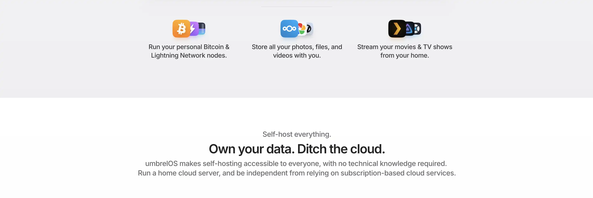
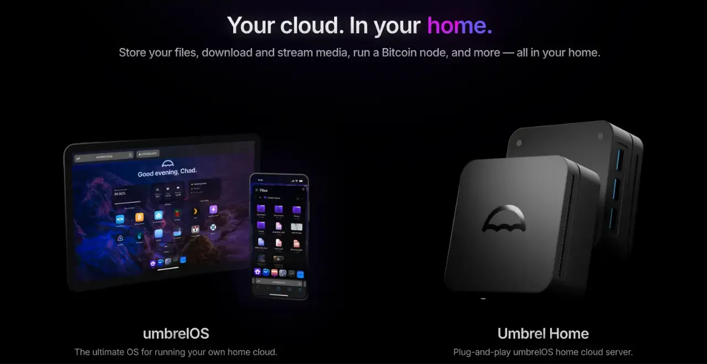
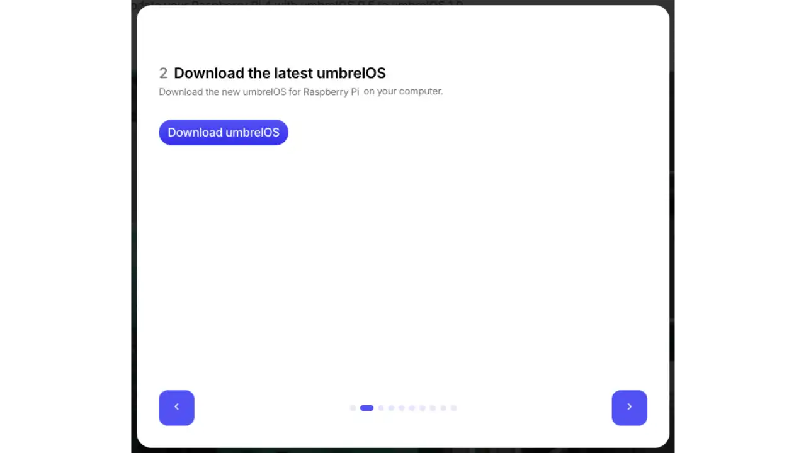
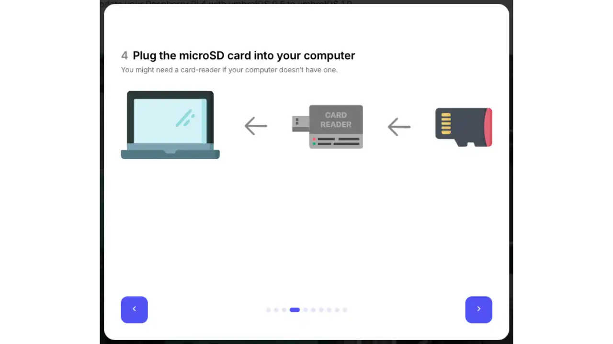
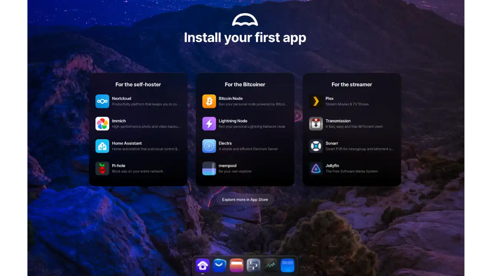
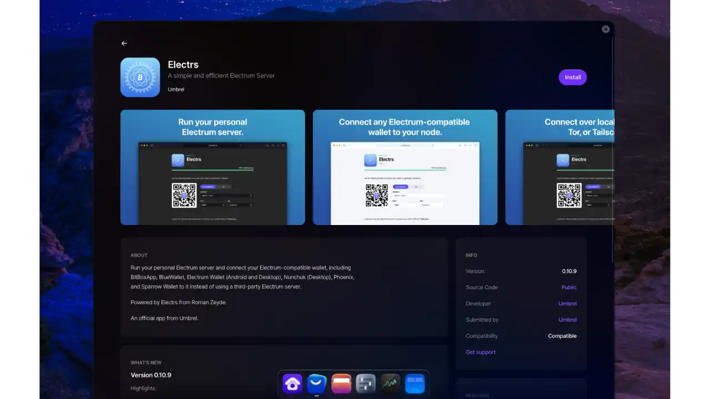
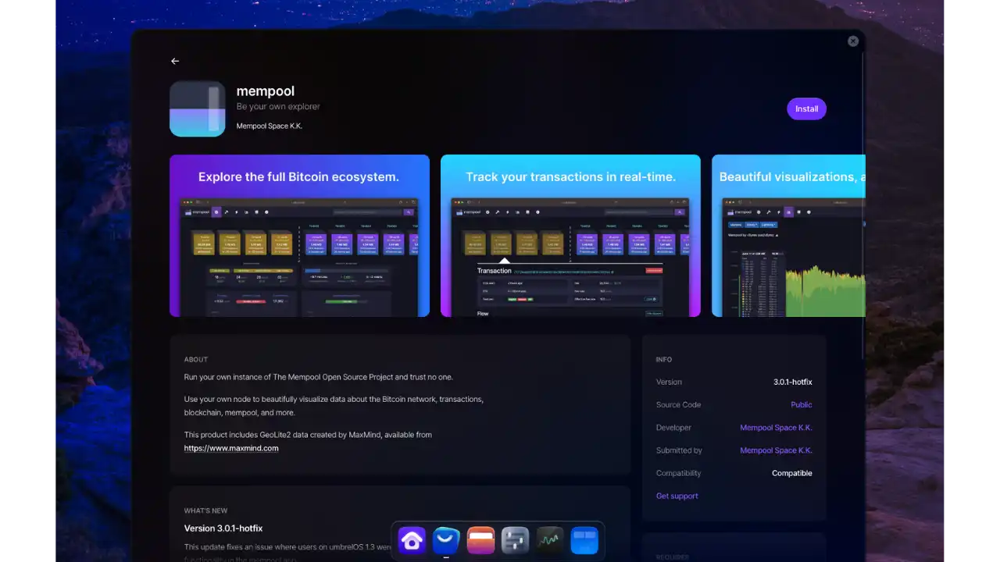
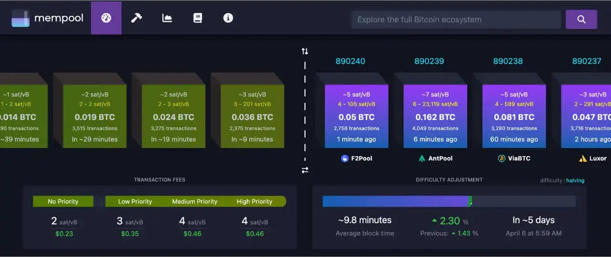
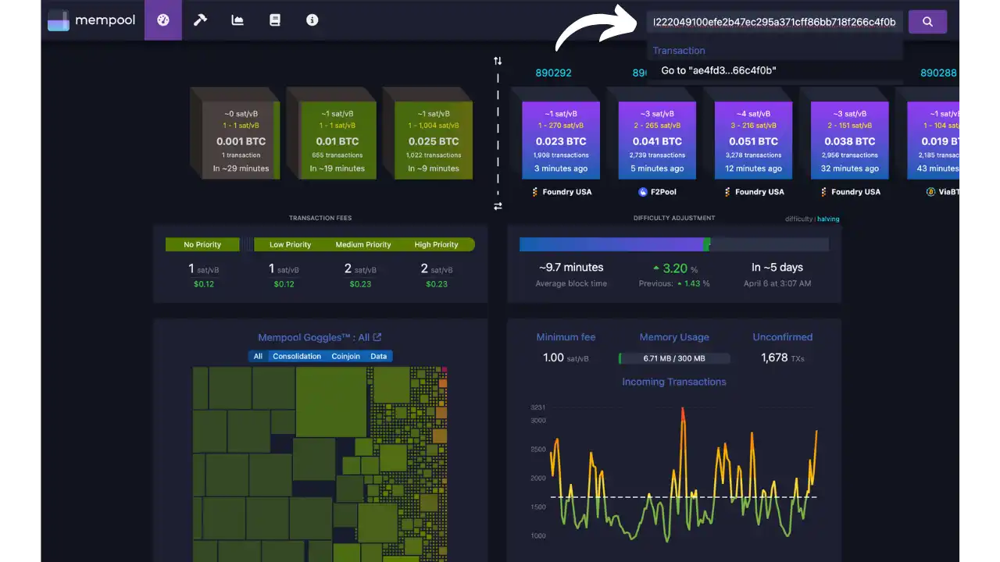
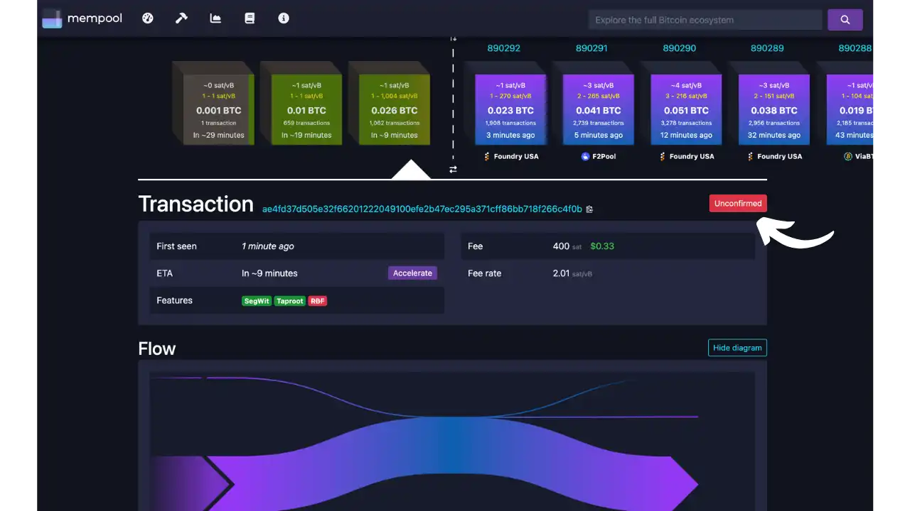

## පෙරවදන

### Bitcoin නියමිතය කුමක්ද?

Bitcoin නියුඩ් එකක් යනු Bitcoin මූලික මෘදුකාංගය හෝ විකල්ප සේවාදායකය ක්‍රියාත්මක කිරීමෙන් Bitcoin ජාලයට සහභාගී වන පරිගණකයකි. එහි භූමිකාව ජාලයේ ක්‍රියාකාරීත්වය සහ ආරක්ෂාව සඳහා අත්‍යවශ්‍ය වේ:

- Blockchain storage**: Blockchain Bitcoin සම්පූර්ණ, යාවත්කාලීන පිටපතක් පවත්වාගෙන යයි
- ගනුදෙනු සත්‍යාපනය**: ප්‍රොටෝකෝල නීති අනුව සෑම ගනුදෙනුවක් සහ අවරෝධයක්ම සත්‍යාපනය කරයි
- මाहितිය ප්‍රචාරණය**: නව ගනුදෙනු සහ අවරෝධ අනෙකුත් නෝඩ් සමඟ බෙදා හදා ගනී
- සමගතත්වය-ගොඩනැගීම**: ජාල නීති වල යෙදුමට දායක වේ

ඔබේම Bitcoin නියමිතය ක්‍රියාත්මක කිරීම මූල්‍ය ස්වයංපෝෂිතතාවය කරා වැදගත් පියවරක් වන අතර, කිහිපයක් වැදගත් ප්‍රතිලාභ ලබා දේ:

- රහස්‍යතාව**: ඔබේ ගනුදෙනු තෙවන පාර්ශවයන්ට ඔබේ තොරතුරු හෙළි නොකර බෙදා ගන්න
- සෙන්සර් කිරීමට එරෙහිව**: Bitcoin භාවිතා කිරීමෙන් ඔබව නවත්වීමට කිසිවෙකුට නොහැක
- ස්වාධීන සත්‍යාපනය**: ඔබේ ගනුදෙනු සත්‍යාපනය කිරීමට අනෙකුත් පුද්ගලයන්ගේ නෝඩ් විශ්වාස කිරීමට අවශ්‍ය නැත
- සමගි ගොඩනැගීම**: Bitcoin ජාල නීති අයදුමට දායක වන්න
- ජාල සහයෝගය**: ජාල බෙදාහැරීම සහ විකේන්ද්‍රීකරණය තුළ සක්‍රීය සහභාගිවන්න

### Umbrel: Bitcoin නියමකය ක්‍රියාත්මක කිරීම සඳහා සරල විසඳුමක්

Umbrel යනු විවෘත මූලාශ්‍ර මෙහෙයුම් පද්ධතියක් වන අතර එය Bitcoin නියුඩ් එකක් ස්ථාපනය කිරීම සහ කළමනාකරණය කිරීම සරල කරයි. එය ඔබේ පරිගණකය පුද්ගලික සහ පෞද්ගලික ගෘහ සේවාදායකයකට පරිවර්තනය කරයි, පහසුවෙන් සත්කාරකත්වය ලබා දීමේ හැකියාව ලබා දේ:

- Bitcoin නියමිතය
- Bitcoin අත්‍යවශ්‍ය යෙදුම් (Electrs, Mempool.space)
- अन्य व्यक्तिगत सेवाएँ (क्लाउड स्टोरेज, स्ट्रीमिंग, वीपीएन, आदि)

Umbrel Interface සමඟ, එහි සුමට සහ අත්කළ හැකි Interface පරිශීලක අතුරුමුහුණත, සියලු දෙනාට ස්වයං-සත්කාරක සේවා ප්‍රවේශය ලබා දෙන අතර, ඔබේ දත්ත පිළිබඳ සම්පූර්ණ පාලනය තබා ගනී.

## Umbrel ස්ථාපන විකල්ප

Umbrel ponuja dva glavna načina uporabe njihove rešitve: možnost na ključ (Umbrel Home) in brezplačno odprtokodno različico (UmbrelOS).

### Umbrel Home: සම්පූර්ණ විසඳුම

Umbrel Home je vnaprej konfiguriran domači strežnik, posebej zasnovan za optimalno izkušnjo. Ta vse-v-enem strojna rešitev vključuje:

**හාර්ඩ්වෙයාර් විශේෂාංග**

- ඉහළ කාර්ය සාධන පරිපාලකය ස්වයං-සත්කාරකය සඳහා උපරිම කළා ඇත
- පූර්ව ස්ථාපිත අධිවේගී SSD ගබඩා කිරීම
- නිහතමානී ශීතකරණ පද්ධතිය
- සංක්ෂිප්ත, සුන්දර නිර්මාණය
- ඒකාබද්ධ USB සහ ඊතර්නෙට් වරාය

**අපුරු වාසි**

- ප්ලග්-එන්ඩ්-පේ ස්ථාපනය: ප්ලග් කරන්න සහ යන්න
- ප්‍රිමියම් සහයෝගය සමඟ කැපවූ සහය.
- ගැරන්ටි කරන ලද ස්වයංක්‍රීය යාවත්කාලීන කිරීම්
- ਇੰਟੀਗ੍ਰੇਟਡ ਮਾਈਗ੍ਰੇਸ਼ਨ ਵਿਜ਼ਾਰਡ
- පූර්ණ දෘඩාංග වගකීම
- සියලු ක්‍රියාකාරිතා සඳහා සම්පූර්ණ සහය

**මිල**: €399 (මිල කාලය අනුව වෙනස් විය හැක)

### UmbrelOS: odprtokodna različica

UmbrelOS යනු Umbrel මෙහෙයුම් පද්ධතියේ නොමිලේ, විවෘත මූලාශ්‍ර අනුවාදයයි. මෙම ව්‍යවහාරික විසඳුම ඔබේම දෘඩාංග භාවිතා කරමින් Umbrel හි මූලික විශේෂාංග වලින් ප්‍රයෝජන ලබා ගැනීමට ඉඩ සලසයි.

**ප්‍රතිලාභ**

- පූර්ණයෙන්ම නොමිලේ
- විවෘත, සත්‍යපිත මූලාශ්‍ර කේතය
- Izbira svobode
- Napredne možnosti prilagajanja

**සහාය දක්වන වේදිකා**

- Raspberry Pi 5: ජනප්‍රිය සහ අලභ්‍ය වා සමුදා විසඳුමක්
- X86 පද්ධති: සම්මත පීසී හෝ සේවාදායකයන් සඳහා
- වර්චුවල් යන්ත්‍රය: පවතින යටිතල පහසුකම් මත පරීක්ෂා කිරීම සඳහා හෝ භාවිතා කිරීම සඳහා

**සීමාකිරීම්

- සමූහ සහය පමණක්
- Umbrel Home සඳහා වෙන් කර ඇති කිහිපයක් උසස් විශේෂාංග
- තවත් තාක්ෂණික ආරම්භක වින්‍යාසය
- කාර්ය සාධනය තෝරාගත් දෘඩාංග මත රඳා පවතී

මෙම අනුවාදය සඳහා ඉතා සුදුසුය:

- තාක්ෂණික පරිශීලකයින්
- Tisti, ki že imajo združljivo opremo
- මිනිසුන්ට ඉගෙන ගැනීමට සහ පරීක්ෂා කිරීමට අවශ්‍යයි
- ප්‍රාග්ධකයින් ව්‍යාපෘතියට දායක වීමට කැමති නම්

නිල ස්ථාපන සබැඳි :

- [රැස්පබෙරි පයි 5 මත ස්ථාපනය](https://github.com/getumbrel/umbrel/wiki/Install-umbrelOS-on-a-Raspberry-Pi-5)
- [स्थापना x86 प्रणालियों पर (https://github.com/getumbrel/umbrel/wiki/Install-umbrelOS-on-x86-Systems)
- [Virtual machine installation](https://github.com/getumbrel/umbrel/wiki/Install-umbrelOS-on-a-Linux-VM)

මෙම උපකාරිකාවේ, අපි Raspberry Pi 5 මත UmbrelOS ස්ථාපනය කිරීම පිළිබඳ අවධානය යොමු කරමු, නමුත් මූලික සංකල්ප අනෙක් වේදිකාවන් සඳහා සමාන වේ.

## Raspberry Pi 5 මත Umbrel OS ස්ථාපනය කිරීම

### අවශ්‍ය සංරචක

මෙම ස්ථාපනය සඳහා ඔබට අවශ්‍ය වේ :

- Raspberry Pi 5 (4 GB හෝ 8 GB RAM)
- රස්පබෙරි පයි බල Supply (ස්ථායීත්වය සඳහා අත්‍යවශ්‍යයි!)
- MicroSD කාඩ්පත (අවම වශයෙන් 32 GB)
- microSD කාඩ් රීඩරයක්
- දත්ත ගබඩා කිරීම සඳහා බාහිර SSD එකක්
- ඊතර්නෙට් කේබලය
- එස්.එස්.ඩී. සම්බන්ධ කිරීමට USB කේබල් එකක්

### ස්ථාපන පියවරන්

**UmbrelOS බාගන්න**

- [නිල වෙබ් අඩවිය](https://github.com/getumbrel/umbrel/wiki/Install-umbrelOS-on-a-Raspberry-Pi-5) වෙත පිවිසෙන්න
- UmbrelOS-এর সর্বশেষ সংস্করণটি Raspberry Pi 5-এর জন্য ডাউনলোড করুন।

**Balena Etcher** ස්ථාපනය

- [Balena Etcher](https://www.balena.io/etcher/) ඔබේ පරිගණකය මත බාගත කර ස්ථාපනය කරන්න

**microSD කාඩ්පත සකස් කිරීම**

- ඔබේ microSD කාඩ්පත ඔබේ පරිගණකයේ කාඩ් කියවනයට ඇතුළත් කරන්න

**චිත්‍රය මැරෙමින්**

- ලොන්ච් Balena Etcher
- डाउनलोड गरिएको UmbrelOS छवि चयन गर्नुहोस्
- ඔබේ microSD කාඩ්පත ගමනාන්තය ලෙස තෝරන්න
- "Flash!" මත ක්ලික් කර ක්‍රියාව අවසන් වන තුරු රැඳී සිටින්න
- कार्ड सुरक्षित रूपमा बाहिर निकाल्नुहोस्

**microSD කාඩ්පත ස්ථාපනය**

- microSD කාඩ්පත ඔබේ Raspberry Pi 5 වෙත ඇතුළත් කරන්න

**පරිපූරක සම්බන්ධතාවය**

- බාහිර SSD එක ලබා ගත හැකි USB වරායකට සම්බන්ධ කරන්න
- Ethernet කේබලය Pi සහ ඔබේ රවුටරය අතර සම්බන්ධ කරන්න

**පවර් ඕන්**

- Povežite uradni napajalnik Raspberry Pi Supply
- පද්ධතිය ආරම්භ වීමට මිනිත්තු කිහිපයක් රැඳී සිටින්න

**Prvi dostop**

- ඔබේ බ්‍රවුසරය විවෘත කරන්න, ඒකම ජාලයට සම්බන්ධිත උපාංගයක.
- Dostopite do spletnega mesta Umbrel's Interface na: `http://umbrel.local`

If `umbrel.local` doesn't work, you'll need to find the IP Address of your Raspberry Pi on your local network. You can :

- ඔබේ රවුටරයේ Interface පරීක්ෂා කරන්න
- nmap වැනි ජාල ස්කෑනරයක් භාවිතා කිරීම
- Uporabite ukaz `arp -a` v terminalu vašega računalnika

## Umbrel මත පළමු පියවර

ඔබේ Umbrel ආරම්භ කර බ්‍රවුසරය හරහා ප්‍රවේශ විය හැකි වීමෙන් පසු, ආරම්භ කිරීමට මෙම පියවර අනුගමනය කරන්න:

### මුල් වින්‍යාසය

**Ustvarite svoj račun**

- පරිශීලක නාමයක් තෝරන්න
- ආරක්ෂිත මුරපදයක් සකසන්න
- Umbrel වෙත ප්‍රවේශ වීමට ඔබට මෙම අක්තපත්‍ර අවශ්‍ය වනු ඇත.

**Račun potrditve

- "Next" මත ක්ලික් කර ඔබේ ඩෑෂ්බෝර්ඩ් වෙත ප්‍රවේශ වන්න

**Interface की खोज**

- Umbrel App Store වෙත ප්‍රවේශ වන්න
- විවිධ යෙදුම් සොයා ගන්න
- අපි Bitcoin සඳහා අත්‍යවශ්‍ය යෙදුම් ස්ථාපනය කිරීමෙන් ආරම්භ කරමු

### Bitcoin යෙදුම් ස්ථාපනය කිරීම

**Bitcoin Node**

- පළමු යෙදුම ස්ථාපනය කිරීමට
- Prenesite in preverite celoten Blockchain Bitcoin

**Electrs**

- Bitcoin වොලට් සම්බන්ධ කිරීමට Electrum සේවාදායකය
- ඔබේ Bitcoin නියැදිය සමඟ සමුහය.

**Mempool**

- Interface zaslon za Blockchain
- විධිමත් කාල සීමාවක ගනුදෙනු සහ අවරෝධ සලකුණු අනුගමනය කරයි

## Mempool.space සමඟ ගනුදෙනුවක් හඹා යාම

Mempool.space એ એક ઓપન-સોર્સ Blockchain એક્સપ્લોરર છે જે Bitcoin નેટવર્કનું રિયલ-ટાઇમ વિઝ્યુઅલાઇઝેશન પ્રદાન કરે છે. તે તમને તમારા ટ્રાન્ઝેક્શનને ટ્રેક કરવા અને નેટવર્ક પર ટ્રાન્ઝેક્શન કેવી રીતે ફેલાય છે તે સમજવા દે છે.

### Mempool සහ තහවුරු කිරීම් අවබෝධ කර ගැනීම

"Mempool" (මතක කූඩුව) යනු සියලුම තහවුරු නොකළ Bitcoin ගනුදෙනු අවසන් වශයෙන් කොටසකට ඇතුළත් කිරීමට පෙර ගබඩා කරන අතථ්‍ය බලාපොරොත්තු කාමරයක් ලෙසින් වේ. මෙන්න ගනුදෙනුවක් සකසන්නේ කෙසේද:

1. **प्रसारण**: जब आप लेन-देन भेजते हैं, तो यह पहले Bitcoin नेटवर्क पर प्रसारित होता है।

2. **Mempool හි රැඳී සිටීම**: වියදම් මත Miner විසින් තෝරා ගැනීමට රැඳී සිටීම

3. **පළමු තහවුරු කිරීම**: කුඩාකමක් එය අවහිරයකට ඇතුළත් කරයි (1වන තහවුරු කිරීම)

4. **අමතර තහවුරුම්**: ඔබේ ගනුදෙනුව අඩංගු බ්ලොක් එකෙන් පසු මැයින් කරන සෑම නව බ්ලොක් එකක්ම තහවුරුමක් එකතු කරයි

ප්‍රතිඋපදෙස් දෙන ලද තහවුරු කිරීම් සංඛ්‍යාව මුදල මත රඳා පවතී :

- සියුම් මුදල් සඳහා: තහවුරු කිරීම් 1-2 ක් ප්‍රමාණවත් විය හැක.
- විශාල ප්‍රමාණ සඳහා: සාමාන්‍යයෙන් තහවුරු කිරීම් 6ක් ඉතා ආරක්ෂිත ලෙස සැලකේ

### Interface raziskujte iz Mempool.space

1. **මුල් පිටුව** ඔබට Bitcoin ජාලය පිළිබඳ සාරාංශයක් ලබා දේ:

   - නවතම මined බ්ලොක්ස්
   - විවිධ ප්‍රමුඛතා සඳහා වියදම් ඇස්තමේන්තු
   - Mempool का वर्तमान स्थिति

2. **ගනුදෙනුවක් සොයන්න**: විශේෂ ගනුදෙනුවක් හඹා යාමට, එහි හඳුනාගැනීමේ අංකය (txid) පිටපත් කර පිටුවේ ඉහළින් ඇති සෙවුම් තීරුවට ඇතුළත් කරන්න.

### විවරණ විශ්ලේෂණය කරන්න

ඔබේ ගනුදෙනුව සොයාගත් පසු, Mempool.space ඔබට සම්පූර්ණ විශ්ලේෂණයක් ඉදිරිපත් කරයි:

1. **අත්‍යවශ්‍ය තොරතුරු** :

   - ස්ථානය (තහවුරු කළ හෝ නැත)
   - ආදායම් වියදම් (Sats/vB හි)
   - ඇස්තමේන්තුගත තහවුරු කිරීමේ කාලය

2. **ගනුදෙනු ව්‍යුහය** :

   - ආදාන සහ ප්‍රතිදාන වල දෘශ්‍ය නිරූපණය
   - විස්තරාත්මක ලිපින ලැයිස්තුවක් ඇතුළත්යි.
   - මුදල් මාරු කරන ලදී

3. **තාක්ෂණික දත්ත** :

   - Transaction weight
   - වර්චුවල් ප්‍රමාණය
   - ආකෘතිය සහ අනුවාදය භාවිතා කරන ලදී
   - Drugih posebnih metapodatkov

### Mempool.space භාවිතා කිරීමේ වාසි Umbrel මත

1. **රහස්‍යභාවය**: ඔබේ ඉල්ලීම් ඔබේම නෝඩය හරහා යයි

2. **ස්වාධීනත්වය**: තෙවන පාර්ශවීය සේවාවක් මත රඳා නොසිටීම

3. **විශ්වාසනීයතාවය**: මහජන බ්‍රවුසරයන් ක්‍රියා විරහිත වූ විට පවා දත්ත ලබා ගැනීම.

මෙම යෙදුම සමඟ, ඔබට ඔබේ ගනුදෙනු කාර්යක්ෂමව නිරීක්ෂණය කළ හැකි අතර, ගාස්තු තහවුරු කිරීමේ වේගයට කෙසේ බලපානවාද යන්න අවබෝධ කර ගත හැකි අතර Bitcoin ජාලය කෙසේ ක්‍රියා කරන්නේද යන්න පිළිබඳ වඩා හොඳ අවබෝධයක් ලබා ගත හැක.

## Wallet Bitcoin ਨੂੰ ਤੁਹਾਡੇ ਨੋਡ ਨਾਲ ਕਨੈਕਟ ਕਰਨਾ

### Electrs කාර්යය වින්‍යාසය

**स्थानीय कनेक्शन

- ඔබේ දේශීය ජාලය මත භාවිතා කිරීම සඳහා
- වේගවත් සහ පහසු ලෙස පිහිටුවිය හැක

**ටෝර් හරහා දුරස්ථ සම්බන්ධතාවය**

- ඔබේ නෝඩ් එක ඕනෑම තැනකින් ප්‍රවේශ වීම සඳහා
- වැඩි ආරක්ෂිත සහ පෞද්ගලික

### Sparrow Wallet සමඟ සම්බන්ධතාවය

**පරාමිතීන් වෙත ප්‍රවේශය**

- Sparrow Wallet විවෘත කරන්න
- Pojdite na Preferences > Server
- "මැති සම්බන්ධතාවය වෙනස් කරන්න" මත ක්ලික් කරන්න

**සම්බන්ධතා වර්ගය තේරීම**

Sparrow ponuja tri načine povezave:

***ජනතා සේවාදායකය***

- ජනතාවට සම්බන්ධ වීමේ සේවාදායකයන් (උදාහරණයක් ලෙස blockstream.info, Mempool.space)
- සරල නමුත් අඩු පෞද්ගලිකත්වය

***Bitcoin මූලික***

- Bitcoin නෝඩ් එකට සෘජු සම්බන්ධතාවයක්
- පුද්ගලික නමුත් මන්දගාමී

***ප්‍රයිවට් ඉලෙක්ට්‍රම්***

- ඔබේ Electrs සේවාදායකය සමඟ සම්බන්ධ වන්න
- රහස්‍යතාවය සහ කාර්ය සාධනය එකට משלבים

**Electrs** කාර්යය පිළියෙල කිරීම

Electrs යෙදුමෙන් පෙර දැක්වූ තොරතුරු භාවිතයෙන් ඔබේ සම්බන්ධතා වර්ගය තෝරන්න:

දෙවැනි අවස්ථාවලද, "Use SSL" සහ "Use proxy" විකල්ප අසල ලකුණු නොකරන්න.

**ස්ථානීය සම්බන්ධතාව**

Host: umbrel.local

පෝර්ට් අංකය: 50001

**දුරස්ථ සම්බන්ධතාවය (ටෝර්)**

Host : [your-Address-onion]

පොර්ට් අංකය: 50001

Če želite dostopati do svojega vozlišča zunaj lokalnega omrežja, je povezava Tor nujna.

Sparrow Wallet මෘදුකාංගය පිළිබඳ වැඩි විස්තර සඳහා, අපට සම්පූර්ණ උපකාරකයක් ඇත :

https://planb.network/tutorials/wallet/desktop/sparrow-c674e2ac-d46f-4c82-92a7-7d1b0e262f5d
## Sklep

ඔබේ Umbrel දැන් භාවිතා කිරීමට සූදානම්. ඔබේ දත්ත සම්පූර්ණයෙන්ම පාලනය කරමින් Bitcoin ජාලයේ සක්‍රීයව සහභාගී වන්න. ඔබේ ගෘහ සේවාදායකයේ හැකියාවන් පුළුල් කිරීමට Umbrel යෙදුම් අලෙවිසැලේ ඇති අනෙකුත් බොහෝ යෙදුම් සොයා බැලීමට නිදහස් වන්න.

## Uporabni viri

### නිල ලේඛනගත කිරීම

- [Umbrel නිල වෙබ් අඩවිය](https://umbrel.com)
- [Umbrel documentation](https://github.com/getumbrel/umbrel/wiki)
- [App Store Umbrel](https://apps.umbrel.com)

### Bitcoin යෙදුම්

- [Bitcoin Core](https://Bitcoin.org/fr/)
- [Electrs](https://github.com/romanz/electrs)
- [Mempool](https://Mempool.space)
- [Sparrow Wallet](https://sparrowwallet.com)

### සමූහය

- [Forum Umbrel](https://community.getumbrel.com)
- [GitHub Umbrel](https://github.com/getumbrel)
- [Twitter Umbrel](https://twitter.com/umbrel)