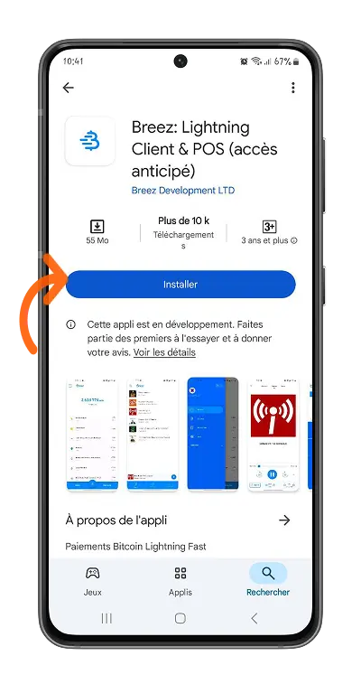
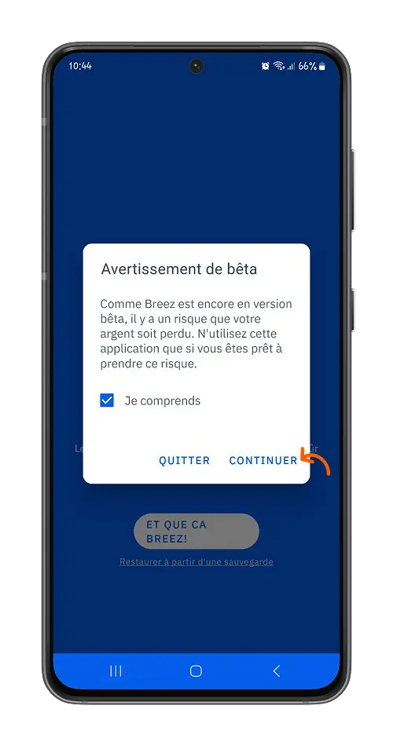
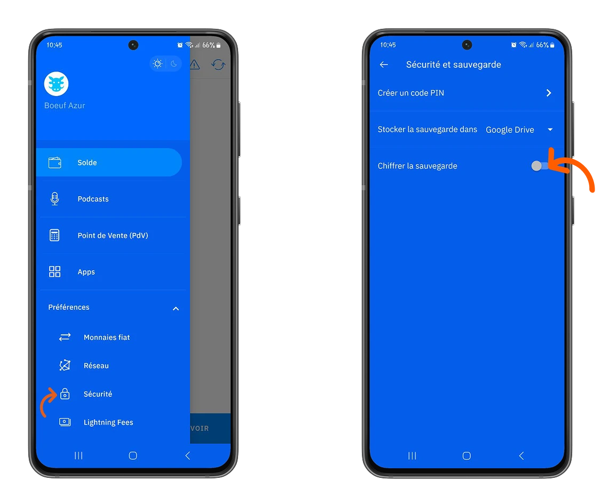
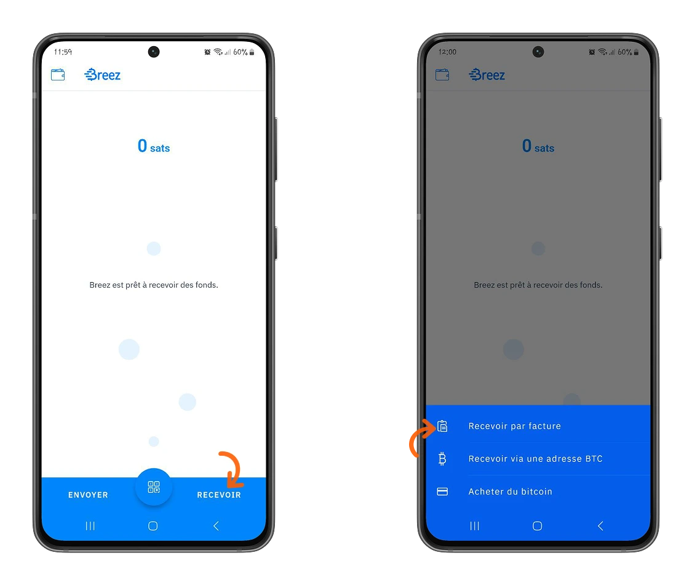
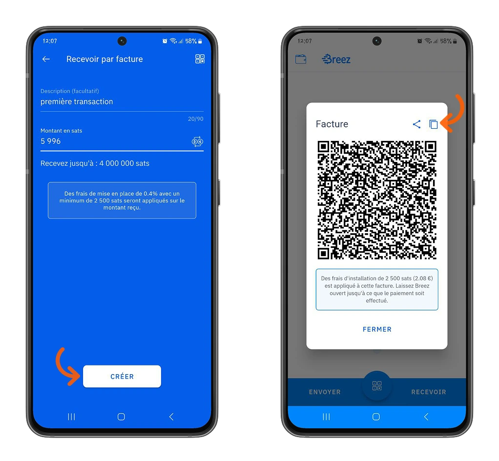
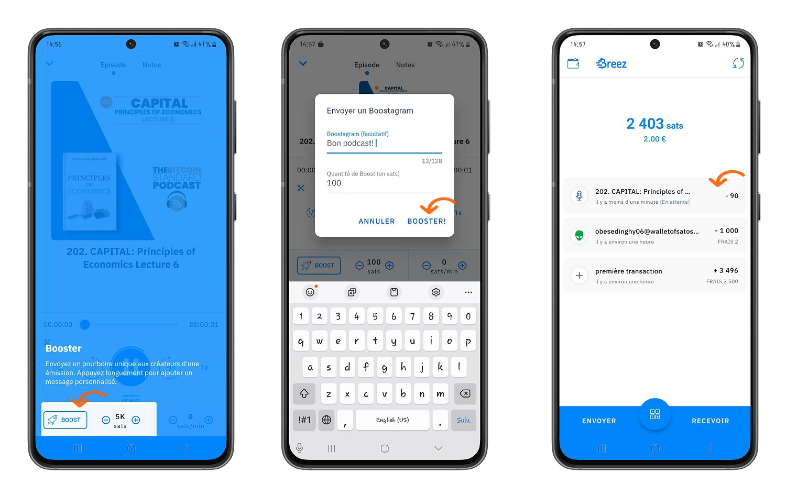
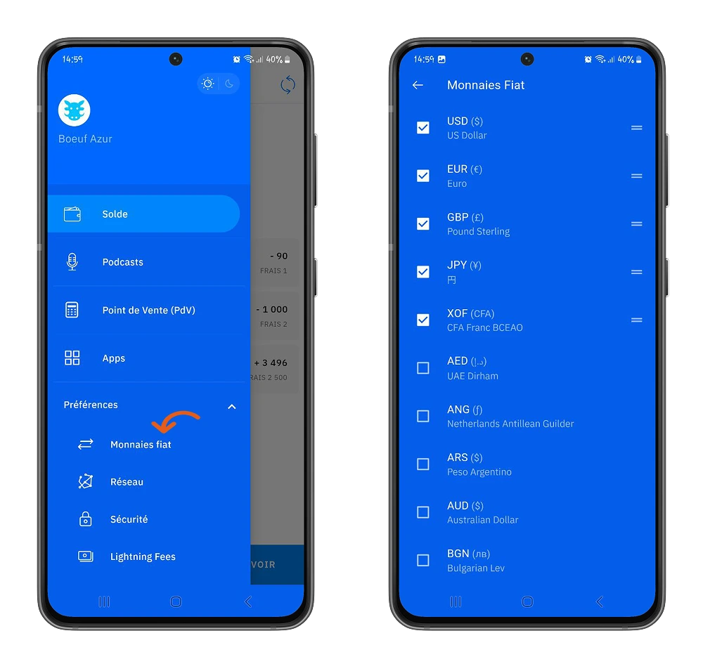
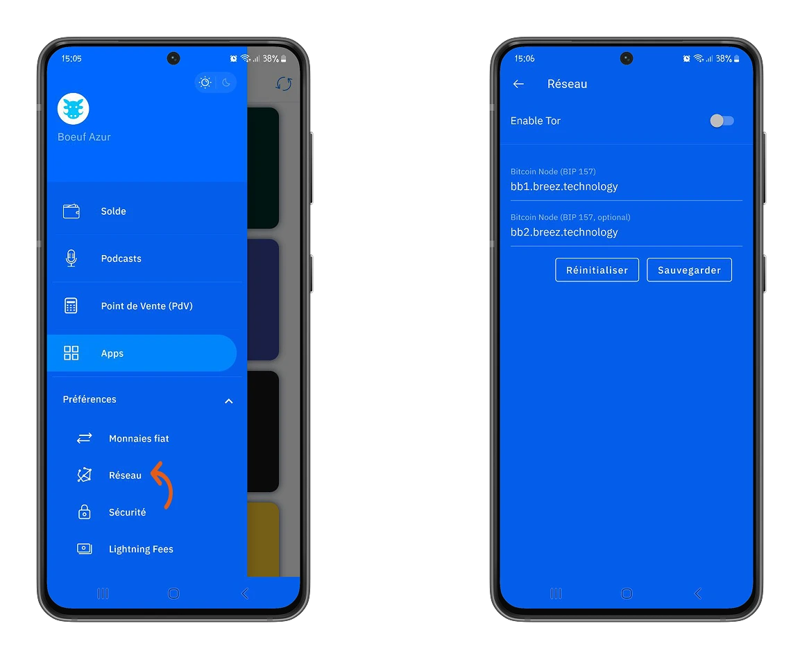

ස්වයං-අත්හැරීමේ පසුම්බි, Bitcoin හි Lightning ආවරණයේ බලය සහ වාසි වලින් ප්‍රයෝජන ලබමින්, ඔබේ බිට්කොයින් තබා ගැනීම සඳහා ආරක්ෂිතම විකල්පය බවට පත්වෙමින් පවතී. Breez, එහි ආකල්පය නිසා, විශේෂයෙන්ම මෙම පසුම්බි කණ්ඩායමෙන් විශේෂත්වය ලබා ගනී.

## Breez පෝර්ට්ෆෝලියෝ යනු කුමක්ද?

Breez යනු Breez සමාගම විසින් නිර්මාණය කරන ලද ස්වයං-අධිකාරී Wallet එකක් වන අතර එය ඔබට ඔබේ බිට්කොයින්වල පාලනය ලබා දෙන අතර, එකම යෙදුමක නව්‍ය විශේෂාංග ලබා දේ.

ඔබට Android සහ iOS සඳහා නිල බාගත කිරීමේ වේදිකාවන්ගෙන් Breez Wallet බාගත කළ හැක. මෙම උපකාරිකාවේදී, අපි Android වේදිකාවේ යෙදුමට අත්වැඩම් ආකාරයකින් පිවිසෙමු. පහත විස්තර කරන ලද සම්පූර්ණ ක්‍රියාවලිය iOS සඳහාද වලංගු වේ.

⚠️ **වැදගත්**: යෙදුමේ සත්‍යතාවය සහ ඔබේ අනාගත දේපලවල ආරක්ෂාව සහතික කිරීම සඳහා Google Play Store හෝ Apple Store වැනි නිල වේදිකාවකින් යෙදුම බාගත කිරීම අත්‍යවශ්‍ය වේ.

මෙහි, Android මත, **Breez** යෙදුම (Breez සමාගමේ තවත් නිෂ්පාදනයක් වන Misty Breez සමඟ ගැලපෙන ලෙස නොවේ).

## පොර්ට්ෆෝලියෝව සමඟ හුරුපුරුදු වීම

Breez ඔබට නව Wallet එකක් නිර්මාණය කිරීම හෝ පවතින Lightning Wallet එකක් ප්‍රතිස්ථාපනය කිරීමේ විකල්පය ලබා දේ. මෙම උපකාරිකාවේදී, අපි නව පෝර්ට්ෆෝලියෝ එකක් නිර්මාණය කරමු.

To je ena od prednosti Breez: imate ključe do popolnega dostopa do svojih bitcoinov. Vi ste gospodar svojih bitcoinov.

⚠️ Breez පෝර්ට්ෆෝලියෝ දැනට සංවර්ධනය වෙමින් පවතින බැවින්, මේ මොහොතේ මධ්‍යස්ථ මුදල් ප්‍රමාණ වලින් ගනුදෙනු කිරීමට අපි ඔබට නිර්දේශ කරමු.

> ඔබේ යතුරු නොමැති නම්, ඔබේ බිට්කොයින් නොමැත.

Wallet සෘජුවම Bitcoin ප්‍රොටෝකෝලය සමඟ සංකලනය වන අතර ඔබේ ගනුදෙනු සඳහා සක්‍රීය නියුඩයක් සපයයි.

### ඔබේ යතුරු සුරකින්න

Bitcoin/Lightning පෝර්ට්ෆෝලියෝවක් නිර්මාණය කිරීමේදී පළමුව කළ යුතු දේ එහි යතුරු සුරක්ෂිත කිරීමයි.

මෙනුවේ, **Preferences** පසු **Security** වෙත යන්න.

Breez ඔබට ඔබේ 12 ප්‍රතිසාධන වචන Google Drive එකක හෝ ඔබට වින්‍යාස කළ හැකි දුරස්ථ පුද්ගලික සේවාදායකයක සුරකින්න ඉඩ සලසයි.

පසුව **Chiffer backup** විකල්පය සක්‍රීය කරන්න: මෙය ඔබේ පෝර්ට්ෆෝලියෝවෙහි යතුරු පද හෙළි කරනු ඇත, ඔබට අතින් සුරකින්න පුළුවන්.

පසුව ඔබේ උපස්ථය තහවුරු කිරීමට සහ Breez පෝර්ට්ෆෝලියෝවට ඔබේ දුරස්ථ උපස්ථ ගිණුම සම්බන්ධ කිරීමට උපදෙස් අනුගමනය කරන්න.

https://planb.network/tutorials/wallet/backup/backup-mnemonic-22c0ddfa-fb9f-4e3a-96f9-46e2a7954270

⚠️ **IMPORTANT**: ඔබේ Breez Wallet සඳහා අමතර Layer ආරක්ෂාවක් එක් කිරීමට, ඔබට PIN කේතයක් නිර්වචනය කර එය Wallet වෙත ප්‍රවේශය අනුමත කර ඇති බව සත්‍යාපනය කිරීමට සකසන්න.

### Breez සමඟ ඔබේ පළමු ගනුදෙනු කිරීම

Breez svojo aplikacijo postavlja intuitivnost na prvo mesto. Prejemanje vaših prvih bitcoinov s tem Wallet ne bi moglo biti lažje. Na domači strani kliknite na **Prejmi**, nato izberite način, po katerem želite prejeti svoje bitcoine.

Breez ඔබට විකල්ප තුනක් ලබා දේ:

- ලබා ගන්න Lightning හෝ ID** Invoice: generate සහ Invoice සහ ගෙවීම් ලබා ගන්න.
- Bitcoin Address** मार्फत प्राप्त गर्नुहोस्: Bitcoin मुख्य नेटवर्कमा लेनदेनहरूसँग बिटकोइनहरू प्राप्त गर्नुहोस्।
- Kupite Bitcoin**: Breez vključuje način pridobivanja Bitcoin neposredno iz fiat valut.

ඔබේ Invoice සඳහා විස්තරයක් ඇතුළත් කරන්න, එවිට ඔබට ලැබීමට අවශ්‍ය මුදල.

⚠️ Breez හි ඔබේ පළමු ගනුදෙනුව සඳහා, ඔබට නාලිකා විවෘත කිරීමේ සහ නඩත්තු ගාස්තු ලෙස **2500 සතෝෂි** ගෙවීමට සිදු වේ. බොහෝ ලයිට්නින් වොලට් වලට වඩා වෙනස්ව, Breez ඔබට සම්පූර්ණ ලයිට්නින් නෝඩ් යටිතල පහසුකම් ලබා දේ, ඔබේ බිට්කොයින් කළමනාකරණය කිරීමට නිදහස ලබා දේ. ඔබට ඔබේම ගෙවීම් නාලිකා විවෘත කළ යුතු අතර, යෙදුම තුළින්ම ලයිට්නින් නෝඩ් සමඟ සෘජුව සන්නිවේදනය කිරීමට නිදහස ලැබේ.

*විශ්වාසයෙන් සිටින්න, ඔබට මෙම ගාස්තුව එක වරක් පමණක්, ඔබේ පෝර්ට්ෆෝලියෝ ආරම්භ කරන විට ගෙවීමට සිදු වේ*

Ko vaš Invoice enkrat ustvarjen, ga lahko delite ali pa ga skenirate za plačilo računa in prejem vaših bitcoinov.

Breez වෙත බිට්කොයින් යැවීම, ඒවා ලබා ගැනීම මෙන්ම අත්දැකීමක් වේ.

Breez ඔබට බිට්කොයින් යැවීම සඳහා විකල්ප තුනක් ලබා දේ.

- පේස්ට් කරන්න Invoice හෝ පරිශීලක හැඳුනුම්පත**: ලයිට්නින්ග් Invoice ගෙවන්න.
- Connect to pay**: Bitcoins යැවීමට සැසියක් සාදන්න සහ ඔබේ ලැබුම්කරුට සැසියට එක්වන්න ආරාධනා කරන්න.
- Address** වෙත BTC යවන්න: Bitcoin ප්‍රධාන ජාලය මත ගනුදෙනු කරන්න.

පසුව ප්‍රතිලාභියාගේ විස්තර ඇතුළත් කරන්න හෝ Invoice ගෙවීමක් ආරම්භ කිරීමට සහ සත්‍යාපනය කිරීමට ස්කෑන් කරන්න.

### මෙම පෝර්ට්ෆෝලියෝවෙහි විශේෂ ලක්ෂණය.

Bitcoin සුරැකීම සඳහා අත්භූත Wallet එකක් වීමෙන් අධිකව, Breez යනු නව්‍ය පරිසර පද්ධතියකි.

ඔබට ප්‍රයෝජනවත් සේවාවන් සෘජුවම යෙදුමේදී සොයාගත හැක.

- පොඩ්කාස්ට් අහන්න**: Breez යනු podcast 2.0 ප්ලේයරයක් වන අතර එය ඔබට ප්‍රිය කරන නිර්මාපකයින් Bitcoin පරිත්‍යාගයන් සමඟ සහය වීමට ඉඩ සලසයි.

මෙනුවෙන් **පොඩ්කාස්ට්** තෝරන්න, එවිට ඔබේ ප්‍රියතම අන්තර්ගත නිර්මාණකරුවන් සොයා, සොයාගෙන, අසන්න.

ඔබට ආදරය කරන අන්තර්ගත නිර්මාණකරුවන්ගේ කටයුතු සහය වන්න දායකත්ව ලබා දීමෙන්.

- විකුණුම් ස්ථානයක්**: Breez ඔබේ ව්‍යාපාරයට පරිපූර්ණව අනුකූල වේ, ඔබට යෙදුම තුළ විකුණුම් ස්ථානයක් ක්‍රියාත්මක කිරීමට ඉඩ සලසයි. ඔබේ ගබඩායේ තොග කළමනාකරණය කළ හැකි අතර, ඔබේ ගනුදෙනුකරුවන්ගෙන් ගෙවීම් ලබා ගත හැකි අතර, සිදු කරන ලද සෑම මිලදී ගැනීමක් සඳහාම generate මුද්‍රණය කළ හැකි ඉන්වොයිසයන් ලබා ගත හැක. තවද, Breez මගින් සහය දක්වන බොහෝ මුදල් අතරින් ඔබේ දේශීය මුදල් සොයා ගත හැක.

ඔබට ඔබේ මුදල් අභිරුචිකරණය කළ හැකි අතර, **Preferences > Fiat Currencies** මෙනුවෙන්.

**Point of Sale (POS)** මෙනුවේ, ඔබේ වෙළඳසැලේ විකිණෙන අයිතම සකසන්න.

ඔබේ ඉන්වෙන්ටරි සම්පූර්ණ වූ විට, ඔබට පහසුවෙන් මෙම නිෂ්පාදන සඳහා ඔබේ ගනුදෙනුකරුවන් Invoice කළ හැකි අතර, Bitcoin ඔබේ ව්‍යාපාරයට පිළිගත හැක.

- තෙවන පාර්ශවීය සේවා ප්‍රවේශය**: Breez හි තෙවන පාර්ශවීය සේවා ඒකාබද්ධ කර ඇති අතර, ඔබට පෝර්ට්ෆෝලියෝවෙන් පිටවීමට අවශ්‍ය නොමැතිව වැඩි ක්‍රියාමාර්ග ගැනීමට ඉඩ සලසයි. මෙයට ඇතුළත් වන්නේ Bitrefill, LN Markets, Wavlake, Fold, Fixed Float, The Bitcoin Company, Azteco, Boltz, Geyser, Lightsats, SMS Sats, LN.PIZZA, LNCAL.

### Breez की ताकत

Breez vašo avtonomijo spremeni v svojo moč. Breezova infrastruktura vam omogoča funkcionalno vozlišče, s katerim lahko komunicirate znotraj aplikacije (**Možnost razvijalcev**). Prav tako imate avtonomijo za prilagajanje osnovnih konfiguracij, bodisi na:

- Bitcoin/Lightning නියුඩ් වෙත සම්බන්ධතාවය: මෙනු **Preferences > Network**.

- අභිරුචිකරණ ගනුදෙනු ගාස්තු: මෙනුව **Preferences > Lightning Fees**.

- ගෙවීම් නාලිකා කළමනාකරණය කිරීම: මෙනුව **Preferences > Close Channels**.

⚠️ **IMPORTANT**: priporočamo, da imate nekaj izkušenj s konfiguracijami Lightning, preden izvedete kakršne koli spremembe. Vaše prihodnje transakcije bodo neposredno vplivale na vaše spremembe in vaši bitcoini bi lahko bili izgubljeni.

වැඩි පළපුරුදු අයට, ඔබට **Preferences>Developers** මෙනුවෙන් නෝඩ් සමඟ අන්තර්ක්‍රියා කළ හැක.

මෙහි ඔබට අවශ්‍ය ආර්ගියුමන්ට් එකතු කිරීමෙන් ක්‍රියාත්මක කළ හැකි Lightning විධාන රේඛා සොයා ගත හැකිය.

චුක්, ඔබ දැන් Breez Wallet හොඳින් අත්පත් කරගෙන ඇත. ඔබට මෙම ලිපිය ප්‍රයෝජනවත් නම්, කරුණාකර අපට Green අඟුල්මුද්‍රාවක් දෙන්න. අපි ඔබගෙන් අහන්න කැමතියි. ඔබගෙන් අහන්න අපි බලාපොරොත්තු වෙමු!