Elysium Wallet je prvo ne-skrbniško Software Wallet švicarskega zagonskega podjetja Elysium Labs.

නවෝත්පාදන යතුරු කළමනාකරණ පද්ධතියට ස්තුතියි, ඔබේ ඩිජිටල් සම්පත් ප්‍රවේශ වීමට ඔබට දෛනික ජීවිතයේ කොටසක් වන Elements භාවිතා කළ හැක: ඔබේ පරිශීලක නාමය, මුර යතුර, මුරපදය හෝ මුර කේතය. ඔව්: ඔබේ ඩිජිටල් සම්පත් නැවත ප්‍රවේශ වීමට seed වාක්‍යයක් භාවිතා කිරීම දැන් දැඩිව අවශ්‍ය නොවේ. මෙම සරල කිරීම Bitcoin ලෝකය පුරා පැතිර යාම වේගවත් කළ හැක.

## Kako odpreti račun?

Apple Store හෝ Google Play වෙතින් Elysium Wallet යෙදුම බාගන්න, එවිට ඔබේ උපාංගයේ බාගත කළ Elysium Wallet යෙදුම විවෘත කරන්න. "Create a new Wallet" මත ටැප් කරන්න, එවිට භාවිත නියම සහ කොන්දේසි පරිඝණකය පෙනේ. ඔබේ ගිණුම නිර්මාණය කිරීමට පිළිගැනීම සහ ඉදිරියට යාම සඳහා, "Begin Setup" මත ටැප් කරන්න, එවිට ඔබේ පරිශීලක නාමය ඇතුළත් කරන්න; කරුණාකර සටහන් කරන්න පැතිකඩ රූපය අභිරුචිකරණය කළ හැක: ලබා දී ඇති විකල්ප වලින් එකක් තෝරා ගන්න, ඡායාරූපයක් ගන්න හෝ ඔබේ උපාංගයෙන් රූපයක් උඩුගත කරන්න. ඔබ තෝරාගෙන අවසන් වූ විට, "Continue" මත ටැප් කරන්න.

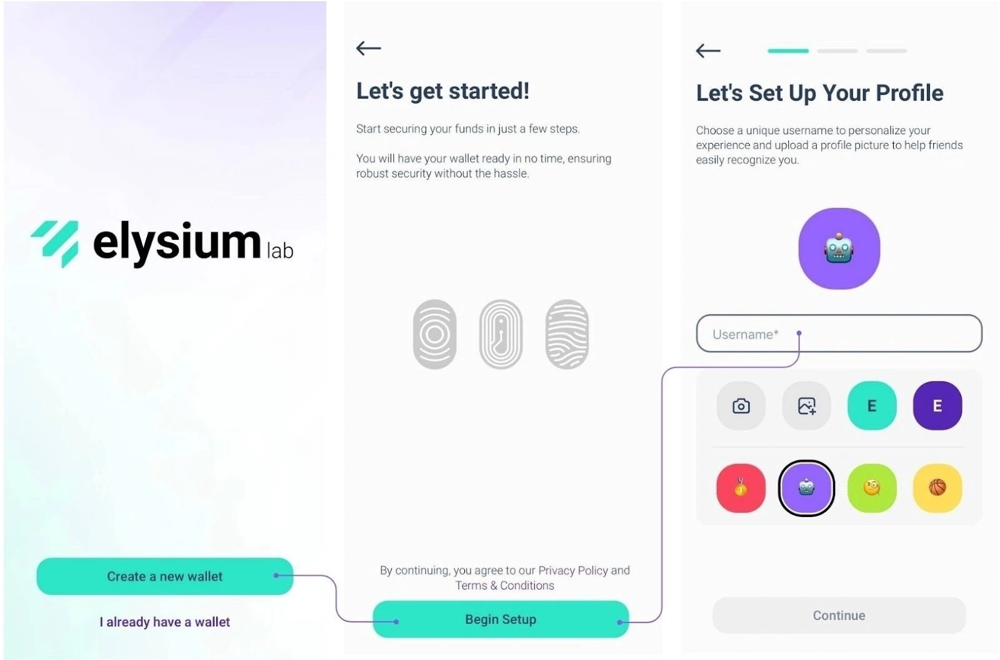

එලිසියම් එහි නව්‍ය බහු-ගුණක සංකල්පය සඳහා විශේෂිත වේ, එය Passkey, PassCode සහ PassWord එකට එකතු කරයි. PassKeys අනිවාර්ය වේ. එය ඔබට ඔබේ උපාංගයේ නිර්මාණය කළ ආරක්ෂිත විශේෂාංග, Face ID හෝ ඇඟිලි සලකුණු ස්කෑන කිරීම වැනි, භාවිතා කරමින් ඉක්මනින් සහ ආරක්ෂිතව සත්‍යාපනය කිරීමට ඉඩ සලසයි. එය ඔබේ ප්‍රධාන Layer ආරක්ෂාව වන අතර, ඉක්මන් සහ ආරක්ෂිත ප්‍රවේශය සහතික කරයි.

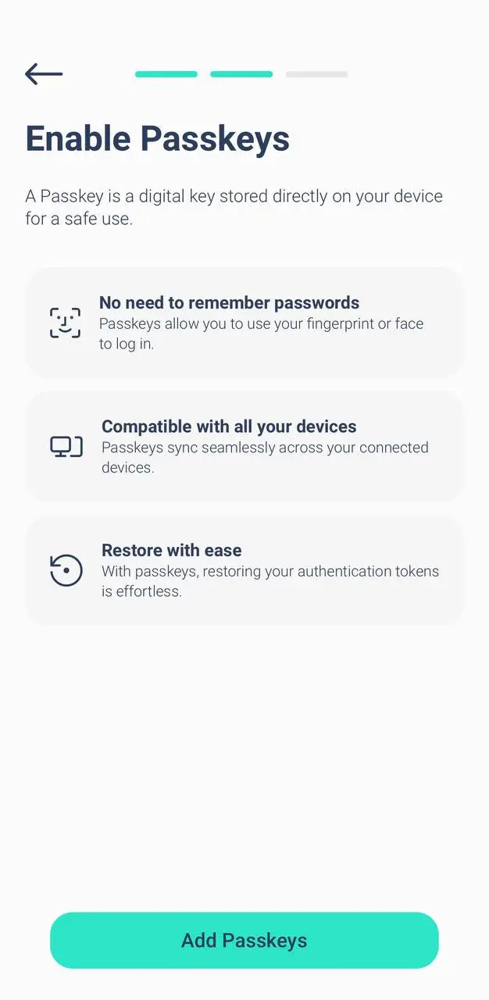

තෝරන්න ඔබේ දෙවන මට්ටම: PassCode හෝ PassWord; ඊළඟට, ඔබට ආරක්ෂාව සඳහා දෙවන මට්ටමක් තෝරා ගත යුතුය:

- PassCode: 6-අංක කේතයක්, මතක තබා ගැනීමට පහසු වේ. අමතර Layer ආරක්ෂාවක් එක් කිරීමට පරිපූර්ණයි.
- Geslo: Ustvarite močno geslo z vsaj 8 znaki, da zagotovite še večjo varnost.

ඔබ PassCode හෝ PassWord සමඟ Passkeys භාවිතා කළ යුතුය.

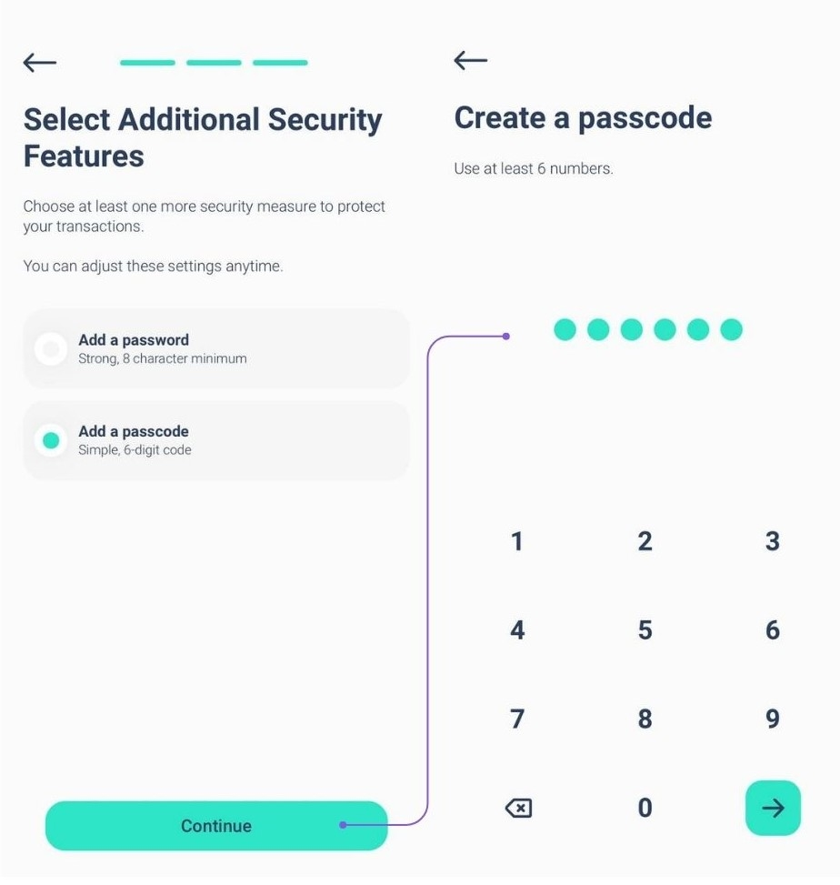

**සටහන:** ඔබේ ගිණුම පිහිටුවීමට, ඔබට අවම වශයෙන් සාධක 2ක් අවශ්‍ය වන අතර, ඒ අතරින් එකක් Passkey විය යුතුය.

ආරක්ෂාව තවදුරටත් වැඩි කිරීමට, ඔබට තෙවන Layer ආරක්ෂාවක් (Passkey + PassCode + PassWord) එක් කළ හැක.

උපරිම ආරක්ෂාව සඳහා ස්ථරයන්ගේ සංයෝජනයක්

ඔබ සෑම විටම Passkey ප්‍රාථමික සාධකය ලෙස භාවිතා කරනු ඇත. දෙවන Layer සඳහා, PassCode හෝ PassWord තෝරන්න.

ඔබ දෙවන සාධකය ලෙස PassCode තෝරාගෙන ඇති නම්, ඔබට Layer තුන්වන සාධකය ලෙස PassWord එකතු කළ හැකි අතර එයට විරුද්ධවද කළ හැක. මෙම ව්‍යවස්ථානුකූල ආකාරය ඔබේ වත්කම් ඔබේ කැමැත්තට අනුව ආරක්ෂා වන බව සහතික කරයි.

You can add the third security factor during the setup phase (see images) or later by going to Settings > Improve security.

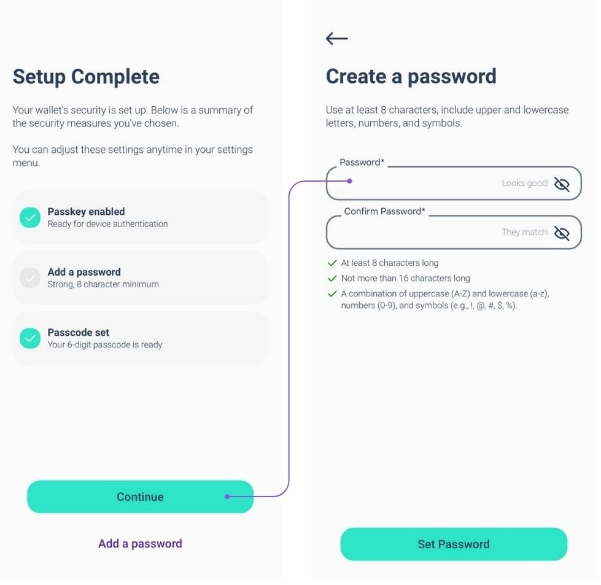

කෙසේ වෙතත්, ඔබ සාධකයක් අමතක කළහොත්, කරුණාකර සලකන්න:

ඔබ සියලුම සාධක තුන සකසා ඇත්නම්, ඔබට එම සාධක වෙනස් කිරීමට හෝ නැවත සකසීමට සැකසුම් වලින් හැමවිටම හැක.

කණගාටුයි, ඔබ කෙරෙහි සකසා ඇති දෙකේ පමණක් සාධක සහ එකක් අමතක නම්, ප්‍රතිසාධන විකල්පයක් නොමැත.

අපි ආරක්ෂාව සහ ව්‍යුහවත්භාවය උපරිමය කර ගැනීම සඳහා ආරම්භයේ සිටම සියලුම සාධක තුන සකස් කිරීම දැඩිව නිර්දේශ කරමු.

## ටැක්ශන් එකක් ලබා ගැනීමට කෙසේද?

Elysium යෙදුම විවෘත කර ප්‍රධාන මෙනුවට යන්න, එවිට 'Receive' ට තට්ටු කරන්න.

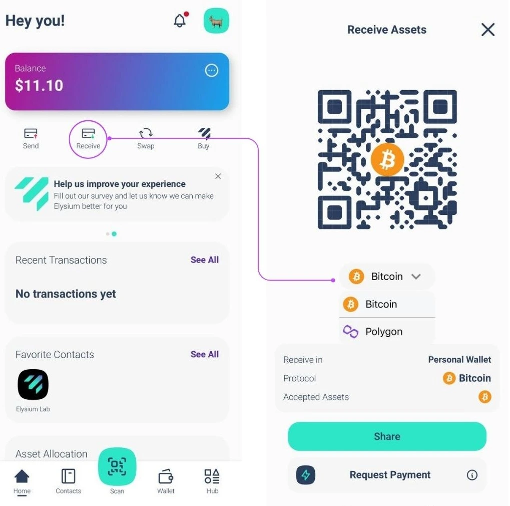

දැන්, ඔබට ගෙවීම් ලබා ගැනීමට අවශ්‍ය දාමය (Bitcoin හෝ Polygon) තෝරන්න සහ ඔබට ගෙවීම් කළ යුතු පුද්ගලයා සමඟ ඔබේ Elysium Wallet QR කේතය බෙදා ගත හැක, ඔවුන් ඉතිරි කටයුතු කළමනාකරණය කරනු ඇත.

## Lightning Network හි ගනුදෙනුවක් ලබා ගැනීමේ ආකාරය කෙසේද?

**Step 1:** "Request Payment" ටැප් කිරීමෙන් ඔබ Lightning Network හරහා Bitcoin ගෙවීමක් ඉල්ලා සිටී.

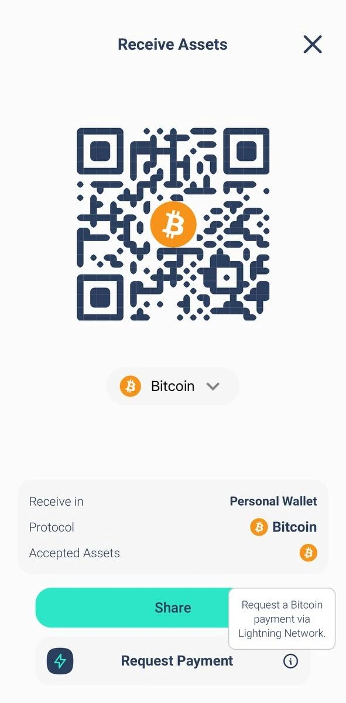

**2. korak:** Vnesite znesek, ki ga želite zahtevati, izberite valuto, ki jo želite prejeti, in po potrebi dodajte opis.

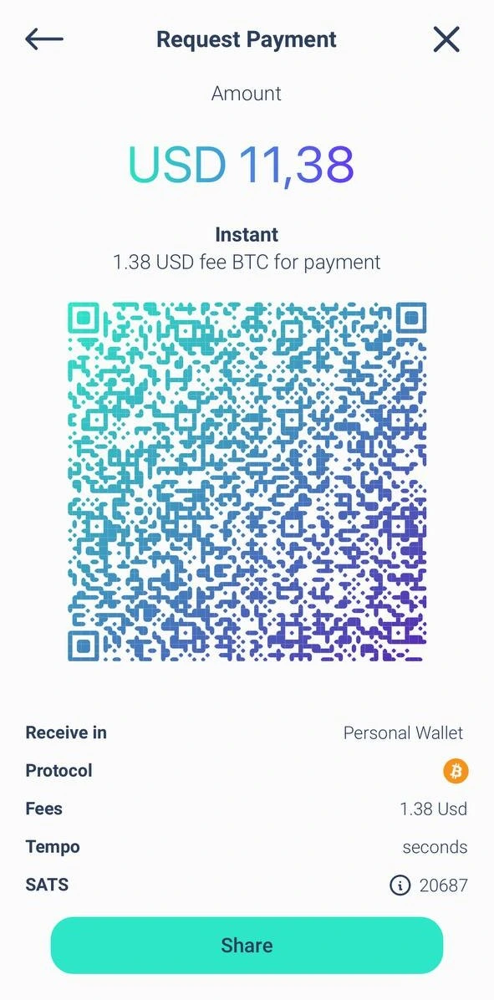

**සටහන:** LN නාලිකාව විවෘත කිරීමට පළමු Lightning Network (LN) ගෙවීම සඳහා කුඩා ගාස්තුවක් ඇත. එහි පසු, සියලුම පසුගිය ගෙවීම් නොමිලේ වේ.

## ටැක්ශන් එකක් යැවීම කෙසේද?

**1. korak:** Pojdite v glavni meni in tapnite »Pošlji«.

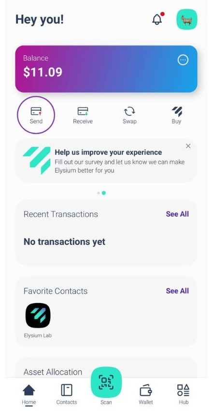

**පියවර 2:** ඔබේ Address පොතට ඔවුන්ගේ සම්බන්ධතා ස්වයංක්‍රීයව සුරැකීමට ලාභාග්‍රාහකයාගේ Elysium Wallet හි QR කේතය ස්කෑන් කරන්න. විකල්පයක් ලෙස, ඔවුන්ගේ Address අතින් පිටපත් කර ලාභාග්‍රාහක ක්ෂේත්‍රයට අලවන්න. ලාභාග්‍රාහකයා තෝරා ගැනීමෙන් පසු හෝ ඔවුන් ඔබේ Address පොතට එක් කිරීමෙන් පසු, "ගෙවීම යවන්න" තට්ටු කරන්න.

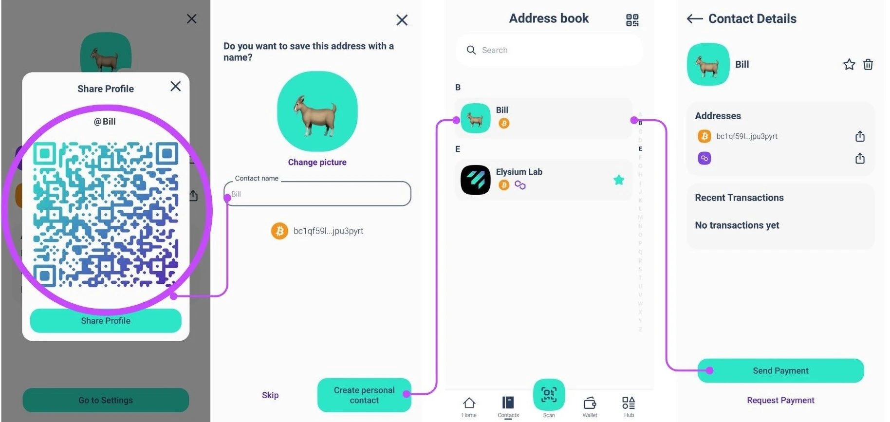

දැනටමත් සම්බන්ධතාවය තිබේද? එය සෘජුවම Address පොතෙන් තෝරන්න.

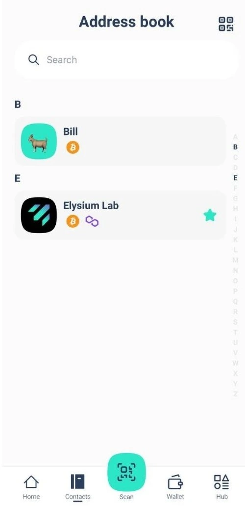

**3. korak:** Po vnesite znesek, ki ga želite poslati, in izberite sredstvo, ki ga želite prenesti.

BTC ගනුදෙනු සඳහා, ඔබට කැමති ජාල වේගය සහ ගාස්තු තෝරා ගත හැක (තුන්වන රූපයේ පෙන්වා ඇති පරිදි)

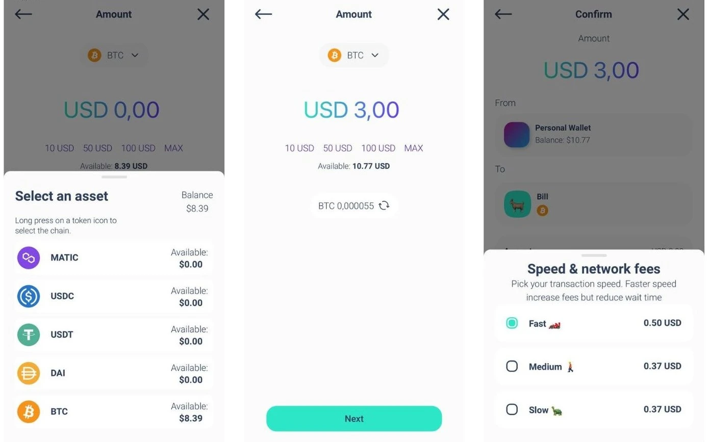

ඔබේ ගනුදෙනුව ඉදිරිපත් කර ඇත! ඔබට පහසුවෙන්ම ඔබේ Elysium Wallet හි යාවත්කාලීන ශේෂය සහ ගනුදෙනු තත්ත්වය පරීක්ෂා කළ හැක.

## Lightning Network में लेन-देन कैसे भेजें?

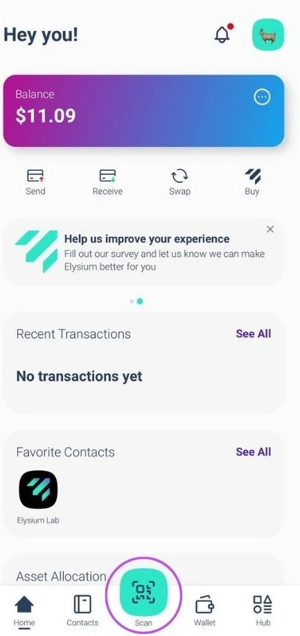

**1. korak:** Opt "Skeniraj" za odprtje skenerja.

**2. korak:** Plačajte s skeniranjem QR kode LN.

**Step 3:** ගෙවීම් විස්තර සමාලෝචනය කර සියල්ල නිවැරදි බව තහවුරු කරන්න.

**පියවර 4:** ගනුදෙනුව සම්පූර්ණ කිරීමට "Confirm" තෝරන්න.

## seed Phrase nasıl görülür?

මෙනු මෙනුවට යන්න සහ "Hub" ටැප් කරන්න. සැකසුම් තෝරන්න සහ "Extract private key" ටැප් කරන්න.

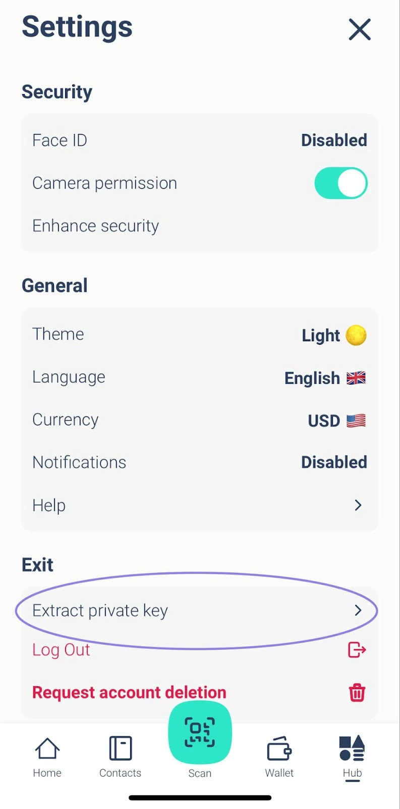

ඔබේ මුරපදය සමඟ පිවිසෙන්න සහ ඔබේ මුරපදය සහ/හෝ මුරකේතය ඇතුළත් කරන්න. seed වාක්‍යය 24-වචන ආකෘතියෙන් පෙන්වනු ඇත.

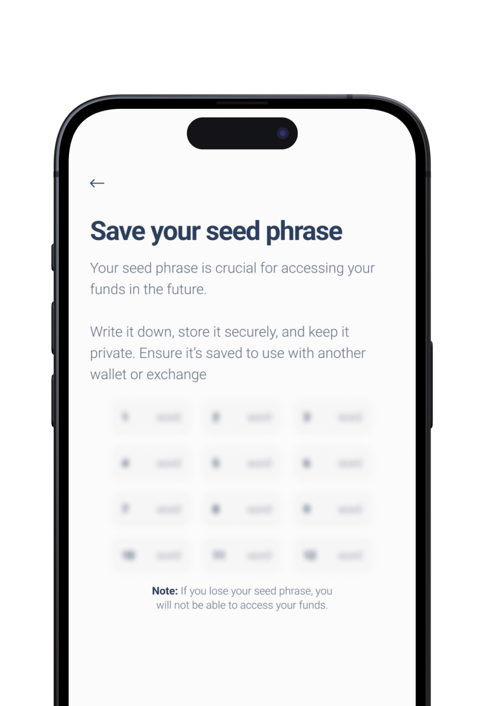

එය කිසිවෙකු සමඟ බෙදා ගන්න එපා!

## සහාය අමතන්නේ කෙසේද?

Elysium Wallet pomoč potrebujete? Tukaj smo, da pomagamo!

යෙදුම බාගන්න, සහ මෙන්න ඔබට අපගේ පාරිභෝගික සහය දායක කණ්ඩායම සමඟ යෙදුමෙන්ම සෘජුවම සම්බන්ධ විය හැකි ආකාරය:

1. Hub වෙත යන්න

2. ටැප් කරන්න සැකසුම්

3. මදදඋව තෝරන්න

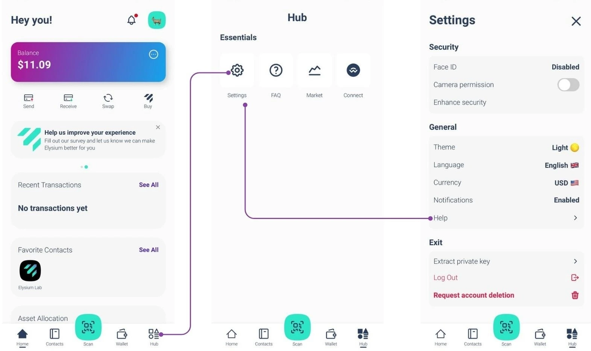

පැමිණිලි කිරීමේදී ඔබට මුහුණ දෙන ගැටලුව විස්තර කළ හැකි ආකෘතියක් පෙනී යනු ඇත.

එක් වරක් ඉදිරිපත් කළ පසු, අපගේ කණ්ඩායම හැකි ඉක්මනින් විසඳුමක් සමඟ ප්‍රතිචාර දක්වනු ඇත!

බගයක් වාර්තා කිරීමට හෝ අපට ප්‍රතිපෝෂණයක් ලබා දීමට, මුල් පිටුවේ විජට් එක මත ක්ලික් කරන්න:

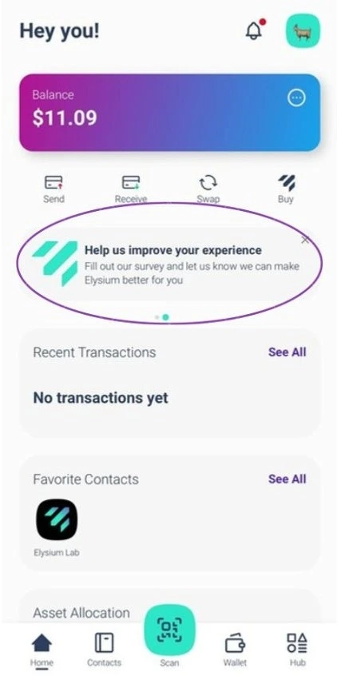