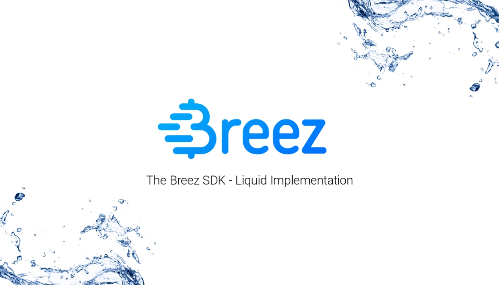
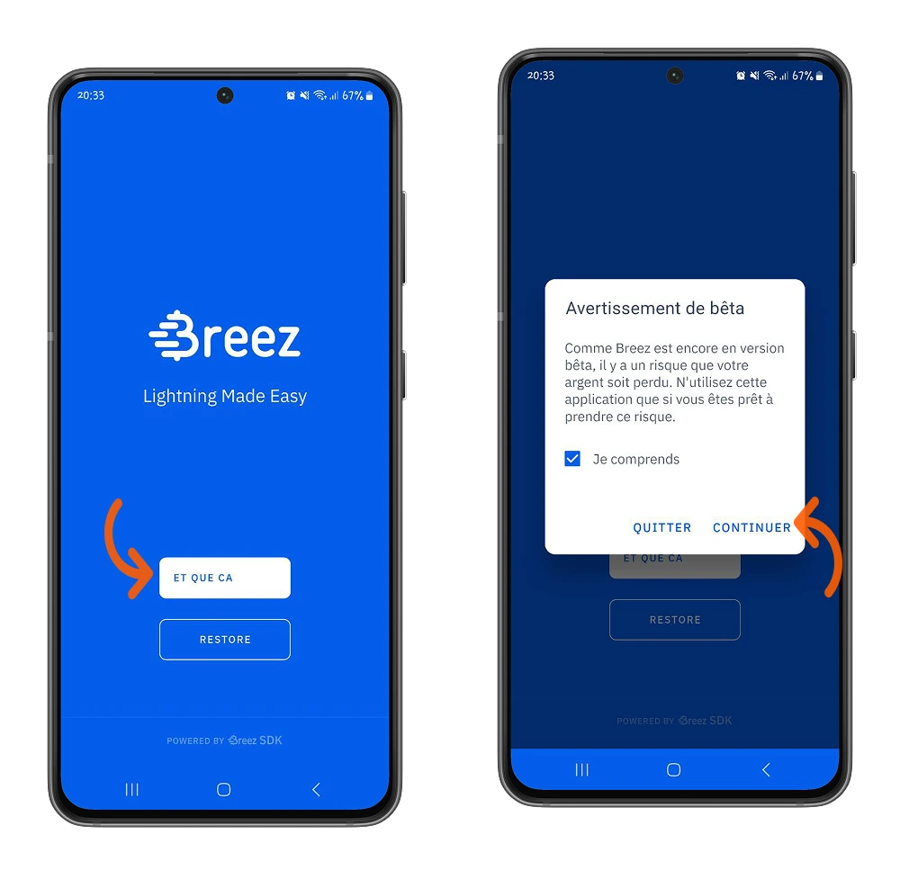
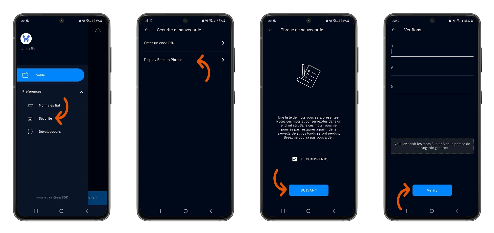
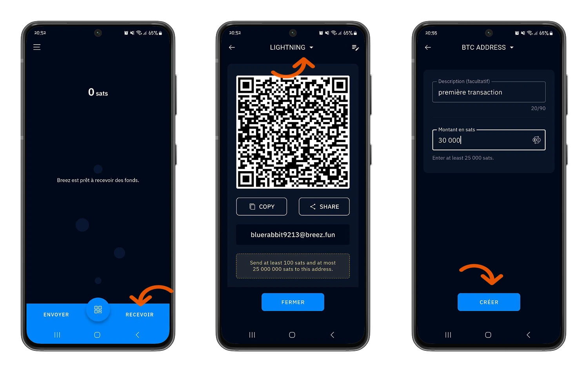
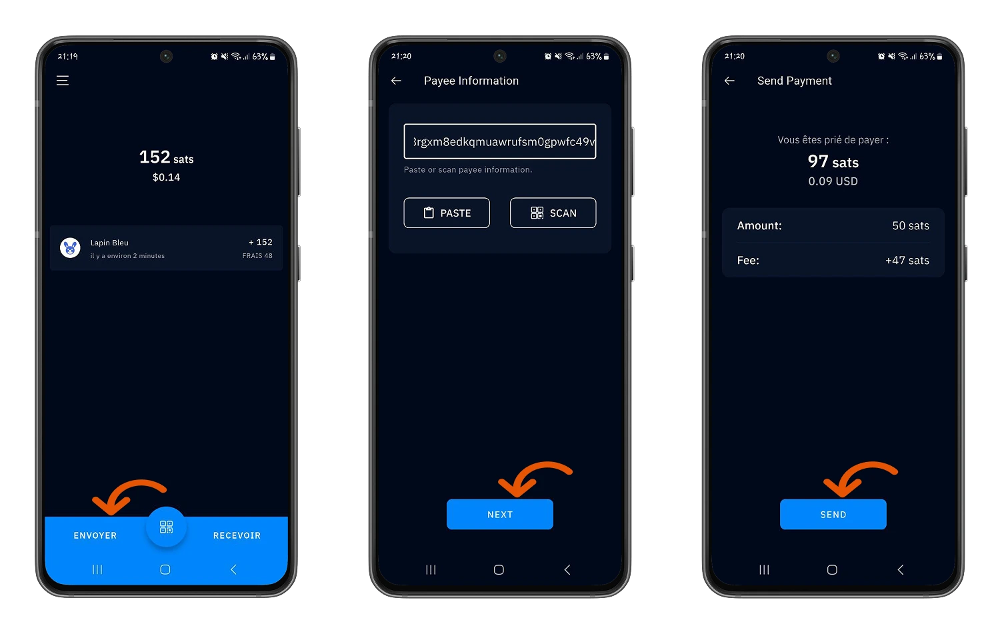
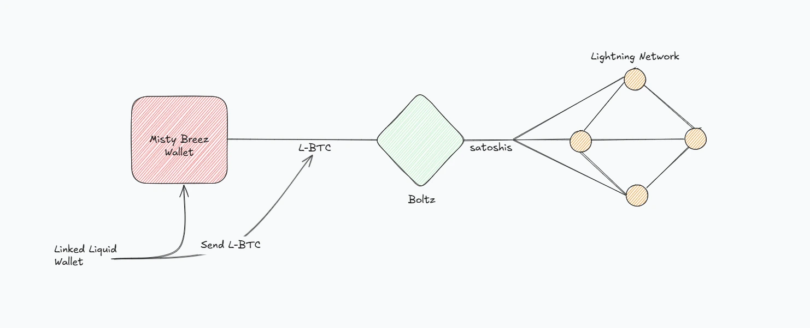

Misty Breez je Lightning self-holding Wallet, ki ga je razvilo podjetje Breez na podlagi njihovega kompleta za razvoj programske opreme in omrežja **Liquid**, ki ga je razvilo podjetje BlockStream.

එය Lightning node එකකින් තොරව ක්‍රියාත්මක වීම සඳහා සම්පූර්ණයෙන්ම නව ආකෘතියක් සමඟ පැමිණේ: Bitcoin අන්තර්-ජාල හුවමාරු වලදී සම්භාව්‍ය **GAME CHANGER** එකකි.

මෙම උපකාරිකාවේ, අපි මෙම පෝර්ට්ෆෝලියෝව කෙසේ ක්‍රියා කරන්නේද යන්න විස්තර කරමින් සම්පූර්ණ සමාලෝචනයක් ලබා දෙනු ඇත.

## Mist Breez කෙසේ ක්‍රියා කරයිද?

Misty Breez je implementacija brez Lightning vozlišča kot zaledja. Razvita je bila na podlagi Breez SDK in Liquid.

Liquid යනු Bitcoin ජාලයට සමාන්තර Layerක් වන අතර, වේගය සහ ගනුදෙනු වියදම් සම්බන්ධයෙන් සැලකිය යුතු වැඩිදියුණු කිරීම් ලබා දේ. මෙම Layer මගින් Misty Breezට Lightning node එකක් ඉවත් කර, Liquid Network සහ Lightning Network අතර අන්තර්ක්‍රියාශීලීතාවය සහතික කිරීම සඳහා **Boltz** වැනි තෙවන පාර්ශව Exchange සේවා භාවිතා කිරීමට ඉඩ සලසයි. ඉක්මන් කරන්න එපා, අපි මෙයට නැවත පැමිණෙමු.

අපිට දැන්, අපේ සවාරිය Misty Breez Wallet සමඟ ආරම්භ කරමු.

## Misty Breez සමඟ ආරම්භ කිරීම

Misty Breez ජංගම යෙදුම Google Play Store (Android හි) සහ Apple Store (iOS හි) වැනි නිල බාගත කිරීමේ වේදිකා මත ලබා ගත හැක. ඔබට නිල [Misty Breez] වෙබ් අඩවියෙන් (https://breez.technology/misty/) නිවැරදි යෙදුම වෙත යළියොමුවිය හැක.

⚠️ Misty Breez සමඟ Breez Wallet ගැලපෙන බවට ඔබ නොබලන්න.

⚠️ **වැදගත්**: ඔබේ බිට්කොයින් වල ආරක්ෂාව සඳහා, එහි සත්‍යතාවය සහතික කිරීම සඳහා නිල වේදිකාවලින් යෙදුම බාගත කිරීම අත්‍යවශ්‍ය වේ.

මෙම උපකාරිකාවේ, අපි ඇන්ඩ්‍රොයිඩ් උපාංගයකින් ආරම්භ කරමු. කෙසේ වෙතත්, මෙම කොටසේ විස්තර කරන ලද සෑම පියවරක්ම සහ විශේෂාංග iOS සඳහා අදාළ වේ.

ස්ථාපනය කිරීමෙන් පසු, Misty Breez ඔබට නව Wallet එකක් නිර්මාණය කිරීම හෝ ඔබ සතු ප්‍රතිසාධන වචන ඇති පැරණි Lightning Wallet එකක් ප්‍රතිස්ථාපනය කිරීමේ විකල්පය ලබා දේ.

මෙම උපකාරිකාවේ, අපි නව පෝර්ට්ෆෝලියෝවක් නිර්මාණය කිරීමට තීරණය කරමු.

⚠️Misty Breez trenutno සංවර්ධන අදියරේ පවතින බැවින්, අපි ඔබට සාධාරණ ප්‍රමාණ වලින් ආරම්භ කිරීමට උපදෙස් දෙනෙමු.

### ඔබේ ප්‍රතිසාධන වචන සුරකින්න :

ඔබේ නව පෝර්ට්ෆෝලියෝ එකක් සාදන විට ඔබ කළ යුතු පළමු දේවල් අතරින් එකක් වන්නේ ඔබේ 12 ප්‍රතිසාධන වචන පිටපත් කිරීමයි.

මෙන්න ඔබේ උපස්ථ වාක්‍යය ආපසු ගබඩා කිරීමේ ක්‍රම කිහිපයක්.

https://planb.network/tutorials/wallet/backup/backup-mnemonic-22c0ddfa-fb9f-4e3a-96f9-46e2a7954270

ඔබේ වාක්‍යයන් ආපසු ගබඩා කිරීමට, **Preferences > Security** මෙනුව තෝරන්න, එවිට **Check your Backup Phrase** විකල්පය තෝරන්න.

අමතර ආරක්ෂාව සඳහා, ඔබට ඔබේ Wallet වෙත ප්‍රවේශය සත්‍යාපනය කිරීමට **PIN කේතයක් නිර්මාණය** කළ හැක.

ඔබේ ස්ථානීය මුදල් ඒකකය Misty Breez විසින් පිළිගන්නා විවිධ මුදල් අතරින් සොයා ගන්න. ඔබට අවශ්‍ය මුදල් ඒකකය හෝ ඒකක තෝරා ගැනීමට **Preferences > Fiat Currencies** මෙනුවෙන් ඔබේ මුදල් ඒකකය සකසන්න.

### ඔබේ පළමු ගනුදෙනු කිරීම

ඔබ දැනටමත් Breez පෝර්ට්ෆෝලියෝව සමඟ පරිචිත නම්, Misty Breez හි අත්භූත Interface මඟින් ඔබ කිසිසේත්ම අසතුටට පත් නොවනු ඇත.

Interface **Balance** මෙනුවේ, **Receive** විකල්පය මත ක්ලික් කර, ඔබේ Wallet මත ඔබේ බිට්කොයින් ලබා ගැනීමට ඉන්වොයිසස් සෑදීමට.

⚠️ Misty Breez ඔබගෙන් ඔබේ දුරකථනයේ සැකසුම් වලින් යෙදුම සඳහා දැනුම්දීම් සක්‍රීය කරන ලෙස ඉල්ලා Lightning Address සඳහා ඔබට අයිතිය ලබා දෙනු ඇත.

Misty Breez සමඟ, ඔබට :

- Lightning Network මත බිට්කොයින් ලබා ගන්න **100 satoshis** සිට **25,000,000 satoshis** දක්වා.
- Bitcoin මූලික ජාලය මත බිට්කොයින් ලබා ගන්න **25,000 සතෝෂි** සිට.

මෙයයි Misty Breez හි මායාව ආරම්භ වන තැන.

Breez Wallet සමඟ වෙනස්ව, එය ඔබට Lightning node එකක් ලබා දෙන අතර ගෙවීම් නාලිකා විවෘත කිරීම සහ වසා දැමීමේ වියදම් ඔබම ආවරණය කරන ලෙස ඉල්ලා සිටින අතර, Misty Breez ඔබගෙන් කිසිවක් කිරීමට ඉල්ලා සිටින නැත. කලින් සඳහන් කළ පරිදි, Misty Breez සදහා Lightning node එකක් මත පදනම්ව ක්‍රියාත්මක වන්නේ නැත.

අපි කුඩා විමසුමක් කරමු.

සැබවින්ම, ඔබේ Misty Breez පෝර්ට්ෆෝලියෝව සමඟ සම්බන්ධ Liquid පෝර්ට්ෆෝලියෝවක් ඔබ සතුය. තර්කශීලීව, ඔබ Lightning Network සමඟ අන්තර්ක්‍රියා කිරීමට හැකි වන පරිදි තෙවන පාර්ශවීය සබ්මැරීන් සතෝෂි පරිවර්තන සේවා සමඟ සම්බන්ධ ස්ථිර අනුපාතික Liquid Bitcoin හි L-BTC ආකාරයෙන් කටයුතු කරනු ඇත.

ඔබේ Misty Breez Wallet මත ගෙවීමක් ලැබූ විට, ඔබේ යවන්නා ඔබට සටෝෂි යවයි, එය Boltz වැනි පරිවර්තන සේවාවක් හරහා (දැනට Misty Breez විසින් භාවිතා කරයි) යවනු ලබන සටෝෂි L-BTC වෙත පරිවර්තනය කිරීමට යයි, එය ඔබේ Misty Breez Wallet (Liquid Wallet සම්බන්ධ Wallet) මත ලැබෙනු ඇත.

මෙන්න පසුබිමේ ඇති ක්‍රියාවලිය සරල කළ ආරේක රූපයක්.

**Balance** මෙනුවේ Interface මත ක්ලික් කරන්න, Lightning Invoice ගෙවීමට **Send** විකල්පය මත ක්ලික් කරන්න.

Lightning Invoice ඇතුල් කරන්න, ඔබේ ලැබුම්කරුගේ Lightning Address හෝ සරලව Invoice මත QR කේතය ස්කෑන් කර ඔබේ ගෙවීම සිදු කරන්න.

පසුබිම් දසුනේ, ඔබේ Misty Breez Wallet සමඟ සම්බන්ධ Liquid Wallet සක්‍රීය කර, Boltz හරහා L-BTC සමානව සතෝෂි වලට පරිවර්තනය කිරීමට ඉඩ සලසයි, එවිට මෙම සතෝෂි ඔබේ ලාභලාභීගේ Lightning Wallet (Lightning Network මත පවතින) වෙත මාරු කරයි.

Misty Breez යටිතල පහසුකම්වල මෙම විශේෂාංගය මගින් පරිශීලකයින්ට Misty Breez අන්තර්ජාලයෙන් බැහැරව සිටින විට පවා ගනුදෙනු සිදු කිරීමට හැකියාව ලබා දේ.

අවබෝධය ඇති අය සඳහා, **Preferences > Developers** මෙනුවක් ද ඇත, එය ඔබට තවදුරටත් විස්තර ලබා දේ :

- Breez Software Development Kit का संस्करण।
- ඔබේ Misty Breez Wallet හි පොදු යතුර.
- ආධාරකයා, ප්‍රාථමික මහජන යතුරෙන් ලබාගත් අද්විතීය හඳුනාගැනීමේ සංකේතය.
- ඔබේ පෝර්ට්ෆෝලියෝ ශේෂය.
- Liquid උපදෙස්, L-BTC කුඩා ප්‍රමාණ යැවීම සඳහා.
- Bitcoin ටිපය, සුළු ප්‍රමාණයේ Bitcoin යැවීම සඳහා.

ඔබට Liquid Network සමඟ සංකේතනය කිරීම, ඔබේ යතුරු ආපසු ගබඩා කිරීම, ඔබේ ක්‍රියාකාරීත්ව ලඝු සටහන බෙදා ගැනීම සහ Liquid Network නැවත පරීක්ෂා කිරීමට තෝරා ගැනීම වැනි විශේෂ ක්‍රියාකාරකම්ද සිදු කළ හැක.

චිත්‍රපටය! ඔබ දැන් Misty Breez පෝර්ට්ෆෝලියෝ සහ එහි Bitcoin අන්තර්-ජාල ගනුදෙනු සඳහා ඇති දායකත්වය පිළිබඳ හොඳ අවබෝධයක් ලබාගෙන ඇත. ඔබට මෙම උපකාරකය ප්‍රයෝජනවත් වූවා නම්, කරුණාකර අපට Green අඟුලක් දෙන්න. ඔබගෙන් අහන්නට අපි සතුටු වෙමු.

ඉදිරියට යාම සඳහා, මම ඔබට Misty Breez මෙන් සමාන ආකාරයකින් ක්‍රියා කරන Aqua Wallet පිළිබඳ අපගේ උපකාරක පංතිය සොයා බැලීමට ද නිර්දේශ කරමි:

https://planb.network/tutorials/wallet/mobile/aqua-8e6d7dd3-8c03-45cc-90dd-fe3899a7d125