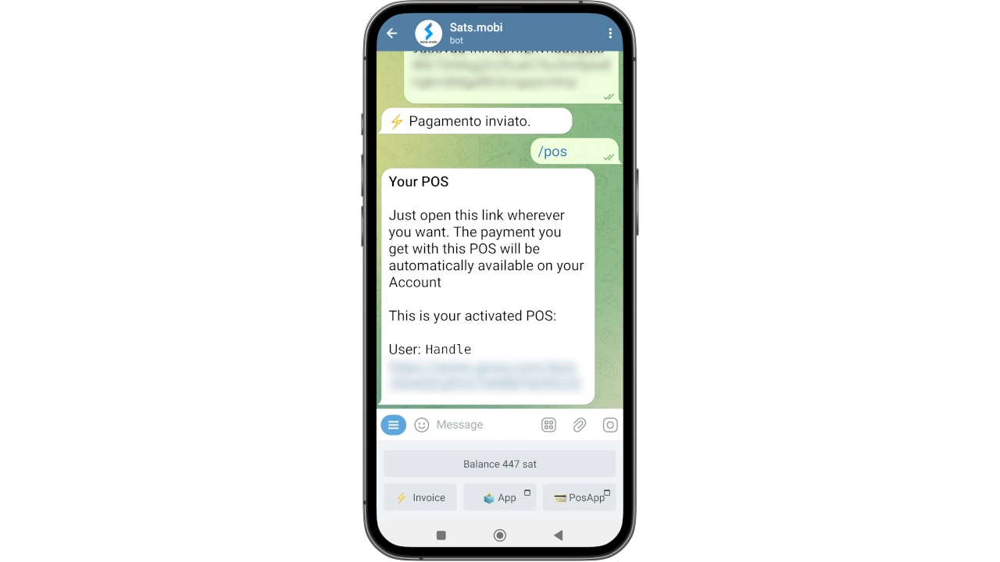
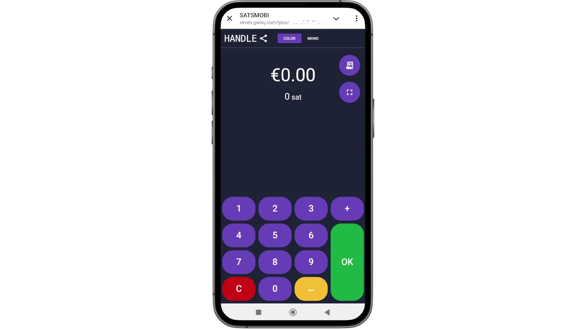
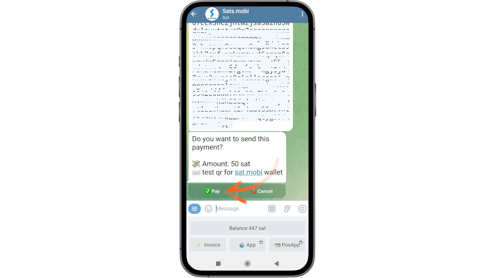

_Mafunzo haya yameandikwa na_ [Kampasi ya Bitcoin](https://linktr.ee/bitcoincampus_)

## Sats.Mobi

SatsMobi ni Wallet inayofanya kazi kwenye Telegram, inayoangazia utendaji wote wa Lightning Network (uhifadhi) Wallet, pamoja na mfululizo wa vipengele vya kuburudisha sana. Ilitoka kwa Fork ya LightningTipBot ambayo haitumiwi sasa, ikirithi sifa zake zote huku ikiongeza za sasa zaidi, na hivyo kuifanya kuwa ya kisasa zaidi. Kama vile LNTipBot, Sats.Mobi pia inakumbatia falsafa ya chanzo huria. Wallet inaweza kusanidiwa na kudhibitiwa kwa kujitegemea kwa kuiiga kutoka kwa [hazina] (https://github.com/massmux/SatsMobiBot).

Ikiwa unapendelea kuitumia kwa urahisi, kuanzisha gumzo kwenye Telegraph kutaonyesha kuwa ni roboti.

## Mipangilio

Kutoka kwa upau wa utafutaji wa Telegram, tafuta "satsmobi" na kiungo cha [bot](@SatsMobiBot) kitaonekana.

**Tahadhari**: Iwapo huna uhakika kuhusu kutafuta kupitia Telegram, fikia kijibu kwa usalama ukitumia [kiungo](https://t.me/SatsMobiBot)

Unachohitaji kufanya ili kuanza ni kubonyeza _START_

Kuchunguza Wallet, unaweza kuchagua _Menu_ chini kushoto.

Sasa chagua _/help_ kati ya amri kuu.

Sats.Mobi inatukaribisha kwa kutuonyesha ujumbe, ikiorodhesha utendakazi wote kuu. Baada ya kuanza, bot pia iliunda LN Address, iliyounganishwa na mpini uliochaguliwa kwenye Telegraph (ambayo ni ya kipekee kwa chaguo-msingi). Amri za kutuma na kupokea Sats na Wallet hii zinaonekana, pamoja na kazi zingine tutaona baadaye. Inafurahisha pia kuangalia menyu ya _/advanced_

Inafahamika kuwa Sats.Mobi pia iliunda LN Address isiyojulikana, ili itumike kupata faragha. Boti inafanya kazi na amri: bonyeza tu kwenye neno linalolingana, au chapa kufyeka "/" kwenye upau wa ujumbe, ikifuatiwa na amri unayotaka kutekeleza. Hata kama Wallet imeundwa hivi punde, chagua kwa mfano _/transactions_

Amri hii inaonyesha orodha ya shughuli za hivi karibuni, katika kesi hii ni sawa na sifuri.

## Inapokea Sats

Amri ya kuunda Invoice na kupokea Sats ni _/ ankara_. Sats.Mobi inafanya kazi pekee katika Satoshi, kitengo kidogo zaidi cha Bitcoin; kwa hiyo, ili kuunda Invoice, ni muhimu kuandika kiasi katika Sats kwenye bar ya ujumbe na kisha kuituma kwenye mazungumzo na bot.

Katika mfano unaofuata, uchaguzi ulifanywa kupokea kiasi cha 210 Sats.

Baada ya muda mchache wa kusubiri Invoice kutayarishwa, inapatikana kama maandishi na kama msimbo wa QR. Kulipa Invoice, Wallet inaonyesha usawa. Ikiwa kwa sababu fulani jumla haijasasishwa, andika _/balance_ na ubonyeze kitufe cha `ingiza`.

## Inatuma Sats

Ingawa Sats ni mali ya thamani sana, ambayo mtu hatakiwi kuiacha kwa urahisi, Sats.Mobi hufanya sehemu hii kuvutia, kufanya majaribio mafupi (yaani, miamala kadhaa ya majaribio) haitakuwa tatizo.

### Kulipa Invoice

Njia rahisi zaidi ya kulipa Invoice ni kunakili kamba ya ujumbe `lnbc1xxxxx` na kuibandika kwenye upau wa ujumbe baada ya kuandika amri _/pay_. **Sintaksia sahihi** inahitaji kuacha nafasi baada ya amri.

Wallet hutuma ujumbe kuomba uthibitisho. Kwa kubofya _Pay_, Invoice inalipwa.

Sats.Mobi inaweza kutegemea nodi ya Umeme yenye ufanisi na iliyounganishwa vyema, ni mara chache sana malipo hushindwa kwa sababu huwa inafanikiwa kupata uelekezaji sahihi.

### Kulipa kwa raha kutoka kwa rununu

Kuvinjari kwenye Telegram, Sats.Mobi inapatikana pia kwenye simu ya mkononi. Kazi rahisi zaidi ya kulipa na simu ni skanning msimbo wa QR, lakini Wallet hii haina kwa kubuni, kwa kuwa sio programu ya kujitegemea lakini iko kwenye mtandao wa kijamii. Kwa hivyo Sats.Mobi imeratibiwa kuwezesha utumiaji wa simu kadiri inavyowezekana: inaweza kusimbua picha, kama picha iliyopigwa ya msimbo wa QR wa Invoice unayotaka kulipa.

Tuseme, kwa mfano, unataka kulipa Invoice ya 50 Sats.

Hii inapoonyeshwa kwetu, tunaweza kupiga picha ya msimbo wa QR unaohusiana.

Kisha tunafungua Telegram kwenye simu ya mkononi na, kwenye gumzo na Sats.Mobi, ambatisha picha iliyopigwa ya msimbo wa QR.

Mara baada ya kuchaguliwa, tunaituma kwa bot:

Sats.Mobi inasimbua picha na **inawasilisha ombi la malipo mara moja**, ikiwa na maelezo sahihi. Gumzo linaomba uthibitisho, ili kuendelea lazima ubonyeze _/pay_

Tafadhali subiri kidogo ili kuruhusu malipo kuchakatwa.

Invoice kwa 50 Sats imelipwa, matokeo yaliyopatikana bila matumizi ya kamera na kazi yake ya skanning jumuishi.

### Sats.Mobi katika Vikundi vya Telegraph

Miongoni mwa vipengele vilivyoifanya LNTipBot kuwa maarufu na ambayo Sats.Mobi inaleta kwenye Telegram, ni kile kinachofanya uzoefu kuwa wa kufurahisha na mwingiliano kwa wanachama katika kikundi.

Wamiliki wanaweza kualika roboti ijiunge na gumzo la kikundi kisha kuteua Sats.Mobi kama msimamizi. Kuanzia wakati huo na kuendelea, furaha huanza, kwa sababu washiriki wanaweza kuanza kuwatuza watumiaji wengine kwa mchango wao kwenye kikundi.

- _/tip_ inaongeza kidokezo kwa kujibu ujumbe;
- _/send_ hutuma fedha zinazobainisha LN Address au mpini wa Telegramu kama mpokeaji;
- _/faucet_ (katika menyu ya _/advanced_) inaruhusu kuunda mfululizo wa vidokezo ambavyo washiriki wa haraka wa kikundi wanaweza kukusanya kwa kubofya _/collect_;
- _/tipjar_ (katika menyu _/advanced_) huunda aina nyingine ya usambazaji ambayo inaweza kutumwa kwa watumiaji katika kikundi.

Kila moja ya amri hizi ina syntax yake, ambayo inaelezwa katika orodha kuu ya amri.

Na ikiwa sisi sio wamiliki wa kikundi? Hakuna tatizo: muulize tu mwanzilishi kualika Sats.Mobi, iongeze kama msimamizi wa kikundi, na uko tayari!

## Sehemu ya Uuzaji (POS)

Sats.Mobi inapozinduliwa kwa mara ya kwanza, roboti pia hutengeneza kipengele kingine kwa ajili ya mtumiaji: **POS**. "Kifaa" huwashwa na mtumiaji kwa amri _/pos_ au kwa kubofya kitufe kinachohusiana kutoka kwenye kiweko kilicho chini kulia. Kwa kweli, POS ni programu ya wavuti, ambayo hufungua kama kiibukizi kwenye gumzo la Telegraph

Interface huonyesha kishikio cha kibinafsi cha Telegramu kwenye sehemu ya juu kushoto na inatumika kama POS zote zinavyotumika: kwa kuandika kiasi kwenye vitufe. Hebu tuseme sasa tunataka kukusanya senti 21 za euro kwa huduma. Kwa kujua kwamba Sats.Mobi inadhibiti Sats pekee, si rahisi kufanya ubadilishaji kichwani mwako. Kinyume chake, POS inaonyesha euro kama kitengo cha akaunti, ikionyesha wakati huo huo sawa katika Satoshi.

Kubofya _/OK_ huonyesha Invoice ambayo inaweza kuonyeshwa kwa mteja kupitia msimbo wa QR, au inayoweza kutumwa kama mfuatano kupitia ujumbe wa papo hapo, ili iweze kulipwa.

Kwa kawaida, POS inapatikana pia kwenye simu za mkononi, kupatikana kwa njia sawa na ilivyoonyeshwa hapo awali.

Pia inaonyeshwa vizuri kwenye skrini ya simu ya rununu:

## Vipengele vya Ziada

Kuna vipengele vingine vinavyokamilisha utoaji wa Sats.Mobi Wallet, ambayo, kama tulivyoona, inapanua dhana ya Wallet zaidi ya shughuli za kupokea na kutuma malipo:

- _/nostr_: kuunganisha Wallet kwa mtumiaji wako wa Nostr ili kupokea zaps;
- _/rejesho la pesa_: huonyesha msimbo unaoweza kuwasilishwa kwa mfanyabiashara ili kupata marejesho ya pesa unaponunua;
- _/buy_: huanza utaratibu ulioongozwa ndani ya bot, ambayo inaruhusu kununua Sats kwa euro;
- _/activatecard_: kuomba kuwezesha kadi ya benki ya NFC, inayoweza kuchajiwa tena kupitia Sats.Mobi Wallet na ambayo arifa zinaweza kuwashwa;
- _/link_: huunda kiungo cha Zeus yako au Bluu Wallet, ambacho kinaweza kutumika kama vidhibiti vya mbali kwa Wallet hii.

## Hitimisho

Sats.Mobi ni Wallet ya kupendeza na ya kufurahisha kutumia, ambayo inarejesha uzoefu uliokuwa nao na LNTipBot kwa kutumia utendaji wa juu zaidi wa LNBits. Hata hivyo, ni muhimu kukumbuka kuwa **ni huduma ya ulezi**. Kwa hiyo, inapaswa kutumika kushikilia Sats chache sana, sio Wallet kuu kwa fedha zako za Lightning Network. Pia kuna kikomo cha uwezo wa ndani, sawa na 500,000 Sats, kikomo ambacho kinashauriwa kisichozidi.

Ikiwa unatafuta pochi zisizo za ulinzi za Lightning Network, hakika ni vyema kutazama bidhaa nyingine.

---
### Nyaraka

- [Github](https://github.com/massmux/SatsMobiBot)
- Orodha ya kucheza ya [video](https://www.youtube.com/results?search_query=Sats.mobi) onyesho