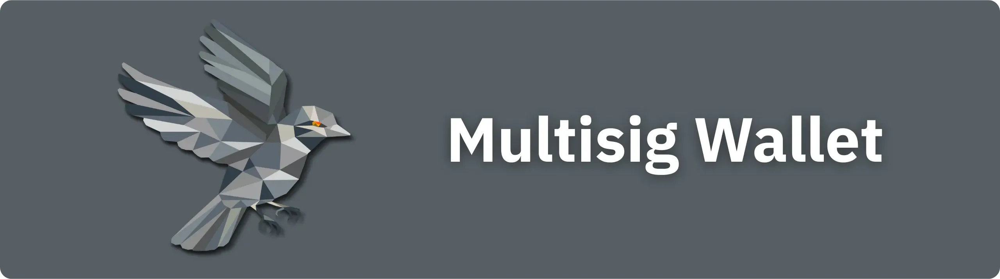

Un Wallet multi-firma (spesso chiamato "*Multisig*") è una struttura Bitcoin Wallet che richiede più firme crittografiche, da chiavi diverse, per autorizzare una spesa. A differenza di un Wallet convenzionale ("*singlesig*"), dove una singola chiave privata è sufficiente per sbloccare un UTXO, il Multisig si basa su un modello **m-of-n**: delle _n_ chiavi associate al Wallet, _m_ devono imperativamente co-firmare ogni transazione.

Questo meccanismo consente di condividere il controllo di un portafoglio tra più entità o dispositivi. Ad esempio, in una configurazione 2 su 3, vengono generate tre serie di chiavi indipendenti, ma solo due sono necessarie per sbloccare i fondi. Questa architettura riduce drasticamente i rischi associati alla compromissione o alla perdita di una chiave: un ladro che ha accesso a una sola chiave non può svuotare il Wallet, e un utente che ne perde una può comunque accedere ai suoi fondi con le altre due.

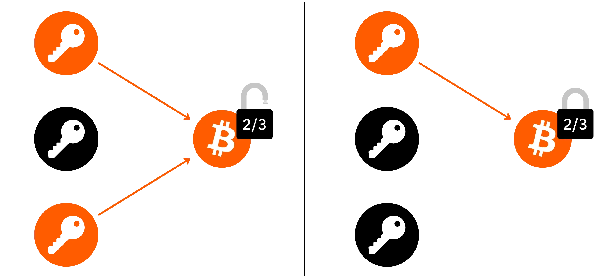

Tuttavia, questa maggiore sicurezza comporta una maggiore complessità. La configurazione di un Multisig Wallet richiede la protezione di diverse frasi Mnemonic (una per fattore di firma) e di chiavi pubbliche estese ("*xpub*"). Infatti, se si utilizza un Multisig 2-of-3 Wallet, per recuperare il Wallet è necessario disporre di tutte e tre le frasi Mnemonic o di almeno due delle tre frasi. Ma se si dispone solo di due delle tre frasi, è necessario accedere anche alle tre *xpub*, senza le quali sarà impossibile recuperare le chiavi pubbliche necessarie per accedere ai bitcoin che proteggono.

In sintesi, per recuperare un portafoglio Multisig, è necessario :

- Oppure accedere a tutte le frasi Mnemonic associate a ciascun fattore di firma;
- O avere il numero minimo di frasi Mnemonic richiesto dalla soglia per poter firmare, e anche avere accesso alle xpub di tutti i fattori per recuperare le chiavi pubbliche necessarie.

La gestione dei backup del portafoglio Multisig è facilitata da *Descrittori di script di uscita*, che raggruppano tutti i dati pubblici necessari per accedere ai fondi. Tuttavia, questa funzionalità non è ancora implementata in tutti i software di gestione del portafoglio.

Multisig è particolarmente adatto ai bitcoiners che cercano una maggiore sicurezza o una gestione collettiva dei fondi: aziende, associazioni, famiglie o singoli utenti che detengono una quantità significativa di bitcoin. Può essere utilizzato per creare schemi di governance decentralizzati, ad esempio per distribuire l'autorità di firma tra diversi manager o membri del team.

In questa esercitazione impareremo a creare e utilizzare un classico Wallet a più firme con **Sparrow Wallet**. Se desiderate creare un portafoglio multi-firma personalizzato con orologi a tempo, vi consiglio di utilizzare il Liana:

https://planb.network/tutorials/wallet/desktop/liana-306ef457-700c-4fdd-b07a-8fb7a8a29f04

## Prerequisiti

In questa esercitazione vi mostrerò come creare un Multisig con [Sparrow Wallet portfolio management software](https://sparrowwallet.com/download/). Se non avete ancora installato questo software, fatelo subito. Se avete bisogno di aiuto, abbiamo anche un tutorial dettagliato sulla configurazione di Sparrow Wallet :

https://planb.network/tutorials/wallet/desktop/sparrow-c674e2ac-d46f-4c82-92a7-7d1b0e262f5d)

Per configurare un Wallet multi-firma, sono necessari diversi portafogli hardware. Per un Multisig 2-de-3, ad esempio, si può utilizzare :

- Un Trezor modello 1;
- Ledger Flex;
- Una Coldcard MK3.

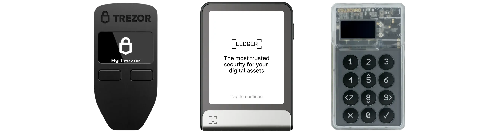

È una buona idea utilizzare diverse marche di Hardware Wallet nella configurazione del Multisig. In questo modo si garantisce che se un modello specifico presenta un problema serio, ciò influisce sulla sicurezza generale del Multisig. In questo modo si garantisce che se un modello specifico presenta un problema grave, questo non influisce sulla sicurezza complessiva del Multisig. Inoltre, si può beneficiare dei vantaggi specifici di ciascun dispositivo. Inoltre, consente di beneficiare dei vantaggi specifici di ciascun dispositivo. Ad esempio, nella mia configurazione :

- Il Trezor Model One è completamente open-source, il che rende possibile la verifica della generazione seed. Tuttavia, non essendo dotato di un elemento sicuro, rimane vulnerabile agli attacchi fisici;

- Il Ledger Flex, invece, beneficia di un firmware proprietario non verificabile, ma incorpora un Secure Element che offre un'eccellente protezione fisica;

- La Coldcard è dotata di un Secure Element e il suo codice è ricercabile. È una scelta interessante per la nostra configurazione, in quanto offre funzioni di verifica non disponibili su altri modelli.

Prima di configurare il Multisig Wallet, assicurarsi che ogni Hardware Wallet sia configurato correttamente (generazione e salvataggio del Mnemonic, definizione del PIN). Per istruzioni dettagliate, è possibile consultare i nostri tutorial per ogni Hardware Wallet, ad esempio :

https://planb.network/tutorials/wallet/hardware/trezor-model-one-5c250c49-ce3b-4c63-bd05-4600d7c11a02

https://planb.network/tutorials/wallet/hardware/ledger-flex-3728773e-74d4-4177-b39f-bd923700c76a

https://planb.network/tutorials/wallet/hardware/coldcard-q-73e86d1a-6fe6-4d8b-bb15-8690298020e3

Come vedremo più avanti in questo tutorial, è anche possibile integrare nella configurazione del Multisig un fattore che non è associato a un Hardware Wallet, ma le cui chiavi private sono memorizzate sul vostro PC. Questo metodo è ovviamente meno sicuro dell'uso esclusivo di portafogli hardware, ma può essere rilevante in alcuni casi. Ad esempio, per un Multisig 2-de-3, si potrebbe optare per due portafogli hardware e un Software Wallet.

## Creare un portafoglio Multisig

Aprire Sparrow Wallet, fare clic sulla scheda "*File*", quindi selezionare "*New Wallet*".

Assegnare un nome al portafoglio con più firme, quindi fare clic su "*Crea Wallet*" per confermare.

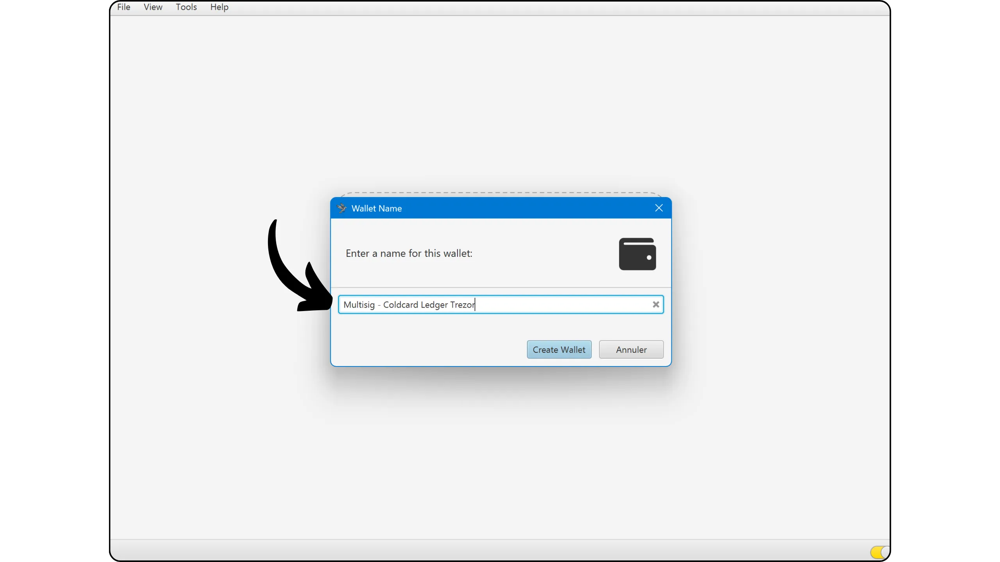

Nel menu a discesa "*Tipo di politica*", selezionare l'opzione "*Multi firma*".

Nell'angolo in alto a destra è possibile definire il numero totale di chiavi nel Multisig e il numero di cofirmatari necessari per autorizzare una spesa. Nel mio esempio, si tratta di uno schema di 2 su 3.

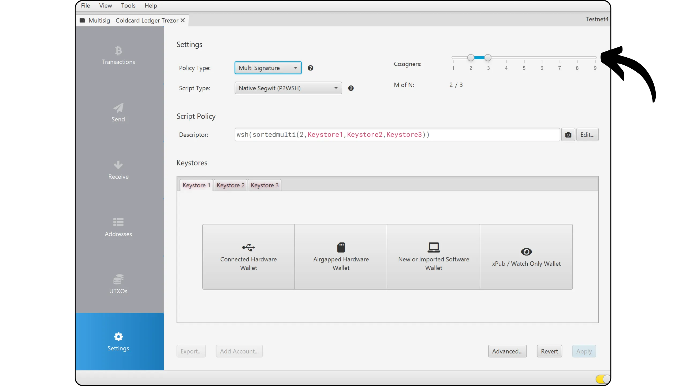

Nella parte inferiore della finestra, Sparrow Wallet visualizza tre "*Keystore*". Ognuno di essi rappresenta un set di chiavi. Qui sto usando tre portafogli hardware, quindi ogni "*Keystore*" corrisponde a uno di essi. Ora li configureremo.

Inizio con la Coldcard. Nella scheda "*Keystore 1*", scelgo l'opzione "*Airgapped Hardware Wallet*".

Sulla Coldcard, una volta sbloccato il dispositivo, vado al menu "*Impostazioni*", quindi a "*Portafogli Multisig*".

Questo menu consente di gestire i portafogli Multisig a cui partecipa la Coldcard. Se voglio crearne uno nuovo, seleziono "*Esporta XPUB*".

Per il campo "*Numero di conto*", se si gestisce un solo conto, è possibile lasciarlo vuoto e convalidare direttamente premendo il pulsante di conferma.

La scheda Coldcard visualizza quindi generate un file contenente la vostra xpub, salvata sulla scheda Micro SD.

Inserire la Micro SD nel computer. In Sparrow Wallet, fare clic sul pulsante "*Importa file...*" accanto a "*Coldcard Multisig*", quindi selezionare il file creato dalla Coldcard sulla scheda.

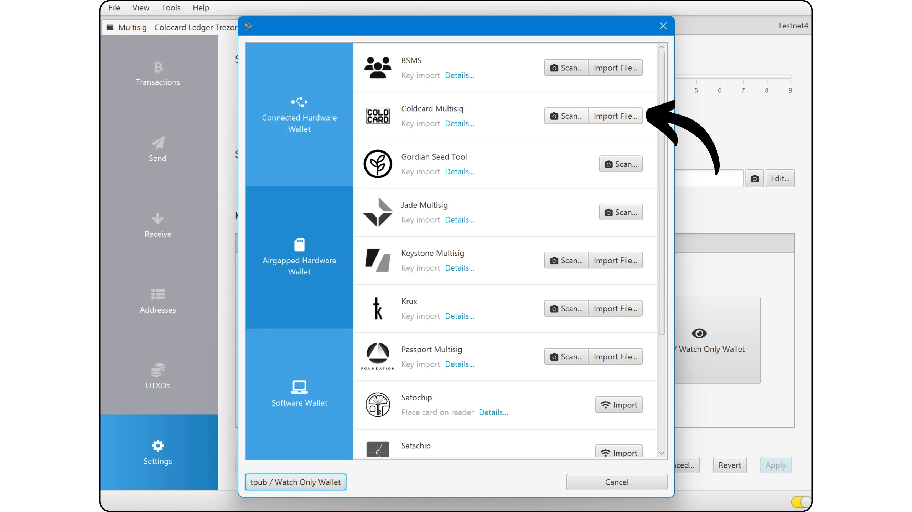

Il vostro xpub è stato importato con successo. Ora ripetiamo la procedura con gli altri due portafogli hardware.

Per il Ledger Flex, seleziono "*Keystore 2*", quindi faccio clic su "*Connected Hardware Wallet*". Assicurarsi che il Ledger sia collegato al computer, sbloccato e che l'applicazione Bitcoin sia aperta.

Quindi fare clic sul pulsante "*Scansione...*".

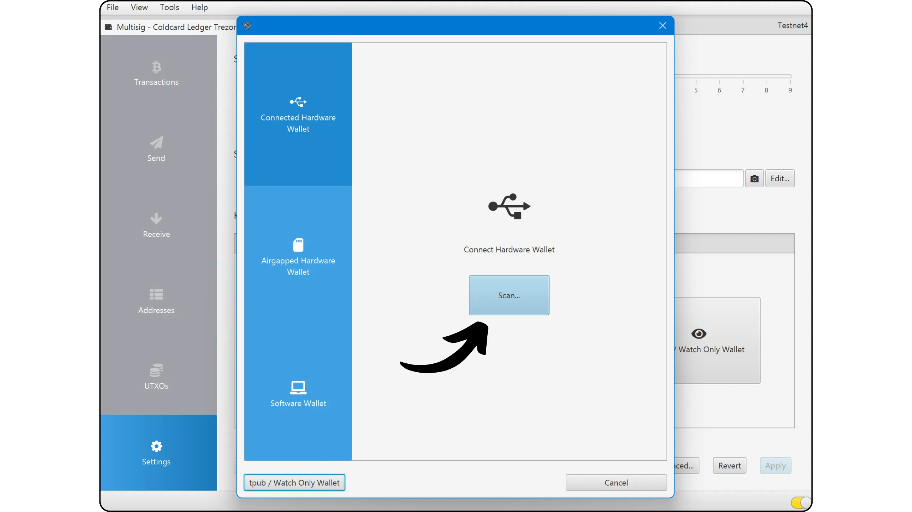

Accanto al nome del portafoglio hardware, fare clic su "*Import Keystore*".

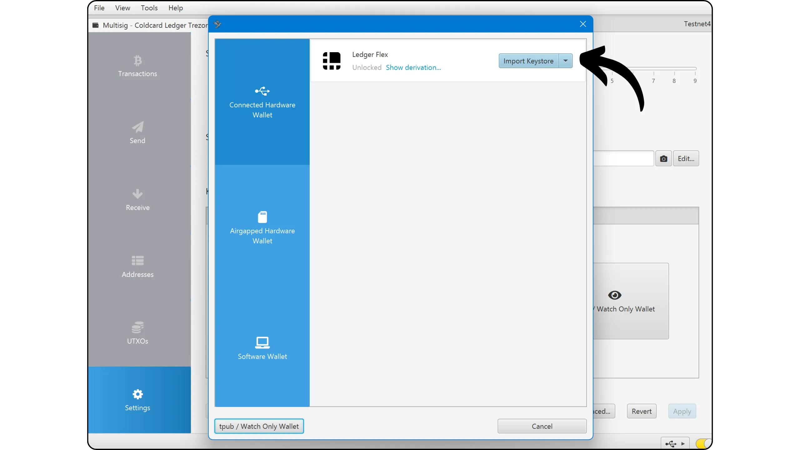

Il secondo firmatario è ora correttamente registrato in Sparrow Wallet.

Ripeto esattamente la stessa procedura con il Trezor One per finalizzare la configurazione del Multisig.

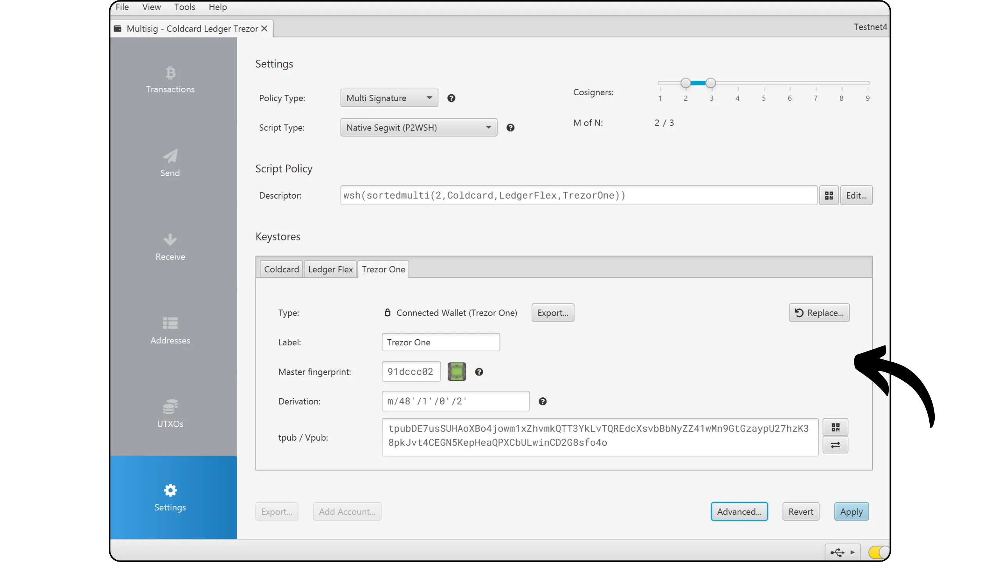

Nella mia configurazione non è contemplato questo caso, ma se si desidera includere una firma tramite un Software Wallet in Sparrow (Hot Wallet) all'interno del proprio Multisig, è sufficiente fare clic sul pulsante "*Nuovo o importato Software Wallet*".

Ora che tutti i dispositivi di firma sono stati importati in Sparrow Wallet, è possibile finalizzare la creazione di Multisig facendo clic su "*Apply*".

Scegliere una password forte per proteggere l'accesso al proprio Sparrow Wallet Wallet. Questa password protegge le chiavi pubbliche, gli indirizzi, le etichette e la cronologia delle transazioni da accessi non autorizzati.

Ricordate di salvare la password in un luogo sicuro, ad esempio in un gestore di password, per evitare di perderla.

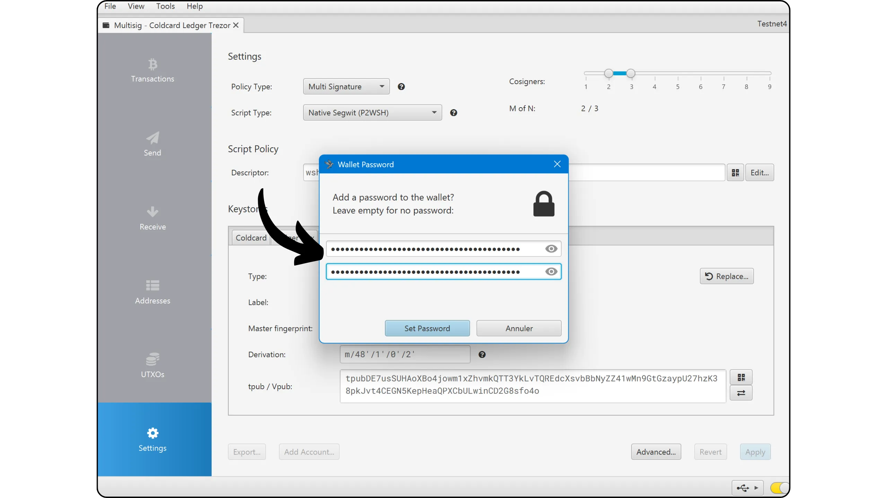

## Backup di un portafoglio Multisig

Ora salveremo il nostro *Descrittore script di uscita* sulla Coldcard (questo vale solo per gli utenti che hanno una Coldcard nel loro Multisig) e, soprattutto, ne terremo una copia di backup su un supporto indipendente.

Il *Descrittore* contiene tutte le xpub del portafoglio Multisig, nonché i percorsi di derivazione utilizzati per generate le chiavi. Ricordiamo quanto visto nella Parte 1: per ripristinare un portafoglio Multisig, è necessario avere **tutte** le frasi Mnemonic, oppure solo il numero minimo richiesto per raggiungere la soglia di firma. Tuttavia, in quest'ultimo caso, è essenziale avere anche **gli xpub** dei firmatari mancanti. Il *Descrittore* contiene tutte le xpub del Multisig.

Se non è chiaro, ricordate solo questo: per recuperare un Multisig, è necessario il numero minimo di frasi Mnemonic per ogni Hardware Wallet utilizzato, a seconda della soglia (nel mio caso: 2 frasi), oltre al *Descrittore*.

Questo *Descrittore* non contiene chiavi private, ma solo chiavi pubbliche. Ciò significa che non dà accesso ai fondi. Non è quindi critico come le frasi Mnemonic, che danno pieno accesso ai bitcoin. Il rischio del *Descrittore* è legato esclusivamente alla riservatezza: in caso di compromissione, una terza parte potrebbe osservare tutte le vostre transazioni, ma non potrebbe spendere i vostri fondi.

Consiglio vivamente di creare diverse copie di questo *Descriptor* e di conservarle con ciascun dispositivo di firma del Multisig. Ad esempio, nel mio caso, stampo il *Descriptor* su carta e ne conservo una copia con la Coldcard, un'altra con il Trezor e una con il Ledger. Inoltre, salvo questo *Descriptor* in formato PDF su tre chiavette USB, ognuna delle quali viene conservata con uno dei portafogli hardware. In questo modo, massimizzo le possibilità di non perdere mai questo *Descriptor* e sono sicuro di avere due copie (una fisica e una digitale) con ogni dispositivo.

Una volta creato il portafoglio Multisig, Sparrow fornisce automaticamente questo *Descrittore*. Fare clic sul pulsante "*Salva PDF...*" per salvarlo sia come testo che come codice QR.

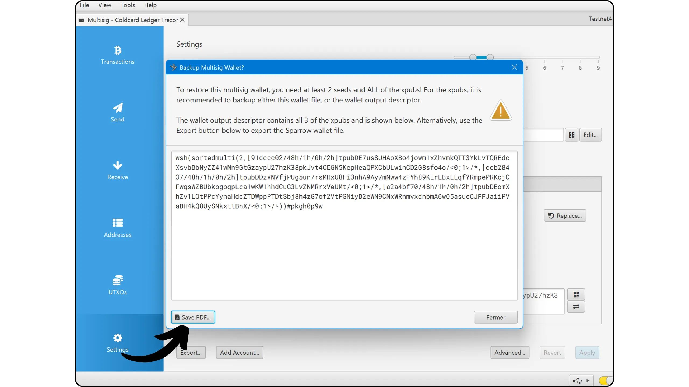

È quindi possibile stampare il PDF e copiarlo sulle chiavette USB.

Registreremo anche questo *Descrittore* nella Coldcard (se ne usate una nella vostra configurazione). Ciò consentirà a Coldcard di verificare che ogni transazione firmata in seguito corrisponda al Wallet originale: xpub corretto, formato Address corretto, percorso di derivazione corretto... Senza questo *Descrittore* importato, Coldcard non può confermare che gli indirizzi Exchange non siano stati dirottati o che il PSBT non sia stato manomesso.

Questo è ciò che rende la Coldcard così interessante in un Multisig: offre controlli aggiuntivi contro alcuni attacchi sofisticati, che altri portafogli hardware non consentono (a condizione, ovviamente, che la si usi per firmare).

In Sparrow, accedere al menu "*Impostazioni*", quindi fare clic su "*Esportazione...*".

Accanto all'opzione "*Coldcard Multisig*", fare clic su "*Esporta file...*" e salvare il file di testo sulla scheda Micro SD.

Inserire quindi la scheda nella Coldcard. Andare al menu "*Impostazioni*", quindi "Portafogli Multisig*" e selezionare "*Importa da SD*".

Selezionare il file appropriato e confermare l'importazione.

Fare clic sul nome del nuovo Multisig importato.

Controllare i parametri di configurazione del Multisig, quindi confermare la registrazione.

Il Multisig è ora correttamente salvato nella Coldcard. Se si dispone di più Coldcard nello stesso Multisig, ripetere questa procedura per ciascuna di esse.

Oltre a salvare il *Descrittore*, non dimenticate di prestare particolare attenzione al salvataggio delle frasi Mnemonic per ciascuno dei vostri dispositivi di firma. Se siete alle prime armi, vi consiglio di consultare quest'altra guida per imparare a salvarle e gestirle correttamente:

https://planb.network/tutorials/wallet/backup/backup-mnemonic-22c0ddfa-fb9f-4e3a-96f9-46e2a7954270

Prima di ricevere i primi bitcoin sul Multisig, **vi consiglio vivamente di eseguire un test di ripristino a vuoto**. Annotare alcune informazioni di riferimento, come la prima ricezione del Address, quindi ripristinare i portafogli hardware mentre il Wallet è ancora vuoto. Successivamente, provare a ripristinare il Multisig Wallet sui portafogli hardware utilizzando i backup cartacei della frase Mnemonic, quindi su Sparrow utilizzando il *Descrittore*. Verificare che il primo Address generato dopo il ripristino corrisponda a quello scritto originariamente. Se così fosse, si può essere certi che i backup cartacei sono affidabili.

Per saperne di più su come eseguire un test di ripristino, vi suggerisco di consultare quest'altra guida:

https://planb.network/tutorials/wallet/backup/recovery-test-5a75db51-a6a1-4338-a02a-164a8d91b895

## Ricevere bitcoin sul vostro Multisig

Il vostro Wallet è ora pronto a ricevere bitcoin. In Sparrow, fare clic sulla scheda "*Receive*".

Prima di utilizzare il Address generato da Sparrow Wallet, prendetevi il tempo di verificarlo direttamente sullo schermo dei vostri portafogli hardware. In questo modo vi assicurerete che il Address non sia stato alterato e che i vostri dispositivi possiedano le chiavi private necessarie per spendere i fondi associati. Questo aiuta a proteggersi da una serie di vettori di attacco.

A tal fine, fare clic su "*Display Address*" per visualizzare il Address sul Trezor o sul Ledger, se collegato via cavo.

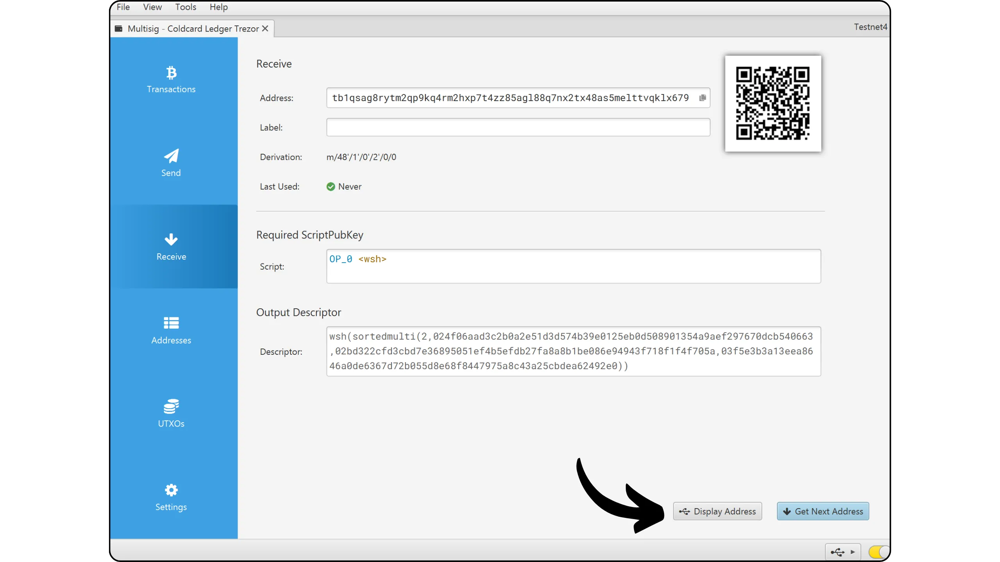

Con Coldcard, questa verifica può essere effettuata senza alcuna interazione con Sparrow. È sufficiente aprire il menu "*Address Explorer*" e selezionare il proprio Multisig in basso.

Si vedranno quindi gli indirizzi di ricezione generati dal Multisig.

Verificare che il Address visualizzato su ogni Hardware Wallet corrisponda esattamente a quello del Wallet di Sparrow. È consigliabile eseguire questa operazione appena prima di condividere il Address con il pagatore, per essere sicuri della sua integrità.

È quindi possibile assegnare un'"etichetta" a questo Address, per indicare l'origine dei bitcoin ricevuti. Questo è un buon modo per organizzare la gestione dei vostri UTXO.

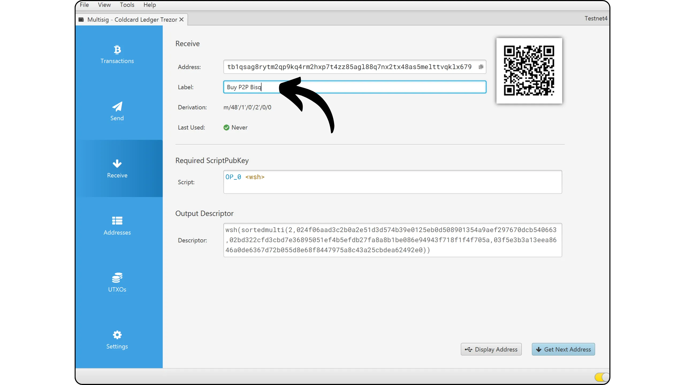

Una volta verificato, è possibile utilizzare il Address per ricevere bitcoin.

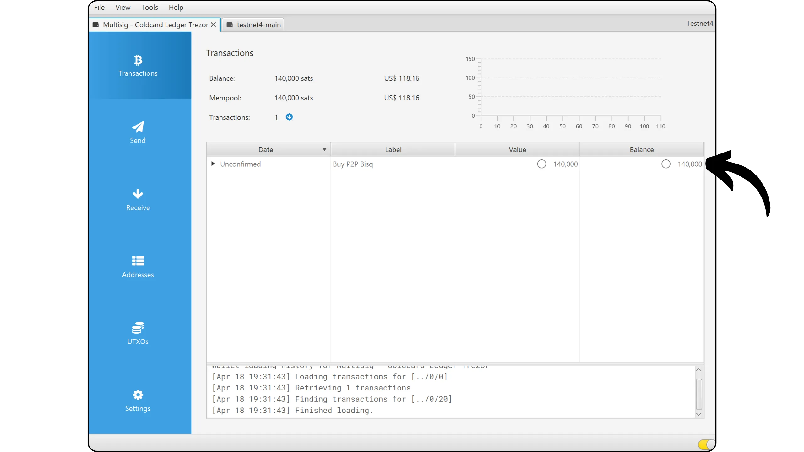

## Inviare bitcoin con il vostro Multisig

Ora che avete ricevuto i primi Satss sul vostro Multisig Wallet, potete anche spenderli! In Sparrow, vai alla scheda "*Invio*" per creare una nuova transazione.

Se si desidera utilizzare il *Controllo monete*, ossia selezionare manualmente gli UTXO da spendere, andare alla scheda "*UTXO*". Scegliete gli UTXO che desiderate spendere, quindi cliccate su "*Invia selezionati*". Si verrà automaticamente reindirizzati alla scheda "*Invio*", con gli UTXO già precompilati.

Inserire la destinazione Address. È possibile aggiungere più indirizzi facendo clic su "*+ Aggiungi*".

Aggiungere una "*Etichetta*" per descrivere lo scopo di questa spesa, per facilitare la tracciabilità delle transazioni.

Inserire l'importo da inviare al Address selezionato.

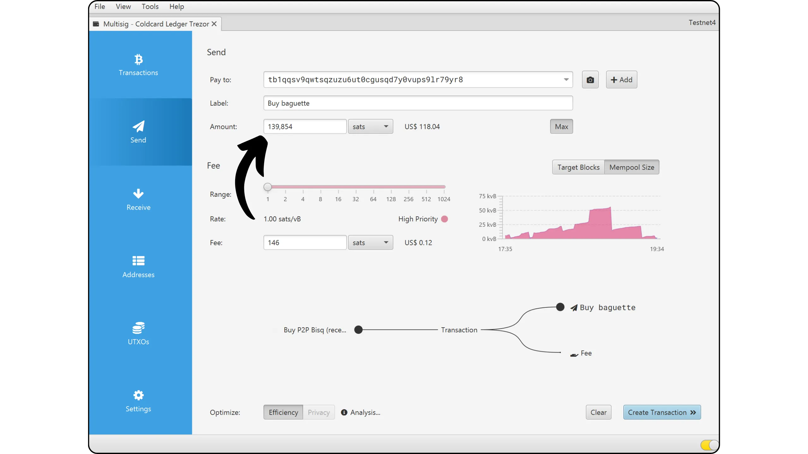

Regolare il tasso di carica in base alle condizioni attuali della rete. Ad esempio, consultare [Mempool.space](https://Mempool.space/) per selezionare un livello di carica adeguato.

Dopo aver controllato tutti i parametri della transazione, fare clic su "*Crea transazione*".

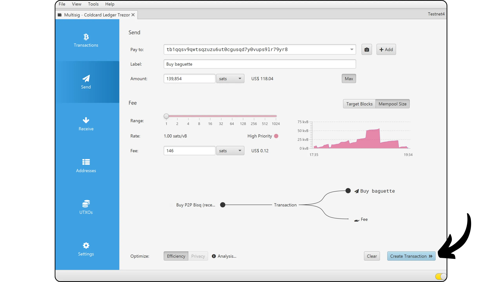

Se siete soddisfatti di tutto, fate clic su "*Finalizza transazione per la firma*".

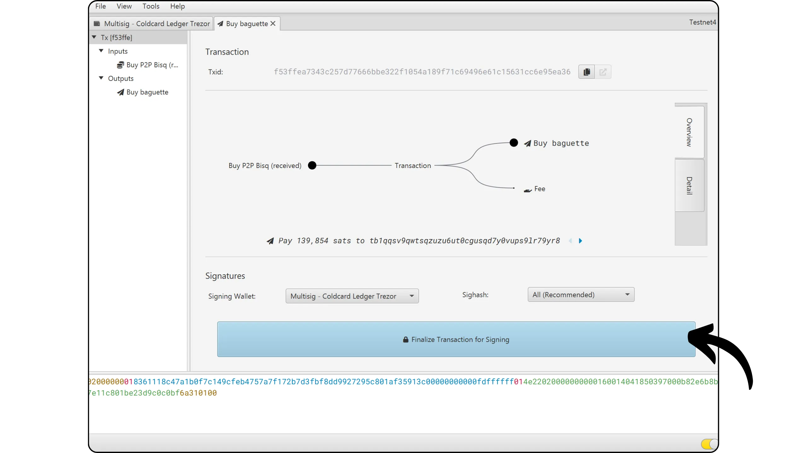

Nella parte inferiore dello schermo, vedrete che Sparrow è in attesa di 2 firme. Questo è normale: il Wallet usato qui è un Multisig 2-de-3.

Inizio a firmare con la mia Coldcard. A tal fine, inserisco una scheda Micro SD nel computer, quindi faccio clic su "*Salva transazione*".

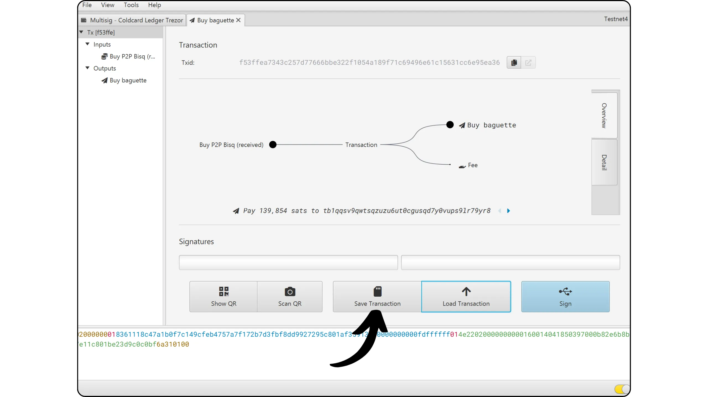

Esistono 3 modi per trasmettere la transazione da firmare al Hardware Wallet e poi recuperarla da Sparrow. Il primo è utilizzare una scheda Micro SD, come faremo qui per la Coldcard. Il secondo è tramite una connessione via cavo, che utilizzeremo per la seconda firma (Ledger e Trezor). Infine, è possibile utilizzare la comunicazione tramite codice QR, per i dispositivi dotati di fotocamera come Coldcard Q, Jade Plus o Passport V2.

Una volta salvato il PSBT (*Partially Signed Bitcoin Transaction*) sulla Micro SD, lo inserisco nella Coldcard MK3, quindi seleziono il menu "*Pronto per la firma*".

Sullo schermo del Hardware Wallet, controllare attentamente i parametri della transazione: il Address del destinatario, l'importo inviato e le spese. Una volta confermata la transazione, convalidare per procedere alla firma.

Riportare quindi la Micro SD sul computer e fare clic su "*Carica transazione*" in Sparrow. Selezionate il PSBT firmato da Coldcard dai vostri file.

Si può notare che la firma Coldcard è stata aggiunta. Ora utilizzerò un secondo dispositivo, in questo caso il Ledger, per eseguire la seconda firma richiesta. Lo collego, lo sblocco e poi faccio clic su "*Firma*" su Sparrow.

Fare clic su "*Firma*" accanto al nome del proprio Hardware Wallet.

La prima volta che si utilizza il Ledger con questo Multisig, Sparrow chiederà di verificare le chiavi pubbliche estese (xpub) dei cofirmatari. Come nel caso della Coldcard, questo passaggio impedisce di firmare alla cieca in seguito. Per convalidare queste informazioni, confrontare le xpub visualizzate sullo schermo del Ledger con quelle fornite direttamente dagli altri portafogli hardware.

Controllare il Address del destinatario, l'importo trasferito e la tariffa della transazione, quindi firmare la transazione.

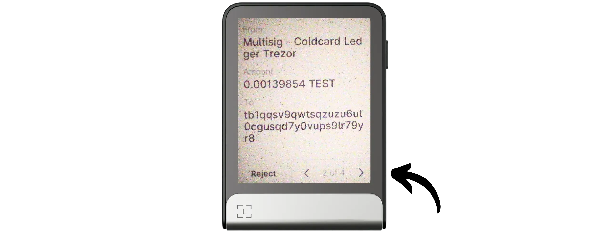

Premere lo schermo per firmare.

Sparrow dispone ora delle due firme necessarie per rilasciare i fondi dal portafoglio Multisig. Controllate la transazione un'ultima volta e, se tutto va bene, fate clic su "*Diffusione della transazione*" per trasmetterla in rete.

Questa transazione si trova nella scheda "*Transazioni*" di Sparrow Wallet.

Congratulazioni, ora sapete come impostare e utilizzare una firma multipla Wallet su Sparrow. Se avete trovato utile questa guida, vi sarei grato se lasciaste un pollice Green qui sotto. Non esitate a condividere questo articolo sui vostri social network. Grazie per la condivisione!

Per andare oltre, vi consiglio di consultare questo tutorial su un altro metodo per aumentare la sicurezza del vostro Bitcoin Wallet, il passphrase BIP39 :

https://planb.network/tutorials/wallet/backup/passphrase-a26a0220-806c-44b4-af14-bafdeb1adce7