*චිත්‍ර ණය: [Trezor.io](https://trezor.io/)*

Trezor Model One je prvi Hardware Wallet, ki je bil kdajkoli izdan, lansiran leta 2014 s strani SatoshiLabs. Po več kot desetih letih obstoja ostaja zanimiva izbira, zlasti za uporabnike, ki iščejo Hardware Wallet, ki je dostopen tako tehnično kot tudi cenovno. Pravzaprav je na uradni spletni strani Trezor cena €49. Je ena izmed redkih strojnih denarnic v tem cenovnem razredu. Nahaja se med osnovnimi napravami okoli €20, kot je Tapsigner, ki pogosto nimajo zaslona, in napravami srednjega razreda okoli €80, kot sta Ledger Nano S Plus ali Trezor Safe 3.

Model One හි විශේෂාංග ලෙස 0.96 අඟල් මොනොක්‍රෝම් OLED ප්‍රදර්ශනයක් සහ භෞතික බොත්තම් දෙකක් ඇත. එය බලය සහ දත්ත සඳහා මයික්‍රෝ-USB සම්බන්ධතාවයක් පමණක් භාවිතා කරමින් බැටරියකින් තොරව ක්‍රියා කරයි Exchange.

Model One හි ප්‍රධාන අඩුපාඩුව වන්නේ එහි ආරක්ෂිත මූලද්‍රව්‍යයක් නොමැති වීමයි, එය විවිධ භෞතික ප්‍රහාරවලට අරමුණු කරගත හැකි අතර, එම ප්‍රහාරවලින් සමහරක් ක්‍රියාත්මක කිරීමට සරල වේ. මෙම ප්‍රහාර වලට උපාංගයේ PIN තීරණය කිරීම සඳහා අනුමිතිය නාලිකා විශ්ලේෂණය හෝ පසුව එය බෲට්-ෆෝස් කිරීම සඳහා සංකේතනය කළ seed ලබා ගැනීම සඳහා වඩාත් උසස් තාක්‍ෂණයන් ඇතුළත් විය හැකිය. මෙම ප්‍රහාර සඳහා උපාංගයට භෞතික ප්‍රවේශය අවශ්‍ය බව සලකන්න. කෙසේ වෙතත්, ශක්තිමත් passphrase BIP39 භාවිතා කිරීමෙන් මෙම අවදානම සැලකිය යුතු ලෙස අඩු කළ හැකිය. ඔබ මෙම Hardware Wallet තෝරා ගන්නේ නම්, passphrase සකසන්නැයි මම දැඩිව උපදෙස් දෙමි.

Model One දෙවන වැදගත් වාසි දෙකක් ලබා දේ:

- To je osnovano na popolnoma odprtokodni arhitekturi. Za razliko od novejših modelov s Secure Element, so vsi strojni in programski elementi Model One preverljivi;
- එය තිරයකින් සන්නද්ධ වේ. මගේ දැනුමට, මෙය තිරයක් සහිතව මෙම මිල පරාසයේ වෙළඳපොළේ ඇති එකම Hardware Wallet ය. මෙය ඉතා වැදගත් විශේෂාංගයක් වන අතර, එය අත්සන් කළ තොරතුරු සහ පිළිගැනීමේ ලිපින සනාථ කිරීමට ඉඩ සලසන අතර, එමඟින් බොහෝ ඩිජිටල් ප්‍රහාර වලක්වයි.

එබැවින්, Trezor Model One යනු සීමිත ආදායමක් ඇති ආරම්භකයින් සහ මධ්‍යම පරිශීලකයින් සඳහා බුද්ධිමත් තේරීමක් නියෝජනය කළ හැක. කෙසේ වෙතත්, Secure Element එකක් නොමැති වීම නිසා භෞතික ආරක්ෂාව සම්බන්ධයෙන් එහි සීමා පිළිබඳව අවධානයෙන් සිටීම වැදගත් වේ. ඔබේ ආදායම සීමිත නම්, මෙය හොඳ විකල්පයක් වන නමුත්, ඔබට €79 ක Trezor Safe 3 වැනි උසස් ආකෘතියක් තෝරා ගැනීමට හැකි නම්, එය වඩාත් කැමති වේ, මන්ද එය Secure Element එකක් අඩංගු වේ.

## Trezor Model One අමුත්තුවෙන් විවෘත කිරීම

ඔබගේ Model One ලැබුණු විට, පැකේජය විවෘත කර නොමැති බව තහවුරු කිරීමට පෙට්ටිය සහ Seal අඛණ්ඩව ඇති බව සහතික කරන්න. පසුව සකස් කරන විට උපාංගයේ සත්‍යතාවය සහ අඛණ්ඩතාවය සොයා බැලීමේ මෘදුකාංග සත්‍යාපනයක් ද සිදු කෙරේ.

බොක්ස් අන්තර්ගතයන් වන්නේ :

- Trezor Model One;
- කඩදාසි පත Mnemonic වාක්‍යය සටහන් කිරීමට, ස්ටිකර් සහ උපදෙස්;
- USB-A to micro-USB කේබල්.

සංචාලනය කිරීම ඉතා සරලයි:

- දකුණු මූසික බොත්තම ක්ලික් කර තහවුරු කර, ඊළඟ පියවර වෙත ගමන් කරන්න;
- වම බොත්තම භාවිතා කර පිටුපසට යන්න.

## අවශ්‍යතා

මෙම උපකාරිකාව සඳහා, මම ඔබට Trezor Model One [Sparrow Wallet පෝර්ට්ෆෝලියෝ කළමනාකරණ මෘදුකාංගය](https://sparrowwallet.com/download/) සමඟ භාවිතා කරන ආකාරය පෙන්වන්න යන්නේ. ඔබ මෙතෙක් මෙම මෘදුකාංගය ස්ථාපනය කර නැත්නම්, කරුණාකර දැන් එය කරන්න. ඔබට උදව් අවශ්‍ය නම්, Sparrow Wallet වින්‍යාස කිරීම පිළිබඳ විස්තරාත්මක උපකාරිකාවක් අපට ඇත:

https://planb.network/tutorials/wallet/desktop/sparrow-c674e2ac-d46f-4c82-92a7-7d1b0e262f5d

Model One සකසීමට, එහි සත්‍යතාවය පරීක්ෂා කිරීමට සහ ෆාර්ම්වේයර් ස්ථාපනය කිරීමට ඔබට Trezor Suite මෘදුකාංගයද අවශ්‍ය වනු ඇත. අපි එම මෘදුකාංගය භාවිතා කරන්නේ එම කාර්ය සඳහා පමණක් වන අතර, පසුව එය ෆාර්ම්වේයර් යාවත්කාලීන කිරීම් සඳහා පමණක් අවශ්‍ය වේ. Wallet හි දෛනික කළමනාකරණය සඳහා, අපි Sparrow Wallet පමණක් භාවිතා කරන අතර, එය Bitcoin සඳහා උපරිම කර ඇති අතර, ආරම්භකයින්ට පවා භාවිතා කිරීමට පහසුය (Sparrow, Bitcoin පමණක් සහය දක්වයි, altcoins නොවේ).

[डाउनलोड गर्नुहोस् Trezor Suite आधिकारिक वेबसाइटबाट](https://trezor.io/trezor-suite)

මෙම වැඩසටහන් දෙක සඳහාම, මම දැඩිව නිර්දේශ කරන්නේ ඔබේ පරිගණකය මත ස්ථාපනය කිරීමට පෙර එහි සත්‍යතාව (GnuPG සමඟ) සහ ඒකාබද්ධතාව (Hash හරහා) පරීක්ෂා කරන ලෙසයි. ඔබට මෙය කරන්නේ කෙසේද යන්න නොදන්නා නම්, ඔබට මෙම වෙනත් උපකාරකය අනුගමනය කළ හැක:

https://planb.network/tutorials/computer-security/data/integrity-authenticity-21d0420a-be02-4663-94a3-8d487f23becc

## Trezor Model One ආරම්භ කිරීම

ඔබේ මොඩල් වන් ඔබේ පරිගණකයට සම්බන්ධ කරන්න, එහි Trezor Suite සහ Sparrow Wallet දැනටමත් ස්ථාපනය කර ඇත.

Trezor Suite odprite, nato kliknite na "*Nastavi moj Trezor*".

"*Bitcoin-only firmware*" තෝරන්න, එවිට "*Install Bitcoin-only*" මත ක්ලික් කරන්න.

Trezor Suite nato bo namestil vdelano programsko opremo na vaš Model One. Prosimo, počakajte med namestitvijo.

කොටස "*Continue*" මත ක්ලික් කරන්න.

## Bitcoin පෝර්ට්ෆෝලියෝවක් නිර්මාණය කිරීම

Trezor Suite මත, "*Create new Wallet*" බොත්තම ක්ලික් කරන්න.

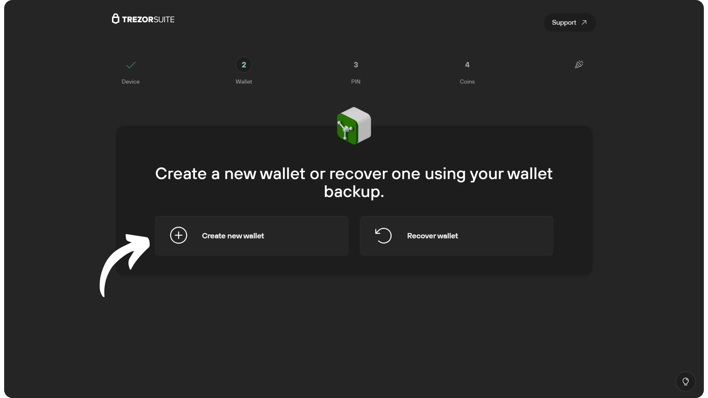

Hardware Wallet මත භාවිත නියමයන් පිළිගන්න.

Trezor Suite හි, "*ආපසු සුරැකුමට දිගටම යන්න*" ක්ලික් කරන්න.

මෘදුකාංගය ඔබේ Mnemonic වාක්‍යය කළමනාකරණය කරන ආකාරය පිළිබඳ උපදෙස් ලබා දේ.

මෙම Mnemonic ඔබට ඔබේ සියලුම බිට්කොයින් සඳහා සම්පූර්ණ, අසීමිත ප්‍රවේශය ලබා දේ. මෙම වාක්‍යය සතු කිසිවෙකුට, ඔබේ Trezor Model One වෙත භෞතික ප්‍රවේශය නොමැතිව පවා, ඔබේ මුදල් සොරාගත හැක.

24-शब्द वाक्यांशले तपाईंको Hardware Wallet हराएमा, चोरी भएमा वा बिग्रिएमा तपाईंको बिटकोइनहरूमा पहुँच पुनर्स्थापित गर्दछ। त्यसैले यसलाई सावधानीपूर्वक बचत गर्नु र सुरक्षित ठाउँमा भण्डारण गर्नु अत्यन्त महत्त्वपूर्ण छ।

ඔබට එය පෙට්ටියෙන් සපයන ලද පපිරිය මත ලිවිය හැකි අතර, අමතර ආරක්ෂාව සඳහා, මම එය ගිනි, ගංවතුර හෝ කඩා වැටීමෙන් ආරක්ෂා කිරීම සඳහා මල නොබැඳෙන වානේ පදනමක මත කැටයම් කිරීම නිර්දේශ කරමි.

නියමයන් තහවුරු කර, පසුව "*Wallet ආපසුගැන්වීම නිර්මාණය කරන්න*" බොත්තම ක්ලික් කරන්න.

Model One ඔබේ Mnemonic වාක්‍යය එහි අහඹු අංක ජනකය භාවිතයෙන් නිර්මාණය කරනු ඇත. මෙම මෙහෙයුම අතරතුර ඔබව නිරීක්ෂණය නොකරන බවට වග බලා ගන්න. තිරයේ පෙන්වන වචන ඔබ කැමති භෞතික මාධ්‍යයක ලියන්න. ඔබේ ආරක්ෂක උපාය මාර්ගය අනුව, වාක්‍යයේ සම්පූර්ණ භෞතික පිටපත් කිහිපයක් සාදන ලෙස සලකා බලන්න (නමුත් මූලික වශයෙන්, එය බෙදන්න එපා). වචන අංකනය කර අනුක්‍රමික අනුපිළිවෙලින් තබා ගැනීම වැදගත්ය.

***නිසැකවම, ඔබ මෙම වචන අන්තර්ජාලයේ බෙදා හරිය යුතු නැත, මම මෙම උපකාරකයෙහි කරන පරිදි. මෙම උදාහරණය Wallet භාවිතා කරන්නේ Testnet මත පමණක් වන අතර මෙම උපකාරකය අවසානයේදී මකා දමනු ඇත.

Za več informacij o pravilnem načinu shranjevanja in upravljanja vaše fraze Mnemonic, toplo priporočam, da sledite temu drugemu vodiču, še posebej, če ste začetnik:

https://planb.network/tutorials/wallet/backup/backup-mnemonic-22c0ddfa-fb9f-4e3a-96f9-46e2a7954270

ඊළඟ වචන වෙත ගමන් කිරීමට, දකුණු මූසික බොත්තම ක්ලික් කරන්න. ඔබ සියලු වචන ලිවී අවසන් කළ පසු, ඊළඟ පියවරට ගමන් කිරීමට නැවත දකුණු බොත්තම ක්ලික් කරන්න.

ඔබේ Hardware Wallet නැවත ඔබට ඔබේ සියලුම වචන පෙන්වයි. ඔබ ඒවා සියල්ල ලියාගෙන ඇති බව පරීක්ෂා කරන්න.

## PIN කේතය සකසමින්

ඊළඟට එනේ PIN කේතය පියවරයි. PIN කේතය ඔබේ Trezor අගුළු හරියයි. එබැවින් එය අනුමත නොකළ භෞතික ප්‍රවේශයට ආරක්ෂාව සපයයි. මෙම PIN කේතය ඔබේ Wallet හි සංකේතාත්මක යතුරු නිර්ණය කිරීමේ සම්බන්ධ නොවේ. එබැවින් PIN කේතයට ප්‍රවේශය නොමැතිව, ඔබේ 12-වචන Mnemonic වාක්‍යය හිමිකර ගැනීමෙන් ඔබට ඔබේ බිට්කොයින් නැවත ප්‍රවේශය ලබා ගැනීමට හැකි වේ.

Trezor Suite මත, "*Continue to PIN*" මත ක්ලික් කරන්න, එවිට "*Set PIN*" බොත්තම මත ක්ලික් කරන්න.

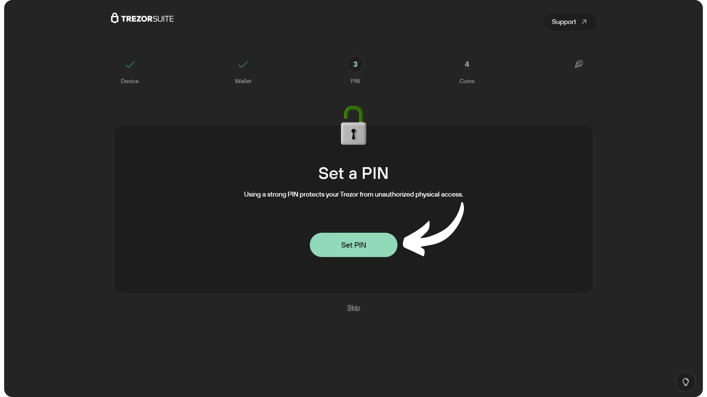

මොඩල් වන් මත තහවුරු කරන්න.

අපි යෝජනා කරන්නේ හැකි අයුරින් අහඹු PIN කේතයක් තෝරා ගැනීමටයි. ඔබේ Trezor ගබඩා කර ඇති ස්ථානයෙන් වෙනම ස්ථානයක (උදාහරණයක් ලෙස මුරපද කළමනාකරුකින්) මෙම කේතය සුරකින්න. ඔබට අංක 8 සිට 50 දක්වා PIN කේතයක් නිර්වචනය කළ හැක. ආරක්ෂාව වැඩි දියුණු කිරීම සඳහා හැකි අයුරින් දිගු PIN කේතයක් තෝරා ගැනීමට මම යෝජනා කරමි.

PIN කේතය Trezor Model One මත පෙන්වා ඇති යතුරුපුවරුවේ වින්‍යාසය අනුව, ඉලක්කම් වලට අනුකූල ව ඩොට් මත ක්ලික් කිරීමෙන්, ඔබේ පරිගණකයේ Trezor Suite හි ඇතුළත් කළ යුතුය.

මෙම විශේෂිත PIN ඇතුල් කිරීමේ ක්‍රමය ඔබේ Trezor Model One අගුළු විවෘත කරන සෑම වතාවකම, Trezor Suite හෝ Sparrow Wallet හරහා, අවශ්‍ය වේ.

සමප්ත වූ විට, "*Enter PIN*" බොත්තම මත ක්ලික් කරන්න.

ඔබේ PIN අංකය නැවත තහවුරු කිරීමට ලියන්න.

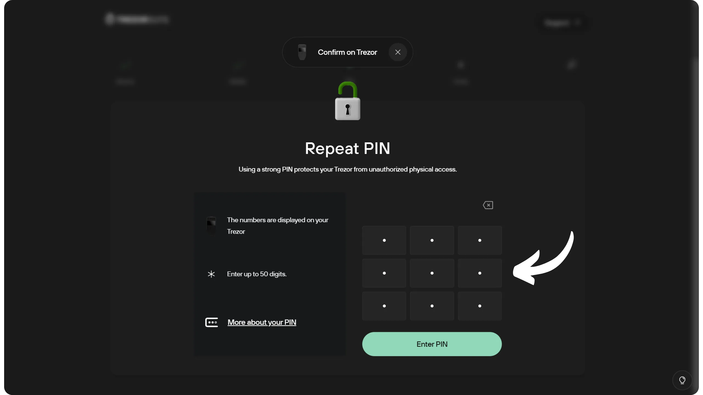

Trezor Suite මත, "*සම්පූර්ණ සැකසුම*" බොත්තම ක්ලික් කරන්න.

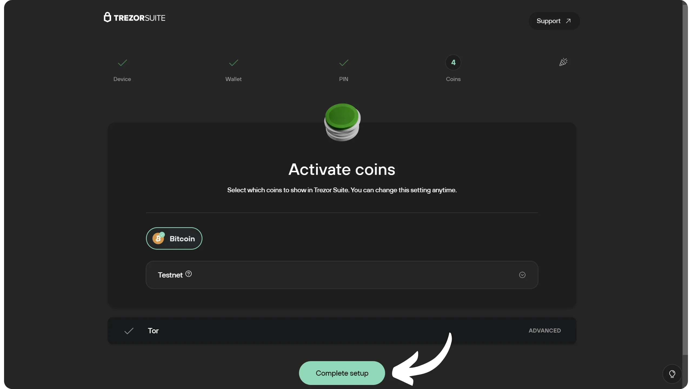

ඔබේ Model One හි වින්‍යාසය දැන් සම්පූර්ණයි. ඔබට අවශ්‍ය නම්, ඔබේ Hardware Wallet හි නම සහ මුල් පිටුව වෙනස් කළ හැක.

Trezor Suite programske opreme ne bomo več potrebovali, razen za izvajanje rednih posodobitev vdelane programske opreme na vašem Hardware Wallet ali če želite opraviti test obnovitve. Zdaj bomo za upravljanje portfelja uporabljali Sparrow, saj je ta programska oprema popolnoma primerna za uporabo samo z Bitcoin.

## Sparrow Wallet પર પોર્ટફોલિયો સેટ કરવો

Začnite tako, da prenesete in namestite Sparrow Wallet [z uradne spletne strani](https://sparrowwallet.com/) na svoj računalnik, če tega še niste storili.

ඔබ Sparrow Wallet විවෘත කළ පසු, මෘදුකාංගය Bitcoin නියුඩ් එකට සම්බන්ධ වී ඇති බව, Interface හි දකුණු පහළ කෙළවරේ ඇති ටික් එකෙන් පෙන්වා ඇත. ඔබට Sparrow සම්බන්ධ කිරීමට ගැටළු ඇති නම්, මම ඔබට මෙම උපකාරක පඬතියේ ආරම්භය බලන්න යෝජනා කරමි:

https://planb.network/tutorials/wallet/desktop/sparrow-c674e2ac-d46f-4c82-92a7-7d1b0e262f5d

"*File*" ටැබය මත ක්ලික් කරන්න, එවිට "*New Wallet*" මත ක්ලික් කරන්න.

ඔබේ පෝර්ට්ෆෝලියෝව නමක් දෙන්න, එවිට "*Wallet තනන්න*" මත ක්ලික් කරන්න.

"*Script Type*" මෙනුවේ, ඔබේ බිට්කොයින් ආරක්ෂා කිරීමට භාවිතා කරන ලිපියේ වර්ගය තෝරන්න. මම "*Taproot*" හෝ එය නොමැති නම්, "*Native SegWit*" නිර්දේශ කරමි.

Kliknite na gumb "*Connected Hardware Wallet*". Vaš Model One mora biti seveda povezan z računalnikom.

"*Scan*" බොත්තම මත ක්ලික් කරන්න. ඔබේ Model One පෙනී යිය යුතුය.

ඔබේ Model One පරිගණකයකට Sparrow Wallet විවෘතව සම්බන්ධ කරන විට, ඔබට Sparrow හි passphrase BIP39 එකක් ඇතුළත් කරන ලෙස ඉල්ලා සිටිනු ඇත. මෙම උසස් විකල්පය අනාගත උපකාරක පාඩමකදී ආවරණය කරනු ඇත. දැන් සඳහා, ඔබට "*Toggle passphrase Off*" තේරීමෙන් ඔබේ Trezor එක ආරම්භ කරන සෑම විටම passphrase එකක් ඇතුළත් කරන ලෙස ඉල්ලා සිටීම වැළැක්විය හැක.

https://planb.network/tutorials/wallet/backup/trezor-passphrase-0474b5bf-496f-4f97-aefe-445368fdca42

"*Import Keystore*" මත ක්ලික් කරන්න.

ඔබට දැන් ඔබේ Wallet විස්තර, ඔබේ පළමු ගිණුමේ දිගු සමාජ යතුර ඇතුළු, දැකිය හැක. Wallet නිර්මාණය අවසන් කිරීමට "*Apply*" බොත්තම ක්ලික් කරන්න.

Izberite močno geslo za zaščito dostopa do Sparrow Wallet. To geslo bo zagotovilo varen dostop do vaših podatkov Sparrow Wallet, zaščitilo vaše javne ključe, naslove, oznake in zgodovino transakcij pred nepooblaščenim dostopom.

මම ඔබට උපදෙස් දෙන්නේ මෙම මුරපදය මුරපද කළමනාකරුකරුකරුකරුකරුකරුකරුකරුකරුකරුකරුකරුකරුකරුකරුකරුකරුකරුකරුකරුකරුකරුකරුකරුකරුකරුකරුකරුකරුකරුකරුකරුකරුකරුකරුකරුකරුකරුකරුකරුකරුකරුකරුකරුකරුකරුකරුකරුකරුකරුකරුකරුකරුකරුකරුකරුකරුකරුකරුකරුකරුකරුකරුකරුකරුකරුකරුකරුකරුකරුකරුකරුකරුකරුකරුකරුකරුකරුකරුකරුකරුකරුකරුකරුකරුකරුකරුකරුකරුකරුකරුකරුකරුකරුකරුකරුකරුකරුකරුකරුකරුකරුකරුකරුකරුකරුකරුකරුකරුකරුකරුකරුකරුකරුකරුකරුකරුකරුකරුකරුකරුකරුකරුකරුකරුකරුකරුකරුකරුකරුකරුකරුකරුකරුකරුකරුකරුකරුකරුකරුකරුකරුකරුකරුකරුකරුකරුකරුකරුකරුකරුකරුකරුකරුකරුකරුකරුකරුකරුකරුකරුකරුකරුකරුකරුකරුකරුකරුකරුකරුකරුකරුකරුකරුකරුකරුකරුකරුකරුකරුකරුකරුකරුකරුකරුකරුකරුකරුකරුකරුකරුකරුකරුකරුකරුකරුකරුකරුකරුකරුකරුකරුකරුකරුකරුකරුකරුකරුකරුකරුකරුකරුකරුකරුකරුකරුකරුකරුකරුකරුකරුකරුකරුකරුකරුකරුකරුකරුකරුකරුකරුකරුකරුකරුකරුකරුකරුකරුකරුකරුකරුකරුකරුකරුකරුකරුකරුකරුකරුකරුකරුකරුකරුකරුකරුකරුකරුකරුකරුකරුකරුකරුකරුකරුකරුකරුකරුකරුකරුකරුකරුකරුකරුකරුකරුකරුකරුකරුකරුකරුකරුකරුකරුකරුකරුකරුකරුකරුකරුකරුකරුකරුකරුකරුකරුකරුකරුකරුකරුකරුකරුකරුකරුකරුකරුකරුකරුකරුකරුකරුකරුකරුකරුකරුකරුකරුකරුකරුකරුකරුකරුකරුකරුකරුකරුකරුකරුකරුකරුකරුකරුකරුකරුකරුකරුකරුකරුකරුකරුකරුකරුකරුකරුකරුකරුකරුකරුකරුකරුකරුකරුකරුකරුකරුකරුකරුකරුකරුකරුකරුකරුකරුකරුකරුකරුකරුකරුකරුකරුකරුකරුකරුකරුකරුකරුකරුකරුකරුකරුකරුකරුකරුකරුකරුකරුකරුකරුකරුකරුකරුකරුකරුකරුකරුකරුකරුකරුකරුකරුකරුකරුකරුකරුකරුකරුකරුකරුකරුකරුකරුකරුකරුකරුකරුකරුකරුකරුකරුකරුකරුකරුකරුකරුකරුකරුකරුකරුකරුකරුකරුකරුකරුකරුකරුකරුකරුකරුකරුකරුකරුකරුකරුකරුකරුකරුකරුකරුකරුකරුකරුකරුකරුකරුකරුකරුකරුකරුකරුකරුකරුකරුකරුකරුකරුකරුකරුකරුකරුකරුකරුකරුකරුකරුකරුකරුකරුකරුකරුකරුකරුකරුකරුකරුකරුකරුකරුකරුකරුකරුකරුකරුකරුකරුකරුකරුකරුකරුකරුකරුකරුකරුකරුකරුකරුකරුකරුකරුකරුකරුකරුකරුකරුකරුකරුකරුකරුකරුකරුකරුකරුකරුකරුකරුකරුකරුකරුකරුකරුකරුකරුකරුකරුකරුකරුකරුකරුකරුකරුකරුකරුකරුකරුකරුකරුකරුකරුකරුකරුකරුකරුකරුකරුකරුකරුකරුකරුකරුකරුකරුකරුකරුකරුකරුකරුකරුකරුකරුකරුකරුකරුකරුකරුකරුකරුකරුකරුකරුකරුකරුකරුකරුකරුකරුකරුකරුකරුකරුකරුකරුකරුකරුකරුකරුකරුකරුකරුකරුකරුකරුකරුකරුකරුකරුකරුකරුකරුකරුකරුකරුකරුකරුකරුකරුකරුකරුකරුකරුකරුකරුකරුකරුකරුකරුකරුකරුකරුකරුකරුකරුකරුකරුකරුකරුකරුකරුකරුකරුකරුකරුකරුකරුකරුකරුකරුකරුකරුකරුකරුකරුකරුකරුකරුකරුකරුකරුකරුකරුකරුකරුකරුකරුකරුකරුකරුකරුකරුකරුකරුකරුකරුකරුකරුකරුකරුකරුකරුකරුකරුකරුකරුකරුකරුකරුකරුකරුකරුකරුකරුකරුකරුකරුකරුකරුකරුකරුකරුකරුකරුකරුකරුකරුකරුකරුකරුකරුකරුකරුකරුකරුකරුකරුකරුකරුකරුකරුකරුකරුකරුකරුකරුකරුකරුකරුකරුකරුකරුකරුකරුකරුකරුකරුකරුකරුකරුකරුකරුකරුකරුකරුකරුකරුකරුකරුකරුකරුකරුකරුකරුකරුකරුකරුකරුකරුකරුකරුකරුකරුකරුකරුකරුකරුකරුකරුකරුකරුකරුකරුකරුකරුකරුකරුකරුකරුකරුකරුකරුකරුකරුකරුකරුකරුකරුකරුකරුකරුකරුකරුකරුකරුකරුකරුකරුකරුකරුකරුකරුකරුකරුකරුකරුකරුකරුකරුකරුකරුකරුකරුකරුකරුකරුකරුකරුකරුකරුකරුකරුකරුකරුකරුකරුකරුකරුකරුකරුකරුකරුකරුකරුකරුකරුකරුකරුකරුකරුකරුකරුකරුකරුකරුකරුකරුකරුකරුකරුකරුකරුකරුකරුකරුකරුකරුකරුකරුකරුකරුකරුකරුකරුකරුකරුකරුකරුකරුකරුකරුකරුකරුකරුකරුකරුකරුකරුකරුකරුකරුකරුකරුකරුකරුකරුකරුකරුකරුකරුකරුකරුකරුකරුකරුකරුකරුකරුකරුකරුකරුකරුකරුකරුකරුකරුකරුකරුකරුකරුකරුකරුකරුකරුකරුකරුකරුකරුකරුකරුකරුකරුකරුකරුකරුකරුකරුකරුකරුකරුකරුකරුකරුකරුකරුකරුකරුකරුකරුකරුකරුකරුකරුකරුකරුකරුකරුකරුකරුකරුකරුකරුකරුකරුකරුකරුකරුකරුකරුකරුකරුකරුකරුකරුකරුකරුකරුකරුකරුකරුකරුකරුකරුකරුකරුකරුකරුකරුකරුකරුකරුකරුකරුකරුකරුකරුකරුකරුකරුකරුකරුකරුකරුකරුකරුකරුකරුකරුකරුකරුකරුකරුකරුකරුකරුකරුකරුකරුකරුකරුකරුකරුකරුකරුකරුකරුකරුකරුකරුකරුකරුකරුකරුකරුකරුකරුකරුකරුකරුකරුකරුකරුකරුකරුකරුකරුකරුකරුකරුකරුකරුකරුකරුකරුකරුකරුකරුකරුකරුකරුකරුකරුකරුකරුකරුකරුකරුකරුකරුකරුකරුකරුකරුකරුකරුකරුකරුකරුකරුකරුකරුකරුකරුකරුකරුකරුකරුකරුකරුකරුකරුකරුකරුකරුකරුකරුකරුකරුකරුකරුකරුකරුකරුකරුකරුකරුකරුකරුකරුකරුකරුකරුකරුකරුකරුකරුකරුකරුකරුකරුකරුකරුකරුකරුකරුකරුකරුකරුකරුකරුකරුකරුකරුකරුකරුකරුකරුකරුකරුකරුකරුකරුකරුකරුකරුකරුකරුකරුකරුකරුකරුකරුකරුකරුකරුකරුකරුකරුකරුකරුකරුකරුකරුකරුකරුකරුකරුකරුකරුකරුකරුකරුකරුකරුකරුකරුකරුකරුකරුකරුකරුකරුකරුකරුකරුකරුකරුකරුකරුකරුකරුකරුකරුකරුකරුකරුකරුකරුකරුකරුකරුකරුකරුකරුකරුකරුකරුකරුකරුකරුකරුකරුකරුකරුකරුකරුකරුකරුකරුකරුකරුකරුකරුකරුකරුකරුකරුකරුකරුකරුකරුකරුකරුකරුකරුකරුකරුකරුකරුකරුකරුකරුකරුකරුකරුකරුකරුකරුකරුකරුකරුකරුකරුකරුකරුකරුකරුකරුකරුකරුකරුකරුකරුකරුකරුකරුකරුකරුකරුකරුකරුකරුකරුකරුකරුකරුකරුකරුකරුකරුකරුකරුකරුකරුකරුකරුකරුකරුකරුකරුකරුකරුකරුකරුකරුකරුකරුකරුකරුකරුකරුකරුකරුකරුකරුකරුකරුකරුකරුකරුකරුකරුකරුකරුකරුකරුකරුකරුකරුකරුකරුකරුකරුකරුකරුකරුකරුකරුකරුකරුකරුකරුකරුකරුකරුකරුකරුකරුකරුකරුකරුකරුකරුකරුකරුකරුකරුකරුකරුකරුකරුකරුකරුකරුකරුකරුකරුකරුකරුකරුකරුකරුකරුකරුකරුකරුකරුකරුකරුකරුකරුකරුකරුකරුකරුකරුකරුකරුකරුකරුකරුකරුකරුකරුකරුකරුකරුකරුකරුකරුකරුකරුකරුකරුකරුකරුකරුකරුකරුකරුකරුකරුකරුකරුකරුකරුකරුකරුකරුකරුකරුකරුකරුකරුකරුකරුකරුකරුකරුකරුකරුකරුකරුකරුකරුකරුකරුකරුකරුකරුකරුකරුකරුකරුකරුකරුකරුකරුකරුකරුකරුකරුකරුකරුකරුකරුකරුකරුකරුකරුකරුකරුකරුකරුකරුකරුකරුකරුකරුකරුකරුකරුකරුකරුකරුකරුකරුකරුකරුකරුකරුකරුකරුකරුකරුකරුකරුකරුකරුකරුකරුකරුකරුකරුකරුකරුකරුකරුකරුකරුකරුකරුකරුකරුකරුකරුකරුකරුකරුකරුකරුකරුකරුකරුකරුකරුකරුකරුකරුකරුකරුකරුකරුකරුකරුකරුකරුකරුකරුකරුකරුකරුකරුකරුකරුකරුකරුකරුකරුකරුකරුකරුකරුකරුකරුකරුකරුකරුකරුකරුකරුකරුකරුකරුකරුකරුකරුකරුකරුකරුකරුකරුකරුකරුකරුකරුකරුකරුකරුකරුකරුකරුකරුකරුකරුකරුකරුකරුකරුකරුකරුකරුකරුකරුකරුකරුකරුකරුකරුකරුකරුකරුකරුකරුකරුකරුකරුකරුකරුකරුකරුකරුකරුකරුකරුකරුකරුකරුකරුකරුකරුකරුකරුකරුකරුකරුකරුකරුකරුකරුකරුකරුකරුකරුකරුකරුකරුකරුකරුකරුකරුකරුකරුකරුකරුකරුකරුකරුකරුකරුකරුකරුකරුකරුකරුකරුකරුකරුකරුකරුකරුකරුකරුකරුකරුකරුකරුකරුකරුකරුකරුකරුකරුකරුකරුකරුකරුකරුකරුකරුකරුකරුකරුකරුකරුකරුකරුකරුකරුකරුකරුකරුකරුකරුකරුකරුකරුකරුකරුකරුකරුකරුකරුකරුකරුකරුකරුකරුකරුකරුකරුකරුකරුකරුකරුකරුකරුකරුකරුකරුකරුකරුකරුකරුකරුකරුකරුකරුකරුකරුකරුකරුකරුකරුකරුකරුකරුකරුකරුකරුකරුකරුකරුකරුකරුකරුකරුකරුකරුකරුකරුකරුකරුකරුකරුකරුකරුකරුකරුකරුකරුකරුකරුකරුකරුකරුකරුකරුකරුකරුකරුකරුකරුකරුකරුකරුකරුකරුකරුකරුකරුකරුකරුකරුකරුකරුකරුකරුකරුකරුකරුකරුකරුකරුකරුකරුකරුකරුකරුකරුකරුකරුකරුකරුකරුකරුකරුකරුකරුකරුකරුකරුකරුකරුකරුකරුකරුකරුකරුකරුකරුකරුකරුකරුකරුකරුකරුකරුකරුකරුකරුකරුකරුකරුකරුකරුකරුකරුකරුකරුකරුකරුකරුකරුකරුකරුකරුකරුකරුකරුකරුකරුකරුකරුකරුකරුකරුකරුකරුකරුකරුකරුකරුකරුකරුකරුකරුකරුකරුකරුකරුකරුකරුකරුකරුකරුකරුකරුකරුකරුකරුකරුකරුකරුකරුකරුකරුකරුකරුකරුකරුකරුකරුකරුකරුකරුකරුකරුකරුකරුකරුකරුකරුකරුකරුකරුකරුකරුකරුකරුකරුකරුකරුකරුකරුකරුකරුකරුකරුකරුකරුකරුකරුකරුකරුකරුකරුකරුකරුකරුකරුකරුකරුකරුකරුකරුකරුකරුකරුකරුකරුකරුකරුකරුකරුකරුකරුකරුකරුකරුකරුකරුකරුකරුකරුකරුකරුකරුකරුකරුකරුකරුකරුකරුකරුකරුකරුකරුකරුකරුකරුකරුකරුකරුකරුකරුකරුකරුකරුකරුකරුකරුකරුකරුකරුකරුකරුකරුකරුකරුකරුකරුකරුකරුකරුකරුකරුකරුකරුකරුකරුකරුකරුකරුකරුකරුකරුකරුකරුකරුකරුකරුකරුකරුකරුකරුකරුකරුකරුකරුකරුකරුකරුකරුකරුකරුකරුකරුකරුකරුකරුකරුකරුකරුකරුකරුකරුකරුකරුකරුකරුකරුකරුකරුකරුකරුකරුකරුකරුකරුකරුකරුකරුකරුකරුකරුකරුකරුකරුකරුකරුකරුකරුකරුකරුකරුකරුකරුකරුකරුකරුකරුකරුකරුකරුකරුකරුකරුකරුකරුකරුකරුකරුකරුකරුකරුකරුකරුකරුකරුකරුකරුකරුකරුකරුකරුකරුකරුකරුකරුකරුකරුකරුකරුකරුකරුකරුකරුකරුකරුකරුකරුකරුකරුකරුකරුකරුකරුකරුකරුකරුකරුකරුකරුකරුකරුකරුකරුකරුකරුකරුකරුකරුකරුකරුකරුකරුකරුකරුකරුකරුකරුකරුකරුකරුකරුකරුකරුකරුකරුකරුකරුකරුකරුකරුකරුකරුකරුකරුකරුකරුකරුකරුකරුකරුකරුකරුකරුකරුකරුකරුකරුකරුකරුකරුකරුකරුකරුකරුකරුකරුකරුකරුකරුකරුකරුකරුකරුකරුකරුකරුකරුකරුකරුකරුකරුකරුකරුකරුකරුකරුකරුකරුකරුකරුකරුකරුකරුකරුකරුකරුකරුකරුකරුකරුකරුකරුකරුකරුකරුකරුකරුකරුකරුකරුකරුකරුකරුකරුකරුකරුකරුකරුකරුකරුකරුකරුකරුකරුකරුකරුකරුකරුකරුකරුකරුකරුකරුකරුකරුකරුකරුකරුකරුකරුකරුකරුකරුකරුකරුකරුකරුකරුකරුකරුකරුකරුකරුකරුකරුකරුකරුකරුකරුකරුකරුකරුකරුකරුකරුකරුකරුකරුකරුකරුකරුකරුකරුකරුකරුකරුකරුකරුකරුකරුකරුකරුකරුකරුකරුකරුකරුකරුකරුකරුකරුකරුකරුකරුකරුකරුකරුකරුකරුකරුකරුකරුකරුකරුකරුකරුකරුකරුකරුකරුකරුකරුකරුකරුකරුකරුකරුකරුකරුකරුකරුකරුකරුකරුකරුකරුකරුකරුකරුකරුකරුකරුකරුකරුකරුකරුකරුකරුකරුකරුකරුකරුකරුකරුකරුකරුකරුකරුකරුකරුකරුකරුකරුකරුකරුකරුකරුකරුකරුකරුකරුකරුකරුකරුකරුකරුකරුකරුකරුකරුකරුකරුකරුකරුකරුකරුකරුකරුකරුකරුකරුකරුකරුකරුකරුකරුකරුකරුකරුකරුකරුකරුකරුකරුකරුකරුකරුකරුකරුකරුකරුකරුකරුකරුකරුකරුකරුකරුකරුකරුකරුකරුකරුකරුකරුකරුකරුකරුකරුකරුකරුකරුකරුකරුකරුකරුකරුකරුකරුකරුකරුකරුකරුකරුකරුකරුකරුකරුකරුකරුකරුකරුකරුකරුකරුකරුකරුකරුකරුකරුකරුකරුකරුකරුකරුකරුකරුකරුකරුකරුකරුකරුකරුකරුකරුකරුකරුකරුකරුකරුකරුකරුකරුකරුකරුකරුකරුකරුකරුකරුකරුකරුකරුකරුකරුකරුකරුකරුකරුකරුකරුකරුකරුකරුකරුකරුකරුකරුකරුකරුකරුකරුකරුකරුකරුකරුකරුකරුකරුකරුකරුකරුකරුකරුකරුකරුකරුකරුකරුකරුකරුකරුකරුකරුකරුකරුකරුකරුකරුකරුකරුකරුකරුකරුකරුකරුකරුකරුකරුකරුකරුකරුකරුකරුකරුකරුකරුකරුකරුකරුකරුකරුකරුකරුකරුකරුකරුකරුකරුකරුකරුකරුකරුකරුකරුකරුකරුකරුකරුකරුකරුකරුකරුකරුකරුකරුකරුකරුකරුකරුකරුකරුකරුකරුකරුකරුකරුකරුකරුකරුකරුකරුකරුකරුකරුකරුකරුකරුකරුකරුකරුකරුකරුකරුකරුකරුකරුකරුකරුකරුකරුකරුකරුකරුකරුකරුකරුකරුකරුකරුකරුකරුකරුකරුකරුකරුකරුකරුකරුකරුකරුකරුකරුකරුකරුකරුකරුකරුකරුකරුකරුකරුකරුකරුකරුකරුකරුකරුකරුකරුකරුකරුකරුකරුකරුකරුකරුකරුකරුකරුකරුකරුකරුකරුකරුකරුකරුකරුකරුකරුකරුකරුකරුකරුකරුකරුකරුකරුකරුකරුකරුකරුකරුකරුකරුකරුකරුකරුකරුකරුකරුකරුකරුකරුකරුකරුකරුකරුකරුකරුකරුකරුකරුකරුකරුකරුකරුකරුකරුකරුකරුකරුකරුකරුකරුකරුකරුකරුකරුකරුකරුකරුකරුකරුකරුකරුකරුකරුකරුකරුකරුකරුකරුකරුකරුකරුකරුකරුකරුකරුකරුකරුකරුකරුකරුකරුකරුකරුකරුකරුකරුකරුකරුකරුකරුකරුකරුකරුකරුකරුකරුකරුකරුකරුකරුකරුකරුකරුකරුකරුකරුකරුකරුකරුකරුකරුකරුකරුකරුකරුකරුකරුකරුකරුකරුකරුකරුකරුකරුකරුකරුකරුකරුකරුකරුකරුකරුකරුකරුකරුකරුකරුකරුකරුකරුකරුකරුකරුකරුකරුකරුකරුකරුකරුකරුකරුකරුකරුකරුකරුකරුකරුකරුකරුකරුකරුකරුකරුකරුකරුකරුකරුකරුකරුකරුකරුකරුකරුකරුකරුකරුකරුකරුකරුකරුකරුකරුකරුකරුකරුකරුකරුකරුකරුකරුකරුකරුකරුකරුකරුකරුකරුකරුකරුකරුකරුකරුකරුකරුකරුකරුකරුකරුකරුකරුකරුකරුකරුකරුකරුකරුකරුකරුකරුකරුකරුකරුකරුකරුකරුකරුකරුකරුකරුකරුකරුකරුකරුකරුකරුකරුකරුකරුකරුකරුකරුකරුකරුකරුකරුකරුකරුකරුකරුකරුකරුකරුකරුකරුකරුකරුකරුකරුකරුකරුකරුකරුකරුකරුකරුකරුකරුකරුකරුකරුකරුකරුකරුකරුකරුකරුකරුකරුකරුකරුකරුකරුකරුකරුකරුකරුකරුකරුකරුකරුකරුකරුකරුකරුකරුකරුකරුකරුකරුකරුකරුකරුකරුකරුකරුකරුකරුකරුකරුකරුකරුකරුකරුකරුකරුකරුකරුකරුකරුකරුකරුකරුකරුකරුකරුකරුකරුකරුකරුකරුකරුකරුකරුකරුකරුකරුකරුකරුකරුකරුකරුකරුකරුකරුකරුකරුකරුකරුකරුකරුකරුකරුකරුකරුකරුකරුකරුකරුකරුකරුකරුකරුකරුකරුකරුකරුකරුකරුකරුකරුකරුකරුකරුකරුකරුකරුකරුකරුකරුකරුකරුකරුකරුකරුකරුකරුකරුකරුකරුකරුකරුකරුකරුකරුකරුකරුකරුකරුකරුකරුකරුකරුකරුකරුකරුකරුකරුකරුකරුකරුකරුකරුකරුකරුකරුකරුකරුකරුකරුකරුකරුකරුකරුකරුකරුකරුකරුකරුකරුකරුකරුකරුකරුකරුකරුකරුකරුකරුකරුකරුකරුකරුකරුකරුකරුකරුකරුකරුකරුකරුකරුකරුකරුකරුකරුකරුකරුකරුකරුකරුකරුකරුකරුකරුකරුකරුකරුකරුකරුකරුකරුකරුකරුකරුකරුකරුකරුකරුකරුකරුකරුකරුකරුකරුකරුකරුකරුකරුකරුකරුකරුකරුකරුකරුකරුකරුකරුකරුකරුකරුකරුකරුකරුකරුකරුකරුකරුකරුකරුකරුකරුකරුකරුකරුකරුකරුකරුකරුකරුකරුකරුකරුකරුකරුකරුකරුකරුකරුකරුකරුකරුකරුකරුකරුකරුකරුකරුකරුකරුකරුකරුකරුකරුකරුකරුකරුකරුකරුකරුකරුකරුකරුකරුකරුකරුකරුකරුකරුකරුකරුකරුකරුකරුකරුකරුකරුකරුකරුකරුකරුකරුකරුකරුකරුකරුකරුකරුකරුකරුකරුකරුකරුකරුකරුකරුකරුකරුකරුකරුකරුකරුකරුකරුකරුකරුකරුකරුකරුකරුකරුකරුකරුකරුකරුකරුකරුකරුකරුකරුකරුකරුකරුකරුකරුකරුකරුකරුකරුකරුකරුකරුකරුකරුකරුකරුකරුකරුකරුකරුකරුකරුකරුකරුකරුකරුකරුකරුකරුකරුකරුකරුකරුකරුකරුකරුකරුකරුකරුකරුකරුකරුකරුකරුකරුකරුකරුකරුකරුකරුකරුකරුකරුකරුකරුකරුකරුකරුකරුකරුකරුකරුකරුකරුකරුකරුකරුකරුකරුකරුකරුකරුකරුකරුකරුකරුකරුකරුකරුකරුකරුකරුකරුකරුකරුකරුකරුකරුකරුකරුකරුකරුකරුකරුකරුකරුකරුකරුකරුකරුකරුකරුකරුකරුකරුකරුකරුකරුකරුකරුකරුකරුකරුකරුකරුකරුකරුකරුකරුකරුකරුකරුකරුකරුකරුකරුකරුකරුකරුකරුකරුකරුකරුකරුකරුකරුකරුකරුකරුකරුකරුකරුකරුකරුකරුකරුකරුකරුකරුකරුකරුකරුකරුකරුකරුකරුකරුකරුකරුකරුකරුකරුකරුකරුකරුකරුකරුකරුකරුකරුකරුකරුකරුකරුකරුකරුකරුකරුකරුකරුකරුකරුකරුකරුකරුකරුකරුකරුකරුකරුකරුකරුකරුකරුකරුකරුකරුකරුකරුකරුකරුකරුකරුකරුකරුකරුකරුකරුකරුකරුකරුකරුකරුකරුකරුකරුකරුකරුකරුකරුකරුකරුකරුකරුකරුකරුකරුකරුකරුකරුකරුකරුකරුකරුකරුකරුකරුකරුකරුකරුකරුකරුකරුකරුකරුකරුකරුකරුකරුකරුකරුකරුකරුකරුකරුකරුකරුකරුකරුකරුකරුකරුකරුකරුකරුකරුකරුකරුකරුකරුකරුකරුකරුකරුකරුකරුකරුකරුකරුකරුකරුකරුකරුකරුකරුකරුකරුකරුකරුකරුකරුකරුකරුකරුකරුකරුකරුකරුකරුකරුකරුකරුකරුකරුකරුකරුකරුකරුකරුකරුකරුකරුකරුකරුකරුකරුකරුකරුකරුකරුකරුකරුකරුකරුකරුකරුකරුකරුකරුකරුකරුකරුකරුකරුකරුකරුකරුකරුකරුකරුකරුකරුකරුකරුකරුකරුකරුකරුකරුකරුකරුකරුකරුකරුකරුකරුකරුකරුකරුකරුකරුකරුකරුකරුකරුකරුකරුකරුකරුකරුකරුකරුකරුකරුකරුකරුකරුකරුකරුකරුකරුකරුකරුකරුකරුකරුකරුකරුකරුකරුකරුකරුකරුකරුකරුකරුකරුකරුකරුකරුකරුකරුකරුකරුකරුකරුකරුකරුකරුකරුකරුකරුකරුකරුකරුකරුකරුකරුකරුකරුකරුකරුකරුකරුකරුකරුකරුකරුකරුකරුකරුකරුකරුකරුකරුකරුකරුකරුකරුකරුකරුකරුකරුකරුකරුකරුකරුකරුකරුකරුකරුකරුකරුකරුකරුකරුකරුකරුකරුකරුකරුකරුකරුකරුකරුකරුකරුකරුකරුකරුකරුකරුකරුකරුකරුකරුකරුකරුකරුකරුකරුකරුකරුකරුකරුකරුකරුකරුකරුකරුකරුකරුකරුකරුකරුකරුකරුකරුකරුකරුකරුකරුකරුකරුකරුකරුකරුකරුකරුකරුකරුකරුකරුකරුකරුකරුකරුකරුකරුකරුකරුකරුකරුකරුකරුකරුකරුකරුකරුකරුකරුකරුකරුකරුකරුකරුකරුකරුකරුකරුකරුකරුකරුකරුකරුකරුකරුකරුකරුකරුකරුකරුකරුකරුකරුකරුකරුකරුකරුකරුකරුකරුකරුකරුකරුකරුකරුකරුකරුකරුකරුකරුකරුකරුකරුකරුකරුකරුකරුකරුකරුකරුකරුකරුකරුකරුකරුකරුකරුකරුකරුකරුකරුකරුකරුකරුකරුකරුකරුකරුකරුකරුකරුකරුකරුකරුකරුකරුකරුකරුකරුකරුකරුකරුකරුකරුකරුකරුකරුකරුකරුකරුකරුකරුකරුකරුකරුකරුකරුකරුකරුකරුකරුකරුකරුකරුකරුකරුකරුකරුකරුකරුකරුකරුකරුකරුකරුකරුකරුකරුකරුකරුකරුකරුකරුකරුකරුකරුකරුකරුකරුකරුකරුකරුකරුකරුකරුකරුකරුකරුකරුකරුකරුකරුකරුකරුකරුකරුකරුකරුකරුකරුකරුකරුකරුකරුකරුකරුකරුකරුකරුකරුකරුකරුකරුකරුකරුකරුකරුකරුකරුකරුකරුකරුකරුකරුකරුකරුකරුකරුකරුකරුකරුකරුකරුකරුකරුකරුකරුකරුකරුකරුකරුකරුකරුකරුකරුකරුකරුකරුකරුකරුකරුකරුකරුකරුකරුකරුකරුකරුකරුකරුකරුකරුකරුකරුකරුකරුකරුකරුකරුකරුකරුකරුකරුකරුකරුකරුකරුකරුකරුකරුකරුකරුකරුකරුකරුකරුකරුකරුකරුකරුකරුකරුකරුකරුකරුකරුකරුකරුකරුකරුකරුකරුකරුකරුකරුකරුකරුකරුකරුකරුකරුකරුකරුකරුකරුකරුකරුකරුකරුකරුකරුකරුකරුකරුකරුකරුකරුකරුකරුකරුකරුකරුකරුකරුකරුකරුකරුකරුකරුකරුකරුකරුකරුකරුකරුකරුකරුකරුකරුකරුකරුකරුකරුකරුකරුකරුකරුකරුකරුකරුකරුකරුකරුකරුකරුකරුකරුකරුකරුකරුකරුකරුකරුකරුකරුකරුකරුකරුකරුකරුකරුකරුකරුකරුකරුකරුකරුකරුකරුකරුකරුකරුකරුකරුකරුකරුකරුකරුකරුකරුකරුකරුකරුකරුකරුකරුකරුකරුකරුකරුකරුකරුකරුකරුකරුකරුකරුකරුකරුකරුකරුකරුකරුකරුකරුකරුකරුකරුකරුකරුකරුකරුකරුකරුකරුකරුකරුකරුකරුකරුකරුකරුකරුකරුකරුකරුකරුකරුකරුකරුකරුකරුකරුකරුකරුකරුකරුකරුකරුකරුකරුකරුකරුකරුකරුකරුකරුකරුකරුකරුකරුකරුකරුකරුකරුකරුකරුකරුකරුකරුකරුකරුකරුකරුකරුකරුකරුකරුකරුකරුකරුකරුකරුකරුකරුකරුකරුකරුකරුකරුකරුකරුකරුකරුකරුකරුකරුකරුකරුකරුකරුකරුකරුකරුකරුකරුකරුකරුකරුකරුකරුකරුකරුකරුකරුකරුකරුකරුකරුකරුකරුකරුකරුකරුකරුකරුකරුකරුකරුකරුකරුකරුකරුකරුකරුකරුකරුකරුකරුකරුකරුකරුකරුකරුකරුකරුකරුකරුකරුකරුකරුකරුකරුකරුකරුකරුකරුකරුකරුකරුකරුකරුකරුකරුකරුකරුකරුකරුකරුකරුකරුකරුකරුකරුකරුකරුකරුකරුකරුකරුකරුකරුකරුකරුකරුකරුකරුකරුකරුකරුකරුකරුකරුකරුකරුකරුකරුකරුකරුකරුකරුකරුකරුකරුකරුකරුකරුකරුකරුකරුකරුකරුකරුකරුකරුකරුකරුකරුකරුකරුකරුකරුකරුකරුකරුකරුකරුකරුකරුකරුකරුකරුකරුකරුකරුකරුකරුකරුකරුකරුකරුකරුකරුකරුකරුකරුකරුකරුකරුකරුකරුකරුකරුකරුකරුකරුකරුකරුකරුකරුකරුකරුකරුකරුකරුකරුකරුකරුකරුකරුකරුකරුකරුකරුකරුකරුකරුකරුකරුකරුකරුකරුකරුකරුකරුකරුකරුකරුකරුකරුකරුකරුකරුකරුකරුකරුකරුකරුකරුකරුකරුකරුකරුකරුකරුකරුකරුකරුකරුකරුකරුකරුකරුකරුකරුකරුකරුකරුකරුකරුකරුකරුකරුකරුකරුකරුකරුකරුකරුකරුකරුකරුකරුකරුකරුකරුකරුකරුකරුකරුකරුකරුකරුකරුකරුකරුකරුකරුකරුකරුකරුකරුකරුකරුකරුකරුකරුකරුකරුකරුකරුකරුකරුකරුකරුකරුකරුකරුකරුකරුකරුකරුකරුකරුකරුකරුකරුකරුකරුකරුකරුකරුකරුකරුකරුකරුකරුකරුකරුකරුකරුකරුකරුකරුකරුකරුකරුකරුකරුකරුකරුකරුකරුකරුකරුකරුකරුකරුකරුකරුකරුකරුකරුකරුකරුකරුකරුකරුකරුකරුකරුකරුකරුකරුකරුකරුකරුකරුකරුකරුකරුකරුකරුකරුකරුකරුකරුකරුකරුකරුකරුකරුකරුකරුකරුකරුකරුකරුකරුකරුකරුකරුකරුකරුකරුකරුකරුකරුකරුකරුකරුකරුකරුකරුකරුකරුකරුකරුකරුකරුකරුකරුකරුකරුකරුකරුකරුකරුකරුකරුකරුකරුකරුකරුකරුකරුකරුකරුකරුකරුකරුකරුකරුකරුකරුකරුකරුකරුකරුකරුකරුකරුකරුකරුකරුකරුකරුකරුකරුකරුකරුකරුකරුකරුකරුකරුකරුකරුකරුකරුකරුකරුකරුකරුකරුකරුකරුකරුකරුකරුකරුකරුකරුකරුකරුකරුකරුකරුකරුකරුකරුකරුකරුකරුකරුකරුකරුකරුකරුකරුකරුකරුකරුකරුකරුකරුකරුකරුකරුකරුකරුකරුකරුකරුකරුකරුකරුකරුකරුකරුකරුකරුකරුකරුකරුකරුකරුකරුකරුකරුකරුකරුකරුකරුකරුකරුකරුකරුකරුකරුකරුකරුකරුකරුකරුකරුකරුකරුකරුකරුකරුකරුකරුකරුකරුකරුකරුකරුකරුකරුකරුකරුකරුකරුකරුකරුකරුකරුකරුකරුකරුකරුකරුකරුකරුකරුකරුකරුකරුකරුකරුකරුකරුකරුකරුකරුකරුකරුකරුකරුකරුකරුකරුකරුකරුකරුකරුකරුකරුකරුකරුකරුකරුකරුකරුකරුකරුකරුකරුකරුකරුකරුකරුකරුකරුකරුකරුකරුකරුකරුකරුකරුකරුකරුකරුකරුකරුකරුකරුකරුකරුකරුකරුකරුකරුකරුකරුකරුකරුකරුකරුකරුකරුකරුකරුකරුකරුකරුකරුකරුකරුකරුකරුකරුකරුකරුකරුකරුකරුකරුකරුකරුකරුකරුකරුකරුකරුකරුකරුකරුකරුකරුකරුකරුකරුකරුකරුකරුකරුකරුකරුකරුකරුකරුකරුකරුකරුකරුකරුකරුකරුකරුකරුකරුකරුකරුකරුකරුකරුකරුකරුකරුකරුකරුකරුකරුකරුකරුකරුකරුකරුකරුකරුකරුකරුකරුකරුකරුකරුකරුකරුකරුකරුකරුකරුකරුකරුකරුකරුකරුකරුකරුකරුකරුකරුකරුකරුකරුකරුකරුකරුකරුකරුකරුකරුකරුකරුකරුකරුකරුකරුකරුකරුකරුකරුකරුකරුකරුකරුකරුකරුකරුකරුකරුකරුකරුකරුකරුකරුකරුකරුකරුකරුකරුකරුකරුකරුකරුකරුකරුකරුකරුකරුකරුකරුකරුකරුකරුකරුකරුකරුකරුකරුකරුකරුකරුකරුකරුකරුකරුකරුකරුකරුකරුකරුකරුකරුකරුකරුකරුකරුකරුකරුකරුකරුකරුකරුකරුකරුකරුකරුකරුකරුකරුකරුකරුකරුකරුකරුකරුකරුකරුකරුකරුකරුකරුකරුකරුකරුකරුකරුකරුකරුකරුකරුකරුකරුකරුකරුකරුකරුකරුකරුකරුකරුකරුකරුකරුකරුකරුකරුකරුකරුකරුකරුකරුකරුකරුකරුකරුකරුකරුකරුකරුකරුකරුකරුකරුකරුකරුකරුකරුකරුකරුකරුකරුකරුකරුකරුකරුකරුකරුකරුකරුකරුකරුකරුකරුකරුකරුකරුකරුකරුකරුකරුකරුකරුකරුකරුකරුකරුකරුකරුකරුකරුකරුකරුකරුකරුකරුකරුකරුකරුකරුකරුකරුකරුකරුකරුකරුකරුකරුකරුකරුකරුකරුකරුකරුකරුකරුකරුකරුකරුකරුකරුකරුකරුකරුකරුකරුකරුකරුකරුකරුකරුකරුකරුකරුකරුකරුකරුකරුකරුකරුකරුකරුකරුකරුකරුකරුකරුකරුකරුකරුකරුකරුකරුකරුකරුකරුකරුකරුකරුකරුකරුකරුකරුකරුකරුකරුකරුකරුකරුකරුකරුකරුකරුකරුකරුකරුකරුකරුකරුකරුකරුකරුකරුකරුකරුකරුකරුකරුකරුකරුකරුකරුකරුකරුකරුකරුකරුකරුකරුකරුකරුකරුකරුකරුකරුකරුකරුකරුකරුකරුකරුකරුකරුකරුකරුකරුකරුකරුකරුකරුකරුකරුකරුකරුකරුකරුකරුකරුකරුකරුකරුකරුකරුකරුකරුකරුකරුකරුකරුකරුකරුකරුකරුකරුකරුකරුකරුකරුකරුකරුකරුකරුකරුකරුකරුකරුකරුකරුකරුකරුකරුකරුකරුකරුකරුකරුකරුකරුකරුකරුකරුකරුකරුකරුකරුකරුකරුකරුකරුකරුකරුකරුකරුකරුකරුකරුකරුකරුකරුකරුකරුකරුකරුකරුකරුකරුකරුකරුකරුකරුකරුකරුකරුකරුකරුකරුකරුකරුකරුකරුකරුකරුකරුකරුකරුකරුකරුකරුකරුකරුකරුකරුකරුකරුකරුකරුකරුකරුකරුකරුකරුකරුකරුකරුකරුකරුකරුකරුකරුකරුකරුකරුකරුකරුකරුකරුකරුකරුකරුකරුකරුකරුකරුකරුකරුකරුකරුකරුකරුකරුකරුකරුකරුකරුකරුකරුකරුකරුකරුකරුකරුකරුකරුකරුකරුකරුකරුකරුකරුකරුකරුකරුකරුකරුකරුකරුකරුකරුකරුකරුකරුකරුකරුකරුකරුකරුකරුකරුකරුකරුකරුකරුකරුකරුකරුකරුකරුකරුකරුකරුකරුකරුකරුකරුකරුකරුකරුකරුකරුකරුකරුකරුකරුකරුකරුකරුකරුකරුකරුකරුකරුකරුකරුකරුකරුකරුකරුකරුකරුකරුකරුකරුකරුකරුකරුකරුකරුකරුකරුකරුකරුකරුකරුකරුකරුකරුකරුකරුකරුකරුකරුකරුකරුකරුකරුකරුකරුකරුකරුකරුකරුකරුකරුකරුකරුකරුකරුකරුකරුකරුකරුකරුකරුකරුකරුකරුකරුකරුකරුකරුකරුකරුකරුකරුකරුකරුකරුකරුකරුකරුකරුකරුකරුකරුකරුකරුකරුකරුකරුකරුකරුකරුකරුකරුකරුකරුකරුකරුකරුකරුකරුකරුකරුකරුකරුකරුකරුකරුකරුකරුකරුකරුකරුකරුකරුකරුකරුකරුකරුකරුකරුකරුකරුකරුකරුකරුකරුකරුකරුකරුකරුකරුකරුකරුකරුකරුකරුකරුකරුකරුකරුකරුකරුකරුකරුකරුකරුකරුකරුකරුකරුකරුකරුකරුකරුකරුකරුකරුකරුකරුකරුකරුකරුකරුකරුකරුකරුකරුකරුකරුකරුකරුකරුකරුකරුකරුකරුකරුකරුකරුකරුකරුකරුකරුකරුකරුකරුකරුකරුකරුකරුකරුකරුකරුකරුකරුකරුකරුකරුකරුකරුකරුකරුකරුකරුකරුකරුකරුකරුකරුකරුකරුකරුකරුකරුකරුකරුකරුකරුකරුකරුකරුකරුකරුකරුකරුකරුකරුකරුකරුකරුකරුකරුකරුකරුකරුකරුකරුකරුකරුකරුකරුකරුකරුකරුකරුකරුකරුකරුකරුකරුකරුකරුකරුකරුකරුකරුකරුකරුකරුකරුකරුකරුකරුකරුකරුකරුකරුකරුකරුකරුකරුකරුකරුකරුකරුකරුකරුකරුකරුකරුකරුකරුකරුකරුකරුකරුකරුකරුකරුකරුකරුකරුකරුකරුකරුකරුකරුකරුකරුකරුකරුකරුකරුකරුකරුකරුකරුකරුකරුකරුකරුකරුකරුකරුකරුකරුකරුකරුකරුකරුකරුකරුකරුකරුකරුකරුකරුකරුකරුකරුකරුකරුකරුකරුකරුකරුකරුකරුකරුකරුකරුකරුකරුකරුකරුකරුකරුකරුකරුකරුකරුකරුකරුකරුකරුකරුකරුකරුකරුකරුකරුකරුකරුකරුකරුකරුකරුකරුකරුකරුකරුකරුකරුකරුකරුකරුකරුකරුකරුකරුකරුකරුකරුකරුකරුකරුකරුකරුකරුකරුකරුකරුකරුකරුකරුකරුකරුකරුකරුකරුකරුකරුකරුකරුකරුකරුකරුකරුකරුකරුකරුකරුකරුකරුකරුකරුකරුකරුකරුකරුකරුකරුකරුකරුකරුකරුකරුකරුකරුකරුකරුකරුකරුකරුකරුකරුකරුකරුකරුකරුකරුකරුකරුකරුකරුකරුකරුකරුකරුකරුකරුකරුකරුකරුකරුකරුකරුකරුකරුකරුකරුකරුකරුකරුකරුකරුකරුකරුකරුකරුකරුකරුකරුකරුකරුකරුකරුකරුකරුකරුකරුකරුකරුකරුකරුකරුකරුකරුකරුකරුකරුකරුකරුකරුකරුකරුකරුකරුකරුකරුකරුකරුකරුකරුකරුකරුකරුකරුකරුකරුකරුකරුකරුකරුකරුකරුකරුකරුකරුකරුකරුකරුකරුකරුකරුකරුකරුකරුකරුකරුකරුකරුකරුකරුකරුකරුකරුකරුකරුකරුකරුකරුකරුකරුකරුකරුකරුකරුකරුකරුකරුකරුකරුකරුකරුකරුකරුකරුකරුකරුකරුකරුකරුකරුකරුකරුකරුකරුකරුකරුකරුකරුකරුකරුකරුකරුකරුකරුකරුකරුකරුකරුකරුකරුකරුකරුකරුකරුකරුකරුකරුකරුකරුකරුකරුකරුකරුකරුකරුකරුකරුකරුකරුකරුකරුකරුකරුකරුකරුකරුකරුකරුකරුකරුකරුකරුකරුකරුකරුකරුකරුකරුකරුකරුකරුකරුකරුකරුකරුකරුකරුකරුකරුකරුකරුකරුකරුකරුකරුකරුකරුකරුකරුකරුකරුකරුකරුකරුකරුකරුකරුකරුකරුකරුකරුකරුකරුකරුකරුකරුකරුකරුකරුකරුකරුකරුකරුකරුකරුකරුකරුකරුකරුකරුකරුකරුකරුකරුකරුකරුකරුකරුකරුකරුකරුකරුකරුකරුකරුකරුකරුකරුකරුකරුකරුකරුකරුකරුකරුකරුකරුකරුකරුකරුකරුකරුකරුකරුකරුකරුකරුකරුකරුකරුකරුකරුකරුකරුකරුකරුකරුකරුකරුකරුකරුකරුකරුකරුකරුකරුකරුකරුකරුකරුකරුකරුකරුකරුකරුකරුකරුකරුකරුකරුකරුකරුකරුකරුකරුකරුකරුකරුකරුකරුකරුකරුකරුකරුකරුකරුකරුකරුකරුකරුකරුකරුකරුකරුකරුකරුකරුකරුකරුකරුකරුකරුකරුකරුකරුකරුකරුකරුකරුකරුකරුකරුකරුකරුකරුකරුකරුකරුකරුකරුකරුකරුකරුකරුකරුකරුකරුකරුකරුකරුකරුකරුකරුකරුකරුකරුකරුකරුකරුකරුකරුකරුකරුකරුකරුකරුකරුකරුකරුකරුකරුකරුකරුකරුකරුකරුකරුකරුකරුකරුකරුකරුකරුකරුකරුකරුකරුකරුකරුකරුකරුකරුකරුකරුකරුකරුකරුකරුකරුකරුකරුකරුකරුකරුකරුකරුකරුකරුකරුකරුකරුකරුකරුකරුකරුකරුකරුකරුකරුකරුකරුකරුකරුකරුකරුකරුකරුකරුකරුකරුකරුකරුකරුකරුකරුකරුකරුකරුකරුකරුකරුකරුකරුකරුකරුකරුකරුකරුකරුකරුකරුකරුකරුකරුකරුකරුකරුකරුකරුකරුකරුකරුකරුකරුකරුකරුකරුකරුකරුකරුකරුකරුකරුකරුකරුකරුකරුකරුකරුකරුකරුකරුකරුකරුකරුකරුකරුකරුකරුකරුකරුකරුකරුකරුකරුකරුකරුකරුකරුකරුකරුකරුකරුකරුකරුකරුකරුකරුකරුකරුකරුකරුකරුකරුකරුකරුකරුකරුකරුකරුකරුකරුකරුකරුකරුකරුකරුකරුකරුකරුකරුකරුකරුකරුකරුකරුකරුකරුකරුකරුකරුකරුකරුකරුකරුකරුකරුකරුකරුකරුකරුකරුකරුකරුකරුකරුකරුකරුකරුකරුකරුකරුකරුකරුකරුකරුකරුකරුකරුකරුකරුකරුකරුකරුකරුකරුකරුකරුකරුකරුකරුකරුකරුකරුකරුකරුකරුකරුකරුකරුකරුකරුකරුකරුකරුකරුකරුකරුකරුකරුකරුකරුකරුකරුකරුකරුකරුකරුකරුකරුකරුකරුකරුකරුකරුකරුකරුකරුකරුකරුකරුකරුකරුකරුකරුකරුකරුකරුකරුකරුකරුකරුකරුකරුකරුකරුකරුකරුකරුකරුකරුකරුකරුකරුකරුකරුකරුකරුකරුකරුකරුකරුකරුකරුකරුකරුකරුකරුකරුකරුකරුකරුකරුකරුකරුකරුකරුකරුකරුකරුකරුකරුකරුකරුකරුකරුකරුකරුකරුකරුකරුකරුකරුකරුකරුකරුකරුකරුකරුකරුකරුකරුකරුකරුකරුකරුකරුකරුකරුකරුකරුකරුකරුකරුකරුකරුකරුකරුකරුකරුකරුකරුකරුකරුකරුකරුකරුකරුකරුකරුකරුකරුකරුකරුකරුකරුකරුකරුකරුකරුකරුකරුකරුකරුකරුකරුකරුකරුකරුකරුකරුකරුකරුකරුකරුකරුකරුකරුකරුකරුකරුකරුකරුකරුකරුකරුකරුකරුකරුකරුකරුකරුකරුකරුකරුකරුකරුකරුකරුකරුකරුකරුකරුකරුකරුකරුකරුකරුකරුකරුකරුකරුකරුකරුකරුකරුකරුකරුකරුකරුකරුකරුකරුකරුකරුකරුකරුකරුකරුකරුකරුකරුකරුකරුකරුකරුකරුකරුකරුකරුකරුකරුකරුකරුකරුකරුකරුකරුකරුකරුකරුකරුකරුකරුකරුකරුකරුකරුකරුකරුකරුකරුකරුකරුකරුකරුකරුකරුකරුකරුකරුකරුකරුකරුකරුකරුකරුකරුකරුකරුකරුකරුකරුකරුකරුකරුකරුකරුකරුකරුකරුකරුකරුකරුකරුකරුකරුකරුකරුකරුකරුකරුකරුකරුකරුකරුකරුකරුකරුකරුකරුකරුකරුකරුකරුකරුකරුකරුකරුකරුකරුකරුකරුකරුකරුකරුකරුකරුකරුකරුකරුකරුකරුකරුකරුකරුකරුකරුකරුකරුකරුකරුකරුකරුකරුකරුකරුකරුකරුකරුකරුකරුකරුකරුකරුකරුකරුකරුකරුකරුකරුකරුකරුකරුකරුකරුකරුකරුකරුකරුකරුකරුකරුකරුකරුකරුකරුකරුකරුකරුකරුකරුකරුකරුකරුකරුකරුකරුකරුකරුකරුකරුකරුකරුකරුකරුකරුකරුකරුකරුකරුකරුකරුකරුකරුකරුකරුකරුකරුකරුකරුකරුකරුකරුකරුකරුකරුකරුකරුකරුකරුකරුකරුකරුකරුකරුකරුකරුකරුකරුකරුකරුකරුකරුකරුකරුකරුකරුකරුකරුකරුකරුකරුකරුකරුකරුකරුකරුකරුකරුකරුකරුකරුකරුකරුකරුකරුකරුකරුකරුකරුකරුකරුකරුකරුකරුකරුකරුකරුකරුකරුකරුකරුකරුකරුකරුකරුකරුකරුකරුකරුකරුකරුකරුකරුකරුකරුකරුකරුකරුකරුකරුකරුකරුකරුකරුකරුකරුකරුකරුකරුකරුකරුකරුකරුකරුකරුකරුකරුකරුකරුකරුකරුකරුකරුකරුකරුකරුකරුකරුකරුකරුකරුකරුකරුකරුකරුකරුකරුකරුකරුකරුකරුකරුකරුකරුකරුකරුකරුකරුකරුකරුකරුකරුකරුකරුකරුකරුකරුකරුකරුකරුකරුකරුකරුකරුකරුකරුකරුකරුකරුකරුකරුකරුකරුකරුකරුකරුකරුකරුකරුකරුකරුකරුකරුකරුකරුකරුකරුකරුකරුකරුකරුකරුකරුකරුකරුකරුකරුකරුකරුකරුකරුකරුකරුකරුකරුකරුකරුකරුකරුකරුකරුකරුකරුකරුකරුකරුකරුකරුකරුකරුකරුකරුකරුකරුකරුකරුකරුකරුකරුකරුකරුකරුකරුකරුකරුකරුකරුකරුකරුකරුකරුකරුකරුකරුකරුකරුකරුකරුකරුකරුකරුකරුකරුකරුකරුකරුකරුකරුකරුකරුකරුකරුකරුකරුකරුකරුකරුකරුකරුකරුකරුකරුකරුකරුකරුකරුකරුකරුකරුකරුකරුකරුකරුකරුකරුකරුකරුකරුකරුකරුකරුකරුකරුකරුකරුකරුකරුකරුකරුකරුකරුකරුකරුකරුකරුකරුකරුකරුකරුකරුකරුකරුකරුකරුකරුකරුකරුකරුකරුකරුකරුකරුකරුකරුකරුකරුකරුකරුකරුකරුකරුකරුකරුකරුකරුකරුකරුකරුකරුකරුකරුකරුකරුකරුකරුකරුකරුකරුකරුකරුකරුකරුකරුකරුකරුකරුකරුකරුකරුකරුකරුකරුකරුකරුකරුකරුකරුකරුකරුකරුකරුකරුකරුකරුකරුකරුකරුකරුකරුකරුකරුකරුකරුකරුකරුකරුකරුකරුකරුකරුකරුකරුකරුකරුකරුකරුකරුකරුකරුකරුකරුකරුකරුකරුකරුකරුකරුකරුකරුකරුකරුකරුකරුකරුකරුකරුකරුකරුකරුකරුකරුකරුකරුකරුකරුකරුකරුකරුකරුකරුකරුකරුකරුකරුකරුකරුකරුකරුකරුකරුකරුකරුකරුකරුකරුකරුකරුකරුකරුකරුකරුකරුකරුකරුකරුකරුකරුකරුකරුකරුකරුකරුකරුකරුකරුකරුකරුකරුකරුකරුකරුකරුකරුකරුකරුකරුකරුකරුකරුකරුකරුකරුකරුකරුකරුකරුකරුකරුකරුකරුකරුකරුකරුකරුකරුකරුකරුකරුකරුකරුකරුකරුකරුකරුකරුකරුකරුකරුකරුකරුකරුකරුකරුකරුකරුකරුකරුකරුකරුකරුකරුකරුකරුකරුකරුකරුකරුකරුකරුකරුකරුකරුකරුකරුකරුකරුකරුකරුකරුකරුකරුකරුකරුකරුකරුකරුකරුකරුකරුකරුකරුකරුකරුකරුකරුකරුකරුකරුකරුකරුකරුකරුකරුකරුකරුකරුකරුකරුකරුකරුකරුකරුකරුකරුකරුකරුකරුකරුකරුකරුකරුකරුකරුකරුකරුකරුකරුකරුකරුකරුකරුකරුකරුකරුකරුකරුකරුකරුකරුකරුකරුකරුකරුකරුකරුකරුකරුකරුකරුකරුකරුකරුකරුකරුකරුකරුකරුකරුකරුකරුකරුකරුකරුකරුකරුකරුකරුකරුකරුකරුකරුකරුකරුකරුකරුකරුකරුකරුකරුකරුකරුකරුකරුකරුකරුකරුකරුකරුකරුකරුකරුකරුකරුකරුකරුකරුකරුකරුකරුකරුකරුකරුකරුකරුකරුකරුකරුකරුකරුකරුකරුකරුකරුකරුකරුකරුකරුකරුකරුකරුකරුකරුකරුකරුකරුකරුකරුකරුකරුකරුකරුකරුකරුකරුකරුකරුකරුකරුකරුකරුකරුකරුකරුකරුකරුකරුකරුකරුකරුකරුකරුකරුකරුකරුකරුකරුකරුකරුකරුකරුකරුකරුකරුකරුකරුකරුකරුකරුකරුකරුකරුකරුකරුකරුකරුකරුකරුකරුකරුකරුකරුකරුකරුකරුකරුකරුකරුකරුකරුකරුකරුකරුකරුකරුකරුකරුකරුකරුකරුකරුකරුකරුකරුකරුකරුකරුකරුකරුකරුකරුකරුකරුකරුකරුකරුකරුකරුකරුකරුකරුකරුකරුකරුකරුකරුකරුකරුකරුකරුකරුකරුකරුකරුකරුකරුකරුකරුකරුකරුකරුකරුකරුකරුකරුකරුකරුකරුකරුකරුකරුකරුකරුකරුකරුකරුකරුකරුකරුකරුකරුකරුකරුකරුකරුකරුකරුකරුකරුකරුකරුකරුකරුකරුකරුකරුකරුකරුකරුකරුකරුකරුකරුකරුකරුකරුකරුකරුකරුකරුකරුකරුකරුකරුකරුකරුකරුකරුකරුකරුකරුකරුකරුකරුකරුකරුකරුකරුකරුකරුකරුකරුකරුකරුකරුකරුකරුකරුකරුකරුකරුකරුකරුකරුකරුකරුකරුකරුකරුකරුකරුකරුකරුකරුකරුකරුකරුකරුකරුකරුකරුකරුකරුකරුකරුකරුකරුකරුකරුකරුකරුකරුකරුකරුකරුකරුකරුකරුකරුකරුකරුකරුකරුකරුකරුකරුකරුකරුකරුකරුකරුකරුකරුකරුකරුකරුකරුකරුකරුකරුකරුකරුකරුකරුකරුකරුකරුකරුකරුකරුකරුකරුකරුකරුකරුකරුකරුකරුකරුකරුකරුකරුකරුකරුකරුකරුකරුකරුකරුකරුකරුකරුකරුකරුකරුකරුකරුකරුකරුකරුකරුකරුකරුකරුකරුකරුකරුකරුකරුකරුකරුකරුකරුකරුකරුකරුකරුකරුකරුකරුකරුකරුකරුකරුකරුකරුකරුකරුකරුකරුකරුකරුකරුකරුකරුකරුකරුකරුකරුකරුකරුකරුකරුකරුකරුකරුකරුකරුකරුකරුකරුකරුකරුකරුකරුකරුකරුකරුකරුකරුකරුකරුකරුකරුකරුකරුකරුකරුකරුකරුකරුකරුකරුකරුකරුකරුකරුකරුකරුකරුකරුකරුකරුකරුකරුකරුකරුකරුකරුකරුකරුකරුකරුකරුකරුකරුකරුකරුකරුකරුකරුකරුකරුකරුකරුකරුකරුකරුකරුකරුකරුකරුකරුකරුකරුකරුකරුකරුකරුකරුකරුකරුකරුකරුකරුකරුකරුකරුකරුකරුකරුකරුකරුකරුකරුකරුකරුකරුකරුකරුකරුකරුකරුකරුකරුකරුකරුකරුකරුකරුකරුකරුකරුකරුකරුකරුකරුකරුකරුකරුකරුකරුකරුකරුකරුකරුකරුකරුකරුකරුකරුකරුකරුකරුකරුකරුකරුකරුකරුකරුකරුකරුකරුකරුකරුකරුකරුකරුකරුකරුකරුකරුකරුකරුකරුකරුකරුකරුකරුකරුකරුකරුකරුකරුකරුකරුකරුකරුකරුකරුකරුකරුකරුකරුකරුකරුකරුකරුකරුකරුකරුකරුකරුකරුකරුකරුකරුකරුකරුකරුකරුකරුකරුකරුකරුකරුකරුකරුකරුකරුකරුකරුකරුකරුකරුකරුකරුකරුකරුකරුකරුකරුකරුකරුකරුකරුකරුකරුකරුකරුකරුකරුකරුකරුකරුකරුකරුකරුකරුකරුකරුකරුකරුකරුකරුකරුකරුකරුකරුකරුකරුකරුකරුකරුකරුකරුකරුකරුකරුකරුකරුකරුකරුකරුකරුකරුකරුකරුකරුකරුකරුකරුකරුකරුකරුකරුකරුකරුකරුකරුකරුකරුකරුකරුකරුකරුකරුකරුකරුකරුකරුකරුකරුකරුකරුකරුකරුකරුකරුකරුකරුකරුකරුකරුකරුකරුකරුකරුකරුකරුකරුකරුකරුකරුකරුක

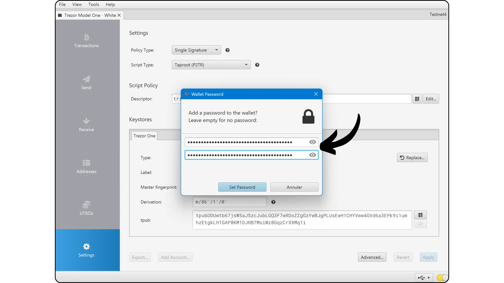

අදහස් දැක්වීම සඳහා ඔබේ පෝර්ට්ෆෝලියෝව Sparrow Wallet වෙත ආයාත කර ඇත!

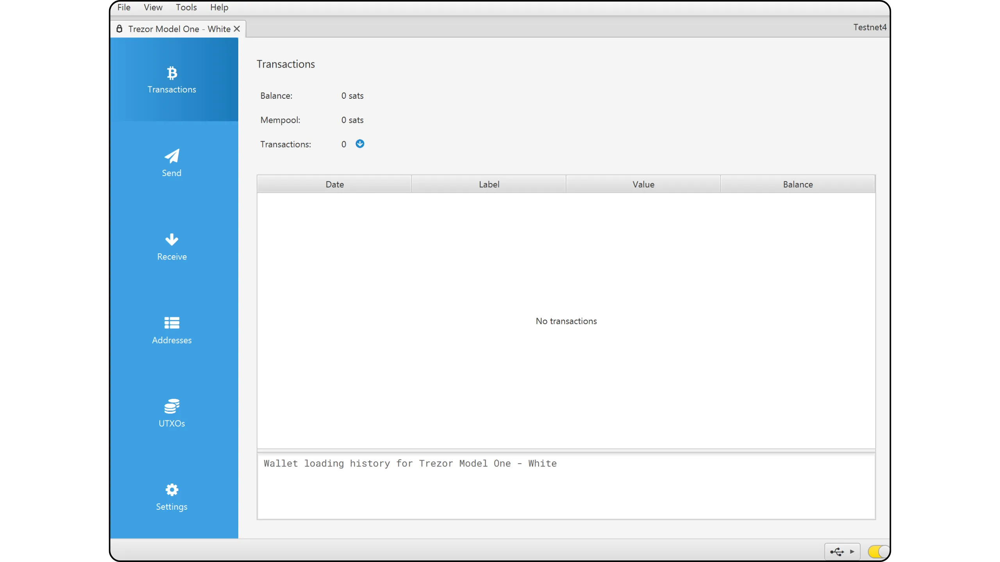

ඔබගේ Wallet හි පළමු බිට්කොයින් ලබා ගැනීමට පෙර, **මම ඔබට හිස් ප්‍රතිසාධන පරීක්ෂණයක් සිදු කරන ලෙස දැඩිව උපදෙස් දෙමි**. ඔබගේ xpub වැනි යමක් යොමු තොරතුරු ලෙස ලියන්න, එවිට Wallet තවම හිස්ව ඇති අතර ඔබගේ Trezor Model One යළි සකසන්න. එවිට ඔබේ Wallet Trezor මත ඔබේ කඩදාසි ආධාරක භාවිතයෙන් යළි පිහිටුවන්න උත්සාහ කරන්න. යළි පිහිටුවීමෙන් පසු ජනනය කරන ලද xpub ඔබ මුලින් ලියා ඇති එකට ගැලපේදැයි පරීක්ෂා කරන්න. එසේ නම්, ඔබේ කඩදාසි ආධාරක විශ්වාසදායක බවට ඔබට විශ්වාස කළ හැක.

Za več informacij o tem, kako izvesti test obnovitve, predlagam, da si ogledate ta drugi vadnik:

https://planb.network/tutorials/wallet/backup/recovery-test-5a75db51-a6a1-4338-a02a-164a8d91b895

## Trezor Model One සමඟ bitcoins ලබා ගැනීම කෙසේද?

Sparrow මත, "*Receive*" ටැබය ක්ලික් කරන්න.

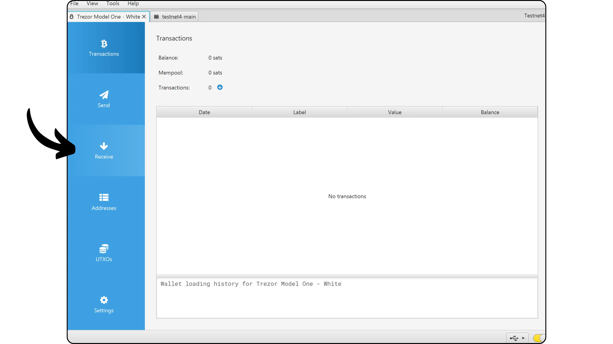

Sparrow Wallet විසින් යෝජිත Address භාවිතා කිරීමට පෙර, එය ඔබේ Trezor තිරය මත පරීක්ෂා කරන්න. මෙම අභ්‍යාසය ඔබට Sparrow මත පෙන්වනු ලබන Address වංචාකාරී නොවන බව සහ Hardware Wallet මඟින් පසුව මෙම Address සමඟ ආරක්ෂා කරන ලද බිට්කොයින් වියදම් කිරීමට අවශ්‍ය පෞද්ගලික යතුර සතු බව තහවුරු කිරීමට ඉඩ සලසයි. මෙය ඔබට විවිධ ආකාරයේ ප්‍රහාර වලින් වළකින්නට උපකාරී වේ.

Če želite opraviti ta pregled, kliknite gumb "*Prikaži Address*".

පෙරලන්න Address ඔබේ Trezor මත පෙන්වන්නේ Sparrow Wallet මත ඇති එකට ගැලපෙන බව පරීක්ෂා කරන්න. එහි වලංගුභාවය තහවුරු කිරීම සඳහා, ඔබේ Address යවන්නාට සන්නිවේදනය කිරීමට පෙර මෙම පරීක්ෂාව සිදු කිරීම සුදුසුය. තහවුරු කිරීමට දකුණු බොත්තම ඔබන්න.

Address සමඟ ආරක්ෂා වන බිට්කොයින් මූලාශ්‍රය විස්තර කිරීමට "*ලේබලයක්*" එකතු කළ හැකිය. මෙය ඔබේ UTXO හොඳින් කළමනාකරණය කිරීමට ඉඩ සලසන හොඳ පුරුද්දකි.

ඔබට පසුව මෙම Address භාවිතා කර බිට්කොයින් ලබා ගත හැක.

## Kako poslati bitcoine z uporabo Trezor Model One?

Zdaj, ko ste prejeli svoje prve Satse v vašem Model One-zavarovanem Wallet, jih lahko tudi porabite! Povežite svoj Trezor z računalnikom, zaženite Sparrow Wallet, nato pojdite na zavihek "*Send*" za ustvarjanje nove transakcije.

ඔබ *Coin Control* කිරීමට, එනම් ගනුදෙනුවේදී පරිභෝජනය කිරීමට UTXOs විශේෂයෙන් තෝරා ගැනීමට කැමති නම්, "*UTXOs*" ටැබය වෙත යන්න. ඔබ පරිභෝජනය කිරීමට කැමති UTXOs තෝරන්න, එවිට "*Send Selected*" මත ක්ලික් කරන්න. ඔබ "*Send*" ටැබයේ එකම තිරයට යළි යොමු කෙරෙන අතර, ඔබේ UTXOs දැනටමත් ගනුදෙනුව සඳහා තෝරාගෙන ඇත.

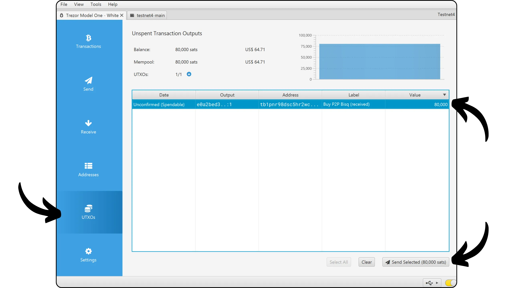

ඉලක්කය Address ඇතුළත් කරන්න. "*+ Add*" බොත්තම ක්ලික් කිරීමෙන් ඔබට බහු ලිපින ඇතුළත් කළ හැක.

"*"ලේබලය*" ලියන්න මෙම වියදමේ අරමුණ මතක තබා ගැනීමට.

මෙම Address වෙත යැවීමට ඇති මුදල තෝරන්න.

ඔබේ ගනුදෙනුවේ ගාස්තු අනුපාතය වත්මන් වෙළඳපොළට අනුව සකසන්න. උදාහරණයක් ලෙස, සුදුසු ගාස්තු අනුපාතයක් තෝරා ගැනීමට [Mempool.space](https://Mempool.space/) භාවිතා කළ හැක.

සියලුම ඔබේ ගනුදෙනු පරාමිතීන් නිවැරදි බව සහතික කර, පසුව "*ගනුදෙනුව තනන්න*" මත ක්ලික් කරන්න.

If everything is to your satisfaction, click on "*Finalize Transaction for Signing*".

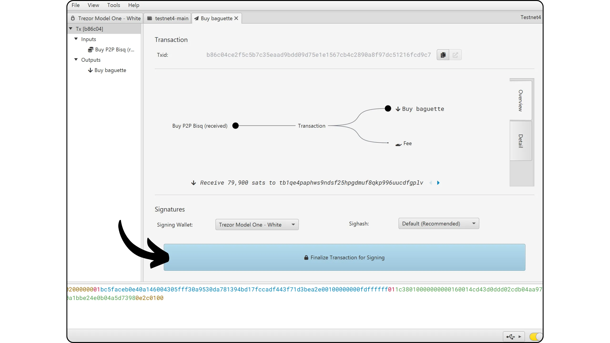

"*"Sign*" මත ක්ලික් කරන්න.

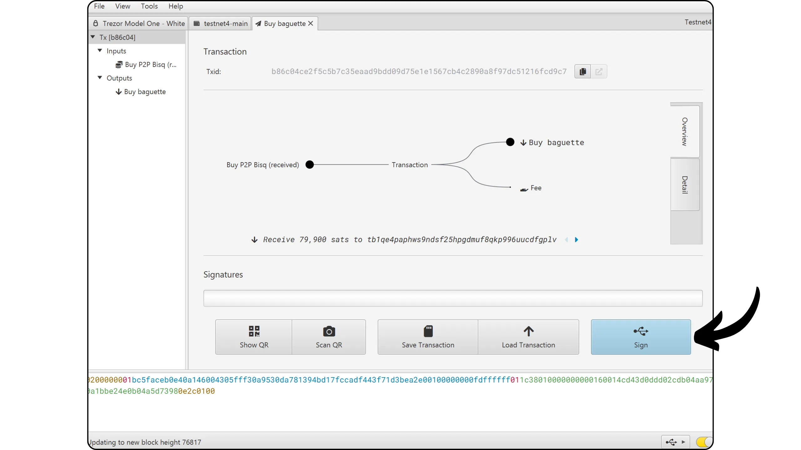

ඔබේ Trezor Model One අසල "*Sign*" මත ක්ලික් කරන්න.

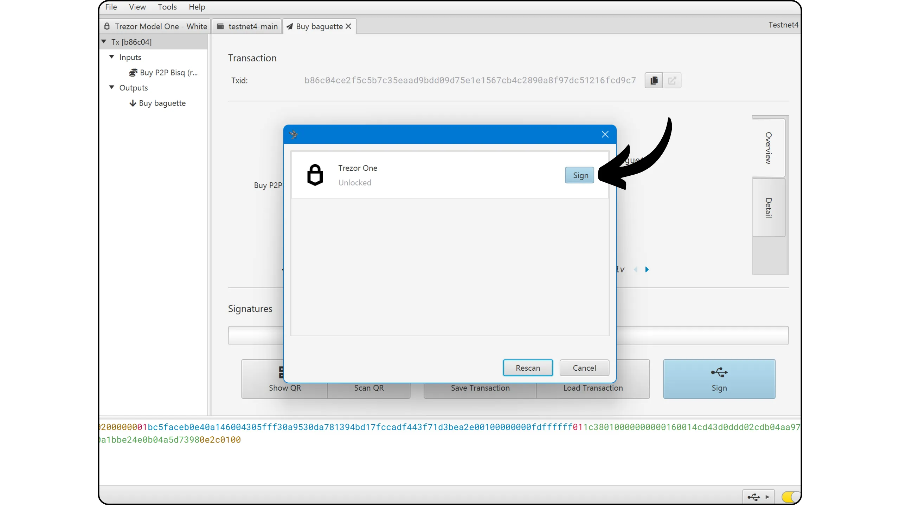

Hardware Wallet තිරය මත ගනුදෙනු පරාමිතීන්, ලැබුම්කරුවාගේ ලැබීමේ Address, යවන ලද මුදල සහ ගාස්තුව ඇතුළුව පරීක්ෂා කරන්න. ගනුදෙනුව Trezor මත සත්‍යාපනය කළ පසු, එය අත්සන් කිරීමට දකුණු මූසික බොත්තම ඔබන්න.

ඔබේ ගනුදෙනුව දැන් අත්සන් කර ඇත. සියල්ල හරිදැයි අවසන් වරට පරීක්ෂා කර, එවිට "*Broadcast Transaction*" මත ක්ලික් කර Bitcoin ජාලය මත එය විකාශය කරන්න.

ඔබට එය Sparrow Wallet හි "*Transactions*" ටැබ් එකේ සොයා ගත හැක.

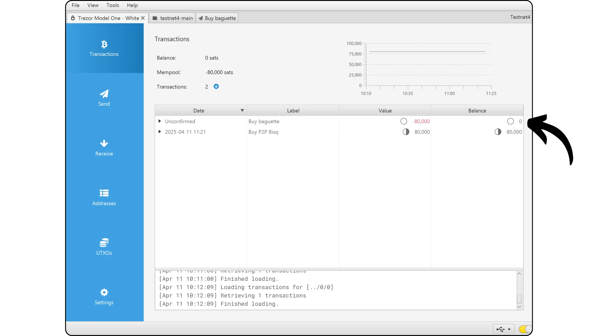

සුභ පැතුම්, ඔබ දැන් Sparrow Wallet සමඟ Trezor Model One මූලික භාවිතය පිළිබඳව වේගවත් වී ඇත! තවත් පියවරක් ඉදිරියට යාමට, ඔබේ ආරක්ෂාව තහවුරු කිරීම සඳහා passphrase BIP39 සමඟ Hardware Wallet Trezor භාවිතය පිළිබඳ මෙම සම්පූර්ණ උපකාරකය මම නිර්දේශ කරමි:

https://planb.network/tutorials/wallet/backup/trezor-passphrase-0474b5bf-496f-4f97-aefe-445368fdca42

ඔබට මෙම උපකාරිකාව ප්‍රයෝජනවත් වූවා නම්, පහත Green අඟුලක් තබා යාමට මම කෘතඥ වෙමි. මෙම ලිපිය ඔබේ සමාජ ජාලවල බෙදා ගැනීමට නිදහස් වන්න. බොහෝම ස්තූතියි!