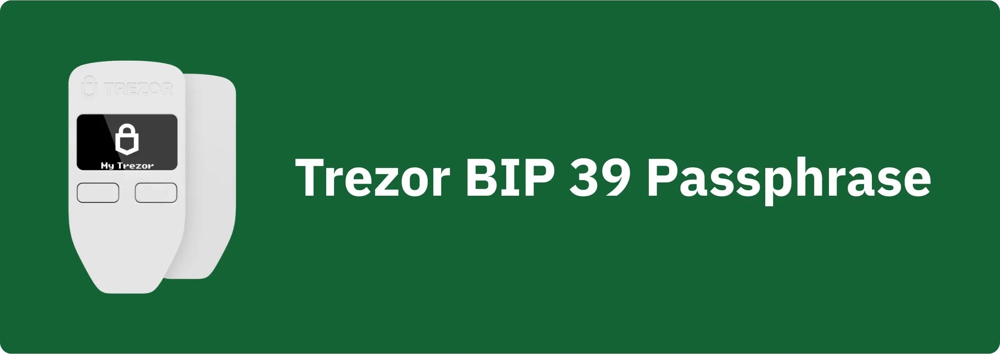

passphrase BIP39 යනු විකල්ප මුරපදයක් වන අතර, Mnemonic වාක්‍යය සමඟ එකතු කර, නියමිත සහ ශ්‍රේණිගත Bitcoin පෝර්ට්ෆෝලියෝ සඳහා අමතර Layer ආරක්ෂාවක් සපයයි. මෙම උපකාරිකාවේදී, Trezor (Safe 3, Safe 5 සහ Model One) මත ඔබගේ ආරක්ෂිත Bitcoin Wallet මත passphrase එකක් පිහිටුවන්නේ කෙසේදැයි අපි එක්ව සොයා බලමු.

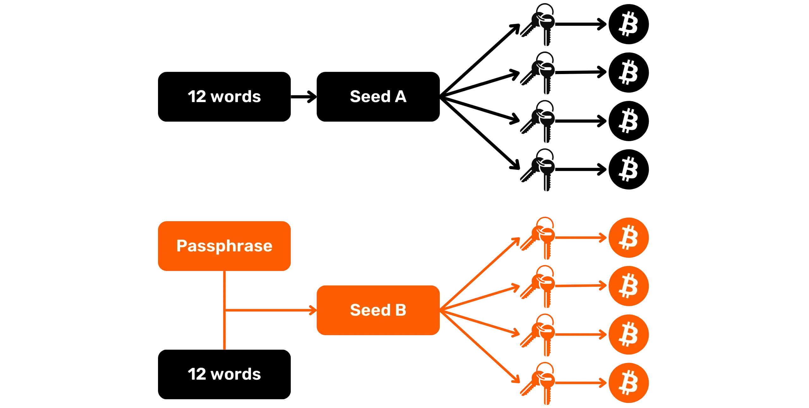

මෙම උපකාරකය ආරම්භ කිරීමට පෙර, ඔබ passphrase සංකල්පය, එය කෙසේ ක්‍රියා කරන්නේද සහ එය ඔබේ Bitcoin Wallet සඳහා ඇති බලපෑම් පිළිබඳව හුරු නොවී සිටිනවා නම්, මම මෙම වෙනත් සංකල්පික ලිපිය අනුමත කරන අතර එහිදී මම සියල්ල විස්තර කරමි (මෙය ඉතා වැදගත් වේ, මක්නිසාද passphrase එකක් සම්පූර්ණයෙන්ම එය කෙසේ ක්‍රියා කරන්නේද යන්න නොදැන භාවිතා කිරීමෙන් ඔබේ බිට්කොයින් අවදානමේ පවතින බැවින්) :

https://planb.network/tutorials/wallet/backup/passphrase-a26a0220-806c-44b4-af14-bafdeb1adce7

passphrase on Trezor is handled in the classic way if you've opted for the BIP39 standard during configuration (which I recommend if you don't need *Multi-share Backup*). What's special about Trezor is that you can either enter the passphrase directly on the Hardware Wallet, or via your computer's keyboard using the Trezor Suite software. This second option is considerably less secure, as the computer has an immensely larger attack surface than the Hardware Wallet. However, typing a complex passphrase may be faster on a conventional keyboard than on the Hardware Wallet, which could encourage the use of strong passphrases. So it's always better to use a passphrase, even if it has to be typed, than not to use one at all. It is important, however, to remain aware of the increased risk of numerical attacks that this implies.

මෙම විකල්ප සියලු Trezor-අනුකූල පෝර්ට්ෆෝලියෝ කළමනාකරණ මෘදුකාංග වල ලබා ගත නොහැක. උදාහරණයක් ලෙස, Model One සඳහා, passphrase Sparrow Wallet මත යතුරුපුවරුව හරහා ඇතුල් කළ හැක. Model T, Safe 3 සහ Safe 5 ආකෘති සඳහා, ඔබ Trezor Suite භාවිතා කළ යුතු අතර නැතහොත් Hardware Wallet මත සෘජුවම passphrase ඇතුල් කළ යුතුය, මක්නිසාද Sparrow හරහා ඇතුල් කිරීමේ විකල්පය HWI විසින් වසර කිහිපයකට පෙර අක්‍රිය කරනු ලැබුවා.

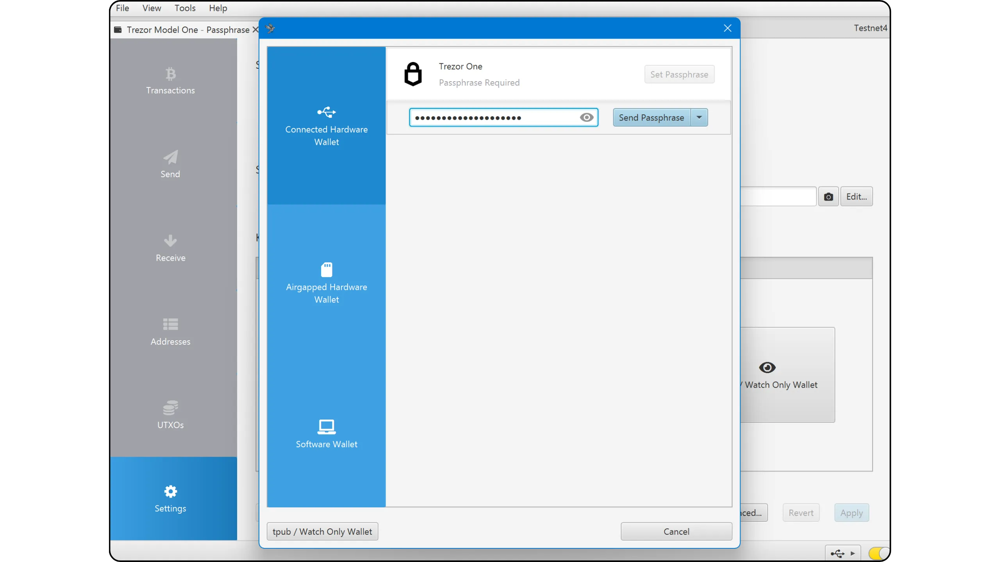

V Trezor Suite imate dva različna načina upravljanja z zahtevami passphrase. Možnost "*passphrase*" lahko aktivirate na zavihku "*Device*". Če je omogočena, vas bodo Trezor Suite in vsa druga programska oprema za upravljanje portfelja sistematično prosili, da vnesete svoj passphrase vsakič, ko ga zaženete. Če imate raje bolj diskreten pristop k uporabi passphrase, lahko nastavitev ohranite na "*Standard*". V tem primeru boste morali ročno dostopati do menija vašega Hardware Wallet v zgornjem levem kotu in klikniti na gumb "*+ passphrase*" vsakič, ko ga zaženete.

මෙම උපකාරකය ආරම්භ කිරීමට පෙර, කරුණාකර ඔබේ Trezor දැනටමත් ආරම්භ කර ඇති බව සහ ඔබේ Mnemonic වාක්‍යය ජනනය කර ඇති බව සහතික කරන්න. ඔබ එසේ නොකර ඇත්නම්, සහ ඔබේ Trezor නවයි නම්, Plan ₿ Network හි ඇති ආකෘති-විශේෂිත උපකාරකය අනුගමනය කරන්න. ඔබ මෙම පියවර සම්පූර්ණ කළ පසු, ඔබට මෙම උපකාරකයට නැවත පැමිණිය හැක.

https://planb.network/tutorials/wallet/hardware/trezor-safe-5-4413308a-a1b5-4ba4-bc49-72ae661cc4e0

https://planb.network/tutorials/wallet/hardware/trezor-safe-3-51d0d669-5d23-47c2-beb6-cc6fa0fb0ea0

https://planb.network/tutorials/wallet/hardware/trezor-model-one-5c250c49-ce3b-4c63-bd05-4600d7c11a02

## Safe 3 හෝ Safe 5 වෙත passphrase එකක් එක් කිරීම

ඔබගේ Wallet නිර්මාණය කර, Mnemonic සුරැකීම් කර, PIN එකක් සකසා අවසන් වූ විට, ඔබ Trezor Suite ප්‍රධාන මෙනුවට ගෙන යනු ලැබේ. ඉහළ වම් කෙළවරේ, passphrase BIP39 සක්‍රීය කිරීමට ඔබට ආරාධනා කරන කවුළුවක් පෙනී යා යුතුය.

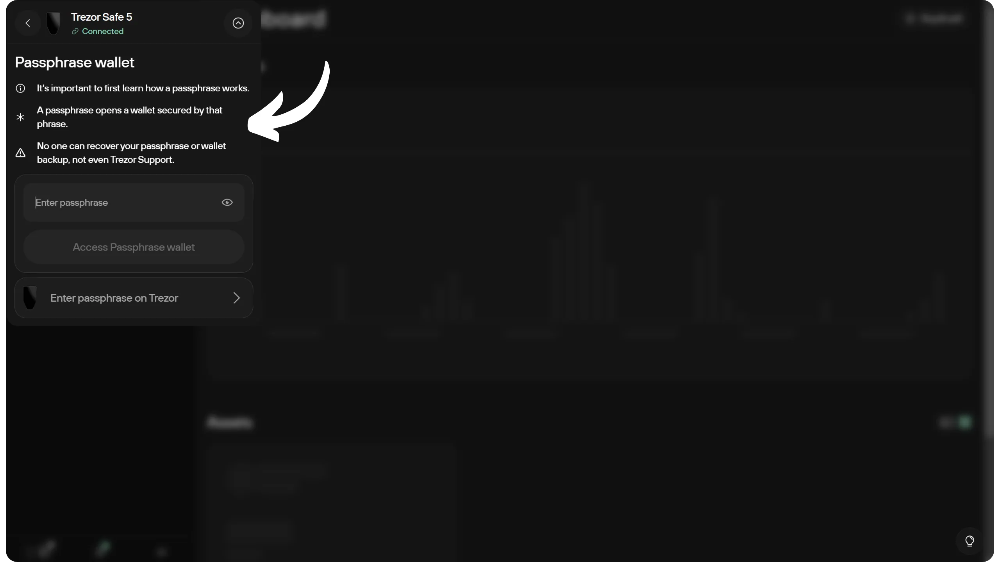

Če se to okno ne prikaže, boste morali ročno aktivirati možnost "*passphrase*" v zavihku nastavitev "*Naprava*".

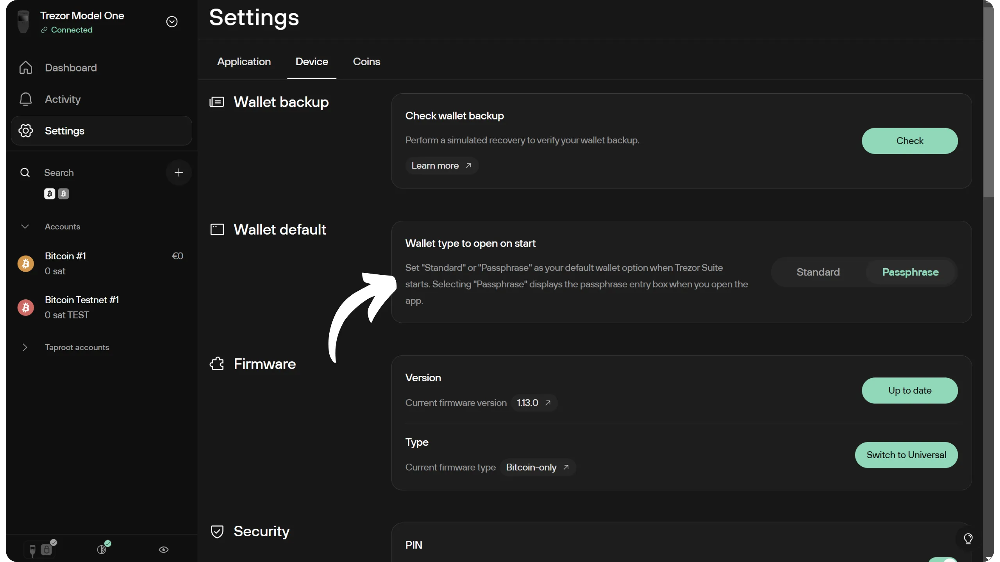

මෙම කවුළුව ඔබගෙන් ඔබේ passphrase ඇතුළත් කරන ලෙස ඉල්ලා සිටී. ශක්තිමත් passphrase තෝරා, කඩිනමින් කඩදාසි හෝ ලෝහ වැනි මාධ්‍යයක භෞතික ආපසු පිටපතක් සකසන්න. මෙම උදාහරණයේ, මම තෝරාගෙන ඇති passphrase: `fH3&kL@9mP#2sD5qR!82`. මෙය උදාහරණයක් පමණි; කෙසේ වෙතත්, මම ඔබට තරමක් දිගු passphrase තෝරා ගැනීමට නිර්දේශ කරමි. අක්ෂර 30 සිට 40 දක්වා වඩාත් සුදුසුය (හොඳ මුරපදයක් මෙන්).

අනිවාර්යයෙන්ම, ඔබේ passphrase අන්තර්ජාලයේ බෙදා ගත යුතු නොවේ, මම මෙම උපකාරිකාවේ කරන පරිදි. මෙම උදාහරණ Wallet භාවිතා කරන්නේ Testnet මත පමණක් වන අතර උපකාරිකාව අවසානයේදී මකා දමනු ඇත.**_

passphrase සඳහා ඔබේ තේරීමේදී වඩා විශේෂිත නිර්දේශ සඳහා, මම ඔබට නැවතත් මෙම වෙනත් ලිපිය අනුගමනය කරන ලෙස ආරාධනා කරමි:

https://planb.network/tutorials/wallet/backup/passphrase-a26a0220-806c-44b4-af14-bafdeb1adce7

Če želite vnesti svoj passphrase prek tipkovnice računalnika, ga vnesite v predvideno polje, nato kliknite na "*Access passphrase Wallet*".

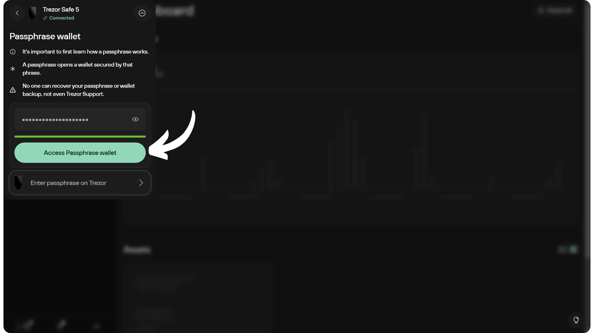

ඔබේ Hardware Wallet පසුව ඔබේ passphrase පෙන්වනු ඇත. තිරය මත ක්ලික් කර ඉදිරියට යාමට පෙර එය ඔබේ භෞතික ආපසු සටහන (කඩදාසි හෝ ලෝහ) සමඟ ගැලපෙන බව සහතික කරන්න.

මෙය ඔබට ඔබේ passphrase-සුරක්ෂිත පෝර්ට්ෆෝලියෝ වෙත ප්‍රවේශය ලබා දේ.

Če želite izboljšati varnost z vnosom vašega passphrase samo na vašem Trezorju, ko boste pozvani, kliknite na "*Enter passphrase on Trezor*".

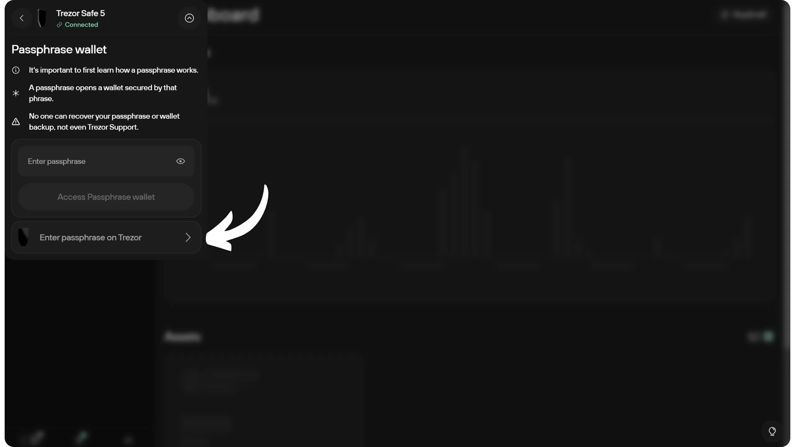

Trezor මත T9 යතුරුපුවරුවක් පෙනෙන අතර, ඔබට ඔබේ passphrase ඇතුළත් කිරීමට ඉඩ සලසයි. ඔබේ ඇතුළත් කිරීම සම්පූර්ණ කළ විට, passphrase ඔබේ Wallet වෙත යොමු කිරීමට Green ටික් එක ක්ලික් කරන්න.

ඔබට පසුව ඔබේ passphrase ආරක්ෂිත Wallet වෙත ප්‍රවේශ විය හැක.

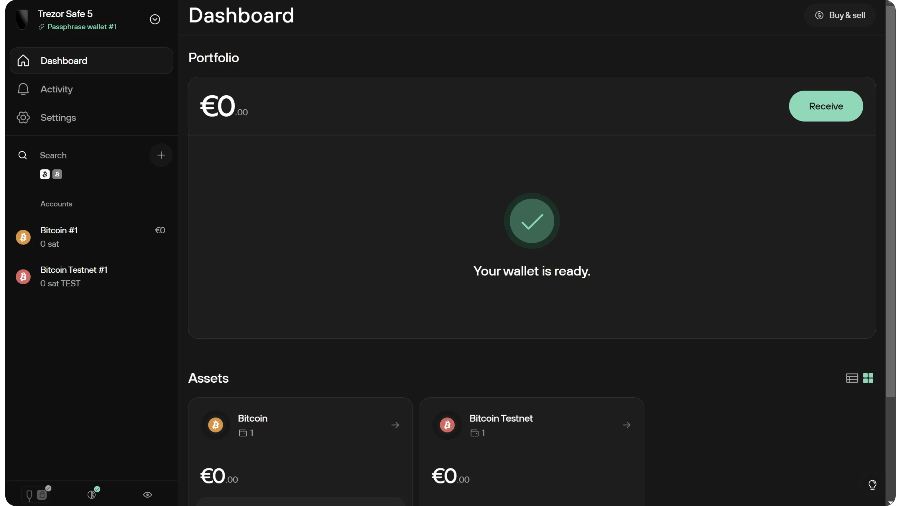

Sparrow Wallet භාවිතා කිරීමට, ක්‍රියාවලිය සමාන වේ, නමුත් T, Safe 3 සහ Safe 5 ආකෘති සඳහා, passphrase Hardware Wallet මත ඇතුළත් කළ යුතු අතර පරිගණක යතුරුපුවරුව හරහා නොවේ.

Kadarkoli Sparrow Wallet potrebuje dostop do vašega Trezorja, in passphrase še ni bil uporabljen od zadnjega zagona, ga boste morali vnesti z uporabo tipkovnice T9.

## Model One-ට passphrase එකක් එකතු කිරීම

Model One මත, passphrase BIP39 භාවිතය සෑම විටම අවශ්‍ය වේ. මෙම උපාංගය ආරක්ෂිත මූලද්‍රව්‍යයක් ඇතුළත් නොකරන බැවින්, සංවේදී තොරතුරු ලබා ගැනීම ස نسبتا පහසුය. එබැවින්, භෞතික ප්‍රහාර වලට එරෙහිව ප්‍රතිරෝධී නොවේ. කෙසේ වෙතත්, passphrase උපාංගය මත රඳවා නොමැති බැවින්, එය නිවා දැමූ පසු, ශක්තිමත් (බලහීන නොවන) passphrase භාවිතය මෙම ආකෘතිය මත ඇති බොහෝ දන්නා භෞතික ප්‍රහාර වලින් ඔබව ආරක්ෂා කළ හැක.

Model One මත, passphrase සෘජුවම Hardware Wallet මත ඇතුළත් කිරීම සම්භව නොවේ. ඔබට එය ඇතුළත් කිරීමට ඔබේ පරිගණක යතුරුපුවරුව භාවිතා කළ යුතුය.

ඔබේ Wallet නිර්මාණය කර, Mnemonic සුරක්ෂිත කර, PIN එකක් සකසා අවසන් වූ විට, ඔබ Trezor Suite මුල් මෙනුවට ගෙන යනු ලැබේ. ඉහළ වම් කෙළවරේ, passphrase BIP39 සක්‍රීය කිරීමට ඔබට ආරාධනා කරන කවුළුවක් පෙනී යිය යුතුය.

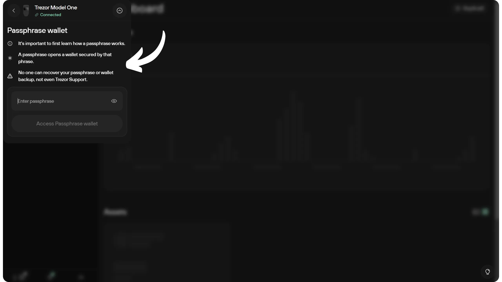

Če se to okno ne prikaže, morate aktivirati možnost "*passphrase*" v zavihku "*Naprava*" nastavitev.

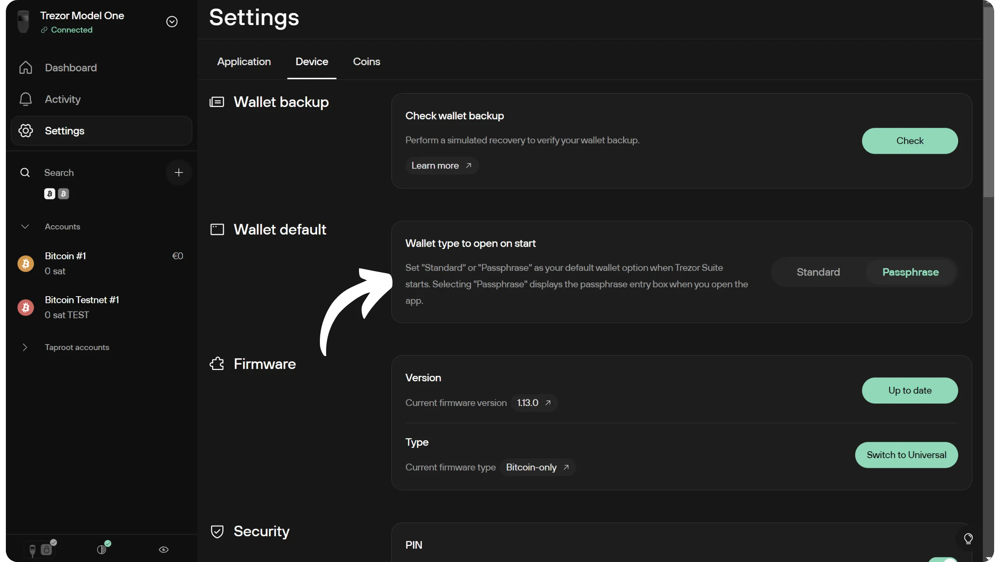

මෙම කවුළුව ඔබට ඔබේ passphrase ඇතුළත් කරන ලෙස ඉල්ලා සිටී. ශක්තිමත් passphrase එකක් තෝරා, කඩිනමින් කඩදාසි හෝ ලෝහ වැනි මාධ්‍යයක භෞතික ආපසු පිටපතක් සකසන්න. මෙම උදාහරණයේ, මම තෝරාගෙන ඇති passphrase: `fH3&kL@9mP#2sD5qR!82`. මෙය සරල උදාහරණයක් පමණි; එහෙත්, මම ඔබට තරමක් දිගු passphrase එකක් තෝරා ගැනීමට නිර්දේශ කරමි. අක්ෂර 30 සහ 40 අතර වීම ඉතා සුදුසුය (හොඳ මුරපදයක් මෙන්).

passphrase සඳහා ඔබේ තේරීමේදී වඩා විශේෂිත නිර්දේශ සඳහා, මම ඔබට නැවතත් මෙම වෙනත් ලිපිය අනුගමනය කරන ලෙස ආරාධනා කරමි:

https://planb.network/tutorials/wallet/backup/passphrase-a26a0220-806c-44b4-af14-bafdeb1adce7

ඔබගේ passphrase ලබා දී ඇති ක්ෂේත්‍රයේ ඇතුළත් කර, පසුව "*Access passphrase Wallet*" බොත්තම ක්ලික් කරන්න.

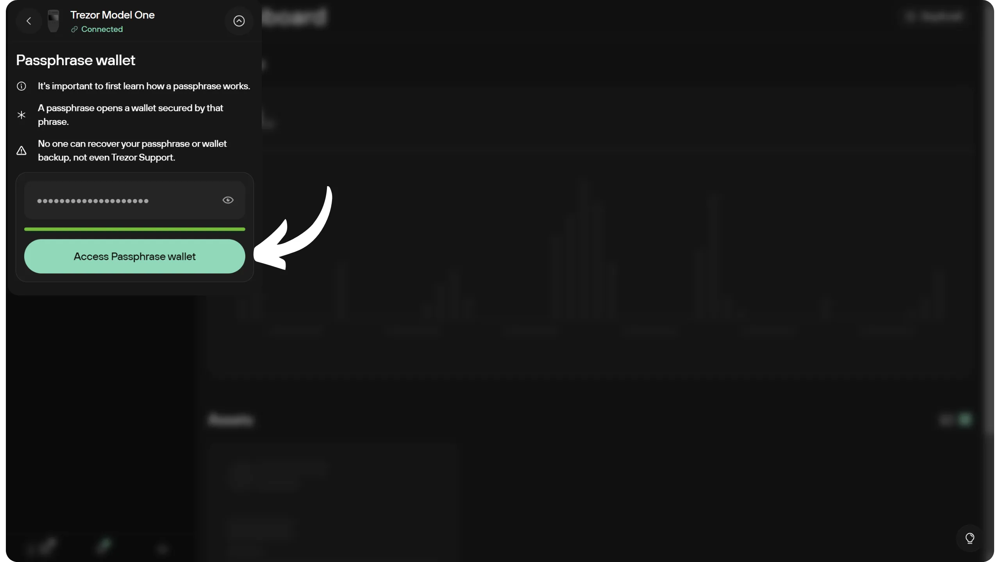

ඔබේ Hardware Wallet ඔබේ passphrase පෙන්වනු ඇත. එය ඔබේ භෞතික ආපස්ස (කඩදාසි හෝ ලෝහ) සමඟ ගැලපෙන බව සහතික කර, පසුව ඉදිරියට යාමට දකුණු පැත්තේ බොත්තම ක්ලික් කරන්න.

මෙය ඔබව ඔබේ passphrase-සුරක්ෂිත පෝර්ට්ෆෝලියෝ වෙත ගෙන යනු ඇත.

Sparrow Wallet භාවිතා කිරීමට, පසුකාලීනව, ක්‍රියාවලිය එසේම පවතී. සෑම වරකම Sparrow ඔබේ Hardware Wallet වෙත ප්‍රවේශය අවශ්‍ය වන අතර, උපාංගය අවසන් වරට ආරම්භ කළේ සිට passphrase ඇතුළත් කර නොමැති නම්, ඔබට එය ඇතුළත් කළ යුතුය.

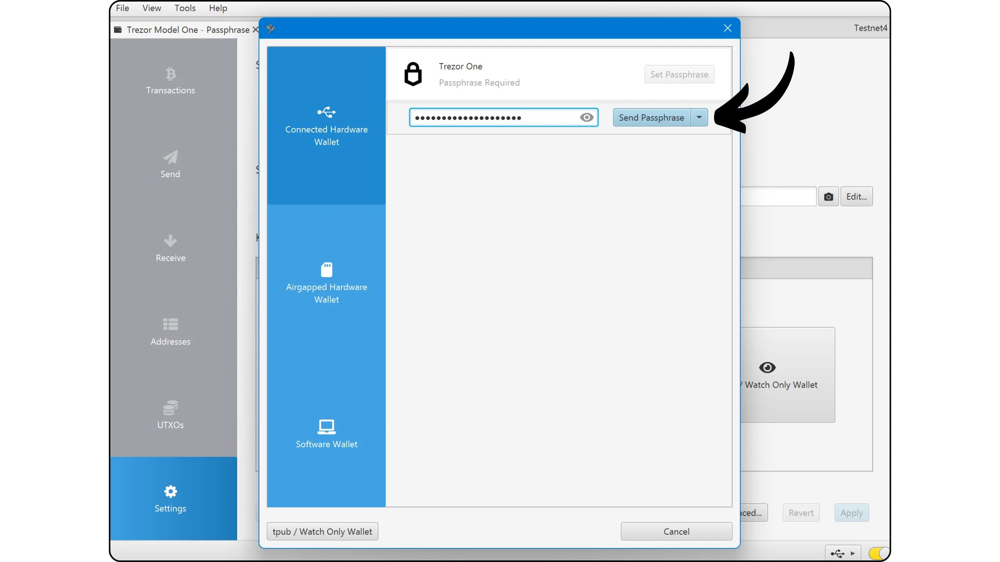

චෙස්ටිතා, ඔබ දැන් Trezor දෘඩාංග පසුම්බිවල passphrase BIP39 භාවිතය පිළිබඳව වේගවත් වී ඇත. ඔබේ Wallet ආරක්ෂාව තවත් පියවරක් ඉදිරියට ගෙන යාමට කැමති නම්, Trezor හි *බහු-හවුල්කාර* උපස්ථ පද්ධති (*Shamir's Secret Sharing Scheme*) පිළිබඳ මෙම උපකාරකය බලන්න:

https://planb.network/tutorials/wallet/backup/trezor-shamir-backup-7f98b593-face-48fb-a643-0e811b87c94e

ඔබට මෙම උපකාරිකාව ප්‍රයෝජනවත් වූවා නම්, පහත Green අඟුලක් තැබුවා නම් මම කෘතඥ වෙමි. මෙම ලිපිය ඔබේ සමාජ ජාලවල බෙදා ගැනීමට නිදහස් වන්න. බොහෝම ස්තූතියි!