*චිත්‍ර ණය: [Trezor.io](https://trezor.io/)*

Trezor Safe 3 යනු SatoshiLabs විසින් නිර්මාණය කරන ලද Hardware Wallet එකක් වන අතර 2023 දී නිර්මාණය කරන ලදී. එය ආරම්භකයින් සහ මධ්‍යම පරිශීලකයින් දෙදෙනාටම නිර්මාණය කරන ලද ඉතා සංකුචිත, සැහැල්ලු ආකෘතියකි (ග්‍රෑම් 14). එය ප්‍රසිද්ධ Model One හි අනුප්‍රාප්තිකයා වන අතර, එහි ප්‍රධාන තරඟකරු Ledger සමඟ එය වෙනස් කරන විවෘත මූලාශ්‍ර ප්‍රවේශය තබා ගනිමින් සුවිශේෂී එකතු කිරීම් ඇත. Safe 3 හි මිල යුරෝ 79 ක් වේ. එබැවින් එය මධ්‍යම පරාස Hardware Wallet කොටස තුළ පිහිටා ඇති අතර, Ledger Nano S Plus සමඟ සෘජු තරඟයක නිරත වේ.

Safe 3 සකසන ලද්දේ බැටරි නොමැතිව USB-C සම්බන්ධතාවයක් මඟින් පමණක් ක්‍රියාත්මක වන පරිදි වන අතර, එය බලය සහ සන්නිවේදනය සඳහා භාවිතා වේ. එය කුඩා 0.96 අඟල් මොනොක්‍රෝම් OLED ප්‍රදර්ශනයක් සහ භෞතික බොත්තම් දෙකක් අඩංගු වේ.

Safe 3 යනු හොඳ Hardware Wallet සඳහා අපේක්ෂිත සියලුම මූලික විශේෂාංග ලබා දෙන අතර, passphrase BIP39 හි විශිෂ්ට ඒකාබද්ධතාවය ඇතුළත් වේ. කෙසේ වෙතත්, එය තවම Miniscript සඳහා සහය නොදක්වයි.

මෙම ආකෘතිය ආරම්භකයින් සඳහා විශේෂයෙන් සුදුසු වන අතර, නව පරිශීලකයෙකුට මම නිර්දේශ කරන Hardware Wallet විය හැක. එය මධ්‍යම පරිශීලකයින්ටද හොඳින් ගැලපේ. අනෙක් අතට, Coldcard වැනි උපාංගවල ලබා ගත හැකි වඩා විශේෂිත විශේෂාංග සොයන උසස් පරිශීලකයින්ගේ සියලුම අපේක්ෂා ඉටු නොවිය හැක. කෙසේ වෙතත්, ඔබට මෙම උසස් විකල්ප අවශ්‍ය නොවේ නම්, Trezor Safe 3 විශිෂ්ට තේරීමක් විය හැක.

## Trezor Safe 3 varnostni model

Trezor Safe 3 දැන් EAL6+ සහතික කළ **Secure Element** එකකින් සන්නද්ධ කර ඇත, Model One සහ Model T වැනි පෙර ආකෘතිවලට වඩා සුවිශේෂී ප්‍රගතියකි. මෙය OPTIGA Trust M V3 චිප් එක වන අතර, එය seed සෘජුවෙන් ගබඩා නොකර, එයට ප්‍රවේශය ආරක්ෂා කිරීමට සංකේතාත්මක සංරචකයක් ලෙස ක්‍රියා කරයි. Secure Element එක රහසක් තබා ගනී, එය පරිශීලකයා විසින් PIN එක නිවැරදිව ඇතුළත් කළ පසු පමණක් ප්‍රවේශ විය හැක. එවිට මෙම රහස භාවිතා කර, උපාංගයේ ප්‍රධාන මතකයේ සංකේතනය කර ගබඩා කරන seed විකේතනය කරයි.

Ta hibridni varnostni sistem ponuja izboljšano fizično zaščito, zlasti proti napadom ekstrakcije ali invazivni analizi, težavam, ki so bile značilne za Model One, zlasti pri upravljanju PIN-ov. Te ranljivosti so zdaj obvladane zahvaljujoč uporabi varnega elementa. Ta model prav tako ohranja odprtokodno programsko arhitekturo: koda, ki upravlja generacijo in uporabo zasebnih ključev, ostaja popolnoma dostopna in preverljiva. Čip OPTIGA upravlja le s PIN kodo, elementom zunaj upravljanja ključev Bitcoin Wallet. Sprosti le skrivnost, ki se lahko uporabi za dešifriranje seed. Prav tako čip OPTIGA Trust M V3 koristi relativno prosto licenco, ki SatoshiLabs omogoča prosto objavo potencialnih ranljivosti.

මෙම ආරක්ෂක ආකෘතිය, මගේ අදහසට, අද වෙළඳපොළේ ලබා ගත හැකි හොඳම සමථයකි. එය ආරක්ෂිත මූලද්‍රව්‍යයක වාසි සහිතව විවෘත මූලාශ්‍ර මෘදුකාංග කළමනාකරණය සමඟ එකතු කරයි. පෙර, පරිශීලකයින්ට චිප් සමඟ වර්ධිත භෞතික ආරක්ෂාව සහ විවෘත මූලාශ්‍ර සමඟ විනිවිදභාවය අතර තේරීම කළ යුතු විය; Trezor Safe 3 සමඟ, දෙකෙන්ම ප්‍රයෝජන ලබා ගැනීමේ හැකියාව ඇත.

මෙම උපදෙස් මාලාවෙන්, ඔබේ Trezor Safe 3 ආරක්ෂිතව පිහිටුවා භාවිතා කරන ආකාරය අපි ඔබට පෙන්වන්නෙමු.

## Trezor Safe 3 අමුඩය විවෘත කිරීම

ඔබගේ Safe 3 ලබා ගත් විට, පැකේජය විවෘත කර නොමැති බව තහවුරු කිරීමට පෙට්ටිය සහ Seal අඛණ්ඩව ඇති බවට විශ්වාස වන්න. පසුව සකස් කරන විට උපාංගයේ සත්‍යතාවය සහ අඛණ්ඩතාවය සොෆ්ට්වෙයාර් තහවුරු කිරීමක් ද සිදු කරනු ඇත.

බැග් අන්තර්ගතය ඇතුළත් වේ :

- Trezor Safe 3;
- Mnemonic වාක්‍යය සටහන් කිරීමට කාඩ්පත්, ස්ටිකර් සහ උපදෙස් අඩංගු පවුච් එකක්;
- USB-C to USB-C කේබල්.

Ko odprete, mora biti vaš Trezor Safe 3 zaščiten s zaščitno plastiko, USB-C priključek pa mora biti zavarovan s holografskim Seal. Prepričajte se, da je tam.

උපකරණය මත නාවිගේෂනය සරලයි: දකුණු බොත්තම භාවිතා කර දකුණට ගමන් කරන්න, සහ වම බොත්තම භාවිතා කර වමට ගමන් කරන්න. ක්‍රියාවක් තහවුරු කිරීමට බොත්තම් දෙකම එකවර ඔබන්න.

## ප්‍රාථමික අවශ්‍යතා

මෙම උපකාරිකාව සඳහා, මම ඔබට Trezor Safe 3 [Sparrow Wallet පෝර්ට්ෆෝලියෝ කළමනාකරණ මෘදුකාංගය](https://sparrowwallet.com/download/) සමඟ භාවිතා කරන ආකාරය පෙන්වන්න යන්නේ. ඔබ මේ වන විට මෙම මෘදුකාංගය ස්ථාපනය කර නැත්නම්, කරුණාකර දැන් එය කරන්න. ඔබට උදව් අවශ්‍ය නම්, Sparrow Wallet වින්‍යාස කිරීම පිළිබඳ විස්තරාත්මක උපකාරිකාවක් අපට ඇත:

https://planb.network/tutorials/wallet/desktop/sparrow-c674e2ac-d46f-4c82-92a7-7d1b0e262f5d

ඔබට Safe 3 සකසීමට, එහි සත්‍යතාවය පරීක්ෂා කිරීමට සහ ෆර්ම්වේයර් ස්ථාපනය කිරීමට Trezor Suite මෘදුකාංගයද අවශ්‍ය වේ. අපි එම මෘදුකාංගය ඒ සඳහා පමණක් භාවිතා කරමු, සහ පසුව ෆර්ම්වේයර් යාවත්කාලීන කිරීම් සඳහා පමණක් අවශ්‍ය වේ. Wallet හි දිනපතා කළමනාකරණය සඳහා, අපි Sparrow Wallet පමණක් භාවිතා කරමු, එය Bitcoin සඳහා උපරිම කර ඇති අතර, ආරම්භකයින්ට පවා පහසුවෙන් භාවිතා කළ හැක (Sparrow, Bitcoin සඳහා පමණක් සහය දක්වයි, altcoins සඳහා නොවේ).

[Prenesite Trezor Suite z uradne spletne strani](https://trezor.io/trezor-suite)

මෙම වැඩසටහන් දෙක සඳහාම, මම දැඩිව නිර්දේශ කරන්නේ ඔබේ පරිගණකය මත ඒවා ස්ථාපනය කිරීමට පෙර ඒවායේ සත්‍යතාව (GnuPG සමඟ) සහ ඒවායේ අඛණ්ඩතාව (Hash හරහා) පරීක්ෂා කරන ලෙසයි. ඔබට මෙය කරන්නේ කෙසේදැයි නොදැනී නම්, ඔබට මෙම වෙනත් උපකාරකය අනුගමනය කළ හැක:

https://planb.network/tutorials/computer-security/data/integrity-authenticity-21d0420a-be02-4663-94a3-8d487f23becc

## Trezor Safe 3 ආරම්භ කිරීම

ඔබේ Safe 3, Trezor Suite සහ Sparrow Wallet දැනටමත් ස්ථාපිත කර ඇති ඔබේ පරිගණකයට සම්බන්ධ කරන්න.

Trezor Suite odprite, nato kliknite na "*Nastavi moj Trezor*".

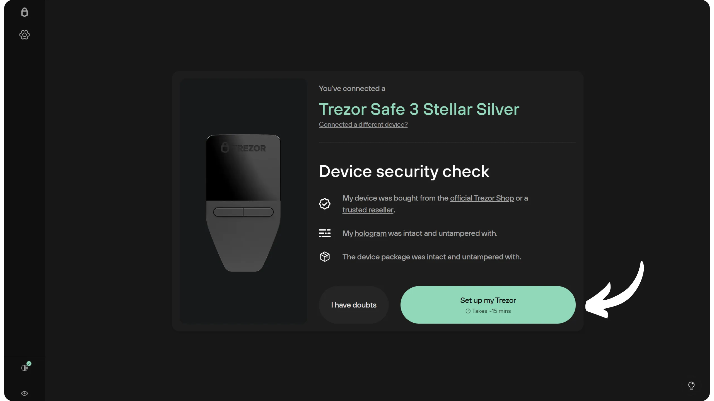

"*Bitcoin-only firmware*" තෝරන්න, එවිට "*Install Bitcoin-only*" මත ක්ලික් කරන්න.

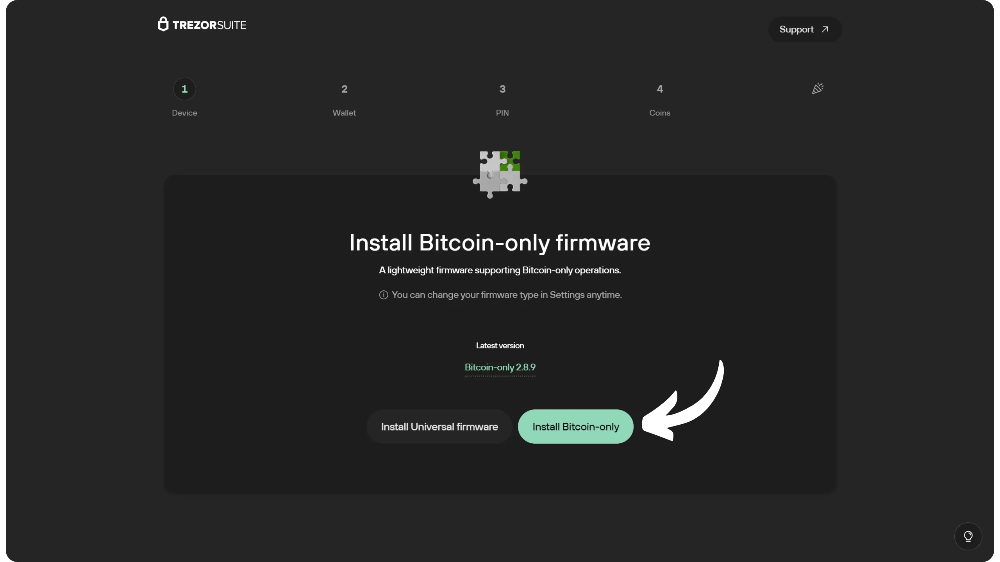

Trezor Suite nato bo namestil vdelano programsko opremo na vaš Safe 3. Prosimo, počakajte med namestitvijo.

කොටස "*Continue*" මත ක්ලික් කරන්න.

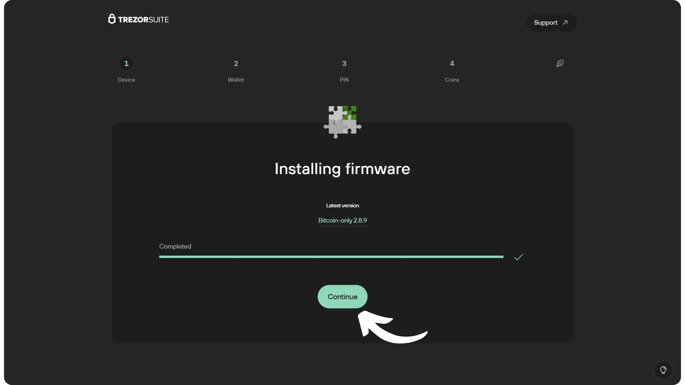

පසුව ඔබේ Hardware Wallet ව්‍යාජ හෝ අන්‍යකාරක නොවන බව සහතික කිරීම සඳහා සත්‍යතාව පරීක්ෂාවට යන්න.

ඔබේ Safe 3 මත, තහවුරු කිරීමට දකුණු බොත්තම ඔබන්න.

Če je vaš Trezor pristen, se bo v Trezor Suite prikazalo potrditveno sporočilo.

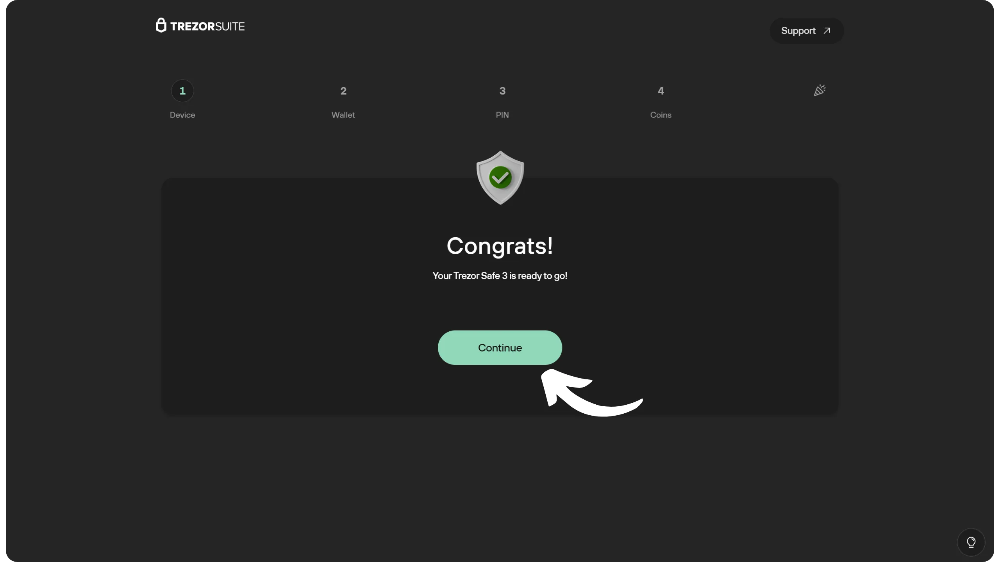

ඔබට පසු දොරවල් මූලික මෙහෙයුම් උපදෙස් සමඟ මඟ හරින්න පුළුවන්.

## Bitcoin පෝර්ට්ෆෝලියෝ එකක් නිර්මාණය කිරීම

Trezor Suite මත, "*Create new Wallet*" බොත්තම ක්ලික් කරන්න.

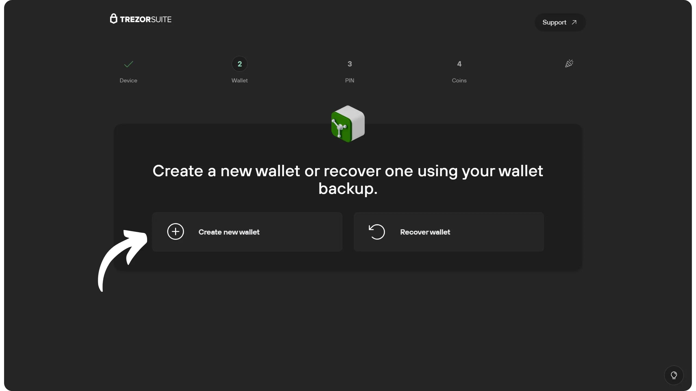

සම්මත පෝර්ට්ෆෝලියෝ සඳහා, ඔබට පෙරනිමි උපස්ථ වර්ගය තෝරා ගත හැක. මෙය 12-වචන Mnemonic වාක්‍යයක් සහිත සම්භාව්‍ය තනි-අත්සන පෝර්ට්ෆෝලියෝවක් නිර්මාණය කරයි. "*Wallet නිර්මාණය කරන්න*" මත ක්ලික් කරන්න.

Če želite izvedeti več o drugih možnostih varnostnega kopiranja, ki so na voljo na Trezorju, vključno z *Multi-share Backup*, vam priporočam, da si ogledate tudi ta vadnik:

https://planb.network/tutorials/wallet/backup/trezor-shamir-backup-7f98b593-face-48fb-a643-0e811b87c94e

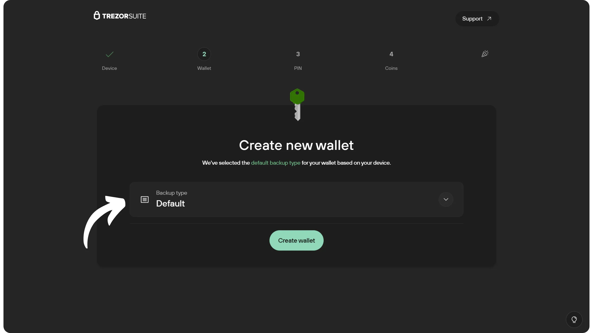

Hardware Wallet මත භාවිත නියමයන් පිළිගන්න.

නව පෝර්ට්ෆෝලියෝවක් තැනීමට නැවත දකුණු බොත්තම ඔබන්න.

Trezor Suite හි, "*ආපසු සුරැකුමට දිගටම යන්න*" ක්ලික් කරන්න.

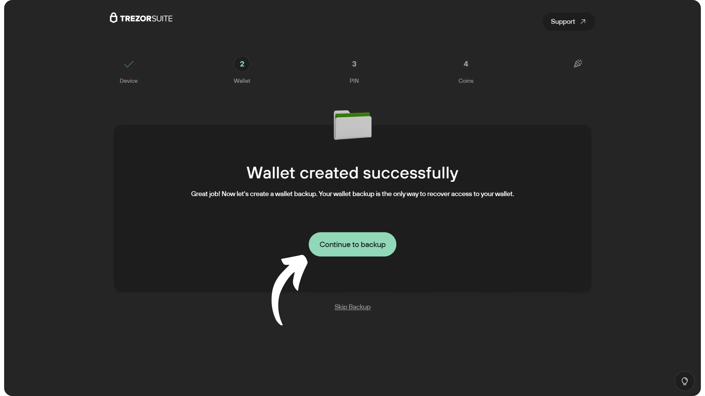

මෘදුකාංගය ඔබේ Mnemonic වාක්‍යය කළමනාකරණය කරන ආකාරය පිළිබඳ උපදෙස් ලබා දේ.

මෙම Mnemonic ඔබට ඔබේ සියලුම බිට්කොයින් සඳහා සම්පූර්ණ, අසීමිත ප්‍රවේශය ලබා දේ. මෙම වාක්‍යය සතු කාට හෝ, ඔබේ Trezor Safe 3 වෙත භෞතික ප්‍රවේශය නොමැතිව පවා, ඔබේ මුදල් සොරාගත හැක.

12-शब्द वाक्यांशले तपाईंको Hardware Wallet हराएको, चोरी भएको वा बिग्रिएको अवस्थामा तपाईंको बिटकोइनहरूको पहुँच पुन:स्थापित गर्दछ। त्यसैले यसलाई सावधानीपूर्वक बचत गर्नु र सुरक्षित ठाउँमा भण्डारण गर्नु धेरै महत्त्वपूर्ण छ।

ඔබට එය පෙට්ටියෙන් සපයන ලද පපිරිය මත ලියන්න පුළුවන්, හෝ අමතර ආරක්ෂාව සඳහා, මම එය ගිනි, ගංවතුර හෝ කඩා වැටීමෙන් ආරක්ෂා කිරීමට මල නොබැඳෙන වානේ පදනමක මත කැටයම් කිරීම නිර්දේශ කරමි.

නියමයන් තහවුරු කර, පසුව "*Wallet ආපසු සුරැකුම නිර්මාණය කරන්න*" බොත්තම මත ක්ලික් කරන්න.

Safe 3 ඔබේ Mnemonic වාක්‍යය එහි අහඹු අංක ජනකය භාවිතයෙන් නිර්මාණය කරනු ඇත. මෙම මෙහෙයුම අතරතුර ඔබව නිරීක්ෂණය නොකරන බවට වග බලා ගන්න. තිරයේ පෙන්වන වචන ඔබ කැමති භෞතික මාධ්‍යයක ලියන්න. ඔබේ ආරක්ෂක උපාය මාර්ගය අනුව, වාක්‍යයේ සම්පූර්ණ භෞතික පිටපත් කිහිපයක් සාදන ලෙස සලකා බලන්න (නමුත් ඉතාම වැදගත් වශයෙන්, එය බෙදන්න එපා). වචන අංකනය කර අනුක්‍රමික අනුපිළිවෙලින් තබා ගැනීම වැදගත්ය.

***හෙළිදරව්වක් ලෙස, ඔබ මෙම පදයන් අන්තර්ජාලයේ කිසිසේත්ම බෙදා හදා ගත යුතු නැත, මම මෙම උපකාරිකාවේ කරන පරිදි. මෙම උදාහරණය Wallet, Testnet මත පමණක් භාවිතා කරනු ඇත සහ මෙම උපකාරිකාවේ අවසානයේදී මකා දමනු ඇත.

Mnemonic වාක්‍යය සුරැකීම සහ කළමනාකරණය කිරීමේ නිවැරදි ක්‍රමය පිළිබඳව වැඩි විස්තර සඳහා, විශේෂයෙන් ඔබ ආරම්භකයෙකු නම්, මෙම වෙනත් උපකාරකය අනුගමනය කිරීම මම ඉතාමත් නිර්දේශ කරමි:

https://planb.network/tutorials/wallet/backup/backup-mnemonic-22c0ddfa-fb9f-4e3a-96f9-46e2a7954270

अगले शब्दों पर जाने के लिए, दाएँ-क्लिक करें। आप बाएँ बटन पर क्लिक करके पीछे जा सकते हैं। एक बार जब आपने सभी शब्द लिख लिए हों, तो अगले चरण पर जाने के लिए दाएँ बटन को दबाए रखें।

Mnemonic වාක්‍යයේ වචන ඔවුන්ගේ අනුපිළිවෙලට තෝරන්න ඔබ ඒවා නිවැරදිව ලියාගෙන ඇති බව තහවුරු කිරීමට. යෝජනා අතර සංචාරය කිරීමට වම සහ දකුණ බොත්තම් භාවිතා කරන්න, පසුව නිවැරදි වචනය තෝරා ගැනීමට බොත්තම් 2 එකවර ක්ලික් කරන්න.

මෙම සත්‍යාපන ක්‍රියාවලිය සම්පූර්ණ වූ විට, දකුණු පැත්තේ බොත්තම මත ක්ලික් කරන්න.

## PIN කේතය සකසීම

ඊළඟට එනේ PIN කේතය පියවරයි. PIN කේතය ඔබේ Trezor අගුළු හරියයි. එම නිසා එය අනුමත නොකළ භෞතික ප්‍රවේශයට ආරක්ෂාව සපයයි. මෙම PIN කේතය ඔබේ Wallet හි ක‍්‍රිප්ටෝග‍්‍රැෆික් යතුරු ව්‍යුත්පන්න කිරීමේදී සම්බන්ධ නොවේ. එබැවින් PIN කේතයට ප්‍රවේශය නොමැතිව, ඔබේ 12-වචන Mnemonic වාක්‍යය අත්පත් කර ගැනීමෙන් ඔබට ඔබේ බිට්කොයින් නැවත ලබා ගැනීමට හැකි වේ.

Trezor Suite මත, "*Continue to PIN*" මත ක්ලික් කරන්න, එවිට "*Set PIN*" බොත්තම මත ක්ලික් කරන්න.

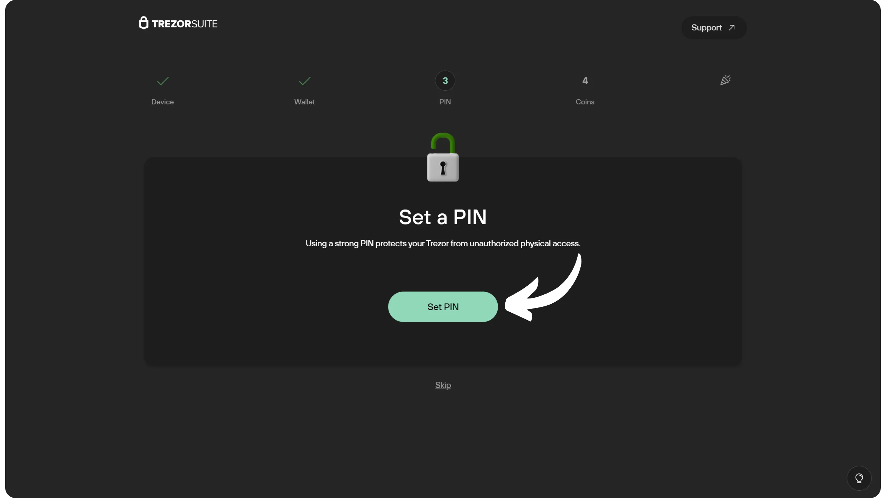

Safe 3 සමඟ තහවුරු කරන්න.

අපි යෝජනා කරන්නේ හැකි අයුරින් අහඹු PIN කේතයක් තෝරා ගැනීමටයි. ඔබේ Trezor ගබඩා කර ඇති ස්ථානයෙන් වෙනම ස්ථානයක (උදාහරණයක් ලෙස මුරපද කළමනාකරුකින්) මෙම කේතය සුරැකීමට වග බලා ගන්න. ඔබට අංක 8 සිට 50 දක්වා PIN කේතයක් නිර්වචනය කළ හැක. ආරක්ෂාව වැඩි දියුණු කිරීම සඳහා හැකි අයුරින් දිගු PIN කේතයක් තෝරා ගැනීමට මම ඔබට යෝජනා කරමි.

වම් සහ දකුණු බොත්තම් භාවිතා කරමින් සෑම ඉලක්කමක්ම තෝරන්න. ඔබේ තේරීම තහවුරු කර, ඊළඟ ඉලක්කමට ගමන් කිරීමට, බොත්තම් දෙකම එකවර ඔබන්න.

අවසන් වූ විට, ඉලක්කම් ආරම්භයේ ඇති "*ENTER*" ලකුණ මත ක්ලික් කරන්න, එවිට ඔබේ PIN නැවත වරක් තහවුරු කරන්න.

ඔබගේ පින් කේතය ලියාපදිංචි කර ඇත.

Trezor Suite මත, "*Complete setup*" බොත්තම ක්ලික් කරන්න.

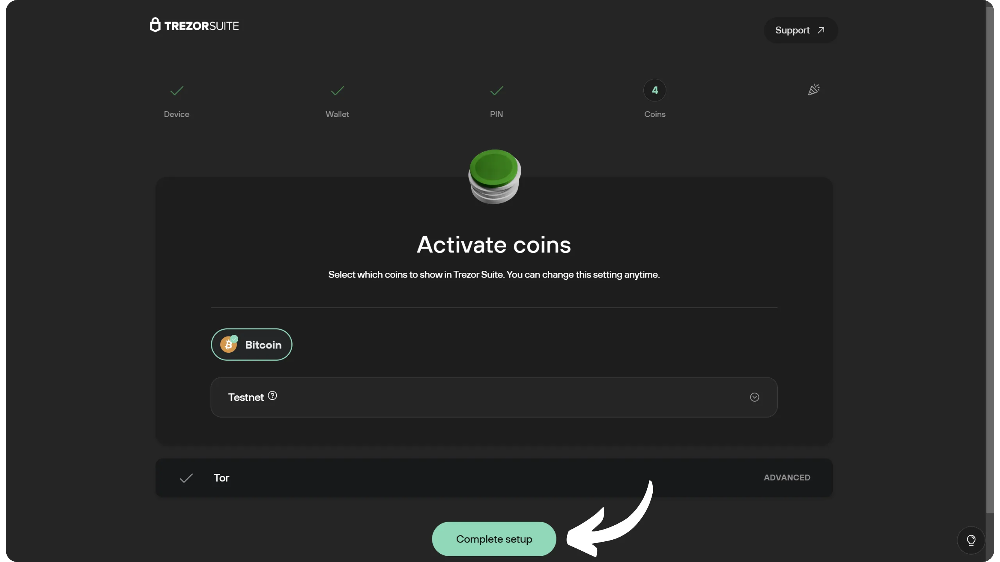

Safe 3 කේ සැකසීම දැන් සම්පූර්ණයි. ඔබට අවශ්‍ය නම්, ඔබේ Hardware Wallet හි නම සහ මුල් පිටුව වෙනස් කළ හැක.

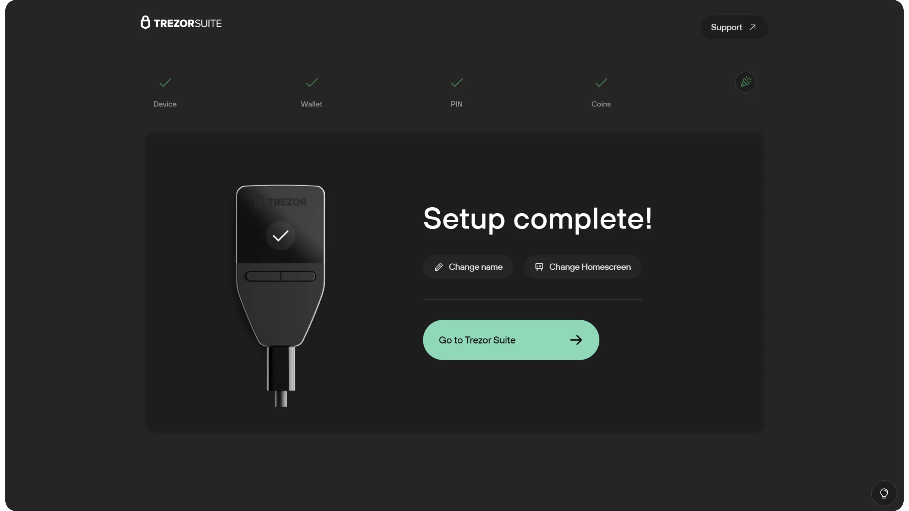

අපට Trezor Suite මෘදුකාංගය තවදුරටත් අවශ්‍ය නොවේ, ඔබේ Hardware Wallet මත නිතර firmware යාවත්කාලීන කිරීම් සිදු කිරීමට හෝ ප්‍රතිසාධන පරීක්ෂණයක් ක්‍රියාත්මක කිරීමට අවශ්‍ය නම් හැර. අපි දැන් Sparrow භාවිතා කරමින් පෝර්ට්ෆෝලියෝ කළමනාකරණය කිරීමට යනවා, මක්නිසාද මෙම මෘදුකාංගය Bitcoin පමණක් භාවිතය සඳහා සම්පූර්ණයෙන්ම සුදුසු වේ.

## Sparrow Wallet પર પોર્ટફોલિયો સેટ કરવો

ඔබ මෙතෙක් කර නොමැති නම්, Sparrow Wallet [නිල වෙබ් අඩවියෙන්](https://sparrowwallet.com/) ඔබේ පරිගණකයට බාගත කර ස්ථාපනය කිරීමෙන් ආරම්භ කරන්න.

Sparrow Wallet විවෘත කළ පසු, මෘදුකාංගය Bitcoin නියුඩ් එකට සම්බන්ධ වී ඇති බව, Interface හි පහළ දකුණු කෙළවරේ ඇති ටික් එකෙන් පෙන්වා ඇත. Sparrow සම්බන්ධ කිරීමට ගැටළු ඇති නම්, මම ඔබට මෙම උපදේශකයේ ආරම්භය කියවීමට නිර්දේශ කරමි:

https://planb.network/tutorials/wallet/desktop/sparrow-c674e2ac-d46f-4c82-92a7-7d1b0e262f5d

"*File*" ටැබය මත ක්ලික් කර, පසුව "*New Wallet*" මත ක්ලික් කරන්න.

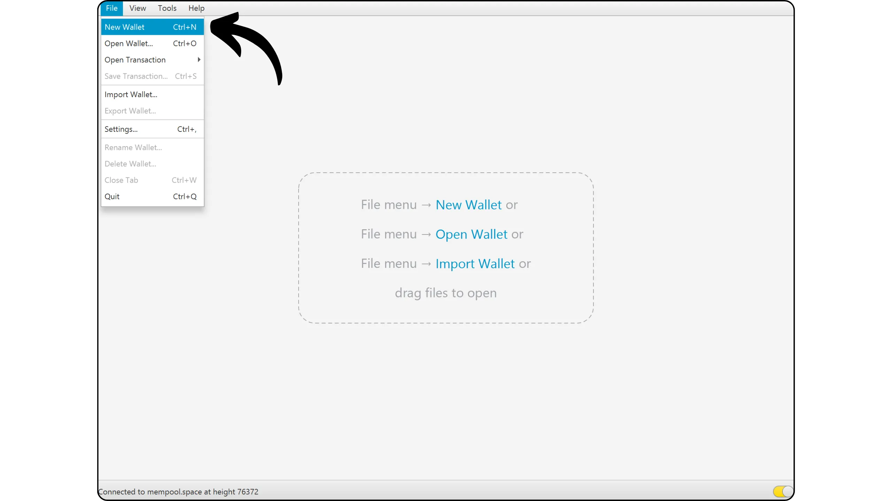

ඔබේ පෝර්ට්ෆෝලියෝවට නමක් දෙන්න, එවිට "*Wallet සෑදීම*" මත ක්ලික් කරන්න.

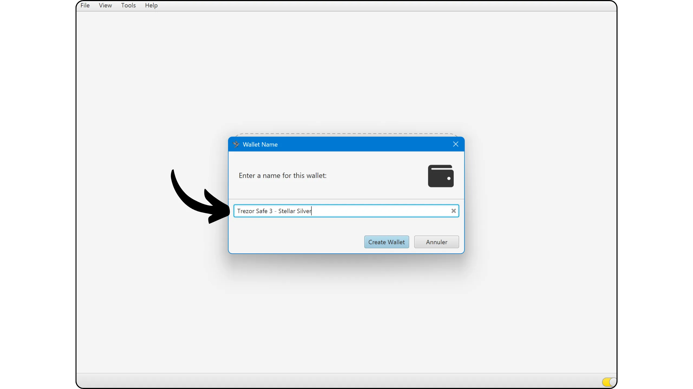

"*Script Type*" මෙනුවේ, ඔබේ බිට්කොයින් ආරක්ෂා කිරීමට භාවිතා කරන ලිපියේ වර්ගය තෝරන්න. මම "*Taproot*" හෝ එය නොමැති නම්, "*Native SegWit*" නිර්දේශ කරමි.

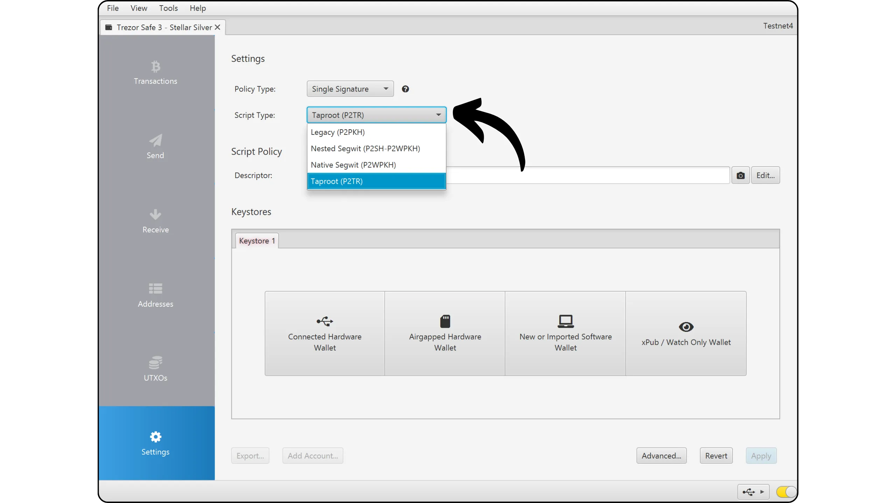

"*Connected Hardware Wallet*" බොත්තම මත ක්ලික් කරන්න. ඔබේ Safe 3, නියත වශයෙන්ම පරිගණකයට සම්බන්ධ වී අගුළු ඇරිය යුතුය.

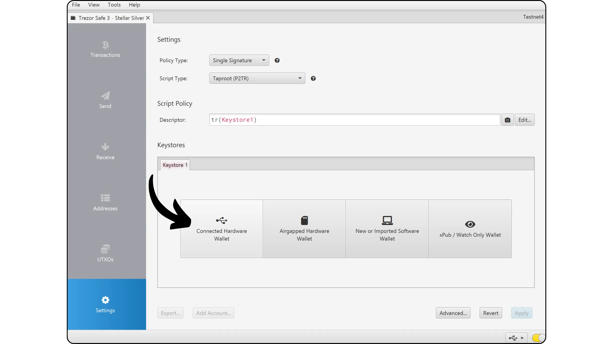

"*Scan*" බොත්තම මත ක්ලික් කරන්න. ඔබේ Safe 3 පෙනී යිය යුතුය. "*Import Keystore*" මත ක්ලික් කරන්න.

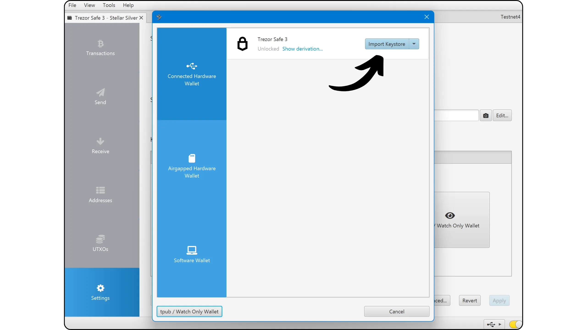

ඔබට දැන් ඔබේ Wallet විස්තර, ඔබේ පළමු ගිණුමේ දිගු සමාජ යතුර ඇතුළුව, දැක ගත හැක. Wallet නිර්මාණය අවසන් කිරීමට "*Apply*" බොත්තම ක්ලික් කරන්න.

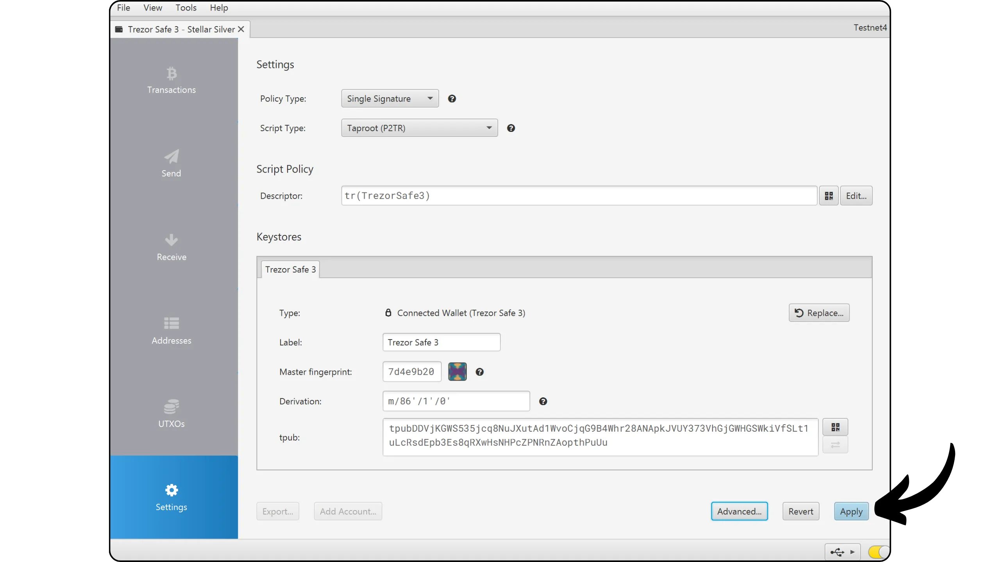

Izberite močno geslo za zaščito dostopa do Sparrow Wallet. To geslo bo zagotovilo varen dostop do vaših podatkov Sparrow Wallet, zaščitilo vaše javne ključe, naslove, oznake in zgodovino transakcij pred nepooblaščenim dostopom.

මම ඔබට උපදෙස් දෙන්නේ මෙම මුරපදය මුරපද කළමනාකරුකරුකරුකරුකරුකරුකරුකරුකරුකරුකරුකරුකරුකරුකරුකරුකරුකරුකරුකරුකරුකරුකරුකරුකරුකරුකරුකරුකරුකරුකරුකරුකරුකරුකරුකරුකරුකරුකරුකරුකරුකරුකරුකරුකරුකරුකරුකරුකරුකරුකරුකරුකරුකරුකරුකරුකරුකරුකරුකරුකරුකරුකරුකරුකරුකරුකරුකරුකරුකරුකරුකරුකරුකරුකරුකරුකරුකරුකරුකරුකරුකරුකරුකරුකරුකරුකරුකරුකරුකරුකරුකරුකරුකරුකරුකරුකරුකරුකරුකරුකරුකරුකරුකරුකරුකරුකරුකරුකරුකරුකරුකරුකරුකරුකරුකරුකරුකරුකරුකරුකරුකරුකරුකරුකරුකරුකරුකරුකරුකරුකරුකරුකරුකරුකරුකරුකරුකරුකරුකරුකරුකරුකරුකරුකරුකරුකරුකරුකරුකරුකරුකරුකරුකරුකරුකරුකරුකරුකරුකරුකරුකරුකරුකරුකරුකරුකරුකරුකරුකරුකරුකරුකරුකරුකරුකරුකරුකරුකරුකරුකරුකරුකරුකරුකරුකරුකරුකරුකරුකරුකරුකරුකරුකරුකරුකරුකරුකරුකරුකරුකරුකරුකරුකරුකරුකරුකරුකරුකරුකරුකරුකරුකරුකරුකරුකරුකරුකරුකරුකරුකරුකරුකරුකරුකරුකරුකරුකරුකරුකරුකරුකරුකරුකරුකරුකරුකරුකරුකරුකරුකරුකරුකරුකරුකරුකරුකරුකරුකරුකරුකරුකරුකරුකරුකරුකරුකරුකරුකරුකරුකරුකරුකරුකරුකරුකරුකරුකරුකරුකරුකරුකරුකරුකරුකරුකරුකරුකරුකරුකරුකරුකරුකරුකරුකරුකරුකරුකරුකරුකරුකරුකරුකරුකරුකරුකරුකරුකරුකරුකරුකරුකරුකරුකරුකරුකරුකරුකරුකරුකරුකරුකරුකරුකරුකරුකරුකරුකරුකරුකරුකරුකරුකරුකරුකරුකරුකරුකරුකරුකරුකරුකරුකරුකරුකරුකරුකරුකරුකරුකරුකරුකරුකරුකරුකරුකරුකරුකරුකරුකරුකරුකරුකරුකරුකරුකරුකරුකරුකරුකරුකරුකරුකරුකරුකරුකරුකරුකරුකරුකරුකරුකරුකරුකරුකරුකරුකරුකරුකරුකරුකරුකරුකරුකරුකරුකරුකරුකරුකරුකරුකරුකරුකරුකරුකරුකරුකරුකරුකරුකරුකරුකරුකරුකරුකරුකරුකරුකරුකරුකරුකරුකරුකරුකරුකරුකරුකරුකරුකරුකරුකරුකරුකරුකරුකරුකරුකරුකරුකරුකරුකරුකරුකරුකරුකරුකරුකරුකරුකරුකරුකරුකරුකරුකරුකරුකරුකරුකරුකරුකරුකරුකරුකරුකරුකරුකරුකරුකරුකරුකරුකරුකරුකරුකරුකරුකරුකරුකරුකරුකරුකරුකරුකරුකරුකරුකරුකරුකරුකරුකරුකරුකරුකරුකරුකරුකරුකරුකරුකරුකරුකරුකරුකරුකරුකරුකරුකරුකරුකරුකරුකරුකරුකරුකරුකරුකරුකරුකරුකරුකරුකරුකරුකරුකරුකරුකරුකරුකරුකරුකරුකරුකරුකරුකරුකරුකරුකරුකරුකරුකරුකරුකරුකරුකරුකරුකරුකරුකරුකරුකරුකරුකරුකරුකරුකරුකරුකරුකරුකරුකරුකරුකරුකරුකරුකරුකරුකරුකරුකරුකරුකරුකරුකරුකරුකරුකරුකරුකරුකරුකරුකරුකරුකරුකරුකරුකරුකරුකරුකරුකරුකරුකරුකරුකරුකරුකරුකරුකරුකරුකරුකරුකරුකරුකරුකරුකරුකරුකරුකරුකරුකරුකරුකරුකරුකරුකරුකරුකරුකරුකරුකරුකරුකරුකරුකරුකරුකරුකරුකරුකරුකරුකරුකරුකරුකරුකරුකරුකරුකරුකරුකරුකරුකරුකරුකරුකරුකරුකරුකරුකරුකරුකරුකරුකරුකරුකරුකරුකරුකරුකරුකරුකරුකරුකරුකරුකරුකරුකරුකරුකරුකරුකරුකරුකරුකරුකරුකරුකරුකරුකරුකරුකරුකරුකරුකරුකරුකරුකරුකරුකරුකරුකරුකරුකරුකරුකරුකරුකරුකරුකරුකරුකරුකරුකරුකරුකරුකරුකරුකරුකරුකරුකරුකරුකරුකරුකරුකරුකරුකරුකරුකරුකරුකරුකරුකරුකරුකරුකරුකරුකරුකරුකරුකරුකරුකරුකරුකරුකරුකරුකරුකරුකරුකරුකරුකරුකරුකරුකරුකරුකරුකරුකරුකරුකරුකරුකරුකරුකරුකරුකරුකරුකරුකරුකරුකරුකරුකරුකරුකරුකරුකරුකරුකරුකරුකරුකරුකරුකරුකරුකරුකරුකරුකරුකරුකරුකරුකරුකරුකරුකරුකරුකරුකරුකරුකරුකරුකරුකරුකරුකරුකරුකරුකරුකරුකරුකරුකරුකරුකරුකරුකරුකරුකරුකරුකරුකරුකරුකරුකරුකරුකරුකරුකරුකරුකරුකරුකරුකරුකරුකරුකරුකරුකරුකරුකරුකරුකරුකරුකරුකරුකරුකරුකරුකරුකරුකරුකරුකරුකරුකරුකරුකරුකරුකරුකරුකරුකරුකරුකරුකරුකරුකරුකරුකරුකරුකරුකරුකරුකරුකරුකරුකරුකරුකරුකරුකරුකරුකරුකරුකරුකරුකරුකරුකරුකරුකරුකරුකරුකරුකරුකරුකරුකරුකරුකරුකරුකරුකරුකරුකරුකරුකරුකරුකරුකරුකරුකරුකරුකරුකරුකරුකරුකරුකරුකරුකරුකරුකරුකරුකරුකරුකරුකරුකරුකරුකරුකරුකරුකරුකරුකරුකරුකරුකරුකරුකරුකරුකරුකරුකරුකරුකරුකරුකරුකරුකරුකරුකරුකරුකරුකරුකරුකරුකරුකරුකරුකරුකරුකරුකරුකරුකරුකරුකරුකරුකරුකරුකරුකරුකරුකරුකරුකරුකරුකරුකරුකරුකරුකරුකරුකරුකරුකරුකරුකරුකරුකරුකරුකරුකරුකරුකරුකරුකරුකරුකරුකරුකරුකරුකරුකරුකරුකරුකරුකරුකරුකරුකරුකරුකරුකරුකරුකරුකරුකරුකරුකරුකරුකරුකරුකරුකරුකරුකරුකරුකරුකරුකරුකරුකරුකරුකරුකරුකරුකරුකරුකරුකරුකරුකරුකරුකරුකරුකරුකරුකරුකරුකරුකරුකරුකරුකරුකරුකරුකරුකරුකරුකරුකරුකරුකරුකරුකරුකරුකරුකරුකරුකරුකරුකරුකරුකරුකරුකරුකරුකරුකරුකරුකරුකරුකරුකරුකරුකරුකරුකරුකරුකරුකරුකරුකරුකරුකරුකරුකරුකරුකරුකරුකරුකරුකරුකරුකරුකරුකරුකරුකරුකරුකරුකරුකරුකරුකරුකරුකරුකරුකරුකරුකරුකරුකරුකරුකරුකරුකරුකරුකරුකරුකරුකරුකරුකරුකරුකරුකරුකරුකරුකරුකරුකරුකරුකරුකරුකරුකරුකරුකරුකරුකරුකරුකරුකරුකරුකරුකරුකරුකරුකරුකරුකරුකරුකරුකරුකරුකරුකරුකරුකරුකරුකරුකරුකරුකරුකරුකරුකරුකරුකරුකරුකරුකරුකරුකරුකරුකරුකරුකරුකරුකරුකරුකරුකරුකරුකරුකරුකරුකරුකරුකරුකරුකරුකරුකරුකරුකරුකරුකරුකරුකරුකරුකරුකරුකරුකරුකරුකරුකරුකරුකරුකරුකරුකරුකරුකරුකරුකරුකරුකරුකරුකරුකරුකරුකරුකරුකරුකරුකරුකරුකරුකරුකරුකරුකරුකරුකරුකරුකරුකරුකරුකරුකරුකරුකරුකරුකරුකරුකරුකරුකරුකරුකරුකරුකරුකරුකරුකරුකරුකරුකරුකරුකරුකරුකරුකරුකරුකරුකරුකරුකරුකරුකරුකරුකරුකරුකරුකරුකරුකරුකරුකරුකරුකරුකරුකරුකරුකරුකරුකරුකරුකරුකරුකරුකරුකරුකරුකරුකරුකරුකරුකරුකරුකරුකරුකරුකරුකරුකරුකරුකරුකරුකරුකරුකරුකරුකරුකරුකරුකරුකරුකරුකරුකරුකරුකරුකරුකරුකරුකරුකරුකරුකරුකරුකරුකරුකරුකරුකරුකරුකරුකරුකරුකරුකරුකරුකරුකරුකරුකරුකරුකරුකරුකරුකරුකරුකරුකරුකරුකරුකරුකරුකරුකරුකරුකරුකරුකරුකරුකරුකරුකරුකරුකරුකරුකරුකරුකරුකරුකරුකරුකරුකරුකරුකරුකරුකරුකරුකරුකරුකරුකරුකරුකරුකරුකරුකරුකරුකරුකරුකරුකරුකරුකරුකරුකරුකරුකරුකරුකරුකරුකරුකරුකරුකරුකරුකරුකරුකරුකරුකරුකරුකරුකරුකරුකරුකරුකරුකරුකරුකරුකරුකරුකරුකරුකරුකරුකරුකරුකරුකරුකරුකරුකරුකරුකරුකරුකරුකරුකරුකරුකරුකරුකරුකරුකරුකරුකරුකරුකරුකරුකරුකරුකරුකරුකරුකරුකරුකරුකරුකරුකරුකරුකරුකරුකරුකරුකරුකරුකරුකරුකරුකරුකරුකරුකරුකරුකරුකරුකරුකරුකරුකරුකරුකරුකරුකරුකරුකරුකරුකරුකරුකරුකරුකරුකරුකරුකරුකරුකරුකරුකරුකරුකරුකරුකරුකරුකරුකරුකරුකරුකරුකරුකරුකරුකරුකරුකරුකරුකරුකරුකරුකරුකරුකරුකරුකරුකරුකරුකරුකරුකරුකරුකරුකරුකරුකරුකරුකරුකරුකරුකරුකරුකරුකරුකරුකරුකරුකරුකරුකරුකරුකරුකරුකරුකරුකරුකරුකරුකරුකරුකරුකරුකරුකරුකරුකරුකරුකරුකරුකරුකරුකරුකරුකරුකරුකරුකරුකරුකරුකරුකරුකරුකරුකරුකරුකරුකරුකරුකරුකරුකරුකරුකරුකරුකරුකරුකරුකරුකරුකරුකරුකරුකරුකරුකරුකරුකරුකරුකරුකරුකරුකරුකරුකරුකරුකරුකරුකරුකරුකරුකරුකරුකරුකරුකරුකරුකරුකරුකරුකරුකරුකරුකරුකරුකරුකරුකරුකරුකරුකරුකරුකරුකරුකරුකරුකරුකරුකරුකරුකරුකරුකරුකරුකරුකරුකරුකරුකරුකරුකරුකරුකරුකරුකරුකරුකරුකරුකරුකරුකරුකරුකරුකරුකරුකරුකරුකරුකරුකරුකරුකරුකරුකරුකරුකරුකරුකරුකරුකරුකරුකරුකරුකරුකරුකරුකරුකරුකරුකරුකරුකරුකරුකරුකරුකරුකරුකරුකරුකරුකරුකරුකරුකරුකරුකරුකරුකරුකරුකරුකරුකරුකරුකරුකරුකරුකරුකරුකරුකරුකරුකරුකරුකරුකරුකරුකරුකරුකරුකරුකරුකරුකරුකරුකරුකරුකරුකරුකරුකරුකරුකරුකරුකරුකරුකරුකරුකරුකරුකරුකරුකරුකරුකරුකරුකරුකරුකරුකරුකරුකරුකරුකරුකරුකරුකරුකරුකරුකරුකරුකරුකරුකරුකරුකරුකරුකරුකරුකරුකරුකරුකරුකරුකරුකරුකරුකරුකරුකරුකරුකරුකරුකරුකරුකරුකරුකරුකරුකරුකරුකරුකරුකරුකරුකරුකරුකරුකරුකරුකරුකරුකරුකරුකරුකරුකරුකරුකරුකරුකරුකරුකරුකරුකරුකරුකරුකරුකරුකරුකරුකරුකරුකරුකරුකරුකරුකරුකරුකරුකරුකරුකරුකරුකරුකරුකරුකරුකරුකරුකරුකරුකරුකරුකරුකරුකරුකරුකරුකරුකරුකරුකරුකරුකරුකරුකරුකරුකරුකරුකරුකරුකරුකරුකරුකරුකරුකරුකරුකරුකරුකරුකරුකරුකරුකරුකරුකරුකරුකරුකරුකරුකරුකරුකරුකරුකරුකරුකරුකරුකරුකරුකරුකරුකරුකරුකරුකරුකරුකරුකරුකරුකරුකරුකරුකරුකරුකරුකරුකරුකරුකරුකරුකරුකරුකරුකරුකරුකරුකරුකරුකරුකරුකරුකරුකරුකරුකරුකරුකරුකරුකරුකරුකරුකරුකරුකරුකරුකරුකරුකරුකරුකරුකරුකරුකරුකරුකරුකරුකරුකරුකරුකරුකරුකරුකරුකරුකරුකරුකරුකරුකරුකරුකරුකරුකරුකරුකරුකරුකරුකරුකරුකරුකරුකරුකරුකරුකරුකරුකරුකරුකරුකරුකරුකරුකරුකරුකරුකරුකරුකරුකරුකරුකරුකරුකරුකරුකරුකරුකරුකරුකරුකරුකරුකරුකරුකරුකරුකරුකරුකරුකරුකරුකරුකරුකරුකරුකරුකරුකරුකරුකරුකරුකරුකරුකරුකරුකරුකරුකරුකරුකරුකරුකරුකරුකරුකරුකරුකරුකරුකරුකරුකරුකරුකරුකරුකරුකරුකරුකරුකරුකරුකරුකරුකරුකරුකරුකරුකරුකරුකරුකරුකරුකරුකරුකරුකරුකරුකරුකරුකරුකරුකරුකරුකරුකරුකරුකරුකරුකරුකරුකරුකරුකරුකරුකරුකරුකරුකරුකරුකරුකරුකරුකරුකරුකරුකරුකරුකරුකරුකරුකරුකරුකරුකරුකරුකරුකරුකරුකරුකරුකරුකරුකරුකරුකරුකරුකරුකරුකරුකරුකරුකරුකරුකරුකරුකරුකරුකරුකරුකරුකරුකරුකරුකරුකරුකරුකරුකරුකරුකරුකරුකරුකරුකරුකරුකරුකරුකරුකරුකරුකරුකරුකරුකරුකරුකරුකරුකරුකරුකරුකරුකරුකරුකරුකරුකරුකරුකරුකරුකරුකරුකරුකරුකරුකරුකරුකරුකරුකරුකරුකරුකරුකරුකරුකරුකරුකරුකරුකරුකරුකරුකරුකරුකරුකරුකරුකරුකරුකරුකරුකරුකරුකරුකරුකරුකරුකරුකරුකරුකරුකරුකරුකරුකරුකරුකරුකරුකරුකරුකරුකරුකරුකරුකරුකරුකරුකරුකරුකරුකරුකරුකරුකරුකරුකරුකරුකරුකරුකරුකරුකරුකරුකරුකරුකරුකරුකරුකරුකරුකරුකරුකරුකරුකරුකරුකරුකරුකරුකරුකරුකරුකරුකරුකරුකරුකරුකරුකරුකරුකරුකරුකරුකරුකරුකරුකරුකරුකරුකරුකරුකරුකරුකරුකරුකරුකරුකරුකරුකරුකරුකරුකරුකරුකරුකරුකරුකරුකරුකරුකරුකරුකරුකරුකරුකරුකරුකරුකරුකරුකරුකරුකරුකරුකරුකරුකරුකරුකරුකරුකරුකරුකරුකරුකරුකරුකරුකරුකරුකරුකරුකරුකරුකරුකරුකරුකරුකරුකරුකරුකරුකරුකරුකරුකරුකරුකරුකරුකරුකරුකරුකරුකරුකරුකරුකරුකරුකරුකරුකරුකරුකරුකරුකරුකරුකරුකරුකරුකරුකරුකරුකරුකරුකරුකරුකරුකරුකරුකරුකරුකරුකරුකරුකරුකරුකරුකරුකරුකරුකරුකරුකරුකරුකරුකරුකරුකරුකරුකරුකරුකරුකරුකරුකරුකරුකරුකරුකරුකරුකරුකරුකරුකරුකරුකරුකරුකරුකරුකරුකරුකරුකරුකරුකරුකරුකරුකරුකරුකරුකරුකරුකරුකරුකරුකරුකරුකරුකරුකරුකරුකරුකරුකරුකරුකරුකරුකරුකරුකරුකරුකරුකරුකරුකරුකරුකරුකරුකරුකරුකරුකරුකරුකරුකරුකරුකරුකරුකරුකරුකරුකරුකරුකරුකරුකරුකරුකරුකරුකරුකරුකරුකරුකරුකරුකරුකරුකරුකරුකරුකරුකරුකරුකරුකරුකරුකරුකරුකරුකරුකරුකරුකරුකරුකරුකරුකරුකරුකරුකරුකරුකරුකරුකරුකරුකරුකරුකරුකරුකරුකරුකරුකරුකරුකරුකරුකරුකරුකරුකරුකරුකරුකරුකරුකරුකරුකරුකරුකරුකරුකරුකරුකරුකරුකරුකරුකරුකරුකරුකරුකරුකරුකරුකරුකරුකරුකරුකරුකරුකරුකරුකරුකරුකරුකරුකරුකරුකරුකරුකරුකරුකරුකරුකරුකරුකරුකරුකරුකරුකරුකරුකරුකරුකරුකරුකරුකරුකරුකරුකරුකරුකරුකරුකරුකරුකරුකරුකරුකරුකරුකරුකරුකරුකරුකරුකරුකරුකරුකරුකරුකරුකරුකරුකරුකරුකරුකරුකරුකරුකරුකරුකරුකරුකරුකරුකරුකරුකරුකරුකරුකරුකරුකරුකරුකරුකරුකරුකරුකරුකරුකරුකරුකරුකරුකරුකරුකරුකරුකරුකරුකරුකරුකරුකරුකරුකරුකරුකරුකරුකරුකරුකරුකරුකරුකරුකරුකරුකරුකරුකරුකරුකරුකරුකරුකරුකරුකරුකරුකරුකරුකරුකරුකරුකරුකරුකරුකරුකරුකරුකරුකරුකරුකරුකරුකරුකරුකරුකරුකරුකරුකරුකරුකරුකරුකරුකරුකරුකරුකරුකරුකරුකරුකරුකරුකරුකරුකරුකරුකරුකරුකරුකරුකරුකරුකරුකරුකරුකරුකරුකරුකරුකරුකරුකරුකරුකරුකරුකරුකරුකරුකරුකරුකරුකරුකරුකරුකරුකරුකරුකරුකරුකරුකරුකරුකරුකරුකරුකරුකරුකරුකරුකරුකරුකරුකරුකරුකරුකරුකරුකරුකරුකරුකරුකරුකරුකරුකරුකරුකරුකරුකරුකරුකරුකරුකරුකරුකරුකරුකරුකරුකරුකරුකරුකරුකරුකරුකරුකරුකරුකරුකරුකරුකරුකරුකරුකරුකරුකරුකරුකරුකරුකරුකරුකරුකරුකරුකරුකරුකරුකරුකරුකරුකරුකරුකරුකරුකරුකරුකරුකරුකරුකරුකරුකරුකරුකරුකරුකරුකරුකරුකරුකරුකරුකරුකරුකරුකරුකරුකරුකරුකරුකරුකරුකරුකරුකරුකරුකරුකරුකරුකරුකරුකරුකරුකරුකරුකරුකරුකරුකරුකරුකරුකරුකරුකරුකරුකරුකරුකරුකරුකරුකරුකරුකරුකරුකරුකරුකරුකරුකරුකරුකරුකරුකරුකරුකරුකරුකරුකරුකරුකරුකරුකරුකරුකරුකරුකරුකරුකරුකරුකරුකරුකරුකරුකරුකරුකරුකරුකරුකරුකරුකරුකරුකරුකරුකරුකරුකරුකරුකරුකරුකරුකරුකරුකරුකරුකරුකරුකරුකරුකරුකරුකරුකරුකරුකරුකරුකරුකරුකරුකරුකරුකරුකරුකරුකරුකරුකරුකරුකරුකරුකරුකරුකරුකරුකරුකරුකරුකරුකරුකරුකරුකරුකරුකරුකරුකරුකරුකරුකරුකරුකරුකරුකරුකරුකරුකරුකරුකරුකරුකරුකරුකරුකරුකරුකරුකරුකරුකරුකරුකරුකරුකරුකරුකරුකරුකරුකරුකරුකරුකරුකරුකරුකරුකරුකරුකරුකරුකරුකරුකරුකරුකරුකරුකරුකරුකරුකරුකරුකරුකරුකරුකරුකරුකරුකරුකරුකරුකරුකරුකරුකරුකරුකරුකරුකරුකරුකරුකරුකරුකරුකරුකරුකරුකරුකරුකරුකරුකරුකරුකරුකරුකරුකරුකරුකරුකරුකරුකරුකරුකරුකරුකරුකරුකරුකරුකරුකරුකරුකරුකරුකරුකරුකරුකරුකරුකරුකරුකරුකරුකරුකරුකරුකරුකරුකරුකරුකරුකරුකරුකරුකරුකරුකරුකරුකරුකරුකරුකරුකරුකරුකරුකරුකරුකරුකරුකරුකරුකරුකරුකරුකරුකරුකරුකරුකරුකරුකරුකරුකරුකරුකරුකරුකරුකරුකරුකරුකරුකරුකරුකරුකරුකරුකරුකරුකරුකරුකරුකරුකරුකරුකරුකරුකරුකරුකරුකරුකරුකරුකරුකරුකරුකරුකරුකරුකරුකරුකරුකරුකරුකරුකරුකරුකරුකරුකරුකරුකරුකරුකරුකරුකරුකරුකරුකරුකරුකරුකරුකරුකරුකරුකරුකරුකරුකරුකරුකරුකරුකරුකරුකරුකරුකරුකරුකරුකරුකරුකරුකරුකරුකරුකරුකරුකරුකරුකරුකරුකරුකරුකරුකරුකරුකරුකරුකරුකරුකරුකරුකරුකරුකරුකරුකරුකරුකරුකරුකරුකරුකරුකරුකරුකරුකරුකරුකරුකරුකරුකරුකරුකරුකරුකරුකරුකරුකරුකරුකරුකරුකරුකරුකරුකරුකරුකරුකරුකරුකරුකරුකරුකරුකරුකරුකරුකරුකරුකරුකරුකරුකරුකරුකරුකරුකරුකරුකරුකරුකරුකරුකරුකරුකරුකරුකරුකරුකරුකරුකරුකරුකරුකරුකරුකරුකරුකරුකරුකරුකරුකරුකරුකරුකරුකරුකරුකරුකරුකරුකරුකරුකරුකරුකරුකරුකරුකරුකරුකරුකරුකරුකරුකරුකරුකරුකරුකරුකරුකරුකරුකරුකරුකරුකරුකරුකරුකරුකරුකරුකරුකරුකරුකරුකරුකරුකරුකරුකරුකරුකරුකරුකරුකරුකරුකරුකරුකරුකරුකරුකරුකරුකරුකරුකරුකරුකරුකරුකරුකරුකරුකරුකරුකරුකරුකරුකරුකරුකරුකරුකරුකරුකරුකරුකරුකරුකරුකරුකරුකරුකරුකරුකරුකරුකරුකරුකරුකරුකරුකරුකරුකරුකරුකරුකරුකරුකරුකරුකරුකරුකරුකරුකරුකරුකරුකරුකරුකරුකරුකරුකරුකරුකරුකරුකරුකරුකරුකරුකරුකරුකරුකරුකරුකරුකරුකරුකරුකරුකරුකරුකරුකරුකරුකරුකරුකරුකරුකරුකරුකරුකරුකරුකරුකරුකරුකරුකරුකරුකරුකරුකරුකරුකරුකරුකරුකරුකරුකරුකරුකරුකරුකරුකරුකරුකරුකරුකරුකරුකරුකරුකරුකරුකරුකරුකරුකරුකරුකරුකරුකරුකරුකරුකරුකරුකරුකරුකරුකරුකරුකරුකරුකරුකරුකරුකරුකරුකරුකරුකරුකරුකරුකරුකරුකරුකරුකරුකරුකරුකරුකරුකරුකරුකරුකරුකරුකරුකරුකරුකරුකරුකරුකරුකරුකරුකරුකරුකරුකරුකරුකරුකරුකරුකරුකරුකරුකරුකරුකරුකරුකරුකරුකරුකරුකරුකරුකරුකරුකරුකරුකරුකරුකරුකරුකරුකරුකරුකරුකරුකරුකරුකරුකරුකරුකරුකරුකරුකරුකරුකරුකරුකරුකරුකරුකරුකරුකරුකරුකරුකරුකරුකරුකරුකරුකරුකරුකරුකරුකරුකරුකරුකරුකරුකරුකරුකරුකරුකරුකරුකරුකරුකරුකරුකරුකරුකරුකරුකරුකරුකරුකරුකරුකරුකරුකරුකරුකරුකරුකරුකරුකරුකරුකරුකරුකරුකරුකරුකරුකරුකරුකරුකරුකරුකරුකරුකරුකරුකරුකරුකරුකරුකරුකරුකරුකරුකරුකරුකරුකරුකරුකරුකරුකරුකරුකරුකරුකරුකරුකරුකරුකරුකරුකරුකරුකරුකරුකරුකරුකරුකරුකරුකරුකරුකරුකරුකරුකරුකරුකරුකරුකරුකරුකරුකරුකරුකරුකරුකරුකරුකරුකරුකරුකරුකරුකරුකරුකරුකරුකරුකරුකරුකරුකරුකරුකරුකරුකරුකරුකරුකරුකරුකරුකරුකරුකරුකරුකරුකරුකරුකරුකරුකරුකරුකරුකරුකරුකරුකරුකරුකරුකරුකරුකරුකරුකරුකරුකරුකරුකරුකරුකරුකරුකරුකරුකරුකරුකරුකරුකරුකරුකරුකරුකරුකරුකරුකරුකරුකරුකරුකරුකරුකරුකරුකරුකරුකරුකරුකරුකරුකරුකරුකරුකරුකරුකරුකරුකරුකරුකරුකරුකරුකරුකරුකරුකරුකරුකරුකරුකරුකරුකරුකරුකරුකරුකරුකරුකරුකරුකරුකරුකරුකරුකරුකරුකරුකරුකරුකරුකරුකරුකරුකරුකරුකරුකරුකරුකරුකරුකරුකරුකරුකරුකරුකරුකරුකරුකරුකරුකරුකරුකරුකරුකරුකරුකරුකරුකරුකරුකරුකරුකරුකරුකරුකරුකරුකරුකරුකරුකරුකරුකරුකරුකරුකරුකරුකරුකරුකරුකරුකරුකරුකරුකරුකරුකරුකරුකරුකරුකරුකරුකරුකරුකරුකරුකරුකරුකරුකරුකරුකරුකරුකරුකරුකරුකරුකරුකරුකරුකරුකරුකරුකරුකරුකරුකරුකරුකරුකරුකරුකරුකරුකරුකරුකරුකරුකරුකරුකරුකරුකරුකරුකරුකරුකරුකරුකරුකරුකරුකරුකරුකරුකරුකරුකරුකරුකරුකරුකරුකරුකරුකරුකරුකරුකරුකරුකරුකරුකරුකරුකරුකරුකරුකරුකරුකරුකරුකරුකරුකරුකරුකරුකරුකරුකරුකරුකරුකරුකරුකරුකරුකරුකරුකරුකරුකරුකරුකරුකරුකරුකරුකරුකරුකරුකරුකරුකරුකරුකරුකරුකරුකරුකරුකරුකරුකරුකරුකරුකරුකරුකරුකරුකරුකරුකරුකරුකරුකරුකරුකරුකරුකරුකරුකරුකරුකරුකරුකරුකරුකරුකරුකරුකරුකරුකරුකරුකරුකරුකරුකරුකරුකරුකරුකරුකරුකරුකරුකරුකරුකරුකරුකරුකරුකරුකරුකරුකරුකරුකරුකරුකරුකරුකරුකරුකරුකරුකරුකරුකරුකරුකරුකරුකරුකරුකරුකරුකරුකරුකරුකරුකරුකරුකරුකරුකරුකරුකරුකරුකරුකරුකරුකරුකරුකරුකරුකරුකරුකරුකරුකරුකරුකරුකරුකරුකරුකරුකරුකරුකරුකරුකරුකරුකරුකරුකරුකරුකරුකරුකරුකරුකරුකරුකරුකරුකරුකරුකරුකරුකරුකරුකරුකරුකරුකරුකරුකරුකරුකරුකරුකරුකරුකරුකරුකරුකරුකරුකරුකරුකරුකරුකරුකරුකරුකරුකරුකරුකරුකරුකරුකරුකරුකරුකරුකරුකරුකරුකරුකරුකරුකරුකරුකරුකරුකරුකරුකරුකරුකරුකරුකරුකරුකරුකරුකරුකරුකරුකරුකරුකරුකරුකරුකරුකරුකරුකරුකරුකරුකරුකරුකරුකරුකරුකරුකරුකරුකරුකරුකරුකරුකරුකරුකරුකරුකරුකරුකරුකරුකරුකරුකරුකරුකරුකරුකරුකරුකරුකරුකරුකරුකරුකරුකරුකරුකරුකරුකරුකරුකරුකරුකරුකරුකරුකරුකරුකරුකරුකරුකරුකරුකරුකරුකරුකරුකරුකරුකරුකරුකරුකරුකරුකරුකරුකරුකරුකරුකරුකරුකරුකරුකරුකරුකරුකරුකරුකරුකරුකරුකරුකරුකරුකරුකරුකරුකරුකරුකරුකරුකරුකරුකරුකරුකරුකරුකරුකරුකරුකරුකරුකරුකරුකරුකරුකරුකරුකරුකරුකරුකරුකරුකරුකරුකරුකරුකරුකරුකරුකරුකරුකරුකරුකරුකරුකරුකරුකරුකරුකරුකරුකරුකරුකරුකරුකරුකරුකරුකරුකරුකරුකරුකරුකරුකරුකරුකරුකරුකරුකරුකරුකරුකරුකරුකරුකරුකරුකරුකරුකරුකරුකරුකරුකරුකරුකරුකරුකරුකරුකරුකරුකරුකරුකරුකරුකරුකරුකරුකරුකරුකරුකරුකරුකරුකරුකරුකරුකරුකරුකරුකරුකරුකරුකරුකරුකරුකරුකරුකරුකරුකරුකරුකරුකරුකරුකරුකරුකරුකරුකරුකරුකරුකරුකරුකරුකරුකරුකරුකරුකරුකරුකරුකරුකරුකරුකරුකරුකරුකරුකරුකරුකරුකරුකරුකරුකරුකරුකරුකරුකරුකරුකරුකරුකරුකරුකරුකරුකරුකරුකරුකරුකරුකරුකරුකරුකරුකරුකරුකරුකරුකරුකරුකරුකරුකරුකරුකරුකරුකරුකරුකරුකරුකරුකරුකරුකරුකරුකරුකරුකරුකරුකරුකරුකරුකරුකරුකරුකරුකරුකරුකරුකරුකරුකරුකරුකරුකරුකරුකරුකරුකරුකරුකරුකරුකරුකරුකරුකරුකරුකරුකරුකරුකරුකරුකරුකරුකරුකරුකරුකරුකරුකරුකරුකරුකරුකරුකරුකරුකරුකරුකරුකරුකරුකරුකරුකරුකරුකරුකරුකරුකරුකරුකරුකරුකරුකරුකරුකරුකරුකරුකරුකරුකරුකරුකරුකරුකරුකරුකරුකරුකරුකරුකරුකරුකරුකරුකරුකරුකරුකරුකරුකරුකරුකරුකරුකරුකරුකරුකරුකරුකරුකරුකරුකරුකරුකරුකරුකරුකරුකරුකරුකරුකරුකරුකරුකරුකරුකරුකරුකරුකරුකරුකරුකරුකරුකරුකරුකරුකරුකරුකරුකරුකරුකරුකරුකරුකරුකරුකරුකරුකරුකරුකරුකරුකරුකරුකරුකරුකරුකරුකරුකරුකරුකරුකරුකරුකරුකරුකරුකරුකරුකරුකරුකරුකරුකරුකරුකරුකරුකරුකරුකරුකරුකරුකරුකරුකරුකරුකරුකරුකරුකරුකරුකරුකරුකරුකරුකරුකරුකරුකරුකරුකරුකරුකරුකරුකරුකරුකරුකරුකරුකරුකරුකරුකරුකරුකරුකරුකරුකරුකරුකරුකරුකරුකරුකරුකරුකරුකරුකරුකරුකරුකරුකරුකරුකරුකරුකරුකරුකරුකරුකරුකරුකරුකරුකරුකරුකරුකරුකරුකරුකරුකරුකරුකරුකරුකරුකරුකරුකරුකරුකරුකරුකරුකරුකරුකරුකරුකරුකරුකරුකරුකරුකරුකරුකරුකරුකරුකරුකරුකරුකරුකරුකරුකරුකරුකරුකරුකරුකරුකරුකරුකරුකරුකරුකරුකරුකරුකරුකරුකරුකරුකරුකරුකරුකරුකරුකරුකරුකරුකරුකරුකරුකරුකරුකරුකරුකරුකරුකරුකරුකරුකරුකරුකරුකරුකරුකරුකරුකරුකරුකරුකරුකරුකරුකරුකරුකරුකරුකරුකරුකරුකරුකරුකරුකරුකරුකරුකරුකරුකරුකරුකරුකරුකරුකරුකරුකරුකරුකරුකරුකරුකරුකරුකරුකරුකරුකරුකරුකරුකරුකරුකරුකරුකරුකරුකරුකරුකරුකරුකරුකරුකරුකරුකරුකරුකරුකරුකරුකරුකරුකරුකරුකරුකරුකරුකරුකරුකරුකරුකරුකරුකරුකරුකරුකරුකරුකරුකරුකරුකරුකරුකරුකරුකරුකරුකරුකරුකරුකරුකරුකරුකරුකරුකරුකරුකරුකරුකරුකරුකරුකරුකරුකරුකරුකරුකරුකරුකරුකරුකරුකරුකරුකරුකරුකරුකරුකරුකරුකරුකරුකරුකරුකරුකරුකරුකරුකරුකරුකරුකරුකරුකරුකරුකරුකරුකරුකරුකරුකරුකරුකරුකරුකරුකරුකරුකරුකරුකරුකරුකරුකරුකරුකරුකරුකරුකරුකරුකරුකරුකරුකරුකරුකරුකරුකරුකරුකරුකරුකරුකරුකරුකරුකරුකරුකරුකරුකරුකරුකරුකරුකරුකරුකරුකරුකරුකරුකරුකරුකරුකරුකරුකරුකරුකරුකරුකරුකරුකරුකරුකරුකරුකරුකරුකරුකරුකරුකරුකරුකරුකරුකරුකරුකරුකරුකරුකරුකරුකරුකරුකරුකරුකරුකරුකරුකරුකරුකරුකරුකරුකරුකරුකරුකරුකරුකරුකරුකරුකරුකරුකරුකරුකරුකරුකරුකරුකරුකරුකරුකරුකරුකරුකරුකරුකරුකරුකරුකරුකරුකරුකරුකරුකරුකරුකරුකරුකරුකරුකරුකරුකරුකරුකරුකරුකරුකරුකරුකරුකරුකරුකරුකරුකරුකරුකරුකරුකරුකරුකරුකරුකරුකරුකරුකරුකරුකරුකරුකරුකරුකරුකරුකරුකරුකරුකරුකරුකරුකරුකරුකරුකරුකරුකරුකරුකරුකරුකරුකරුකරුකරුකරුකරුකරුකරුකරුකරුකරුකරුකරුකරුකරුකරුකරුකරුකරුකරුකරුකරුකරුකරුකරුකරුකරුකරුකරුකරුකරුකරුකරුකරුකරුකරුකරුකරුකරුකරුකරුකරුකරුකරුකරුකරුකරුකරුකරුකරුකරුකරුකරුකරුකරුකරුකරුකරුකරුකරුකරුකරුකරුකරුකරුකරුකරුකරුකරුකරුකරුකරුකරුකරුකරුකරුකරුකරුකරුකරුකරුකරුකරුකරුකරුකරුකරුකරුකරුකරුකරුකරුකරුකරුකරුකරුකරුකරුකරුකරුකරුකරුකරුකරුකරුකරුකරුකරුකරුකරුකරුකරුකරුකරුකරුකරුකරුකරුකරුකරුකරුකරුකරුකරුකරුකරුකරුකරුකරුකරුකරුකරුකරුකරුකරුකරුකරුකරුකරුකරුකරුකරුකරුකරුකරුකරුකරුකරුකරුකරුකරුකරුකරුකරුකරුකරුකරුකරුකරුකරුකරුකරුකරුකරුකරුකරුකරුකරුකරුකරුකරුකරුකරුකරුකරුකරුකරුකරුකරුකරුකරුකරුකරුකරුකරුකරුකරුකරුකරුකරුකරුකරුකරුකරුකරුකරුකරුකරුකරුකරුකරුකරුකරුකරුකරුකරුකරුකරුකරුකරුකරුකරුකරුකරුකරුකරුකරුකරුකරුකරුකරුකරුකරුකරුකරුකරුකරුකරුකරුකරුකරුකරුකරුකරුකරුකරුකරුකරුකරුකරුකරුකරුකරුකරුකරුකරුකරුකරුකරුකරුකරුකරුකරුකරුකරුකරුකරුකරුකරුකරුකරුකරුකරුකරුකරුකරුකරුකරුකරුකරුකරුකරුකරුකරුකරුකරුකරුකරුකරුකරුකරුකරුකරුකරුකරුකරුකරුකරුකරුකරුකරුකරුකරුකරුකරුකරුකරුකරුකරුකරුකරුකරුකරුකරුකරුකරුකරුකරුකරුකරුකරුකරුකරුකරුකරුකරුකරුකරුකරුකරුකරුකරුකරුකරුකරුකරුකරුකරුකරුකරුකරුකරුකරුකරුකරුකරුකරුකරුකරුකරුකරුකරුකරුකරුකරුකරුකරුකරුකරුකරුකරුකරුකරුකරුකරුකරුකරුකරුකරුකරුකරුකරුකරුකරුකරුකරුකරුකරුකරුකරුකරුකරුකරුකරුකරුකරුකරුකරුකරුකරුකරුකරුකරුකරුකරුකරුකරුකරුකරුකරුකරුකරුකරුකරුකරුකරුකරුකරුකරුකරුකරුකරුකරුකරුකරුකරුකරුකරුකරුකරුකරුකරුකරුකරුකරුකරුකරුකරුකරුකරුකරුකරුකරුකරුකරුකරුකරුකරුකරුකරුකරුකරුකරුකරුකරුකරුකරුකරුකරුකරුකරුකරුකරුකරුකරුකරුකරුකරුකරුකරුකරුකරුකරුකරුකරුකරුකරුකරුකරුකරුකරුකරුකරුකරුකරුකරුකරුකරුකරුකරුකරුකරුකරුකරුකරුකරුකරුකරුකරුකරුකරුකරුකරුකරුකරුකරුකරුකරුකරුකරුකරුකරුකරුකරුකරුකරුකරුකරුකරුකරුකරුකරුකරුකරුකරුකරුකරුකරුකරුකරුකරුකරුකරුකරුකරුකරුකරුකරුකරුකරුකරුකරුකරුකරුකරුකරුකරුකරුකරුකරුකරුකරුකරුකරුකරුකරුකරුකරුකරුකරුකරුකරුකරුකරුකරුකරුකරුකරුකරුකරුකරුකරුකරුකරුකරුකරුකරුකරුකරුකරුකරුකරුකරුකරුකරුකරුකරුකරුකරුකරුකරුකරුකරුකරුකරුකරුකරුකරුකරුකරුකරුකරුකරුකරුකරුකරුකරුකරුකරුකරුකරුකරුකරුකරුකරුකරුකරුකරුකරුකරුකරුකරුකරුකරුකරුකරුකරුකරුකරුකරුකරුකරුකරුකරුකරුකරුකරුකරුකරුකරුකරුකරුකරුකරුකරුකරුකරුකරුකරුකරුකරුකරුකරුකරුකරුකරුකරුකරුකරුකරුකරුකරුකරුකරුකරුකරුකරුකරුකරුකරුකරුකරුකරුකරුකරුකරුකරුකරුකරුකරුකරුකරුකරුකරුකරුකරුකරුකරුකරුකරුකරුකරුකරුකරුකරුකරුකරුකරුකරුකරුකරුකරුකරුකරුකරුකරුකරුකරුකරුකරුකරුකරුකරුකරුකරුකරුකරුකරුකරුකරුකරුකරුකරුකරුකරුකරුකරුකරුකරුකරුකරුකරුකරුකරුකරුකරුකරුකරුකරුකරුකරුකරුකරුකරුකරුකරුකරුකරුකරුකරුකරුකරුකරුකරුකරුකරුකරුකරුකරුකරුකරුකරුකරුකරුකරුකරුකරුකරුකරුකරුකරුකරුකරුකරුකරුකරුකරුකරුකරුකරුකරුකරුකරුකරුකරුකරුකරුකරුකරුකරුකරුකරුකරුකරුකරුකරුකරුකරුකරුකරුකරුකරුකරුකරුකරුකරුකරුකරුකරුකරුකරුකරුකරුකරුකරුකරුකරුකරුකරුකරුකරුකරුකරුකරුකරුකරුකරුකරුකරුකරුකරුකරුකරුකරුකරුකරුකරුකරුකරුකරුකරුකරුකරුකරුකරුකරුකරුකරුකරුකරුකරුකරුකරුකරුකරුකරුකරුකරුකරුකරුකරුකරුකරුකරුකරුකරුකරුකරුකරුකරුකරුකරුකරුකරුකරුකරුකරුකරුකරුකරුකරුකරුකරුකරුකරුකරුකරුකරුකරුකරුකරුකරුකරුකරුකරුකරුකරුකරුකරුකරුකරුකරුකරුකරුකරුකරුකරුකරුකරුකරුකරුකරුකරුකරුකරුකරුකරුකරුකරුකරුකරුකරුකරුකරුකරුකරුකරුකරුකරුකරුකරුකරුකරුකරුකරුකරුකරුකරුකරුකරුකරුකරුකරුකරුකරුකරුකරුකරුකරුකරුකරුකරුකරුකරුකරුකරුකරුකරුකරුකරුකරුකරුකරුකරුකරුකරුකරුකරුකරුකරුකරුකරුකරුකරුකරුකරුකරුකරුකරුකරුකරුකරුකරුකරුකරුකරුකරුකරුකරුකරුකරුකරුකරුකරුකරුකරුකරුකරුකරුකරුකරුකරුකරුකරුකරුකරුකරුකරුකරුකරුකරුකරුකරුකරුකරුකරුකරුකරුකරුකරුකරුකරුකරුකරුකරුකරුකරුකරුකරුකරුකරුකරුකරුකරුකරුකරුකරුකරුකරුකරුකරුකරුකරුකරුකරුකරුකරුකරුකරුකරුකරුකරුකරුකරුකරුකරුකරුකරුකරුකරුකරුකරුකරුකරුකරුකරුකරුකරුකරුකරුකරුකරුකරුකරුකරුකරුකරුකරුකරුකරුකරුකරුකරුකරුකරුකරුකරුකරුකරුකරුකරුකරුකරුකරුකරුකරුකරුකරුකරුකරුකරුකරුකරුකරුකරුකරුකරුකරුකරුකරුකරුකරුකරුකරුකරුකරුකරුකරුකරුකරුකරුකරුකරුකරුකරුකරුකරුකරුකරුකරුකරුකරුකරුකරුකරුකරුකරුකරුකරුකරුකරුකරුකරුකරුකරුකරුකරුකරුකරුකරුකරුකරුකරුකරුකරුකරුකරුකරුකරුකරුකරුකරුකරුකරුකරුකරුකරුකරුකරුකරුකරුකරුකරුකරුකරුකරුකරුකරුකරුකරුකරුකරුකරුකරුකරුකරුකරුකරුකරුකරුකරුකරුකරුකරුකරුකරුකරුකරුකරුකරුකරුකරුකරුකරුකරුකරුකරුකරුකරුකරුකරුකරුකරුකරුකරුකරුකරුකරුකරුකරුකරුකරුකරුකරුකරුකරුකරුකරුකරුකරුකරුකරුකරුකරුකරුකරුකරුකරුකරුකරුකරුකරුකරුකරුකරුකරුකරුකරුකරුකරුකරුකරුකරුකරුකරුකරුකරුකරුකරුකරුකරුකරුකරුකරුකරුකරුකරුකරුකරුකරුකරුකරුකරුකරුකරුකරුකරුකරුකරුකරුකරුකරුකරුකරුකරුකරුකරුකරුකරුකරුකරුකරුකරුකරුකරුකරුකරුකරුකරුකරුකරුකරුකරුකරුකරුකරුකරුකරුකරුකරුකරුකරුකරුකරුකරුකරුකරුකරුකරුකරුකරුකරුකරුකරුකරුකරුකරුකරුකරුකරුකරුකරුකරුකරුකරුකරුකරුකරුකරුකරුකරුකරුකරුකරුකරුකරුකරුකරුකරුකරුකරුකරුකරුකරුකරුකරුකරුකරුකරුකරුකරුකරුකරුකරුකරුකරුකරුකරුකරුකරුකරුකරුකරුකරුකරුකරුකරුකරුකරුකරුකරුකරුකරුකරුකරුකරුකරුකරුකරුකරුකරුකරුකරුකරුකරුකරුකරුකරුකරුකරුකරුකරුකරුකරුකරුකරුකරුකරුකරුකරුකරුකරුකරුකරුකරුකරුකරුකරුකරුකරුකරුකරුකරුකරුකරුකරුකරුකරුකරුකරුකරුකරුකරුකරුකරුකරුකරුකරුකරුකරුකරුකරුකරුකරුකරුකරුකරුකරුකරුකරුකරුකරුකරුකරුකරුකරුකරුකරුකරුකරුකරුකරුකරුකරුකරුකරුකරුකරුකරුකරුකරුකරුකරුකරුකරුකරුකරුකරුකරුකරුකරුකරුකරුකරුකරුකරුකරුකරුකරුකරුකරුකරුකරුකරුකරුකරුකරුකරුකරුකරුකරුකරුකරුකරුකරුකරුකරුකරුකරුකරුකරුකරුකරුකරුකරුකරුකරුකරුකරුකරුකරුකරුකරුකරුකරුකරුකරුකරුකරුකරුකරුකරුකරුකරුකරුකරුකරුකරුකරුකරුකරුකරුකරුකරුකරුකරුකරුකරුකරුකරුකරුකරුකරුකරුකරුකරුකරුකරුකරුකරුකරුකරුකරුකරුකරුකරුකරුකරුකරුකරුකරුකරුකරුකරුකරුකරුකරුකරුකරුකරුකරුකරුකරුකරුකරුකරුකරුකරුකරුකරුකරුකරුකරුකරුකරුකරුකරුකරුකරුකරුකරුකරුකරුකරුකරුකරුකරුකරුකරුකරුකරුකරුකරුකරුකරුකරුකරුකරුකරුකරුකරුකරුකරුකරුකරුකරුකරුකරුකරුකරුකරුකරුකරුකරුකරුකරුකරුකරුකරුකරුකරුකරුකරුකරුකරුකරුකරුකරුකරුකරුකරුකරුකරුකරුකරුකරුකරුකරුකරුකරුකරුකරුකරුකරුකරුකරුකරුකරුකරුකරුකරුකරුකරුකරුකරුකරුකරුකරුකරුකරුකරුකරුකරුකරුකරුකරුකරුකරුකරුකරුකරුකරුකරුකරුකරුකරුකරුකරුකරුකරුකරුකරුකරුකරුකරුකරුකරුකරුකරුකරුකරුකරුකරුකරුකරුකරුකරුකරුකරුකරුකරුකරුකරුකරුකරුකරුකරුකරුකරුකරුකරුකරුකරුකරුකරුකරුකරුකරුකරුකරුකරුකරුකරුකරුකරුකරුකරුකරුකරුකරුකරුකරුකරුකරුකරුකරුකරුකරුකරුකරුකරුකරුකරුකරුකරුකරුකරුකරුකරුකරුකරුකරුකරුකරුකරුකරුකරුකරුකරුකරුකරුකරුකරුකරුකරුකරුකරුකරුකරුකරුකරුකරුකරුකරුකරුකරුකරුකරුකරුකරුකරුකරුකරුකරුකරුකරුකරුකරුකරුකරුකරුකරුකරුකරුකරුකරුකරුකරුකරුකරුකරුකරුකරුකරුකරුකරුකරුකරුකරුකරුකරුකරුකරුකරුකරුකරුකරුකරුකරුකරුකරුකරුකරුකරුකරුකරුකරුකරුකරුකරුකරුකරුකරුකරුකරුකරුකරුකරුකරුකරුකරුකරුකරුකරුකරුකරුකරුකරුකරුකරුකරුකරුකරුකරුකරුකරුකරුකරුකරුකරුකරුකරුකරුකරුකරුකරුකරුකරුකරුකරුකරුකරුකරුකරුකරුකරුකරුකරුකරුකරුකරුකරුකරුකරුකරුකරුකරුකරුකරුකරුකරුකරුකරුකරුකරුකරුකරුකරුකරුකරුකරුකරුකරුකරුකරුකරුකරුකරුකරුකරුකරුකරුකරුකරුකරුකරුකරුකරුකරුකරුකරුකරුකරුකරුකරුකරුකරුකරුකරුකරුකරුකරුකරුකරුකරුකරුකරුකරුකරුකරුකරුකරුකරුකරුකරුකරුකරුකරුකරුකරුකරුකරුකරුකරුකරුකරුකරුකරුකරුකරුකරුකරුකරුකරුකරුකරුකරුකරුකරුකරුකරුකරුකරුකරුකරුකරුකරුකරුකරුකරුකරුකරුකරුකරුකරුකරුකරුකරුකරුකරුකරුකරුකරුකරුකරුකරුකරුකරුකරුකරුකරුකරුකරුකරුකරුකරුකරුකරුකරුකරුකරුකරුකරුකරුකරුකරුකරුකරුකරුකරුකරුකරුකරුකරුකරුකරුකරුකරුකරුකරුකරුකරුකරුකරුකරුකරුකරුකරුකරුකරුකරුකරුකරුකරුකරුකරුකරුකරුකරුකරුකරුකරුකරුකරුකරුකරුකරුකරුකරුකරුකරුකරුකරුකරුකරුකරුකරුකරුකරුකරුකරුකරුකරුකරුකරුකරුකරුකරුකරුකරුකරුකරුකරුකරුකරුකරුකරුකරුකරුකරුකරුකරුකරුකරුකරුකරුකරුකරුකරුකරුකරුකරුකරුකරුකරුකරුකරුකරුකරුකරුකරුකරුකරුකරුකරුකරුකරුකරුකරුකරුකරුකරුකරුකරුකරුකරුකරුකරුකරුකරුකරුකරුකරුකරුකරුකරුකරුකරුකරුකරුකරුකරුකරුකරුකරුකරුකරුකරුකරුකරුකරුකරුකරුකරුකරුකරුකරුකරුකරුකරුකරුකරුකරුකරුකරුකරුකරුකරුකරුකරුකරුකරුකරුකරුකරුකරුකරුකරුකරුකරුකරුකරුකරුකරුකරුකරුකරුකරුකරුකරුකරුකරුකරුකරුකරුකරුකරුකරුකරුකරුකරුකරුකරුකරුකරුකරුකරුකරුකරුකරුකරුකරුකරුකරුකරුකරුකරුකරුකරුකරුකරුකරුකරුකරුකරුකරුකරුකරුකරුකරුකරුකරුකරුකරුකරුකරුකරුකරුකරුකරුකරුකරුකරුකරුකරුකරුකරුකරුකරුකරුකරුකරුකරුකරුකරුකරුකරුකරුකරුකරුකරුකරුකරුකරුකරුකරුකරුකරුකරුකරුකරුකරුකරුකරුකරුකරුකරුකරුකරුකරුකරුකරුකරුකරුකරුකරුකරුකරුකරුකරුකරුකරුකරුකරුකරුකරුකරුකරුකරුකරුකරුකරුකරුකරුකරුකරුකරුකරුකරුකරුකරුකරුකරුකරුකරුකරුකරුකරුකරුකරුකරුකරුකරුකරුකරුකරුකරුකරුකරුකරුකරුකරුකරුකරුකරුකරුකරුකරුකරුකරුකරුකරුකරුකරුකරුකරුකරුකරුකරුකරුකරුකරුකරුකරුකරුකරුකරුකරුකරුකරුකරුකරුකරුකරුකරුකරුකරුකරුකරුකරුකරුකරුකරුකරුකරුකරුකරුකරුකරුකරුකරුකරුකරුකරුකරුකරුකරුකරුකරුකරුකරුකරුකරුකරුකරුකරුකරුකරුකරුකරුකරුකරුකරුකරුකරුකරුකරුකරුකරුකරුකරුකරුකරුකරුකරුකරුකරුකරුකරුකරුකරුකරුකරුකරුකරුකරුකරුකරුකරුකරුකරුකරුකරුකරුකරුකරුකරුකරුකරුකරුකරුකරුකරුකරුකරුකරුකරුකරුකරුකරුකරුකරුකරුකරුකරුකරුකරුකරුකරුකරුකරුකරුකරුකරුකරුකරුකරුකරුකරුකරුකරුකරුකරුකරුකරුකරුකරුකරුකරුකරුකරුකරුකරුකරුකරුකරුකරුකරුකරුකරුකරුකරුකරුකරුකරුකරුකරුකරුකරුකරුකරුකරුකරුකරුකරුකරුකරුකරුකරුකරුකරුකරුකරුකරුකරුකරුකරුකරුකරුකරුකරුකරුකරුකරුකරුකරුකරුකරුකරුකරුකරුකරුකරුකරුකරුකරුකරුකරුකරුකරුකරුකරුකරුකරුකරුකරුකරුකරුකරුකරුකරුකරුකරුකරුකරුකරුකරුකරුකරුකරුකරුකරුකරුකරුකරුකරුකරුකරුකරුකරුකරුකරුකරුකරුකරුකරුකරුකරුකරුකරුකරුකරුකරුකරුකරුකරුකරුකරුකරුකරුකරුකරුකරුකරුකරුකරුකරුකරුකරුකරුකරුකරුකරුකරුකරුකරුකරුකරුකරුකරුකරුකරුකරුකරුකරුකරුකරුකරුකරුකරුකරුකරුකරුකරුකරුකරුකරුකරුකරුකරුකරුකරුකරුකරුකරුකරුකරුකරුකරුකරුකරුකරුකරුකරුකරුකරුකරුකරුකරුකරුකරුකරුකරුකරුකරුකරුකරුකරුකරුකරුකරුකරුකරුකරුකරුකරුකරුකරුකරුකරුකරුකරුකරුකරුකරුකරුකරුකරුකරුකරුකරුකරුකරුකරුකරුකරුකරුකරුකරුකරුකරුකරුකරුකරුකරුකරුකරුකරුකරුකරුකරුකරුකරුකරුකරුකරුකරුකරුකරුකරුකරුකරුකරුකරුකරුකරුකරුකරුකරුකරුකරුකරුකරුකරුකරුකරුකරුකරුකරුකරුකරුකරුකරුකරුකරුකරුකරුකරුකරුකරුකරුකරුකරුකරුකරුකරුකරුකරුකරුකරුකරුකරුකරුකරුකරුකරුකරුකරුකරුකරුකරුකරුකරුකරුකරුකරුකරුකරුකරුකරුකරුකරුකරුකරුකරුකරුකරුකරුකරුකරුකරුකරුකරුකරුකරුකරුකරුකරුකරුකරුකරුකරුකරුකරුකරුකරුකරුකරුකරුකරුකරුකරුකරුකරුකරුකරුකරුකරුකරුකරුකරුකරුකරුකරුකරුකරුකරුකරුකරුකරුකරුකරුකරුකරුකරුකරුකරුකරුකරුකරුකරුකරුකරුකරුකරුකරුකරුකරුකරුකරුකරුකරුකරුකරුකරුකරුකරුකරුකරුකරුකරුකරුකරුකරුකරුකරුකරුකරුකරුකරුකරුකරුකරුකරුකරුකරුකරුකරුකරුකරුකරුකරුකරුකරුකරුකරුකරුකරුකරුකරුකරුකරුකරුකරුකරුකරුකරුකරුකරුකරුකරුකරුකරුකරුකරුකරුකරුකරුකරුකරුකරුකරුකරුකරුකරුකරුකරුකරුකරුකරුකරුකරුකරුකරුකරුකරුකරුකරුකරුකරුකරුකරුකරුකරුකරුකරුකරුකරුකරුකරුකරුකරුකරුකරුකරුකරුකරුකරුකරුකරුකරුකරුකරුකරුකරුකරුකරුකරුකරුකරුකරුකරුකරුකරුකරුකරුකරුකරුකරුකරුකරුකරුකරුකරුකරුකරුකරුකරුකරුකරුකරුකරුකරුකරුකරුකරුකරුකරුකරුකරුකරුකරුකරුකරුකරුකරුකරුකරුකරුකරුකරුකරුකරුකරුකරුකරුකරුකරුකරුකරුකරුකරුකරුකරුකරුකරුකරුකරුකරුකරුකරුකරුකරුකරුකරුකරුකරුකරුකරුකරුකරුකරුකරුකරුකරුකරුකරුකරුකරුකරුකරුකරුකරුකරුකරුකරුකරුකරුකරුකරුකරුකරුකරුකරුකරුකරුකරුක

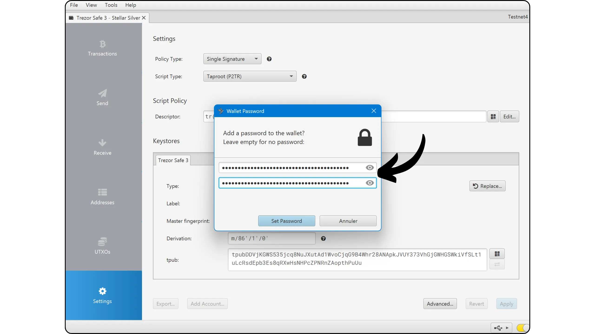

In zdaj je vaš portfelj uvožen v Sparrow Wallet!

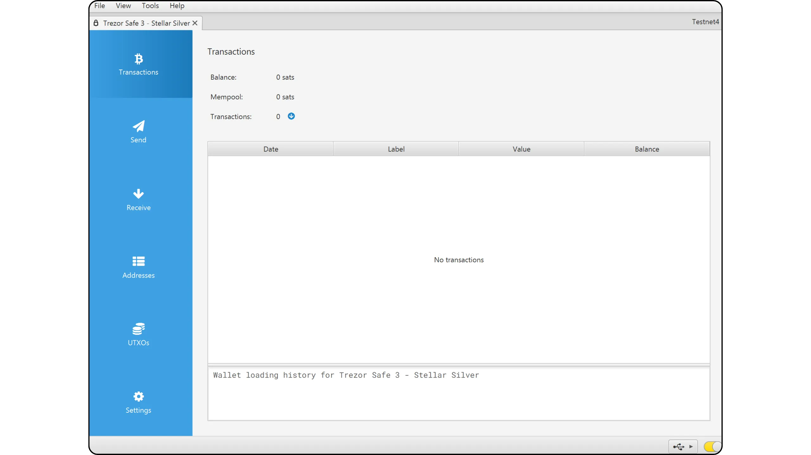

ඔබේ Wallet හි ඔබේ පළමු බිට්කොයින් ලබා ගැනීමට පෙර, **මම ඔබට හිස් ප්‍රතිසාධන පරීක්ෂණයක් සිදු කිරීමට දැඩිව උපදෙස් දෙමි**. ඔබේ xpub වැනි යමක් යොමු තොරතුරු ලෙස ලියන්න, එවිට Wallet තවමත් හිස්ව ඇති අතර ඔබේ Trezor Safe 3 යළි සකසන්න. එවිට ඔබේ Wallet Trezor මත ඔබේ කඩදාසි ආධාරක භාවිතයෙන් ප්‍රතිසාධනය කිරීමට උත්සාහ කරන්න. ප්‍රතිසාධනයෙන් පසු ජනනය කරන ලද xpub ඔබ මුලින්ම ලියාගෙන තිබූ එකට ගැලපේදැයි පරීක්ෂා කරන්න. එසේ නම්, ඔබේ කඩදාසි ආධාරක විශ්වාසදායක බවට ඔබට විශ්වාස කළ හැක.

Za več informacij o tem, kako izvesti test obnovitve, vam priporočam, da si ogledate ta drugi vadnik:

https://planb.network/tutorials/wallet/backup/recovery-test-5a75db51-a6a1-4338-a02a-164a8d91b895

## Kako lahko prejmem bitcoine z uporabo Trezor Safe 3?

Sparrow මත, "*Receive*" ටැබය ක්ලික් කරන්න.

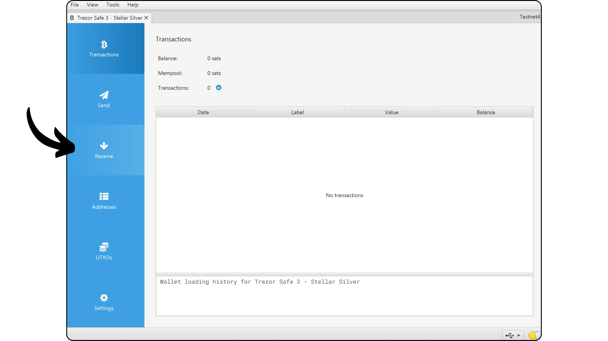

ඔබේ Trezor තිරය මත Sparrow Wallet විසින් යෝජිත Address භාවිතා කිරීමට පෙර, එය පරීක්ෂා කරන්න. මෙම අභ්‍යාසය ඔබට Sparrow මත පෙන්වා ඇති Address වංචාකාරී නොවන බව සහ Hardware Wallet සත්‍යයෙන්ම පසුව මෙම Address සමඟ ආරක්ෂා කරන ලද බිට්කොයින් වියදම් කිරීමට අවශ්‍ය පෞද්ගලික යතුර තබා ඇති බව තහවුරු කිරීමට ඉඩ සලසයි. මෙය ඔබට පහසුකම් සපයන ආකාරයේ ප්‍රහාර කිහිපයක් වලක්වා ගැනීමට උපකාරී වේ.

Za izvedbo tega preverjanja kliknite na gumb "*Display Address*".

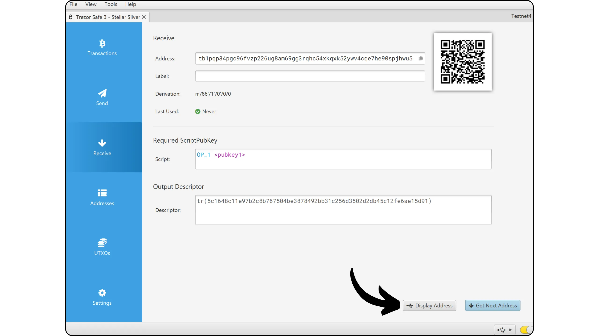

පෙරලන්න Address ඔබේ Trezor මත පෙන්වන්නේ Sparrow Wallet මත ඇති එකට ගැලපෙන බව පරීක්ෂා කරන්න. එහි වලංගුභාවය තහවුරු කිරීම සඳහා, ඔබේ Address යවන්නාට සන්නිවේදනය කිරීමට පෙර මෙම පරීක්ෂාව සිදු කිරීම වඩාත් සුදුසුය. තහවුරු කිරීමට බොත්තම් භාවිතා කළ හැක.

ඔබට පසුව මෙම Address සමඟ ආරක්ෂා වන බිට්කොයින් මූලාශ්‍රය විස්තර කිරීමට "*ලේබලයක්*" එක් කළ හැක. මෙය ඔබේ UTXO කළමනාකරණය වඩා හොඳින් කිරීමට ඉඩ සලසන හොඳ පුරුද්දකි.

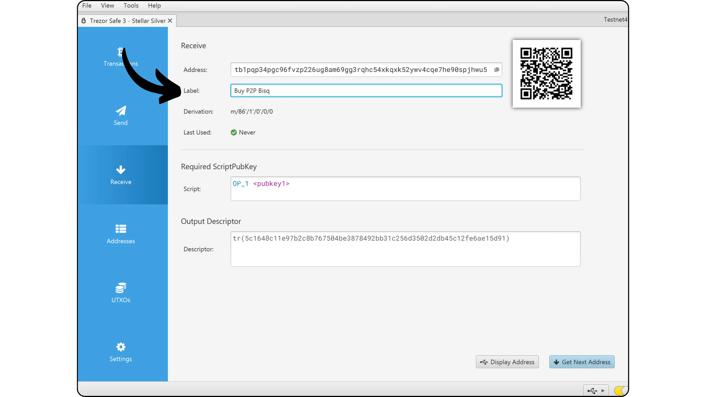

ඔබට පසුව මෙම Address භාවිතා කර බිට්කොයින් ලබා ගත හැක.

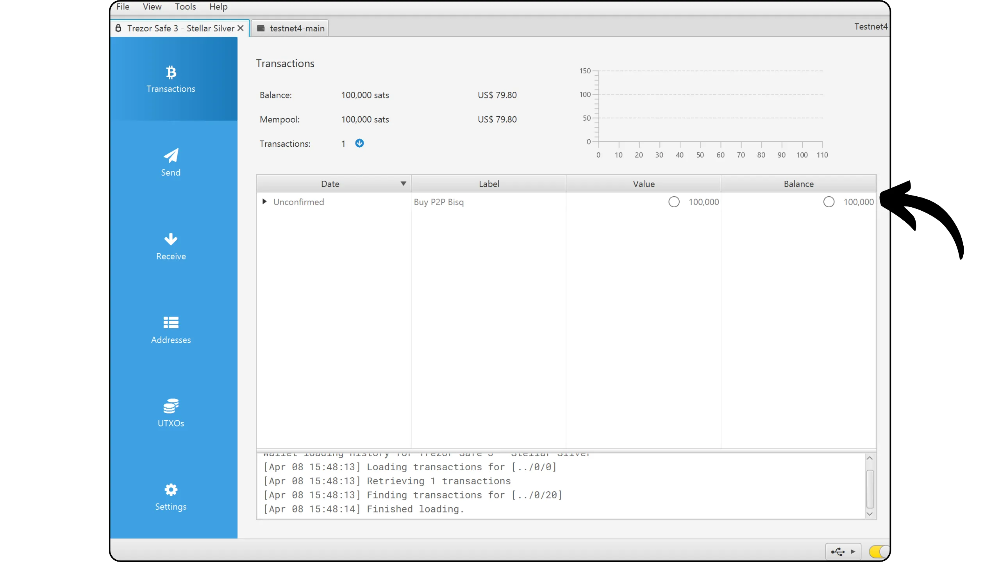

## Trezor Safe 3 සමඟ බිට්කොයින් යැවීම කෙසේද?

දැන් ඔබේ Safe 3-ආරක්ෂිත Wallet හි ඔබේ පළමු Satss ලබාගෙන ඇති බැවින්, ඔබට ඒවා වියදම් කළ හැකිය! ඔබේ Trezor පරිගණකයට සම්බන්ධ කර, PIN කේතය භාවිතයෙන් එය අගුළු විවෘත කර, Sparrow Wallet ආරම්භ කර, නව ගනුදෙනුවක් ගොඩනැගීමට "*Send*" ටැබය වෙත යන්න.

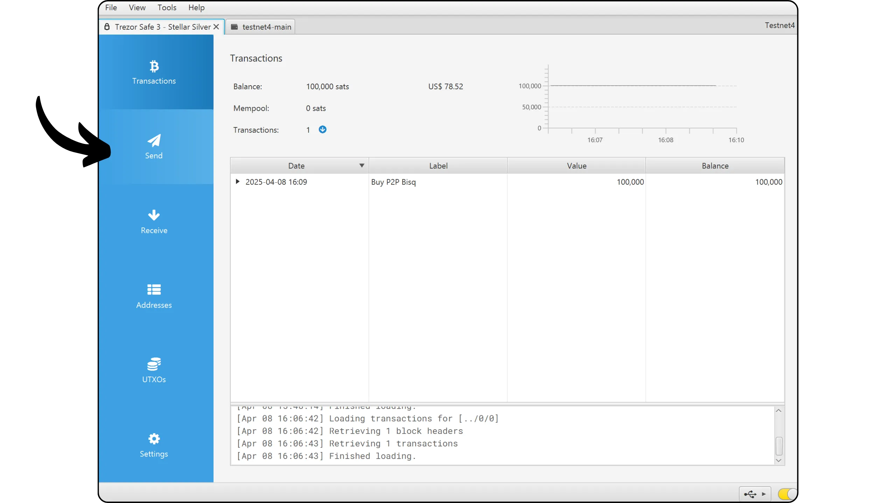

Če želite *Coin Control*, tj. posebej izbrati, katere UTXO-je porabiti v transakciji, pojdite na zavihek "*UTXOs*". Izberite UTXO-je, ki jih želite porabiti, nato kliknite na "*Send Selected*". Preusmerjeni boste na isti zaslon v zavihku "*Send*", vendar bodo vaši UTXO-ji že izbrani za transakcijo.

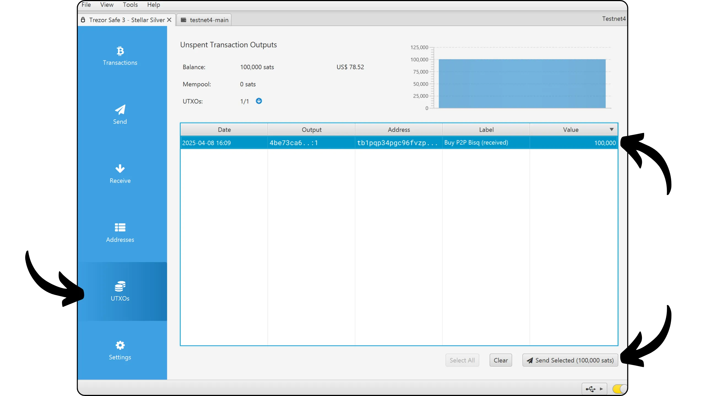

ගමනාන්තය Address ඇතුළත් කරන්න. "*+ Add*" බොත්තම ක්ලික් කිරීමෙන් ඔබට බහු ලිපින ඇතුළත් කළ හැක.

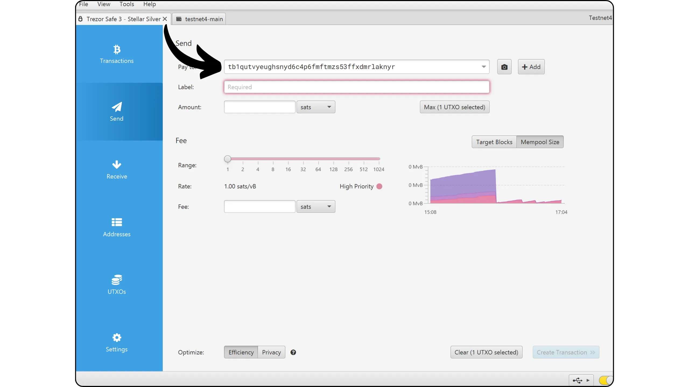

"*"ලේබලය*" ලියන්න මෙම වියදමේ අරමුණ මතක තබා ගැනීමට.

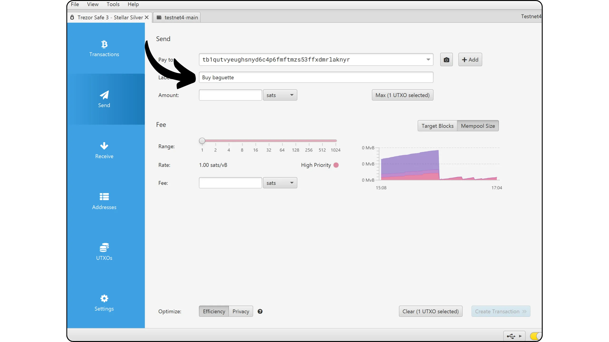

Address සඳහා යැවිය යුතු මුදල තෝරන්න.

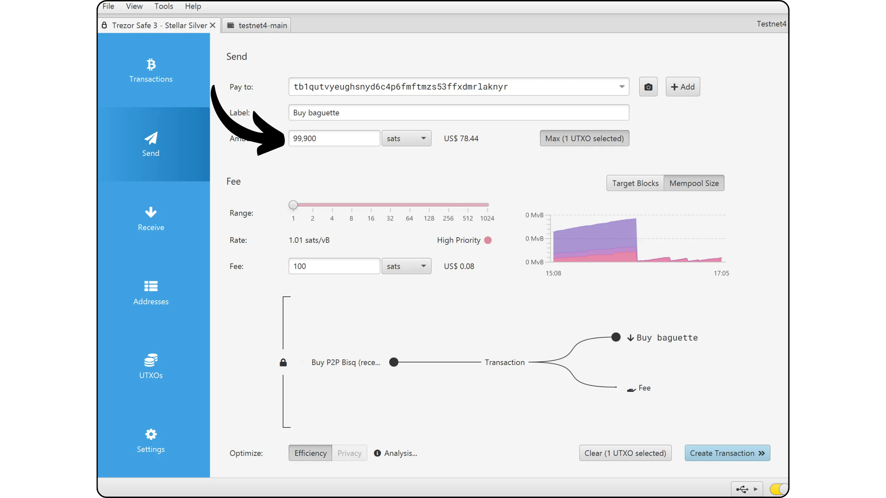

ඔබේ ගනුදෙනුවේ ගාස්තු අනුපාතය වත්මන් වෙළඳපොළට අනුව සකසන්න. උදාහරණයක් ලෙස, සුදුසු ගාස්තු අනුපාතයක් තෝරා ගැනීමට [Mempool.space](https://Mempool.space/) භාවිතා කළ හැක.

ඔබේ සියලුම ගනුදෙනු පරාමිතීන් නිවැරදි බව සහතික කර, පසුව "*ගනුදෙනුව තනන්න*" මත ක්ලික් කරන්න.

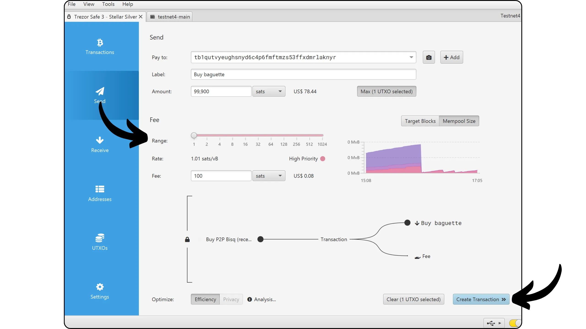

If everything is to your satisfaction, click on "*Finalize Transaction for Signing*".

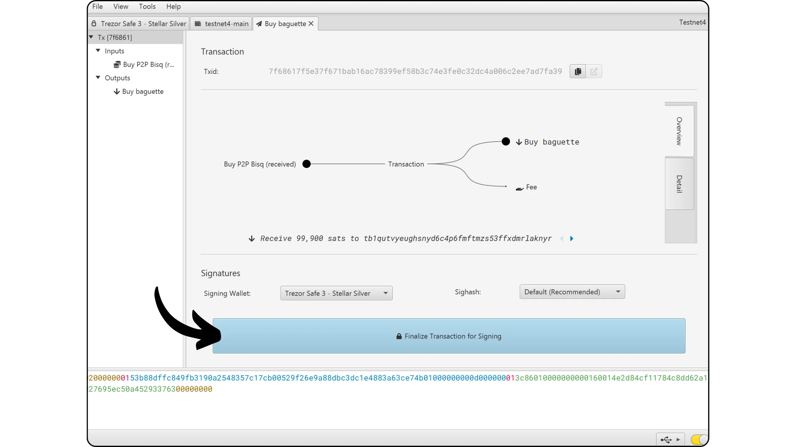

"*"සයින්*" මත ක්ලික් කරන්න.

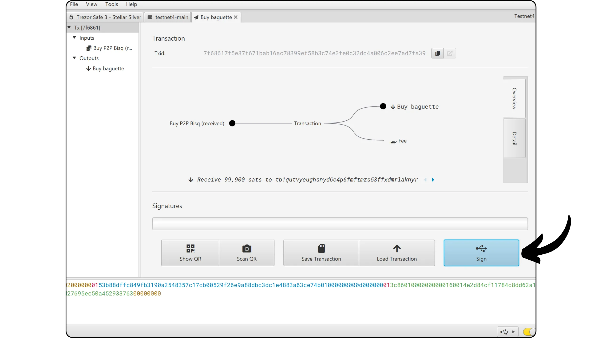

කොටුව "*Sign*" මත ඔබන්න, ඔබේ Trezor Safe 3 අසල.

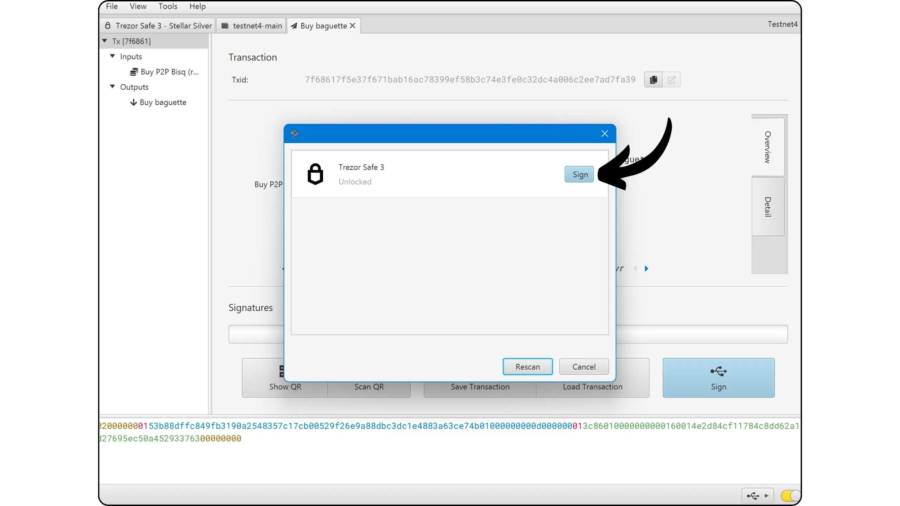

Hardware Wallet තිරයෙහි ඔබේ ගනුදෙනු පරාමිතීන්, ලැබුම්කරුගේ ලැබීමේ Address, යවන ලද මුදල සහ ගාස්තුව ඇතුළුව පරීක්ෂා කරන්න. ගනුදෙනුව Trezor මත සත්‍යාපනය කළ පසු, එය අත්සන් කිරීමට බොත්තම් දෙකම එකවර ක්ලික් කරන්න.

ඔබේ ගනුදෙනුව දැන් අත්සන් කර ඇත. සියල්ල හරිදැයි අවසන් වරට පරීක්ෂා කරන්න, එවිට "*Broadcast Transaction*" මත ක්ලික් කර Bitcoin ජාලය මත එය විකාශය කරන්න.

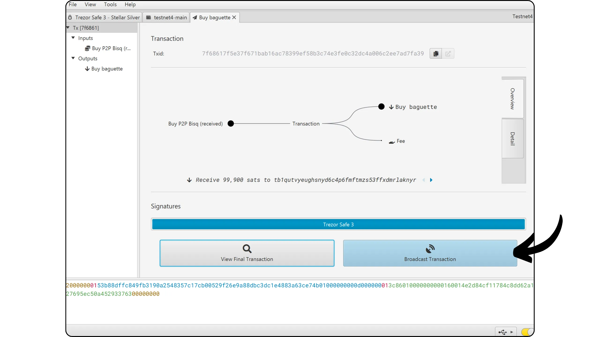

ඔබට එය Sparrow Wallet හි "*Transactions*" ටැබ් එකේ සොයා ගත හැක.

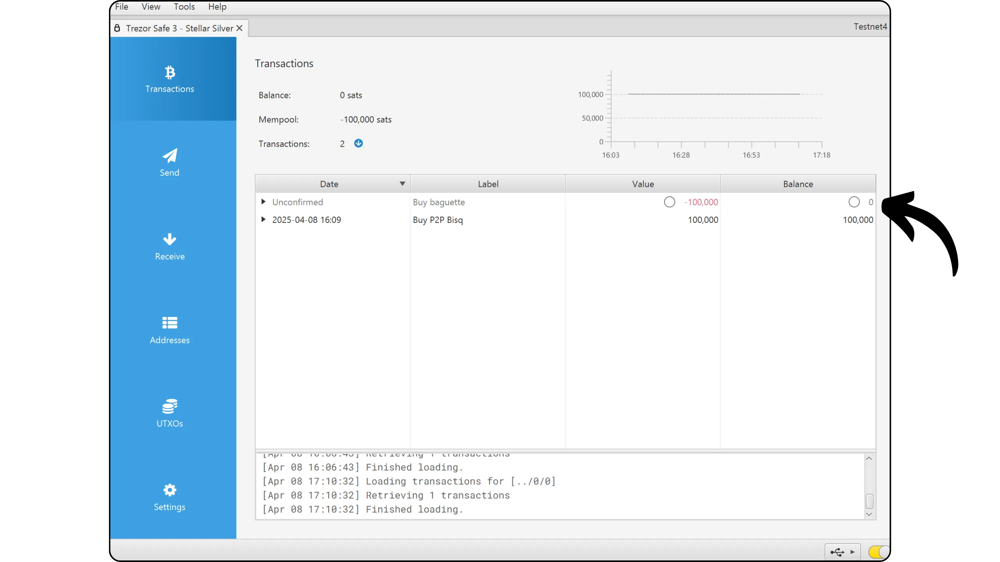

චුක්‍රියාව, ඔබ දැන් Sparrow Wallet සමඟ Trezor Safe 3 මූලික භාවිතය පිළිබඳව දැනුවත් වී ඇත! තවත් පියවරක් ඉදිරියට යාමට, ඔබේ ආරක්ෂාව වැඩි දියුණු කිරීමට passphrase BIP39 සමඟ Hardware Wallet Trezor භාවිතය පිළිබඳ මෙම සම්පූර්ණ උපකාරකය මම නිර්දේශ කරමි:

https://planb.network/tutorials/wallet/backup/trezor-passphrase-0474b5bf-496f-4f97-aefe-445368fdca42

ඔබට මෙම උපකාරිකාව ප්‍රයෝජනවත් වූවා නම්, Green අඟුලක් පහළින් දමා යන ලෙස මම කෘතඥ වෙමි. මෙම ලිපිය ඔබේ සමාජ ජාලවල බෙදා ගැනීමට නිදහස් වන්න. බොහෝම ස්තූතියි!