*Slika: [Trezor.io](https://trezor.io/)*

Trezor Safe 5 යනු SatoshiLabs විසින් නිර්මාණය කරන ලද නවතම Hardware Wallet පරම්පරාවක් වන අතර 2024 දී එළිදැක්විනි. එය Safe 3 හි උසස් මට්ටමේ අනුවාදයක් ලෙස තැබෙන අතර, ආරෝපණය සහ කල්පැවැත්ම මත අවධානය යොමු කරයි. එය Safe 3 හි පෙරනිමි ආරක්ෂක ප්‍රගතියෙන් ප්‍රයෝජන ලබන අතර, Model One සහ Model T සමඟ සැසඳීමේදී.

€169 ක මිලකට, Safe 5 යනු Hardware Wallet උසස් පෙළ කාණ්ඩයේ තරඟකාරී ලෙස පිහිටා ඇති අතර, Coldcard, Ledger Nano X සහ Flex, Jade Plus, Passport සහ Bitbox වැනි ආකෘති සමඟ තරඟ වදිනවා.

Safe 5 යන්ත්‍රය 1.54 අඟල් වර්ණ ස්පර්ශ තිරය, *Gorilla Glass 3* මඟින් ආරක්ෂා කර ඇති, ආඝාත සහ නොකැළැල් වීමට ප්‍රතිරෝධී වන, මඟින් විශේෂිත වේ. එය *Trezor Touch* ස්පර්ශන එන්ජිමකින්ද සන්නද්ධ කර ඇති අතර, ස්පර්ශ කරන විට කුඩා කම්පන නිකුත් කරයි. Safe 3 මෙන්ම, එය ආරක්ෂිත මූලද්‍රව්‍යයක් ඇතුළත් කර ඇති අතර USB-C සම්බන්ධතාවයක් මඟින් ක්‍රියාත්මක වන අතර, Micro SD වරාය එකතු කර ඇත.

Safe 3 සහ Safe 5 අතර ප්‍රධාන වෙනස උපාංගයේ ගුණාත්මකභාවයයි, ආරක්ෂක අංගවලින් වෙන්ව. එය භාවිතා කරන්නාගේ අත්දැකීම වඩාත්ම සාර්ථක කරයි, මෘදු ක්‍රියාකාරීත්වය සහ වඩාත් සුවපහසු තිරයක් සමඟ. ආරක්ෂාව පිළිබඳව, එය සමාන වේ.

Safe 5 සතුටුදායක Hardware Wallet එකකින් අපේක්ෂා කරන සියලුම අත්‍යවශ්‍ය විශේෂාංග අඩංගු වේ, විශිෂ්ට passphrase BIP39 ඒකාබද්ධ කිරීම ඇතුළුව. කෙසේ වෙතත්, එය තවම Miniscript සඳහා සහය නොදක්වයි.

මෙම ආකෘතිය විශේෂයෙන් ආරම්භකයින් සහ මධ්‍යම පරිශීලකයින් සඳහා සුදුසු වේ. අනෙක් අතට, එය Coldcard වැනි උපාංගවල ලබා ගත හැකි වඩා විශේෂිත විශේෂාංග සොයන උසස් පරිශීලකයින්ගේ සියලුම අපේක්ෂාවන් සපුරාලීමට නොහැකි විය හැක. කෙසේ වෙතත්, ඔබට මෙම උසස් විකල්ප අවශ්‍ය නොවේ නම්, Trezor Safe 5 විශිෂ්ට තේරීමක් විය හැක.

## Trezor Safe 5 ආරක්ෂක ආකෘතිය

Safe 3 වැනි, Trezor Safe 5 යනු EAL6+ සහතික කළ **Secure Element** එකකින් සන්නද්ධ වේ, Model One සහ Model T වැනි පෙර ආකෘතිවලට වඩා සුවිශේෂී ප්‍රගතියකි. මෙය OPTIGA Trust M V3 චිප් එක වන අතර, එය seed සෘජුවම ගබඩා නොකර, එයට ප්‍රවේශය ආරක්ෂා කිරීමට සංකේතාත්මක සංරචකයක් ලෙස ක්‍රියා කරයි. Secure Element එක රහසක් තබා ගනී, එය පරිශීලකයා PIN එක නිවැරදිව ඇතුළත් කළ පසු පමණක් ප්‍රවේශ විය හැක. එවිට මෙම රහස භාවිතා කර, උපාංගයේ ප්‍රධාන මතකයේ සංකේතනය කර ගබඩා කරන seed විකේතනය කරයි.

Ta hibridni varnostni sistem ponuja izboljšano fizično zaščito, zlasti proti napadom ekstrakcije ali invazivni analizi, težavam, ki so bile značilne za Model One, zlasti pri upravljanju PIN-ov. Te ranljivosti so zdaj obhodene zahvaljujoč uporabi varnega elementa. Ta model prav tako ohranja odprtokodno programsko arhitekturo: koda, ki upravlja generacijo in uporabo zasebnih ključev, ostaja popolnoma dostopna in preverljiva. Čip OPTIGA upravlja samo PIN kodo, element, ki je zunaj upravljanja ključev Bitcoin Wallet. Omejen je na sprostitev skrivnosti, ki se lahko uporabi za dešifriranje seed. Prav tako čip OPTIGA Trust M V3 koristi relativno prosto licenco, ki SatoshiLabs omogoča prosto objavo potencialnih ranljivosti (brez NDA).

මෙම ආරක්ෂක ආකෘතිය, මගේ අදහසට, අද වෙළඳපොළේ ලබා ගත හැකි හොඳම සමථයකි. එය ආරක්ෂිත මූලද්‍රව්‍යයක වාසි සහිතව විවෘත මූලාශ්‍ර මෘදුකාංග කළමනාකරණය සමඟ එකතු කරයි. පෙර, පරිශීලකයින්ට චිප් සමඟ වැඩිදියුණු කළ භෞතික ආරක්ෂාව සහ විවෘත මූලාශ්‍ර සමඟ විනිවිදභාවය අතර තේරීම කළ යුතු විය; Trezor Safe සමඟ, දෙකෙන්ම ප්‍රයෝජනයක් ලබා ගැනීම හැකිය.

මෙම උපකාරක පෙරළියේ, ඔබේ Trezor Safe 5 ආරක්ෂිතව වින්‍යාසගත කර භාවිතා කරන ආකාරය ඉගෙන ගන්නෙමු.

## Trezor Safe 5 අවිවෘත කිරීම

Ko prejmete svoj Safe 5, se prepričajte, da sta škatla in Seal nepoškodovana, da potrdite, da paket ni bil odprt. Programska preverba pristnosti in celovitosti naprave bo izvedena tudi kasneje, ko bo nastavljena.

බොක්ස් අන්තර්ගතයන්ට ඇතුළත් වේ :

- Trezor Safe 5;
- Mnemonic වාක්‍යය සටහන් කිරීමට කාඩ්පත්, ස්ටිකර් සහ උපදෙස් අඩංගු පවුච් එකක්;
- USB-C to USB-C කේබල්.

ඔබේ Trezor Safe 5 විවෘත කළ විට, එය ආරක්ෂිත ප්ලාස්ටික් එකකින් ආවරණය වී තිබිය යුතු අතර USB-C වරාය හොලෝග්‍රැෆික් Seal එකකින් ආරක්ෂා වී තිබිය යුතුය. එය එහි ඇති බව සහතික කරන්න.

උපාංගය මත නාවිගේෂනය සාපේක්ෂව අත්භාවය:

- ස්ක්‍රීනයේ පහළ භාගය ස්පර්ශ කරන්න ඉදිරියට ගමන් කිරීමට;
- ස්ලයිඩ් කර පහළට ගොස් ආපසු යන්න ;
- ඔපරේෂනයක් තහවුරු කිරීමට තිරය මත ඔබන්න සහ තබා ගන්න.

## ප්‍රාථමික අවශ්‍යතා

මෙම උපදෙස් මාලාව සඳහා, මම ඔබට Trezor Safe 5 [Sparrow Wallet පෝර්ට්ෆෝලියෝ කළමනාකරණ මෘදුකාංගය](https://sparrowwallet.com/download/) සමඟ භාවිතා කරන ආකාරය පෙන්වන්න යන්නේ. ඔබ මෙතෙක් මෙම මෘදුකාංගය ස්ථාපනය කර නැත්නම්, කරුණාකර දැන් එය කරන්න. ඔබට උදව් අවශ්‍ය නම්, Sparrow Wallet වින්‍යාස කිරීම පිළිබඳ විස්තරාත්මක උපදෙස් මාලාවක් අපට ඇත:

https://planb.network/tutorials/wallet/desktop/sparrow-c674e2ac-d46f-4c82-92a7-7d1b0e262f5d

ඔබට Safe 5 සකසීමට, එහි සත්‍යතාව පරීක්ෂා කිරීමට සහ firmware ස්ථාපනය කිරීමට Trezor Suite මෘදුකාංගයද අවශ්‍ය වනු ඇත. අපි එම මෘදුකාංගය එම කාර්ය සඳහා පමණක් භාවිතා කරන අතර, පසුව firmware යාවත්කාලීන කිරීම් සඳහා පමණක් අවශ්‍ය වනු ඇත. Wallet හි දෛනික කළමනාකරණය සඳහා, අපි Sparrow Wallet පමණක් භාවිතා කරන අතර, එය Bitcoin සඳහා උපරිම කර ඇති අතර, ආරම්භකයින්ට පවා භාවිතා කිරීමට පහසුය (Sparrow, Bitcoin පමණක් සහය දක්වයි, altcoins නොවේ).

[डाउनलोड गर्नुहोस् Trezor Suite आधिकारिक वेबसाइटबाट](https://trezor.io/trezor-suite)

මෙම වැඩසටහන් දෙක සඳහාම, ඔබේ පරිගණකය මත ස්ථාපනය කිරීමට පෙර, ඔවුන්ගේ සත්‍යතාව (GnuPG සමඟ) සහ ඔවුන්ගේ අඛණ්ඩතාව (Hash හරහා) පරීක්ෂා කරන ලෙස මම දැඩිව නිර්දේශ කරමි. ඔබට මෙය කරන්නේ කෙසේද යන්න නොදන්නා නම්, ඔබට මෙම වෙනත් උපකාරකය අනුගමනය කළ හැක:

https://planb.network/tutorials/computer-security/data/integrity-authenticity-21d0420a-be02-4663-94a3-8d487f23becc

## Trezor Safe 5 ආරම්භ කිරීම

ඔබේ Safe 5, Trezor Suite සහ Sparrow Wallet දැනටමත් ස්ථාපිත කර ඇති ඔබේ පරිගණකයට සම්බන්ධ කරන්න.

Trezor Suite odprite, nato kliknite na "*Nastavi moj Trezor*".

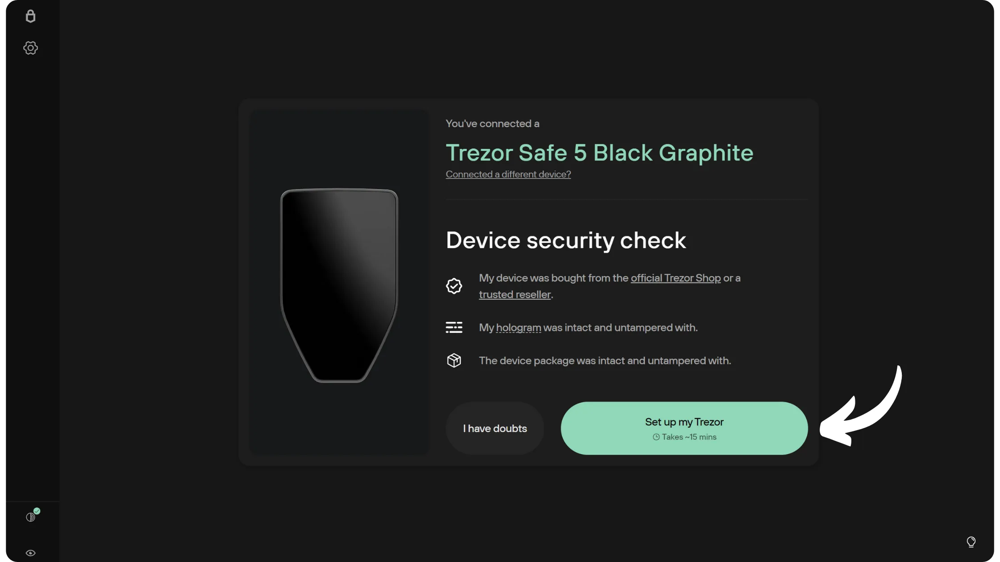

"*Bitcoin-only firmware*" තෝරන්න, එවිට "*Install Bitcoin-only*" මත ක්ලික් කරන්න.

Trezor Suite nato bo namestil vdelano programsko opremo na vaš Safe 5. Prosimo, počakajte med namestitvijo.

කොටුව "*Continue*" මත ක්ලික් කරන්න.

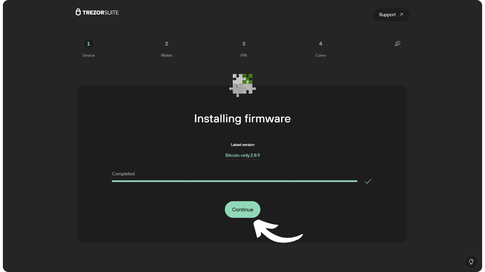

පසුව ඔබේ Hardware Wallet ව්‍යාජ හෝ අන්‍යෝන්‍ය නොවන බව සහතික කිරීම සඳහා සත්‍යතාවය පරීක්ෂාවට යන්න.

ඔබේ Safe 5 මත, තිරය ඔබා තහවුරු කරන්න.

Če je vaš Trezor pristen, se bo v Trezor Suite prikazalo potrditveno sporočilo.

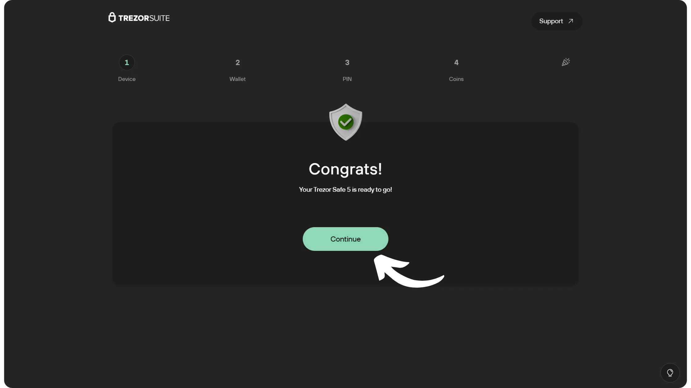

ඔබට පසු දොරවල් මූලික මෙහෙයුම් උපදෙස් සමඟ මඟ හැරිය හැක.

## Bitcoin පෝර්ට්ෆෝලියෝ එකක් නිර්මාණය කිරීම

Trezor Suite මත, "*Create new Wallet*" බොත්තම ක්ලික් කරන්න.

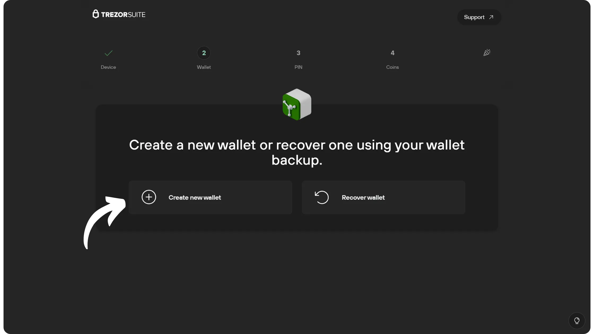

ස්ථාපිත BIP39 Wallet එකක් නිර්මාණය කිරීමට, මෙනුවෙන් "*Legacy Wallet backup types*" තෝරාගෙන, 12- හෝ 24-වචන Mnemonic වාක්‍යය අතරින් තෝරන්න (දැනට 12 වචන නිර්දේශිත වේ). මෙය ඔබට සම්භාව්‍ය තනි-අත්සන පෝර්ට්ෆෝලියෝවක් නිර්මාණය කිරීමට හැකියාව ලබා දේ. මම ඔබට මෙහි BIP39-අනුකූල පරාමිතීන් තෝරා ගැනීමට උපදෙස් දෙමි, ප්‍රතිසාධනය පහසු කිරීම සහ විශේෂිත පරිසරයකට සීමා නොවීම සඳහා. අවසානයේ, "*Create Wallet*" මත ක්ලික් කරන්න.

Če želite izvedeti več o drugih možnostih varnostnega kopiranja, ki so na voljo na Trezorju, vključno z *Multi-share Backup*, priporočam, da si ogledate tudi ta vadnica:

https://planb.network/tutorials/wallet/backup/trezor-shamir-backup-7f98b593-face-48fb-a643-0e811b87c94e

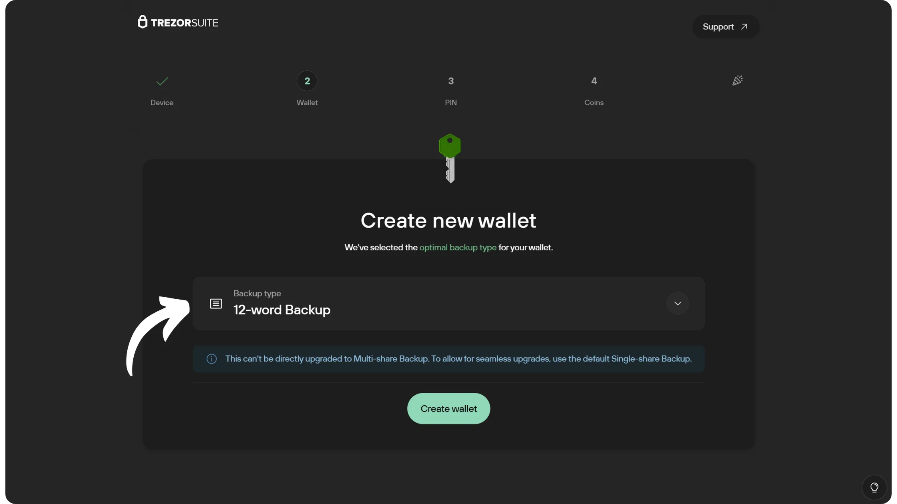

Hardware Wallet මත භාවිත නියමයන් පිළිගන්න.

ස්ක්‍රීනය මත ඔබන්න සහ තබා ගන්න නව පෝර්ට්ෆෝලියෝවක් තැනීමට.

Trezor Suite හි, "*ආපසු සුරැකුමට දිගටම යන්න*" ක්ලික් කරන්න.

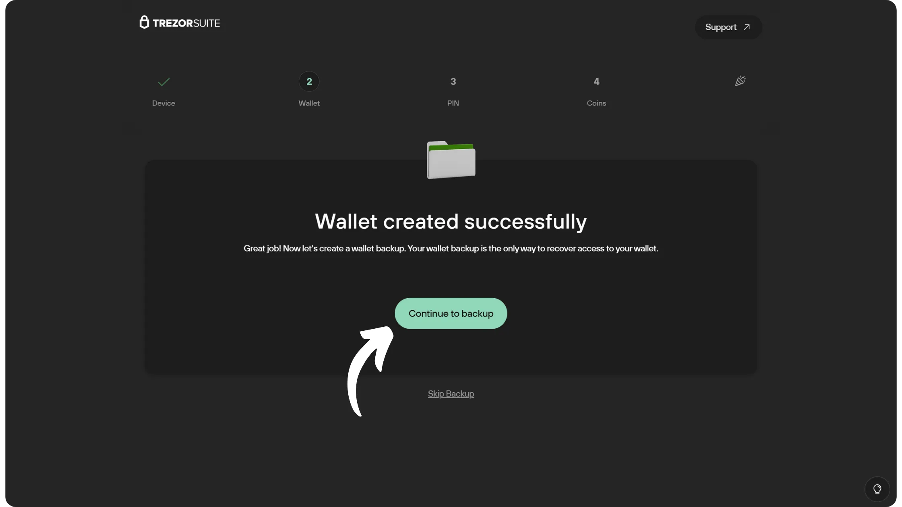

සොෆ්ට්වෙයාර්ය ඔබේ Mnemonic වාක්‍යය කළමනාකරණය කරන ආකාරය පිළිබඳ උපදෙස් ලබා දේ.

මෙම Mnemonic ඔබට ඔබේ සියලුම බිට්කොයින් සඳහා සම්පූර්ණ, අසීමිත ප්‍රවේශය ලබා දේ. මෙම වාක්‍යය සතු කවරෙකුට හෝ, ඔබේ Trezor Safe 5 වෙත භෞතික ප්‍රවේශය නොමැතිව පවා, ඔබේ මුදල් සොරා ගැනීමට හැකිය.

12-शब्द वाक्यांशले तपाईंको Hardware Wallet हराएको, चोरी भएको वा बिग्रिएको अवस्थामा तपाईंको बिटकोइनहरूमा पहुँच पुनर्स्थापित गर्दछ। त्यसैले यसलाई सावधानीपूर्वक बचत गर्नु र सुरक्षित ठाउँमा भण्डारण गर्नु धेरै महत्त्वपूर्ण छ।

ඔබට එය පෙට්ටියෙහි සපයන ලද පපිරිය මත ලිවිය හැකි අතර, අමතර ආරක්ෂාව සඳහා, මම එය ගිනි, ගංවතුර හෝ කඩා වැටීමෙන් ආරක්ෂා කිරීම සඳහා මල නොබැඳෙන වානේ පදනමක මත කැටයම් කිරීම නිර්දේශ කරමි.

නියමයන් තහවුරු කර, පසුව "*Wallet ආපසුගැන්වීම නිර්මාණය කරන්න*" බොත්තම මත ක්ලික් කරන්න.

Safe 5 bo ustvaril vašo Mnemonic frazo z uporabo svojega generatorja naključnih števil. Poskrbite, da vas med to operacijo nihče ne opazuje. Zapišite besede, prikazane na zaslonu, na fizični medij po vaši izbiri. Glede na vašo varnostno strategijo lahko razmislite o izdelavi več popolnih fizičnih kopij fraze (vendar je nikakor ne delite). Pomembno je, da so besede oštevilčene in v zaporednem vrstnem redu.

***පැහැදිලිවම, ඔබ මෙම වචන අන්තර්ජාලයේ බෙදා හරිනු නොහැක, මම මෙම උපකාරකයෙහි කරන පරිදි. මෙම උදාහරණය Wallet භාවිතා කරනු ලබන්නේ Testnet මත පමණක් වන අතර මෙම උපකාරකය අවසානයේදී මකා දමනු ඇත.

Za več informacij o pravilnem načinu shranjevanja in upravljanja vaše Mnemonic fraze, toplo priporočam, da sledite temu drugemu vodiču, še posebej, če ste začetnik:

https://planb.network/tutorials/wallet/backup/backup-mnemonic-22c0ddfa-fb9f-4e3a-96f9-46e2a7954270

ඊළඟ වචන වෙත ගමන් කිරීමට, තිරයේ පහළ කොටස මත ක්ලික් කරන්න. පසුපසට යාමට පහළට සෙලවන්න. සියලු වචන ලිවී අවසන් වූ විට, ඊළඟ පියවරට ගමන් කිරීමට ඔබේ ඇඟිල්ල තිරය මත තබා ගන්න.

Mnemonic වාක්‍යයේ ඔබේ වචන නිවැරදිව ලියාගෙන ඇති බව තහවුරු කිරීම සඳහා ඒවායේ අනුපිළිවෙලට තෝරන්න.

මෙම සත්‍යාපන ක්‍රියාවලිය අවසන් වූ විට, ඉදිරියට යාමට තිරය මත ක්ලික් කරන්න.

## PIN කේතය සකසමින්

ඊළඟට එනේ PIN කේතය පියවරයි. PIN කේතය ඔබේ Trezor අගුළු හරියයි. එම නිසා එය අනුමත නොකළ භෞතික ප්‍රවේශයට එරෙහි ආරක්ෂාව සපයයි. මෙම PIN කේතය ඔබේ Wallet හි සංකේතාත්මක යතුරු ව්‍යුත්පන්න කිරීමේදී සම්බන්ධ නොවේ. එබැවින් PIN කේතයට ප්‍රවේශය නොමැතිව, ඔබේ 12-වචන Mnemonic වාක්‍යය හිමිකර ගැනීමෙන් ඔබට ඔබේ බිට්කොයින් නැවත ප්‍රවේශය ලබා ගැනීමට හැකියාව ඇත.

Trezor Suite මත, "*Continue to PIN*" මත ක්ලික් කරන්න, එවිට "*Set PIN*" බොත්තම මත ක්ලික් කරන්න.

Safe 5 සමඟ තහවුරු කරන්න.

අපි යෝජනා කරන්නේ හැකි අයුරින් අහඹු PIN කේතයක් තෝරා ගැනීමටයි. ඔබේ Trezor ගබඩා කර ඇති ස්ථානයෙන් වෙනම ස්ථානයක (උදාහරණයක් ලෙස මුරපද කළමනාකරුකින්) මෙම කේතය සුරකින්න. ඔබට අංක 8 සිට 50 දක්වා PIN කේතයක් නිර්වචනය කළ හැක. ආරක්ෂාව වැඩි දියුණු කිරීම සඳහා හැකි අයුරින් දිගු PIN කේතයක් තෝරා ගැනීමට මම ඔබට යෝජනා කරමි.

ਟਚਪੈਡ ਦੀ ਵਰਤੋਂ ਕਰਕੇ ਆਪਣਾ ਪਿਨ ਦਰਜ ਕਰੋ।

සමප්ත වූ විට, දකුණු පහළ කොනේ Green ටික් මත ක්ලික් කර, පසුව ඔබේ PIN නැවත තහවුරු කරන්න.

ඔබේ පින් කේතය ලියාපදිංචි කර ඇත.

Trezor Suite මත, "*සම්පූර්ණ සැකසුම*" බොත්තම ක්ලික් කරන්න.

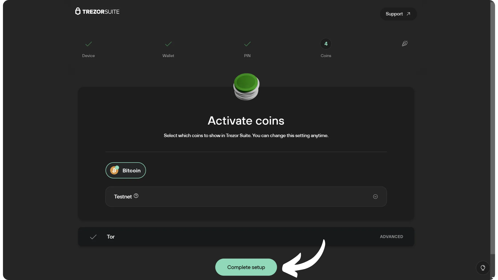

ඔබේ Safe 5 හි වින්‍යාසය දැන් සම්පූර්ණයි. ඔබට අවශ්‍ය නම්, ඔබේ Hardware Wallet හි නම සහ මුල් පිටුව වෙනස් කළ හැක.

Trezor Suite programske opreme ne bomo več potrebovali, razen za redne posodobitve vdelane programske opreme na vašem Hardware Wallet ali če želite opraviti test obnovitve. Zdaj bomo za upravljanje portfelja uporabljali Sparrow, saj je ta programska oprema popolnoma primerna za uporabo samo z Bitcoin.

## Sparrow Wallet මත පෝර්ට්ෆෝලියෝ සකස් කිරීම

Začnite tako, da prenesete in namestite Sparrow Wallet [z uradne spletne strani](https://sparrowwallet.com/) na svoj računalnik, če tega še niste storili.

ඔබ Sparrow Wallet විවෘත කළ විට, මෘදුකාංගය Bitcoin නෝඩ් එකට සම්බන්ධ වී ඇති බව, Interface හි දකුණු පහළ කෙළවරේ ඇති ටික් එකෙන් පෙන්වා ඇත. Sparrow සම්බන්ධ කිරීමේදී ගැටළු ඇති නම්, මම ඔබට මෙම උපදෙස් මාලාවේ ආරම්භය අනුගමනය කිරීමට නිර්දේශ කරමි:

https://planb.network/tutorials/wallet/desktop/sparrow-c674e2ac-d46f-4c82-92a7-7d1b0e262f5d

"*"*File*"*" ටැබය මත ක්ලික් කරන්න, එවිට "*New Wallet*" මත ක්ලික් කරන්න.

ඔබේ පෝර්ට්ෆෝලියෝව නමක් දී, "*Wallet තනන්න*" මත ක්ලික් කරන්න.

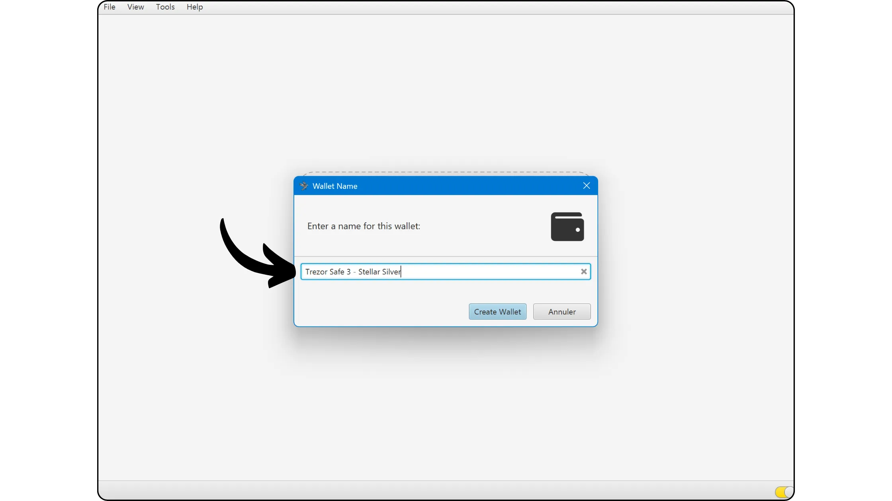

"*Script Type*" මෙනුවේ, ඔබේ බිට්කොයින් ආරක්ෂා කිරීමට භාවිතා කරන ලිපියේ වර්ගය තෝරන්න. මම "*Taproot*" හෝ එය නොමැති නම්, "*Native SegWit*" නිර්දේශ කරමි.

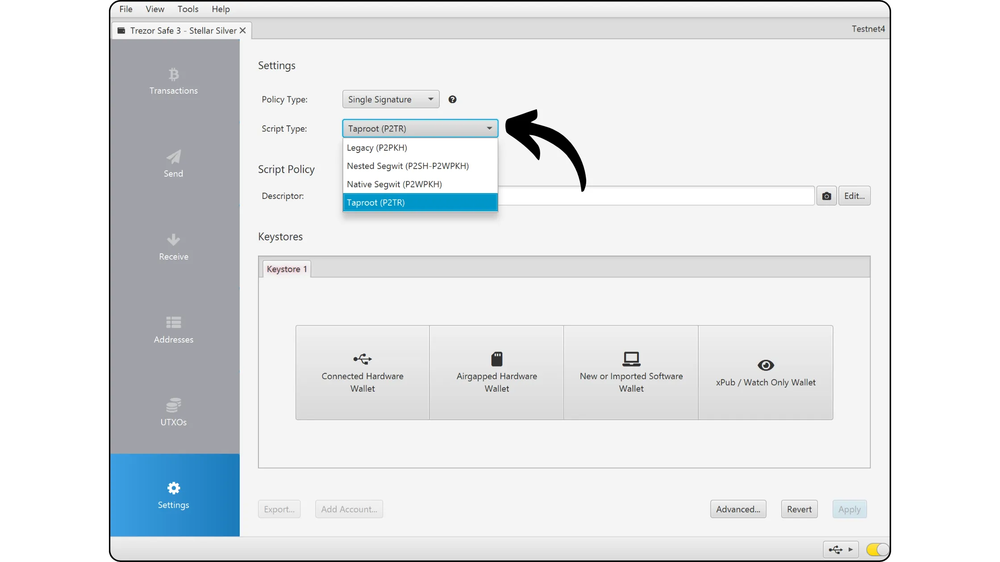

"*Connected Hardware Wallet*" බොත්තම මත ක්ලික් කරන්න. ඔබේ Safe 5, නියත වශයෙන්ම පරිගණකයට සම්බන්ධ කර ඇති අතර අගුළු ඇර ඇත.

Ko svoj Safe 5 povežete z računalnikom, na katerem je odprt Sparrow Wallet, boste pozvani, da vnesete passphrase BIP39 na zaslonu Hardware Wallet. Ta napredna možnost bo obravnavana v prihodnjem vodiču. Za zdaj lahko preprosto kliknete na kljukico Green v zgornjem desnem kotu, da potrdite, da želite uporabiti prazen passphrase (tj. brez passphrase). Da preprečite, da bi vas Trezor vsakič, ko ga zaženete, prosil za vnos passphrase, pojdite v Trezor Suite, dostopite do nastavitev in spremenite možnost v "*Device*" > "*Wallet default*" na "*Standard*" namesto "*passphrase*".

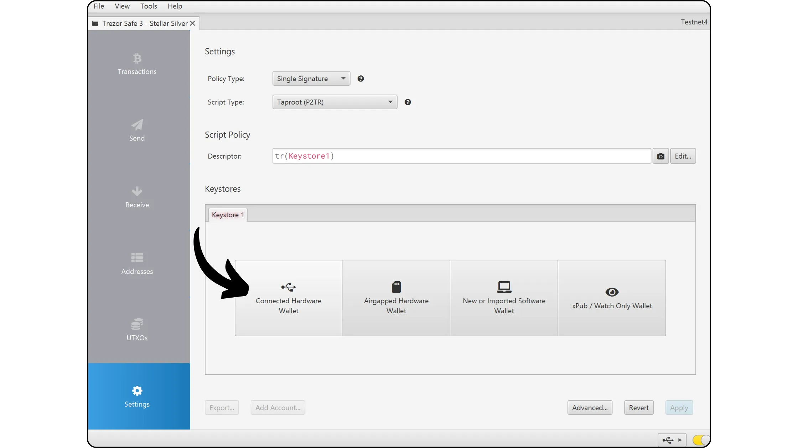

"*Scan*" බොත්තම මත ක්ලික් කරන්න. ඔබේ Safe 5 පෙනී යිය යුතුය. "*Import Keystore*" මත ක්ලික් කරන්න.

ඔබට දැන් ඔබේ Wallet විස්තර, ඔබේ පළමු ගිණුමේ දිගු සමාජ යතුර ඇතුළු, දැක ගත හැක. Wallet නිර්මාණය අවසන් කිරීමට "*Apply*" බොත්තම ක්ලික් කරන්න.

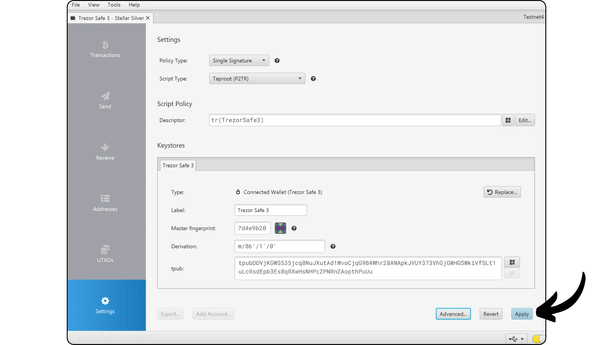

තද මුරපදයක් තෝරන්න Sparrow Wallet වෙත ප්‍රවේශය ආරක්ෂා කිරීමට. මෙම මුරපදය ඔබේ Sparrow Wallet දත්තවලට ආරක්ෂිත ප්‍රවේශය සහතික කරනු ඇත, ඔබේ මහජන යතුරු, ලිපින, ලේබල් සහ ගනුදෙනු ඉතිහාසය අනුමත නොකළ ප්‍රවේශයෙන් ආරක්ෂා කරමින්.

මම ඔබට උපදෙස් දෙන්නේ මෙම මුරපදය මුරපද කළමනාකරුකරුකරුකරුකරුකරුකරුකරුකරුකරුකරුකරුකරුකරුකරුකරුකරුකරුකරුකරුකරුකරුකරුකරුකරුකරුකරුකරුකරුකරුකරුකරුකරුකරුකරුකරුකරුකරුකරුකරුකරුකරුකරුකරුකරුකරුකරුකරුකරුකරුකරුකරුකරුකරුකරුකරුකරුකරුකරුකරුකරුකරුකරුකරුකරුකරුකරුකරුකරුකරුකරුකරුකරුකරුකරුකරුකරුකරුකරුකරුකරුකරුකරුකරුකරුකරුකරුකරුකරුකරුකරුකරුකරුකරුකරුකරුකරුකරුකරුකරුකරුකරුකරුකරුකරුකරුකරුකරුකරුකරුකරුකරුකරුකරුකරුකරුකරුකරුකරුකරුකරුකරුකරුකරුකරුකරුකරුකරුකරුකරුකරුකරුකරුකරුකරුකරුකරුකරුකරුකරුකරුකරුකරුකරුකරුකරුකරුකරුකරුකරුකරුකරුකරුකරුකරුකරුකරුකරුකරුකරුකරුකරුකරුකරුකරුකරුකරුකරුකරුකරුකරුකරුකරුකරුකරුකරුකරුකරුකරුකරුකරුකරුකරුකරුකරුකරුකරුකරුකරුකරුකරුකරුකරුකරුකරුකරුකරුකරුකරුකරුකරුකරුකරුකරුකරුකරුකරුකරුකරුකරුකරුකරුකරුකරුකරුකරුකරුකරුකරුකරුකරුකරුකරුකරුකරුකරුකරුකරුකරුකරුකරුකරුකරුකරුකරුකරුකරුකරුකරුකරුකරුකරුකරුකරුකරුකරුකරුකරුකරුකරුකරුකරුකරුකරුකරුකරුකරුකරුකරුකරුකරුකරුකරුකරුකරුකරුකරුකරුකරුකරුකරුකරුකරුකරුකරුකරුකරුකරුකරුකරුකරුකරුකරුකරුකරුකරුකරුකරුකරුකරුකරුකරුකරුකරුකරුකරුකරුකරුකරුකරුකරුකරුකරුකරුකරුකරුකරුකරුකරුකරුකරුකරුකරුකරුකරුකරුකරුකරුකරුකරුකරුකරුකරුකරුකරුකරුකරුකරුකරුකරුකරුකරුකරුකරුකරුකරුකරුකරුකරුකරුකරුකරුකරුකරුකරුකරුකරුකරුකරුකරුකරුකරුකරුකරුකරුකරුකරුකරුකරුකරුකරුකරුකරුකරුකරුකරුකරුකරුකරුකරුකරුකරුකරුකරුකරුකරුකරුකරුකරුකරුකරුකරුකරුකරුකරුකරුකරුකරුකරුකරුකරුකරුකරුකරුකරුකරුකරුකරුකරුකරුකරුකරුකරුකරුකරුකරුකරුකරුකරුකරුකරුකරුකරුකරුකරුකරුකරුකරුකරුකරුකරුකරුකරුකරුකරුකරුකරුකරුකරුකරුකරුකරුකරුකරුකරුකරුකරුකරුකරුකරුකරුකරුකරුකරුකරුකරුකරුකරුකරුකරුකරුකරුකරුකරුකරුකරුකරුකරුකරුකරුකරුකරුකරුකරුකරුකරුකරුකරුකරුකරුකරුකරුකරුකරුකරුකරුකරුකරුකරුකරුකරුකරුකරුකරුකරුකරුකරුකරුකරුකරුකරුකරුකරුකරුකරුකරුකරුකරුකරුකරුකරුකරුකරුකරුකරුකරුකරුකරුකරුකරුකරුකරුකරුකරුකරුකරුකරුකරුකරුකරුකරුකරුකරුකරුකරුකරුකරුකරුකරුකරුකරුකරුකරුකරුකරුකරුකරුකරුකරුකරුකරුකරුකරුකරුකරුකරුකරුකරුකරුකරුකරුකරුකරුකරුකරුකරුකරුකරුකරුකරුකරුකරුකරුකරුකරුකරුකරුකරුකරුකරුකරුකරුකරුකරුකරුකරුකරුකරුකරුකරුකරුකරුකරුකරුකරුකරුකරුකරුකරුකරුකරුකරුකරුකරුකරුකරුකරුකරුකරුකරුකරුකරුකරුකරුකරුකරුකරුකරුකරුකරුකරුකරුකරුකරුකරුකරුකරුකරුකරුකරුකරුකරුකරුකරුකරුකරුකරුකරුකරුකරුකරුකරුකරුකරුකරුකරුකරුකරුකරුකරුකරුකරුකරුකරුකරුකරුකරුකරුකරුකරුකරුකරුකරුකරුකරුකරුකරුකරුකරුකරුකරුකරුකරුකරුකරුකරුකරුකරුකරුකරුකරුකරුකරුකරුකරුකරුකරුකරුකරුකරුකරුකරුකරුකරුකරුකරුකරුකරුකරුකරුකරුකරුකරුකරුකරුකරුකරුකරුකරුකරුකරුකරුකරුකරුකරුකරුකරුකරුකරුකරුකරුකරුකරුකරුකරුකරුකරුකරුකරුකරුකරුකරුකරුකරුකරුකරුකරුකරුකරුකරුකරුකරුකරුකරුකරුකරුකරුකරුකරුකරුකරුකරුකරුකරුකරුකරුකරුකරුකරුකරුකරුකරුකරුකරුකරුකරුකරුකරුකරුකරුකරුකරුකරුකරුකරුකරුකරුකරුකරුකරුකරුකරුකරුකරුකරුකරුකරුකරුකරුකරුකරුකරුකරුකරුකරුකරුකරුකරුකරුකරුකරුකරුකරුකරුකරුකරුකරුකරුකරුකරුකරුකරුකරුකරුකරුකරුකරුකරුකරුකරුකරුකරුකරුකරුකරුකරුකරුකරුකරුකරුකරුකරුකරුකරුකරුකරුකරුකරුකරුකරුකරුකරුකරුකරුකරුකරුකරුකරුකරුකරුකරුකරුකරුකරුකරුකරුකරුකරුකරුකරුකරුකරුකරුකරුකරුකරුකරුකරුකරුකරුකරුකරුකරුකරුකරුකරුකරුකරුකරුකරුකරුකරුකරුකරුකරුකරුකරුකරුකරුකරුකරුකරුකරුකරුකරුකරුකරුකරුකරුකරුකරුකරුකරුකරුකරුකරුකරුකරුකරුකරුකරුකරුකරුකරුකරුකරුකරුකරුකරුකරුකරුකරුකරුකරුකරුකරුකරුකරුකරුකරුකරුකරුකරුකරුකරුකරුකරුකරුකරුකරුකරුකරුකරුකරුකරුකරුකරුකරුකරුකරුකරුකරුකරුකරුකරුකරුකරුකරුකරුකරුකරුකරුකරුකරුකරුකරුකරුකරුකරුකරුකරුකරුකරුකරුකරුකරුකරුකරුකරුකරුකරුකරුකරුකරුකරුකරුකරුකරුකරුකරුකරුකරුකරුකරුකරුකරුකරුකරුකරුකරුකරුකරුකරුකරුකරුකරුකරුකරුකරුකරුකරුකරුකරුකරුකරුකරුකරුකරුකරුකරුකරුකරුකරුකරුකරුකරුකරුකරුකරුකරුකරුකරුකරුකරුකරුකරුකරුකරුකරුකරුකරුකරුකරුකරුකරුකරුකරුකරුකරුකරුකරුකරුකරුකරුකරුකරුකරුකරුකරුකරුකරුකරුකරුකරුකරුකරුකරුකරුකරුකරුකරුකරුකරුකරුකරුකරුකරුකරුකරුකරුකරුකරුකරුකරුකරුකරුකරුකරුකරුකරුකරුකරුකරුකරුකරුකරුකරුකරුකරුකරුකරුකරුකරුකරුකරුකරුකරුකරුකරුකරුකරුකරුකරුකරුකරුකරුකරුකරුකරුකරුකරුකරුකරුකරුකරුකරුකරුකරුකරුකරුකරුකරුකරුකරුකරුකරුකරුකරුකරුකරුකරුකරුකරුකරුකරුකරුකරුකරුකරුකරුකරුකරුකරුකරුකරුකරුකරුකරුකරුකරුකරුකරුකරුකරුකරුකරුකරුකරුකරුකරුකරුකරුකරුකරුකරුකරුකරුකරුකරුකරුකරුකරුකරුකරුකරුකරුකරුකරුකරුකරුකරුකරුකරුකරුකරුකරුකරුකරුකරුකරුකරුකරුකරුකරුකරුකරුකරුකරුකරුකරුකරුකරුකරුකරුකරුකරුකරුකරුකරුකරුකරුකරුකරුකරුකරුකරුකරුකරුකරුකරුකරුකරුකරුකරුකරුකරුකරුකරුකරුකරුකරුකරුකරුකරුකරුකරුකරුකරුකරුකරුකරුකරුකරුකරුකරුකරුකරුකරුකරුකරුකරුකරුකරුකරුකරුකරුකරුකරුකරුකරුකරුකරුකරුකරුකරුකරුකරුකරුකරුකරුකරුකරුකරුකරුකරුකරුකරුකරුකරුකරුකරුකරුකරුකරුකරුකරුකරුකරුකරුකරුකරුකරුකරුකරුකරුකරුකරුකරුකරුකරුකරුකරුකරුකරුකරුකරුකරුකරුකරුකරුකරුකරුකරුකරුකරුකරුකරුකරුකරුකරුකරුකරුකරුකරුකරුකරුකරුකරුකරුකරුකරුකරුකරුකරුකරුකරුකරුකරුකරුකරුකරුකරුකරුකරුකරුකරුකරුකරුකරුකරුකරුකරුකරුකරුකරුකරුකරුකරුකරුකරුකරුකරුකරුකරුකරුකරුකරුකරුකරුකරුකරුකරුකරුකරුකරුකරුකරුකරුකරුකරුකරුකරුකරුකරුකරුකරුකරුකරුකරුකරුකරුකරුකරුකරුකරුකරුකරුකරුකරුකරුකරුකරුකරුකරුකරුකරුකරුකරුකරුකරුකරුකරුකරුකරුකරුකරුකරුකරුකරුකරුකරුකරුකරුකරුකරුකරුකරුකරුකරුකරුකරුකරුකරුකරුකරුකරුකරුකරුකරුකරුකරුකරුකරුකරුකරුකරුකරුකරුකරුකරුකරුකරුකරුකරුකරුකරුකරුකරුකරුකරුකරුකරුකරුකරුකරුකරුකරුකරුකරුකරුකරුකරුකරුකරුකරුකරුකරුකරුකරුකරුකරුකරුකරුකරුකරුකරුකරුකරුකරුකරුකරුකරුකරුකරුකරුකරුකරුකරුකරුකරුකරුකරුකරුකරුකරුකරුකරුකරුකරුකරුකරුකරුකරුකරුකරුකරුකරුකරුකරුකරුකරුකරුකරුකරුකරුකරුකරුකරුකරුකරුකරුකරුකරුකරුකරුකරුකරුකරුකරුකරුකරුකරුකරුකරුකරුකරුකරුකරුකරුකරුකරුකරුකරුකරුකරුකරුකරුකරුකරුකරුකරුකරුකරුකරුකරුකරුකරුකරුකරුකරුකරුකරුකරුකරුකරුකරුකරුකරුකරුකරුකරුකරුකරුකරුකරුකරුකරුකරුකරුකරුකරුකරුකරුකරුකරුකරුකරුකරුකරුකරුකරුකරුකරුකරුකරුකරුකරුකරුකරුකරුකරුකරුකරුකරුකරුකරුකරුකරුකරුකරුකරුකරුකරුකරුකරුකරුකරුකරුකරුකරුකරුකරුකරුකරුකරුකරුකරුකරුකරුකරුකරුකරුකරුකරුකරුකරුකරුකරුකරුකරුකරුකරුකරුකරුකරුකරුකරුකරුකරුකරුකරුකරුකරුකරුකරුකරුකරුකරුකරුකරුකරුකරුකරුකරුකරුකරුකරුකරුකරුකරුකරුකරුකරුකරුකරුකරුකරුකරුකරුකරුකරුකරුකරුකරුකරුකරුකරුකරුකරුකරුකරුකරුකරුකරුකරුකරුකරුකරුකරුකරුකරුකරුකරුකරුකරුකරුකරුකරුකරුකරුකරුකරුකරුකරුකරුකරුකරුකරුකරුකරුකරුකරුකරුකරුකරුකරුකරුකරුකරුකරුකරුකරුකරුකරුකරුකරුකරුකරුකරුකරුකරුකරුකරුකරුකරුකරුකරුකරුකරුකරුකරුකරුකරුකරුකරුකරුකරුකරුකරුකරුකරුකරුකරුකරුකරුකරුකරුකරුකරුකරුකරුකරුකරුකරුකරුකරුකරුකරුකරුකරුකරුකරුකරුකරුකරුකරුකරුකරුකරුකරුකරුකරුකරුකරුකරුකරුකරුකරුකරුකරුකරුකරුකරුකරුකරුකරුකරුකරුකරුකරුකරුකරුකරුකරුකරුකරුකරුකරුකරුකරුකරුකරුකරුකරුකරුකරුකරුකරුකරුකරුකරුකරුකරුකරුකරුකරුකරුකරුකරුකරුකරුකරුකරුකරුකරුකරුකරුකරුකරුකරුකරුකරුකරුකරුකරුකරුකරුකරුකරුකරුකරුකරුකරුකරුකරුකරුකරුකරුකරුකරුකරුකරුකරුකරුකරුකරුකරුකරුකරුකරුකරුකරුකරුකරුකරුකරුකරුකරුකරුකරුකරුකරුකරුකරුකරුකරුකරුකරුකරුකරුකරුකරුකරුකරුකරුකරුකරුකරුකරුකරුකරුකරුකරුකරුකරුකරුකරුකරුකරුකරුකරුකරුකරුකරුකරුකරුකරුකරුකරුකරුකරුකරුකරුකරුකරුකරුකරුකරුකරුකරුකරුකරුකරුකරුකරුකරුකරුකරුකරුකරුකරුකරුකරුකරුකරුකරුකරුකරුකරුකරුකරුකරුකරුකරුකරුකරුකරුකරුකරුකරුකරුකරුකරුකරුකරුකරුකරුකරුකරුකරුකරුකරුකරුකරුකරුකරුකරුකරුකරුකරුකරුකරුකරුකරුකරුකරුකරුකරුකරුකරුකරුකරුකරුකරුකරුකරුකරුකරුකරුකරුකරුකරුකරුකරුකරුකරුකරුකරුකරුකරුකරුකරුකරුකරුකරුකරුකරුකරුකරුකරුකරුකරුකරුකරුකරුකරුකරුකරුකරුකරුකරුකරුකරුකරුකරුකරුකරුකරුකරුකරුකරුකරුකරුකරුකරුකරුකරුකරුකරුකරුකරුකරුකරුකරුකරුකරුකරුකරුකරුකරුකරුකරුකරුකරුකරුකරුකරුකරුකරුකරුකරුකරුකරුකරුකරුකරුකරුකරුකරුකරුකරුකරුකරුකරුකරුකරුකරුකරුකරුකරුකරුකරුකරුකරුකරුකරුකරුකරුකරුකරුකරුකරුකරුකරුකරුකරුකරුකරුකරුකරුකරුකරුකරුකරුකරුකරුකරුකරුකරුකරුකරුකරුකරුකරුකරුකරුකරුකරුකරුකරුකරුකරුකරුකරුකරුකරුකරුකරුකරුකරුකරුකරුකරුකරුකරුකරුකරුකරුකරුකරුකරුකරුකරුකරුකරුකරුකරුකරුකරුකරුකරුකරුකරුකරුකරුකරුකරුකරුකරුකරුකරුකරුකරුකරුකරුකරුකරුකරුකරුකරුකරුකරුකරුකරුකරුකරුකරුකරුකරුකරුකරුකරුකරුකරුකරුකරුකරුකරුකරුකරුකරුකරුකරුකරුකරුකරුකරුකරුකරුකරුකරුකරුකරුකරුකරුකරුකරුකරුකරුකරුකරුකරුකරුකරුකරුකරුකරුකරුකරුකරුකරුකරුකරුකරුකරුකරුකරුකරුකරුකරුකරුකරුකරුකරුකරුකරුකරුකරුකරුකරුකරුකරුකරුකරුකරුකරුකරුකරුකරුකරුකරුකරුකරුකරුකරුකරුකරුකරුකරුකරුකරුකරුකරුකරුකරුකරුකරුකරුකරුකරුකරුකරුකරුකරුකරුකරුකරුකරුකරුකරුකරුකරුකරුකරුකරුකරුකරුකරුකරුකරුකරුකරුකරුකරුකරුකරුකරුකරුකරුකරුකරුකරුකරුකරුකරුකරුකරුකරුකරුකරුකරුකරුකරුකරුකරුකරුකරුකරුකරුකරුකරුකරුකරුකරුකරුකරුකරුකරුකරුකරුකරුකරුකරුකරුකරුකරුකරුකරුකරුකරුකරුකරුකරුකරුකරුකරුකරුකරුකරුකරුකරුකරුකරුකරුකරුකරුකරුකරුකරුකරුකරුකරුකරුකරුකරුකරුකරුකරුකරුකරුකරුකරුකරුකරුකරුකරුකරුකරුකරුකරුකරුකරුකරුකරුකරුකරුකරුකරුකරුකරුකරුකරුකරුකරුකරුකරුකරුකරුකරුකරුකරුකරුකරුකරුකරුකරුකරුකරුකරුකරුකරුකරුකරුකරුකරුකරුකරුකරුකරුකරුකරුකරුකරුකරුකරුකරුකරුකරුකරුකරුකරුකරුකරුකරුකරුකරුකරුකරුකරුකරුකරුකරුකරුකරුකරුකරුකරුකරුකරුකරුකරුකරුකරුකරුකරුකරුකරුකරුකරුකරුකරුකරුකරුකරුකරුකරුකරුකරුකරුකරුකරුකරුකරුකරුකරුකරුකරුකරුකරුකරුකරුකරුකරුකරුකරුකරුකරුකරුකරුකරුකරුකරුකරුකරුකරුකරුකරුකරුකරුකරුකරුකරුකරුකරුකරුකරුකරුකරුකරුකරුකරුකරුකරුකරුකරුකරුකරුකරුකරුකරුකරුකරුකරුකරුකරුකරුකරුකරුකරුකරුකරුකරුකරුකරුකරුකරුකරුකරුකරුකරුකරුකරුකරුකරුකරුකරුකරුකරුකරුකරුකරුකරුකරුකරුකරුකරුකරුකරුකරුකරුකරුකරුකරුකරුකරුකරුකරුකරුකරුකරුකරුකරුකරුකරුකරුකරුකරුකරුකරුකරුකරුකරුකරුකරුකරුකරුකරුකරුකරුකරුකරුකරුකරුකරුකරුකරුකරුකරුකරුකරුකරුකරුකරුකරුකරුකරුකරුකරුකරුකරුකරුකරුකරුකරුකරුකරුකරුකරුකරුකරුකරුකරුකරුකරුකරුකරුකරුකරුකරුකරුකරුකරුකරුකරුකරුකරුකරුකරුකරුකරුකරුකරුකරුකරුකරුකරුකරුකරුකරුකරුකරුකරුකරුකරුකරුකරුකරුකරුකරුකරුකරුකරුකරුකරුකරුකරුකරුකරුකරුකරුකරුකරුකරුකරුකරුකරුකරුකරුකරුකරුකරුකරුකරුකරුකරුකරුකරුකරුකරුකරුකරුකරුකරුකරුකරුකරුකරුකරුකරුකරුකරුකරුකරුකරුකරුකරුකරුකරුකරුකරුකරුකරුකරුකරුකරුකරුකරුකරුකරුකරුකරුකරුකරුකරුකරුකරුකරුකරුකරුකරුකරුකරුකරුකරුකරුකරුකරුකරුකරුකරුකරුකරුකරුකරුකරුකරුකරුකරුකරුකරුකරුකරුකරුකරුකරුකරුකරුකරුකරුකරුකරුකරුකරුකරුකරුකරුකරුකරුකරුකරුකරුකරුකරුකරුකරුකරුකරුකරුකරුකරුකරුකරුකරුකරුකරුකරුකරුකරුකරුකරුකරුකරුකරුකරුකරුකරුකරුකරුකරුකරුකරුකරුකරුකරුකරුකරුකරුකරුකරුකරුකරුකරුකරුකරුකරුකරුකරුකරුකරුකරුකරුකරුකරුකරුකරුකරුකරුකරුකරුකරුකරුකරුකරුකරුකරුකරුකරුකරුකරුකරුකරුකරුකරුකරුකරුකරුකරුකරුකරුකරුකරුකරුකරුකරුකරුකරුකරුකරුකරුකරුකරුකරුකරුකරුකරුකරුකරුකරුකරුකරුකරුකරුකරුකරුකරුකරුකරුකරුකරුකරුකරුකරුකරුකරුකරුකරුකරුකරුකරුකරුකරුකරුකරුකරුකරුකරුකරුකරුකරුකරුකරුකරුකරුකරුකරුකරුකරුකරුකරුකරුකරුකරුකරුකරුකරුකරුකරුකරුකරුකරුකරුකරුකරුකරුකරුකරුකරුකරුකරුකරුකරුකරුකරුකරුකරුකරුකරුකරුකරුකරුකරුකරුකරුකරුකරුකරුකරුකරුකරුකරුකරුකරුකරුකරුකරුකරුකරුකරුකරුකරුකරුකරුකරුකරුකරුකරුකරුකරුකරුකරුකරුකරුකරුකරුකරුකරුකරුකරුකරුකරුකරුකරුකරුකරුකරුකරුකරුකරුකරුකරුකරුකරුකරුකරුකරුකරුකරුකරුකරුකරුකරුකරුකරුකරුකරුකරුකරුකරුකරුකරුකරුකරුකරුකරුකරුකරුකරුකරුකරුකරුකරුකරුකරුකරුකරුකරුකරුකරුකරුකරුකරුකරුකරුකරුකරුකරුකරුකරුකරුකරුකරුකරුකරුකරුකරුකරුකරුකරුකරුකරුකරුකරුකරුකරුකරුකරුකරුකරුකරුකරුකරුකරුකරුකරුකරුකරුකරුකරුකරුකරුකරුකරුකරුකරුකරුකරුකරුකරුකරුකරුකරුකරුකරුකරුකරුකරුකරුකරුකරුකරුකරුකරුකරුකරුකරුකරුකරුකරුකරුකරුකරුකරුකරුකරුකරුකරුකරුකරුකරුකරුකරුකරුකරුකරුකරුකරුකරුකරුකරුකරුකරුකරුකරුකරුකරුකරුකරුකරුකරුකරුකරුකරුකරුකරුකරුකරුකරුකරුකරුකරුකරුකරුකරුකරුකරුකරුකරුකරුකරුකරුකරුකරුකරුකරුකරුකරුකරුකරුකරුකරුකරුකරුකරුකරුකරුකරුකරුකරුකරුකරුකරුකරුකරුකරුකරුකරුකරුකරුකරුකරුකරුකරුකරුකරුකරුකරුකරුකරුකරුකරුකරුකරුකරුකරුකරුකරුකරුකරුකරුකරුකරුකරුකරුකරුකරුකරුකරුකරුකරුකරුකරුකරුකරුකරුකරුකරුකරුකරුකරුකරුකරුකරුකරුකරුකරුකරුකරුකරුකරුකරුකරුකරුකරුකරුකරුකරුකරුකරුකරුකරුකරුකරුකරුකරුකරුකරුකරුකරුකරුකරුකරුකරුකරුකරුකරුකරුකරුකරුකරුකරුකරුකරුකරුකරුකරුකරුකරුකරුකරුකරුකරුකරුකරුකරුකරුකරුකරුකරුකරුකරුකරුකරුකරුකරුකරුකරුකරුකරුකරුකරුකරුකරුකරුකරුකරුකරුකරුකරුකරුකරුකරුකරුකරුකරුකරුකරුකරුකරුකරුකරුකරුකරුකරුකරුකරුකරුකරුකරුකරුකරුකරුකරුකරුකරුකරුකරුකරුකරුකරුකරුකරුකරුකරුකරුකරුකරුකරුකරුකරුකරුකරුකරුකරුකරුකරුකරුකරුකරුකරුකරුකරුකරුකරුකරුකරුකරුකරුකරුකරුකරුකරුකරුකරුකරුකරුකරුකරුකරුකරුකරුකරුකරුකරුකරුකරුකරුකරුකරුකරුකරුකරුකරුකරුකරුකරුකරුකරුකරුකරුකරුකරුකරුකරුකරුකරුකරුකරුකරුකරුකරුකරුකරුකරුකරුකරුකරුකරුකරුකරුකරුකරුකරුකරුකරුකරුකරුකරුකරුකරුකරුකරුකරුකරුකරුකරුකරුකරුකරුකරුකරුකරුකරුකරුකරුකරුකරුකරුකරුකරුකරුකරුකරුකරුකරුකරුකරුකරුකරුකරුකරුකරුකරුකරුකරුකරුකරුකරුකරුකරුකරුකරුකරුකරුකරුකරුකරුකරුකරුකරුකරුකරුකරුකරුකරුකරුකරුකරුකරුකරුකරුකරුකරුකරුකරුකරුකරුකරුකරුකරුකරුකරුකරුකරුකරුකරුකරුකරුකරුකරුකරුකරුකරුකරුකරුකරුකරුකරුකරුකරුකරුකරුකරුකරුකරුකරුකරුකරුකරුකරුකරුකරුකරුකරුකරුකරුකරුකරුකරුකරුකරුකරුකරුකරුකරුකරුකරුකරුකරුකරුකරුකරුකරුකරුකරුකරුකරුකරුකරුකරුකරුකරුකරුකරුකරුකරුකරුකරුකරුකරුකරුකරුකරුකරුකරුකරුකරුකරුකරුකරුකරුකරුකරුකරුකරුකරුකරුකරුකරුකරුකරුකරුකරුකරුකරුකරුකරුකරුකරුකරුකරුකරුකරුකරුකරුකරුකරුකරුකරුකරුකරුකරුකරුකරුකරුකරුකරුකරුකරුකරුකරුකරුකරුකරුකරුකරුකරුකරුකරුකරුකරුකරුකරුකරුකරුකරුකරුකරුකරුකරුකරුකරුකරුකරුකරුකරුකරුකරුකරුකරුකරුකරුකරුකරුකරුකරුකරුකරුකරුකරුකරුකරුකරුකරුකරුකරුකරුකරුකරුකරුකරුකරුකරුකරුකරුකරුකරුකරුකරුකරුකරුකරුකරුකරුකරුකරුකරුකරුකරුකරුකරුකරුකරුකරුකරුකරුකරුකරුකරුකරුකරුකරුකරුකරුකරුකරුකරුකරුකරුකරුකරුකරුකරුකරුකරුකරුකරුකරුකරුකරුකරුකරුකරුකරුකරුකරුකරුකරුකරුකරුකරුකරුකරුකරුකරුකරුකරුකරුකරුකරුකරුකරුකරුකරුකරුකරුකරුකරුකරුකරුකරුකරුකරුකරුකරුකරුකරුකරුකරුකරුකරුකරුකරුකරුකරුකරුකරුකරුකරුකරුකරුකරුකරුකරුකරුකරුකරුකරුකරුකරුකරුකරුකරුකරුකරුකරුකරුකරුකරුකරුකරුකරුකරුකරුකරුකරුකරුකරුකරුකරුකරුකරුකරුකරුකරුකරුකරුකරුකරුකරුකරුකරුකරුකරුකරුකරුකරුකරුකරුකරුකරුකරුකරුකරුකරුකරුකරුකරුකරුකරුකරුකරුකරුකරුකරුකරුකරුකරුකරුකරුකරුකරුකරුකරුකරුකරුකරුකරුකරුකරුකරුකරුකරුකරුකරුකරුකරුකරුකරුකරුකරුකරුකරුකරුකරුකරුකරුකරුකරුකරුකරුකරුකරුකරුකරුකරුකරුකරුකරුකරුකරුකරුකරුකරුකරුකරුකරුකරුකරුකරුකරුකරුකරුකරුකරුකරුකරුකරුකරුකරුකරුකරුකරුකරුකරුකරුකරුකරුකරුකරුකරුකරුකරුකරුකරුකරුකරුකරුකරුකරුකරුකරුකරුකරුකරුකරුකරුකරුකරුකරුකරුකරුකරුකරුකරුකරුකරුකරුකරුකරුකරුකරුකරුකරුකරුකරුකරුකරුකරුකරුකරුකරුකරුකරුකරුකරුකරුකරුකරුකරුකරුකරුකරුකරුකරුකරුකරුකරුකරුකරුකරුකරුකරුකරුකරුකරුකරුකරුකරුකරුකරුකරුකරුකරුකරුකරුකරුකරුකරුකරුකරුකරුකරුකරුකරුකරුකරුකරුකරුකරුකරුකරුකරුකරුකරුකරුකරුකරුකරුකරුකරුකරුකරුකරුකරුකරුකරුකරුකරුකරුකරුකරුකරුකරුකරුකරුකරුකරුකරුකරුකරුකරුකරුකරුකරුකරුකරුකරුකරුකරුකරුකරුකරුකරුකරුකරුකරුකරුකරුකරුකරුකරුකරුකරුකරුකරුකරුකරුකරුකරුකරුකරුකරුකරුකරුකරුකරුකරුකරුකරුකරුකරුකරුකරුකරුකරුකරුකරුකරුකරුකරුකරුකරුකරුකරුකරුකරුකරුකරුකරුකරුකරුකරුකරුකරුකරුකරුකරුකරුකරුකරුකරුකරුකරුකරුකරුකරුකරුකරුකරුකරුකරුකරුකරුකරුකරුකරුකරුකරුකරුකරුකරුකරුකරුකරුකරුකරුකරුකරුකරුකරුකරුකරුකරුකරුකරුකරුකරුකරුකරුකරුකරුකරුකරුකරුකරුකරුකරුකරුකරුකරුකරුකරුකරුකරුකරුකරුකරුකරුකරුකරුකරුකරුකරුකරුකරුකරුකරුකරුකරුකරුකරුකරුකරුකරුකරුකරුකරුකරුකරුකරුකරුකරුකරුකරුකරුකරුකරුකරුකරුකරුකරුකරුකරුකරුකරුකරුකරුකරුකරුකරුකරුකරුකරුකරුකරුකරුකරුකරුකරුකරුකරුකරුකරුකරුකරුකරුකරුකරුකරුකරුකරුකරුකරුකරුකරුකරුකරුකරුකරුකරුකරුකරුකරුකරුකරුකරුකරුකරුකරුකරුකරුකරුකරුකරුකරුකරුකරුකරුකරුකරුකරුකරුකරුකරුකරුකරුකරුකරුකරුකරුකරුකරුකරුකරුකරුකරුකරුකරුකරුකරුකරුකරුකරුකරුකරුකරුකරුකරුකරුකරුකරුකරුකරුකරුකරුකරුකරුකරුකරුකරුකරුකරුකරුකරුකරුකරුකරුකරුකරුකරුකරුකරුකරුකරුකරුකරුකරුකරුකරුකරුකරුකරුකරුකරුකරුකරුකරුකරුකරුකරුකරුකරුකරුකරුකරුකරුකරුකරුකරුකරුකරුකරුකරුකරුකරුකරුකරුකරුකරුකරුකරුකරුකරුකරුකරුකරුකරුකරුකරුකරුකරුකරුකරුකරුකරුකරුකරුකරුකරුකරුකරුකරුකරුකරුකරුකරුකරුකරුකරුකරුකරුකරුකරුකරුකරුකරුකරුකරුකරුකරුකරුකරුකරුකරුකරුකරුකරුකරුකරුකරුකරුකරුකරුකරුකරුකරුකරුකරුකරුකරුකරුකරුකරුකරුකරුකරුකරුකරුකරුකරුකරුකරුකරුකරුකරුකරුකරුකරුකරුකරුකරුකරුකරුකරුකරුකරුකරුකරුකරුකරුකරුකරුකරුකරුකරුකරුකරුකරුකරුකරුකරුකරුකරුකරුකරුකරුකරුකරුකරුකරුකරුකරුකරුකරුකරුකරුකරුකරුකරුකරුකරුකරුකරුකරුකරුකරුකරුකරුකරුකරුකරුකරුකරුකරුකරුකරුකරුකරුකරුකරුකරුකරුකරුකරුකරුකරුකරුකරුකරුකරුකරුකරුකරුකරුකරුකරුකරුකරුකරුකරුකරුකරුකරුකරුකරුකරුකරුකරුකරුකරුකරුකරුකරුකරුකරුකරුකරුකරුකරුකරුකරුකරුකරුකරුකරුකරුකරුකරුකරුකරුකරුකරුකරුකරුකරුකරුකරුකරුකරුකරුකරුකරුකරුකරුකරුකරුකරුකරුකරුකරුකරුකරුකරුකරුකරුකරුකරුකරුකරුකරුකරුකරුකරුකරුකරුකරුකරුකරුකරුකරුකරුකරුකරුකරුකරුකරුකරුකරුකරුකරුකරුකරුකරුකරුකරුකරුකරුකරුකරුකරුකරුකරුකරුකරුකරුකරුකරුකරුකරුකරුකරුකරුකරුකරුකරුකරුකරුකරුකරුකරුකරුකරුකරුකරුකරුකරුකරුකරුකරුකරුකරුකරුකරුකරුකරුකරුකරුකරුකරුකරුකරුකරුකරුකරුකරුකරුකරුකරුකරුකරුකරුකරුකරුකරුකරුකරුකරුකරුකරුකරුකරුකරුකරුකරුකරුකරුකරුකරුකරුකරුකරුකරුකරුකරුකරුකරුකරුකරුකරුකරුකරුකරුකරුකරුකරුකරුකරුකරුකරුකරුකරුකරුකරුකරුකරුකරුකරුකරුකරුකරුකරුකරුකරුකරුකරුකරුකරුකරුකරුකරුකරුකරුකරුකරුකරුකරුකරුකරුකරුකරුකරුකරුකරුකරුකරුකරුකරුකරුකරුකරුකරුකරුකරුකරුකරුකරුකරුකරුකරුකරුකරුකරුකරුකරුකරුකරුකරුකරුකරුකරුකරුකරුකරුකරුකරුකරුකරුකරුකරුකරුකරුකරුකරුකරුකරුකරුකරුකරුකරුකරුකරුකරුකරුකරුකරුකරුකරුකරුකරුකරුකරුකරුකරුකරුකරුකරුකරුකරුකරුකරුකරුකරුකරුකරුකරුකරුකරුකරුකරුකරුකරුකරුකරුකරුකරුකරුකරුකරුකරුකරුකරුකරුකරුකරුකරුකරුකරුකරුකරුකරුකරුකරුකරුකරුකරුකරුකරුකරුකරුකරුකරුකරුකරුකරුකරුකරුකරුකරුකරුකරුකරුකරුකරුකරුකරුකරුකරුකරුකරුකරුකරුකරුකරුකරුකරුකරුකරුකරුකරුකරුකරුකරුකරුකරුකරුකරුකරුකරුකරුකරුකරුකරුකරුකරුකරුකරුකරුකරුකරුකරුකරුකරුකරුකරුකරුකරුකරුකරුකරුකරුකරුකරුකරුකරුකරුකරුකරුකරුකරුකරුකරුකරුකරුකරුකරුකරුකරුකරුකරුකරුකරුකරුකරුකරුකරුකරුකරුකරුකරුකරුකරුකරුකරුකරුකරුකරුකරුකරුකරුකරුකරුකරුකරුකරුකරුකරුකරුකරුකරුකරුකරුකරුකරුකරුකරුකරුකරුකරුකරුකරුකරුකරුකරුකරුකරුකරුකරුකරුකරුකරුකරුකරුකරුකරුකරුකරුකරුකරුකරුකරුකරුකරුකරුකරුකරුකරුකරුකරුකරුකරුකරුකරුකරුකරුකරුකරුකරුකරුකරුකරුකරුකරුකරුකරුකරුකරුකරුකරුකරුකරුකරුකරුකරුකරුකරුකරුකරුකරුකරුකරුකරුකරුකරුකරුකරුකරුකරුකරුකරුකරුකරුකරුකරුකරුකරුකරුකරුකරුකරුකරුකරුකරුකරුකරුකරුකරුකරුකරුකරුකරුකරුකරුකරුකරුකරුකරුකරුකරුකරුකරුකරුකරුකරුකරුකරුකරුකරුකරුකරුකරුකරුකරුකරුකරුකරුකරුකරුකරුකරුකරුකරුකරුකරුකරුකරුකරුකරුකරුකරුකරුකරුකරුකරුකරුකරුකරුකරුකරුකරුකරුකරුකරුකරුකරුකරුකරුකරුකරුකරුකරුකරුකරුකරුකරුකරුකරුකරුකරුකරුකරුකරුකරුකරුකරුකරුකරුකරුකරුකරුකරුකරුකරුකරුකරුකරුකරුකරුකරුකරුකරුකරුකරුකරුකරුකරුකරුකරුකරුකරුකරුකරුකරුකරුකරුකරුකරුකරුකරුකරුකරුකරුකරුකරුකරුකරුකරුකරුකරුකරුකරුකරුකරුකරුකරුකරුකරුකරුකරුකරුකරුකරුකරුකරුකරුකරුකරුකරුකරුකරුකරුකරුකරුකරුකරුකරුකරුකරුකරුකරුකරුකරුකරුකරුකරුකරුකරුකරුකරුකරුකරුකරුකරුකරුකරුකරුකරුකරුකරුකරුකරුකරුකරුකරුකරුකරුකරුකරුකරුකරුකරුකරුකරුකරුකරුකරුකරුකරුකරුකරුකරුකරුකරුකරුකරුකරුකරුකරුකරුකරුකරුකරුකරුකරුකරුකරුකරුකරුකරුකරුකරුකරුකරුකරුකරුකරුකරුකරුකරුකරුකරුකරුකරුකරුකරුකරුකරුකරුකරුකරුකරුකරුකරුකරුකරුකරුකරුකරුකරුකරුකරුකරුකරුකරුකරුකරුකරුකරුකරුකරුකරුකරුකරුකරුකරුකරුකරුකරුකරුකරුකරුකරුකරුකරුකරුකරුකරුකරුකරුකරුකරුකරුකරුකරුකරුකරුකරුකරුකරුකරුකරුකරුකරුකරුකරුකරුකරුකරුකරුකරුකරුකරුකරුකරුකරුකරුකරුකරුකරුකරුකරුකරුකරුකරුකරුකරුකරුකරුකරුකරුකරුකරුකරුකරුකරුකරුකරුකරුකරුකරුකරුකරුකරුකරුකරුකරුකරුකරුකරුකරුකරුකරුකරුකරුකරුකරුකරුකරුකරුකරුකරුකරුකරුකරුකරුකරුකරුකරුකරුකරුකරුකරුකරුකරුකරුකරුකරුකරුකරුකරුකරුකරුකරුකරුකරුකරුකරුකරුකරුකරුකරුකරුකරුකරුකරුකරුකරුකරුකරුකරුකරුකරුකරුකරුකරුකරුකරුකරුකරුකරුකරුකරුකරුකරුකරුකරුකරුකරුකරුකරුකරුකරුකරුකරුකරුකරුකරුකරුකරුකරුකරුකරුකරුකරුකරුකරුකරුකරුකරුකරුකරුකරුකරුකරුකරුකරුකරුකරුකරුකරුකරුකරුකරුකරුකරුකරුකරුකරුකරුකරුකරුකරුකරුකරුකරුකරුකරුකරුකරුකරුකරුකරුකරුකරුකරුකරුකරුකරුකරුකරුකරුකරුකරුකරුකරුකරුකරුකරුකරුකරුකරුකරුකරුකරුකරුකරුකරුකරුකරුකරුකරුකරුකරුකරුකරුකරුකරුකරුකරුකරුකරුකරුකරුකරුකරුකරුකරුකරුකරුකරුකරුකරුකරුකරුකරුකරුකරුකරුකරුකරුකරුකරුකරුකරුකරුකරුකරුකරුකරුකරුකරුකරුකරුකරුකරුකරුකරුකරුකරුකරුකරුකරුකරුකරුකරුකරුකරුකරුකරුකරුකරුකරුකරුකරුකරුකරුකරුකරුකරුකරුකරුකරුකරුකරුකරුකරුකරුකරුකරුකරුකරුකරුකරුකරුකරුකරුකරුකරුකරුකරුකරුකරුකරුකරුකරුකරුකරුකරුකරුකරුකරුකරුකරුකරුකරුකරුකරුකරුකරුකරුකරුකරුකරුකරුකරුකරුකරුකරුකරුකරුකරුකරුකරුකරුකරුකරුකරුකරුකරුකරුකරුකරුකරුකරුකරුකරුකරුකරුකරුකරුකරුකරුකරුකරුකරුකරුකරුකරුකරුකරුකරුකරුකරුකරුකරුකරුකරුකරුකරුකරුකරුකරුකරුකරුකරුකරුකරුකරුකරුකරුකරුකරුකරුකරුකරුකරුකරුකරුකරුකරුකරුකරුකරුකරුකරුකරුකරුකරුකරුකරුකරුකරුකරුකරුකරුකරුකරුකරුකරුකරුකරුකරුකරුකරුකරුකරුකරුකරුකරුකරුකරුකරුකරුකරුකරුකරුකරුකරුකරුකරුකරුකරුකරුකරුකරුකරුකරුකරුකරුකරුකරුකරුකරුකරුකරුකරුකරුකරුකරුකරුකරුකරුකරුකරුකරුකරුකරුකරුකරුකරුකරුකරුකරුකරුකරුකරුකරුකරුකරුකරුකරුකරුකරුකරුකරුකරුකරුකරුකරුකරුකරුකරුකරුකරුකරුකරුකරුකරුකරුකරුකරුකරුකරුකරුකරුකරුකරුකරුකරුකරුකරුකරුකරුකරුකරුකරුකරුකරුකරුකරුකරුකරුකරුකරුකරුකරුකරුකරුකරුකරුකරුකරුකරුකරුකරුකරුකරුකරුකරුකරුකරුකරුකරුකරුකරුකරුකරුකරුකරුකරුකරුකරුකරුකරුකරුකරුකරුකරුකරුකරුකරුකරුකරුකරුකරුකරුකරුකරුකරුකරුකරුකරුකරුකරුකරුකරුකරුකරුකරුකරුකරුකරුකරුකරුකරුකරුකරුකරුකරුකරුකරුකරුකරුකරුකරුකරුකරුකරුකරුකරුකරුකරුකරුකරුකරුකරුකරුකරුකරුකරුකරුකරුකරුකරුකරුකරුකරුකරුකරුකරුකරුකරුකරුකරුකරුකරුකරුකරුකරුකරුකරුකරුකරුකරුකරුකරුකරුකරුකරුකරුකරුකරුකරුකරුකරුකරුකරුකරුකරුකරුකරුකරුකරුකරුකරුකරුකරුකරුකරුකරුකරුකරුකරුකරුකරුකරුකරුකරුකරුකරුකරුකරුකරුකරුකරුකරුකරුකරුකරුකරුකරුකරුකරුකරුකරුකරුකරුකරුකරුකරුකරුකරුකරුකරුකරුකරුකරුකරුකරුකරුකරුකරුකරුකරුකරුකරුකරුකරුකරුකරුකරුකරුකරුකරුකරුකරුකරුකරුකරුකරුකරුකරුකරුකරුකරුකරුකරුකරුකරුකරුකරුකරුකරුකරුකරුකරුකරුකරුකරුකරුකරුකරුකරුකරුකරුකරුකරුකරුකරුකරුකරුකරුකරුකරුකරුකරුකරුකරුකරුකරුකරුකරුකරුකරුකරුකරුකරුකරුකරුකරුකරුකරුකරුකරුකරුකරුකරුකරුකරුකරුකරුකරුකරුකරුකරුකරුකරුකරුකරුකරුකරුකරුකරුකරුකරුකරුකරුකරුකරුකරුකරුකරුකරුකරුකරුකරුකරුකරුකරුකරුකරුකරුකරුකරුකරුකරුකරුකරුකරුකරුකරුකරුකරුකරුකරුකරුකරුකරුකරුකරුකරුකරුකරුකරුකරුකරුකරුකරුකරුකරුකරුකරුකරුකරුකරුකරුකරුකරුකරුකරුකරුකරුකරුකරුකරුකරුකරුකරුකරුකරුකරුකරුකරුකරුකරුකරුකරුකරුකරුකරුකරුකරුකරුකරුකරුකරුකරුකරුකරුකරුකරුකරුකරුකරුකරුකරුකරුකරුකරුකරුකරුකරුකරුකරුකරුකරුකරුකරුකරුකරුකරුකරුකරුකරුකරුකරුකරුකරුකරුකරුකරුකරුකරුකරුකරුකරුකරුකරුකරුකරුකරුකරුකරුකරුකරුකරුකරුකරුකරුකරුකරුකරුකරුකරුකරුකරුකරුකරුකරුකරුකරුකරුකරුකරුකරුකරුකරුකරුකරුකරුකරුකරුකරුකරුකරුකරුකරුකරුකරුකරුකරුකරුකරුකරුකරුකරුකරුකරුකරුකරුකරුකරුකරුකරුකරුකරුකරුකරුකරුකරුකරුකරුකරුකරුකරුකරුකරුකරුකරුකරුකරුකරුකරුකරුකරුකරුකරුකරුකරුකරුකරුකරුකරුකරුකරුකරුකරුකරුකරුකරුකරුකරුකරුකරුකරුකරුකරුකරුකරුකරුකරුකරුකරුකරුකරුකරුකරුකරුකරුකරුකරුකරුකරුකරුකරුකරුකරුකරුකරුකරුකරුකරුකරුකරුකරුකරුකරුකරුකරුකරුකරුකරුකරුකරුකරුකරුකරුකරුකරුකරුකරුකරුකරුකරුකරුකරුකරුකරුකරුකරුකරුකරුකරුකරුකරුකරුකරුකරුකරුකරුකරුකරුකරුකරුකරුකරුකරුකරුකරුකරුකරුකරුකරුකරුකරුකරුකරුකරුකරුකරුකරුකරුකරුකරුකරුකරුකරුකරුකරුකරුකරුකරුකරුකරුකරුකරුකරුකරුකරුකරුකරුකරුකරුකරුකරුකරුකරුකරුකරුකරුකරුකරුකරුකරුකරුකරුකරුකරුකරුකරුකරුකරුකරුකරුකරුකරුකරුකරුකරුකරුකරුකරුකරුකරුකරුකරුකරුකරුකරුකරුකරුකරුකරුකරුකරුකරුකරුකරුකරුකරුකරුකරුකරුකරුකරුකරුකරුකරුකරුකරුකරුකරුකරුකරුකරුකරුකරුකරුකරුකරුකරුකරුකරුකරුකරුකරුකරුකරුකරුකරුකරුකරුකරුකරුකරුකරුකරුකරුකරුකරුකරුකරුකරුකරුකරුකරුකරුකරුකරුකරුකරුකරුකරුකරුකරුකරුකරුකරුකරුකරුකරුකරුකරුකරුකරුකරුකරුකරුකරුකරුකරුකරුකරුකරුකරුකරුකරුකරුකරුකරුකරුකරුකරුකරුකරුකරුකරුකරුකරුකරුකරුකරුකරුකරුකරුකරුකරුකරුකරුකරුකරුකරුකරුකරුකරුකරුකරුකරුකරුකරුකරුකරුකරුකරුකරුකරුකරුකරුකරුකරුකරුකරුකරුකරුකරුකරුකරුකරුකරුකරුකරුකරුකරුකරුකරුකරුකරුකරුකරුකරුකරුකරුකරුකරුකරුකරුකරුකරුකරුකරුකරුකරුකරුකරුකරුකරුකරුකරුකරුකරුකරුකරුකරුකරුකරුකරුකරුකරුකරුකරුකරුකරුකරුකරුකරුකරුකරුකරුකරුකරුකරුකරුකරුකරුකරුකරුකරුකරුකරුකරුකරුකරුකරුකරුකරුකරුකරුකරුකරුකරුකරුකරුකරුකරුකරුකරුකරුකරුකරුකරුකරුකරුකරුකරුකරුකරුකරුකරුකරුකරුකරුකරුකරුකරුකරුකරුකරුකරුකරුකරුකරුකරුකරුකරුකරුකරුකරුකරුකරුකරුකරුකරුකරුකරුකරුකරුකරුකරුකරුකරුකරුකරුකරුකරුකරුකරුකරුකරුකරුකරුකරුකරුකරුකරුකරුකරුකරුකරුකරුකරුකරුකරුකරුකරුකරුකරුකරුකරුකරුකරුකරුකරුකරුකරුකරුකරුකරුකරුකරුකරුකරුකරුකරුකරුකරුකරුකරුකරුකරුකරුකරුකරුකරුකරුකරුකරුකරුකරුකරුකරුකරුකරුකරුකරුකරුකරුකරුකරුකරුකරුකරුකරුකරුකරුකරුකරුකරුකරුකරුකරුකරුකරුකරුකරුකරුකරුකරුකරුකරුකරුකරුකරුකරුකරුකරුකරුකරුකරුකරුකරුකරුකරුකරුකරුකරුකරුකරුකරුකරුකරුකරුකරුකරුකරුකරුකරුකරුකරුකරුකරුකරුකරුකරුකරුකරුකරුකරුකරුකරුකරුකරුකරුකරුකරුකරුකරුකරුකරුකරුකරුකරුකරුකරුකරුකරුකරුකරුකරුකරුකරුකරුකරුකරුකරුකරුකරුකරුකරුකරුකරුකරුකරුකරුකරුකරුකරුකරුකරුකරුකරුකරුකරුකරුකරුකරුකරුකරුකරුකරුකරුකරුකරුකරුකරුකරුකරුකරුකරුකරුකරුකරුකරුකරුකරුකරුකරුකරුකරුකරුකරුකරුකරුකරුකරුකරුකරුකරුකරුකරුකරුකරුකරුකරුකරුකරුකරුකරුකරුකරුකරුකරුකරුකරුකරුකරුකරුකරුකරුකරුකරුකරුකරුකරුකරුකරුකරුකරුකරුකරුකරුකරුකරුකරුකරුකරුකරුකරුකරුකරුකරුකරුකරුකරුකරුකරුකරුකරුකරුකරුකරුකරුකරුකරුකරුකරුකරුකරුකරුකරුකරුකරුකරුකරුකරුකරුකරුකරුකරුකරුකරුකරුකරුකරුකරුකරුකරුකරුකරුකරුකරුකරුකරුකරුකරුකරුකරුකරුකරුකරුකරුකරුකරුකරුකරුකරුකරුකරුකරුකරුකරුකරුකරුකරුකරුකරුකරුකරුකරුකරුකරුකරුකරුකරුකරුකරුකරුකරුකරුකරුකරුකරුකරුකරුකරුකරුකරුකරුකරුකරුකරුකරුකරුකරුකරුකරුකරුකරුකරුකරුකරුකරුකරුකරුකරුකරුකරුකරුකරුකරුකරුකරුකරුකරුකරුකරුකරුකරුකරුකරුකරුකරුකරුකරුකරුකරුකරුකරුකරුකරුකරුකරුකරුකරුකරුකරුකරුකරුකරුකරුකරුකරුකරුකරුකරුකරුකරුකරුකරුකරුකරුකරුකරුකරුකරුකරුකරුකරුකරුකරුකරුකරුකරුකරුකරුකරුකරුකරුකරුකරුකරුකරුකරුකරුකරුකරුකරුකරුකරුකරුකරුකරුකරුකරුකරුකරුකරුකරුකරුකරුකරුකරුකරුකරුකරුකරුකරුකරුකරුකරුකරුකරුකරුකරුකරුකරුකරුකරුකරුකරුකරුකරුකරුකරුකරුකරුකරුකරුකරුකරුකරුකරුකරුකරුකරුකරුකරුකරුකරුකරුකරුකරුකරුකරුකරුකරුකරුකරුකරුකරුකරුකරුකරුකරුකරුකරුකරුකරුකරුකරුකරුකරුකරුකරුකරුකරුකරුකරුකරුකරුකරුකරුකරුකරුකරුකරුකරුකරුකරුකරුකරුකරුකරුකරුකරුකරුකරුකරුකරුකරුකරුකරුකරුකරුකරුකරුකරුකරුකරුකරුකරුකරුකරුකරුකරුකරුකරුකරුකරුකරුකරුකරුකරුකරුකරුකරුකරුකරුකරුකරුකරුකරුකරුකරුකරුකරුකරුකරුකරුකරුකරුකරුකරුකරුකරුකරුකරුකරුකරුකරුකරුකරුකරුකරුකරුකරුකරුකරුකරුකරුකරුකරුකරුකරුකරුකරුකරුකරුකරුකරුකරුකරුකරුකරුකරුකරුකරුකරුකරුකරුකරුකරුකරුකරුකරුකරුකරුකරුකරුකරුකරුකරුකරුකරුකරුකරුකරුකරුකරුකරුකරුකරුකරුකරුකරුකරුකරුකරුකරුකරුකරුකරුකරුකරුකරුකරුකරුකරුකරුකරුකරුකරුකරුකරුකරුකරුකරුකරුකරුකරුකරුකරුකරුකරුකරුකරුකරුකරුකරුකරුකරුකරුකරුකරුකරුකරුකරුකරුකරුකරුකරුකරුකරුකරුකරුකරුකරුකරුකරුකරුකරුකරුකරුකරුකරුකරුකරුකරුකරුකරුකරුකරුකරුකරුකරුකරුකරුකරුකරුකරුකරුකරුකරුකරුකරුකරුකරුකරුකරුකරුකරුකරුකරුකරුකරුකරුකරුකරුකරුකරුකරුකරුකරුකරුකරුකරුකරුකරුකරුකරුකරුකරුකරුකරුකරුකරුකරුකරුකරුකරුකරුකරුකරුකරුකරුකරුකරුකරුකරුකරුකරුකරුකරුකරුකරුකරුකරුකරුකරුකරුකරුකරුකරුකරුකරුකරුකරුකරුකරුකරුකරුකරුකරුකරුකරුකරුකරුකරුකරුකරුකරුකරුකරුකරුකරුකරුකරුකරුකරුකරුකරුකරුකරුකරුකරුකරුකරුකරුකරුකරුකරුකරුකරුකරුකරුකරුකරුකරුකරුකරුකරුකරුකරුකරුකරුකරුකරුකරුකරුකරුකරුකරුකරුකරුකරුකරුකරුකරුකරුකරුකරුකරුකරුකරුකරුකරුකරුකරුකරුකරුකරුකරුකරුකරුකරුකරුකරුකරුකරුකරුකරුකරුකරුකරුකරුකරුකරුකරුකරුකරුකරුකරුකරුකරුකරුකරුකරුකරුකරුකරුකරුකරුකරුකරුකරුකරුකරුකරුකරුකරුකරුකරුකරුකරුකරුකරුකරුකරුකරුකරුකරුකරුකරුකරුකරුකරුකරුකරුකරුකරුකරුකරුකරුකරුකරුකරුකරුකරුකරුකරුකරුකරුකරුකරුකරුකරුකරුකරුකරුකරුකරුකරුකරුකරුකරුකරුකරුකරුකරුකරුකරුකරුකරුකරුකරුකරුකරුකරුකරුකරුකරුකරුකරුකරුකරුකරුකරුකරුකරුකරුකරුකරුකරුකරුකරුකරුකරුකරුකරුකරුකරුකරුකරුකරුකරුකරුකරුකරුකරුකරුකරුකරුකරුකරුකරුකරුකරුකරුකරුකරුකරුකරුකරුකරුකරුකරුකරුකරුකරුකරුකරුකරුකරුකරුකරුකරුකරුකරුකරුකරුකරුකරුකරුකරුකරුකරුකරුකරුකරුකරුකරුකරුකරුකරුකරුකරුකරුකරුකරුකරුකරුකරුකරුකරුකරුකරුකරුකරුකරුකරුකරුකරුකරුකරුකරුකරුකරුකරුකරුකරුකරුකරුකරුකරුකරුකරුකරුකරුකරුකරුකරුකරුකරුකරුකරුකරුකරුකරුකරුකරුකරුකරුකරුකරුකරුකරුකරුකරුකරුකරුකරුකරුකරුකරුකරුකරුකරුකරුකරුකරුකරුකරුකරුකරුකරුකරුකරුකරුකරුකරුකරුකරුකරුකරුකරුකරුකරුකරුකරුකරුකරුකරුකරුකරුකරුකරුකරුකරුකරුකරුකරුකරුකරුකරුකරුකරුකරුකරුකරුකරුකරුකරුකරුකරුකරුකරුකරුකරුකරුකරුකරුකරුකරුකරුකරුකරුකරුකරුකරුකරුකරුකරුකරුකරුකරුකරුකරුකරුකරුකරුකරුකරුකරුකරුකරුකරුකරුකරුකරුකරුකරුකරුකරුකරුකරුකරුකරුකරුකරුකරුකරුකරුකරුකරුකරුකරුකරුකරුකරුකරුකරුකරුකරුකරුකරුකරුකරුකරුකරුකරුකරුකරුකරුකරුකරුකරුකරුකරුකරුකරුකරුකරුකරුකරුකරුකරුකරුකරුකරුකරුකරුකරුකරුකරුකරුකරුකරුකරුකරුකරුකරුකරුකරුකරුකරුකරුකරුකරුකරුකරුකරුකරුකරුකරුකරුකරුකරුකරුකරුකරුකරුකරුකරුකරුකරුකරුකරුකරුකරුකරුකරුකරුකරුකරුකරුකරුකරුකරුකරුකරුකරුකරුකරුකරුකරුකරුකරුකරුකරුකරුකරුකරුකරුකරුකරුකරුකරුකරුකරුකරුකරුකරුකරුකරුකරුකරුකරුකරුකරුකරුකරුකරුකරුකරුකරුකරුකරුකරුකරුකරුකරුකරුකරුකරුකරුකරුකරුකරුකරුකරුකරුකරුකරුකරුකරුකරුකරුකරුකරුකරුකරුකරුකරුකරුකරුකරුකරුකරුකරුකරුකරුකරුකරුකරුකරුකරුකරුකරුකරුකරුකරුකරුකරුකරුකරුකරුකරුකරුකරුකරුකරුකරුකරුකරුකරුකරුකරුකරුකරුකරුකරුකරුකරුකරුකරුකරුකරුකරුකරුකරුකරුකරුකරුකරුකරුකරුකරුකරුකරුකරුකරුකරුකරුකරුකරුකරුකරුකරුකරුකරුකරුකරුකරුකරුකරුකරුකරුකරුකරුකරුකරුකරුකරුකරුකරුකරුකරුකරුකරුකරුකරුකරුකරුකරුකරුකරුකරුකරුකරුකරුකරුකරුකරුකරුකරුකරුකරුකරුකරුකරුකරුකරුකරුකරුකරුකරුකරුකරුකරුකරුකරුකරුක

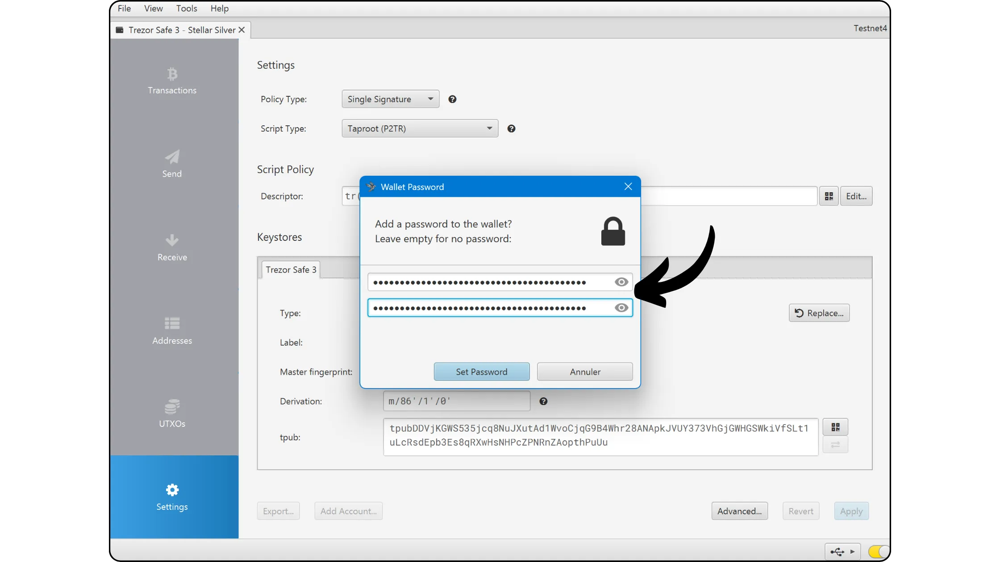

අද වන විට ඔබේ පෝර්ට්ෆෝලියෝව Sparrow Wallet වෙත ආයාත කර ඇත!

ඔබගේ Wallet හි පළමු බිට්කොයින් ලබා ගැනීමට පෙර, **මම ඔබට හිස් ප්‍රතිසාධන පරීක්ෂණයක් සිදු කිරීමට දැඩිව උපදෙස් දෙමි**. ඔබේ xpub වැනි යමක් යොමු තොරතුරු ලෙස ලියන්න, එවිට Wallet තවම හිස්ව ඇති අතර ඔබේ Trezor Safe 5 යළි සකසන්න. එවිට ඔබේ Wallet Trezor මත ඔබේ කඩදාසි ආපසු ගත කිරීම් භාවිතයෙන් යළි පිහිටුවන්න උත්සාහ කරන්න. යළි පිහිටුවීමෙන් පසු ජනනය කරන ලද xpub ඔබ මුලින්ම ලියා තිබූ එකට ගැලපේදැයි පරීක්ෂා කරන්න. එසේ නම්, ඔබේ කඩදාසි ආපසු ගත කිරීම් විශ්වාසදායක බවට ඔබට විශ්වාස කළ හැක.

Za več informacij o tem, kako izvesti test obnovitve, vam priporočam, da si ogledate ta drugi vodič:

https://planb.network/tutorials/wallet/backup/recovery-test-5a75db51-a6a1-4338-a02a-164a8d91b895

## Kako lahko prejmem bitcoine z Trezor Safe 5?

Sparrow මත, "*Receive*" ටැබය ක්ලික් කරන්න.

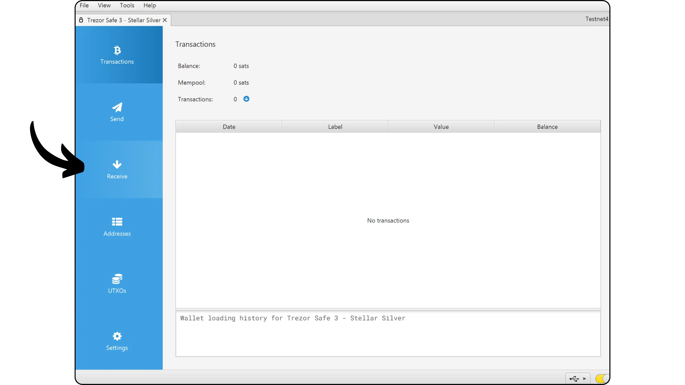

Prej ko uporabite Address, ki ga predlaga Sparrow Wallet, ga preverite na zaslonu vašega Trezorja. Ta praksa vam omogoča, da potrdite, da Address, prikazan na Sparrow, ni prevarantski, in da Hardware Wallet dejansko vsebuje zasebni ključ, potreben za kasnejše trošenje bitcoinov, zavarovanih s tem Address. To vam pomaga izogniti se več vrstam napadov.

මෙම පරීක්ෂාව සිදු කිරීමට, "*Display Address*" බොත්තම මත ක්ලික් කරන්න.

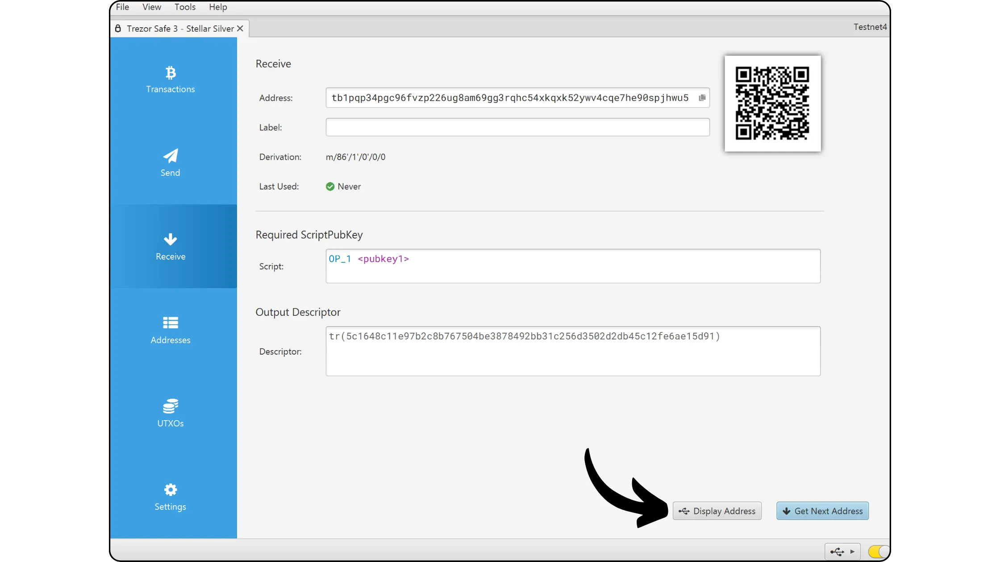

Preverite, ali se Address, prikazan na vašem Trezorju, ujema s tistim na Sparrow Wallet. Priporočljivo je tudi, da to preverjanje izvedete tik preden sporočite svoj Address pošiljatelju, da se prepričate o njegovi veljavnosti. Za potrditev lahko pritisnete zaslon.

Nato lahko dodate "*Oznako*" za opis vira bitcoinov, ki bodo zavarovani s tem Address. To je dobra praksa, ki vam omogoča boljše upravljanje vaših UTXO-jev.

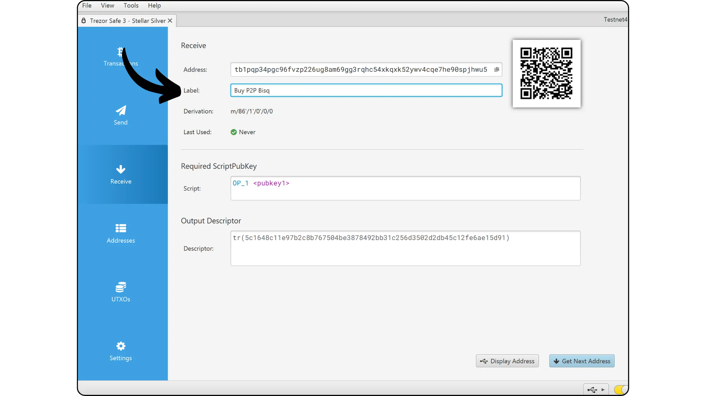

Nato lahko uporabite ta Address za prejemanje bitcoinov.

## Kako pošljem bitcoine z Trezor Safe 5?

දැන් ඔබේ පළමු Satss ඔබේ Safe 5-secured Wallet මත ලැබී ඇති බැවින්, ඔබට ඒවා වියදම් කළ හැක! ඔබේ Trezor පරිගණකයට සම්බන්ධ කර, එය PIN කේතය සමඟ අගුළු අරින්න, Sparrow Wallet ආරම්භ කරන්න, එවිට නව ගනුදෙනුවක් ගොඩනැගීමට "*Send*" ටැබය වෙත යන්න.

ඔබ *Coin Control* කිරීමට, එනම් ගනුදෙනුවේ පරිභෝජනය කිරීමට UTXOs විශේෂිතව තෝරා ගැනීමට කැමති නම්, "*UTXOs*" ටැබය වෙත යන්න. ඔබ පරිභෝජනය කිරීමට කැමති UTXOs තෝරන්න, එවිට "*Send Selected*" මත ක්ලික් කරන්න. ඔබ "*Send*" ටැබයේ එකම තිරයට යළි යොමු කෙරෙන අතර, ඔබේ ගනුදෙනුව සඳහා UTXOs දැනටමත් තෝරාගෙන ඇත.

ගමනාන්තය Address ඇතුළත් කරන්න. "*+ Add*" බොත්තම ක්ලික් කිරීමෙන් ඔබට බහු ලිපින ඇතුළත් කළ හැක.

"*"ලේබලය*" ලියන්න මෙම වියදමේ අරමුණ මතක තබා ගැනීමට.

මෙම Address වෙත යැවීමට ඇති මුදල තෝරන්න.

ඔබේ ගනුදෙනුවේ ගාස්තු අනුපාතය වත්මන් වෙළඳපොළට අනුව සකසන්න. උදාහරණයක් ලෙස, සුදුසු ගාස්තු අනුපාතයක් තෝරා ගැනීමට [Mempool.space](https://Mempool.space/) භාවිතා කළ හැක.

සියලුම ඔබේ ගනුදෙනු පරාමිතීන් නිවැරදි බව සහතික කර, එවිට "*ගනුදෙනුව සෑදීම*" මත ක්ලික් කරන්න.

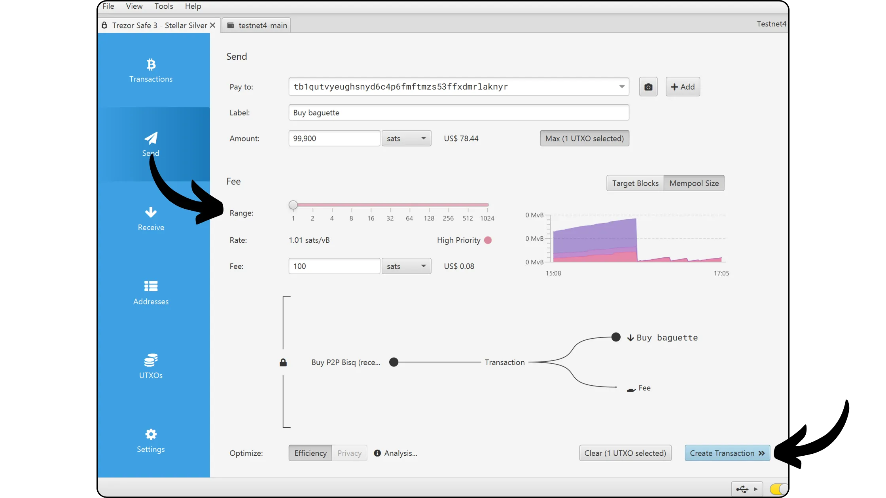

ඔබේ සියලු අවශ්‍යතා සපුරාලේ නම්, "*අත්සන් කිරීම සඳහා ගනුදෙනුව අවසන් කරන්න*" මත ක්ලික් කරන්න.

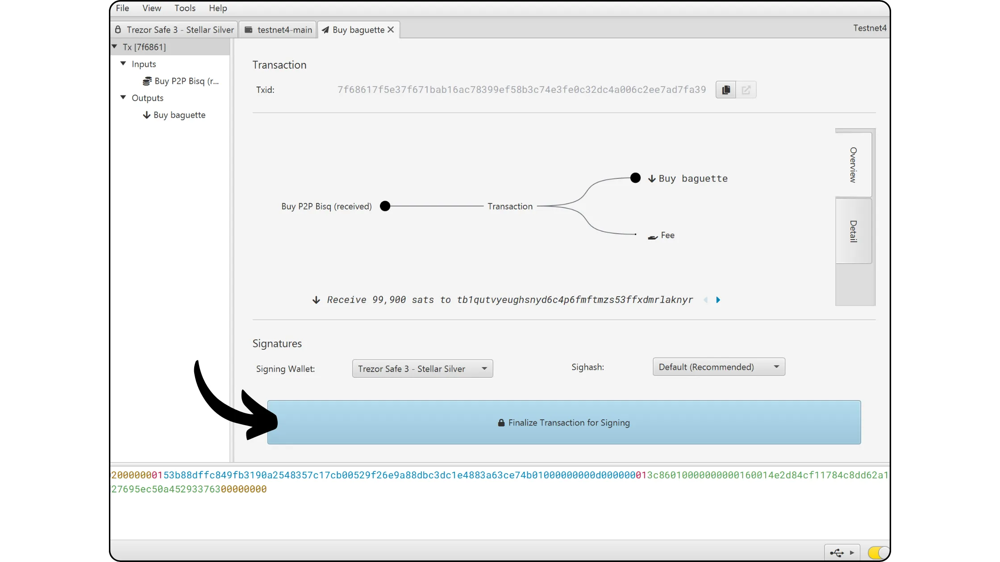

"*"Sign*" මත ක්ලික් කරන්න.

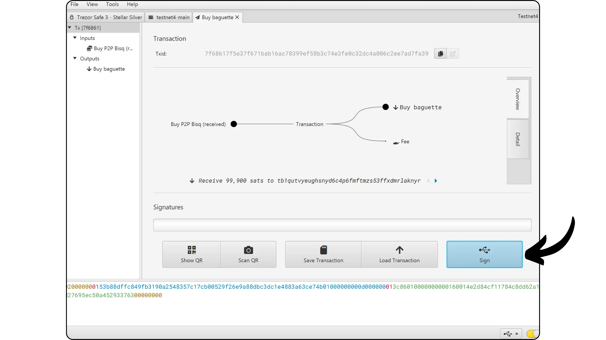

කොටුව "*Sign*" ඔබගේ Trezor Safe 5 අසල ක්ලික් කරන්න.

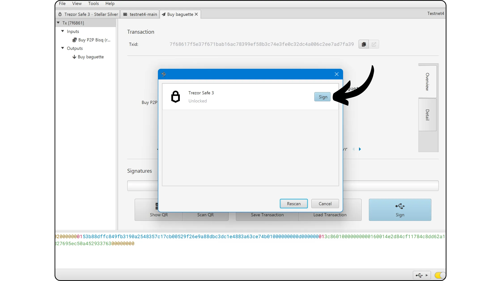

Hardware Wallet තිරයෙහි ගනුදෙනු පරාමිතීන් පරීක්ෂා කරන්න, ලැබුම්කරුගේ ලැබීමේ Address, යවන ලද මුදල සහ ගාස්තුව ඇතුළුව. ගනුදෙනුව Trezor මත සත්‍යාපනය කළ පසු, එය අත්සන් කිරීමට තිරය මත ඔබාගෙන සිටින්න.

ඔබේ ගනුදෙනුව දැන් අත්සන් කර ඇත. සියල්ල හොඳින් ඇති බව අවසන් වරට පරීක්ෂා කර, එවිට "*Broadcast Transaction*" මත ක්ලික් කර Bitcoin ජාලය මත එය විකාශය කරන්න.

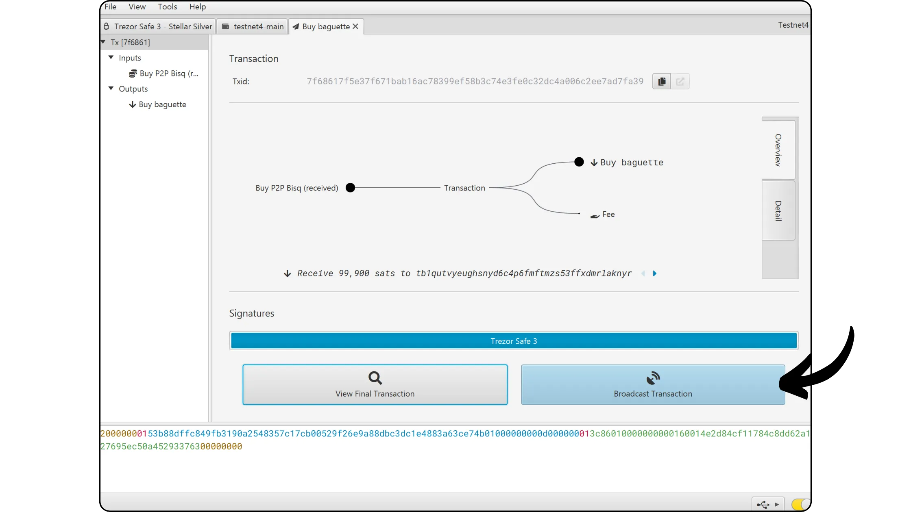

ඔබට එය Sparrow Wallet හි "*Transactions*" ටැබ් එකේ සොයා ගත හැක.

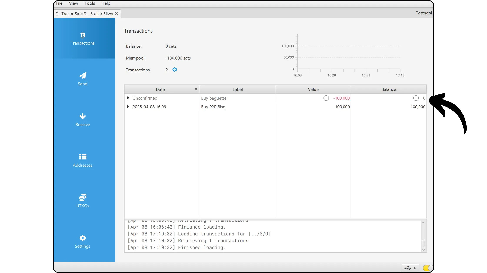

චෙරිත, ඔබ දැන් Sparrow Wallet සමඟ Trezor Safe 5 මූලික භාවිතය පිළිබඳව යාවත්කාලීන වී ඇත! තවත් පියවරක් ඉදිරියට යාම සඳහා, ඔබේ ආරක්ෂාව වැඩි දියුණු කිරීම සඳහා passphrase BIP39 සමඟ Trezor Hardware Wallet භාවිතය පිළිබඳ මෙම සම්පූර්ණ උපකාරකය මම නිර්දේශ කරමි:

https://planb.network/tutorials/wallet/backup/trezor-passphrase-0474b5bf-496f-4f97-aefe-445368fdca42

ඔබට මෙම උපකාරිකාව ප්‍රයෝජනවත් වූවා නම්, Green අඟුලක් පහළින් දමා යන ලෙස මම කෘතඥ වෙමි. මෙම ලිපිය ඔබේ සමාජ ජාලවල බෙදා ගැනීමට නිදහස් වන්න. බොහෝම ස්තූතියි!