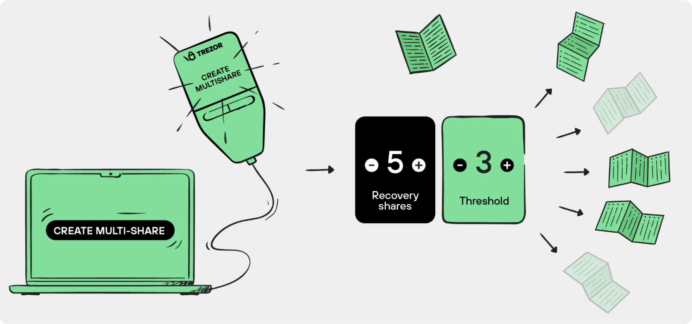
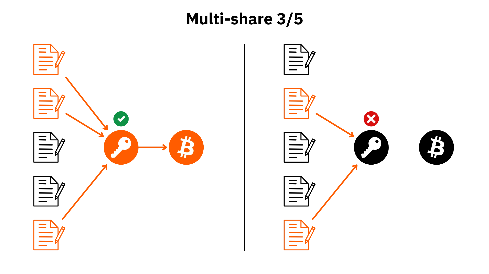
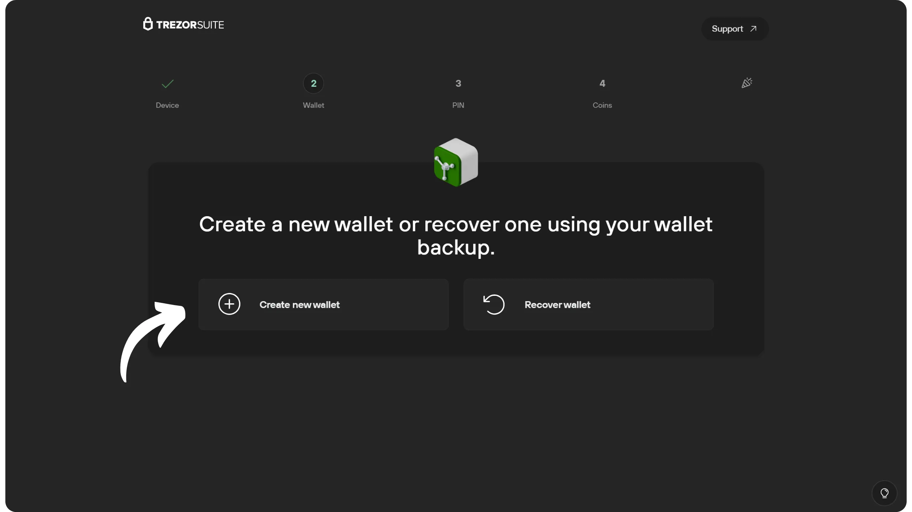
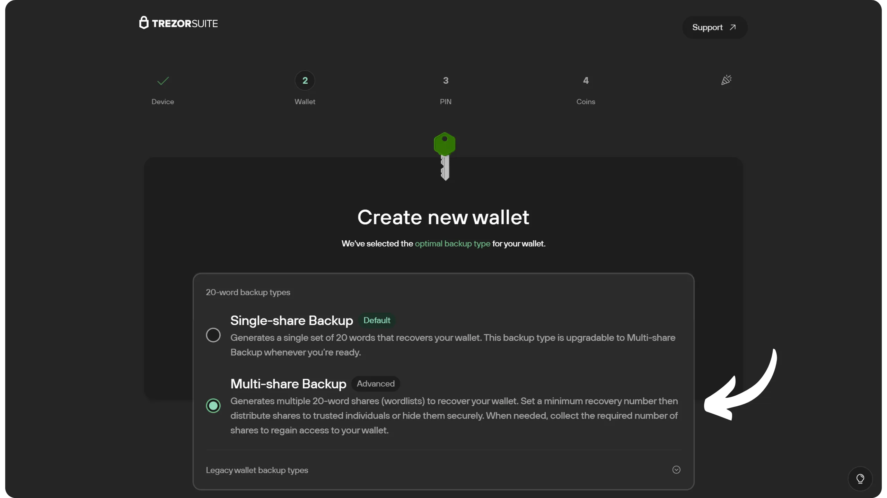
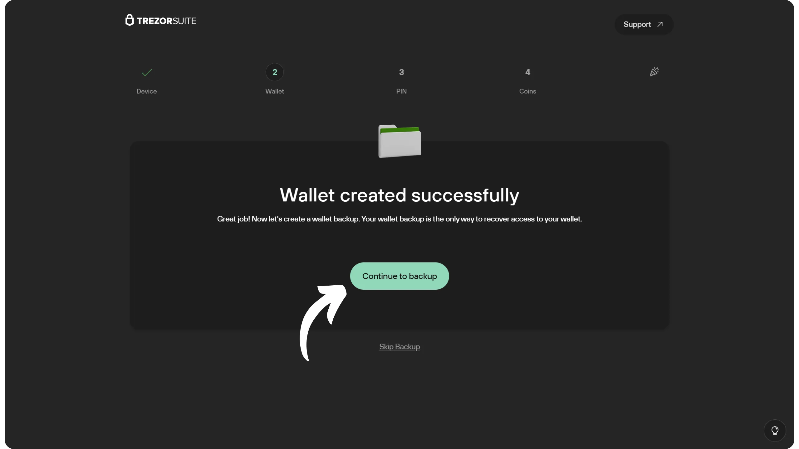
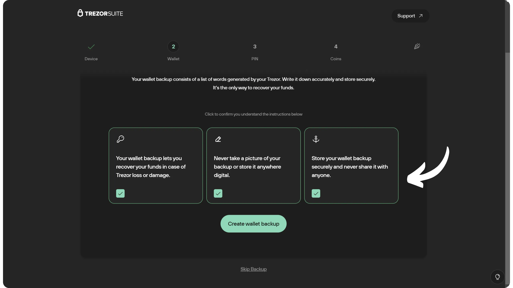
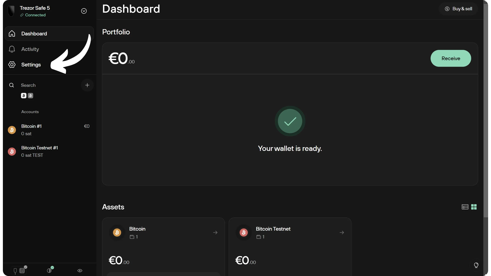
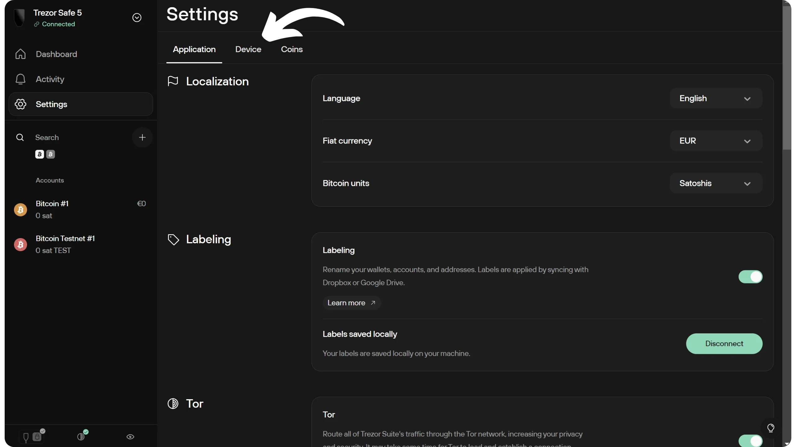
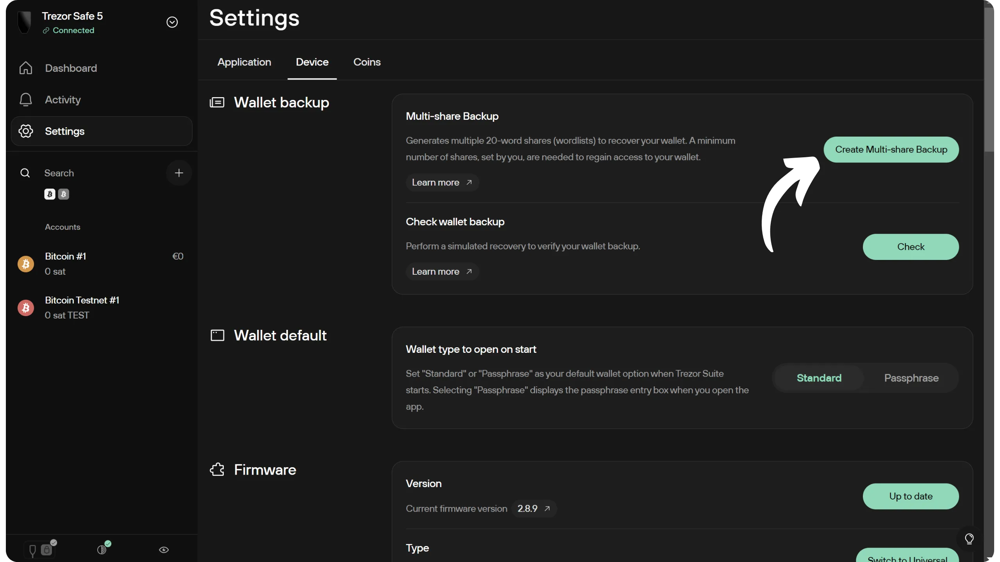
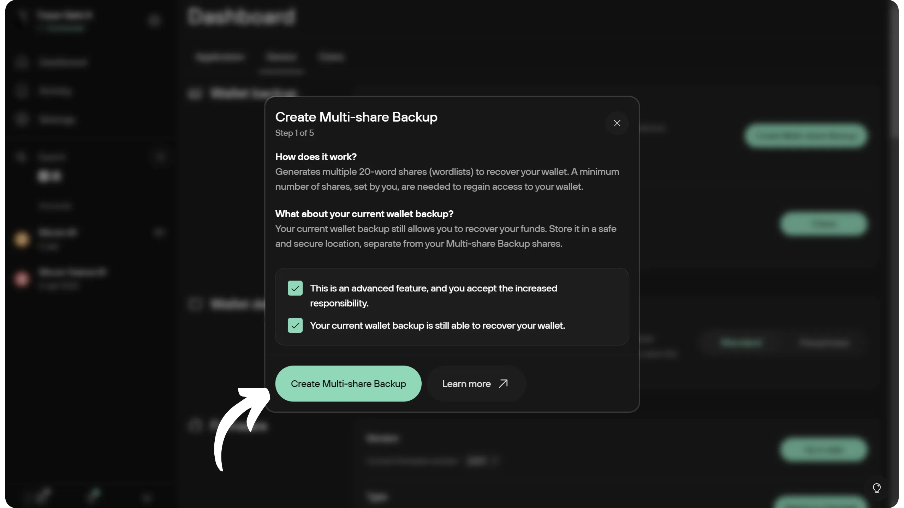

*Slika: [Trezor.io](https://trezor.io/)*

## Trezor හි නව උපස්ථ විකල්ප

2023 සිට, Trezor විසින් ***Single-share Backup*** නම් නව මූලාකෘතියක් ලබා දී ඇති අතර, බොහෝ පෝර්ට්ෆෝලියෝවල ඇති සම්භාව්‍ය BIP39-මූලික ආකෘතිය පියවරෙන් පියවර ප්‍රතිස්ථාපනය කරයි. සම්භාව්‍ය 12- හෝ 24-වචන Mnemonic වාක්‍යවලට වඩා, මෙම නව ආකෘතිය SatoshiLabs විසින් සංවර්ධනය කරන ලද සම්මතයකින් නිර්මාණය කරන ලද තනි 20-වචන වාක්‍යයක් මත පදනම්ව ඇත: **SLIP39**. අරමුණ වන්නේ මූලාකෘති ශක්තිමත්කම සහ කියවිය හැකි බව වැඩි දියුණු කිරීම, විහිදුනු මූලාකෘති ආකෘතියකට මෘදු මාරුවීම සක්‍රීය කිරීමයි.

මෙම බෙදා හැරීමේ ආකෘතිය ***බහු-බෙදා හැරීමේ උපස්ථිතිය*** ලෙස හැඳින්වේ. එය එකම මූලධර්මය මත පදනම්ව ඇති අතර, තනි Mnemonic වාක්‍යයක් ජනනය කිරීම වෙනුවට, එය ***බෙදා හැරීම්*** ලෙස හැඳින්වෙන කීපයක් වූ කැබලිවලට බෙදයි, ඒවා එක් එක්ව Mnemonic වාක්‍යයක් වේ. පෝර්ට්ෆෝලියෝ නැවත ලබා ගැනීමට, මෙම *බෙදා හැරීම්* (සංජානනයක් මගින් නිර්වචනය කරන ලද *සීමාවක්* මගින්) යළි එක්රැස් කළ යුතුය. උදාහරණයක් ලෙස, 3-අව-5 යෝජනාවක, 5 න් 3 *බෙදා හැරීම්* කිසිවක් පෝර්ට්ෆෝලියෝ නැවත ලබා දේ. කරුණාකර සලකන්න Trezor හි බෙදා හැරීම් උපස්ථිතිය Multisig පසුම්බි වලට වෙනස් වේ. ඔබේ බිට්කොයින් වියදම් කිරීමට, ඔබේ Hardware Wallet Trezor පමණක් අවශ්‍ය වේ. එකම අත්සනක් අවශ්‍ය වේ. බෙදා හැරීම Mnemonic වාක්‍යය මට්ටමේ පමණක් අදාළ වේ, එනම් උපස්ථිතිය.

මෙම පද්ධතිය Mnemonic වාක්‍යයේ තනි අසාර්ථකතා ලක්ෂණය විසඳයි, Multisig හෝ passphrase BIP39 කළමනාකරණය කිරීම සම්බන්ධ අවාසියන් විය හැකි අඩුපාඩු නොමැතිව. ප්‍රතිසාධන ක්‍රියාවලිය තනි තොරතුරක් මත පදනම්ව නොව, කීපයක් මත පදනම්ව ඇති අතර, සන්ධිස්ථානයට ස්තූතියි, අහිමිවීමේ ඉවසීමේ අමතර වාසියක් ඇත.

*Single-share Backup* සමඟ පෝර්ට්ෆෝලියෝ එකක් සාදන ලද පරිශීලකයින්ට තම පෝර්ට්ෆෝලියෝ මාරු කිරීමට අවශ්‍ය නොවී *Multi-share Backup* වෙත ඕනෑම වේලාවක මාරු විය හැක. ලැබීමේ ලිපින සහ ගිණුම් සමානව පවතී. *Multi-share* පද්ධතිය බලපාන්නේ පසුබැසීමේ පමණක් වන අතර, පෝර්ට්ෆෝලියෝවෙහි අනෙකුත් කොටස් වෙනස් නොවේ.

Multi-share Backup* Trezor Model T, Safe 3 සහ Safe 5 මත ලබා ගත හැක. මෙම විශේෂාංගය Trezor Model One මගින් සහය නොදක්වයි.

**වැදගත් සටහන:** Trezor හි *බහු-හවුල්කාර* පද්ධතිය ක්‍රිප්ටෝග්‍රැෆික් ආරක්ෂිත වේ, එය බෙදා හැරීම සඳහා *Shamir's Secret Sharing* යෝජනා ක්‍රමය භාවිතා කරන බැවින්. සාම්ප්‍රදායික Mnemonic වාක්‍යයක් ඔබම බෙදා හරින මඟින් සමාන පද්ධතියක් අතින් යෙදවීමෙන් වළකින්නැයි අපි දැඩිව උපදෙස් දෙන අතර, එය ඔබේ බිට්කොයින් සොරකම් කිරීමේ හා අහිමි වීමේ අවදානම දැඩිව වැඩි කරන නරක පුරුද්දකි, එබැවින් එය කරන්න එපා. සාම්ප්‍රදායික Mnemonic වාක්‍යයක් සම්පූර්ණයෙන්ම ගබඩා කර ඇත.

## Shamir's Secret Sharing in SLIP39

Trezor上的*Multi-share*备份所依据的加密机制是*Shamir's Secret Sharing Scheme* (SSSS)。其原理如下：秘密信息（在本例中为投资组合的seed）被转换为一个数学多项式。然后计算出该多项式的若干点，每个点成为一个份额。通过多项式插值，收集最少数量的点（阈值），即可重建原始秘密。

සංඛ්‍යාතය පසුබැසීමේ සීමාවට වඩා අඩු කොටස් ගණනකින් රහස් තොරතුරු කිසිදු විධියකින් හඳුනාගත නොහැකි වන අතර, එමඟින් රහස් තොරතුරු සම්පූර්ණ සෞඛ්‍ය ආරක්ෂාව සහතික කරයි. වෙනත් වචන වලින් කියනවා නම්, සීමාවට නොපැමිණෙන විට, සීමාවක් නොමැති ගණනය කිරීමේ ශක්තියක් ඇති ප්‍රහාරකයෙක් වුවද seed අනාවරණය කළ නොහැක.

SLIP39 මෙම යෝජනාව භාවිතා කර seed පෝර්ට්ෆෝලියෝ බෙදා හරියි. එක් කොටසක් වචන 20ක වාක්‍යයක් වන අතර, එය වචන 1024ක ලැයිස්තුවකින් නිර්මාණය කර ඇත (BIP39 ලැයිස්තුවෙන් වෙනස්).

## Trezor මත බහු-හවුල්කාර මෙන්ම ආපසු-ගත කිරීමක් පිහිටුවීම

ඔබේ පෝර්ට්ෆෝලියෝ Trezor මත නිර්මාණය කිරීමේදී, ඔබට විවිධ විකල්ප තුනක් ඇත:

- Uporabite klasično BIP39 Mnemonic frazo s 12 ali 24 besedami;
- Mnemonic වචන (SLIP39) භාවිතා කරන්න;
- බහු-හවුල් (SLIP39) හි බහු Mnemonic වාක්‍ය සකසන්න.

Če se odločite za enojni delež SLIP39 Mnemonic frazo, boste lahko kasneje nadgradili na večdelni delež, ne da bi morali ponastaviti portfelj. Po drugi strani, če začnete s klasičnim BIP39 portfeljem (12- ali 24-besedna fraza), ga ne boste mogli neposredno pretvoriti v večdelni delež. Morali boste ustvariti nov večdelni portfelj iz nič in prenesti svoja sredstva iz starega portfelja v novega prek ene ali več Bitcoin transakcij. To je bolj zapletena in draga operacija. Če želite izvesti to migracijo, vam priporočam, da kupite nov Hardware Wallet Trezor, da se izognete vnosu svojega seed v programsko opremo portfelja.

මෙම උපදෙස් මාලාවේදී, පළමුව, පෝර්ට්ෆෝලියෝවක් නිර්මාණය කරන විට බහු-හවුල්කාරකයක් සකස් කරන ආකාරය බලන්නෙමු, එවිට, පසුගිය කොටසකදී, පවතින පෝර්ට්ෆෝලියෝවක තනි-හවුල්කාරකය බහු-හවුල්කාරකයකට පරිවර්තනය කරන ආකාරය බලන්නෙමු.

ඔබේ උපාංගයේ ආරම්භක පිහිටුවීම සඳහා ඔබට උදව් අවශ්‍ය නම්, අපට සෑම Trezor ආකෘතියක් සඳහාම විස්තරාත්මක උපකාරක පඬියක් ඇත:

https://planb.network/tutorials/wallet/hardware/trezor-safe-5-4413308a-a1b5-4ba4-bc49-72ae661cc4e0

https://planb.network/tutorials/wallet/hardware/trezor-safe-3-51d0d669-5d23-47c2-beb6-cc6fa0fb0ea0

https://planb.network/tutorials/wallet/hardware/trezor-model-one-5c250c49-ce3b-4c63-bd05-4600d7c11a02

### නව පෝර්ට්ෆෝලියෝවක් පිළිබඳව

ඔබ දැන් ඔබේ Trezor හි ආරම්භක වින්‍යාසය සම්පූර්ණ කර ඇති අතර පෝර්ට්ෆෝලියෝ නිර්මාණය කිරීමට සූදානම්. Trezor Suite හි, "*Create new Wallet*" බොත්තම මත ක්ලික් කරන්න.

"*බහු-හුවමාරු උපස්ථ*" විකල්පය තෝරන්න, එවිට "*Wallet නිර්මාණය කරන්න*" මත ක්ලික් කරන්න.

ඔබේ Trezor හි භාවිත නියමයන් පිළිගන්න සහ පෝර්ට්ෆෝලියෝ නිර්මාණය තහවුරු කරන්න.

Trezor Suite හි, "*ආපසු සුරැකුමට දිගටම යන්න*" ක්ලික් කරන්න.

උපදෙස් සොයාබැලීම, ඒවා තහවුරු කිරීම, පසුව "*Wallet ආපසුගැන්වීම නිර්මාණය කරන්න*" මත ක්ලික් කිරීම.

Mnemonic වාක්‍යයන් සුරැකීම සහ කළමනාකරණය කිරීමේ නිවැරදි ක්‍රමය පිළිබඳව වැඩි විස්තර සඳහා, විශේෂයෙන් ඔබ ආරම්භකයෙකු නම්, මෙම වෙනත් උපකාරකය අනුගමනය කිරීම මම ඉතාමත් නිර්දේශ කරමි:

https://planb.network/tutorials/wallet/backup/backup-mnemonic-22c0ddfa-fb9f-4e3a-96f9-46e2a7954270

Trezor මත, ඔබ වින්‍යාස කිරීමට කැමති මුළු කොටස් ගණන තෝරන්න. සාමාන්‍යයෙන් භාවිතා වන වින්‍යාසයන් 2-de-3 සහ 3-de-5 වේ. මෙම උදාහරණය සඳහා, මම 2-de-3 එකක් නිර්මාණය කරන බැවින්, මම කොටස් 3ක් තෝරන්නෙමි. එක් එක් කොටසක් 20-වචන Mnemonic වාක්‍යයක් නියෝජනය කරනු ඇත.

*Safe 5 භාවිතා කරන්නන් සඳහා, තිරය "*ඉදිරියට යාමට තට්ටු කරන්න*" කියන නමුත්, ඔබට සත්‍යාපනය කිරීමට ඉහළට ස්වයිප් කළ යුතුය.

Nato potrdite prag, tj. število delnic, potrebnih za ponovno pridobitev dostopa do Wallet in bitcoinov, ki jih vsebuje.

Trezor ඔබේ විවිධ කොටස් (Mnemonic වාක්‍ය) එහි අහඹු සංඛ්‍යා නිර්මාණකරු භාවිතයෙන් නිර්මාණය කරනු ඇත. මෙම මෙහෙයුම අතරතුර ඔබව නිරීක්ෂණය නොකරන බවට වග බලා ගන්න. තිරයේ පෙන්වනු ලබන වචන ඔබේ කැමැත්ත පරිදි භෞතික මාධ්‍යයක ලියන්න. වචන අංකනය කර, අනුක්‍රමික අනුපිළිවෙලින් තබා ගැනීම වැදගත් වේ.

මම ඔබට නිර්දේශ කරන්නේ සෑම කොටසක්ම වෙනම මාධ්‍යයක සටහන් කර, ඒවා එකම ස්ථානයක ප්‍රවේශ විය හැකි නොවන ලෙස සූක්ෂමව කළමනාකරණය කරන ලෙසයි. උදාහරණයක් ලෙස, මගේ 2-අතුරින්-3 වින්‍යාසයක් සඳහා, එක් විකල්පයක් වන්නේ එක් කොටසක් මගේ නිවසේ තබා ගැනීම, තවත් එකක් විශ්වාසනීය මිතුරෙකු සමඟ තබා ගැනීම, සහ අවසන් එක බැංකු ආරක්ෂකයක තබා ගැනීමයි. ගබඩා ස්ථාන තෝරා ගැනීම ඔබේ පුද්ගලික ආරක්ෂක යෝජනාව මත රඳා පවතී.

ඔබ දැනට බලමින් සිටින කොටස ඔබට තිරයේ ඉහළින් දැකිය හැක.

seveda, teh besed nikoli ne smete deliti na internetu, kot to počnem v tem priročniku. Ta primer Wallet bo uporabljen samo na Testnet in bo izbrisan ob koncu priročnika.**_

ඊළඟ වචන වෙත ගමන් කිරීමට, තිරයේ පහළ කොටස මත ක්ලික් කරන්න. ඔබට පසුපසට යාමට පහළට සෙලවිය හැක. සියලු වචන ලියා අවසන් වූ විට, ඊළඟ කොටස වෙත ගමන් කිරීමට තිරය මත ඔබේ ඇඟිල්ල තබාගෙන, මෙහෙයුම නැවත කරන්න.

प्रत्येक शेयर रेकॉर्डिंगको अन्त्यमा, तपाईंलाई Mnemonic वाक्यांशमा रहेका शब्दहरू चयन गर्न भनिनेछ ताकि तपाईंले तिनीहरूलाई सही रूपमा लेख्नुभएको छ भनेर पुष्टि गर्न सक्नुहोस्।

ඒකයි, ඔබේ පෝර්ට්ෆෝලියෝ Multi-share විකල්පය භාවිතා කරමින් සාර්ථකව ආපසු ගබඩා කර ඇත. දැන් ඔබට වින්‍යාස උපදෙස් වල ඉතිරි කොටස සමඟ දිගටම යා හැක.

### මතක ඇති එක් කොටස් පෝර්ට්ෆෝලියෝවක් පිළිබඳව

ඔබට දැනටමත් තනි-හවුල් පිටපත් (SLIP39 Mnemonic වාක්‍යයක්, සම්භාව්‍ය BIP39 වාක්‍යය නොව) සහිත Trezor Wallet එකක් තිබේ නම්, ඔබේ Wallet පිටපත් ලබාගැනීමේ හැකියාව සහ ආරක්ෂාව වැඩි දියුණු කිරීමට කැමති නම්, ඔබේ බිට්කොයින් මාරු නොකරම, බහු-හවුල් පද්ධතියක් පිහිටුවිය හැක.

මෙය කිරීමට, ඔබේ Hardware Wallet සම්බන්ධ කර අගුළු හරිනු ඇත. Trezor Suite හි, සැකසුම් වෙත යන්න.

යන්න "*Device*" ටැබ් වෙත.

ඉන්පසු "*බහු-හුවමාරු උපස්ථිතිය නිර්මාණය කරන්න*" මත ක්ලික් කරන්න.

උපදෙස් කියවන්න, එවිට "*බහු-හුවමාරු උපස්ථිතිය සෑදීම*" මත ක්ලික් කරන්න.

ඔබට පසුව ඔබේ වර්තමාන Mnemonic වාක්‍යය (තනි-හවුල) ඔබේ Trezor තිරය මත ඇතුළත් කිරීමට අවශ්‍ය වේ. වචන ගණන තෝරන්න (පෙරනිමි වශයෙන් 20).

පසුව Trezor හි තිරය මත ඇති යතුරුපුවරුව භාවිතා කර ඔබේ වර්තමාන Mnemonic වාක්‍යයේ සෑම වචනයක්ම ඇතුළත් කරන්න.

ඔබට පසුගිය කොටසෙහි සපයන ලද උපදෙස් අනුගමනය කිරීමෙන් ඔබේ බහු-හුවමාරු උපස්ථයෙහි වින්‍යාසය තෝරා ගත හැක.

ඔබේ බහු-හුවමාරු උපස්ථය නිර්මාණය කළ පසු, ඔබේ මුල් තනි-හුවමාරු Mnemonic වාක්‍යය සමඟ කුමක් කළ යුතුදැයි තීරණය කළ යුතුය. Bitcoin පෝර්ට්ෆෝලියෝව එසේම පවතින බැවින්, මෙම තනි වාක්‍යය එයට ප්‍රවේශය සෑම විටම ලබා දේ. මෙය ඔබේ ආරක්ෂක උපාය මාර්ගය මත රඳා පවතින නමුත් සාමාන්‍යයෙන්, මෙම තනි අසාර්ථකතාවය ඉවත් කිරීම සඳහා මෙම වාක්‍යය විනාශ කිරීම සුදුසුය, එය බහු-හුවමාරු උපස්ථයේ නිවැරදි අරමුණයි. එය විනාශ කිරීමට තීරණය කළහොත්, **එය තවමත් ඔබේ බිට්කොයින්වලට ප්‍රවේශය ලබා දෙන බැවින්**, එය ආරක්ෂිතව කරන බවට වග බලා ගන්න.

සුභ පැතුම්, ඔබ දැන් Trezor දෘඩාංග පසුම්බිවල Single-share සහ Multi-share උපස්ථ භාවිතය පිළිබඳව දැනුවත් වී ඇත. ඔබේ Wallet ආරක්ෂාව තවත් පියවරක් ඉදිරියට ගෙන යාමට කැමති නම්, BIP39 මුරපද පිළිබඳ මෙම උපකාරකය බලන්න:

https://planb.network/tutorials/wallet/backup/passphrase-a26a0220-806c-44b4-af14-bafdeb1adce7

ඔබට මෙම උපකාරිකාව ප්‍රයෝජනවත් වූවා නම්, Green අඟුලක් පහළින් දමා යන ලෙස මම කෘතඥ වෙමි. මෙම ලිපිය ඔබේ සමාජ ජාලවල බෙදා ගැනීමට නිදහස් වන්න. බොහෝම ස්තූතියි!

## අමතර සම්පත්

- [SLIP-0039: Shamir's Secret-Sharing for Mnemonic Codes](https://github.com/satoshilabs/slips/blob/master/slip-0039.md);
- [Multi-share Backup on Trezor](https://trezor.io/learn/a/multi-share-backup-on-trezor);
- [Wikipedia: Shamirjeva delitev skrivnosti](https://sl.wikipedia.org/wiki/Shamirjeva_delitev_skrivnosti).