_මෙම උපකාරකය ලියා ඇතිවේ_ [Bitcoin Campus](https://linktr.ee/bitcoincampus_)  විසිනි

## Satoshi का Wallet डाउनलोड करना, सेट अप करना, और उपयोग करना

Wallet of Satoshi is a Lightning Network Wallet, custodial, and very simple to use.

පාඨමාලාවේ අරමුණු සඳහා [BTC105 - Finding Now](https://planb.network/it/courses/trovarsi-ora-d1370810-63f6-4aba-b822-e3a66bf225a5), එය Redeem Lightning Network වවුචර් භාවිතා කරයි.

**සමහරවිට මතක තබා ගන්න**: _ඔබේ යතුරු නොමැතිනම්, ඔබේ කාසි නොමැත_

කස්ටෝඩියල් වොලට් භාවිතා කරන්නන්ට ඔවුන්ගේ මුදල් පිළිබඳ සම්පූර්ණ පාලනයක් ලබා නොදේ. සාමාන්‍යයෙන්, ඒවා ආරම්භකයින් සඳහා හැර වෙනත් අවස්ථාවලදී නිර්දේශ නොකෙරේ. WoS යෙදුම Wallet ලෙස හෝ කුඩා මුදල් තබා ගැනීම සඳහා මාරුකිරීමේ අරමුණින් භාවිතා කළ යුතු අතර, දිගුකාලීන මුදල් සංග්‍රහය සඳහා නොවේ.

---

Wallet of Satoshi (WoS) යනු රැකවරණ නිෂ්පාදනයක් වන අතර, එය විශේෂිත කීර්තියක් ලබාගෙන ඇත. අපට, උදාහරණයක් ලෙස, අපගේ දියරතාවය ලබා ගැනීමේ හැකියාව වැඩි කිරීමට WoS වැනි මෙවලමක් සාධාරණවම භාවිතා කළ හැක. අප වෙනුවෙන් නාලිකා වල දියරතාවය කළමනාකරණය කිරීමේ "අපවිත්‍ර කාර්යය" තාවකාලිකව WoS වෙත පවරා දෙනු ලැබේ. නියමිත ප්‍රමාණයක් ළඟා වූ විට, අපගේ අරක්ෂිත නොවන Wallet වෙත WoS On-Chain හි දියරතාවය හිස් කරනු ලැබේ.

**අවවාදය⚠️: ඉදිරියට යාමට පෙර උපකාරකය සම්පූර්ණයෙන් කියවීම නිර්දේශිතය**

### Wallet of Satoshi ඩවුන්ලෝඩ් කිරීම

යන්න Play Store වෙත සහ WoS බාගන්න

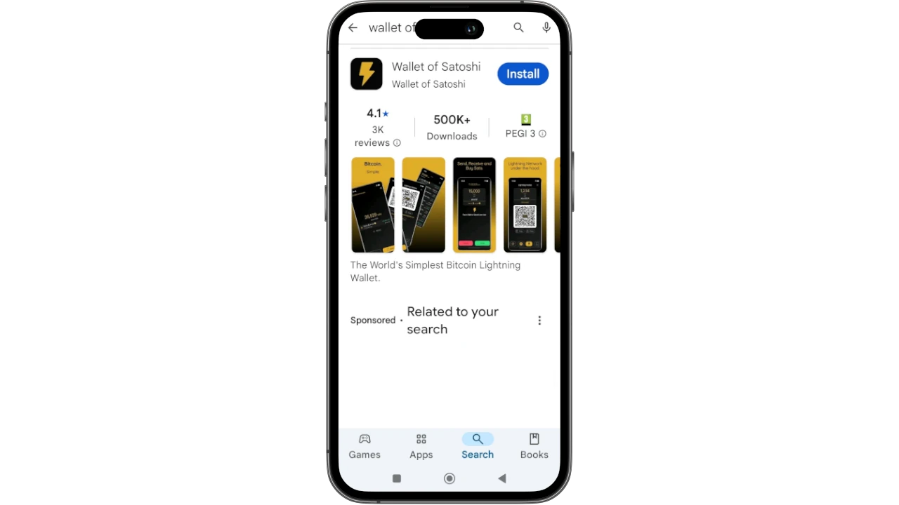

**සටහන:** WoS නිල ගබඩා වලින් පමණක් බාගත කරයි. උපාංගයේ මෙහෙයුම් පද්ධතිය වැඩසටහන් කර ඇති නම්, WoS විවෘත කිරීමට පෙර මෙහෙයුම් පද්ධතිය විසින්ම සත්‍යාපන කොටසක් ඇත. සත්‍යාපන අදියරෙන් පසු, _විවෘත කරන්න_ තෝරන්න.

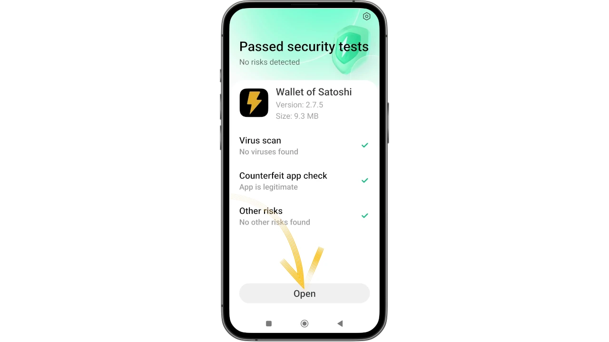

Wallet of Satoshi opens with the following screen, and it is necessary to click on _Start_

### WoS සඳහා ගිණුමක් ලියාපදිංචි කිරීම

මෙම අවස්ථාවේදී, Wallet දැනටම ක්‍රියාත්මක වේ, නමුත් වැඩි ආරක්ෂාව සඳහා, අපි ලොගින් එකක් පිහිටුවීමට කටයුතු කරමු: උපාංගය ක්‍රියාකාරී නොවීම හෝ අහිමි වීමේදී මුදල් නැවත ලබා ගැනීමට එය අවශ්‍ය වේ. එබැවින්, ඉහළ වමෙන් මෙනුව තෝරන්න.

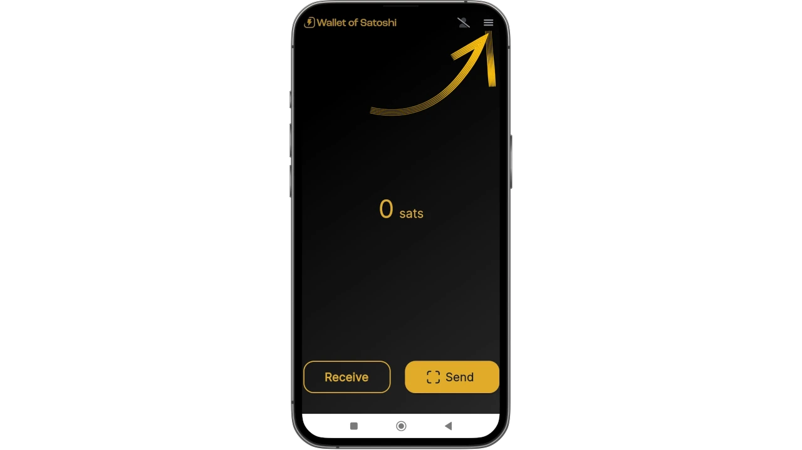

සමස්ත මෙනු කවුළුව විවෘත වේ, එහි ඔබ අනිවාර්යයෙන්ම මුදල් ඒකකය (Wallet හෝ Satoshi මූලිකව ඇමරිකානු ඩොලරය යොදාගෙන ඇත) සහ තේමාවේ වර්ණය (ආලෝක/අඳුරු) රුචියට අනුව සකසිය යුතුය. අනෙක් විධාන භාවිතා නොකරන්න.

WoS एक संरक्षक उपकरण भएकोले, हामी Wallet लाई Mnemonic वाक्यांशको साथ ब्याकअप गर्न सक्दैनौं, तर हामीले _Login/Register_ मा क्लिक गरेर, मोबाइल उपकरणको हराएको वा प्रयोग नगरिएको अवस्थामा, हाम्रो कोष पुन: प्राप्त गर्न WoS लाई सक्षम बनाउन सक्छौं।

වින්ඩෝවක් පෙනී යන අතර අපට Address විද්‍යුත් තැපෑලක් ඇතුළත් කරන ලෙස ඉල්ලා සිටී. එය **ප්‍රොටොන් තැපෑලක්** (ආදර්ශනය කරන ලද්දක්) විය හැක, නමුත් එය කාර්ය සාධනයක් විය යුතුය, මන්ද එය ජංගම දුරකථනය අහිමි වීම/සොරකම් වීම හෝ හානියට පත් වීමේදී Wallet හි මුදල් ප්‍රතිසාධනය කිරීමට අපට ඉඩ සලසයි.

Wallet of Satoshi has sent a message to the indicated email inbox.

පැමිණි පත්‍ර පෙට්ටිය තුළ, අපට වචන දෙකක් සොයා ගත හැකි වන අතර, ඒවා යෙදුම විසින් සපයන ලද ඉඩ තුළ නැවත ලිවිය යුතුය.

- do not activate the translator: the words are and must remain in English**
- rewrite the two words paying attention to uppercase/lowercase**

_දෙවචන_ ලියන ලද පසු, _OK_ ක්ලික් කරන්න.

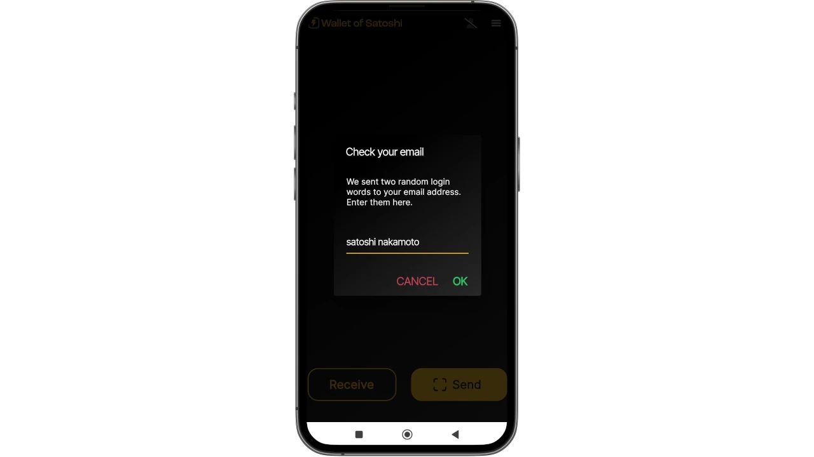

ප්‍රතිඵලය විය යුතුය රූපයක් ඉහළින් පෙනෙන, සත්‍යාපනය සඳහා පරීක්ෂා ලකුණ සමඟ.

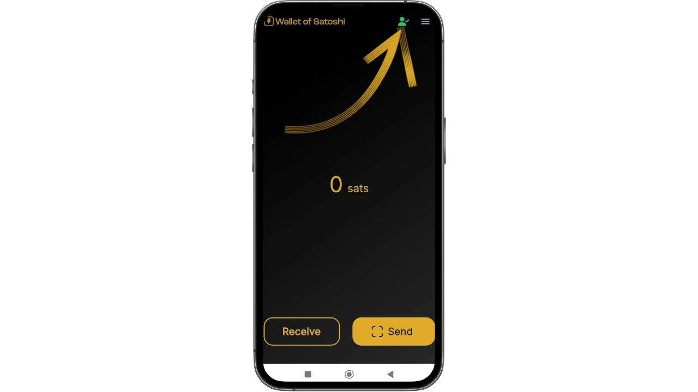

medtem ko ste v razdelku z nastavitvami, rdeča vrstica _Prijava/Registracija_ zdaj prikazuje uporabnikov e-poštni naslov Address.

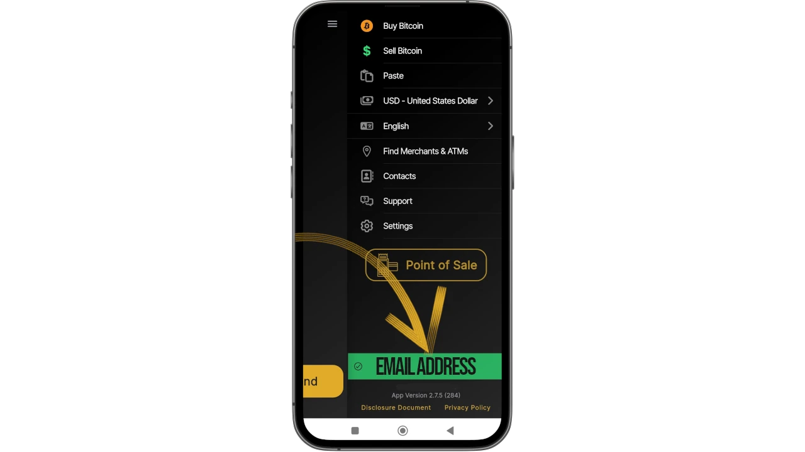

### ගෙවීම් ලැබීම

WoS මත ලබා ගැනීමට, _Receive_ ක්ලික් කරන්න සහ විධාන මාලාවක් පෙනේ.

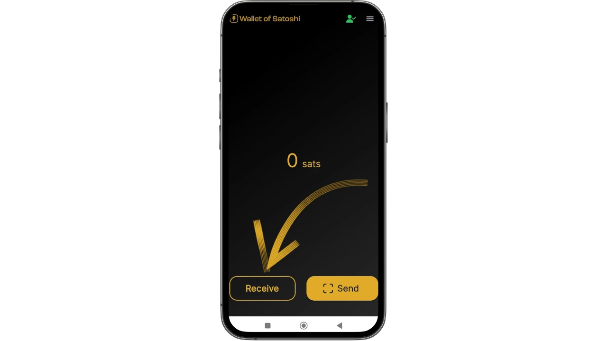

ඔබට ලබා ගත හැකිය

- via LN-Address **a**
- LN හරහා, Invoice **b** සකස් කිරීමෙන්
- on chain (WoS Bitcoin ජාලය සහය දක්වයි නමුත් ගෙවීම් කළ යුතු සබ්මැරීන් හුවමාරු සමඟ) **c**
- z skeniranjem QR kode LNurl-p **d**

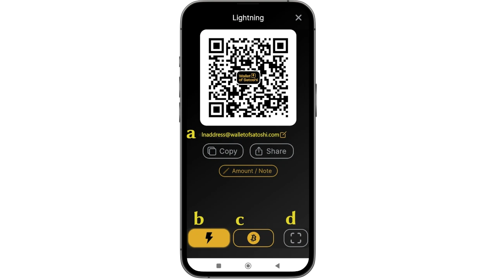

### Invoice සෑදීම

කොටස මත ක්ලික් කරන්න _Receive_ සහ Lightning Network සංකේතය සහිත විධානය තෝරන්න.

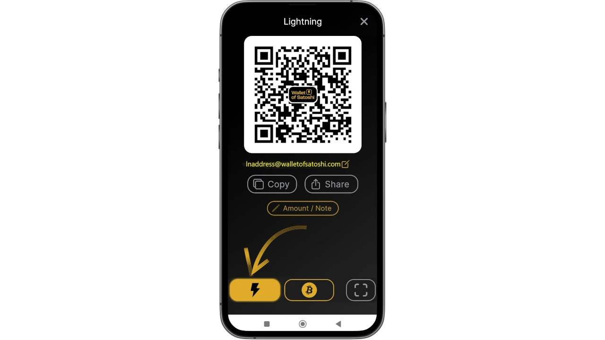

Invoice නිර්මාණ මෙනුව පෙනේ, අපි _Add Amount_ ක්ලික් කර නිවැරදි මුදල ලියන අතර විස්තරයක් එකතු කරමු, මෙම උදාහරණයේ, «මගේ පළමු Invoice».

කීබෝර්ඩ් සමඟ, අපි ප්‍රමාණය සකසමු.

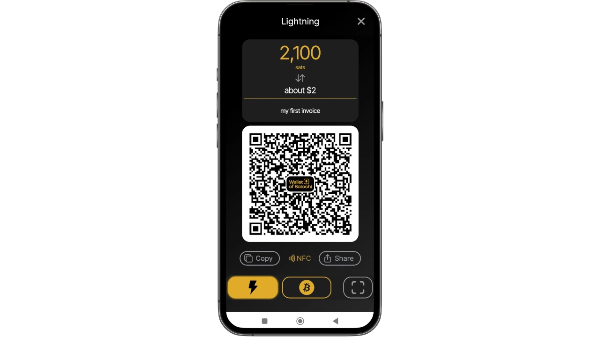

potem pa prejeti plačilo Invoice. Prejeto plačilo je videti takole:

### POS එකෙන් එකතුවීම

Wallet ima privzeto funkcijo Satoshi, zaradi česar je še posebej primeren za trgovce: POS. Poglejmo, kako jo aktivirati.

මුල් තිරයෙන්, ඉහළ දකුණු කෙළවරේ ඇති මෙනුව තෝරන්න.

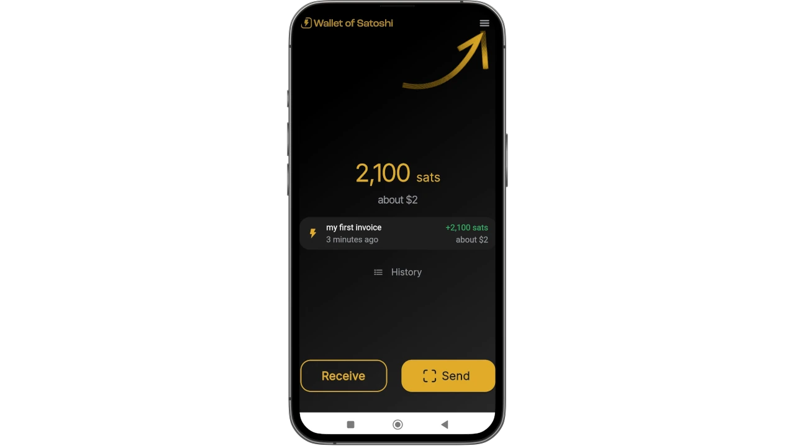

පසුව _Point of Sale_ තෝරන්න.

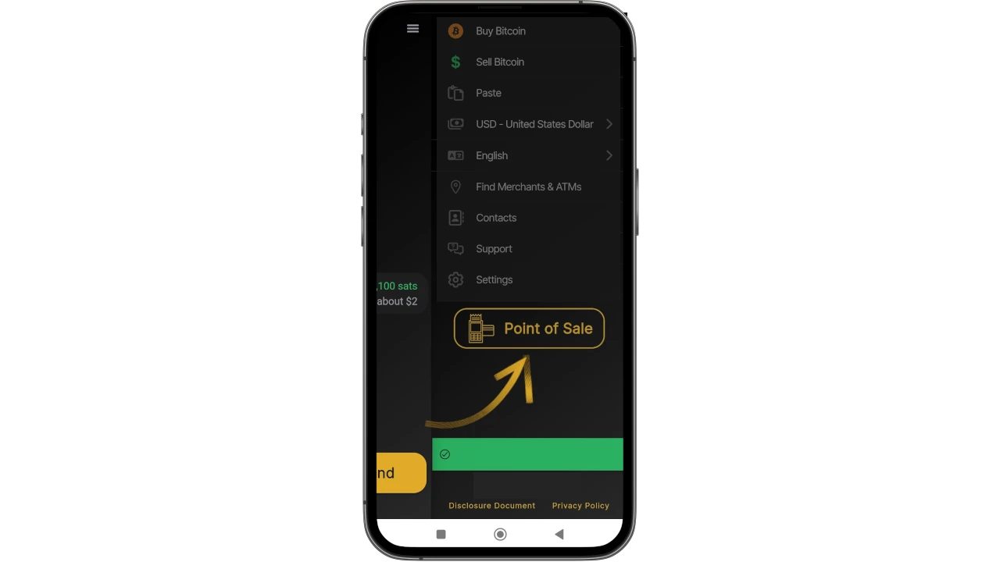

WoS-এর সাম্প্রতিকতম প্রকাশের সাথে, _Keypad_ নির্বাচন করতে নিশ্চিত হন।

in nato vnesite znesek na tipkovnici, v spodnjem primeru enak 10 centom / 118 Sats. Dodajte opis za zbirko, v tem primeru "moja druga s POS". Velik gumb Green zasveti in ga je treba klikniti.

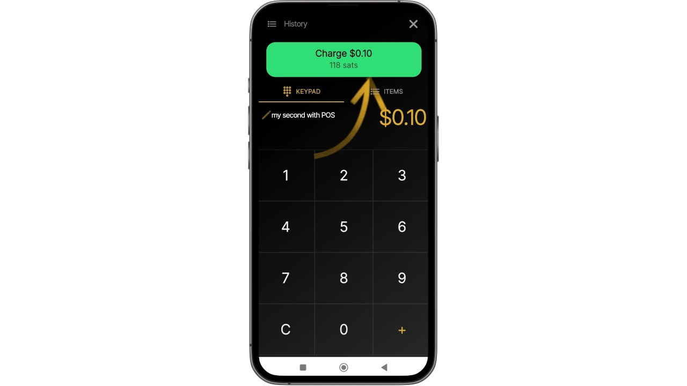

generate ද Invoice වෙත සහ එය - උදාහරණයක් ලෙස - ගනුදෙනුකරුවෙකුට පෙන්වන්න.

මෙම ගෙවීමද එකතු කර ඇත!

### ගෙවීම් යැවීම

සරලකම WoS ප්‍රධාන තිරයේ ශක්තියකි. Invoice ගෙවීමට, _Send_ මත ක්ලික් කරන්න.

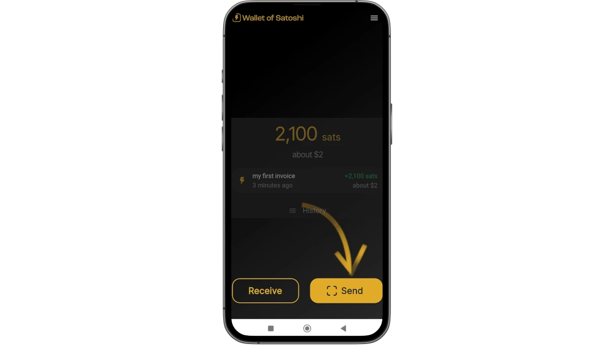

පළමු වරට භාවිතා කිරීමේදී, WoS කැමරාවට ප්‍රවේශ වීමට අවසර ඉල්ලා සිටී.

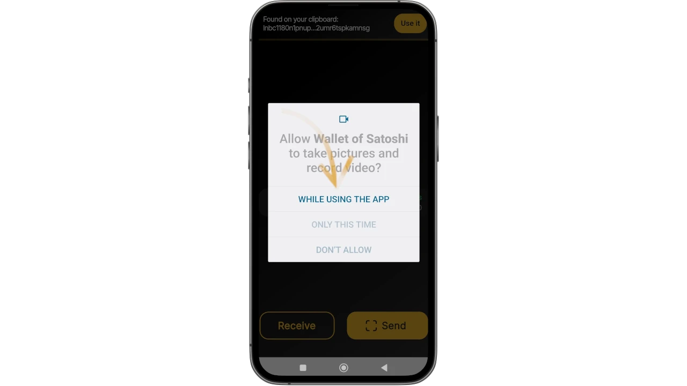

මෙම මොහොතේ සිට කැමරාව සක්‍රීය වේ

Invoice को फ्रेम गर्दै, हामी देख्छौं कि 210 Sats को भुक्तानी अनुरोध गरिएको छ। यदि अनुरोधकर्ताले सेट गरेको छ भने, विवरण पनि पढ्न सकिन्छ। यो स्क्रिन सारांश हो र पुष्टि अनुरोध पनि हो: WoS ले भुक्तानी पठाउन "अनुमति माग्छ", जुन Green _Send_ बटन क्लिक गरेर प्रदान गरिन्छ।

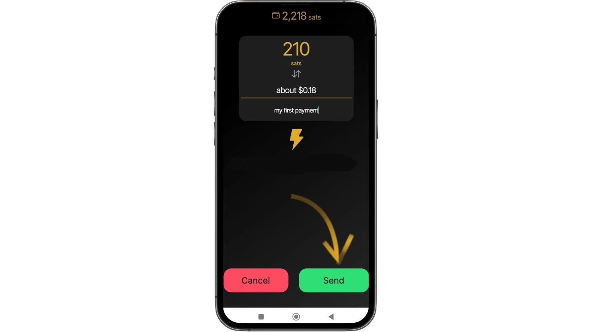

जब भुक्तानी आफ्नो गन्तव्यमा पुग्छ, WoS ले यो स्क्रिनसँग सूचित गर्दछ।

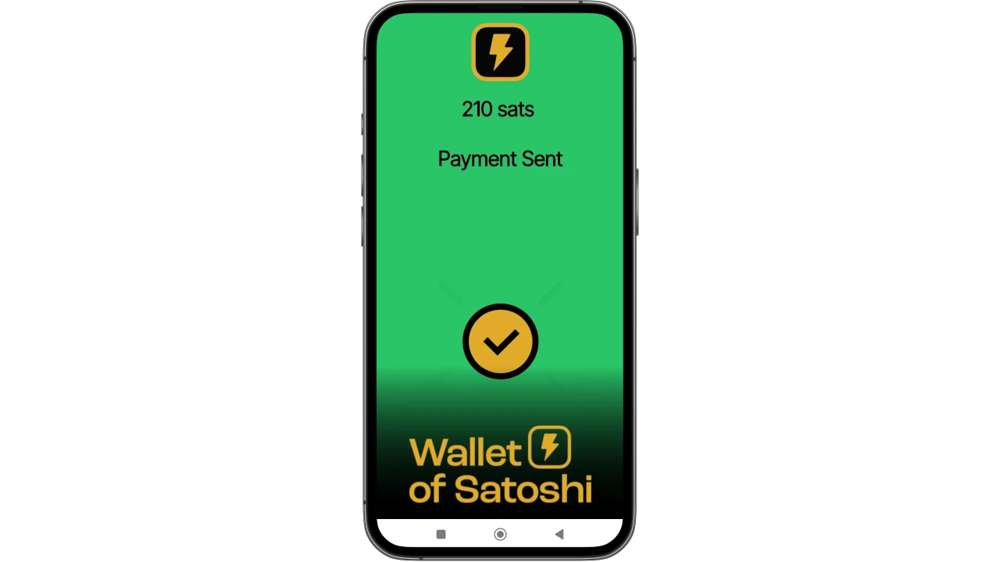

मुख्य स्क्रीन से, _History_ पर क्लिक करने से (बैलेंस के ठीक नीचे) लेन-देन की सूची दिखाई देती है।

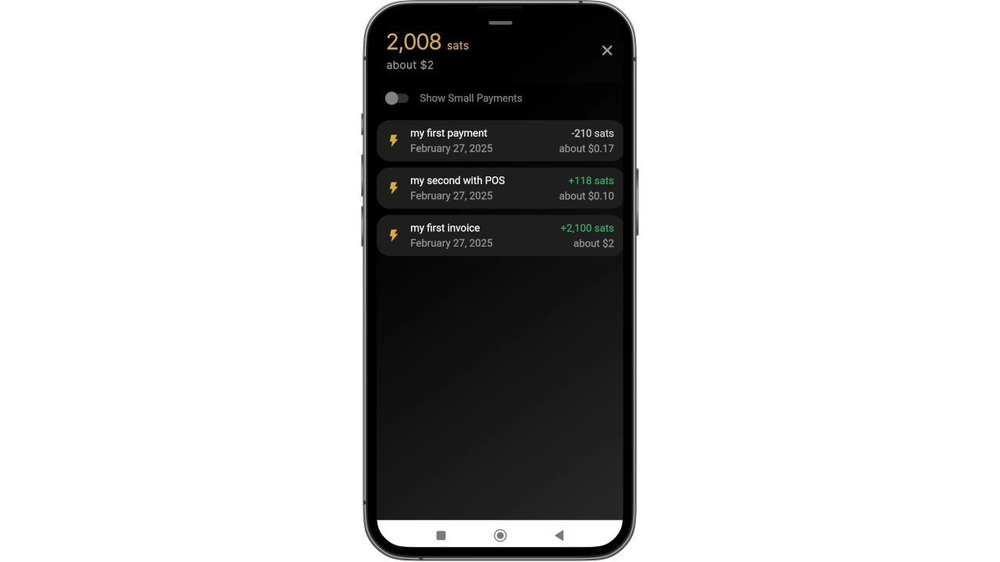

#### WoS ගිණුම ප්‍රතිසාධනය කිරීම

දැන්, අපි නව උපාංගයක WoS ස්ථාපනය කරන ආකාරය බලමු; මෙය සොරකම් වීම, අහිමි වීම, හෝ පෙර Wallet ස්ථාපනය කර තිබූ ජංගම දුරකථනය ක්‍රියාත්මක කිරීමට නොහැකි වීමේ අවස්ථාවලද ප්‍රයෝජනවත් වනු ඇත. නැවත ස්ථාපනය කළ පසු, ඔබට පෙර විස්තර කළ ගිණුම් ලියාපදිංචි ක්‍රමවේදය නැවත සිදු කළ යුතු අතර, එකම වෙනස්කමක්: පෙර සකසා ඇති විද්‍යුත් තැපෑල සමඟ ලොග් වීමට ඉල්ලීමේ අවසානයේදී, WoS මෙහෙම පෙනේ:

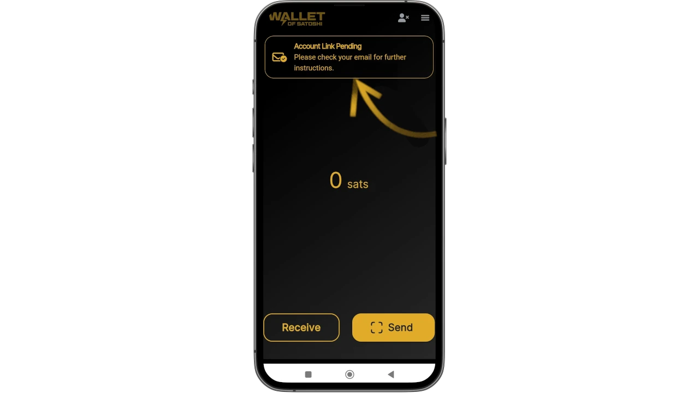

සන්දේශයක් අපට අනතුරු අඟවයි ඔබේ ගිණුම නැවත සක්‍රීය කිරීම සඳහා ක්‍රමවේදය සමඟ විද්‍යුත් තැපෑලක් යවා ඇති බව. ඔබේ විද්‍යුත් තැපෑල් ආදාන පෙට්ටිය විවෘත කළ යුතුය.

**වැදගත්**: විවෘත කරන්න ඊමේල් එක පරිගණකයකින් හෝ, ඕනෑම අවස්ථාවක, ඔබ WoS ගිණුම ප්‍රතිසාධනය කිරීමට යන උපාංගයෙන් වෙනස් උපාංගයකින්. තැපැල් පෙට්ටිය තුළ, අපට QR කේතයක් පෙන්වන පණිවිඩයක් හමු වේ.

QR කේතය රාමුවේ දමා ඇති විට, WoS හි ප්‍රධාන පිටුවේදී ප්‍රතිසාධනය වූ ගිණුම, ශේෂය සහ ඉතිහාසය සමඟ පෙනේ.