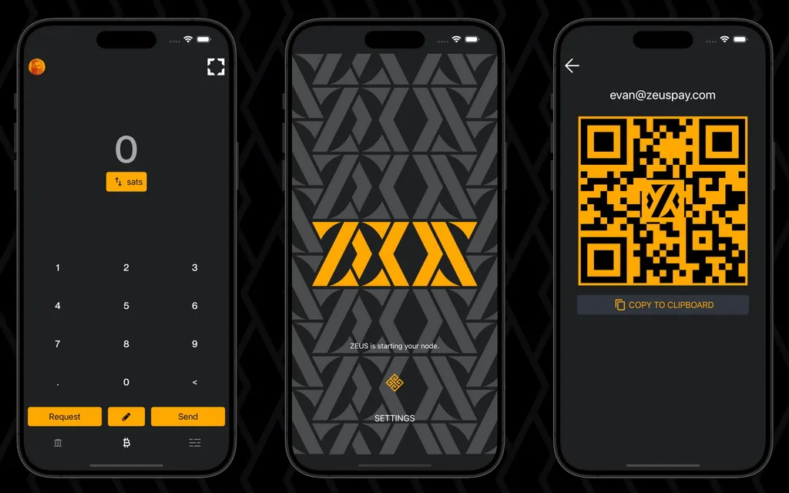

## Einführung in ZEUS Wallet

ZEUS ist eine mobile Bitcoin-Wallet- und Knotenverwaltungs-App mit allen Funktionen eines Bitcoin-Lightning-Wallet, die Bitcoin-Zahlungen vereinfacht, den Nutzern die vollständige Kontrolle über ihre Finanzen gibt und fortgeschrittenen Nutzern die Verwaltung ihrer Lightning-Knoten von der Handfläche aus ermöglicht.

### Für wen ist ZEUS gedacht?

Derzeit ist ZEUS für Personen gedacht, die ihre eigenen [Lightning Network Daemon (LND)](https://lightning.engineering/) oder [Core Lightning Lightning (CLN)](https://blockstream.com/lightning/) Heim-/Geschäftsknoten betreiben und diese über Zeus aus der Ferne verwalten.

Händler, die [BTCPay](https://btcpayserver.org/) oder [LNBits](https://lnbits.com/) oder [Alby](https://getalby.com/) (oder jedes andere LNDhub-Konto) verwenden, können sich auch mit ZEUS verbinden und ihre Nodes/Konten nutzen und verwalten.

[Ab v0.8](https://blog.zeusln.com/zeus-v0-8-0-open-beta/) wird ZEUS mit einem [eingebauten mobilen Lightning-Knoten](https://docs.zeusln.app/category/embedded-node) mit integriertem [Lightning Service Provider (LSP)](https://docs.zeusln.app/lsp/intro) auf Durchschnittsnutzer zugehen, die einfach nur schnelle und günstige Bitcoin-Zahlungen von ihrem mobilen Gerät aus vornehmen möchten.

### Wichtige Zeus-Ressourcen:

- Offizielle Zeus-Webseite - [https://zeusln.app/](https://zeusln.app/)
- Zeus-Dokumentation - [https://docs.zeusln.app/](https://docs.zeusln.app/)
- [Zeus Github Repository](https://github.com/ZeusLN/zeus)
- [Zeus-Telegramm-Supportgruppe] (https://t.me/ZeusLN)
- [Zeus auf NOSTR] (https://iris.to/zeus@zeusln.app)
- [Zeus-Blog-Ankündigungen] (https://blog.zeusln.com)

### Zeus Eigenschaften

#### Allgemeine Merkmale:

- Selbstverwaltung, nur Bitcoin und Lightning Wallet
- Keine Bearbeitungsgebühren, kein KYC
- Vollständig quelloffen (APGLv3)
- Unterstützung mehrerer Knoten/Konten (Sie können Ihre(n) eigenen Heimknoten verwalten, eingebettete LND-Knoten ausführen, sich mit mehreren LNDhub-Konten verbinden)
- Einfach zu bedienendes Aktivitätsmenü
- PIN- oder passphrase-Verschlüsselung, Datenschutzmodus - verbergen Sie Ihre sensiblen Daten
- Kontaktbuch, mehrere Themen, mehrere Sprachen

#### Technische Merkmale

- Verbinden über Tor
- Volle LNURL-Unterstützung (Bezahlen, Abheben, Authentifizierung, Kanal), Senden an Lightning-Adressen
- Detaillierte Verwaltung von Beleuchtungskanälen, MPP/AMP-Unterstützung, Keysend, Verwaltung von Routing-Gebühren
- Replace-by-fee (RBF) und Kind-zahlt-für-Eltern (CPFP) Unterstützung
- NFC-Zahlungen und -Anfragen, Signieren und Verifizieren von Nachrichten
- Unterstützung von SegWit und Taproot
- Einfache Taproot-Kanäle
- Selbstverwaltete Blitzadressen (@zeuspay.com)
- Point of Sale von Square (bald offener PoS)

### Leitfäden und Video-Tutorials

Um Zeus nutzen zu können und die Blitzkanäle, Liquidität, Gebühren usw. zu verwalten, ist es besser, zunächst einige wichtige Leitfäden über Lightning Network zu lesen.

#### Leitfäden:

- [LND - Lightning Network Daemon Dokumentation](https://docs.lightning.engineering/)
- [CLN - Core Lightning Dokumentation](https://lightning.readthedocs.io/index.html)
- [Anfänger-Blitzanleitung](https://bitcoiner.guide/lightning/) - von Bitcoin Q&A
- [Lightning Node Management](https://www.lightningnode.info/) - von openoms
- [Die Lightning Network und die Flughafen-Analogie] (https://darthcoin.substack.com/p/the-lightning-network-and-the-airport)
- [Verwaltung der Liquidität von Blitzknoten] (https://darthcoin.substack.com/p/managing-lightning-node-liquidity)
- [Lightning Node Maintenance](https://darthcoin.substack.com/p/lightning-node-maintenance)

#### Video-Anleitung von BTC Sessions

## Ein Leitfaden für die Verwendung des eingebetteten Zeus LN-Knotens auf Ihrem mobilen Gerät

Ich widme diesen Leitfaden all jenen neuen Lightning Network (LN) Nutzern, die eine neue souveräne Reise mit einem selbstverwalteten Knoten Wallet auf ihren mobilen Geräten beginnen wollen.

Nehmen wir an, Sie haben bereits eine Fülle von verwahrten LN-Geldbörsen durchlaufen, sind aber noch nicht bereit, einen PUBLIC-Routing-LN-Knoten zu betreiben, sondern möchten einfach mehr Sats über LN stapeln und Ihre regelmäßigen Zahlungen über LN vornehmen.

Hier kommt Zeus, beginnend mit [Version v0.8.0 auf ihrem Blog angekündigt] (https://blog.zeusln.com/new-release-zeus-v0-8-0/), bietet jetzt einen eingebetteten LND-Knoten in der App. Bisher war Zeus eine App zur Fernverwaltung von Knoten und LNDhub-Konten. Aber jetzt... ist der Knoten im Telefon!

### Kurze Zusammenfassung der wichtigsten Funktionen von Zeus Node:

- Privater LND-Knoten** - Das bedeutet, dass dieser Knoten KEINE öffentliche Weiterleitung von Zahlungen anderer über Ihren Knoten vornimmt. Der Knoten und die Kanäle sind unangekündigt (privat, nicht im öffentlichen LN-Diagramm sichtbar). Das Empfangen und Ausführen von Zahlungen erfolgt über Ihre angeschlossenen LSP-Peers. HINWEIS: Der Zeus Embedded Node wird KEIN öffentliches Routing durchführen!
- Persistenter LND-Dienst** - der Benutzer kann diese Funktion aktivieren und den LND-Dienst kontinuierlich wie einen regulären LN-Knoten aktiv halten. Die App muss nicht geöffnet sein, der persistente Dienst hält die gesamte Kommunikation online.
- Neutrino-Blockfilter** - die Blocksynchronisierung erfolgt mit [Blockfiltern und dem Neutrino-Protokoll] (https://bitcoinops.org/en/topics/compact-block-filters/) (da keine Informationen über die On-Chain-Fonds unserer Nutzer vorliegen). Zur Erinnerung: Bei langsamen Internetverbindungen mit hoher Latenz kann die Blocksynchronisation mit Neutrino manchmal fehlschlagen. Der Versuch, zu einem Neutrino-Server in der Nähe zu wechseln, kann helfen, die Synchronisation wiederherzustellen. Ohne diese Synchronisierung kann Ihr LND-Knoten nicht starten!
- Einfache Taproot-Kanäle** - Wenn diese Kanäle geschlossen werden, fallen für die Nutzer weniger Gebühren an und sie erhalten mehr Privatsphäre, da sie bei der Prüfung ihres On-Chain-Fußabdrucks wie alle anderen Taproot-Ausgaben erscheinen.
- Integriertes LSP** - Olympus ist der neue LSP-Knoten für Zeus. Benutzer können Sats über LN sofort wieder empfangen, ohne vorher LN-Kanäle eingerichtet zu haben. Sie müssen lediglich einen LN Invoice einrichten und von jedem anderen LN Wallet mit dem Zeus 0-conf Kanaldienst bezahlen. Lesen Sie hier mehr über Zeus LSP. Der LSP bietet unseren Nutzern auch zusätzlichen Datenschutz, indem er ihnen verpackte Rechnungen zur Verfügung stellt, die die öffentlichen Schlüssel ihrer Nodes vor den Zahlern verbergen.
- Kontaktbuch** - Sie können Kontakte manuell speichern oder aus NOSTR importieren, um Zahlungen an Ihre regelmäßigen Ziele zu senden.
- Volle Unterstützung für LNURL, LN Address senden und empfangen** - jetzt können Sie Ihr eigenes selbstverwaltetes LN Address mit @zeuspay.com einrichten. Zur Erinnerung: Sie können Zeus auch für LN-Authentifizierung auf Websites verwenden, auf denen Sie sich mit einer LN-Authentifizierung anmelden können. Das ist sehr praktisch.
- Point of Sale** - Jetzt können Händler ihre eigenen Produktartikel einrichten und direkt von Zeus aus verkaufen, mit integriertem PoS. Für den Moment enthalten grundlegende Bedürfnisse, aber in der Zukunft wird erweiterte Funktionen enthalten.
- LND-Protokolle** - der Benutzer kann die Protokolle des LND-Dienstes in Echtzeit lesen und zur Fehlersuche bei möglichen Problemen verwenden (hauptsächlich bei schlechten Verbindungen)
- Automatisierte Backups** - die LN Knotenkanäle werden automatisch auf dem Olympus Server gesichert. Diese automatische Sicherung ist mit Ihrem Knoten Wallet seed verschlüsselt (ohne den seed ist völlig nutzlos). Benutzer können auch manuell eine SCB (statische Kanalsicherung) für eine Notfallwiederherstellung exportieren.

### So steigen Sie in den Zeus LN Node (LND embedded) ein

In diesem Leitfaden werde ich nur über den eingebetteten LND-Knoten sprechen und nicht über die anderen Möglichkeiten zur Nutzung dieser großartigen Anwendung (Remote-Knotenverwaltung und LNDhub-Konten). Für die anderen Arten von Verbindungen lesen Sie bitte die [Zeus Docs page] (https://docs.zeusln.app/category/getting-started), die sehr gut erklärt ist und für die kein eigener Leitfaden geschrieben werden muss.

#### SCHRITT 1 - ERSTEINRICHTUNG

Da Zeus ein vollwertiger LND-Knoten ist, werde ich einige erste Empfehlungen abgeben:

- Verwenden Sie kein altes Gerät, das die Nutzung dieser leistungsstarken App beeinträchtigen könnte. Besonders in der Zeit der Synchronisierung könnte die App die CPU und den RAM intensiv nutzen. Der Mangel an diesen könnte sogar unmöglich machen, die Zeus-App zu verwenden.
- Verwenden Sie mindestens Android 11 als mobiles Betriebssystem und aktualisieren Sie es so oft wie möglich. Für iOS das gleiche, versuchen Sie, eine viel höhere Version von OS verwenden.
- Sie benötigen mindestens 1 GB Festplattenplatz für die Datenspeicherung. Im Laufe der Zeit könnte mehr wachsen, aber es gibt eine Funktion, um die Datenbank auf ein Niveau von MBs zu verdichten.
- Es gibt KEINE Notwendigkeit, Zeus mit Tor oder dem Orbot-Dienst zu benutzen. Bitte verkomplizieren Sie die Dinge nicht mehr als nötig. Tor wird Ihnen in diesem Fall nicht mehr Privatsphäre bieten, sondern die anfängliche Synchronisierung nur verschlimmern. Seien Sie auch vorsichtig mit den VPNs, die Sie benutzen und überprüfen Sie die Latenz der Verbindung zu den Neutrino-Servern. Denken Sie daran, dass Neutrino-Blockierfilter die Identität Ihres Geräts nicht ausspähen oder zurückverfolgen, sondern nur Blöcke bereitstellen. Der LN-Verkehr wird auch hinter einem LSP mit privaten Kanälen übertragen, so dass nur sehr wenige Informationen nach außen dringen.
- Haben Sie Geduld für die erste Synchronisierung, die mehrere Minuten dauern kann. Versuchen Sie, mit einer Breitband-Internetverbindung mit guter Latenzzeit verbunden zu sein. Wenn Sie Ihren eigenen Bitcoin-Knoten betreiben, [können Sie den Neutrino-Dienst aktivieren] (https://docs.lightning.engineering/lightning-network-tools/LND/enable-neutrino-mode-in-Bitcoin-core) und Ihren Zeus mit Ihrem eigenen Knoten verbinden, auch über das interne LAN, damit Sie eine maximale Geschwindigkeit haben.

Sobald Sie die Verbindungsart "Eingebetteter Knoten" eingestellt haben, beginnt die App mit der Synchronisierung. Warten Sie geduldig, bis dieser Teil abgeschlossen ist, und rufen Sie dann die Hauptseite mit den Einstellungen auf.

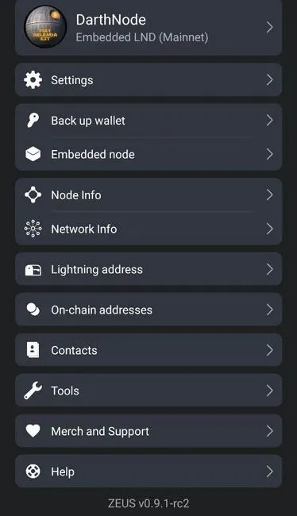

Lassen Sie uns kurz in die einzelnen Einstellungsbereiche eintauchen und einige der wichtigsten Funktionen verstehen, bevor Sie Zeus verwenden:

**A - EINSTELLUNGEN**

Dies ist ein Abschnitt mit allgemeinen Einstellungen für die gesamte Anwendung

**1 - Blitzdienstanbieter (LSP)**

Hier werden zwei LSP-Dienste vorgestellt:

- just-in-Time-Kanäle - wenn Sie keinen Kanal geöffnet haben oder keine eingehende Liquidität verfügbar ist, öffnet der Dienst, wenn er aktiviert ist, einen Kanal on-the-fly für Sie. Diese Option kann deaktiviert werden, wenn Sie keine weiteren Kanäle dieser Art öffnen möchten.
- _Kanäle im Voraus anfordern_ - Sie können eingehende Kanäle vom Olympus LSP direkt in der App mit mehreren Optionen und Beträgen (für eingehende und ausgehende) kaufen.

Die LSP hilft dabei, Nutzer mit der Lightning Network zu verbinden, indem sie Zahlungskanäle zu ihren Knotenpunkten öffnet. [Lesen Sie mehr über LSP hier](https://medium.com/breez-technology/envisioning-lsps-in-the-lightning-economy-832b45871992). ZEUS hat einen neuen LSP namens [OLYMPUS by ZEUS](https://Mempool.space/lightning/node/031b301307574bbe9b9ac7b79cbe1700e31e544513eae0b5d7497483083f99e581) integriert, der allen Nutzern zur Verfügung steht, die den neuen eingebetteten Knoten verwenden.

In diesem Abschnitt ist standardmäßig der Olympus LSP (https://0conf.lnolymp.us), aber bald können Sie auch einen anderen 0conf LSP einstellen, der dieses Protokoll unterstützt.

nicht vergessen:_

wenn Sie einen Kanal mit Olympus LSP unter Verwendung der verpackten LN-Rechnungen eröffnen, erhalten Sie auch eine 100k-Eingangsliquidität! Dies ist eine wirklich gute Option für den Fall, dass Sie sofort mehr Sats erhalten müssen

beispiel: Sie zahlen 400k Sats ein, um einen LSP-Kanal zu öffnen, dann öffnet der LSP einen Kanal mit 500k Sats Kapazität zu Ihrem Zeus-Knoten und schiebt die 400k Sats, die Sie eingezahlt haben, auf Ihre Seite

"Eingehende Liquidität" = mehr "Platz" in Ihrem Kanal, um zu empfangen

In der Zukunft hoffen wir, dass wir viele andere LSP haben werden, die in Zeus integriert werden können und alternativ jeden einzelnen nutzen können. Es ist nur eine Frage der Zeit, bis neue LSPs einen offenen Standard für diese Art von 0conf-Kanälen annehmen werden.

Wenn Sie nicht möchten, dass neue Kanäle "on the fly" geöffnet werden, können Sie diese Option deaktivieren.

In diesem Abschnitt haben Sie auch die Möglichkeit, "einfache Taproot-Kanäle anzufordern", wenn der LSP einen Kanal in Richtung Ihres Zeus-Knotens öffnen will. Diese einfachen Taproot-Kanäle bieten eine bessere On-Chain-Privatsphäre und niedrigere Gebühren beim Schließen des Kanals. Es gibt nur zwei Gründe, warum Sie sie nicht verwenden sollten:

- Sie sind neu, und es kann noch Fehler in LND geben, wenn man sie benutzt.
- Ihr Vertragspartner unterstützt sie nicht. Selbst LND-Knoten müssen sich vorerst ausdrücklich dafür entscheiden.

**2 - Zahlungseinstellungen**

Diese Funktion bietet Ihnen die Möglichkeit, Ihre eigenen bevorzugten Gebühren für Zahlungen über LN oder onchain festzulegen. Außerdem haben Sie die Möglichkeit, das Zeitlimit für Ihre Rechnungen zu erhöhen oder zu verringern.

Wenn einige Ihrer LN-Zahlungen fehlschlagen, können Sie die Gebühr erhöhen, um eine bessere Route zu finden. Auch wenn Sie onchain txs tun, können Sie eine bestimmte Gebühr einrichten, so dass Ihre tx nicht am Ende in der Mempool für lange Zeit stecken, im Falle von hohen Gebühren Zeitraum.

**3 - Einstellungen für Rechnungen**

In diesem Abschnitt finden Sie einige Optionen für generate-Rechnungen:

- Einstellen eines Standardmemos, das im Invoice und generate angezeigt werden soll
- Verfallszeit in Sekunden, falls Sie eine bestimmte Zeit, länger oder kürzer, für die Auszahlung Ihres Invoice wünschen
- Routing-Hinweise einbeziehen - Informationen bereitstellen, um nicht beworbene oder private Kanäle zu finden. Dies ermöglicht die Weiterleitung von Zahlungen an Knoten, die im Netz nicht öffentlich sichtbar sind. Ein Routing-Hinweis bietet eine Teilroute zwischen dem privaten Knoten des Empfängers und einem öffentlichen Knoten. Dieser Routing-Hinweis wird dann in den vom Empfänger generierten Invoice aufgenommen und dem Zahler zur Verfügung gestellt. Ich schlage vor, diese Funktion standardmäßig zu aktivieren, da sonst eingehende Zahlungen fehlschlagen könnten (keine Route gefunden).
- AMP Invoice - Atomic Multi-path Payments sind eine neue Art von Blitzzahlungen, die von LND implementiert werden und es ermöglichen, Sats ohne ein bestimmtes Invoice zu empfangen, indem [keysend](https://docs.lightning.engineering/lightning-network-tools/LND/send-messages-with-keysend) verwendet wird. Ist praktisch ein statischer Zahlungscode. [Lesen Sie hier mehr](https://docs.lightning.engineering/lightning-network-tools/LND/amp).
- Benutzerdefiniertes Vorschaufeld anzeigen - verwenden Sie diese Option nur in sehr speziellen Fällen, wenn Sie wirklich benutzerdefinierte Felder im Vorschaubild verwenden möchten. [Lesen Sie hier mehr](https://Bitcoin.stackexchange.com/questions/90797/how-can-i-generate-preimage-for-lightning-network-Invoice-should-i).

Eine weitere Option in diesem Abschnitt ist die Einstellung des Typs des Address, den Sie verwenden möchten: SegWit verschachtelt, SegWit, Taproot.

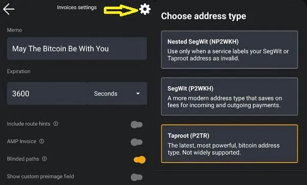

Klicken Sie auf die obere Radtaste und es erscheint ein Popup-Fenster zur Auswahl des gewünschten Address-Typs. Wenn Sie diese Einstellung vorgenommen haben, wird beim nächsten Drücken der Empfangstaste für onchain der ausgewählte Address-Typ verwendet. Sie können ihn jederzeit ändern.

**4 - Einstellungen der Kanäle**

In diesem Bereich können Sie einige Funktionen des Eröffnungskanals voreinstellen:

- anzahl der Rückmeldungen
- Kanal ankündigen (standardmäßig ausgeschaltet), d.h. es werden unangekündigte Kanäle angezeigt
- Einfache Taproot-Kanäle
- Schaltfläche "Kanal kaufen" anzeigen

**5 - Datenschutzeinstellungen**

Hier finden Sie einige grundlegende Einstellungen, um die Privatsphäre mit der Zeus-App zu verbessern:

- Block explorer zum Öffnen von Übertragungsdetails (Mempool.space, blockstream.info oder benutzerdefinierte persönliche Angaben)
- Zwischenablage lesen - ein-/ausschalten, wenn Zeus die Zwischenablage Ihres Geräts lesen soll
- Lurker-Modus - ein/aus-Schalter, wenn Sie bestimmte sensible Informationen aus Ihrer Zeus-App ausblenden möchten. Ist eine gute Option, wenn Sie Demos oder Screenshots machen.
- Mempool Gebührenvorschlag - aktivieren Sie diese Option, wenn Sie die empfohlenen Gebührenhöhen aus [Mempool.space](https://Mempool.space/) verwenden möchten

**6 - Sicherheit**

In diesem Abschnitt gibt es nur zwei Möglichkeiten, die App beim Öffnen zu sichern: ein Kennwort oder eine PIN festlegen.

Sobald Sie eine PIN zum Öffnen der App festgelegt haben, können Sie auch eine "Nötigungs-PIN" festlegen. Diese geheime zusätzliche PIN wird NUR im Falle einer Notsituation verwendet, wenn Sie bedroht werden. Wenn Sie diese PIN eingeben, wird die gesamte Konfiguration gelöscht. Daher sollten Sie Ihre Backups immer auf dem neuesten Stand halten. Automatische Backups sind standardmäßig aktiviert, aber es ist gut, auch eigene Backups außerhalb des Geräts zu erstellen.

**7 - Währung**

Aktivieren oder deaktivieren Sie die Option zur Anzeige der Umrechnung von Fiat-Währungen in der Zeus-App-Nutzung. Derzeit werden über 30 weltweite Fiat-Währungen unterstützt.

**8 - Sprache**

Sie können zwischen mehreren Übersetzungssprachen wechseln, die von der Zeus-Community mit Muttersprachlern überprüft wurden.

**9 - Anzeige**

In diesem Bereich können Sie Ihr Zeus-Display personalisieren, indem Sie verschiedene Farbthemen, den Standardbildschirm (Tastatur oder Waage) auswählen, Ihren Knoten-Alias anzeigen, große Tasten auf der Tastatur aktivieren und mehr Dezimalstellen anzeigen.

**10 - Verkaufsstelle**

Dies ist eine spezielle Funktion zum Aktivieren/Deaktivieren eines integrierten PoS-Systems in Zeus. Sie können ein eigenständiges PoS-System betreiben oder mit einem Square PoS-System verbunden sein. Derzeit ist die Unterstützung der grundlegenden Funktionen als PoS, aber genug für einen guten Start und könnte helfen, die kleinen Händler (Bars / Restaurants, Lebensmittelgeschäfte) zu beginnen, BTC in einer nativen Weise zu akzeptieren.

In diesen Einstellungen finden Sie verschiedene Optionen zur Einrichtung Ihres PoS:

- Art der Zahlungsbestätigung: Nur LN, 0-conf, 1-conf
- Aktivieren / Deaktivieren von Tipps für Mitarbeiter, die den PoS bedienen
- Tastatur ein-/ausblenden
- Prozentsatz der auf den Fahrschein anzuwendenden Steuer
- Produkte und Produktkategorien erstellen
- Eine einfache Auflistung aller Verkäufe

Hier ist ein Live-Demo-Video zur Verwendung von Zeus PoS:

**B - Sicherung Wallet**

Der eingebettete Knoten in ZEUS basiert auf LND und verwendet das [aezeed seed Format](https://github.com/lightningnetwork/LND/blob/master/aezeed/README.md). Dies unterscheidet sich von dem typischen [BIP39-Format](https://github.com/Bitcoin/bips/blob/master/bip-0039.mediawiki), das in den meisten Bitcoin-Geldbörsen zu finden ist, auch wenn es auf den ersten Blick ähnlich aussieht. Aezeed enthält einige zusätzliche Daten, einschließlich des Geburtsdatums des Wallet, die dazu beitragen, dass erneute Scans während der Wiederherstellung effizienter ablaufen.

Das aezeed-Schlüsselformat sollte mit den folgenden mobilen Geldbörsen kompatibel sein: Blixt, BlueWallet und Breez. Beachten Sie, dass der seed allein nicht ausreicht, um alle Ihre Guthaben wiederherzustellen, wenn Sie offene oder anstehende Schließungskanäle haben!

Weitere Informationen zum Sicherungs- und Wiederherstellungsprozess finden Sie auf [Zeus Docs page](https://docs.zeusln.app/for-users/embedded-node/backup-and-recovery).

POWER-RATSCH: Wenn Sie Ihren seed speichern, speichern Sie bitte auch den Node Pubkey! Manchmal ist es gut, ihn zusammen mit Ihrem seed und SCB (Static Channels Backup) zur Hand zu haben, falls Sie die Wiederherstellung überprüfen müssen.

SCB ist nur notwendig, wenn Sie LN Kanäle geöffnet haben. Für den Fall, dass Sie nur onchain Fonds haben, ist nicht erforderlich.

Wenn Sie sehen, dass nach einer langen Zeit immer noch nicht die alte Geschichte txs zeigt, gehen Sie zu Embedded Node - Peers und deaktivieren Sie die Option, um die Liste der ausgewählten Peers (standardmäßig ist die btcd.lnolymp.us) verwenden. Dadurch wird ein Neustart ausgelöst und eine Verbindung zum ersten verfügbaren Neutrino-Knoten mit einer besseren Zeitreaktion hergestellt. Oder verwenden Sie die unten genannten anderen bekannten Neutrino-Peers.

Wenn Sie weitere Wiederherstellungsoptionen für einen LND-Knoten sehen möchten, [lesen Sie bitte meinen früheren Leitfaden](https://darth-coin.github.io/nodes/shtf-restore-LND-node-en.html), in dem Sie die Schritte zum Importieren eines gefrorenen seed in Sparrow Wallet oder andere Methoden finden.

**C - Eingebetteter Knoten**

In diesem Abschnitt finden Sie einige grundlegende Werkzeuge zur Verwaltung des integrierten Knotens:

- _Disaster Recovery_ - Automatisierte und manuelle Backups für die LN-Kanäle. Bitte lesen Sie mehr über die Verwendung dieser Funktion auf der Seite Zeus Docs.
- express Graph Sync_ - Die Zeus-App lädt den LN-Klatschdatengraphen von einem speziellen Server herunter, um eine schnellere und bessere Synchronisierung zu ermöglichen und die besten Zahlungswege anzubieten. Sie können auch wählen, um vorherige Grafikdaten beim Start zu löschen.
- peers_ - Abschnitt zur Verwaltung der Neutrino-Peers und 0-conf-Peers. Wenn Sie Probleme mit der anfänglichen Synchronisierung haben und Kanäle nicht online gehen, liegt das daran, dass Ihr Gerät eine hohe Latenz mit dem konfigurierten Neutrino-Peer hat. Versuchen Sie, die Liste der bevorzugten Peers zu ändern oder fügen Sie einen bestimmten Peer hinzu, von dem Sie wissen, dass er eine bessere Latenz für die Synchronisierung hat. Bekannte Neutrino-Server sind:

 - btcd1.lnolymp.us | btcd2.lnolymp.us - für die Region US
 - sg.lnolymp.us - für die Region Asien
 - btcd-Mainnet.lightning.computer - für die Region USA
 - uswest.blixtwallet.com (Seattle) - für die Region US
 - europe.blixtwallet.com (Deutschland) - für die EU-Region
 - asia.blixtwallet.com - für die Region Asien
 - node.eldamar.icu - für die Region US
 - noad.sathoarder.com - für die Region US
 - bb1.breez.technology | bb2.breez.technology - für die Region US
 - neutrino.shock.network - US-Region

- _LND logs_ - ein sehr nützliches Tool zur Fehlersuche in Ihrem LN-Knoten und zur detaillierten Kontrolle der Vorgänge auf technischer Ebene.
- _Erweiterte Einstellungen_ - weitere Tools zur Steuerung der Verwendung Ihres LND-Knotens:

 - pfadfindungsmodus_ - bimodal oder apriori, Möglichkeiten, eine bessere Route für Ihre LN-Zahlungen zu finden und auch das Zurücksetzen der vorherigen Routing-Informationen. Bitte lesen Sie diese sehr guten Leitfäden über Pathfinding: [Pathfinding](https://docs.lightning.engineering/lightning-network-tools/LND/pathfinding) - von Docs Lightning Engineering und [LN Payment Pathfinding](https://voltage.cloud/blog/lightning-network-faq/understanding-payment-pathfinding-between-nodes-on-lightning-network/) - von Voltage
 - _Persistent LND_ - aktivieren Sie diesen Modus, wenn Sie möchten, dass der LND-Dienst kontinuierlich im Hintergrund läuft und Ihr Knoten 24/7 online bleibt. Dies ist sehr nützlich, wenn Sie Zeus als PoS in einem kleinen Geschäft verwenden oder Sie viele LN-Tipps über den LN Address erhalten.
 - brieftasche neu scannen_ - diese Option löst beim Neustart einen vollständigen Scan aller Onchain-Txs Ihres Wallet aus. Aktivieren Sie diese Option nur für den Fall, dass Sie einige Sendeeinheiten in Ihrem Wallet vermissen. Das erneute Scannen wird einige Minuten dauern, also haben Sie Geduld und überprüfen Sie immer die Protokolle, um mehr Details über den Fortschritt zu erfahren.
 - _Datenbank komprimieren_ - diese Option ist sehr nützlich, wenn Ihre Zeus-App viel Speicherplatz auf dem Gerät belegt (siehe App-Details in Ihren Geräteeinstellungen). Wenn Sie viel mit Zeus arbeiten, würde ich empfehlen, diese Verdichtung häufiger durchzuführen. Sobald Sie sehen, dass Sie mehr als 1-1,5 GB Daten für die Zeus-App haben, führen Sie die Verdichtung durch. Der Vorgang wird neu gestartet und nimmt einige Zeit in Anspruch, haben Sie also etwas Geduld.
 - neutrinodateien löschen_ - diese Option zum Löschen der Neutrinodateien (mit einem Neustart) reduziert den Datenspeicherverbrauch erheblich. Die Verringerung der Datennutzung hat auch einen großen Einfluss auf den Batterieverbrauch, insbesondere wenn Sie Zeus im persistenten Modus verwenden.

**D - Knoten-Info**

In diesem Abschnitt finden Sie weitere Informationen über den Status Ihres Zeus-Knotens:

- Alias - kurze Knoten-ID
- Öffentlicher Schlüssel - der vollständige öffentliche Schlüssel für Ihren Knoten, den andere Knoten benötigen, um den Pfad zu Ihrem Knoten zu finden. Denken Sie daran, dass dieser öffentliche Schlüssel NICHT auf den regulären LN Explorern (Mempool, Amboss, 1ML usw.) sichtbar ist. Dieser Pubkey ist NUR über Ihre verbundenen LN Peers und Channels erreichbar.
- LN Durchführungsversion
- Zeus-App-Version
- Mit Kette synchronisiert und Mit Diagramm synchronisiert - sehr wichtige Angaben, die den korrekten Status Ihres Knotens anzeigen. Wenn diese beiden nicht "true" anzeigen, bedeutet dies, dass Ihr Knoten noch synchronisiert wird oder dass es Probleme bei der Synchronisierung gibt. Es wird daher empfohlen, einen Blick in die LND-Protokolle zu werfen oder noch ein wenig zu warten.
- Blockhöhe und Hash - zeigt den letzten Block und Hash, den Ihr Knoten gesehen und synchronisiert hat.

**E - Netzinformationen**

In diesem Abschnitt werden weitere Details zum allgemeinen Status des Lightning Network angezeigt, die aus den Synchronisierungsdaten Ihres Graphen entnommen wurden: Anzahl der verfügbaren öffentlichen Kanäle, Anzahl der Knoten, Anzahl der Zombie-Kanäle (offline oder tot), Graphdurchmesser, durchschnittlicher und maximaler Grad für den Graphen.

Diese Daten können bei der Fehlersuche nützlich sein oder einfach nur für Statistiken verwendet werden.

**F - Blitz Address**

In diesem Abschnitt kann der Benutzer seine eigene Selbstverwahrung LN Address @zeuspay.com einrichten.

ZEUS PAY nutzt nutzergenerierte Preimage-Hashes, HODL-Rechnungen und das Zaplocker-Nostr-Bescheinigungsverfahren, um Nutzern, die nicht rund um die Uhr online sind, den Empfang von Zahlungen an einen statischen Blitz-Address zu ermöglichen. Die Nutzer müssen sich nur innerhalb von 24 Stunden in ihre ZEUS-Wallets einloggen, um die Zahlungen einzufordern, ansonsten werden sie an den Absender zurückgeschickt.

Wenn Sie den "Dauermodus" aktivieren, werden alle Zahlungen an Ihren LN Address sofort empfangen.

Erfahren Sie, wie [Zaplocker](https://github.com/supertestnet/zaplocker#how-it-works) Zahlungen funktionieren und mehr über [ZeusPay-Gebühren hier](https://docs.zeusln.app/lightning-Address/fees).

**G - Onchain-Adressen**

In diesem Abschnitt können Sie Ihre generierten Onchain-Adressen für eine bessere Münzkontrolle einsehen

**H - Kontakte**

Ein neues Kontaktbuch wurde in Zeus v 0.8.0 eingeführt, mit dem Sie schnell Zahlungen an Ihre Freunde und Familie senden können, auch mit der Möglichkeit, Ihre Kontakte aus Nostr zu importieren.

Geben Sie einfach Ihr Nostr npub oder Ihr menschenlesbares NIP-05 Address ein, und ZEUS fragt Nostr nach all Ihren Kontakten ab. Von dort aus können Sie eine schnelle Zahlung an einen Kontakt senden oder alle oder ausgewählte Kontakte in Ihr lokales Kontaktbuch importieren./<

Hier ist ein kurzes Video, wie Sie Ihre Zeus-Kontakte konfigurieren und verwenden:

**I - Werkzeuge**

Hier haben wir verschiedene Unterabschnitte mit weiteren Tools:

- konten_ - hier können Sie externe Konten / Geldbörsen, Cold Geldbörsen, Hot Geldbörsen, importieren, um sie zu kontrollieren oder als externe Finanzierungsquelle für Ihre Zeus-Knotenkanäle zu verwenden. Diese Funktion ist noch experimentell.
- _Speed up transaction_ - Diese Funktion kann hilfreich sein, wenn Sie einen steckengebliebenen tx in Mempool haben und die Gebühr erhöhen möchten. Sie müssen den tx-Ausgang aus den tx-Details angeben und die gewünschte neue Gebühr auswählen, die Sie verwenden möchten. Diese muss höher sein als die vorherige und erfordert, dass Sie mehr Geld in Ihrem Onchain-Wallet zur Verfügung haben.

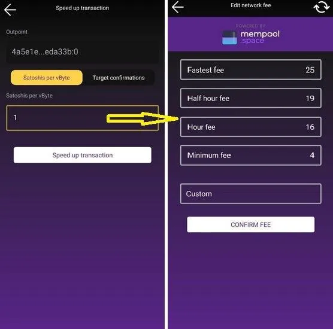

Sie müssen zu Ihrer anhängigen Meldung gehen und den txid-Ausgangspunkt kopieren. Gehen Sie dann zu diesem Abschnitt und fügen Sie ihn ein. Wählen Sie dann die neue Gebühr aus, die Sie verwenden möchten, um sie zu erhöhen. Es wird ein neuer Bildschirm mit empfohlenen Gebühren angezeigt, oder Sie können eine eigene Gebühr festlegen. Denken Sie daran, dass die Gebühr höher sein MUSS als die vorherige Gebühr.

Es ist immer besser, einen UTXO mit einem maximal 100k Sats in Ihrem Zeus onchain Wallet zu halten, um ihn bei Bedarf zum Bump von Gebühren verwenden zu können.

- _Signieren oder verifizieren_ - Mit dieser Funktion können Sie eine bestimmte Nachricht mit Ihren Wallet-Schlüsseln signieren. Sie können auch eine Nachricht verifizieren, um zu beweisen, dass sie von einem bestimmten Wallet-Schlüssel stammt.
- _Währungsumrechner_ - ein einfaches Tool zur Berechnung des Umrechnungskurses zwischen BTC und anderen Fiat-Währungen.

**J - Merch und Support**

Hier finden Sie weitere Informationen und Links zu Zeus, Online-Shop, Sponsoren, Social Media.

**K - Hilfe*

In diesem letzten Abschnitt finden Sie Links zur Zeus-Dokumentationsseite, zu Github-Themen (wenn Sie einen Fehler oder eine Anfrage direkt an die App-Entwickler senden möchten) und zum E-Mail-Support.

### SCHRITT 2 - BEGINN DER NUTZUNG VON ZEUS NODE

Denken Sie daran, Zeus ist hauptsächlich als LN Wallet, für einfache und schnelle Zahlungen über LN verwendet werden. Sicher, es enthält auch eine onchain Wallet, aber das sollte man ausschließlich für das Öffnen / Schließen LN Kanäle und nicht für regelmäßige Zahlungen von einem Kaffee verwendet werden.

Bitte lesen Sie meinen anderen Leitfaden über [wie Sie mit den 3 Ebenen von Stash Ihre eigene Bank werden] (https://darth-coin.github.io/beginner/be-your-own-bank-en.html).

In diesem Moment hat der Benutzer 2 Möglichkeiten, Zeus zu benutzen:

- Sofort über LN, unter Verwendung des 0-conf-Kanals von Olympus LSP
- Hinterlegen Sie zunächst in der Onchain Wallet und eröffnen Sie dann einen normalen LN-Kanal mit dem gewünschten Peer.

#### Methode A - Verwendung des Olympus LSP

Dies ist ein sehr einfacher und unkomplizierter Weg, um einen neuen LN-Benutzer in Zeus einzubinden. Dabei kann es sich um einen völlig neuen Bitcoin-Benutzer handeln, der keinerlei Sats-Kenntnisse hat, oder um einen neuen Händler, der mit seiner ersten LN-Zahlung beginnt.

Standardmäßig verwendet Zeus seinen eigenen LSP, Olympus. Später können Sie aber auch zu anderen LSPs wechseln, die dieses 0-conf-Protokoll unterstützen, um Kanäle zu öffnen.

Wenn Sie einfach einen Invoice auf Ihrem Zeus erstellen (geben Sie den Betrag ein und klicken Sie auf die Schaltfläche "Anfordern"), können Sie diese Sats sofort erhalten.

Die Invoice, die Sie generate, werden [verpackt] (https://docs.zeusln.app/lsp/wrapped-invoices) und Ihnen werden die mit dem Dienst verbundenen Gebühren angezeigt, wenn sie bezahlt sind. Diese verpackten Invoice enthalten Routenhinweise zu Ihrem Zeus-Knoten, so dass der LSP Ihren neuen Knoten finden und einen Kanal mit den neuen Mitteln, die Sie einzahlen, öffnen kann.

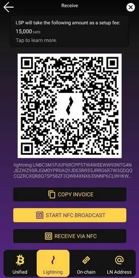

Um einen LN-Kanal vom LSP mit den Geldern zu erhalten, die Sie 1. Mal erhalten möchten, muss dieser Invoice von einem anderen LN Wallet bezahlt werden und einige Momente warten, bis der LSP den Kanal zu Ihrem Zeus-Knoten öffnet, die Gebühr abzieht und den Restbetrag der Zahlung auf Ihre Seite des Kanals schiebt.

Alles, was Sie tun müssen, ist den Invoice, der für Sie in ZEUS generiert wurde, mit einem weiteren Blitz-Wallet zu bezahlen, und Ihr Kanal wird sofort geöffnet. [Bitte konsultieren Sie die Zeus LSP-Gebühren] (https://docs.zeusln.app/lsp/fees).

Ein weiterer Vorteil der Zahlung für einen Kanal ist das gebührenfreie Routing. Das bedeutet, dass bei der Weiterleitung von Zahlungen für den ersten Schritt über OLYMPUS by ZEUS keine Weiterleitungsgebühren anfallen. Bitte beachten Sie, dass bei Weiterleitungen über OLYMPUS by ZEUS hinaus weiterhin Gebühren anfallen.

Sobald der Kanal fertig ist, klicken Sie auf die rechte Schaltfläche am unteren Rand des Bildschirms, die die Zeus-Kanäle anzeigt.

Sie sehen dann einen Kanal wie diesen, der Ihre Seite der Kanalbalance anzeigt:

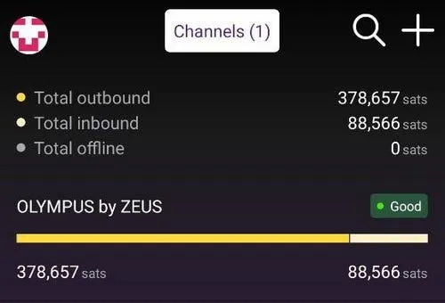

Je mehr Sie in diesem Kanal ausgeben, desto mehr eingehende Liquidität werden Sie haben. Je mehr Sats Sie in diesem Kanal erhalten, desto weniger Liquidität steht Ihnen zur Verfügung.

Hier ist eine schöne einfache visuelle Demonstration (von Rene Pickhardt) über die Funktionsweise der LN-Kanäle:

Klicken Sie auf den Namen des Kanals und Sie erhalten weitere Informationen über ihn.

Sie haben einen einzigen Kanal mit Olympus, mit einer Gesamtkapazität von 490 000 Sats, mit einem Rest von 378k Sats auf Ihrer Seite und 88k Sats auf der Seite von Olympus. Das bedeutet, dass Sie maximal 88k Sats mehr im selben Kanal empfangen könnten.

Wenn Sie mehr als 88k Sats (die verfügbare eingehende Liquidität in diesem Fall) erhalten müssen, sagen wir weitere 500k Sats, indem Sie einfach einen neuen LN Invoice mit dieser Menge erstellen, wird eine neue Kanalanfrage an den Olympus LSP ausgelöst. Sie erhalten also einen zweiten Kanal.

Um zu vermeiden, dass Sie mehr Gebühren für die Eröffnung mehrerer Kanäle zahlen müssen, empfiehlt es sich daher, zunächst einen größeren Kanal zu eröffnen, sagen wir 1-2 Mio. Sats. Sobald er geöffnet ist, können Sie einen Teil dieser Sats, sagen wir 50 %, auf die Onchain auslagern, indem Sie einen der in diesem Leitfaden beschriebenen externen Swap-Dienste nutzen.

Sobald Sie aus diesem Kanal, sagen wir 50%, aussteigen und den Sats in Ihren eigenen Zeus onchain Wallet zurückholen, können Sie zur nächsten Methode übergehen, um einen neuen Kanal zu öffnen - aus der Onchain-Balance.

#### Methode B - Verwendung Ihres Onchain-Guthabens

Mit dieser Methode können Sie Kanäle zu jedem anderen LN-Knoten öffnen, einschließlich dem gleichen Olympus LSP. Aber wenn Sie bereits einen Kanal mit Olympus haben, wird empfohlen, auch mit einem anderen Knoten zu haben, für mehr Zuverlässigkeit und könnte auch MPP (mehrteilige Zahlung) verwenden.

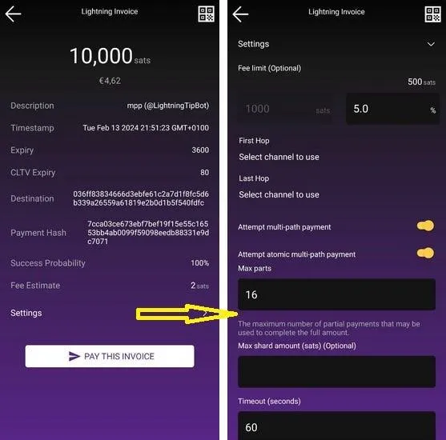

Oben sehen Sie ein Beispiel für die Bezahlung eines LN Invoice mit MPP. Wie Sie am unteren Rand des Bildschirms sehen können, haben Sie die Möglichkeit, "Einstellungen" zu wählen, und es öffnet sich eine Dropdown-Seite mit weiteren Details für die Zahlung, die Sie vornehmen möchten. Auf diesem Bildschirm ist die MPP-Funktion standardmäßig aktiviert, wenn Sie mindestens 2 Kanäle geöffnet haben. Sie können auch AMP (atomarer Mehrweg) aktivieren und bestimmte Teile einstellen. Dies ist eine leistungsstarke Funktion!

Für einen privaten Knoten wie Zeus würde ich empfehlen, 2-3 gute Kanäle (max. 4-5) zu haben, mit guten LSPs und guter Liquidität, um alle Ihre Bedürfnisse zu decken, um Sats über LN zu bezahlen oder zu empfangen. [Weitere Hinweise zur LN-Knotenliquidität finden Sie in diesem Leitfaden](/nodes/managing-lightning-node-liquidity-de.html). Auch hier ein weiterer [allgemeiner Leitfaden über LN-Liquidität](https://Bitcoin.design/guide/how-it-works/liquidity/) vom Bitcoin-Designteam.

Ich weiß, dass die Auswahl der richtigen Peers keine leichte Aufgabe ist, selbst für erfahrene Benutzer. (https://github.com/ZeusLN/zeus/discussions/2265), dies sind Peer-Knoten, die ich selbst mit Zeus getestet habe (ich habe versucht, nur mit LND-Knoten zu verbinden, um Inkompatibilitätsprobleme zu vermeiden)

Hier gibt es auch eine Liste von verbürgten Node-Peers für Zeus. Wenn Sie gute kennen, können Sie sie gerne zu dieser Liste hinzufügen.

Sie können einen Kanal in Zeus öffnen, indem Sie die Ansicht Kanäle aufrufen, indem Sie auf das Kanalsymbol in der unteren rechten Ecke der Hauptansicht klicken und dann auf das +-Symbol in der oberen rechten Ecke klicken.

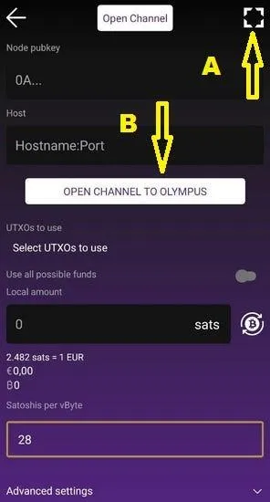

Wenn Sie einen Kanal mit einem bestimmten Knoten öffnen möchten, klicken Sie auf (A) in der oberen Ecke, um die QR-NodeID des Knotens zu scannen (bei Mempool, Amboss und 1ML können Sie diese QR-Nummer erhalten).

ERINNERUNG:

- Eingebettete Zeus-Knoten verwenden keinen Tor-Dienst! Versuchen Sie also bitte nicht, Kanäle mit Nodes zu öffnen, die unter Tor laufen! Sie schaden sich selbst mehr, als dass Sie Ihre Privatsphäre verbessern. Tor für LN bietet nicht mehr Privatsphäre, sondern bringt mehr Ärger.
- wählen Sie Ihre Peers mit Bedacht aus, am besten gute LSPs, gute Routing-Knoten, keine zufälligen Pleb-Knoten, die Ihre Kanäle schließen und keine gute Liquidität bieten könnten. [Hier habe ich einen speziellen Leitfaden](https://darth-coin.github.io/nodes/managing-lightning-node-liquidity-en.html) über Liquidität und Beispiele von Knoten geschrieben.

Wenn Sie direkt auf die Schaltfläche "Kanal zu Olympus öffnen" klicken, werden die erforderlichen Felder ausgefüllt, um einen Kanal zu [OLYMPUS by ZEUS] (https://Mempool.space/lightning/node/031b301307574bbe9b9ac7b79cbe1700e31e544513eae0b5d7497483083f99e581) zu öffnen.

Im Gegensatz zu bezahlten LSP-Kanälen erfordert Ihr Kanal eine On-Chain-Bestätigung unter Verwendung Ihrer Onchain-Gelder (Sie können aus Ihren UTXOs in der Ansicht "Offener Kanal" auswählen); er wird nicht sofort geöffnet. Bitte konsultieren Sie zunächst die aktuellen Mempool-Gebühren und passen Sie diese entsprechend an, je nachdem, wie schnell Sie den Kanal öffnen möchten.

Bevor Sie auf die Schaltfläche zum Öffnen des Kanals klicken, schieben Sie die erweiterten Optionen nach unten:

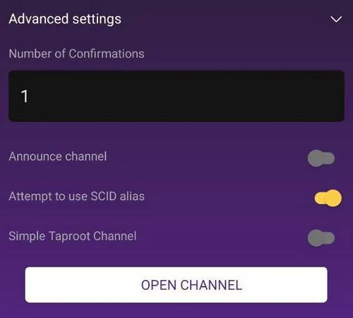

Sie müssen auch sicherstellen, dass der Kanal unangekündigt (privat) ist. Standardmäßig ist die Option für angekündigte Kanäle ausgeschaltet. Es wird nicht empfohlen, diese Option für den eingebetteten Zeus-Knoten zu aktivieren. Sie ist nur dann nützlich, wenn Sie Zeus mit Ihrem Remote-Knoten als öffentlichen Routing-Knoten verwenden.

Im Gegensatz zu kostenpflichtigen LSP-Kanälen profitieren Sie bei dieser Methode nicht von der gebührenfreien Weiterleitung der Kanäle.

Und fertig, klicken Sie einfach auf die Schaltfläche "Open Channel", warten Sie auf die tx von den Bergleuten bestätigt werden. Sobald der Kanal geöffnet ist, können Sie nach Belieben mit dem Sats aus Ihren Kanälen handeln.

Denken Sie daran, dass diese Kanäle das gesamte Guthaben auf IHRER Seite haben werden, so dass Sie keine eingehende Liquidität haben werden. Wie ich bereits sagte, tauschen Sie aus oder geben Sie einige Sats aus, um über LN "mehr Platz" für den Empfang zu schaffen.

Stellen Sie sich Ihre LN-Kanäle wie ein Glas Wasser vor. Sie gießen etwas Wasser (Sats) in ein leeres Glas (Ihren Kanal), bis Sie es voll haben. Sie können kein weiteres Wasser einfüllen, bis Sie es getrunken haben (ausgeben/auswechseln). Wenn das Glas fast leer ist, gießen Sie mehr Wasser (Sats) in das Glas, indem Sie einen Swap-In benutzen. [Lesen Sie hier mehr über externe Swap-Dienste] (https://darth-coin.github.io/nodes/lightning-submarine-swaps-en.html).

Es gibt auch andere LSP-Dienste, die Ihnen Inbound-Kanäle verkaufen: LNBig oder Bitrefill. Ich denke, es gibt mehr Dienste wie diese, aber ich kann mich nicht erinnern, sie gerade jetzt.

Wenn Sie also praktisch einen leeren LN-Kanal benötigen (das Guthaben liegt von Anfang an zu 100 % auf der Peer-Seite), um mehr Zahlungen zu erhalten, als Sie über Ihre bestehenden, voll besetzten Kanäle abwickeln können, könnte dies eine sehr gute Option sein. Sie zahlen eine bestimmte Gebühr für die Eröffnung dieser Kanäle und erhalten viel Platz für eingehende Zahlungen.

## TIPPS UND TRICKS

### Obergrenzen für eingehende Reserven

Im Moment ist es aufgrund einiger LN-Code-Einschränkungen nicht möglich, genau den Betrag zu erhalten, der in "Inbound" angezeigt wird. Denken Sie immer daran, dass Sie Ihre Rechnungen mit einem geringfügig niedrigeren Betrag bzw. dem Betrag der "Channel Local Reserve" erstellen sollten.

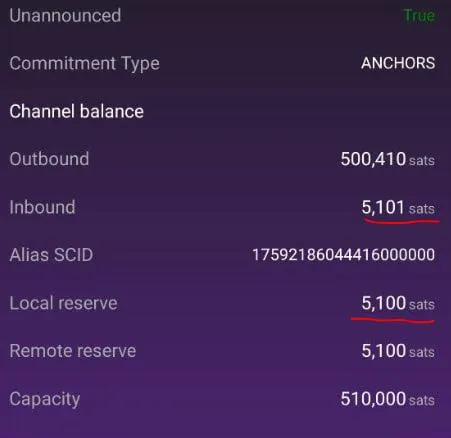

Wie Sie im obigen Bild sehen können, zeigt die "Inbound", dass ich noch 5101 Sats empfangen kann, aber in der Tat in diesem Moment ist unmöglich, mehr zu empfangen. Und Sie können beobachten, dass ist die gleiche Menge wie die "Lokale Reserve".

Denken Sie also daran, dass Sie bei der Erstellung von Eingangsrechnungen auch einen Blick auf die Liquidität Ihrer Kanäle werfen und die lokale Reserve von diesem Betrag abziehen sollten, wenn Sie den Forderungsbetrag bis an die Grenzen ausreizen wollen.

### Kurzer Rat für neue Benutzer, die mit Zeus node beginnen:

- Nutzen Sie Ihre neuen Kanäle richtig.

Wenn Sie beispielsweise wissen, dass Sie in einer Woche, sagen wir, 1 Mio. Sats erhalten werden, eröffnen Sie einen Kanal für 2 Mio. Sats und tauschen Sie 50-60 % Ihrer ausgehenden Liquidität in ein Onchain-Konto Wallet oder in ein anderes (vorübergehendes) Depot LN aus. Halten Sie immer mehr Liquidität bereit. Sobald Sie mehr Liquidität in Ihren Zeus-Kanälen benötigen, können Sie diese von den Depotkonten zurückschieben.

Wenn Sie wissen, dass Sie, sagen wir, 500k Sats/Woche senden werden, dann eröffnen Sie einen 1M Sats-Kanal. Auf diese Weise haben Sie immer noch eine Reserve, bis Sie sie wieder auffüllen.

- Wenn Sie ein Händler sind und immer mehr einnehmen, als Sie regelmäßig ausgeben, sollten Sie einen speziellen Eingangskanal kaufen. Das ist der billigste Weg. Sie zahlen eine minimale Gebühr und erhalten einen "leeren" Kanal.

- Öffnen Sie keine kleinen, bedeutungslosen Kanäle von 50-100-300-500k Sats. Sie werden sie in wenigen Tagen füllen, selbst wenn Sie sie nur für Zaps verwenden. Öffnen Sie größere und verschiedene Kanäle, NICHT nur einen Kanal.

Sobald Sie einen größeren Kanal geöffnet haben, können Sie jederzeit externe U-Boot-Swaps verwenden, um Sats in Ihre Onchain-Wallets zu verschieben (auch zurück zu Zeus Onchain). Es ist gut, ein Gleichgewicht zwischen In- und Out-Liquidität zu halten, und Sie können diese Sats auch "wiederverwenden", um weitere Kanäle zu öffnen, wenn Sie möchten.

### Eingewickelt Invoice

Wenn Sie beim Empfang mehr Privatsphäre wünschen, können Sie die Methode "Wrapped Invoice" verwenden. Zur Erinnerung: Um dies tun zu können, benötigen Sie einen Kanal mit Olympus LSP. Bei verpackten Rechnungen wird das endgültige Ziel (Ihr Zeus-Knoten) "versteckt" und Ihr LSP-Knoten als Ziel für den Zahler angezeigt.

Um ein verpacktes Invoice zu erhalten, gehen Sie zum Hauptbildschirm der Tastatur, geben Sie den Betrag ein und drücken Sie auf Anfordern. Es wird ein normaler QR-Code für Ihr Invoice angezeigt. Klicken Sie nun auf die Schaltfläche "X" oben rechts und Sie werden zu weiteren Optionen für das Invoice weitergeleitet.

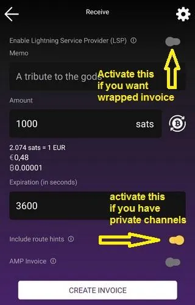

Jetzt müssen Sie die Option "LSP aktivieren" aktivieren und auf die Schaltfläche "Invoice erstellen" klicken. Mit dieser Option wird der umhüllte Invoice erstellt, und vergessen Sie nicht, dass dafür eine kleine Gebühr anfällt.

### Rechnungen mit Routenhinweisen

Dies ist eine sehr nützliche Funktion, wenn Sie mehrere Eingangskanäle liquide verwalten wollen. Praktischerweise können Sie angeben, auf welchem Eingangskanal Sie das Sats von einem Invoice empfangen möchten.

Diese Funktion kann auch für ein zirkuläres Rebalancing verwendet werden, wenn Sie Liquidität von einem gefüllten Kanal in einen anderen, der erschöpft ist, verschieben möchten.

Wie erstellt man einen Invoice mit Routenhinweisen?

- Schieben Sie auf dem Hauptbildschirm die Schublade LN nach rechts und klicken Sie auf "Empfangen"
- Im Invoice Setup gehen Sie zum unteren Teil und aktivieren den Button "Insert route hints", dann wählen Sie den Reiter "Custom". Es öffnet sich ein Fenster mit allen verfügbaren Kanälen. Wählen Sie den Kanal aus, den Sie empfangen möchten.
- Füllen Sie alle weiteren Angaben zum Invoice aus (Betrag, Vermerk usw.) und klicken Sie auf "Invoice erstellen".
- Durch die Zahlung dieses Invoice wird der Sats in den angegebenen Kanal gebracht.

Wenn Sie die Invoice an sich selbst zahlen möchten (zirkuläres Rebalancing), wählen Sie bei der Zahlung über denselben Zeus-Knoten den Ausgangskanal (einen mit mehr Liquidität), den Sie für die Zahlung verwenden möchten.

### Bezahlen mit Keysend

Keysend ist eine sehr unterschätzte LN-Funktion, und die Benutzer sollten sie häufiger nutzen.

[Keysend] (https://docs.lightning.engineering/lightning-network-tools/LND/send-messages-with-keysend) ermöglicht es Nutzern im Lightning Network, Zahlungen an andere zu senden, direkt an ihren öffentlichen Schlüssel, sofern ihr Knoten über öffentliche Kanäle verfügt und Keysend aktiviert ist. Keysend erfordert nicht, dass der Zahlungsempfänger einen Invoice ausstellt.

Und wie kann man das mit Zeus machen?

Scannen oder kopieren Sie einfach die NodeID des Zielknotens (oder verwenden Sie Zeus-Kontakte, um Ihre regulären Zielknoten als Kontakte zu speichern) und klicken Sie dann im Hauptbildschirm von Zeus auf die Schaltfläche "Senden". Fügen Sie in diesem Bildschirm die NodeID ein oder wählen Sie sie aus Ihren Kontakten aus.

Geben Sie den Betrag von Sats ein, ggf. eine Nachricht (ja, Sie können es auch als geheimen Chat über LN verwenden) und klicken Sie auf die Schaltfläche "Senden". Erledigt!

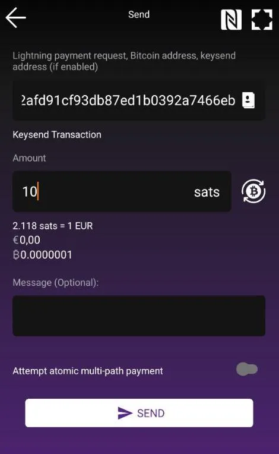

Wenn Sie einen direkten Kanal mit dem Ziel-Peer haben, fallen KEINE Gebühren an.

Wenn Sie keinen direkten Kanal mit dem Ziel-Peer haben, dann wird die Keysend-Zahlung die Gebühren wie eine normale LN Invoice-Zahlung zahlen, die auf einem regulären Weg wie jede andere Zahlung geleitet wird. Nur dass sie nicht als LN Invoice zurückverfolgt werden kann.

## Konklusion

Ich empfehle die Lektüre des Leitfadens [Advanced usage of Zeus] (https://darth-coin.github.io/wallets/zeus-node-advanced-usage-en.html) mit weiteren Anweisungen und Anwendungsfällen.

Und... das war's! Von nun an verwenden Sie Zeus Node einfach als reguläres BTC/LN Wallet auf Ihrem Handy. Die UI ist ziemlich geradlinig und einfach zu bedienen, intuitiv für jede Art von Benutzer, ich glaube nicht, dass ich in mehr Details darüber, wie zu machen und erhalten Zahlungen eingeben müssen.

Abschließend finden Sie hier eine Vergleichstabelle zum Datenschutz:

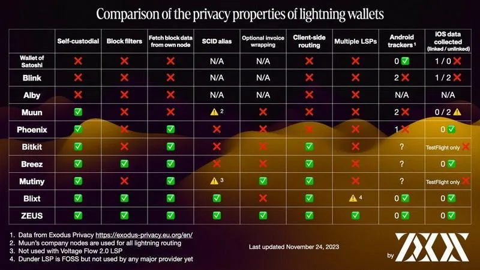